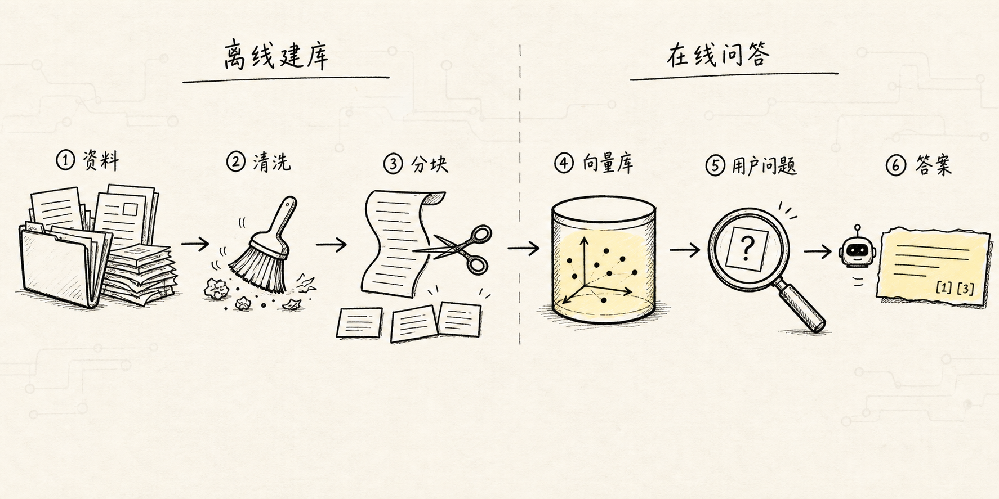
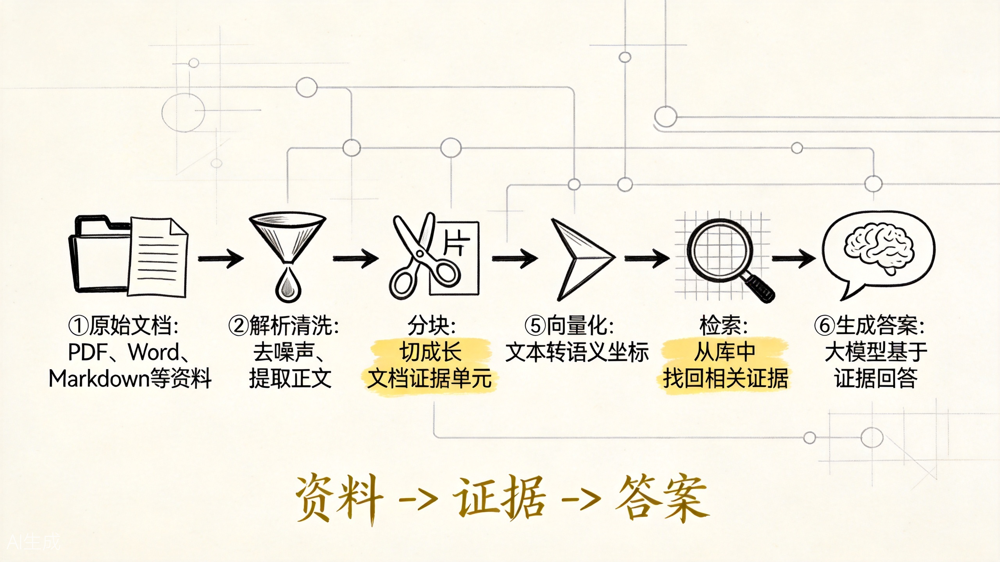
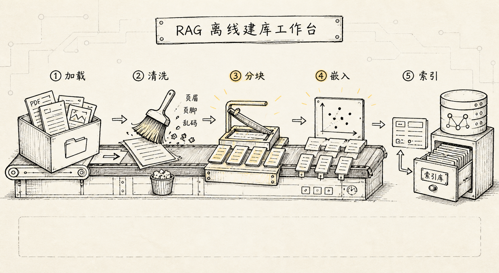
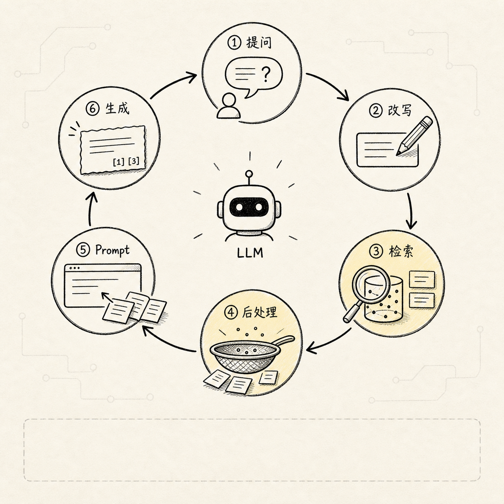
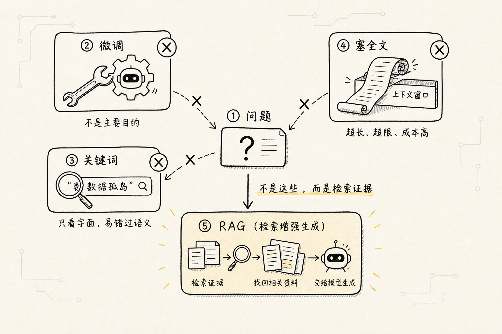

# RAG 的整体流程：从资料到答案，一条链路讲清楚

很多人第一次听到 RAG，会很容易把它理解成一句话：

> 先搜索，再让大模型回答。

这句话不能说错，但它太短了，短到会漏掉真正关键的工程细节。

因为一个可用的 RAG 系统，并不是用户提问时才临时去搜一下资料。它通常要先把一堆原始文档处理成“机器能检索的知识库”，然后在用户提问时，从这个知识库里找出相关内容，再把这些内容和问题一起交给大模型生成答案。

所以这篇文章不急着给 RAG 下定义，而是先回答一个更朴素的问题：

**如果我想让大模型回答公司内部知识库的问题，它到底要经过哪些步骤？**

为了让整篇文章更好懂，我们固定一个例子：

```text
公司有很多内部文档：新人手册、故障复盘、Redis 缓存规范、项目 README。

现在用户问：

“Redis 缓存雪崩在我们公司一般怎么处理？”
```

普通大模型没有看过你公司的内部文档。哪怕它知道“缓存雪崩”这个通用概念，也不知道“你们公司”具体怎么处理。

RAG 要解决的，就是这个问题：

**让模型在回答前，先拿到和问题相关的外部资料。**

## 一、RAG 为什么会出现

大语言模型本身有两类典型问题。

第一类是知识过期。模型训练完成以后，它内部的知识基本就固定了。你的公司昨天刚更新了一份故障处理规范，模型不可能天然知道。

第二类是知识不在模型里。公司内部文档、私有数据库、业务流程、项目代码，这些内容通常不会出现在公开训练数据中。模型就算很聪明，也不能凭空知道。

这时有两种常见思路：

- 重新训练或微调模型，让它把这些知识“学进去”
- 不改模型本身，而是在回答前把相关资料“拿给它看”

RAG 选择的是第二条路。

它的思路更像开卷考试：

**模型不需要把所有资料背下来，但回答问题前，系统要帮它翻到相关页。**

这就是 RAG 的核心：`Retrieval-Augmented Generation`，也就是“检索增强生成”。

- `Retrieval`：先从外部知识库里检索相关资料
- `Augmented`：把这些资料补进模型的上下文
- `Generation`：再让模型基于资料生成回答

注意，这里的重点不是“搜索”本身，而是：

**搜索出来的内容，能不能被正确放进模型的回答链路里。**

## 二、先看一眼完整链路



一个基础 RAG 系统通常可以拆成两条链路。

第一条是离线链路，也叫知识库构建链路：

```text
原始资料
-> 数据加载
-> 文本清洗
-> 文本分块
-> 向量嵌入
-> 写入向量数据库 / 索引
```

第二条是在线链路，也叫问答链路：

```text
用户问题
-> 问题向量化
-> 检索相关文本块
-> 排序 / 过滤 / 重排
-> 拼接 Prompt
-> 大模型生成答案
-> 返回结果
```

整理成流程图，大概是这样：



你可以把它想成图书馆系统。



这张图的重点不是步骤多，而是 RAG 分成了两类工作：先把资料整理成可检索的知识库，再在用户提问时把证据找回来交给模型。分块和检索是整条链路上最容易出问题的地方：切错了边界，后续检索就找不到完整证据；检索跑偏了，模型只能基于错误材料编答案。

离线链路是在做“建馆”：把书买回来、拆目录、贴标签、放到书架上。

在线链路是在做“查书”：用户问问题，系统先找到相关书页，再让一个会写总结的人根据这些书页组织答案。

如果只看在线问答，很容易误以为 RAG 的难点在“怎么问模型”。但真实工程里，前面的数据处理、分块、索引、检索质量，往往更决定最终效果。

因为 RAG 有一个很朴素的规律：

**找不到对的资料，再强的模型也只能编；找到了错的资料，模型还会编得更像真的。**

## 三、第一步：数据加载，把资料拿进系统



RAG 的第一步不是向量化，也不是调用大模型，而是数据加载。

也就是先回答一个问题：

**你的知识到底从哪里来？**

在公司知识库的例子里，资料可能来自很多地方：

- Markdown 文档
- PDF 文件
- Word 文档
- Notion 页面
- 飞书文档
- 数据库记录
- Git 仓库里的 README 和源码注释

这些东西在人眼里都是“文档”，但在程序眼里格式完全不同。PDF 有分页，Word 有标题层级，网页有 HTML 标签，Markdown 有代码块和列表。

所以数据加载要做的事情，是把这些不同来源的资料读出来，并尽量保留有用结构。

比如一篇故障复盘文档里，标题、时间、负责人、原因分析、解决方案都很重要。如果加载时把它们搅成一坨纯文本，后面检索时就会更难定位。

这里有一句很重要的话：

**RAG 不是从“知识”开始的，而是从“脏乱的资料”开始的。**

如果数据加载阶段就丢了结构、读错了内容、混进了大量噪声，后面的模型再强也很难补回来。

这也是为什么很多 RAG 项目做不好，不是因为模型不够强，而是因为一开始喂进去的资料质量就不行。

## 四、第二步：文本清洗，把噪声先去掉

资料加载进来以后，通常还不能直接用。

真实文档里会有很多对回答没帮助，甚至会干扰检索的东西：

- 页眉页脚
- 重复导航
- 广告和版权声明
- 多余空行
- 表格解析错误
- OCR 识别错误
- 乱码
- 和正文无关的菜单文本

这些内容如果直接进入知识库，会带来两个问题。

第一，浪费空间。向量数据库和索引里存了大量无用文本，检索成本变高。

第二，污染结果。用户明明问“缓存雪崩怎么处理”，系统却可能召回一堆目录、页脚、无关说明。

所以文本清洗的目标不是把文章改漂亮，而是让后面的检索更可靠。

它通常会做这些事：

- 删除明显无关的重复内容
- 统一空格、换行和标点
- 修正解析错误
- 保留标题、段落、列表、代码块等结构
- 给文档补充来源、时间、路径等元数据

这里的元数据很重要。

比如同样一句“缓存雪崩处理方案”，如果它来自 2022 年的旧文档，和来自 2026 年的生产规范，可信度就不一样。后面检索和生成时，系统可以利用这些元数据做过滤、排序和引用。

## 五、第三步：文本分块，把长文档切成可检索单元

清洗完以后，下一步是文本分块。

为什么要分块？

因为大模型和检索系统都不适合直接处理一整本书、一整份规范或一个超长页面。

如果你把一份 100 页的 Redis 运维手册整个塞进向量模型，它会遇到几个问题：

- 内容太长，超过模型输入限制
- 不同主题混在一起，语义被稀释
- 用户只问一个小问题，却召回整篇大文档
- 生成答案时，大模型很难在一大段上下文里抓住关键句

所以 RAG 会把长文档切成一个个较小的文本块。

比如原始文档是：

```text
Redis 运维规范
├── 缓存穿透
├── 缓存击穿
├── 缓存雪崩
│   ├── 现象
│   ├── 原因
│   └── 处理方案
└── 大 Key 治理
```

分块以后，系统可能会得到：

```text
块 1：缓存穿透的定义和处理方式
块 2：缓存击穿的定义和处理方式
块 3：缓存雪崩的现象
块 4：缓存雪崩的原因
块 5：缓存雪崩的处理方案
块 6：大 Key 治理规范
```

这样用户问“缓存雪崩怎么处理”时，系统就更容易召回块 5，而不是把整份 Redis 运维规范都拿出来。

分块不是越小越好，也不是越大越好。

块太小，容易丢上下文。比如只保留一句“设置随机过期时间”，但不知道它是在讲缓存雪崩，模型就可能理解不完整。

块太大，主题又容易混杂。一个块里同时讲缓存穿透、击穿、雪崩，向量表示会变得不够精准。

所以分块的本质是在做平衡：

**既要小到方便检索，又要大到保留完整语义。**

## 六、第四步：向量嵌入，把文字变成可计算的语义坐标

文本块切好以后，系统还不能直接用普通字符串去做语义搜索。

因为用户问的方式和文档写法可能完全不同。

用户可能问：

```text
Redis 大面积失效时怎么兜底？
```

文档里写的却是：

```text
缓存雪崩场景下，应通过随机过期时间、限流、降级和多级缓存降低系统压力。
```

这两句话没有多少相同关键词，但语义上高度相关。

这时就需要向量嵌入，也就是 Embedding。

Embedding 会把一段文本转换成一串数字向量。你可以把它理解成：

**把文字放进一个语义空间里，意思相近的文本，在空间里的位置也更接近。**

于是：

- “缓存雪崩怎么处理”
- “Redis 大面积失效时怎么兜底”
- “缓存同时过期导致数据库压力暴涨怎么办”

这些表达虽然字面不同，但向量位置可能比较接近。

RAG 正是利用这一点来做语义检索。

离线阶段，系统会把每个文本块都转成向量。

在线阶段，用户的问题也会被转成向量。

然后系统比较“问题向量”和“文本块向量”的距离，找出最相似的那些块。

这一步解决的是：

**不要求用户和文档使用完全一样的词，也能找到意思相近的资料。**

## 七、第五步：写入索引，让系统能快速找回来

如果只有几十个文本块，直接挨个比较也没问题。

但真实系统里的文本块可能是几十万、几百万，甚至更多。每次用户提问都全量扫描一遍，成本会非常高。

所以向量生成以后，通常要写入向量数据库或向量索引。

向量数据库负责几件事：

- 存储文本块和对应向量
- 保存文档来源、标题、时间等元数据
- 支持快速相似度搜索
- 支持按条件过滤，比如只查某个项目、某个时间范围、某类文档

这一步可以理解成给知识库建“语义书架”。

不是按字母排序，也不是按目录排序，而是按语义位置组织起来。用户一问，系统就能快速找到附近的文本块。

到这里，离线链路基本完成：

```text
资料已经读入
-> 清洗过
-> 切成块
-> 转成向量
-> 放进索引
```

接下来才进入用户真正感知到的问答阶段。

## 八、第六步：用户提问，把问题也变成检索条件



当用户问：

```text
Redis 缓存雪崩在我们公司一般怎么处理？
```

系统不会马上把这个问题交给大模型。

它会先把问题也送进 Embedding 模型，得到一个问题向量。

然后拿这个问题向量去向量数据库里查：

```text
哪些文本块和这个问题在语义上最接近？
```

这一步会得到一批候选结果，比如：

```text
候选 1：缓存雪崩处理方案
候选 2：Redis 故障降级预案
候选 3：缓存过期时间设置规范
候选 4：数据库限流与熔断策略
候选 5：缓存穿透处理方式
```

注意，这些结果只是“可能相关”，还不一定都适合直接给模型。

比如候选 5 讲的是缓存穿透，不是缓存雪崩。它和 Redis、缓存、故障处理有关，但不一定是本次问题最需要的内容。

所以检索之后，通常还会进入排序、过滤或重排。

## 九、第七步：检索后处理，把“可能相关”变成“适合回答”

基础向量检索只能解决一部分问题。

它擅长找语义相近的内容，但不总是能判断：

- 哪个结果最权威
- 哪个结果最新
- 哪个结果和问题最直接相关
- 多个结果之间有没有重复
- 结果是否覆盖了回答所需的不同方面

所以生产级 RAG 往往会在检索之后加一层后处理。

常见做法包括：

- `过滤`：只保留指定项目、指定文档类型或指定时间范围内的内容
- `重排`：用更精细的模型重新判断候选结果和问题的相关性
- `去重`：去掉内容高度重复的文本块
- `压缩`：从长文本块里提取真正和问题有关的句子
- `混合检索`：把关键词检索和向量检索结合起来

为什么还需要关键词检索？

因为向量检索擅长语义相似，但有时会漏掉精确词。

比如用户问某个错误码、函数名、配置项、工单编号，关键词匹配可能比语义检索更可靠。

所以很多 RAG 系统会同时使用两种方式：

- 用关键词检索抓住精确匹配
- 用向量检索抓住语义相近
- 再把两边结果融合排序

这一步的目标是：

**不是把“搜到的一切”都塞给模型，而是挑出最值得参考的材料。**

## 十、第八步：拼接 Prompt，把资料交给大模型

当系统筛出相关文本块以后，才会真正构造给大模型的输入。

这个输入通常包括几部分：

```text
系统角色：
你是一个公司内部知识库助手，请优先基于给定资料回答。

用户问题：
Redis 缓存雪崩在我们公司一般怎么处理？

参考资料：
资料 1：缓存雪崩处理方案……
资料 2：Redis 故障降级预案……
资料 3：缓存过期时间设置规范……

回答要求：
如果资料中没有答案，请说明无法从资料判断，不要编造。
请用适合新人理解的方式回答。
```

这一步非常关键。

因为 RAG 不是把检索结果随便丢给模型，而是要通过 Prompt 告诉模型：

- 哪部分是用户问题
- 哪部分是参考资料
- 回答时应该优先相信什么
- 资料不足时应该怎么处理
- 输出格式应该是什么样

你可以把它理解成给模型发一份开卷考试卷：

```text
题目在这里。
参考资料在这里。
请根据参考资料作答。
不要写参考资料里没有的内容。
```

如果 Prompt 没写好，RAG 也可能出问题。

比如系统没有告诉模型“资料不足就说不知道”，模型可能会为了回答完整而继续编。

所以生成阶段不只是“调用一下 LLM”，还包括对模型行为的约束。

## 十一、第九步：生成答案，并尽量保留依据

大模型会基于用户问题和参考资料生成答案。

一个比较好的回答，不只是把资料复制出来，而是要完成几件事：

- 提炼资料里的关键结论
- 按用户问题重新组织语言
- 合并多个文本块里的信息
- 用适合读者的方式解释
- 在必要时给出引用或来源
- 在资料不足时明确说明边界

比如它可以回答：

```text
根据内部文档，公司处理 Redis 缓存雪崩通常会从四个方向入手：

1. 给缓存过期时间增加随机抖动，避免大量 Key 同时失效
2. 对热点接口增加限流和熔断，防止请求直接打满数据库
3. 准备降级策略，在缓存不可用时返回兜底结果
4. 对核心数据使用多级缓存，降低单点缓存失效的影响

如果是线上故障，文档建议先观察 Redis 命中率、数据库 QPS 和接口错误率，
再按故障等级决定是否开启降级。
```

这个答案之所以比普通模型直接回答更可靠，是因为它不是只依赖模型内部的模糊记忆，而是利用了外部知识库里的具体资料。

但这里也要注意一个边界：

**RAG 能降低幻觉，不等于彻底消灭幻觉。**

如果检索结果错了，模型可能基于错误资料回答。

如果检索结果不完整，模型可能漏掉关键点。

如果 Prompt 没有限制好，模型仍然可能补充资料里没有的内容。

所以一个完整 RAG 系统，后面还需要评估、监控、权限控制、反馈闭环等工程能力。

## 十二、把整体流程压缩成一张图

如果只记一张图，可以记下面这条链：

```text
离线建库：

文档
-> 加载
-> 清洗
-> 分块
-> 向量化
-> 建索引

在线问答：

问题
-> 问题向量化
-> 检索
-> 重排 / 过滤
-> 拼接上下文
-> 模型生成
-> 返回答案
```

再进一步压缩，可以记成四个动作：

```text
准备资料
-> 找到资料
-> 塞给模型
-> 基于资料回答
```

这四个动作看起来简单，但每一步都可能决定系统质量。

- 资料准备不好，后面会“垃圾进，垃圾出”
- 分块不合理，相关内容可能找不到
- Embedding 不合适，语义相似度会失真
- 检索策略太单一，可能漏掉关键词精确匹配
- Prompt 约束不清，模型可能继续乱编
- 缺少评估，就不知道系统到底哪里差

所以 RAG 不是一个单点技术，而是一条链路工程。

## 十三、初学者最容易误解的几个点



### 1. RAG 不是微调

微调是改模型参数，让模型把某种能力或风格学进去。

RAG 通常不改模型参数，而是在每次回答前动态取资料。

如果知识经常变化，比如公司文档、业务规则、产品说明，RAG 通常更灵活。

### 2. RAG 不是简单关键词搜索

关键词搜索只能找到字面匹配。

RAG 里的检索通常会用 Embedding 做语义匹配，也可能结合关键词搜索、重排模型和元数据过滤。

它的目标不是“搜到包含某个词的文档”，而是“找到足够支撑回答的证据”。

### 3. RAG 不是把所有资料都塞进上下文

模型上下文再长，也不应该什么都塞。

塞太多无关内容，会增加成本，也会干扰模型判断。

好的 RAG 系统要做的是挑选，而不是堆材料。

### 4. RAG 不保证答案一定正确

RAG 只是让模型有机会参考外部资料。

最终答案是否可靠，还取决于数据质量、检索质量、Prompt 设计、模型能力和评估机制。

所以生产环境里不能只看“能不能回答”，还要看：

- 回答是否基于资料
- 引用是否准确
- 资料缺失时是否会承认不知道
- 不同问题类型下召回是否稳定
- 线上反馈能不能反哺知识库

## 十四、这条链路后面会展开成哪些专题

理解整体流程以后，后面的 RAG 学习就不会散。

你可以把后续内容放回这条链里：

- `数据导入`：解决资料怎么进入系统
- `分块技术`：解决长文档怎么切成检索单元
- `向量嵌入与向量数据库`：解决语义怎么表示、怎么快速找回
- `检索前处理`：解决用户问题怎么改写、扩展、路由
- `索引优化`：解决知识库怎么组织得更适合检索
- `检索后处理`：解决候选结果怎么过滤、重排、压缩
- `GraphRAG`：解决复杂关系、多跳推理和实体关联问题

直白地说，RAG 的主线不是一堆孤立名词，而是围绕同一个问题不断补强：

**怎样让模型在正确的时间，看到正确的资料，并基于这些资料给出可靠答案。**

这也是为什么做 RAG 时，不要一上来就只盯着 Prompt 和模型。很多召回问题其实发生在更前面：PDF 被粗暴抽取、表格被拦腰切断、标题和正文分离、旧版本文档没有过滤。前面的资料和证据没整理好，后面的模型只是在替这些问题兜底。

## 十五、一句话总结

RAG 的整体流程可以用一句话记住：

**先把外部资料整理成可检索的知识库；用户提问时，先检索相关资料，再把资料和问题一起交给大模型生成答案。**

再口语一点：

**RAG 就是给大模型配了一个会翻资料的助手。**

模型负责理解和表达，检索系统负责找依据。

两者配合得好，大模型就不再只是凭记忆回答，而是能带着资料回答。
