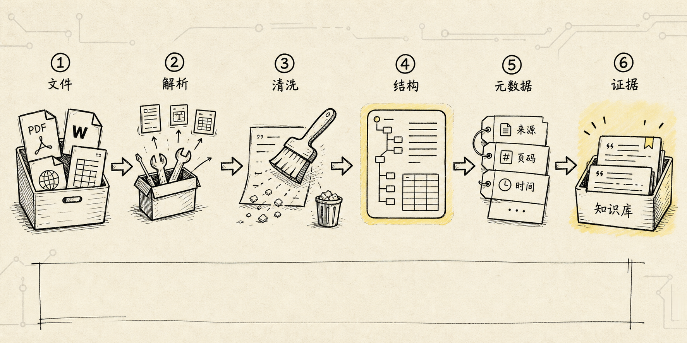
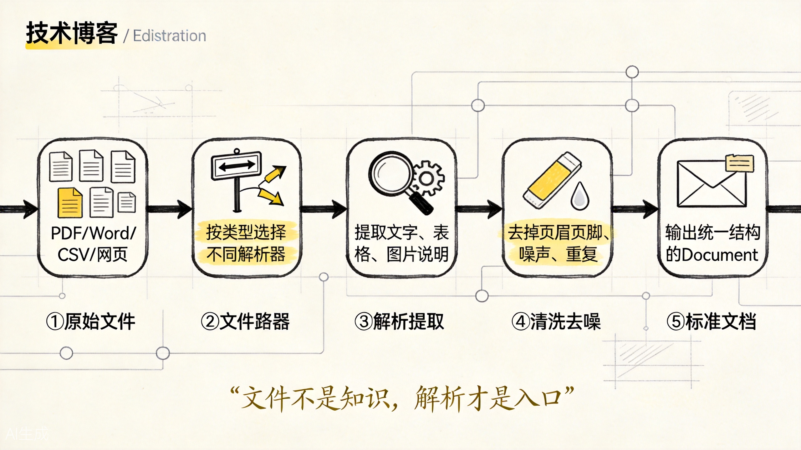
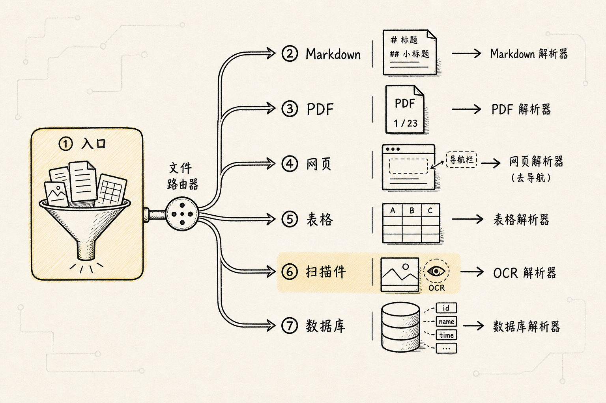
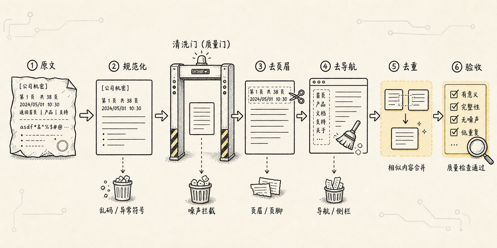
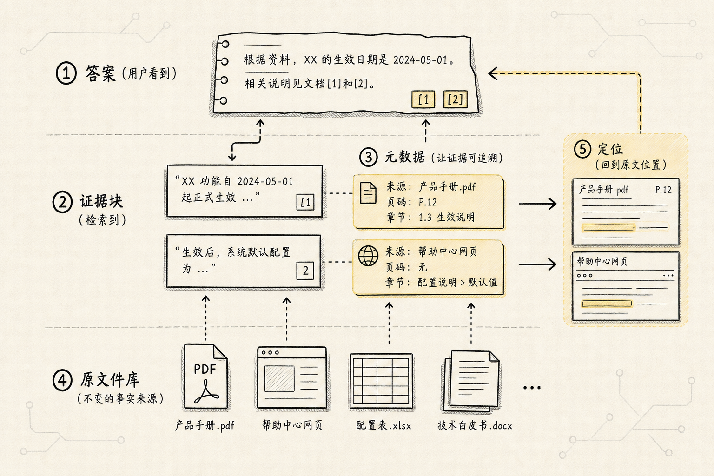

# RAG 数据导入：不是把文件上传进去，而是把证据整理出来

总览里已经说过，RAG 的第一步不是向量化，而是把外部资料拿进系统。这个动作看起来很简单：

> 我有一堆 PDF、Word、Markdown、CSV，把它们读出来，然后丢进向量数据库。

但这个理解只对了一半。

RAG 确实需要把外部资料放进知识库，但真正进入知识库的，不应该是“文件”本身，而应该是已经被整理好的、可以被检索、可以被引用、可以回到原文位置的证据。

如果导入阶段只是粗暴地抽出一大坨文本，后面分块、向量化、检索、重排、生成都会跟着变差。RAG 里常说的“垃圾进，垃圾出”，最先发生的地方就是数据导入。

为了把这个问题讲清楚，我们先固定一个贯穿例子：

```text
你要做一个公司内部制度问答助手。
资料来源包括：
- 员工手册 PDF
- 报销制度 Word
- 请假流程网页
- 差旅标准 CSV 表格
- 一些扫描版合同和图片说明
```

用户之后会问：

```text
我去上海出差，高铁二等座和酒店每天最多能报多少？
```

如果数据导入做得好，系统能找到差旅标准表格里的对应城市、交通、住宿字段，并告诉你答案来自哪份文件、哪一行、哪个版本。

如果数据导入做得不好，系统可能只看到一段混乱文本：

```text
上海 高铁 二等座 酒店 标准 500 元 交通 报销 ...
```

模型看似还能回答，但它已经失去了三个关键东西：结构、来源和边界。

这就是数据导入真正要解决的问题。

## 一、故事要从“文件不是知识”开始



在人的眼里，一份制度 PDF 很清楚。

你能看到标题、章节、表格、页码、脚注，知道哪一段是正文，哪一行是表格，哪一处是目录，哪几行只是页眉页脚。

但程序一开始并不知道这些。

对程序来说，PDF 可能只是一个版式容器；Word 可能有标题层级、表格和批注；网页里可能混着导航栏、广告和正文；CSV 看起来是文本，但它真正重要的是列名、行号、字段类型和单位。

所以 RAG 的第一步不是“把文件读出来”，而是把文件转换成一种后续系统能理解的标准形态。

可以把数据导入理解成 RAG 的入口安检：

```text
原始文件
-> 文档解析
-> 清洗噪声
-> 保留结构
-> 补充元数据
-> 输出统一 Document
-> 交给分块、向量化和索引
```

这里的 `Document` 不只是 `text`。

更准确地说，它至少应该包含：

- 内容：这一段真正要被检索的文字、表格或说明
- 元数据：来源文件、页码、行号、标题路径、时间、作者、权限、业务标签
- 结构：标题、段落、列表、表格、图片说明、上下文位置
- 边界：这段内容从哪里开始，到哪里结束，是否可以单独被切分

如果这些信息在导入阶段丢了，后面通常很难补回来。



这张图展示了数据导入的核心思想：不同文件走不同解析路径，最后收敛成统一的 Document。路由器和清洗是两个关键决策点：路由错了，扫描件用纯文本解析器读就是乱码；清洗过了，把脚注删了可能丢掉关键边界。



## 二、数据导入为什么会变成一个单独环节

最简单的 RAG demo 往往这样写：

```text
读取文件
-> 切成 chunk
-> embedding
-> 存入向量数据库
-> 查询时召回
```

这个流程看起来没有“数据导入”这个复杂环节，因为 demo 里的文件通常很干净：一篇 Markdown、一段纯文本、一份结构简单的 PDF。

但真实项目不是这样。

真实资料经常有这些问题：

- PDF 是扫描版，普通文本抽取拿不到字，需要 OCR
- PDF 是双栏排版，直接抽取会把左右两栏拼错顺序
- 页眉页脚每页重复，进了知识库之后会污染检索
- 表格有跨行跨列，压成纯文本后行列关系丢失
- Word 里有标题层级，但导入后全部变成普通段落
- CSV 有列名、单位、枚举值，但通用加载器可能只把整行拼成一句话
- 图片、图表和图注没有转成可检索说明
- 文档有版本、权限和生效时间，但导入时没有保留

这些问题不处理，系统不一定会立刻报错，但会在用户提问时暴露出来。

比如用户问“上海酒店每天最多能报多少”，检索系统本来应该命中：

```text
source: 差旅标准.csv
row: 12
city: 上海
hotel_limit: 500
currency: CNY
effective_date: 2025-01-01
```

如果导入阶段没有保留 CSV 的字段和行号，系统可能只召回一段“上海 500 酒店”。

模型也许能猜出答案，但你没法确认它是不是从正确城市、正确字段、正确版本里来的。

RAG 的目标不是让模型“看起来知道”，而是让模型能基于可追溯证据回答。

数据导入就是把原始资料整理成证据的过程。

## 三、文档解析：先看懂文件长什么样

数据导入的第一件事是文档解析。

文档解析不是只抽文字，而是判断这个文件里面有哪些元素，以及这些元素之间是什么关系。

一份制度文档里可能有：

- 标题
- 二级标题
- 正文段落
- 编号列表
- 表格
- 图片
- 图注
- 页眉
- 页脚
- 脚注

这些元素对 RAG 的意义不一样。

标题决定内容属于哪个主题；表格决定字段之间的关系；页码决定答案能不能引用；页眉页脚通常是噪声；图注可能比图片本身更适合进入文本检索；脚注有时反而是规则边界。

所以一个好的导入器要尽量做到：

```text
不是只问：这页有什么文字？
而是还要问：这些文字分别是什么角色？
```

常见做法可以分成几类。

第一类是普通文本抽取。比如从 Markdown、TXT、简单 Word 文档里拿到正文。这类资料结构清楚，解析成本低。

第二类是 PDF 解析。PDF 最麻烦，因为它首先是一个“排版结果”，不是一个天然的逻辑文档。简单 PDF 可以用 PyPDF、PyMuPDF 一类工具抽取文本；扫描件需要 OCR；复杂版式、表格、多栏、图片说明，则更适合用 Marker、MinerU、LlamaParse、Unstructured 这类更重的解析工具。

第三类是结构化数据导入。比如 CSV、Excel、数据库表。它们看起来比 PDF 简单，但不能把它们当普通文本处理。真正重要的是列名、字段类型、主键、单位、枚举值、行号和业务解释。

第四类是图文和多模态资料。图片、截图、图表、流程图并不天然适合文本检索，需要通过 OCR、图像说明、多模态 embedding，或者人工/模型生成的 caption，变成可检索入口。

这里没有一个永远正确的加载器。

更现实的选择是：

```text
简单文本 -> 用轻量加载器
结构化文档 -> 保留标题和段落层级
复杂 PDF -> 用能保留版式和元素的解析工具
CSV / Excel -> 用专门的表格加载器
数据库 -> 保留 schema、字段解释和权限边界
图片 / 扫描件 -> OCR 或多模态解析
```

通用加载器的好处是方便，专用加载器的好处是更懂某类文件。

真实系统通常需要两者结合：先按文件类型路由，再用对应的解析策略。

## 四、常见文件类型、库选择与 Python 示例

讲到这里，就可以把“不同文件应该怎么导入”整理成一张更工程化的表。

注意，这张表不是让你背库名，而是帮你建立一个判断：

```text
先看文件类型
-> 再看它的结构复杂度
-> 再决定用轻量库、专用库，还是文档解析框架
```

### 1. 文件类型与常用库对比

| 文件类型 | 常用 Python 库 / 工具 | 更适合的场景 | 主要优点 | 主要注意点 |
| --- | --- | --- | --- | --- |
| TXT / Markdown | `pathlib`、`markdown`、LangChain `TextLoader` / `UnstructuredMarkdownLoader`、LlamaIndex `SimpleDirectoryReader` | 纯文本、技术文档、Obsidian 笔记、README | 最简单、结构通常清楚、适合按标题分块 | 注意编码、标题层级、代码块和表格不要被误切 |
| 普通 PDF | `pypdf`、`PyMuPDF`、`pdfplumber`、LangChain `PyPDFLoader` / `PyMuPDFLoader` | 可复制文字的 PDF、简单报告、说明书 | 快速、成本低、本地可跑 | PDF 没有天然语义层，页眉页脚、多栏和表格容易出错 |
| 复杂 PDF / PDF 转 Markdown | `Unstructured`、`Docling`、`Marker`、`MinerU`、`LlamaParse`、`PyMuPDF4LLM` | 论文、合同、制度、图文混排、多栏、复杂表格 | 更重视版式、标题、表格、图片和 Markdown 输出 | 速度、依赖、费用、隐私和 GPU/API 要提前评估 |
| Word / DOCX | `python-docx`、`Unstructured`、`Docling`、LangChain `Docx2txtLoader` / `UnstructuredWordDocumentLoader` | 制度文档、合同、流程说明 | 能读取段落、标题、表格 | 批注、修订记录、页眉页脚、嵌套表格要抽样检查 |
| HTML / 网页 | `BeautifulSoup`、`trafilatura`、`readability-lxml`、LangChain `WebBaseLoader` / `BSHTMLLoader` | 网页公告、文档站、博客、内部知识库页面 | 容易去掉标签并抽正文 | 导航栏、广告、侧边栏、脚本和分页内容容易污染 |
| CSV / TSV | Python `csv`、`pandas`、LangChain `CSVLoader`、LlamaIndex `PandasCSVReader` | 配置表、业务清单、差旅标准、FAQ 表 | 能保留列名、行号、字段值 | 不要把整行粗暴拼成文本；单位、枚举、主键要保留 |
| Excel | `pandas`、`openpyxl`、`Unstructured`、LangChain `UnstructuredExcelLoader` | 多 Sheet 表格、业务台账、统计数据 | 能逐 sheet 解析，适合保留表格结构 | 合并单元格、隐藏列、公式结果、单位行要单独处理 |
| 图片 / 扫描件 | `pytesseract`、`Pillow`、`pdf2image`、`PaddleOCR`、`EasyOCR`、云 OCR | 扫描 PDF、截图、票据、图片说明 | 可以把不可复制文字变成可检索文本 | OCR 会错字；版式、表格和手写体需要人工抽样验收 |
| 数据库 / SQL | `SQLAlchemy`、`pandas.read_sql`、LangChain SQL loaders、LlamaIndex SQL readers | 结构化业务数据、订单、工单、库存、指标 | 可以保留 schema、字段类型和权限 | 不是所有问题都适合向量化；常常要结合 Text2SQL 和权限控制 |
| JSON / YAML | Python `json` / `yaml`、`jq`、LangChain `JSONLoader`、LlamaIndex JSON readers | API 返回、配置、日志、结构化知识 | 结构清楚，适合保留路径 | 嵌套太深时要设计展开规则，避免字段路径丢失 |

这张表背后的原则很简单：

> 越结构化的数据，越不要急着把它压成自然语言；越复杂的文档，越不要只用最轻量的文本抽取。

下面给几个常见类型的最小代码示例。真实项目里你可以把它们统一包装成同一种 `Document` 结构：

```python
{
    "content": "...可检索正文...",
    "metadata": {
        "source": "...",
        "page": 1,
        "row": 12,
        "doc_type": "pdf"
    }
}
```

### 2. TXT / Markdown：优先保留路径和标题

```python
from pathlib import Path

def load_text_or_markdown(path: str) -> list[dict]:
    file = Path(path)
    text = file.read_text(encoding="utf-8")

    return [
        {
            "content": text,
            "metadata": {
                "source": str(file),
                "doc_type": file.suffix.lstrip("."),
            },
        }
    ]
```

Markdown 最好不要一上来按固定字数切。

更稳的做法是先保留 `#`、`##`、`###` 这些标题层级，下一步分块时再按标题结构切。

### 3. 普通 PDF：先用轻量库抽文本

如果 PDF 里的文字可以复制，先用轻量库通常就够了。

`PyMuPDF` 速度快，也能按页拿文本：

```python
from pathlib import Path
import pymupdf

def load_pdf_with_pymupdf(path: str) -> list[dict]:
    file = Path(path)
    doc = pymupdf.open(file)
    records = []

    for page in doc:
        text = page.get_text("text", sort=True).strip()
        if not text:
            continue

        records.append(
            {
                "content": text,
                "metadata": {
                    "source": str(file),
                    "doc_type": "pdf",
                    "page": page.number + 1,
                },
            }
        )

    return records
```

如果你只想要一个更轻的 PDF 文本读取，也可以用 `pypdf`：

```python
from pathlib import Path
from pypdf import PdfReader

def load_pdf_with_pypdf(path: str) -> list[dict]:
    file = Path(path)
    reader = PdfReader(file)
    records = []

    for index, page in enumerate(reader.pages, start=1):
        text = (page.extract_text() or "").strip()
        if not text:
            continue

        records.append(
            {
                "content": text,
                "metadata": {
                    "source": str(file),
                    "doc_type": "pdf",
                    "page": index,
                },
            }
        )

    return records
```

但要记住：`pypdf` 不是 OCR。扫描件、图片型 PDF、多栏错序、复杂表格，都不适合只靠它。

### 4. PDF 表格：用 `pdfplumber` 抽样检查

如果 PDF 里有表格，应该单独抽样看表格是否被正确读出来。

```python
from pathlib import Path
import pdfplumber

def load_pdf_tables(path: str) -> list[dict]:
    file = Path(path)
    records = []

    with pdfplumber.open(file) as pdf:
        for page_index, page in enumerate(pdf.pages, start=1):
            tables = page.extract_tables()
            for table_index, table in enumerate(tables, start=1):
                if not table:
                    continue

                header = table[0]
                for row_index, row in enumerate(table[1:], start=1):
                    row_data = dict(zip(header, row))
                    content = "，".join(
                        f"{key}: {value}"
                        for key, value in row_data.items()
                        if key and value
                    )

                    records.append(
                        {
                            "content": content,
                            "metadata": {
                                "source": str(file),
                                "doc_type": "pdf_table",
                                "page": page_index,
                                "table": table_index,
                                "row": row_index,
                            },
                        }
                    )

    return records
```

这段代码不是“万能表格解析器”，它只是一个起点。

真正上线前，要抽样检查跨行跨列、页间断裂、脚注和单位有没有丢。

### 5. 复杂文档：用 `Unstructured` 保留元素类型

如果文件类型很多，或者 PDF 版式比较复杂，可以用 `Unstructured` 的 `partition` 先把文档拆成元素。

```python
from pathlib import Path
from unstructured.partition.auto import partition

def load_with_unstructured(path: str) -> list[dict]:
    file = Path(path)
    elements = partition(filename=str(file))
    records = []

    for index, element in enumerate(elements):
        text = str(element).strip()
        if not text:
            continue

        records.append(
            {
                "content": text,
                "metadata": {
                    "source": str(file),
                    "doc_type": file.suffix.lstrip("."),
                    "element_index": index,
                    "element_type": element.category,
                    **element.metadata.to_dict(),
                },
            }
        )

    return records
```

它的价值不只是“读出文本”，而是能告诉你这段内容更像标题、正文、列表、表格还是页眉页脚。

### 6. PDF / Word 转 Markdown：用 `Docling` 统一结构

如果你的目标是先把复杂文档转成 Markdown，再进入 RAG，`Docling` 这类文档转换工具会更自然。

```python
from pathlib import Path
from docling.document_converter import DocumentConverter

def convert_to_markdown_with_docling(path: str) -> dict:
    file = Path(path)
    converter = DocumentConverter()
    result = converter.convert(file)

    return {
        "content": result.document.export_to_markdown(),
        "metadata": {
            "source": str(file),
            "doc_type": file.suffix.lstrip("."),
            "parser": "docling",
        },
    }
```

这种方式适合后面做 Markdown 结构分块。

但如果文档里表格特别关键，仍然要抽样检查 Markdown 表格是否正确。

### 7. Word / DOCX：读取段落和表格

Word 文档常见于制度、合同和流程说明。用 `python-docx` 可以直接读段落和表格。

```python
from pathlib import Path
from docx import Document

def load_docx(path: str) -> list[dict]:
    file = Path(path)
    document = Document(file)
    records = []

    for index, paragraph in enumerate(document.paragraphs):
        text = paragraph.text.strip()
        if not text:
            continue

        records.append(
            {
                "content": text,
                "metadata": {
                    "source": str(file),
                    "doc_type": "docx",
                    "paragraph": index,
                    "style": paragraph.style.name,
                },
            }
        )

    for table_index, table in enumerate(document.tables, start=1):
        rows = [[cell.text.strip() for cell in row.cells] for row in table.rows]
        if not rows:
            continue

        header = rows[0]
        for row_index, row in enumerate(rows[1:], start=1):
            row_data = dict(zip(header, row))
            content = "，".join(
                f"{key}: {value}"
                for key, value in row_data.items()
                if key and value
            )

            records.append(
                {
                    "content": content,
                    "metadata": {
                        "source": str(file),
                        "doc_type": "docx_table",
                        "table": table_index,
                        "row": row_index,
                    },
                }
            )

    return records
```

这类代码最重要的是保留 `style`。

因为 Word 里的“标题 1”“标题 2”就是后面结构分块的线索。

### 8. HTML / 网页：先去掉导航和脚本

网页导入最怕把导航栏、页脚、广告和按钮文案一起塞进知识库。

```python
import requests
from bs4 import BeautifulSoup

def load_web_page(url: str) -> list[dict]:
    html = requests.get(url, timeout=20).text
    soup = BeautifulSoup(html, "html.parser")

    for tag in soup(["script", "style", "nav", "footer", "header", "aside"]):
        tag.decompose()

    title = soup.title.get_text(strip=True) if soup.title else ""
    text = soup.get_text(separator="\n", strip=True)

    return [
        {
            "content": text,
            "metadata": {
                "source": url,
                "doc_type": "html",
                "title": title,
            },
        }
    ]
```

本地 HTML 文件也可以复用同样的清洗思路：

```python
from pathlib import Path
from bs4 import BeautifulSoup

def load_html_file(path: str) -> list[dict]:
    file = Path(path)
    html = file.read_text(encoding="utf-8")
    soup = BeautifulSoup(html, "html.parser")

    for tag in soup(["script", "style", "nav", "footer", "header", "aside"]):
        tag.decompose()

    title = soup.title.get_text(strip=True) if soup.title else file.stem
    text = soup.get_text(separator="\n", strip=True)

    return [
        {
            "content": text,
            "metadata": {
                "source": str(file),
                "doc_type": "html",
                "title": title,
            },
        }
    ]
```

如果是新闻、博客或文档站，`trafilatura`、`readability-lxml` 这类正文抽取库往往比手写规则更省心。

### 9. CSV / Excel：保留列名、行号和 sheet

表格数据不要只当普通文本读。

CSV 可以这样处理：

```python
from pathlib import Path
import pandas as pd

def load_csv(path: str) -> list[dict]:
    file = Path(path)
    df = pd.read_csv(file, dtype=str, keep_default_na=False)
    records = []

    for row_index, row in df.iterrows():
        row_data = row.to_dict()
        content = "，".join(
            f"{key}: {value}"
            for key, value in row_data.items()
            if value
        )

        records.append(
            {
                "content": content,
                "metadata": {
                    "source": str(file),
                    "doc_type": "csv",
                    "row": int(row_index) + 1,
                    "columns": list(df.columns),
                },
            }
        )

    return records
```

Excel 要额外保留 sheet 名：

```python
from pathlib import Path
import pandas as pd

def load_excel(path: str) -> list[dict]:
    file = Path(path)
    sheets = pd.read_excel(file, sheet_name=None, dtype=str, keep_default_na=False)
    records = []

    for sheet_name, df in sheets.items():
        for row_index, row in df.iterrows():
            row_data = row.to_dict()
            content = "，".join(
                f"{key}: {value}"
                for key, value in row_data.items()
                if value
            )

            records.append(
                {
                    "content": content,
                    "metadata": {
                        "source": str(file),
                        "doc_type": "excel",
                        "sheet": sheet_name,
                        "row": int(row_index) + 1,
                        "columns": list(df.columns),
                    },
                }
            )

    return records
```

这里的 `columns` 很重要。

用户问“酒店标准”时，系统要知道哪个数字属于 `hotel_limit`，而不是只看到一个孤零零的 `500`。

### 10. 图片 / 扫描 PDF：先 OCR，再做质量检查

图片里的文字需要 OCR。

单张图片可以这样做：

```python
from pathlib import Path
from PIL import Image
import pytesseract

def load_image_with_ocr(path: str, lang: str = "chi_sim+eng") -> list[dict]:
    file = Path(path)
    text = pytesseract.image_to_string(Image.open(file), lang=lang).strip()

    return [
        {
            "content": text,
            "metadata": {
                "source": str(file),
                "doc_type": "image",
                "parser": "pytesseract",
            },
        }
    ]
```

扫描 PDF 可以先转成图片，再逐页 OCR：

```python
from pathlib import Path
from pdf2image import convert_from_path
import pytesseract

def load_scanned_pdf_with_ocr(path: str, lang: str = "chi_sim+eng") -> list[dict]:
    file = Path(path)
    pages = convert_from_path(file)
    records = []

    for page_index, image in enumerate(pages, start=1):
        text = pytesseract.image_to_string(image, lang=lang).strip()
        if not text:
            continue

        records.append(
            {
                "content": text,
                "metadata": {
                    "source": str(file),
                    "doc_type": "scanned_pdf",
                    "page": page_index,
                    "parser": "pytesseract",
                },
            }
        )

    return records
```

OCR 结果一定要抽样检查。

制度、合同、发票这类资料里，一个数字或日期识别错，答案就可能完全错。

### 11. 数据库：不要急着全部向量化

数据库是结构化数据，不一定适合全部转成向量。

简单场景可以先把查询结果转成 RAG 文档：

```python
import pandas as pd
from sqlalchemy import create_engine

def load_table_rows(connection_url: str, sql: str) -> list[dict]:
    engine = create_engine(connection_url)
    df = pd.read_sql_query(sql, engine)
    records = []

    for row_index, row in df.iterrows():
        row_data = row.to_dict()
        content = "，".join(
            f"{key}: {value}"
            for key, value in row_data.items()
            if value is not None
        )

        records.append(
            {
                "content": content,
                "metadata": {
                    "source": "database",
                    "doc_type": "sql_row",
                    "row": int(row_index) + 1,
                    "columns": list(df.columns),
                },
            }
        )

    return records
```

但真实业务里，数据库常常更适合走两条路：

- 维度说明、字段解释、业务口径，可以进入 RAG
- 实时数值、订单、库存、权限数据，更适合 Text2SQL 或直接查库

不要把数据库当成“另一种文件”粗暴导入。

它有 schema、权限、实时性和事务边界。

### 12. 一个简单的文件路由器



可以把前面的加载器串成一个最小路由器：

```python
from pathlib import Path

def load_file(path: str) -> list[dict]:
    suffix = Path(path).suffix.lower()

    if suffix in {".txt", ".md"}:
        return load_text_or_markdown(path)

    if suffix == ".pdf":
        return load_pdf_with_pymupdf(path)

    if suffix == ".docx":
        return load_docx(path)

    if suffix in {".html", ".htm"}:
        return load_html_file(path)

    if suffix == ".csv":
        return load_csv(path)

    if suffix in {".xlsx", ".xls"}:
        return load_excel(path)

    if suffix in {".png", ".jpg", ".jpeg", ".webp"}:
        return load_image_with_ocr(path)

    return load_with_unstructured(path)
```

这只是教学版。

生产里还需要加上文件大小限制、异常处理、解析耗时记录、失败重试、权限标签、版本号、解析质量抽检和人工修正入口。

但这段路由器已经表达了数据导入最重要的思想：

```text
不是一个 loader 处理所有文件，
而是不同文件走不同解析路径，
最后收敛成统一的 Document。
```

一个很常见的例子是页眉页脚。很多 PDF 每页都会重复出现公司名称、保密声明、页码和版权信息。如果这些内容直接进入向量化，用户问任何制度问题时，都可能召回这些高频噪声。清洗不只是把文本变干净，更是在决定什么内容有资格成为证据。

## 五、清洗：把不该进入知识库的东西挡在外面



解析之后，下一步是清洗。

清洗的目标不是把文本改得更漂亮，而是减少后续检索会误命中的噪声。

常见噪声包括：

- 每页重复出现的页眉页脚
- 目录页里的大量重复标题
- 水印、版权声明、广告信息
- PDF 抽取产生的错误换行
- OCR 识别错字
- 空段落、乱码、重复段落
- 网页导航、侧边栏、按钮文案

这些内容如果进入向量数据库，会带来一个很隐蔽的问题：它们可能语义上很“像”用户问题，但其实没有答案。

比如“报销制度”这个词可能每页页眉都有。用户问报销问题时，检索系统可能召回一堆页眉，而不是具体规则。

这就是为什么清洗不能只看文本是否存在，还要看它是不是有回答价值。

一个简单判断是：

```text
这段内容单独被召回时，能不能帮助模型回答问题？
```

如果不能，它就不应该以普通正文的身份进入知识库。

有些内容可以直接删除，比如重复页脚。有些内容可以降级成元数据，比如文件名、章节名。有些内容需要修复，比如错误换行和 OCR 错字。

清洗不是越狠越好。

如果把脚注、版本号、生效日期、适用范围都删掉，答案也会变危险。制度类、法律类、财务类文档里，这些边界信息往往比正文还重要。

所以更准确地说，清洗是在区分：

```text
哪些是噪声
哪些是正文
哪些是边界
哪些应该变成元数据
```

### 1. 清洗到底在清什么

RAG 里的清洗至少可以拆成四类。

| 清洗类型 | 常见问题 | 处理方式 | 不能误删的东西 |
| --- | --- | --- | --- |
| 文本噪声清洗 | 乱码、空行、错误换行、多余空格、重复标点 | 编码统一、空白规范化、换行修复 | 代码缩进、表格换行、列表层级 |
| 版式噪声清洗 | 页眉页脚、水印、目录重复、页码、导航栏 | 删除或降级成元数据 | 页码引用、章节标题、生效日期 |
| 内容重复清洗 | 同一段多次出现、目录和正文重复、网页多处重复 | 基于 hash、相似度或规则去重 | 合同中的重复条款、表格里的相同枚举值 |
| 结构修复 | 标题层级丢失、表格被压平、OCR 错字、段落顺序错 | 恢复标题路径、表格字段、人工抽样校正 | 原始证据、脚注、例外条款 |

这四类清洗的风险不一样。

空行、乱码、多余空格通常可以自动处理；页眉页脚和目录重复可以用规则处理；表格结构和 OCR 错字则需要抽样检查；法律、财务、制度类文档里的脚注和例外条款，最好不要靠简单规则删除。

### 2. 推荐的清洗顺序

清洗不要一上来就写一堆正则。

更稳的顺序是：

```text
先保留原文
-> 再做轻量规范化
-> 再识别明显噪声
-> 再去重
-> 再做结构修复
-> 最后抽样验收
```

第一步一定是保留原文。

清洗后的内容用于检索和生成，但原文要保留在文件、对象存储或数据库里。否则一旦清洗规则误删内容，你就没法回溯。

第二步是轻量规范化。

比如统一换行、去掉不可见字符、合并过多空白、修复 PDF 抽取产生的断行。

第三步是识别明显噪声。

比如每页都出现的公司名页眉、固定版权页脚、网页导航、目录页重复标题。

第四步才是去重。

去重不要只看“文字完全一样”，还要考虑同一内容在不同版本里是否代表不同证据。比如“住宿标准 500 元”在 2024 和 2025 两个版本里都出现，它们不能简单去掉一份。

第五步是结构修复。

比如把标题路径补到元数据里，把 CSV 行转成字段解释，把 PDF 表格恢复成结构化记录。

### 3. 文本规范化代码示例

下面是一个比较温和的文本清洗函数。

它只做低风险处理：统一换行、去掉不可见字符、压缩空白、修复一些 PDF 常见断行。

```python
import re
import unicodedata

CONTROL_CHARS = re.compile(r"[\u0000-\u0008\u000b\u000c\u000e-\u001f]")

def normalize_text(text: str) -> str:
    text = unicodedata.normalize("NFKC", text)
    text = text.replace("\r\n", "\n").replace("\r", "\n")
    text = CONTROL_CHARS.sub("", text)

    # 修复英文 PDF 常见断词：exam-\nple -> example
    text = re.sub(r"([A-Za-z])-\n([A-Za-z])", r"\1\2", text)

    # 修复中文 PDF 常见硬换行：同一自然段被每行切开
    text = re.sub(r"(?<=[\u4e00-\u9fff])\n(?=[\u4e00-\u9fff])", "", text)

    # 保留段落边界，但压缩段内多余空白
    lines = [re.sub(r"[ \t]+", " ", line).strip() for line in text.split("\n")]
    text = "\n".join(line for line in lines if line)
    text = re.sub(r"\n{3,}", "\n\n", text)

    return text.strip()
```

这段代码故意不做“删除短句”“删除包含某些关键词的句子”这种激进操作。

因为在 RAG 里，短句可能是标题，关键词可能是关键边界。

### 4. 页眉页脚：用“重复出现”判断，而不是只靠关键词

页眉页脚最常见的特征是：它们在很多页重复出现，而且位置相近。

如果你的 loader 已经按页输出，可以先统计每页开头和结尾的行。

```python
from collections import Counter

def detect_repeated_headers_footers(
    pages: list[str],
    head_lines: int = 2,
    tail_lines: int = 2,
    min_ratio: float = 0.6,
) -> set[str]:
    candidates = Counter()

    for page in pages:
        lines = [line.strip() for line in page.splitlines() if line.strip()]
        candidates.update(lines[:head_lines])
        candidates.update(lines[-tail_lines:])

    threshold = max(2, int(len(pages) * min_ratio))
    return {line for line, count in candidates.items() if count >= threshold}

def remove_lines(text: str, banned_lines: set[str]) -> str:
    lines = [line for line in text.splitlines() if line.strip() not in banned_lines]
    return "\n".join(lines).strip()
```

这个办法比写死“公司名称”“Confidential”“Page”更稳一点。

但它也有边界：如果某个标题每页都出现，可能是章节名；如果页脚里有页码，页码本身可能对引用有用。更好的做法是把页码放进 metadata，而不是让它以正文形式参与 embedding。

### 5. 网页清洗：先删结构噪声，再抽正文

HTML 清洗的重点不是去掉标签，而是去掉不属于正文的区域。

常见应该删除的标签包括：

- `script`
- `style`
- `nav`
- `footer`
- `header`
- `aside`
- cookie banner
- 评论区
- 推荐阅读

如果网页来自稳定站点，可以为站点写规则；如果来源很杂，可以先用正文抽取库，再抽样检查。

一个常见策略是：

```text
先用 BeautifulSoup 删除明显结构噪声
-> 再用 trafilatura / readability-lxml 抽正文
-> 再保留 URL、标题、发布时间、作者为 metadata
```

网页里“发布时间”和“更新时间”很重要。

如果一个政策页面 2024 年和 2025 年都被抓过，它们不是重复数据，而是不同版本。

### 6. 去重：分成精确去重和近似去重

去重也要分层。

第一层是精确去重。

适合删除完全一样的段落、重复抓取的网页、重复导入的文件。

```python
import hashlib

def content_hash(text: str) -> str:
    normalized = normalize_text(text)
    return hashlib.sha256(normalized.encode("utf-8")).hexdigest()

def dedupe_exact(records: list[dict]) -> list[dict]:
    seen = set()
    result = []

    for record in records:
        digest = content_hash(record["content"])
        if digest in seen:
            continue
        seen.add(digest)
        result.append(record)

    return result
```

第二层是近似去重。

适合处理目录和正文相似、网页正文被多个模块重复展示、PDF 抽取重复段落等问题。

教学版可以用 `difflib` 做一个小规模近似去重：

```python
from difflib import SequenceMatcher

def is_similar(a: str, b: str, threshold: float = 0.95) -> bool:
    return SequenceMatcher(None, a, b).ratio() >= threshold

def dedupe_near(records: list[dict], threshold: float = 0.95) -> list[dict]:
    result = []

    for record in records:
        content = normalize_text(record["content"])
        if any(is_similar(content, normalize_text(item["content"]), threshold) for item in result):
            continue
        result.append(record)

    return result
```

生产里更常用的是 MinHash、SimHash、embedding 相似度或数据库唯一约束。

但无论用什么方法，都要小心一个问题：不同版本、不同权限、不同来源的相似内容，不一定应该去重。

更稳的去重键通常不是只看 `content`，而是看：

```text
content + source + version + permission + effective_date
```

### 7. OCR 清洗：不要只修文字，还要标置信心

OCR 清洗最容易让人误判。

它看起来只是“把错字修一修”，但实际风险是：模型可能拿着错误数字回答。

比如：

```text
住宿标准 500 元
```

OCR 错成：

```text
住宿标准 5OO 元
```

或者更糟，错成：

```text
住宿标准 800 元
```

所以 OCR 数据最好额外保留：

- OCR 引擎名称
- 页码或图片位置
- 置信度
- 是否人工校验
- 原图路径

如果 OCR 工具能返回置信度，可以把低置信度内容打上标签：

```python
def mark_ocr_quality(record: dict, confidence: float) -> dict:
    metadata = record.setdefault("metadata", {})
    metadata["ocr_confidence"] = confidence
    metadata["needs_review"] = confidence < 0.85
    return record
```

低置信度内容不一定不能入库，但它应该影响后续检索和引用策略。

例如制度问答可以要求：低置信度证据不能单独支撑最终答案。

### 8. 表格清洗：重点是单位、空值和合并单元格

表格清洗不要只处理字符串。

它真正要处理的是字段语义。

常见问题包括：

- 第一行不是表头，而是标题说明
- 表头有多行
- 单位写在表头里，比如“金额（元）”
- 合并单元格导致下方行缺少类别
- 空值表示“同上”，不是没有值
- 数字里有逗号、货币符号、百分号
- 日期格式混乱

一个简单的表格清洗函数可以先处理列名和值：

```python
import re

def clean_column_name(name: str) -> str:
    name = normalize_text(str(name))
    name = re.sub(r"\s+", "_", name)
    return name.strip("_").lower()

def clean_cell_value(value):
    if value is None:
        return ""

    text = normalize_text(str(value))
    text = text.replace("，", ",")
    text = re.sub(r"(?<=\d),(?=\d{3}\b)", "", text)
    return text

def clean_table_row(row: dict) -> dict:
    return {
        clean_column_name(key): clean_cell_value(value)
        for key, value in row.items()
    }
```

但这只是基础。

真正重要的单位和字段解释，最好进入 metadata：

```python
{
    "content": "上海出差，酒店标准 500 CNY，餐补 120 CNY",
    "metadata": {
        "source": "差旅标准.xlsx",
        "sheet": "2025",
        "row": 12,
        "city": "上海",
        "currency": "CNY",
        "hotel_limit_unit": "元/天",
        "meal_limit_unit": "元/天",
    },
}
```

### 9. 结构保留：不要把清洗做成“纯文本化”

很多清洗会犯一个错误：为了干净，把结构也洗掉了。

比如原文是：

```text
## 三、报销标准

1. 高铁二等座可报销。
2. 酒店标准按城市等级执行。

| 城市 | 酒店标准 |
| --- | --- |
| 上海 | 500 元/天 |
```

如果清洗后变成：

```text
三 报销标准 高铁二等座可报销 酒店标准按城市等级执行 城市 酒店标准 上海 500 元 天
```

看起来没有噪声，但结构已经没了。

更好的清洗结果应该保留标题路径和表格结构：

```yaml
content: "上海酒店标准为 500 元/天"
metadata:
  section_path: ["三、报销标准", "酒店标准"]
  table_columns: ["城市", "酒店标准"]
  row: 1
```

清洗的目标是让内容更适合检索，不是让它变成一坨没有结构的纯文本。

### 10. 清洗后的验收方式

清洗做完以后，不要只看文件数量和 chunk 数量。

至少做四类抽样。

第一，看随机样本。

随机抽 20 条清洗后的记录，确认人能读懂。

第二，看高风险样本。

专门抽 PDF 表格、扫描件、合同脚注、制度例外条款、金额和日期。

第三，看检索样本。

用 10 个真实问题检索，确认召回内容不是页眉、目录、导航栏或无意义短句。

第四，看引用回溯。

从一条清洗后的记录回到原文件，确认 source、page、row、section 都能对上。

可以用一个很朴素的检查函数先过滤明显坏数据：

```python
def inspect_records(records: list[dict], min_chars: int = 20) -> dict:
    empty = []
    too_short = []
    missing_source = []

    for index, record in enumerate(records):
        content = record.get("content", "").strip()
        metadata = record.get("metadata", {})

        if not content:
            empty.append(index)
        elif len(content) < min_chars:
            too_short.append(index)

        if not metadata.get("source"):
            missing_source.append(index)

    return {
        "total": len(records),
        "empty": empty,
        "too_short": too_short,
        "missing_source": missing_source,
    }
```

这不能替代人工验收，但能帮你先抓出明显问题。

### 11. 清洗的常见误区

清洗最容易踩的坑有几个。

第一，把短文本都删掉。

短文本可能是标题、表格单元格、FAQ 问题、章节编号。

第二，把所有重复都删掉。

制度文档里重复出现的“适用范围”“例外情况”可能很重要；不同版本里的相同条款也应该保留版本信息。

第三，把页码都删掉。

页码不适合进 embedding 正文，但适合进 metadata。

第四，先清洗再解析。

复杂文档应该先解析出结构，再决定什么是噪声。否则你可能在不知道元素角色的情况下删掉标题、脚注或表格说明。

第五，只清洗内容，不清洗元数据。

文件名、标题、部门、版本、生效日期、权限标签如果混乱，后面的过滤和引用一样会出错。

清洗这一步最后要得到的，不是一篇“看起来干净”的文章，而是一批稳定的证据记录：

```text
内容干净
结构还在
来源可追溯
权限可过滤
低质量内容可识别
```

## 六、元数据：让答案能回到原文



RAG 不是普通聊天。

普通聊天只要回答像样就行；RAG 需要回答“依据是什么”。

这就要求数据导入阶段保留足够的元数据。

最基本的元数据包括：

- `source`：来自哪个文件、网页、数据库表
- `page`：来自第几页
- `row`：来自 CSV 或表格的第几行
- `section`：属于哪个章节路径
- `created_at` / `updated_at`：资料时间
- `author` / `department`：来源部门或责任人
- `permission`：谁能看
- `version`：文档版本
- `doc_type`：制度、合同、FAQ、公告、表格、网页等

这些信息至少有三个作用。

第一，帮助检索过滤。

用户问“财务制度”，系统可以优先检索财务部门发布的文档；用户问“2025 年差旅标准”，系统可以过滤掉旧版本。

第二，帮助生成引用。

回答里可以说“依据《差旅标准 2025》第 3 页”或者“来自 `差旅标准.csv` 第 12 行”。这会让用户知道答案不是模型凭空编的。

第三，帮助权限控制。

内部 RAG 最容易被忽略的风险是：检索阶段拿到了用户本来不该看的内容。权限不能只放在最后展示层，数据导入时就要把权限标签带进去，检索时才能过滤。

所以元数据不是装饰，它是 RAG 的安全带和证据链。

## 七、表格导入：不要把行列关系压扁

表格是数据导入里特别容易被低估的一类资料。

CSV 很像普通文本文件，但它真正的语义来自“列”和“行”。

比如差旅标准表：

```text
city, transport, hotel_limit, meal_limit, currency
上海, 高铁二等座, 500, 120, CNY
北京, 高铁二等座, 550, 120, CNY
```

如果把它压成普通文本：

```text
上海 高铁二等座 500 120 CNY
北京 高铁二等座 550 120 CNY
```

模型也许能读，但系统已经丢了“500 是酒店标准，120 是餐补标准”这个关系。

更好的导入方式是保留字段：

```yaml
content: "上海出差，高铁二等座，酒店标准 500 CNY，餐补 120 CNY"
metadata:
  source: "差旅标准.csv"
  row: 1
  city: "上海"
  transport: "高铁二等座"
  hotel_limit: 500
  meal_limit: 120
  currency: "CNY"
```

这样后续不仅能做向量检索，还能做元数据过滤。

例如用户问“上海出差住宿标准”，系统可以先用 `city = 上海` 过滤，再在相关内容里检索住宿字段。

PDF 表格更麻烦。

很多制度文档里的表格不是 CSV，而是 PDF 里的视觉表格。它可能有跨行跨列、合并单元格、页间断裂和脚注。如果直接抽成一段文本，行列关系会乱掉。

所以表格导入的原则是：

```text
能保留结构，就不要急着压成纯文本。
能保留字段，就不要只保留一句自然语言。
能保留行号和来源，就不要只保留值。
```

## 八、统一输出：让后面的环节不用猜

数据导入最后要输出一种统一结构。

不同框架名字不一样，有的叫 `Document`，有的叫 `Node`，有的叫 `Element`，但核心意思类似：

```text
一段可处理的内容 + 它的元数据 + 它的结构信息
```

一个比较健康的数据导入结果，应该让后续环节不用再猜：

- 分块器知道标题层级和段落边界
- embedding 模型拿到的是干净内容
- 向量数据库能存储必要字段
- 检索器可以按权限、时间、来源过滤
- 生成器可以引用原文位置
- 调试时能回放“这条答案来自哪里”

这就是为什么数据导入会直接影响后面的每一步。

分块技术依赖导入结果里的结构。标题丢了，结构化分块就没法做。

向量嵌入依赖导入结果里的文本质量。OCR 错字太多，embedding 也会跟着偏。

检索依赖导入结果里的元数据。没有 source、page、row，就很难做引用和过滤。

生成依赖导入结果里的证据完整性。表格被压扁，模型就容易把字段解释错。

RAG 不是从向量数据库开始的。

RAG 从“资料被整理成什么样”开始。

## 九、一个实用的数据导入检查清单

做 RAG 数据导入时，可以用下面这张清单快速自检。

### 1. 文件类型有没有分流

不要把所有文件都交给同一个通用 loader。

至少区分：

- Markdown / TXT
- Word / HTML
- 普通 PDF
- 扫描 PDF
- CSV / Excel
- 数据库表
- 图片 / 图表

不同类型需要不同解析策略。

### 2. 文档结构有没有保留

检查导入结果里是否还看得到：

- 标题层级
- 段落边界
- 列表结构
- 表格结构
- 图片说明
- 页码和章节路径

如果导入后只剩一大段纯文本，后面分块会非常难受。

### 3. 噪声有没有清掉

抽样看几条导入结果，确认没有大量：

- 页眉页脚
- 目录重复
- 广告导航
- 乱码
- 错误换行
- 重复段落

不要只看加载是否成功，要看加载出来的内容是否值得检索。

### 4. 元数据是否够用

至少确认：

- 能不能回到原文件
- 能不能定位到页码、段落或行号
- 能不能区分文档版本
- 能不能按权限过滤
- 能不能按业务标签过滤

元数据不够，RAG 后期调试会非常痛苦。

### 5. 表格有没有被正确理解

表格导入要特别检查：

- 列名是否保留
- 单位是否保留
- 行号是否保留
- 跨行跨列是否处理
- 表格脚注是否保留
- 数值和字段关系是否清楚

如果“500”进入知识库，但系统不知道它是酒店标准还是餐补标准，这条数据就还没有真正导入成功。

### 6. 是否能支持后续分块

最后问一个最关键的问题：

```text
这些导入结果能不能自然地切成有意义的 chunk？
```

如果不能，说明数据导入还没有完成。

因为下一步的分块，不是随便按字数切开，而是要基于这里保留下来的结构继续加工。

## 十、把数据导入放回 RAG 全链路

到这里，可以把数据导入放回链路里看：


数据导入不是一个“前置杂活”，而是 RAG 的第一道质量门。

它解决的是：

```text
原始文件很杂乱
-> 程序不能直接理解
-> 所以需要解析、清洗、结构化和补元数据
-> 把文件变成可检索、可引用、可追溯的证据
-> 再交给分块、向量化和索引
```

如果只记一句话，可以这样记：

> 数据导入不是把文件搬进知识库，而是把文件加工成后续 RAG 能使用的证据单元。

这一步做得越扎实，后面的分块、嵌入、检索、生成就越有底气。

下一篇就可以顺着这个问题继续往下走：既然导入之后已经有了结构化的内容，为什么还不能直接 embedding？为什么还要分块？chunk 到底应该大一点还是小一点？

这就进入 RAG 的第二个关键环节：[[blog/3 Rag/终稿/03.分块技术|分块技术]]。
