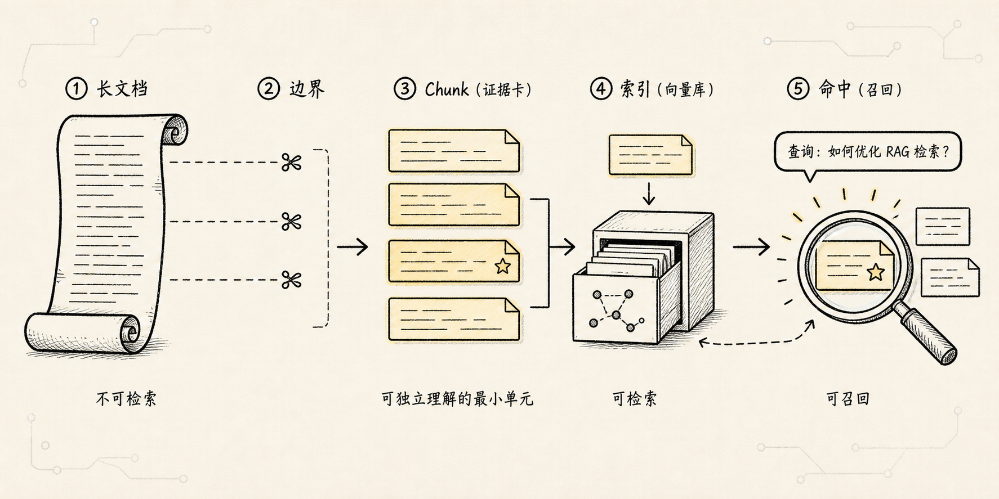
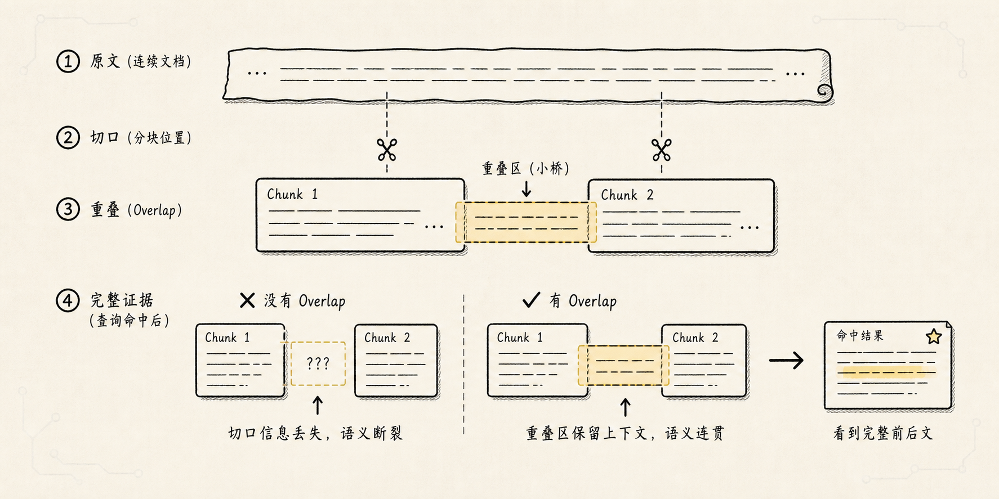
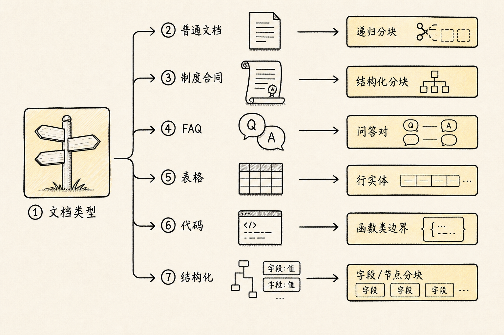

# RAG 分块技术：不是把长文档切碎，而是把知识切成能被找到的证据

上一篇讲数据导入时，我们留下了一个问题：

> 既然已经把 PDF、Word、网页、表格都解析成了干净内容，为什么还不能直接拿去 embedding？为什么中间还要多一步“分块”？

如果只从表面看，分块很容易被理解成一个机械动作：

> 文档太长，模型放不下，所以按 500 字一段切开。

这个理解也只对了一半。

分块确实和长度限制有关，但它真正要解决的问题不是“太长放不下”，而是：

**RAG 检索时，系统到底应该以什么粒度去找证据。**

如果粒度太大，一整份制度文档都被当成一个检索单元，用户问“上海酒店报销上限”，系统可能召回整份差旅制度，里面有交通、住宿、餐补、审批、发票要求，模型要在一大堆内容里自己找重点。

如果粒度太小，只召回一句“酒店标准 500 元”，模型又可能不知道这是上海还是北京，是普通员工还是高管，是 2025 版还是旧版。

所以分块不是把文档随便切碎。

分块是在做一件更精细的事：

> 把导入后的资料切成既容易被检索命中，又能保留足够上下文的证据单元。

还是用前面的公司制度问答助手来看：

```text
资料已经从 PDF、Word、网页、表格和扫描件中导入出来。
现在要回答一个制度问题：

我去上海出差，高铁二等座和酒店每天最多能报多少？
```

这一问看起来简单，但它会直接考验分块质量。

因为答案可能藏在差旅标准表的一行里，也可能散落在“交通标准”“住宿标准”“适用城市”“生效日期”几个小节里。分块做得好，系统能把这些证据稳定找回来；分块做得差，后面的向量化、检索、重排、生成都会跟着歪。

## 一、故事要从“长文档不是一个好检索单元”开始

我们先想一个极端做法：不分块。

把整份《差旅报销制度》当成一个 Document，直接做 embedding，然后存进向量数据库。

这样做看起来很省事：

```text
差旅报销制度.docx
-> 解析成一大段文本
-> embedding
-> 存入向量库
```

但用户问“上海酒店每天最多报多少”时，这个向量代表的是什么？

它代表的是整份制度的平均语义。

一份制度里可能同时包含：

- 出差申请流程
- 交通工具标准
- 酒店住宿标准
- 餐补标准
- 发票要求
- 审批权限
- 特殊城市说明
- 版本和生效日期

把这些内容揉成一个向量，就像把一本书压成一句摘要。摘要可以告诉你“这本书和差旅有关”，但很难精确告诉你“上海酒店上限是 500 元”。

这就是不分块的第一个问题：

**检索粒度太粗，相关细节会被无关内容稀释。**

再看另一个问题。

假设系统真的召回了整份制度，并把它塞进模型上下文。模型虽然能看到答案，但也要在一大段内容里自己定位。上下文越大，噪声越多，成本越高，回答越容易被旁边的规则带偏。

这就是不分块的第二个问题：

**生成阶段上下文太吵，模型不一定能抓住关键证据。**

RAG 的目标不是把所有资料都塞给模型，而是在回答前把最相关的证据递给它。

所以你把长文档切成更合适的检索单元。

这个检索单元，就是 `chunk`。

## 二、Chunk 为什么会出现：因为检索需要一个合适的“抓手”



`chunk` 可以先粗暴理解成：

> RAG 系统里被检索、被向量化、被引用的一小段内容。

但这句话还不够。

更重要的是理解它为什么出现。

人读文档时，不会把整份制度一次性背下来。你会先看目录，再定位章节，再看某一段或某一行表格。

比如你要查“上海酒店报销上限”，人的动作大概是：

```text
打开差旅制度
-> 找到“住宿标准”
-> 找到“上海”
-> 找到“酒店上限”
-> 看旁边是否有生效日期、人员级别、特殊说明
```

分块技术就是让 RAG 系统也拥有类似的抓手。

它把一份大文档拆成多个候选证据：

```text
差旅制度
-> chunk 1：适用范围
-> chunk 2：交通标准
-> chunk 3：住宿标准
-> chunk 4：餐补标准
-> chunk 5：发票要求
-> chunk 6：审批流程
```

这样用户问住宿问题时，系统就有机会直接命中“住宿标准”这个 chunk，而不是只知道整份文档“和差旅有关”。

分块解决的是 RAG 的一个基础矛盾：

```text
文档通常很长
用户问题通常很短
答案通常只在文档的一小块里
```

所以系统不能只问“哪份文档相关”，还要问：

```text
这份文档里的哪一块，最能回答这个问题？
```

这就是 chunk 的价值。

它让 RAG 的检索从“找文档”变成“找证据片段”。

## 三、分块不是越小越好


很多人理解了“长文档太粗”之后，会走向另一个极端：

> 那我切得越小越精确，不就越好吗？

也不是。

假设我们把差旅制度切得特别碎，每一句话一个 chunk。

系统可能得到这样的片段：

```text
酒店标准为 500 元。
```

这句话看起来很相关，但它缺了很多东西：

- 哪个城市？
- 哪类员工？
- 每天还是每次？
- 人民币还是其他币种？
- 哪个版本的制度？
- 是否包含税费？
- 是否有特殊审批条件？

如果只召回这一句，模型很容易把答案说得过于确定。

这就是分块太小的问题：

**命中很准，但上下文不够，证据不完整。**

再举一个技术文档的例子。

原文可能是：

```text
为了避免缓存雪崩，系统会给缓存 key 设置随机过期时间。
这样可以减少大量 key 在同一时刻同时失效的概率。
```

如果只切出一句：

```text
系统会给缓存 key 设置随机过期时间。
```

用户问“为什么要设置随机过期时间”时，系统虽然命中了关键词，但丢了原因。模型可能回答得很浅，甚至要自己补。

所以 chunk 不能只追求小。

好的 chunk 至少要满足两个条件：

```text
检索时能被准确找到
生成时能独立解释清楚
```

这两个条件经常互相拉扯。

小块更容易精确匹配，但容易丢上下文。

大块上下文更完整，但匹配会变粗，噪声会变多。

分块技术的难点，就在这个平衡里。

## 四、分块也不是越大越好

如果怕上下文丢失，就把 chunk 切大一点，行不行？

可以，但大到一定程度又会出问题。

比如把一整章“差旅报销制度”作为一个 chunk：

```text
chunk：差旅报销制度全文
```

它确实不缺上下文，但用户问“上海酒店上限”时，这个 chunk 里可能有大量无关内容。

模型拿到后，会面对这些混杂信息：

- 高铁能不能报
- 飞机经济舱怎么报
- 酒店每天多少钱
- 餐补怎么算
- 发票抬头怎么填
- 部门主管怎么审批
- 超标怎么处理

上下文完整了，但注意力被稀释了。

更麻烦的是 embedding。

embedding 模型会把整个 chunk 变成一个向量。chunk 越大，里面主题越多，这个向量越像多个主题的平均值。

用户问一个细节时，这个“平均向量”不一定和用户问题足够接近。

这就是分块太大的问题：

**内容完整，但语义变混，检索不够精确。**

所以分块的本质不是找一个固定大小，而是找一个合适粒度：

```text
小到足够匹配用户问题
大到足够保留答案上下文
```

这句话比“每块 500 字”重要得多。

## 五、Overlap 为什么会出现：因为切口附近最容易丢信息



即使我们找到了一个大概合适的 chunk size，也会遇到一个新问题：

边界。

比如原文是：

```text
住宿标准：
上海、北京、深圳等一线城市，普通员工酒店上限为每日 500 元。
如遇大型会议、展会等特殊情况，经部门负责人审批后可适当上浮。
```

如果刚好在中间切开：

```text
chunk A：
住宿标准：
上海、北京、深圳等一线城市，普通员工酒店上限为每日 500 元。

chunk B：
如遇大型会议、展会等特殊情况，经部门负责人审批后可适当上浮。
```

用户问“上海展会期间酒店能不能超 500”，两个 chunk 都有用。

chunk A 有基础标准，chunk B 有例外规则。

但如果检索只召回其中一个，答案就不完整。

这就是 overlap 出现的原因。

`overlap` 指的是相邻 chunk 之间保留一部分重复内容。

比如：

```text
chunk A：
住宿标准：
上海、北京、深圳等一线城市，普通员工酒店上限为每日 500 元。
如遇大型会议、展会等特殊情况，经部门负责人审批后可适当上浮。

chunk B：
上海、北京、深圳等一线城市，普通员工酒店上限为每日 500 元。
如遇大型会议、展会等特殊情况，经部门负责人审批后可适当上浮。
审批时需附会议通知或酒店价格证明。
```

这样做的好处是，边界附近的信息不会因为切口被硬生生拆散。

但 overlap 也不是越多越好。

overlap 太少，边界信息容易断。

overlap 太多，知识库里会出现大量重复内容，成本上升，检索结果也容易一屏都是相似片段。

所以 overlap 解决的是：

```text
切块会制造边界
边界会切断上下文
所以让相邻 chunk 适度重叠
```

它不是补救所有问题的万能胶，而是处理边界损失的一种工程手段。

## 六、先看一张分块类型思维导图

在进入各种分块方法之前，可以先把它们放到一张图里看。


如果只看工程实践，不要把这些方法理解成互斥选项。

真实系统里经常是组合使用：

```text
先按文档结构切
-> 结构不够时用递归分块
-> 太长时用 token 限制兜底
-> 中文、代码、表格按各自语言和结构特殊处理
```

直白地说，分块不是选一个“最厉害”的算法，而是按资料类型选择合适的边界。

下面我们逐个看。

## 七、固定大小分块：最简单，也最容易误伤语义

**常用程度：较常用。**

固定大小分块在 demo、原型和基线实验里很常见，但在严肃业务里通常不是最终方案。

最常见的分块方法，是固定大小分块。

比如每 500 个字切一块，每块之间 overlap 50 个字：

```text
chunk_size = 500
chunk_overlap = 50
```

它的优点很明显：

- 实现简单
- 速度快
- 适合快速 demo
- 参数容易理解
- 对纯文本比较通用

但它的问题也很明显：

**它不理解文档结构。**

它不知道哪里是标题，哪里是段落，哪里是表格，哪里是一个完整问答。

所以它可能把一个自然段切开，把表格的表头和数据切开，把“问题”和“答案”切开。

比如 FAQ 原文是：

```text
问：出差住宿超标怎么办？
答：需要提前提交特殊审批，说明原因并附证明材料。
```

如果切坏了，可能得到：

```text
chunk A：
问：出差住宿超标怎么办？

chunk B：
答：需要提前提交特殊审批，说明原因并附证明材料。
```

这对检索很不友好。

用户问“住宿超标怎么办”，系统可能只召回问题，没有召回答案。

所以固定大小分块适合做起点，不适合做终点。

它像一把尺子，能把文本切成差不多大的段落，但它不知道哪里该下刀。

固定大小分块适合这几类场景：

- 快速验证 RAG 流程能不能跑通
- 资料本身很规整，段落长度差异不大
- 暂时没有解析出标题、表格、问答对等结构
- 你需要一个简单基线，后面再逐步优化

但一旦进入真实业务，就要抽样看切出来的 chunk。

如果发现标题、表格、问答、条款经常被切断，就说明固定大小分块已经不够用了。

## 八、Token 分块：按模型真正看到的长度切

**常用程度：常用。**

Token 分块很少单独作为完整策略，但经常作为最后一道长度控制，防止 chunk 超过模型能处理的范围。

固定大小分块通常按“字符数”或“字数”切。

但模型真正处理的单位不是字符，而是 `token`。

`token` 可以先粗暴理解成模型眼里的“文本小颗粒”。中文、英文、数字、符号、空格，在不同 tokenizer 里切出来的 token 数都不一样。

比如下面两段看起来都是短句：

```text
上海酒店每天最多报多少？
What is the daily hotel reimbursement limit in Shanghai?
```

它们的字符数、词数和 token 数并不一定按同一个比例变化。

所以在工程里，经常会出现这种情况：

```text
按字符看没有超长
但按 token 看已经接近模型上下文上限
```

Token 分块要解决的就是这个问题：

```text
不要按人眼看到的长度估算
而要按模型实际消耗的 token 预算切
```

它特别适合这几类场景：

- 你已经明确使用某个 embedding 模型或生成模型
- chunk 需要严格控制在模型输入限制内
- 文档混合中文、英文、数字、代码、表格
- 你发现按字符切完后，模型侧仍然报上下文超限

但 Token 分块也有边界。

它只知道“长度”，不天然知道“意思”。

如果只按 token 数切，还是可能把一个条款、一个问答对、一行表格切开。

所以更常见的做法不是单独使用 Token 分块，而是把它作为最后一道长度控制：

```text
先按结构或语义找到自然边界
-> 如果某个块还是太长
-> 再按 token 继续切小
```

直白地说，Token 分块更像尺子的刻度，不是下刀的全部理由。

## 九、递归分块：尽量沿着自然边界切

**常用程度：非常常用。**

递归分块通常是普通文本 RAG 的默认起点，因为它在实现复杂度和效果之间比较平衡。

比固定大小更常用的一类方法，是递归分块。

它的思路是：

```text
先按大边界切
如果还太长，再按更小边界切
直到长度合适
```

比如可以按这个顺序尝试：

```text
章节标题
-> 段落
-> 句子
-> 标点
-> 字符
```

这比直接按字数切更像人读文档。

因为它会尽量保留自然语义边界。

比如一段文字不超过限制，就不要拆开；一个小节太长，再拆成段落；段落还太长，再拆成句子。

递归分块解决的是固定分块的一个核心缺陷：

```text
长度要控制
但语义边界也要尽量保留
```

对 Markdown、制度文档、教程类材料来说，递归分块通常会比纯固定长度更稳。

但它仍然有一个前提：

导入阶段要尽量保留结构。

如果数据导入时已经把标题、段落、列表全部压成一大坨文本，递归分块就少了很多可用边界。

这也是为什么上一篇反复强调：数据导入不是把文字抽出来就完了。

分块器能不能聪明，很大程度取决于它拿到的文档是不是还保留结构。

递归分块适合这几类场景：

- 普通文章、教程、说明文档
- Markdown、HTML 转出来的正文
- 结构有一点，但没有强到能完全按标题或表格切
- 需要在效果和实现复杂度之间取一个平衡

它不适合过度依赖精确结构的资料。

比如合同条款、财务表格、API 文档、代码文件，如果只是递归按段落和标点切，仍然可能切坏关键关系。

## 十、语言感知分块：按不同语言的边界来切

**常用程度：较常用。**

当资料里有大量中文、多语言文本、代码或配置文件时，语言感知分块会很有用；如果都是简单英文纯文本，它的存在感就没那么强。

你提到的“语言分块”，在 RAG 里很值得单独讲。

因为不同语言的文本边界不一样。

英文经常靠空格、句号、段落来表达边界：

```text
Employees may reimburse hotel expenses up to 500 CNY per day.
Exceptions require manager approval.
```

中文没有天然空格，更多靠中文标点、段落、标题和语气连接：

```text
员工赴上海出差，酒店住宿标准为每日不超过 500 元。特殊会议期间如需超标，应提前提交审批。
```

日文、韩文、泰文又有各自的分词和断句特点。

如果分块器只按英文习惯处理，比如优先按空格切，对中文资料就很粗糙；如果只按字符数量切，又容易把一句话从中间截断。

语言感知分块要解决的是：

```text
不同自然语言的边界不一样
所以切分规则要尊重语言自己的断句方式
```

对中文材料，通常要优先考虑：

- 中文句号：`。`
- 问号：`？`
- 感叹号：`！`
- 分号：`；`
- 顿号：`、`
- 冒号后面的解释关系
- 标题编号：`一、`、`1.`、`（一）`
- 段落空行

比如制度原文是：

```text
一、住宿标准
员工赴上海、北京、深圳出差，酒店住宿标准为每日不超过 500 元；如遇大型会议、展会等特殊情况，经部门负责人审批后可适当上浮。
```

如果只是按 50 个字符硬切，可能得到：

```text
员工赴上海、北京、深圳出差，酒店住宿标准为每日不超过 500
元；如遇大型会议、展会等特殊情况，经部门负责人审批后可适当上浮。
```

这就很难看。

更好的方式是先识别中文标点和条款边界：

```text
chunk：
一、住宿标准
员工赴上海、北京、深圳出差，酒店住宿标准为每日不超过 500 元；
如遇大型会议、展会等特殊情况，经部门负责人审批后可适当上浮。
```

这类 chunk 虽然不一定长度最均匀，但语义更完整。

语言感知分块还包括另一类情况：代码语言。

代码不是普通自然语言。Python、Java、JavaScript、SQL、Markdown、HTML 都有自己的结构。

比如 Python 里，一个函数最好不要被切成两半：

```python
def calculate_hotel_limit(city: str) -> int:
    if city in ["上海", "北京", "深圳"]:
        return 500
    return 350
```

如果切成：

```text
def calculate_hotel_limit(city: str) -> int:
    if city in ["上海", "北京", "深圳"]:
```

另一个 chunk 才是：

```text
        return 500
    return 350
```

用户问“上海酒店上限在哪里计算”时，两个 chunk 单独看都不完整。

所以代码类资料要尽量按：

- 函数
- 类
- 方法
- SQL 语句
- Markdown 标题块
- HTML 节点
- JSON/YAML 对象

这些语言结构来切。

语言感知分块适合这几类场景：

- 中文、英文、日文等多语言资料混在一起
- 中文制度、中文教程、中文 FAQ
- 代码仓库、API 文档、配置文件
- Markdown、HTML、JSON、YAML 这类有语法结构的内容

它的核心不是“语言模型更懂语言”，而是：

```text
切块时不要假装所有文本都是英文纯文本。
```

不同语言有不同边界，分块器要尊重这些边界。

## 十一、结构化分块：按文档的真实形状来切

**常用程度：非常常用。**

只要资料里有标题、表格、FAQ、条款、代码结构，结构化分块通常都比纯按长度切更可靠。

真实项目里，比“按多少字切”更重要的是：

```text
这类文档天然应该按什么单位切？
```

不同资料的合理 chunk 单位不一样。

### 1. 制度和说明书：按标题层级切

制度文档通常有清楚的标题层级：

```text
一、适用范围
二、交通标准
三、住宿标准
四、餐补标准
五、审批流程
```

这类文档适合按章节、小节、条款切。

每个 chunk 最好保留标题路径：

```yaml
content: "上海、北京、深圳等一线城市，普通员工酒店上限为每日 500 元。"
metadata:
  source: "差旅报销制度.docx"
  section_path: "差旅报销制度 > 住宿标准 > 一线城市"
  page: 7
  version: "2025"
```

这样用户问住宿问题时，检索不仅能命中文本，还能知道它属于“住宿标准”。

标题路径有时比正文还重要。

因为“500 元”本身不说明任何东西，`住宿标准 > 一线城市` 才给它补上意义。

### 2. FAQ：按问答对切

FAQ 不适合随便按字数切。

它天然的单位是“一个问题 + 一个答案”。

比如：

```text
问：出差住宿超标怎么办？
答：需要提前提交特殊审批，说明原因并附证明材料。
```

这个问答对应该尽量作为一个 chunk。

如果问题和答案被拆开，检索就会很别扭。

### 3. 表格：按行、字段或业务实体切

表格也不能直接按字数切。

差旅标准表里，一行可能就是一个完整证据：

```text
城市：上海
交通：高铁二等座
酒店上限：500 CNY / 天
餐补：120 CNY / 天
```

这类内容适合按行切，或者按业务实体切。

但有些表格一行太短，需要把列名、单位、表名、脚注一起带上。

否则 chunk 里只有：

```text
上海 500 120
```

这就不是证据，只是一串值。

### 4. 代码文档：按函数、类、模块切

代码和 API 文档更适合按函数、类、方法、接口说明切。

如果把函数签名和参数解释切开，用户问参数含义时就很难命中完整答案。

### 5. 合同和法律文本：按条款切，但要保留例外

合同、制度、法律类文本最怕切掉限制条件。

比如一条规则后面跟着“但以下情况除外”，这部分不能轻易切散。

否则模型可能只看到主规则，看不到例外。

所以结构化分块的核心原则是：

```text
不要先问切多大
先问这类文档的最小完整意义单位是什么
```

最小完整意义单位，就是最适合成为 chunk 的候选。

结构化分块适合这几类场景：

- 制度、合同、说明书、教材
- FAQ、客服知识库
- CSV、Excel、数据库导出
- API 文档、代码文档
- 法律、财务、合规类资料

它的关键不是“切得更细”，而是“切得符合资料本来的组织方式”。

如果说固定大小分块是在用尺子切，递归分块是在沿自然段落切，结构化分块就是在问：

```text
这份资料原本是怎么组织知识的？
```

## 十二、语义分块：按主题变化来切

**常用程度：特定场景使用。**

语义分块听起来很智能，但在很多业务系统里不是第一选择；它更适合结构混乱、主题自然漂移、规则边界不清楚的长文本。

还有一种更智能的方式，叫语义分块。

它不是只看字数和标点，而是尝试判断文本主题什么时候发生变化。

比如一段内容前半部分在讲“交通标准”，后半部分开始讲“住宿标准”，即使中间没有明显标题，语义分块也希望能在主题切换处断开。

它解决的是这类问题：

```text
文档结构不清楚
但语义主题确实发生了变化
```

语义分块通常会利用 embedding、相似度、主题边界检测等方法。

它的优点是更接近“按意思切”。

它的缺点也很现实：

- 成本更高
- 实现更复杂
- 结果不一定稳定
- 调试时不如结构化规则直观

所以语义分块不一定是第一选择。

如果文档本身结构清楚，标题、段落、表格都保留得很好，结构化分块通常更可控。

如果资料来自网页抓取、会议纪要、长篇访谈、格式混乱的 PDF，语义分块才更有发挥空间。

可以这样记：

```text
结构清楚 -> 优先结构化分块
结构一般 -> 递归分块兜底
结构混乱但主题变化明显 -> 考虑语义分块
```

语义分块适合这几类场景：

- 会议纪要、访谈稿、客服对话
- 网页抓取后结构不稳定的正文
- 长篇文章里主题自然切换，但标题不明显
- 资料来源很杂，规则分块很难覆盖

它不适合那些要求边界非常可解释的场景。

比如财务制度、合同条款、法律文本，你通常更希望知道“为什么在这里切”，而不是只接受一个语义模型判断出来的边界。

所以语义分块可以作为补充，但不要一上来就把它当成万能方案。

## 十三、业务规则分块：按用户真实问题来切

**常用程度：特定场景很有价值。**

业务规则分块不一定通用，但在制度问答、客服知识库、表格问答这类场景里，效果往往很直接。

还有一类分块方式，容易被初学者忽略：业务规则分块。

它不是从文本形式出发，而是从用户会怎么问出发。

比如公司内部制度问答助手里，用户经常问的是：

```text
上海酒店每天最多报多少？
高铁二等座能不能报？
住宿超标怎么办？
请假超过 3 天谁审批？
试用期员工有没有年假？
```

这时我们可以反过来设计 chunk：

```text
一个 chunk 最好能回答一类真实问题。
```

比如差旅标准表，可以按“城市 + 费用类型 + 人员类型”组织：

```yaml
content: "普通员工赴上海出差，高铁二等座可报销，酒店住宿上限为 500 CNY / 天，餐补为 120 CNY / 天。"
metadata:
  city: "上海"
  employee_type: "普通员工"
  expense_type: ["交通", "住宿", "餐补"]
  source: "差旅标准.csv"
  row: 12
```

这不是简单复刻原文，而是把原始表格转成更接近用户问题的证据单元。

再比如请假制度，原文可能按章节写：

```text
三、审批权限
员工请假 1 天以内由直属主管审批；1 至 3 天由部门负责人审批；超过 3 天由 HRBP 与部门负责人共同审批。
```

如果用户经常按天数问，可以把它加工成几个业务 chunk：

```text
请假 1 天以内：直属主管审批。
请假 1 至 3 天：部门负责人审批。
请假超过 3 天：HRBP 与部门负责人共同审批。
```

业务规则分块的优点是很贴近问答效果。

它的缺点是需要你理解业务，也需要维护规则。

如果制度变了，业务 chunk 也要同步更新；如果你加工时理解错了，系统会稳定地召回错误证据。

所以业务规则分块适合这几类场景：

- 用户问题模式非常明确
- 表格、制度、FAQ 可以转成稳定规则
- 你能接受一定的人工设计或审核
- 问答准确性比通用性更重要

可以这样记：

```text
结构化分块问：资料本来怎么组织？
业务规则分块问：用户通常怎么提问？
```

这两者经常可以结合。

比如先按表格行保留原始证据，再按常见问题生成更易召回的业务表达。至于这些不同表达后面如何组织、如何检索、如何避免重复，就是后面“索引优化”要讲的内容了。

## 十四、分块参数到底怎么调

讲到这里，很多人会问一个实际问题：

> chunk size 到底设多少？

没有一个永远正确的数字。

因为 chunk size 取决于：

- 文档类型
- embedding 模型能力
- 用户问题长度
- 答案需要的上下文
- top_k 设置
- 是否有重排
- 模型上下文预算
- 是否会在后续环节做上下文扩展

但可以有一些思考方向。

### 1. 先按文档类型定初始策略

不要一上来就全局固定一个数字。

可以先按类型分流：

```text
Markdown / 教程 -> 按标题和段落递归分块
制度 / 合同 -> 按章节、条款分块
FAQ -> 按问答对分块
CSV / Excel -> 按行或业务实体分块
代码文档 -> 按函数、类、接口分块
会议纪要 -> 按议题或语义段落分块
```

### 2. 再看每个 chunk 是否能独立回答

抽样检查 chunk 时，不要只看长度。

要问：

```text
如果这个 chunk 被单独召回，它能不能支持一个可靠回答？
```

如果不能，它可能太小，或者缺标题、单位、元数据。

### 3. 再看检索结果是否太吵

如果每次检索回来的 chunk 都很长，里面大量内容和问题无关，说明 chunk 可能太大。

这时可以缩小粒度，或者把正文切得更细，同时保留标题路径、来源位置和相邻段落信息，方便后续环节补上下文。

### 4. 最后用问题集评估

调分块不能只靠感觉。

最好准备一组真实问题：

```text
上海酒店每天最多报多少？
高铁二等座能不能报销？
住宿超标怎么办？
2024 版和 2025 版差旅标准有什么变化？
外包员工适用这份制度吗？
```

然后看每个问题：

- 正确证据有没有被召回
- 召回片段是否完整
- 是否带回了版本、来源、页码、行号
- 上下文里噪声是否过多
- 最终回答是否能引用证据

分块调参最终要服务这些问题，而不是服务某个漂亮参数。

## 十五、工程里最常用的几种分块组合



讲了这么多类型，最后要把它们收回工程实践。

真实项目里，最常用的不是某一种单独分块方法，而是下面几种组合。

### 1. 普通文档：递归分块 + Token 兜底

这是最常见的入门组合。

适合：

- 普通 Markdown
- 技术教程
- 产品说明
- 简单网页正文
- 段落清楚的 PDF 解析结果

流程大概是：

```text
先按标题 / 段落 / 句子递归切
-> 每块保留 source、section_path、page
-> 如果某块仍然太长，再按 token 限制切小
-> 相邻块保留少量 overlap
```

如果你不知道一开始该选什么，这个组合通常可以作为默认起点。

### 2. 制度和合同：结构化分块 + 语言感知分块

制度、合同、合规文档最怕把条款和例外切散。

适合：

- 公司制度
- 报销规则
- 合同条款
- 法律法规
- 操作规范

流程大概是：

```text
先按标题层级 / 条款编号切
-> 中文材料按中文标点和条款边界处理
-> 每块带上章节路径、版本、生效日期、权限标签
-> 对太长条款再递归切，但不要切掉例外说明
```

这类资料里，结构比长度更重要。

### 3. FAQ 和客服知识库：问答对分块 + 业务规则分块

FAQ 的天然单位不是段落，而是“一个问题 + 一个答案”。

适合：

- 客服知识库
- 内部帮助中心
- 产品常见问题
- 标准问答手册

流程大概是：

```text
先按问答对切
-> 同义问法可以作为补充字段
-> 答案里保留适用范围和限制条件
-> 高频问题可以加工成更贴近用户问法的业务 chunk
```

这类场景里，分块要贴近用户真实问法。

### 4. 表格和结构化数据：按行 / 业务实体分块

表格不能简单压成纯文本。

适合：

- CSV
- Excel
- 数据库导出
- 报销标准表
- 价格表
- 配置表

流程大概是：

```text
按行、主键或业务实体切
-> 把列名、单位、表名、脚注带进 chunk
-> 元数据保留 row、字段、版本、来源
-> 必要时改写成自然语言证据句
```

比如不要只保留：

```text
上海 500 120
```

而要保留：

```text
上海出差，普通员工酒店上限为 500 CNY / 天，餐补为 120 CNY / 天。
```

### 5. 代码和配置：语言感知分块 + 结构化分块

代码类资料不能按普通文章切。

适合：

- Python / Java / JavaScript 源码
- SQL 脚本
- API 文档
- YAML / JSON 配置
- Markdown 技术文档

流程大概是：

```text
按函数、类、方法、SQL 语句、配置对象切
-> 保留文件路径、符号名、模块名
-> 太长时再按 token 控制
-> 不要把函数签名和函数体、参数说明和返回值说明切散
```

代码场景里，语言结构就是最重要的边界。

如果只总结最常用的几种，可以这样记：

```text
普通文本：递归分块 + Token 兜底
制度合同：结构化分块 + 中文/条款边界
FAQ：问答对分块
表格：按行或业务实体分块
代码：按语言结构分块
结构混乱长文：再考虑语义分块
```

大多数 RAG 项目，先把这几种做好，效果就会比单纯“每 500 字切一块”稳定很多。

## 十六、一个实用的分块检查清单

做 RAG 分块时，可以用下面这张清单快速自检。

### 1. Chunk 有没有保留来源

每个 chunk 至少应该知道：

- 来自哪个文件
- 来自哪一页、哪一行或哪个章节
- 属于哪个标题路径
- 对应哪个版本
- 有什么权限标签

没有来源的 chunk，很难成为可靠证据。

### 2. Chunk 边界是否自然

检查 chunk 是否经常出现：

- 标题和正文分离
- 问题和答案分离
- 表头和数据分离
- 主规则和例外条款分离
- 代码签名和参数解释分离

如果经常出现，说明切分边界需要调整。

### 3. Chunk 是否太碎

太碎的表现包括：

- 只剩一句孤立结论
- 缺少标题路径
- 缺少单位和适用范围
- 用户问题命中后仍然无法回答

太碎时，可以增大 chunk size、增加 overlap，或者把标题、表头、单位、适用范围一起带入 chunk。

### 4. Chunk 是否太大

太大的表现包括：

- 一个 chunk 里混了多个主题
- 检索结果里无关内容很多
- embedding 语义变得模糊
- 生成阶段模型容易引用错段落

太大时，可以按标题、段落、条款进一步拆分。

### 5. Overlap 是否制造了大量重复

适度 overlap 有帮助。

但如果 top_k 召回结果里经常出现几乎一样的相邻 chunk，就要考虑：

- 降低 overlap
- 做结果去重
- 把重复信息改成元数据或标题路径

### 6. 表格和结构化数据是否被当成普通文本切坏了

尤其要检查：

- 列名是否还在
- 单位是否还在
- 行号是否还在
- 字段和值的关系是否还在
- 表格脚注是否还在

表格 chunk 的关键不是自然语言是否流畅，而是字段关系是否清楚。

### 7. 是否为后续环节留下上下文线索

分块这篇不展开索引优化，但分块阶段最好给后续环节留下足够线索：

- section_path
- metadata
- source
- page
- row
- version
- previous_chunk_id
- next_chunk_id

这样后面做向量化、检索、重排、上下文扩展时，系统才知道每个 chunk 从哪里来，前后还有什么内容。

## 十七、把分块放回 RAG 全链路

现在把分块放回链路里看：


分块承接的是数据导入，影响的是后面所有环节。

它解决的问题链是：

```text
导入后的文档仍然太长、太杂
-> 整体向量化会让语义变粗
-> 整体塞进上下文会让模型面对太多噪声
-> 所以需要切成 chunk
-> 但 chunk 太小会丢上下文，太大会丢精度
-> 于是出现 overlap、Token 分块、递归分块、语言感知分块、结构化分块、语义分块、业务规则分块等策略
```

如果只记一句话，可以这样记：

> 分块不是把长文档切碎，而是把知识切成能被检索、能被理解、能被引用的证据单元。

这也是为什么 RAG 的效果经常不是模型一个环节决定的。

同样的 embedding 模型，同样的向量数据库，同样的 LLM，如果 chunk 切得不一样，最终问答效果可能差很多。

下一篇就可以继续往下走：chunk 已经准备好了，为什么要把它变成向量？向量嵌入到底是在做什么？向量数据库又为什么会成为 RAG 的常见组件？

这就进入 RAG 的下一个关键环节：[[blog/3 Rag/终稿/04.向量嵌入与向量数据库|向量嵌入与向量数据库]]。
