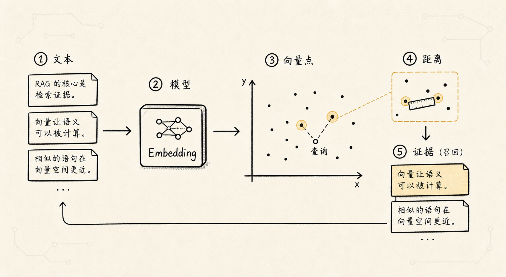
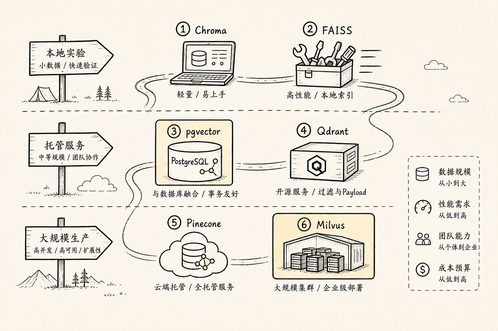
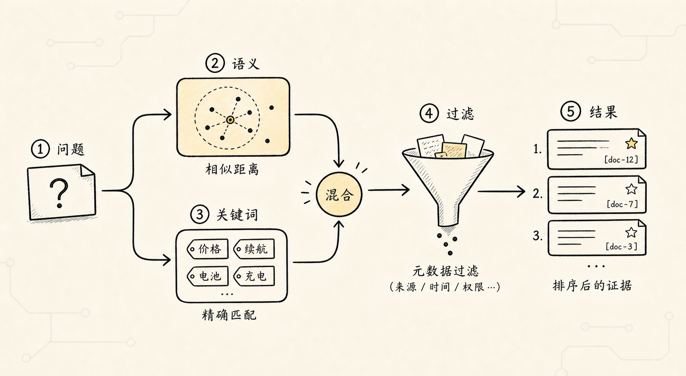
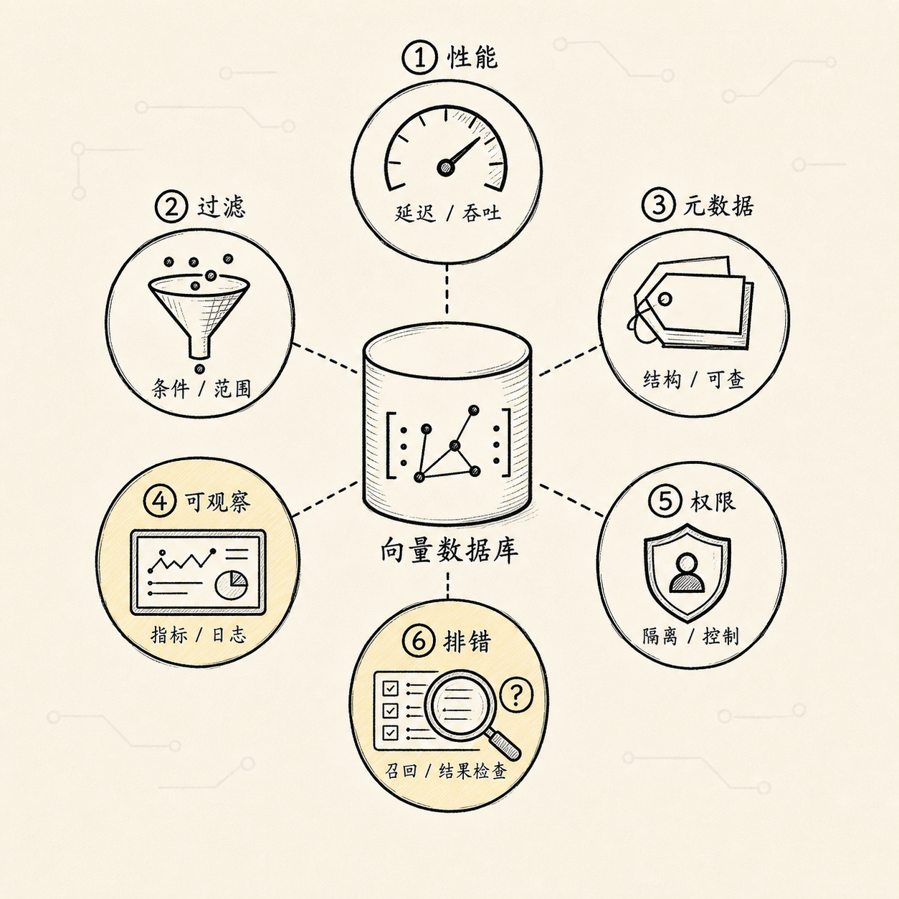

# RAG 向量嵌入与向量数据库：把语义坐标存成可检索的证据

上一篇讲分块时，我们把长文档切成了一个个更适合检索的证据单元。

接下来，系统通常会做两件事：

```text
chunk -> embedding -> 向量
向量 + 原文 + 元数据 -> 写入向量数据库
```

`Embedding` 在总览里已经出现过，这里只保留一句话：

**Embedding 负责把文本变成可计算的语义坐标。**

这一篇不再展开 embedding 模型原理，而是接着看后半段：

> 这些语义坐标到底应该存在哪里？

向量数据库的选择很容易越列越多。你打开 LangChain、LlamaIndex、Flowise 这类 RAG 框架的集成列表，会看到一长串名字：Chroma、Milvus、Pinecone、Qdrant、Weaviate、Postgres、Redis、Elasticsearch、OpenSearch、MongoDB Atlas、Astra DB、LanceDB、Supabase、Vespa……

但写入门文章时，数据库不是列得越多越好。

对大多数 RAG 学习者来说，先理解现在最常见、最容易遇到的几类就够了：

```text
Chroma
Pinecone
Qdrant
Weaviate
Milvus / Zilliz
PostgreSQL + pgvector
FAISS（常见，但严格说不是数据库）
```

这几类基本覆盖了 RAG 项目里最常见的选型路径：

- 本地原型怎么做
- 少运维云服务怎么选
- 开源自托管怎么选
- 大规模向量搜索怎么选
- 已经有 PostgreSQL 时怎么复用
- 为什么 FAISS 常出现，但不能当完整数据库理解

为了让比较不飘，还是放回公司制度问答助手这个场景：

```text
前面已经把制度资料导入、清洗并切成 chunk。
现在要让系统能在这些 chunk 里找回相关证据。

我去上海出差，高铁二等座和酒店每天最多能报多少？
```

这个问题背后，向量数据库要做的不是“存一堆数字”。

它至少要支持：

- 快速找到语义相近的 chunk
- 拿回 chunk 原文
- 按用户权限过滤
- 按文档类型、时间、版本过滤
- 支持增量更新和删除
- 在数据量变大以后还能稳定查询

如果只从“能不能向量搜索”看，很多方案都能用。

如果从真实 RAG 系统看，它们的差异会很快放大。

## 一、向量数据库到底解决什么



我们先想一个最小实现。

分块以后，知识库里有 100 个 chunk。

你把每个 chunk 都转成向量，存在一个数组里。

用户提问时：

```text
用户问题 -> 向量化
-> 和 100 个 chunk 向量逐个比较
-> 排序
-> 取前 5 个
```

这完全可以。

很多入门 demo 就是这样跑通的。

但真实项目很快会遇到几个变化。

第一，数据量变大。

制度库可能是几万个 chunk，客服知识库可能是几十万个 chunk，代码库和工单库可能是几百万个 chunk。每次全量比较，延迟和成本都会上来。

第二，查询不只是相似度。

用户问“上海差旅标准”，系统不能全库乱搜。它可能只能搜索：

```text
当前用户有权限的文档
2025 年以后生效的制度
人事 / 财务分类下的内容
未废止版本
```

这些是 metadata filter，不是 embedding 能解决的。

第三，数据会变化。

制度会更新，旧文档会废止，某些文件要删除，某些用户权限会调整。向量库必须支持写入、更新、删除、重建索引，而不是只适合一次性离线实验。

所以向量数据库的任务可以概括成一句话：

**在真实规模、真实权限、真实更新的约束下，把相关证据稳定找回来。**

它不是 RAG 里的“存储小配件”，而是检索质量和工程稳定性的核心组件。

## 二、先用一张表建立直觉



下面这张表只列 RAG 中最常见的几类，不追求大而全。

| 方案 | 更像什么 | 适合场景 | 主要优势 | 主要注意点 |
| --- | --- | --- | --- | --- |
| Chroma | 轻量 AI 应用向量库 | 本地开发、RAG demo、小型知识库 | 上手快，和 LLM 应用生态贴近 | 严肃生产、多租户、复杂权限要谨慎评估 |
| Pinecone | 托管向量数据库服务 | 想少运维、快速上线生产 | 云服务体验好，省部署和扩缩容心智 | 成本、合规、供应商绑定要评估 |
| Qdrant | 开源向量数据库 | 自托管 RAG、metadata filter、多租户 | API 清晰，payload filter 好用，工程落地友好 | 大规模生产仍要压测和设计运维 |
| Weaviate | AI-native 向量数据库 | 对象模型、hybrid search、多租户 | schema、hybrid search、模块化能力较完整 | 概念体系比轻量库多，简单项目可能偏重 |
| Milvus / Zilliz | 分布式向量数据库 | 大规模向量、多模态、高性能检索 | 面向大规模相似度搜索，索引和分布式能力强 | 自托管运维复杂度较高，小项目可能用力过猛 |
| PostgreSQL + pgvector | 关系型数据库扩展 | 已有 Postgres、小中规模 RAG、权限和 SQL 很重要 | 向量和业务数据放一起，事务、备份、权限生态成熟 | 极大规模向量检索不如专门向量库自然 |
| FAISS | 向量检索库 | 本地实验、离线评测、自研检索底层 | 快、经典、适合理解 ANN | 不是完整数据库，metadata、权限、服务化要自己补 |

如果只想先记一个粗略版本：

```text
Chroma：最快跑 demo。
Pinecone：云服务省运维。
Qdrant：开源自托管，RAG 工程感好。
Weaviate：对象模型和 hybrid search 更完整。
Milvus / Zilliz：大规模向量搜索。
pgvector：PostgreSQL 用户的自然选择。
FAISS：常见向量检索库，不是完整数据库。
```

接下来逐个展开。

## 三、Chroma：先把 RAG 跑起来

Chroma 是很多人做 RAG demo 时最先遇到的向量库。

它的价值在于：

```text
少想数据库细节，
先把文档、embedding、metadata、查询跑起来。
```

对初学者来说，这很重要。

因为刚开始做 RAG，你真正要验证的往往不是数据库性能，而是：

- 文档能不能加载
- chunk 切得对不对
- embedding 能不能召回相关内容
- Prompt 能不能基于证据回答
- 整条链路能不能跑通

Chroma 很适合：

- 本地 RAG 原型
- 小规模知识库
- 教学和实验
- 个人工具
- 快速验证 chunk / embedding / rerank 效果

它的问题不是“不能用”，而是不要因为 demo 顺利，就默认它一定适合所有生产场景。

如果你的系统开始出现这些要求：

- 严格多租户
- 复杂权限
- 高并发
- 强 SLA
- 数据量快速增长
- 运维审计和备份恢复

那就应该重新评估是否继续用 Chroma，还是迁移到 Qdrant、Weaviate、Milvus、Pinecone 或 pgvector。

## 四、Pinecone：少运维的托管向量数据库

Pinecone 的核心吸引力很直接：

```text
我不想自己管向量数据库。
```

它是托管向量数据库服务。你不用自己部署集群、规划节点、处理扩缩容和升级，更多精力可以放在 RAG 应用本身。

它适合：

- SaaS RAG 应用
- 快速商业化原型
- 没有专门数据库运维团队的产品
- 希望把向量库当外部基础设施使用
- 数据合规允许使用外部云服务

比如你要快速上线一个企业知识库问答产品，团队又不想维护 Milvus 或 Weaviate 集群，Pinecone 这类托管服务就很有吸引力。

但托管服务也有需要提前问清楚的问题：

- 成本如何随向量量、查询量、维度增长
- 数据所在区域是否满足合规
- metadata filter 能否满足权限模型
- 删除、更新、namespace 隔离是否符合预期
- 网络延迟是否可接受
- 一旦要迁移，数据和索引迁移成本多高

托管服务不是“更高级”，而是把复杂度从你自己团队转移到服务商。

这通常很划算，但你要知道自己换来的是什么，付出的是什么。

## 五、Qdrant：清晰好用的开源向量数据库

Qdrant 是现在 RAG 项目里很常见的开源向量数据库。

它给人的工程感受通常是：

```text
API 清楚，
payload filter 好用，
适合把 RAG 从 demo 推向工程化。
```

在 Qdrant 里，向量之外的数据叫 payload。

payload 可以保存：

```text
doc_id
tenant_id
user_group
source_file
page
effective_date
doc_type
```

然后在向量检索时一起过滤。

这对企业 RAG 很关键。

因为很多检索错误不是“语义不相似”，而是：

```text
搜到了用户不该看的文档
搜到了旧版本制度
搜到了别的租户的数据
搜到了错误部门的规则
```

Qdrant 适合：

- 开源自托管
- 中等规模到较大规模 RAG
- metadata filter 很重要
- 多租户隔离
- dense / sparse / hybrid 检索
- 希望部署复杂度低于大型分布式系统

如果你想从 Chroma 这类 demo 方案往生产靠，但又不想一开始就上非常重的分布式系统，Qdrant 是一个很常见的中间选择。

需要注意的是：一旦进入大规模生产，不管哪个向量库，都不能只看官网示例。你要用自己的数据压测：

- filter 后召回是否稳定
- 写入和删除是否符合预期
- 混合检索效果如何
- 多租户隔离策略是否清楚
- 备份恢复是否能演练

## 六、Weaviate：对象模型和 hybrid search 更完整



Weaviate 也是常见的开源向量数据库。

它和 Qdrant 都适合 RAG，但风格不完全一样。

Weaviate 更强调：

- collection / schema
- 对象属性
- vectorizer 模块
- hybrid search
- multi-tenancy
- 与生成模型配合

如果你希望数据库不仅存 chunk，还能比较明确地组织“对象”，Weaviate 会比较自然。

比如你不是只存：

```text
chunk text + embedding
```

而是想区分：

```text
PolicyDocument
PolicyChunk
FAQ
Product
ImageAsset
```

每类对象有不同属性、不同向量字段、不同检索方式。

Weaviate 支持向量搜索、关键词搜索和 hybrid search，所以它适合关键词与语义检索都重要的场景。

它适合：

- 想用 schema 管理 AI 数据对象
- 需要 hybrid search
- 需要多租户
- 需要内置 vectorizer / 模块化能力
- 想把检索和生成式能力组合起来

它的注意点是：

- 概念比轻量库多
- 简单项目可能显得重
- 自托管仍然要考虑资源、升级、备份、监控

一句话：

```text
Qdrant 更像清爽的向量检索数据库。
Weaviate 更像带对象模型和 AI 模块的向量数据库。
```

这个说法不绝对，但对初学者建立直觉有帮助。

## 七、Milvus / Zilliz：面向大规模向量搜索

Milvus 是典型的专门向量数据库，尤其强调大规模、分布式和高性能相似度搜索。

如果你的数据规模只是几万条向量，用 Milvus 当然也能跑，但它真正发力的地方通常是：

- 百万、千万、亿级向量
- 多集合、多索引
- 高吞吐写入
- 高并发查询
- 多模态检索
- dense / sparse / hybrid search
- 分布式部署
- 云原生架构

Milvus 里的核心概念包括：

- collection：类似表
- field：字段，可以是向量字段，也可以是标量字段
- index：向量索引
- metric：距离度量，比如 cosine、inner product、L2
- partition：分区
- search params：搜索参数，影响速度和召回

这些概念看起来多，是因为它要解决的是更接近数据库系统的问题。

它适合：

```text
向量检索已经是系统核心能力，
并且数据规模和性能压力足够大。
```

如果你做的是企业内部大知识库、图片检索平台、推荐召回、多模态资产库，Milvus 或它的托管版 Zilliz Cloud 很值得评估。

但如果你只是个人知识库，或者几万条 chunk 的内部工具，自托管 Milvus 可能有点重。

这里要特别注意：Milvus 强，不代表你一定要从 Milvus 起步。

它更像一套重型工程装备。

当你需要它时，它很有价值。

当你还不需要它时，部署、资源和运维复杂度反而会拖慢学习。

## 八、PostgreSQL + pgvector：已有 Postgres 时的自然选择

pgvector 是 PostgreSQL 的向量扩展。

它的最大吸引力不是“向量搜索一定比专门向量库更强”，而是：

**向量可以和业务数据放在同一个 PostgreSQL 里。**

这很适合很多中小型 RAG 系统。

比如公司制度问答助手里，你本来就有这些表：

```text
users
documents
document_versions
chunks
permissions
departments
```

这时把 chunk embedding 也放在 PostgreSQL 里，就能直接用 SQL 处理：

- 用户权限
- 文档版本
- 生效时间
- 部门范围
- 审计日志
- 删除和回滚
- 备份恢复

这非常朴素，但很实用。

pgvector 支持精确和近似最近邻搜索，也支持 HNSW、IVFFlat 等索引类型。它还能继承 PostgreSQL 的事务、SQL、JOIN、备份、权限和生态。

它适合：

- 已经重度使用 PostgreSQL
- 数据量中小规模
- filter 和业务查询很重要
- 希望系统少一个独立组件
- 更看重一致性和可维护性，而不是极限向量吞吐

它不太适合：

- 上亿级向量
- 极高并发低延迟向量检索
- 大量多模态向量
- 复杂分布式向量索引
- 向量搜索需要独立扩缩容

一句话：

```text
如果你的 RAG 本质是业务系统的一部分，pgvector 很香。
如果你的 RAG 本质是海量向量搜索平台，专门向量库更自然。
```

## 九、FAISS：很常见，但不要把它当完整数据库

FAISS 在 RAG 教程里也经常出现。

但要把它单独拎出来说清楚：

**FAISS 是向量相似度搜索库，不是完整向量数据库。**

你可以把它理解成：

```text
我已经有一批向量，
请帮我用高效索引快速找最近邻。
```

FAISS 很适合：

- 本地实验
- 离线评测
- 学习 ANN 索引
- 自研检索系统里的底层组件
- 不想一开始引入数据库服务的 demo

但它不负责很多数据库层面的事情：

- 多租户
- 权限控制
- 文档状态
- metadata filter
- 高可用服务
- 增量更新治理
- 备份恢复
- 查询审计

这些不是 FAISS 完全不能做，而是通常需要你自己在外层系统里补。

所以如果你是在写学习项目，FAISS 很好。

如果你是在做多人、多权限、可更新、可运营的 RAG 产品，FAISS 更像一块发动机，而不是整辆车。

## 十、其他方案先知道名字就行

除了上面几类，RAG 项目里还会看到一些方案。

比如：

- Elasticsearch / OpenSearch：适合原本就有全文搜索体系，想加入向量检索和混合检索。
- Redis：适合低延迟、热点召回、Agent 记忆和缓存型检索。
- MongoDB Atlas Vector Search：适合原本就在 MongoDB Atlas 里管理应用数据。
- Azure AI Search：适合 Azure 生态里的企业 RAG，尤其是关键词、语义、向量混合搜索。
- Supabase Vector：常和 Postgres / pgvector 路线相近，适合 Supabase 生态用户。

这些不是不重要。

只是对入门文章来说，不需要一上来全部展开。否则读者会记住一堆名字，却不知道自己该选哪一类。

先把常见主线掌握住，再按自己的云厂商、数据库生态和团队经验补充就好。

## 十一、怎么快速选

下面给一个保守决策表。

| 场景 | 优先考虑 |
| --- | --- |
| 快速跑通 RAG demo | Chroma |
| 本地实验、学习 ANN、离线评测 | FAISS |
| 想少运维，接受托管云服务 | Pinecone |
| 开源自托管，重视 metadata filter | Qdrant |
| 需要对象模型、schema、hybrid search | Weaviate |
| 大规模向量、多模态、分布式高性能检索 | Milvus / Zilliz |
| 已经有 PostgreSQL，数据量不大但权限 / SQL 很重要 | PostgreSQL + pgvector |
| 已有全文搜索体系，关键词检索非常重要 | Elasticsearch / OpenSearch |

如果你完全不知道怎么选，可以按这个路线：

```text
学习 / demo：Chroma 或 FAISS
小型业务系统：pgvector
开源工程化 RAG：Qdrant 或 Weaviate
大规模向量平台：Milvus / Zilliz
不想运维：Pinecone
已有搜索体系：Elasticsearch / OpenSearch
```

这不是唯一答案，但足够让你少走弯路。

## 十二、不要只比较性能，还要比较错误怎么排查



向量数据库选型最容易陷入性能表格：

```text
谁更快？
谁支持多少亿向量？
谁 QPS 更高？
```

这些当然重要，但 RAG 里还有一种更隐蔽的比较维度：

**当系统答错时，错在哪里？你能不能排查？**

常见错误包括：

- chunk 切错了
- embedding 模型不适合领域
- 向量库 filter 没生效
- top_k 太小
- ANN 参数导致召回丢失
- 旧版本文档没有删除
- 多租户隔离没做好
- 关键词检索和向量检索融合不合理
- rerank 没接上或分数尺度错了

所以选向量数据库时，要看它是否方便你排查：

- 能不能看到召回分数
- 能不能保存和返回 metadata
- 能不能按 doc_id 删除
- 能不能方便调 index / search 参数
- 能不能导出数据做离线评测
- 能不能记录查询日志

一个 RAG 系统从“能用”到“可信”，靠的不是某一次召回看起来对，而是能持续定位问题。

## 十三、把这篇放回 RAG 链路里

现在把这篇收束一下。前面几步是：

```text
数据导入：把原始文件整理成证据
分块：把长文档切成合适的证据单元
Embedding：给每个证据单元一个语义坐标
```

这一篇重点是：

```text
向量数据库：把这些语义坐标、原文和元数据存起来，并在真实约束下找回证据
```

最后记一个简单判断：

```text
如果只是验证想法，先用 Chroma / FAISS。
如果已有 PostgreSQL，先看 pgvector。
如果想开源自托管，重点看 Qdrant / Weaviate。
如果规模很大，重点看 Milvus / Zilliz。
如果团队不想运维，重点看 Pinecone。
```

真正的答案不是产品名。

真正的答案是：

**你的数据规模、检索方式、权限模型、更新频率、运维能力和成本边界，共同决定了应该用哪一种向量存储。**

下一步，用户问题真正进来以后，还不能直接丢给向量数据库。问题可能太长、太短、带歧义、缺上下文，甚至包含多个子问题。

所以后面就该进入：检索前处理和查询改写。
