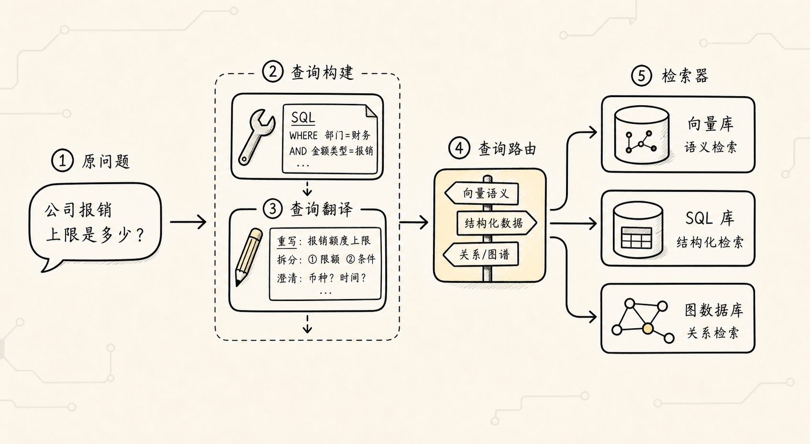
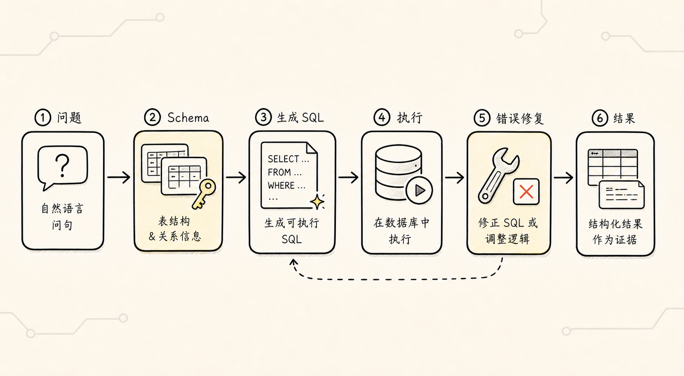
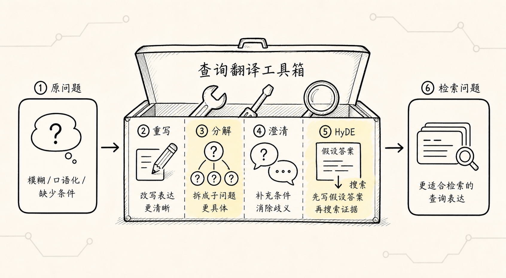
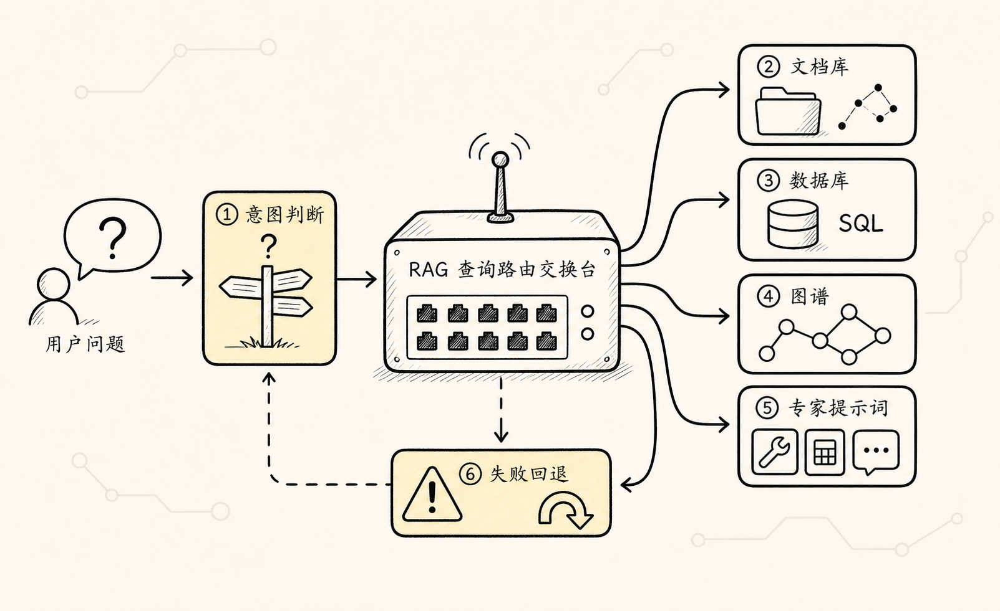

# RAG 检索前处理：不是把问题润色一下，而是先决定该怎么查

前面几篇里，我们已经把 RAG 的离线建库走了一遍：资料导入、文本分块、向量嵌入、写入向量数据库或索引。

到这里，一个基础知识库已经搭起来了。

很多 demo 接下来会直接进入在线检索：

```text
用户问题
-> 问题向量化
-> 向量数据库相似度检索
-> 拼接上下文
-> 大模型回答
```

这个流程没错，但它只覆盖了最简单的一类问题：用户问的是自然语言，知识也以自然语言文本存放，系统只需要做语义相似度匹配。

真实项目里，问题经常不是这样。

用户可能问：

```text
上个月山西 5A 景区游客量最高的是哪个？
```

这个问题更像数据库统计查询，答案可能在 MySQL 表里。

用户可能问：

```text
糖尿病和哪些并发症有两层以内关系？
```

这个问题更像图数据库查询，答案可能在 Neo4j 这样的知识图谱里。

用户也可能问：

```text
只看 2024 年以后、浏览量超过 100 万的视频，哪些讲到了山西古建筑？
```

这里既有语义问题“山西古建筑”，也有结构化条件“2024 年以后、浏览量超过 100 万”。

如果这些问题全部都直接 embedding，然后丢给向量库，系统很容易走错方向。

所以检索之前还需要一个环节，叫做检索前处理。

它要解决的核心问题不是：

```text
怎么把用户问题写得更漂亮？
```

而是：

```text
这个问题到底应该被翻译成什么查询？
应该查向量库、关系数据库、图数据库，还是几个地方一起查？
```

为了讲清楚这一节，我们先固定一个更完整的例子：

```text
你要做一个企业内部问答助手。

它背后有三类数据：
1. 文档知识库：制度、FAQ、故障复盘、产品说明
2. 关系数据库：订单、客户、景区游客量、销售额、报销记录
3. 图数据库：疾病关系、系统依赖、人员协作、知识概念网络

用户只会用自然语言提问。
系统必须先判断：这个问题该怎么查。
```

这就是检索前处理出现的地方。

## 一、为什么“直接向量检索”不够

基础 RAG 的直觉很简单：

```text
用户问一句话
-> 把这句话转成向量
-> 找语义相似的文本块
```

如果用户问：

```text
缓存雪崩怎么处理？
```

文档里刚好有一段：

```text
缓存雪崩的处理方案包括随机过期时间、缓存预热、限流降级和多级缓存。
```

那向量检索通常能找到。

但下面这些问题就不一样了。

第一个问题：

```text
太原市 5A 景区当月游客量是多少？
```

它不是要找一段“像”的文字，而是要从结构化表里查：

```sql
SELECT scenic_name, monthly_visitors
FROM scenic_spots
JOIN city_info ON scenic_spots.city_id = city_info.id
WHERE city_info.city = '太原'
  AND scenic_spots.level = '5A';
```

第二个问题：

```text
糖尿病相关概念两跳以内有哪些？
```

它不是普通文本相似，而是在图里找节点和关系：

```cypher
MATCH (d:Concept)-[*1..2]-(related:Concept)
WHERE d.name CONTAINS 'diabetes'
RETURN d, related
LIMIT 100
```

第三个问题：

```text
找 2024 年以后浏览量超过 100 万、讲山西古建筑的视频。
```

它既需要语义检索：

```text
山西古建筑
```

也需要元数据过滤：

```json
{
  "publish_year": { "$gte": 2024 },
  "view_count": { "$gte": 1000000 }
}
```

你会发现，这些问题的共同点是：

**用户说的是自然语言，但系统真正需要执行的，不一定是自然语言检索。**

有时要生成 SQL。

有时要生成 Cypher。

有时要抽取 Metadata Filter。

有时要把一个模糊问题改写、拆分、扩展。

有时要先判断该走哪个数据源。

这就是检索前处理的技术栈。

## 二、检索前处理的三件事



按照极客时间 RAG 第八章的讲法，检索前处理可以先拆成三块：

```text
检索前处理
├── 查询构建：把自然语言构造成可执行查询
├── 查询翻译：把原始问题改写、拆解、澄清或扩展
└── 查询路由：决定问题应该去哪查、用哪套提示或检索器
```

这三块的关注点不一样。

查询构建关心的是：

```text
用户这句话能不能变成 SQL、Cypher 或过滤条件？
```

查询翻译关心的是：

```text
用户原问题太模糊、太短、太散，能不能改成更好检索的表达？
```

查询路由关心的是：

```text
这个问题应该走向量库、关系数据库、图数据库、多模态检索，还是不同提示模板？
```

用一句话记：

**查询构建解决“怎么写查询”，查询翻译解决“怎么问得更清楚”，查询路由解决“去哪查”。**

后面我们就沿着这三件事展开。

## 三、查询构建：把自然语言变成可执行查询

查询构建是检索前处理中最硬的一块。

因为它不是简单改写一句话，而是要把自然语言变成某个系统能执行的查询表达。

比如：

- 面向关系数据库：生成 SQL
- 面向图数据库：生成 Cypher
- 面向向量数据库：生成 Metadata Filter

它背后的核心思想是：

```text
如果数据源不是纯文本，就不能只用纯文本检索。
```

### 1. Text2SQL：让用户用自然语言查关系数据库



Text2SQL 要解决的问题很直接：

```text
业务人员不会写 SQL，但数据在关系数据库里。
能不能让他用自然语言问，系统自动生成 SQL？
```

比如用户问：

```text
太原市 5A 景区当月游客量是多少？
```

如果数据库里有两张表：

```text
city_info(id, city_name, province)
scenic_spots(id, city_id, scenic_name, level, monthly_visitors)
```

系统就要生成一条 SQL，去 join 城市表和景区表，过滤 `city_name = 太原`、`level = 5A`，再取游客量。

这和向量检索完全不同。

向量检索是在找“相似文本块”。

Text2SQL 是在生成“可执行数据库查询”。

所以它最需要的不是 embedding，而是 schema。

也就是数据库结构：

```text
有哪些表？
每张表有哪些字段？
字段是什么意思？
表和表之间怎么关联？
有没有常见查询样例？
```

如果模型不知道 schema，它就只能凭空猜字段。

比如它可能生成：

```sql
SELECT visitors
FROM tourist_sites
WHERE city = '太原' AND rating = '5A';
```

这条 SQL 看起来像对的，但真实数据库里也许根本没有 `tourist_sites`、`visitors`、`rating` 这些字段。

这就是 Text2SQL 最常见的失败：

**SQL 写得像真的，但字段和表是幻觉。**

一个更靠谱的 Text2SQL 流程通常是：

```text
用户自然语言问题
-> 理解意图
-> 选择相关表和字段
-> 注入 DDL / 字段说明 / 示例 SQL
-> 生成 SQL
-> 清理输出格式
-> SQL 安全校验
-> 执行查询
-> 把查询结果转回自然语言
```

这里面有两个点很重要。

第一，不要把所有 schema 一股脑塞给模型。

企业数据库可能有几百张表、几千个字段。如果全部塞进上下文，模型既看不过来，也容易选错。

更好的做法是先做一次 schema 检索：

```text
用户问题
-> 找最相关的表和字段
-> 只把这些 schema 交给模型
-> 再生成 SQL
```

这其实也是一种 RAG。

只不过检索的不是业务文档，而是数据库 schema 和 SQL 样例。

第二，生成 SQL 不能直接无脑执行。

生产系统至少要做这些保护：

- 只允许只读查询
- 禁止 `DROP`、`DELETE`、`UPDATE`、`INSERT`
- 限制返回行数
- 设置查询超时
- 校验表名和字段名是否存在
- 检查用户权限
- 记录审计日志
- 执行失败时让模型基于错误信息修复，但要限制重试次数

RagFlow 这类产品化方案的思路也类似：先准备 DDL 知识库、字段说明知识库、Query-to-SQL 样例知识库，再让 Agent 检索相关信息、生成 SQL、连接数据库执行，并根据错误结果循环修复。

这个思路给我们的启发是：

**Text2SQL 不是一次提示词调用，而是一条带 schema 检索、执行校验和错误修复的查询链路。**

还有一种场景要单独说。

如果企业表特别多，业务逻辑特别复杂，直接让模型生成 SQL 未必是最好的选择。

这时可以把常见业务查询封装成函数：

```text
get_monthly_sales(region, month)
predict_next_quarter_sales(product_line)
get_customer_risk_score(customer_id)
```

模型不直接写 SQL，而是识别用户意图，再调用这些预先设计好的业务函数。

这种方式牺牲了一些自由度，但安全性、稳定性和业务可控性更好。

所以 Text2SQL 的边界是：

```text
简单表结构、小中型 schema、只读分析场景，可以尝试生成 SQL。
复杂核心业务系统，更适合函数封装 + 工具调用。
```

### 2. Text2Cypher：让用户用自然语言查图数据库

Text2Cypher 和 Text2SQL 很像。

区别是 SQL 面向关系数据库，Cypher 面向图数据库。

关系数据库的核心是：

```text
表
字段
行
join
```

图数据库的核心是：

```text
节点
关系
属性
路径
```

所以它更适合回答这类问题：

```text
糖尿病和哪些疾病有两层以内关系？
```

```text
这个故障影响了哪些服务，分别依赖哪些中间件？
```

```text
某个客户和哪些产品、工单、销售人员有关联？
```

这些问题不是简单查一行数据，而是在找实体之间的关系。

如果用普通向量检索，系统可能找到几段提到“糖尿病”的文本，但很难稳定回答“两层以内关系”。

如果图数据库已经建好，就可以通过 Cypher 查：

```cypher
MATCH (d:Concept)-[*1..2]-(related:Concept)
WHERE d.name CONTAINS 'diabetes'
RETURN d.name, related.name
LIMIT 100
```

但 Cypher 对很多业务用户来说更陌生。

所以 Text2Cypher 的目标是：

```text
用户说自然语言
-> 系统生成图查询语句
-> 图数据库返回节点和关系
-> 再转成自然语言解释
```

它同样依赖 schema。

只不过这里的 schema 不是表结构，而是：

- 有哪些节点类型
- 有哪些关系类型
- 节点有哪些属性
- 关系方向是什么
- 哪些路径查询是允许的

如果 schema 不准确，模型生成的 Cypher 也会像 SQL 一样“看起来对，执行为空”。

课程里的经验很重要：第一版只靠手写的图 schema 描述，可能生成语句却查不到结果；更靠谱的做法是先从真实图数据库里动态查询节点类型、关系类型和属性，再把这些实际 schema 传给模型。

也就是：

```text
先查图数据库真实结构
-> 把实际节点 / 关系 / 属性交给模型
-> 再生成 Cypher
-> 执行并验证
```

这和 Text2SQL 的 schema 注入是同一个思想。

区别只是数据源换成了图。

这里也要强调安全和边界：

- 限制可查询的节点和关系类型
- 限制路径深度
- 限制返回数量
- 校验 Cypher 语法
- 避免危险写操作
- 对空结果做诊断，而不是直接生成貌似合理的答案

一句话记：

**Text2Cypher 的难点不是“让模型会写 Cypher”，而是让模型基于真实图 schema 写出能查到东西的 Cypher。**

### 3. Metadata Filter：向量检索前先过滤范围

前面两个例子都是自然语言转数据库查询。

但查询构建不只发生在关系数据库和图数据库里。

向量数据库里也有查询构建。

最典型的就是 Metadata Filter。

我们先看一个问题：

```text
找 2024 年以后浏览量超过 100 万、讲山西古建筑的视频。
```

这里有两类信息。

第一类是语义信息：

```text
山西古建筑
```

这适合向量检索。

第二类是结构化条件：

```text
2024 年以后
浏览量超过 100 万
```

这不适合只靠向量相似度。

如果每个视频文档都有 metadata：

```json
{
  "title": "跟着悟空游山西",
  "author": "行迹旅途中",
  "publish_year": 2024,
  "view_count": 1200000,
  "duration": 960
}
```

那系统应该先从用户问题里抽取过滤条件：

```json
{
  "publish_year": { "$gte": 2024 },
  "view_count": { "$gte": 1000000 }
}
```

再在过滤后的候选里做语义检索：

```text
山西古建筑
```

这就叫 Metadata Filter 生成。

它看起来像一个小功能，但思想很重要：

**向量检索负责找语义相关，元数据过滤负责保证条件正确。**

比如用户问：

```text
只看 2025 年的政策，报销标准是多少？
```

如果不抽取 `year = 2025`，系统可能召回 2023 年旧制度。

比如用户问：

```text
只看浏览量超过 100 万的视频。
```

如果不抽取 `view_count > 1000000`，系统可能召回内容相似但热度很低的视频。

所以 Metadata Filter 是一种“轻量级 Text2SQL”。

它不生成完整 SQL，但会从自然语言中生成结构化条件。

它的输入是：

```text
用户问题 + 可用 metadata 字段说明
```

它的输出是：

```text
语义查询文本 + 结构化过滤条件
```

比如：

```json
{
  "query": "山西古建筑 视频内容",
  "filter": {
    "publish_year": { "$gte": 2024 },
    "view_count": { "$gte": 1000000 }
  }
}
```

这里也有坑。

如果 metadata 字段没有说明，模型可能不知道 `view_count`、`publish_date`、`author` 分别怎么用。

如果字段类型混乱，把年份存成字符串，比较操作就容易出错。

如果过滤过严，可能把真正相关的文档误杀。

所以元数据过滤要遵守一个原则：

```text
能从用户问题明确抽出的条件，才进入 filter。
不确定的内容，宁可保留给语义检索和后续重排。
```

## 四、查询翻译：让问题变得更适合检索



查询构建解决的是“把自然语言变成 SQL、Cypher、Filter”。

查询翻译解决的是另一个问题：

**用户原问题质量不高，直接检索会漏掉重点。**

这里的“翻译”不是从中文翻英文，而是把一个不适合检索的问题，转换成更适合检索的表达。

它常见有四类：

- 查询重写
- 查询分解
- 查询澄清
- HyDE 假设文档

### 1. 查询重写：把口语问题改成检索问题

用户经常不会按知识库里的术语提问。

比如游戏客服场景里，用户问：

```text
我刚开始玩，这关感觉很难，应该先学啥？
```

这句话对人能懂，但检索系统不好查。

查询重写会把它改成：

```text
普陀山关卡新手优先学习哪些技能
```

这样检索系统更容易命中“普陀山关卡”“技能推荐”“新手攻略”这些文档。

在 RAG 流程里，这意味着：

```text
原始问题
-> LLM 重写
-> 重写后的问题 embedding
-> 向量检索
```

注意，这里的 LLM 不是在最终回答问题。

它是在 retrieve 之前做重写器。

所以 RAG 里不只有生成阶段会用大模型，检索阶段也可能用大模型。

查询重写的目标是提高可检索性，不是改变用户意图。

如果用户只问“这关技能怎么点”，系统可以补成“新手技能推荐”。

但不能擅自扩成“装备选择、Boss 攻略、地图路线、隐藏任务”全部都查。

重写是翻译，不是加戏。

### 2. 查询分解：把一个大问题拆成多个子问题

有些问题不是问得不清楚，而是问得太大。

比如：

```text
这款游戏新手怎么玩？
```

这个问题可能包含：

```text
1. 游戏整体难度怎么样？
2. 新手应该优先学习哪些技能？
3. 普陀山关卡有哪些难点？
4. 有没有角色培养建议？
5. 通关过程中有哪些常见陷阱？
```

如果只检索一次，系统可能只找到一类内容。

查询分解会把一个大问题拆成多个子查询，然后多路检索，再合并结果。

这就是 Multi Query Retriever 这类方法的价值。

它把“一问一搜”变成：

```text
一个用户问题
-> 多个子问题
-> 多路检索
-> 候选合并
-> 后续重排 / 压缩
```

这会提升召回覆盖率，但也会增加成本和延迟。

所以查询分解要控制数量。

不是所有问题都要拆成五个。

拆分越多，不一定越好；如果每个子问题都偏一点，最后召回的噪声也会更多。

### 3. 查询澄清：把模糊问题逐步细化

有些问题最大的麻烦不是太大，而是太模糊。

比如：

```text
孙悟空有什么能力？
```

这个问题可以从很多角度回答：

- 战斗能力
- 移动能力
- 变化能力
- 法术能力
- 剧情设定
- 游戏技能

查询澄清的思路是先构建一个问题澄清树，把大问题分成更明确的方向。

大概像这样：

```text
孙悟空有什么能力？
├── 战斗能力
│   ├── 武器能力
│   └── 招式技能
├── 变化能力
│   ├── 七十二变
│   └── 分身变化
└── 移动能力
    └── 腾云驾雾
```

这个思路来自 Tree of Clarifications 一类方法。

它的核心不是某个具体算法，而是一个朴素原则：

```text
模糊问题不要急着检索，先把可能的解释方向展开。
```

在企业系统里，这也很常见。

用户问：

```text
这个项目风险怎么样？
```

你可能要先澄清：

```text
是进度风险？
是成本风险？
是质量风险？
是客户风险？
还是合规风险？
```

如果系统不澄清，直接检索“项目风险”，召回结果会非常散。

### 4. HyDE：先生成假设答案，再拿答案去检索

HyDE 是 Hypothetical Document Embeddings。

它的想法有点反直觉：

```text
不要直接拿问题去检索。
先让大模型根据问题写一段“假设答案”。
再拿这段假设答案去检索真实知识库。
```

比如用户问：

```text
游戏主人公有哪些技能？
```

这个问题本身很短，语义信息很少。

如果先让模型生成一段假设文档，它可能写出：

```text
主人公可能拥有金箍棒、变化术、腾云驾雾、分身、闪避和战斗连招等技能。
```

这段话虽然不一定完全正确，但它比原问题包含更多检索线索。

拿它去知识库里检索，可能更容易命中真正讲技能设定的文档。

HyDE 的本质是：

```text
用一个“可能的答案形状”，去接近真实答案所在的文档。
```

它适合原问题太短、太抽象、缺少关键词的场景。

但它也有风险。

如果假设文档生成得太偏，检索方向也会偏。

所以 HyDE 更适合作为一种增强策略，而不是所有问题默认都用。

## 五、查询路由：先判断该去哪查



讲完查询构建和查询翻译，再看查询路由就很自然了。

因为现在系统手里有很多可能的路：

- 向量数据库
- 关系数据库
- 图数据库
- 多模态检索
- 关键词检索
- 不同提示模板
- 不同业务工具

用户问题进来以后，不能每次都全部跑一遍。

查询路由要解决的是：

```text
这个问题最应该走哪条路？
```

比如：

```text
Python 中列表和元组有什么区别？
```

这应该路由到 Python 文档知识库。

```text
上个月销售额是多少？
```

这应该路由到关系数据库或业务函数。

```text
糖尿病和哪些疾病有关联？
```

这应该路由到图数据库。

```text
这张截图里有什么错误？
```

这应该路由到多模态检索或视觉模型。

```text
黑悟空这个 Boss 怎么打？
```

如果系统有多个提示模板，也许应该路由到“战斗技巧专家”模板，而不是“剧情路线专家”模板。

所以查询路由可以有两种常见形态。

第一种是数据源路由：

```text
问题 -> 判断数据源 -> 选择向量库 / SQL / 图数据库 / 多模态
```

第二种是提示模板路由：

```text
问题 -> 判断意图 -> 选择对应专家提示词
```

，它们都是意图识别。

只不过一个决定“查哪里”，一个决定“用什么方式回答”。

一个简单的路由规则可以这样理解：

```text
有统计、排名、数量、时间聚合 -> 优先 SQL
有实体关系、多跳路径、上下游依赖 -> 优先图检索
有制度、FAQ、解释性问题 -> 优先向量检索
有精确编号、错误码、函数名 -> 优先关键词检索
有图片、视频、截图 -> 优先多模态检索
问题复杂且跨类型 -> 多路路由后融合
```

查询路由看起来简单，但它很关键。

因为路由一错，后面再强也容易错。

比如本来应该查 SQL 的统计问题，被送进向量库，系统可能找一段“销售额定义”来回答。

本来应该查图数据库的关系问题，被送进普通文档库，系统可能只能返回零散描述。

所以成熟系统要记录路由日志：

```text
原始问题
识别出的意图
选择的数据源
选择的提示模板
是否走了回退路径
最终答案是否命中
```

这样才能不断发现误路由样本，更新规则或模型。

## 六、把三块串成一条链路

现在我们把检索前处理串起来。

用户问题进入系统以后，可以先走这样一条逻辑：



当然，真实系统不一定每次都跑这么完整。

简单问题可以走轻链路：

```text
问题
-> 查询重写
-> 向量检索
-> 回答
```

结构化问题走 SQL 链路：

```text
问题
-> 路由到关系数据库
-> 选择相关 schema
-> Text2SQL
-> 校验执行
-> 回答
```

图关系问题走 Cypher 链路：

```text
问题
-> 路由到图数据库
-> 获取图 schema
-> Text2Cypher
-> 执行图查询
-> 回答
```

带条件的文本问题走混合链路：

```text
问题
-> 抽取 Metadata Filter
-> 重写语义查询
-> 过滤后向量检索
-> 回答
```

这就是检索前处理最重要的变化：

**它让 RAG 从“拿问题去搜文本”，升级为“先理解问题该怎样被查询”。**

## 七、检索前处理最容易踩的坑

第一个坑，是把所有问题都当向量检索问题。

向量检索很强，但它不是万能入口。

统计、聚合、排序、精确过滤、多跳关系，这些问题往往需要 SQL、Cypher、Metadata Filter 或专门工具。

第二个坑，是只让模型生成查询，不给 schema。

Text2SQL 和 Text2Cypher 的质量很大程度取决于 schema 是否准确。

没有表结构、字段说明、关系方向和样例查询，模型很容易生成“像真的但不可执行”的查询。

第三个坑，是生成后直接执行。

SQL 和 Cypher 都可能出错，也可能越权。

任何可执行查询都应该经过校验、权限控制、行数限制、超时和审计。

第四个坑，是查询翻译过度。

重写、分解、HyDE 都可能提高召回，但也可能引入语义漂移。

用户问 A，系统不能为了“更完整”擅自查 B、C、D。

第五个坑，是路由后没有回退。

路由器一定会犯错。

所以应该有保守回退策略。

比如 SQL 生成失败时，可以回退到文档解释；图查询为空时，可以回退到向量检索；多路结果冲突时，可以提示证据不足，而不是硬答。

## 八、怎么判断检索前处理做得好不好

不要只看重写后的问题是否通顺，也不要只看 SQL 是否生成出来。

要看它有没有提升端到端检索效果。

可以观察这些问题：

- 路由是否选对了数据源
- Text2SQL 是否使用了真实存在的表和字段
- Text2Cypher 是否基于真实图 schema
- Metadata Filter 是否正确抽取了年份、作者、浏览量、权限等条件
- 查询重写后，正确证据是否更靠前
- 查询分解后，是否覆盖了原问题里的多个子意图
- HyDE 是否带来了更相关的召回，还是让问题跑偏
- 生成的可执行查询是否通过安全校验
- 查询失败时有没有回退路径

工程上最好记录一份检索前处理日志：

```text
原始问题
路由结果
查询翻译结果
抽取的 filters
选中的 schema
生成的 SQL / Cypher
校验结果
执行结果
回退路径
最终进入生成阶段的证据
```

如果没有这些日志，RAG 调优很容易变成“凭感觉改 prompt”。

而检索前处理一旦可观测，你就能知道：

```text
答案不对，是路由错了？
是 schema 选错了？
是 SQL 生成错了？
是 filter 太严了？
是 query rewrite 漂移了？
还是后处理阶段把证据丢了？
```

这才是真正可调试的 RAG。

## 九、把这一节放回 RAG 全链路里

现在把这一节放回链路里看，检索前处理站在用户问题和检索系统之间。

它的职责不是简单“优化问题”，而是先做判断：

```text
这个问题是不是 SQL 问题？
是不是图查询问题？
是不是带 metadata 条件的向量检索问题？
是不是需要重写、拆解、澄清或 HyDE？
是不是需要路由到不同数据源或提示模板？
```

所以这一节可以用一句话记住：

**检索前处理，就是把自然语言问题变成正确的查询入口。**

基础 RAG 关心的是：

```text
怎么从向量库里找相似文本？
```

检索前处理开始关心的是：

```text
这个问题到底该不该查向量库？
如果该查，又应该带着什么查询、什么过滤条件、什么路由策略去查？
```

这一步做好了，后面的检索才有机会找对。

下一篇就可以继续看索引优化。

如果检索前处理解决的是“问题怎么进入系统”，那索引优化解决的就是：

```text
知识库本身应该怎么组织，才能让正确内容更容易被找出来。
```
