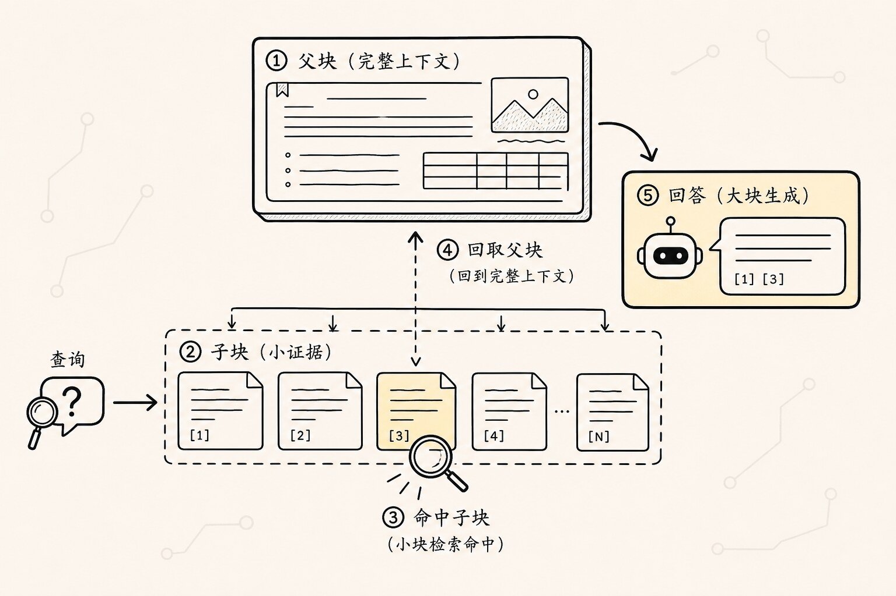
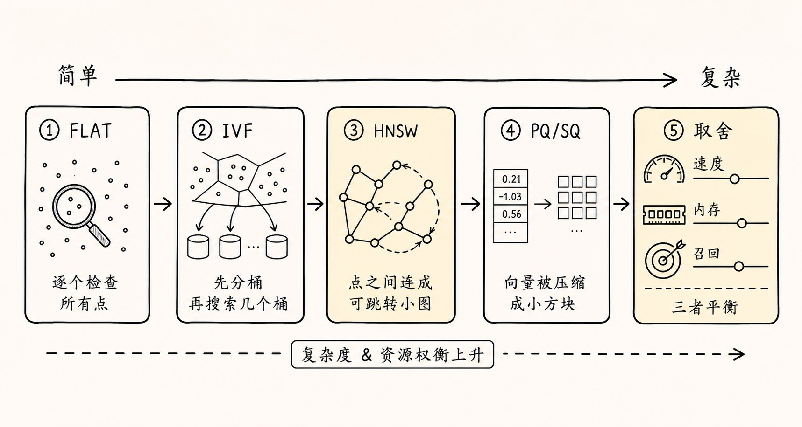

# RAG 索引优化：父子块、多表示索引与结构化召回入口

上一篇讲检索前处理时，我们已经看到一个问题：

> 用户问出来的话，往往和资料里写出来的话不是同一种表达。

所以我们会做查询改写、子问题拆分、HyDE、metadata filter、查询路由，让“用户的问题”尽量变成更适合检索系统理解的形状。

但这里还有另一半问题：

> 就算查询变好了，如果索引本身只有一条很单薄的路，系统还是可能找不到答案。

如果只看基础版本，索引就是一条很直的链路：

```text
文档
-> 分块
-> embedding
-> 存进向量数据库
```

这当然能跑通最小版本的 RAG。

但到了真实业务里，你很快会遇到一些更麻烦的问题：

- 答案在文档里，但 chunk 太碎，召回后上下文不完整。
- 用户问的是一句人话，原文写的是一段制度语言，语义匹配不稳。
- 文档有标题、表格、章节、版本、生效日期，但普通向量索引没有充分利用这些结构。
- 一篇长文里有很多层级，系统直接在所有 chunk 里找，既慢又容易被局部片段带偏。
- 检索结果里有答案，但排在第 8 位，最终没有进入模型上下文。

这时问题已经不是“有没有向量库”，而是：

**知识被放进系统以后，有没有被组织成容易被找到、容易被解释、容易被组合的样子。**

这就是索引优化要解决的事。

这篇属于 [RAG 检索增强系列](/blog/AI/2.Rag) 中偏工程调优的一环。第一次阅读建议先看 [RAG 整体流程](./01.整体步骤) 建立离线建库与在线问答链路，再结合 [检索前置处理](./05.检索前置处理) 理解查询侧优化和索引侧优化如何配合。

还是用公司制度问答助手里的那个问题来看。用户会问：

```text
我去上海出差，高铁二等座和酒店每天最多能报多少？
```

这个问题看起来只是一次普通查询，但它会考验索引的很多能力：

- 能不能找到“上海”对应的城市级别？
- 能不能找到“高铁二等座”的交通标准？
- 能不能找到“酒店每天上限”的住宿标准？
- 能不能区分普通员工、主管、高管的不同额度？
- 能不能保留制度版本和生效日期？
- 能不能把表格行、章节说明和特殊条款一起带回来？

如果索引只是把所有文本 chunk 平铺进向量库，系统可能能回答一些简单问题，但在这种组合型问题面前就会变得不稳定。

## 一、故事要从“普通向量索引不够用”开始

最基础的 RAG 索引通常长这样：

```text
原始文档
-> 文档解析
-> 文本分块
-> chunk embedding
-> 向量数据库
```

查询时：

```text
用户问题
-> query embedding
-> 向量相似度检索
-> top_k chunks
-> 放入模型上下文生成答案
```

这套流程能跑通最小闭环，也适合 demo 和简单知识库。

但它有一个默认假设：

> 用户问题和答案 chunk 在语义空间里足够接近。

真实情况经常不是这样。

比如制度原文写的是：

```text
一类城市住宿费标准：普通员工不超过 500 元/人/晚。
```

用户问的是：

```text
我去上海出差，酒店每天最多能报多少？
```

这里面至少有三层转换：

```text
上海 -> 一类城市
酒店每天最多能报多少 -> 住宿费标准
我 -> 需要识别人员级别或默认普通员工
```

如果只靠原文 chunk 的向量相似度，系统可能召回“住宿费标准”，也可能召回一堆“出差申请流程”“酒店发票要求”“一类城市名单”之类的片段。

答案也许在候选里，但不一定排在前面。

更麻烦的是，答案往往不在一个 chunk 里。

这个问题可能需要同时查：

```text
城市级别表：上海属于一类城市
交通标准表：高铁二等座可报销
住宿标准表：一类城市普通员工 500 元/晚
制度正文：报销需要事前审批和合规发票
```

普通向量索引把这些内容当成一堆平铺的文本片段。它缺少一种能力：

> 知道哪些片段是同一份证据链上的不同部分。

所以索引优化的第一步，不是急着换更贵的模型，而是重新审视索引到底承担什么职责。

索引不是“把文本存起来”。

索引更像一张知识地图：

```text
用户可能怎么问
-> 系统应该先去哪一层找
-> 找到小片段后要不要回填大上下文
-> 原文、摘要、问题形式、表格、元数据之间如何关联
-> 哪些候选应该优先进入模型上下文
```

这张地图画得越好，检索越稳。

## 二、索引优化到底在优化什么


在 RAG 里，索引优化主要不是优化“存储”本身，而是在优化三件事：

```text
召回率：答案证据能不能被找回来
精确率：找回来的内容噪声多不多
上下文质量：交给模型的内容是否完整、可信、可回答
```

这三个目标经常互相拉扯。

如果你把 chunk 切得很小，检索会更精确，但上下文容易断。

如果你把 chunk 切得很大，上下文更完整，但向量语义会被稀释，召回会变粗。

如果 top_k 设得很大，答案更可能被召回，但噪声也会变多，生成阶段更容易被干扰。

如果只召回最相似的几个片段，回答会更干净，但复杂问题可能缺证据。

所以索引优化不是一个单点技巧，而是一组围绕“证据如何被找到”的设计。

可以把它理解成这条链：

```text
基础 chunk 索引
-> 父子块索引
-> 上下文扩展
-> 层次索引
-> 多表示索引
-> 结构化索引
-> 混合检索入口
-> 选修：向量数据库索引参数
-> 重排与评估闭环
```

后面的每一步，都是在修补前一步留下的问题。

## 三、父子块索引：小块负责找，大块负责答



上一篇分块技术里提过一个矛盾：

```text
检索希望 chunk 小一点
生成希望上下文大一点
```

检索阶段需要精准命中。

用户问“上海酒店报销上限”，最容易匹配的可能是一小段：

```text
一类城市住宿费标准：普通员工不超过 500 元/人/晚。
```

但生成阶段只看到这句话还不够。模型可能还需要知道：

- 一类城市包括哪些城市？
- 这条标准适用于什么人员级别？
- 是否需要审批？
- 是否有生效日期？
- 是否有特殊例外？

于是父子块索引出现了。

它的思路很简单：

```text
子块：切小一点，用来做精准检索
父块：保留大一点，用来补充生成上下文
```

在公司制度问答助手里，可以这样组织：

```text
父块：差旅制度 / 住宿标准章节
  子块 1：城市级别说明
  子块 2：一类城市住宿标准
  子块 3：二类城市住宿标准
  子块 4：特殊审批规则
```

检索时先用子块匹配用户问题：

```text
用户问：上海酒店每天最多能报多少？
-> 命中子块：一类城市住宿标准
```

然后系统不只把这个子块交给模型，而是回填它所属的父块：

```text
子块命中
-> 找到父块
-> 把住宿标准章节一起放入上下文
```

这样做的好处是：

```text
召回时足够精确
生成时足够完整
```

父子块索引解决的是“切小了会丢上下文”的问题。

但它还有一个边界。

它假设答案仍然在同一个父块附近。如果问题需要跨章节、跨表格、跨文档组合，单靠父子块还不够。

比如用户问：

```text
我去上海出差，高铁二等座和酒店每天最多能报多少？
```

交通标准和住宿标准可能不在同一个父块里。

这就需要下一步：上下文扩展。

## 四、上下文扩展：命中一个点，带回它周围的证据

上下文扩展解决的是另一个常见问题：

> 检索命中了一个正确片段，但它旁边的关键信息没有一起回来。

比如系统命中了这一句：

```text
普通员工不超过 500 元/人/晚。
```

但这句话前面一段写的是：

```text
一类城市包括北京、上海、广州、深圳。
```

后面一段写的是：

```text
超出标准部分需由部门负责人提前审批。
```

如果只看命中的那一句，模型能回答额度，但可能解释不清适用城市和审批边界。

上下文扩展的做法是：命中一个 chunk 后，把它的邻居也带回来。

常见方式有几种：

```text
前后窗口扩展：带上命中 chunk 前后的 N 个 chunk
章节扩展：带上同一标题下的所有相关片段
父块扩展：带上命中子块所属的父块
引用扩展：带上表格说明、脚注、附件、版本信息
```

在公司制度问答助手里，它可能长这样：

```text
命中：一类城市住宿标准
扩展：
- 城市级别说明
- 一类城市名单
- 住宿标准表头
- 特殊审批规则
- 生效日期
```

这样模型拿到的就不是孤零零的一行数字，而是一组可以回答问题的证据。

但上下文扩展也不能无限扩。

扩得太少，证据不完整。

扩得太多，噪声又回来了。

所以这里有一个实用原则：

> 扩展的目标不是“多给模型一点”，而是“补齐回答这个问题所需的最小证据链”。

如果每次命中一个 chunk 都把整章、整篇、整份制度塞进去，那就退回到“不分块”的老问题了。

上下文扩展解决的是“局部证据不完整”的问题。

但如果资料本身很长，比如一本几百页的手册，直接在所有 chunk 里平铺检索依然会很粗。

这就引出层次索引。

## 五、层次索引：先找章节，再找片段

人查长文档时，通常不会从每一句话开始找。

你会先看目录：

```text
员工手册
-> 第 4 章：考勤与请假
-> 第 7 章：差旅与报销
-> 第 9 章：绩效与晋升
```

如果问题是“上海出差酒店报销”，你会先进入“差旅与报销”，再找“住宿标准”。

层次索引就是把这种查找路径放进 RAG。

它会把文档组织成多个层级：

```text
文档级摘要
-> 章节级摘要
-> 小节级摘要
-> 段落或 chunk
-> 原文证据
```

查询时，系统可以先粗后细：

```text
用户问题
-> 先匹配文档或章节摘要
-> 定位到可能相关的章节
-> 再在章节内部检索具体 chunk
```

对于长文档，这样做有两个好处。

第一个好处是减少搜索空间。

系统不需要在所有制度、所有段落里盲搜，而是先定位大范围。

第二个好处是保留文档结构。

模型不仅知道“这句话相似”，还知道它属于哪份制度、哪个章节、哪个小节。

在公司制度问答助手里，层次索引可能是：

```text
公司制度库
  员工手册
    请假制度
    考勤制度
  报销制度
    差旅申请
    交通标准
    住宿标准
    餐补标准
  财务制度
    发票要求
    审批流程
```

用户问“上海出差酒店每天最多能报多少”，系统可以先定位：

```text
报销制度 -> 住宿标准
```

再进入具体表格或条款。

层次索引特别适合：

- 长文档
- 课程教材
- 企业制度
- 法律合同
- 技术手册
- 多章节报告

但它也有风险。

如果上层摘要写得太粗或写错了，查询可能一开始就被路由到错误章节。

比如“差旅费用”摘要里没有提到“住宿”，系统可能错过住宿标准。

所以层次索引通常要配合两个机制：

```text
摘要质量检查：确保上层摘要能代表下层内容
横向补召回：不要只相信一条路，必要时仍然从全局 chunk 里补一些候选
```

层次索引解决的是“长文档平铺检索太粗”的问题。

但它还没有解决“用户问法和原文写法差异太大”的问题。

这就需要多表示索引。

## 六、多表示索引：同一份知识，准备多个入口

很多 RAG 召回失败，并不是因为答案不存在，而是因为用户的问法和原文的写法对不上。

原文可能写：

```text
住宿费标准按城市类别和员工职级执行。
```

用户可能问：

```text
上海住酒店一天能报多少钱？
```

再比如原文写：

```text
一类城市普通员工住宿上限为 500 元/人/晚。
```

用户可能问：

```text
普通员工去一线城市出差住酒店，公司最多给报多少？
```

这些表达都在问同一件事，但字面差异很大。

多表示索引的核心思路是：

> 不要只把原文作为唯一入口，而要为同一份知识建立多个可检索表示。

同一条制度，可以建立这些表示：

```text
原文 chunk：
一类城市住宿费标准：普通员工不超过 500 元/人/晚。

摘要表示：
普通员工在一类城市出差时，住宿费上限为每晚 500 元。

问题表示：
普通员工去上海出差酒店能报销多少？
一类城市住宿费标准是多少？
酒店报销上限怎么按城市分类？

关键词表示：
上海，一类城市，住宿费，酒店，报销上限，普通员工，500 元

元数据表示：
制度=差旅报销制度
章节=住宿标准
城市级别=一类城市
人员级别=普通员工
费用类型=住宿
生效日期=2025-01-01
```

用户不管从哪个角度问，都更容易撞上其中一个入口。

这就是多表示索引的价值：

```text
原文负责保真
摘要负责概括
问题形式负责贴近用户问法
关键词负责精确术语
元数据负责过滤和约束
```

它特别适合这些场景：

- 原文很正式，用户问法很口语。
- 原文是表格，用户问的是自然语言。
- 原文里有大量缩写、编号、术语、产品名。
- 同一内容可能被用户从多个角度提问。
- 需要同时兼顾语义相似和关键词精确匹配。

在实现上，多表示索引通常不是简单复制多份原文，而是让多个表示都指回同一个原始证据。

可以理解成：

```text
多个入口
-> 指向同一条证据
-> 最终给模型看的仍然是可信原文
```

这样可以避免一个问题：

> 摘要或问题表示只是帮助召回，不能替代原文成为最终事实依据。

比如系统可以用“普通员工去上海酒店能报多少”这个问题表示召回，但最终回答时，应该引用原制度里的住宿标准、城市级别和生效日期。

多表示索引解决的是“用户问法和资料写法不一致”的问题。

但如果资料里有大量表格、字段、关系，只做文本表示还不够。

这就引出结构化索引。

## 七、结构化索引：把表格、字段和关系也纳入检索

RAG 里有一类资料特别容易被普通文本索引处理坏：结构化资料。

比如差旅标准 CSV：

```text
城市级别, 城市, 住宿上限, 交通标准, 人员级别
一类, 上海, 500, 高铁二等座, 普通员工
一类, 北京, 500, 高铁二等座, 普通员工
二类, 成都, 400, 高铁二等座, 普通员工
```

如果把这张表粗暴转成一大段文本，再做 embedding，很多结构信息会变模糊：

- 哪个数字属于哪个字段？
- 上海和 500 是什么关系？
- 500 是住宿上限还是交通补贴？
- 普通员工和高管是否有不同标准？
- 表头是否被保留下来了？

结构化索引的目标是：

> 让系统不仅能检索文本，还能理解字段、行列、实体和关系。

对于表格，可以做这些处理：

```text
按行索引：
上海 一类城市 普通员工 住宿上限 500 元 高铁二等座

按字段索引：
城市=上海
城市级别=一类
费用类型=住宿
人员级别=普通员工
上限=500

按表格摘要索引：
这张表记录不同城市级别、员工级别下的交通和住宿报销标准。

按问题形式索引：
上海酒店报销上限是多少？
普通员工去上海出差能坐什么交通工具？
一类城市住宿费标准是多少？
```

对于制度文本，也可以抽取结构化信息：

```text
制度名称：差旅报销制度
条款类型：住宿标准
适用对象：普通员工
城市范围：一类城市
金额上限：500 元/人/晚
审批要求：超标需提前审批
```

这样用户问问题时，系统不只做语义相似度，还可以用结构化条件缩小范围：

```text
城市=上海
费用类型=住宿
人员级别=普通员工
```

结构化索引非常适合：

- 表格
- FAQ
- 产品参数
- 合同条款
- 政策规则
- 数据库 schema
- 知识图谱实体关系

它解决的是“文本相似度无法稳定表达结构关系”的问题。

但结构化索引也有边界。

抽取字段会引入额外成本，也可能抽错。字段设计太细，会让维护变重；字段设计太粗，又起不到过滤作用。

所以结构化索引要从高价值字段开始，而不是一上来追求全量结构化。

比如公司制度问答助手里，优先结构化这些字段就很有用：

```text
制度名称
章节
费用类型
城市
城市级别
人员级别
金额上限
生效日期
审批要求
```

这些字段直接影响回答正确性。

## 八、混合检索：语义相似和关键词精确匹配要一起用

前面讲多表示索引时，我们已经看到一个事实：

> 用户问题和资料原文不一定在同一种表达空间里。

这也是为什么生产 RAG 里经常会引入混合检索。

先把几个容易混淆的概念摆清楚：

| 概念 | 主要依赖什么 | 擅长解决什么 | 容易漏掉什么 |
| --- | --- | --- | --- |
| Dense retrieval | embedding 向量语义相似度 | 口语表达、同义改写、概念相近问题 | 条款号、错误码、精确金额、型号 |
| Sparse retrieval | 稀疏词项权重 | 明确关键词、专有名词、短语匹配 | 语义近但字面不重合的问题 |
| BM25 | 经典词项匹配和长度归一化 | 编号、函数名、法规条款、产品型号 | “酒店费”和“住宿费”这类语义变体 |
| Hybrid search | dense + sparse / BM25 融合 | 同时需要语义理解和精确匹配的问题 | 参数没调好时会带来更多噪声 |

所以不要把 BM25 简单理解成“老式关键词搜索”。

在 RAG 里，它经常负责 dense retrieval 不稳定的那部分：`3.2 条`、`ERR-1024`、`500 元`、`A310`、`getUserProfile()` 这类必须精确命中的线索。

混合检索的基本思路是：

```text
密集向量检索：负责语义相似
稀疏/关键词检索：负责精确词、编号、术语、代码、金额、条款号
融合策略：把两路结果合并成一个候选列表
```

在公司制度问答助手里，用户问：

```text
上海出差酒店每天最多能报多少？
```

密集向量检索擅长理解：

```text
酒店 -> 住宿
最多能报多少 -> 报销上限
```

但关键词检索更擅长抓住：

```text
上海
500 元
一类城市
高铁二等座
2025 版
```

如果只用密集向量，系统可能语义上找到了“差旅报销”，但错过具体城市、金额和条款号。

如果只用关键词，系统可能抓住“上海”和“酒店”，但不理解“最多能报多少”其实是在问“住宿费标准”。

所以更稳的做法不是二选一，而是让两类检索互相补位。

常见链路是：

```text
用户问题
-> dense query embedding
-> sparse / BM25 query
-> 两路各自召回 top_k
-> 去重
-> 融合排序
-> 必要时再重排
```

这里要注意，混合检索不是“开了就一定更好”的魔法开关。

它至少有三个参数要评估：

```text
dense 和 sparse 的权重怎么分
两路各自召回多少候选
融合后是否还需要 reranker
```

比如专有名词、编号、产品型号、法规条款很多的知识库，关键词一路通常很重要。

但如果用户主要问抽象概念、总结类问题，密集向量一路可能更重要。

所以混合检索更适合被放进评估闭环，而不是作为固定答案。

可以用问题集把问题分成几类：

```text
精确事实题：上海酒店上限是多少？
术语变体题：酒店报销标准怎么规定？
编号条款题：第 3.2 条说了什么？
综合比较题：上海和成都出差标准有什么不同？
总结类问题：差旅制度大概有哪些限制？
```

然后分别看：

```text
纯 dense 是否召回
纯 sparse 是否召回
hybrid 是否召回
融合后正确证据是否排在前面
```

这样你会更清楚：混合检索到底在帮哪类问题，而不是只看平均分。

## 九、选修：向量数据库里的 Index，主要优化速度、内存和召回率



这一节可以当作选修。

如果你现在只是在学习 RAG 的基本链路，还没有真的遇到百万级、千万级向量检索的延迟和成本问题，可以先知道它和前面的索引优化不是同一层，后面用到 Milvus、Qdrant、Weaviate、Faiss、pgvector 这类工具时再细看。

还有一个概念容易混淆：

> RAG 文章里说的“索引优化”，和向量数据库里说的 “index type”，不是同一层东西。

前面讲的父子块、层次索引、多表示索引、结构化索引，主要是在回答：

```text
知识应该被组织成什么形状，才更容易被找到？
```

向量数据库里的 HNSW、IVF、PQ、SCANN、FLAT 这类索引，主要是在回答：

```text
向量数量变多以后，怎么在可接受的速度、内存和准确率之间做工程权衡？
```

如果只有几千条 chunk，用精确搜索也许还能接受。

但当知识库变成几十万、几百万、几千万条向量时，逐个计算相似度会越来越慢。

于是向量数据库会用近似最近邻搜索，也就是 ANN。

ANN 的核心思路可以先粗暴理解成：

> 不一定每次都找数学上 100% 最精确的最近邻，而是在可接受的召回损失下，大幅提高查询速度。

常见类型大概可以这样记：

```text
FLAT：
精确搜索，召回最好，但数据大了会慢。

IVF：
先把向量分桶，查询时只进部分桶里找，速度更快，但可能漏掉桶外的正确答案。

HNSW：
用图结构做近似搜索，查询通常很快，召回也高，但更吃内存。

PQ / SQ：
对向量做压缩，节省内存和存储，但会牺牲一部分精度。
```

再稍微展开一点。

### 1. FLAT：最容易理解，也最不适合大规模

FLAT 基本就是暴力搜索：

```text
查询向量
-> 和库里每个向量都算一遍相似度
-> 排序
-> 返回 top_k
```

它的好处是结果最直接，不会因为近似搜索漏掉候选。

坏处也很明显：数据量越大，搜索时间越接近线性增长。

所以 FLAT 更适合：

```text
小数据集
评估基线
需要极高召回率的小范围过滤后搜索
```

如果你要判断某个 ANN index 有没有损失召回，FLAT 很适合做对照组。

### 2. IVF：先分桶，再只搜几个桶

IVF 可以理解成先把向量空间划成很多“桶”：

```text
所有向量
-> 聚类成 nlist 个桶
-> 查询时找到离 query 最近的几个桶
-> 只在这些桶里算相似度
```

它的核心收益是减少搜索范围。

比如一共有 1000 个桶，查询时只搜其中 10 个桶，就不用扫全库。

但代价也在这里：

```text
搜的桶太少：更快，但可能漏掉正确答案
搜的桶更多：召回更高，但延迟上升
```

所以 IVF 常见调参方向是：

```text
nlist：建多少个桶
nprobe：查询时探测多少个桶
```

如果 `nprobe` 太低，系统可能很快，但正确证据进不了 top_k。

如果 `nprobe` 太高，它又会越来越接近 FLAT，速度优势下降。

### 3. HNSW：用图来跳着找近邻

HNSW 是很多向量数据库默认或常用的图索引。

它可以粗略理解成：

```text
每个向量是一个点
相似的向量之间连边
图有多层
上层稀疏，负责快速导航
下层密集，负责精细查找
```

查询时，系统不是从头扫所有向量，而是从高层图开始，逐层往更接近 query 的节点走。

它的优点通常是：

```text
查询快
低 top_k 场景表现好
召回率可以做得比较高
适合高维向量
```

它的代价是：

```text
内存占用更高
构建索引更重
更新和删除会带来维护成本
参数调大后更准，但更慢、更占内存
```

HNSW 常见调参方向是：

```text
M：每个节点保留多少连接，越大通常召回越好，但内存越高
efConstruction：构建索引时搜索候选的宽度，越大构建越慢但图质量更好
efSearch / ef：查询时搜索候选的宽度，越大召回越高但查询越慢
```

所以如果你看到一个系统“换 HNSW 后变快了”，还要继续问：

```text
recall@k 有没有下降？
p95 / p99 延迟是多少？
内存是否还能接受？
索引构建和增量更新是否还能接受？
```

### 4. PQ / SQ：压缩向量，换取内存和速度

PQ 和 SQ 更像是压缩技术。

它们的目标不是改变知识结构，而是减少向量存储和距离计算成本。

可以先这样理解：

```text
SQ：把每个维度用更少 bit 表示，比如从 FP32 压到 8-bit。
PQ：把一个高维向量拆成多个子向量，每个子向量用码本近似表示。
```

压缩以后，内存会明显下降，距离计算也可能更快。

但压缩是有损的。

直白地说，它可能把两个原本距离有细微差别的向量压得更难区分，从而影响排序和召回。

所以 PQ / SQ 更适合：

```text
数据量大
内存紧张
可以接受轻微召回损失
会配合 refinement / rerank 重新精排候选
```

有些向量数据库会把图索引和量化组合起来，比如 HNSW_PQ；也会把 IVF 和 PQ 组合起来，比如 IVF_PQ。

这类组合的共同目标是：

```text
先用近似结构快速缩小范围
再用压缩表示降低内存和计算
必要时用原始向量或更高精度向量做 refinement
```

### 5. 怎么给 RAG 读者选型

如果只从 RAG 应用视角看，可以先用这张简单表：

```text
小知识库 / 本地 demo：
先用 FLAT 或默认索引，重点放在分块、元数据和评估集。

中大型知识库 / 低延迟问答：
优先考虑 HNSW，关注 efSearch、M、内存和 p95 延迟。

数据很大 / 内存敏感：
考虑 IVF_PQ、HNSW_PQ、SQ、DiskANN 或 mmap 类方案，接受一定召回权衡。

过滤条件很多：
除了 vector index，还要给 metadata / payload / scalar field 建索引。

极高准确率场景：
用 FLAT 做评估基线，ANN 结果必须和 recall@k 一起看。
```

在公司制度问答助手里，早期最该优化的通常不是 HNSW 参数，而是：

```text
分块是否按制度结构切
表格字段有没有保留
城市、人员级别、费用类型有没有 metadata
是否有问题表示和关键词表示
评估问题是否覆盖常见问法
```

只有当这些基础做好了，数据量又真的把查询延迟、内存或构建成本顶上来时，才进入这一节。

这类优化非常工程化，调的是：

```text
延迟
吞吐
内存
索引构建时间
召回率
成本
```

它不能替代前面的知识组织。

如果你的 chunk 切错了、元数据缺了、表格结构丢了，就算 HNSW、IVF、PQ 调得再好，也只是更快、更省地找回不够好的候选。

反过来，如果知识组织得很好，但向量库索引参数太激进，也可能因为 ANN 召回损失，把正确证据漏掉。

所以生产 RAG 里要把两类指标分开看：

```text
知识组织指标：
答案证据是否被建进索引？
是否有父子关系、标题路径、元数据、多表示入口？
用户换问法时是否还能召回？

向量库工程指标：
同一问题下 recall@k 是否下降？
p95 / p99 延迟是否可接受？
内存和存储成本是否可接受？
索引构建和增量更新是否能承受？
```

这样可以避免一个常见误判：

> 检索效果不好，就去调 HNSW 参数。

有些问题确实是 ANN 参数导致的。

但更多时候，先要确认答案证据有没有被正确解析、分块、标注、表示和链接。

向量数据库索引优化解决的是“找得快不快、成本高不高、近似搜索漏不漏”的问题。

RAG 索引优化解决的是“正确证据有没有以合适的形状进入候选池”的问题。

这两层都重要，但不要混在一起调。

## 十、索引优化和检索后处理不是一回事

讲到这里，容易有一个混淆：

> 索引优化、检索优化、重排、上下文压缩，到底有什么区别？

可以先用一句话区分：

```text
索引优化：在检索之前，把知识组织得更容易被找到。
检索后处理：在检索之后，把候选结果整理得更适合生成。
```

索引优化更偏“入库前和入库时”：

```text
怎么分块
怎么建立父子关系
怎么生成摘要
怎么生成问题表示
怎么保留元数据
怎么构建层次结构
怎么索引表格和实体关系
```

检索后处理更偏“取出来以后”：

```text
怎么重排
怎么去重
怎么压缩上下文
怎么过滤低质量片段
怎么融合多路召回结果
怎么控制最终上下文预算
```

但它们不是割裂的。

一个好的 RAG 系统通常是这样工作的：

```text
索引阶段：
为知识准备多个入口和结构关系

召回阶段：
从向量、关键词、元数据、结构化索引多路召回候选

重排阶段：
把最相关、最完整、最可信的证据排到前面

生成阶段：
让模型基于证据回答，而不是凭感觉补全
```

所以索引优化不是替代重排。

它是在帮重排拿到更好的候选。

如果第一阶段召回完全没把答案找回来，后面的 reranker 再强也没用。因为重排只能在候选里重新排序，不能凭空创造没被召回的证据。

这也是生产 RAG 里一个很重要的判断：

```text
答案没有进入候选集：优先查数据导入、分块、索引、查询构建。
答案进入候选集但排名低：优先查融合、重排、评分策略。
上下文里有答案但模型答错：优先查 prompt、证据表达、生成约束。
```

不要把所有问题都怪到模型头上。

很多时候，模型只是最后一个暴露问题的环节。

## 十一、怎么判断该用哪种索引优化

索引优化方法很多，但不要一开始全上。

更实用的方式是从问题反推。

### 1. 答案总是差一点上下文

表现：

```text
召回的片段有关键词
但缺少前后解释、表头、条件或例外
```

优先考虑：

```text
父子块索引
上下文窗口扩展
章节级扩展
表头和脚注回填
```

例子：

系统召回了“500 元/晚”，但没有带回“一类城市”和“普通员工”。

这时不是先换 embedding 模型，而是先检查上下文扩展。

### 2. 长文档检索不稳定

表现：

```text
文档很长
相似片段很多
系统经常召回同主题但不回答问题的内容
```

优先考虑：

```text
层次索引
章节摘要
标题路径
先粗召回再细检索
```

例子：

员工手册有几百页，用户问“产假工资怎么算”，系统召回了“请假流程”，但没有进入“薪酬计算”小节。

这时层次索引会比单纯调 top_k 更有效。

### 3. 用户问法和原文差异很大

表现：

```text
答案明明存在
但用户换一种问法就召回失败
```

优先考虑：

```text
多表示索引
FAQ 式问题生成
摘要索引
关键词索引
同义词和领域术语表
```

例子：

原文写“住宿费标准”，用户问“酒店能报多少”。

这时多表示索引能给同一条知识补多个入口。

### 4. 表格和规则类内容经常答错

表现：

```text
数字、字段、条件、适用范围容易混
```

优先考虑：

```text
结构化索引
元数据过滤
表格行级索引
实体关系抽取
```

例子：

系统把“交通补贴 200”当成“住宿上限 200”，或者把“高管标准”套到“普通员工”身上。

这时要保留字段关系，而不是只靠文本相似。

### 5. 专有名词、编号和金额经常漏召回

表现：

```text
语义上相关的内容能找到
但具体条款号、城市名、产品编号、金额数字不稳定
```

优先考虑：

```text
混合检索
BM25 / sparse 检索
dense + sparse 融合
关键词字段 boost
```

例子：

用户问“3.2 条里上海住宿标准是多少”，纯向量检索可能找到“住宿标准”相关段落，但漏掉“3.2”这个精确定位条件。

这时要让关键词检索参与召回，而不是只靠 embedding。

### 6. 数据量变大后延迟或召回突然变差

表现：

```text
小数据集表现正常
数据变大后查询变慢
或者切换向量库索引后，正确证据不再进入 top_k
```

优先考虑：

```text
向量库 index type
ANN 参数
recall@k 对比
p95 / p99 延迟
内存和索引构建成本
```

例子：

从 FLAT 切到 HNSW 或 IVF 后，查询变快了，但某些评估题的正确证据不再被召回。

这时要同时看工程指标和检索质量，不要只看延迟。

### 7. 候选里有答案，但最终没用上

表现：

```text
top_20 里有答案
top_5 里没有
最终上下文没有正确证据
```

优先考虑：

```text
重排
多路召回融合
上下文压缩
候选去重
```

这部分更接近下一篇“检索后处理”的内容。

但它和索引优化强相关，因为索引阶段准备的表示越好，后处理阶段越容易判断哪些证据重要。

## 十二、索引优化必须用评估闭环驱动


索引优化最容易遇到的问题，是凭感觉调。

比如：

```text
chunk size 从 500 改成 800
top_k 从 5 改成 10
overlap 从 50 改成 100
加了摘要索引
又加了问题索引
```

每一步看起来都有道理，但最后到底有没有变好，很难说。

所以生产 RAG 里，索引优化必须配一组问题集。

至少要记录这些指标：

```text
答案证据是否被召回
答案证据在候选中的排名
最终上下文是否包含完整证据
上下文里噪声是否过多
回答是否引用了正确证据
回答是否遗漏条件或例外
```

对于公司制度问答助手，可以准备这样的评估问题：

```text
上海出差酒店每天最多能报多少？
普通员工去北京能坐商务座吗？
请病假三天需要什么证明？
超过住宿标准还能报销吗？
2025 年新版差旅制度什么时候生效？
实习生能不能申请差旅报销？
```

每个问题都要标注标准答案和证据来源：

```text
问题：上海出差酒店每天最多能报多少？
标准答案：普通员工一类城市住宿上限为 500 元/人/晚。
证据：
- 差旅报销制度 / 城市级别表 / 上海属于一类城市
- 差旅报销制度 / 住宿标准表 / 一类城市普通员工 500 元/晚
```

然后看不同索引策略下的表现：

```text
普通 chunk 索引：是否召回两条证据？
父子块索引：是否补齐表头和适用条件？
多表示索引：换问法后是否仍能召回？
结构化索引：是否正确过滤城市和人员级别？
混合检索：专有名词、编号、金额是否召回更稳？
向量库索引：延迟下降后 recall@k 是否还能接受？
重排后：正确证据是否进入最终上下文？
```

这样你才能知道优化到底发生在哪里。

否则很容易出现一种错觉：

> 我加了很多高级技巧，所以系统应该更强。

不一定。

如果摘要质量差，多表示索引会引入噪声。

如果父块太大，上下文扩展会把无关内容带回来。

如果结构化字段抽错，metadata filter 会稳定地过滤掉正确答案。

如果层次索引摘要太粗，查询会从第一步就走错路。

所以索引优化的最后一步，一定是评估。

### 从召回 badcase 反推优化手段：不要凭感觉加技巧

RAG 召回优化最怕“凭感觉加技巧”。

一个答案错了，不能马上下结论说 embedding 不好、`top_k` 太小，或者模型不够强。更稳的做法是先回放检索链路：

```text
正确证据有没有进入候选集？
进入候选集以后排第几？
进入最终上下文了吗？
上下文里有没有旧版、草案或冲突证据？
上下文正确时，模型有没有忠实作答？
```

可以用这张表做第一轮定位：

| badcase 现象 | 先看什么日志 | 可能根因 | 优先优化手段 | 验证指标 |
| --- | --- | --- | --- | --- |
| 正确证据完全没进 top_20 | 原始文档、chunk、metadata、query rewrite 结果 | 导入漏字段、chunk 切散、别名没覆盖、索引入口单一 | 修导入、调分块、补 metadata、受控 query expansion、多表示索引、hybrid search | Recall@20、Hit Rate@20 |
| 正确证据进了 top_20 但没进 top_5 | rank、score、各路召回来源 | 排序信号弱、dense/sparse 权重不合适 | rerank、RRF、标题/来源加权、score normalization | MRR、NDCG、Recall@5 |
| 只召回了部分证据 | 子问题命中情况、证据覆盖面 | 多证据问题被当成单证据问题 | query decomposition、多路召回、父子块、上下文扩展、结构化索引 | Evidence Coverage@K、Context Recall |
| 证据被切碎，模型看不懂 | chunk_id、parent_id、相邻 chunk | 分块过细、表头丢失、章节边界断裂 | 父子块索引、章节扩展、表格行级索引 | Context Recall、引用完整率 |
| 上下文里混入旧版或草案 | version、effective_date、doc_type | metadata 缺失或过滤规则弱 | 版本字段治理、metadata filter、权威来源加权 | Precision@K、旧版噪声率 |
| 候选正确但最终答案错 | 最终 prompt、引用、生成答案 | 生成不忠实、冲突证据未说明 | 引用约束、冲突处理、生成评估、无答案策略 | Faithfulness、Citation Accuracy、Answer Correctness |

这张表的重点是：不同问题对应不同层级的优化。

没召回时，先不要急着加 rerank；排序低时，也不一定要换 embedding；上下文已经干净完整但模型仍然答错，才应该重点看 prompt、引用格式和生成质量评估。

如果放到面试里，可以再把它压成一条更统一的闭环：

| badcase | 诊断日志 | 优化手段 | 离线指标 | 线上指标 |
| --- | --- | --- | --- | --- |
| 正确证据没进候选 | query、chunk、metadata、各路召回命中 | 回到索引层，调分块、补 metadata、做多表示索引或 hybrid search | Recall@K、Hit Rate@K | 无答案率、人工转接率、搜索失败率 |
| 正确证据进了候选但排得低 | rank、score、召回来源、rerank 前后顺序 | 进入检索后处理，做 rerank、RRF、来源加权或 score normalization | MRR、NDCG、Recall@TopN | 首答采纳率、追问率、p95 延迟 |
| 证据进了上下文但不完整或太吵 | final_context、去重日志、过滤日志、压缩前后文本 | 做父子块回填、证据覆盖、去重、过滤、上下文压缩和冲突标记 | Context Recall、Context Precision、Evidence Coverage | 引用点击率、答案修改率、token 成本 |
| 上下文正确但答案仍然错 | prompt、引用、生成答案、人工标注 | 检查引用约束、无答案策略、冲突说明和生成侧评估 | Faithfulness、Citation Accuracy、Answer Correctness | 人工抽检错误率、用户投诉率、低置信回答占比 |

这张表把第 06、07、08 篇串在一起：

```text
06 主要解决：证据能不能进入候选集
07 主要解决：候选能不能整理成可回答的上下文
08 主要解决：这套链路有没有被稳定评估和回归
```

面试时不要只说“我会加 rerank”或“我会调 top_k”。更好的表达是：我会先用 badcase 和诊断日志定位问题层级，再选择对应的索引或后处理手段，最后用离线指标判断质量提升，用线上指标判断它值不值得上线。

每次优化还要同时看三类指标：

```text
质量：Recall、MRR、NDCG、Context Precision、Context Recall
延迟：检索耗时、rerank 耗时、p95/p99
成本：embedding、rerank、生成 token、存储成本
```

如果一个优化只让平均 Recall 涨了一点，却让复杂问题延迟翻倍、线上成本失控，就不一定值得全量上线。

## 十三、把索引优化放回 RAG 全链路

现在把这篇文章收束一下。索引优化站在分块和检索之间：

```text
分块之后
检索之前
把知识组织成更容易被找到的结构
```

可以用这条线记住：

```text
原始资料
-> 数据导入
-> 分块
-> 索引优化
   -> 父子块：小块找，大块答
   -> 上下文扩展：命中一点，补齐周围证据
   -> 层次索引：先找章节，再找片段
   -> 多表示索引：同一知识，多个入口
   -> 结构化索引：字段、表格、关系参与检索
   -> 混合检索：dense + sparse 共同召回
   -> 向量库索引：速度、内存、召回率权衡
-> 多路召回
-> 重排与压缩
-> 生成答案
```

如果只记一句话，可以这样记：

> RAG 索引优化不是把向量存得更漂亮，而是让知识在不同问法、不同粒度、不同结构下都能被稳定找到。

普通向量索引解决的是“能不能搜”。

索引优化解决的是“复杂问题下还能不能搜得准、搜得全、搜得可解释”。

## 十四、一个实用的索引优化顺序

如果你正在从零做一个 RAG 系统，不建议一开始就上所有高级索引。

可以按这个顺序来：

```text
第一步：先跑通基础 chunk + embedding + top_k 检索
第二步：用问题集评估哪些答案召回失败
第三步：针对上下文不完整，引入父子块和窗口扩展
第四步：针对长文档，引入标题路径和层次索引
第五步：针对问法差异，引入摘要、问题、关键词等多表示索引
第六步：针对表格和规则，引入结构化字段和 metadata filter
第七步：针对专有名词、编号、金额，引入 dense + sparse 混合检索
第八步：数据规模变大后，再系统调向量库 index type 和 ANN 参数
第九步：针对排序问题，引入重排、融合和上下文压缩
第十步：持续用评估集回归，避免优化一个问题又打坏另一个问题
```

这条顺序的重点是：

**先让系统可评估，再让系统变复杂。**

因为索引优化一旦做深，系统就会从一条简单链路变成多路召回、多层结构、多种表示的组合系统。

没有评估，你会很难判断到底是哪一层在变好，哪一层在添乱。

## 小结

这一篇讲的是 RAG 里非常容易被低估的一层：索引优化。

它不是简单的“建索引”，也不只是“存向量”。

它真正关心的是：

```text
用户会怎么问？
答案藏在哪种结构里？
系统应该用什么粒度去找？
命中后要补哪些上下文？
同一份知识要不要准备多个入口？
表格、字段、关系要不要参与检索？
最终怎么证明它真的变好了？
```

从问题演化看，整条链是这样的：

```text
普通向量索引能跑通 RAG
-> 但 chunk 太小会丢上下文
-> 所以需要父子块和上下文扩展
-> 长文档平铺检索太粗
-> 所以需要层次索引
-> 用户问法和原文写法不一致
-> 所以需要多表示索引
-> 表格、字段和规则容易混
-> 所以需要结构化索引
-> 专有名词、编号、金额需要精确匹配
-> 所以需要混合检索
-> 数据规模变大后延迟、内存和召回率开始拉扯
-> 所以需要调向量数据库索引
-> 候选召回后还要排序和压缩
-> 所以下一篇进入检索后处理
```

索引优化做得好，后面的检索、重排、生成都会轻松很多。

索引优化做得差，后面就会一直被动补救：调 prompt、换模型、加 top_k、加 reranker，看起来很忙，但根因可能只是知识一开始就没有被组织好。

下一篇我们继续往后走，讲“检索后处理”：

> 当系统已经召回一堆候选片段之后，如何通过重排、去重、融合和上下文压缩，把最值得交给模型的证据挑出来。
