# RAG 检索后处理：不是多召回几个结果，而是把证据整理成能回答问题的样子

前面几篇文章里，我们已经把资料整理成知识库，也给它准备了更容易被找到的索引。

走到检索阶段之后，很多人会自然地产生一个想法：

> 既然已经能从向量库里搜出相关 chunk 了，那是不是直接把这些 chunk 塞给大模型就行？

在 demo 里，这样经常能跑通。

但在真实 RAG 系统里，这一步往往不够。

因为“检索到了”不等于“排在前面”，排在前面不等于“证据完整”，证据完整也不等于“适合直接塞进上下文”。

一个用户问题背后，系统可能先召回 20 个、50 个甚至 100 个候选片段。这里面通常会混着：

- 真正能回答问题的核心证据
- 只和问题沾边的背景材料
- 表达相似但答案方向相反的旧文档
- 同一段内容的重复 chunk
- 被切碎后缺少上下文的半句话
- 权限、版本、时间范围不合适的资料
- 很长但只有一小句有用的段落

如果把这些东西原封不动塞给大模型，模型并不会自动变聪明，反而可能被噪声带偏。

所以 RAG 在“检索”和“生成”之间，还需要一个很关键的环节：

**检索后处理。**

它要解决的问题不是“怎么找到更多候选”，而是：

**在有限上下文预算里，怎样把最能回答问题、最可信、最完整的证据交给模型。**

还是看公司制度问答助手里的那个问题：

```text
我去上海出差，高铁二等座和酒店每天最多能报多少？
```

这个问题看起来很短，但它要求系统同时找到城市、交通工具、住宿标准、金额、适用版本和证据来源。

如果检索后处理做得好，模型拿到的是一组干净证据。

如果做得不好，模型拿到的是一锅候选片段。

两者生成出来的答案，差距会非常大。

## 一、故事要从“召回结果不一定排得对”开始

先看一个最常见的情况。

用户问：

```text
我去上海出差，高铁二等座和酒店每天最多能报多少？
```

向量检索返回了 8 个候选 chunk：

```text
1. 差旅报销制度总则：员工出差应遵循节约原则……
2. 上海地区住宿标准：普通员工酒店上限 500 元/天……
3. 交通工具标准：高铁二等座可按实际票价报销……
4. 2023 版差旅制度修订通知：酒店标准后续会调整……
5. 北京地区住宿标准：普通员工酒店上限 450 元/天……
6. 差旅审批流程：出差前需提交申请……
7. 上海地区餐补标准：餐补 100 元/天……
8. 住宿发票要求：发票抬头必须为公司全称……
```

这里真正回答问题的，是第 2 条和第 3 条。

但它们不一定天然排在最前面。

为什么？

因为第一阶段检索通常更像“粗筛”。它主要看语义相似度、关键词匹配、向量距离、元数据过滤等信号。它能判断“这些内容和出差报销有关”，但不一定能精细判断：

```text
这段是不是直接回答了用户问的两个金额？
它是不是比总则更重要？
它是不是当前有效版本？
它是不是只提供背景，而不是答案？
```

这就像你去图书馆查资料，系统先给你找出一堆可能相关的书页。但真正写答案前，你还要把最关键的几页放到最上面。

这一步，就是重排。

## 二、Rerank 为什么会出现：第一阶段负责“广撒网”，第二阶段负责“精排序”

`Rerank` 通常翻译成重排。

它的意思很直白：

> 第一阶段检索先拿回一批候选结果，第二阶段再根据用户问题重新给这些候选排序。

为什么不一开始就用最精细的方法检索？

因为精细判断通常更贵。

向量数据库适合在海量数据里快速找候选，比如从 100 万个 chunk 里先找出前 50 个。但如果你让一个强模型逐条阅读 100 万个 chunk，再判断每个 chunk 和问题的关系，成本和延迟都会爆炸。

所以生产系统里经常采用两阶段思路：

```text
第一阶段：召回
从大量知识库里快速找出一批“可能相关”的候选。

第二阶段：重排
在这批候选里精细判断“谁最能回答当前问题”。
```

第一阶段追求的是召回率。

也就是：

```text
答案所在的片段，最好先别漏掉。
```

第二阶段追求的是排序质量。

也就是：

```text
真正有用的片段，最好排到最前面。
```

这两个目标不一样。

召回阶段宁可多拿一点，重排阶段再把噪声压下去。

可以把它想成面试筛简历：

```text
初筛：先按关键词、经验年限、岗位方向捞出 100 份简历
复筛：再认真读项目经历，把最匹配岗位的人排到前面
```

RAG 里的 rerank，就是检索结果的复筛。

## 三、Rerank 到底在看什么

朴素向量检索主要看“问题”和“chunk”在语义空间里是否接近。

但 rerank 可以看得更细。

它不只是问：

```text
这段和问题像不像？
```

而是更接近在问：

```text
这段能不能直接回答问题？
它是否包含答案所需的关键实体？
它是否包含明确数值、条件或结论？
它是否比其他候选更完整？
它是否和用户的时间、部门、权限、版本约束一致？
```

还是用差旅问题举例。

下面两段都和问题相关：

```text
A. 员工出差期间，应按照差旅制度进行交通、住宿、餐饮报销。

B. 上海地区普通员工住宿标准为 500 元/天；高铁二等座可按实际票价报销。
```

向量检索可能觉得 A 和 B 都很像。

但从回答问题的角度看，B 明显更重要。

因为 B 包含：

- 上海
- 住宿标准
- 500 元/天
- 高铁二等座
- 实际票价报销

A 只是背景。

Rerank 的价值就在这里：

**它把“语义相关”进一步变成“回答有用”。**

常见 rerank 方法可以粗略分成几类。

第一类是 `cross-encoder reranker`。

它会把“用户问题 + 候选文本”一起输入模型，让模型直接判断二者的相关性。

注意这个地方和前面的 embedding 检索不一样。

embedding 检索通常是 `bi-encoder` 思路：

```text
用户问题 -> 编码成一个向量
候选文本 -> 提前编码成一个向量
两个向量算相似度
```

这种方式速度很快，因为候选文本的向量可以提前算好，查询时只需要做向量搜索。

但它的缺点也很明显：问题和文本是分开编码的，模型没有机会逐字逐句比较“问题里的条件”和“文本里的证据”是否真正对应。

`cross-encoder reranker` 则是另一种思路：

```text
输入：用户问题 + 候选文本
输出：这段候选文本对这个问题的相关性分数
```

它会把 query 和 document 放在同一个模型输入里，让 Transformer 在二者之间做完整注意力计算。这样模型可以更细地看到：

```text
用户问的是“上海 + 高铁二等座 + 酒店上限”
候选文本里是不是同时包含这些条件
候选文本是直接回答，还是只提供背景
```

所以 cross-encoder 的排序通常比单纯向量相似度更准。

代价是它没法像 embedding 那样提前把所有文档都编码好。每次用户提问后，它都要对“问题 + 候选文本”逐条打分。

直白地说，cross-encoder 适合做第二阶段精排，不适合直接在百万级文档里全量搜索。

常见用法是：

```text
向量检索 / BM25 先召回 top 50
-> cross-encoder 对这 50 条逐条打分
-> 按分数重新排序
-> 取 top 5 或 top 8 进入上下文
```

常用工具和模型包括：

- `sentence-transformers` 的 `CrossEncoder`，常见模型如 `cross-encoder/ms-marco-MiniLM-L-6-v2`、`cross-encoder/ms-marco-MiniLM-L-2-v2`
- BAAI 的 `bge-reranker` 系列，如 `BAAI/bge-reranker-base`、`BAAI/bge-reranker-large`、`BAAI/bge-reranker-v2-m3`
- `FlagEmbedding`，可以直接加载 BGE reranker
- Cohere Rerank API，适合不想自部署模型时使用
- Jina Reranker API，常用于多语言、代码或文档检索场景
- LlamaIndex 的 `SentenceTransformerRerank`、`CohereRerank`、`JinaRerank`
- LangChain 的 `CrossEncoderReranker`、`CohereRerank`、`JinaRerank`、`OpenVINOReranker`

如果你在本地实验，`sentence-transformers + bge-reranker` 是很常见的组合。

如果你更在意快速接入和效果稳定，Cohere、Jina 这类 rerank API 会更省事。

如果你已经在用 LlamaIndex 或 LangChain，通常不需要自己手写完整流程，只需要把 reranker 挂到 retriever 后面的 postprocessor 或 compressor 上。

第二类是 `LLM reranker`。

也就是让大模型读候选结果，然后按相关性、完整性、可信度重新排序。

它的输入通常长这样：

```text
用户问题：
我去上海出差，高铁二等座和酒店每天最多能报多少？

候选文档：
[1] 差旅制度总则……
[2] 上海地区住宿标准……
[3] 高铁二等座交通标准……
[4] 旧版差旅修订通知……

请选出最能回答问题的 3 条证据，并按重要性排序。
```

LLM reranker 的优势是灵活。

它不只能判断语义相关，还可以读懂更复杂的排序规则：

- 正式制度优先于草案
- 新版本优先于旧版本
- 直接证据优先于背景说明
- 同时覆盖多个条件的证据优先
- 如果两个候选冲突，要保留更权威来源
- 如果用户问的是“能不能”，要优先找规则边界和否定条件

这类判断有时很难只靠一个 cross-encoder 分数表达。

比如下面两段：

```text
A. 上海酒店标准为 500 元/天。
B. 2025 年正式制度规定：上海普通员工酒店标准为 500 元/天，高管标准为 700 元/天。
```

cross-encoder 可能觉得 A 很相关，因为它很短、很直接。

但 LLM reranker 可能更偏向 B，因为 B 带了版本、身份条件和制度来源，作为最终证据更完整。

LLM reranker 常见有三种做法。

第一种是 `pointwise`。

让模型逐条给候选打分：

```text
这条候选对回答问题有多大帮助？请给 0-10 分。
```

它简单，但每条独立判断，容易出现分数尺度不一致。

第二种是 `pairwise`。

让模型比较两条候选谁更好：

```text
候选 A 和候选 B，哪一个更适合作为回答依据？
```

它更接近排序，但比较次数会变多。

第三种是 `listwise`。

让模型一次读一组候选，直接输出排序后的编号：

```text
请从 10 条候选中选出最相关的 5 条，并按顺序返回编号。
```

这种方式最接近人类整理资料，也常用于 RAG 后处理。

常用工具包括：

- LlamaIndex 的 `LLMRerank`
- LangChain 的 `LLMListwiseRerank`
- 直接用 OpenAI、Anthropic、Gemini 等聊天模型写结构化输出 prompt
- 在自研系统里让 LLM 输出候选编号、理由、保留/丢弃决策和证据标签

LLM reranker 的问题也很现实：

- 成本比小型 reranker 高
- 延迟更明显
- 候选太多时会被上下文窗口限制
- 如果 prompt 不稳定，排序结果可能漂移
- 如果不强制结构化输出，解析会很麻烦

所以它更适合处理复杂问题、少量高价值候选，或者作为 cross-encoder 之后的更精细一层。

一个常见组合是：

```text
向量 / 关键词召回 top 80
-> cross-encoder 先压到 top 15
-> LLM reranker 再选 top 5，并解释保留理由
-> 进入上下文压缩和生成
```

这样既不会让 LLM 读太多候选，又能利用它对复杂规则的理解能力。

第三类是规则或混合打分。

比如把向量相似度、关键词命中、元数据新旧、权限匹配、文档等级、点击反馈、业务权重一起加权：

```text
final_score =
  vector_score * 0.4
+ keyword_score * 0.2
+ metadata_score * 0.2
+ authority_score * 0.2
```

真实系统里经常不是只用一种方法，而是混合使用。

比如：

```text
向量检索召回 top 50
-> BM25 / 关键词检索补充 top 20
-> 合并候选
-> 规则过滤掉无权限和过期文档
-> reranker 重排 top 20
-> 取 top 5 进入上下文
```

这条链路比“向量库 top 5 直接塞给模型”要稳得多。

## 四、重排之后，还要过滤：不是所有相关内容都应该进入上下文

Rerank 解决的是排序问题。

但检索后处理还不止排序。

有些内容即使相关，也不应该进入最终上下文。

比如：

```text
旧版差旅制度：上海酒店上限为 450 元/天。
新版差旅制度：上海酒店上限为 500 元/天。
```

两段都很相关，但如果新版已经生效，旧版就应该被过滤，或者至少被标注为历史版本。

再比如：

```text
人力资源部内部草案：上海酒店标准拟调整为 550 元/天。
正式发布制度：上海酒店标准为 500 元/天。
```

草案也相关，但不能作为正式答案依据。

所以检索后处理通常要做一层过滤。

常见过滤条件包括：

- 权限：用户有没有资格看到这份文档
- 时间：文档是否仍然有效
- 版本：是否是最新正式版本
- 文档类型：草案、通知、制度、FAQ 的可信度不同
- 业务范围：是否属于用户所在部门、地区或产品线
- 语言：是否和用户查询语言匹配
- 内容质量：是否太短、乱码、解析失败、缺少来源

过滤的核心不是“减少数量”，而是减少错误证据。

因为 RAG 最怕的一类问题不是“没搜到”，而是“搜到了看起来很像真的错误材料”。

模型看到错误材料以后，往往会非常自信地回答错误答案。

这比不知道还危险。

## 五、去重：重复证据会挤占上下文，也会放大偏见

检索结果里还有一种常见噪声：重复。

重复不一定是完全一样的文本。

它可能长这样：

```text
chunk 1：上海地区住宿标准为 500 元/天……
chunk 2：普通员工上海住宿标准为 500 元/天……
chunk 3：差旅制度第 4.2 条：上海酒店上限 500 元/天……
chunk 4：FAQ：上海酒店可以报销 500 元吗？可以……
```

这些内容都在说同一件事。

适当重复有好处，可以增强证据可信度。但如果上下文里塞了 5 段几乎一样的内容，就会带来几个问题：

- 挤掉其他必要证据，比如高铁二等座规则
- 增加 token 成本
- 让模型误以为某个角度特别重要
- 降低答案覆盖面

所以后处理阶段通常要做去重或多样性控制。

目标不是只保留一条，而是保留“信息增量”。

比如用户问的是：

```text
我去上海出差，高铁二等座和酒店每天最多能报多少？
```

最终上下文最好覆盖两个证据面：

```text
证据 1：上海住宿标准
证据 2：高铁二等座报销标准
```

而不是塞进 5 条上海住宿标准，却漏掉交通规则。

这就是为什么有些系统会在 rerank 后再做 `MMR` 之类的多样性选择。

它不只看“最高分”，也看“和已选内容是否重复”。

简单说就是：

```text
既要相关，也要互补。
```

## 六、融合：多路检索结果需要合并，而不是互相打架

前面讲检索前处理时，我们提到过成熟 RAG 往往不是只走一条检索通道。

一个问题可能同时触发：

- 向量检索
- 关键词检索
- 元数据过滤
- SQL 查询
- 图谱查询
- FAQ 检索
- 多模态检索

这些通道各有优点。

向量检索擅长语义相似。

关键词检索擅长精确术语、编号、错误码、专有名词。

SQL 擅长结构化统计。

图谱擅长实体关系和多跳路径。

问题是：多路结果回来以后，怎么合并？

比如同一个差旅问题，系统可能拿到：

```text
向量检索：差旅制度说明段落
关键词检索：包含“上海”“高铁二等座”的制度条款
SQL 查询：差旅标准表里上海对应行
FAQ 检索：常见问题“上海酒店报销上限是多少”
```

这些结果不能简单拼接。

否则可能出现：

- 同一证据重复出现
- 不同通道分数不可比
- SQL 结果很关键但文本短，排序被压低
- FAQ 表达友好但不是正式依据
- 图谱结果是路径，不适合直接当正文证据

所以后处理阶段还要做结果融合。

常见做法包括：

- 按通道归一化分数
- 使用 reciprocal rank fusion 之类的排序融合方法
- 给权威数据源更高权重
- 把结构化结果转成可读证据卡片
- 保留每条证据的来源类型，方便生成时引用

融合阶段的目标是：

```text
不是让所有通道抢第一，
而是把不同通道提供的证据拼成一组完整上下文。
```

对于差旅问题，最终上下文可能应该长这样：

```text
证据 A：差旅标准表，上海，住宿上限 500 元/天
证据 B：交通标准条款，高铁二等座按实际票价报销
证据 C：制度版本信息，2025-01-01 生效
```

这比单纯 top 3 文本块更适合生成答案。

## 七、上下文压缩：不是把内容变短，而是把无关信息挤出去

即使经过重排、过滤、去重和融合，候选证据仍然可能太长。

比如一个 chunk 里有 1000 字，但真正和用户问题相关的只有两句。

直接塞进去会浪费上下文。

这时就需要上下文压缩。

上下文压缩不是简单摘要。

简单摘要可能会把关键金额、限定条件、原文措辞压丢。

RAG 里的上下文压缩更像是在做：

```text
围绕当前问题，从候选材料里抽出真正有用的证据。
```

常见压缩方式有三种。

第一种是抽取式压缩。

从原文中摘出和问题直接相关的句子、段落、表格行。

比如原文很长：

```text
差旅住宿标准按城市等级划分。北京、上海、深圳为一类城市。
普通员工一类城市住宿上限为 500 元/天。
部门负责人上限为 700 元/天。
特殊情况需提前审批。
```

用户问普通员工去上海，压缩后可以保留：

```text
上海属于一类城市；普通员工一类城市住宿上限为 500 元/天。
```

第二种是过滤式压缩。

让模型或规则判断每个候选片段是否和当前问题有关，无关的直接丢掉。

比如餐补、审批流程、发票抬头对当前问题不是核心，就可以不进入上下文。

第三种是生成式压缩。

让模型把多个候选证据整理成更短的中间上下文。

这种方式很灵活，但也有风险：模型可能在压缩阶段就改写、遗漏或幻觉。

所以生成式压缩最好保留来源引用，并避免把精确数值、法律条款、制度边界过度改写。

可以把上下文压缩理解成 RAG 的最后一道整理工序：

```text
候选材料很多
-> 只保留回答当前问题所需的句子
-> 保留来源、版本、页码、行号
-> 让模型看到的是证据，不是资料堆
```

压缩做得好，答案会更短、更准、更有依据。

压缩做得差，答案可能看起来清爽，但关键条件被压没了。

## 八、把检索后处理放回完整流水线

到这里，可以把检索后处理串成一条更完整的链路：

```text
用户问题
-> 查询改写 / 路由 / 过滤条件生成
-> 多路召回候选
-> 合并候选
-> 权限、版本、时间过滤
-> rerank 重排
-> 去重与多样性控制
-> 上下文压缩
-> 证据打包
-> 拼接 Prompt
-> 模型生成答案
```

画成流程图大概是这样：



注意这里有一个很重要的变化：

早期 demo 可能是：

```text
检索 top 5
-> 塞给模型
```

生产系统更接近：

```text
先多召回
-> 再筛选
-> 再排序
-> 再压缩
-> 再组织成证据
```

这不是为了把系统做复杂。

而是因为 RAG 的答案质量，很大程度上取决于模型看到的上下文质量。

模型不是魔法，它只能基于你递给它的材料回答。

检索后处理就是在决定：

```text
模型最后到底看到什么。
```

## 九、选修：cross-encoder 和 LLM reranker 的实现原理

如果只是使用 rerank，你知道“先召回，再重排”就够了。

但如果你想自己选模型、调延迟、做工程优化，就需要稍微理解它们背后的实现差异。

### 1. 为什么 embedding 检索快，但排序不够细

embedding 检索的核心是提前算向量。

离线阶段：

```text
chunk 1 -> embedding 向量
chunk 2 -> embedding 向量
chunk 3 -> embedding 向量
...
写入向量数据库
```

查询阶段：

```text
用户问题 -> query embedding
query embedding 和库里的 chunk embedding 做近邻搜索
```

这种方式快，是因为文档向量已经提前存好了。

但它的比较方式比较粗：

```text
两个向量近不近？
```

它不擅长处理一些细节判断：

- 用户问的是上海，候选是不是北京？
- 用户问的是普通员工，候选是不是高管？
- 用户问的是新版制度，候选是不是旧版通知？
- 用户问的是两个条件，候选是不是只回答了一个？

这些细节不是不能体现在向量里，而是会被压缩进一个固定长度向量中，信息会变粗。

### 2. cross-encoder 为什么更准，但更慢

cross-encoder 不提前给文档单独存一个最终相关性分数。

它每次都把 query 和 document 拼在一起：

```text
[CLS] 用户问题 [SEP] 候选文本 [SEP]
```

然后送进 Transformer。

因为 query 和 document 在同一个输入里，模型内部的注意力层可以让问题里的 token 和文本里的 token 互相“看见”。

比如：

```text
问题 token：上海
候选 token：上海 / 北京 / 一类城市

问题 token：高铁二等座
候选 token：高铁二等座 / 飞机经济舱 / 交通工具

问题 token：酒店每天最多
候选 token：住宿上限 / 500 元/天 / 餐补
```

模型最后输出一个相关性分数。

可以粗略理解为：

```text
score = model(query, document)
```

然后系统按 score 排序。

这种方法更准，是因为它做的是“带着问题读文本”。

但它更慢，也是因为它必须对每个候选都读一遍：

```text
top 50 候选 -> 跑 50 次 query-document 打分
top 200 候选 -> 跑 200 次 query-document 打分
```

所以 cross-encoder 的典型位置是第二阶段：

```text
先用向量库从 100 万条里召回 50 条
再用 cross-encoder 精排这 50 条
```

它不是替代向量数据库，而是接在向量数据库后面。

### 3. LLM reranker 为什么灵活

LLM reranker 的底层不是简单输出一个相关性分数，而是让通用大模型做一次“资料筛选任务”。

它通常会在 prompt 里给模型：

- 用户问题
- 候选证据列表
- 排序标准
- 输出格式

然后让模型返回：

```json
{
  "selected": [
    {"id": 2, "reason": "包含上海住宿上限"},
    {"id": 3, "reason": "包含高铁二等座报销规则"}
  ]
}
```

它的优势来自大模型的通用理解能力。

比如你可以在 prompt 里写：

```text
正式制度优先于草案。
新版优先于旧版。
如果候选只提供背景，不要选。
如果候选缺少金额、城市或适用人群，要降权。
```

这些业务规则，cross-encoder 不一定天然懂，除非你专门训练或微调。

LLM reranker 可以直接通过 prompt 注入这些规则。

但它的问题也来自这里：

```text
规则越复杂，prompt 越长
候选越多，token 成本越高
输出越自由，解析越麻烦
```

所以工程上通常会要求 LLM reranker 做结构化输出，只返回候选编号、排序和简短理由，不让它顺手生成最终答案。

### 4. 一个简单的自研实现长什么样

如果不用框架，最小 rerank 流程大概是这样：

```text
1. retriever.search(query, top_k=50)
2. 对每个候选构造 query-document pair
3. reranker.predict(pairs)
4. 把分数写回候选
5. 按分数排序
6. 做过滤、去重和 top_n 截断
7. 把最终证据交给 prompt
```

用伪代码表示：

```python
query = "我去上海出差，高铁二等座和酒店每天最多能报多少？"

candidates = retriever.search(query, top_k=50)

pairs = [
    (query, candidate.text)
    for candidate in candidates
]

scores = reranker.predict(pairs)

for candidate, score in zip(candidates, scores):
    candidate.rerank_score = score

ranked = sorted(
    candidates,
    key=lambda item: item.rerank_score,
    reverse=True,
)

final_context = select_top_with_dedup(ranked, top_n=5)
```

真实系统会再加上：

- batch 推理，避免一条一条跑太慢
- GPU 或推理服务部署
- 超时和降级策略
- rerank 结果缓存
- 候选长度截断
- 权限和版本过滤
- 分数归一化
- 线上日志和评估集回放

直白地说，rerank 的模型原理不复杂：

```text
给 query-document pair 打分。
```

真正复杂的是把它放进一条稳定、可观测、成本可控的 RAG 链路里。

## 十、工程上怎么选择：先加 rerank，再逐步补齐其他后处理

如果你正在从 demo 走向可用系统，不需要一开始就把所有后处理都做满。

比较务实的顺序是：

第一步，先记录检索候选。

不要只看最终答案，要把每次问题的 top 20 或 top 50 候选、分数、来源、排序位置记录下来。

因为你要先知道问题出在哪里：

```text
答案根本没被召回？
答案被召回了但排得很低？
答案排得高但被其他噪声干扰？
答案在上下文里但模型没用？
```

第二步，加入 rerank。

先让第一阶段召回更多候选，比如 top 30 或 top 50，再用 reranker 选出 top 5 或 top 8。

这是性价比很高的一步，尤其适合这种情况：

```text
答案其实在候选里，但经常排不到前面。
```

第三步，加入元数据过滤。

优先处理权限、版本、时间、文档类型这些硬约束。

这些约束如果不处理，模型很容易引用错误文档。

第四步，做去重和多样性控制。

当你发现上下文里总是重复同一类材料，或者答案只覆盖问题的一半，就该做这一步。

第五步，再做上下文压缩。

当候选证据已经比较准，但上下文仍然太长、太吵、成本太高时，压缩才最有价值。

不要一上来就依赖压缩救场。

如果前面的召回和重排很差，压缩只是在错误材料里提炼错误重点。

## 十一、怎么评估检索后处理有没有用

检索后处理不能只靠感觉评估。

最容易误判的情况是：你试了一个问题，答案看起来变好了，于是以为 rerank 有效。

但检索质量不是一个 demo 问题，而是一批真实问题上的分布问题。

你至少需要一批问题集，比如 50 个、100 个或更多，覆盖不同类型：

- 精确事实问题
- 多条件问题
- 版本敏感问题
- 权限敏感问题
- 多跳关系问题
- 表格查询问题
- 容易混淆的相似问题

然后分别观察几个指标。

第一，看召回阶段。

```text
正确答案所在 chunk 是否进入候选集？
```

如果没进入，rerank 救不了。问题在数据导入、分块、embedding、索引或查询构建。

第二，看排序阶段。

```text
正确答案进入候选集以后，重排前排第几？重排后排第几？
```

如果答案进入了候选但排得低，rerank 才是对症下药。

第三，看上下文阶段。

```text
最终塞给模型的上下文里，是否包含完整证据？
是否包含冲突证据？
是否包含过期或无权限证据？
```

第四，看生成阶段。

```text
上下文已经有正确证据时，模型是否真的用了？
答案是否引用了正确来源？
是否把限定条件说清楚？
```

这几个层次要分开看。

否则你会把所有问题都归因到模型，或者把所有问题都归因到检索。

一个很实用的排查表是：

| 现象 | 更可能的问题 |
| --- | --- |
| 正确答案没进候选集 | 导入、分块、嵌入、索引、查询构建 |
| 正确答案进了候选但排很低 | rerank、融合、排序策略 |
| 上下文里重复内容很多 | 去重、多样性控制 |
| 上下文里有旧制度或错误版本 | 元数据过滤、版本治理 |
| 上下文太长但有效信息少 | 上下文压缩 |
| 上下文正确但回答错 | Prompt、模型能力、引用约束、生成评估 |

这个表能帮你避免乱调。

RAG 优化最怕的是：明明召回阶段漏了答案，却拼命改 prompt。

## 十二、几个常见误区

第一个误区是：top_k 越大越好。

多召回确实能提高答案进入候选集的概率，但 top_k 变大以后，噪声也会变多。如果没有 rerank、过滤和压缩，更多候选可能反而让模型更乱。

更合理的思路是：

```text
召回阶段适当放大 top_k
后处理阶段严格筛选
最终上下文保持精简
```

第二个误区是：rerank 可以解决所有检索问题。

Rerank 只能重排已经召回的候选。

如果答案根本没进候选集，它没有材料可排。

所以 rerank 不能替代好的数据导入、分块、嵌入和查询构建。

第三个误区是：压缩就是摘要。

摘要追求短，RAG 压缩追求和当前问题相关。

对于制度、合规、财务、代码这类场景，压缩时尤其要保留原文里的数字、条件、否定词、版本和引用位置。

第四个误区是：只看最终答案，不看中间证据。

RAG 系统必须能观察中间链路。

你要能看到：

```text
召回了什么
过滤掉什么
为什么重排
最终给模型看了什么
模型引用了什么
```

否则优化就会变成凭感觉调参。

## 十三、回到一句话：检索后处理是在给模型整理证据桌面

现在再回头看最开始的问题：

```text
我去上海出差，高铁二等座和酒店每天最多能报多少？
```

一个粗糙 RAG 系统可能这样做：

```text
向量检索 top 5
-> 直接塞给模型
```

它可能刚好答对，也可能被总则、旧制度、审批流程、餐补标准带偏。

一个更稳的系统会这样做：

```text
先召回更多候选
-> 过滤掉无权限、旧版本、草案和低质量内容
-> 用 rerank 把真正能回答问题的证据排到前面
-> 去掉重复片段，保留住宿和交通两个证据面
-> 压缩出和问题相关的句子
-> 带着来源、版本、页码交给模型
```

这时模型拿到的不是一堆资料，而是一张整理好的证据桌面：

```text
证据 1：上海普通员工住宿上限为 500 元/天，来源：2025 版差旅制度
证据 2：高铁二等座可按实际票价报销，来源：交通工具报销标准
证据 3：制度自 2025-01-01 起生效
```

模型基于这组证据回答，才更可能准确、简洁、可追溯。

所以，检索后处理的核心可以记成一句话：

**召回负责把可能有用的材料找回来，rerank 和后处理负责把这些材料整理成模型真正该看的证据。**

如果说数据导入和分块决定“知识能不能被找到”，检索前处理决定“问题能不能问对”，那么检索后处理决定的就是：

**找到以后，模型看到的是证据，还是噪声。**
