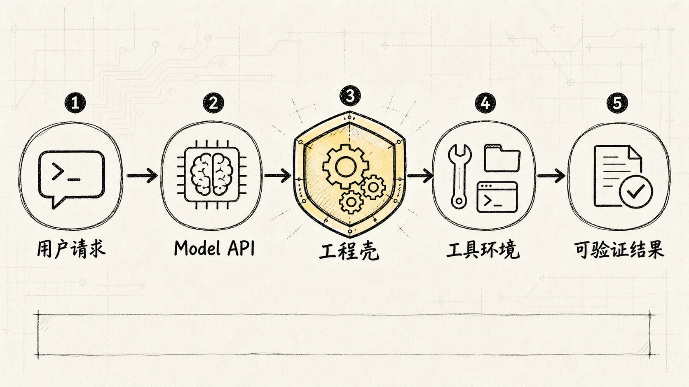
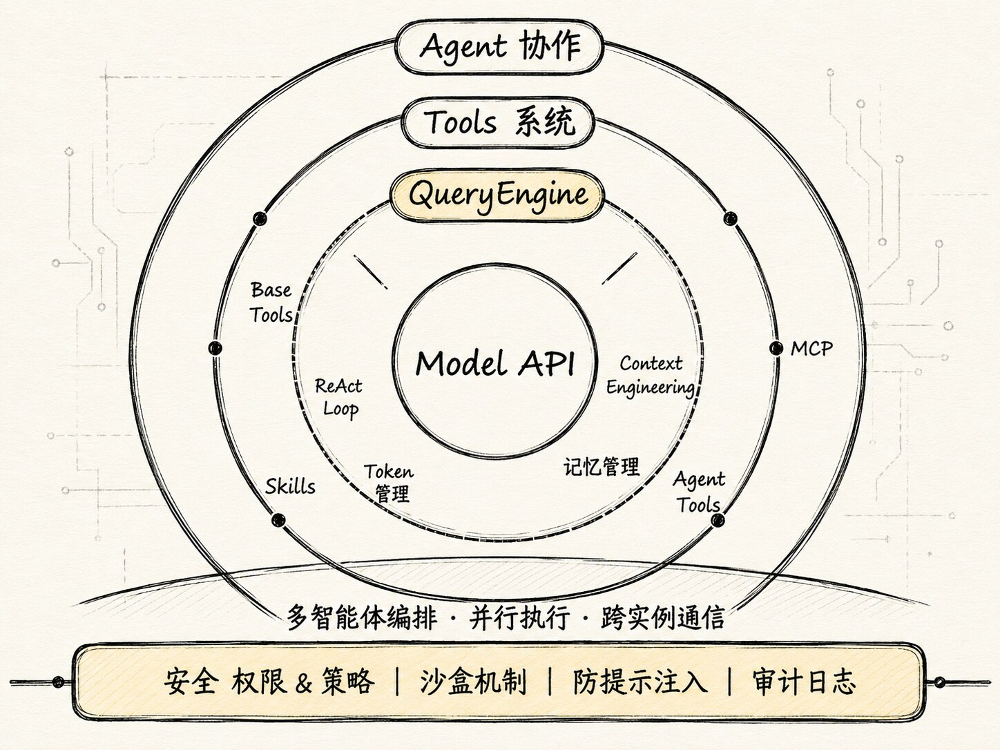
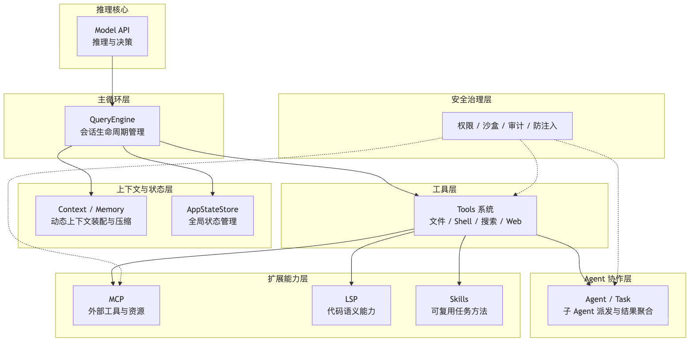
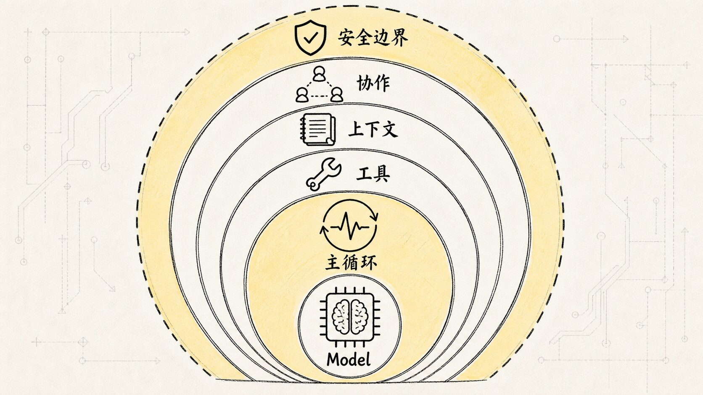
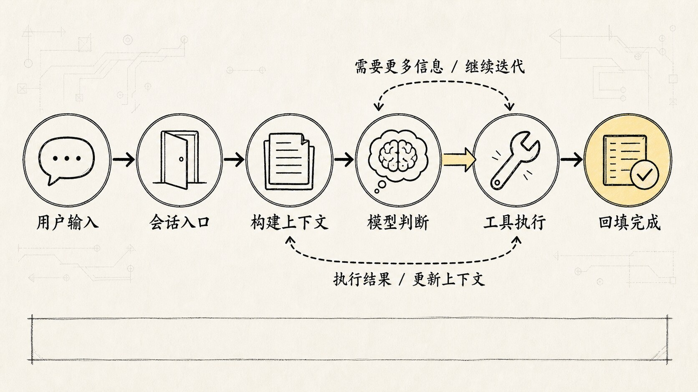
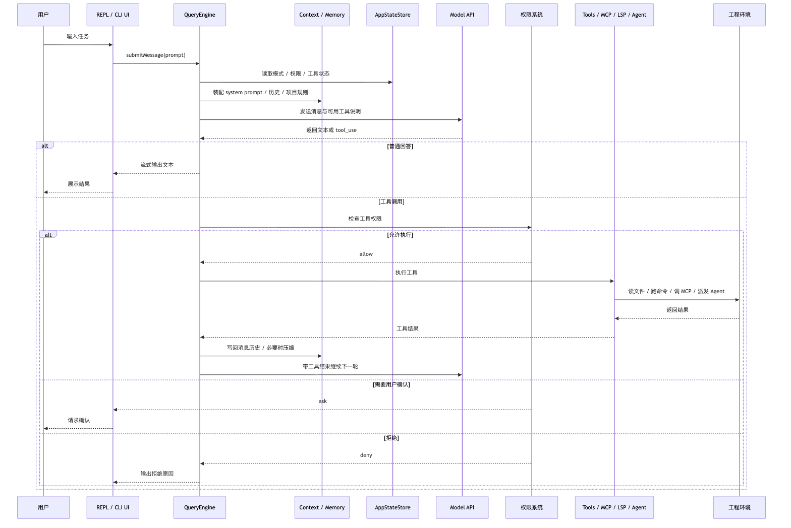
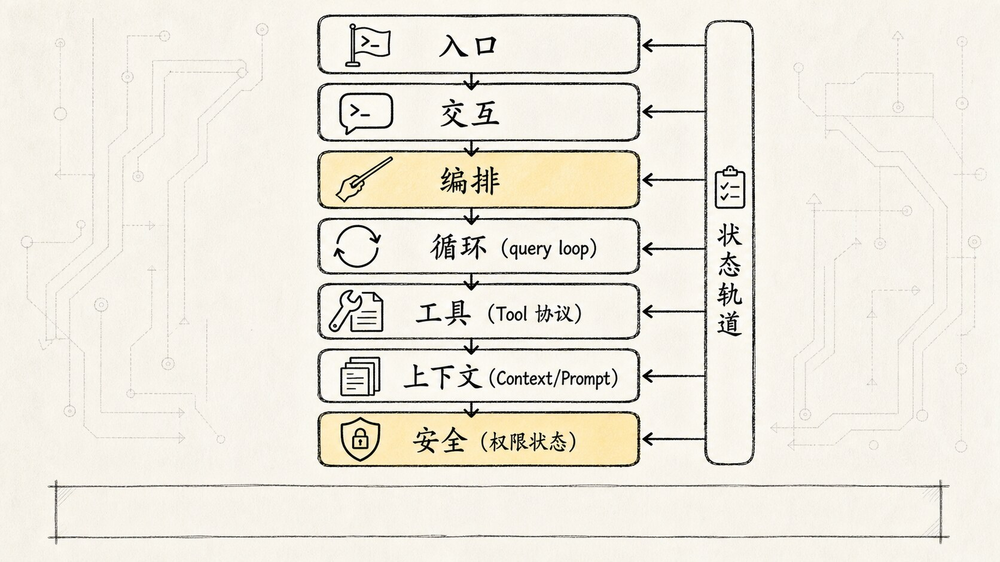
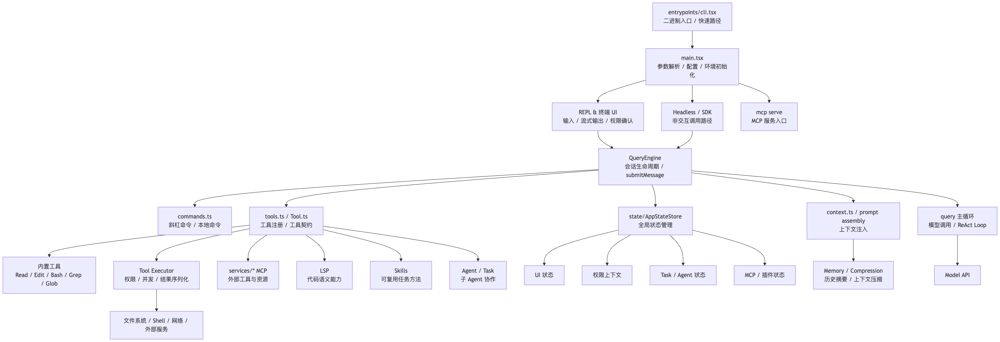

# 《Claude Code 源码解析系列》第1章｜工程架构

很多人第一次看 Claude Code，会把它理解成一个"会写代码的聊天框"。

这个理解不能说错，但太浅了。Claude Code 真正厉害的地方，不只是模型能回答代码问题。它在模型外面包了一整套工程系统：能读项目、能调工具、能维护上下文、能管理状态、能接 MCP、能派发子 Agent，还要守住权限和安全边界。

所以这篇先不急着钻某个源码函数，而是先回答一个更大的问题：

**Claude Code 到底是一套什么样的工程架构？**

如果用一句话概括：

**Claude Code = Model API + QueryEngine 主循环 + Tools 系统 + Context/State 管理 + 安全治理 + Agent 协作。**

模型只是核心推理能力。真正让它变成"能干活的编程 Agent"的，是模型外面那一整圈运行时。

为了把这件事讲清楚，我们按三个问题来看：

1. 功能架构：它有哪些能力层？
2. 运行架构：用户的一句话在系统里怎么流动？
3. 代码架构：源码大概按什么模块组织？

这三个问题一层层递进：先知道 Claude Code 有哪些能力，再知道这些能力如何被 QueryEngine 串起来，最后再回到源码里看它们分别落在哪些模块。

## 一、为什么不能只接一个 Model API？

假设你只做一个最简单的 AI 编程助手，流程大概是：

```text
用户输入问题
-> 后端把问题发给大模型
-> 大模型返回答案
-> 展示给用户
```

这对于"解释一段代码"还勉强够用。但一旦用户说：

```text
帮我看一下这个项目为什么测试失败，并修一下。
```

事情马上变复杂。

模型得先知道项目结构，知道有哪些文件，知道测试命令怎么跑，知道错误日志在哪里，知道应该改哪个文件。改完之后还要再跑测试验证。如果中途遇到权限问题、命令失败、上下文太长、工具输出太大，还得恢复。

**模型会思考，但它不会自己接触真实工程环境。**

它不会天然读文件，不会天然执行 Shell，不会天然维护长期任务状态，也不会天然知道哪些操作危险。于是 Claude Code 必须在 Model API 外面加一层"工程壳"。

这层工程壳，就是 Claude Code 的核心价值。

很多开源 Agent 项目就卡在这里：模型调用做得挺漂亮，工程壳一碰就漏。



## 二、功能架构：Claude Code 有哪些能力层？


从功能架构看，Claude Code 像一个一圈圈包起来的 Agent Runtime（围绕模型构建的代理运行环境，负责调度工具、管理状态、推进任务）。

最里面是 `Model API`。它是推理核心，负责理解任务、生成回答、判断下一步要不要调用工具。但它只是"脑子"，不是完整系统。

围绕模型的第一层，是 `QueryEngine`（查询引擎，负责把一次用户输入变成一轮持续运行的 Agent 主循环）。没有 QueryEngine，Claude Code 就只是一个普通 API 包装器；有了 QueryEngine，它才变成一个可以连续推进任务的运行时。

再往外，是 `Tools` 系统。这一层给模型接上"手脚"：文件读写、Shell 命令、搜索、Web、MCP、LSP、Agent 工具、Skills，都属于这一层。

再往外，是 `Context / Memory / State`。这一层解决的是"模型本轮到底应该知道什么"。它要动态装配 system prompt、用户输入、项目规则、历史消息、工具结果、文件缓存、压缩摘要和当前应用状态。

更外层，是 `Agent 协作`。当任务变复杂时，Claude Code 不只是单线程地和模型对话，还可以把某些子任务拆给 Agent / Task 处理。主 Agent 负责整体判断，子 Agent 负责代码搜索、方案探索、验证某个假设。

最底层，是贯穿所有能力的安全治理。因为 Claude Code 面对的是真实工程环境，它可能读取私有代码、执行命令、修改文件、调用外部服务。如果没有权限、策略、沙盒、防提示注入和审计日志，Agent 越强，风险越大。

用这张图理解：



这张图最想表达的不是"Claude Code 模块很多"，而是：

**Claude Code 的能力不是从模型直接长出来的，而是从模型外面一层层工程系统长出来的。**



### Model API：负责判断，但不负责执行

先把最容易混淆的地方讲清楚：`Model API` 并不直接执行任何工具。

模型真正输出的是类似这样的意图：

```text
我需要读取某个文件。
我需要搜索某个关键字。
我需要运行测试命令。
我需要修改某段代码。
```

但"读取文件""执行命令""修改代码"这些动作，都是 Claude Code 宿主程序完成的。

分工很明确：

```text
模型负责理解、规划、选择。
程序负责执行、约束、记录。
```

如果把所有能力都想象成模型自己的魔法，就会看不清 Claude Code 的真实价值。它真正值得学的地方，恰恰是那些"不智能但非常工程化"的部分：工具契约、权限系统、状态管理、上下文压缩、错误恢复、UI 渲染、会话记录。

### QueryEngine：整个系统的心跳

`QueryEngine` 是 Claude Code 的主循环。

它的职责不是简单地"发请求给模型"，而是管理一整个会话生命周期。一个会话里会有多轮用户输入、多轮模型响应、多次工具调用、多次状态变化。QueryEngine 要把这些东西串起来。

它要保存的状态至少包括：

- 当前消息历史
- 当前工作目录
- 当前可用工具集合
- 当前模型和预算
- 文件读取缓存
- 权限拒绝记录
- Skill 发现记录
- token 使用量
- 会话 transcript

这些状态共同决定了 Claude Code 下一步应该怎么行动。

（QueryEngine 的实现细节下一篇细说，但它本质上是一个状态机：每一轮根据当前状态决定该干什么，执行完再更新状态。）

### Tools 系统：模型的手脚，但必须受控

Claude Code 的工具系统可以理解成一个统一的能力市场。

里面既有基础工具：

```text
Read / Write / Edit / Grep / Glob / Bash
```

也有扩展能力：

```text
MCP / LSP / Web / Agent / Skill
```

工具系统最重要的不是"工具很多"，而是它们都被放进了统一的工具契约里。每个工具都要回答几类问题：

- 这个工具叫什么？
- 输入参数是什么？
- 怎么验证输入？
- 怎么执行？
- 输出怎么转回消息？
- 是否只读？
- 是否有破坏性？
- 是否允许并发？
- 是否需要用户确认？

这就是 Claude Code 比"让模型自己写 shell 命令"更工程化的地方。

比如同样是看文件，直接让模型执行：

```bash
cat src/main.ts
```

当然也能工作，但系统很难知道这次行为的真实语义。它只是一个 shell 字符串。

而如果走 `Read` 工具，Claude Code 就可以知道：

```text
这是一次读操作
目标路径是什么
是否越权
输出是否太大
是否需要截断
是否应该进入文件缓存
后续 Edit 是否基于最新版本
```

这就是工具抽象的价值：

**工具不是为了让模型"能做更多"，而是为了让模型的行动变得可理解、可限制、可审计。**

### Context / Memory / State：让模型知道该知道的东西

Claude Code 另一个容易被低估的能力，是上下文工程。

很多人一听到 context，就以为是"把 prompt 写长一点"。但在 Claude Code 里，上下文不是一段静态文本，而是每一轮动态装配出来的运行时输入。

它可能包含：

- 基础 system prompt
- 当前用户输入
- 历史消息
- 项目级规则
- 用户级规则
- 当前工作目录
- 可用工具说明
- MCP / LSP 暴露的外部能力
- Skill 说明
- 文件读取结果
- 上一次工具执行结果
- 压缩后的历史摘要
- 当前 AppState

这里真正难的有两个问题。

**第一个是"给什么"。** 给少了，模型不知道背景；给多了，上下文爆炸，成本和延迟都会失控。

**第二个是"什么时候给"。** 有些信息一开始就应该进入 system prompt，有些应该等模型需要时再通过工具读取，有些工具 schema 也可以延迟发现，而不是一次性全塞进去。

直白地说：

**Context Engineering 不是提示词写作，而是上下文调度。**

`Memory / Compression` 解决的是长任务问题。真实工程任务经常会经历搜索代码、读取文件、运行测试、分析错误、修改代码、再运行测试。每一步都会产生消息和工具结果。如果全部原封不动塞回模型，上下文很快就会变得又长又乱。

压缩机制的价值不是省 token 这么简单，而是让 Agent 在长任务里还能保持主线。

`AppStateStore` 则负责把 CLI UI、会话状态、工具状态和 Agent 状态统一起来。比如当前是否是 Plan Mode，当前有哪些 MCP 工具，当前权限模式是什么，当前有没有后台任务正在跑，这些都不是模型消息本身能解决的，需要应用状态系统管理。

### MCP / LSP / Skills：扩展能力接入层

Claude Code 不可能把所有能力都内置到主程序里，所以它需要扩展机制。

`MCP`（Model Context Protocol，让外部工具和资源能被 Agent 标准化调用的协议）更像外部工具协议。它让 Claude Code 可以发现和调用外部服务提供的工具与资源。比如数据库、浏览器、设计工具、内部系统，都可以通过 MCP 变成 Agent 可调用能力。

`LSP`（Language Server Protocol，语言服务器协议，提供符号、定义、引用等代码语义能力）更偏代码智能。它让 Claude Code 能更好地理解编程语言本身。

`Skills` 则更像可复用的任务方法包。它通常不是单个 API，而是一组说明、脚本、模板和触发规则，告诉 Agent 遇到某类任务时应该怎么做。

这三者解决的问题不一样：

```text
MCP：外部能力怎么标准化接入。
LSP：代码语义能力怎么接入。
Skills：可复用工作方法怎么加载。
```

它们共同构成了 Claude Code 的扩展层。

（实际接入时有个坑：MCP 工具 schema 如果太大，会直接撑爆上下文。Claude Code 的做法是延迟发现，不是一次性全塞进去。）

### 安全治理：Agent 越能干，越需要边界

安全层不是装饰，而是 Claude Code 能作为工程工具存在的前提。

安全层大致要解决四类问题：

```text
权限与策略：哪些工具可以用，哪些路径可以访问，哪些命令要确认。
沙盒机制：把危险动作限制在可控环境内。
防提示注入：避免项目文件或外部内容诱导模型越权行动。
审计日志：记录模型做过什么，工具执行过什么，用户批准过什么。
```

这里最关键的设计思想是：

**模型可以建议行动，但不能绕过系统边界直接行动。**

模型输出 tool_use（模型通过特定格式请求调用工具的行为），只是发起请求。真正执行之前，还要经过工具系统和权限系统。

这也是 Claude Code 和很多玩具 Agent 的分水岭：玩具 Agent 追求"能跑起来"，生产级 Agent 必须追求"能被约束地跑起来"。

## 三、运行架构：用户的一句话在系统里怎么流动？

理解完功能层之后，我们再看运行架构。

从用户视角看，过程只有一句话：

```text
用户：帮我修一下这个 bug
```

但从 Claude Code 内部看，这句话不是直接发给模型，而是先进入一个被 QueryEngine 调度的运行时。

一个简化的运行过程：

```text
用户输入
-> Claude Code 会话
-> QueryEngine.submitMessage()
-> 处理用户输入和斜杠命令
-> 构建上下文和系统提示词
-> 调用 Model API
-> 模型返回文本或 tool_use
-> 工具系统检查权限并执行工具
-> 工具结果写回消息历史
-> QueryEngine 继续下一轮
-> 直到任务完成或需要用户决策
```



画成时序图：



这张图里有两个闭环。

**第一个闭环是模型和工具之间的循环：**

```text
模型判断下一步
-> 工具执行真实动作
-> 工具结果回到模型
-> 模型继续判断
```

这就是 Claude Code 能连续推进任务的原因。

**第二个闭环是上下文和状态之间的循环：**

```text
每一轮执行都会改变消息历史、工具结果、权限状态、任务状态
-> 下一轮 QueryEngine 又要基于这些变化重新装配上下文
```

这就是 Claude Code 不是"一问一答"的原因。它更像一个持续运行的状态机。

### 斜杠命令不一定会进模型

运行架构里还有一个细节：并不是所有用户输入都会调用 Model API。

有些输入是本地命令，比如配置、清理、压缩、状态查看。这类命令如果也强行走模型，会浪费 token，也会让行为不稳定。

所以 QueryEngine 在处理用户输入时，会先判断：

```text
这是一个需要模型推理的任务？
还是一个可以本地直接执行的命令？
```

如果是本地命令，系统可以直接返回结果，提前结束本轮。

（这个设计很实际。如果你输入 `/clear` 清屏还要走一趟模型，体验会很差。）

### Plan Mode 让执行先慢下来

运行架构里还有一个重要模式：`Plan Mode`。

对普通聊天产品来说，模型直接回答就行。但对编程 Agent 来说，"直接动手"是有风险的。因为它可能会改文件、跑命令、影响项目状态。

Plan Mode 的意义是把任务分成两个阶段：

```text
先理解和计划
再执行和修改
```

这背后体现的是 Claude Code 对控制权的设计：

- 不是所有任务都应该立刻执行。
- 不是所有工具都应该默认开放。
- 用户应该能在关键节点看到计划并决定是否继续。

成熟 Agent 系统不会只追求"自动化程度越高越好"。真正难的是在自动化和可控性之间找平衡。

## 四、代码架构：源码大概按什么模块组织？

最后再回到代码架构。

如果说功能架构回答"Claude Code 有哪些能力"，运行架构回答"这些能力怎么一起跑"，那代码架构回答的就是：

**去源码里看时，应该先建立怎样的地图？**

这里有一个读源码的诀窍：先不要按目录树横向扫。Claude Code 的源码目录很多，`components`、`services`、`tools`、`hooks`、`utils` 都很容易把人带散。更稳的方式是先抓“承重链路”：

```text
入口把用户输入交给会话
-> QueryEngine 管一场 conversation
-> query.ts 推一轮轮 ReAct
-> Tool 协议把模型意图变成可执行请求
-> Context / Prompt 决定模型每轮看见什么
-> Permission / Hooks / State 决定动作能不能落地
```



也就是说，这一节不是在列目录，而是在给后面几篇文章找源码坐标。

先用这张图建立整体印象：



这张代码架构图可以拆成几层看。

### 入口层：cli.tsx 和 main.tsx

最上面是 `cli.tsx` 和 `main.tsx`。

`cli.tsx` 是真正的二进制入口。它会处理一些快速路径，比如 `--version` 这种不需要加载完整应用的命令。目的是让 CLI 工具启动尽可能快。

`main.tsx` 进入完整启动流程，负责命令行参数、配置、环境变量、预加载、模式分发。它把程序导向不同运行路径：

```text
交互式 REPL
Headless / SDK
MCP 服务
其他命令路径
```

Claude Code 不是只有"终端聊天"这一种形态。REPL、SDK、MCP 服务都可以共享底层能力。

### 交互层：REPL 与终端 UI

Claude Code 是一个 CLI 产品，终端 UI 不是附属物。

它要处理：

- 用户输入
- 流式输出
- 工具执行进度
- 权限确认
- 错误提示
- 任务状态展示
- Plan Mode 交互

这也是为什么源码里会有大量 UI 渲染和状态订阅逻辑。Agent 不是只在后台跑，用户需要在终端里理解它正在做什么。

### 编排层：QueryEngine 和 query 主循环

`QueryEngine` 是会话级编排层。

它向上接 REPL / SDK，向下接 query 主循环、上下文系统、状态系统、工具系统和命令系统。

`query` 主循环更偏模型调用和 ReAct Loop（一种模型交替进行推理和执行的行动循环模式）。它负责把消息发给模型，接收模型返回，识别 tool_use，再把工具执行结果放回消息流。

简单区分：

```text
QueryEngine：管理一整个会话。
query 主循环：管理一次或多次模型-工具循环。
```

### 能力层：Tools / Commands / Services

能力层分三类。

第一类是 `Commands`。它处理斜杠命令和本地命令。有些用户输入不需要模型推理，直接本地执行更稳定。

第二类是 `Tools`。它处理模型可以调用的工具能力，读文件、改文件、跑 Shell、搜索代码、调用 Agent。

第三类是 `Services`。它承载外部集成和扩展能力，MCP、LSP、插件、远程会话。

这三类能力共同构成 Claude Code 的执行层。

### 上下文层：context、memory、compression

上下文层负责回答一个问题：

```text
这一轮到底要把什么发给模型？
```

它不是简单拼接字符串，而是要综合当前任务、历史消息、项目规则、用户规则、工具说明、MCP 能力、Skill 说明、文件读取结果和压缩摘要。

这也是 Claude Code 看起来"懂项目"的原因：不是模型天然懂，是上下文层持续把项目相关信息装配给模型。

### 状态层：AppStateStore

`AppStateStore` 负责全局状态。

它管理的不只是 UI 状态，还包括：

- 当前模型配置
- 工具权限上下文
- MCP 客户端和工具
- 插件状态
- 子 Agent / Task 状态
- 远程会话状态
- 用户设置

没有状态层，Claude Code 就很难把"终端应用"和"Agent 运行时"统一起来。

### 安全层：permissions、sandbox、audit

安全层在代码里不会只对应一个文件，而是贯穿工具执行、权限判断、命令分类、MCP 调用、用户确认和会话记录。

它的本质是把模型的自由意图变成受治理的执行请求。

```text
模型说"我想做什么"
系统判断"你能不能做"
工具负责"按规则去做"
日志记录"你做了什么"
```

这就是生产级 Agent 和 demo Agent 的差别。

### 源码里的承重文件：先读少数几根梁

如果把这一篇落到源码阅读上，最先应该看的不是所有目录，而是少数几个承重文件。

`QueryEngine.ts` 是会话层。它的关键不是“直接干了所有事”，而是持有一场 conversation 需要跨 turn 保存的东西：消息历史、权限拒绝记录、文件读取缓存、模型配置、工具集合、MCP client、Agent 定义和 AppState 读写入口。每次 `submitMessage()` 只是同一场 conversation 里的一个新 turn。

`query.ts` 是循环层。它维护每轮迭代的 `State`，把 messages、toolUseContext、autoCompactTracking、turnCount、pendingToolUseSummary 等状态带进下一轮。模型流式返回时，它收集 assistant message 里的 `tool_use` block；如果没有工具调用，就收尾；如果有工具调用，就执行工具，把结果追加回消息，再继续循环。

`Tool.ts` 是行动协议层。一个工具不是一个函数，而是一份协议：输入 schema、调用方式、是否只读、是否并发安全、是否破坏性、是否需要权限、结果大小、UI 展示、错误回填等都要声明。模型输出的不是“我要随便动手”，而是“我要按这个工具协议发起一次请求”。

`tools.ts` 和 `services/tools/toolExecution.ts` 是工具菜单和执行生命周期。前者决定本轮模型能看到哪些工具，后者决定一次工具调用如何经过 schema 校验、工具级输入校验、权限检查、hooks、真实执行和结果序列化。

`context.ts`、`constants/prompts.ts` 和 `services/compact` 则是模型工作台。它们决定系统规则、项目记忆、Git 状态、工具说明、历史消息、工具结果预算和压缩摘要如何进入每一轮模型请求。

所以源码阅读可以先压成一句话：

```text
QueryEngine 管会话，query.ts 管循环，Tool 管行动边界，Context/Prompt 管模型工作台。
```

这条链路立住以后，再去看 MCP、Skill、Agent、Plan，就不会觉得它们是散落的功能点。它们都是接到这条主路上的扩展。

## 五、把三层架构合起来看

现在把整篇收束成一个整体理解。

功能架构告诉我们，Claude Code 不是一个模型，而是一套围绕模型搭起来的能力系统：

```text
Model API
-> QueryEngine
-> Tools / Context / Memory / State
-> MCP / LSP / Skills / Agent 协作
-> 安全治理
```

运行架构告诉我们，用户的一句话不是直接进入模型，而是进入一个持续运转的 Agent Runtime：

```text
用户输入
-> QueryEngine 装配上下文
-> Model API 判断
-> Tools 执行
-> 结果回流
-> QueryEngine 继续下一轮
```

代码架构告诉我们，源码阅读时可以按这些层次找入口：

```text
入口层：cli.tsx / main.tsx
交互层：REPL / 终端 UI
编排层：QueryEngine / query
能力层：Tools / Commands / Services
上下文层：context / memory / compression
状态层：AppStateStore
安全层：permissions / sandbox / audit
```

所以 Claude Code 的本质不是"一个模型加几个工具"，而是：

**一套围绕模型构建的、可扩展、可治理、可持续运行的 Agent Harness。**

Harness（工程支架）这个比喻很贴切：模型提供智能，Harness 提供运行环境。没有模型，系统没有推理能力；没有 Harness，模型没有稳定做事的能力。

## 六、主线速记

如果只想抓住 Claude Code 工程架构的主线，记住这几句话：

1. Claude Code 不是聊天框，而是一个 CLI 形态的 Agent Runtime。
2. Model API 是推理核心，但不直接执行真实世界动作。
3. QueryEngine 是主循环，负责把用户输入、模型响应、工具调用和状态变化串起来。
4. Tools 系统是执行层，但每个工具都要经过契约、权限和结果序列化。
5. Context Engineering 是动态装配上下文，不是简单写长 prompt。
6. AppStateStore 让 CLI UI、会话状态、工具状态和 Agent 状态能协同工作。
7. MCP、LSP、Skills 是扩展层，让 Claude Code 不必把所有能力都写死在内部。
8. 安全层决定了 Agent 能不能从 demo 走向真实工程环境。

下一篇继续往里钻：`QueryEngine` 到底怎么实现这条对话主循环，以及它如何把模型调用、工具执行和上下文压缩串成一个可恢复的状态机。
