# 2.核心机制-ReAct：query.ts 如何把模型变成会行动的 Agent

上一篇我们先把 Claude Code 拆成了几层：`Model API` 负责判断，`QueryEngine` 负责推进主循环，`Tools` 负责接触真实工程环境，`Context / State` 负责让任务不断线。

这一篇开始往里钻，先看最核心的一层：`query.ts` 怎么把一次模型调用，扩展成一轮可以持续行动的 Agent Run。

我们仍然沿用上一篇的例子：

```text
帮我看看这个项目为什么测试失败，并把它修好。
```

上一篇已经说过，模型本身不会天然读文件、跑命令、维护任务状态。这里就不再重复铺垫了。现在的问题变成：

**Claude Code 怎么让模型在一个受控循环里，边判断、边行动、边吸收结果，直到任务真的推进下去？**

这就是 `ReAct` 要解决的问题。

有些资料会把这套过程写成 `ReAction`。为了避免术语晃动，本文统一叫 `ReAct`。先别急着背英文缩写，记住一个最小闭环就行：

```text
先判断当前情况
再决定下一步干什么
然后真的去执行
拿到结果
再根据新结果重新判断
```

画成流程，就是：



Claude Code 的 `query.ts` 做的，就是把这个闭环工程化。模型先基于上下文做判断，再决定动不动手；行动结果被写回上下文后，模型继续下一轮判断。

参考图里真正重要的不是花哨概念，是右边那条朴素的状态机：

```text
构建 Query
-> 请求 Model API
-> 解析返回结果
-> 判断是否有工具调用
-> 如果没有，返回结果
-> 如果有，调用工具
-> 工具结果追加到 messages
-> 检查是否需要压缩
-> 回到下一轮 Query
```

这条循环，就是上一篇那张架构图真正转起来的地方。

不过，要是只把它当成一个 `while` 循环，还是会少看一层。参考轩辕代码的讲法，`QueryEngine` 更准确的定位不是「一次请求处理器」，而是「会话级任务编排器」。它不是收到一条消息临时跑一下，而是围着一场 conversation 长期持有状态，把模型、工具、权限、上下文和压缩都串在一起。

所以这篇我们要同时抓住两层：

```text
query.ts 这一层：一轮轮 ReAct 状态转移怎么发生。
QueryEngine 这一层：整个会话里的状态、工具、权限和资源怎么被持续编排。
```

前者解释「循环怎么转」，后者解释「为什么这个循环能跨多轮任务稳定存在」。

## 一、为什么主循环不能只调一次 Model API？

先从最简单的情况看。

用户问：

```text
解释一下 useEffect 是什么。
```

程序把问题发给模型，模型直接生成答案，完事。

但如果用户问：

```text
这个 React 项目启动失败，帮我修一下。
```

模型第一轮通常不知道答案。它至少得拿到更多事实：

```text
项目结构是什么？
package.json 里脚本怎么写？
启动命令报了什么错？
相关源码在哪？
改完之后测试过不过？
```

这些事实不在模型参数里，也不在用户一句话里。它们存在于真实工程环境里：文件系统、Shell、Git、测试框架、日志输出、依赖配置。

所以 Agent 必须多一层机制：

```text
模型判断自己缺什么
-> 发起工具调用
-> 程序执行工具
-> 把结果交还给模型
-> 模型基于新事实继续判断
```

这就是 ReAct 闭环出现的原因。

不是为了把流程搞复杂。真实任务本来就不是一次回答能解决的。更像一个不断校正的过程：先猜方向，去现场取证，再根据证据调整下一步。

做过生产故障排查的同学应该很熟悉这套：先有一个假设，去现场取证，再根据证据修正下一步。

## 二、ReAct 不是「模型自己动手」，而是「模型提意图」

这里有个非常容易误解的点：

**模型并不会真的自己读文件、执行命令、改代码。**

模型能做的是输出一种「行动意图」。比如：

```text
我需要读取 package.json。
我需要搜索 handleEnter。
我需要运行 npm test。
我需要编辑某个文件。
```

真正动手的是 Claude Code 的宿主程序，也就是外层的 QueryEngine、Tools 系统和权限系统。

所以更准确的分工是：

```text
模型负责判断下一步干什么。
Claude Code 负责决定能不能干、怎么干、干完怎么记录。
```

这也是为什么 Claude Code 不是「给模型接一个 shell」那么简单。

如果让模型输出一段 shell 命令直接执行，系统根本不知道这次操作的语义是什么。权限、审计、错误恢复、上下文回填，全都管不住。

工具系统会把行动变成结构化事件：

```text
工具名：Read
参数：某个文件路径
权限：只读
结果：文件内容或错误
回填：作为 tool result 写回 messages
```

这样一来，模型仍然负责推理，但行动被塞进了一个可控的工程框架里。

一句话说清分工：模型负责判断，工具负责接触真实世界，QueryEngine 负责把判断和行动组织成可持续的循环。

## 三、query.ts 的状态机：核心不是函数，而是 State



参考图左边列出了 `query.ts` 里的 `State` 结构。它提醒你一件事：

Claude Code 的主循环不是靠一堆散落的全局变量往前跑，而是围着统一的状态对象推进。

简化后长这样：

```ts
interface State {
  messages: MessageParam[]
  toolUseContext: ToolUseContext
  turnCount: number
  shouldAutoCompact: boolean
  autoCompactTracking: {
    consecutiveFailures: number
    totalMessages: number
  }
  aborted: boolean
}
```

这几个字段就是理解 ReAct 闭环的钥匙。

### 1. `messages`：Agent 的短期工作记忆

`messages` 不是普通聊天记录。

在 Agent 循环里，它更像一份「现场账本」：

```text
用户刚才说了什么
模型上一轮判断了什么
模型发起了什么工具调用
工具返回了什么结果
系统压缩后保留了什么摘要
```

模型本身不会自动记住之前发生的一切。每一轮请求 Model API 时，Claude Code 都要把当前相关历史重新打包塞给模型。

所以 `messages` 的意义是：

**把多轮行动变成模型下一轮可见的上下文。**

没有 `messages`，每一轮模型调用都像失忆一样从头开始。

### 2. `toolUseContext`：这一轮能用哪些「手脚」

`toolUseContext` 就是工具环境。

它不只是一个工具列表，而是在告诉主循环：

```text
现在有哪些工具可用？
每个工具的输入 schema 是什么？
工具执行时需要哪些上下文？
结果应该怎么变成消息？
哪些操作需要权限判断？
```

ReAct 里的 `Act` 不是抽象行动，是被工具系统约束过的具体行动。

同样是「看文件」，走 `Read` 工具和直接跑 `cat` 的工程含义完全不同。前者可追踪、可限制、可结构化回填；后者只是一串字符串，出了事你都不知道它干了什么。

也就是说，工具不是能跑就行，还要能被追踪、被限制、被回填。

### 3. `turnCount`：这是个多轮系统，不是单次请求

`turnCount` 记录循环已经跑了几轮。

这个字段看着普通，但它暴露了一个底层事实：

**Claude Code 从设计上就承认任务会持续多轮。**

它不是「问一次模型，看运气能不能答对」。它允许模型在多轮里逐步收集信息、调用工具、修正判断。

`turnCount` 还能用来防无限循环、做日志统计、触发降级策略。一个成熟 Agent 必须知道自己已经转了多久，不然很容易在失败路径里原地打转。

所以成熟 Agent 一定要有轮次、预算和退出条件。没有这些边界，多轮循环很容易变成原地打转。

### 4. `shouldAutoCompact`：上下文会膨胀，压缩必须进主循环

Agent 一旦开始调用工具，`messages` 就会快速变长。

读一个大文件，跑一次测试，搜索一批结果，都会把大量信息写回消息历史。短任务没事，长任务很快就会撞上上下文窗口。

所以 `shouldAutoCompact` 不是锦上添花的优化，是长任务 Agent 必须有的容量治理信号。

它回答的是：

```text
当前消息历史是不是已经太长？
是否需要把旧内容压成摘要？
压缩是否连续失败？
压缩前后消息量怎么变？
```

参考图里为什么在「工具结果追加到 messages」之后，马上接着「检查是否需要压缩」。

因为真正让上下文膨胀的，往往就是工具结果。

### 5. `aborted`：Agent 也必须能被安全中断

真实工程任务不会每次都顺利结束。

用户可能取消，命令可能卡住，工具可能超时，权限可能被拒。

`aborted` 代表这条循环可以被外部中断。它提醒你，Agent 主循环不只要考虑「怎么开始」「怎么成功」，也要考虑「怎么停下来」。

一个不能安全停下来的 Agent，能力越强，风险越大。

能力越强的 Agent，越需要能被干净地停下来。

## 四、QueryEngine 视角：它管理的是会话，不是一次请求

到这里，我们已经看到了 `query.ts` 里一轮 ReAct 状态机怎么转。但读源码时还要再往外看一层：是谁在持有这条循环需要的长期状态？

答案是 `QueryEngine`。

轩辕代码那篇文章里有一个很关键的源码注释视角：`QueryEngine` 是按 conversation 维度存在的。这个判断非常重要，因为它说明 `QueryEngine` 不是一次性的 request handler，而是一个会话对象。

一次请求处理器通常只关心：

```text
输入是什么？
我要返回什么？
这次调用结束了吗？
```

但会话级编排器关心的是：

```text
历史消息怎么继续追加？
之前拒绝过哪些权限？
哪些文件已经读过？
本轮和累计 usage 是多少？
发现过哪些 skill？
加载过哪些 memory？
当前任务是否被中断？
```

所以 `QueryEngine` 里会出现很多跨轮次状态，例如：

```ts
type ConversationRuntimeState = {
  messages: Message[]
  abortController: AbortController  // 用于外部取消信号的控制器
  permissionDenials: PermissionDenial[]
  totalUsage: Usage
  readFileCache: FileStateCache
  discoveredSkills: Set<string>
  loadedMemoryPaths: Set<string>
}
```

这些字段说明它不是「把 prompt 转发给模型」的薄封装，而是在维护一场会话的运行现场。

两者的关系可以这样理解：

```text
QueryEngine：会话级运行时，负责持有长期资源和状态。
query.ts loop：任务推进机制，负责一轮轮构建 Query、调模型、跑工具、回填消息。
```

`State` 更像某一轮循环的工作快照，`QueryEngine` 更像会话背后的调度中心。

这层视角补上以后，ReAct 就不只是「模型要不要继续调用工具」的小循环，而是完整任务生命周期的一部分。

## 五、`submitMessage()`：真正启动一轮 Agent Run 的入口

从用户动作往后追，用户每提交一条消息，真正重要的入口通常会落到 `submitMessage()` 这一类方法上。

它不像普通后端接口那样只接收一个 `prompt`，而是会同时读取和准备一整套运行时资源：

```text
当前 cwd
可用 tools
slash commands
MCP clients
thinking 配置（是否启用扩展推理模式）
最大轮次
预算限制
会话持久化状态
```

所以 `submitMessage()` 本质上不是「发一次聊天请求」，而是：

**启动一轮 agent run。**

这一轮 run 里，它要做的事情大概包括：

```text
读取当前配置和会话状态
设置工作目录与 session 环境
包装工具权限判断逻辑
准备系统提示词与上下文
调用底层 query loop
在模型输出过程中处理工具调用
把工具结果写回会话历史
统计 usage、成本和边界状态
```

`query.ts` 里的 ReAct 循环只是「任务怎么往前走」的内核；`submitMessage()` 和 `QueryEngine` 负责把这颗内核放进真实 Claude Code 会话里跑。

这也是 Claude Code 比最小 Agent Demo 更工程化的地方。Demo 往往只证明「模型能调用工具」，但 `QueryEngine` 要保证的是：

```text
这次工具调用能不能被允许？
结果能不能回到下一轮模型输入？
失败时能不能恢复？
长期会话里状态会不会乱？
上下文和预算会不会失控？
```

真正的 Agent 工程，复杂度就藏在这些看起来不炫的地方。

## 六、把右侧流程翻译成代码：while 循环里到底发生了什么？

参考图右侧可以翻译成一段简化伪代码：

```ts
while (!state.aborted) {
  const query = buildQuery(state)
  const response = await requestModelAPI(query)
  const parsed = parseModelResponse(response)

  if (!parsed.hasToolUse) {
    return parsed.finalAnswer
  }

  const toolResults = await runTools(
    parsed.toolUses,
    state.toolUseContext,
  )

  state = appendToolResultsToMessages(state, response, toolResults)
  state = maybeAutoCompact(state)
  state = nextTurn(state)
}
```

这段伪代码里有三个关键点。

第一，`buildQuery(state)` 不是简单拼接用户问题。它会根据当前 `State` 构建本轮模型输入，包括消息历史、系统提示、可用工具、上下文摘要等。

第二，`requestModelAPI(query)` 的返回结果不一定是最终答案。它可能是文本，也可能包含工具调用请求。

第三，只有当模型不再请求工具时，循环才结束。只要模型还需要工具，Claude Code 就会继续执行工具、回填结果、进入下一轮。

所以 `while(true)` 并不是无脑死循环。

真正的退出条件是：

```text
模型不再请求工具
或任务被中断
或触发工程上的上限、错误、权限拦截
```

这就是 Agent Loop 的心跳。

（读源码时可以在这三个函数上打断点：`buildQuery`、`parseModelResponse`、`maybeAutoCompact`。它们分别对应「输入怎么组织」「输出怎么理解」「状态怎么治理」，抓住这三个，主干就稳了。）

## 七、「有工具调用？」是整台机器最关键的分叉点

参考图里有个菱形判断：

```text
有工具调用？
```

这一步看着简单，但它定了当前轮次的语义。

没有工具调用，说明模型认为当前信息已经足够，可以给最终回答：

```text
否 -> break -> 返回结果
```

有工具调用，说明模型认为信息还不够，需要去外部世界取证：

```text
是 -> 调用工具 -> 写回 messages -> 再来一轮
```

工具调用不是附加功能，是 Claude Code 从「回答模式」切换到「行动模式」的开关。

普通聊天机器人通常停在第一种情况：生成文本就结束。

Agent 则必须支持第二种情况：模型承认自己还不知道，通过工具去补足信息。

这也是 ReAct 的核心：

```text
Reason：模型基于当前上下文判断下一步
Act：模型发起工具调用意图
Observe：工具结果写回 messages
Reason：模型基于新观察继续判断
```

一轮一轮转下去，系统才会表现出「会做事」的感觉。

## 八、为什么工具结果必须追加到 messages？

工具执行完以后，最关键的一步不是「拿到结果」，而是：

**把结果写回消息流。**

比如模型请求读取 `package.json`。工具确实读到了文件内容，但如果这个结果没有追加到 `messages`，下一轮模型就看不到它。

这会导致一个很奇怪的断裂：

```text
模型说：我需要读取 package.json
系统读了 package.json
模型下一轮：我还是不知道 package.json 里有什么
```

工具结果追加到 `messages`，本质上是在完成 ReAct 里的 `Observation`。

它把外部世界的事实重新翻译成模型可读的上下文。

也可以这样理解：

```text
工具调用让模型接触真实世界。
messages 回填让模型记住刚才接触到了什么。
```

没有前者，模型只能空想。

没有后者，模型每次行动完都会失忆。

很多最小 Agent Demo 看起来也能调用工具，但做不成长任务，问题往往就在这里：它有 `Act`，但没有可靠的 `Observe -> 回填 -> 下一轮 Reason`。

这也是很多最小 Demo 跑不长的原因：模型能发起工具调用，但工具结果没有稳定地回到下一轮推理里。

## 九、自动压缩为什么放在工具回填之后？

参考图最后一步是：

```text
检查是否需要压缩
```

而且它放在「工具结果追加到 messages」之后。

这个顺序非常重要。

因为工具结果往往是上下文膨胀的主要来源：

```text
读文件 -> 可能返回几百行代码
跑测试 -> 可能返回一大段日志
搜索代码 -> 可能返回几十个命中位置
调用外部服务 -> 可能返回结构化大 JSON
```

如果每次都把这些内容原封不动塞进下一轮模型输入，长任务很快就会变得又贵、又慢、又容易失焦。

所以 Claude Code 必须在主循环里持续问一个问题：

```text
当前 messages 还能不能继续带着跑？
```

如果不能，就要压缩。

压缩不是把内容随便删掉，而是尽量保留对后续任务有用的信息：

```text
用户目标是什么？
已经尝试过什么？
哪些文件被读过？
哪些命令运行过？
哪些错误仍然没解决？
下一步应该继续关注什么？
```

自动压缩不是「省 token 的小技巧」，是 Agent 能不能跑长任务的基础设施。

没有压缩，ReAct 循环越努力，消息历史越失控。

压缩策略很能体现 Agent 工程成熟度：粗暴截断容易丢关键信息，过度压缩又可能让模型「忘记」自己已经干过什么。后面讲 Context 管理时，我们会专门展开这件事。

## 十、从源码阅读角度，应该怎么抓这条主线？

读 `query.ts`，别一上来就抠分支。

更好的方式是先抓住这 8 个问题：

```text
1. QueryEngine 是在哪里创建的？
2. submitMessage 如何启动一轮 agent run？
3. State 在哪里创建？
4. buildQuery 从 State 里取了哪些信息？
5. Model API 返回后，代码如何识别 tool use？
6. 工具调用是在哪里执行的？
7. tool result 是如何追加回 messages 的？
8. 什么时候触发 auto compact？
```

这 8 个问题能串起来，`query.ts` 和 `QueryEngine` 的主干关系就清楚了。

你会发现，这个文件真正想表达的不是「某个函数特别复杂」，而是一个很稳定的工程模式：

```text
State
-> Query
-> Model Response
-> Tool Use?
-> Tool Result
-> Updated State
-> Next Query
```

这条链路一旦理解，后面的 Tools、Context、Prompt、Memory、Permission 都可以挂回来。

Tools 是行动层。

Context 是每轮 Query 的材料组织。

Prompt 是告诉模型如何判断和行动的规则。

Permission 是行动前的刹车。

Compact 是长任务里的容量治理。

而 `query.ts` 的 ReAct 状态机，就是把这些能力串起来的主轴。

## 十一、把参考图重新画成一条 Mermaid 流程

可以把整张图压缩成下面这个流程：



这张图里最值得记住的是两个闭环。

第一个闭环是 ReAct 闭环：

```text
Reason -> Act -> Observe -> Reason
```

第二个闭环是工程状态闭环：

```text
QueryEngine -> State -> Query -> Response -> Tool Result -> State -> QueryEngine
```

前者解释了 Agent 为什么看起来会「边想边做」。

后者解释了源码里为什么必须有 `QueryEngine`、`State`、`messages`、`toolUseContext`、`turnCount`、`autoCompactTracking`、`permissionDenials` 和 `totalUsage`。

## 十三、用一句话总结

`query.ts` 的 ReAct 机制，本质上是在维护一个不断演化的 `State`。

每一轮里，Claude Code 根据当前 `State` 构建 Query，请求 Model API，解析模型是否要调用工具。模型不再需要工具，就返回最终结果；模型需要工具，系统就执行工具，把结果追加到 `messages`，检查是否需要压缩，然后带着更新后的 `State` 进入下一轮。

在这条循环外层，`QueryEngine` 持有会话级状态，把工具、权限、上下文、预算、缓存和中断控制组织成完整的任务运行时。

所以 Claude Code 不是「模型回答一次」的程序，是一台围着状态运转的 Agent 状态机：

```text
模型负责判断下一步。
工具负责接触真实世界。
messages 负责把真实世界带回模型。
压缩负责让长任务继续跑下去。
State 负责把这一切组织成可持续的循环。
QueryEngine 负责把这条循环放进会话级运行时里。
```

理解了这条 ReAct 闭环，再去看 Prompt、Tools、Context 管理和多 Agent 协作，就不会觉得它们是散落的模块了。

它们其实都在服务同一件事：

**让模型不只是会说，而是能在工程世界里一步一步把事情做完。**
