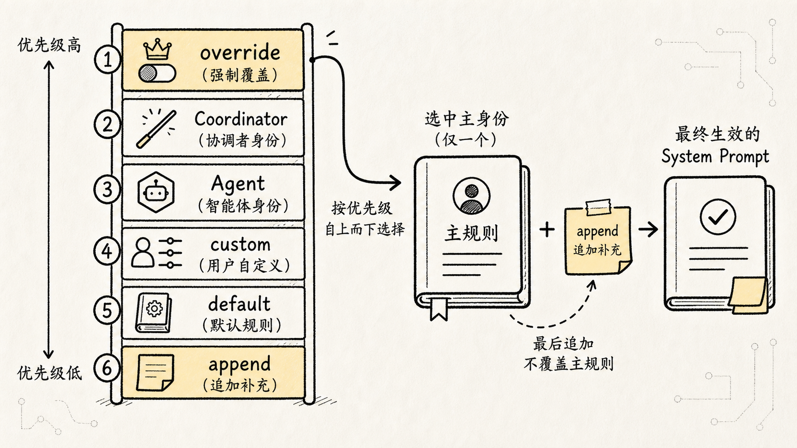
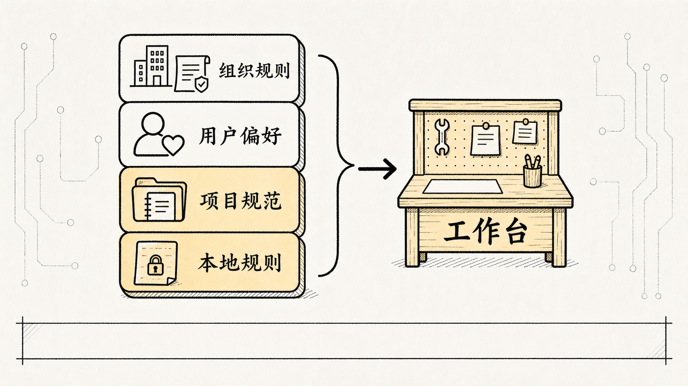
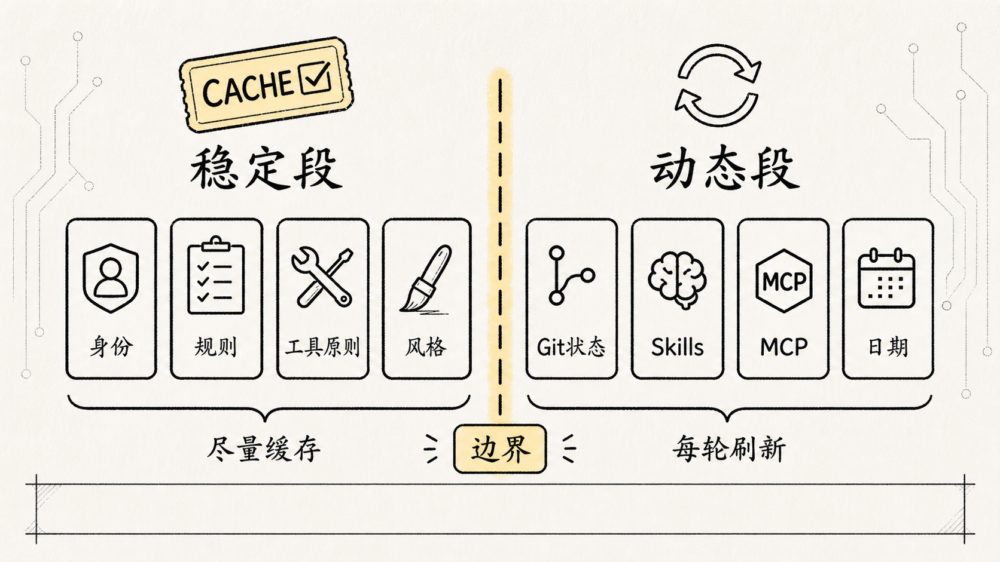

# 3.核心机制-Prompt 编写：Claude Code 如何动态组装模型的工作台

上一篇讲完 `query.ts` 的 ReAct 闭环，我们知道 Claude Code 会一轮轮判断、调用工具、回填结果、再进入下一轮。

但这里马上冒出一个新问题：

**每一轮模型调用之前，Claude Code 到底给模型看了什么？**

很多人写 Agent 时，会从一个很自然的想法起步：

```text
我只要写一段足够强的 system prompt，
告诉模型你是编程助手、要遵守规则、可以调用工具，
是不是就能做出 Claude Code？
```

这个想法不算错，但只摸到了第一层。

真正的 Claude Code 根本不是靠一段固定提示词撑起来的。它每一轮请求模型之前，都会重新张罗一批信息：基础身份、系统规则、当前模式、项目记忆、用户偏好、Git 状态、工具说明、Skill 说明、MCP 能力、历史消息、工具结果、压缩摘要，再加上用户刚输入的问题。

所以这篇要回答的不是：

**Claude Code 的 prompt 写了什么？**

而是：

**Claude Code 怎么在运行时把多来源上下文拼成模型这一轮能理解、能行动、又不会失控的输入？**

一句话概括：

**Claude Code 的 prompt 不是静态模板，而是一套 Prompt Runtime：按优先级选系统提示词，按层级加载记忆，按轮次注入动态上下文，再把工具结果回填到下一轮消息里。**

先看这张图建立整体感觉：



这张图想说的是：看起来是一根 prompt，实际切成了稳定段、动态段、记忆段、当前用户消息和历史消息。Prompt Runtime 真正管的也不是"文案怎么写"，而是**谁覆盖谁、谁先进入上下文、谁可以缓存、谁必须每轮刷新**。

## 一、为什么不能只写一段大 prompt？

想一个真实场景。

用户在项目根目录敲了一句：

```text
帮我看看这个项目为什么测试失败，并修一下。
```

如果只有一段普通 prompt，模型顶多知道：

```text
你是一个编程助手。
你要帮助用户修代码。
回答要简洁。
```

差太远了。

模型真正需要知道的是：

```text
这是哪个项目？
当前目录是什么？
项目有没有自己的开发规范？
用户有没有个人偏好？
现在 Git 工作区是否有未提交改动？
哪些工具可用？
哪些命令需要确认？
前几轮已经读过哪些文件、跑过哪些测试？
如果上下文太长，哪些历史已经被压缩成摘要？
```

这些信息不是写死在模板里的，是运行时才能拿到。

Git 状态会变，当前日期会变，工具调用结果会变，用户输入会变，当前目录下的 `CLAUDE.md` 也可能和另一个项目完全不同。

所以 Claude Code 面对的不是"怎么写一段万能提示词"，而是一个更工程化的问题：

**每一轮调用模型之前，到底该把哪些信息塞进去？按什么顺序放？如果信息冲突，谁说了算？如果太长，先丢谁？如果能缓存，边界画在哪？**

这就是 Prompt Runtime 存在的原因。


## 二、一轮模型输入里，其实不只有 system prompt

先把几个概念拆开，免得后面混淆。

平时我们习惯把所有喂给模型的东西叫 prompt。但在 Claude Code 这种 Agent 系统里，一轮模型输入至少分这几类：

```text
system prompt       系统级行为规则
system context      系统环境上下文，比如 Git 状态
user context        用户与项目上下文，比如日期、CLAUDE.md
messages            用户消息、模型回复、工具调用、工具结果
toolUseContext      当前可用工具及其 schema、权限、执行上下文
```

这几样东西职责不一样。

`system prompt` 是模型的操作手册，告诉它"你是谁、怎么工作、有哪些边界"。

`user context` 是用户和项目给的长期约束，例如"这个项目用 pnpm""提交信息用中文""不要直接改生成文件"。

`system context` 是运行环境情报，例如当前 Git 分支、工作区变更、最近一次 commit、当前用户名。

`messages` 是现场账本，记录这一轮任务里已经发生过什么：用户说了什么、模型调了什么工具、工具返回了什么结果。

`toolUseContext` 告诉模型这一轮能用哪些"手脚"：`Read`、`Edit`、`Bash`、`Grep`、`Task`、MCP 工具、Skill 工具等等。

所以 Claude Code 的组装逻辑可以简化成这样：

```text
稳定系统规则
+ 当前运行环境
+ 用户 / 项目记忆
+ 工具能力说明
+ 历史消息与工具结果
+ 当前用户输入
=> 本轮模型请求
```

单纯讨论"prompt 文案写得好不好"是片面的。真正决定 Agent 稳不稳的，是这些信息怎么被组织、覆盖、缓存和压缩。你写了一段华丽的系统提示词，但工具结果没正确回填，模型照样会断片。

## 三、第一层：system prompt 不是拼接，而是按优先级决策

先看 system prompt 的优先级。抽象成这么一条选择链：

```text
0. overrideSystemPrompt   完全替换所有提示词，例如 loop 模式
1. Coordinator prompt     协调器模式激活时使用
2. Agent prompt           自定义 Agent 定义的提示词
3. customSystemPrompt     通过 --system-prompt 指定
4. defaultSystemPrompt    标准默认 Claude Code 提示词
5. appendSystemPrompt     始终追加在末尾
```

先把这几个名字拆开看。它们不是同一种来源的配置项，而是 Claude Code 在组装 effective system prompt 时预留的几个"入口"：

| 名称 | 它是什么意思 | 它从哪里来 |
| --- | --- | --- |
| `overrideSystemPrompt` | 最高优先级的内部覆盖。只要它存在，就不再走默认提示词、自定义提示词或 Agent 提示词选择逻辑，而是直接把主系统提示词换成这份内容。 | 不是普通用户命令行参数，通常来自更上层的内部调用方，例如某些 loop / fork / 后台任务模式在调用 Agent 或 QueryEngine 时传入的已渲染系统提示词。它解决的是"当前任务必须使用另一套运行规则"的问题。 |
| `Coordinator prompt` | 协调器自己的系统提示词。它把模型定义成多 Agent 编排者，核心职责是拆任务、分配 worker、收集结果、综合判断，而不是亲自改文件或执行所有工具。 | 来自 Coordinator 模式相关模块。只有协调器模式被功能开关和运行时配置激活时才会使用。这个模式还会配套改变可用工具和 worker 描述。 |
| `Agent prompt` | 子 Agent 或自定义 Agent 的专属系统提示词。它定义这个 Agent 适合做什么、能用哪些工具、输出应该是什么形态。 | 来自 Agent 定义。内置 Agent 通过 `getSystemPrompt()` 动态生成；自定义 Agent 通常来自用户写的 Agent Markdown / JSON 定义，正文会成为该 Agent 的系统提示词，必要时再拼上 Agent memory 相关提示。 |
| `customSystemPrompt` | 用户显式指定的"替换默认系统提示词"。它不是补充说明，而是用用户给的内容替代默认 Claude Code 提示词。 | 来自 CLI / SDK 入口，例如 `--system-prompt`，在 `QueryEngineConfig` 里表现为 `customSystemPrompt?: string`。 |
| `defaultSystemPrompt` | 普通 Claude Code 会话的标准系统提示词。它定义默认身份、协作方式、工具使用原则、安全边界、代码任务处理方式等。 | 来自 Claude Code 内置的 prompt 构建函数。主流程会调用类似 `fetchSystemPromptParts()` / `getSystemPrompt()` 的逻辑拿到默认系统提示词片段。 |
| `appendSystemPrompt` | 永远追加在主提示词末尾的补充约束。它不会改掉模型身份，只是在已选好的主系统提示词后面再加一段规则。 | 来自 CLI / SDK 入口，例如 `--append-system-prompt`，也可能被某些内部模式自动追加额外说明。最终在组装时放到 system prompt 数组的最后。 |

所以这里的"来源"大致分三类：

```text
产品内置：defaultSystemPrompt / Coordinator prompt / 内置 Agent prompt
用户配置：customSystemPrompt / appendSystemPrompt
内部运行态：overrideSystemPrompt / 某些自动追加的 appendSystemPrompt
```

再看源码层面的流向，会更清楚。普通主流程里，`QueryEngine.submitMessage()` 会先拿到默认提示词、用户上下文和系统上下文，然后用类似下面的方式组装：

```typescript
const systemPrompt = asSystemPrompt([
  ...(customPrompt !== undefined ? [customPrompt] : defaultSystemPrompt),
  ...(memoryMechanicsPrompt ? [memoryMechanicsPrompt] : []),
  ...(appendSystemPrompt ? [appendSystemPrompt] : []),
])
```

这段逻辑表达了最基础的替换关系：有 `customSystemPrompt` 就用它替换 `defaultSystemPrompt`；没有就使用默认提示词；最后再追加 `appendSystemPrompt`。

但在完整运行时里，还要先判断当前是不是特殊模式。比如正在跑 Coordinator，就应该使用 Coordinator 的系统提示词；正在启动某个自定义 Agent，就应该使用这个 Agent 自己的 `getSystemPrompt()`；如果上层已经传入 `overrideSystemPrompt`，那就说明这次调用连主身份都要直接换掉。

画成更接近执行逻辑的图：



这条链说明了一件事：

**Claude Code 不是把各种 system prompt 无脑拼在一起，而是先判断当前运行形态，再决定谁是主提示词。**

`defaultSystemPrompt` 是普通会话的基础提示词，定义模型作为编程助手的默认行为：怎么跟用户协作，怎么使用工具，怎么处理代码任务，哪些事要谨慎。

但如果进入某种特殊模式，比如内部 loop 模式，`overrideSystemPrompt` 就直接把默认提示词整个换掉。这里不是"在后面追加一点特殊说明"，是"换一套操作手册"。

如果当前是多 Agent 协作，`Coordinator prompt` 或 `Agent prompt` 又会改变模型身份。协调器负责任务拆分、调度和结果整合；子 Agent 可能只负责搜索、规划、实现或验证。它们不该共享完全相同的系统提示词。

`customSystemPrompt` 给用户或外部调用方一个覆盖入口。比如通过命令行参数传入一段自定义系统提示词，让这一轮会话按特殊规则工作。

最后 `appendSystemPrompt` 比较特别：它不替换主提示词，而是始终追加在末尾。适合放一些必须补充的临时规则，但别拿它替代底层行为规范。

这套机制说穿了就三步：

```text
先选主身份
再选主规则
最后追加补充约束
```

比"把很多 prompt 字符串拼起来"更安全，不同模式之间有清晰边界。



### 一个小例子：为什么 override 和 append 不能混为一谈？

假设默认提示词说：

```text
你是 Claude Code，负责帮助用户完成代码任务。
```

如果用户追加：

```text
这次回答请更简洁。
```

这适合放 `appendSystemPrompt`，因为它只是补充风格，不改身份。

但如果系统进入一个特殊自动循环模式，它需要的是：

```text
你现在不是普通交互助手，而是一个内部循环执行器。
只输出结构化状态，不进行普通对话。
```

这就不能追加在默认提示词后面。否则模型会同时看到"你是普通编程助手"和"你是内部循环执行器"，规则互相污染。

这时候就得用 `overrideSystemPrompt`。

优先级链解决的核心问题是：

**多个来源都想定义模型行为时，谁拥有最终解释权。**

## 四、第二层：CLAUDE.md 是项目记忆，不是普通说明文档

系统提示词解决"模型默认怎么工作"，但它还不知道当前项目的规矩。

这就是 `CLAUDE.md` 的位置。

你可以把 `CLAUDE.md` 理解成 Claude Code 的**项目工作说明书**。它不是写给人看的 README，是写给 Agent 的运行规则：

```text
这个项目怎么启动？
测试命令是什么？
代码风格是什么？
哪些目录不要改？
PR 描述怎么写？
遇到数据库迁移要注意什么？
```

再看 `CLAUDE.md` 的加载顺序，可以画成一套记忆层级：

```text
1. Managed memory  /etc/claude-code/CLAUDE.md
2. User memory     ~/.claude/CLAUDE.md
3. Project memory  CLAUDE.md、.claude/CLAUDE.md、.claude/rules/*.md
4. Local memory    CLAUDE.local.md
```


这几个层级含义不同。

`Managed memory` 是组织或管理员级别的规则。适合放公司范围内必须遵守的约束，比如安全策略、代码审查要求、生产环境禁令。

`User memory` 是用户自己的长期偏好。比如你喜欢中文解释，偏好某种测试习惯，希望提交信息遵循某种格式。

`Project memory` 是项目级规则，通常跟仓库一起维护。告诉 Agent 这个项目自己的构建方式、目录约定、技术栈边界。

`Local memory` 是本地私有规则，通常不进版本控制。适合放只对你本机成立的信息，比如本地服务端口、私有路径、临时调试习惯。

这套层级不是为了显得复杂，是解决一个很现实的问题：

**Agent 既要遵守组织规则，又要尊重用户偏好，还要适配当前项目，同时不能把本地私密配置提交给团队。**

这也是记忆层级要分开的原因：组织规则、用户偏好、项目规范和本地私有配置如果混在一起，后面一旦冲突，很难判断谁应该生效。

如果只有一个 `CLAUDE.md`，这些信息就会混在一起。组织规则、个人偏好、项目规范、本地临时设置全塞一块，最后冲突了也不知道谁优先。

分层之后，Claude Code 就把记忆系统变成了一套可治理的规则栈。



### `CLAUDE.md` 为什么会进入 prompt？

因为模型本身不知道你的项目约定。

比如项目里写着：

```md
- 使用 pnpm，不要使用 npm。
- 修改 TypeScript 文件后必须运行 pnpm typecheck。
- 不要手动编辑 generated/ 目录。
```

如果这些规则没进入上下文，模型很可能会很自然地跑：

```bash
npm test
```

或者直接修改生成文件。

这不是模型"笨"，是它没看到项目规则。

`CLAUDE.md` 的价值就是把项目知识塞进模型可见的工作记忆，让它从一开始就按当前仓库的方式干活。

不过这里有个边界：`CLAUDE.md` 不是越多越好。

如果里面塞进几万字历史说明，模型会被噪声淹没，成本也会上升。所以 Claude Code 会对记忆内容做大小限制、缓存和选择性加载。更高级的子 Agent 还可能选择 `omitClaudeMd`，在某些只读搜索或规划场景里省略项目记忆，减少 token 成本和注意力干扰。

这说明 `CLAUDE.md` 的核心不是"必须永远全文塞进去"，而是：

**在合适的任务里，把合适层级的项目记忆注入给模型。**

## 五、第三层：动态上下文每轮都会重新评估

到这一步，我们有了系统提示词和项目记忆。但 Claude Code 还需要运行时情报。

典型的动态上下文包括：

```text
当前日期
当前工作目录
当前 Git 分支
git status
最近一次 commit
当前用户名
本轮可用工具
MCP 服务器暴露的工具
已发现的 Skills
权限模式
压缩摘要
```

这些信息不适合写进 `CLAUDE.md`。

Git 状态随时会变，当前日期每天会变，工具列表可能随着 MCP 连接变化，Skill 也可能运行中热更新。

所以 Claude Code 会通过类似 `getSystemContext()`、`getUserContext()` 这样的路径，在运行时生成上下文。

粗略理解：

```text
getSystemContext()
-> 读取 Git 状态、分支、最近提交、环境信息
-> 形成系统级上下文

getUserContext()
-> 读取日期、CLAUDE.md、用户 / 项目记忆
-> 形成用户级上下文
```

这样做有两个好处。

第一，动态信息不污染静态提示词。

`defaultSystemPrompt` 保持稳定，Git 状态这类高波动信息单独注入。更容易做缓存，也更容易判断哪些内容变了。

第二，每轮模型调用都能看到当前最相关的信息。

第一轮模型还没读文件，它需要更多全局规则和工具说明；到了第五轮，它已经拿到测试错误和相关源码，此时消息历史和工具结果更重要；如果发生上下文压缩，旧历史被摘要替代，模型下一轮看到的是压缩后的状态。

所以 Claude Code 的上下文组装不是一次性的，是循环里的持续动作：

```text
用户输入
-> 构建本轮上下文
-> 调用模型
-> 模型请求工具
-> 工具结果写回 messages
-> 检查是否需要压缩
-> 下一轮重新构建上下文
```

这和前一篇 ReAct 机制正好接上：Prompt 组装不在 Agent Loop 之外，而是在每一轮 Loop 的入口。

## 六、cached：为什么要把稳定段和动态段分开？

背后是一个非常实际的问题：Agent 会频繁调用模型，如果每一轮都把完全相同的大段系统提示词重新计算、重新计费、重新处理，成本和延迟都会很高。

所以 Claude Code 会尽量把稳定段放前面，让它更容易命中 Prompt Cache。

稳定段通常包括：

```text
身份介绍
系统规则
任务执行指南
操作安全指南
工具使用指南
语调和风格
输出效率要求
```

这些内容在一次会话里通常不变，适合缓存。

动态段则包括：

```text
Agent 工具上下文
Skills 上下文
CLAUDE.md 加载结果
MCP 服务器指令
Git 状态
当前日期
```

这些内容更容易变化，需要和稳定段隔开。

缓存边界可以这样画：


源码里提过 `SYSTEM_PROMPT_DYNAMIC_BOUNDARY` 这个设计，用白话讲：

```text
这条线前面尽量稳定，方便缓存；
这条线后面可能变化，按轮次刷新。
```

这个边界很关键。



如果把高波动信息混进稳定段，比如把动态 Skill 列表直接塞进工具描述，每次 Skill 列表变化都会让整段 system prompt 的缓存失效。看起来只是改了一个小列表，实际可能让每轮请求都重新处理几千甚至上万 token。

所以 Prompt Runtime 不只是"让模型知道更多"，它还要控制成本：

```text
稳定内容尽量稳定
动态内容单独隔离
缓存失效有明确边界
```

这也是 Claude Code 和玩具 Agent 的区别。玩具 Agent 只关心"能不能跑"，成熟 Agent 还要关心"跑 20 轮、50 轮、100 轮时，成本和延迟是否还能接受"。

复杂任务里，缓存命中和未命中的差异会被多轮调用不断放大。用户感知到的不是一个小优化，而是整轮任务是否顺滑。

## 七、user prompt：当前问题只是最后一块拼图

说完 system prompt、CLAUDE.md 和动态上下文，再看用户输入。

用户输入当然重要，但它不是孤立发给模型的。

比如用户说：

```text
修一下测试。
```

这句话本身非常短，单独发给模型几乎没有可执行信息。

但在 Claude Code 里，它会跟前面那些上下文一起进入模型视野：

```text
系统规则：你是 Claude Code，要谨慎修改文件。
项目记忆：这个项目用 pnpm，测试命令是 pnpm test。
Git 状态：当前分支有 3 个未提交文件。
工具说明：可以 Read、Grep、Bash、Edit。
历史消息：用户刚才说某个登录测试失败。
当前输入：修一下测试。
```

这时候模型理解的不是孤零零的"修一下测试"，而是：

```text
在当前仓库、当前规则、当前工具边界、当前历史任务基础上，
继续推进"修测试"这个工程动作。
```

用户 prompt 更像是最后一块触发器。它告诉 Agent"现在要做什么"，但 Agent 能不能做对，取决于前面的上下文装配是否完整。

## 八、工具结果为什么也属于 prompt 组装？

这点很容易被忽略。

我们通常把 prompt 想成"发给模型之前写好的内容"。但在 Agent Loop 里，工具结果会成为下一轮模型输入的一部分。

比如第一轮模型决定：

```text
我要读取 package.json。
```

Claude Code 执行 `Read` 工具，拿到文件内容。

如果工具结果没写回 `messages`，下一轮模型仍然不知道 `package.json` 里有什么。

所以工具结果回填是 Prompt Runtime 的关键一环：

```text
模型提出行动意图
-> 工具系统执行
-> 工具结果变成消息
-> 下一轮上下文组装时带给模型
```

这一步把外部世界的事实重新翻译成模型可读的上下文。

也就是说，Claude Code 的 prompt 不只在用户输入时组装一次，而是在每次观察世界之后继续增长、裁剪和重组。

这就是 Agent 能多轮工作的原因。

## 九、压缩：当上下文装不下时，不能随机删除

Prompt 组装还有一个绕不开的问题：上下文窗口有限。

Agent 一旦开始读文件、跑测试、搜索代码，`messages` 会快速膨胀。几十轮之后，如果所有历史原封不动塞进去，成本会爆炸，甚至超过模型上下文上限。

这时候必须压缩。

但压缩不能随机删。

Claude Code 的上下文优先级大致这样：

```text
最高优先级：系统规则、权限规则、项目记忆
中间优先级：最近对话、当前任务状态、最新工具结果
较低优先级：很早以前的工具输出、已经不再相关的历史细节
```

系统规则和项目记忆为什么优先级高？

因为它们决定 Agent 的行为边界。

如果一次压缩把"不要修改 generated/ 目录"删掉了，后面模型可能做出危险修改。如果把"提交信息用中文"删掉了，行为会突然不一致。

所以好的压缩不是"少一点 token"，而是：

**在有限窗口里保留下一步决策最需要的信息。**

压缩后的摘要会继续进入后续 prompt 组装。模型虽然看不到完整历史，但还能知道之前做过什么、现在卡在哪里、接下来该怎么继续。

## 十、把整条链路合起来看

现在可以把 Claude Code 的 prompt 组装简化成一条链：



这张图里有三个关键点。

第一，system prompt 有优先级，不是所有来源平铺拼接。

第二，`CLAUDE.md`、Git 状态、日期、工具上下文这些信息不是静态模板，是运行时上下文。

第三，工具结果和压缩摘要会回到下一轮输入里，prompt 组装贯穿整个 Agent Loop。

## 十一、用一个完整例子串起来

假设用户输入：

```text
帮我修一下登录测试。
```

Claude Code 真正给模型准备的不是这一句话，而是一整套运行现场。

**第一步，选择系统提示词。**

普通会话就用默认 Claude Code 行为规则；子 Agent 用 Agent 专属提示词；协调器模式用 Coordinator prompt；有 override 就直接替换。

**第二步，加载记忆。**

系统可能读到：

```text
用户级：回答用中文。
项目级：本项目使用 pnpm。
项目级：测试命令是 pnpm test -- --runInBand。
项目级：不要直接修改 generated/。
本地级：本地后端服务端口是 4000。
```

**第三步，注入动态上下文。**

系统可能补充：

```text
当前分支：feature/login-test
Git 状态：src/auth/login.ts 有未提交修改
最近提交：fix auth redirect
当前日期：2026-05-02
```

**第四步，准备工具上下文。**

模型会看到它能使用：

```text
Read / Grep / Bash / Edit / Task ...
```

同时也会知道哪些工具需要权限，哪些操作不能直接做。

**第五步，合并消息历史和当前用户输入。**

如果用户前面已经贴过一段报错，或者模型刚刚跑过一次测试，这些都会作为 `messages` 的一部分进入本轮上下文。

**第六步，模型开始行动。**

模型可能先调用 `Grep` 搜索登录测试，再用 `Read` 看测试文件，然后用 `Bash` 跑指定测试，拿到错误后再用 `Edit` 修改源码。

每次工具结果都回填到 `messages`，然后 Claude Code 重新组装下一轮上下文。

这就是 Claude Code 看起来像"懂项目"的原因。它不是凭空懂，是每一轮都在把项目规则、运行状态和工具观察重新摆到模型面前。

## 十二、这一机制真正解决了什么问题？

Prompt 组装机制解决的不是"把提示词写得更长"，而是四个工程问题。

**第一，行为一致性。**

系统提示词优先级保证不同模式下模型身份清晰，`CLAUDE.md` 分层保证组织规则、用户偏好和项目规范能稳定进入上下文。

**第二，任务贴合度。**

动态上下文让模型知道当前目录、Git 状态、日期、工具集合和最近执行结果，而不是拿一段通用规则硬套所有项目。

**第三，长任务连续性。**

工具结果回填到 `messages`，压缩摘要继续进入下一轮，Agent 不会每次行动后失忆。

**第四，成本和性能。**

稳定段缓存、动态段隔离、CacheSafeParams 复用，让多轮调用和子 Agent fork 不至于每次都重新处理完整前缀。

这四点合起来，才是 Claude Code 的 Prompt Engineering。

更准确地说，它已经不是传统意义上的 Prompt Engineering，而是 **Context Engineering（上下文工程）**。

这两个词的区别值得记住：Prompt Engineering 关心"这句话怎么写效果更好"，Context Engineering 关心"给模型看哪些信息、按什么顺序、怎么更新"。后者才是生产级 Agent 的核心能力。

## 十三、读源码时抓哪几个锚点？

如果后面要继续追源码，可以先抓这几个锚点：

```text
buildEffectiveSystemPrompt()
-> 看 system prompt 的覆盖、替换、追加优先级

getSystemContext()
-> 看 Git 状态、环境信息如何进入系统上下文

getUserContext()
-> 看日期、CLAUDE.md、用户 / 项目记忆如何注入

claudemd.ts
-> 看 CLAUDE.md 如何分层发现、解析、合并和限制大小

query.ts / QueryEngine
-> 看每一轮如何构建请求、调用模型、执行工具、回填消息

SYSTEM_PROMPT_DYNAMIC_BOUNDARY
-> 看稳定段和动态段如何分界以支持缓存

CacheSafeParams
-> 看主 Agent 和子 Agent 如何复用可缓存上下文
```

不用一上来背所有函数名。更重要的是先记住它们分别属于哪一层：

```text
system prompt 优先级：决定模型身份和行为底座
CLAUDE.md 记忆：决定用户与项目规则
system/user context：决定运行时环境情报
messages：决定当前任务历史
toolUseContext：决定模型能调用什么能力
cache/compact：决定长会话成本和稳定性
```

这里再补一条更贴源码的阅读路径。

先从 `QueryEngine.submitMessage()` 看起。它在一轮 turn 开始时会获取 system prompt parts，然后把默认 prompt、自定义 prompt、memory prompt、append prompt 组织成最终 `systemPrompt`。这个位置能看到 Prompt 不是独立模块，而是会话编排的一部分。

再看 `fetchSystemPromptParts()`。它把输入拆成三类：

```text
defaultSystemPrompt：Claude Code 的基础操作手册
userContext：用户规则、项目规则、日期等上下文
systemContext：Git 状态等运行环境快照
```

这三类东西的生命周期不一样，所以不能混成一段大文本。

然后看 `constants/prompts.ts`。这里最关键的不是某一句提示词写得多漂亮，而是它用 `string[]` 分段返回 system prompt，并用 `SYSTEM_PROMPT_DYNAMIC_BOUNDARY` 把静态可缓存前缀和动态会话尾部隔开。这个边界说明 Prompt 也是成本系统的一部分：稳定段尽量复用，动态段按会话变化。

最后再回到 `query.ts`。Prompt 组装出来以后，并不是孤零零发给模型。它会和 `messagesForQuery`、工具 schema、systemContext、工具结果预算和压缩后的历史一起组成本轮模型输入。

所以源码层面的 Prompt Runtime 可以这样记：

```text
QueryEngine 决定这一轮要取哪些 prompt parts
fetchSystemPromptParts 拆分默认规则、用户上下文和环境快照
constants/prompts.ts 负责系统操作手册和缓存边界
query.ts 把 prompt、messages、工具和上下文一起送进模型
```

## 十四、最后用一句话收束

Claude Code 的 prompt 不是一段"神奇咒语"。

它更像每一轮都会重新整理的工作台：

```text
左边放系统规则，
右边放项目记忆，
中间放当前任务，
旁边摆好工具，
桌面太乱时压缩整理，
下次继续干活时再重新摆一遍。
```

这套动态组装机制，才是 Claude Code 能从普通聊天框变成工程 Agent 的关键一环。

如果前一篇 ReAct 讲的是"Agent 如何一轮轮行动"，那这一篇 Prompt Runtime 讲的就是：

**每一轮行动之前，Claude Code 如何把模型需要看到的世界重新摆好。**
