# 4.1 核心机制-Context 管理：Claude Code 如何整理模型的工作台

前一篇讲 Prompt Runtime 时，我们已经看到：Claude Code 每一轮都会重新组装 system prompt、项目记忆、动态上下文、工具说明、历史消息和工具结果。

这一篇继续往下问：

**这些信息越积越多以后，Claude Code 怎么决定该留下什么、压缩什么、丢掉什么？**

很多人容易把 Context 管理想成一句话：

```text
把更多历史塞给模型。
```

这个理解只对了一半。

普通聊天里，Context 确实像聊天记录。但 Claude Code 是编程 Agent，它的 Context 更像一个动态工作台。模型每一轮看到的远不止"用户说过什么"——系统规则、项目规范、工具说明、文件读取结果、命令输出、错误日志、上一次改过的文件、当前任务进度，还有压缩后的历史摘要，全都可能摆上来。

真正的问题不是"要不要给上下文"，而是：

**一个会持续读文件、跑命令、改代码的 Agent，怎么决定这一轮该给模型看什么？旧信息怎么留？空间快满时怎么压缩？**

如果前一篇 Prompt 编写讲的是"怎么给模型组装操作手册"，那这一篇讲的是更底层的一层：

```text
模型的工作台空间有限。
Claude Code 必须一边干活，一边整理工作台。
```

我们继续沿用这个系列里的固定例子：

```text
用户说：这个项目测试失败了，帮我找原因并修好。
```

这句话很短，但对 Claude Code 来说，马上会变成一串长任务：

```text
看项目结构
-> 读 package.json
-> 跑测试命令
-> 分析报错
-> 搜索相关代码
-> 读取目标文件
-> 修改代码
-> 再跑测试
-> 总结结果
```

每一步都在制造新上下文。Context 管理要做的，就是让这些信息在长任务里既不断线，也不把模型淹死。

## 一、Context 不是一段文本，而是每轮重新装配的工作台

先把前文的一个关键事实接回来：模型每次调用本身是无状态的。

所以 Claude Code 能连续工作，全靠外层 harness 每一轮都把"当前最需要的工作现场"重新装配好，再塞给模型。

所以一轮模型请求不是：

```text
用户问题 -> 模型
```

而是更接近：

```text
系统规则
+ 项目规则
+ 用户偏好
+ 当前工具说明
+ 历史消息
+ 工具调用结果
+ 压缩摘要
+ 当前用户输入
=> 本轮模型请求
```

这就是为什么 Context 管理不能被理解成"保存聊天记录"。更准确的名字应该是：

**上下文调度。**

它要回答一系列具体问题：

- 哪些信息每轮必须保留
- 哪些只留在运行时，不该暴露给模型
- 哪些可以缓存
- 哪些等模型需要时再读
- 哪些旧工具结果已经过时
- 哪些历史必须压成摘要
- 压完之后，模型还得继续知道自己正在做什么

没这一层，ReAct 主循环很快会撞上两个坏结果：

```text
给少了：模型失忆，不知道前面发生过什么。
给多了：token 爆炸，成本、延迟和注意力全失控。
```

Context 管理就是在这两个坏结果之间找平衡。

## 二、为什么编程 Agent 的 token 会涨得特别快？

普通聊天，一轮对话可能就几百 token。

编程 Agent 不一样。它每次行动都要把真实环境的结果带回来。一个 500 行文件可能几千 token，一次测试失败带回长长一条 stack trace，一次全局搜索返回几十个匹配点。

更麻烦的是，这些信息看完不能马上丢。下一轮模型还得知道：

```text
刚才读了哪个文件？
错误发生在哪一行？
已经试过什么方案？
哪个命令失败过？
用户有没有强调不要改某类文件？
```

所以 Agent 的上下文增长不是线性"多聊几句"。工具调用在不断把环境信息追加进消息历史。

这会带出三种典型失败。

### 1. Token 爆炸

工具结果越堆越多，最后请求模型时超过上下文窗口。这时不是"回答质量下降"那么简单，而是直接卡死。

### 2. 上下文污染

旧文件内容、旧命令结果、旧错误日志还留在消息里，模型可能把过时信息当成当前事实。文件已经改过了，但上下文里还是旧版本，模型就可能基于旧代码继续推理。

### 3. 压缩失忆

压缩太粗暴，模型会忘掉用户原始意图、当前任务进度或刚完成的操作。这种失忆最难受——系统看起来还在跑，方向已经悄悄偏了。

所以 Claude Code 的 Context 管理不是"满了再总结一下"，而是主循环里持续跑着的容量治理。

（在工程上，这相当于一个常驻的 GC 线程，不是堆满了才触发一次 full GC。）

## 三、把 Context 放回 QueryEngine 主循环

Claude Code 的主循环不是简单地：

```text
请求模型
-> 调工具
-> 再请求模型
```

而是每一轮都要过一层 Context 治理：

```text
预取项目和会话信息
-> 组装本轮上下文
-> 请求模型
-> 判断模型是回答还是调用工具
-> 执行工具并写回消息历史
-> 检查 token 压力
-> 必要时清理、折叠或压缩
-> 带着新状态进入下一轮
```

画出来是这样的：



最值得注意的是 `H -> I -> J -> B` 这段。

工具结果不是 UI 日志，而是下一轮推理的原材料。每次读文件、跑命令、搜索代码之后，结果都要写回消息历史，再评估这份历史还能不能继续喂给模型。

Context 管理不是 QueryEngine 旁边的辅助功能，它是主循环能持续运行的前提。

## 四、先做信息治理，再谈压缩

一听"上下文管理"，很多人第一反应就是"压缩"。但真正成熟的 Agent 不能只会压缩。

它至少得回答四类问题。

第一，**可见性**：

```text
这条信息该给模型看，还是只留在运行时？
```

API key、权限对象、内部 trace 不该进 prompt；大文件和大日志也不一定全进，很多时候保留引用或摘要就够了。

第二，**权威性**：

```text
系统规则、项目规则、用户指令、长期记忆互相冲突，谁说了算？
```

项目规则说"不要改生成文件"，用户却让模型直接改生成产物，系统不能让模型凭感觉决定。

第三，**冷热分层**：

```text
哪些是 Hot Context，当前必须用？
哪些是 Warm Context，可能用到？
哪些先放外面，需要时再召回？
```

当前失败的测试日志是热的。两小时前已经修掉的旧错误是温的。完整 transcript 是冷的，不能每轮都塞。

第四，**形态转换**：

```text
同一条信息该以原文、摘要、结构化状态、diff 还是引用的形式存在？
```

一段失败日志可以原样保留，也可以抽成：

```text
命令：pnpm test auth
状态：失败
关键错误：TypeError: user.id should be string
相关文件：src/auth/session.ts
下一步：检查 mock user 构造逻辑
```

两种形态占的 token 完全不同，对模型的帮助也不一样。

**Context 管理是信息治理，压缩只是其中一类动作。**

## 五、Claude Code 的压缩不是一刀切，而是分级防线

参考源码拆解，压缩链路可以理解成一条从轻到重的防线。

它不是上来就把旧历史总结成一段话，而是先做低风险、低损耗的局部清理；还不够，再逐步升级到折叠视图和全量摘要。



背后的思想很朴素：

**能局部瘦身，就别全局摘要；能保留结构，就别只剩一段总结；到最后一步才做有损折叠。**

下面把每层拆开看。

### 1. Tool Result Budget：先限制最大噪音源

最先处理的通常不是用户消息，而是工具结果。

- Bash 打出几千行日志
- Read 读到大文件
- Grep 返回几十个匹配块
- WebFetch 拉回一整页网页

这些内容原样进入下一轮，窗口很快打满。`applyToolResultBudget` 的逻辑就是：在更重的压缩发生前，先控制单个工具结果的体积。

一句话记住：

**别让一个工具结果把整张工作台占满。**

### 2. Snip：不破坏结构地裁掉低价值内容

`snip` 更像局部手术。

它不摘整段对话，而是在不破坏消息链结构的前提下，把低价值的大段内容替换成标记或更短的表示。

为什么不能直接删？因为消息历史里有工具调用 ID、tool_result 的对应关系、前后轮引用。直接删消息会破坏链路连续性。替换成标记，既释放空间，又保留"这里曾经有一段工具结果"的结构。

一句话记住：

**内容变短，账本不断。**

### 3. MicroCompact：清理旧工具结果，不改任务主结构

`MicroCompact` 是更系统的局部清理。

它重点处理体积大、时效短、已被后续步骤覆盖的工具输出，比如：

```text
旧的文件读取结果
旧的搜索结果
旧的命令输出
旧的网页或外部查询结果
```

通常不会碰：

```text
用户原始消息
assistant 的关键回复
最近的工具结果
当前仍然活跃的上下文
```

举个例子：Agent 先读了 `src/auth/session.ts`，后来又编辑了这个文件，再读了一遍新版本。第一次读到的旧内容就已经过时了。继续完整留在上下文里，既占空间，又可能干扰模型。

一句话记住：

**清垃圾，不改账本。**

### 4. Context Collapse：先折叠视图，不急着全量摘要

`Context Collapse` 是更聪明的一层。

目标不是简单删历史，而是投影一个更紧凑的上下文视图。折叠之后如果回到安全阈值以下，就不必触发更昂贵的 AutoCompact。

这体现了 Claude Code 的一个重要工程取舍：

**能保留细粒度上下文，就别急着把历史压成一段大摘要。**

全量摘要省空间，但一定有信息损耗。Collapse 更像把桌面上的材料先分组、折叠、收纳，而不是把所有纸烧掉只留一张会议纪要。

### 5. AutoCompact：最后才把历史折成交接单

前面局部治理都不够，才进入自动摘要压缩。

但这里的摘要不能是：

```text
前面讨论了测试失败，读了一些文件，做了一些修改。
```

这种摘要对继续工作没帮助。

真正有用的 compact summary 应该像**任务交接单**，至少保留：

```text
用户的主要请求
关键约束
涉及过的文件
读到的重要事实
遇到的错误
已经尝试过的修复
当前正在做什么
下一步应该做什么
```

尤其是最后两项：

```text
当前正在做什么
下一步应该做什么
```

很多粗糙的摘要只记录"发生过什么"，不记录"任务现在停在哪"。压完之后模型知道历史大概，却不知道下一步该继续哪里。

所以 AutoCompact 的本质不是写总结：

**而是把整场对话折叠成一份可继续执行的任务交接单。**

### 6. Reactive Compact：模型喊"塞不下"后的兜底

即使系统提前做了预算和自动压缩，真实世界也可能出意外。

模型 API 返回上下文过大、媒体内容过大，或者 token 估算和实际编码不完全一致——这时就需要 reactive compact。不是提前预防，是错误发生后的兜底恢复。

它的存在说明一件事：

**长任务 Agent 不能假设预算永远准确，必须有失败后的恢复路径。**

这和权限系统、工具执行系统里的 retry / recovery 是同一类思想：不幻想永远不出错，而是出错后能拉回来。

## 六、为什么压缩后还要保留"最近尾巴"？

压缩最容易出的问题，不是模型完全忘记过去，而是失去"现场手感"。

压缩前最后几轮可能是：

```text
刚刚编辑了 src/auth/session.ts
刚刚运行 pnpm test auth
刚刚看到一个新的 TypeError
用户刚刚补充说不要改 public API
```

这些信息离当前动作最近，往往最重要。如果全被压进摘要，模型下一轮会变得很"远"——刚看完一份会议纪要，但没坐在现场。

所以更好的做法不是：

```text
旧历史 -> 一条摘要 -> 继续
```

而是：

```text
旧历史 -> 一条摘要
+ 最近几轮原始消息
+ 最近关键工具结果
-> 继续
```

这可以称为 `Preserved-tail Relinking`：保留最近尾巴，把摘要和当前现场重新接起来。

摘要负责过去主线，尾巴负责当前手感。

长任务 Agent 的一条重要经验：

**压缩不是只要记住过去，还要接住现在。**

## 七、Context、Memory、Transcript 不要混在一起

讲到这里，很容易把几个词搞混：`Context`、`Memory`、`Transcript`。

它们不是一回事。

| 概念 | 通俗解释 | 在 Claude Code 里的作用 |
| --- | --- | --- |
| Context | 当前工作台 | 本轮模型实际能看到的内容，每轮请求重新装配 |
| Memory | 可复用笔记 | 项目规则、用户偏好、会话关键事实，需要加载后才进入 Context |
| Transcript | 完整档案 | 原始流水账，用于恢复、审计和回放，不能每轮完整塞给模型 |

可以这样记：

```text
Context：当前工作台
Memory：可复用笔记
Transcript：完整档案
```

Claude Code 的 Context 管理，就是在这三者之间不断搬运信息：

```text
从 Transcript 保留完整历史
从 Memory 抽取关键事实
把当前最需要的内容装进 Context
```

把 Transcript 当 Context，每轮 token 爆炸。

把 Context 当 Memory，临时任务细节会污染长期规则。

把 Memory 当 Transcript，又会丢掉真实执行过程的细节。

三个边界清楚之后，很多 Agent 失忆问题就好解释了。

## 八、用七维模型看 Claude Code 做到了什么

借用一套 Context 七维模型（Visibility、Authority、Temperature、Shape、Retrieval、Compression、Boundary），可以更系统地评估 Claude Code 的完成度：

| 维度 | Claude Code 对应机制 | 完成度 | 边界 |
| --- | --- | --- | --- |
| Visibility 可见性 | system prompt、user context、toolUseContext、工具结果预算、snip、collapse 共同决定哪些信息进模型，哪些留运行时 | 较强 | 不是所有信息都被抽象成统一 `ContextItem`，部分可见性仍分散在不同模块 |
| Authority 权威性 | system prompt 优先级、项目规则、用户当前指令、权限规则、安全策略共同形成裁决链 | 较强 | 冲突处理很大程度上仍通过 prompt 和运行时规则协同完成，不是单独的 Authority Resolver |
| Temperature 冷热分层 | 最近消息尾巴、当前工具结果、Session Memory、Transcript / Resume 对应不同热度层 | 中强 | 有冷热行为，但源码里不一定显式命名为 Hot / Warm / Cold |
| Shape 信息形态 | 原始工具结果、裁剪标记、摘要消息、boundary message、diff、结构化 tool_result 等多种形态并存 | 强 | 任务状态还可以进一步结构化，避免太多状态只散落在自然语言历史里 |
| Retrieval 召回 | CLAUDE.md 加载、Git 状态、Read / Grep / Glob / Web / MCP / Skills 按需拉取外部信息 | 中强 | 更偏工具驱动和文件驱动，不是默认依赖统一向量检索 |
| Compression 压缩 | Tool Result Budget、Snip、MicroCompact、Context Collapse、AutoCompact、Reactive Compact 多层防线 | 很强 | 摘要漂移仍是天然风险，因此必须保留关键约束、来源范围和最近尾巴 |
| Boundary 边界隔离 | 权限检查、Plan Mode、工具协议、子 Agent / fork、MCP 边界、Hooks、sandbox 思路 | 强 | 多租户、企业权限和数据隔离取决于具体部署环境，不完全由 Context 模块单独解决 |

这张表里最值得注意的是：

**Claude Code 最强的是 Compression 和 Boundary，最工程化的是 Shape 与 Retrieval，最值得继续抽象的是 Visibility / Authority / Temperature。**

换句话说，它已经不是"一个会压缩聊天记录的 CLI"。上下文治理散布在 QueryEngine、Prompt Runtime、Tool 系统、权限系统、压缩系统和会话恢复系统里，形成了一套完整的 harness。

但它也不是教科书式的"独立 Context Manager"。很多能力并不集中在一个 `ContextManager` 类里，而是分散在主循环和多个运行时子系统里。

这正是读源码时容易错过的地方：

**别只找一个叫 Context 的文件。Context 管理是一条横切主循环的工程链路。**

## 九、源码阅读时应该抓哪些对象？

不建议一上来按文件名孤立阅读。更好的方式是按"上下文生命周期"追：

```text
输入从哪里来？
进入哪种状态？
被什么规则筛选？
什么时候触发压缩？
压缩后写回哪里？
下一轮模型怎么重新看到它？
```

可以先抓这几类对象：

| 观察对象 | 主要问题 |
| --- | --- |
| Query loop / query.ts | 上下文治理在主循环的哪个位置发生 |
| ContextBuilder / Prompt Runtime | 本轮模型输入由哪些信息组成 |
| CLAUDE.md Loader | 项目规则和用户记忆如何进入上下文 |
| MessageStore / messages | 用户消息、模型回复、工具结果如何累积 |
| TokenBudget / tracking | 什么情况下认为空间不安全 |
| Tool Result Budget / Snip | 哪些工具结果先被局部裁剪 |
| MicroCompact | 哪些旧工具结果可以被清理 |
| Context Collapse | 如何折叠视图而不是立刻全量摘要 |
| AutoCompact / Reactive Compact | 历史如何被结构化摘要替换，失败后如何兜底 |
| Transcript / Resume | 原始历史如何备份，后续如何恢复 |

读这些对象时，重点不要只看"函数做了什么"，要看它在主循环里的位置。

`TokenBudget` 孤立看只像一个长度计算工具；放回 QueryEngine 里，它决定了系统什么时候从"正常执行"切到"压缩治理"。

`MicroCompact` 孤立看只像清理消息；放回长任务里，它是在阻止旧工具结果持续污染下一轮判断。

`AutoCompact` 孤立看只像摘要；放回 Agent 会话里，它是在给下一轮模型写一份可继续执行的交接单。

读 Agent 源码的一个重要方法：

**别只问这个函数是什么，要问它在循环里解决了哪种失控。**

## 十、自己实现一个最小 Context 管理器，先做什么？

想复刻 Mini Claude Code，不需要一上来实现完整的六层压缩管线。可以先做最小版本：

```text
1. messages 追加式保存用户消息、助手回复、工具结果
2. 每轮请求前估算 token
3. 工具结果超过阈值时先裁剪
4. 保留最近 N 轮原始消息
5. 旧历史压成结构化 summary
6. 原始 transcript 写入磁盘，便于恢复
7. 压缩摘要里强制保留：用户目标、约束、已改文件、失败尝试、下一步
```

这已经能解决大多数 demo Agent 跑几轮就失忆的问题。

真正进阶时，再逐步加入：

- 项目规则和用户记忆的加载
- 按工具类型做不同预算
- 文件内容的引用化与按需重读
- collapse 视图而不是全量摘要
- 子 Agent / fork 隔离长搜索任务
- 权限感知的上下文注入
- ContextPlan 日志，解释本轮为什么选这些信息

这条演进路线比"先接一个超大上下文模型"更稳。

大窗口解决的是容量问题，不自动解决信息纪律问题。Agent 真正难的是：

```text
信息越来越多时，
系统还能不能持续让模型看到最该看到的那一小部分。
```

## 十一、一句话总结

把这篇压缩成一句话：

**Claude Code 的 Context 管理，不是把历史越塞越多，而是在有限 token 空间里持续做装配、预算、裁剪、折叠、摘要和重连。**

再压缩成六个词：

```text
装配：每轮决定模型该看什么
预算：发现 token 危险区
裁剪：先处理过大的工具结果
折叠：尽量保留细粒度结构
摘要：最后生成可继续执行的交接单
重连：用最近尾巴接住当前现场
```

所以 Context 管理真正决定的是：

```text
Agent 能不能在第 20 轮之后，
还像一个连续工作的人，
而不是一个刚睡醒、只看过会议纪要的人。
```

这也是 Claude Code 从"会调用工具的聊天框"变成"能长时间推进任务的工程 Agent"的关键机制之一。

