# 5.核心机制-Tools：Claude Code 的工具系统如何把意图变成工程动作

前面几篇已经把主线铺起来了：

`QueryEngine` 负责让 ReAct 循环转起来，Prompt Runtime 负责每轮给模型摆好工作台，Context 管理负责让长任务不被信息淹没。

这一篇看最后一块关键拼图：模型决定"下一步要做什么"以后，Claude Code 怎么把这个意图变成真实、可控、可恢复的工程动作。

前文已经讲过，模型输出的是结构化意图；真正让 Claude Code 从"会聊天"变成"能干活"的，是模型外面这套工具系统。

我们继续沿用这个系列里的例子：

```text
用户说：帮我修复这个项目里失败的测试。
```

前文已经说过，Claude Code 不能停在"猜"。在这个任务里，它需要真的做这些事：

- 搜索项目结构
- 读取相关文件
- 编辑代码
- 运行测试
- 根据错误继续调整
- 在高风险操作前请求确认

这些动作背后，就是 Tools 系统。

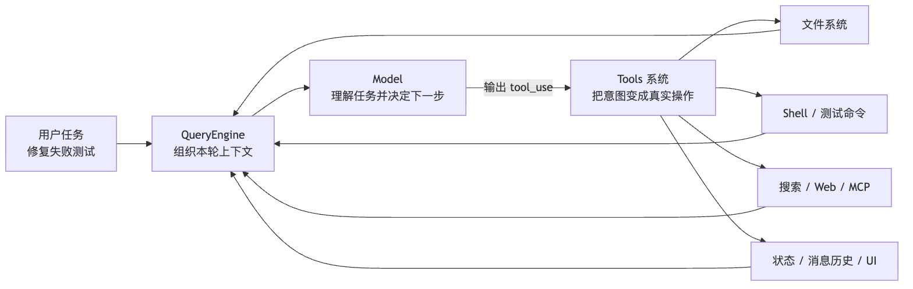

所以这一章要回答的核心问题不是"Claude Code 有哪些工具"，而是：

> Claude Code 如何把模型的行动意图，变成可执行、可约束、可恢复、可审计的工程动作？

## 一、为什么不能让模型直接"想做什么就做什么"

最原始的想法很简单：既然模型会说"我要读 `src/foo.ts`"，那我们直接让它输出一段命令不就行了吗？

比如模型说：

```bash
cat src/foo.ts
npm test
sed -i 's/old/new/g' src/foo.ts
```

看起来可行，但马上会遇到几个问题。

**第一，输入不结构化。**

模型吐出一段文本，宿主程序根本猜不透：这到底是想读文件、改文件，还是执行命令？

**第二，权限不可控。**

同样是 Bash，`npm test` 和 `rm -rf` 风险完全不同。所有动作混在一段 shell 文本里，系统没法做精细治理。

**第三，状态难追踪。**

Claude Code 需要知道哪些文件被读过、哪些被改过、工具结果要不要写回消息流、UI 该怎么展示。裸命令承载不了这些信息。

**第四，扩展会失控。**

今天加文件工具，明天加 MCP，后天加 LSP，再后天加多 Agent。如果每个能力都用一套临时协议，系统很快会变成一团乱麻。
每个外部系统各说各话，协议层的技术债会指数级增长。

于是，Claude Code 引入了统一的 Tool 协议。

## 二、`Tool.ts` 解决的是"动作必须先变成协议"

`Tool.ts` 不是某个具体工具，而是所有工具共同遵守的契约。

可以把它理解成一份"工具身份证"。每个工具都要说明：

- 我叫什么名字
- 我接收什么参数
- 我是否只读
- 我能不能并发执行
- 我需要什么权限
- 我执行时能拿到哪些上下文
- 我执行完以后如何把结果交回系统

这一步很关键。只有动作先被协议化，系统才有机会治理它。

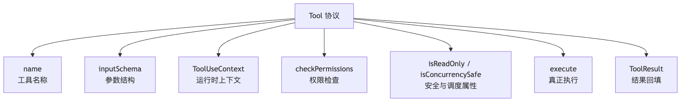

一个成熟工具，不能只是一个函数。它必须同时回答"怎么调用""能不能调用""在哪里调用""调用后怎么收尾"。

这就是 Claude Code 工具系统的第一层核心：

> Tool 不是功能按钮，而是模型行动进入真实世界之前必须签署的运行时协议。

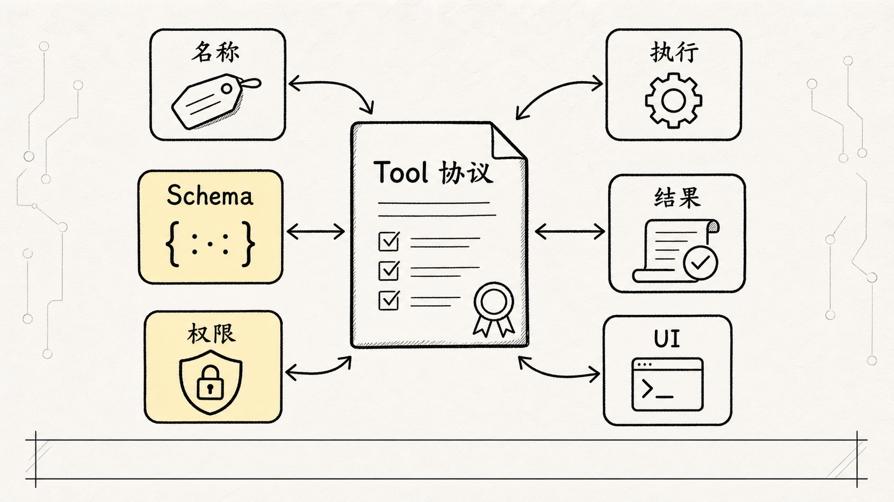

## 三、`inputSchema` 让模型输出从"自然语言"变成"结构化意图"

工具协议里最容易被低估的是 `inputSchema`。

它的作用不是为了 TypeScript 好看。是为了把模型输出收束成可解析的数据。

比如"读文件"这件事，如果模型只是说：

```text
我想看看 src/foo.ts
```

宿主程序还要猜它的意图。但如果它输出的是工具调用：

```json
{
  "tool": "Read",
  "input": {
    "file_path": "src/foo.ts"
  }
}
```

系统就能明确知道：

- 调用哪个工具
- 参数是什么
- 参数是否合法
- 这个动作属于读、写、搜索还是执行
- 后面该走哪条权限和执行路径

这也是 function calling、tool use 和普通 prompt 的关键差别：模型不只是"说想做什么"，而是按协议提交一个可执行请求。

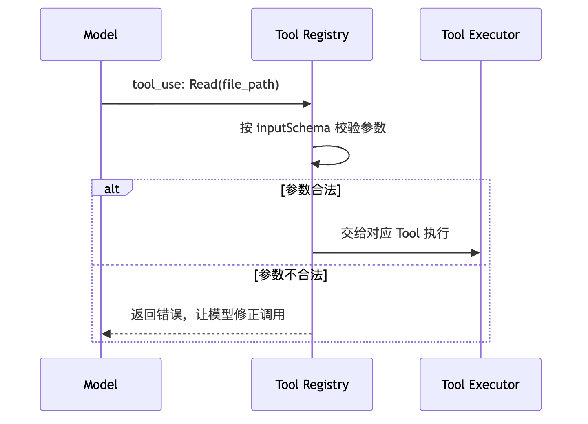

所以 `inputSchema` 的价值不只是"定义参数"。

它把模型的模糊意图，变成了系统可以处理的工程对象。

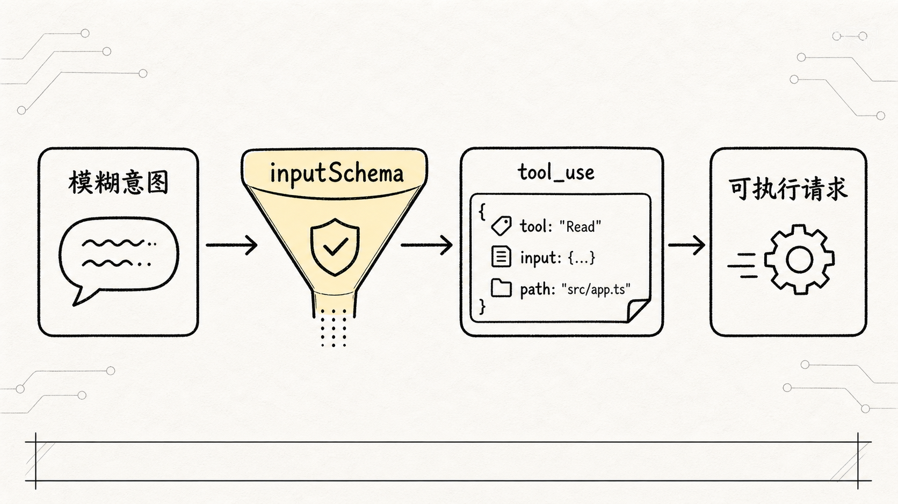

## 四、`ToolUseContext` 说明工具不是孤立函数

如果只看单个工具，很容易把它理解成：

```text
输入参数 -> 执行函数 -> 返回结果
```

（很多 demo 级别的 Agent 框架就是这么设计的。问题在生产环境会暴露。）

但 Claude Code 的工具不是这样运行的。

一个工具执行时，会拿到完整的 `ToolUseContext`。这个上下文里包含当前会话运行需要的大量信息，例如：

- 当前启用的工具集合
- MCP client 和 MCP resource
- 当前 AppState
- 消息历史
- 文件读取缓存
- 中断控制器
- 通知能力
- 任务和文件历史更新器

这意味着工具不是"孤岛"。它执行一次动作，会影响整个会话。

比如还是"修复测试失败"这个例子：

- `Grep` 搜索到失败测试相关文件，会影响下一轮模型上下文。
- `Read` 读过某个文件，系统会记录已读状态。
- `Edit` 修改文件后，UI 需要展示 diff。
- `Bash` 跑测试失败后，错误日志要回到消息流。
- 用户中断时，长时间运行的命令要能取消或收尾。

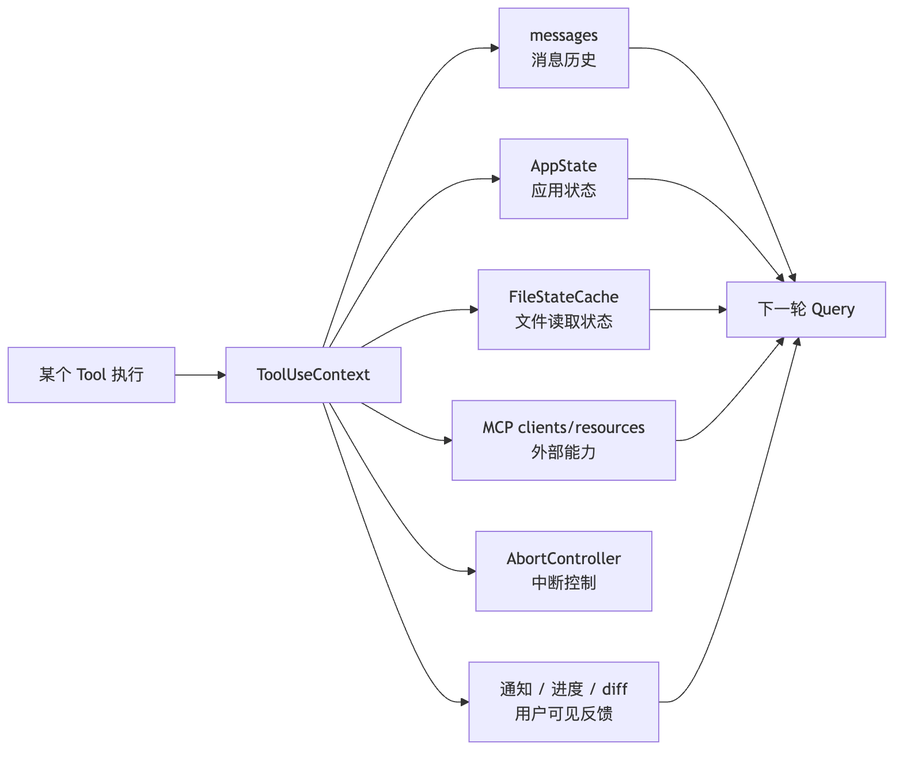

所以工具系统不是简单的函数调用层。

它是 Claude Code 运行时的一部分。

## 五、`tools.ts` 是工具目录，但不是最终菜单

理解了单个 Tool 以后，下一步看 `tools.ts`。

它负责把 Claude Code 的基础能力注册成工具池。这里能看到很多类型的工具：

- 文件类：Read、Edit、Write、Notebook
- 搜索类：Glob、Grep
- 终端类：Bash、PowerShell
- 网络类：WebFetch、WebSearch、WebBrowser
- 协作类：Agent、SendMessage、AskUserQuestion
- 工作流类：Todo、Task、Plan、Worktree
- 扩展类：MCP、LSP、ToolSearch、Skill

但这里有一个特别容易踩坑的点：

> `getAllBaseTools()` 只是候选工具池，不是模型最终看到的工具菜单。

很多人读源码会在这里误判，以为注册了多少工具，模型就能直接用多少。实际不是。

Claude Code 会先准备一个很大的候选池，然后根据环境、模式、规则和运行时状态逐层筛选，最后才生成本轮可见工具。

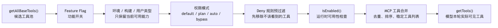

这条链路说明了一个成熟 Agent 系统的基本原则：

> 能力不是越多越好，能力必须按场景、权限和成本被动态裁剪。

## 六、为什么工具要先过滤，再暴露给模型

这里有一个非常关键的安全设计。

Claude Code 不是等模型调用工具以后，才开始判断能不能执行。它会先做"工具可见性过滤"。

有些工具如果被 deny 规则整体禁止，模型本轮根本看不到它。

可以把这件事理解成两道门：

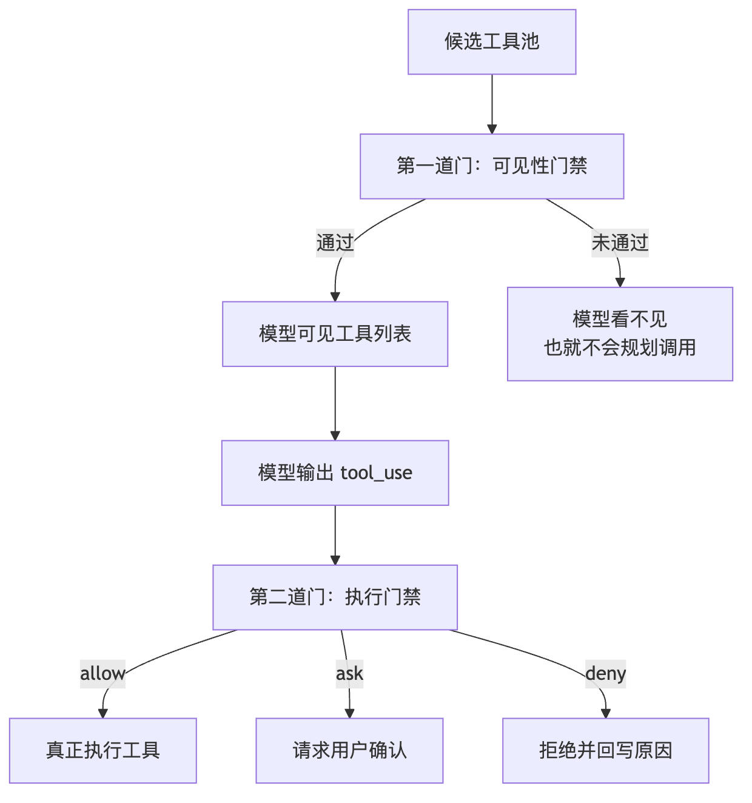

直白地说：模型看不到某个工具，就不会围绕它规划任务。这比"让它看到再拒绝"安全得多。

第一道门解决的是：

> 模型这轮有没有资格看到某个工具？

第二道门解决的是：

> 模型这一次具体调用，能不能真的执行？

这两个问题不能混在一起。

这就是"安全前置"的意义。

（我们在权限设计里经常遇到这种诱惑："先让模型看到全部，执行时再拦"。Claude Code 的选择是相反——不该看的直接不给看。这个决策背后的代价是工具列表会频繁变动，但安全性高了一个数量级。）

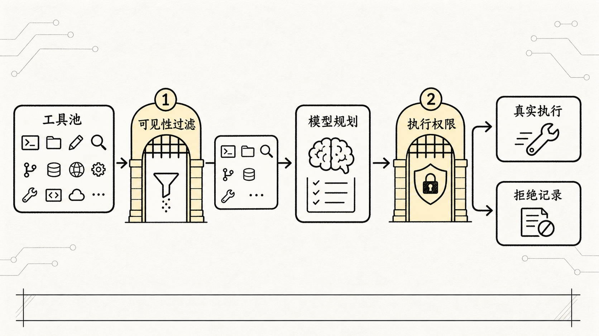

## 七、`ToolPermissionContext` 是工具权限的上下文背包

工具过滤和工具执行都离不开 `ToolPermissionContext`。

它不是一个简单的 `true / false` 开关。是一整包权限上下文，里面通常包含：

- 当前 permission mode
- 用户级规则
- 项目级规则
- 本地规则
- 策略规则
- 命令行规则
- 会话级规则
- allow / deny / ask 三类行为
- 是否允许 bypass
- 是否应该避免弹窗
- 额外工作目录边界

这解释了为什么 Claude Code 的权限系统看起来"重"。

因为它要处理的不是"某个工具能不能用"这么简单，而是：

```text
在当前项目里，
以当前权限模式，
结合用户设置、项目设置、策略设置、命令行参数和会话临时规则，
这个工具是否应该出现在模型面前？
如果模型真的调用它，这次调用又应该 allow、ask 还是 deny？
```

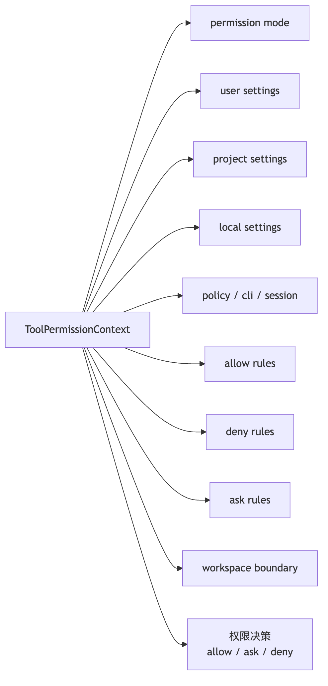

其中最重要的一条铁律：

> deny 优先于 allow。

即使某个地方允许了工具，只要更具体的规则明确拒绝它，系统就应该拒绝。安全系统不能靠"默认相信"，必须让明确拒绝拥有更高优先级。

（这跟防火墙的规则匹配逻辑一致：越具体的规则优先级越高，deny 规则一旦被命中就不再往后看。）

## 八、工具执行不是"调用函数"，而是一条生命周期

当模型真的发起一次 `tool_use` 后，Claude Code 还要走执行管线。

一个典型工具生命周期大概是：

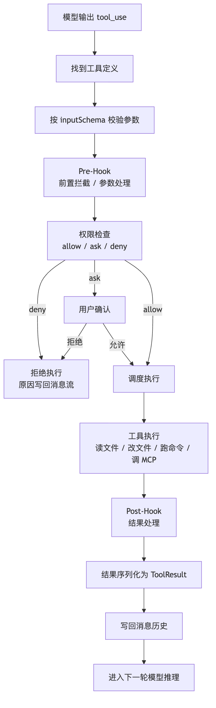

这条管线里，每一步都不是装饰。

参数校验，是为了避免模型传错结构。

权限检查，是为了防止危险动作。

调度执行，要判断哪些工具可以并行，哪些必须串行。

结果序列化，是为了让模型下一轮能读懂刚刚发生了什么。

消息写回，则保证整个会话不是一次性动作，而是可以持续推进的循环。

如果把这些都拿掉，Claude Code 就会退化成：

```text
模型说一句 -> 程序赌一把 -> 命令随便跑 -> 结果随便塞回去
```

这显然不能支撑真实工程项目。

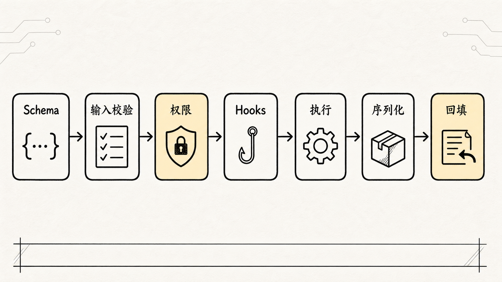

## 九、为什么工具还要区分只读、破坏性和并发安全

在普通 demo 里，工具往往只有"能不能调用"这一个问题。

但在 Claude Code 这种真实开发环境里，工具至少还要回答三个问题。

**第一，它是不是只读？**

`Read`、`Grep`、`Glob` 通常属于低风险工具，因为它们主要观察项目，不直接改变项目。`Edit`、`Write`、`Bash` 则可能改变文件或环境，风险更高。

**第二，它是不是破坏性操作？**

同样是 Bash，`npm test` 和 `rm -rf` 完全不是一个等级。工具系统必须允许更细粒度的风险判断。

**第三，它能不能并发？**

两个读取工具并发执行通常问题不大。但两个写文件工具同时改同一个区域，或者一个 Bash 命令依赖另一个命令的结果，就不能随便并行。

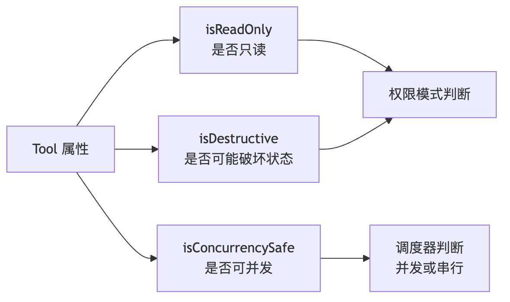

这就是为什么 Tool 协议里会出现这么多看似"额外"的元信息。

它们不是为了把接口做复杂，而是为了让系统知道：这个动作应该被怎么对待。

## 十、内置工具可以分成五类，而不是一堆名字

如果只是罗列 40+ 个工具，读者很快会迷路。

更好的理解方式，是按"它们解决什么问题"来分。

| 类别 | 代表工具 | 解决的问题 |
| --- | --- | --- |
| 文件与搜索 | Read、Edit、Write、Glob、Grep | 让 Agent 能理解和修改项目 |
| Shell 执行 | Bash、PowerShell | 让 Agent 能验证、构建、测试 |
| 会话控制 | AskUserQuestion、Todo、Plan | 让 Agent 能规划、澄清、维护任务状态 |
| 协作任务 | Agent、Task、SendMessage | 让复杂工作可以拆分、跟踪和回收结果 |
| 外部扩展 | MCP、LSP、WebFetch、WebSearch、Skill | 让能力边界扩展到外部服务和复用流程 |

这几个类别正好对应一件事：

> Claude Code 不只是"能操作文件"，它是在把真实软件开发过程拆成一组可治理的动作接口。

修测试时，Agent 可能会这样走：

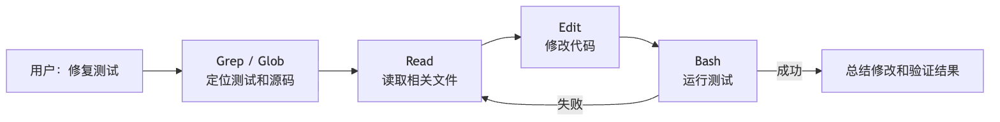

这不是"一个工具调用"，而是一串工具和模型交替推进的闭环。

## 十一、MCP、LSP、Skill 为什么也能接进同一套系统

统一 Tool 协议还有一个很大的好处：扩展能力可以接进来，而不需要推翻整个架构。

MCP 工具也好，LSP 工具也好，Skill 工具也好，本质上都要被转成 Claude Code 能理解的工具视图：

- 有名称
- 有输入 schema
- 有描述
- 有启用条件
- 有权限语义
- 有执行结果

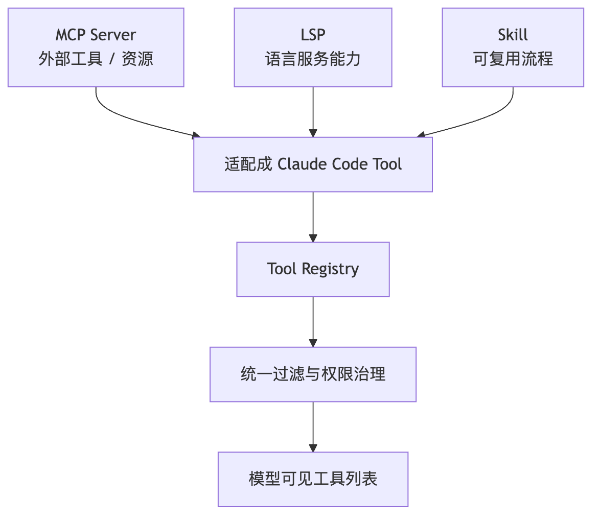

这就是统一协议省下的技术债。

如果没有统一协议，每接一个外部系统，就要发明一套新规则。接得越多，系统越乱。

有了统一协议，新增能力只需要回答：

```text
你如何描述自己？
你如何接收输入？
你如何执行？
你如何声明风险？
你如何把结果交回主循环？
```

## 十二、工具系统真正体现的是 Claude Code 的工程哲学

读完 Tools 系统，最重要的不是记住某个工具名字，而是看懂 Claude Code 的工程取向。

**模型不是执行者，运行时才是执行者。**

模型负责判断下一步要不要行动，以及行动意图是什么。真正执行动作的是宿主程序里的工具系统。

**工具不是插件，而是运行时协议。**

每个工具都要进入 schema、上下文、权限、调度、结果回填和 UI 展示这套完整链路。

**安全不是最后的弹窗，而是工具暴露和工具执行两阶段的治理。**

模型能看到什么，本身就是安全边界的一部分。模型真的调用什么，则是第二层边界。

**扩展不是越多越好，而是必须可裁剪、可过滤、可审计。**

Claude Code 能接 MCP、LSP、Skill、多 Agent，不是因为它把所有能力随便塞给模型，而是因为这些能力都要穿过同一条工具管线。

## 十三、把整章压成一张图

最后，把 Claude Code 的工具系统压成一张完整图：

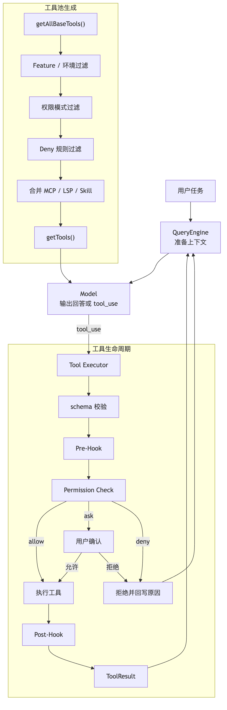

这张图可以作为阅读 `Tool.ts`、`tools.ts`、`toolExecution.ts` 和权限相关代码时的地图。

## 十四、源码阅读时抓哪条工具链路？

如果要把工具系统真正读进源码里，建议不要从某个具体工具开始，而是先追一条完整调用链：

```text
Tool.ts
-> tools.ts
-> query.ts
-> toolExecution.ts
-> permissions.ts
-> tool_result 回填 messages
```

第一步看 `Tool.ts`。重点不是工具名字，而是 `Tool` 协议本身：`inputSchema`、`call`、`validateInput`、`checkPermissions`、`isReadOnly`、`isConcurrencySafe`、`isDestructive`、`interruptBehavior`、`maxResultSizeChars`。这些字段共同回答一个问题：模型发起的动作，在进入真实工程环境前，系统要知道哪些治理信息。

第二步看 `tools.ts`。`getAllBaseTools()` 只是候选池，不是模型最终菜单。真正暴露给模型前，还要经过模式过滤、权限 deny 规则过滤、MCP 工具合并、排序、去重和缓存稳定性处理。这里要特别注意：工具可见性本身就是权限的一部分。被 blanket deny 的工具，最好在模型看到前就消失，而不是等模型调用后再拒绝。

第三步回到 `query.ts`。模型返回的 `tool_use` block 会被收集起来，然后交给 `runTools()` 或 `StreamingToolExecutor`。这里能看到工具系统和 ReAct 主循环的接口：工具不是 UI 按钮，而是下一轮状态机的分叉点。

第四步看 `toolExecution.ts` 的单次调用生命周期：

```text
找到工具定义
-> inputSchema 校验
-> 工具级 validateInput
-> PreToolUse hooks
-> 权限判断
-> tool.call()
-> 结果序列化
-> PostToolUse hooks
-> 生成 tool_result
```

这条生命周期就是生产级 Agent 和简单 function map 的差别。错误不会直接炸掉主循环，而是尽量变成模型下一轮能理解的 tool result。

第五步挑一个具体工具读，比如 `FileReadTool`。它不只是 `fs.readFile()`，还承担了路径校验、大文件预算、offset / limit、PDF / 图片处理、重复读取去重、权限检查、Skill 触发和 UI 展示。读完它会更容易理解为什么 Claude Code 把工具做成“带语义的协议”，而不是把所有动作都塞进 Bash。

这条链路读完，Tools 的核心就清楚了：

```text
模型只提出结构化意图。
工具协议描述动作边界。
执行器治理生命周期。
权限系统决定能否落地。
tool_result 把真实世界重新带回模型。
```

## 小结

Claude Code 的工具系统可以概括成一句话：

> Tools 是 Claude Code 把模型意图变成真实工程动作的运行时协议层；它既给模型长出手脚，也负责给这些手脚装上边界、权限和回路。

理解了 Tools，你就不会再把 Claude Code 看成"聊天模型加几个插件"。它更像一个 Agent Harness：模型负责思考，工具负责行动，权限负责边界，状态负责把一次次行动串成可持续推进的工程闭环。
