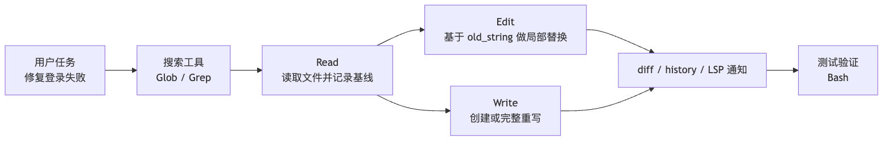
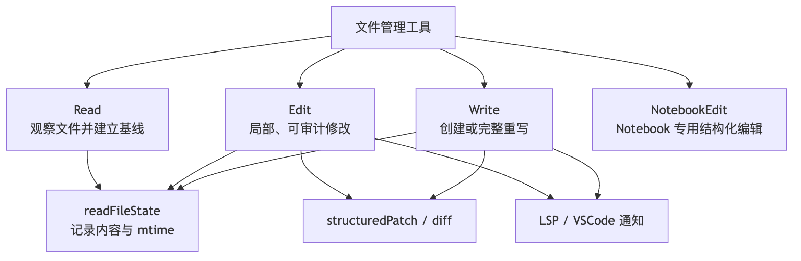
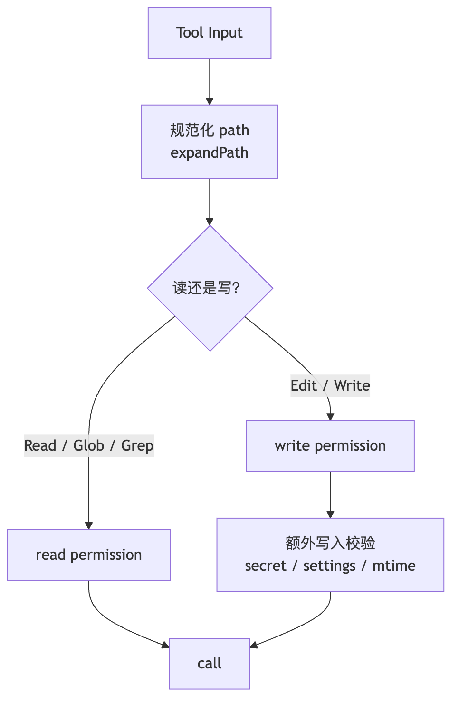
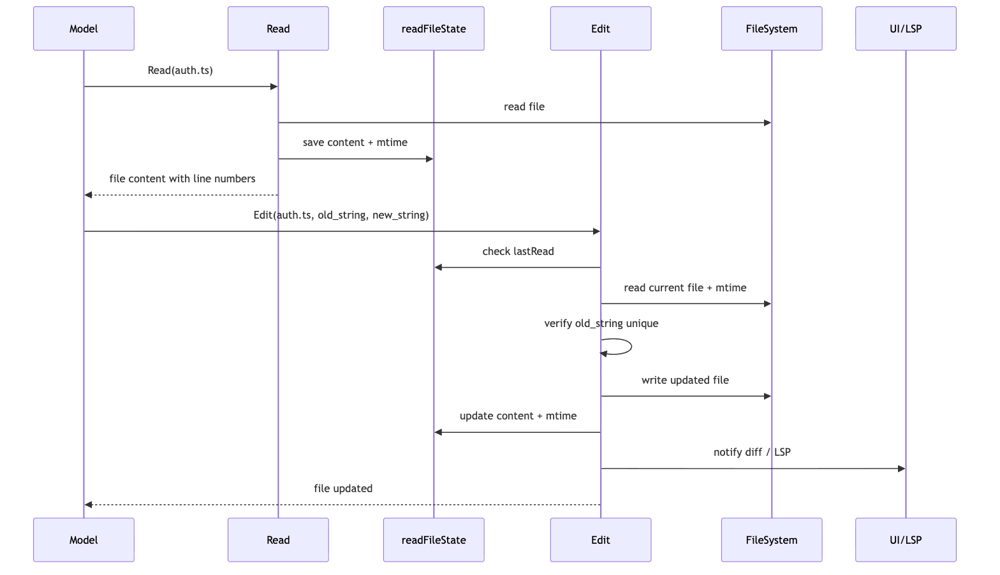

# 《Claude Code 源码解析系列》第7章｜文件工具

你让 AI 修个 bug，它直接说"好了，文件已更新"。

你打开一看，刚才手动改的注释全没了。

这就是 Agent 改代码最吓人的地方：它不像你一样记得"文件之前长什么样"，也意识不到"你刚才是不是动过这行"。Claude Code 解决这个问题的办法，是一套看起来最朴素的文件工具：`Read`、`Edit`、`Write`。

名字确实普通：

- `Read`：读文件。
- `Edit`：按字符串替换修改文件。
- `Write`：创建或整体重写文件。
- `NotebookEdit`：专门编辑 Jupyter Notebook。

光听名字，你会以为它们是 shell 命令的轻量包装：

```text
Read  ~= cat
Edit  ~= sed
Write ~= echo > file
```

但源码里真正有意思的地方，恰恰是 Claude Code 明确不希望模型这样理解它们。

在 `packages/builtin-tools/src/tools/BashTool/prompt.ts` 里，Bash 工具会提醒模型：

```text
Read files: Use Read (NOT cat/head/tail)
Edit files: Use Edit (NOT sed/awk)
Write files: Use Write (NOT echo >/cat <<EOF)
```

这句话背后的设计判断很直接：

> 文件操作不是普通 I/O，而是 Agent 从"观察代码"进入"改变代码"的边界。

对人类工程师来说，打开文件、改一行、保存，是很自然的动作。但对 Agent 来说，这里面有几个必须被系统托住的问题：

- 它真的读过这个文件吗？
- 它读到的是不是最新内容？
- 它要替换的字符串是否唯一？
- 文件是否在它读完之后被用户或格式化器改过？
- 这次修改能不能展示 diff？
- 修改前有没有可恢复的历史快照？
- 修改后 LSP、VSCode、诊断系统要不要知道？

所以这篇文章要回答的核心问题不是"Claude Code 怎么读写文件"，而是：

> Claude Code 如何让模型可以改代码，同时尽量避免看错、改错、覆盖别人修改？

我们继续沿用前面几篇的例子：

```text
用户说：帮我修复登录失败的问题。
```

一个靠谱的文件操作链路，不应该是模型直接猜一个文件然后覆盖掉它，而应该是：

```text
Glob / Grep 先缩小范围
-> Read 读取候选文件，建立内容基线
-> Edit 用唯一字符串做局部替换
-> Write 只在创建新文件或完整重写时使用
-> 工具层生成 diff、更新 readFileState、通知 LSP / VSCode
-> Bash 运行测试验证结果
```



这就是文件工具在 Agent 系统里的位置：它不是"文件 API"，而是一套围绕文件读写建立的安全工作流。

## 一、为什么不用 Bash 直接读写文件

最原始的做法很简单：让模型自己拼 shell。

```bash
cat src/auth.ts
sed -i 's/old/new/g' src/auth.ts
cat <<EOF > src/auth.ts
...
EOF
```

这看起来很像真实工程师的日常操作，但放到 Agent Runtime 里会出问题。

### 1. Shell 命令无法表达"这次操作是什么类型"

同样是一段 Bash：

```bash
cat src/auth.ts
```

它是读操作。

```bash
sed -i 's/foo/bar/g' src/auth.ts
```

它是写操作。

```bash
node scripts/migrate.js
```

它可能读、可能写、可能连数据库。

如果所有动作都混在 Bash 里，Claude Code 很难在工具层判断：

- 这是读还是写？
- 能否并发？
- 需不需要权限确认？
- 是否应该显示 diff？
- 是否应该更新已读文件缓存？
- 是否应该触发文件历史记录？

专用文件工具的价值，就是先把这些动作协议化。

### 2. Shell 命令绕过了文件工具的状态管理

文件修改最怕的不是"写失败"，而是"写成功但覆盖了不该覆盖的内容"。

比如：

```text
1. Agent 读了 src/auth.ts
2. 用户手动改了 src/auth.ts
3. Agent 基于旧内容继续写回
4. 用户刚才的修改被覆盖
```

如果 Agent 用 `sed` 或 `echo > file`，工具系统只能看到一段命令。它很难知道到底改了哪个文件、改前内容是什么、改后要不要更新读缓存。

而 `Read / Edit / Write` 会把文件路径、原始内容、修改内容、mtime、diff 都纳入工具协议。这让 Claude Code 可以做"读后再改"和"防脏写"。

### 3. 文件操作需要给模型和用户两套不同输出

模型需要的是精确内容：

- 带行号的文件内容。
- 字符串匹配失败原因。
- 修改成功或失败的结构化结果。

用户需要的是可理解反馈：

- 读了哪个文件。
- 改了哪个文件。
- diff 长什么样。
- 是否被拒绝。

源码里 `FileReadTool` 的 UI 层甚至明确避免把完整文件内容展示给用户界面搜索索引，只让模型侧收到内容。这说明文件工具不是简单把 `cat` 输出透传给所有地方，而是在"模型上下文"和"用户界面"之间做了分流。

## 二、文件工具在总工具菜单里的位置

Claude Code 的基础工具注册入口在：

```text
src/tools.ts
```

里面会把文件工具挂到基础工具列表里：

```ts
FileReadTool
FileEditTool
FileWriteTool
NotebookEditTool
```

搜索工具 `GlobTool / GrepTool` 也在这里注册。它们和文件工具形成一条自然链路：

```text
先找文件
-> 再读文件
-> 再改文件
```

这里有个小边界：这份源码里没有一个单独的 `LS` 工具。

`Read` 的 prompt 里明确说，它只能读文件，不能读目录；如果要看目录，可以通过 Bash 跑 `ls`。而如果目标是"按模式找到文件"，更推荐走 `Glob`。所以 Claude Code 并没有把文件管理做成一套完整 Unix 命令镜像，而是按 Agent 最常用的语义切开：

```text
看目录结构：Bash ls
按文件名找候选：Glob
按内容找候选：Grep
读取具体文件：Read
局部修改：Edit
创建或整体重写：Write
```

源码路径可以这样对应：

```text
src/tools.ts
packages/builtin-tools/src/tools/FileReadTool/FileReadTool.ts
packages/builtin-tools/src/tools/FileEditTool/FileEditTool.ts
packages/builtin-tools/src/tools/FileWriteTool/FileWriteTool.ts
packages/builtin-tools/src/tools/NotebookEditTool/NotebookEditTool.ts
```

从 `Tool.ts` 的角度看，它们都是普通 Tool：都有 `inputSchema`、`outputSchema`、`validateInput()`、`checkPermissions()`、`call()`、UI 渲染函数。

但从 Agent 行为角度看，它们的职责分工很清楚：



可以把它们理解成三种不同的"文件动作语义"：

- `Read` 是观察。
- `Edit` 是在已观察内容上的局部修改。
- `Write` 是创建或整体替换。

这三个语义一旦拆开，权限、缓存、diff、冲突检测才有落点。

## 三、`Read`：不是 `cat`，而是建立文件基线

`Read` 的入口在：

```text
packages/builtin-tools/src/tools/FileReadTool/FileReadTool.ts
```

它的 prompt 在：

```text
packages/builtin-tools/src/tools/FileReadTool/prompt.ts
```

`Read` 的输入很简单：

```ts
{
  file_path: string
  offset?: number
  limit?: number
  pages?: string
}
```

表面上看，就是读一个路径。源码里真正重要的是三件事：

1. 它是只读、可并发的正式工具。
2. 它会把读到的内容写入 `readFileState`。
3. 它会控制输出体积，避免一个文件吃掉太多上下文。

### 1. `Read` 是只读工具，可以安全并发

`FileReadTool` 声明：

```ts
isConcurrencySafe() {
  return true
}

isReadOnly() {
  return true
}

isSearchOrReadCommand() {
  return { isSearch: false, isRead: true }
}
```

这说明调度器可以把多个 `Read` 并发执行。比如模型一轮里想看三个相关文件：

```text
Read src/auth.ts
Read src/session.ts
Read tests/auth.test.ts
```

这些动作不会互相写文件，所以可以并行。和 `Edit / Write` 相比，这是读工具很重要的运行时属性。

### 2. `Read` 会做路径、权限和文件类型校验

在 `validateInput()` 里，`Read` 会先把路径规范化：

```text
expandPath(file_path)
```

然后检查 read deny 规则：

```text
matchingRuleForInput(fullFilePath, permissionContext, "read", "deny")
```

如果路径被权限配置拒绝，工具会直接返回错误，不进入真正文件读取。

这里还有几个容易被忽略的安全细节：

- Windows UNC 网络路径会跳过文件系统 stat，避免检查路径时触发 SMB/NTLM 凭据泄露风险。
- 普通二进制文件会被拒绝，但 PDF、图片、SVG 有专门处理路径。
- 某些设备文件会被阻止，避免读取时卡住或产生无限输出。

这就是为什么 `Read` 不是 `cat`。`cat` 只负责把字节吐出来，`Read` 还要决定这次读取是否适合进入 Agent 上下文。

### 3. `Read` 默认最多读 2000 行，并支持 offset / limit

`FileReadTool/prompt.ts` 里写着：

```ts
export const MAX_LINES_TO_READ = 2000
```

默认情况下，`Read` 会从文件开头读取最多 2000 行。对于大文件，模型可以用：

```json
{
  "file_path": "/repo/src/big.ts",
  "offset": 1200,
  "limit": 200
}
```

这让文件读取变成一种"可分页观察"，而不是一次把整个世界塞进上下文。

源码里还有两层限制：

- `maxSizeBytes`：默认按总文件大小做读取前限制。
- `maxTokens`：默认按输出 token 做读取后限制。

在 `limits.ts` 里，默认 token 上限是 `25000`。如果超过，工具会提示模型改用 `offset / limit` 或先搜索具体内容。

这对 Agent 很关键：不是所有内容都值得读进上下文。文件工具要帮模型养成"先定位，再局部读取"的习惯。

### 4. `Read` 会把内容写进 `readFileState`

文本读取的核心收尾在 `callInner()` 里：

```text
readFileState.set(fullFilePath, {
  content,
  timestamp: Math.floor(mtimeMs),
  offset,
  limit,
})
```

这一步非常关键。

`readFileState` 可以理解成 Claude Code 对"我读过哪些文件、当时内容是什么、当时 mtime 是多少"的会话级记录。

后面的 `Edit / Write` 会拿这份记录做判断：

```text
你是不是读过这个文件？
你读完之后文件有没有变？
你现在要写回的基线是不是还可信？
```

所以 `Read` 不只是把内容给模型看。它还给后续修改建立了基线。

### 5. 重复读取会走 dedup，避免浪费上下文

`FileReadTool.call()` 里还有一个读缓存优化：

```text
如果同一个文件、同一个 offset / limit 已经读过
并且文件 mtime 没变
就返回 file_unchanged
```

模型侧收到的不是又一份完整文件内容，而是一段提示：

```text
File unchanged since last read...
```

这背后的思路很实用：之前的 `Read` 结果还在对话上下文里，重复塞一份完整内容只会浪费 token。

## 四、`Edit`：不是自由改文件，而是"精确字符串替换"

`Edit` 的入口在：

```text
packages/builtin-tools/src/tools/FileEditTool/FileEditTool.ts
```

它的 prompt 在：

```text
packages/builtin-tools/src/tools/FileEditTool/prompt.ts
```

`Edit` 的核心输入不是一段 patch，也不是一段 shell，而是：

```ts
{
  file_path: string
  old_string: string
  new_string: string
  replace_all?: boolean
}
```

这说明 Claude Code 对"局部修改"的抽象非常克制：

> 你必须告诉我，文件里哪一段旧文本要被替换成哪一段新文本。

这种设计看起来笨，但它非常适合 Agent。

### 1. 为什么不用行号编辑

人类经常说"把第 42 行改掉"。但对 Agent 来说，行号其实不稳定：

- 文件可能被格式化。
- 用户可能在中途插入一行。
- 前一次编辑可能改变后续行号。
- 模型可能把 `Read` 输出里的行号前缀也复制进去。

所以 `Edit` 用的是 `old_string -> new_string`。

只要 `old_string` 足够唯一，系统就能在当前文件内容里重新定位它，而不是盲目信任模型记住的行号。

`FileEditTool/prompt.ts` 里也提醒模型：

```text
从 Read 输出复制内容时，不要把行号前缀放进 old_string / new_string。
```

换句话说，行号是帮助模型看文件的，不是修改协议本身。

### 2. `Edit` 要求模型先读文件

`Edit` 的 prompt 里写得很明确：

```text
You must use your Read tool at least once in the conversation before editing.
```

真正执行时，`FileEditTool.call()` 会检查：

```text
lastRead = readFileState.get(absoluteFilePath)
```

如果文件存在，但没有对应的 `lastRead`，或者文件的最后修改时间晚于上次读取时间，工具会抛出：

```text
FILE_UNEXPECTEDLY_MODIFIED_ERROR
```

这就是"读后再改"的硬约束。

注意，这不是为了形式主义地要求模型先调用一下 `Read`。它真正要保证的是：

```text
Agent 的修改必须建立在某个已知文件版本上。
```

没有这个基线，`Edit` 就不知道模型看到的内容和磁盘上的内容是不是同一个版本。

### 3. `Edit` 会防止脏写

脏写问题可以用一个小故事说明：

```text
10:00 Agent 读了 auth.ts
10:01 用户手动修了一行 auth.ts
10:02 Agent 基于 10:00 的旧内容继续改 auth.ts
```

如果工具不检查文件是否变化，10:01 的用户修改就可能被覆盖。

`FileEditTool.call()` 的关键逻辑是：

```text
读取当前文件
-> 获取当前 mtime
-> 找 readFileState 里的 lastRead
-> 如果没有 lastRead，或当前 mtime 晚于 lastRead.timestamp
-> 再比较内容是否真的没变
-> 如果内容变了，拒绝写入
```

这比只看 mtime 更谨慎。源码里还考虑了 Windows、云同步、杀毒软件等场景：有时 mtime 变了，但内容没变。所以它会在完整读取时做一次内容对比，避免误拒绝。

这就是文件工具的工程味道：不是一条理想化规则，而是在真实文件系统的麻烦里做折中。

### 4. `Edit` 要求 `old_string` 唯一

在 `validateInput()` 里，`Edit` 会先找实际要替换的字符串：

```text
findActualString(file, old_string)
```

找不到就拒绝：

```text
String to replace not found in file.
```

如果找到了，但匹配次数超过 1，并且 `replace_all` 不是 true，也会拒绝：

```text
Found N matches of the string to replace, but replace_all is false.
```

这一步非常重要。因为模型常见的错误不是"完全不会改"，而是给了一个太短的 `old_string`：

```ts
return false
```

这种字符串可能在文件里出现很多次。系统如果随便替换第一个，就会变成随机改代码。

所以 Claude Code 的策略是：

```text
要么提供足够上下文，让 old_string 唯一；
要么显式声明 replace_all；
否则拒绝。
```

这相当于让模型承担"我到底想改哪一处"的表达责任。

### 5. `Edit` 会保留编码和换行风格

真正写入前，`Edit` 会调用 `readFileForEdit()`，拿到：

```ts
{
  content,
  fileExists,
  encoding,
  lineEndings
}
```

然后 `writeTextContent()` 会用原来的编码和换行风格写回。

这对人类读者可能不显眼，但对代码仓库很重要。否则一个小改动可能顺手把整份文件的 CRLF/LF、编码风格都改了，导致 diff 变得巨大。

好的文件工具不只是"能写"，还要尽量只写应该写的部分。

### 6. `Edit` 写完后会更新整个运行时

`Edit` 成功写入后，不只是返回一句"改好了"。它还会做一串收尾：

```text
生成 structuredPatch
-> writeTextContent 写入磁盘
-> 通知 LSP didChange / didSave
-> 通知 VSCode 更新 diff view
-> 更新 readFileState 为修改后的内容和 mtime
-> 记录文件操作 analytics
-> 必要时计算 git diff
```

这说明 `Edit` 是 Claude Code 运行时的一部分，不是孤立的文件函数。

文件一旦被 Agent 改了，后续系统都要知道这件事：

- LSP 要重新诊断。
- UI 要能展示修改。
- 下一次编辑要基于新内容。
- 会话历史要能记录修改。
- 远程模式可能要计算 diff。

## 五、`Write`：不是推荐的修改方式，而是"创建或完整重写"

`Write` 的入口在：

```text
packages/builtin-tools/src/tools/FileWriteTool/FileWriteTool.ts
```

它的输入更直接：

```ts
{
  file_path: string
  content: string
}
```

这意味着 `Write` 是一次完整覆盖。

所以 `FileWriteTool/prompt.ts` 会提醒模型：

```text
Prefer the Edit tool for modifying existing files.
Only use this tool to create new files or for complete rewrites.
```

这句话很关键。

`Write` 的能力更强，也更危险。因为它不是替换一个局部字符串，而是把目标文件整体变成 `content`。

### 1. 现有文件也必须先 `Read`

`Write` 的 prompt 里写着：

```text
If this is an existing file, you MUST use the Read tool first.
```

执行时，`FileWriteTool.call()` 也会做类似的防脏写检查：

```text
读取当前文件 meta
-> 如果文件存在
-> 找 readFileState 里的 lastRead
-> 如果没有 lastRead，或文件 mtime 晚于 lastRead.timestamp
-> 内容没法证明未变，就拒绝写入
```

所以即使是完整覆盖，Claude Code 也不允许模型在不了解现有文件内容的情况下直接覆盖。

### 2. `Write` 区分 create 和 update

`Write` 写完后会返回两类结果：

```ts
type: "create"
type: "update"
```

如果是新文件：

```text
originalFile: null
structuredPatch: []
```

如果是更新已有文件：

```text
originalFile: oldContent
structuredPatch: patch
```

也就是说，`Write` 虽然是整体覆盖，但对已有文件仍然会生成 diff，让用户和系统知道这次覆盖到底改变了什么。

### 3. `Write` 同样接入历史、LSP 和 UI

和 `Edit` 一样，`Write` 在真正写入前会：

```text
fileHistoryTrackEdit(...)
diagnosticTracker.beforeFileEdited(...)
```

写入后会：

```text
notifyVscodeFileUpdated(...)
lspManager.changeFile(...)
lspManager.saveFile(...)
readFileState.set(...)
```

这说明 `Write` 不是一个"粗暴覆盖文件"的快捷口，而是一个更高风险、更适合少数场景的正式工具。

它适合：

- 创建新文件。
- 用户明确要求生成一个完整文件。
- 文件内容整体重写比局部替换更清晰。

它不适合：

- 修改已有代码里的几行。
- 做变量重命名。
- 改配置文件的局部字段。
- 在没有读过文件时直接覆盖。

## 六、`NotebookEdit`：为什么 Notebook 要单独做工具

`Read` 可以读取 `.ipynb`，但普通 `Edit` 不允许直接编辑 Notebook。

在 `FileEditTool.validateInput()` 里，如果目标文件以 `.ipynb` 结尾，会返回：

```text
File is a Jupyter Notebook. Use the NotebookEdit tool to edit this file.
```

原因很简单：Notebook 不是普通文本文件。

`.ipynb` 表面上是 JSON，但它的真实编辑对象是：

- cell。
- cell 类型。
- source。
- outputs。
- metadata。

如果让模型用普通字符串替换去改 `.ipynb`，很容易破坏 JSON 结构，或者把 cell 输出、元数据一起改乱。

所以 Claude Code 把 Notebook 编辑单独拆成 `NotebookEdit`。这体现了文件工具设计里的一个原则：

> 文件不是只有"字节"这一层语义。不同文件格式需要不同编辑粒度。

普通源码文件适合 `old_string -> new_string`。

Notebook 更适合"按 cell 编辑"。

## 七、文件工具的核心状态：`readFileState`

如果只记住一个源码概念，我会选 `readFileState`。

它在 `ToolUseContext` 里传给工具：

```text
ToolUseContext.readFileState
```

`Read` 会写入它。

`Edit / Write` 会读取它，并在成功写入后更新它。

可以把它想成 Claude Code 的"文件现场记录"：

```text
我在什么时候读过哪个文件？
当时读到的内容是什么？
当时文件的 mtime 是多少？
这次读取是完整读取，还是 offset / limit 局部读取？
```

它解决的不是缓存这么简单，而是两个 Agent 编程里的关键问题。

### 1. 防止模型在没看文件时乱改

没有 `readFileState`，模型可以直接说：

```json
{
  "file_path": "/repo/src/auth.ts",
  "old_string": "return false",
  "new_string": "return true"
}
```

但系统不知道它有没有真的读过这个文件。

有了 `readFileState`，`Edit / Write` 至少可以问一句：

```text
这个文件是否已经被 Read 建立过基线？
```

如果没有，拒绝。

### 2. 防止模型覆盖用户或工具的中途修改

文件系统是共享的。用户、格式化器、测试脚本、另一个 Agent 都可能改同一个文件。

`readFileState` 让 `Edit / Write` 可以比较：

```text
lastRead.timestamp
currentFile.mtime
```

如果当前文件更新，工具会要求重新读取。

这一步让 Claude Code 的文件修改从"盲写"变成了"基于版本的写"。

它还不等于完整的 git merge，也不是 CRDT（无冲突复制数据类型，分布式系统里实现最终一致性的数据结构），但对单机 CLI Agent 来说，这已经挡住了大量误覆盖场景。

## 八、权限：读权限和写权限是两条路

文件工具都接入 `checkPermissions()`。

但读和写走的是不同权限语义：

```text
Read / Glob / Grep -> checkReadPermissionForTool
Edit / Write       -> checkWritePermissionForTool
```

这很合理。读一个文件和改一个文件，风险不一样。

例如：

- 读取 `src/auth.ts` 通常低风险。
- 修改 `src/auth.ts` 风险更高。
- 读取 secrets 文件也可能高风险。
- 写入 `.claude/settings.json` 这类设置文件需要额外校验。

`Edit` 和 `Write` 还会对 team memory 文件做 secret 检查，避免把敏感信息写进团队记忆同步路径。

所以文件工具的权限不是一个总开关，而是按动作语义拆开的：



这也是为什么要有专用文件工具。如果都塞进 Bash，权限系统很难知道"这段命令到底读了什么、写了什么"。

## 九、从一次真实修改看完整链路

现在把前面的机制串起来。

用户说：

```text
帮我修复登录失败的问题。
```

Claude Code 可能先用搜索工具定位：

```text
Glob: **/*auth*.ts
Grep: "login|signIn|authenticate"
```

然后读核心文件：

```json
{
  "file_path": "/repo/src/auth.ts"
}
```

`Read` 做了这些事：

```text
路径规范化
-> read 权限检查
-> 文件类型和大小检查
-> 读取内容
-> 加行号返回给模型
-> readFileState 记录 content / timestamp / offset / limit
```

模型发现问题后，用 `Edit`：

```json
{
  "file_path": "/repo/src/auth.ts",
  "old_string": "if (!session.user) {\n  return false\n}",
  "new_string": "if (!session?.user) {\n  return false\n}"
}
```

`Edit` 做了这些事：

```text
路径规范化
-> write 权限检查
-> secret / settings / 文件大小校验
-> 确认 old_string != new_string
-> 读取当前文件
-> 检查 readFileState，防止文件读后被改
-> 确认 old_string 存在且唯一
-> 生成 patch
-> 写入磁盘
-> 通知 LSP / VSCode
-> 更新 readFileState 为修改后内容
-> 返回结构化 diff
```

最后 Claude Code 用 Bash 运行测试：

```text
npm test -- auth
```

如果测试失败，新的错误输出又会回到 ReAct 循环（LLM Agent 的一种推理与行动交替执行模式）里，模型继续搜索、读取、修改、验证。



这条链路里的重点不是"工具多"，而是每一步都给下一步留下了可验证的状态。

## 十、文件工具的边界

文件工具也不是万能的。

### 1. `Edit` 适合局部文本，不适合复杂重构

`Edit` 的核心是字符串替换。它能很好地处理：

- 改一段逻辑。
- 替换一个变量名。
- 增加一个分支。
- 修改配置片段。

但它不是 AST（抽象语法树，源代码的树形结构表示）重构工具。

如果要做跨文件重命名、类型感知重构、自动修 import，单靠 `Edit` 很容易吃力。这时需要搜索工具、LSP 工具、测试反馈一起协作。

### 2. `Write` 能力强，但不该滥用

`Write` 可以完整覆盖文件，所以模型很容易偷懒：

```text
读一个文件
-> 重新生成整份文件
-> Write 覆盖
```

这会带来更大的 diff，也更容易丢失细节。

所以 prompt 明确要求：

```text
修改现有文件优先用 Edit。
只有新建文件或完整重写时才用 Write。
```

这也是人类工程里的好习惯：能小改就不要大换。

### 3. `readFileState` 不是版本控制系统

`readFileState` 可以防止常见脏写，但它不等于 git。

它记录的是当前会话里的读取基线，不负责：

- 合并分支。
- 解决复杂冲突。
- 追踪所有历史版本。
- 理解语义级重构。

真正的长期版本管理仍然要靠 git。Claude Code 的文件工具解决的是"Agent 这一轮会话里，别在没看清楚时写坏文件"。

## 十一、和搜索工具、终端工具的关系

文件工具不是孤立使用的。

在 Claude Code 的真实工作流里，它通常和搜索、终端一起组成闭环：

```text
Glob / Grep：找到可能相关的位置
Read：把候选文件读进上下文，并建立基线
Edit：做局部可审计修改
Write：创建新文件或完整重写
Bash：运行测试、构建、格式化、git 命令
```

专用文件工具负责"代码内容的安全读写"。

Bash 负责"项目命令的执行"。

搜索工具负责"在大仓库里缩小范围"。

这三个角色分开以后，系统才能分别优化：

- 搜索工具限制结果量，避免上下文爆炸。
- 文件工具维护读写基线，避免覆盖错误。
- 终端工具处理长命令、测试、构建和沙箱。

如果所有事情都交给 Bash，这些边界都会变模糊。

## 十二、记住这条主线

这一篇可以压缩成一句话：

> Claude Code 的文件管理工具，不是把 `cat / sed / echo` 包了一层，而是把"读、改、写"变成了可校验、可授权、可恢复、可展示的 Agent 文件工作流。

再压缩一点：

```text
Read 建立基线
Edit 基于基线做局部替换
Write 只做创建或完整重写
readFileState 防止没读就改、读后被改还继续写
diff / history / LSP / UI 让修改进入完整工程反馈链
```

所以，当我们看 Claude Code 为什么能像工程师一样改代码时，不要只看模型会不会写代码。

真正让它变得可靠的，是这些看起来很朴素的文件工具：

- 不让它没看就改。
- 不让它随便覆盖。
- 不让它用模糊字符串乱替换。
- 不让一次读取吞掉过多上下文。
- 不让一次写入脱离 diff、历史和诊断系统。

Agent 的"会改代码"，本质上不是一次生成能力，而是一套围绕文件系统建立的工程纪律。
