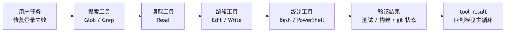
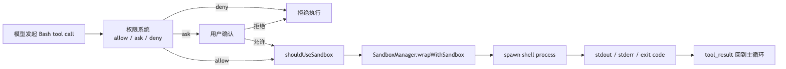

# 5.2 终端工具：Agent 真正碰到机器的那一刻

很多人看 Claude Code 的工具列表时，会把 `Bash` 当成一个很朴素的工具：

> 不就是让模型跑一条 shell 命令吗？

这个理解只说对了一半。

Claude Code 要是只当个聊天机器人，确实不需要这么重的终端工具——模型回答问题就够了。可一旦它要进真实代码仓库干活，事情就变了：改完代码得跑测试，要查项目状态得看 `git status`，要启动服务得执行 `npm run dev`，要验证构建得跑 `bun test`、`pytest`、`cargo test`。

这些动作不是"读文件"或"写文件"能覆盖的。它们得把执行权交给本机环境。

说白了，终端工具解决的核心问题是：

> Agent 怎么把"我想执行一个命令"这句话，变成一个有 schema、有权限、有进度、有输出、有 sandbox、有后台任务生命周期的可控执行单元？

为了让这篇文章更好懂，我们固定一个贯穿例子：

```text
用户说：帮我修复登录失败的问题。
```

一个靠谱的 Claude Code 大概率会经历这条链：

```text
Glob / Grep 定位 auth 相关文件
-> Read 阅读核心逻辑
-> Edit 修改代码
-> Bash 跑测试验证
-> Bash 查看 git diff / git status
```

在这条链里，`Bash` 往往出现在后半段。它不是用来替代 `Read`、`Grep`、`Edit` 的，而是来做那些只有项目环境自己才能回答的事情：

- 这组测试到底过不过？
- 构建脚本能不能跑完？
- 当前 git 工作区是什么状态？
- 本地服务有没有启动？
- 一个脚本运行后真正输出了什么？

所以终端工具不是"万能入口"，而是 Agent 和真实机器之间最危险、也最有价值的一座桥。



## 一、为什么不能让模型随便跑 shell

最简单的实现当然是：

```ts
exec(modelGeneratedCommand)
```

但这几乎是 Agent 系统里最危险的设计。shell 命令不是窄 API。`Read` 工具最多读一个文件，`Grep` 工具最多搜索文本，`Edit` 工具有明确的文件路径和替换内容。而 shell 命令？它能干的事太多了：

```bash
cat package.json
npm test
rm -rf dist
curl https://example.com/install.sh | bash
git reset --hard
python script.py
```

有的只读，有的写文件，有的跑测试，有的联网下载，有的甚至执行远程代码。更麻烦的是 shell 命令还能组合：

```bash
ls && git push
cat file | xargs rm
make test && npm publish
```

如果只看前半段，系统很容易被绕过。（权限检查只看第一条命令就放行，后面跟个 `&& rm -rf /` 就完犊子了。）

所以 Claude Code 不能把 BashTool 写成一个普通 `exec()` 包装。它得先回答一串问题：

```text
输入是否合法？
这条命令是只读、搜索，还是可能写入？
当前 permission mode 允许吗？
是否命中 allow / ask / deny 规则？
是否需要用户确认？
是否应该进入 sandbox？
命令跑久了要不要后台化？
输出太长怎么处理？
执行完 cwd 是否改变？
结果怎么回到模型上下文？
```

这就是 `BashTool` 在源码里显得很重的原因——它真正包装的不是一条命令，而是一整个执行生命周期。

## 二、BashTool 的输入：命令之外，还要描述、超时、后台和 sandbox

`BashTool` 的主入口在：

```text
packages/builtin-tools/src/tools/BashTool/BashTool.tsx
```

它通过 `buildTool()` 定义成正式 Tool，而不是零散函数。

模型能看到的输入 schema 主要包括：

```ts
{
  command: string
  timeout?: number
  description?: string
  run_in_background?: boolean
  dangerouslyDisableSandbox?: boolean
}
```

这里每个字段都对应一个执行问题。

`command` 是真正要执行的命令，不多说。

`description` 是给人和模型看的短描述。源码里甚至要求它用主动语态描述命令在做什么，不要写"复杂""风险"这类含糊词。比如：

```text
ls -> List files in current directory
git status -> Show working tree status
npm install -> Install package dependencies
```

这不是装饰。终端命令往往又长又绕，UI 折叠、权限弹窗、任务列表都需要一句人能读懂的摘要。

`timeout` 控制最长执行时间。默认值来自 `getDefaultTimeoutMs()`，最大值由 `getMaxTimeoutMs()` 约束，避免模型给一个无限等待的命令把会话挂住。（你们懂的，那种 `while true; do sleep 1; done` 能直接把 Agent 干废。）

`run_in_background` 表示这条命令可以直接转成后台任务。比如启动 dev server、跑长构建、监听日志，都不适合阻塞主循环。

`dangerouslyDisableSandbox` 是一个很敏感的逃生口：在策略允许时，显式要求这条命令不要进入 sandbox。命名特意带上 `dangerously`，就是在提醒调用方——这不是普通开关，开了就要自担风险。

从输入 schema 就能看出来：Claude Code 对 Bash 的定位不是"执行文本"，而是"执行一个可治理动作"。

## 三、BashTool 什么时候算只读

终端工具最先要解决的问题是：

> 哪些命令可以当作安全的观察动作，哪些命令必须当作可能有副作用的动作？

源码里有两个相关概念，容易混在一起：

- `isSearchOrReadCommand()`：主要用于 UI 折叠和展示，把命令识别成搜索、读取、列表类。
- `isReadOnly()`：用于并发安全和权限判断，只有真正通过只读约束的命令才算只读。

在 `BashTool.tsx` 里，Claude Code 维护了几组常见命令：

```text
搜索类：find、grep、rg、ag、ack、locate、which、whereis
读取类：cat、head、tail、wc、stat、file、strings、jq、awk、cut、sort、uniq、tr
列表类：ls、tree、du
语义中性类：echo、printf、true、false、:
```

如果一条命令只是：

```bash
rg "login" src
```

它可以被识别为搜索命令。

如果是：

```bash
cat package.json | jq '.scripts'
```

它可以被识别为读取 / 分析命令。

但如果是：

```bash
cat package.json | sh
```

这就不能再算只读了。后半段 `sh` 会执行输入内容，谁知道 `package.json` 里会不会被塞进恶意脚本？

源码里的判断思路很克制：对 pipeline、`&&`、`||`、`;` 拆分以后，所有非中性片段都必须属于搜索 / 读取 / 列表集合，整条命令才适合折叠成"读或搜"。只要出现一个不认识或可能有副作用的命令，就退回到普通 Bash 命令处理。

而真正的只读权限判断还会进入：

```text
packages/builtin-tools/src/tools/BashTool/readOnlyValidation.ts
```

这里会检查更细的 allowlist，例如：

- `git status`、`git diff` 这类 git 只读命令
- `rg` 的安全参数
- `fd` 的安全参数
- `docker`、`gh`、`pyright` 等外部工具的只读子命令
- 输出重定向、路径约束、UNC 路径风险、`sed` 特例

Claude Code 没有用"命令名字白名单"这么粗糙的方式判断安全性。它会继续看参数、重定向、路径和组合结构。（换句话说，不是看你说你要干什么，而是看你实际上会干什么。）

这也解释了为什么文档里一直强调：能用 `Read`、`Glob`、`Grep` 的时候，优先用专用工具；Bash 只保留给测试、构建、git、服务启动这类真正需要 shell 的事情。

## 四、权限检查：BashTool 不自己拍脑袋

`BashTool` 的权限入口很短：

```ts
async checkPermissions(input, context) {
  return bashToolHasPermission(input, context)
}
```

真正复杂的逻辑在：

```text
packages/builtin-tools/src/tools/BashTool/bashPermissions.ts
src/utils/permissions/bashClassifier.ts
src/utils/permissions/shellRuleMatching.ts
```

这一层要把一条 shell 命令放进 Claude Code 的权限系统里：

```text
permission mode
-> deny / ask / allow 规则
-> 只读命令自动放行
-> Bash 安全分类
-> compound command 拆分
-> 用户确认建议
-> sandbox 相关自动放行策略
```

有个细节挺有意思：`preparePermissionMatcher()` 会用 `parseForSecurity(command)` 解析命令。

对于复合命令：

```bash
ls && git push
```

它不能只匹配 `ls`。源码会把子命令拆出来，让 `git push` 也参与权限规则匹配。这样如果用户或策略配置了 `Bash(git push:*)` 之类规则，复合命令不会因为前半段看起来安全就绕过检查。

如果解析失败呢？

Claude Code 的策略是 fail-safe：解析不出来，就不要假装安全。它会让 matcher 返回更保守的结果，让安全 hook 有机会触发。

这背后的原则很简单：

> shell 字符串越看不懂，越不能自动信任。

（这条原则其实是整个安全层的底色：宁可误杀，不可误放。）

## 五、Bash 安全：执行前判断永远只能做一半

Claude Code 对 Bash 的静态安全判断非常多。

比如 `bashPermissions.ts` 里会限制过宽的规则建议，避免生成类似：

```text
Bash(sh:*)
Bash(bash:*)
Bash(env:*)
Bash(sudo:*)
```

这种规则一旦被保存，几乎等于允许任意命令通过包装器执行。说白了，这跟直接开放 `exec()` 没什么区别。

`readOnlyValidation.ts` 里也有大量安全注释。比如 `fd` 的 `--exec` / `--exec-batch` 不在安全参数里，因为它会对搜索结果执行任意命令。`xargs` 的某些参数也要特别小心，因为 GNU getopt 的可选参数语义可能让验证器和真实执行行为不一致。

这些细节说明 Claude Code 的 Bash 安全不是只靠一句"危险命令黑名单"。它更像是一套分层判断：

```text
命令能不能解析？
子命令是什么？
有没有危险 shell 包装器？
有没有输出重定向？
是不是只读 allowlist 里的命令和参数？
是不是会写 git 内部路径？
是不是会创建 symlink？
是否命中用户配置规则？
```

但无论静态判断做得多细，shell 仍然有一个天然问题：

> 命令跑起来以后，可能执行脚本、启动子进程、读写动态路径，很多行为不是执行前字符串分析能完全预测的。

这就引出了下一层：sandbox。

## 六、Sandbox：不是权限替代品，而是运行时边界

`BashTool` 是否进入 sandbox，由这个函数决定：

```text
packages/builtin-tools/src/tools/BashTool/shouldUseSandbox.ts
```

逻辑可以压成四步：

```text
sandbox 全局是否启用？
是否显式 dangerouslyDisableSandbox，且策略允许？
input.command 是否存在？
命令是否命中 excludedCommands？
```

都通过之后，返回 `true`。

这说明 Claude Code 的 sandbox 不是"这条命令危险才进"，而更像：

```text
默认能进就进；
只有明确配置的例外才不进。
```

真正执行时，sandbox 会在 `src/utils/Shell.ts` 里参与命令构造：

```text
provider.buildExecCommand(command)
-> shouldUseSandbox 为 true
-> SandboxManager.wrapWithSandbox(...)
-> spawn(wrappedCommand)
```

也就是说，sandbox 不是命令执行完以后再审计，而是在 `spawn` 之前就把命令包装成另一个运行形态。

这里要特别区分两层护栏：

```text
权限系统：这条命令要不要执行？
sandbox：这条命令执行以后，最多还能碰到什么？
```

权限系统是授权，sandbox 是隔离。授权不能替代隔离——执行前推断永远有盲区；隔离也不能替代授权——有些动作一开始就不应该让模型执行。（两层都得有，缺一不可。）

完整链路大概是：



这就是为什么终端工具和 sandbox 章节关系很近：`BashTool` 是动作入口，sandbox 是动作落地时的边界。

## 七、真正执行：每条命令都是一个新的 shell 进程

`BashTool.call()` 最后会进入 `runShellCommand()`，再调用：

```text
src/utils/Shell.ts
```

核心函数是：

```ts
exec(command, abortSignal, 'bash', options)
```

这里会做几件很工程化的事情。

**第一，选择 shell provider。**

Claude Code 会优先找 `CLAUDE_CODE_SHELL`，然后看用户的 `SHELL` 环境变量，再查找 `zsh` / `bash`。但它只支持 bash / zsh 这一类 POSIX shell。原因很直接：BashTool 的解析、安全判断、命令构造都假设了这类 shell 语义。

**第二，构造真正执行的命令。**

`provider.buildExecCommand()` 会把原始命令包装成可执行形式，并额外记录 cwd。命令执行后，Claude Code 会读取临时 cwd 文件，判断当前工作目录是否变化，然后更新全局 cwd 状态。

这就是为什么你在 Claude Code 里执行：

```bash
cd packages/builtin-tools
```

后续命令会跟着进入新目录。普通 `child_process.spawn` 的 cwd 改变不会自动影响父进程，Claude Code 是通过额外的 cwd 跟踪文件把这个状态拿回来的。（一个挺精巧的小 trick，解决了进程隔离和状态同步的矛盾。）

**第三，处理输出。**

stdout 和 stderr 会进入 `TaskOutput`。普通情况下输出写到任务输出文件里，进度轮询每秒读取尾部内容；如果调用方提供 `onStdout`，也可以走 pipe 模式拿实时 stdout。

**第四，设置环境变量。**

执行时会注入一些运行时环境，例如：

```text
GIT_EDITOR=true
CLAUDECODE=1
SHELL=<当前 shell>
```

`GIT_EDITOR=true` 很关键。它避免 `git commit` 这类命令突然打开编辑器，把终端会话挂住。（没有这行的话，模型调用 `git commit` 就会卡死在 vim 里，跟个傻子一样。）

## 八、长命令不能堵住主循环：进度、后台任务和输出路径

终端工具还有一个很现实的问题：

> 如果模型执行 `npm install`、`npm run dev`、`pytest`，主循环要等多久？

Claude Code 的处理不是简单等待。

`BashTool` 里有几个关键常量：

```text
PROGRESS_THRESHOLD_MS = 2000
ASSISTANT_BLOCKING_BUDGET_MS = 15000
```

命令开始后，如果 2 秒内没结束，UI 会开始显示进度。`TaskOutput` 每秒轮询输出文件，把最后几行作为 progress 发回 UI。

如果命令更久，比如在 assistant mode 下超过 15 秒，主 Agent 不应该一直卡在那里。源码里会把可后台化的命令转成后台任务：

```text
前台 shellCommand 正在运行
-> registerForeground
-> 超过阻塞预算或用户手动后台化
-> backgroundExistingForegroundTask / spawnShellTask
-> 返回 backgroundTaskId
-> 主循环继续
```

模型拿到的结果里会出现：

```text
Command running in background with ID: ...
Output is being written to: ...
```

这时 Agent 可以继续读文件、改代码，后续再通过任务输出机制读取后台任务结果。

这也是终端工具和 Task 工具之间的交叉点：

- `BashTool` 启动真实 shell 进程；
- `LocalShellTask` 把长命令纳入任务生命周期；
- `TaskOutput` 负责持久化和轮询输出；
- `tool_result` 把可消费摘要喂回模型。

Claude Code 不只是"会跑命令"——它把命令当成一个可管理的运行时对象。

## 九、输出太长怎么办

终端输出很容易爆炸。

比如：

```bash
npm test
pytest -vv
cat large.log
```

如果把所有输出都塞回模型上下文，不但浪费 token，还会淹没真正有用的信息。

`BashTool` 有几层输出治理：

**第一**，工具级有 `maxResultSizeChars`。源码里 BashTool 设置为 `30_000`，超过阈值会走大结果处理。

**第二**，进度更新只展示近期输出。`onProgress(lastLines, allLines, totalLines, totalBytes, isIncomplete)` 会告诉 UI 和调用方：现在总共有多少行、多少字节、当前片段是否不完整。

**第三**，真正的大输出会持久化到磁盘，并在返回给模型时构造成类似"这里只给你 preview，完整内容在某个路径"的消息。

对应逻辑在：

```text
src/utils/toolResultStorage.ts
packages/builtin-tools/src/tools/BashTool/BashTool.tsx
```

这样做有一个很重要的效果：

> 模型知道输出被截断了，也知道完整输出在哪里，而不是误以为自己看到了全部。

这比简单砍掉尾部安全得多。（有些 Agent 系统直接把超长的输出截断丢掉，模型根本不知道丢了多少信息，这种 silent truncation 是 bug 的温床。）

## 十、PowerShellTool：同样是终端，但语义不是 Bash 的复制品

目标文件原本只写了两行：

```text
- Bash
- PowerShell
```

这其实点出了 Claude Code 终端工具的第二条线：Windows / PowerShell。

`PowerShellTool` 的入口在：

```text
packages/builtin-tools/src/tools/PowerShellTool/PowerShellTool.tsx
```

它和 `BashTool` 很像，也有：

```ts
{
  command: string
  timeout?: number
  description?: string
  run_in_background?: boolean
  dangerouslyDisableSandbox?: boolean
}
```

也有：

- `isSearchOrReadCommand()`
- `isReadOnly()`
- `checkPermissions()`
- `call()`
- 后台任务
- 输出截断
- sandbox 入口

但 PowerShell 不是 Bash 的换皮。

PowerShell 有自己的命令语义：

```text
Get-Content
Get-ChildItem
Select-String
Invoke-WebRequest
Invoke-Expression
Start-Process
Remove-Item
```

也有 alias：

```text
ls -> Get-ChildItem
cat -> Get-Content
rm -> Remove-Item
```

所以 PowerShellTool 需要自己的解析器、只读判断、安全规则和权限匹配。

相关源码包括：

```text
packages/builtin-tools/src/tools/PowerShellTool/powershellPermissions.ts
packages/builtin-tools/src/tools/PowerShellTool/powershellSecurity.ts
packages/builtin-tools/src/tools/PowerShellTool/readOnlyValidation.ts
src/utils/powershell/parser.ts
```

比如 `powershellSecurity.ts` 会特别检查：

- `Invoke-Expression`，也就是 PowerShell 里的 eval
- 动态命令名
- `-EncodedCommand` 这类隐藏意图的参数
- 嵌套启动 `pwsh` / `powershell`
- 下载后执行的 cradle 模式
- `Start-Process -Verb RunAs` 这类提权路径
- COM 对象、模块加载、危险脚本块

这些都是 Bash 安全模型不能直接覆盖的。（PowerShell 的攻击面跟 Bash 完全不同，换皮等于裸奔。）

还有一个平台边界很关键：原生 Windows 上 sandbox 不可用。如果企业策略要求必须 sandbox，且不允许 unsandboxed command，PowerShellTool 会拒绝执行，而不是静默绕过。

源码里的提示很明确：

```text
Enterprise policy requires sandboxing, but sandboxing is not available on native Windows.
Shell command execution is blocked on this platform by policy.
```

这说明 Claude Code 对跨平台终端工具的态度不是"能跑就行"，而是：

> 不同 shell 有不同语义，不同平台有不同安全能力；不能假装它们完全一样。

## 十一、为什么终端工具不应该替代专用工具

读到这里，一个自然问题是：

> 既然 Bash 什么都能做，为什么还需要 Read、Glob、Grep、Edit、Write？

答案是："能做"不等于"适合做"。

用 Bash 读文件当然可以：

```bash
cat src/auth.ts
```

但 `Read` 工具能做更多治理：

- 知道这是只读动作
- 控制读取大小和分页
- 更新 readFileState
- 支持图片等多模态文件
- 给 Edit 建立"已经读过"的基线
- 让 UI 以文件阅读方式展示

用 Bash 搜索也可以：

```bash
rg "login" src
```

但 `Grep` / `Glob` 能给模型更结构化、更受控的搜索入口，也更容易做权限和结果限制。

用 Bash 写文件更可以：

```bash
python - <<'PY'
...
PY
```

但这会绕开 `Edit` / `Write` 的 diff、文件历史、权限、LSP 和 IDE 展示链路。（说白了，用 Bash 写文件等于跳过所有文件治理层，直接裸写磁盘。能跑，但出了问题没处追溯。）

所以 Claude Code 的工具选择其实有一条隐含原则：

```text
窄动作优先用专用工具；
只有专用工具表达不了的项目环境行为，才交给终端工具。
```

终端工具越强，越需要被放在正确位置。

## 十二、把 Bash / PowerShell 放回 Agent 主循环

最后把终端工具放回 Claude Code 的整体运行时里看。

一次命令执行大概经历：

```text
模型生成 tool_use
-> BashTool / PowerShellTool 校验输入
-> 权限系统判断 allow / ask / deny
-> 只读和安全分类尝试自动放行
-> shouldUseSandbox 判断是否进入 sandbox
-> Shell.exec 构造命令并 spawn
-> TaskOutput 收集 stdout / stderr
-> 长命令转后台任务
-> 大输出持久化并生成 preview
-> tool_result 回到模型
-> 模型基于结果决定下一步
```

这条链路解释了为什么终端工具是 Agent Harness 里很核心的一层。

模型本身不会真的运行测试，也不会真的启动服务。它只是提出意图。真正把意图落到机器上的，是 Claude Code 的工具运行时。

BashTool / PowerShellTool 的价值，就是把最开放、最危险的"执行命令"动作，尽量拆成可解释、可审批、可隔离、可观察、可恢复的工程流程。

## 十三、一句话记忆

如果只记一句话，可以这样记：

> Claude Code 的终端工具不是 `exec()` 包装器，而是把 shell 命令接入 Agent 主循环的执行运行时：前面有 schema、只读判断和权限系统，中间有 sandbox 和 shell provider，后面有进度、后台任务、输出截断和 tool_result。

也正因为如此，Bash / PowerShell 是 Claude Code 里最像"真实工程系统"的工具之一。
