# 5.3 工作流工具：从 Todo 到 Task，Agent 如何把要做的事变成可追踪状态

前面几篇在聊 Tools，聊的主要是"模型怎么接触外部世界"：

- 文件类工具让它读写代码
- 搜索类工具让它找到线索
- 终端类工具让它运行命令
- 网络和 MCP 工具让它接入外部能力

但还有一类工具，不碰文件、不跑命令、不发请求。它回答的是另一个问题：

> 一次工作变长以后，Claude Code 怎么知道自己做到哪了？

想象用户甩过来这么一句话：

```text
帮我修复登录失败的问题，补测试，确认没有影响旧接口，最后总结一下修改点。
```

这明显不是一个单步动作。它至少得走这么几轮：

```text
定位问题
-> 设计修复方案
-> 修改代码
-> 跑测试
-> 处理失败
-> 汇总结果
```

如果所有状态都放在对话文本里，模型很容易出状况：

- 做到一半忘记之前答应过什么
- 已经完成的事又重复做一遍
- 依赖关系没理清楚，先做了后置任务
- 后台命令还在跑，主对话却不知道去哪读输出
- 多 Agent 协作时，谁负责什么很快变成一笔糊涂账

所以 Claude Code 需要一组"工作流类工具"。它们不代表某个外部资源，而是把 Agent 的工作过程本身变成可见、可更新、可恢复的状态。

这组工具可以按四层理解：

| 层次 | 解决的问题 | 典型形态 |
| --- | --- | --- |
| Todo | 当前对话里有哪些待办 | 轻量 checklist |
| Task | 复杂工作如何被持久化、分配、跟踪依赖和停止 | 任务清单 + 运行时任务 |
| Plan | 动手前如何先进入只读规划和审批 | Plan Mode / 计划文件 / 权限切换 |
| Worktree | 并行或高风险修改如何隔离工作区 | 独立 git worktree |

这篇重点拆 `Task`。因为它最容易被误解成"更复杂的 Todo"，但源码里它实际承担了两套完全不同的职责。

## 一、为什么 Todo 不够用

Todo 适合表达"我接下来要做哪几步"。直觉上很简单：

```text
[ ] 复现登录失败
[ ] 找到失败原因
[ ] 修改 auth 逻辑
[ ] 补测试
[ ] 跑完整测试
```

这种清单对短任务挺好用。用户能看到 Agent 的进度，模型也能提醒自己别跑偏。

但 Todo 有一个天然边界：它描述的是"认知层面的计划"，不是"系统层面的任务对象"。

任务一复杂，清单就开始吃力。

"补测试"这一步可能依赖"先修 auth 逻辑"。"跑完整测试"可能是一个后台命令，执行几分钟才有结果。如果还有子 Agent 参与，某个 reviewer 认领了安全检查，另一个 worker 负责兼容性测试——这时候一个普通 checklist 很难回答这些问题：

- 这项工作有没有唯一 ID？
- 它的完整描述存在哪？
- 谁认领了它？
- 它被哪些任务阻塞？
- 它完成后会解锁哪些任务？
- 如果它对应一个后台进程，输出去哪读？
- 如果后台进程卡住，怎么停掉？

Task 不是因为 Todo 写得不够漂亮才出现的。

Task 解决的是：

> 把"我要做的事"从聊天里的短句，升级成运行时可以管理的任务状态。

## 二、Task 的第一层：任务清单，管理"该做什么"

Claude Code 的 Task 最容易混淆，是因为它有两套同名机制。

第一层可以叫"任务清单 Task"。它关注的是：

> 这项工作是什么、谁负责、现在什么状态、和其他任务有什么依赖。

本地 wiki 里对这层的总结很清楚：`TaskCreate` / `TaskGet` / `TaskUpdate` / `TaskList` 管的是工作计划，而不是后台进程。相关材料见 [Claude Code Task 源码设计：任务清单与运行时任务](../../../wiki/AI/claude-code-task-%E6%BA%90%E7%A0%81%E8%AE%BE%E8%AE%A1-%E4%BB%BB%E5%8A%A1%E6%B8%85%E5%8D%95%E4%B8%8E%E8%BF%90%E8%A1%8C%E6%97%B6%E4%BB%BB%E5%8A%A1.md)。

把它想成一个比 Todo 更正式的任务数据库：

```text
TaskCreate
-> 创建一条 pending 任务
-> 写入任务 ID、标题、描述、owner、依赖关系、metadata
-> 保存在本地任务目录中
```

这类任务通常会包含：

```text
id：任务编号
subject：一句话标题
description：完整任务说明
activeForm：进行中时应该怎么描述
owner：谁负责
status：pending / in_progress / completed
blocks：它会阻塞哪些任务
blockedBy：它被哪些任务阻塞
metadata：额外上下文
```

它和 Todo 的区别在于：Todo 更像"给模型看的短期提醒"，Task 更像"给运行时和协作系统看的工作对象"。

（源码里用 JSON 文件存而不是内存数组，这个选择后面会细说，本质是为了解决多进程并发写入的冲突。）

一个小例子：

```text
用户目标：修复登录失败

#1 复现登录失败
#2 检查 auth middleware
#3 修复 token 刷新逻辑
#4 补回归测试
#5 跑完整测试
```

这里 `#4` 可能被 `#3` 阻塞，`#5` 又被 `#4` 阻塞。Todo 能让模型看懂这层关系，但系统很难稳定维护它。任务清单 Task 可以把依赖关系写进结构化字段里。

任务清单层的价值，不是"显示更多字"，而是把工作变成可以计算的状态：

```text
哪些任务还没开始
哪些任务正在做
哪些任务完成了
哪些任务被阻塞
完成当前任务后会解锁什么
某个 owner 现在负责哪些任务
```

这也是多 Agent 协作里非常关键的一层。一旦有 teammate、worker、reviewer 参与，任务就不能只存在主 Agent 的脑子里，必须变成大家都能读写的共享协议。

## 三、任务清单为什么要落到文件系统

从源码设计看，Claude Code 没有把任务清单做成内存里的数组，而是每个任务存成一个独立 JSON 文件。

这看起来有点"重"，但背后是工程取舍。

（如果所有任务都存在一个全局数组里，多 Agent 或多进程并发更新时，细粒度锁很难做。一个 reviewer 更新了 `#4` 的状态，一个 worker 同时更新了 `#3` 的描述，没有单任务级别的隔离，最后写入的人很容易把前一个人的修改冲掉。）

一个任务一个文件，并发冲突就能缩小到单个任务级别：

```text
tasks/
  task-list-id/
    .highwatermark
    1.json
    2.json
    3.json
```

`.highwatermark` 记录已经分配到的最大 ID，避免任务删除后复用旧编号。列表级锁管创建、重置、认领这类整体操作；任务级锁管单个任务的更新。

这说明 Task 系统不是在给 UI 加列表，而是在解决真实协作里的状态一致性问题。

一句话记住区别：

> Todo 是对话里的工作记忆，任务清单 Task 是文件系统里的工作事实。

## 四、Task 的第二层：运行时任务，管理"谁正在跑"

到这里还只是 Task 的第一层。

Claude Code 里还有第二层，也叫 Task，但它关注的不是"该做什么"，而是：

> 当前有哪些后台执行体正在运行，它们的输出在哪，必要时怎么停掉。

这就是运行时 Task。

比如模型执行了一个测试命令：

```bash
npm test
```

如果这个命令很快结束，那只是一次普通 Bash 调用。但如果它变成后台任务，主对话就需要继续推进，同时保留对这个进程的控制权：

```text
后台测试任务正在运行
-> 主 Agent 继续看代码或等待用户
-> 过一会儿读取测试输出
-> 如果卡住，就停止任务
```

运行时 Task 管的就是这种对象。它们存在当前会话的 `AppState.tasks` 中，类型包括：

```text
local_bash
local_agent
remote_agent
in_process_teammate
local_workflow
monitor_mcp
dream
```

状态也和任务清单不同：

```text
pending
running
completed
failed
killed
```

注意这里已经不是 `pending / in_progress / completed` 了。运行时 Task 更像一个进程生命周期，而不是工作计划状态。

所以 `TaskStop` 和 `TaskOutput` 不属于任务清单那一层。

`TaskOutput` 关心的是：

```text
这个后台任务有没有输出？
上次读到哪里了？
这次要不要阻塞等待？
输出文件有没有超限？
```

`TaskStop` 关心的是：

```text
这个任务是否存在？
它是否仍处于 running？
它是哪种类型的后台任务？
应该调用哪种 kill 实现？
```

这和 `TaskCreate` 完全不是一回事。

## 五、同一件工作为什么会有两个 ID

两层 Task 最容易混的地方，是同一件现实工作可能同时对应两个 ID。

任务清单里有一项：

```text
#5 跑完整测试
```

模型开始执行，调用 Bash 启动测试。如果测试进入后台，系统又生成一个运行时任务：

```text
b9x4k2...  local_bash  running
```

同一件事，两个身份：

| 身份 | 它代表什么 | 谁使用 |
| --- | --- | --- |
| `#5` | 计划里的"跑完整测试"这项工作 | 用户、主 Agent、teammate |
| `b9x4k2...` | 正在运行的测试进程 | 运行时、TaskOutput、TaskStop |

前者回答"工作有没有完成"，后者回答"进程现在怎么样"。

测试失败时，模型读取 `b9x4k2...` 的输出，然后把 `#5` 保持为 `in_progress` 或更新相关任务。测试成功，再把 `#5` 标记为 `completed`。

两层 Task 不能合并的原因：

```text
任务清单 Task：协作状态
运行时 Task：执行生命周期
```

一个描述"我们打算做什么、做到哪了"，一个描述"系统里谁正在运行、输出在哪、怎么停止"。

## 六、Task 工具分工

两层拆开以后，工具名字就清楚了。

任务清单层：

| 工具 | 作用 |
| --- | --- |
| `TaskCreate` | 创建计划任务，但不开始执行 |
| `TaskGet` | 读取某个任务的完整说明、状态和依赖 |
| `TaskList` | 列出任务摘要，帮助模型和队友扫描当前工作 |
| `TaskUpdate` | 更新状态、owner、metadata、依赖，或删除任务 |

运行时层：

| 工具 | 作用 |
| --- | --- |
| `TaskOutput` | 读取后台任务输出，支持增量读取和等待 |
| `TaskStop` | 停止仍在运行的后台任务 |

把它们混起来，就会踩坑：

- `TaskCreate` 创建出来的 `#1` 不能被 `TaskStop` 停止
- `TaskOutput` 不能读取 `TaskCreate` 里的 description
- `TaskUpdate` 更新的是任务清单状态，不是后台进程状态
- 后台进程失败了，不等于对应计划任务会自动完成或删除

这一点对读源码很重要。看到 `Task` 这个名字时，先问一句：

> 这里说的是任务清单，还是运行时执行体？

## 七、Task 和 Agent 协作的关系

Task 系统放在工作流类工具里，还有一个原因：它是多 Agent 协作的地基之一。

单 Agent 时代，任务状态可以粗糙一点。主 Agent 自己知道要做什么，顶多维护一个 Todo。

一旦进入多 Agent，情况就变了：

```text
主 Agent：负责总目标和最终决策
worker：负责实现某个模块
reviewer：负责审查风险
tester：负责跑测试和复现
```

这时"任务"必须支持几件事：

- 可以被某个 owner 认领
- 可以展示给不同参与者
- 可以表达依赖关系
- 可以在完成时通知相关方
- 可以在 teammate 退出时释放未完成任务
- 可以把后台 agent 或 shell 纳入运行时管理

所以 Task 不是孤立工具。它和 Agent、Plan、Bash、权限、UI 都连在一起。

一张简图看全貌：



任务清单和运行时任务之间不是替代关系，是协作关系。

任务清单让团队知道"该做什么"；运行时任务让系统知道"谁正在跑"。

## 八、和 Plan、Worktree 的边界

Task 经常会和 Plan、Worktree 一起出现，但三者解决的问题不同。

Plan 解决的是动手前的边界：

```text
先只读研究
-> 生成计划
-> 等用户批准
-> 再进入执行
```

Task 解决的是执行过程中的状态：

```text
哪些工作项存在
-> 谁负责
-> 哪些完成了
-> 后台执行体如何读输出和停止
```

Worktree 解决的是文件修改的隔离：

```text
并行修改或高风险修改
-> 创建独立工作区
-> 避免污染主工作树
-> 最后合并或丢弃
```

三者串起来：

```text
Plan：先决定怎么做
Task：把要做的事变成可追踪状态
Worktree：给真正改代码的执行阶段提供隔离工作区
```

Todo 更轻，常常只是在当前对话里给用户和模型看的进度提示。

## 九、读源码时抓住这条线

读 Claude Code 的 Task 源码，不建议从工具名硬背。

更好的方式是带着两个问题看：

```text
第一问：这段代码是在管理"工作计划"，还是在管理"后台执行体"？
第二问：这个状态是给谁看的，模型、用户、teammate，还是运行时？
```

任务清单层重点看：

- `src/utils/tasks.ts`
- `TaskCreateTool`
- `TaskGetTool`
- `TaskUpdateTool`
- `TaskListTool`
- `useTasksV2`
- `TaskListV2`

运行时层重点看：

- `src/Task.ts`
- `src/tasks.ts`
- `src/tasks/stopTask.ts`
- `LocalShellTask`
- `LocalAgentTask`
- `TaskStopTool`
- `TaskOutputTool`
- `diskOutput`
- `framework`

如果只看 `TaskCreate`，会以为 Task 就是高级 Todo。

如果只看 `TaskStop`，又会以为 Task 就是后台进程。

把两层放在一起，才能看到 Claude Code 真正的设计：

> 它不是让模型"记得自己要做什么"，而是让宿主系统拥有一套可观察、可分配、可依赖、可停止、可恢复通知的工作状态。

## 小结

Task 是工作流类工具里最核心、也最容易误解的一环。

它不是 Todo 的加强版，是两套机制的组合：

- **任务清单 Task**：把计划项变成持久化、可分配、可依赖的工作对象。
- **运行时 Task**：把后台 shell、agent、remote session 等执行体变成可读取、可停止、可通知的生命周期对象。

理解这点以后，再看 Claude Code 的长任务能力就顺了：

```text
Todo 让短期步骤可见
Plan 让执行前的理解和审批可控
Task 让执行过程可追踪
Worktree 让文件修改可隔离
```

这几层合起来，Claude Code 才不只是一个会说"我接下来要做什么"的聊天助手，而是一个能把工程工作组织起来的运行时。

## 参考

- [Claude Code Task 源码设计：任务清单与运行时任务](../../../wiki/AI/claude-code-task-%E6%BA%90%E7%A0%81%E8%AE%BE%E8%AE%A1-%E4%BB%BB%E5%8A%A1%E6%B8%85%E5%8D%95%E4%B8%8E%E8%B9%9F%E8%A1%8C%E6%97%B6%E4%BB%BB%E5%8A%A1.md)
- [Claude Code 源码专题：Tools 工具体系与任务接口](../../../wiki/AI/claude-code-%E6%BA%90%E7%A0%81%E4%B8%93%E9%A2%98-tools%E5%B7%A5%E5%85%B7%E4%BD%93%E7%B3%BB%E4%B8%8E%E4%BB%BB%E5%8A%A1%E6%8E%A5%E5%8F%A3.md)
- [8.Agent 协作：Claude Code 如何从单线程助手变成多 Agent 运行时](8.1Agent%E5%8D%8F%E4%BD%9C.md)
- [9. Claude Code 是如何实现 Plan 功能的](9.1Plan.md)
