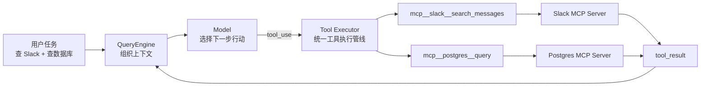
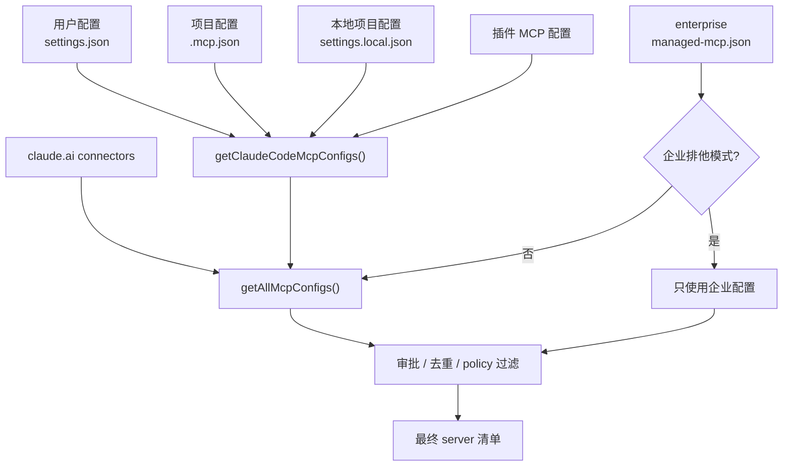
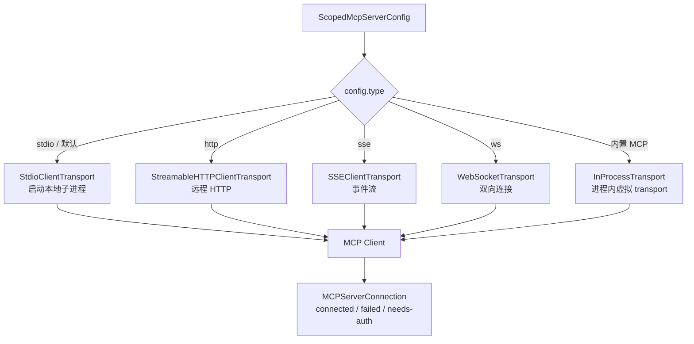
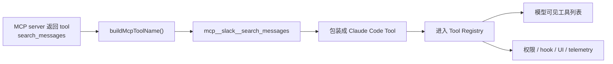
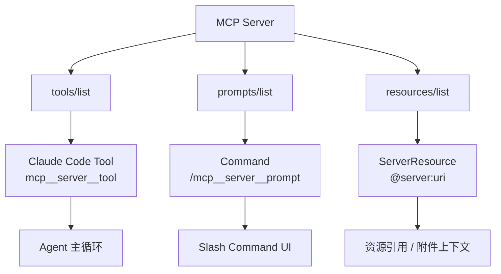
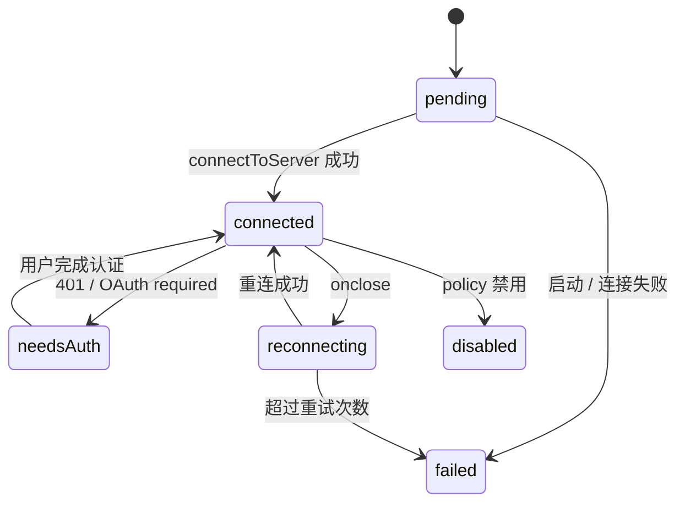
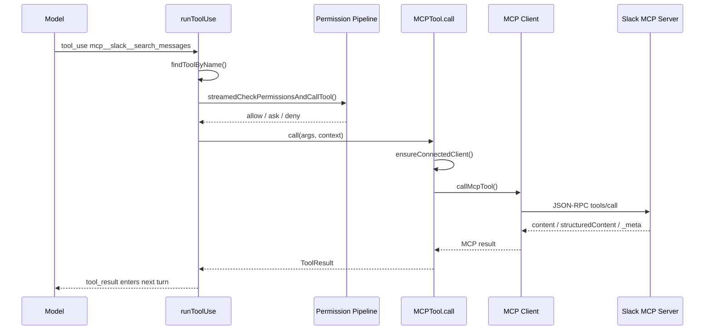
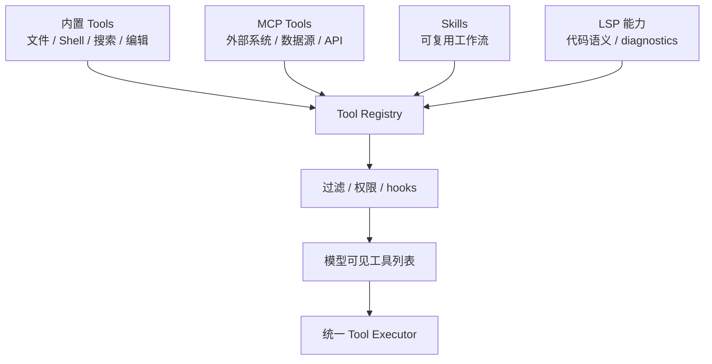
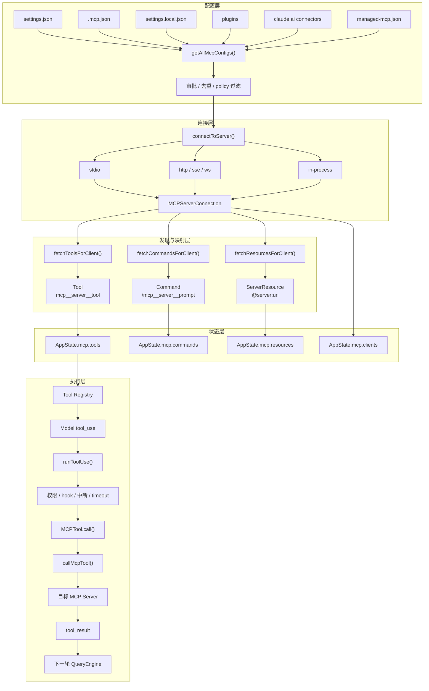

# 6.MCP：Claude Code 如何把外部世界接进工具主路

上一章讲 Tools 时，我们已经看到 Claude Code 的一个核心设计：

> 模型不是直接操作电脑，模型只输出行动意图；真正执行动作的是 Claude Code 的工具系统。

到这一步，Claude Code 已经能读文件、改文件、跑命令、搜代码。那为什么还需要 MCP？

前面已经把 MCP 放在扩展层里提过：它负责让外部系统以统一协议暴露工具、资源和提示。这里不再重讲概念本身，只看 Claude Code 怎么把 MCP 接进自己的主工具管线。

因为真实开发不是只发生在本地仓库里。

一个开发任务经常会牵扯到这些外部系统：

- GitHub issue 或 PR
- Jira 需求
- Slack 讨论
- Figma 设计稿
- Postgres / MySQL 数据库
- Sentry / Datadog 监控
- 内部文档、知识库、业务 API

如果每接一个系统都在 Claude Code 里硬写一个内置工具，系统会很快失控：工具越来越多，权限越来越难管，连接方式越来越碎，团队也没办法把自己的私有系统标准化接进来。

MCP 要解决的正是这个问题。

但这一章不准备泛泛介绍“什么是 MCP”。我们只关心 Claude Code 的源码实现：

> Claude Code 如何把一个外部 MCP server，变成模型可以安全调用、UI 可以展示、权限系统可以治理、主循环可以继续推进的内部 Tool？

为了让这条链路更具体，我们固定一个贯穿例子：

```text
用户给 Claude Code 配了两个 MCP server：

1. slack：远程 MCP，提供 search_messages、send_message 等工具
2. postgres：本地 stdio MCP，提供 list_tables、query 等工具

用户说：
“帮我查一下昨天 Slack 里关于订单超时的讨论，再结合数据库看一下最近失败订单的分布。”
```

这个任务表面上是一次对话，底层却需要 Claude Code 做很多事：

1. 启动时读取 MCP 配置，知道有 `slack` 和 `postgres` 两个 server。
2. 分别建立远程连接和本地子进程连接。
3. 向 server 询问它们暴露了哪些 tools、prompts、resources。
4. 把这些外部能力变成 Claude Code 内部工具。
5. 把工具同步进 `AppState.mcp` 和当前工具池。
6. 当模型调用 `mcp__slack__search_messages` 时，仍然走统一权限检查。
7. 真正执行时，才把请求转成 MCP JSON-RPC 发给 Slack MCP server。
8. 返回结果以后，再包装成 Claude Code 的 `tool_result`，进入下一轮模型推理。

这一整条链，就是 Claude Code 的 MCP 实现。



这一章的核心结论可以先放在前面：

> Claude Code 的 MCP 不是旁路 RPC，而是主路集成。它先把 MCP server 翻译成 Claude Code 自己的 `Tool` / `Command` / `Resource`，然后复用已有的工具池、权限、状态、UI、Telemetry、中断和主循环。

## 一、为什么 MCP 不能只是“发一个 RPC”

最简单的 MCP 客户端可以很薄：

```text
读取一个 server 配置
-> 连上 server
-> 调用 tools/list
-> 调用 tools/call
-> 把结果返回给模型
```

如果只是做 Demo，这样已经够了。

但 Claude Code 不能这么简单。它不是一个聊天框，而是一个要在真实工程环境里长期运行的 Agent Harness。

外部工具一接进来，问题马上变复杂。

第一，server 从哪里来？

MCP server 的来源很杂：用户个人配置、项目共享配置、插件、企业策略、claude.ai connector，甚至 Claude Code 自己内置的能力。这些来源不能不加区分地混在一起。

第二，server 怎么连？

本地数据库 MCP 可能走 stdio，Slack MCP 可能走 HTTP，历史上也支持 SSE，浏览器控制 MCP 甚至直接跑在 Claude Code 进程内部。

第三，工具名怎么处理？

假设 Slack MCP 暴露了 `send_message`，另一个 IM MCP 也暴露了同名工具。模型看到的工具名不能撞车，权限系统也得分清"这到底是谁家的 send_message"。

第四，连接状态怎么管理？

远程 token 会过期，server 会断开，工具列表会变，resources 也会更新。MCP 不是启动时扫一遍就完事，它是一组活着的连接。

第五，安全边界在哪里？

外部 MCP server 能发消息、查数据库、访问内网。Claude Code 不能因为它挂着 MCP 的名头，就绕过原来的权限、hook 和审计。

所以 Claude Code 的 MCP 模块长成了六层：

```text
配置层：决定有哪些 MCP server
-> 连接层：决定每个 server 怎么连、连没连上
-> 发现层：把 tools / prompts / resources 拉回来
-> 映射层：把外部能力包装成内部 Tool / Command / Resource
-> 状态层：把连接和能力同步进 AppState.mcp
-> 执行层：复用通用工具管线，真正调用时才发 MCP RPC
```

下面按这条链拆。

## 二、配置层：Claude Code 先产出一份“最终 server 清单”

MCP 的第一步不是连接，而是配置合并。

因为 Claude Code 的 MCP server 来源很多：

- 用户级配置：比如 `~/.claude/settings.json`
- 项目级配置：比如项目根目录的 `.mcp.json`
- 本地项目配置：比如 `.claude/settings.local.json`
- 插件附带的 MCP server
- claude.ai connector
- 企业托管配置：比如 `managed-mcp.json`
- 运行时动态注入的内置 MCP

从用户视角看，可能只是运行了一句：

```bash
claude mcp add postgres -- npx -y postgres-mcp-server
```

或者在项目里有一份 `.mcp.json`：

```json
{
  "mcpServers": {
    "postgres": {
      "type": "stdio",
      "command": "npx",
      "args": ["-y", "postgres-mcp-server"],
      "env": {
        "DATABASE_URL": "${DATABASE_URL}"
      }
    }
  }
}
```

但在源码里，Claude Code 要做的不是“读一个 JSON 文件”，而是把多来源配置合成一份最终可用清单。

关键入口可以记两个：

```text
src/services/mcp/config.ts

getClaudeCodeMcpConfigs()
getAllMcpConfigs()
```

这一层主要做四件事。

先看一段配置合并的真实源码。

**代码出处：** `src/services/mcp/config.ts`

下面只保留 `getAllMcpConfigs()` 的主路径。它能看出 Claude Code 的配置层不是“读一个文件”，而是在处理企业排他、claude.ai connector、policy 过滤和内容去重：

```ts
/**
 * Get all MCP configurations across all scopes, including claude.ai servers.
 * This may be slow due to network calls - use getClaudeCodeMcpConfigs() for fast startup.
 * @returns All server configurations with appropriate scopes
 */
export async function getAllMcpConfigs(): Promise<{
  servers: Record<string, ScopedMcpServerConfig>
  errors: PluginError[]
}> {
  // In enterprise mode, don't load claude.ai servers (enterprise has exclusive control)
  if (doesEnterpriseMcpConfigExist()) {
    return getClaudeCodeMcpConfigs()
  }

  // Kick off the claude.ai fetch before getClaudeCodeMcpConfigs so it overlaps
  // with loadAllPluginsCacheOnly() inside. Memoized — the awaited call below is a cache hit.
  const claudeaiPromise = fetchClaudeAIMcpConfigsIfEligible()
  const { servers: claudeCodeServers, errors } = await getClaudeCodeMcpConfigs(
    {},
    claudeaiPromise,
  )
  const { allowed: claudeaiMcpServers } = filterMcpServersByPolicy(
    await claudeaiPromise,
  )

  // Suppress claude.ai connectors that duplicate an enabled manual server.
  // Keys never collide (`slack` vs `claude.ai Slack`) so the merge below
  // won't catch this — need content-based dedup by URL signature.
  const { servers: dedupedClaudeAi } = dedupClaudeAiMcpServers(
    claudeaiMcpServers as Record<string, ScopedMcpServerConfig>,
    claudeCodeServers,
  )

  // Merge with claude.ai having lowest precedence
  const servers = Object.assign({}, dedupedClaudeAi, claudeCodeServers)

  return { servers, errors }
}
```

这段源码里有两个很容易被忽略的点。

第一，claude.ai connector 的拉取是提前启动的 Promise，目的是和本地配置、插件缓存加载并行。MCP 配置读取不是纯本地 IO，它可能有网络调用，所以这里已经开始考虑启动性能。

第二，去重不是普通 key 覆盖。注释里写得很清楚，`slack` 和 `claude.ai Slack` 这种 key 不会冲突，所以必须按 URL signature 做内容级去重。

直白地说，配置层在回答的问题是：

> 同一个外部能力可能从不同渠道进入 Claude Code，系统要保证最终暴露给模型的是一份干净、可治理、不重复的 server 清单。

### 1. 合并不同 scope 的配置

Claude Code 官方使用体验里，MCP 配置至少有 local、project、user 这几类 scope。

大白话说：

- `local`：只对当前项目里的自己生效，适合私有配置和敏感凭证。
- `project`：写入 `.mcp.json`，适合团队共享。
- `user`：跨项目生效，适合个人常用工具。

同名 server 出现在多个 scope 时，Claude Code 要有稳定优先级，否则用户永远不知道最后连的是哪一个。

源码里的配置层就负责把这些来源统一成：

```text
Record<string, ScopedMcpServerConfig>
```

也就是：

```text
serverName -> 带来源和作用域信息的 server 配置
```

### 2. 项目级 `.mcp.json` 需要审批

项目级 MCP 配置很方便，但也危险。

因为 `.mcp.json` 可以被提交到仓库。你 clone 一个项目时，里面可能带着一份别人写好的 MCP server 配置。如果 Claude Code 不经确认就启动它，相当于允许项目仓库影响你本机要启动什么进程、连什么服务。

所以 Claude Code 对项目级 MCP 配置有审批机制。

这个点很重要：MCP 的安全不是从工具调用那一刻才开始，而是从“这个 server 能不能进入运行时”就开始了。

### 3. 企业配置可能进入排他模式

如果存在企业托管 MCP 配置，Claude Code 会进入更强的策略控制。

这类逻辑说明 MCP 在 Claude Code 里不是个人玩具功能，而是被设计成可以进入组织治理的扩展层。

组织可以决定：

- 哪些 MCP server 允许使用
- 哪些 server 被禁止
- 哪些来源优先
- 哪些能力必须走统一认证

### 4. 合并后还要去重和 policy 过滤

插件、用户配置、claude.ai connector 可能指向相同或相似的 server。Claude Code 需要去重，避免同一个能力重复暴露给模型。

合并完成后，还会经过 allowlist / denylist 之类的策略过滤。

所以配置层最后产出的，不是“所有读到的配置”，而是：

> 已经经过 scope 合并、项目审批、企业策略、去重和 policy 过滤的最终 MCP server 映射。



这一层解决的是：

> 外部能力进入 Claude Code 之前，先确认它来自哪里、属于哪个 scope、有没有被允许。

## 三、连接层：同一个 MCP，Claude Code 支持多种 transport

拿到 server 清单以后，下一步是连接。

关键入口：

```text
src/services/mcp/client.ts

connectToServer()
```

这个函数不是简单的 `new Client()`。它更像一个连接工厂，而且带缓存：

```text
serverName + serverConfig
-> MCPServerConnection
```

这里最重要的是返回值。

Claude Code 返回的不是裸 MCP client，而是带状态的连接对象：

```text
MCPServerConnection

connected
failed
needs-auth
disabled
pending
```

为什么要这么建模？

因为 MCP server 不是“要么存在，要么不存在”。它可能处在很多中间状态：

- 本地命令不存在，启动失败。
- 远程 server 返回 401，需要 OAuth。
- 企业策略禁用了某个 server。
- 正在重连。
- 已连接，但工具列表还没刷新。

这些状态都要被 UI、AppState、工具池和主循环感知。

### 1. stdio：本地 server 是子进程

最常见的本地 MCP 是 stdio。

它的模型很像：

```text
Claude Code 启动一个子进程
-> 子进程 stdin 接收 JSON-RPC
-> 子进程 stdout 返回 JSON-RPC
-> stderr 用来输出日志
```

比如 Postgres MCP：

```text
command: npx
args: ["-y", "postgres-mcp-server"]
env: { DATABASE_URL: "..." }
```

连接层要做的事情包括：

- 拼出最终 command / args / env。
- 启动子进程。
- 捕获 stderr。
- 建立 MCP Client transport。
- server 退出时清理资源。
- 必要时按 `SIGINT -> SIGTERM -> SIGKILL` 升级关闭。

这已经不是“发请求”了，而是一个本地进程生命周期管理器。

### 2. HTTP / SSE / WebSocket：远程 server 需要网络与认证治理

远程 MCP 则会走 HTTP、SSE 或 WebSocket 等 transport。按 Claude Code 当前官方文档，远程 HTTP 是推荐选项；SSE 仍在实现和兼容路径里，但文档已经标注为 deprecated。

比如 Slack MCP：

```json
{
  "type": "http",
  "url": "https://example.com/mcp/slack",
  "headers": {
    "Authorization": "Bearer ${SLACK_MCP_TOKEN}"
  }
}
```

这类连接要处理的问题更多：

- URL 和 headers 的环境变量展开
- 连接超时
- 代理配置
- 401 认证失败
- OAuth 登录
- HTTP / SSE session 失效恢复
- 网络断开后的重连

所以 `connectToServer()` 会根据不同 `config.type` 选择不同 transport，再把这些差异收束成统一的 `MCPServerConnection`。



这里也值得直接看源码。

**代码出处：** `src/services/mcp/client.ts`

下面是 `connectToServer()` 的关键路径摘录。我省掉了大量日志、telemetry、代理细节和错误分支，只保留 transport 分发、内置 MCP、stdio 和连接超时几段主干：

```ts
export const connectToServer = memoize(
  async (name: string, serverRef: ScopedMcpServerConfig): Promise<MCPServerConnection> => {
    const connectStartTime = Date.now()
    let inProcessServer:
      | { connect(t: Transport): Promise<void>; close(): Promise<void> }
      | undefined
    try {
      let transport

      const sessionIngressToken = getSessionIngressAuthToken()

      if (serverRef.type === 'sse') {
        const authProvider = new ClaudeAuthProvider(name, serverRef)
        const combinedHeaders = await getMcpServerHeaders(name, serverRef)

        const transportOptions: SSEClientTransportOptions = {
          authProvider,
          fetch: wrapFetchWithTimeout(
            wrapFetchWithStepUpDetection(createFetchWithInit(), authProvider),
          ),
          requestInit: {
            headers: {
              'User-Agent': getMCPUserAgent(),
              ...combinedHeaders,
            },
          },
        }

        // 关键点：SSE 的长连接不能套普通 request timeout，
        // 所以 EventSource 使用单独的 fetch。
        transportOptions.eventSourceInit = {
          fetch: async (url: string | URL, init?: RequestInit) => {
            const authHeaders: Record<string, string> = {}
            const tokens = await authProvider.tokens()
            if (tokens) {
              authHeaders.Authorization = `Bearer ${tokens.access_token}`
            }

            const proxyOptions = getProxyFetchOptions()
            return fetch(url, {
              ...init,
              ...proxyOptions,
              headers: {
                'User-Agent': getMCPUserAgent(),
                ...authHeaders,
                ...init?.headers,
                ...combinedHeaders,
                Accept: 'text/event-stream',
              },
            })
          },
        }

        transport = new SSEClientTransport(
          new URL(serverRef.url),
          transportOptions,
        )
      } else if (serverRef.type === 'ws') {
        const combinedHeaders = await getMcpServerHeaders(name, serverRef)
        const wsHeaders = {
          'User-Agent': getMCPUserAgent(),
          ...(sessionIngressToken && {
            Authorization: `Bearer ${sessionIngressToken}`,
          }),
          ...combinedHeaders,
        }

        const wsClient = await createNodeWsClient(serverRef.url, {
          headers: wsHeaders,
          agent: getWebSocketProxyAgent(serverRef.url),
          ...getWebSocketTLSOptions(),
        })
        transport = new WebSocketTransport(wsClient)
      } else if (
        ((serverRef as ScopedMcpServerConfig).type === 'stdio' || !(serverRef as ScopedMcpServerConfig).type) &&
        isClaudeInChromeMCPServer(name)
      ) {
        // Run the Chrome MCP server in-process to avoid spawning a ~325 MB subprocess
        const { createChromeContext } = await import('../../utils/claudeInChrome/mcpServer.js')
        const { createClaudeForChromeMcpServer } = await import('@ant/claude-for-chrome-mcp')
        const { createLinkedTransportPair } = await import('./InProcessTransport.js')

        const context = createChromeContext((serverRef as McpStdioServerConfig).env)
        inProcessServer = createClaudeForChromeMcpServer(context)
        const [clientTransport, serverTransport] = createLinkedTransportPair()
        await inProcessServer.connect(serverTransport)
        transport = clientTransport
      } else if ((serverRef as ScopedMcpServerConfig).type === 'stdio' || !(serverRef as ScopedMcpServerConfig).type) {
        const stdioRef = serverRef as McpStdioServerConfig
        const finalCommand =
          process.env.CLAUDE_CODE_SHELL_PREFIX || stdioRef.command
        const finalArgs = process.env.CLAUDE_CODE_SHELL_PREFIX
          ? [[stdioRef.command, ...stdioRef.args].join(' ')]
          : stdioRef.args
        transport = new StdioClientTransport({
          command: finalCommand,
          args: finalArgs,
          env: {
            ...subprocessEnv(),
            ...stdioRef.env,
          } as Record<string, string>,
          stderr: 'pipe', // 不让 MCP server stderr 直接污染 Claude Code UI
        })
      } else {
        throw new Error(`Unsupported server type: ${(serverRef as ScopedMcpServerConfig).type}`)
      }

      const client = new Client(
        {
          name: 'claude-code',
          title: 'Claude Code',
          version: MACRO.VERSION ?? 'unknown',
          description: "Anthropic's agentic coding tool",
          websiteUrl: PRODUCT_URL,
        },
        {
          capabilities: {
            roots: {},
            elicitation: {},
          },
        },
      )

      client.setRequestHandler(ListRootsRequestSchema, async () => {
        return {
          roots: [
            {
              uri: `file://${getOriginalCwd()}`,
            },
          ],
        }
      })

      const connectPromise = client.connect(transport)
      const timeoutPromise = new Promise<never>((_, reject) => {
        const timeoutId = setTimeout(() => {
          if (inProcessServer) {
            inProcessServer.close().catch(() => {})
          }
          transport.close().catch(() => {})
          reject(
            new TelemetrySafeError_I_VERIFIED_THIS_IS_NOT_CODE_OR_FILEPATHS(
              `MCP server "${name}" connection timed out after ${getConnectionTimeoutMs()}ms`,
              'MCP connection timeout',
            ),
          )
        }, getConnectionTimeoutMs())

        connectPromise.then(
          () => {
            clearTimeout(timeoutId)
          },
          _error => {
            clearTimeout(timeoutId)
          },
        )
      })

      await Promise.race([connectPromise, timeoutPromise])
      // 后面继续处理 stderr、auth failure、onclose、telemetry，
      // 并返回 connected / failed / needs-auth 等 MCPServerConnection 状态。
    } catch (error) {
      // 失败会被包装成 failed / needs-auth 等连接状态
    }
  },
  getServerCacheKey,
)
```

这段源码能看出几个实现细节。

第一，`connectToServer` 是 memoize 的。Claude Code 不希望同一个 server + config 被重复连接，尤其是 stdio 这种会启动子进程的 server。

第二，远程 transport 不是直接 `fetch(url)`。它会把 auth provider、headers、proxy、timeout、step-up detection、User-Agent 都装进去。

第三，内置 MCP 和 stdio MCP 在上层是同一个抽象。Chrome MCP 通过 `createLinkedTransportPair()` 走进程内 transport，但后面仍然被当成普通 MCP client。

第四，连接本身有超时保护，失败以后不是简单 throw，而是继续被包装成连接状态，供 `/mcp`、AppState 和工具池使用。

### 3. 内置 MCP：看起来像 server，其实在同一进程里

Claude Code 还有一类特殊 MCP：内置 MCP。

例如：

- `claude-in-chrome`
- `computer-use`

它们在上层也像 MCP server，但并不一定真的启动外部进程。源码里会创建一对进程内 transport，把 client 端和 server 端直接连起来。

可以把它理解成：

```text
clientTransport.send(message)
-> queueMicrotask()
-> serverTransport.onmessage(message)
```

**代码出处：** `src/services/mcp/InProcessTransport.ts`

这个文件很短，核心就是下面这段：

```ts
class InProcessTransport implements Transport {
  private peer: InProcessTransport | undefined
  private closed = false

  onclose?: () => void
  onerror?: (error: Error) => void
  onmessage?: (message: JSONRPCMessage) => void

  /** @internal */
  _setPeer(peer: InProcessTransport): void {
    this.peer = peer
  }

  async start(): Promise<void> {}

  async send(message: JSONRPCMessage): Promise<void> {
    if (this.closed) {
      throw new Error('Transport is closed')
    }
    // Deliver to the other side asynchronously to avoid stack depth issues
    // with synchronous request/response cycles
    queueMicrotask(() => {
      this.peer?.onmessage?.(message)
    })
  }

  async close(): Promise<void> {
    if (this.closed) {
      return
    }
    this.closed = true
    this.onclose?.()
    // Close the peer if it hasn't already closed
    if (this.peer && !this.peer.closed) {
      this.peer.closed = true
      this.peer.onclose?.()
    }
  }
}

export function createLinkedTransportPair(): [Transport, Transport] {
  const a = new InProcessTransport()
  const b = new InProcessTransport()
  a._setPeer(b)
  b._setPeer(a)
  return [a, b]
}
```

这段代码有种“简单到有点漂亮”的味道：它没有发网络包，也没有序列化到 stdio，只是把 JSON-RPC message 异步投递给对端 `onmessage`。但因为它实现的是 MCP SDK 需要的 `Transport` 接口，所以上层完全不需要知道这是同进程通信。

这类实现的好处是：

- 上层仍然看到标准 MCP Client。
- 能力仍然走 MCP 的 tools/resources/prompts 发现。
- 不需要额外 IPC 或子进程。
- 内置能力和外部 MCP 可以共享同一套适配逻辑。

这体现了 Claude Code 的一个设计取向：

> transport 可以不同，但上层对象必须统一。

### 4. 连接层的真正职责

所以连接层解决的不是“怎么打开一个 socket”，而是：

> 不管 server 来自本地进程、远程服务还是进程内实现，都把它变成一个带状态、可重连、可认证、可清理的 `MCPServerConnection`。

## 四、发现层：MCP server 暴露的不是只有 tools

连接建立以后，Claude Code 不能马上把 server 塞给模型。

它还要做能力发现。

MCP server 主要可以暴露三类能力：

- `tools`：模型可调用的动作，比如查数据库、发消息、搜索 issue。
- `prompts`：用户可选择的提示模板，在 Claude Code 里常映射为 slash command。
- `resources`：可引用的上下文资源，比如 issue、文档、数据库 schema。

对应源码入口可以记：

```text
fetchToolsForClient()
fetchCommandsForClient()
fetchResourcesForClient()
```

从协议角度看，这些大概对应：

```text
tools/list
prompts/list
resources/list
```

但 Claude Code 不会把这些原始结果直接给模型。它会先翻译成自己的运行时对象。

## 五、映射层：MCP tool 会被包装成 Claude Code 自己的 Tool

这是理解 Claude Code MCP 实现最关键的一步。

MCP server 返回的 tool，大概长这样：

```json
{
  "name": "search_messages",
  "description": "Search Slack messages",
  "inputSchema": {
    "type": "object",
    "properties": {
      "query": { "type": "string" }
    },
    "required": ["query"]
  }
}
```

如果 Claude Code 直接把它暴露成 `search_messages`，会有两个问题。

第一，容易重名。

数据库 MCP 可能也有 `search`，GitHub MCP 也可能有 `search`，内部工具也可能有类似名字。

第二，权限不好写。

用户或组织要允许的不是抽象的 `send_message`，而是“Slack server 的 send_message”。

所以 Claude Code 会把 MCP tool 重命名成：

```text
mcp__<server>__<tool>
```

比如：

```text
mcp__slack__search_messages
mcp__slack__send_message
mcp__postgres__list_tables
mcp__postgres__query
```

这个命名由类似下面的工具函数完成：

```text
src/services/mcp/mcpStringUtils.ts

getMcpPrefix(serverName)
buildMcpToolName(serverName, toolName)
getToolNameForPermissionCheck(tool)
```

这一套命名不是小细节，而是 MCP 进入 Claude Code 权限体系的钥匙。

### MCP Tool 的内部形态

MCP tool 最终会被包装成 Claude Code 的 `Tool`。

直白地说，它不再只是外部协议里的一个 JSON schema，而是拥有和内置工具相同的接口：

```text
name
description()
prompt()
inputJSONSchema
checkPermissions()
call()
userFacingName()
mcpInfo
```

可以把这一步想成：

```text
MCP 原始 tool
-> 加上 mcp__server__tool 命名空间
-> 保存 serverName / toolName 到 mcpInfo
-> 复用 Claude Code Tool 协议
-> call() 内部再转回 MCP callTool
```



这一段最好直接看 `fetchToolsForClient()`。

**代码出处：** `src/services/mcp/client.ts`

下面是核心摘录。我只保留 `tools/list -> Tool 包装 -> call()` 这条主线，省掉分类、折叠展示、analytics 和部分错误处理细节：

```ts
export const fetchToolsForClient = memoizeWithLRU(
  async (client: MCPServerConnection): Promise<Tool[]> => {
    if (client.type !== 'connected') return []

    try {
      if (!client.capabilities?.tools) {
        return []
      }

      const result = (await client.client.request(
        { method: 'tools/list' },
        ListToolsResultSchema,
      )) as ListToolsResult

      const toolsToProcess = recursivelySanitizeUnicode(result.tools)

      const skipPrefix =
        client.config.type === 'sdk' &&
        isEnvTruthy(process.env.CLAUDE_AGENT_SDK_MCP_NO_PREFIX)

      return toolsToProcess
        .map((tool): Tool => {
          const fullyQualifiedName = buildMcpToolName(client.name, tool.name)
          return {
            ...MCPTool,
            name: skipPrefix ? tool.name : fullyQualifiedName,
            mcpInfo: { serverName: client.name, toolName: tool.name },
            isMcp: true,

            async description() {
              return tool.description ?? ''
            },
            async prompt() {
              const desc = tool.description ?? ''
              return desc.length > MAX_MCP_DESCRIPTION_LENGTH
                ? desc.slice(0, MAX_MCP_DESCRIPTION_LENGTH) + '… [truncated]'
                : desc
            },
            isConcurrencySafe() {
              return tool.annotations?.readOnlyHint ?? false
            },
            isReadOnly() {
              return tool.annotations?.readOnlyHint ?? false
            },
            isDestructive() {
              return tool.annotations?.destructiveHint ?? false
            },
            isOpenWorld() {
              return tool.annotations?.openWorldHint ?? false
            },

            inputJSONSchema: tool.inputSchema as Tool['inputJSONSchema'],

            async checkPermissions() {
              return {
                behavior: 'passthrough' as const,
                message: 'MCPTool requires permission.',
                suggestions: [
                  {
                    type: 'addRules' as const,
                    rules: [
                      {
                        toolName: fullyQualifiedName,
                      },
                    ],
                    behavior: 'allow' as const,
                    destination: 'localSettings' as const,
                  },
                ],
              }
            },
            async call(
              args: Record<string, unknown>,
              context,
              _canUseTool,
              parentMessage,
              onProgress?: ToolCallProgress<MCPProgress>,
            ) {
              const toolUseId = extractToolUseId(parentMessage)
              const meta = toolUseId
                ? { 'claudecode/toolUseId': toolUseId }
                : {}

              if (onProgress && toolUseId) {
                onProgress({
                  toolUseID: toolUseId,
                  data: {
                    type: 'mcp_progress',
                    status: 'started',
                    serverName: client.name,
                    toolName: tool.name,
                  },
                })
              }

              const connectedClient = await ensureConnectedClient(client)
              const mcpResult = await callMCPToolWithUrlElicitationRetry({
                client: connectedClient,
                clientConnection: client,
                tool: tool.name,
                args,
                meta,
                signal: context.abortController.signal,
                setAppState: context.setAppState,
                onProgress:
                  onProgress && toolUseId
                    ? progressData => {
                        onProgress({
                          toolUseID: toolUseId,
                          data: progressData,
                        })
                      }
                    : undefined,
                handleElicitation: context.handleElicitation,
              })

              return {
                data: mcpResult.content,
                ...((mcpResult._meta || mcpResult.structuredContent) && {
                  mcpMeta: {
                    ...(mcpResult._meta && {
                      _meta: mcpResult._meta,
                    }),
                    ...(mcpResult.structuredContent && {
                      structuredContent: mcpResult.structuredContent,
                    }),
                  },
                }),
              }
            },

            // 真实对象里还有 searchHint、alwaysLoad、collapse 分类、
            // auto-classifier 输入等 UI / 调度辅助字段。
          }
        })
        .filter(isIncludedMcpTool)
    } catch (error) {
      // 这里会记录 MCP 错误，并让这个 server 本轮不贡献工具
      return []
    }
  },
  client => client.name,
)
```

这段源码信息量很大。

第一，MCP tool 的 schema 直接进入 `inputJSONSchema`，这就是模型能按结构化参数调用外部工具的原因。

第二，`annotations.readOnlyHint` 会被映射到 `isReadOnly()` 和 `isConcurrencySafe()`。直白地说，MCP server 提供的 tool annotation 会影响 Claude Code 的调度和权限语义。

第三，`mcpInfo` 永远保留 server 原名和 tool 原名。即使某些 SDK 模式下 `name` 可以跳过 `mcp__` 前缀，权限检查仍然能回到完全限定名。

第四，真正调用时不是直接 `client.client.callTool()`，而是先 `ensureConnectedClient()`，再走 `callMCPToolWithUrlElicitationRetry()`，把 abort signal、progress、elicitation、AppState 都带进去。

这一层的意义是：

> Claude Code 没有给 MCP 另造一套执行系统，而是把 MCP tool 伪装成普通 Tool，从而复用现有主路。

## 六、prompts 和 resources 也会进入 Claude Code 的交互面

MCP 不只是 tool call。

Claude Code 对 MCP prompts 和 resources 也做了映射。

### 1. MCP prompts 变成 slash command

MCP server 可以暴露 prompt 模板。

比如 GitHub MCP 可能暴露：

```text
review_pr
summarize_issue
list_open_prs
```

Claude Code 会把这类 prompt 变成命令候选，形式类似：

```text
/mcp__github__review_pr
```

这样用户不是只能等模型自动调用工具，也可以主动通过 slash command 触发某个 MCP server 提供的工作流模板。

这里的设计边界很清楚：

- tools 偏模型自动调用。
- prompts 偏用户主动选择。

### 2. MCP resources 变成可引用上下文

MCP resources 则更像“外部系统里的上下文对象”。

比如：

```text
@github:issue://123
@postgres:schema://orders
@docs:file://api/authentication
```

Claude Code 会把可用 resources 放进资源索引，让用户能像引用文件一样引用它们。

这和 Tools 章里的上下文管理也能接上：

> Tool 是让模型行动，Resource 是给模型补上下文。

如果 server 支持 resources，Claude Code 还会自动提供列出和读取 MCP resources 的能力。某些资源甚至可以进一步派生成 MCP skills，进入更高层的可复用工作流。



所以 Claude Code 的 MCP 接入面其实有三层：

```text
tools：模型能做什么
prompts：用户能触发什么流程
resources：模型能读取什么外部上下文
```

## 七、状态层：MCP 是活连接，要同步进 AppState

如果 MCP server 只是启动时扫一次，Claude Code 就不需要复杂状态层。

但真实 MCP server 是会变化的：

- 远程 token 过期。
- Slack MCP 断线。
- Postgres MCP 子进程退出。
- server 推送 `tools/list_changed`。
- resources 列表更新。
- 用户通过 `/mcp` 完成 OAuth。
- 企业策略或插件状态改变。

所以 Claude Code 需要一个长期维护 MCP 连接的地方。

关键入口：

```text
src/services/mcp/useManageMCPConnections.ts
```

这个模块负责把 MCP 连接池同步进 `AppState.mcp`。

可以把 `AppState.mcp` 想成四张表：

```text
mcp.clients
mcp.tools
mcp.commands
mcp.resources
```

也就是：

- 当前有哪些 server 连接。
- 每个 server 当前是什么状态。
- 当前发现了哪些 MCP tools。
- 当前发现了哪些 MCP commands。
- 当前发现了哪些 MCP resources。

### 为什么状态要拆这么细

因为连接状态和能力状态不是一回事。

一个 server 可能已经连上，但还没完成 tools/list。

一个 server 可能 tools 正常，但 resources 不支持。

一个 server 可能因为 OAuth 失败处于 `needs-auth`，这时 UI 要提示用户登录，而工具池不能把它当作正常可用工具。

一个 server 可能连接断了，但旧的 tools 需要从工具池里移除，否则模型可能继续调用一个已经不可用的工具。

所以 Claude Code 不能只维护一个 `mcpClients` 数组，而要把 clients、tools、commands、resources 分开同步。

### list_changed 会触发重新发现

MCP server 可以通知客户端：工具列表变了。

Claude Code 收到类似 `tools/list_changed` 的通知后，会做三件事：

```text
清掉 fetchTools 缓存
-> 重新 fetchToolsForClient()
-> updateServer() 写回 AppState.mcp.tools
```

这让 MCP 能力变成动态能力。

比如 Slack MCP server 新增了一个 `summarize_channel` 工具，Claude Code 不需要重启整个会话，也可以刷新工具列表。

真实源码里，tools、prompts、resources 都会注册对应的 `list_changed` handler。

**代码出处：** `src/services/mcp/useManageMCPConnections.ts`

下面是精简摘录，只保留“收到通知 -> 清缓存 -> 重新发现 -> 写回状态”这条主线：

```ts
if (client.capabilities?.tools?.listChanged) {
  client.client.setNotificationHandler(
    ToolListChangedNotificationSchema,
    async () => {
      try {
        fetchToolsForClient.cache.delete(client.name)
        const newTools = await fetchToolsForClient(client)
        updateServer({ ...client, tools: newTools })
      } catch (error) {
        logMCPError(client.name, `Failed to refresh tools: ${errorMessage(error)}`)
      }
    },
  )
}

if (client.capabilities?.prompts?.listChanged) {
  client.client.setNotificationHandler(
    PromptListChangedNotificationSchema,
    async () => {
      try {
        // Skills come from resources, not prompts — don't invalidate their
        // cache here. fetchMcpSkillsForClient returns the cached result.
        fetchCommandsForClient.cache.delete(client.name)
        const [mcpPrompts, mcpSkills] = await Promise.all([
          fetchCommandsForClient(client),
          feature('MCP_SKILLS')
            ? fetchMcpSkillsForClient!(client)
            : Promise.resolve([]),
        ])
        updateServer({
          ...client,
          commands: [...mcpPrompts, ...mcpSkills],
        })
        clearSkillIndexCache?.()
      } catch (error) {
        logMCPError(client.name, `Failed to refresh prompts: ${errorMessage(error)}`)
      }
    },
  )
}

if (client.capabilities?.resources?.listChanged) {
  client.client.setNotificationHandler(
    ResourceListChangedNotificationSchema,
    async () => {
      try {
        fetchResourcesForClient.cache.delete(client.name)
        if (feature('MCP_SKILLS')) {
          // Skills are discovered from resources, so refresh them too.
          fetchMcpSkillsForClient!.cache.delete(client.name)
          fetchCommandsForClient.cache.delete(client.name)
          const [newResources, mcpPrompts, mcpSkills] =
            await Promise.all([
              fetchResourcesForClient(client),
              fetchCommandsForClient(client),
              fetchMcpSkillsForClient!(client),
            ])
          updateServer({
            ...client,
            resources: newResources,
            commands: [...mcpPrompts, ...mcpSkills],
          })
          clearSkillIndexCache?.()
        }
      } catch (error) {
        logMCPError(client.name, `Failed to refresh resources: ${errorMessage(error)}`)
      }
    },
  )
}
```

这段源码说明一件事：MCP 的 tools、prompts、resources 不是静态数组，而是被缓存、失效、重新发现、再写回状态的动态能力集。

尤其是 resources 这段，它会同时刷新 MCP skills 和 commands。直白地说，在 Claude Code 的设计里，MCP resource 不只是“给模型读的资料”，还可能成为更高层 Skill 发现的输入。

### 断线会触发重连和状态刷新

连接层还会给 client 挂 `onclose`。

当连接断开时，Claude Code 会：

- 把 server 状态更新成 pending / reconnecting。
- 清理旧连接缓存。
- 按指数退避尝试重连。
- 重连成功后重新发现 tools / commands / resources。
- 重连失败则把状态写成 failed。



状态层的核心价值是：

> MCP 不是一次性配置，而是一组会变化、会失效、会恢复、会影响工具池的运行时连接。

## 八、执行层：模型调用 MCP 时，入口仍然是 runToolUse

到这里，MCP tool 已经变成 Claude Code 内部 `Tool` 了。

所以当模型真正输出：

```json
{
  "type": "tool_use",
  "name": "mcp__slack__search_messages",
  "input": {
    "query": "订单超时 yesterday"
  }
}
```

Claude Code 不会走一条 MCP 专用旁路。

它仍然进入通用工具执行管线：

```text
src/services/tools/toolExecution.ts

runToolUse()
```

执行链大概是：

```text
模型输出 tool_use
-> runToolUse()
-> findToolByName()
-> streamedCheckPermissionsAndCallTool()
-> MCPTool.call()
-> ensureConnectedClient()
-> callMcpTool()
-> mcpClient.callTool()
-> 目标 MCP Server
-> 返回 content / structuredContent / _meta
-> 包装成 tool_result
-> 回到 QueryEngine 下一轮
```

这条链里真正关键的是前三步。

### 1. `findToolByName()` 不关心工具来自哪里

`runToolUse()` 先拿到模型输出的工具名：

```text
mcp__slack__search_messages
```

然后从当前可用工具池里找：

```text
findToolByName(toolUseContext.options.tools, toolName)
```

只要 MCP tool 已经在发现层被包装成内部 `Tool`，这里就能找到。

主循环不需要知道它来自 Slack MCP、Postgres MCP，还是内置 BashTool。

### 2. 权限检查仍然走统一管线

找到工具以后，Claude Code 继续走：

```text
streamedCheckPermissionsAndCallTool()
```

这意味着 MCP tool 仍然会经过：

- schema 校验
- hook
- 权限检查
- 用户确认
- 执行中断
- 结果处理
- UI 展示

MCP 没有绕过工具系统。

### 3. 真正发 MCP RPC 的地方很靠后

只有当执行进入 MCP Tool 自己的 `call()` 时，才会真正进入 MCP 协议调用。

底层大概在：

```text
packages/mcp-client/src/execution.ts

callMcpTool()
```

这一层才会调用 MCP SDK：

```text
mcpClient.callTool({
  name: tool,
  arguments: args,
  _meta: meta
})
```

同时继续传递：

- abort signal
- progress callback
- timeout
- meta

如果 server 返回错误，Claude Code 会把它包装成明确的 MCP tool call error，而不是让一段不明所以的 JSON-RPC 错误直接漏到上层。

为了看清“入口仍然是通用工具管线”，可以先看工具执行入口。

**代码出处：** `src/services/tools/toolExecution.ts`

当模型产生任何 `tool_use`，包括 `mcp__slack__search_messages`，都会走到下面这个调用点：

```ts
for await (const update of streamedCheckPermissionsAndCallTool(
  tool,
  toolUse.id,
  toolInput,
  toolUseContext,
  canUseTool,
  assistantMessage,
  messageId,
  requestId,
  mcpServerType,
  mcpServerBaseUrl,
)) {
  yield update
}
```

这里的 `tool` 如果是 `mcp__slack__search_messages`，也不会有特殊分支。它和内置 `Read`、`Bash` 一样进入 `streamedCheckPermissionsAndCallTool()`。

同一个文件继续往下看，`streamedCheckPermissionsAndCallTool()` 的作用是把 progress 和最终 tool result 合成一个 async iterable。这里省掉 analytics 细节，只保留它如何把 progress 放回消息流：

```ts
function streamedCheckPermissionsAndCallTool(
  tool: Tool,
  toolUseID: string,
  input: { [key: string]: boolean | string | number },
  toolUseContext: ToolUseContext,
  canUseTool: CanUseToolFn,
  assistantMessage: AssistantMessage,
  messageId: string,
  requestId: string | undefined,
  mcpServerType: McpServerType,
  mcpServerBaseUrl: ReturnType<typeof getLoggingSafeMcpBaseUrl>,
): AsyncIterable<MessageUpdateLazy> {
  // This is a bit of a hack to get progress events and final results
  // into a single async iterable.
  //
  // Ideally the progress reporting and tool call reporting would
  // be via separate mechanisms.
  const stream = new Stream<MessageUpdateLazy>()
  checkPermissionsAndCallTool(
    tool, toolUseID, input, toolUseContext, canUseTool,
    assistantMessage, messageId, requestId, mcpServerType, mcpServerBaseUrl,
    progress => {
      stream.enqueue({
        message: createProgressMessage({
          toolUseID: progress.toolUseID as string,
          parentToolUseID: toolUseID,
          data: progress.data,
        }),
      })
    },
  )
    .then(results => {
      for (const result of results) {
        stream.enqueue(result)
      }
    })
    .catch(error => {
      stream.error(error)
    })
    .finally(() => {
      stream.done()
    })
  return stream
}
```

注意这里的 `isMcp: tool.isMcp ?? false`。MCP 是被通用工具管线识别出来的元信息，而不是另外一套执行入口。

同一个文件里，真正的权限和 hook 也在 `checkPermissionsAndCallTool()` 里继续往下走。这里同样只保留 schema 校验、pre-hook、阻断点这几个关键动作：

```ts
async function checkPermissionsAndCallTool(
  tool: Tool,
  toolUseID: string,
  input: { [key: string]: boolean | string | number },
  toolUseContext: ToolUseContext,
  canUseTool: CanUseToolFn,
  assistantMessage: AssistantMessage,
  messageId: string,
  requestId: string | undefined,
  mcpServerType: McpServerType,
  mcpServerBaseUrl: ReturnType<typeof getLoggingSafeMcpBaseUrl>,
  onToolProgress: (
    progress: ToolProgress<ToolProgressData> | ProgressMessage<HookProgress>,
  ) => void,
): Promise<MessageUpdateLazy[]> {
  const parsedInput = tool.inputSchema.safeParse(input)
  if (!parsedInput.success) {
    let errorContent = formatZodValidationError(tool.name, parsedInput.error)
    // 输入错误会被包装成 tool_result 回给模型
    return [
      {
        message: createUserMessage({
          content: [
            {
              type: 'tool_result',
              content: `<tool_use_error>InputValidationError: ${errorContent}</tool_use_error>`,
              is_error: true,
              tool_use_id: toolUseID,
            },
          ],
          toolUseResult: `InputValidationError: ${parsedInput.error.message}`,
          sourceToolAssistantUUID: assistantMessage.uuid,
        }),
      },
    ]
  }

  const isValidCall = await tool.validateInput?.(
    parsedInput.data,
    toolUseContext,
  )
  if (isValidCall?.result === false) {
    return [
      {
        message: createUserMessage({
          content: [
            {
              type: 'tool_result',
              content: `<tool_use_error>${isValidCall.message}</tool_use_error>`,
              is_error: true,
              tool_use_id: toolUseID,
            },
          ],
          toolUseResult: `Error: ${isValidCall.message}`,
          sourceToolAssistantUUID: assistantMessage.uuid,
        }),
      },
    ]
  }

  let processedInput = parsedInput.data
  let hookPermissionResult: PermissionResult | undefined

  for await (const result of runPreToolUseHooks(
    toolUseContext,
    tool,
    processedInput,
    toolUseID,
    assistantMessage.message.id!,
    requestId,
    mcpServerType,
    mcpServerBaseUrl,
  )) {
    switch (result.type) {
      case 'hookPermissionResult':
        hookPermissionResult = result.hookPermissionResult
        break
      case 'hookUpdatedInput':
        processedInput = result.updatedInput
        break
      case 'stop':
        return [
          {
            message: createUserMessage({
              content: [createToolResultStopMessage(toolUseID)],
              toolUseResult: `Error: ${stopReason}`,
              sourceToolAssistantUUID: assistantMessage.uuid,
            }),
          },
        ]
    }
  }

  // 后面继续进入 canUseTool / permission dialog / tool.call() / post-hook。
}
```

这一大段不是 MCP 专用代码，但它正好说明 MCP 为什么要包装成 `Tool`：只要进入这条管线，就天然拥有 schema 校验、hook、权限、progress、错误回填和 UI 展示。



这一层说明：

> MCP 调用看起来是外部 RPC，但在 Claude Code 里，它首先是一次普通工具调用。

最后再看真正发 MCP RPC 的底层函数。

**代码出处：** `packages/mcp-client/src/execution.ts`

下面只保留 `callMcpTool()` 的关键路径：调用 MCP SDK、传递 signal/progress/timeout、处理 `isError` 和 401：

```ts
export async function callMcpTool(
  options: CallToolOptions,
  deps: McpClientDependencies,
): Promise<CallToolResult> {
  const { client, tool, args, meta, signal, onProgress, timeoutMs } = options
  const { name: serverName, client: mcpClient } = client
  const effectiveTimeout = timeoutMs ?? getMcpToolTimeoutMs()

  try {
    const result = await Promise.race([
      mcpClient.callTool(
        {
          name: tool,
          arguments: args,
          _meta: meta,
        },
        CallToolResultSchema,
        {
          signal,
          timeout: effectiveTimeout,
          onprogress: onProgress,
        },
      ),
      createTimeoutPromise(serverName, tool, effectiveTimeout),
    ])

    if ('isError' in result && result.isError) {
      let errorDetails = 'Unknown error'
      if (
        'content' in result &&
        Array.isArray(result.content) &&
        result.content.length > 0
      ) {
        const firstContent = result.content[0]
        if (
          firstContent &&
          typeof firstContent === 'object' &&
          'text' in firstContent
        ) {
          errorDetails = (firstContent as { text: string }).text
        }
      }

      throw new McpToolCallError(serverName, tool, errorDetails)
    }

    return {
      content: result,
      _meta: result._meta as Record<string, unknown> | undefined,
      structuredContent: result.structuredContent as
        | Record<string, unknown>
        | undefined,
    }
  } catch (e) {
    if (e instanceof Error) {
      const errorCode = 'code' in e ? (e.code as number | undefined) : undefined
      if (errorCode === 401) {
        throw new McpAuthError(
          serverName,
          `MCP server "${serverName}" requires re-authorization (token expired)`,
        )
      }
    }

    throw e
  }
}
```

这一段是协议层真正发生的地方。到这里，Claude Code 才把内部 `Tool` 调用还原成 MCP 的 `callTool` 请求：

```text
内部 Tool name: mcp__slack__search_messages
MCP 原始 tool name: search_messages
arguments: 模型生成并通过 schema 校验后的参数
_meta: Claude Code 附加的 toolUseId 等元信息
```

它同时处理三类工程边界：

- `signal`：用户中断或会话中断时能取消调用。
- `timeout`：外部 server 卡住时不让运行时永久等下去。
- `isError / 401`：把协议返回的错误变成 Claude Code 能理解的错误类型。

## 九、权限层：`mcp__server__tool` 是安全治理的关键

很多人理解 MCP 时，会把它看成“动态插件”。

但在 Claude Code 里，MCP tool 不只是动态添加的工具，它还必须进入权限命名空间。

假设有两个工具：

```text
mcp__slack__send_message
mcp__discord__send_message
```

它们都叫 `send_message`，但风险完全不同。一个可能发公司 Slack，另一个可能发外部社区频道。

权限系统必须能区分它们。

这就是为什么 Claude Code 不直接使用 server 返回的裸 tool name，而要构造完全限定名。

权限检查时，系统看的不是：

```text
send_message
```

而是：

```text
mcp__slack__send_message
```

于是你可以实现更细粒度的治理：

```text
允许 mcp__postgres__list_tables
询问 mcp__postgres__query
禁止 mcp__slack__send_message
允许 mcp__slack__search_messages
```

这也能和 hook 系统配合。

例如所有 Slack MCP 写操作都可以匹配：

```text
mcp__slack__send_.*
```

所有 MCP 工具都可以匹配：

```text
mcp__.*
```

从设计上看，`mcp__server__tool` 同时解决了三件事：

1. 防止工具名冲突。
2. 让模型看到明确来源。
3. 让权限和 hook 可以精确匹配外部能力。

这里对应两段源码。

**代码出处：** `src/services/mcp/mcpStringUtils.ts`

第一段负责生成和解析 MCP 工具名：

```ts
export function getMcpPrefix(serverName: string): string {
  return `mcp__${normalizeNameForMCP(serverName)}__`
}

export function buildMcpToolName(serverName: string, toolName: string): string {
  return `${getMcpPrefix(serverName)}${normalizeNameForMCP(toolName)}`
}

export function getToolNameForPermissionCheck(tool: {
  name: string
  mcpInfo?: { serverName: string; toolName: string }
}): string {
  return tool.mcpInfo
    ? buildMcpToolName(tool.mcpInfo.serverName, tool.mcpInfo.toolName)
    : tool.name
}
```

这里要注意 `getToolNameForPermissionCheck()`：权限检查不是简单使用 `tool.name`，而是优先使用 `mcpInfo` 重新构造完全限定名。这样即使 MCP 工具在某些模式下使用无前缀显示名，比如也叫 `Write`，内置 `Write` 的 deny rule 也不会错误匹配到它。

**代码出处：** `src/utils/permissions/permissions.ts`

第二段负责把权限规则和工具名匹配起来：

```ts
function toolMatchesRule(
  tool: Pick<Tool, 'name' | 'mcpInfo'>,
  rule: PermissionRule,
): boolean {
  if (rule.ruleValue.ruleContent !== undefined) {
    return false
  }

  const nameForRuleMatch = getToolNameForPermissionCheck(tool)

  if (rule.ruleValue.toolName === nameForRuleMatch) {
    return true
  }

  const ruleInfo = mcpInfoFromString(rule.ruleValue.toolName)
  const toolInfo = mcpInfoFromString(nameForRuleMatch)

  return (
    ruleInfo !== null &&
    toolInfo !== null &&
    (ruleInfo.toolName === undefined || ruleInfo.toolName === '*') &&
    ruleInfo.serverName === toolInfo.serverName
  )
}

export function toolAlwaysAllowedRule(
  context: ToolPermissionContext,
  tool: Pick<Tool, 'name' | 'mcpInfo'>,
): PermissionRule | null {
  return (
    getAllowRules(context).find(rule => toolMatchesRule(tool, rule)) || null
  )
}

export function getDenyRuleForTool(
  context: ToolPermissionContext,
  tool: Pick<Tool, 'name' | 'mcpInfo'>,
): PermissionRule | null {
  return getDenyRules(context).find(rule => toolMatchesRule(tool, rule)) || null
}

export function getAskRuleForTool(
  context: ToolPermissionContext,
  tool: Pick<Tool, 'name' | 'mcpInfo'>,
): PermissionRule | null {
  return getAskRules(context).find(rule => toolMatchesRule(tool, rule)) || null
}
```

这段代码把 MCP 权限规则分成两种粒度：

```text
mcp__slack__send_message
-> 精确匹配 Slack 的 send_message

mcp__slack 或 mcp__slack__*
-> 匹配 Slack server 下的所有工具
```

所以 Claude Code 的 MCP 权限不是“外部工具都要问一下”这么粗，而是能精确到 server 和 tool 两级。

这就是 MCP 能安全进入 Claude Code 工具系统的关键。

## 十、认证层：`needs-auth` 不是错误，而是一种运行时状态

远程 MCP server 常常需要认证。

比如 Slack、GitHub、Jira、Figma 这类服务，不可能只靠一个本地命令就访问。它们通常要 OAuth、Bearer token、企业 IdP 或其他认证方式。

Claude Code 的连接层遇到远程认证失败时，不会简单抛一个“连接失败”。

更合理的状态是：

```text
needs-auth
```

这代表：

```text
server 是存在的
配置也是存在的
但是当前用户还没有完成认证
```

这和 `failed` 不一样。

- `failed` 更像命令不存在、网络不可达、server 崩了。
- `needs-auth` 更像“需要用户登录以后才能继续”。

这种状态建模会影响 UI 和交互：

- `/mcp` 可以引导用户完成认证。
- AppState 可以展示某个 server 需要登录。
- 工具池不会把未认证工具当作正常可用工具。
- 认证完成后可以重新连接、重新发现 tools/resources/prompts。

所以认证层的核心不是“怎么拿 token”，而是：

> 认证失败必须变成 Agent Runtime 能理解的状态，而不是一次普通异常。

## 十一、资源工具：MCP Resource 为什么也要有 List / Read Tool

MCP resources 是上下文，不是动作。

那为什么 Claude Code 还会有类似 List / Read MCP Resources 的工具？

因为模型需要一种方式发现和读取外部上下文。

用户可以显式输入：

```text
@postgres:schema://orders
```

但模型在任务中也可能需要知道：

```text
当前有哪些 MCP resource 可用？
某个 resource 的内容是什么？
```

所以当 MCP server 支持 resources 时，Claude Code 会自动提供列出和读取资源的能力。

这和文件系统里的 `Glob` / `Read` 很像：

- 文件不是工具结果，但模型需要发现和读取文件。
- Resource 不是工具动作，但模型需要发现和读取外部上下文。

可以把它理解成：

```text
MCP Resource
-> 外部系统里的可引用上下文

ListMcpResourcesTool / ReadMcpResourceTool
-> Claude Code 给模型提供的资源发现和读取接口
```

这就是为什么 MCP 不应该只被理解成“外部工具协议”。在 Claude Code 里，它同时接入了：

- action：通过 tools
- context：通过 resources
- workflow template：通过 prompts

## 十二、和内置 Tools 的关系：MCP 是扩展，不是替代

理解 MCP 时，还要避免一个误解：

> 有了 MCP，是不是 Claude Code 的内置工具就不重要了？

不是。

内置 Tools 和 MCP Tools 的角色不同。

内置 Tools 更像 Claude Code 的核心身体能力：

- 读文件
- 写文件
- 搜索
- 执行 shell
- 管理任务
- 维护计划

MCP Tools 更像外部器官接口：

- 查 Slack
- 查 Jira
- 操作 GitHub
- 读取数据库
- 接 Figma
- 调内部 API

它们最终都进入统一工具协议，但来源和治理重点不同。



所以 MCP 的意义不是替代内置工具，而是把 Claude Code 从“只能操作本地工程环境”扩展成“可以治理地连接外部工程世界”。

## 十三、为什么 MCP 模块会显得很重

如果只从协议看，MCP 并不难：

```text
initialize
tools/list
tools/call
resources/list
resources/read
prompts/list
prompts/get
```

但 Claude Code 的 MCP 实现会显得很重，因为它解决的不是协议语法，而是运行时治理。

它至少要同时处理：

- 多 scope 配置
- 项目配置审批
- 企业策略
- 插件注入
- claude.ai connector
- stdio / HTTP / SSE / WS / in-process transport
- OAuth 和 `needs-auth`
- 连接缓存
- 自动重连
- list_changed 刷新
- tools / prompts / resources 三类发现
- `mcp__server__tool` 命名空间
- Tool 包装
- AppState 同步
- 权限和 hook
- tool result 包装
- 中断、超时、进度和错误处理

这就是为什么它不像一个薄 SDK 封装。

更准确地说：

> Claude Code 的 MCP 模块是“外部能力接入层 + 连接生命周期管理 + 能力发现层 + 权限命名层 + Tool 适配层”的组合。

## 十四、把 Claude Code 的 MCP 实现压成一张总图

完整链路可以记成下面这张图。



如果只记一条文字链，就是：

```text
MCP 配置合并
-> connectToServer 建连
-> fetchTools / fetchCommands / fetchResources 做能力发现
-> 包装成 Tool / Command / ServerResource
-> useManageMCPConnections 写入 AppState.mcp
-> runToolUse 复用通用工具执行链
-> MCPTool.call 内部调用 callMcpTool
-> MCP server 返回结果
-> tool_result 进入下一轮对话
```

## 十五、源码阅读入口

如果要顺着源码读，我建议按这个顺序：

1. `src/services/mcp/config.ts`

   看 MCP 配置从哪些来源进入系统，如何合并、审批、去重、过滤。

2. `src/services/mcp/client.ts`

   看 `connectToServer()` 如何处理 stdio、HTTP、SSE、WebSocket、内置 MCP、认证失败和连接状态。

3. `src/services/mcp/InProcessTransport.ts`

   看内置 MCP 怎么通过进程内 transport 伪装成标准 MCP server。

4. `src/services/mcp/mcpStringUtils.ts`

   看 `mcp__server__tool` 命名空间如何生成，以及权限检查为什么依赖这个名字。

5. `src/services/mcp/useManageMCPConnections.ts`

   看 MCP 连接池如何同步进 `AppState.mcp`，如何处理 `list_changed`、断线和重连。

6. `src/services/tools/toolExecution.ts`

   看 MCP tool 为什么最终仍然从 `runToolUse()` 进入统一工具执行管线。

7. `packages/mcp-client/src/execution.ts`

   看真正的 `callMcpTool()` 如何调用 MCP SDK、传递 signal、处理 timeout、包装错误。

读这几个文件时，不要只看函数本身。每读一个函数，都问四个问题：

```text
它接收什么输入？
它产出什么运行时对象？
它写入什么状态？
它的输出会被下一层谁消费？
```

这样 MCP 的源码就不会散成一堆函数名，而会连成一条执行链。

## 小结

Claude Code 的 MCP 实现可以压缩成一句话：

> MCP 是 Claude Code 把外部系统接进 Agent Harness 的标准化扩展层；它通过配置治理、transport 连接、能力发现、内部 Tool 映射、AppState 同步和统一工具执行，把外部 server 变成可调用、可审批、可重连、可审计的运行时能力。

这也是它和普通“插件系统”的区别。

普通插件系统往往只是“多几个功能入口”。Claude Code 的 MCP 则更像一条进入主循环的正规道路：外部能力必须先变成 `Tool` / `Command` / `Resource`，再经过权限、状态、UI 和执行管线，最后才能影响真实世界。

理解了这一章，再看后面的 Skill、多 Agent、Plan，就会更清楚它们和 MCP 的边界：

- MCP 解决“外部能力怎么标准化接进来”。
- Skill 解决“某类任务的方法论怎么复用”。
- Agent 协作解决“复杂任务怎么拆给多个执行者”。
- Plan 解决“执行前如何把意图变成可审查的步骤”。

MCP 不是 Claude Code 的全部扩展能力，但它是 Claude Code 从本地工具走向外部世界的第一扇门。

## 参考资料

- 本地 wiki：[Claude Code MCP 源码接入机制](../../../wiki/AI/claude-code-mcp-%E6%BA%90%E7%A0%81%E6%8E%A5%E5%85%A5%E6%9C%BA%E5%88%B6.md)
- 本地 wiki：[Claude Code 源码专题：扩展能力（MCP、Skills、多 Agent 与远程）](../../../wiki/AI/claude-code-%E6%BA%90%E7%A0%81%E4%B8%93%E9%A2%98-%E6%89%A9%E5%B1%95%E8%83%BD%E5%8A%9B-mcp-skills-%E5%A4%9Aagent%E4%B8%8E%E8%BF%9C%E7%A8%8B.md)
- Anthropic Docs：[Connect Claude Code to tools via MCP](https://docs.anthropic.com/en/docs/claude-code/mcp)
- Model Context Protocol Docs：[Tools](https://modelcontextprotocol.io/docs/concepts/tools)、[Resources](https://modelcontextprotocol.io/docs/concepts/resources)、[Prompts](https://modelcontextprotocol.io/docs/concepts/prompts)
