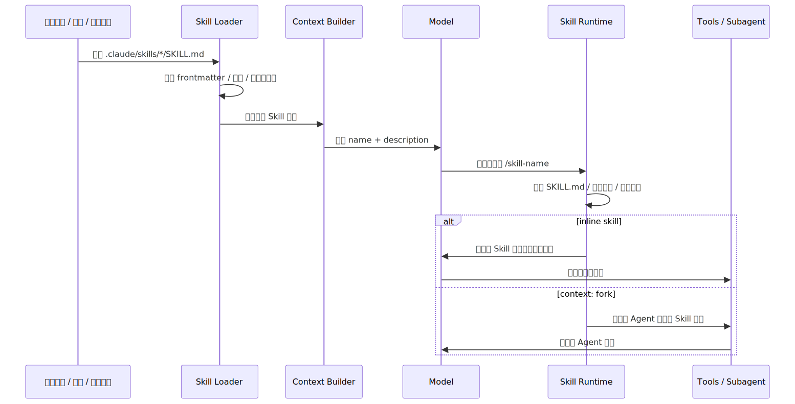

# 7.Skill：Claude Code 如何把经验封装成可加载的能力包

上一篇如果讲 MCP，我们会看到 Claude Code 怎么把外部工具、外部资源、外部服务接进自己的运行时。

但这时还有一个问题没解决：

> 工具已经有了，为什么还需要 Skill？

比如用户说：

```text
帮我把这个 PR 做一次代码审查。
```

工具层能提供 `Read`、`Grep`、`Bash`、GitHub MCP、浏览器、子 Agent。但“怎么审查一个 PR”本身不是一个工具调用，而是一套经验：

- 先看 diff 范围，不要被无关文件带偏。
- 再看行为变化，而不是只看代码风格。
- 优先找 bug、权限、数据一致性和测试缺口。
- 输出时先列问题，再给总结。
- 如果仓库有自己的 review 规范，要优先用本地规范。

这些东西如果全塞进主 system prompt，prompt 会越来越肿；如果每次靠用户重复说，体验又很差；如果写死在代码里，团队想改流程还得改 Claude Code 源码。

Skill 解决的就是这类问题。

**Skill 不是给 Claude Code 新增一个底层工具，而是把一类任务的做法、约束、示例、脚本和参考资料，封装成一个按需加载的能力包。**

为了让这篇文章更好懂，我们固定一个贯穿例子：

```text
我们要做一个 code-review skill。
用户只要说“帮我 review 当前改动”，Claude Code 就能按团队约定读取 diff、检查风险、输出审查意见。
```

这篇要回答的核心问题是：

> Claude Code 如何从一个 `SKILL.md` 文件，走到“模型知道什么时候用它，并在合适的位置加载完整说明”？

## 一、为什么不能只靠工具

在 Tools 那一篇里，我们说过，工具系统解决的是“模型如何接触真实世界”。

但工具只回答“能做什么”，不回答“应该怎么做”。

`Read` 能读文件，但不会告诉模型读哪些文件；`Bash` 能跑命令，但不会告诉模型先跑测试还是先看 diff；`Grep` 能搜索，但不会告诉模型审查 PR 时该搜权限判断、数据写入还是外部 API 调用。

如果把工具比作厨房里的刀、锅、火，Skill 更像菜谱。

菜谱本身不会切菜，也不会开火，但它告诉你：

```text
什么时候用这把刀
先处理什么材料
哪些步骤不能省
失败时怎么补救
最后怎么装盘
```

放到 Claude Code 里就是：

```text
Tools：Read / Grep / Bash / Edit / MCP
Skill：遇到代码审查任务时，如何组合这些工具，并按什么标准输出结果
```

所以 Skill 出现的真正背景，不是“工具不够多”，而是：

**工具越多，越需要一层可复用的方法论来约束模型怎么用工具。**

## 二、Skill 在系统里到底是什么

从文件形态看，一个 Skill 通常就是一个目录，里面必须有 `SKILL.md`：

```text
.claude/skills/
└── code-review/
    ├── SKILL.md
    ├── review-checklist.md
    ├── examples/
    │   └── finding-format.md
    └── scripts/
        └── collect-diff.sh
```

`SKILL.md` 分成两部分：

```md
---
name: code-review
description: Review code changes for bugs, regressions, security risks, and missing tests. Use when the user asks to review a diff, PR, or current changes.
allowed-tools: Read Grep Bash(git diff *) Bash(git status *)
---

# Code Review

## Instructions

Review the current change as a senior engineer.

1. Inspect the diff before reading unrelated files.
2. Prioritize correctness, data integrity, security, and missing tests.
3. Report findings first, ordered by severity.
4. Keep summaries brief.

For detailed review criteria, read `review-checklist.md` only when needed.
```

Frontmatter 是给 Claude Code 运行时看的，正文是给模型看的。

其中最关键的是 `description`。因为 Claude Code 不会一开始就把所有 Skill 的全文都塞进上下文。它先给模型看一份很轻的“技能目录”：

```text
Available skills:
- code-review: Review code changes for bugs, regressions, security risks...
- write-blog: Write problem-driven technical concept blogs...
- debug: Systematically investigate and fix bugs...
```

模型先根据名称和描述判断要不要用。只有真的命中某个 Skill，Claude Code 才把这个 Skill 的完整内容渲染出来，注入到当前任务里。

这就是 Skill 的第一层核心设计：

> 先暴露元数据，命中后再加载全文。

它本质上是上下文工程里的“渐进式披露”：不要把所有知识一次性塞给模型，而是在正确时刻给它正确的说明。

## 三、整体流程：从发现到执行

先看一张总图。



这张图里最容易误解的是最后两条路。

早期很多源码解读会把 Skill 直接讲成“SkillTool fork 一个子 Agent”。这个说法对一部分场景是成立的，但不完整。按现在 Claude Code 的官方机制，普通 Skill 默认是 inline：渲染后的 `SKILL.md` 会作为一条消息进入当前会话，并在后续任务里继续影响模型。

只有当 `SKILL.md` frontmatter 里写了：

```yaml
context: fork
```

Claude Code 才会把这个 Skill 当成一个隔离任务，创建 fork 子 Agent 来执行。

所以更准确的理解是：

```text
普通 Skill：把方法论注入当前上下文。
fork Skill：把任务交给隔离子 Agent 执行，再把结果带回主会话。
```

## 四、加载层：Skill 从哪里来

Claude Code 的 Skill 不是只有一个目录来源。它会从多个层级收集：

| 来源 | 典型路径 | 适合放什么 |
| --- | --- | --- |
| Enterprise / Managed | 管理员下发目录 | 公司统一规范、安全流程、合规检查 |
| Personal | `~/.claude/skills/<skill-name>/SKILL.md` | 个人常用写作、调试、提交、总结流程 |
| Project | `.claude/skills/<skill-name>/SKILL.md` | 当前仓库特有规范、脚手架、架构约定 |
| Plugin | `<plugin>/skills/<skill-name>/SKILL.md` | 插件随包分发的能力 |
| Nested project | `packages/foo/.claude/skills/` | monorepo 里某个子项目专属能力 |

当不同层级出现同名 Skill 时，系统需要处理覆盖关系。官方文档里给出的顺序是：企业级优先，其次个人级，再到项目级；插件 Skill 使用 `plugin-name:skill-name` 命名空间，避免和普通 Skill 冲突。

还有一个兼容层：旧的 `.claude/commands/*.md` 现在和 Skill 走同一套机制。如果 `.claude/commands/deploy.md` 和 `.claude/skills/deploy/SKILL.md` 同时存在，Skill 优先。这说明 Claude Code 正在把“斜杠命令”和“能力包”合并到同一个模型里：用户看到的是 `/deploy`，运行时看到的是一个可配置、可加载、可治理的 Skill。

用源码抽象出来，大概是这个形状：

```ts
type SkillSource = "managed" | "personal" | "project" | "plugin" | "nested";

type LoadedSkill = {
  name: string;
  description: string;
  path: string;
  source: SkillSource;
  frontmatter: SkillFrontmatter;
};

async function loadSkills(cwd: string): Promise<Map<string, LoadedSkill>> {
  const roots = await collectSkillRoots(cwd);
  const skills = new Map<string, LoadedSkill>();

  for (const root of roots) {
    for (const dir of await listSkillDirs(root.path)) {
      const realPath = await fs.realpath(dir);
      if (alreadyLoaded(realPath)) continue;

      const skill = await parseSkillFile(`${dir}/SKILL.md`, root.source);
      const key = namespaceSkillName(skill, root.source);

      if (!skills.has(key) || hasHigherPriority(skill, skills.get(key)!)) {
        skills.set(key, skill);
      }
    }
  }

  return skills;
}
```

这段不是逐字源码，而是把加载逻辑压缩成一个容易理解的版本。真正的实现还要处理文件监听、策略开关、插件缓存、路径去重、`.gitignore` 过滤和动态发现。

这里有两个工程点特别关键。

第一，`realpath` 去重。因为同一个 Skill 目录可能通过符号链接或多层目录被扫描到多次。如果不转成真实路径，系统可能重复注册同一个 Skill。

第二，嵌套目录发现。Claude Code 在操作某个文件时，会沿着文件路径向上找 `.claude/skills/`。这对 monorepo 很重要：

```text
repo/
├── packages/
│   ├── frontend/
│   │   └── .claude/skills/component-review/SKILL.md
│   └── backend/
│       └── .claude/skills/api-review/SKILL.md
└── .claude/skills/general-review/SKILL.md
```

当模型正在改 `packages/frontend/Button.tsx`，前端专属 Skill 才更应该进入视野；当它改 `packages/backend/routes.ts`，后端 API Skill 才更重要。

这不是简单“多扫描几个目录”，而是在做一件上下文工程里的事情：

**让 Skill 的可见性跟当前工作位置相关。**

## 五、触发层：为什么 `description` 比正文还重要

很多人写 Skill 时最容易犯的错误，是把正文写得很长，但 `description` 写得很虚：

```yaml
description: Helps with code.
```

这个描述几乎没有用。模型看到它时，不知道什么时候该加载。

更好的写法是把触发条件放进去：

```yaml
description: Review code changes for correctness, regressions, security risks, and missing tests. Use when the user asks to review a diff, PR, branch, or current uncommitted changes.
```

这背后的原因是：Skill 发现阶段，模型主要看到的是轻量索引，而不是完整正文。

可以把触发逻辑想象成这样：

```ts
function buildSkillIndex(skills: LoadedSkill[]): string {
  return skills
    .filter((skill) => !skill.frontmatter.disableModelInvocation)
    .map((skill) => {
      const description = truncate(
        [skill.description, skill.frontmatter.when_to_use].filter(Boolean).join("\n"),
        1536,
      );

      return `- ${skill.name}: ${description}`;
    })
    .join("\n");
}
```

这里的关键不是具体数字，而是机制：Skill 列表会受上下文预算限制。描述太长会被截断，描述太空会匹配不上。

所以 `description` 不是装饰字段，而是模型的路由提示。

一个好的 Skill 描述应该同时回答两件事：

```text
这个 Skill 做什么？
用户怎么说时应该触发？
```

如果只写“代码审查”，模型可能不知道它和普通审查有什么区别；如果写“当用户要求 review PR、检查 diff、找 bug、找测试缺口时使用”，命中率会稳定得多。

## 六、渲染层：Skill 不是静态 Markdown

当 Skill 被触发后，Claude Code 不是简单把 `SKILL.md` 原文复制进上下文，而是会先做一轮渲染。

最常见的渲染包括三类。

### 1. 参数替换

用户可以直接调用：

```text
/fix-issue 123
```

Skill 里可以写：

```md
Fix GitHub issue $ARGUMENTS.

1. Read the issue description.
2. Find the affected code.
3. Implement the fix.
4. Add tests.
```

渲染后模型看到的是：

```text
Fix GitHub issue 123.
```

也可以用位置参数：

```md
Migrate $ARGUMENTS[0] from $ARGUMENTS[1] to $ARGUMENTS[2].
```

或者在 frontmatter 定义命名参数：

```yaml
arguments: component from to
```

正文里就能写：

```md
Migrate $component from $from to $to.
```

### 2. 环境变量替换

Skill 经常要引用自己目录里的脚本或模板。不能写死绝对路径，因为 Skill 可能来自个人目录、项目目录或插件目录。

所以 Claude Code 提供了 `${CLAUDE_SKILL_DIR}`：

````md
Run the helper script:

```bash
python3 ${CLAUDE_SKILL_DIR}/scripts/collect_diff.py .
```
````

渲染时它会变成当前 Skill 所在目录。

### 3. 动态上下文注入

Skill 还可以用 `` !`command` `` 在模型看到内容之前先执行命令，把输出嵌进 prompt。

比如：

```md
---
name: summarize-changes
description: Summarize uncommitted git changes and flag risks.
allowed-tools: Bash(git diff *) Bash(git status *)
---

## Current status

!`git status --short`

## Current diff

!`git diff HEAD`

## Instructions

Summarize the change and list risks.
```

执行时，Claude Code 会先跑 `git status --short` 和 `git diff HEAD`，再把输出替换进去。模型看到的是已经展开后的内容，而不是命令本身。

这很有用，因为它把“收集上下文”前移成确定性步骤。模型不需要先决定要不要跑 `git diff`，Skill 已经把这件事写进了模板。

但它也带来安全边界：动态命令本质上会运行 shell。对于来自不可信来源的 Skill，或者企业想锁死这类能力时，就必须通过策略禁用或限制。

渲染流程抽象成代码，大概像这样：

```ts
async function renderSkill(skill: LoadedSkill, invocation: SkillInvocation) {
  let content = await fs.readFile(skill.path, "utf8");

  content = stripFrontmatter(content);
  content = substituteArguments(content, invocation.arguments, skill.frontmatter.arguments);
  content = content.replaceAll("${CLAUDE_SKILL_DIR}", path.dirname(skill.path));
  content = content.replaceAll("${CLAUDE_SESSION_ID}", invocation.sessionId);

  if (canExecuteInlineShell(skill.source, invocation.policy)) {
    content = await expandBangCommands(content, {
      cwd: invocation.cwd,
      shell: skill.frontmatter.shell ?? "bash",
    });
  }

  return content;
}
```

这说明 Skill 虽然写起来像文档，但运行时更像一个“可渲染的 prompt 模板”。

## 七、执行层：inline 和 fork 是两种不同语义

Skill 渲染完成后，Claude Code 要决定把它放在哪里。

默认情况下，它会 inline 到当前会话。也就是说，Skill 内容会作为一条消息进入当前 conversation，后续工具调用、模型回复、压缩摘要都会围绕它继续展开。

适合 inline 的 Skill 通常是“参考型”或“规范型”：

```yaml
---
name: api-conventions
description: API design conventions for this repository.
---
```

它告诉 Claude：

```md
When editing API endpoints:
- Use RESTful resource names.
- Return errors in `{ code, message }` format.
- Validate input at the boundary.
```

这类 Skill 不是一项独立任务，而是当前任务的背景规则。放在当前会话里最合适。

而 `context: fork` 适合“任务型” Skill：

```yaml
---
name: deep-code-research
description: Research a codebase topic thoroughly and return findings.
context: fork
agent: Explore
---
```

正文可以写：

```md
Research $ARGUMENTS thoroughly.

1. Find relevant files with Glob and Grep.
2. Read the implementation.
3. Summarize the architecture with file references.
4. Return only the findings needed by the main conversation.
```

这类 Skill 有明确输入、明确产出，而且可能读很多文件。让它 fork 到子 Agent，可以减少主会话被大量搜索细节污染。

执行层可以抽象成这样：

```ts
async function invokeSkill(skill: LoadedSkill, renderedContent: string, state: SessionState) {
  if (skill.frontmatter.context === "fork") {
    const agent = resolveAgent(skill.frontmatter.agent ?? "general-purpose");

    return runSubagent({
      agent,
      prompt: renderedContent,
      cwd: state.cwd,
      includeClaudeMd: true,
    });
  }

  state.messages.push({
    role: "user",
    content: renderedContent,
    synthetic: true,
    source: `skill:${skill.name}`,
  });

  return continueMainLoop(state);
}
```

这里的分界非常重要：

```text
inline：把 Skill 当成当前任务的说明书。
fork：把 Skill 当成要交给子 Agent 的任务书。
```

如果一个 Skill 只有“写 API 时遵守这些规范”，却配置了 `context: fork`，子 Agent 会收到一堆规范，但没有明确任务，往往返回不了有价值的结果。

反过来，如果一个 Skill 会做大量搜索、审查、报告生成，却 inline 到主会话，主上下文可能会被中间过程撑大。

## 八、权限层：`allowed-tools` 是预批准，不是沙箱

`allowed-tools` 很容易被误解成“这个 Skill 只能用这些工具”。

更准确的说法是：

> `allowed-tools` 会在 Skill 激活时预批准这些工具，减少每次调用的确认；它不等于把其他工具从系统里删除。

比如：

```yaml
---
name: commit
description: Stage and commit the current changes.
disable-model-invocation: true
allowed-tools: Bash(git status *) Bash(git add *) Bash(git commit *)
---
```

这表示当用户手动调用 `/commit` 时，Claude 可以不用每次都问你，就运行这些匹配的 git 命令。

但如果要禁止某个工具，应该走权限规则里的 deny，而不是只靠 `allowed-tools`。

从安全角度看，项目级 Skill 尤其要谨慎。因为 `.claude/skills/` 可以被提交到仓库里，别人克隆项目后，如果信任了工作区，Skill 里的 `allowed-tools` 可能就会影响执行权限。

所以 Skill 的安全边界可以压成三句话：

```text
description 决定模型什么时候看见它。
SKILL.md 正文决定模型怎么行动。
allowed-tools 决定哪些工具被预批准。
```

这三者任何一个写得太宽，都会让 Skill 变得危险。

## 九、Skill 和 MCP 的区别

Skill 和 MCP 经常被放在一起讲，因为它们都属于 Claude Code 的扩展机制。

但它们不是同一层。

MCP 解决的是：

```text
外部能力怎么接进 Claude Code？
```

比如 Slack、GitHub、数据库、浏览器、设计工具，都可以通过 MCP server 暴露为工具、资源或 prompt。

Skill 解决的是：

```text
接进来的能力应该如何被组织成一类任务流程？
```

比如“PR 审查”可能会用到：

- GitHub MCP 拉 PR 信息
- `Grep` 搜代码
- `Read` 看文件
- `Bash` 跑测试
- 项目里的 review checklist

把这些能力组织起来的，就是 Skill。


所以不要把 Skill 理解成 MCP 的替代品。更好的理解是：

```text
MCP 把外部世界接进来。
Skill 告诉模型怎样用这些能力完成某类任务。
```

## 十、一个最小实现：自己做一个 Skill 运行时

为了把实现思路讲透，我们可以写一个极简版 Skill runtime。它不包含 Claude Code 的完整权限、UI、压缩和子 Agent，只保留核心链路：

```ts
import fs from "node:fs/promises";
import path from "node:path";
import matter from "gray-matter";

type Skill = {
  name: string;
  description: string;
  dir: string;
  body: string;
};

export async function loadProjectSkills(cwd: string): Promise<Skill[]> {
  const root = path.join(cwd, ".claude", "skills");
  const entries = await fs.readdir(root, { withFileTypes: true }).catch(() => []);
  const skills: Skill[] = [];

  for (const entry of entries) {
    if (!entry.isDirectory()) continue;

    const dir = path.join(root, entry.name);
    const file = path.join(dir, "SKILL.md");
    const raw = await fs.readFile(file, "utf8").catch(() => null);
    if (!raw) continue;

    const parsed = matter(raw);
    skills.push({
      name: parsed.data.name ?? entry.name,
      description: parsed.data.description ?? firstParagraph(parsed.content),
      dir,
      body: parsed.content,
    });
  }

  return skills;
}

function firstParagraph(markdown: string) {
  return markdown.trim().split(/\n\s*\n/)[0] ?? "";
}
```

这段只做了第一步：扫描 `.claude/skills/*/SKILL.md`，解析 frontmatter，生成 Skill 列表。

第二步，是把轻量索引交给模型：

```ts
export function buildAvailableSkillsPrompt(skills: Skill[]) {
  return [
    "Available skills:",
    ...skills.map((skill) => `- ${skill.name}: ${skill.description}`),
    "",
    "If a user request matches a skill, ask to load that skill before continuing.",
  ].join("\n");
}
```

真实 Claude Code 不会这么简陋。它会把 SkillTool 接进通用工具体系，让模型可以结构化地调用 Skill。但这个极简版本能说明核心思想：

```text
不要把所有 Skill 正文都塞给模型。
先给模型技能索引。
命中后再加载对应正文。
```

第三步，是渲染某个 Skill：

```ts
export function renderSkill(skill: Skill, args: string, sessionId: string) {
  return skill.body
    .replaceAll("$ARGUMENTS", args)
    .replaceAll("${CLAUDE_SESSION_ID}", sessionId)
    .replaceAll("${CLAUDE_SKILL_DIR}", skill.dir);
}
```

第四步，才是把渲染后的内容加入会话：

```ts
messages.push({
  role: "user",
  content: renderSkill(skill, "review current diff", session.id),
});
```

这就是最小版 Skill 机制。

Claude Code 在这个基础上继续补齐了生产级能力：

- 多来源加载与覆盖。
- live change detection。
- 嵌套目录动态发现。
- `paths` 条件激活。
- `allowed-tools` 权限预批准。
- `disable-model-invocation` 和 `user-invocable`。
- `context: fork` 子 Agent 隔离。
- 动态 shell 注入。
- supporting files 按需读取。
- compaction 后重新附加最近使用的 Skill。

这些机制并不是 Claude Code 自己关起门发明一套私有格式。官方文档也明确说，Claude Code skills 遵循 Agent Skills open standard，并在这个标准之上扩展了自动调用控制、子 Agent 执行和动态上下文注入等能力。也就是说，`SKILL.md` 的基础形态是开放的，而 Claude Code 的工程价值在于把它接进了自己的 QueryEngine、权限和上下文生命周期。

这些能力叠起来，Skill 才从“一个 prompt 文件”变成“可治理的能力包”。

## 十一、Skill 的生命周期

把前面的内容收束一下，一个 Skill 的生命周期可以分成六步：



这条链路解释了几个常见现象。

第一，为什么新建 Skill 后有时要重启，有时不用。因为已有目录可以被监听，顶层目录如果启动时不存在，可能需要重启后才进入 watch 范围。

第二，为什么 Skill 不触发通常要先改 `description`。因为模型第一眼看到的是索引，不是全文。

第三，为什么 supporting files 不应该一股脑写进 `SKILL.md`。因为 Skill 的价值正是按需加载，主文件越像目录页，越容易长期维护。

第四，为什么 `context: fork` 不能乱用。它不是“更高级模式”，而是“隔离执行模式”。只有任务明确、产出明确时才适合。

## 十二、Skill 的设计哲学

Claude Code 的 Skill 系统看起来很轻：一个目录，一个 Markdown 文件，一些 frontmatter。

但它背后的工程哲学很重。

### 1. 把经验从 prompt 里拆出来

如果所有任务经验都写进主 prompt，系统会越来越难维护。

Skill 把这些经验拆成独立文件：

```text
写博客有写博客的 Skill。
代码审查有代码审查的 Skill。
调试有调试的 Skill。
发版有发版的 Skill。
```

这让团队可以像维护文档一样维护 Agent 的工作方式。

### 2. 把上下文从“一次性塞满”改成“按需展开”

Skill 的核心不是 Markdown，而是 progressive disclosure。

模型先看到短描述；需要时再看完整说明；更细的参考资料和脚本继续留在 supporting files 里，只有需要时才读取或执行。

这和前面 Context 管理篇讲的是同一件事：

> 好的 Agent 不是知道得越多越好，而是在正确时间看到正确的信息。

### 3. 把模糊判断交给模型，把确定步骤沉淀成资产

“用户这句话是不是在要求代码审查”适合交给模型判断。

但“代码审查要先看 diff、发现问题要按严重度输出、不要把 summary 放在 findings 前面”，就应该沉淀成 Skill。

这也是 Agent 工程里很重要的分工：

```text
语义路由：交给模型。
稳定流程：写进 Skill。
确定性操作：交给工具或脚本。
安全边界：交给权限系统。
```

Skill 正好站在中间，把模型、工具、上下文和团队经验接起来。

## 十三、边界：Skill 不适合做什么

Skill 很好用，但不能把所有东西都塞进去。

第一，不要把 Skill 当数据库。大型 API 文档、长篇规范、海量示例应该放 supporting files，只在 `SKILL.md` 里写导航。

第二，不要把高风险自动化交给模型自动触发。比如 deploy、发 Slack、删除资源、执行迁移，应该设置：

```yaml
disable-model-invocation: true
```

让用户显式 `/deploy`，而不是让模型觉得“代码看起来准备好了，我顺手部署一下”。

第三，不要把 Skill 写成万能流程。一个 Skill 应该解决一个清晰任务。`code-review`、`write-blog`、`debug` 都合理；`do-everything` 基本会变成新的噪声源。

第四，不要把权限写得太宽：

```yaml
allowed-tools: Bash(*)
```

这相当于在 Skill 激活时给了过大的预批准范围。除非是在高度可信的个人环境里，否则不应该这么写。

## 十四、回到 Claude Code：Skill 到底补上了哪块拼图

现在可以把 Claude Code 的扩展层重新放回一张图里：



这张图里，Skill 不是和 Tools、MCP 抢位置，而是补了另一块：

```text
Tools 让模型能行动。
MCP 让模型能接外部世界。
Subagent 让任务能隔离和分派。
Skill 让经验能沉淀、发现、复用和按需加载。
```

所以 Claude Code 的 Skill 实现，最值得学的不是 `SKILL.md` 这个文件格式，而是它背后的运行时分层：

1. 用 frontmatter 做轻量索引。
2. 用 description 做语义路由。
3. 用 Markdown 正文承载任务方法。
4. 用 supporting files 延迟加载细节。
5. 用动态注入补充实时上下文。
6. 用 `allowed-tools` 和权限系统治理风险。
7. 用 `context: fork` 把重任务隔离出去。

这套机制让 Claude Code 不必把所有能力都硬编码进主程序，也不必把所有经验都塞进主 prompt。它把“怎么做一类事”变成了一个可以被团队维护、被模型发现、被运行时治理的资产。

这就是 Skill 在 Claude Code 里的真实位置：

**它不是工具的替代品，而是 Agent 工作方法的模块化封装。**

理解了这一层，再回头看 Claude Code 的 Prompt、Context、Tools、MCP 和 Agent 协作，就会发现它们不是散落的概念，而是在围绕同一个目标协作：

> 让模型在尽量少的上下文里，获得刚好够用的能力说明，然后用受控工具把任务推进下去。

