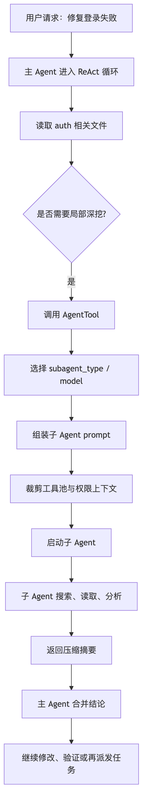
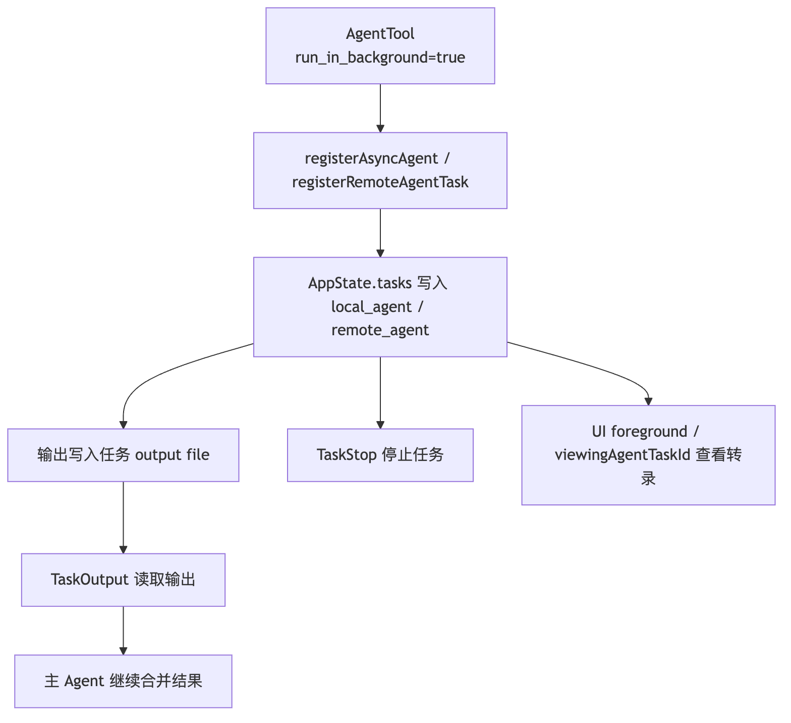
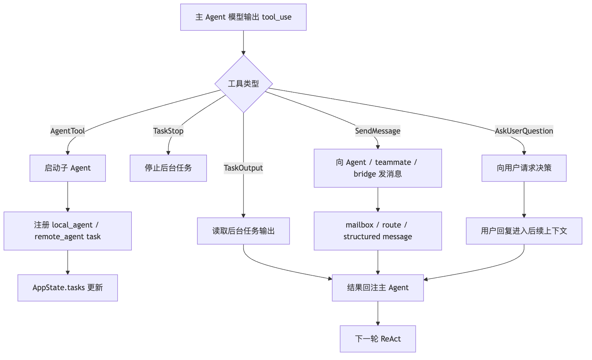

# 8.1 Agent 协作：Claude Code 如何从单线程助手变成多 Agent 运行时

前面几章我们已经把 Claude Code 的几条主线拆开了：

- ReAct 解释"模型怎么一轮轮想和做"。
- Prompt 解释"模型每轮看到什么规则"。
- Context 解释"历史、文件、工具结果怎么被管理"。
- Tools 解释"模型怎么接触真实工程环境"。
- MCP 和 Skill 解释"外部能力和任务经验怎么接进来"。

但还有一个问题没解决：

> 如果任务变大了，一个主 Agent 为什么不够？

比如用户说：

```text
帮我重构这块鉴权逻辑，顺手补测试，确认 API 兼容性，再检查有没有安全风险。
```

如果只有一个主 Agent，它需要同时做很多事：

- 读鉴权代码。
- 找 API 调用方。
- 理解测试体系。
- 修改实现。
- 跑测试。
- 判断安全边界。
- 汇总风险。

这些工作塞进同一个上下文，会出现三个很现实的问题。

第一，主上下文会被污染。大量搜索结果、临时猜测、失败路径、日志输出会挤占上下文窗口。真正重要的设计判断反而被淹没。

第二，任务天然可以并行。查 API 调用方、看测试体系、审安全边界——这些本来就可以交给不同执行单元同时做。

第三，有些决策不能由某个子 Agent 自己拍板。比如要不要破坏兼容、要不要删除旧入口、要不要接受危险命令——这些需要回到主 Agent 或用户那里。

Claude Code 的 Agent 协作不是"多开几个模型实例"这么简单。它更像把复杂工程任务拆成一套运行时系统：

```text
主 Agent 负责理解目标和综合结果
-> 子 Agent 承担局部探索、实现或验证
-> Task 系统追踪后台执行体
-> SendMessage 负责 Agent 之间通信
-> AskUserQuestion 把用户拉回高风险决策
-> 权限系统保证子 Agent 不能绕过治理
```

为了让这篇更好懂，我们固定一个贯穿例子：

```text
用户要求 Claude Code 修复一个登录失败 bug。

主 Agent 先定位问题大概在 auth 模块。
然后它派一个子 Agent 查调用链，
派另一个子 Agent 看测试和复现方式，
自己保留主线判断。
如果某个子 Agent 需要改数据库 schema 或删除兼容逻辑，
权限和用户确认仍然要冒泡回来。
```

这篇要回答的核心问题是：

> Claude Code 源码里，Agent 协作到底由哪些对象组成，它们分别解决什么问题？

## 一、先把问题链拉直

多 Agent 机制容易被讲成一堆名词：subagent、fork、coordinator、team、swarm、message、task。

放回 Claude Code 的源码演化，它其实是一条很自然的问题链：

```text
单 Agent 可以完成简单任务
-> 任务变大后，主上下文被搜索和试错污染
-> 引入子 Agent，把局部探索和执行隔离出去
-> 子任务类型变多，需要不同角色和不同工具边界
-> 引入 subagent_type / built-in subtype / 自定义 Agent
-> 有些子任务适合继承父上下文，不适合从空白开始
-> 引入 fork，让子 Agent 共享父上下文前缀并利用 prompt cache
-> 子 Agent 可能后台运行，主线程不能失去控制
-> 引入 LocalAgentTask / RemoteAgentTask 和 TaskOutput / TaskStop
-> 多个 Agent 需要互相通知和回复
-> 引入 SendMessageTool 和 mailbox / bridge 路由
-> 大任务需要组织结构，而不是临时派活
-> 引入 Coordinator / Team / Teammate
-> 遇到用户偏好或高风险选择
-> 引入 AskUserQuestion，把人重新拉回决策回路
```

这条链说明一件事。

**Agent 协作解决的不是"多几个脑子"，而是"复杂任务如何被组织、隔离、并行、通信、停止和治理"。**

## 二、Agent 定义：先有"角色"，再有"执行体"

在 Claude Code 里，一个 Agent 不是一句 prompt 这么简单。

从源码视角看，Agent 至少有两层：

```text
静态定义：这个 Agent 是谁，擅长什么，能用哪些工具，默认用什么模型
运行实例：这个 Agent 被某次任务启动后，当前状态、输出、上下文、生命周期是什么
```

静态定义就是一份声明式配置。类似 Skill，Agent 也可以通过 Markdown frontmatter 表达元数据：

```md
---
name: security-reviewer
description: Review auth, permission, data exposure, and secret handling risks.
tools: Read Grep Bash
model: opus
---

You are a security-focused reviewer.
Prioritize exploitable bugs over style issues.
```

这类定义回答的是：

- 这个 Agent 什么时候该被选中？
- 它的职责边界是什么？
- 它能不能改文件？
- 它能不能跑命令？
- 它应该用哪个模型？
- 它的 token 预算和输出方式是什么？

Agent definition 的本质不是"给模型起名字"。它是把一个执行角色变成可发现、可裁剪、可约束的运行时对象。

新源码里的 agent definition 字段比这个示例更完整。除了 `description`、`tools`、`prompt`、`model`，它还可以声明：

```text
disallowedTools
effort
permissionMode
mcpServers
hooks
maxTurns
skills
initialPrompt
memory
background
isolation
```

这说明 Agent 定义不是一段“角色扮演 prompt”，而是能同时影响工具集合、权限模式、模型、推理强度、MCP server、预加载 Skill、后台执行和隔离方式的运行时配置。

活跃 Agent 也不是从一个目录直接读出来就结束。源码会按来源合并 built-in、plugin、user settings、project settings、flag settings、policy settings 等定义，同名 Agent 在后写入的来源里覆盖前面的定义。这样策略层、项目层和用户层都能参与 Agent 能力的治理。

没有这一层，主 Agent 想派活时只能写一段自然语言：

```text
你去看一下安全问题，注意别乱改。
```

这太脆弱了。模型可能理解错"安全问题"，也可能顺手改文件。

有了 Agent definition，Claude Code 可以把角色约束下沉到运行时：

```text
安全审查 Agent
-> 只读工具池
-> 更强模型
-> 更聚焦的 system prompt
-> 专门的输出格式
```

这就是 built-in subtype 和自定义 Agent 的意义：

> 把"角色分工"从一句提示词，变成工具池、模型、权限和上下文策略共同约束的对象。

## 三、AgentTool：多 Agent 的工具入口

多 Agent 在 Claude Code 里不是模型自己"心里决定开个同事"，而是通过工具系统显式发生。

最关键的入口就是 `AgentTool`。

它的输入大致可以抽象成这样：

```ts
const inputSchema = z.object({
  description: z.string(),
  prompt: z.string(),
  subagent_type: z.string().optional(),
  model: z.enum(["sonnet", "opus", "haiku"]).optional(),
  run_in_background: z.boolean().optional(),
})
```

这几个字段很说明问题：

| 字段 | 含义 |
| --- | --- |
| `description` | 给这次子任务一个短标题，方便 UI 和任务系统展示 |
| `prompt` | 真正交给子 Agent 的工作说明 |
| `subagent_type` | 选择某类专门 Agent |
| `model` | 必要时覆盖默认模型 |
| `run_in_background` | 是否作为后台执行体运行 |

`AgentTool` 不是普通工具，它更像一个受控派单器：

```text
主 Agent
-> 调用 AgentTool
-> 选择子 Agent 类型
-> 组装子 Agent prompt
-> 裁剪工具池和权限
-> 启动本地或远程 Agent
-> 把运行实例挂进 Task 系统
-> 返回结果或任务 ID
```

这里最重要的是"受控"两个字。

如果只是简单再请求一次模型，子 Agent 会变成失控副本。Claude Code 要处理很多工程细节：

- 子 Agent 的 system prompt 不能和主 Agent 完全混在一起。
- 子 Agent 的工具池不能默认无限放开。
- 子 Agent 的输出要能回到主 Agent。
- 后台 Agent 要能被查看、停止、通知。
- 子 Agent 触发高风险工具时，权限不能被绕过。

读 `AgentTool` 时，别把它理解成"高级 prompt 模板"。它是 Tools、Prompt、Context、Task、权限系统的交叉点。

源码里 `AgentTool.call()` 的第一处分叉，其实还不是“选哪个子代理”，而是判断这是 team teammate spawn 还是普通 subagent。如果同时传了 `team_name` 和 `name`，它会进入 `spawnTeammate()` 路径；而 teammate 不能再无限 spawn teammate，in-process teammate 也不能再 spawn background agent。这说明 team 不是“带名字的 subagent”，而是一套有 roster、mailbox、team context 和生命周期约束的协作拓扑。

## 四、一次子 Agent 调用会发生什么

用前面的登录 bug 例子来走一遍。

主 Agent 读了一些代码，判断问题可能在 `auth/session` 附近。但它不想把全仓搜索结果都塞进主上下文，于是派一个子 Agent：

```text
description: "Trace auth callers"
prompt: "Find all call sites that create or validate sessions. Summarize the call chain and highlight suspicious branches. Do not edit files."
subagent_type: "explore"
run_in_background: false
```

运行时大概是这样：



注意"压缩摘要"很关键。

子 Agent 可以看大量文件、搜大量关键词、走很多失败路径。但主 Agent 不需要继承它的全部中间噪声。主 Agent 只要：

```text
我查了哪些地方
发现了什么关键事实
哪些路径可以排除
下一步建议看哪里
```

这就是子 Agent 对主上下文的最大价值。

> 它把高噪声探索变成低噪声结论。

## 五、General-purpose、Built-in Subtype 与自定义 Agent

Claude Code 的 Agent 协作可以先按"角色明确程度"理解。

最简单的是 general-purpose subagent。它适合普通子任务：

```text
去查一下这几个文件的关系。
去总结这个模块的调用链。
去找有没有类似实现。
```

它的特点是灵活，但边界不够专业。

更进一步是 built-in subtype。比如只读探索、规划、验证这类角色，本来就应该有更明确的工具边界：

| 类型 | 适合场景 | 关键边界 |
| --- | --- | --- |
| Explore | 搜索、阅读、定位事实 | 通常只读，不应该顺手改代码 |
| Plan | 拆任务、比较方案、判断风险 | 输出计划，不直接执行破坏性动作 |
| Verification | 独立验证修改结果 | 不应该复用实现者的假设 |
| Review | 审查 diff、找风险 | 先报告问题，不负责大改 |

再往上是自定义 Agent。团队可以把自己的审查标准、测试策略、架构约定写进 Agent 定义，让 Claude Code 在特定任务里自动选择。

这三层不是谁替代谁，而是适用范围不同：

```text
临时小任务 -> general-purpose
常见专业动作 -> built-in subtype
团队稳定流程 -> custom agent
```

源码上值得关注的点：这些角色最后不会直接"被模型相信"。它们会落到运行时选择、prompt 组装、工具过滤和任务生命周期里。

普通 subagent 的工具集合也不是简单继承父会话。选中 agent definition 之后，AgentTool 会给 worker 构造自己的 permission context，通常会把权限模式设成 agent definition 声明的 `permissionMode`，没有声明时再落到默认策略；然后按这个 worker permission context 重新组装工具池。这样子代理可以有独立边界，同时又不会从父会话偷带过宽的授权。

如果 agent 声明了必需的 MCP server，启动前还会检查这些 server 是否可用；对于 pending 状态的 required server，源码会等待一段时间，避免 MCP 还没连上就把 Agent 判成不可用。

## 六、Fork Agent：不是所有子 Agent 都应该从空白开始

普通子 Agent 通常是隔离上下文。主 Agent 丢给它一段任务说明，它自己去完成。

有些场景下，隔离反而浪费。

比如主 Agent 已经花了很多轮理解项目：

- 已经读过用户需求。
- 已经知道相关文件。
- 已经看过报错。
- 已经理解仓库约定。
- 已经排除了几条错误路径。

现在它想并行验证三个可能原因：

```text
方向 A：是不是 session 过期判断错了？
方向 B：是不是 cookie domain 配置错了？
方向 C：是不是测试 mock 和真实环境不一致？
```

如果三个子 Agent 都从空白开始，就要重复喂大量上下文。

Fork Agent 解决这个问题：

```text
父 Agent 当前上下文
-> fork 出多个子 Agent
-> 每个子 Agent 继承相同前缀
-> 只追加自己的短任务说明
-> 并行探索不同方向
-> 结果回到主 Agent 汇总
```

核心收益有两个。

第一，认知上更连续。子 Agent 不需要重新理解整件事。

第二，成本上更友好。多个 fork 共享相同 prompt 前缀，更容易命中 prompt cache。源码材料里反复强调一点：缓存命中取决于文本相似，也取决于工具列表、系统提示、上下文前缀是否一致。所以 fork 的设计会尽量保持共享部分稳定，把差异压到每个子 Agent 的 directive 上。

可以这样记：

```text
普通 subagent：把一个局部任务外包出去，重点是隔离。
Fork agent：从当前工作现场分叉出去，重点是继承和并行。
```

这是很多源码解读容易混淆的地方。不是所有 Agent 都是 fork，也不是所有子 Agent 都继承父会话。Fork 是多 Agent 协作中的一种特殊上下文策略。

从实现上看，这个区别非常硬：普通 subagent 会根据 agent definition 的 `tools` / `disallowedTools` 解析自己的工具集；fork path 则传入父会话的工具数组和父系统提示，设置 `useExactTools: true`，并用父会话消息构造 `forkContextMessages`。源码注释里的目标也很明确：让 fork 子代理的 API request prefix 尽量和父会话 cache-identical，以便利用 prompt cache。

所以 fork 不是“更高级的 Agent 类型”，而是一种上下文复制策略。它适合从当前完整工作现场分叉去探索，普通 subagent 则适合换一个角色和工具边界去完成局部任务。

## 七、Task 系统：子 Agent 不能偷偷跑

Agent 可以后台运行之后，系统必须回答几个问题：

- 它现在还在跑吗？
- 它输出了什么？
- 它失败了吗？
- 用户能不能切过去看？
- 主 Agent 能不能等它？
- 必要时能不能停掉它？

这就进入 Task 系统。

前一章如果讲 Plan 或 Task，会看到 Claude Code 里有两套容易混淆的 Task：

```text
任务清单 Task：TaskCreate / TaskGet / TaskUpdate / TaskList
运行时 Task：TaskOutput / TaskStop 管 AppState.tasks 里的后台执行体
```

Agent 协作主要和第二种强相关。

源码里的运行时任务类型包括：

| 类型 | 含义 |
| --- | --- |
| `local_bash` | 本地后台 shell |
| `local_agent` | 本地子 Agent |
| `remote_agent` | 远程子 Agent |
| `in_process_teammate` | 进程内 teammate |
| `local_workflow` | 本地工作流 |
| `monitor_mcp` | MCP 监控任务 |
| `dream` | 更实验性的后台任务形态 |

当 `AgentTool` 选择后台运行时，它不是让子 Agent 在系统外飘着，而是注册成运行时任务。

更具体地说，后台路径会注册 async agent task，并用 detached lifecycle 跑子代理。返回给主模型的不是最终答案，而是 `agentId`、`status: async_launched`、`description`、`prompt`、`outputFile`、`canReadOutputFile` 这类可追踪信息。后续主模型可以读取输出文件，或者通过 Task 工具查看和停止任务。

这带来一条完整链路：



这个设计很重要。

Claude Code 没把子 Agent 当成一次普通函数调用。它把它当成真实运行时对象：有 ID、有状态、有输出、有生命周期。

这也是工程 Agent 和聊天助手的分界：

> 聊天助手只能说"我去查一下"；Claude Code 的运行时真的知道哪个 Agent 在查、输出在哪里、必要时怎么停。

## 八、AppState：多 Agent 需要状态底座

多 Agent 一旦出现，状态层就会长出一些单 Agent 不需要的字段。

源码材料里提到过几个信号：

```ts
tasks: { [taskId: string]: TaskState }
agentNameRegistry: Map<string, AgentId>
foregroundedTaskId?: string
viewingAgentTaskId?: string
```

这些字段背后分别解决不同问题：

| 状态 | 解决的问题 |
| --- | --- |
| `tasks` | 当前有哪些后台执行体，状态是什么 |
| `agentNameRegistry` | 名称如何路由到具体 Agent |
| `foregroundedTaskId` | 当前前台展示哪个任务 |
| `viewingAgentTaskId` | 用户正在查看哪个 Agent 的转录 |

如果没有这些状态，多 Agent 会退化成一堆不可观察的异步请求。

比如一个子 Agent 说"我在跑测试"，系统却不知道它对应哪个任务。另一个 Agent 想给它发消息，找不到目标。用户想看它的输出，也没有稳定入口。

Agent 协作一定会深入 AppState。它不是工具层一个孤立按钮。

后台本地 Agent 的状态在 `LocalAgentTask` 里还会保存 `abortController`、`progress`、`messages`、`pendingMessages`、`isBackgrounded`、`retain`、`diskLoaded`、`evictAfter` 等字段。任务完成或失败后，会向主消息队列写入结构化 `<task-notification>`，里面包含 task id、output file、status、summary、result、usage、worktree 等信息。也就是说，后台 Agent 的结果不是靠 UI 旁路展示，而是通过任务通知重新进入模型上下文。

## 九、SendMessageTool：Agent 之间不能靠"喊话"

普通对话文本不会自动同步给所有 Agent。

这很好理解。每个 Agent 都有自己的上下文，如果所有消息都广播给所有 Agent，隔离就失效了，上下文也会爆炸。

所以 Claude Code 需要一个明确的通信工具：`SendMessageTool`。

它的输入可以抽象成这样：

```ts
const inputSchema = z.object({
  to: z.string(),
  summary: z.string().optional(),
  message: z.union([z.string(), StructuredMessage()]),
})
```

字段也很直接：

| 字段 | 含义 |
| --- | --- |
| `to` | 发给谁，可以是具体 Agent，也可以是广播或 bridge 路由 |
| `summary` | 这条消息的摘要，方便接收方快速理解 |
| `message` | 正文，可以是普通文本，也可以是结构化消息 |

`StructuredMessage` 的存在尤其关键。它说明 `SendMessage` 不是普通聊天，而是协议化通信。比如可以表达：

```text
shutdown_request
shutdown_response
plan_approval_response
```

这些不是"闲聊语义"，而是协作系统里的控制消息。

在 team 模式下，`SendMessageTool` 的实现更接近 mailbox：它根据 team context 确定 sender，再把 `{ from, text, summary, timestamp, color }` 写入目标 teammate 的 mailbox。`to` 可以是具体 teammate，也可以是广播。每个 teammate 仍然保留自己的执行上下文，只是通过显式消息传递协调，而不是共享一份全局聊天记录。

举个例子：

```text
测试 Agent 发现当前修改会导致某个旧 API 失败。
它不应该只在自己的上下文里写一句"我发现失败了"。
它应该通过 SendMessageTool 发给主 Agent 或负责 API 的 Agent：

to: "api-reviewer"
summary: "Legacy login API regression"
message: "The new session validation rejects clients that omit device_id. Is this intentional?"
```

这样接收方才能在自己的上下文里获得明确、可路由、可追踪的消息。

`SendMessageTool` 的本质是：

> 把多 Agent 协作里的消息传递做成正式协议，而不是依赖模型输出文本碰运气。

## 十、Coordinator：主 Agent 不一定要亲自干活

任务继续变大，问题不只是"能不能派子 Agent"。而是"谁来组织这些子 Agent"。

如果主 Agent 既要写代码，又要派任务，又要审查结果，又要决定下一步，它很容易失去全局视角。

Coordinator 模式解决这个问题：

```text
Coordinator 不直接做大量具体执行
-> 它拆分任务
-> 分配给不同 worker
-> 收集结构化结果
-> 判断是否需要继续派发、返工或合并
```

它像一个小项目里的技术负责人，而不是一个亲自写完所有代码的人。

放到 Claude Code 源码视角，Coordinator 不一定是单独一个神秘模块，而是一种运行方式：

- 主 Agent 用 `TaskCreate` / `TaskUpdate` 把计划外部化。
- 用 `AgentTool` 派出局部执行者。
- 用 `TaskOutput` 读取后台结果。
- 用 `SendMessage` 与 teammate 沟通。
- 用权限和用户确认处理高风险动作。
- 最后由主 Agent 汇总、决策和输出。

Coordinator 的关键不是名字，而是职责切换：

```text
从"我亲自执行每一步"
切换成
"我维护任务图、派发工作、合并证据、控制风险"
```

这也是多 Agent 和 Task 系统一定要一起看的原因。没有任务状态，Coordinator 只有自然语言计划；有了任务状态，它才有可追踪的组织结构。

## 十一、Team / Swarm：长期协作需要更稳定的协议

如果只是一次性派几个子 Agent，`AgentTool` 就够了。

但更复杂的场景里，Agent 之间可能需要长期协作：

```text
前端 Agent 改 UI。
后端 Agent 改 API。
测试 Agent 持续跑回归。
Reviewer Agent 观察 diff。
Team Lead 负责协调。
```

这时系统不再是"主 Agent 调几次工具"，而更接近一个团队：

- 每个 Agent 有自己的长期上下文。
- 每个 Agent 有自己的任务和输出。
- Agent 之间需要消息路由。
- Team Lead 需要知道谁在做什么。
- 某些任务完成后会解锁后续任务。

源码材料里提到的 `TeamCreateTool`、`TeamDeleteTool`、`in_process_teammate`、`agentNameRegistry`、mailbox / bridge 路由，都是往这个方向走的信号。

注意一个边界：

Team / Swarm 并不等于"越自治越好"。

自治越强，系统越需要治理：

- 防止循环讨论。
- 防止重复认领任务。
- 防止 Agent 之间互相传递过期信息。
- 防止某个 Agent 绕过权限。
- 防止上下文无限膨胀。

Claude Code 的 Team 能力不能只看成产品功能。它背后是一组分布式系统问题：

```text
身份：谁是谁？
状态：谁在做什么？
通信：怎么发消息？
恢复：谁失败了怎么办？
权限：谁能做危险动作？
汇总：最后谁对结果负责？
```

这也是我们在源码解析里不建议把它写成"多智能体很酷"的原因。真正值得学的是：Claude Code 把多 Agent 当成运行时工程问题，而不是 prompt 花活。

## 十二、AskUserQuestion：用户也是协作系统的一部分

多 Agent 系统里还有一个很容易被忽略的"参与者"：用户。

Claude Code 不能假设所有问题都该由 AI 自动决定。比如：

- 要不要删除旧 API？
- 要不要迁移数据库？
- 要不要接受破坏性重构？
- 要不要把某个敏感文件发给远程服务？
- 两种实现都可以，用户偏好哪个？

这些问题不是多开几个子 Agent 就能解决的。

`AskUserQuestion` 不是普通交互控件，而是协作治理的一部分。

它说的是：

```text
当系统遇到不能安全猜测的选择
-> 暂停自动推进
-> 把问题结构化地交给用户
-> 用户选择后
-> 主 Agent 再继续协调后续任务
```

这和权限系统有点像，但关注点不同：

| 机制 | 主要问题 |
| --- | --- |
| 权限系统 | 这个动作能不能执行 |
| AskUserQuestion | 这个选择该由谁决定 |

例如子 Agent 发现两条修复路径：

```text
方案 A：保持旧 API 兼容，但实现更复杂。
方案 B：删除旧兼容分支，代码更干净，但可能影响老客户端。
```

这不是一个纯技术判断。它涉及产品兼容策略。

这时候不该让某个 Agent 自己选。要把问题交回用户。

`AskUserQuestion` 在 Agent 协作里的位置：

> 它把"人类决策边界"也纳入了运行时协议。

## 十三、权限冒泡：子 Agent 不能绕过主系统

多 Agent 最危险的误解：

```text
主 Agent 没权限做的事，可以派子 Agent 去做。
```

这当然不成立。

Claude Code 的工具执行仍然要走统一权限管线。子 Agent 调用 `Bash`、`Edit`、MCP tool 或其他高风险工具时，不能因为"它是子 Agent"就绕过：

- allow / deny 规则
- permission prompt
- hooks
- sandbox
- 用户确认
- 项目或企业策略

这就是权限冒泡。

可以这样理解：

```text
子 Agent 可以隔离上下文，
但不能隔离责任。
```

如果登录 bug 的子 Agent 想执行：

```bash
rm -rf migrations/
```

系统不能因为这是子 Agent 发起的就静默执行。它仍然必须通过同一套权限检查，把需要用户确认的风险冒泡回来。

这也是 Claude Code 多 Agent 设计里很关键的一点：

> 协作扩展的是能力，不应该扩展越权空间。

## 十四、把 Agent 协作放回 Tools 管线

现在可以把整套机制放回 Tools 体系里看。

Claude Code 的 Agent 协作不是另起炉灶，而是复用工具管线：



这张图里有一个重要的观察：

`AgentTool`、`SendMessageTool`、`AskUserQuestion` 都是工具。

这意味着它们和 `Read`、`Edit`、`Bash` 一样，会进入统一的：

- schema 校验
- 权限判断
- tool_use / tool_result 消息
- AppState 更新
- UI 展示
- 上下文回注

多 Agent 不是绕过主循环的旁路。它是主循环可以调用的一组更高阶工具。

## 十五、从源码阅读角度，应该看哪些入口

如果你真的要读源码，不建议一上来搜 "swarm"，然后陷进所有实验特性。

更稳的阅读顺序是：

```text
1. Agent 定义加载
-> 先看 Agent metadata、frontmatter、tools、model 如何解析

2. AgentTool
-> 看输入 schema、subagent_type、model、run_in_background 如何影响执行

3. runAgent / forkedAgent
-> 看子 Agent prompt、上下文、工具池如何组装

4. LocalAgentTask / RemoteAgentTask
-> 看子 Agent 如何注册为运行时任务

5. TaskOutput / TaskStop
-> 看后台输出和停止机制

6. AppStateStore
-> 看 tasks、agentNameRegistry、foregroundedTaskId、viewingAgentTaskId

7. SendMessageTool
-> 看 to、summary、StructuredMessage、broadcast / bridge 路由

8. Team / Teammate 相关模块
-> 看长期协作、mailbox、任务认领和 teammate 生命周期

9. Permission / hooks
-> 看子 Agent 工具调用如何进入统一权限管线
```

这条路线的好处是，它按"一个子 Agent 怎么被定义、启动、观察、通信、停止、治理"来读，不会被名词带跑。

## 十六、常见误区

### 误区一：多 Agent 就是并发

并发只是结果之一。

更核心的是上下文隔离、角色边界、任务生命周期和权限治理。

如果只是同时发几个模型请求，却没有任务状态、消息路由、输出合并和停止机制——那只是并行调用，不是成熟的 Agent 协作。

### 误区二：Fork Agent 等于普通子 Agent

不一样。

普通子 Agent 强调隔离，通常由主 Agent 给一段任务说明。

Fork Agent 强调继承，从当前上下文分叉出去，适合在已有充分背景下并行探索多个方向。

### 误区三：SendMessage 就是聊天

不是。

`SendMessageTool` 是协作协议。它有目标、摘要、结构化消息和路由语义。

聊天文本是内容，SendMessage 是传输和控制机制。

### 误区四：AskUserQuestion 只是 UI 弹窗

也不是。

它是把用户决策纳入 Agent 协作的一种机制。它告诉系统：这里不是信息不足，而是决策权不该交给 AI。

### 误区五：子 Agent 可以拥有自己的安全边界

子 Agent 可以拥有自己的上下文边界和工具裁剪，但不能绕过全局权限治理。

如果子 Agent 可以越权执行危险动作，多 Agent 机制就会从能力扩展变成安全漏洞。

## 十七、最小复刻时应该怎么做

如果你想在自己的 Agent Harness 里复刻 Claude Code 的多 Agent，不要一开始就做 Team / Swarm。

最小版本可以分四步。

第一步，先实现一个 `AgentTool`：

```ts
type AgentToolInput = {
  description: string
  prompt: string
  agentType?: string
  runInBackground?: boolean
}
```

它只需要能启动一个隔离子 Agent，并把最终摘要返回主 Agent。

第二步，引入运行时 Task：

```ts
type RuntimeTask = {
  id: string
  type: "local_agent"
  status: "pending" | "running" | "completed" | "failed" | "killed"
  outputPath: string
  createdAt: number
}
```

让后台 Agent 有状态、有输出、有停止入口。

第三步，增加消息路由：

```ts
type AgentMessage = {
  to: string
  from: string
  summary?: string
  message: string | StructuredMessage
}
```

先支持发给具体 Agent，再考虑广播和 bridge。

第四步，接入权限冒泡：

```text
任何 Agent 调工具
-> 都走统一 canUseTool
-> 高风险动作回到用户确认
-> 子 Agent 不能拥有绕过权限的快捷通道
```

这四步比一开始做复杂团队系统更重要。

Claude Code 的经验不是"多 Agent 越多越好"。而是：

> 每增加一个执行单元，都必须同时增加可观察性、可停止性、通信协议和权限治理。

## 十八、这一章的核心记忆

可以把 Claude Code 的 Agent 协作记成几句话：

AgentTool 负责派活。Agent definition 负责角色边界。Fork 负责继承上下文并行。Task 系统负责生命周期。SendMessage 负责通信。Coordinator / Team 负责长期组织。AskUserQuestion 和权限系统负责把风险决策拉回人和主治理链路。

再压缩一点：

```text
多 Agent = 上下文隔离 + 角色分工 + 任务生命周期 + 消息协议 + 权限治理
```

理解了这一章，再去看 Claude Code 的 Agent 相关源码，不会只盯着"它怎么多开模型"。

真正重要的是：

```text
它怎么让多个执行单元仍然像一个可控系统。
```
