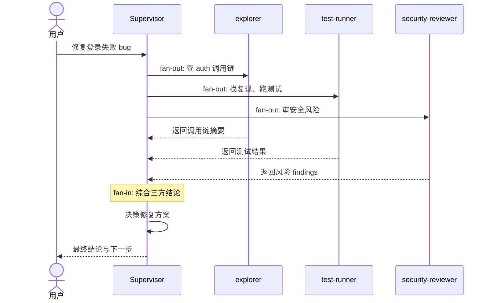
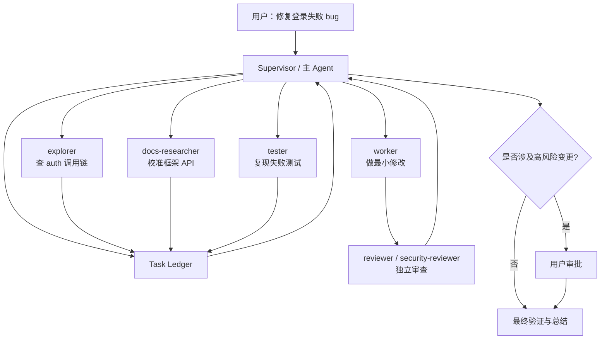

# 8.2 业界的 Agent 协作：多 Agent 不是多开几个聊天框

上一节我们从 Claude Code 的源码视角，拆了 `AgentTool`、subagent、fork、Task、SendMessage、Coordinator、Team 这些机制。

这一节换个角度——跳出 Claude Code，看看业界到底怎么设计多 Agent 协作。

这个问题很容易被讲成产品名词堆砌：

- Gemini / ADK 有 `SequentialAgent`、`ParallelAgent`、`LoopAgent`。
- Claude Code 有 subagents 和 agent teams。
- Codex 有 subagents、custom agents、sandbox 和 approvals。
- OpenAI Agents SDK 有 handoffs 和 `Agent.as_tool()`。
- Deep Agents 有 supervisor、sync subagents、async subagents、memory 和 sandbox。

但只记这些名词，读完还是糊。

多 Agent 真正难的地方不是"能不能启动多个模型实例"，而是：

```text
任务怎么拆？
谁来派活？
子 Agent 看到多少上下文？
它能不能改文件？
做完以后怎么回传？
卡住了能不能停？
多个 Agent 写同一块东西会不会打架？
高风险动作谁批准？
```

所以这一节不按厂商列表背概念，而是沿着一条问题链往前走。

为了更具体，我们沿用上一节的例子：

```text
用户要求修复一个登录失败 bug。

这个 bug 可能涉及 auth 代码、cookie 配置、数据库 session、前端登录页、测试 mock、旧 API 兼容性和安全边界。

一个 Agent 可以做，但会又慢又乱。
多个 Agent 也可以做，但如果没有协作设计，会变成更快地乱。
```

这一节的核心问题：

> 业界的多 Agent 系统，怎么把"多个智能体"设计成可控的工程协作，而不是一群互相污染的模型？

---

## 一、先把问题链拉直

多 Agent 的出现，通常不是因为"模型不够聪明"，而是工程任务本身有四个天然压力。

**第一，信息太多。**

修登录 bug 时，主 Agent 可能要读几十个文件、跑测试、看日志、搜调用链。所有中间过程都塞进一个上下文，主线会被搜索噪声淹没。

**第二，任务可并行。**

查调用链、跑测试、看前端状态、审安全边界，本来就可以同时做。让一个 Agent 串行干完，不总是最优。

**第三，角色不同。**

探索者应该多读少改；实现者聚焦最小修改；审查者应该怀疑实现者的假设；安全审查者应该优先找可利用风险。把这些角色压到一个 prompt 里，往往会互相冲突。

**第四，风险需要收敛。**

子 Agent 不能因为"我是后台 worker"就绕过权限。删兼容逻辑、改数据库 schema、联网拉依赖、执行危险命令——这些动作必须回到统一的审批和责任链。

于是业界的设计大体沿着这条链演化：

```text
单 Agent 能完成简单任务
-> 复杂任务让主上下文变脏
-> 引入子 Agent 做上下文隔离
-> 子任务可并行
-> 引入 supervisor / worker 的 fan-out / fan-in（任务分发与汇聚模式）
-> 子任务类型不同
-> 引入 specialized agents 和工具权限边界
-> 有些任务要真正交接控制权
-> 引入 handoff（控制权转移机制）
-> 有些任务跨系统、跨团队
-> 引入 A2A 这类协议化互操作
-> 有些任务很长，不能一口气跑完
-> 引入 durable execution、memory、sandbox、task lifecycle
```

所以多 Agent 的核心不是：

```text
more agents = more intelligence
```

而是：

```text
more agents = more coordination problems
```

业界做的所有设计，本质上都回答同一个问题：

> 增加并行能力的同时，如何不丢掉上下文、状态、权限和责任边界？

---

## 二、第一种模式：中心编排，先有一个"总控"

最稳妥的多 Agent 模式，是中心编排。

系统里先有一个主控角色：

```text
用户请求
-> 主 Agent / Runner / Supervisor 理解目标
-> 拆成几个子任务
-> 派给不同子 Agent
-> 等子结果回来
-> 主控综合、决策、继续执行
```

这就是典型的 fan-out / fan-in（扇出分发、扇入汇聚）：任务从一个中心点分散出去，做完再回到中心点整合。

用序列图表示：



放到登录 bug 里：

```text
主控 Agent：
  - 派 code-mapper 查 auth 调用链
  - 派 test-runner 找复现和跑测试
  - 派 security-reviewer 看风险
  - 自己保留最终修复方案和合并判断
```

这个模式的好处是**清楚**。每个子 Agent 做局部工作，主控负责全局判断。子 Agent 不需要知道所有事，也不该自己决定最终方向。

OpenAI Agents SDK 里的 `Agent.as_tool()` 就是这种思路的典型表达：orchestrator（编排器）把 specialist agent 当成工具调用，控制权始终在 orchestrator 手里。Claude Code 和 Codex 的很多 subagent 场景也是这个味道——父 Agent 明确派活，子 Agent 返回结果，父 Agent 再合并。

它解决的是第一个关键问题：

> 多 Agent 系统里，必须有人负责"最后把事情讲通"。

否则每个 Agent 都从自己的局部视角给结论：

```text
测试 Agent：测试是红的。
安全 Agent：这里有风险。
实现 Agent：我改好了。
前端 Agent：页面表现正常。
```

但用户真正需要的是：

```text
根因是什么？
改了哪里？
为什么这个改法安全？
哪些测试证明没破坏旧行为？
还有什么风险？
```

这必须由中心节点做最终综合。

不过中心编排也有边界。如果所有沟通都要经过主控，主控会变成瓶颈。任务很长、子任务很多、子 Agent 之间需要频繁沟通时，中心节点会忙着转发信息，而不是做判断。

所以业界又走向第二种模式：把协作对象化。

（说白了，中心编排是" safest default"——不确定怎么设计时，先让一个人总负责，总不会出大乱子。）

---

## 三、第二种模式：任务对象化，不要只靠自然语言派活

多 Agent 最怕"口头派活"。

主 Agent 对子 Agent 说一句：

```text
你去看看登录问题。
```

这话太松了。子 Agent 不知道：

- 是只读分析，还是可以改代码？
- 输出要证据，还是要方案？
- 查到一半卡住怎么办？
- 完成标准是什么？
- 结果要不要给其他 Agent 看？

成熟一点的系统会把任务做成**对象**。

一个任务至少应该有这些字段：

```text
id
description
owner / assignee
status
dependencies
allowed tools
artifacts
logs
result summary
cancel / resume capability
```

Google 的 A2A 协议把 `Task` 当作基础工作单元，任务有完整生命周期。Claude Code teams 用共享任务表和 file locking。Codex 给 subagent 配了线程上限、嵌套深度和运行时间限制。Deep Agents 的 async subagent 会返回 task id，supervisor 可以随时 check、update、cancel、list。

这些设计的共同点是：

> 子 Agent 不是"临时叫来的模型"，而是一个有生命周期的执行体。

回到登录 bug：

```text
task: trace-auth-callers
owner: explorer
status: running
mode: read-only
output:
  - 关键调用链
  - 可疑分支
  - 排除路径
  - 下一步建议
```

主控不需要盯着子 Agent 的每句话。它只需要在合适的时候读取任务状态和最终摘要。

任务对象化还解决一个隐藏问题：**恢复**。

长任务跑到一半断了，系统至少要知道：

```text
哪些任务完成了？
哪些失败了？
哪些还在跑？
哪些结果已经写成 artifact？
哪些结论只是中间猜测？
```

没有任务对象，恢复只能靠翻聊天记录猜。（经历过凌晨三点线上故障的人应该懂——这时候你最不想要的就是"让我从头再看一遍 AI 说了什么"。）

这也是为什么真正的 Agent runtime 一定会越来越像"任务系统 + 工具系统 + 状态系统"的组合，而不是一个单纯的 prompt wrapper。

---

## 四、第三种模式：上下文隔离，子 Agent 回摘要，不回噪声

多 Agent 最早解决的不是并行，而是**上下文污染**。

Claude Code subagents、Codex explorer、Deep Agents subagents 都强调同一个点：

```text
子 Agent 可以深入搜索和试错
主 Agent 只接收压缩后的结果
```

这非常关键。

修登录 bug 时，探索 Agent 会做很多高噪声动作：

```text
搜索 session
搜索 cookie
搜索 login
读取旧测试
排除几个无关模块
看一段失败日志
误判一次
再修正
```

这些过程对它自己有用，但不该全部塞给主 Agent。

主 Agent 真正需要的是：

```text
我查过哪些路径
哪些可以排除
真正可疑的是哪三处
证据分别在哪些文件
建议下一步怎么验证
```

子 Agent 的输出应该是**摘要**，而不是**转录**。

可以把它想成真实团队协作：你不会要求同事把下午所有搜索记录都念给你。你希望他说："我查完了，问题大概率在 session refresh，有两个证据，cookie 方向可以排除。"

这就是上下文隔离的价值。

但隔离也有代价。子 Agent 如果看不到足够上下文，可能会重复探索、误解目标，甚至得出和主线不一致的结论。

业界通常在这两种策略之间切换：

| 策略 | 适合场景 | 风险 |
| --- | --- | --- |
| clean context（干净上下文） | 子任务独立、探索噪声大 | 需要重新理解背景 |
| fork / inherited context（继承式上下文） | 父上下文很有价值、要并行验证多个方向 | 成本更高，也可能继承父上下文里的错误假设 |

Claude Code 的 fork 属于后一类：从父会话当前状态分叉，多个子 Agent 共享相同前缀，再分别探索不同方向。

上下文设计不是越隔离越好。关键是问：

> 子任务更需要继承父上下文，还是更需要保持干净？

---

## 五、第四种模式：角色专业化，不同 Agent 要有不同工具边界

多 Agent 不是把同一个 Agent 复制三份。

如果三个 Agent 都能读、写、删、跑命令、联网、改配置，那只是三个不稳定的全权限副本。

业界更常见的做法是**按角色限制能力**。

Codex 官方文档内置了 `default`、`worker`、`explorer` 等角色。`explorer` 明确偏向 read-heavy（以读取为主）的代码库探索；自定义 agent 也可以配置 model、reasoning effort（推理深度）、sandbox（沙箱，隔离执行环境）、MCP server 等。Claude Code 的 subagent 支持用 Markdown frontmatter（前置元数据）定义 name、description、tools，让每个 subagent 拥有不同的上下文窗口和工具访问范围。Deep Agents 的 subagent 配置里同样有 name、description、system_prompt、tools、model、permissions 等字段。

这些设计背后的原则很朴素：

```text
探索者：多读，少改，最好只读。
实现者：可以改，但只改明确范围。
审查者：只读 diff 和上下文，优先找风险。
文档研究者：可以查官方文档，但不碰业务代码。
安全审查者：权限更保守，输出更严格。
```

放到登录 bug：

| Agent | 任务 | 工具边界 |
| --- | --- | --- |
| explorer | 找 auth 调用链 | 只读文件和搜索 |
| worker | 修改 session refresh 逻辑 | workspace 写权限，不能越界 |
| test-runner | 跑登录相关测试 | 可执行测试命令，不随便改实现 |
| security-reviewer | 审 cookie、token、权限风险 | 只读，输出 findings |
| docs-researcher | 校准框架 API 行为 | 可访问文档 MCP，不改代码 |

角色专业化解决的是"谁该做什么"，工具边界解决的是"谁不能做什么"。

**后者比前者更重要。**

模型会犯错。真正可靠的系统不能光靠 prompt 说"请不要乱改"，还要在工具层、沙箱层、审批层把边界卡住。

---

## 六、第五种模式：handoff，什么时候要真正交棒？

中心编排里，子 Agent 更像工具。它做完局部任务，把结果交回主控。主控始终拥有会话控制权。

但有些场景不适合这样。

用户的问题从"修登录 bug"变成：

```text
顺便帮我设计一套新的 SSO（Single Sign-On，单点登录，一套认证凭证通行多个系统）接入方案。
```

这已经不再是原来 worker 的局部任务，而是另一个专家领域。此时更合理的做法是 handoff：

```text
当前 Agent 识别到任务类型变化
-> 把会话交给 SSO specialist
-> specialist 接手后续多轮对话
-> 直到它产出最终结果或再交回
```

OpenAI Agents SDK 对这个区分讲得很清楚：

| 模式 | 控制权 | 适合场景 |
| --- | --- | --- |
| agent as tool | 主控保留控制权 | 局部专家任务、审查、查询、辅助分析 |
| handoff | 控制权切给下游 Agent | 用户意图切换到另一个专业领域，需要下游持续对话 |

这两个模式容易混。一句话区分：

```text
agent as tool：我请专家回答一个子问题。
handoff：这个问题从现在起交给专家负责。
```

在工程 Agent 里，handoff 不能滥用。

每个小分支都 handoff，用户会感觉系统一直在换人，主线也会断。更稳妥的默认选择通常是 agent-as-tool / subagent：让专家处理局部，再由主控综合。

只有当任务的"主语"真的变了，才值得 handoff。

---

## 七、第六种模式：协议化互操作，Agent 不能只在一个产品里协作

上面的模式大多发生在同一个运行时内部：Claude Code 里派 subagent，Codex 里派 worker / explorer，Deep Agents 里 supervisor 调 subagent，OpenAI Runner 里做 handoff。

但业界还有一个更大的问题：

> 如果两个 Agent 来自不同框架、不同厂商、不同团队，怎么协作？

这就是 A2A 出现的背景。

A2A 试图把远程 Agent 当成一个可发现、可调用、可追踪的服务。不要求你知道对方内部怎么实现，只要求双方遵守共同对象模型：

```text
Agent Card：我是谁，我会什么，怎么认证
Message：一次通信内容
Task：一项有状态的工作
Artifact：任务产物
Streaming / Push：任务进度和长任务通知
```

这和 MCP 有点像，但关注点不同：

```text
MCP 更像"Agent 如何调用工具和资源"。
A2A 更像"Agent 如何调用另一个 Agent"。
```

在登录 bug 的例子里，假设公司已经有一个安全审查 Agent 服务，不属于当前 Codex / Claude Code 进程。主控可以通过 A2A 发现它的能力，发送审查任务，然后订阅它的状态和 artifact。

协议化设计解决的是**跨组织协作**：

- 不同团队可以维护自己的 specialist agent。
- 调用方不需要知道对方内部 prompt 和工具链。
- 长任务可以用 Task 状态机追踪。
- 结果可以通过 Artifact 标准化返回。
- 认证和能力声明放进 Agent Card。

但它也带来新的复杂度。

一旦跨进程、跨网络、跨组织，系统必须处理：

```text
认证
授权
超时
重试
版本兼容
任务取消
输出可信度
敏感数据边界
```

A2A 不是"让 Agent 自由聊天"的协议，而是把远程 Agent **服务化、任务化、状态化**。

这也是 Gemini / ADK 体系比较有代表性的地方：不只给你几个 workflow agent，还把 agent-to-agent 的互操作问题推到了协议层。

---

## 八、第七种模式：长任务 Harness，Agent 要能记得、暂停、恢复和被审计

任务从几分钟变成几小时，甚至跨天运行时，多 Agent 会遇到新问题。

比如：

```text
修登录 bug
-> 发现要升级认证库
-> 需要迁移旧 session
-> 要跑完整回归
-> 等用户确认兼容策略
-> 生成迁移文档
```

这不是一次模型调用能解决的。

长任务需要 harness：

```text
短期状态：当前线程正在做什么
长期记忆：跨会话可复用的事实和偏好
任务状态：哪些任务完成、失败、取消
artifact：中间产物存在哪里
sandbox：执行环境如何隔离
approval：高风险动作如何暂停等待人
tracing：出问题时如何追踪是哪一步坏了
```

Deep Agents 的设计很能说明这个方向。它把自己定位成 agent harness：基于 LangGraph runtime，组合 planning、subagents、filesystem context、long-term memory、sandbox、human-in-the-loop（人在环路中，关键决策点由人类确认）。它的 async subagents 可以让 supervisor 启动后台任务，拿到 task id 后继续和用户交互，之后再 check、update 或 cancel。

Codex 也走在这个方向上，只是表达方式更偏编码运行时：

- subagent 有并发线程上限。
- 嵌套深度默认受限。
- sandbox 和 approval policy 控制执行边界。
- app / CLI / cloud 之间共享一套执行心智。
- 自动审批 review 只评估本来就需要审批的动作。

这类设计背后的核心判断是：

> Agent 一旦能长期执行，就必须像一个**可治理的工作流**，而不是像一次聊天回复。

没有 tracing，失败了不知道谁错。

没有 sandbox，能力越强越危险。

没有 memory 边界，错误会被长期保存。

没有 approval，子 Agent 可能把风险动作藏在后台。

没有 task lifecycle，暂停恢复只能靠人脑记。

长任务 Agent 的关键，不是让模型更能熬，而是让系统能承载"熬"的过程。

---

## 九、把几套系统放到同一张图里

现在可以把业界几条路线放在一起看。

| 系统 / 框架 | 更像什么 | 协作核心 | 强项 | 主要边界 |
| --- | --- | --- | --- | --- |
| Gemini / ADK / A2A | 企业级编排和互操作平台 | workflow agents + A2A Task / Agent Card | 协议化、任务状态、跨系统协作 | 内部调度细节仍是黑箱，工程复杂度高 |
| Claude Code | 终端里的协作工作台 | subagents + context isolation + teams / mailbox | 本地工程体验、上下文隔离、团队协作感 | teams 恢复、冲突收敛和协议化程度较弱 |
| Codex | 强中心编码执行内核 | parent fan-out / fan-in + custom agents + sandbox / approvals | 审批、安全边界、配置化并发、编码工作流 | 更偏中心控制，不是自由 swarm |
| OpenAI Agents SDK | 可编程 Agent 编排 API | handoffs + agents as tools + Runner tracing | 控制权语义清楚，适合产品化集成 | 需要开发者自己设计任务对象和权限策略 |
| Deep Agents | 长任务 Agent harness | supervisor + sync / async subagents + memory / sandbox | 长任务、持久化、可插拔后端 | preview 能力和分布式治理需要自己兜底 |

这张表不是为了分高下，而是为了看清它们在解决不同层的问题。

- 只想把大任务拆成几个只读探索？Claude Code / Codex 的 subagent 就够了。
- 要在产品后端里编排多个专家？OpenAI Agents SDK 的 handoff 和 `Agent.as_tool()` 更直接。
- 要做跨团队、跨系统的 Agent 服务互操作？A2A 这类协议更值得关注。
- 要做持续数小时、可暂停、可恢复、有长期记忆的复杂任务？Deep Agents 这类 harness 思路更接近目标形态。

---

## 十、业界设计多 Agent 的几条共识

把这些系统合起来看，能提炼出几条实用的共识。

### 1. 先拆任务边界，再拆 Agent

不要一上来问"我要几个 Agent"。先问：

```text
哪些工作可以独立完成？
哪些工作需要共享上下文？
哪些工作只读？
哪些工作会产生副作用？
哪些结果必须由主控综合？
```

任务边界清楚以后，Agent 数量自然会出来。

### 2. 并行优先给读任务，写任务要收敛

最适合并行的：搜索代码、查文档、看日志、跑互不影响的测试、做候选方案分析、做独立审查。

最不适合自由并行的：多个 Agent 同时改同一文件、同时迁移 schema、同时更新共享记忆、同时决定发布策略。

一句话：

```text
读可以散，写要收。
```

### 3. 子 Agent 回结论，不回过程噪声

子 Agent 的交付物最好固定成这种结构：

```text
做了什么
发现了什么
证据在哪里
排除了什么
建议下一步
不确定点是什么
```

不要把所有工具调用、搜索结果、失败路径都塞回主上下文。

### 4. 权限要跟角色绑定，而不是跟模型信心绑定

模型说"我有把握"不代表可以放权。

更可靠的做法：

```text
explorer 默认只读
reviewer 默认只读
worker 限定 workspace 写入
网络默认关闭
危险命令需要审批
越过 sandbox 需要审批
```

这也是 Codex sandbox / approval、Claude Code subagent tools、Deep Agents permissions、Gemini 平台治理共同指向的方向。

### 5. 人不是低级 fallback，而是高风险决策节点

多 Agent 系统不该把用户当成"模型不会了才问的人"。

用户更像风险边界上的审批者：

```text
是否接受破坏兼容？
是否删除旧路径？
是否联网访问外部资源？
是否执行迁移？
是否保存某条长期记忆？
```

越是多 Agent，越要明确什么时候把人拉回来。

### 6. tracing 不是锦上添花

单 Agent 出错，你还能翻聊天记录。

多 Agent 出错，没有 tracing 就会变成：

```text
不知道哪个 Agent 看错了
不知道哪个 handoff 丢了上下文
不知道哪个工具调用污染了状态
不知道哪个子任务把错误写进 artifact
```

成熟系统都会把 tracing、usage、task status、artifact、审批记录变成一等对象。

---

## 十一、一个可落地的设计模板

如果你要自己设计一个工程型多 Agent 系统，可以从这套最小模板开始：

```text
Supervisor
  - 负责理解用户目标
  - 维护任务表
  - 分配子任务
  - 收集结果
  - 做最终决策

Task Ledger
  - id
  - status
  - owner
  - dependencies
  - artifacts
  - cancel / resume

Specialized Agents
  - explorer：只读探索
  - worker：局部实现
  - reviewer：独立审查
  - tester：验证和复现
  - docs-researcher：外部文档校准

Context Policy
  - clean context for noisy exploration
  - forked context for parallel hypothesis testing
  - summary-only return to supervisor

Permission Policy
  - read-only by default
  - workspace-write for bounded implementation
  - network / external write / destructive command require approval

Observability
  - trace every tool call
  - record handoff
  - record task status
  - store artifact separately from chat history
```

放到登录 bug 的流程里：



这张图的重点不是 Agent 数量，而是**边界**：

- 读任务并行。
- 写任务收敛。
- 审查独立。
- 高风险回到人。
- 最终由主控综合。

---

## 十二、回到 Claude Code：为什么它要做这么多对象？

有了业界视角，再回看上一节的 Claude Code 源码，会更容易理解。

`AgentTool` 不是"模型叫模型"，它是**受控派单入口**。

subagent 不是"另一个聊天框"，它是**上下文隔离单元**。

fork 不是"复制会话玩一玩"，它是**继承父上下文、并行验证假设**的策略。

Task 系统不是"后台任务列表"，它是**多执行体生命周期管理**。

`SendMessageTool` 不是"让 Agent 聊天"，它是**协议化通信入口**。

Coordinator / Team 不是"多 Agent 炫技"，它是**任务组织方式升级**。

AskUserQuestion / 权限冒泡不是"打断用户"，它是**高风险决策回到责任主体**。

Claude Code 的多 Agent 机制放在业界里看并不孤立。它和 Gemini、Codex、OpenAI Agents SDK、Deep Agents 都在朝同一个方向收敛：

```text
把模型能力包进一套可组织、可追踪、可恢复、可审批、可隔离的工程系统。
```

只是每家的重心不同。

Claude Code 更重本地工程协作体验；Codex 更重中心执行内核和安全审批；Gemini 更重协议化和平台化；OpenAI Agents SDK 更重可编程编排；Deep Agents 更重长任务 harness。

---

## 十三、最后用一句话记住

多 Agent 不是为了让系统看起来更"智能"。

它真正解决的是：

```text
当一个任务太大、太脏、太长、太危险时，
如何把它拆成多个可隔离、可并行、可通信、可停止、可审查的执行单元。
```

判断一个多 Agent 设计是否靠谱，不要先看它有几个 Agent，先看它有没有回答这六个问题：

```text
谁负责最终决策？
任务状态在哪里？
上下文如何隔离？
权限如何收敛？
结果如何回传？
失败如何恢复？
```

这六个问题答不清，多 Agent 只会把混乱并行化。

这六个问题答清了，多 Agent 才真正从"多个聊天框"变成"工程协作系统"。

---

## 参考资料

- 本地参考：[Codex Agent 协作与编排模型](../../../wiki/AI/codex-agent-协作与编排模型.md)
- 本地参考：[第08章 多 Agent 协作、Teams 与权限冒泡](../../../wiki/AI/第08章-多-agent-协作、teams-与权限冒泡.md)
- OpenAI Codex：[Subagents](https://developers.openai.com/codex/subagents)、[Agent approvals & security](https://developers.openai.com/codex/agent-approvals-security)
- OpenAI Agents SDK：[Agents](https://openai.github.io/openai-agents-js/guides/agents/)、[Handoffs](https://openai.github.io/openai-agents-js/guides/handoffs/)
- Anthropic Claude Code：[Subagents](https://docs.anthropic.com/en/docs/claude-code/sub-agents)
- Google ADK / A2A：[ADK technical overview](https://adk.dev/get-started/about/)、[A2A specification](https://a2a-protocol.org/latest/specification/)
- LangChain Deep Agents：[Overview](https://docs.langchain.com/oss/python/deepagents/overview)、[Subagents](https://docs.langchain.com/oss/python/deepagents/subagents)、[Async subagents](https://docs.langchain.com/oss/python/deepagents/async-subagents)
