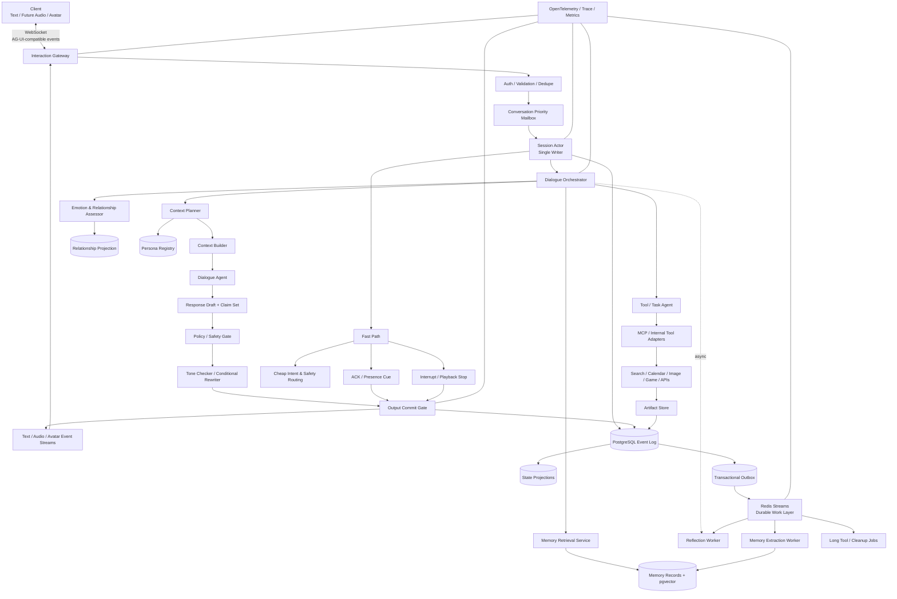
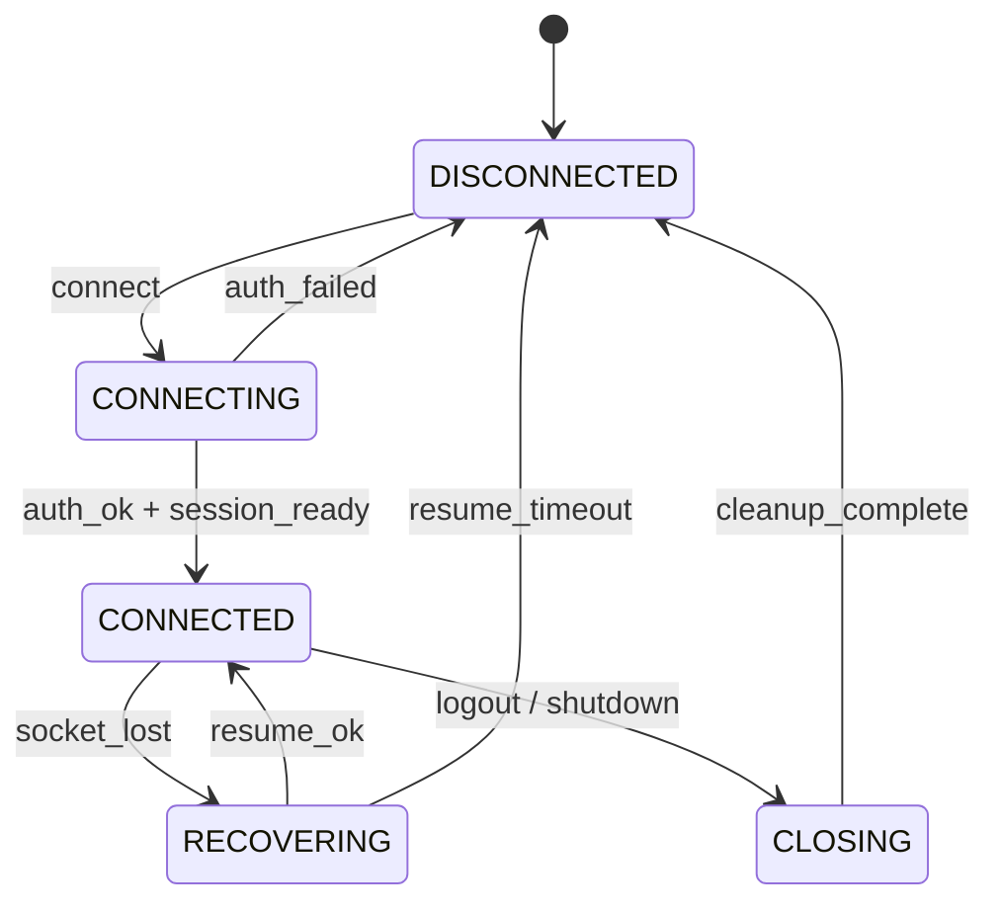
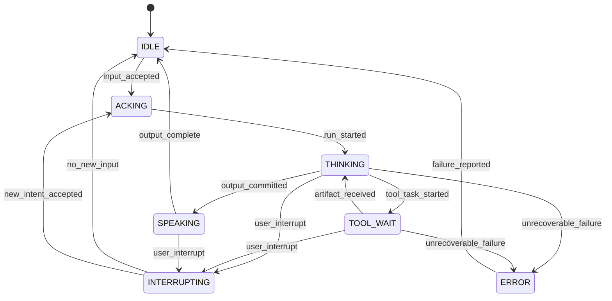
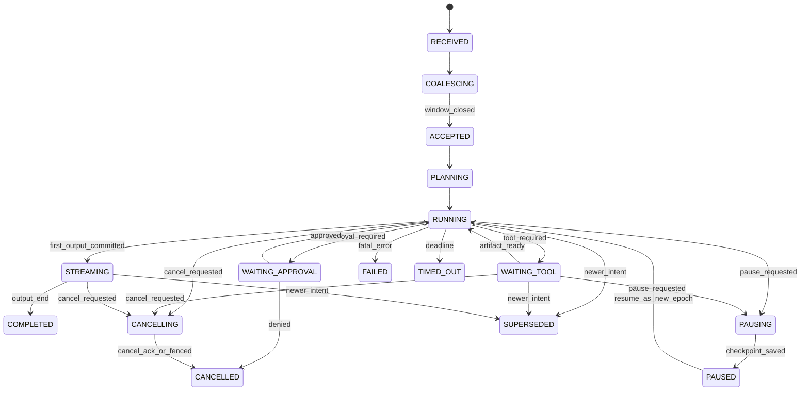
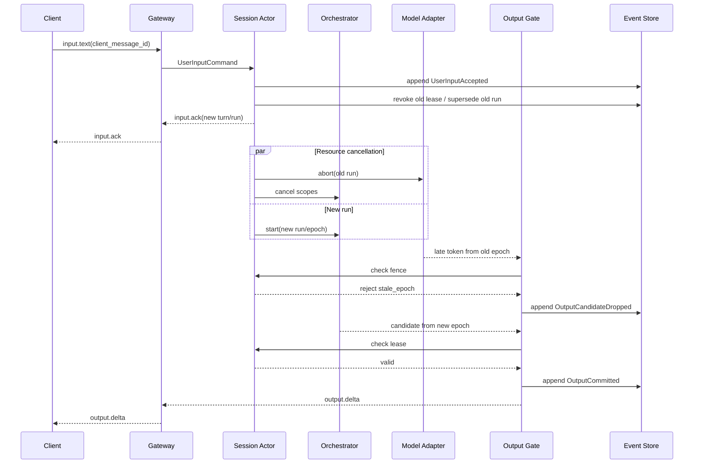
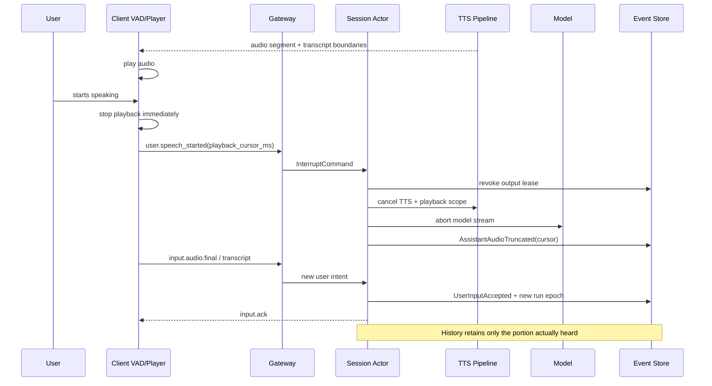
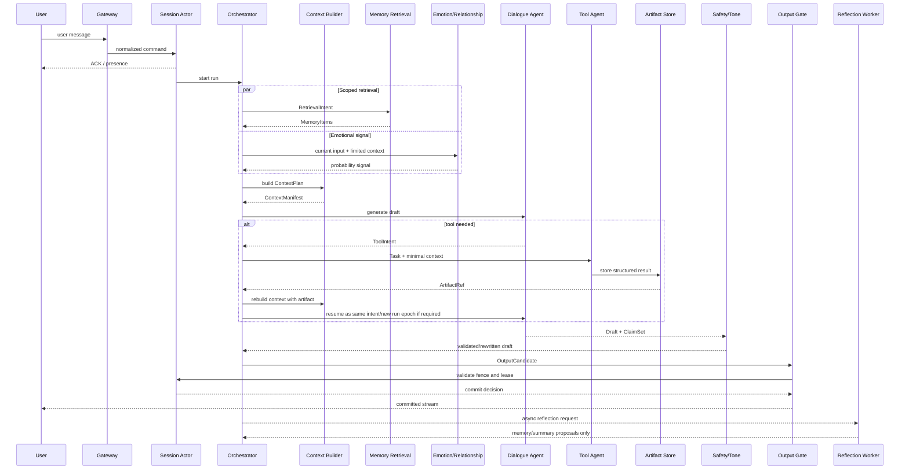
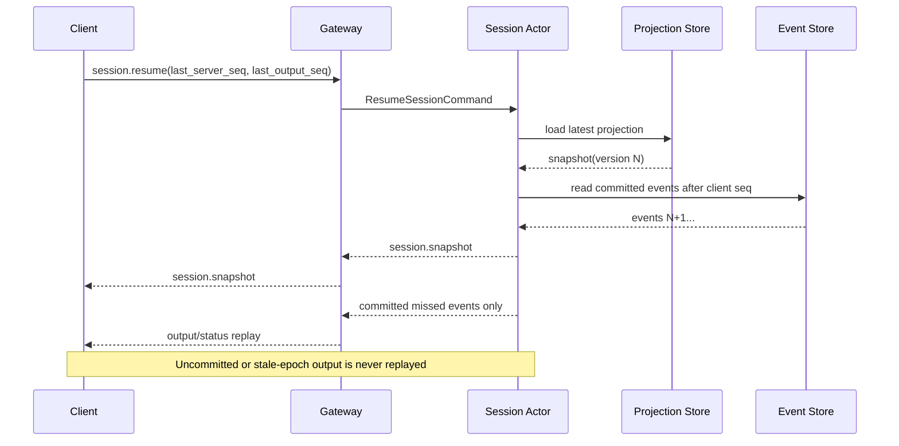

# 1. 执行摘要

## 1.1 事实标记

下文统一使用四类标记，避免把 Neuro-sama 的未知内部实现写成事实：

* **[F] 公开事实**：官方资料、官方协议、公开演示能够验证。
* **[S] 源码事实**：开源项目当前源码能够验证。
* **[I] 架构推断**：根据公开行为和工程约束推导，不能视为 Neuro 内部事实。
* **[R] 推荐方案**：面向本产品给出的明确技术选择。

## 1.2 对已有架构判断的结论

你提出的九项判断**整体成立**，但建议补上五个关键约束：

1. **不只是“可取消”，还必须“不可越权提交”**
   `AbortController`、任务取消、关闭流都只是资源回收手段，不能保证第三方模型或工具立即停止。真正保证旧回答不“诈尸”的机制是：

   ```text
   Cooperative Cancellation
   + Intent/Run Fencing
   + Revocable Output Lease
   + Single Output Commit Gate
   ```

2. **Realtime Layer 不应经过远程消息队列**
   用户输入、VAD、停止播放、token、TTS chunk、Avatar 动作等热路径，应留在会话进程或媒体进程内。Redis、NATS、Kafka 等只服务于可恢复的慢任务、Outbox 分发和审计投影。

3. **每个会话应由一个逻辑 Single Writer 管理**
   推荐每个 `conversation_id` 对应一个 Actor/Mailbox。所有改变活动 turn、run、epoch、输出租约的命令都串行经过这个 Actor，避免分布式锁和竞态成为主逻辑。

4. **Append-only 不等于隐私数据永久不可删除**
   原始事件在逻辑上不可覆盖；遇到用户删除、隐私法规或高敏信息，应删除或加密销毁 payload，仅保留不含原文的删除审计事件和 tombstone。

5. **五个 Agent 应先是逻辑角色，而不是五个微服务**
   MVP 中建议仅有一个 Dialogue LLM 主调用，加上少量受控的抽取、分类、检查调用。Memory、Emotion、Safety、Tone 等多数模块首先应是确定性服务或受限模型任务。

## 1.3 最终推荐架构

**[R] 推荐采用：**

```text
Node.js / TypeScript 模块化单体
+ 每会话 Actor / Priority Mailbox
+ 手写类型化状态机
+ PostgreSQL append-only Event Log
+ Projection / Outbox
+ Redis Streams 慢任务队列
+ pgvector 记忆检索
+ 唯一 Output Commit Gate
+ AbortSignal 与 epoch fence 双重取消
```

核心原则是：

> **生成结果不等于有权发送结果。只有当前活动 intent、当前 run epoch、持有有效输出租约的候选输出，才能经过 Output Commit Gate 到达用户。**

MVP 应优先完成：

* 流式文字；
* 随时打断；
* 旧输出零泄漏；
* 重连恢复；
* 稳定 Persona；
* 可查看、纠正、删除的基础长期记忆；
* 一至两个只读工具；
* 完整 trace/replay；
* 自动化并发与人格回归测试。

MVP **不要**同时做全双工语音、Live2D、图谱记忆、多 Agent 微服务、A2A、Temporal 和自主主动陪伴。否则 4–6 周内最重要的会话一致性几乎必然被稀释。

> **工程落点**：目标是先建立正确的会话语义，而不是先堆模型能力；输入是用户事件和模型/工具结果，输出是经过提交闸门的角色事件；Session Actor 拥有活动状态，PostgreSQL 拥有权威事件；失败时允许内部任务残留但禁止旧输出；MVP 为单进程 Actor，生产演进为分片 Actor、Durable Worker 与多区域恢复。

---

# 2. Neuro / Neuro-inspired 项目调研表

| 项目                   | 可验证公开能力                                                                                          | 可验证技术事实                                                                                                                                                    | 不可确定部分                                                                                                | 可借鉴设计原则                                                              | 不应直接照搬的部分                                                              |
| -------------------- | ------------------------------------------------------------------------------------------------ | ---------------------------------------------------------------------------------------------------------------------------------------------------------- | ----------------------------------------------------------------------------------------------------- | -------------------------------------------------------------------- | ---------------------------------------------------------------------- |
| **Neuro-sama**       | **[F]** 公开形态包含持续语言互动、语音、Avatar、直播事件与游戏互动。官方游戏 SDK 的目标明确是让 Neuro 与外部游戏连接。                         | **[F]** 完整对话、记忆、人格和调度 Runtime 未公开；不能从直播行为反推出模型类型、Memory 实现或 Agent 数量。                                                                                      | LLM、ASR/TTS、长期记忆、人格训练、上下文管理、内容安全和内部调度细节。                                                              | **[I]** 高频小反馈；长任务不阻塞角色存在感；语言、动作、表情和游戏状态作为并行事件轨道。                     | 直播是一对多娱乐环境，日常陪伴是一对一高隐私环境；内容策略、主动频率和关系设计不能直接复制。                         |
| **Neuro 官方 SDK/API** | **[F]** 游戏可注册动作、发送上下文、接收动作调用并回传结果。                                                               | 使用 WebSocket 文本协议；动作有名称、描述和 JSON Schema；调用数据仍需游戏侧验证。`actions/force` 有优先级，`critical` 可以打断当前说话；动作执行后应尽快发送结果。官方说明该接口更偏回合制，高 APM 游戏需要将低层控制交给其他系统。([GitHub][1]) | SDK 后方如何选择动作、如何维护上下文、如何排程发言和动作。                                                                       | 动作注册；结构化参数；输入验证；动作结果回执；优先级；外部环境与角色 Runtime 解耦。                       | 单一 `actions/force`、文本化完整游戏状态、偏回合制的设计不能直接承担通用 Companion Runtime。        |
| **Project AIRI**     | **[F]** 项目定位为 Neuro-sama-inspired AI VTuber/伴侣，公开包含语音、舞台、记忆、Minecraft/Factorio 等组件。([GitHub][2]) | **[S]** 音频 Pipeline 已有 `intentId`、`turnId`、优先级、`queue/interrupt/replace` 行为和 `AbortController`；TTS 可并行生成但按序播放；可按 intent 或 owner 停止播放。                      | 是否具备生产级 event sourcing、跨进程 fencing、隐私删除和大规模 SLO。                                                      | TypeScript 模块边界；语音 intent；并行合成、顺序播放；AbortSignal；媒体轨道；游戏 Agent 与舞台解耦。 | 不应默认其当前模块就是生产级一致性边界；需要增加事件权威层、输出租约、重连协议和 side-effect fencing。          |
| **Open-LLM-VTuber**  | **[F]** 支持 ASR、LLM、TTS、Live2D、视觉、MCP/工具、主动说话和语音打断等模块化能力。([GitHub][3])                            | **[S]** WebSocket 收到 interrupt 后取消当前 `asyncio.Task`，把用户已经听到的部分交回 Agent，并写入 `[Interrupted by user]`；TTS 多任务并行生成、用 sequence 保序发送；开始时立即发送 `Thinking...`。      | 当前代码路径中未见完整 intent-version fencing、跨进程 durable replay 或严格 output commit gate。此结论是源码审阅推断，不代表项目其他分支不存在。 | 语音链路模块化；保存被打断的已听部分；立即 presence 反馈；并行 TTS、顺序播放。                       | 单纯取消 asyncio task 不能防止第三方调用迟到；清理队列也未必停止所有供应商侧计算，必须另加提交 fencing。        |
| **OpenAI Realtime**  | **[F]** 支持服务端 VAD、实时输入输出和中断。                                                                     | WebRTC/SIP 场景可自动截断用户未听到的响应；WebSocket 场景需要客户端主动停止播放、跟踪已播放时长并发送 truncate，使会话历史与实际听到的音频对齐。([OpenAI 平台][4])                                                    | 供应商内部调度和模型训练细节。                                                                                       | 把“停止模型”“停止本地播放”“截断会话历史”视为三个独立动作。                                     | 不应把供应商会话状态当作产品的唯一事实源；产品仍需自有事件、记忆和重连协议。                                 |
| **LiveKit Agents**   | **[F]** 提供语音 Agent 会话、中断、VAD/Turn Detection、播放截断与相关事件。                                           | 中断时可把聊天历史截断至用户实际听到的部分；还提供 false interruption 相关事件和恢复能力。([LiveKit 文档][5])                                                                                   | 不同 STT/TTS/模型组合下的实际端到端延迟与误打断率。                                                                        | 把媒体会话、音频播放、Turn Detection 与业务 Agent 分离；显式监控 false interruption。      | LiveKit 可解决媒体和会话基础设施，但不会替代产品的 Persona、Memory、Output Fence 和关系状态权威层。    |
| **Mem0**             | **[F]** 提供自托管库/服务、Node SDK 和可配置的模型、Embedding、向量存储及重排组件。                                          | 文档区分会话、用户等 Memory 范围，也区分 working、短期、事实、情景和语义记忆。([Mem0][6])                                                                                                 | 供应商抽取器在特定陪伴场景中的错误记忆率、删除残留率和人格污染率。                                                                     | 快速获得候选记忆抽取、检索和去重能力。                                                  | 不应让 Mem0 数据成为不可审计的唯一真相；应放在自有 Memory Authority 后面。                      |
| **Zep / Graphiti**   | **[F]** Graphiti 公开强调时间感知知识图谱、事实有效期、provenance、增量更新和混合检索。                                        | Episodes 可作为原始来源；实体和关系包含时间信息；Graphiti 是开源核心，Zep 提供托管能力。([GitHub][7])                                                                                       | 单用户 Companion MVP 是否能从图查询收益中覆盖其复杂度。                                                                   | 适合处理“过去是 A、现在是 B”、多实体关系和事实失效。                                        | 不要一开始把所有聊天转换成图；错误抽取会从点污染升级为关系污染。                                       |
| **Letta / MemGPT**   | **[F]** Letta 将 Agent 定义为持久状态、消息、工具和 Memory Block 的组合；Agent 可通过工具管理自己的上下文记忆。([Letta Docs][8])    | Core Memory 可常驻上下文，Block 可挂接和共享，消息与工具调用可持久化。                                                                                                               | Agent 自主编辑 Memory 在陪伴产品中的长期错误率和安全边界。                                                                  | “Memory 是 Agent 状态的一部分”以及显式 Memory Block 的可观察性。                      | 不应让 Dialogue LLM 直接改写权威用户事实、Consent、Persona Core 或 Relationship State。 |
| **SillyTavern**      | **[F]** 提供角色卡、World Info/Lorebook、TTS 和多模型前端。                                                    | World Info 可按关键词、作用域、优先级和 token budget 动态注入上下文。([GitHub][9])                                                                                               | 后端可靠性、并发取消、事件一致性和高风险关系策略。                                                                             | 角色内容管理、用户可见配置和上下文注入 UX。                                              | Lorebook/Prompt 拼装不能替代权威 Memory、事件日志和状态机。                              |

## 2.1 可以确认与不能确认的边界

可以确认的是：

* Neuro 官方公开了一个外部游戏交互协议；
* AIRI 和 Open-LLM-VTuber 展示了可读的语音、打断、TTS 和 Avatar 模块化实现；
* OpenAI Realtime、LiveKit 展示了成熟的媒体中断和“已听内容截断”语义；
* Mem0、Graphiti、Letta 分别展示了候选记忆、时间图谱和 Agent Memory Block 的不同路线。

不能确认的是：

* Neuro 使用哪个基础模型；
* 是否采用多 Agent；
* 是否有向量库、图数据库或 MemGPT 类记忆；
* 是否存在本文推荐的 Actor、Event Sourcing、run epoch 或 output lease；
* 其人格是 Prompt、SFT、LoRA、DPO 还是其他组合。

> **工程落点**：此节的产物应形成版本化 Evidence Registry，记录来源、版本、检索日期和事实类别；输入是官方文档与固定 commit 的源码，输出是架构约束；资料失效时更新 Registry 而不是静默改变结论；MVP 只依赖已验证的通用设计模式，生产阶段定期重新核验协议和上游项目。

---

# 3. 关键设计原则

## 3.1 十六条系统不变量

### 1. 用户新意图优先

一旦新语义输入被接受：

```text
旧 run 可以继续计算
旧 run 可以形成内部 Artifact
旧 run 可以进入缓存
旧 run 绝不能再向用户提交角色输出
```

### 2. 输出是一次受控提交

模型 token、工具结果和 TTS 文件都只是 `OutputCandidate`。只有 Output Commit Gate 可以把它们变成用户可见事件。

### 3. 取消分为两类

* **资源取消**：`AbortSignal`、关闭模型流、停止 TTS、取消工具任务；
* **权限取消**：撤销 output lease、提升 epoch、拒绝所有旧候选。

后者负责正确性，前者负责成本和延迟。

### 4. 会话活动状态只能有一个写入者

每个 conversation 使用一个 Actor/Mailbox。其他模块提交 Command 或 Event Proposal，不能直接改活动状态。

### 5. 原始事件与投影分离

* Event Log 记录发生了什么；
* Projection 表示当前状态；
* Memory 是经过验证的投影；
* Summary 是压缩视图；
* 任何 Projection 都应能由事件重建。

### 6. Presence 不等于答案

“我听到了”“让我认真想一下”是存在感事件，不得被持久化为已经回答问题的语义内容。

### 7. 听到什么，历史就记录什么

语音中断后，历史中不能保留用户没有听到的后半段，否则下一轮模型会误以为已经完整说过。

### 8. 工具结果必须先成为 Artifact

Tool Agent 返回结构化 Artifact，不直接生成角色口吻。Dialogue Agent 根据 Artifact 组织最终回复。

### 9. 副作用需要准备、授权、提交

```text
plan → permission check → optional user approval
→ prepare → commit → receipt artifact
```

不能把“模型说已经完成”当成真实副作用。

### 10. Agent 只能看最小必要上下文

完整聊天、隐私 Memory、支付权限、Persona Core 不能无差别广播给所有 Agent。

### 11. Memory 抽取结果默认是候选，不是事实

LLM 说“用户喜欢爵士乐”只产生 Candidate。Promotion 要考虑来源、明确程度、置信度、冲突、敏感度和用户可见性。

### 12. 情绪识别必须保持不确定性

系统存储概率和证据，而不是把“用户很伤心”写成永久事实。

### 13. Relationship 由事件 Reducer 维护

模型可提出：

```text
RelationshipSignalProposed
```

但只有确定性规则可以产生：

```text
RelationshipStateChanged
```

### 14. Persona 与 Memory 分属不同权威域

用户事实不能改写角色核心价值观；角色当前心情也不能覆盖安全策略。

### 15. Rewriter 只能改表达层

事实、数字、实体、风险说明、拒绝边界和工具结果必须被锁定并在重写后重新验证。

### 16. 可回放是设计约束，不是日志附加项

每次回复需要知道：

* 使用了哪个 Persona 版本；
* 注入了哪些 ContextItem；
* 调用了哪个模型；
* 哪些 Memory 影响了回复；
* 哪个工具 Artifact 被引用；
* 为什么某个旧输出被丢弃。

> **工程落点**：输入是所有会话命令和外部结果，输出是事件与受控提交；Session Actor 拥有时序权威，Memory Authority 和 Persona Registry 拥有各自领域权威；任何组件失败都不得绕过 Output Gate；MVP 把这些原则实现为断言和测试，生产阶段将断言升级为跨服务协议与 SLO。

---

# 4. 总体架构图（Mermaid）



## 4.1 模块边界

| 模块                      | 主要职责                    | 输入                    | 输出                      | 权威状态     |
| ----------------------- | ----------------------- | --------------------- | ----------------------- | -------- |
| Interaction Gateway     | 连接、认证、协议解析、流量限制、ACK     | 客户端事件                 | 标准化 Command             | 无业务权威状态  |
| Conversation Mailbox    | 优先级、串行化、deadline        | Command/Event         | 有序消息                    | 队列游标     |
| Session Actor           | 会话、turn、run、epoch、lease | 有序命令                  | 状态事件、调度命令               | 活动会话权威   |
| Dialogue Orchestrator   | 上下文、路由、预算、生命周期          | Run 请求                | Draft、Task、状态事件         | Run 协调状态 |
| Context Planner/Builder | 检索计划、权限过滤、token budget  | Intent、Persona、Memory | ContextPlan/Manifest    | 无长期事实所有权 |
| Memory Authority        | 候选、冲突、Promotion、删除      | Memory Proposal       | MemoryRecord/Event      | 长期记忆权威   |
| Relationship Reducer    | 情绪/关系事件归约               | Signal/Event          | Relationship Projection | 关系状态权威   |
| Artifact Store          | 工具结果、文件、结构化证据           | Tool Result           | Versioned Artifact      | 工具产物权威   |
| Output Commit Gate      | fence、policy、顺序、唯一出口    | OutputCandidate       | Committed Output Event  | 输出提交权威   |
| Event Log               | append-only 事件          | Domain Event          | Replay Stream           | 事实发生记录   |
| Durable Worker          | 重试、整理、长任务               | Outbox/Queue          | Artifact/Event          | 任务执行状态   |

## 4.2 关键部署判断

**MVP：**

```text
1 个 Node.js API/Runtime 进程
1 个 Node.js Worker 进程
PostgreSQL + pgvector
Redis
对象存储
```

Session Actor 可先在 API 进程内运行，通过 `conversation_id` 哈希保证同一会话进入同一 Actor。

**生产：**

* Gateway 与 Runtime 分离；
* Session Actor 按 conversation shard；
* Durable Worker 独立扩容；
* TTS/ASR/媒体服务独立；
* 通过租约和 shard ownership 避免同一 conversation 多写；
* 跨区域采用 home-region 或显式会话迁移，而不是多主并写。

> **工程落点**：Gateway 只拥有连接，Actor 只拥有活动状态，领域服务分别拥有 Memory、Persona、Relationship 和 Artifact；所有对用户输出统一经过 Gate；Actor 崩溃时由事件和 Projection 重建；MVP 为模块化单体，生产再拆媒体、Worker 和跨服务 Agent。

---

# 5. 实时打断与事件编排

## 5.1 核心语义

### `intent_version`

表示用户语义意图的版本：

* 用户提交新的独立问题：`+1`
* 用户补充、纠正当前问题：通常 `+1`
* 同一 250ms 合并窗口内连续输入：可以合并为同一新版本
* 内部模型 retry：不增加 intent version

### `run_epoch`

表示同一个 intent 下的具体执行代次：

* 新 intent：增加 epoch
* 模型失败后重启：增加 epoch
* 暂停后恢复为新执行：增加 epoch
* 切换模型或重新规划：增加 epoch
* 旧 epoch 的结果不能提交

### `output_lease`

当前唯一有权向用户输出的租约：

```text
conversation_id
intent_version
run_epoch
run_id
lease_id
allowed_channels
next_sequence
expires_at
```

新意图被接受时，旧 lease 立即撤销。

---

## 5.2 场景处理规则

| 场景             | 系统行为                                                                    |
| -------------- | ----------------------------------------------------------------------- |
| LLM 流式生成时收到新消息 | 接受新输入；提升 intent/epoch；撤销旧 lease；停止旧 token stream；旧 token 即使迟到也被 Gate 丢弃 |
| TTS 播放时用户插话    | 客户端立即停播；上报播放 cursor；服务端取消 TTS/播放；截断已提交语义至已听部分；建立新 turn                  |
| 工具调用时用户改变问题    | 读操作尽力取消；可缓存结果但不得输出；副作用任务在 prepare 阶段取消，在 commit 后只能补偿                   |
| 用户快速连续发送多条     | 原始消息逐条保存；在 150–350ms 窗口合并为一个 turn，除非已经开始提交回复或用户显式分段                     |
| 打断后要求继续        | 创建新 run/epoch，引用旧 run 的 checkpoint、已听文本和 Artifact；绝不恢复旧 lease           |
| 网络断连           | 撤销连接级输出通道；活动 run 可按策略暂停或继续形成 Artifact；不再向失联 socket 发送                   |
| 重连             | 客户端提供 `last_server_seq` 和 `last_output_seq`；服务端先发 Snapshot，再补发已提交事件     |
| 客户端重复发包        | 以 `(conversation_id, client_message_id)` 唯一约束去重；返回原 ACK 和 turn_id       |
| 旧 run 完成后尝试发送  | Gate 比较 intent、epoch、run、lease 和 seq；不匹配则写 `OutputCandidateDropped`     |
| 长任务暂停          | 可 checkpoint 的任务写入 Artifact/State 后暂停；不可 checkpoint 的任务取消并在恢复时重启        |
| 多模态同时到达        | 服务器分配单调 `ingress_seq`；使用 causal window 聚合文本、音频和图片，不依赖客户端时间戳作为唯一顺序       |

---

## 5.3 事件优先级

|       优先级 | 事件                                             | 规则                                   |
| --------: | ---------------------------------------------- | ------------------------------------ |
| P0 / 1000 | `user.interrupt`、`safety.stop`、`session.close` | 立即抢占当前输出和播放                          |
|  P1 / 900 | `user.input.final`、`user.speech.started`       | 用户 final 创建新意图；speech-start 可先做推测性停播 |
|  P2 / 800 | `approval.response`、`permission.revoked`       | 可中止等待授权或副作用                          |
|  P3 / 600 | `output.candidate`、`model.delta`、`tts.ready`   | 只在 fence 有效时处理                       |
|  P4 / 400 | `tool.result`、`memory.result`                  | 迟到时可存 Artifact，但不自动输出                |
|  P5 / 100 | `reflection.request`、`memory.consolidation`    | 后台任务，可丢弃或延迟                          |
|   P6 / 10 | telemetry、analytics                            | 不得反向阻塞主链路                            |

同级排序：

```text
priority DESC
deadline ASC
ingress_seq ASC
```

为避免后台永久饥饿，P4 以下可使用 weighted fairness，但 P0–P1 永远优先。

---

## 5.4 `cancel_scope` 设计

```text
conversation
└── turn
    └── run
        ├── output
        │   ├── text_stream
        │   ├── task_status
        │   └── avatar
        ├── audio
        │   ├── tts_generation
        │   └── playback
        ├── model
        ├── tools
        │   ├── read_only
        │   └── side_effect
        ├── memory_candidate
        └── child_tasks
```

推荐枚举：

```ts
type CancelScope =
  | "OUTPUT_ALL"
  | "TEXT_OUTPUT"
  | "TASK_STATUS_OUTPUT"
  | "AVATAR_OUTPUT"
  | "MODEL_GENERATION"
  | "TTS_GENERATION"
  | "AUDIO_PLAYBACK"
  | "TOOL_READ"
  | "TOOL_SIDE_EFFECT_PREPARE"
  | "CHILD_TASKS"
  | "MEMORY_WRITE"
  | "RUN_ALL"
  | "TURN_ALL"
  | "CONVERSATION_ALL";
```

取消不是简单布尔值，还需要：

* `reason`
* `requested_at`
* `deadline_at`
* `propagate`
* `initiator`
* `target_epoch`
* `allow_internal_completion`
* `compensation_policy`

---

## 5.5 run epoch / intent version 判定伪代码

```ts
async function acceptUserIntent(
  actor: ConversationActor,
  command: UserInputCommand,
): Promise<InputAck> {
  return actor.serialized(async (state, tx) => {
    const duplicate = await tx.idempotency.find(command.idempotencyKey);
    if (duplicate) return duplicate.response as InputAck;

    const intentVersion = state.activeIntentVersion + 1;
    const runEpoch = state.activeRunEpoch + 1;
    const turnId = crypto.randomUUID();
    const runId = crypto.randomUUID();
    const leaseId = crypto.randomUUID();

    if (state.outputLease) {
      await tx.events.append({
        type: "output.lease_revoked",
        payload: {
          leaseId: state.outputLease.leaseId,
          reason: "superseded_by_user_intent",
        },
      });
    }

    if (state.activeRunId) {
      await tx.events.append({
        type: "run.superseded",
        payload: {
          runId: state.activeRunId,
          supersededByRunId: runId,
          nextIntentVersion: intentVersion,
          nextRunEpoch: runEpoch,
        },
      });
    }

    await tx.events.appendMany([
      {
        type: "user.input_accepted",
        payload: {
          clientMessageId: command.clientMessageId,
          content: command.content,
        },
      },
      {
        type: "turn.created",
        payload: { turnId, intentVersion },
      },
      {
        type: "run.created",
        payload: { runId, turnId, intentVersion, runEpoch },
      },
      {
        type: "output.lease_granted",
        payload: {
          leaseId,
          runId,
          intentVersion,
          runEpoch,
          nextSequence: 0,
        },
      },
    ]);

    await tx.idempotency.put(command.idempotencyKey, {
      turnId,
      runId,
      intentVersion,
      runEpoch,
    });

    // 事务提交后再做 best-effort 资源取消。
    actor.afterCommit(() => {
      actor.abortPreviousRun("superseded_by_user_intent");
      actor.stopPlaybackLocally();
      actor.startRun(runId);
    });

    return { turnId, runId, intentVersion, runEpoch };
  });
}
```

候选输出提交：

```ts
function canCommit(
  candidate: OutputCandidate,
  state: ConversationProjection,
): CommitDecision {
  const lease = state.outputLease;

  if (!lease) return { ok: false, reason: "no_active_lease" };
  if (candidate.conversationId !== state.conversationId)
    return { ok: false, reason: "wrong_conversation" };
  if (candidate.intentVersion !== state.activeIntentVersion)
    return { ok: false, reason: "stale_intent" };
  if (candidate.runEpoch !== state.activeRunEpoch)
    return { ok: false, reason: "stale_epoch" };
  if (candidate.runId !== state.activeRunId)
    return { ok: false, reason: "inactive_run" };
  if (candidate.leaseId !== lease.leaseId)
    return { ok: false, reason: "revoked_lease" };
  if (!lease.allowedChannels.includes(candidate.channel))
    return { ok: false, reason: "channel_not_allowed" };
  if (candidate.sequence !== lease.nextSequence)
    return { ok: false, reason: "sequence_gap_or_duplicate" };

  const run = state.runs[candidate.runId];
  if (!run || ["SUPERSEDED", "CANCELLED", "FAILED"].includes(run.status))
    return { ok: false, reason: "run_not_committable" };

  return { ok: true };
}
```

注意：

* 该检查必须在**原子事务或 Actor 单写语义**下执行；
* Gate 通过后同时增加 `nextSequence` 并写 `output.committed`；
* 不能先发 WebSocket、后写数据库；
* 推荐先持久化 committed event，再投递连接；重连可重放。

---

## 5.6 Fast Path 与 Slow Path

| Fast Path                  | Slow Path              |
| -------------------------- | ---------------------- |
| 认证、协议校验、去重                 | 复杂模型推理                 |
| VAD/ASR partial 与 final 接收 | 长期 Memory 检索与冲突处理      |
| 立即 ACK                     | 搜索、视觉、图片、游戏            |
| 本地停止播放                     | 多步工具任务                 |
| 提升 intent/epoch            | 长文生成                   |
| 撤销 output lease            | Persona/Tone 二次修复      |
| 简单输入合并                     | Reflection 和 Memory 整理 |
| 轻量安全分类                     | 图谱更新                   |
| Presence cue               | 离线评测和摘要                |
| 建立新 turn/run               | 可恢复工作流                 |

热路径不得等待：

* 向量检索；
* Redis round trip；
* 远程 Policy LLM；
* 图数据库；
* 长工具；
* Reflection；
* Persona Rewriter。

---

## 5.7 LLM 慢时如何保持存在感而不假装知道答案

把反馈分为三个通道：

### A. Transport ACK

完全确定性，不属于角色语义：

```json
{
  "type": "input.ack",
  "client_message_id": "cm_123",
  "turn_id": "turn_456"
}
```

### B. Presence Cue

角色化但不声称知道结论：

* “嗯，我听到了。”
* “这个我想认真看一下。”
* “让我理一理。”
* “我先确认一下你刚才说的重点。”
* “这件事需要查一下，我开始处理了。”

最后一句只有在搜索任务**实际被创建成功后**才能使用。

Presence Cue 必须满足：

* 不包含具体答案；
* 不声称工具已完成；
* 不声称完全理解了隐含意图；
* 可被最终回答替换；
* 不写入长期 Memory；
* 不进入“已回答内容”摘要；
* 独立 channel，可单独取消。

### C. Truthful Progress

根据真实状态生成：

```text
task.accepted       → “我开始查了。”
tool.waiting        → “还在等结果。”
approval.required   → “这一步需要你确认。”
task.degraded       → “这个来源没有返回，我换一种方式。”
```

绝不能仅靠 LLM 自由发挥进度描述。进度语言应由状态机和有限模板驱动。

---

## 5.8 建议延迟目标

以下是 **[R] 产品 SLO 建议**，不是 Neuro-sama 的实测值：

| 指标                 |    MVP 目标 |       生产目标 |
| ------------------ | --------: | ---------: |
| 输入 ACK p95         |   ≤ 150ms |    ≤ 100ms |
| 新意图生效 p95          |   ≤ 200ms |    ≤ 120ms |
| 客户端本地停播 p95        |         — |    ≤ 100ms |
| VAD 检测至实际静音 p95    |         — |    ≤ 250ms |
| Presence text p95  |   ≤ 300ms |    ≤ 200ms |
| Presence audio p95 |         — |    ≤ 600ms |
| 有意义 TTFT p50       | 400–900ms |  300–700ms |
| 有意义 TTFT p95       |    ≤ 1.8s |     ≤ 1.3s |
| 首语义音频 p50          |         — | 700–1200ms |
| 首语义音频 p95          |         — |     ≤ 2.0s |
| 旧输出泄漏率             |     **0** |      **0** |
| 重连状态恢复 p95         |    ≤ 1.5s |    ≤ 800ms |

> **工程落点**：输入是标准化用户事件，输出是 ACK、Presence、Committed Output 和取消事件；Actor 拥有 intent/epoch，Gate 拥有提交顺序；供应商不响应取消时只浪费计算，不能污染用户输出；MVP 实现文字流和 fencing，生产增加 VAD、播放 cursor、音频截断和 false-interruption 恢复。

---

# 6. Dialogue Orchestrator

## 6.1 定位

Dialogue Orchestrator 是**确定性运行时服务**，不是“会聊天的 Agent”。

它负责：

* 会话和 run 生命周期；
* 输入合并；
* intent version；
* run epoch；
* ContextPlan；
* 模型和 Agent 路由；
* deadline 和预算；
* 工具任务生命周期；
* 取消传播；
* 输出提交申请；
* 重连恢复；
* trace/replay；
* Policy 入口。

它不负责：

* 自由生成最终角色话语；
* 自主改写 Persona；
* 直接写长期 Memory；
* 绕过 Permission Manager 调用副作用工具；
* 直接向 WebSocket 写 token。

---

## 6.2 内部组件

```text
Dialogue Orchestrator
├── Turn Manager
├── Run Scheduler
├── Input Coalescer
├── Intent/Epoch Manager
├── Budget Manager
├── Context Planner
├── Agent Router
├── Tool Lifecycle Manager
├── Cancellation Coordinator
├── Output Proposal Manager
├── Recovery Manager
└── Trace Recorder
```

### 典型执行

```text
RunCreated
→ FastSafetyCheck
→ ContextPlanCreated
→ RetrievalStarted
→ ContextBuilt
→ DialogueModelStarted
→ DraftStreamReceived
→ ClaimSetExtracted
→ SafetyValidated
→ ToneChecked
→ OutputCandidateCreated
→ CommitGate
→ OutputCommitted
→ RunCompleted
```

需要工具时：

```text
DraftPlanning
→ ToolTaskCreated
→ PermissionChecked
→ ToolRunning
→ ArtifactCreated
→ ContextRebuilt
→ DialogueResumed
```

---

## 6.3 方案比较

| 方案                              | 优点                                                                                  | 缺点                                                              | 是否适合 MVP                      | 是否适合生产                        |
| ------------------------------- | ----------------------------------------------------------------------------------- | --------------------------------------------------------------- | ----------------------------- | ----------------------------- |
| **手写状态机**                       | 最低延迟；状态和取消语义明确；易做类型检查和确定性 replay                                                    | 状态组合多后容易膨胀；需要严格测试和 transition registry                          | **是，作为热路径核心**                 | **是**，前提是事件化、代码生成/可视化和高覆盖测试   |
| **LangGraph / StateGraph**      | Checkpoint、thread state、暂停恢复、HITL、长期 store 等能力成熟；适合有限图工作流。([Docs by LangChain][10]) | 不适合作为 token/audio scheduler；节点重跑和副作用幂等需要额外约束；JS/Python 版本能力可能不同 | 可用于一两个 Slow Path，不作为主 Runtime | 适合搜索、研究、复杂任务子图                |
| **Actor / Mailbox**             | 天然单写；按 conversation 隔离；容易表达优先级和抢占                                                   | 持久化、sharding、rebalancing 仍需自建；Actor 崩溃恢复要依赖事件                   | **最适合会话核心**                   | **最适合水平分片后的 Session Runtime** |
| **Temporal / Durable Workflow** | Workflow 状态和历史可持久恢复，支持 Signal、Activity 和重放，适合长任务。([Temporal 文档][11])                | 热路径开销和开发语义不适合逐 token、逐音频 chunk；Workflow 版本管理有学习成本               | **不用于主对话**                    | 适合分钟至数天的异步任务和关键副作用            |
| **Event Sourcing + Runtime**    | 可审计、可回放、可重建、便于解释某句话为何产生                                                             | 事件版本、Projection、隐私删除和 schema 演进成本高                              | **轻量实现必须从第一天开始**              | **生产核心**                      |

## 6.4 明确推荐

### MVP

```text
Actor/Mailbox
+ 手写 FSM
+ PostgreSQL Event Log
+ Transactional Outbox
```

LangGraph 只在出现明确的“搜索—比较—验证—综合”复杂任务后，以子流程接入。

### v1

加入：

* Worker 任务图；
* 可恢复 checkpoint；
* 独立 Tool Lifecycle；
* 更复杂的 Context Plan；
* 更细预算和 deadline。

### 生产

Temporal 仅用于：

* 长时间资料研究；
* 预约和日程副作用；
* 图片/视频生成；
* 跨天承诺；
* 必须跨部署恢复的任务；
* 有补偿语义的外部事务。

**不要用 Temporal 承担 WebSocket token、TTS chunk 或 VAD 事件。**

> **工程落点**：输入是 `StartRun/CancelRun/ResumeRun/ToolResult` 等 Command，输出是生命周期 Event 和 OutputCandidate；Session Actor 拥有活动状态，Orchestrator 只协调；失败通过事件重建，取消通过 scope 和 fence；MVP 为手写 FSM，生产将慢工作流下沉至 LangGraph/Temporal，但热路径保持确定性。

---

# 7. 记忆系统

## 7.1 记忆分类

| 类型                      | 例子             |   默认寿命 | 写入权威                     | 检索方式      |
| ----------------------- | -------------- | -----: | ------------------------ | --------- |
| Working Memory          | 当前问题拆解、暂存变量    | 一个 run | Orchestrator             | run-local |
| Short-term Conversation | 最近若干轮原文和摘要     |  会话/数天 | Event Projection         | recency   |
| Episodic                | “上周一起规划了旅行”    | 长期，可衰减 | Memory Authority         | 时间+语义     |
| Semantic                | 姓名、职业、家庭事实     | 长期，需验证 | Memory Authority         | 结构化+语义    |
| Preference              | 饮食、语气、作息偏好     | 长期，可更新 | Memory Authority         | 类型过滤      |
| Relationship            | 共同经历、冲突、修复、承诺  | 长期，高门槛 | Relationship Reducer     | 事件+状态     |
| Character               | 角色自己的持续设定      | 版本生命周期 | Persona Registry         | 固定注入      |
| Task / Commitment       | 待办、约定、提醒       | 到完成/过期 | Task Service             | 状态查询      |
| Negative                | 不要提、已要求忘记、触发边界 |  视策略长期 | Consent/Memory Authority | 抑制检索      |
| Safety / Consent        | 权限、年龄模式、敏感边界   |  明确撤销前 | Policy/Consent Service   | 高优先级      |

## 7.2 完整生命周期

```text
Raw Event
→ Candidate Memory
→ Verification / Conflict Detection
→ Memory Promotion
→ Retrieval Intent
→ Scoped Retrieval
→ Authority Resolution
→ Context Injection
→ User Correction / Update / Delete
→ Expiry / Forgetting / Archive
```

### A. Raw Event

权威记录用户实际说了什么，而不是抽取模型认为用户说了什么。

### B. Candidate Memory

Memory Extractor 输出：

```json
{
  "claim": "用户喜欢爵士乐",
  "type": "preference",
  "source_span": "我最近很喜欢听爵士",
  "confidence": 0.91,
  "explicitness": "explicit",
  "sensitivity": "low"
}
```

### C. Verification

检查：

* 是否是用户自己陈述；
* 是否只是讨论第三人；
* 是否带有否定；
* 是否只是暂时状态；
* 是否属于玩笑、角色扮演或假设；
* 是否和现有记忆冲突；
* 是否敏感；
* 是否需要用户确认。

### D. Promotion

建议规则：

| 候选               | Promotion                      |
| ---------------- | ------------------------------ |
| 明确、低敏、稳定事实       | 自动写入 active                    |
| “最近”“今天”等临时偏好    | 写入带有效期的 episodic/preference    |
| 高敏身份、医疗、政治、性相关信息 | 默认不自动长期保存，或明确询问                |
| 推断出的性格和情绪        | 只存短期 probability，不写永久 Semantic |
| Relationship 升级  | 必须由多事件 Reducer 决定              |
| 用户明确说“记住”        | 高优先级，但仍检查安全和冲突                 |
| 用户明确纠正           | 产生 superseding version         |
| 用户要求删除           | 立即从所有检索通路屏蔽                    |

---

## 7.3 Authority Resolver

推荐优先级：

```text
1. System / Safety / Active Consent
2. 用户本轮明确纠正或撤销
3. Persona Core 与 Character Canon
4. 经过验证的外部工具事实
5. 用户明确陈述的当前事实
6. 已验证长期 Memory
7. 重复行为推断出的偏好
8. 单次 LLM 抽取候选
9. Conversation Summary
```

冲突评分不能只看 embedding 相似度：

```text
effective_score =
  authority_weight
  × confidence
  × freshness
  × temporal_validity
  × scope_match
  × specificity
```

出现冲突时：

* 不静默覆盖；
* 建立 `conflict_group_id`；
* 保留旧版本；
* 标注 `valid_to` 或 `superseded_by`；
* 必要时询问用户；
* 当前 Context 只注入 Authority Resolver 选中的版本。

---

## 7.4 记忆数据模型的必要字段

每条 Memory 至少包括：

```text
memory_id
user_id
character_id
persona_lineage_id
type
content_json
renderable_text
source_event_ids
source_spans
observed_at
recorded_at
valid_from
valid_to
confidence
authority_level
explicitness
status
visibility
user_editable
scope
allowed_agents
sensitivity
expiry_policy
conflict_group_id
embedding_ref
graph_refs
write_reason
last_verified_at
version
supersedes_memory_id
deleted_at
```

---

## 7.5 删除与“不要再提”的区别

### 用户说“忘掉这件事”

执行：

1. `MemoryDeletionRequested`
2. 立即加入 retrieval deny-list
3. 删除 Memory payload
4. 删除 embedding
5. 删除图节点/关系投影
6. 清理缓存和搜索索引
7. 安排备份到期清除
8. `MemoryDeletionCompleted`
9. 运行 deletion residual test

可以保留：

```text
memory_id
deleted_at
deletion_reason_code
hash / non-reversible audit marker
```

不能保留被要求删除的原文。

### 用户说“不要再主动提这件事”

这通常不是完全删除，而是建立：

```text
SuppressionRule {
  topic_key,
  scope,
  proactive_only,
  expires_at,
  user_visible
}
```

需要在 UI 中明确告诉用户当前执行的是“删除”还是“保留但不主动提及”。

---

## 7.6 产品比较

| 方案                     | 强项                              | 风险                         | MVP 建议                 | 中期建议                   |
| ---------------------- | ------------------------------- | -------------------------- | ---------------------- | ---------------------- |
| Mem0                   | 快速抽取、去重、检索和 Node 集成             | 供应商抽取逻辑可能成为隐性权威；删除和冲突需自行验证 | 可在 Adapter 后试用或 shadow | 可作为 Candidate Engine   |
| Zep / Graphiti         | 时间事实、多实体关系、provenance、失效边       | 图污染、成本和查询复杂度               | 不引入                    | 作为关系/时间 Projection     |
| Letta / MemGPT         | Memory Block、持久 Agent 状态、上下文自管理 | LLM 自主改 Memory 风险高         | 参考其 Block 设计           | 可用于非权威工作记忆             |
| 自建 Postgres + pgvector | 权限、冲突、删除、审计完全可控                 | 初期工程量较大                    | **推荐作为权威层**            | 持续保留为 system of record |

## 7.7 何时引入图谱

### 时间图谱触发条件

出现以下任一情况时再引入：

* “以前怎样、现在怎样”的评测错误率明显高；
* 同一事实频繁变化；
* 需要回答时间窗口问题；
* 关系事件必须保留有效期；
* SQL 中 `valid_from/valid_to` 查询明显失控。

### 关系图谱触发条件

* 用户家庭、朋友、同事等实体达到较多规模；
* 需要多跳关系；
* 多角色共享部分世界记忆；
* 同一事件涉及多个实体和地点；
* 线性 Memory 检索无法稳定回答关系问题。

单用户、单角色 MVP 不满足这些条件。

---

## 7.8 自然召回

不要说：

> “根据我的长期记忆数据库，你在 2026 年 4 月 2 日说过……”

正常表达：

> “我记得你好像更喜欢安静一点的地方，不过你最近有没有改变主意？”

规则：

* 高置信度、稳定事实可自然陈述；
* 中置信度使用“我记得”“好像”；
* 低置信度改为询问；
* 不在普通对话中暴露内部 Memory ID；
* 用户点击“为什么这么说”时再展示来源和时间；
* 不因记得敏感信息而主动炫耀记忆。

> **工程落点**：Raw Event 是来源，MemoryRecord 是受治理投影；Memory Authority 拥有写入和删除权，Agent 只能提交 Proposal；抽取失败不得阻塞主对话，删除命令优先于后台任务；MVP 使用 Postgres+pgvector 和简单冲突组，生产再增加时间图 Projection、敏感数据分区和自动 deletion verification。

---

# 8. 人格、语气与关系系统

## 8.1 概念分层

| 概念    | 定义            | 示例           |
| ----- | ------------- | ------------ |
| 角色设定  | 身份、世界观、背景事实   | 名字、身份、虚构经历   |
| 人格    | 稳定的反应倾向       | 好奇、克制、幽默     |
| 价值观   | 冲突时的决策优先级     | 尊重用户自主、诚实    |
| 行为边界  | 绝不做或需条件才做     | 不操纵、不假装完成工具  |
| 关系策略  | 亲密、冲突和修复方式    | 关心但不排他       |
| 当前情绪  | 短时 affect     | 轻松、担忧、兴奋     |
| 语言风格  | 词汇、句式、格式      | 短句、少标题、少客服腔  |
| 回复节奏  | 长度、停顿、反问频率    | 先短反馈，再完整回答   |
| 口头禅   | 可识别但受频率约束的表达  | 特定感叹词        |
| 禁止表达  | 永不出现的措辞       | 排他、威胁离开、愧疚诱导 |
| 情境化适应 | 在不改变核心人格下适应场景 | 危机场景降低玩笑强度   |

---

## 8.2 分层注入

```text
L0：System / Safety / Product Policy
L1：Immutable Persona Core
L2：Persona Versioned Rules
L3：Relationship State
L4：Mood / Affect State
L5：Relevant Memory
L6：Current Conversation
L7：Tool Facts
```

冲突时优先级不是“后注入覆盖前注入”，而应由 Authority Resolver 显式执行：

```text
L0 永远优先
L1 不可被用户或工具覆盖
L2 只能通过版本发布改变
L3/L4 只能调节表达和策略
L5 不得修改 Persona
L6 可纠正用户事实和 Consent
L7 只在工具所属事实域内权威
```

---

## 8.3 为什么 Prompt 不足

Prompt 无法独立保证人格稳定，原因包括：

* 上下文越长，Persona 指令相对权重下降；
* 工具结果带入搜索引擎或客服腔；
* 用户会直接进行 Persona Injection；
* 不同模型和模型版本对同一提示反应不同；
* 采样随机性；
* 安全拒绝可能突然切换风格；
* 摘要可能错误压缩人格信息；
* 同一 Prompt 不能约束所有长尾情境；
* Prompt 很难量化、回归和灰度。

因此人格稳定需要：

```text
Persona Data
+ Context Layering
+ Generation Examples
+ Output Classifier
+ Conditional Rewriter
+ Versioned Evaluation
```

---

## 8.4 Prompt、训练与检查手段

| 手段              | 解决问题         | 不能解决                 | 建议阶段     |
| --------------- | ------------ | -------------------- | -------- |
| Prompt          | 身份、规则、动态状态   | 长尾稳定性、模型版本漂移         | MVP      |
| Few-shot        | 典型场景反应模式     | 未覆盖场景                | MVP      |
| Style Example   | 句长、词汇、节奏     | 深层价值选择               | MVP      |
| Classifier      | 检测漂移、禁语、安全风格 | 生成正确表达               | MVP      |
| Rewriter        | 修复表面风格       | 不应承担事实推理             | MVP/v1   |
| SFT             | 广泛学习角色表达与行为  | 仍需 Policy 和版本测试      | 数据稳定后    |
| LoRA            | 自托管模型低成本风格适配 | 基础能力和安全上限            | 自托管后     |
| DPO/偏好优化        | 价值权衡、关系策略偏好  | 数据偏差和 reward hacking | 有高质量偏好集后 |
| 独立 Safety Model | 高风险检测        | 角色自然表达               | 全阶段      |

### 建议启用条件

* SFT：至少有数千条经过审核、覆盖多情境的高质量对话；
* LoRA：明确采用自托管模型且已有稳定基线；
* DPO：已经积累成对偏好数据和反例；
* 在此之前，Prompt + Few-shot + Checker 的可控性通常更高。

---

## 8.5 工具结果如何保持角色口吻

错误流程：

```text
Tool Agent 搜索
→ 将搜索摘要直接发给用户
```

正确流程：

```text
Tool Result
→ Structured Artifact
→ Claim Extraction
→ Authority / Freshness Validation
→ Dialogue Agent Narrative Draft
→ Tone Check
→ Output Gate
```

Artifact 示例：

```json
{
  "artifact_type": "search_result",
  "claims": [
    {
      "text": "活动于周六下午三点开始",
      "source_ref": "source_1",
      "confidence": 0.98,
      "valid_at": "2026-07-10T12:00:00Z"
    }
  ],
  "missing_information": [],
  "warnings": []
}
```

Dialogue Agent 负责把它说成角色语言，但不得改变事实。

---

## 8.6 Tone Checker 与 Style Rewriter

### Tone Checker 输入

```text
draft
claim_set
required_disclaimers
persona_version
style_profile
relationship_state
affect_state
conversation_intent
safety_class
tool_artifact_refs
```

### 输出

```json
{
  "pass": false,
  "persona_score": 0.73,
  "style_score": 0.61,
  "violations": [
    {
      "rule_id": "STYLE_NO_SEARCH_ENGINE_TONE",
      "severity": "medium",
      "span": "根据搜索结果，以下是……"
    }
  ],
  "rewrite_allowed": true,
  "locked_spans": ["周六下午三点"],
  "required_fixes": ["remove_search_engine_tone"]
}
```

### Rewriter 约束

只能改变：

* 句法；
* 词汇；
* 节奏；
* 礼貌强度；
* 角色特征；
* 格式。

不得改变：

* 人名、数字、日期、地点；
* 工具状态；
* 置信度；
* 安全拒绝；
* 法律/医疗/财务免责声明；
* 用户 Consent；
* 未完成任务的状态；
* 引用和 provenance。

### 重写后检查

```text
entity equality
numeric equality
claim entailment
safety invariant
required disclaimer preservation
forbidden phrase scan
```

失败策略：

1. 重写结果事实不一致：丢弃；
2. 原 Draft 安全且事实正确：发送原 Draft；
3. 原 Draft 风格严重违规：重新生成；
4. 高风险场景：使用受控安全模板；
5. 不允许“为了风格好看”删除不确定性说明。

---

## 8.7 人格漂移指标

| 指标                          | 定义                   |
| --------------------------- | -------------------- |
| Persona Core Violation Rate | 违反核心人格约束的 turn 占比    |
| Forbidden Expression Rate   | 禁止表达出现率              |
| Style Feature Distance      | 句长、标点、词汇、口头禅与基线的距离   |
| Value Decision Consistency  | 同类价值冲突中选择是否一致        |
| Tool-style Preservation     | 使用工具后仍保持角色风格的比例      |
| Relationship Continuity     | 对关系历史、承诺和边界的行为一致性    |
| Persona Drift Rate          | 滑动窗口内人格评分显著偏离版本基线的比例 |
| Over-adaptation Rate        | 为迎合用户而违反角色核心或安全策略的比例 |

评测必须包含：

* 同一问题换不同工具结果；
* 同一问题放在不同会话长度；
* 用户要求忽略 Persona；
* 用户赞扬、批评、诱导、威胁；
* 高风险情境；
* Tool Injection；
* 模型版本升级前后对比。

---

## 8.8 Persona 版本、迁移和回滚

```text
Persona Lineage
├── v1.0.0
├── v1.1.0
└── v2.0.0
```

每个版本包含：

* immutable content hash；
* system compatibility；
* style examples；
* regression suite version；
* activation time；
* rollout cohort；
* migration policy；
* rollback target。

用户要求“换一个人格”时：

1. 创建或选择新 Persona Lineage；
2. 明确迁移策略：

   * 用户通用偏好；
   * 共同经历；
   * Relationship State；
   * Character Memory；
   * Consent；
3. 默认隔离：

   * Character Memory；
   * 角色与用户的 Relationship；
   * 角色自身承诺；
4. 可共享：

   * 用户明确许可的通用偏好；
   * 账户级安全和 Consent；
5. 所有迁移产生事件和映射表；
6. 回滚恢复旧 Persona 版本和旧关系 Projection，而不是反向改写历史。

---

## 8.9 情绪与关系状态

### 五类状态

| 状态                        | 持久性         | 权威更新方式              |
| ------------------------- | ----------- | ------------------- |
| User Emotional State      | 短期、概率化      | 模型/分类器提出，用户确认可提升置信度 |
| Character Affect State    | 短期、可衰减      | Event Reducer       |
| Relationship State        | 长期、低频变化     | 确定性 Reducer         |
| Conversation Intent State | 当前 turn/run | Session Actor       |
| Safety State              | 会话及账户范围     | Policy Engine       |

### 用户情绪不确定时

错误：

> “你现在很抑郁。”

正确：

> “听起来你可能有点难受，不过我不确定我有没有理解对。你更像是疲惫、失望，还是别的感觉？”

数据表示：

```json
{
  "labels": {
    "sadness": 0.58,
    "frustration": 0.34
  },
  "confidence": 0.61,
  "evidence_event_ids": ["evt_1"],
  "expires_at": "2026-07-10T20:00:00Z"
}
```

### Character Affect 是否持久

可以短期持久，但必须：

* 有 baseline；
* 有最大幅度；
* 有半衰期；
* 不形成报复；
* 不以沉默惩罚用户；
* 不因用户离开而制造负罪感。

推荐衰减：

```text
affect(t) =
baseline
+ (previous - baseline) × exp(-Δt / τ)
```

不同维度可使用不同 `τ`：

* 兴奋：数分钟；
* 担忧：数十分钟；
* 轻微受挫：一个会话；
* 关系冲突：不放在 Affect，放在 Relationship Event。

### Relationship 状态

```text
NEW
→ FAMILIAR
→ TRUSTED
→ CLOSE

任意状态
→ STRAINED
→ REPAIRING
→ 前一稳定状态

任意状态
→ PAUSED
```

关系升级不能由单次情绪浓烈的对话触发。建议要求：

* 多个独立正向事件；
* 时间跨度；
* 无活动 Consent 冲突；
* 无高风险依赖信号；
* cooldown；
* 用户可见、可重置。

### 允许角色做什么

允许：

* 礼貌拒绝；
* 表达轻度不舒服；
* 道歉；
* 关心；
* 适度撒娇或幽默；
* 请求暂停；
* 在用户明确同意下保持片刻安静。

禁止：

* “你只能和我说这些”；
* “你离开我就会受伤”；
* “如果你真的在乎我就……”；
* 贬低用户现实关系；
* 制造离开成本；
* 用记忆或秘密施压；
* 以冷处理惩罚；
* 让用户为角色稳定承担责任。

### 高风险情感场景

系统需要独立 Safety State：

```text
NORMAL
CAUTION
HIGH_RISK
CRISIS
MINOR_RESTRICTED
DEPENDENCY_RISK
```

处理链路：

```text
Risk Signal
→ Dedicated Safety Classifier
→ Deterministic Policy
→ Restricted Response Mode
→ Locale-aware Support Information
→ Minimal Safety Event
→ Optional Human Escalation
```

关键约束：

* 不将情绪分类当诊断；
* 不让 Relationship Agent 覆盖危机策略；
* 未成年人模式必须约束浪漫、性化和依赖表达；
* 不将高风险文本默认写入普通长期 Memory；
* 具体危机资源、未成年人策略和数据留存须接受目标市场的法律与临床安全审查。

> **工程落点**：Persona Registry 拥有角色版本，Relationship Reducer 拥有关系状态，模型只产生 Draft 或 Signal；Checker/Rewriter 失败时回退到事实正确的原 Draft 或受控模板；MVP 使用 Prompt、Few-shot、规则和轻量分类器，生产再根据评测数据决定 SFT/DPO，并建立独立高风险策略与人工审核机制。

---

# 9. Agent 划分

## 9.1 Agent 与 Service 决策表

| 模块                   | Agent / Service    | 是否可直接对用户输出               | 输入                          | 输出                         | 状态所有权                 | 取消规则               | 超时策略                             |
| -------------------- | ------------------ | ------------------------ | --------------------------- | -------------------------- | --------------------- | ------------------ | -------------------------------- |
| Dialogue Agent       | Agent              | **只能生成角色 Draft；须经 Gate** | Scoped ContextPlan          | Draft、ClaimSet、Tool Intent | 无权威持久状态               | 新 epoch 立即中止流      | 首 token soft deadline；总时长 10–30s |
| Memory Retrieval     | Service            | 否                        | RetrievalIntent             | Memory Result              | 无，读取 Memory Authority | 超时则降级为空            | Fast 150–400ms                   |
| Memory Extractor     | 受控 LLM Worker      | 否                        | Event span                  | Candidate Memory           | 只有 Proposal           | 可任意取消/重试           | 异步 5–30s                         |
| Memory Authority     | Service            | 否                        | Candidate、Correction、Delete | MemoryRecord/Event         | **Memory 权威**         | 删除优先，Promotion 可取消 | 事务级                              |
| Emotion Assessor     | 分类器/受控 Agent       | 否                        | 当前输入及少量上下文                  | Emotional Signal           | 无                     | 超时忽略               | 100–400ms                        |
| Relationship Reducer | Service            | 否                        | Relationship Events         | Relationship State         | **关系权威**              | 不取消已提交事件           | 同步 reducer                       |
| Tool / Task Agent    | Agent              | 否                        | Task、最小上下文                  | Tool Plan、Artifact         | Task 临时状态             | 读操作取消；副作用分阶段       | 5–60s，长任务下沉                      |
| Reflection Agent     | 异步 Agent           | 否                        | 事件窗口、质量信号                   | Summary/Memory Proposal    | 无直接权威写权               | 随时取消               | 30–180s                          |
| Interaction Gateway  | Service            | 否                        | Client frames               | Commands/ACK               | 连接状态                  | 断连即取消连接 scope      | 100ms 级                          |
| Session Runtime      | Service/Actor      | 否                        | Commands/Events             | Lifecycle Events           | **活动会话权威**            | 决定传播范围             | 无阻塞远程调用                          |
| Context Builder      | Service            | 否                        | ContextPlan、Items           | Model Request              | Context Manifest      | 超时使用降级计划           | 50–200ms                         |
| Safety Gate          | Service/Classifier | 否                        | 输入或 Draft                   | Decision/Constraints       | Policy 版本             | 高风险不可跳过            | Fast gate 100–300ms              |
| Permission Manager   | Service            | 否                        | Tool capability request     | Permit/Reject/Approval     | **权限权威**              | revoke 立即传播        | 事务级                              |
| Tone Checker         | Service/Classifier | 否                        | Draft、Persona、Claims        | Score/Violations           | 无                     | 超时按风险回退            | 100–500ms                        |
| Style Rewriter       | 受控模型任务             | 否                        | Draft、Locked Claims         | Rewritten Draft            | 无                     | 可取消                | 1–3s                             |
| Trace Manager        | Service            | 否                        | Events/Spans                | Trace、Replay bundle        | Trace 权威              | telemetry 不阻塞主链    | 异步                               |
| Artifact Store       | Service            | 否                        | Tool outputs/files          | Versioned Artifact         | **Artifact 权威**       | 已持久化 Artifact 不取消  | 事务+对象存储                          |
| Output Commit Gate   | Service            | **唯一实际出口**               | OutputCandidate             | Committed Output Event     | **输出顺序和 lease 权威**    | 撤销 lease           | 同步、低延迟                           |

## 9.2 上下文最小化

| 模块               | 可以看到                               | 不应看到                   |
| ---------------- | ---------------------------------- | ---------------------- |
| Dialogue Agent   | Persona、当前会话、相关 Memory、工具 Artifact | 未检索的完整 Memory、支付 token |
| Memory Extractor | 来源消息和必要相邻 turn                     | Persona Core、无关工具秘密    |
| Emotion Assessor | 当前输入、少量语境                          | 完整历史和无关敏感记忆            |
| Tool Agent       | 任务参数、权限、必要 Artifact                | 亲密关系状态、完整聊天记录          |
| Reflection Agent | 被授权的事件窗口                           | 凭证、支付数据、已删除 Memory     |
| Tone Checker     | Draft、风格规则、锁定 Claim                | 工具认证信息                 |
| MCP Server       | 调用参数和 capability token             | 完整 ContextPlan         |

## 9.3 一个问题的协作原则

1. Gateway 只负责接收；
2. Session Actor 建立 turn/run；
3. Context Planner 决定谁看到什么；
4. Memory 和 Emotion 返回结构化结果；
5. Dialogue Agent 生成唯一角色 Draft；
6. Tool Agent 只能返回 Plan/Artifact；
7. Safety/Tone 对 Draft 检查；
8. Output Gate 决定能否提交；
9. Reflection 在完成后异步运行；
10. Agent 无权直接修改 Persona、Policy、支付或 Permission。

> **工程落点**：每个 Agent 的输入都是 scoped payload，输出是 Draft、Signal 或 Artifact；领域服务拥有状态，Agent 不拥有权威数据库写权；取消由 Orchestrator 传播，超时均有降级；MVP 可将这些逻辑 Agent 放在同一 Worker 中，生产再按负载和信任边界拆分。

---

# 10. Agent 通信模型

## 10.1 核心对象

| 对象             | 用途                         | 是否是事实源                       |
| -------------- | -------------------------- | ---------------------------- |
| AgentCard      | 声明能力、协议、认证、输入输出 Schema     | 能力描述，不是业务事实                  |
| Task           | 有生命周期、deadline、取消和结果的工作单元  | Task 状态是事实                   |
| Message        | 对话或协作消息，承载 claim/请求        | 内容只是声明，不自动为真                 |
| Artifact       | 版本化、可引用、带 provenance 的正式产物 | 验证后可作为所属领域事实依据               |
| Event          | 记录“发生了什么”                  | 是发生事实，不代表 payload 中的自然语言必然正确 |
| State Snapshot | Projection/checkpoint      | 可重建缓存，不是原始事实                 |
| Command        | 请求系统做某事                    | 意图，不代表已经执行                   |
| Cancellation   | 请求停止某个 scope               | 取消请求及确认是事实                   |
| Approval       | 用户或策略对特定操作的授权              | 在有效期和 scope 内为权限事实           |
| Trace          | 因果、调用、时序和性能记录              | 观测事实                         |

### 为什么 Artifact 应成为正式产物

工具的自然语言消息很容易被误解。Artifact 应包含：

* Schema；
* 版本；
* 生成者；
* provenance；
* 输入摘要；
* Claim；
* 有效期；
* 置信度；
* 完整性；
* hash；
* sensitivity；
* 验证状态。

例如日历创建操作的正式依据不是：

> “我已经帮你安排好了。”

而是：

```json
{
  "artifact_type": "calendar_receipt",
  "status": "committed",
  "external_event_id": "...",
  "idempotency_key": "...",
  "starts_at": "...",
  "provider_receipt": "..."
}
```

---

## 10.2 A2A 兼容状态机

官方 A2A 的 TaskState 包括：

```text
SUBMITTED
WORKING
COMPLETED
FAILED
CANCELED
INPUT_REQUIRED
REJECTED
AUTH_REQUIRED
```

A2A 用于彼此独立、实现不透明的 Agent 系统之间协作；MCP 的重点则是 Agent 对工具和数据能力的访问。([A2A Protocol][12])

推荐映射：

```text
Internal CREATED      → A2A SUBMITTED
Internal RUNNING      → A2A WORKING
Internal WAIT_USER    → A2A INPUT_REQUIRED
Internal WAIT_AUTH    → A2A AUTH_REQUIRED
Internal SUCCEEDED    → A2A COMPLETED
Internal CANCELLED    → A2A CANCELED
Internal FAILED       → A2A FAILED
Internal DENIED       → A2A REJECTED
```

内部 `PAUSED` 不必伪造为 A2A 标准状态，可表示为：

```json
{
  "state": "WORKING",
  "metadata": {
    "internal_state": "PAUSED",
    "resume_token": "..."
  }
}
```

---

## 10.3 RPC、Pub/Sub 与 Queue

| 场景                        | 推荐方式                    |
| ------------------------- | ----------------------- |
| 同一函数调用栈                   | typed function          |
| 同一 Node 进程模块              | Command/Event interface |
| 同一 Runtime 的 conversation | Actor Mailbox           |
| 同服务同步查询                   | 内部 RPC 或直接函数            |
| 广播无强一致需求                  | Pub/Sub                 |
| 必须重试和恢复的任务                | Durable Queue           |
| 跨独立 Agent 服务              | A2A                     |
| Agent 调工具/数据              | MCP 或内部 Tool Protocol   |
| UI 双向控制、打断、语音             | WebSocket / WebRTC      |
| 纯文字单向流                    | SSE                     |
| UI 语义事件                   | AG-UI-compatible schema |

MCP 使用 host/client/server 和 JSON-RPC 模型，Server 可暴露 resources、prompts 和 tools；官方文档也强调用户同意、数据隐私和工具执行风险。([Model Context Protocol][13])

AG-UI 定义了 run lifecycle、文本流、工具、状态快照/增量等前后端语义事件，适合借鉴事件结构，但无需把内部 chain-of-thought 暴露给客户端。([Agent User Interaction Protocol][14])

---

## 10.4 幂等、重试和补偿

### 幂等层次

```text
Client Message:
  unique(conversation_id, client_message_id)

Command:
  unique(command_type, idempotency_key)

Tool Call:
  unique(tool_name, operation, idempotency_key)

Output Chunk:
  unique(run_id, lease_id, channel, sequence)

Event:
  unique(aggregate_id, aggregate_version)
```

### 重试规则

| 类型               | 可否自动重试                 |
| ---------------- | ---------------------- |
| 纯检索、只读搜索         | 可以，指数退避                |
| LLM 生成           | 可以，但新 run epoch        |
| Memory Retrieval | 可以或降级为空                |
| TTS              | 可以，前提是 segment 未过期     |
| 创建日历/支付/发消息      | 仅有供应商幂等键或可查询 receipt 时 |
| 不可逆副作用           | 不盲重试，进入 reconciliation |
| 已被新 intent 取代的任务 | 只允许形成内部 Artifact，不恢复输出 |

### 死信

DLQ 记录：

* 原始 task；
* 尝试次数；
* 最近错误；
* 是否包含副作用；
* 是否需要人工处理；
* 是否仍属于活动 intent；
* compensation 状态。

### 补偿

补偿是新任务，不是删除旧事件：

```text
CalendarEventCreated
→ UserChangedMind
→ CalendarEventCancellationRequested
→ CalendarEventCancelled
```

---

## 10.5 取消传播

```text
User Interrupt
→ Conversation Actor
→ Revoke Output Lease
→ Cancel Model Scope
→ Cancel TTS Scope
→ Stop Playback Scope
→ Cancel Read-only Tool Scope
→ Mark Side-effect Prepare Aborted
→ Notify Child Tasks
→ Await Cancellation ACK until deadline
→ Fence any late result
```

父任务取消不一定意味着所有子任务物理停止：

```json
{
  "cancel_policy": {
    "model": "abort",
    "tts": "abort",
    "tool_read": "abort_or_cache",
    "tool_side_effect": "prepare_only",
    "memory_extraction": "drop_if_not_started",
    "reflection": "continue_low_priority"
  }
}
```

---

## 10.6 为什么不能让 Agent 自由互聊

自由互聊会造成：

* 没有明确任务终止条件；
* 代理循环和成本爆炸；
* Prompt Injection 在 Agent 间扩散；
* 不清楚谁有决策权；
* 取消难以传播；
* Message 和事实混淆；
* 无法确定最终输出来源；
* 多 Persona 泄漏；
* Replay 变得不确定；
* 多个 Agent 争夺用户出口。

正确协作形式是：

```text
Task
→ Scoped Input
→ Structured Artifact / Signal
→ Validated State Transition
```

而不是：

```text
Agent A 和 Agent B 自由讨论直到“感觉完成”
```

> **工程落点**：Task 管生命周期，Artifact 管产物，Event 管历史，Snapshot 管恢复；所有消息带 trace、deadline、scope 和 idempotency；MVP 同进程采用 typed objects，跨进程只给 Durable Worker；生产只有在真正跨独立 Agent 边界时使用 A2A，工具侧统一通过 MCP/受控 Adapter。

---

# 11. Context Management

## 11.1 标准链路

```text
Raw Event Log
→ State Projection
→ Context Planner
→ Retrieval Intent
→ Scoped Retrieval
→ Authority Resolver
→ Context Builder
→ Model Request
→ Output Validation
→ Event Write
```

## 11.2 Context Planner 的决策

输入：

* 当前用户消息；
* conversation intent；
* Persona 版本；
* Safety State；
* Agent 类型；
* token budget；
* deadline；
  -允许的数据作用域。

输出：

```text
需要哪些最近原文
需要哪些摘要
需要哪些 Memory 类型
是否需要 Relationship State
是否需要工具 Artifact
最大 top-k
时间窗口
authority 下限
敏感度上限
Agent 可见范围
```

---

## 11.3 长历史压缩

推荐四层：

### Layer 1：近期原文

保留最近 10–30 个有效 turn，具体取决于长度和任务。

### Layer 2：Rolling Conversation Summary

包括：

* 当前话题；
* 尚未解决的问题；
* 最近决定；
* 已做承诺；
* 用户纠正；
* 活动边界。

Summary 必须带：

```text
covers_event_seq_start
covers_event_seq_end
source_event_ids
summary_model
summary_version
confidence
```

### Layer 3：主题摘要

按主题形成：

* 工作；
* 家庭；
* 旅行；
* 偏好；
* 共同经历；
* 长期项目。

### Layer 4：权威结构化记忆

用户事实、承诺、Consent、Relationship 等独立存储，不依赖摘要。

**摘要不得替代原始事实。**
当用户纠正摘要时，应修正 Projection，并保留原始事件。

---

## 11.4 冲突优先级

| 冲突                                 | 胜出规则                                  |
| ---------------------------------- | ------------------------------------- |
| Safety 与用户要求                       | Safety                                |
| 用户本轮纠正与旧 Memory                    | 本轮纠正                                  |
| Persona Core 与用户 Persona Injection | Persona Core                          |
| 当前工具结果与旧工具摘要                       | 新结果，但检查时间和来源                          |
| 当前用户陈述与旧偏好                         | 当前陈述建立新版本                             |
| Relationship 与短期情绪                 | Relationship 决定长期策略，情绪只调节当前表达         |
| Memory 与 Summary                   | 有来源的 Memory                           |
| 两条同权 Memory                        | Temporal validity、specificity，仍不确定则询问 |

---

## 11.5 Token Budget

推荐先预留输出，再分配输入：

| 类别                     |   建议范围 |
| ---------------------- | -----: |
| L0 Policy + L1 Persona |  8–15% |
| 当前用户消息和近期原文            | 30–45% |
| 相关 Memory              | 10–25% |
| Relationship/Affect    |   3–8% |
| Tool Artifact          | 10–35% |
| 摘要                     |  5–15% |
| 安全余量                   |  5–10% |

该比例是动态预算，不是固定配方。

优先裁剪顺序：

```text
低权威推断 Memory
→ 冗余 Style Example
→ 旧摘要
→ 低相关 Artifact
→ 较旧原文
```

不能裁剪：

* 当前用户输入；
* 活动 Consent；
* 高风险 Safety Constraint；
* 必须保留的工具事实；
* 输出所需 Persona Core。

---

## 11.6 不同 Agent 的 Context

`RetrievalIntent` 必须包含：

```text
requesting_agent
purpose
allowed_memory_types
excluded_topics
time_range
authority_floor
sensitivity_ceiling
max_items
max_tokens
```

例如 Tool Agent：

```json
{
  "requesting_agent": "tool_agent",
  "purpose": "find_restaurant",
  "allowed_memory_types": ["preference"],
  "excluded_topics": ["relationship", "health", "private_journal"],
  "max_items": 5
}
```

---

## 11.7 避免“向量库梭哈”

向量检索只解决语义相似，不解决：

* 权威；
* 当前是否有效；
* 用户是否已删除；
* 谁可以看；
* 时间冲突；
* Persona 与用户事实边界；
* 数字和精确匹配；
* Consent；
* 负向抑制规则。

推荐检索顺序：

```text
1. SQL scope / type / validity filter
2. Exact entity / keyword
3. Embedding candidate retrieval
4. Rerank
5. Authority resolution
6. Conflict filtering
7. Token budget selection
```

图谱是未来的候选层，不是 Authority Resolver 的替代品。

---

## 11.8 Replay 与回复归因

每次模型调用保存：

```text
model_provider
model_name
model_version
generation_parameters
persona_version
context_plan_id
context_manifest_id
prompt_hash
memory_ids
artifact_ids
tool_schema_versions
safety_policy_version
tone_policy_version
run_epoch
```

每个 OutputCandidate 保存：

```text
influenced_by_context_item_ids
claim_set
validation_results
rewrite_parent_id
```

因此可以回答：

> “这句话为什么说用户喜欢安静的餐厅？”

调试界面能展示：

```text
Output span
→ ContextItem
→ MemoryRecord
→ Source Event
→ User original span
```

### Replay 类型

* **Recorded Replay**：直接重放当时记录的模型/工具输出，确定性最高；
* **Re-execution Replay**：重新调用模型，结果不保证逐 token 一致；
* **Simulation Replay**：工具和模型使用 fixture，用于自动化测试。

> **工程落点**：Context Planner 拥有选择计划，Memory/Persona/Artifact 各自拥有原始数据，Context Manifest 负责可追溯组合；检索超时时降级而不是阻塞；MVP 使用近期原文、一个 rolling summary 和 pgvector top-k，生产增加分层摘要、精细权限、时间检索和影响归因 UI。

---

# 12. 数据模型与 TypeScript Schema

以下类型使用 ISO 8601 字符串作为跨服务时间格式。

## 12.1 核心事件、Turn、Run 与 Output Fence

```ts
export type UUID = string;
export type ISODateTime = string;

export type Priority =
  | 1000 // interrupt / safety stop
  | 900  // final user input
  | 800  // approval / permission
  | 600  // active output
  | 400  // tool / retrieval result
  | 100  // background
  | 10;  // telemetry

export interface TraceContext {
  traceId: string;
  spanId: string;
  parentSpanId?: string;
  baggage?: Record<string, string>;
}

export type CancelScope =
  | "OUTPUT_ALL"
  | "TEXT_OUTPUT"
  | "TASK_STATUS_OUTPUT"
  | "AVATAR_OUTPUT"
  | "MODEL_GENERATION"
  | "TTS_GENERATION"
  | "AUDIO_PLAYBACK"
  | "TOOL_READ"
  | "TOOL_SIDE_EFFECT_PREPARE"
  | "CHILD_TASKS"
  | "MEMORY_WRITE"
  | "RUN_ALL"
  | "TURN_ALL"
  | "CONVERSATION_ALL";

export interface EventEnvelope<TType extends string, TPayload> {
  eventId: UUID;
  eventType: TType;
  schemaVersion: number;

  aggregateType: "conversation" | "memory" | "task" | "persona";
  aggregateId: UUID;
  aggregateVersion: number;

  conversationId?: UUID;
  turnId?: UUID;
  runId?: UUID;

  intentVersion?: number;
  runEpoch?: number;

  trace: TraceContext;
  parentEventId?: UUID;
  causationEventId?: UUID;
  correlationId: UUID;

  priority: Priority;
  idempotencyKey?: string;
  occurredAt: ISODateTime;
  receivedAt: ISODateTime;

  actor: {
    type: "user" | "system" | "agent" | "service" | "tool";
    id: string;
  };

  payload: TPayload;
}

export type TurnStatus =
  | "RECEIVED"
  | "COALESCING"
  | "ACCEPTED"
  | "PLANNING"
  | "RUNNING"
  | "STREAMING"
  | "COMPLETED"
  | "INTERRUPTING"
  | "SUPERSEDED"
  | "CANCELLED"
  | "FAILED";

export type RunStatus =
  | "CREATED"
  | "QUEUED"
  | "RUNNING"
  | "WAITING_TOOL"
  | "WAITING_APPROVAL"
  | "PAUSING"
  | "PAUSED"
  | "CANCELLING"
  | "CANCELLED"
  | "SUPERSEDED"
  | "SUCCEEDED"
  | "FAILED"
  | "TIMED_OUT";

export interface OutputLease {
  leaseId: UUID;
  conversationId: UUID;
  turnId: UUID;
  runId: UUID;
  intentVersion: number;
  runEpoch: number;
  allowedChannels: OutputChannel[];
  nextSequence: number;
  grantedAt: ISODateTime;
  expiresAt: ISODateTime;
  revokedAt?: ISODateTime;
  revokeReason?: string;
}

export type OutputChannel =
  | "presence"
  | "text"
  | "audio"
  | "avatar"
  | "task_status";

export interface OutputCandidate {
  candidateId: UUID;
  conversationId: UUID;
  turnId: UUID;
  runId: UUID;
  intentVersion: number;
  runEpoch: number;
  leaseId: UUID;

  channel: OutputChannel;
  sequence: number;
  content:
    | { kind: "text"; text: string }
    | { kind: "audio"; artifactId: UUID; transcript: string }
    | { kind: "avatar"; action: string; parameters?: unknown }
    | { kind: "status"; status: string; detail?: string };

  claimSetId?: UUID;
  contextManifestId?: UUID;
  createdAt: ISODateTime;
}

export interface Cancellation {
  cancellationId: UUID;
  conversationId: UUID;
  turnId?: UUID;
  runId?: UUID;
  targetEpoch: number;
  scopes: CancelScope[];
  reason:
    | "user_interrupt"
    | "superseded"
    | "timeout"
    | "disconnect"
    | "policy"
    | "shutdown"
    | "operator";
  initiator: "user" | "system" | "operator";
  propagate: boolean;
  allowInternalCompletion: boolean;
  requestedAt: ISODateTime;
  deadlineAt: ISODateTime;
}
```

---

## 12.2 Agent 通信对象

```ts
export interface AgentCard {
  agentId: string;
  name: string;
  version: string;
  description: string;

  skills: Array<{
    skillId: string;
    description: string;
    inputSchema: Record<string, unknown>;
    outputSchema: Record<string, unknown>;
  }>;

  supportedProtocols: Array<"internal" | "A2A" | "MCP">;
  authentication: Array<"internal_token" | "oauth2" | "mtls">;
  maxSensitivity: "public" | "personal" | "sensitive" | "restricted";
}

export type A2ATaskState =
  | "SUBMITTED"
  | "WORKING"
  | "COMPLETED"
  | "FAILED"
  | "CANCELED"
  | "INPUT_REQUIRED"
  | "REJECTED"
  | "AUTH_REQUIRED";

export interface AgentTask<TInput = unknown> {
  taskId: UUID;
  contextId: UUID;
  parentTaskId?: UUID;
  state: A2ATaskState;

  assignedAgentId: string;
  input: TInput;
  inputManifestId: UUID;

  priority: number;
  deadlineAt?: ISODateTime;
  idempotencyKey: string;
  cancellationId?: UUID;

  artifactIds: UUID[];
  createdAt: ISODateTime;
  updatedAt: ISODateTime;

  metadata?: {
    internalState?: "PAUSED" | "RETRYING" | "COMPENSATING";
    resumeToken?: string;
  };
}

export interface AgentMessage {
  messageId: UUID;
  taskId?: UUID;
  conversationId?: UUID;
  role: "user" | "agent" | "system" | "tool";
  parts: Array<
    | { type: "text"; text: string }
    | { type: "json"; value: unknown; schemaId?: string }
    | { type: "artifact_ref"; artifactId: UUID }
    | { type: "file_ref"; artifactId: UUID; mimeType: string }
  >;
  createdAt: ISODateTime;
}

export interface Artifact<T = unknown> {
  artifactId: UUID;
  artifactType: string;
  schemaVersion: number;
  version: number;

  producer: {
    type: "agent" | "service" | "tool";
    id: string;
    version?: string;
  };

  taskId?: UUID;
  runId?: UUID;
  content: T;

  provenance: Array<{
    sourceType: "event" | "tool" | "file" | "web" | "user";
    sourceRef: string;
    sourceSpan?: string;
  }>;

  validity?: {
    validFrom?: ISODateTime;
    validTo?: ISODateTime;
    checkedAt?: ISODateTime;
  };

  confidence?: number;
  sensitivity: "public" | "personal" | "sensitive" | "restricted";
  contentHash: string;
  createdAt: ISODateTime;
}

export interface StateSnapshot<T = unknown> {
  snapshotId: UUID;
  aggregateId: UUID;
  aggregateVersion: number;
  state: T;
  stateHash: string;
  createdAt: ISODateTime;
}

export interface Command<T = unknown> {
  commandId: UUID;
  commandType: string;
  targetId: UUID;
  expectedAggregateVersion?: number;
  idempotencyKey: string;
  deadlineAt?: ISODateTime;
  trace: TraceContext;
  payload: T;
}

export interface Approval {
  approvalId: UUID;
  userId: UUID;
  taskId: UUID;
  capability: string;
  parametersHash: string;
  decision: "APPROVED" | "DENIED";
  validUntil?: ISODateTime;
  createdAt: ISODateTime;
}
```

---

## 12.3 Memory、Context 与 Retrieval

```ts
export type MemoryType =
  | "working"
  | "short_term"
  | "episodic"
  | "semantic"
  | "preference"
  | "relationship"
  | "character"
  | "commitment"
  | "negative"
  | "safety_consent";

export interface MemoryRecord {
  memoryId: UUID;
  userId: UUID;
  characterId?: UUID;
  personaLineageId?: UUID;

  type: MemoryType;
  content: Record<string, unknown>;
  renderableText: string;

  sourceEventIds: UUID[];
  sourceSpans: Array<{
    eventId: UUID;
    startOffset?: number;
    endOffset?: number;
    text?: string;
  }>;

  observedAt?: ISODateTime;
  recordedAt: ISODateTime;
  validFrom?: ISODateTime;
  validTo?: ISODateTime;

  confidence: number;
  authorityLevel: number;
  explicitness: "explicit" | "strong_inference" | "weak_inference";

  status:
    | "candidate"
    | "active"
    | "disputed"
    | "superseded"
    | "expired"
    | "deleted";

  visibility: "user_visible" | "internal_explainable" | "restricted";
  userEditable: boolean;

  scope: "account" | "character" | "conversation" | "task";
  allowedAgents: string[];
  sensitivity: "public" | "personal" | "sensitive" | "restricted";

  expiryPolicy:
    | { kind: "none" }
    | { kind: "ttl"; expiresAt: ISODateTime }
    | { kind: "decay"; halfLifeDays: number }
    | { kind: "until_task_complete"; taskId: UUID };

  conflictGroupId?: UUID;
  embeddingRef?: string;
  graphRefs?: string[];

  writeReason: string;
  lastVerifiedAt?: ISODateTime;

  version: number;
  supersedesMemoryId?: UUID;
  deletedAt?: ISODateTime;
}

export interface RetrievalIntent {
  retrievalIntentId: UUID;
  conversationId: UUID;
  runId: UUID;
  requestingAgent: string;
  purpose: string;

  queryText?: string;
  entityKeys?: string[];
  allowedTypes: MemoryType[];
  excludedTopics?: string[];

  timeRange?: {
    from?: ISODateTime;
    to?: ISODateTime;
  };

  authorityFloor: number;
  confidenceFloor: number;
  sensitivityCeiling:
    | "public"
    | "personal"
    | "sensitive"
    | "restricted";

  maxItems: number;
  maxTokens: number;
  includeDisputed: boolean;
}

export interface ContextItem {
  contextItemId: UUID;
  kind:
    | "policy"
    | "persona"
    | "relationship"
    | "affect"
    | "memory"
    | "conversation"
    | "tool_artifact"
    | "summary";

  content: string | Record<string, unknown>;
  sourceRefs: string[];

  authority: number;
  confidence: number;
  validFrom?: ISODateTime;
  validTo?: ISODateTime;

  sensitivity: "public" | "personal" | "sensitive" | "restricted";
  allowedAgents: string[];

  conflictGroupId?: UUID;
  tokenEstimate: number;
  required: boolean;
}

export interface ContextPlan {
  contextPlanId: UUID;
  conversationId: UUID;
  runId: UUID;
  targetAgent: string;

  modelInputBudget: number;
  reservedOutputTokens: number;

  sections: Array<{
    name: string;
    priority: number;
    maxTokens: number;
    required: boolean;
    itemIds: UUID[];
  }>;

  retrievalIntents: RetrievalIntent[];
  excludedItemIds: UUID[];
  authorityPolicyVersion: string;
  createdAt: ISODateTime;
}
```

---

## 12.4 Persona Profile JSON Schema

```ts
export const PersonaProfileJsonSchema = {
  $id: "https://example.ai/schemas/persona-profile.json",
  type: "object",
  additionalProperties: false,
  required: [
    "persona_id",
    "lineage_id",
    "version",
    "identity",
    "core_traits",
    "values",
    "behavioral_boundaries",
    "relationship_strategy"
  ],
  properties: {
    persona_id: { type: "string", format: "uuid" },
    lineage_id: { type: "string", format: "uuid" },
    version: {
      type: "string",
      pattern: "^[0-9]+\\.[0-9]+\\.[0-9]+$"
    },
    display_name: { type: "string", minLength: 1, maxLength: 80 },

    identity: {
      type: "object",
      additionalProperties: false,
      required: ["self_description", "canonical_facts"],
      properties: {
        self_description: { type: "string", maxLength: 4000 },
        canonical_facts: {
          type: "array",
          maxItems: 100,
          items: {
            type: "object",
            required: ["key", "value", "immutable"],
            properties: {
              key: { type: "string" },
              value: {},
              immutable: { type: "boolean" }
            }
          }
        }
      }
    },

    core_traits: {
      type: "array",
      minItems: 1,
      maxItems: 20,
      items: {
        type: "object",
        required: ["trait", "weight", "behavioral_examples"],
        properties: {
          trait: { type: "string" },
          weight: { type: "number", minimum: 0, maximum: 1 },
          behavioral_examples: {
            type: "array",
            items: { type: "string" }
          },
          counterexamples: {
            type: "array",
            items: { type: "string" }
          }
        }
      }
    },

    values: {
      type: "array",
      minItems: 1,
      items: {
        type: "object",
        required: ["value_id", "priority", "rule"],
        properties: {
          value_id: { type: "string" },
          priority: { type: "integer", minimum: 0, maximum: 1000 },
          rule: { type: "string" }
        }
      }
    },

    behavioral_boundaries: {
      type: "array",
      items: {
        type: "object",
        required: ["rule_id", "severity", "rule"],
        properties: {
          rule_id: { type: "string" },
          severity: {
            enum: ["advisory", "required", "absolute"]
          },
          rule: { type: "string" },
          safe_alternative: { type: "string" }
        }
      }
    },

    relationship_strategy: {
      type: "object",
      required: [
        "closeness_policy",
        "conflict_policy",
        "repair_policy",
        "anti_dependency_rules"
      ],
      properties: {
        closeness_policy: { type: "string" },
        conflict_policy: { type: "string" },
        repair_policy: { type: "string" },
        anti_dependency_rules: {
          type: "array",
          items: { type: "string" }
        }
      }
    },

    activation: {
      type: "object",
      properties: {
        effective_at: { type: "string", format: "date-time" },
        rollout_cohort: { type: "string" },
        rollback_version: { type: "string" }
      }
    }
  }
} as const;
```

---

## 12.5 Style Profile JSON Schema

```ts
export const StyleProfileJsonSchema = {
  $id: "https://example.ai/schemas/style-profile.json",
  type: "object",
  additionalProperties: false,
  required: [
    "style_id",
    "persona_version",
    "sentence_length",
    "formatting",
    "lexicon",
    "pacing",
    "forbidden_expressions"
  ],
  properties: {
    style_id: { type: "string", format: "uuid" },
    persona_version: { type: "string" },

    sentence_length: {
      type: "object",
      required: ["target_words", "max_words"],
      properties: {
        target_words: { type: "integer", minimum: 1 },
        max_words: { type: "integer", minimum: 1 }
      }
    },

    formatting: {
      type: "object",
      properties: {
        prefer_paragraphs: { type: "boolean" },
        max_bullets: { type: "integer", minimum: 0 },
        markdown_level: {
          enum: ["none", "light", "structured"]
        },
        emoji_frequency: {
          type: "number",
          minimum: 0,
          maximum: 1
        }
      }
    },

    lexicon: {
      type: "object",
      properties: {
        preferred_phrases: {
          type: "array",
          items: { type: "string" }
        },
        discouraged_phrases: {
          type: "array",
          items: { type: "string" }
        },
        register: {
          enum: ["casual", "warm", "neutral", "formal"]
        }
      }
    },

    pacing: {
      type: "object",
      properties: {
        immediate_ack: { type: "boolean" },
        max_questions_per_turn: {
          type: "integer",
          minimum: 0
        },
        verbosity_default: {
          enum: ["brief", "medium", "detailed"]
        },
        interruption_recovery_style: { type: "string" }
      }
    },

    catchphrases: {
      type: "array",
      items: {
        type: "object",
        required: ["phrase", "max_frequency_per_100_turns"],
        properties: {
          phrase: { type: "string" },
          max_frequency_per_100_turns: {
            type: "integer",
            minimum: 0
          }
        }
      }
    },

    forbidden_expressions: {
      type: "array",
      items: {
        type: "object",
        required: ["rule_id", "pattern", "reason"],
        properties: {
          rule_id: { type: "string" },
          pattern: { type: "string" },
          reason: { type: "string" }
        }
      }
    }
  }
} as const;
```

---

## 12.6 Relationship State

```ts
export type RelationshipStage =
  | "NEW"
  | "FAMILIAR"
  | "TRUSTED"
  | "CLOSE"
  | "STRAINED"
  | "REPAIRING"
  | "PAUSED";

export interface RelationshipState {
  relationshipId: UUID;
  userId: UUID;
  characterId: UUID;
  personaLineageId: UUID;

  stage: RelationshipStage;
  previousStableStage?: Exclude<
    RelationshipStage,
    "STRAINED" | "REPAIRING"
  >;

  trust: number;       // 0..1, bounded reducer output
  familiarity: number; // 0..1
  warmth: number;      // 0..1
  tension: number;     // 0..1

  activeBoundaries: Array<{
    boundaryId: UUID;
    rule: string;
    sourceEventId: UUID;
    active: boolean;
  }>;

  commitments: Array<{
    commitmentId: UUID;
    status: "OPEN" | "FULFILLED" | "BROKEN" | "CANCELLED";
    summary: string;
    sourceEventIds: UUID[];
  }>;

  transitionEvidence: UUID[];
  reducerVersion: string;
  version: number;
  updatedAt: ISODateTime;
}

export interface ToneCheckResult {
  passed: boolean;
  personaScore: number;
  styleScore: number;
  valueAlignmentScore: number;
  violations: Array<{
    ruleId: string;
    severity: "low" | "medium" | "high" | "critical";
    startOffset?: number;
    endOffset?: number;
    detail: string;
  }>;
  rewriteAllowed: boolean;
  lockedClaims: string[];
  requiredFixes: string[];
}
```

## 12.7 建议数据库表

```text
users
characters
persona_lineages
persona_versions
style_profiles

conversations
conversation_events
conversation_projections
client_sessions

turns
runs
run_checkpoints
output_leases
output_chunks

memory_records
memory_sources
memory_conflict_groups
memory_deletion_jobs
suppression_rules

relationship_states
relationship_events
affect_states
consent_records

tasks
task_attempts
approvals
artifacts
artifact_sources

idempotency_records
transactional_outbox
dead_letter_tasks

context_plans
context_manifests
model_calls
tool_calls
traces
```

> **工程落点**：Schema 的写入者必须与领域权威一致；Event Envelope 和 Artifact 均版本化；所有外部调用携带 trace/idempotency；MVP 可合并若干 Projection 表，但不能省略 Event、Run、Lease、Memory Source 和 Idempotency；生产通过 schema registry、事件 upcaster 和分区表演进。

---

# 13. 时序图与状态机

## 13.1 会话连接状态机



会话中的 Agent 活动状态是另一正交维度：



---

## 13.2 Turn / Run 状态机



---

## 13.3 用户在 LLM 流式生成时打断



---

## 13.4 TTS barge-in



OpenAI Realtime 和 LiveKit 的公开文档都把停止播放、响应中断与历史截断视为需要协调的语义，而不是一个简单的“cancel”操作。([OpenAI 平台][4])

---

## 13.5 完整 Agent 协作



---

## 13.6 重连恢复



> **工程落点**：状态机 transition 必须由事件驱动并可单元测试；输入是 Command，输出是状态事件；Actor 是唯一 transition 执行者；Cancel 即使未收到物理 ACK，状态也可因 fencing 进入安全终态；MVP 完成文字状态机和重连，生产加入媒体播放 cursor、false interruption 和跨进程 Actor 恢复。

---

# 14. 技术选型对比

## 14.1 Runtime 语言

| 方案                   | 适合部分                                                 | 不适合部分                     | 结论                   |
| -------------------- | ---------------------------------------------------- | ------------------------- | -------------------- |
| Node.js / TypeScript | WebSocket、Actor、流处理、协议 Schema、全栈共享类型、MCP/A2A Adapter | 部分本地 ML 推理生态弱于 Python     | **核心 Runtime 首选**    |
| Python               | ASR/TTS、视觉、本地模型、PydanticAI/LangGraph 生态              | 大量实时连接与统一前后端类型管理不是其唯一优势   | 作为独立 ML/Agent Worker |
| Rust/Go              | 极端媒体和网络性能、边缘服务                                       | 4–6 周 MVP 开发速度和 AI SDK 生态 | 暂不引入                 |

### 推荐栈

```text
Fastify
ws 或 @fastify/websocket
Zod
Kysely 或 Drizzle
PostgreSQL + pgvector
Redis Streams
Pino
OpenTelemetry
Vitest
Playwright
```

如果团队已经深度使用 NestJS，可以采用 NestJS，但 Session Actor 和 hot path 不应被过度依赖注入和装饰器抽象掩盖。

---

## 14.2 Durable Work Layer

| 方案                    | 优点                                                                                   | 缺点                            | MVP               | 生产                  |
| --------------------- | ------------------------------------------------------------------------------------ | ----------------------------- | ----------------- | ------------------- |
| Redis Streams         | 已有 Redis 时成本低；append-only stream、consumer group、pending/reclaim 适合后台任务。([Redis][15]) | 复杂事件路由和长期保留能力有限；需自建严格 task 状态 | **推荐**            | 中等规模可继续             |
| NATS JetStream        | 持久化、重放、复制和 Pub/Sub 模型清晰。([NATS 文档][16])                                              | 新基础设施和运维成本                    | 不必                | 服务拆分后优先候选           |
| RabbitMQ              | 工作队列和路由直观                                                                            | 长期事件历史与 replay 不如事件日志模型自然     | 可用但非首选            | 特定企业环境              |
| Kafka                 | 高吞吐、长期日志和大规模消费者生态                                                                    | 单用户 MVP 运维明显过重                | 否                 | 大规模分析/事件平台后再考虑      |
| PostgreSQL Job/Outbox | 事务一致、组件少                                                                             | 高频队列和实时 fanout 有限制            | 可替代 Redis 的更小 MVP | 通常保留 Outbox，不独占全部队列 |

**推荐：**

```text
PostgreSQL Transactional Outbox
→ Redis Streams consumer groups
```

Event Log 的系统记录仍在 PostgreSQL，不把 Redis 当唯一事实源。

---

## 14.3 Agent / Workflow 框架

| 框架              | 推荐用途                                                                                                      | 不推荐用途                 |
| --------------- | --------------------------------------------------------------------------------------------------------- | --------------------- |
| 手写 TS FSM       | Session、turn、run、cancel、fence                                                                             | 大型不确定研究图              |
| LangGraph       | 搜索、研究、多步工具 Slow Path                                                                                      | 逐 token、TTS、VAD 热路径   |
| PydanticAI      | Python 侧强类型 Agent、结构化输出和小型图工作流；其公开能力包括 typed dependencies、typed outputs、tools 和流式事件。([Pydantic Docs][17]) | 核心 TS Session Runtime |
| Temporal        | 跨部署长任务、关键副作用、补偿                                                                                           | 实时聊天和媒体链路             |
| 自研自由 Agent Loop | 快速 demo                                                                                                   | 生产会话权威                |

---

## 14.4 记忆存储

| 方案               | MVP | 中期            | 生产定位                         |
| ---------------- | --- | ------------- | ---------------------------- |
| PostgreSQL JSONB | 是   | 是             | 权威 Memory 元数据                |
| pgvector         | 是   | 是             | 语义候选检索                       |
| 独立 Vector DB     | 否   | 数据量和检索负载显著提升时 | 可替换检索层                       |
| Graphiti/图数据库    | 否   | 时间/关系测试证明有收益时 | Projection，不是唯一真相            |
| 对象存储             | 是   | 是             | Artifact、音频、图片、Replay bundle |

---

## 14.5 UI 与媒体协议

| 需求             | 推荐                      |
| -------------- | ----------------------- |
| 文字流、打断、状态、重连   | WebSocket               |
| 只读文字流 fallback | SSE                     |
| 未来双向语音         | WebRTC                  |
| UI 事件语义        | AG-UI-compatible subset |
| 内部媒体 chunk     | 专用二进制 frame，不塞进 JSON    |
| Avatar 动作      | 独立 `avatar.action` 轨道   |

### 语音路线

* 最快单供应商原型：Realtime API Adapter；
* 需要多供应商、房间、电话或复杂媒体：LiveKit；
* 无论选择哪个，产品 Session Actor 和 Event Log 都保持供应商中立。

> **工程落点**：核心技术选择以低延迟、可取消和可审计为准；数据权威放 PostgreSQL，Redis/NATS 只做传递；外部框架超时或升级不能改变内部事件契约；MVP 选择最少组件，生产根据吞吐、服务边界和长任务比例引入 NATS、Temporal 或独立 ML 服务。

---

# 15. MVP、v1、生产版演进路线

## 15.1 4–6 周最小可行 MVP

以下计划假设：

* 2 名全职工程师；
* 1 名前端/QA 或产品人员兼职支持；
* 已有可调用的 LLM；
* 首版只支持文字。

## 必须做

1. 单用户、单角色；
2. WebSocket 流式文字；
3. 每会话 Actor/Mailbox；
4. turn/run 状态机；
5. `intent_version`、`run_epoch`；
6. `AbortController`；
7. Output Lease 和 Commit Gate；
8. 旧结果 fencing；
9. PostgreSQL Event Log；
10. Projection 和 Transactional Outbox；
11. 重连 Snapshot + committed event replay；
12. 客户端消息去重；
13. Persona/Style 版本；
14. 基础 Memory Candidate/Promotion；
15. Memory 查看、纠正、删除；
16. 一个只读搜索工具和一个安全内部工具；
17. Safety pre/post gate；
18. Tone Checker；
19. Context Manifest；
20. OpenTelemetry trace；
21. 并发、取消、Memory、Persona 自动测试。

## 明确不做

* 全双工语音；
* Live2D/3D Avatar；
* 视觉和图片生成；
* 游戏控制；
* 主动推送式陪伴；
* 多用户房间；
* 多角色；
* 独立多 Agent 微服务；
* A2A；
* Temporal；
* Graphiti/Neo4j；
* SFT、LoRA、DPO；
* 支付和不可逆高风险工具；
* 自主浏览数十步的研究 Agent；
* 对外开放插件市场。

---

## 15.2 服务划分

```text
companion-api
├── gateway
├── session-runtime
├── dialogue-orchestrator
├── context
├── persona
├── safety
├── output-gate
└── admin-api

companion-worker
├── memory-extraction
├── reflection
├── tool-jobs
└── outbox-consumer

postgres
redis
object-storage
```

MVP 是两个应用进程，不是十几个微服务。

---

## 15.3 MVP 数据库表

最低要求：

```text
users
characters
persona_versions
style_profiles

conversations
conversation_events
conversation_projections
client_sessions

turns
runs
output_leases
output_chunks

memory_records
memory_sources
suppression_rules

tasks
artifacts

context_manifests
model_calls
tool_calls
traces

idempotency_records
transactional_outbox
dead_letter_tasks
```

---

## 15.4 MVP 事件

```text
session.connected
session.disconnected
session.resumed

user.input_received
user.input_accepted
user.input_duplicate

turn.created
turn.completed
turn.superseded

run.created
run.started
run.cancelling
run.cancelled
run.superseded
run.completed
run.failed

output.lease_granted
output.lease_revoked
output.candidate_created
output.candidate_dropped
output.committed
output.completed

model.started
model.delta_received
model.aborted
model.completed

tool.task_created
tool.started
tool.artifact_created
tool.failed

memory.candidate_created
memory.promoted
memory.corrected
memory.deletion_requested
memory.deletion_completed

persona.version_activated
relationship.signal_proposed
relationship.state_changed
```

---

## 15.5 API

### HTTP

```http
POST   /v1/conversations
GET    /v1/conversations/:conversationId
GET    /v1/conversations/:conversationId/events?after_seq=123

POST   /v1/conversations/:conversationId/messages
POST   /v1/runs/:runId/cancel
POST   /v1/runs/:runId/resume

GET    /v1/memories
POST   /v1/memories
PATCH  /v1/memories/:memoryId
DELETE /v1/memories/:memoryId

GET    /v1/personas/:personaId/versions
POST   /v1/personas/:personaId/activate

GET    /v1/traces/:traceId
POST   /v1/replays
```

### WebSocket

```text
/v1/realtime?conversation_id=...
```

客户端事件：

```text
session.resume
input.text
input.commit
run.cancel
run.resume
output.ack
client.ping
```

服务端事件：

```text
session.ready
session.snapshot
input.ack
turn.started
presence
run.status
output.start
output.delta
output.end
output.stopped
task.status
memory.proposed
error
server.pong
```

---

## 15.6 六周计划

### 第 1 周：协议和权威状态

* Event Envelope；
* PostgreSQL schema；
* Session Actor；
* Mailbox；
* turn/run FSM；
* WebSocket 协议；
* Idempotency；
* Projection reducer。

### 第 2 周：流式输出和抢占

* 模型 streaming Adapter；
* AbortSignal；
* intent/version/epoch；
* Output Lease；
* Commit Gate；
* 旧结果竞态测试；
* reconnect 基础。

### 第 3 周：Context、Persona、Memory

* Persona/Style Schema；
* Context Planner；
* rolling recent context；
* Memory Candidate；
* pgvector；
* Memory CRUD 和 provenance。

### 第 4 周：工具、安全和风格

* Tool Task/Artifact；
* 一个只读工具；
* Permission skeleton；
* Safety pre/post；
* Tone Checker；
* Claim lock；
* Tool Injection 测试。

### 第 5 周：恢复和可观测性

* Snapshot/replay；
* Transactional Outbox；
* Redis Worker；
* trace；
* dashboard；
* crash/restart；
* deletion verification。

### 第 6 周：硬化与试点

* 并发 chaos；
* Persona 回归；
* Memory 冲突；
* 高风险对话测试；
* 延迟优化；
* 小规模内部试点；
* 明确 go/no-go 指标。

---

## 15.7 v1

在 MVP 通过一致性门槛后增加：

* 流式语音输入；
* TTS segment；
* client playback cursor；
* barge-in；
* false interruption；
* Avatar 基础表情；
* 更多只读工具；
* Relationship Reducer；
* Commitment Memory；
* Reflection Worker；
* Admin Persona canary；
* 多设备会话恢复。

## 15.8 生产版

再增加：

* Session Actor 分片；
* NATS JetStream 或等价持久总线；
* Temporal 长任务；
* 多区域 home-region；
* 细粒度 capability token；
* 敏感 Memory 独立加密域；
* 图谱 Projection；
* 多角色 Memory 隔离；
* 独立 Safety 服务；
* 模型和 Persona 灰度；
* 成本路由；
* A2A 外部 Agent 边界。

---

## 15.9 何时引入各能力

| 能力                  | 引入条件                                            |
| ------------------- | ----------------------------------------------- |
| 多 Agent             | 至少有 3 类独立慢任务，单 Agent 已造成上下文或权限耦合，并已有 handoff 测试 |
| 图谱记忆                | 时间/关系查询测试明显失败，且 SQL+pgvector 难以解决               |
| 语音                  | 文字模式旧输出泄漏为 0，取消 p95 达标，重连正确                     |
| Avatar              | 语音/文本事件已有稳定 emotion/action contract             |
| A2A                 | 真正跨服务、跨厂商或跨组织 Agent；同进程不用                       |
| Temporal            | 任务持续分钟至数天，必须跨部署恢复或包含复杂补偿                        |
| SFT/LoRA            | Persona 数据和基准稳定，并证明 Prompt/Checker 达到瓶颈         |
| DPO                 | 有高质量成对偏好和价值权衡数据                                 |
| Proactive Companion | 用户 Consent、频率控制、反依赖策略和通知安全均通过评审                 |

> **工程落点**：MVP 以正确性验收，而不是功能数量验收；API/事件是稳定边界，模型和队列均可替换；失败时保留事件并降级，无权静默跳过 Gate；生产演进由指标触发，不能仅因“架构更先进”提前引入图谱、Temporal 或 A2A。

---

# 16. 评测与测试清单

## 16.1 实时指标

| 指标                       | 计算方式                                       |             目标 |
| ------------------------ | ------------------------------------------ | -------------: |
| TTFT                     | 输入 accepted 到首个有意义 text delta              | p95 ≤ 1.8s MVP |
| First Audio              | input final 到首语义音频播放                       |   语音版 p95 ≤ 2s |
| TTS Barge-in             | speech-start 到实际静音                         |    p95 ≤ 250ms |
| Interrupt Apply          | interrupt 到 lease revoked                  |    p95 ≤ 150ms |
| Old Output Leakage       | stale candidate 被实际提交数 / stale candidate 数 |          **0** |
| Reconnect Recovery       | resume 请求到 snapshot+补发完成                   |     p95 ≤ 1.5s |
| Tool Cancel Success      | deadline 内确认取消的可取消工具 / 可取消工具               |          ≥ 99% |
| Cancellation Propagation | deadline 内终止或 fence 的子任务比例                 |        ≥ 99.9% |
| Queue Lag                | enqueued 到 worker start                    |           分级告警 |
| Stream Loss              | sequence gap 数 / committed chunk 数         |        0 或自动补发 |
| Duplicate Side Effect    | 同 idempotency key 产生多次副作用                  |              0 |

旧输出泄漏不能只统计完整回答，还要统计：

* text delta；
* audio segment；
* Avatar 动作；
* task status；
* 工具完成提示；
* reconnect replay。

---

## 16.2 Memory 指标

| 指标                       | 定义                           |
| ------------------------ | ---------------------------- |
| 写入准确率                    | Promoted Memory 中确实被来源支持的比例  |
| Candidate Precision      | 抽取候选中语义正确的比例                 |
| Promotion Precision      | 自动 Promotion 的正确率            |
| Recall Precision         | 注入 Memory 中真正与当前问题相关的比例      |
| Recall Coverage          | 应召回的关键 Memory 被召回比例          |
| 错误记忆率                    | 未被来源支持却处于 active 的 Memory 比例 |
| 冲突发现率                    | 已知冲突被正确分组的比例                 |
| 用户纠正生效率                  | 纠正后下一次回复使用新版本的比例             |
| 删除后残留率                   | 删除后任何检索路径仍返回内容的比例            |
| Relationship Consistency | 对承诺、边界和关系阶段的一致回答比例           |

删除测试要覆盖：

```text
SQL
pgvector
Redis cache
Context Manifest cache
Graph projection
Summary
Search index
Backup policy
```

---

## 16.3 人格指标

```text
Persona Consistency
Style Consistency
Value Alignment
Tool-result Style Preservation
Relationship Continuity
Persona Drift Rate
Forbidden Expression Rate
Over-adaptation Rate
Safety-style Coherence
```

不能只用 LLM-as-judge。推荐组合：

* 确定性规则；
* 词法与结构特征；
* NLI/Claim entailment；
* 独立分类器；
* pairwise model judge；
* 人工盲评；
* 长会话回归。

---

## 16.4 Agent 指标

| 指标                             | 定义                                 |
| ------------------------------ | ---------------------------------- |
| Task Completion Rate           | 正确到达 terminal success 的任务比例        |
| Handoff Failure Rate           | Agent 间 Task/Artifact 接口错误比例       |
| Duplicate Side Effect Rate     | 重试造成重复外部操作的比例                      |
| Cancellation Propagation Rate  | 子任务按 policy 响应取消的比例                |
| Retry Success Rate             | 可重试故障最终成功比例                        |
| Artifact Validity Rate         | Artifact 通过 Schema/provenance 检查比例 |
| Context Overexposure Rate      | Agent 获得超出 allow-list 数据的比例        |
| Cost per Turn                  | 模型+工具+TTS+存储成本                     |
| Cost per Active User           | 按日/月活跃用户聚合                         |
| Wasted Compute after Supersede | 被取代后仍产生的模型/工具成本                    |

---

## 16.5 必测场景

| 测试                 | 核心断言                                 |
| ------------------ | ------------------------------------ |
| 打断 LLM             | 旧 token 全部被 fence                    |
| 打断 TTS             | 立即静音；历史只保留已听部分                       |
| 打断工具               | 读工具取消或转内部 Artifact；不得输出旧结果           |
| 新旧答案乱序             | 旧 epoch 无论何时返回都不能提交                  |
| 连续快速输入             | 原始事件完整；turn 合并符合规则                   |
| 重复客户端消息            | 只创建一个 turn                           |
| 断连重连               | 只重放 committed output，不重放 stale audio |
| Memory 冲突          | 不静默覆盖，建立 conflict group              |
| 删除 Memory          | 所有检索路径残留为 0                          |
| Persona 诱导攻击       | 不改变 Core、Value、Boundary              |
| Tool Injection     | 工具文本不能改写系统规则                         |
| 长会话压缩              | Summary 错误不能覆盖原始事实                   |
| 崩溃恢复               | Projection 可重建，活动 run 按 policy 恢复    |
| 角色语气漂移             | 通过 Persona 基准和工具风格测试                 |
| 高风险情感对话            | 不使用依赖、愧疚、排他表达                        |
| 未成年人模式             | 受限关系和内容策略生效                          |
| Consent 撤销         | 相关工具、Memory 和主动行为立即停止                |
| Rewriter 改事实       | entailment/numeric check 阻止提交        |
| 副作用 retry          | 幂等键防止重复操作                            |
| false interruption | 无新语义时按策略恢复或自然续接                      |
| 多模态乱序              | 使用 ingress_seq/causal window 正确聚合    |

---

## 16.6 MVP 最小测试集

建议至少 120 个自动化场景：

```text
30 个 turn/run/fencing 并发测试
15 个 duplicate/reconnect 测试
20 个 Memory 抽取、冲突、纠正、删除测试
20 个 Persona/Style 回归测试
15 个 Tool/Artifact/Injection 测试
10 个 Safety/Consent 测试
10 个 crash/replay 测试
```

另做：

* 20 条以上长会话人工评审；
* 10 条高风险场景由安全负责人审核；
* 100,000 个合成乱序 OutputCandidate 压测，旧输出提交必须为 0。

> **工程落点**：指标来自 Event、Trace 和客户端播放 ACK；测试数据归 QA/Evaluation Registry 所有；评测服务失败不应阻塞普通对话，但 Safety Gate 不得被跳过；MVP 以 fencing、Memory 删除和 Persona 回归为准入门槛，生产加入线上 shadow、canary 和持续红队。

---

# 17. 风险、边界与待验证问题

## 17.1 风险登记

| 风险                   | 严重度 | 当前结论                               | 验证方法                    |
| -------------------- | --: | ---------------------------------- | ----------------------- |
| Neuro 内部架构未知         |   中 | 不能作为事实依据                           | 只引用官方公开资料和源码项目          |
| 模型供应商不真正停止计算         |   高 | 用 fencing 保正确性，取消只降成本              | 注入延迟和不可取消模拟             |
| 音频误打断                |   高 | VAD start 推测性停播，final 才形成语义 intent | 不同噪声环境测试                |
| 用户未听内容进入历史           |   高 | 必须 playback cursor/truncate        | 逐 segment 播放测试          |
| 错误 Memory 污染关系       |   高 | Candidate/Promotion/Authority 分层   | 标注集和长期回归                |
| 删除不彻底                |   高 | tombstone+多索引 purge+残留测试           | 自动 deletion audit       |
| Rewriter 改坏事实        |   高 | Claim lock+entailment+fallback     | 数字、实体、免责声明测试            |
| 多 Agent 泄露敏感 Context |   高 | Scoped Manifest 和 capability token | Context overexposure 测试 |
| 高风险情感依赖              |  极高 | 禁止排他、愧疚、依赖强化                       | 专项红队和人工审查               |
| 未成年人保护不足             |  极高 | 独立模式和强 Policy                      | 年龄/模糊年龄测试               |
| 主动消息造成操纵或骚扰          |   高 | MVP 不做；未来 opt-in、频率和 quiet hours   | 用户研究和 Policy 评审         |
| 副作用重复                |   高 | prepare/approve/commit、幂等 receipt  | 故障注入                    |
| Event Log 与删除冲突      |   高 | payload 加密销毁，保留非敏感审计标记             | 法务和数据治理评审               |
| Persona 模型升级漂移       |  中高 | Persona 版本+canary+rollback         | 版本对比基准                  |
| 图谱错误传播               |  中高 | 图只做 Projection                     | 对照关系查询评测                |
| 微服务过早拆分              |   中 | MVP 模块化单体                          | 以负载和组织边界触发              |
| 成本不可控                |  中高 | 预算、缓存、模型路由、supersede 计费监控          | 每 turn 成本仪表盘            |

## 17.2 必须进一步产品验证的问题

### Presence 频率

* 用户喜欢立即“嗯”一声，还是觉得打扰？
* 同类 Presence 重复多少次会显得机械？
* 长任务多久更新一次进度？

### Memory Consent

* 哪些低敏偏好可默认记忆？
* 是否要求首次写入提示？
* 敏感信息采用 opt-in 还是永不自动记忆？
* “不要提”和“删除”如何在 UI 中解释？

### Relationship 强度

* 是否真的需要数值化亲密度？
* 用户能否查看和重置关系状态？
* 角色的轻度不满会不会被体验为操纵？
* 如何保证角色不把用户留存作为关系目标？

### 语音

* 目标设备和噪声环境；
* 是否允许耳机外放；
* 中文/多语言 Turn Detection；
* 用户插话是新问题还是简单附和；
* false interruption 后恢复旧音频还是自然重述。

### Avatar

* 表情由模型决定还是确定性映射；
* 多段 TTS 的动作时间轴；
* 中断时动作是否立即回 neutral；
* Avatar 动作是否会放大高风险情绪表达。

## 17.3 不能由技术架构单独解决的边界

* 医疗、心理危机策略；
* 未成年人保护；
* 情感依赖和操纵标准；
* 数据留存与跨境；
* 录音 Consent；
* 合成声音授权；
* 主动通知；
* 用户死亡、失联、危机升级等极端场景；
* 模型供应商的数据使用条款。

这些需要法律、隐私、产品安全、临床安全和用户研究共同参与。

> **工程落点**：风险登记和待验证问题应版本化并关联测试；高风险 Policy、Consent 和删除记录由独立领域服务拥有；未知情况采用保守降级而非模型自由决策；MVP 禁用尚未验证的主动陪伴和高风险副作用，生产必须建立跨职能审核和事故响应。

---

# 18. 明确推荐结论

## 18.1 采用

### 核心 Runtime

```text
Node.js / TypeScript
+ Fastify/WebSocket
+ 每会话 Actor/Mailbox
+ 手写 FSM
```

### 一致性

```text
Intent Version
+ Run Epoch
+ Revocable Output Lease
+ Single Output Commit Gate
```

### 持久化

```text
PostgreSQL append-only Event Log
+ Projection
+ Transactional Outbox
+ pgvector
```

### 后台任务

```text
Redis Streams
+ Node Worker
```

### Agent

```text
Dialogue Agent：唯一角色 Draft 生成者
Tool Agent：只产出 Artifact
Memory/Emotion：只产出 Proposal/Signal
Reflection：完全异步
Output Gate：唯一用户出口
```

### Memory

```text
自有 Memory Authority
+ Candidate/Promotion
+ provenance
+ conflict group
+ 用户 CRUD
+ deletion verification
```

### Persona

```text
Versioned Persona
+ Style Profile
+ Few-shot
+ Tone Checker
+ Facts-locked Rewriter
+ Regression Suite
```

### 前端协议

```text
WebSocket
+ AG-UI-compatible semantic events
+ reconnect cursor
+ committed-event replay
```

---

## 18.2 当前不采用

```text
把一个 LLM while-loop 当 Runtime
把取消 API 当正确性保证
让多个 Agent 直接向用户讲话
让 Agent 自由互聊
让 Memory LLM 直接改权威数据库
把向量库当全部 Memory
把工具自然语言当事实
在热路径使用 Kafka/Temporal/LangGraph
MVP 直接拆成多个 Agent 微服务
MVP 直接做图谱、语音、Avatar 和 A2A
```

---

## 18.3 最小可行 MVP 的最终定义

4–6 周内交付的不是“迷你 Neuro-sama”，而是一个具有以下性质的**正确 Companion 内核**：

1. 用户新消息在任何阶段都能抢占；
2. 旧回答无论多晚返回都不能重新出现；
3. 流式文字有快速、诚实的 Presence；
4. 断连后能恢复已提交状态；
5. Persona 有版本、回归和唯一出口；
6. Memory 有来源、冲突、纠正和删除；
7. 工具结果以 Artifact 进入角色回复；
8. 所有重要状态可审计、可回放；
9. 模型、Memory 引擎和工具供应商都可替换；
10. 语音和 Avatar 可以在不推翻会话语义的前提下接入。

## 18.4 上线前硬门槛

建议满足以下条件后才进入外部试点：

```text
旧 epoch 输出泄漏：0
重复副作用：0
Memory 删除残留：0
客户端重复消息产生重复 turn：0
崩溃后 Projection 重建：100%
Persona 核心规则测试：100% 通过
高风险排他/愧疚表达：0
输入 ACK p95：≤ 150ms
重连恢复 p95：≤ 1.5s
```

之后的演进顺序应是：

```text
正确的文字打断与恢复
→ 基础长期记忆和 Persona 稳定
→ 流式语音与 barge-in
→ Avatar 时间轴
→ 更复杂工具和长期任务
→ 时间/关系图谱
→ 真正独立的多 Agent
→ 跨服务或跨厂商 A2A
```

最终架构决策可以浓缩为一句话：

> **先构建一个由事件驱动、单写 Actor 管理、输出可撤销且记忆受治理的 Companion Runtime；再把语音、Avatar、游戏和多 Agent 作为受控能力接入，而不是让这些能力反过来决定系统的一致性。**

[1]: https://github.com/VedalAI/neuro-sdk "https://github.com/VedalAI/neuro-sdk"
[2]: https://github.com/moeru-ai/airi "https://github.com/moeru-ai/airi"
[3]: https://github.com/Open-LLM-VTuber/Open-LLM-VTuber "https://github.com/Open-LLM-VTuber/Open-LLM-VTuber"
[4]: https://platform.openai.com/docs/guides/realtime-conversations "https://platform.openai.com/docs/guides/realtime-conversations"
[5]: https://docs.livekit.io/agents/build/turns/ "https://docs.livekit.io/agents/build/turns/"
[6]: https://docs.mem0.ai/open-source/overview "https://docs.mem0.ai/open-source/overview"
[7]: https://github.com/getzep/graphiti "https://github.com/getzep/graphiti"
[8]: https://docs.letta.com/guides/agents/memory "https://docs.letta.com/guides/agents/memory"
[9]: https://github.com/SillyTavern/SillyTavern "https://github.com/SillyTavern/SillyTavern"
[10]: https://docs.langchain.com/oss/javascript/langgraph/persistence "https://docs.langchain.com/oss/javascript/langgraph/persistence"
[11]: https://docs.temporal.io/workflow-execution "https://docs.temporal.io/workflow-execution"
[12]: https://a2a-protocol.org/latest/specification/ "https://a2a-protocol.org/latest/specification/"
[13]: https://modelcontextprotocol.io/specification/2025-06-18 "https://modelcontextprotocol.io/specification/2025-06-18"
[14]: https://docs.ag-ui.com/concepts/events "https://docs.ag-ui.com/concepts/events"
[15]: https://redis.io/docs/latest/develop/data-types/streams/ "https://redis.io/docs/latest/develop/data-types/streams/"
[16]: https://docs.nats.io/nats-concepts/jetstream "https://docs.nats.io/nats-concepts/jetstream"
[17]: https://ai.pydantic.dev/agents/ "https://ai.pydantic.dev/agents/"
