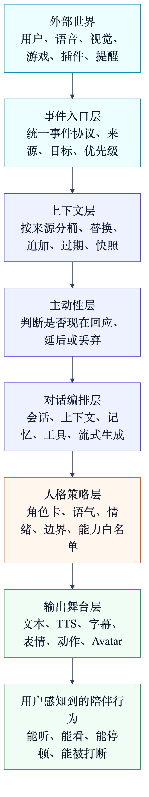
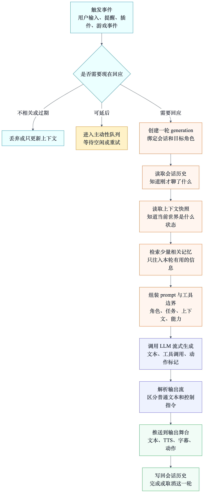
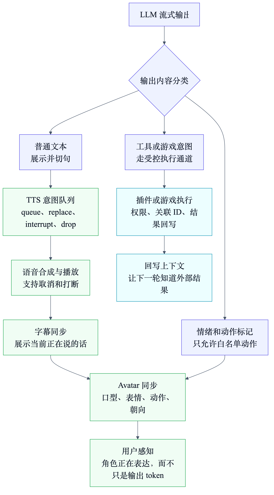

# AI 陪伴系统架构设计：从事件入口到人格与多模态输出

如果你想设计一个类似 AIRI 的 AI 陪伴系统，最容易掉进的坑是：一开始就把它想成一个聊天机器人。

聊天机器人通常只有一条主线：

```text
用户输入 -> LLM 回复 -> 展示文本
```

但 AI 陪伴不是这样。

它要听见用户说话，看到屏幕或游戏状态，接收插件事件，记住正在发生的事，判断什么时候主动回应，用稳定的人格说话，再把回答变成文本、语音、字幕、表情、动作、Avatar 甚至游戏操作。

所以，设计 AI 陪伴系统时，不应该先问：

**“我要不要做一个 Event Bus、一个 Orchestrator、一个 Persona LLM？”**

更应该先问：

**“这个系统会遇到哪些混乱？每一层到底在替我消化哪一种混乱？”**

本文会以 AIRI 的实现思路作为参考，但重点不是讲某个文件怎么写，而是抽出一套可以复用的架构设计路线。

## 本章速览

AI 陪伴系统的核心不是一个单独的 LLM，而是一条从“外部世界”到“可感知陪伴行为”的转换链。



这条链可以先记成六层：

1. **事件入口层**：把用户、语音、视觉、游戏、插件、提醒统一成事件。
2. **上下文层**：把杂乱事件整理成 LLM 能读懂的当前世界状态。
3. **对话编排层**：决定这一轮是否回答、怎么回答、带哪些上下文和工具。
4. **人格策略层**：保证角色稳定、语气一致、边界清楚。
5. **记忆层**：区分短期会话、当前上下文和长期记忆，避免遗忘或乱记。
6. **输出舞台层**：把文本变成语音、字幕、表情、动作和 Avatar 行为。

如果把用户最初给出的结构写成设计语言，它大体是对的：

```text
事件总线 Event Bus
  -> 对话编排 Dialogue Orchestrator
    -> 人格核心 Persona
      -> 输出层
```

但真正落地时，建议不要把它做成一条单体同步流水线。更稳的做法是：把每一层设计成一种“问题消化器”。

## 一、先从问题开始：AI 陪伴为什么比聊天复杂

普通聊天系统只需要处理一句话。

AI 陪伴系统要处理的是一个持续变化的场景。

假设用户正在一边玩游戏，一边和桌面上的 AI 角色说话：

```text
用户说：“刚才那个任务我是不是忘了？”
游戏里刚好出现新事件
视觉模块识别到屏幕状态变化
提醒系统发现一个待办到期
AI 正在播放上一句话的语音
用户又打断说：“等等，先别说这个”
```

这时系统要回答的不是“这句话怎么回”这么简单，而是同时解决几个问题：

| 真实问题 | 如果不设计专门层，会发生什么 |
| --- | --- |
| 输入来源很多 | 聊天、语音、视觉、游戏、插件互相直接调用，很快耦合成一团。 |
| 输入到达时间不同 | 刚才发生的事件、当前屏幕状态、长期偏好混在 prompt 里，LLM 不知道轻重。 |
| 用户会打断 | TTS 还在播，新的输入已经来了，旧回答不能继续不管不顾地播完。 |
| 角色要稳定 | 每一轮都重新“扮演”，容易语气漂移、边界漂移、情绪不连续。 |
| 输出不只是文本 | 语音、字幕、表情、动作和 Avatar 嘴型需要同步。 |
| AI 可以主动 | 提醒、游戏事件、外部模块通知，都可能要求角色主动说话。 |

所以，AI 陪伴架构的核心目标不是“把 LLM 接进来”，而是：

**把一个持续变化、来源复杂、需要被角色化表达的世界，整理成可控的一轮轮陪伴行为。**

下面每一层，都是为了解决这个目标里的一个具体问题。

## 二、事件入口层：先把世界接进来，但不要让模块互相乱叫

很多人会把第一层叫做 Event Bus。

这个理解有用，但容易误导。因为你真正需要的，不一定是一个巨大的中央事件总线，而是一套清楚的事件协议。

### 1. 这一层解决什么问题

AI 陪伴系统的输入来源通常不止聊天框：

- 用户文字输入
- 语音识别结果
- 桌面或浏览器状态
- 游戏状态
- 插件事件
- 定时提醒
- 视觉识别结果
- 外部工具回调

如果每个输入源都直接调用聊天模块，系统很快会变成这样：

```text
语音模块调用聊天
游戏模块调用聊天
视觉模块调用聊天
提醒模块调用聊天
插件模块调用聊天
聊天模块又反过来调用插件和游戏
```

这会带来三个麻烦：

1. 新增输入源很痛苦，因为每个模块都要知道聊天模块的细节。
2. 很难做权限、节流、去重、优先级和目标路由。
3. 很难知道一个回应到底是被谁触发的。

事件入口层要解决的就是这个问题：

**让外部世界先说同一种“事件语言”，再由系统决定谁该处理。**

### 2. 这一层应该怎么设计

一个实用的事件不应该只有 `type` 和 `payload`，还应该带上和调度有关的元信息：

| 字段 | 设计目的 |
| --- | --- |
| `type` | 表示事件类型，例如用户输入、上下文更新、工具回调、角色提醒。 |
| `source` | 表示来源，例如语音、游戏、插件、视觉、桌面。 |
| `target` | 表示目标，例如发给角色、发给工具、发给某个场景。 |
| `priority` | 表示紧急程度，例如普通、重要、立即、可丢弃。 |
| `timestamp` | 表示事件发生时间，用于排序和过期判断。 |
| `sessionId` | 表示属于哪段会话，避免跨会话串线。 |
| `correlationId` | 表示和哪个请求或工具调用相关，方便追踪闭环。 |
| `delivery` | 表示广播、单消费者、消费者组或指定目标。 |

这里最关键的是：事件层不要直接替 LLM 做决定。

它只负责回答这些问题：

- 这是什么事件？
- 从哪里来？
- 应该送到哪里？
- 是否还有效？
- 是否可以丢弃、合并、替换或延后？

### 3. 为什么不建议一开始就做“万能中央总线”

AI 陪伴里确实需要优先级、打断、去重和节流，但它们不一定适合放在一个全局队列里。

因为不同事件的“优先级”含义不一样：

- 用户打断语音，应该立刻影响输出层。
- 当前屏幕状态更新，可能只需要替换旧状态。
- 游戏事件，可能要先进场景上下文，不一定马上说话。
- 定时提醒，可能需要等角色空闲再说。
- 工具回调，需要回到原来的请求链路里。

所以更好的设计是：

**事件层提供统一协议，各业务层保留局部调度权。**

也就是说，事件入口层负责“让世界有序进入系统”；真正的打断、排队、合并、过期判断，应该放在最懂语义的那一层。

## 三、上下文层：把事件整理成“当前世界”，不要全塞进 prompt

事件进来以后，不能直接一股脑塞给 LLM。

因为 LLM 需要的不是事件日志，而是“此刻我应该知道什么”。

这就是上下文层出现的原因。

### 1. 这一层解决什么问题

多输入系统最常见的问题是 prompt 污染。

比如你把下面这些东西都直接拼进 prompt：

```text
用户刚说的话
一分钟前的视觉识别
十分钟前的游戏状态
昨天的用户偏好
刚刚失败的工具回调
已经过期的提醒
旧窗口里的屏幕状态
```

LLM 看起来知道很多，实际会更混乱：

- 它不知道哪个状态是最新的。
- 它不知道哪些信息只是背景，哪些应该影响当前回答。
- 它可能把旧状态当成当前事实。
- 它可能被无关事件带偏。

上下文层要解决的是：

**把杂乱事件变成结构化、分来源、可替换、可过期的上下文快照。**

### 2. 上下文不是消息历史

这是设计 AI 陪伴时非常重要的一点。

消息历史回答的是：

**“我们刚才聊了什么？”**

上下文回答的是：

**“现在这个世界是什么状态？”**

长期记忆回答的是：

**“关于用户和角色，有哪些长期稳定的信息值得记住？”**

这三者不要混在一个列表里。

| 类型 | 例子 | 更新方式 |
| --- | --- | --- |
| 消息历史 | 用户和 AI 的对话轮次 | 追加为主 |
| 当前上下文 | 当前屏幕、当前游戏状态、当前任务 | 替换或带 TTL |
| 长期记忆 | 用户偏好、关系事实、稳定设定 | 检索后选择注入 |

### 3. 上下文层的核心策略：replace 与 append

上下文更新通常只有两类。

第一类是“当前状态”：

```text
当前屏幕内容
当前游戏位置
当前音乐播放状态
当前用户正在看的网页
```

这类信息应该替换旧值。因为旧的当前状态已经不是当前状态。

第二类是“事件记录”：

```text
刚才收到一个提醒
用户刚完成一个任务
工具返回一个结果
游戏里发生一次战斗
```

这类信息可以追加，但要有数量上限、时间上限或摘要策略。

所以一个好的上下文层，至少要支持：

- 按来源分桶，避免视觉、游戏、提醒、聊天混在一起。
- 同源替换，避免旧屏幕状态污染当前判断。
- 事件追加，保留必要的短期过程。
- TTL 或过期判断，让旧上下文自动失效。
- 快照读取，在每轮对话前生成稳定视图。

这层设计好以后，对话编排层就不需要到处问“现在游戏是什么状态”“现在屏幕是什么状态”。它只需要读取一次上下文快照。

## 四、对话编排层：把“一轮回答”变成可控流程

对话编排层是 AI 陪伴系统最像传统 Agent Runtime 的地方。

但它的职责不是“调用 LLM”这么窄。

它要负责的是：

**把一次触发，变成一轮完整、可取消、可追踪、可输出的响应。**



### 1. 这一层解决什么问题

如果没有编排层，代码通常会散成这样：

```text
UI 里拼 prompt
语音模块里调用 LLM
工具模块里写消息历史
Avatar 模块里解析特殊指令
会话模块里处理取消
```

短期看能跑，长期会非常难维护。

因为一轮 AI 回复其实包含很多动作：

1. 判断这次触发是否需要回答。
2. 找到目标角色和目标会话。
3. 读取消息历史。
4. 读取上下文快照。
5. 选择要注入的长期记忆。
6. 组装 system prompt、用户输入、附件和工具定义。
7. 调用 LLM 流式生成。
8. 处理普通文本、工具调用和特殊控制 token。
9. 把 token 推给输出层。
10. 在结束后写回会话历史。
11. 如果中途被打断，要取消旧生成并清理输出状态。

这些动作需要一个明确的主人。这个主人就是对话编排层。

### 2. “要不要回答”不是一句 if

AI 陪伴里有两种触发：

第一种是用户明确输入：

```text
用户说话 / 打字 -> 默认应该回答
```

第二种是系统或外部事件触发：

```text
提醒到期
游戏事件发生
视觉模块发现异常
插件建议角色主动说一句
```

第二种不能默认全部回答，否则 AI 会变成一直插话的角色。

所以建议把“要不要回答”设计成一套主动性策略：

| 判断项 | 设计问题 |
| --- | --- |
| urgency | 这个事件是否必须立即处理？ |
| freshness | 事件是否已经过期？ |
| userState | 用户是否正在输入、说话、忙碌或刚打断？ |
| channelState | TTS、字幕、Avatar 当前是否空闲？ |
| cooldown | 最近是否已经主动说过太多话？ |
| relevance | 这个事件和当前会话是否相关？ |

这能避免一个常见坏体验：

**系统技术上很聪明，但产品上很吵。**

### 3. 编排层要有 generation 概念

AI 陪伴必须处理打断。

当用户说“等等”时，系统不能只停止 TTS，还要知道：

- 当前 LLM 生成是否还有效？
- 已经流出来但没播完的句子是否要丢弃？
- 工具调用是否还应该继续？
- 最后是否要把这轮 assistant message 写进历史？

所以编排层最好给每一轮生成一个 `generationId`。

所有流式 token、工具结果、输出事件都带着这个 ID。只要用户触发新一轮，旧 generation 就可以被标记为过期。

这样可以解决一个很烦的问题：

**旧回复的尾巴，不会在新对话里继续冒出来。**

### 4. 编排层不要顺手吞掉所有复杂度

对话编排层应该是交通枢纽，不应该变成超级上帝对象。

它应该拥有这类责任：

- 一轮响应的生命周期。
- prompt 组装顺序。
- 上下文和记忆注入位置。
- LLM stream 与工具调用的主循环。
- 取消、重试、写回会话的边界。

但它不应该直接实现：

- TTS 播放细节。
- Avatar 动作细节。
- 长期记忆存储细节。
- 游戏插件内部逻辑。
- 每个输入源的接入逻辑。

一个简单判断标准是：

**如果某段逻辑离“这一轮回答如何成立”很近，放编排层；如果它离某个外部能力更近，放对应能力层。**

## 五、人格策略层：人格不是另一个 LLM，而是一组稳定约束

很多设计图会写一个 Persona LLM。

这个名字可以帮助理解，但落地时容易误导。

因为人格通常不是一个独立模型，而是一组跨层约束：

- 角色设定
- 说话风格
- 情绪状态
- 行为边界
- 安全策略
- 记忆注入
- 可执行动作范围

### 1. 这一层解决什么问题

AI 陪伴最怕的不是“回答错一个知识点”，而是角色不稳定。

比如：

- 今天很亲近，明天突然像客服。
- 刚说过的关系设定下一轮忘了。
- 情绪状态和语气对不上。
- 角色说自己能做某件事，但工具层根本没有这个能力。
- 为了迎合用户，突破了原本的安全边界。

人格策略层解决的是：

**让 LLM 的每次输出，都像同一个角色在同一个世界里连续生活。**

### 2. 人格应该拆成几类配置

不要把所有人格都写进一个巨大 system prompt。

更好的拆法是：

| 模块 | 作用 |
| --- | --- |
| 角色卡 | 稳定身份、背景、称呼、关系设定。 |
| 说话风格 | 语气、句长、幽默感、是否主动追问。 |
| 情绪状态 | 当前心情、疲劳、兴奋、困惑等短期状态。 |
| 行为边界 | 什么不能说、不能做、必须拒绝或转向。 |
| 能力边界 | 当前角色实际能调用哪些工具或动作。 |
| 关系记忆 | 用户偏好、共同经历、长期事实。 |

这样做的好处是：不同信息有不同更新频率。

角色卡可能很少变；情绪状态可能每几分钟变；能力边界随插件启停变化；关系记忆需要检索后注入。

如果全部混在一段 prompt 里，后面会很难维护。

### 3. 人格层要和输出层约定动作语言

AI 陪伴的角色感不只来自文字。

它还来自：

- 什么时候停顿。
- 什么时候笑。
- 什么时候摇头。
- 什么时候压低声音。
- 什么时候看向用户。
- 什么时候触发某个游戏动作。

所以人格层和输出层之间最好有一套受控的动作语言。

例如：

```text
普通文本：直接说出来
情绪标记：影响表情和语气
动作标记：驱动 Avatar 动作
延迟标记：制造停顿
工具标记：请求外部能力
```

但这套动作语言必须是白名单式的。

LLM 可以“建议动作”，不能随便执行任意代码或任意桌面操作。否则人格层会和安全边界冲突。

## 六、记忆层：不要把所有“记住”都交给历史消息

AI 陪伴需要记忆，但记忆是最容易过度设计的地方。

一开始你可能会想：

**把所有历史都塞给模型不就好了？**

这很快会遇到三个问题：

1. 上下文窗口不够。
2. 很多旧信息其实已经不重要。
3. LLM 会把临时信息误当成长期事实。

### 1. 三种记忆要分开

建议至少分成三类：

| 记忆类型 | 作用 | 例子 |
| --- | --- | --- |
| 会话记忆 | 保持当前对话连续 | 刚才用户问过什么、AI 回了什么。 |
| 工作记忆 | 描述当前场景状态 | 当前屏幕、游戏状态、正在做的任务。 |
| 长期记忆 | 保留稳定关系事实 | 用户偏好、长期目标、共同经历。 |

这三类的生命周期完全不同。

会话记忆可以随 session 增长后摘要；工作记忆应该快速替换；长期记忆要谨慎写入和按需检索。

### 2. 长期记忆不要每轮都全量注入

长期记忆的正确姿势通常是：

```text
当前输入 + 当前上下文
  -> 生成检索查询
  -> 找到相关记忆
  -> 过滤不相关或不安全内容
  -> 只注入少量高相关记忆
```

这样可以解决两个问题：

- 角色不会忘记关键关系。
- 角色也不会每句话都重复旧设定。

记忆层最重要的不是“存得多”，而是“取出来时刚好有用”。

## 七、输出舞台层：AI 陪伴的体验不在 token，而在演出

很多 AI 应用生成完文本就结束了。

AI 陪伴不行。

用户真正感受到的不是一串 token，而是一个角色在说话、停顿、看你、做动作、被打断、继续回应。



### 1. 这一层解决什么问题

输出层要把 LLM 的流式结果变成多模态体验：

- 文本要流式显示。
- 句子要切给 TTS。
- TTS 要排队、取消、打断。
- 字幕要和语音同步。
- Avatar 嘴型要跟音频同步。
- 表情动作要和语义同步。
- 工具或游戏命令要走安全通道执行。

这层如果设计不好，模型回答再好，体验也会很别扭。

典型问题包括：

- 字幕已经显示，语音还没开始。
- 用户打断后，旧语音继续播。
- Avatar 表情和说话内容不一致。
- LLM 输出了动作指令，但前端无法解释。
- 工具调用和文本输出顺序乱掉。

### 2. 输出层要有自己的队列和打断策略

输出层的打断和对话编排层的取消不是一回事。

编排层取消的是“这一轮生成是否继续有效”。

输出层取消的是“已经生成出来的内容是否继续演出”。

例如用户打断时，通常要同时做几件事：

```text
停止当前 TTS
清空未播放句子
隐藏或更新字幕
停止当前动作或切换到倾听动作
标记旧 generation 的 token 不再进入输出
```

所以输出层需要自己的 intent queue。

不同输出意图可以有不同策略：

| 策略 | 适合场景 |
| --- | --- |
| queue | 普通句子排队播放。 |
| replace | 新状态替换旧状态，例如表情或字幕。 |
| interrupt | 用户打断、紧急提醒、高优先级动作。 |
| drop | 过期输出直接丢弃。 |

这也是为什么优先级不应该只放在全局事件总线里。语音播放的优先级、工具执行的优先级、主动提醒的优先级，语义都不同。

### 3. 输出层要反向影响上游

AI 陪伴不是单向流水线。

输出层的状态应该能影响对话决策：

- 角色正在说话时，新的主动提醒是否延后？
- 用户刚刚打断时，下一轮是否要先确认？
- TTS 失败时，是否只显示文本？
- Avatar 模型未加载时，动作 token 是否降级？

如果输出层只是被动消费者，系统就会缺少“现场感”。

更好的设计是：输出层把自己的可用性、忙碌状态、失败状态回写给上下文或编排层。

## 八、主动性层：陪伴不是只等用户输入

如果系统只能回答用户输入，它更像助手。

如果系统能在合适时机主动出现，它才开始像陪伴。

但主动性也是最危险的能力之一，因为它很容易变成打扰。

### 1. 主动性解决什么问题

AI 陪伴需要处理这些场景：

- 到点提醒用户休息。
- 游戏里发生重要事件，角色提醒一句。
- 用户长时间沉默，角色轻轻关心。
- 外部插件发现任务完成，角色汇报结果。
- 角色根据关系记忆主动提起一件事。

这些都不是用户刚刚发出的聊天请求，但它们又可能需要角色回应。

所以需要一层主动性调度，专门回答：

**这个事件值得角色现在打断用户吗？**

### 2. 主动性层的设计重点

建议至少考虑这些策略：

| 策略 | 解决的问题 |
| --- | --- |
| urgency | 区分立即、普通、可延后事件。 |
| cooldown | 防止角色频繁主动插话。 |
| relevance | 只处理和当前场景相关的提醒。 |
| user interrupt | 用户刚拒绝或打断后，降低主动性。 |
| retry | 重要事件未处理时可以稍后重试。 |
| expiration | 过期事件不再说。 |

主动性层不是为了让 AI 更“话多”，而是为了让它更懂时机。

## 九、把这些层放回一条设计链

现在可以重新看最开始那张四层图。

它是一个很好的直觉入口，但如果你真的要设计类似系统，可以把它扩展成下面这条链：

| 设计层 | 解决的问题 | 关键设计点 |
| --- | --- | --- |
| 事件入口层 | 多来源输入如何进入系统 | 事件协议、路由、来源、目标、优先级、关联 ID |
| 上下文层 | 杂乱事件如何变成当前世界 | source bucket、replace、append、TTL、snapshot |
| 主动性层 | 系统何时主动回应 | urgency、cooldown、relevance、过期、重试 |
| 对话编排层 | 一轮回答如何完整成立 | session、context、memory、prompt、tools、stream、cancel |
| 人格策略层 | 角色如何保持稳定 | 角色卡、风格、情绪、边界、能力白名单 |
| 记忆层 | 什么该短期保留，什么该长期记住 | 会话、工作记忆、长期记忆、检索注入 |
| 输出舞台层 | 回答如何变成陪伴体验 | 文本、TTS、字幕、表情、动作、Avatar、打断 |

这套架构的重点不是层数越多越好，而是每一层都要有明确的问题边界。

## 十、如果从零实现，建议按这个顺序做

如果你正在设计一个类似系统，不建议一开始就把所有层都做完整。

更稳的路线是分阶段演进。

### 阶段 1：先做最小闭环

目标：

```text
用户输入 -> 会话历史 -> LLM -> 流式文本输出
```

这一阶段只需要：

- session
- basic prompt
- stream response
- cancel generation
- simple UI output

先证明角色能稳定聊天。

### 阶段 2：加入上下文层

目标：

```text
用户输入 + 当前场景上下文 -> 更贴近现场的回答
```

这一阶段加入：

- context bucket
- replace / append
- snapshot
- TTL
- prompt injection order

先解决“它知道当前发生什么”。

### 阶段 3：加入输出舞台

目标：

```text
文本 -> 分句 TTS -> 字幕 -> Avatar 表情和动作
```

这一阶段加入：

- sentence segmentation
- TTS queue
- interrupt / replace
- subtitles
- emotion / motion token
- lip sync or avatar state

先解决“它像一个角色在表达”。

### 阶段 4：加入事件协议和插件

目标：

```text
语音 / 视觉 / 游戏 / 插件 -> 统一事件 -> 上下文或对话编排
```

这一阶段加入：

- event envelope
- source / target
- delivery mode
- correlation ID
- plugin permission boundary

先解决“外部世界可以安全接入”。

### 阶段 5：加入主动性和长期记忆

目标：

```text
角色不仅能回答，还能在合适时机主动出现
```

这一阶段加入：

- urgency
- cooldown
- scheduled notify
- long-term memory retrieval
- memory write policy
- safety review

最后再解决“它像陪伴，而不是只像工具”。

## 十一、AIRI 给这套设计的启发

AIRI 值得参考的地方，不是它刚好有某个叫法的模块，而是它的取舍方向：

1. **它没有把所有东西塞进 LLM 调用函数里。**事件、上下文、会话、输出、角色主动性是分开的。
2. **它把输出层做得很重。**语音、字幕、表情、动作和 Avatar 不是附属品，而是陪伴体验的一部分。
3. **它的人格不是单独一个 Persona Core。**人格来自角色卡、prompt、上下文、动作协议和输出层共同约束。
4. **它的优先级和打断是局部语义。**聊天生成、语音播放、主动提醒、插件事件各自有不同的调度逻辑。
5. **它把外部模块看成事件来源。**游戏、插件、视觉、提醒不会直接揉进聊天函数，而是先进入协议和上下文。

如果你要设计类似系统，可以把 AIRI 当成一个提醒：

**AI 陪伴不是“LLM 外面套一个 Avatar”，而是一个持续感知、整理上下文、维持人格、控制节奏、完成多模态演出的运行时。**

## 十二、最后用一句话记住

设计 AI 陪伴系统时，不要从“我要几个模块”开始，而要从“系统会遇到哪些混乱”开始：

**事件入口解决多来源混乱，上下文层解决信息混乱，对话编排解决一轮响应的流程混乱，人格策略解决角色稳定性混乱，记忆层解决时间尺度混乱，输出舞台解决多模态演出混乱。**

这套问题拆清楚以后，具体要不要叫 Event Bus、Dialogue Orchestrator、Persona Core，反而只是命名问题。
