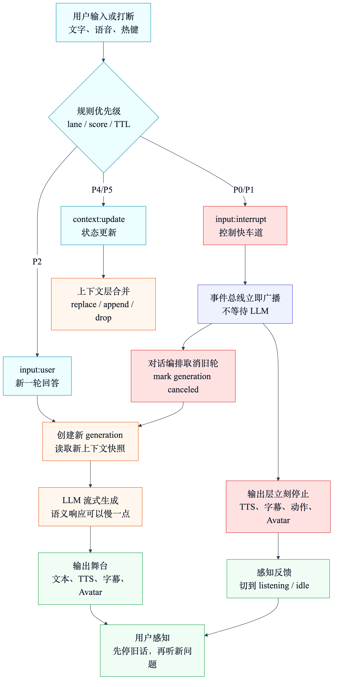
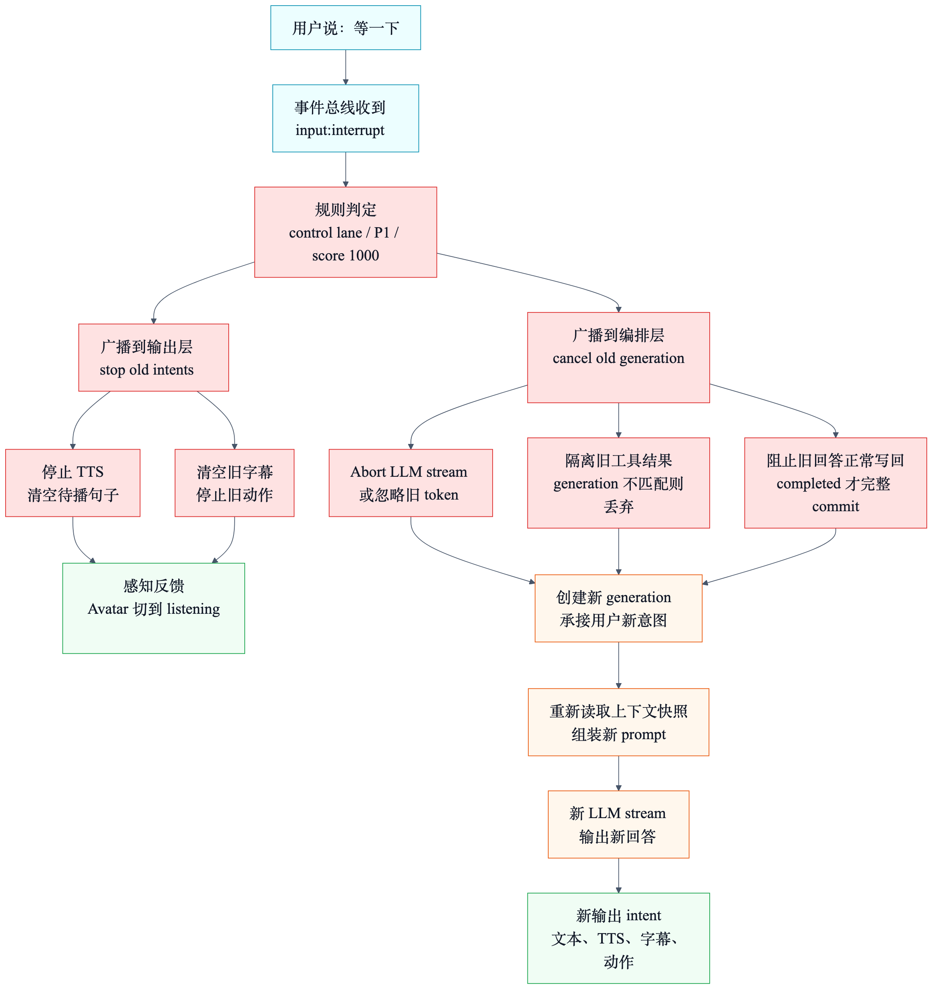

# AI 陪伴系统如何快速响应与对话打断：事件总线和对话编排层设计

如果要做一个类似 AIRI 的 AI 陪伴系统，我认为第二个必须想清楚的问题不是“怎么让它更聪明”，而是：

**用户说话之后，它能不能立刻有反应？**

更进一步：

**当 AI 正在说话时，用户能不能打断它？**

普通聊天机器人可以慢一点。用户发一句话，界面转圈，几秒后出现一段回答，体验还能接受。

但 AI 陪伴不一样。

它像一个在场的角色。只要它有语音、字幕、表情、动作、Avatar，用户就会自然期待它像一个“正在听你说话的对象”：

```text
它正在说话时，我说“等一下”，它应该停。
我刚说完一句话，它应该知道我已经说完了。
我打断旧话题后，它不应该继续把旧回答播完。
工具结果晚到了，它不应该突然插进新的对话。
```

所以，这一章重点不讲“事件总线和对话编排层有哪些模块”，而是讲它们如何共同解决两个体验问题：

1. **快速响应**
2. **对话打断**

先给结论：

**快响应不是让 LLM 变快，而是把“控制链路”和“生成链路”拆开。**

**对话打断不是只停 TTS，而是同时取消旧 generation、停止输出、丢弃旧 token、隔离旧工具结果，并开启新的有效轮次。**

## 本章速览

AI 陪伴系统要快，不能把所有事情都排在 LLM 后面。



用户打断时，也不能只停一个播放器。打断是一条跨事件总线、对话编排层和输出层的控制链路。



这两张图背后的核心思路是：

- **输入先进入事件总线，但打断事件要走快车道。**
- **事件总线只做路由、优先级、过期、去重和广播，不等待 LLM。**
- **实时优先级应该由程序策略表判断，LLM 不能挡在打断链路前面。**
- **对话编排层用 `generationId` 管理每一轮回答，旧轮次可以被取消。**
- **输出层用 `intentId` 或输出队列管理 TTS、字幕、动作和 Avatar，旧输出可以被停止。**
- **LLM 流式 token、工具结果、字幕、TTS 都必须带上本轮身份，否则旧结果会污染新对话。**

## 一、为什么 AI 陪伴的“快响应”比聊天机器人更难

先看一个场景。

```text
AI 正在说：“你刚才忘记领取任务奖励了，我建议你先打开……”
用户突然说：“等一下，不是这个，我问的是明天的提醒。”
```

如果系统只是普通聊天机器人，它可能会这样：

```text
继续播完旧语音
继续流式生成旧回答
等旧回答完成后，再处理用户新输入
```

这在聊天框里只是慢。

但在陪伴系统里会非常割裂，因为用户已经明确打断了，角色却还在自顾自说旧话。

真正的 AI 陪伴至少有四条并发链路：

| 链路 | 正在做什么 | 打断时的问题 |
| --- | --- | --- |
| LLM 生成链路 | 模型正在流式输出 token | 旧 token 可能继续冒出来。 |
| TTS 链路 | 旧文本正在合成或播放 | 用户听到的还是旧话题。 |
| 字幕链路 | 屏幕还显示旧句子 | 视觉反馈和用户意图不一致。 |
| 工具链路 | 旧工具调用可能晚返回 | 旧结果可能插进新对话。 |

所以快响应的第一原则是：

**用户打断时，系统要先停止旧行为，再考虑新回答。**

这句话很关键。

很多系统之所以慢，不是因为模型慢，而是因为所有事情都排在“等模型生成完”之后。

AI 陪伴不能这样设计。

## 二、快响应要拆成三种速度

“快速响应”不是一个动作，而是三种不同速度的响应。

### 1. 控制响应：立刻停下来

用户说“等等”“停一下”“不是这个”的时候，系统最先要做的不是回答，而是停止旧输出。

这一步应该尽量不依赖 LLM。

它要做的是：

```text
收到 interrupt 事件
停止当前 TTS
清空未播放句子
停止或切换 Avatar 动作
隐藏或标记旧字幕
标记旧 generation 已取消
禁止旧 token 继续进入输出层
```

这叫控制响应。

它解决的是：

**让用户感觉系统听见了我。**

### 2. 感知响应：给用户一个“我在听”的反馈

停止旧输出以后，系统可以给一个很轻的反馈。

例如：

```text
字幕变成“……”
Avatar 切到倾听姿态
输入框显示正在听
语音播放停止，角色看向用户
```

这一步也不应该等待 LLM。

它解决的是：

**让用户知道系统已经切换到新一轮交互。**

注意，这里不一定要让 AI 立刻说“好的”。很多时候，停下来本身就是最好的反馈。否则每次打断都回一句“好的”，反而会吵。

### 3. 语义响应：再生成新的回答

最后才是 LLM 生成新回答。

这一步可以慢一点，但要尽早流式输出：

```text
创建新 generation
读取上下文快照
组装 prompt
调用 LLM stream
首句出来后进入字幕和 TTS
```

语义响应解决的是：

**系统真正理解用户新问题，并给出新回答。**

所以快响应不是一条线，而是三层：

```text
控制响应：先停旧行为
感知响应：让用户知道系统在听
语义响应：再生成新回答
```

这三层拆开以后，系统体验会比“等 LLM 生成完再一起处理”好很多。

## 三、事件总线如何支持快速响应

事件总线在这里的核心职责不是“把所有事件排队”，而是：

**把打断事件、普通输入、上下文更新、工具结果分到不同处理路径。**

### 1. 打断事件要有快车道

用户打断不应该排在普通事件后面。

例如下面这些事件同时发生：

```text
视觉模块更新屏幕状态
游戏模块上报位置
提醒系统触发 notify
工具结果返回
用户说“等一下”
```

这时 `interrupt` 应该优先进入控制链路。

一个可用的事件分类是：

| 事件类型 | 处理路径 | 是否等待 LLM |
| --- | --- | --- |
| `input:interrupt` | 控制快车道：停止输出、取消旧 generation | 不等待 |
| `input:user` | 对话路径：进入新一轮 generation | 需要 |
| `context:update` | 上下文路径：更新当前世界状态 | 不等待 |
| `notify` | 主动性路径：判断是否该插话 | 不一定 |
| `tool:result` | 回填路径：回到对应 generation | 不一定 |
| `output:state` | 状态路径：让上游知道输出层忙闲 | 不等待 |

这里最重要的是：

**打断事件不是普通聊天输入。**

它既是一个输入，也是一个控制命令。

所以它应该同时通知两个地方：

```text
对话编排层：取消旧 generation
输出层：停止当前 TTS / 字幕 / 动作
```

### 2. 事件总线不要做重活

为了快，事件总线不能在入口做太多重活。

不应该在事件总线里做：

- 长期记忆检索
- prompt 组装
- LLM 调用
- TTS 合成
- 复杂人格判断

事件总线应该做轻量但关键的事情：

- 校验事件形状。
- 补齐 `eventId`、`createdAt`。
- 根据 `sessionId`、`generationId`、`correlationId` 路由。
- 判断事件是否过期。
- 按 `dedupeKey` 合并重复事件。
- 把 `input:interrupt` 投给控制快车道。

这样事件总线才能成为“快速入口”，而不是新的瓶颈。

### 3. 事件信封要带上打断需要的信息

如果要支持打断，事件信封至少要有这些字段：

```text
eventId
type
source
sessionId
generationId
targetGenerationId
correlationId
lane
priorityClass
priorityScore
createdAt
expiresAt
coalesceKey
preemptible
interruptReason
policyReason
payload
```

其中最关键的是：

| 字段 | 为什么重要 |
| --- | --- |
| `sessionId` | 知道打断发生在哪个会话。 |
| `generationId` | 知道事件属于哪一轮。 |
| `targetGenerationId` | 明确要取消哪一轮旧回答。 |
| `correlationId` | 让工具结果能回到原请求链路。 |
| `lane` | 决定事件进入控制、对话、上下文还是后台队列。 |
| `priorityClass` | 表示事件的大类优先级，例如 `critical`、`high`、`normal`、`low`。 |
| `priorityScore` | 在同一队列里排序，避免只有粗粒度等级不够用。 |
| `expiresAt` | 防止旧打断事件晚到后误伤新一轮。 |
| `coalesceKey` | 让屏幕状态、游戏坐标这类事件可以被新事件覆盖。 |
| `preemptible` | 表示这个事件是否可以抢占正在处理的低优先级任务。 |
| `interruptReason` | 区分用户打断、系统超时、切换话题、输出失败。 |
| `policyReason` | 记录为什么被判成这个优先级，方便调试体验问题。 |

如果没有这些字段，系统只能靠全局变量判断“当前谁在生成”，很容易串线。

### 4. 优先级应该怎么判：程序先判，LLM 后判

这里最容易误解的一点是：

**事件优先级不应该主要交给 LLM 决定。**

原因很现实。

用户说“停一下”的时候，系统没有时间先把事件发给 LLM，让 LLM 思考“这是不是一个打断”。如果这样做，打断链路会变成：

```text
用户说停
-> 等 ASR 结束
-> 等 LLM 判断意图
-> 再停 TTS
```

这就已经慢了。

更合理的设计是两段式：

```text
程序策略表：负责实时抢占和路由
LLM：负责后续语义理解和表达方式
```

也就是说：

| 决策 | 应该由谁决定 | 为什么 |
| --- | --- | --- |
| 用户明确说“停”“等一下”时要不要立刻停 | 程序规则 | 必须稳定、低延迟、可测试。 |
| 当前事件进入控制队列还是普通对话队列 | 程序规则 | 这是调度问题，不是创作问题。 |
| 屏幕状态更新是否可以合并 | 程序规则 | 这是数据新鲜度策略。 |
| 工具结果晚到后是否还能进入当前轮 | 程序规则 | 由 `generationId` 和状态机决定。 |
| 用户打断后，新回答该怎么措辞 | LLM | 这是语义和人格表达问题。 |
| 主动提醒要不要在用户忙时说出来 | 程序先过滤，LLM 再判断 | 先用规则避免打扰，再让 LLM 做语义取舍。 |

可以把事件优先级拆成三层，而不是只放一个数字：

```text
lane：先决定走哪条路
priorityClass：再决定大优先级
priorityScore：最后在同类事件里排序
```

一个比较实用的分层是：

| lane | 典型事件 | 处理策略 |
| --- | --- | --- |
| `control` | 用户打断、紧急停止、系统安全停止 | 立即抢占，不等待 LLM。 |
| `dialogue` | 用户新问题、新指令 | 尽快创建新 generation。 |
| `activeGeneration` | 当前 generation 的 token、工具结果 | 只在 generation 仍有效时继续。 |
| `notification` | 主动提醒、日程提示、游戏建议 | 需要看输出层忙闲，必要时延后。 |
| `context` | 视觉状态、桌面状态、游戏坐标 | 合并最新值，不抢占用户输入。 |
| `background` | 长期记忆写入、分析日志、遥测 | 可延迟，可丢弃，可后台处理。 |

优先级可以用程序策略表判断，例如：

```text
input:interrupt                  -> lane control, priorityScore 1000
input:user while output speaking -> lane control, priorityScore 930, interruptHint true
input:user                       -> lane dialogue, priorityScore 800
notify:urgent                    -> lane notification, priorityScore 650
tool:result for active generation -> lane activeGeneration, priorityScore 500
context:update                   -> lane context, priorityScore 100
memory:write                     -> lane background, priorityScore 20
```

这里有几个细节。

第一，`input:interrupt` 不一定只来自一个按钮。

它可以来自：

```text
用户按下停止键
用户在 AI 说话时开始说话
ASR 识别到“停一下”“等等”“不是这个”
用户发送的新消息命中了 barge-in 规则
系统检测到输出失败，需要强制停止
```

第二，程序规则可以做很轻的文本判断，但它不应该变成复杂推理。

例如这些可以作为快路径规则：

```text
包含“停一下”“等一下”“先别说”“不是这个”
并且当前 output.isSpeaking = true
并且 targetGenerationId = activeGenerationId
```

命中后，先把事件提升为 `input:interrupt`，立刻停旧输出。

后面再让 LLM 判断用户真正想表达的是：

```text
换一个话题
要求重新解释
嫌回答太复杂
只是想暂停
```

第三，LLM 可以参与“慢速仲裁”，但不能参与“实时抢占”。

比如主动提醒可以这样处理：

```text
程序规则先判断：
  用户正在说话吗？
  AI 正在播报吗？
  这个提醒是否过期？
  这个提醒是否达到紧急等级？

如果规则判断可以考虑插话：
  再交给 LLM 判断怎么说、说多长、是否委婉延后
```

这样设计的好处是：

**程序保证系统不会慢半拍，LLM 保证角色说得像人。**

### 5. 上下文更新要合并，不要抢占打断

视觉、游戏、桌面状态可能非常频繁。

如果这些状态更新都和用户输入抢同一个队列，就会出现：

```text
用户说“等一下”
但前面还有 30 条屏幕状态更新正在排队
```

这就是不合理的。

状态更新应该有自己的合并策略：

- 当前屏幕状态：同源只保留最新。
- 当前游戏坐标：短时间内合并。
- 当前播放状态：新状态替换旧状态。
- 低优先级观察记录：系统忙时可以丢弃。

这样可以保证：

**上下文尽量新，但不抢用户打断的路。**

## 四、对话编排层如何做到“可打断”

事件总线只是把打断送到正确地方。

真正让对话可打断的是对话编排层。

对话编排层必须承认一个事实：

**一轮回答不是一个函数调用，而是一段生命周期。**

它会经历：

```text
准备上下文
调用模型
接收 token
触发工具
等待工具结果
推送输出
写回会话历史
```

用户可能在任何阶段打断。

所以你不能只写：

```text
await llm.chat(message)
```

你需要给每一轮回答一个身份。

### 1. 用 generationId 表示“一轮回答”

每次准备让 AI 回应，都创建一个新的 `generationId`。

这个 ID 要贯穿整条链路：

```text
LLM stream token
tool call
tool result
TTS intent
subtitle update
Avatar action
assistant message commit
```

这样系统才能判断：

```text
这个 token 是不是当前轮的？
这个工具结果是不是旧轮的？
这句 TTS 还能不能播？
这个 assistant message 能不能写回历史？
```

没有 `generationId`，你只能用“当前是否正在生成”这种布尔值。

布尔值挡不住这些情况：

```text
旧工具结果晚到了
旧 token 在新一轮后继续流出
旧 TTS intent 还在队列里
旧字幕事件晚于新字幕事件到达
```

### 2. 打断不是一个动作，而是一组动作

用户打断时，对话编排层至少要做五件事：

```text
1. 标记旧 generation 为 canceled
2. 通知 LLM provider 停止流式生成
3. 通知输出层停止旧 intent
4. 拒绝旧 generation 后续 token / tool result
5. 决定旧 assistant message 是否写回历史
```

这五件事缺一件，都会出问题。

只停 TTS，不取消 generation：

```text
旧模型还在继续生成，后续 token 可能又进入字幕或新 TTS。
```

只取消 generation，不停 TTS：

```text
模型停了，但已经排队的旧语音还在播。
```

只停输出，不处理工具结果：

```text
旧工具结果晚到后，可能继续触发旧回答或污染上下文。
```

只取消但照样写回历史：

```text
下一轮模型会看到一段用户其实没听完、也没接受的旧回答。
```

所以，对话打断必须是跨层协议。

### 3. 打断后要立刻进入“新轮次”

用户打断往往不是单纯说“停”，而是带着新意图：

```text
“等等，我不是问这个”
“先别说游戏，帮我看一下明天提醒”
“停一下，重新讲简单点”
```

这类输入既要取消旧 generation，又要启动新 generation。

一个可用流程是：

```text
收到 input:interrupt
  -> cancel old generation
  -> stop output intents
  -> create new generation
  -> 用用户打断文本作为新输入
  -> 读取新的上下文快照
  -> 开始新一轮 stream
```

注意：新一轮不应该复用旧 prompt。

因为用户已经改变了话题或约束。

### 4. 上下文快照要在新一轮开始时重新取

打断以后，系统应该重新取上下文快照。

原因很简单：

旧 generation 开始时的世界，可能已经不是现在的世界。

例如：

```text
旧轮次：AI 正在根据游戏任务回答。
用户打断：改问明天提醒。
新轮次：应该读取提醒上下文，而不是继续围绕游戏上下文。
```

所以对话编排层要保证：

**每一轮 generation 都有自己的上下文快照。**

旧轮次的快照不会偷偷流入新轮次。

### 5. 写回历史要区分 completed 和 interrupted

打断后的历史写回很容易被忽略。

不要简单地把旧 assistant message 完整写入历史。

因为用户可能根本没听完。

更好的策略是：

| 状态 | 写回策略 |
| --- | --- |
| 还没输出就被打断 | 不写回 assistant。 |
| 输出了一半被打断 | 写回短摘要，或标记 `interrupted`。 |
| 工具调用中被打断 | 工具结果晚到后只做状态记录，不直接继续说。 |
| 用户改了问题 | 新问题开启新 generation，旧回答不再影响语义。 |
| 系统超时取消 | 写入失败状态或不写入，避免假装回答完成。 |

会话历史不是日志垃圾桶。

它会影响下一轮模型理解，所以必须只写入对未来有帮助的内容。

## 五、输出层如何配合打断

这章重点是事件总线和对话编排，但对话打断离不开输出层。

因为用户真正感受到的“停没停”，不是看 generation 状态，而是看语音、字幕、动作有没有停。

### 1. 输出层也要有 intentId

对话编排层有 `generationId`。

输出层最好也有 `intentId`。

例如：

```text
ttsIntentId
subtitleIntentId
motionIntentId
```

每个输出 intent 都要知道自己来自哪个 generation。

这样用户打断时，输出层可以做：

```text
停止属于旧 generation 的 TTS
清空旧 generation 的待播句子
隐藏旧 generation 的字幕
停止旧 generation 的动作
切换到 listening / idle 状态
```

### 2. TTS 队列要支持 queue、replace、interrupt、drop

AI 陪伴的语音不能只有一个 FIFO 队列。

至少要支持四种策略：

| 策略 | 适合什么 |
| --- | --- |
| `queue` | 普通句子顺序播放。 |
| `replace` | 新状态替换旧字幕或旧表情。 |
| `interrupt` | 用户打断、紧急通知、系统停止。 |
| `drop` | 过期句子、旧 generation 片段。 |

没有 `interrupt`，用户永远要等旧语音播完。

没有 `drop`，旧 generation 的残余句子可能晚一点又被播出来。

### 3. 输出层状态要回写给上游

快速响应还需要输出层告诉上游自己当前状态：

```text
TTS 正在播放
TTS 已停止
字幕已清空
Avatar 正在 listening
输出队列为空
```

这些状态可以作为 `output:state` 事件回写。

主动性层看到输出层忙，就可以延后提醒。

对话编排层看到旧输出已停止，就可以更安心地开启新轮次。

这会让系统更像“会听人说话”的角色，而不是只会排队播放语音的播放器。

## 六、一个可落地的打断流程

把事件总线、对话编排层和输出层合起来，一个可落地的打断流程可以这样设计。

### 1. 用户说“等一下”

语音识别或文本输入模块产生：

```text
type: input:interrupt
source: voice
sessionId: s1
targetGenerationId: g17
lane: control
priorityClass: critical
priorityScore: 1000
preemptible: true
policyReason: user_interrupt_while_speaking
payload.text: "等一下，不是这个"
```

这条事件不要进入普通队列慢慢排。

它应该走控制快车道。

这里的优先级不是 LLM 判断出来的。

它应该由输入模块和事件总线的策略共同判定：

```text
当前 output.isSpeaking = true
用户输入包含“等一下”
事件目标是 activeGeneration g17
所以升级为 control lane
```

LLM 可以稍后判断“不是这个”到底是在纠正主题、纠正语气，还是要求重新解释，但它不应该决定要不要先停。

### 2. 事件总线广播给两个消费者

```text
input:interrupt
  -> orchestrator consumer
  -> output consumer
```

对话编排层负责取消旧 generation。

输出层负责停止当前演出。

这两个动作可以并行，不需要互相等待。

### 3. 对话编排层取消旧 generation

```text
mark g17 canceled
abort LLM stream for g17
ignore future token from g17
ignore or quarantine tool result for g17
prevent normal commit for g17
```

这里要特别注意工具结果。

如果旧工具调用已经发出，未必能真的取消外部执行。

但可以做到：

**工具结果回来以后，不再直接影响当前对话。**

这就是隔离。

### 4. 输出层停止旧 intent

```text
stop current audio node
clear pending TTS sentences from g17
clear subtitle from g17
stop motion from g17
switch avatar to listening
emit output:state idle/listening
```

用户感知到的“停了”，主要来自这一步。

### 5. 新建 generation 处理用户新意图

如果打断文本里带着新问题，就创建新轮次：

```text
create g18
snapshot context
assemble prompt with "等一下，不是这个"
stream new answer
emit new text / TTS / subtitle
```

这时旧的 g17 已经被隔离。

新回答不会和旧回答混在一起。

## 七、快速响应的设计检查表

你可以用这张表检查自己的设计。

| 检查项 | 如果没有，会出现什么问题 |
| --- | --- |
| 是否区分 `input:user` 和 `input:interrupt` | 打断会被当成普通聊天，排队等待。 |
| 优先级是否由程序策略表实时判定 | 系统会把调度问题交给 LLM，导致打断变慢且不稳定。 |
| 是否区分 `lane`、`priorityClass` 和 `priorityScore` | 一个数字很难同时表达抢占、排序、过期和合并策略。 |
| 事件总线是否有高优先级快车道 | 用户说“停”时还要等上下文更新处理完。 |
| 每轮是否有 `generationId` | 旧 token、旧工具结果、旧字幕会污染新轮次。 |
| 输出层是否有 `intentId` | 无法精准停止旧 TTS、字幕和动作。 |
| LLM stream 是否可取消或可忽略旧 token | 旧生成可能继续输出。 |
| 工具结果是否绑定 `generationId` / `correlationId` | 旧工具结果可能插进新对话。 |
| TTS 队列是否支持 `interrupt` 和 `drop` | 旧语音会继续播或晚点复活。 |
| 被打断的 assistant 是否有写回策略 | 半截回答会污染会话历史。 |
| 输出状态是否回写上游 | 主动提醒可能在角色忙时插话。 |
| 新 generation 是否重新取上下文快照 | 新问题可能继续使用旧世界状态。 |

这张表比“有没有事件总线”更重要。

因为用户感知到的不是架构名词，而是：

**我说停，它到底有没有停。**

## 八、常见错误设计

### 1. 只停 TTS，不停 LLM

这是最常见的半打断。

用户听起来停了，但模型还在后台生成，后续 token 可能继续进入字幕、历史或下一段 TTS。

正确做法是：

```text
停止输出 + 取消或废弃旧 generation
```

### 2. 只取消 LLM，不清空输出队列

这会导致旧语音继续播。

因为 TTS 队列里可能已经有几句话了，即使模型停了，播放器还会继续消费旧队列。

正确做法是：

```text
取消 generation + 清空旧 generation 的输出 intent
```

### 3. 工具结果不绑定 generation

工具可能很慢。

如果工具结果回来时不知道属于哪一轮，它就可能污染当前对话。

正确做法是：

```text
toolResult.generationId 必须匹配当前有效 generation
```

不匹配就丢弃、隔离或只写入低优先级日志。

### 4. 所有事件共用一个 FIFO 队列

如果视觉状态、游戏状态、提醒、打断都排在一个普通 FIFO 队列里，用户打断就可能被低优先级事件挡住。

正确做法是：

```text
打断快车道 + 状态合并 + 低优先级可丢弃
```

### 5. 打断后的历史写回太随意

被打断的回答不一定应该写进历史。

尤其是 AI 只说了一半时，如果完整写回，下一轮模型会以为用户已经听完并接受了这段回答。

正确做法是：

```text
completed 才完整写回
interrupted 只写摘要或标记状态
canceled before output 不写回
```

### 6. 让 LLM 决定实时优先级

LLM 很适合判断语义，但不适合站在事件入口决定实时优先级。

如果每个事件都先问 LLM：

```text
这个事件重要吗？
要不要打断当前回答？
要不要先播这个提醒？
```

系统会有三个问题：

| 问题 | 后果 |
| --- | --- |
| 延迟不可控 | 用户说“停”以后还要等模型判断。 |
| 结果不稳定 | 同一句话可能被模型判成不同优先级。 |
| 难以测试 | 很难用单元测试覆盖实时调度边界。 |

正确做法是：

```text
实时调度靠程序策略
语义表达靠 LLM
模糊事件可以让 LLM 复核，但不能阻塞 control lane
```

## 九、最后用一句话记住

如果这章只记一句话，就是：

**AI 陪伴的快速响应，靠的不是单纯加速 LLM，而是用程序策略判定实时优先级，让事件总线提供打断快车道，让对话编排层用 generation 管住一轮回答，让输出层能立刻停止旧语音、字幕和动作。**

能做到这套链路，系统才有资格谈“像一个能被打断、能重新听你说话的陪伴角色”。
