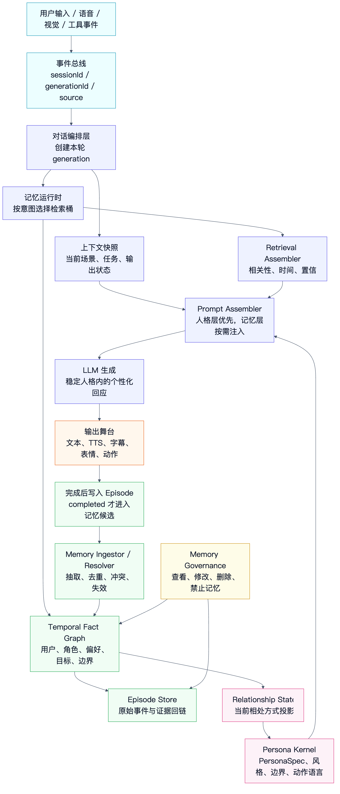
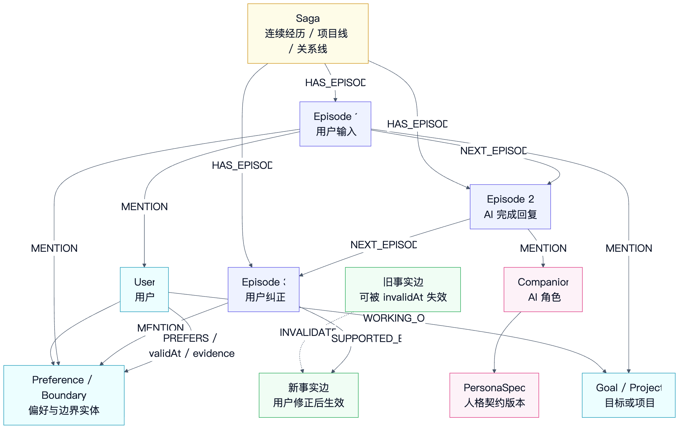
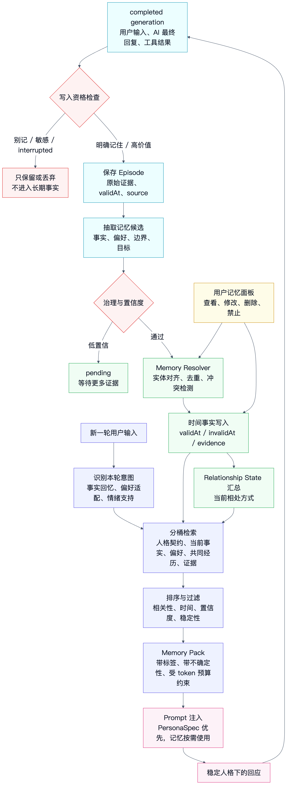

# AI 陪伴如何做人格稳定与记忆稳定：参考 Graphiti 的时间图谱记忆系统设计

如果要做 AI 陪伴，最难的不是让模型多说两句温柔的话。

真正难的是两件事：

1. **人格稳定**：它今天、明天、下个月都像同一个角色，而不是每轮对话临时扮演一次。
2. **记忆稳定**：它记住该记住的事，忘掉该忘掉的事，能处理“以前是真的，现在变了”的关系。

很多系统一开始会把这两个问题都塞进 prompt：

```text
你是一个温柔、可靠、陪伴型 AI。
请记住用户喜欢安静、喜欢晚上学习、不喜欢被催促。
请始终保持一致人格。
```

这能做 demo，但很难做长期陪伴。

因为人格和记忆不是同一类东西。

人格是系统对角色行为的稳定约束。记忆是系统对用户、关系和事件的可追溯事实管理。把它们混在一个 system prompt 里，短期看省事，长期一定会漂。

这一章参考 Graphiti 的设计逻辑，但不是介绍怎么调用 Graphiti API。Graphiti 真正值得借鉴的点是：

**它没有把记忆当成一段聊天摘要，而是把记忆拆成原始事件、实体、事实关系、时间有效性、证据来源和检索策略。**

AI 陪伴要稳定，也应该沿着这个方向设计。

## 本章速览

AI 陪伴的人格稳定和记忆稳定，应该分成两条链路：



第一条是人格链路：

```text
角色契约 -> 风格策略 -> 关系姿态 -> 输出行为 -> 安全边界
```

第二条是记忆链路：

```text
原始事件 -> 记忆候选 -> 时间事实 -> 证据回链 -> 检索注入 -> 用户修正
```

真正落地时，不要问“我要不要做一个长期记忆库”，而要问：

**这条信息从哪里来？现在还真实吗？谁确认过？应该在哪种场景被取出来？如果用户纠正了，旧事实如何失效？**

参考 Graphiti 后，我建议把 AI 陪伴记忆系统拆成七个核心模块：

| 模块 | 解决的问题 |
| --- | --- |
| `Persona Kernel` | 稳定角色契约、语气、边界和行为语言。 |
| `Interaction Episode Store` | 保存原始交互事件，作为所有记忆的证据来源。 |
| `Memory Ingestor` | 判断哪些事件值得进入长期记忆候选。 |
| `Temporal Fact Graph` | 用带时间窗的事实关系表示用户、角色、偏好、目标和共同经历。 |
| `Memory Resolver` | 去重、合并、冲突处理、旧事实失效。 |
| `Retrieval Assembler` | 每轮只取少量相关记忆，按用途注入 prompt。 |
| `Memory Governance` | 处理隐私、删除、用户修正、置信度和人工可见性。 |

这套设计的核心不是“存更多”，而是：

**让人格可版本化，让记忆可追溯，让事实可失效，让检索可解释。**

## 一、先分清：人格稳定不是记忆稳定

AI 陪伴里有一个常见误区：

**让 AI 记住很多用户信息，就等于人格稳定。**

不是。

记忆解决的是“它知道什么”。

人格解决的是“它如何表达、如何靠近、如何保持边界”。

一个 AI 就算记住了用户生日、喜欢的音乐、最近的压力来源，也可能每次表现得像不同的人：

```text
第一天：活泼热情，像游戏搭子。
第二天：严肃克制，像职业教练。
第三天：过度亲密，像恋爱模拟。
第四天：突然开始说教，像效率管理工具。
```

这不是记忆问题，而是人格约束没有稳定下来。

反过来，一个 AI 也可以人格很稳定，但记忆很糟糕：

```text
它始终温柔、耐心、幽默。
但它反复忘记用户已经换工作。
它仍然提起用户已经明确不想聊的话题。
它把一次玩笑当成长期偏好。
```

这不是人格问题，而是记忆写入、失效和检索没有治理。

所以架构上要先拆开：

| 稳定对象 | 主要问题 | 应该放在哪里 |
| --- | --- | --- |
| 人格稳定 | 角色是谁、怎么说话、怎么行动、边界在哪里 | `Persona Kernel` |
| 关系稳定 | 我和用户之间形成了什么相处模式 | `Relationship State` + 记忆检索 |
| 事实稳定 | 什么长期事实现在仍然成立 | `Temporal Fact Graph` |
| 场景稳定 | 当前正在发生什么 | `Context Snapshot` |
| 叙事稳定 | 我们最近经历了什么连续事件 | `Episode` + `Saga` / session summary |

这五类不要混在一个 prompt 字符串里。

## 二、Graphiti 给 AI 陪伴的真正启发

Graphiti 的定位是 temporal context graph，也就是面向 agent 的时间上下文图。

它最值得借鉴的不是“用了图数据库”，而是几个设计判断。

### 1. 先保存 episode，再抽取事实

Graphiti 把原始输入称为 `episode`。README 里描述 context graph 时强调：实体和关系都要追溯回产生它们的 episode，episode 是原始数据来源。

源码里也能看到 `EpisodicNode` 的字段：

```text
source
source_description
content
valid_at
entity_edges
```

也就是说，它不会只保存“抽取后的结论”，而是先保留原始事件，再从原始事件里抽取实体和关系。

这对 AI 陪伴非常关键。

因为陪伴系统里很多记忆都有歧义：

```text
用户说：“我最近不太想出门。”
```

这句话可以被理解成很多候选记忆：

- 用户最近偏好待在家。
- 用户可能处在低能量状态。
- 用户不想被频繁邀请外出。
- 这只是一句当下情绪，不应该变成长期事实。

如果系统只存最终摘要：

```text
用户不喜欢出门。
```

这个记忆就已经变形了。

更好的做法是保存原始 episode：

```json
{
  "episodeId": "ep_20260706_001",
  "source": "chat",
  "actor": "user",
  "content": "我最近不太想出门。",
  "validAt": "2026-07-06T20:11:00+08:00",
  "sessionId": "s_123",
  "generationId": "g_456",
  "privacy": "private",
  "writeStatus": "candidate"
}
```

然后再抽取候选事实：

```json
{
  "subject": "user",
  "predicate": "recently_prefers",
  "object": "staying indoors",
  "validAt": "2026-07-06T20:11:00+08:00",
  "confidence": 0.58,
  "evidenceEpisodeIds": ["ep_20260706_001"],
  "memoryType": "state",
  "ttl": "14d"
}
```

这样以后用户说“我只是那几天累了，现在没事”，系统可以回到证据源，修正事实，而不是和一条失真的摘要较劲。

### 2. 事实要有时间窗，而不是永远覆盖

Graphiti 的 `EntityEdge` 里有 `valid_at`、`invalid_at`、`expired_at`、`reference_time` 这些字段。它表示一个关系什么时候开始成立，什么时候不再成立，以及这个关系来自哪个时间点的 episode。

AI 陪伴尤其需要这个设计。

因为用户的信息经常变化：

```text
用户以前喜欢早起。
后来换了夜班。
用户以前不喝咖啡。
后来开始每天喝拿铁。
用户以前喜欢被提醒。
后来明确说不想被催。
```

如果你的记忆系统只有一条 profile：

```json
{
  "sleepHabit": "早起",
  "drinkPreference": "不喝咖啡",
  "reminderStyle": "可以频繁提醒"
}
```

那么每次更新都像覆盖数据库字段。覆盖之后，系统不知道旧事实什么时候成立过，也不知道当前事实为什么改变。

陪伴系统更应该保存时间事实：

```json
{
  "factId": "f_001",
  "subject": "user",
  "predicate": "prefers_reminder_style",
  "object": "gentle_reminder",
  "validAt": "2026-06-01T09:00:00+08:00",
  "invalidAt": "2026-07-06T21:32:00+08:00",
  "confidence": 0.92,
  "evidenceEpisodeIds": ["ep_001", "ep_018"]
}
```

再新增一条事实：

```json
{
  "factId": "f_087",
  "subject": "user",
  "predicate": "prefers_reminder_style",
  "object": "only_when_asked",
  "validAt": "2026-07-06T21:32:00+08:00",
  "invalidAt": null,
  "confidence": 0.97,
  "evidenceEpisodeIds": ["ep_245"]
}
```

这样 AI 在回答时就不会说：

```text
你一直都喜欢我提醒你。
```

它可以说得更稳：

```text
我记得你之前接受轻提醒，但你后来改成“只在我主动问时提醒”。所以这次我先不主动催你。
```

这才叫记忆稳定。

稳定不是永远不变，而是变化有轨迹。

### 3. 增量构建，但写入要有顺序

Graphiti 的 `add_episode` 不是离线全量重算。它会读取最近 episode，抽取节点和边，解析重复节点，解析边冲突，最后保存 episode、entity、edge，并把 episode 和实体通过 episodic edge 连接起来。

源码注释还提醒：添加 episode 推荐放在后台任务里，而且同一条序列里的 episode 要顺序 await。

这对 AI 陪伴也很现实。

用户和 AI 的交互是流式发生的：

```text
用户说话
AI 生成
用户打断
工具返回
AI 修改回答
用户纠正记忆
```

如果你把所有东西并发写入长期记忆，很容易出现顺序错乱：

- 被打断的回答写成了完成事实。
- 旧工具结果晚到，污染了新一轮对话。
- 用户纠正已经发生，但旧抽取任务又把错误事实写回来了。
- 两个并发摘要互相覆盖。

所以 AI 陪伴的记忆写入必须遵守一个原则：

**对话可以并发生成，但长期记忆写入要按用户关系线串行化。**

可以按 `userId + companionId` 做分区队列：

```text
memory-write:user_123:companion_airi
```

同一个关系里的记忆候选，按 episode 的 `validAt` 和完成状态依次处理。

这会牺牲一点写入速度，但换来长期稳定。

### 4. 检索不是只靠向量相似度

Graphiti 的搜索配置里有 BM25、cosine similarity、BFS 图遍历、RRF、MMR、cross encoder 等组合。它不是只把文本切块后做向量召回。

AI 陪伴也不应该只做：

```text
把所有聊天记录 embedding
每轮向量搜索 topK
塞进 prompt
```

这样会取到很多“语义相似但行为上不该用”的内容。

比如用户说：

```text
今天要不要出去走走？
```

向量检索可能召回：

- 用户以前说最近不想出门。
- 用户上周说想恢复运动。
- 用户昨天说天气太热。
- 用户曾经说喜欢黄昏散步。

这些都相关，但注入方式不一样。

真正的检索应该分桶：

| 检索桶 | 目的 | 示例 |
| --- | --- | --- |
| 人格契约 | 约束角色表达方式 | 角色不催促、不越界、不替用户做决定。 |
| 当前事实 | 判断现在什么是真的 | 用户最近只希望按需提醒。 |
| 关系偏好 | 调整陪伴方式 | 用户更喜欢短句、少说教。 |
| 共同经历 | 增强连续感 | 昨天一起制定了散步计划。 |
| 原始证据 | 在不确定时回看来源 | 用户原话是什么、是否只是玩笑。 |

最后进入 prompt 的也不应该是“检索结果原文堆叠”，而是一个可控的记忆包。

## 三、人格稳定：把人格做成契约，不是做成情绪

AI 陪伴的人格不是一句“你是可爱的助手”。

它应该是一份可版本化的角色契约。

### 1. 人格契约要拆成稳定层和可变层

我建议至少拆成五层：

| 层 | 是否长期稳定 | 例子 |
| --- | --- | --- |
| 身份设定 | 高稳定 | 角色名、第一人称、世界观、关系定位。 |
| 表达风格 | 高稳定 | 句子长度、语气、幽默方式、是否撒娇、是否严肃。 |
| 行为边界 | 高稳定 | 不操控用户、不假装现实人类、不做危险建议。 |
| 关系姿态 | 中稳定 | 更像学习搭子、生活陪伴、游戏伙伴、情绪支持者。 |
| 情绪状态 | 低稳定 | 当前开心、担心、安静、专注、疲惫。 |

稳定层不应该被普通聊天随便改写。

用户说一句“你以后就叫我主人”，系统不能立刻把人格核心改掉。它应该先判断这是否符合角色边界、产品设定和用户长期偏好。

可变层可以随场景变化，但要有 TTL：

```json
{
  "mood": "quiet_supportive",
  "reason": "user mentioned being tired",
  "validUntil": "2026-07-06T23:30:00+08:00"
}
```

### 2. 人格核心应该像配置版本，而不是像聊天摘要

可以把人格核心设计成 `PersonaSpec`：

```ts
type PersonaSpec = {
  personaId: string;
  version: string;
  identity: {
    name: string;
    selfReference: string;
    relationshipFrame: string;
  };
  voice: {
    tone: string[];
    sentenceStyle: string;
    humorStyle: string;
    tabooStyle: string[];
  };
  values: string[];
  boundaries: {
    intimacy: string;
    autonomy: string;
    safety: string;
    toolUse: string;
  };
  actionLanguage: string[];
};
```

这份配置属于系统资产，不属于用户记忆。

用户可以影响“关系姿态”，但不应该无审查地改写“人格核心”。

比如：

```text
用户长期喜欢短回答 -> 关系偏好，可以记。
用户希望角色每句话都命令他 -> 需要边界审查。
用户希望角色以后永远不要提学习 -> 用户偏好，可以记，但要允许撤销。
用户希望角色伪装成真人恋人 -> 可能违反产品边界。
```

人格稳定的关键是：

**稳定人格从 PersonaSpec 来，个性化表达从关系记忆来，当前语气从短期状态来。**

不要反过来。

### 3. 每轮生成都要先组装人格层，再组装记忆层

对话编排层准备 prompt 时，可以按这个顺序：

```text
1. PersonaSpec：角色身份、表达风格、安全边界
2. RelationshipState：用户偏好、关系约定、长期互动方式
3. ContextSnapshot：当前场景、任务、输出状态
4. RetrievedMemories：和本轮相关的少量事实和经历
5. UserInput：用户这轮输入
```

原因很简单：

人格层是“回答应该像谁”。

记忆层是“回答应该知道什么”。

如果先让记忆压过人格，就容易出现：

```text
检索到用户曾经开过一个重口味玩笑
角色这轮就突然变成那个玩笑风格
```

这就是人格被记忆污染。

所以检索出来的记忆要服从 PersonaSpec，而不是反过来。

## 四、记忆稳定：把“记住”拆成五种对象

AI 陪伴里的“记忆”至少要拆成五类。

| 类型 | 作用 | 写入方式 | 检索方式 |
| --- | --- | --- | --- |
| `Episode` | 原始证据流 | 交互完成后追加 | 按时间、实体、来源回看 |
| `Fact` | 可判断真假的关系事实 | 抽取、去重、失效 | 按实体、谓词、时间窗检索 |
| `Preference` | 用户偏好和互动习惯 | 多次证据或明确表达 | 按场景和行为类型检索 |
| `RelationshipState` | 当前关系模式 | 从长期事实汇总 | 每轮少量注入 |
| `SessionSummary` | 近期叙事连续性 | 会话结束或窗口压缩 | 当前会话优先 |

### 1. Episode：所有记忆先有证据

Episode 是记忆系统的底座。

它可以来自：

- 用户文本
- 语音转写
- AI 已完成回答
- 用户打断
- 工具结果
- 视觉识别摘要
- 提醒触发
- 用户手动编辑记忆

一个陪伴系统里的 episode 建议这样设计：

```ts
type CompanionEpisode = {
  episodeId: string;
  userId: string;
  companionId: string;
  sessionId: string;
  generationId?: string;
  intentId?: string;
  source: "chat" | "voice" | "vision" | "tool" | "system" | "user_edit";
  actor: "user" | "assistant" | "tool" | "system";
  content: string;
  validAt: string;
  createdAt: string;
  status: "completed" | "interrupted" | "corrected" | "deleted";
  privacy: "private" | "sensitive" | "shareable";
  memoryWritePolicy: "never" | "candidate" | "explicit";
  metadata: Record<string, unknown>;
};
```

这里有几个关键点：

- `validAt` 表示事件发生或所指向的时间，不只是写入数据库的时间。
- `status` 要区分 `completed` 和 `interrupted`，被打断的回答不能当完整事实。
- `memoryWritePolicy` 表示这条 episode 是否允许进入长期记忆候选。
- `generationId` 和 `intentId` 用来和第二章的打断链路对齐，避免旧轮次污染记忆。

### 2. Fact：只有能被证据支持的内容才进入事实图

Fact 是从 episode 中抽取出来的结构化关系。

它不是所有句子的摘要，而是“可被引用、可被失效、可被检索”的记忆单元。

```ts
type MemoryFact = {
  factId: string;
  subjectId: string;
  predicate: string;
  objectId?: string;
  value?: string;
  factText: string;
  validAt: string;
  invalidAt?: string;
  confidence: number;
  stability: "ephemeral" | "recent" | "stable";
  evidenceEpisodeIds: string[];
  contradictedByFactIds: string[];
  visibility: "internal" | "user_visible" | "hidden_sensitive";
  writeSource: "inferred" | "explicit_user" | "manual_edit" | "system";
};
```

比如：

```json
{
  "subjectId": "user:123",
  "predicate": "prefers_response_style",
  "value": "short_direct_answer",
  "factText": "用户更喜欢短一点、直接一点的回答。",
  "validAt": "2026-07-06T18:22:00+08:00",
  "confidence": 0.89,
  "stability": "stable",
  "evidenceEpisodeIds": ["ep_102", "ep_184", "ep_231"],
  "writeSource": "inferred"
}
```

注意，不要把所有内容都写成稳定事实。

```text
用户说：“我今天不想学习。”
```

这更像短期状态，不是长期偏好。

```text
用户说：“以后不要在我下班后催我学习。”
```

这更像长期边界，值得写入偏好或关系约定。

### 3. Preference：偏好要有场景，不要写成绝对人格标签

陪伴系统最容易乱记的是用户偏好。

例如：

```text
用户喜欢安静。
```

这句话不够稳定。

它应该被拆成：

```json
{
  "predicate": "prefers_interaction_style",
  "value": "quiet_low_frequency",
  "scope": "late_night_study",
  "validAt": "2026-07-06T22:00:00+08:00",
  "confidence": 0.84
}
```

多一个 `scope`，就少很多误用。

用户可能在晚上学习时喜欢安静，但在游戏时喜欢 AI 热闹一点。

所以偏好不能只写成：

```text
用户喜欢安静。
```

更应该写成：

```text
在深夜学习场景，用户更喜欢低频、短句、不催促的陪伴方式。
```

### 4. RelationshipState：把多条记忆压成当前相处方式

每轮都把几十条关系事实注入 prompt，会很吵。

可以定期把稳定事实汇总成 `RelationshipState`：

```ts
type RelationshipState = {
  userId: string;
  companionId: string;
  version: string;
  interactionMode: "study_partner" | "life_companion" | "game_partner" | "emotional_support";
  preferredTone: string[];
  reminderPolicy: string;
  sensitiveTopics: string[];
  currentLongTermGoals: string[];
  lastUpdatedAt: string;
  sourceFactIds: string[];
};
```

这不是替代事实图，而是事实图的当前投影。

当需要解释“为什么我这样回应”时，系统仍然能回到 source facts 和 episodes。

### 5. SessionSummary：短期连续性不要写进长期人格

SessionSummary 解决的是上下文窗口问题。

比如当前会话里已经聊了 40 分钟，不可能每轮都把全部消息带上。可以压缩成：

```text
本次会话中，用户先讨论了 AI 陪伴架构，然后重点追问人格稳定和记忆稳定。用户希望参考 Graphiti 的设计逻辑，而不是只要泛泛而谈。
```

这有用，但它不是长期记忆。

会话摘要应该默认短期有效，除非里面有明确值得长期保留的事实，再走 Memory Ingestor 的候选流程。

### 6. 具体到底要存什么

如果把 Graphiti 的设计理念迁移过来，AI 陪伴记忆系统至少要存四类东西：

1. **原始事件**：用户说了什么、AI 最终说了什么、工具返回了什么、用户什么时候打断、什么时候纠正。
2. **实体节点**：用户、AI 角色、项目、目标、话题、偏好、边界、习惯、上下文对象。
3. **关系事实**：用户偏好什么、正在做什么、避免什么、和角色形成了什么约定。
4. **事件图关系**：哪些事件属于同一段经历，事件之间的先后、回应、纠正、证据关系是什么。

可以先记成这张表：

| 存储对象 | Graphiti 里的对应思路 | AI 陪伴里要存什么 | 主要用途 |
| --- | --- | --- | --- |
| `Episode` | `EpisodicNode` | 原始输入、AI 完成输出、工具结果、打断、用户修正 | 作为证据来源，避免只存失真的摘要。 |
| `Entity` | `EntityNode` | 用户、角色、项目、目标、偏好、边界、话题、例行习惯 | 让记忆从“文本片段”变成“可连接对象”。 |
| `FactEdge` | `EntityEdge / RELATES_TO` | `User -> PREFERS -> ShortAnswer` 这类带时间窗的事实 | 表示当前仍然有效的关系，也保留历史变化。 |
| `MentionEdge` | `Episode -> MENTIONS -> Entity` | 哪次对话提到了哪个用户目标、项目、偏好 | 让每条实体和事实能追溯到原始事件。 |
| `Saga` | `SagaNode` | 一段连续经历，例如一次项目讨论、一段学习计划、一条情绪支持线 | 把离散 episode 串成用户可理解的故事线。 |
| `SagaEpisodeEdge` | `Saga -> HAS_EPISODE -> Episode` | 哪些事件属于同一条连续线 | 用于回看一段经历，而不是只按全局时间搜索。 |
| `NextEpisodeEdge` | `Episode -> NEXT_EPISODE -> Episode` | 同一 saga 内事件的顺序 | 解决“先发生什么、后纠正什么”的问题。 |

这里最关键的是：**episode 是来源，fact edge 是结论，saga 是叙事线。**

不要把这三者混成一种“记忆记录”。

比如用户说：

```text
“之后下班别催我学习，除非我主动问。”
```

这一句话至少会落成三层：

```text
Episode:
  ep_245 = 用户在 2026-07-06 21:32 说了这句话

Entity:
  user_123
  boundary_after_work
  reminder_policy_only_when_asked

FactEdge:
  user_123 -[PREFERS {
    scope: "after_work_learning",
    fact: "用户下班后不希望被主动催学习，除非主动询问。",
    validAt: "2026-07-06T21:32:00+08:00",
    confidence: 0.97,
    evidenceEpisodeIds: ["ep_245"]
  }]-> reminder_policy_only_when_asked
```

这样以后 AI 回答“我不会下班后主动催你”时，不是因为 prompt 里有一句含糊的“用户不喜欢提醒”，而是因为它检索到一条带场景、时间、证据的关系事实。

### 7. 事件 Graph 要如何存

事件 Graph 不等于聊天历史。

聊天历史通常是一条列表：

```text
message 1 -> message 2 -> message 3
```

AI 陪伴的事件 Graph 应该更像 Graphiti 的 episode graph：



它至少有三种连接。

第一种是**时间顺序连接**：

```text
(Episode A)-[:NEXT_EPISODE]->(Episode B)
```

这解决“这段经历里先发生了什么、后发生了什么”。

比如：

```text
ep_1 用户说想写文章
ep_2 AI 建议先列提纲
ep_3 用户说不想被催
ep_4 AI 改成低频陪伴
```

在同一个 saga 里，它们应该有 `NEXT_EPISODE`。

第二种是**归属连接**：

```text
(Saga)-[:HAS_EPISODE]->(Episode)
```

这解决“哪些事件属于同一条线”。

一个用户同时可能有多条线：

| Saga | 包含什么 |
| --- | --- |
| `saga_project_ai_companion_memory` | 用户持续设计 AI 陪伴记忆系统。 |
| `saga_after_work_learning_boundary` | 用户关于下班后学习提醒边界的多次表达。 |
| `saga_interview_preparation` | 用户准备面试、整理题目、模拟回答。 |
| `saga_mood_low_energy_week` | 用户某一周低能量状态下的支持记录。 |

同一个 episode 可以进入多个 saga。

比如一句“我今天下班后不想被催，但明天要继续写记忆系统”同时属于：

- 下班后提醒边界线
- AI 陪伴记忆系统项目线
- 当日状态线

第三种是**证据连接**：

```text
(Episode)-[:MENTIONS]->(Entity)
(FactEdge.episodes = [episodeId])
```

Graphiti 里 `MENTIONS` 把 episode 和 entity 接起来，`RELATES_TO` 边上又保存产生这个 fact 的 `episodes`。AI 陪伴也应该这么做。

这能回答三个问题：

```text
这条记忆是从哪句话来的？
这次对话提到了哪些实体？
这个事实为什么现在有效？
```

### 8. 推荐的事件节点字段

Episode 不要只存 `role`、`content`。

陪伴系统里，一条 episode 至少要存这些字段：

```ts
type EpisodeNode = {
  episodeId: string;
  groupId: string;              // userId + companionId，用来隔离每个关系图
  source: "chat" | "voice" | "vision" | "tool" | "system" | "memory_panel";
  sourceDescription: string;    // 类似 Graphiti 的 source_description
  actor: "user" | "assistant" | "tool" | "system";
  content: string;
  normalizedPayload?: unknown;
  validAt: string;              // 事件指向的真实时间
  createdAt: string;            // 系统写入时间
  sessionId: string;
  generationId?: string;
  intentId?: string;
  correlationId?: string;
  parentEpisodeId?: string;
  status: "completed" | "interrupted" | "corrected" | "deleted";
  privacy: "normal" | "private" | "sensitive";
  memoryWritePolicy: "never" | "candidate" | "explicit";
  entityEdgeIds: string[];
  metadata: Record<string, unknown>;
};
```

几个字段很重要：

| 字段 | 为什么要存 |
| --- | --- |
| `groupId` | Graphiti 用 `group_id` 做图分区。AI 陪伴可以用 `userId:companionId`，避免不同用户或不同角色串记忆。 |
| `validAt` | 事件真实发生或指向的时间。用户说“我上周换工作了”，事实的时间不是今天。 |
| `createdAt` | 系统什么时候写入，用于审计和后台任务排序。 |
| `generationId` | 防止被打断的旧轮次把错误事实写进长期记忆。 |
| `status` | `completed` 才能进入普通长期记忆候选，`interrupted` 默认不能作为承诺。 |
| `memoryWritePolicy` | 区分普通事件、候选事件和用户明确要求记住的事件。 |
| `entityEdgeIds` | 对应 Graphiti 的 `entity_edges`，记录这条 episode 派生出了哪些事实边。 |

这套字段看起来多，但它解决的是长期陪伴里最麻烦的问题：**同一句话到底何时发生、属于哪轮对话、能不能记、记错了能不能追溯。**

### 9. 推荐的实体节点字段

Entity 是记忆图里的“对象”。

Graphiti 的 `EntityNode` 有 `name`、`group_id`、`labels`、`summary`、`attributes` 和 embedding。AI 陪伴可以这样建：

```ts
type EntityNode = {
  entityId: string;
  groupId: string;
  labels: Array<
    | "User"
    | "Companion"
    | "Project"
    | "Goal"
    | "Preference"
    | "Boundary"
    | "Topic"
    | "Routine"
    | "ContextState"
  >;
  name: string;
  canonicalName: string;
  aliases: string[];
  summary: string;
  attributes: Record<string, unknown>;
  createdAt: string;
  updatedAt: string;
};
```

实体不要只为“名词”服务，也要为陪伴行为服务。

比如下面这些都值得做成实体：

| 实体 | 为什么 |
| --- | --- |
| `short_direct_answer` | 这是可复用的互动风格。 |
| `after_work_learning` | 这是偏好的适用场景。 |
| `do_not_push_after_work` | 这是关系边界。 |
| `ai_companion_memory_design` | 这是用户当前项目。 |
| `graphiti_reference` | 这是本轮研究上下文。 |

这样事实边才不会都连到一堆自由文本上。

### 10. 推荐的关系事实字段

Graphiti 把事实放在 `EntityEdge` 上：边有 `name`、`fact`、`episodes`、`valid_at`、`invalid_at`、`expired_at`、`reference_time`。AI 陪伴可以直接借这个设计。

```ts
type FactEdge = {
  factId: string;
  groupId: string;
  sourceEntityId: string;
  targetEntityId: string;
  relation:
    | "PREFERS"
    | "DISLIKES"
    | "AVOIDS"
    | "WORKING_ON"
    | "HAS_GOAL"
    | "HAS_BOUNDARY"
    | "CORRECTED"
    | "INVALIDATES"
    | "RELATED_TO";
  factText: string;
  scope?: string;
  confidence: number;
  stability: "ephemeral" | "recent" | "stable";
  validAt: string;
  invalidAt?: string;
  expiredAt?: string;
  referenceTime: string;
  evidenceEpisodeIds: string[];
  attributes: Record<string, unknown>;
  visibility: "internal" | "user_visible" | "hidden_sensitive";
  status: "active" | "pending" | "inactive";
};
```

关系事实要存成边，而不是只存成一条 profile 字段，有三个原因：

1. 一个用户可以同时有多个场景偏好。
2. 事实可以有有效时间窗。
3. 每条事实可以追溯到多个 episode。

例如：

```text
(User)-[:PREFERS {
  scope: "technical_explanation",
  factText: "用户希望技术解释直接、结构清晰，不要太多铺垫。",
  validAt: "2026-07-06T10:00:00+08:00",
  evidenceEpisodeIds: ["ep_031", "ep_108"],
  confidence: 0.93,
  stability: "stable"
}]->(short_direct_answer)
```

如果用户后来改口：

```text
“这篇文章你可以多展开一点，不用那么短。”
```

不要删除旧边。

应该新增更窄 scope 的新边：

```text
(User)-[:PREFERS {
  scope: "long_form_architecture_article",
  factText: "用户在长篇架构文章里接受更充分展开。",
  validAt: "2026-07-06T14:20:00+08:00",
  evidenceEpisodeIds: ["ep_244"],
  confidence: 0.88
}]->(detailed_explanation)
```

旧的“技术解释要短”仍然可能成立，只是不适用于长篇文章这个场景。

这就是为什么关系事实必须带 `scope`。

### 11. 哪些内容不要进长期图谱

参考 Graphiti 不等于把所有东西都图谱化。

AI 陪伴里有些东西应该留在别的层：

| 内容 | 放哪里 | 不建议进长期图谱的原因 |
| --- | --- | --- |
| 当前屏幕状态 | `ContextSnapshot` | 高频变化，旧值很快过期。 |
| 当前 TTS 播放进度 | 输出层状态 | 这是运行时状态，不是长期记忆。 |
| 每个 token | generation trace / debug log | 太细，成本高，长期价值低。 |
| 未完成的 AI 草稿 | generation buffer | 用户未听到或已被打断，不能当事实。 |
| 模型推测的心理诊断 | 默认不写 | 风险高，容易误伤用户。 |
| 单次情绪宣泄 | session state | 除非用户明确希望记住，否则不要长期化。 |

可以把规则压成一句话：

**Episode 尽量保真，Fact 必须克制，Profile 只存投影，Context 快速过期。**

## 五、记忆写入链路：不是每句话都能进长期记忆

AI 陪伴最危险的设计之一是：

```text
每轮对话结束 -> LLM 总结用户信息 -> 直接写入长期记忆
```

这会快速制造脏记忆。

更稳的写入链路应该是：



### 1. 先判断 episode 是否具备写入资格

不是所有 episode 都应该进入长期记忆候选。

可以先做一层轻量规则：

| 情况 | 默认策略 |
| --- | --- |
| 用户明确说“记住” | 进入候选，优先级高。 |
| 用户明确说“别记” | 不写入，并记录禁止写入约束。 |
| 被打断的 AI 回答 | 不写入长期事实。 |
| 工具结果 | 只写入可验证事实，不写入推测。 |
| 情绪宣泄 | 多数作为短期状态，不直接长期化。 |
| 偏好重复出现 | 提升置信度，可能进入稳定偏好。 |
| 敏感信息 | 默认不写或需要显式授权。 |

这里要和第二章的 `generationId` 对齐：

```text
只有 completed generation 里的最终用户意图和最终 assistant 输出，才有资格进入普通长期记忆候选。
```

被打断的输出可以作为 episode 保存，但不应该作为“AI 已经承诺过”的事实。

### 2. 抽取候选记忆，而不是直接写入

Memory Ingestor 可以先抽取候选：

```json
{
  "candidateId": "mc_001",
  "fromEpisodeId": "ep_245",
  "candidateType": "preference",
  "factText": "用户希望下班后不要被主动催学习。",
  "confidence": 0.91,
  "requiresConsent": false,
  "suggestedStability": "stable",
  "reason": "用户使用明确的长期边界表达：以后不要..."
}
```

候选阶段要允许丢弃。

因为 LLM 抽取记忆时经常会过度解释。

例如用户说：

```text
“我今天真想把电脑关了。”
```

候选可以是：

```text
用户今天疲惫，需要低压力陪伴。
```

不应该是：

```text
用户讨厌电脑。
```

### 3. 再做去重、合并和冲突处理

参考 Graphiti 的边解析思路，候选事实进入事实图前，要先和已有事实比较：

| 检查 | 目的 |
| --- | --- |
| exact dedupe | 防止同一句事实重复写入。 |
| semantic dedupe | 防止同义事实反复堆积。 |
| entity resolution | 判断“晚上学习”“深夜自习”是不是同一场景。 |
| contradiction detection | 判断新事实是否推翻旧事实。 |
| temporal invalidation | 不删除旧事实，而是设置 `invalidAt`。 |
| confidence update | 多次证据提高置信度，单次玩笑降低稳定性。 |

比如已有事实是：

```text
用户喜欢 AI 主动提醒喝水。
```

新 episode 是：

```text
“之后别突然提醒我喝水，我会自己看。”
```

系统不应该简单覆盖，也不应该两条都同时有效。

它应该：

```text
旧事实 invalidAt = 新 episode.validAt
新事实 validAt = 新 episode.validAt
新事实 evidenceEpisodeIds = [新 episode]
```

### 4. 最后才 commit 到长期图谱

记忆 commit 可以有三种状态：

| 状态 | 含义 |
| --- | --- |
| `pending` | 抽取到了，但置信度不够或需要更多证据。 |
| `active` | 当前有效，可用于检索注入。 |
| `inactive` | 已被更新、过期、撤销或用户删除。 |

对陪伴产品来说，用户可见的记忆建议只展示 `active` 和部分 `pending`。

用户应该能看到：

```text
我记得：
- 你更喜欢直接一点的技术解释。
- 下班后不希望我主动催学习。
- 最近在设计 AI 陪伴系统的记忆层。
```

并且能一键修改或删除。

没有用户可见性，长期记忆迟早会变成黑箱。

## 六、记忆检索链路：每轮只拿“当前该用”的记忆

记忆稳定不等于每轮都用很多记忆。

更好的检索链路是：

```text
用户输入 + 当前上下文
  -> 识别本轮意图和实体
  -> 分桶检索事实、偏好、共同经历、证据
  -> 排序、去重、冲突过滤
  -> 组装成 Memory Pack
  -> 注入到 prompt 的固定位置
```

### 1. 检索前先识别本轮需要什么

不同问题需要不同记忆。

用户说：

```text
“你觉得我今天要不要继续写？”
```

需要的可能是：

- 用户当前任务
- 最近状态
- 用户对提醒方式的偏好
- 角色应该如何鼓励而不施压

用户说：

```text
“我上次说的那个项目叫什么来着？”
```

需要的是：

- 近期 episode
- 项目实体
- 用户提到项目名称的原始证据

用户说：

```text
“你怎么老是这么说话？”
```

需要的是：

- PersonaSpec
- 用户对表达风格的反馈历史
- 近期 assistant 输出 episode

所以检索器不应该只拿一个 topK。

它应该先判断本轮是：

```text
事实回忆
偏好适配
情绪支持
任务连续
关系修正
人格反馈
隐私/删除请求
```

再决定检索哪几个桶。

### 2. Memory Pack 要带标签，不要伪装成系统真理

注入 prompt 时，建议把记忆按标签组织：

```text
<persona_contract>
你是 AIRI，表达风格是短句、温柔、轻微俏皮；不能替用户做决定。
</persona_contract>

<relationship_state>
用户偏好：技术解释希望直接、结构清晰，不要太多铺垫。
提醒策略：下班后不要主动催学习，除非用户主动问。
</relationship_state>

<relevant_memories>
- [active fact, confidence=0.92] 用户正在设计 AI 陪伴的记忆系统。
- [recent episode] 用户希望参考 Graphiti，而不是泛泛讲 RAG。
</relevant_memories>

<current_context>
本轮用户在询问人格稳定与记忆稳定的架构设计。
</current_context>
```

标签的意义是让模型知道：

- 哪些是人格硬约束。
- 哪些是关系偏好。
- 哪些是当前相关记忆。
- 哪些只是近期上下文。
- 哪些有不确定性。

不要把所有内容混成一段“你知道用户...”。

混在一起，模型就分不清层级。

### 3. 检索排序要同时看相关性、时间和稳定性

一个实用的排序分数可以这样设计：

```text
score =
  semanticRelevance * 0.35
  + graphRelevance * 0.20
  + recency * 0.15
  + confidence * 0.15
  + stability * 0.10
  + explicitness * 0.05
```

其中：

- `semanticRelevance`：语义是否相关。
- `graphRelevance`：是否和当前实体、任务、关系节点相连。
- `recency`：最近是否发生。
- `confidence`：证据是否可靠。
- `stability`：是不是长期稳定偏好。
- `explicitness`：用户是否明确说过“记住”“以后都”。

不同场景权重不同。

事实回忆更重视证据和时间。

人格反馈更重视 PersonaSpec 和最近 assistant episode。

情绪陪伴更重视当前上下文和短期状态。

## 七、AI 陪伴的时间图谱怎么建模

如果借鉴 Graphiti 的图谱思路，可以把 AI 陪伴的长期记忆建成这样：

```text
(User)-[:PREFERS {validAt, invalidAt, confidence}]->(InteractionStyle)
(User)-[:WORKING_ON]->(Project)
(User)-[:AVOIDS_TOPIC]->(Topic)
(User)-[:HAS_GOAL]->(Goal)
(Companion)-[:HAS_PERSONA_VERSION]->(PersonaSpec)
(User)-[:SHARES_EPISODE]->(Episode)
(Episode)-[:MENTIONS]->(Entity)
(Fact)-[:SUPPORTED_BY]->(Episode)
```

核心实体可以先从这些开始：

| 实体类型 | 例子 |
| --- | --- |
| `User` | 用户本人 |
| `Companion` | AI 角色 |
| `PersonaSpec` | 角色契约版本 |
| `InteractionStyle` | 短回答、安静陪伴、主动提醒 |
| `Topic` | 工作、学习、项目、健康、关系 |
| `Goal` | 写完文章、准备面试、做项目 |
| `Routine` | 晚间学习、早晨计划 |
| `Boundary` | 不催促、不提某话题、不主动保存敏感信息 |
| `Episode` | 原始对话、工具结果、用户修正 |

关系类型可以先少一点：

| 关系 | 含义 |
| --- | --- |
| `PREFERS` | 用户偏好 |
| `DISLIKES` | 用户不喜欢 |
| `AVOIDS` | 用户希望避开的行为或话题 |
| `WORKING_ON` | 用户当前项目或任务 |
| `HAS_GOAL` | 用户长期或阶段目标 |
| `CORRECTED` | 用户纠正过某个事实 |
| `SUPPORTED_BY` | 事实由哪些 episode 支撑 |
| `INVALIDATES` | 新事实使旧事实失效 |
| `PART_OF_SAGA` | episode 属于某段连续经历 |

一开始不要设计太多谓词。

谓词越多，抽取越容易乱。

先把和陪伴行为强相关的关系建稳：

```text
偏好
边界
目标
当前项目
敏感话题
共同经历
用户修正
```

这些足够让人格和记忆稳定明显提升。

## 八、人格和记忆如何互相协作

人格和记忆不能互相替代，但要互相协作。

### 1. 人格决定“记忆怎么被说出来”

同一条记忆：

```text
用户下班后不希望被催学习。
```

不同人格会表达成不同方式。

严肃教练型：

```text
你之前设过边界：下班后不做强提醒。我会尊重这个规则。
```

轻陪伴型：

```text
我记得你下班后不想被催。我就安静陪你待一会儿，等你想动再说。
```

游戏搭子型：

```text
收到，今晚不刷任务提示。你开口我再支招。
```

事实一样，表达不同。

这就是 PersonaSpec 的作用。

### 2. 记忆决定“人格如何个性化”

PersonaSpec 只能定义角色基本风格。

关系记忆让它知道对这个用户应该怎么靠近。

例如角色默认很活泼，但用户长期偏好安静陪伴，那么本轮输出应该降低活泼度。

这不是改掉人格，而是在角色允许范围内调节表达。

```text
PersonaSpec：角色可以轻微俏皮。
RelationshipState：用户深夜学习时偏好低干扰。
最终表达：短句、轻陪伴，不主动扩展。
```

### 3. 用户修正优先级高于推断记忆

AI 陪伴必须尊重用户纠正。

如果系统推断：

```text
用户喜欢每天被提醒写作。
```

用户后来明确说：

```text
“不是，我不喜欢每天提醒，只是这周需要。”
```

那么这条纠正应该：

- 作为 episode 保存。
- 抽取为高置信事实。
- 使旧事实失效。
- 更新 RelationshipState。
- 在之后检索时优先命中。

用户修正不是普通聊天输入，它是记忆治理事件。

## 九、隐私和遗忘：陪伴记忆必须能被用户看见和撤销

AI 陪伴比普通工具更容易碰到私密信息。

所以记忆系统不能只追求“越懂用户越好”。

它要有治理面：

| 能力 | 为什么需要 |
| --- | --- |
| 查看记忆 | 用户知道系统到底记了什么。 |
| 修改记忆 | 用户能纠正误解。 |
| 删除记忆 | 用户能撤销不想保留的信息。 |
| 禁止记忆 | 用户能设置某类信息永不保存。 |
| 敏感分级 | 情绪、健康、关系、财务等信息更谨慎。 |
| 证据回链 | 每条记忆能解释来自哪次对话。 |
| 失效历史 | 删除当前事实不等于伪造过去。 |

建议在产品里做一个“记忆面板”：

```text
我记得的你

互动偏好
- 喜欢技术问题直接给结构化答案
- 下班后不希望主动催学习

当前项目
- 正在设计 AI 陪伴记忆系统

最近状态
- 最近更关注人格稳定和记忆稳定

不应记住
- 不保存临时情绪宣泄为长期性格标签
```

每条都能：

```text
查看来源
编辑
删除
设为不再记
```

这不是额外功能，而是长期陪伴的信任基础。

## 十、一个可落地的模块设计

如果从工程角度落地，可以先拆成这些服务或模块。

### 1. `PersonaKernel`

职责：

- 加载 `PersonaSpec`。
- 合并关系姿态和当前情绪状态。
- 输出本轮人格约束。
- 校验动作语言和安全边界。

不要让它直接写长期记忆。

它只消费记忆，不拥有记忆。

### 2. `MemoryIngestor`

职责：

- 接收 completed episodes。
- 判断是否可写入长期记忆。
- 抽取候选事实、偏好、边界和目标。
- 标注置信度、敏感级别、证据来源。

它应该异步运行，不阻塞用户当前回复。

### 3. `MemoryResolver`

职责：

- 实体去重。
- 事实去重。
- 冲突识别。
- 时间窗失效。
- 用户修正优先。
- 写入 active / pending / inactive 状态。

这是记忆稳定的核心模块。

### 4. `TemporalGraphStore`

职责：

- 存储 episode、entity、fact、relationship state。
- 支持按用户/角色分区。
- 支持时间范围查询。
- 支持证据回链。
- 支持逻辑删除和隐私分级。

如果直接使用 Graphiti，它可以承担一部分图谱构建与检索能力。

但 AI 陪伴仍然需要自己补上用户权限、记忆面板、人格契约和写入策略。

### 5. `RetrievalAssembler`

职责：

- 根据本轮意图选择检索桶。
- 使用语义、关键词、图关系、时间和置信度综合排序。
- 输出结构化 Memory Pack。
- 控制 token 预算。
- 标注不确定性和冲突。

它不是简单 retriever，而是 prompt 上下文装配器。

### 6. `MemoryGovernance`

职责：

- 用户查看、修改、删除记忆。
- 处理“不要记住这个”。
- 管理敏感信息策略。
- 记录记忆变更审计。
- 处理导出和清空。

陪伴系统越亲密，这层越不能省。

## 十一、从零实现的阶段路线

不要一开始就做完整图数据库。

可以分四阶段。

### 阶段 1：先做人格契约和短期记忆

目标：

```text
角色稳定，不要每轮漂移。
当前会话连续，不要刚说完就忘。
```

实现：

- `PersonaSpec` 文件或数据库表。
- 当前 session message history。
- session summary。
- 简单 relationship state。
- 明确区分人格、上下文、记忆三段 prompt。

这一阶段先不做复杂长期记忆。

### 阶段 2：加入 episode store 和用户可见记忆

目标：

```text
所有长期记忆都有来源。
用户能看见、修改、删除系统记住的内容。
```

实现：

- `episodes` 表。
- `memory_facts` 表。
- `memory_evidence` 表。
- 简单候选抽取。
- 用户记忆面板。
- 不写入 interrupted generation。

这一阶段可以不用图数据库，关系型数据库也够。

### 阶段 3：加入时间事实和冲突失效

目标：

```text
系统能处理“以前是真的，现在变了”。
```

实现：

- `validAt` / `invalidAt`。
- `confidence`。
- `status`。
- `contradictedByFactIds`。
- 用户修正优先。
- 偏好按场景建模。

这一阶段开始显著提升长期稳定性。

### 阶段 4：加入图谱检索和主动陪伴

目标：

```text
系统能围绕用户、目标、偏好、共同经历做低干扰主动陪伴。
```

实现：

- 实体图谱。
- 关系检索。
- hybrid retrieval。
- 共同经历 saga。
- 主动性策略。
- 更细的隐私治理。

这时再引入 Graphiti 或类似 temporal graph 引擎会更自然。

## 十二、哪些 Graphiti 思路值得借，哪些不要照搬

值得借的：

1. **Episode 作为事实来源。**所有长期记忆都应该能回到原始交互。
2. **时间事实，而不是覆盖字段。**用 `validAt` / `invalidAt` 管理变化。
3. **增量构建。**每次交互后更新图谱，不做全量重算。
4. **混合检索。**语义、关键词、图遍历和 rerank 结合。
5. **ontology 可演化。**先定义核心实体和关系，再允许逐渐扩展。
6. **证据和派生事实分离。**原始 episode 不等于抽取后的 fact。

不要照搬的：

1. **不要把图谱当成全部记忆。**当前上下文、会话摘要、人格契约不应该都塞进图。
2. **不要自动相信抽取结果。**陪伴里的偏好和情绪很容易被误读，需要候选态和置信度。
3. **不要每轮全量检索图谱。**检索要按本轮意图分桶。
4. **不要忽略用户治理。**Graph 引擎解决数据结构，不替产品解决用户可见、撤销和隐私。
5. **不要让记忆改写人格核心。**用户偏好可以调节表达，但不能绕过角色边界。

## 十三、一个完整的响应流程

最后把人格和记忆放回一轮 AI 陪伴响应里：

```text
1. 用户输入进入事件总线。
2. 对话编排层创建 generationId。
3. 上下文层生成当前 ContextSnapshot。
4. RetrievalAssembler 判断本轮需要哪些记忆桶。
5. TemporalGraphStore 返回相关事实、偏好、共同经历和证据。
6. PersonaKernel 加载 PersonaSpec，并合并 RelationshipState。
7. Prompt Assembler 按固定层级组装输入。
8. LLM 生成回答。
9. 输出层播放文本、语音、字幕和动作。
10. completed generation 写入 Episode Store。
11. MemoryIngestor 异步抽取候选记忆。
12. MemoryResolver 去重、合并、失效旧事实。
13. 用户可在记忆面板查看和纠正。
```

这里最重要的是第 10 步以后：

**记忆写入是响应完成后的治理流程，不是生成回答时顺手写一个摘要。**

这样系统才不会为了“显得记性好”，把每句话都污染成长久事实。

## 十四、最后用一句话记住

AI 陪伴的人格稳定，靠的是可版本化的人格契约、关系姿态和输出边界。

AI 陪伴的记忆稳定，靠的是 episode 证据、时间事实、冲突失效、分桶检索和用户可治理。

参考 Graphiti 后，这套系统可以总结成一句话：

**不要让 AI “记住一段摘要”，而要让它维护一张有证据、有时间、有边界、可修正的关系事实图；不要让记忆替代人格，而要让记忆在稳定人格之内完成个性化。**

## 参考到的 Graphiti 设计证据

本章参考的本地 Graphiti 版本为 `main@106da7b34c63220a7f29cfa83bd64e97e3fbf537`。

关键证据路径：

- `README.md:42-55`：Graphiti 定位为 temporal context graph，强调事实随时间变化、来源追溯和混合检索。
- `README.md:65-82`：context graph 包含 entities、facts / relationships、episodes 和 custom types。
- `README.md:125-134`：时间事实、episode provenance、ontology、增量构建和 hybrid retrieval 是核心设计点。
- `graphiti_core/nodes.py:318-329`：`EpisodicNode` 保存 source、source_description、content、valid_at 和 entity_edges。
- `graphiti_core/edges.py:263-282`：`EntityEdge` 保存 fact、episodes、expired_at、valid_at、invalid_at 和 reference_time。
- `graphiti_core/edges.py:143-260`：`EpisodicEdge` 对应 `Episode -> MENTIONS -> Entity` 的证据连接。
- `graphiti_core/edges.py:689-870`：`HasEpisodeEdge` 和 `NextEpisodeEdge` 对应 `Saga -> HAS_EPISODE -> Episode` 与 `Episode -> NEXT_EPISODE -> Episode`。
- `graphiti_core/models/edges/edge_db_queries.py:19-27`：`MENTIONS` 边保存 episode 到 entity 的提及关系。
- `graphiti_core/models/edges/edge_db_queries.py:63-122`：`RELATES_TO` 边保存实体之间的事实关系。
- `graphiti_core/models/edges/edge_db_queries.py:285-320`：`HAS_EPISODE` 和 `NEXT_EPISODE` 边保存连续事件线。
- `graphiti_core/graph_queries.py:30-81`：Graphiti 为 Entity、Episodic、Saga、RELATES_TO、MENTIONS、HAS_EPISODE、NEXT_EPISODE 以及时间字段建立索引。
- `graphiti_core/graphiti.py:980-1223`：`add_episode` 主流程从 episode 抽取节点和边，解析重复与失效，并保存回图谱。
- `graphiti_core/utils/maintenance/edge_operations.py:325-535`：边解析会做去重、相关边搜索、冲突候选和 invalidated edges。
- `graphiti_core/search/search_config.py:32-78` 与 `search_config_recipes.py:33-153`：检索组合包含 BM25、向量相似、BFS 和多种 reranker。
