# Context Manager 新范式：Agent 的注意力操作系统


> 模型这一轮应该看见什么？

那么这一章回答的是更底层的问题：

> 整个 Agent 怎样保存、投影、压缩、分支和恢复它的工作现场？

核心观点先放前面：

> **Agent Context Manager 要管理的远不止聊天历史。它更像一层注意力治理系统：把事件事实、当前状态、长期记忆、外部证据、工具环境和系统策略，编译成下一次行动所需的最小充分上下文。**

换句话说，Context Manager 的工作不能停留在管理 `messages[]`，也不能等到上下文满了再补一段“总结”。它更像 Agent 的 **Attention Operating System**：负责决定 Agent 此刻应该知道什么、为什么知道、来源是什么、是否可信、是否过期、是否应该暴露给模型、是否应该写入长期记忆，以及如何在有限预算下保持推理连续性。

## 一、从第一性原理定义 Context

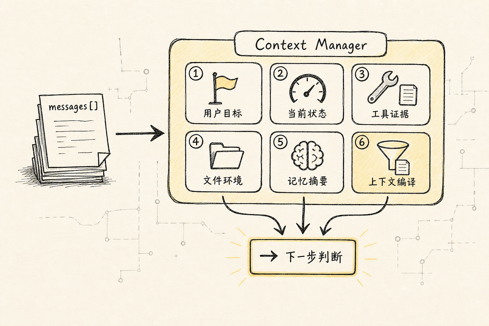

很多 Agent demo 会把上下文理解成一个不断追加的 `messages[]`：

```text
user message
-> assistant message
-> tool result
-> assistant message
-> tool result
-> ...
```

这个模型能跑最小 demo，但它撑不起一个成熟 Agent。

因为成熟 Agent 的上下文不只是聊天记录。它还包含用户目标、当前任务状态、历史决策、工具调用证据、文件和环境状态、长期记忆、压缩摘要、分支会话、预算控制、权限边界和验证结果。

`messages[]` 只是其中一层，可靠性也常常排不到最前面。

更稳定的定义应该是：

```text
Context_t = f(
  Intent,
  State,
  Evidence,
  Memory,
  Policy,
  Tools,
  Environment,
  Recent Interaction,
  Budget
)
```

也就是：

> **某一时刻的上下文，是 Agent 为了完成下一步判断、行动和表达所需的信息环境。**

这带来一个重要转变：

```text
先别急着问：历史消息怎么塞进模型？
更关键的问题是：下一步行动需要哪些信息？
```

Context Manager 要持续回答这些问题：

```text
Agent 当前目标是什么？
当前任务完成到哪一步？
哪些事实已经被验证？
哪些只是猜测？
哪些工具结果是关键证据？
哪些用户约束不可丢？
哪些旧信息已经不相关？
哪些内容虽然旧，但未来仍必须保留？
哪些信息可以压缩？
哪些信息必须原样保留？
哪些信息可以进入模型？
哪些信息只能留在系统内部？
```

这个抽象比较耐久。即使未来模型上下文窗口越来越大，Agent 仍然需要处理注意力噪音、证据溯源、权限隔离、记忆污染、状态恢复、分支探索、成本预算和可解释性问题。

这一章的新口径可以先压成一句话：

**Context Manager 如果只做 `messages[]` 拼接，很快会被长任务拖垮。更稳的形态，是一套“事件溯源 + 状态投影 + 上下文编译 + 可审计压缩”的运行时系统。**

换句话说：

```text
Context Manager 的核心职责，是在任何时刻重建 Agent 做出下一步行动所需的最小充分上下文。保存对话只是其中一项输入来源。
```

我们仍然沿用前文的例子：一个 CLI Agent 正在修复测试失败。它读文件、跑测试、改代码、再验证。任务一长，context 管理就从“拼 prompt”变成了“管理运行时现场”。

## 二、先看旧模型为什么不够

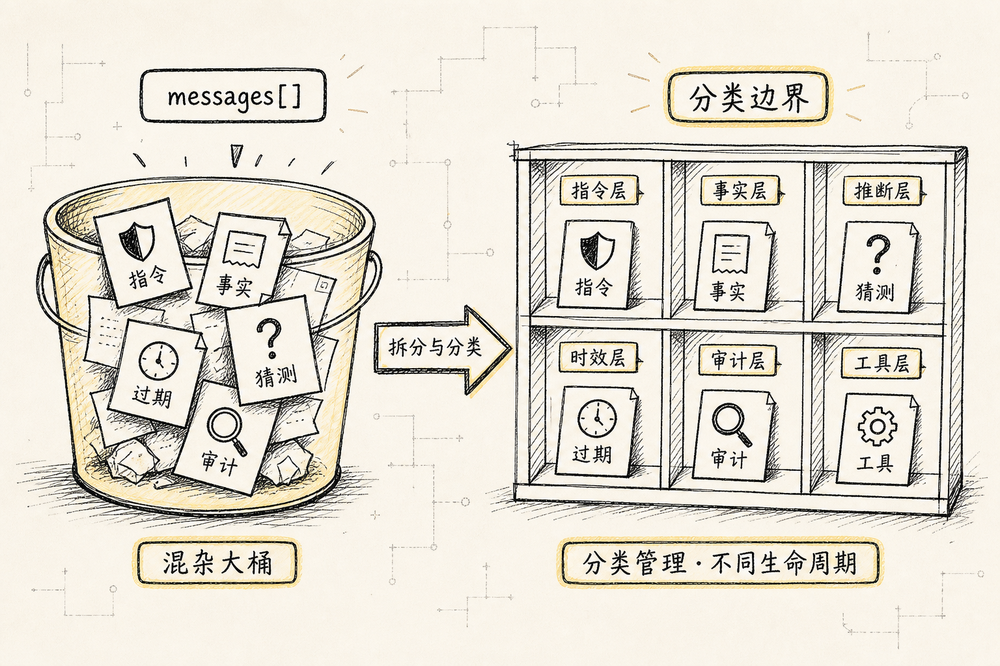

最朴素的实现通常长这样：

```ts
const messages = [
  { role: "system", content: systemPrompt },
  { role: "user", content: userGoal },
];

while (true) {
  const response = await model.chat({ messages, tools });
  messages.push(response.message);

  if (response.toolCall) {
    const result = await runTool(response.toolCall);
    messages.push({
      role: "tool",
      content: result.text,
    });
    continue;
  }

  break;
}
```

这段代码最大的优点是容易理解。

它最大的缺点也是太容易理解了：它把所有东西都当成同一种消息。

在修测试的任务里，`messages[]` 很快会混进这些内容：

```text
用户目标
系统规则
项目规则
模型猜测
工具调用参数
测试日志
grep 输出
文件片段
旧文件内容
新文件 diff
权限拒绝
压缩摘要
长期记忆
验证结果
```

这些内容的性质完全不同。

有些是事实，有些是猜测。

有些是高优先级指令，有些是不可信工具输出。

有些已经过期，有些必须永远保留。

有些应该进入模型输入，有些只应该留给审计和回放。

如果系统只有一个 `messages[]`，它就很难回答这些问题：

```text
哪条信息是事实源？
当前 state 从哪里来？
压缩摘要总结了哪些事件？
工具输出有没有被截断？
模型这一轮到底看见了什么？
这个分支和主线是什么关系？
恢复时应该重放副作用，还是只重建状态？
```

所以 `messages[]` 当然可以保留。

问题在于，它不能承担整个 context 系统的事实源。

## 三、新范式：Context 更像编译产物

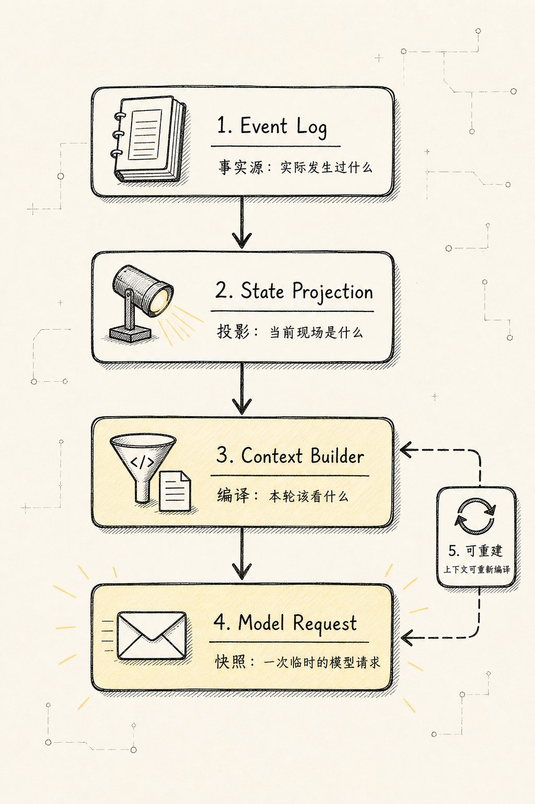

错误范式是：

```text
messages 就是上下文。
summary 可以替换历史。
模型看到什么，系统就只保存什么。
```

这种设计早期快，但后期会遇到一堆问题：

```text
无法恢复。
无法审计。
无法回放。
无法分支。
无法解释。
无法知道 summary 丢了什么。
无法区分事实、推测和用户偏好。
无法做权限与隐私治理。
```

更稳的分层是这样：

```text
Raw Event Log
  append-only，尽量不可变，记录真实发生过什么
        ↓
State Projection
  从事件流投影出当前目标、计划、事实、决策、文件和工具状态
        ↓
Context Builder
  按 token budget、优先级、相关性、信任边界编译模型输入
        ↓
Model Request
  发给模型的最终上下文快照
```

这四层里，只有最后一层会真正发送给模型。

前面三层都属于 Harness 的运行时控制面。

可以用一张表固定边界：

| 层 | 回答的问题 | 是否事实源 | 是否可以压缩 |
| --- | --- | --- | --- |
| Raw Event Log | 实际发生过什么？ | 是 | 不应该被摘要覆盖 |
| State Projection | 当前现场是什么？ | 否，是投影 | 可以重建 |
| Context Builder | 这一轮模型该看什么？ | 否，是编译器 | 每轮重算 |
| Model Request | 模型实际收到什么？ | 否，是快照 | 可以保存引用 |

这就是新范式里最重要的一步：

**LLM context 是运行时编译产物，系统事实源应该放在更底层。**

更完整地说：

```text
Raw Events / Raw Messages / Tool Results / Artifacts 是事实源。
State / Summary / Memory / Trace 是语义投影。
ContextBundle / Prompt 是一次性编译产物。
```

可以画成：

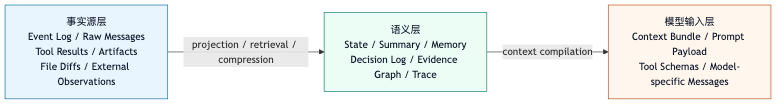

所以，**发给模型的上下文只是一次临时视图**。它可以被压缩、裁剪、重排、脱敏、适配不同模型协议，但不能成为系统唯一事实来源。

一句话：

> **Context 更接近编译产物，别把它当数据库。**

只要接受这件事，很多设计会自然清楚。

原始历史尽量不丢。

模型上下文可以丢、可以压缩、可以重建。

summary 是派生物，不能当源数据用。

推理链路保存可审计证据，不依赖隐藏 chain-of-thought。

会话是树，不只是线性数组。

Context budget 处理的是资源分配，简单截断解决不了这个问题。

## 四、Context Manager 的模块和平面

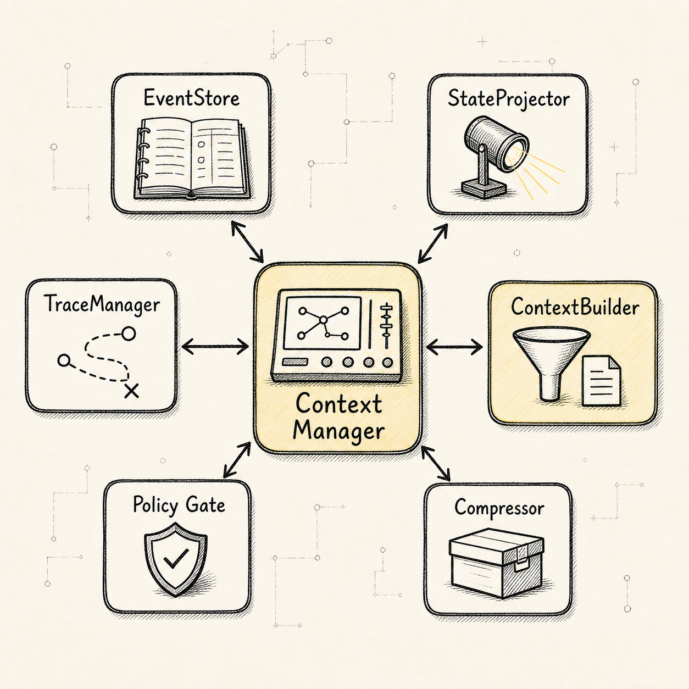

成熟一点的 Context Manager 不应该只有一个 `buildMessages()`。

它至少会长成下面这种模块图：

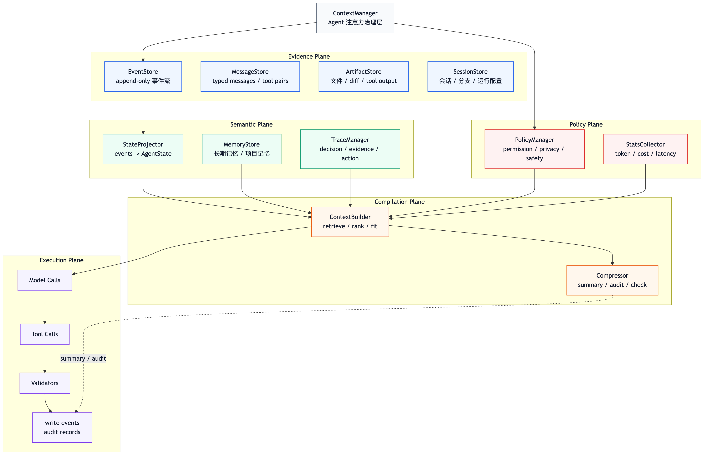

也可以从五个平面看：

```text
Policy Plane
  permission / privacy / safety / budget

Semantic Plane
  state / memory / summary / trace

Evidence Plane
  events / messages / artifacts / tools

Compilation Plane
  retrieve / rank / compress / redact / fit

Execution Plane
  model calls / tool calls / validators
```

这些模块不用一开始都实现。

但它们是很好的边界清单。因为每一个模块都在回答一个不同问题。

`EventStore` 问：事实发生过什么？

`StateProjector` 问：现在我们处在什么任务现场？

`ContextBuilder` 问：这轮模型该看到哪些材料？

`Compressor` 问：哪些旧信息可以被摘要替代？摘要是否保留来源？

`TraceManager` 问：这次失败到底断在哪个因果节点？

如果这些问题都塞进一个 `messages` 数组里，后面就会很难改。

这部分可以直接抽成十二条长期稳定的设计原则：

```text
1. 上下文服务于下一步行动，历史记录只是它的素材之一。
2. 事实源和派生物必须分离。
3. 所有有损变换必须可审计。
4. State 是投影出来的工作现场，聊天记录只是输入来源。
5. Context 是编译结果，不能拿来当数据库。
6. Memory 是治理后的知识，不能当缓存池。
7. 工具调用是因果事件，不能混成普通文本。
8. 推理链路保存可解释骨架，避免依赖隐藏思维链。
9. 上下文必须有作用域。
10. 上下文管理是预算分配，不只是 token 截断。
11. 分支和回滚是原生需求。
12. 内部模型要稳定，外部协议可替换。
```

最后一条尤其重要。不要把核心数据结构绑定到某个模型厂商的 message 格式、tool calling 格式、tokenizer 或 prompt 模板。更稳的是：

```text
Canonical Internal Model
  ↓ adapter
Provider-specific Payload
```

## 五、稳定的 Context Ontology

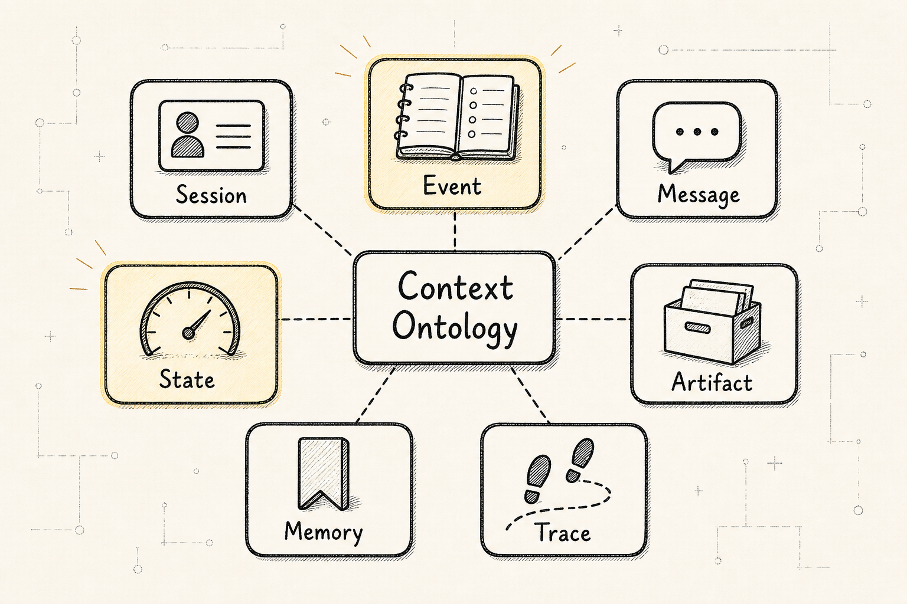

一个成熟 Agent 的上下文系统，至少应该区分这些对象：

```text
Session        工作容器
Event          发生过的事实
Message        用户、模型、工具之间的通信记录
State          当前任务状态投影
Stats          token、成本、延迟、压缩率等指标
Memory         可跨时间复用的知识
Artifact       大对象、文件、diff、日志、截图、工具输出
Trace          可解释的决策与行动链路
Policy         权限、安全、隐私、预算、工具边界
ContextBundle  一次模型调用的上下文编译结果
```

它们的职责不同，不能混在一个 `messages[]` 里。

### Session：工作身份和生命周期

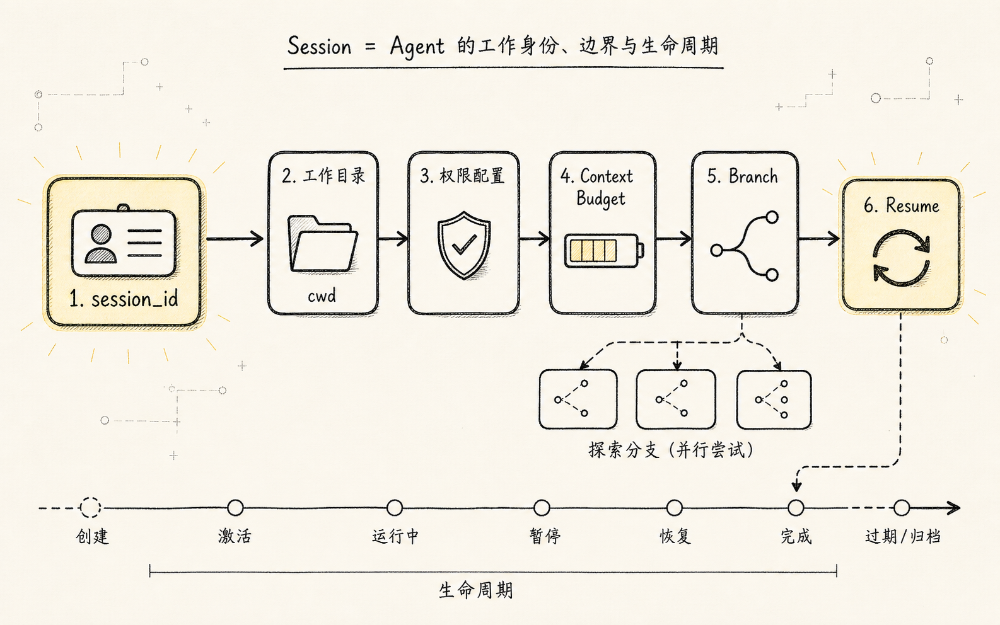

`session` 管的是这次 Agent 工作的身份、边界和分支关系。

最小字段可以先这样设计：

```ts
type AgentSession = {
  sessionId: string;
  rootSessionId?: string;
  parentSessionId?: string;
  branchId?: string;
  leafEventId?: string;

  status: "active" | "paused" | "completed" | "failed" | "archived";
  cwd?: string;
  repoRoot?: string;

  modelConfig: {
    provider: string;
    model: string;
    maxOutputTokens?: number;
  };

  contextConfig: {
    contextWindowTokens: number;
    reservedOutputTokens: number;
    maxRecentTokens: number;
    compressionPolicyId: string;
  };

  permissionConfig: {
    sandboxMode?: "read_only" | "workspace_write" | "danger_full_access";
    approvalPolicy?: "never" | "on_request" | "on_failure" | "always";
  };

  createdAt: string;
  updatedAt: string;
};
```

这里的重点不在字段数量。

重点是 `session_id` 不只代表“一段聊天”。它还挂住工作目录、模型配置、权限配置、context budget、branch 关系和恢复位置。

如果没有这些信息，所谓 resume 就只能恢复一段聊天，而不能恢复一个工作现场。

### Event：事实源

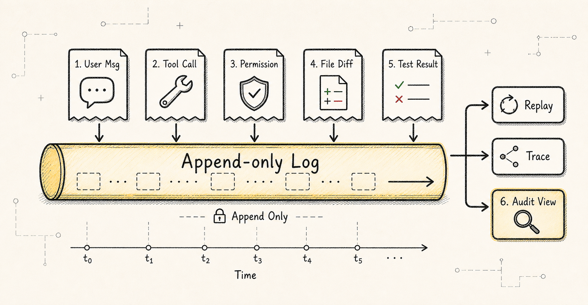

`event` 是最容易被低估的对象。

成熟 Agent 不应该只保存 message log，而应该保存 append-only event log。

```ts
type AgentEvent = {
  eventId: string;
  sessionId: string;
  runId?: string;
  parentEventId?: string;
  seq: number;
  timestamp: string;

  type:
    | "SessionStarted"
    | "UserPromptSubmitted"
    | "ContextBuilt"
    | "ModelRequestStarted"
    | "ModelResponseReceived"
    | "ToolCallRequested"
    | "ToolCallStarted"
    | "ToolCallFinished"
    | "ToolCallFailed"
    | "ApprovalRequested"
    | "ApprovalGranted"
    | "ApprovalDenied"
    | "FileRead"
    | "FileWritten"
    | "DiffApplied"
    | "StateUpdated"
    | "CompactionStarted"
    | "CompactionCompleted"
    | "VerifierFinished";

  actor: "user" | "agent" | "model" | "tool" | "system" | "subagent";
  payload: Record<string, unknown>;

  causality: {
    messageId?: string;
    toolCallId?: string;
    artifactId?: string;
    compactionId?: string;
  };
};
```

为什么 event 比 message 更底层？

因为很多关键事实根本不会出现在 message 里。

上下文构建时选了哪些片段，也不会出现在 message 里。

哪次工具调用被权限拒绝，不一定是 message。

某个文件被修改、某个 diff 被应用、某次验证失败、某次压缩触发，这些都应该是事件。

如果它们不进 event log，后面做 replay、trace、eval、audit 都会失去事实基础。

### Message：模型交互记录

`message` 仍然重要。

但它应该采用 typed message blocks，避免把 provider 原始格式当作内部数据结构一路透传。

```ts
type Message = {
  messageId: string;
  sessionId: string;
  runId?: string;
  role: "system" | "developer" | "user" | "assistant" | "tool" | "summary" | "custom";
  content: MessageBlock[];

  toolCall?: {
    toolCallId: string;
    toolName: string;
    args: unknown;
    status: "pending" | "running" | "success" | "error";
  };

  toolResult?: {
    toolCallId: string;
    outputRef?: string;
    outputPreview?: string;
    truncated: boolean;
  };

  provenance: {
    source: "user" | "model" | "tool" | "memory" | "summary" | "system";
    sourceRefs?: string[];
  };

  contextPolicy: {
    includeInContext: boolean;
    priority: number;
    maxTokens?: number;
  };
};

type MessageBlock =
  | { type: "text"; text: string }
  | { type: "file_ref"; uri: string; summary?: string }
  | { type: "tool_call"; toolCallId: string; name: string; args: unknown }
  | { type: "tool_result"; toolCallId: string; outputRef?: string; preview?: string }
  | { type: "summary"; summaryId: string; text: string };
```

这里有几个硬不变量：

```text
tool call 和 tool result 必须成对保留。
不能从中间截断一个未完成 tool call。
大型 tool output 应该进 ArtifactStore，message 只放 preview + ref。
summary message 必须知道自己总结了哪些 message/event。
custom/internal message 要区分是否进入 LLM context。
```

### State：当前现场

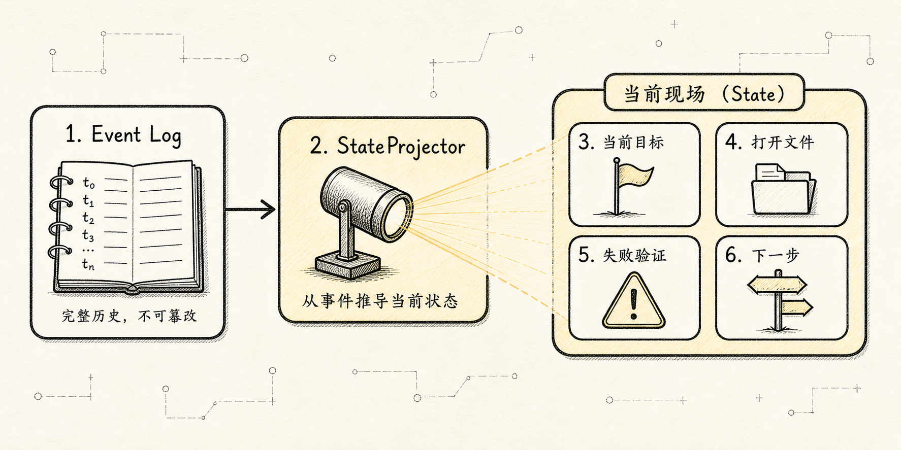

`state` 是从 event log 投影出来的当前工作态。

它不等于历史消息。

```ts
type AgentState = {
  sessionId: string;
  sourceEventId: string;
  version: number;

  goal: {
    userGoal: string;
    currentTask?: string;
    acceptanceCriteria?: string[];
  };

  plan: {
    steps: PlanStep[];
    currentStepId?: string;
    status: "planning" | "executing" | "blocked" | "verifying" | "done";
  };

  constraints: {
    hard: string[];
    soft: string[];
    userPreferences: string[];
  };

  facts: Array<{
    factId: string;
    content: string;
    confidence: number;
    sourceRefs: string[];
  }>;

  decisions: Array<{
    decisionId: string;
    decision: string;
    rationaleSummary: string;
    evidenceRefs: string[];
  }>;

  artifacts: Array<{
    artifactId: string;
    kind: "file" | "diff" | "command_output" | "url" | "image";
    pathOrUri: string;
    summary?: string;
  }>;

  openQuestions: string[];
  lastCompactionId?: string;
};
```

`state` 是压缩后仍能继续工作的核心。

即使早期自然语言对话被压成 summary，下面这些东西也不能糊：

```text
用户最终目标
当前执行到哪一步
已做决定
已验证事实
已读和已改文件
未完成事项
工具失败和重试策略
用户偏好和硬约束
```

如果这些只藏在旧 messages 里，compaction 之后 Agent 就会失忆。

如果它们进入 state projection，context 可以随时重建。

### Stats：观测指标，不要和 State 混在一起

`Stats` 管的是运行指标，任务语义应该留给 `State`：

```ts
type AgentStats = {
  sessionId: string;
  runId?: string;

  tokenUsage: {
    inputTokens: number;
    outputTokens: number;
    cachedInputTokens?: number;
    reasoningTokens?: number;
    contextWindowTokens: number;
    contextUsedTokens: number;
    reservedOutputTokens: number;
  };

  latencyMs: {
    contextBuild?: number;
    retrieval?: number;
    modelCall?: number;
    toolExecution?: number;
    endToEnd?: number;
  };

  compression: {
    compactionCount: number;
    tokensBeforeLastCompaction?: number;
    tokensAfterLastCompaction?: number;
    compressionRatio?: number;
  };

  toolMetrics: {
    toolCallCount: number;
    failedToolCallCount: number;
    approvalRequestedCount: number;
    approvalDeniedCount: number;
  };

  qualityMetrics?: {
    verifierPassed?: boolean;
    contextMissingRisk?: "low" | "medium" | "high";
    hallucinationRisk?: "low" | "medium" | "high";
  };
};
```

没有 stats，你很难回答：

```text
为什么某类任务总是在 compaction 后失败？
哪个 tool output 最占 token？
哪些 memory 经常被召回但没用？
context builder 的不同策略哪个更省钱？
```

### Memory：治理后的知识，别当缓存池

`Memory` 回答的是哪些知识值得未来复用。“把所有 summary 丢进向量库”只是在堆材料，离真正的记忆治理还很远。

```ts
type Memory = {
  memoryId: string;
  scope: "user" | "project" | "workspace" | "session" | "global";
  kind: "preference" | "fact" | "instruction" | "skill" | "artifact_summary" | "decision";

  content: string;
  sourceRefs: string[];
  confidence: number;

  createdAt: string;
  updatedAt: string;
  expiresAt?: string;

  accessPolicy: {
    sensitive: boolean;
    readableByAgents: string[];
    redactionPolicy?: string;
  };

  retrieval: {
    embeddingId?: string;
    keywords?: string[];
    priority: number;
  };
};
```

Memory 设计最怕污染。更稳的原则是：

```text
长期记忆必须有 scope、source、confidence、ttl、sensitivity、priority 和 usage 记录。
```

当前任务里的猜测不应该污染长期用户记忆。某个项目的测试命令也不应该污染另一个项目。

### Artifact：大对象和证据实体

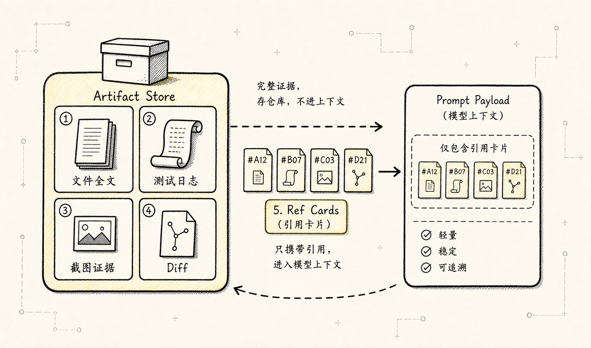

`Artifact` 用来保存完整证据，prompt 里只放真正需要被模型看到的摘要、引用和片段。

```ts
type Artifact = {
  artifactId: string;
  sessionId: string;

  kind:
    | "file"
    | "diff"
    | "tool_output"
    | "command_log"
    | "screenshot"
    | "dataset"
    | "url_snapshot";

  uri: string;
  summary?: string;
  contentHash?: string;

  sourceEventId: string;
  createdAt: string;

  accessPolicy?: {
    sensitive: boolean;
    allowedScopes: string[];
  };
};
```

正确模式是：

```text
context 中放摘要、引用、关键片段。
artifact store 中放完整证据。
```

这对 coding agent 尤其重要。文件全文、测试日志、命令输出、截图、diff 都可能很大，不应该直接进入 message history。

### Trace：可解释链路，避开隐藏思维链

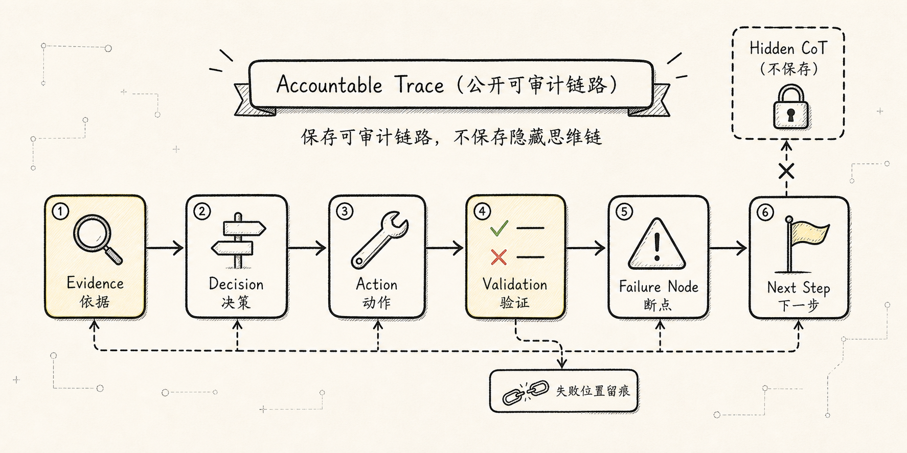

`Trace` 回答的是 Agent 为什么这么做、依据是什么、验证过什么、下一步是什么。

不要把“保持推理链路”理解为保存模型隐藏 chain-of-thought。工程上更稳的做法是保存一条可公开、可审计、可回放的 **Accountable Reasoning Trace**：

```text
Goal
Assumptions
Evidence
Decisions
Actions
Observations
Validation
Next Steps
```

这比保存自然语言 CoT 更稳、更安全，也更适合审计和恢复。

## 六、Context Builder：真正的模型输入编译器

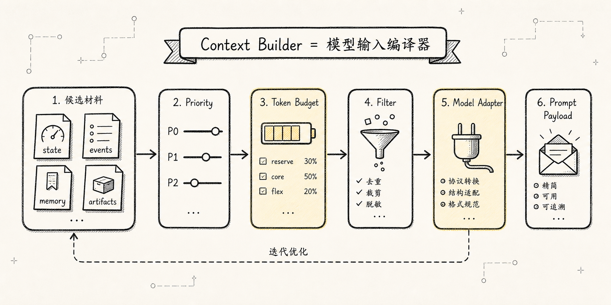

有了 session、event、message、state，才轮到 Context Builder。

Context Builder 的输入不该是一整个巨大的 `messages[]`。

它的输入是一组有来源、有优先级、有信任等级的材料：

```ts
type ContextBundle = {
  system: PromptSegment[];
  developerInstructions: PromptSegment[];
  projectInstructions: PromptSegment[];

  currentRequest: {
    userMessageId: string;
    text: string;
    acceptanceCriteria?: string[];
  };

  sessionState: AgentState;
  summaries: SummaryBlock[];
  recentMessages: Message[];
  retrievedMemories: RetrievedMemory[];
  retrievedArtifacts: RetrievedArtifact[];

  toolContext: {
    availableTools: ToolSpec[];
    pendingToolPairs: Message[];
    recentToolResults: Message[];
  };

  traceContext: {
    runId: string;
    recentDecisions: string[];
    evidenceRefs: string[];
  };

  budget: {
    maxContextTokens: number;
    reservedOutputTokens: number;
    usedTokens: number;
  };
};
```

这条编译链路可以画成：

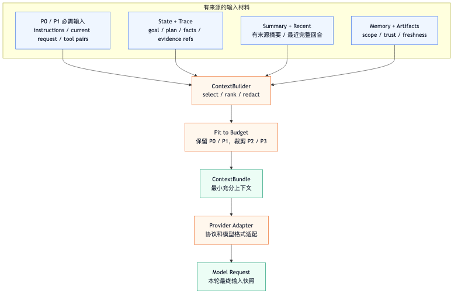

然后它按优先级裁剪：

| 优先级 | 内容 | 是否可丢 |
| --- | --- | --- |
| P0 | system / developer / safety / 必需 tool schema | 不可丢 |
| P0 | 当前用户请求 | 不可丢 |
| P0 | 未完成 tool call / tool result pair | 不可丢 |
| P1 | 当前 goal、acceptance criteria、plan、open questions | 基本不可丢 |
| P1 | 当前工作文件、diff、测试结果、错误信息 | 可摘要 |
| P1 | 最近 N 轮完整对话 | 可裁剪但不能破坏 turn |
| P2 | 历史决策、关键事实、用户偏好 | 可摘要 |
| P2 | 检索出的 memory / artifact | 可裁剪 |
| P3 | 旧闲聊、重复解释、冗长工具输出 | 优先丢弃或摘要 |

伪代码大概是这样：

```ts
async function buildContext(
  sessionId: string,
  userMessageId: string
): Promise<ContextBundle> {
  const session = await sessionStore.get(sessionId);
  const state = await stateProjector.project(sessionId);
  const latestSummary = await compressor.getLatestSummary(sessionId);

  const recentMessages = await messageStore.selectRecentCoherentTurns({
    sessionId,
    maxTokens: session.contextConfig.maxRecentTokens,
    preserveToolPairs: true,
  });

  const memories = await memoryStore.retrieve({
    query: state.goal.currentTask ?? state.goal.userGoal,
    session,
    state,
  });

  const artifacts = await artifactStore.retrieveRelevant({
    sessionId,
    state,
  });

  const bundle = assembleByPriority({
    session,
    state,
    latestSummary,
    recentMessages,
    memories,
    artifacts,
    currentUserMessage: await messageStore.get(userMessageId),
  });

  return fitToBudget(bundle, {
    preserve: ["system", "current_request", "pending_tool_pairs", "state.goal"],
    evictionOrder: [
      "verbose_tool_outputs",
      "low_relevance_artifacts",
      "old_assistant_chatter",
      "old_user_messages",
      "retrieved_memories",
    ],
  });
}
```

这就是 [00-15](https://github.com/LienJack/build-harness/blob/main/docs/zh/00-15-context-policy-model-input.md) 那篇文章的位置。

00-15 讲的是 Context Builder 内部的选择、排序、压缩、隔离、预算和决策记录。

本章讲的是 Context Builder 上游还有事实源、状态投影、压缩账本、会话树和恢复机制。

## 七、Compaction：做语义蒸馏，别只缩短文本

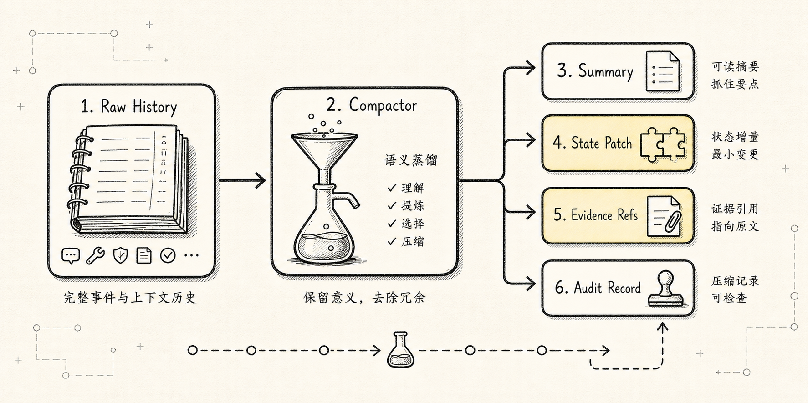

长任务一定会遇到上下文窗口。

压缩阶段不能只做：

```text
请总结上面对话。
```

压缩应该是：

```text
从旧上下文中提取未来行动仍然需要的信息，并保留其来源关系。
```

一次好的 compaction 至少应该产出三类东西：

```text
1. Summary
   给模型看的压缩上下文

2. State Patch
   更新 Agent 当前状态

3. Memory Candidate
   候选长期记忆，经过审核后才写入 memory
```

不要把这三者混成一坨自然语言 summary。

最危险的压缩设计是：

```text
把旧 messages 总结一下，然后删掉旧历史。
```

这会把系统事实源从可检查事件变成一段 lossy 自然语言。

更稳的设计要分两层：

```text
Lossless layer:
  raw messages / raw events / raw tool outputs / artifacts

Lossy layer:
  summaries / state snapshots / branch summaries / memory notes
```

也可以把它理解成一条有审计边界的语义蒸馏链：

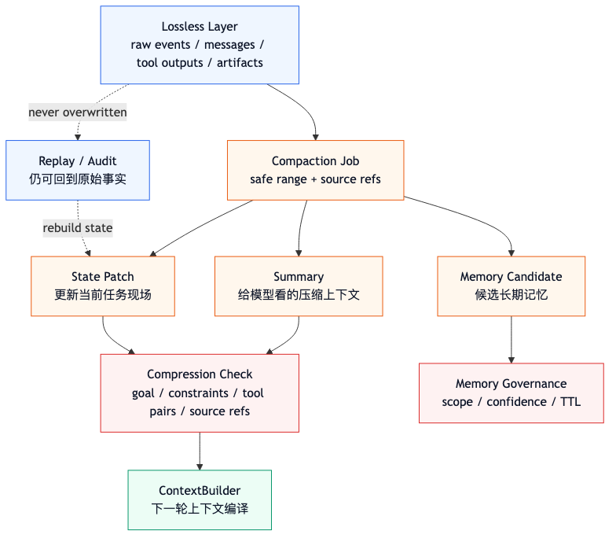

原则很简单：

```text
原始事件尽量保留。
发给模型的上下文可以压缩。
summary 必须有 provenance。
summary 不能覆盖 raw transcript。
summary 不能拆断 tool pair。
summary 之后必须能继续执行任务。
```

一个合格 compaction record 至少应该有这些字段：

```yaml
compaction_id: cmp_123
session_id: sess_456
summarized_range:
  from_message_id: msg_001
  to_message_id: msg_120
first_kept_message_id: msg_121
tokens_before: 82000
tokens_after: 18000

goal:
  user_goal: "修复测试失败，并验证。"
  current_task: "定位 serializer.test.ts 的失败断言。"

constraints:
  hard:
    - "不要修改 public API。"
    - "修改后必须运行相关测试。"

progress:
  done:
    - "parser 测试已经通过。"
  in_progress:
    - "serializer 测试仍然失败。"

files:
  read:
    - path: "src/parser.ts"
  modified:
    - path: "src/parser.ts"
      change_summary: "修复空格 token 处理。"

tools:
  important_results:
    - tool_call_id: "tool_123"
      summary: "pnpm test --filter parser 通过。"
      artifact_ref: "artifact_789"

open_questions:
  - "serializer 是否需要保留加号两侧空格？"

next_steps:
  - "读取 src/serializer.ts 和失败测试。"

provenance:
  source_event_ids: ["event_1", "event_2"]
  source_message_ids: ["msg_001", "msg_120"]
  summary_prompt_version: "v3"
```

压缩之后还应该跑轻量检查：

```ts
type CompressionCheck = {
  preservesGoal: boolean;
  preservesConstraints: boolean;
  preservesCurrentPlan: boolean;
  preservesOpenToolPairs: boolean;
  preservesFileState: boolean;
  hasSourceRefs: boolean;
  estimatedInformationLoss: "low" | "medium" | "high";
};
```

几个硬规则可以直接写成测试：

```text
summary 没有 current_task，压缩失败。
summary 没有 next_steps，压缩失败。
压缩范围里有 file write，但 summary 没有 modified files，压缩失败。
压缩范围里有 tool error，但 summary 没有 errors/retries，压缩失败。
tool call/result pair 被拆，压缩失败。
```

Compaction 只追求“让上下文变短”是不够的。

它的目标是让上下文变短之后，Agent 仍然知道自己是谁、在做什么、做过什么、下一步该往哪走。

## 八、推理链路：保存证据，不保存隐藏 CoT

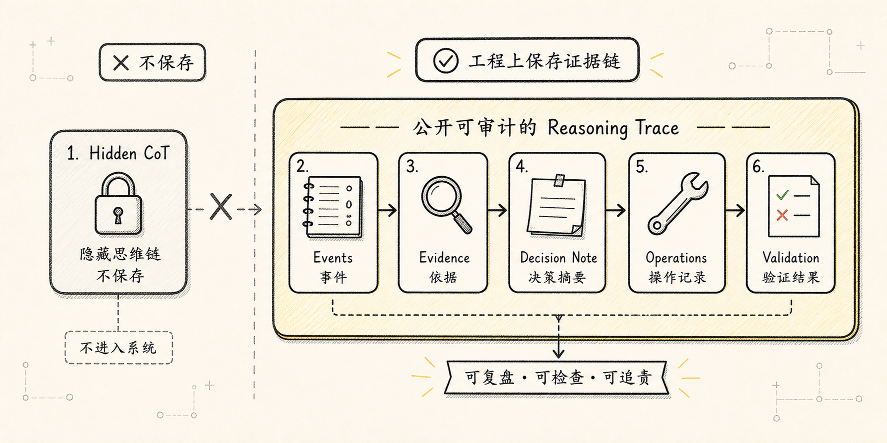

说“保持推理链路”时，要避免一个误区：

```text
不要试图保存模型隐藏 chain-of-thought。
```

工程上真正需要保存的是可审计 reasoning trace：

```ts
type ReasoningTrace = {
  traceId: string;
  sessionId: string;
  runId: string;

  userGoal: string;

  assumptions: Array<{
    assumption: string;
    sourceRefs?: string[];
    confidence: number;
  }>;

  decisionLog: Array<{
    decisionId: string;
    decision: string;
    rationaleSummary: string;
    alternatives?: string[];
    evidenceRefs: string[];
  }>;

  evidenceLog: Array<{
    evidenceId: string;
    kind: "tool_result" | "file" | "user_message" | "memory" | "test" | "observation";
    ref: string;
    summary: string;
  }>;

  actionLog: Array<{
    actionId: string;
    actionType: "message" | "tool_call" | "file_edit" | "memory_write" | "branch" | "compact";
    eventId: string;
    resultEventId?: string;
  }>;

  validationLog: Array<{
    check: string;
    result: "pass" | "fail" | "skipped";
    evidenceRefs?: string[];
  }>;
};
```

这样你能回答的是：

```text
Agent 为什么调用这个工具？
这个结论来自哪个文件？
哪次压缩后丢了什么？
哪个分支引入了错误？
哪个用户约束被违反了？
最终回答有没有验证证据？
```

这些问题不需要 hidden CoT。

它们需要的是事件、证据、决策摘要、操作记录和验证结果。

## 九、Branch、Memory、Retrieval 与 Subagent 都不能绕过 Context Manager

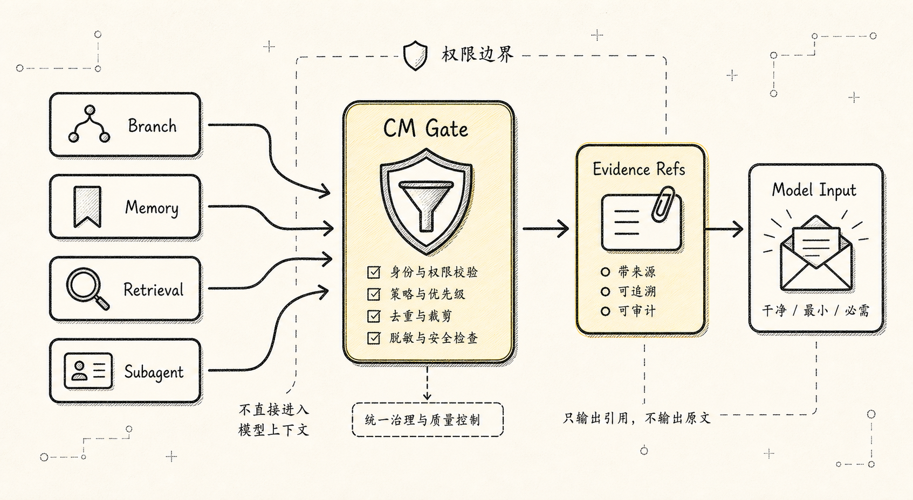

很多上下文系统后期失控，是因为外部能力绕开了 Context Manager。

长期记忆一旦可以直接进入 prompt，就会把未验证经验变成当前事实。

检索结果一旦可以直接进入 prompt，就会把相似文本变成证据。

子 Agent 一旦可以直接把长报告塞回主上下文，就会把隔离上下文重新污染回来。

所以这三类能力都应该按同一条路进入模型输入：

```text
Memory / Retrieval / Subagent output
-> source refs
-> scope / trust / freshness check
-> artifact or state update
-> Context Builder
-> Model Input
```

Memory 要有 scope、confidence、TTL、source refs。

Retrieval 要有 query plan、citation、permission boundary、audit snapshot。

Subagent 要返回 summary、evidence refs、artifacts、risks 和 next steps。只返回一段“我完成了”，主线 Agent 很难判断这个结果能不能继续使用。

所以前面的 Memory Governance、Scoped Retrieval、Delegation Runtime 都不只是额外专题。它们像 Context Manager 的外围血管，决定外部材料怎样进入主线工作现场。

它们最终都要回到同一个问题：

```text
这些材料能不能进入本轮模型上下文？
如果能，以什么优先级、什么信任等级、什么预算进入？
如果不能，是否保存为 artifact 或 audit event？
```

复杂任务也天然很少是线性的。Agent 经常会：

```text
尝试方案 A
失败
回退
尝试方案 B
开 subagent 做研究
从旧状态 fork
比较两个结果
```

所以 session 应该天然支持树结构：

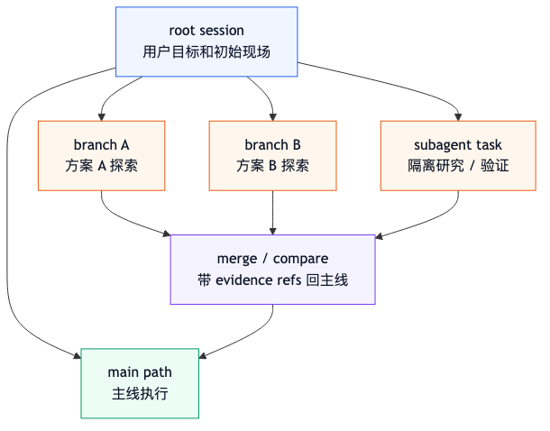

推荐抽象：

```ts
type SessionNode = {
  nodeId: string;
  sessionId: string;
  parentNodeId?: string;

  eventId: string;
  messageId?: string;

  branchType: "main" | "fork" | "subagent" | "what_if";
  branchSummary?: string;

  createdAt: string;
};
```

一句话：

> **分支是探索隔离，subagent 是上下文隔离。**

## 十、完整生命周期：一次请求怎样流过 Context Manager

把这些层合起来，一次请求的生命周期大概是：

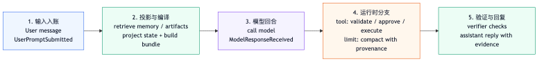

这个流程里，模型只是其中一个节点。

模型只负责其中一部分状态判断。

决策记录也要落回 Harness 的运行时系统。

Harness 负责把模型的判断放回一个可恢复、可审计、可验证的工程系统里。

## 十一、MVP 应该先做什么

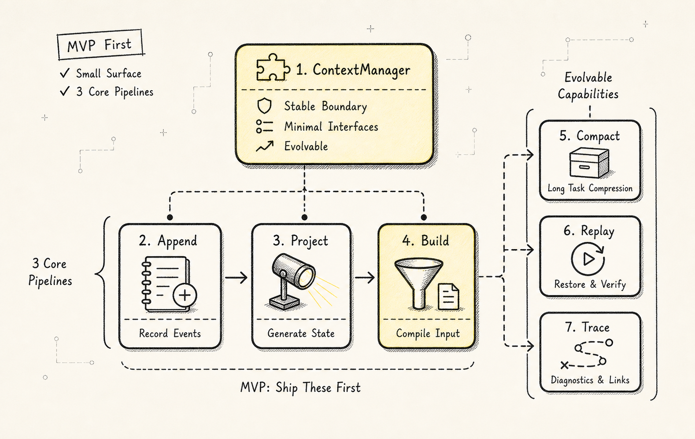

不要一开始就做完所有模块。

本地 CLI Agent 的 MVP 可以先做这些：

```text
sessions
messages
events
state_snapshots
artifacts
compactions
```

暂时可以不做：

```text
复杂向量 memory
多 agent 协作
自动 branch pruning
高级 eval
跨项目长期记忆
```

但 MVP 里最好一开始就保留几个能力：

```text
每次用户输入写入 message + event。
每次工具调用写入 event。
大型工具输出写 artifact，message 只放摘要和引用。
每次模型调用前构建 ContextBundle。
超过 token 阈值时生成 structured summary。
保证 tool call/result pair 不被截断。
支持 resume。
支持导出 JSONL。
支持 /context 查看当前上下文构成。
支持 /compact 手动压缩。
```

这样即使系统还很小，边界也不会错。

第一版 `ContextManager` 可以只有这个接口：

```ts
interface ContextManager {
  appendEvent(event: AgentEvent): Promise<void>;
  projectState(sessionId: string): Promise<AgentState>;
  buildContext(sessionId: string, input: BuildContextInput): Promise<ContextBundle>;
  compact(sessionId: string, policy?: CompressionPolicy): Promise<CompactionResult>;
  resume(sessionId: string, branchId?: string): Promise<AgentSession>;
}
```

复杂性藏进三个 pipeline：

```text
Event Pipeline:
  input / tool / model / system events -> append-only log

Projection Pipeline:
  events / messages / artifacts -> state snapshot

Context Pipeline:
  instructions + state + summary + recent messages + retrieval -> model context
```

这已经足够支撑一个可演进的 Harness。

## 十二、关键工程不变量

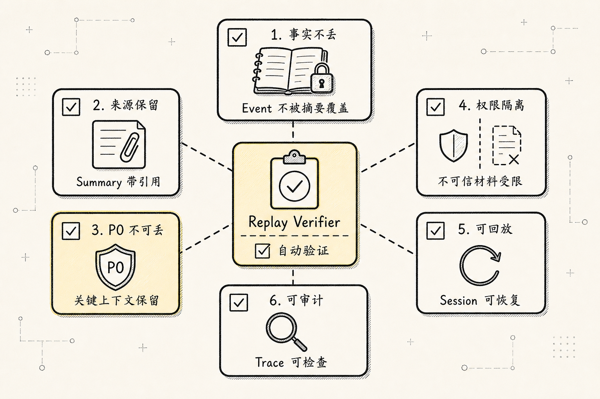

这套范式最后要落到测试。

下面这些不变量应该直接写进单元测试或 replay verifier：

```text
Invariant 1:
  Every tool_result must have a preceding tool_call.

Invariant 2:
  No pending tool_call can be removed by compaction.

Invariant 3:
  Every compaction summary must include source message range.

Invariant 4:
  Every file write event must be represented in state.artifacts or summary.files.modified.

Invariant 5:
  Current user request, active goal, and open questions must always be included in context.

Invariant 6:
  ContextBuilder output must be deterministic given same session state and retrieval result.

Invariant 7:
  Raw event log is append-only.

Invariant 8:
  Summary cannot overwrite raw transcript.

Invariant 9:
  Branch must not mutate ancestor branch.

Invariant 10:
  Memory writes require source refs.

Invariant 11:
  Long-term memory must have scope and expiry/update policy.

Invariant 12:
  ContextBundle must be explainable: every included segment should have reason and source.
```

这些规则比“prompt 写好一点”更重要。

因为它们把 Agent 的可靠性从模型感觉，拉回了工程约束。

## 十三、常见反模式

### 反模式一：`messages[]` 即世界

```text
所有历史都存在 messages 里。
```

问题是难恢复、难压缩、难审计、难分支、难解释，也很难做权限控制。

### 反模式二：summary 覆盖历史

```text
压缩后只保留 summary，不保留原始记录。
```

问题是无法回放、无法纠错、无法验证，也不知道 summary 丢了什么。

### 反模式三：memory 无作用域

```text
所有记忆都进一个向量库。
```

问题是项目污染、用户污染、临时事实长期化、旧知识误用和敏感信息扩散。

### 反模式四：工具结果直接塞上下文

```text
命令输出、文件全文、日志全部塞进 prompt。
```

问题是 token 爆炸、噪声过多、重点丢失，安全风险也会上升。

### 反模式五：压缩只做自然语言总结

```text
“请总结上面对话。”
```

问题是目标、约束、文件状态、错误、决策和下一步都可能被压没。

### 反模式六：把 prompt 当 policy

```text
只在 system prompt 里说不要做危险事。
```

问题是不可验证、不可强制、不可审计、不可测试。确定性规则应该进入 policy、permission、hook、validator，而不只是 prompt。


---

GitHub 地址: [01-context-manager-attention-os.md](https://github.com/LienJack/learn-agent/blob/main/src/content/blog/zh/AI/agent设计范式/01-context-manager-attention-os.md)

博客地址: [blog](https://blog.lienjack.com/blog/AI/agent%E8%AE%BE%E8%AE%A1%E8%8C%83%E5%BC%8F/01-context-manager-attention-os)
