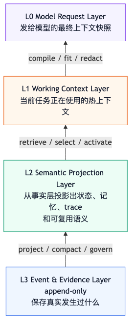
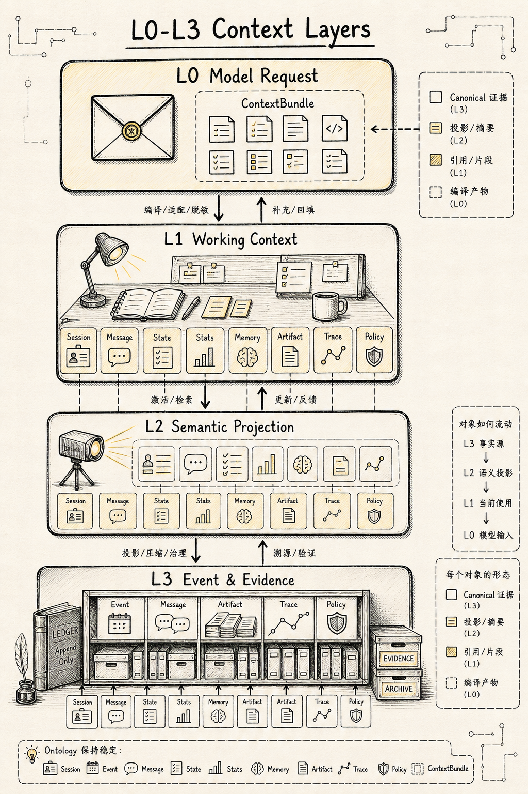
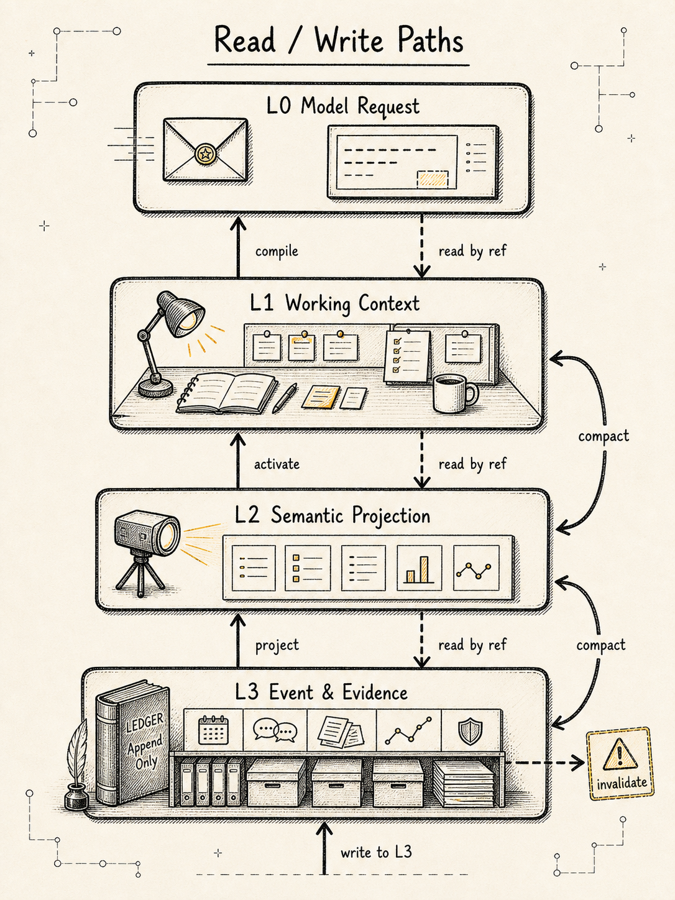
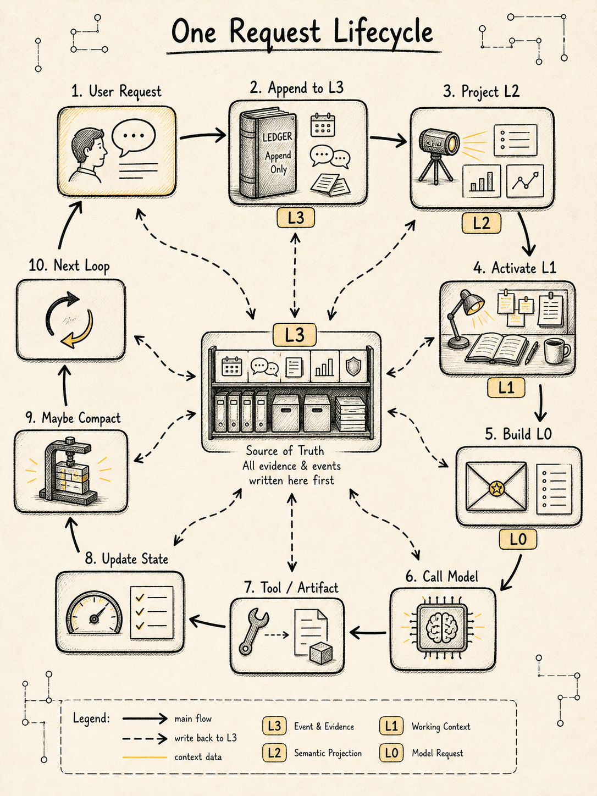
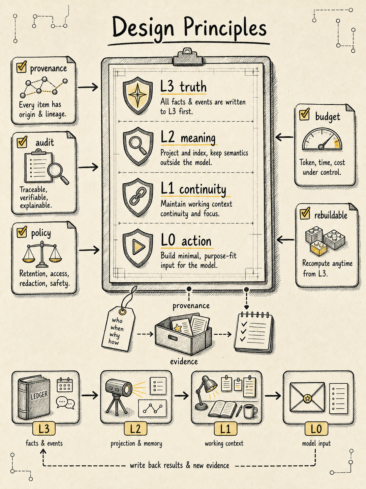

# Context Manager 新范式：Agent 的注意力操作系统

> 模型这一轮应该看见什么？

这是 Context Builder 在每次模型调用前要回答的问题。

但 Context Manager 要回答的是更底层的问题：

> 整个 Agent 怎样保存、投影、压缩、分支和恢复它的工作现场？

核心观点先放前面：

> **Agent Context Manager 要管理的远不止聊天历史。它更像一套四层注意力存储系统：把事件事实、当前状态、长期记忆、外部证据、工具环境和系统策略，编译成下一次行动所需的最小充分上下文。**

换句话说，Context Manager 不能停留在管理 `messages[]`，也不能等到上下文满了再补一段“总结”。它更像 Agent 的 **Attention Operating System**：负责决定 Agent 此刻应该知道什么、为什么知道、来源是什么、是否可信、是否过期、是否应该暴露给模型、是否应该写入长期记忆，以及如何在有限预算下保持推理连续性。

本文的结构分三层：

```text
第一层：四层存储层级
  说明 Context 数据应该放在哪里。

第二层：Context Ontology
  说明这些数据对象分别是什么，保持稳定，不跟着模型协议漂移。

第三层：Context Manager 范式和原则
  说明这些对象如何流动、压缩、提升、失效、恢复和审计。
```

一句话概括：

```text
Context Manager = Storage Hierarchy + Context Ontology + Projection Pipeline + Context Compilation + Compaction Governance
```

---

## 一、从第一性原理定义 Context


很多 Agent demo 会把上下文理解成一个不断追加的 `messages[]`：

```text
user message
-> assistant message
-> tool result
-> assistant message
-> tool result
-> ...
```

这个模型能跑最小 demo，但撑不起一个成熟 Agent。

因为成熟 Agent 的上下文不只是聊天记录。它还包含用户目标、当前任务状态、历史决策、工具调用证据、文件和环境状态、长期记忆、压缩摘要、分支会话、预算控制、权限边界和验证结果。

`messages[]` 只是其中一种材料。它很重要，但不是全部 context，更不应该成为唯一事实源。

更稳定的定义应该是：

```text
Context_t = f(
  Intent,
  State,
  Evidence,
  Memory,
  Policy,
  Tools,
  Environment,
  Recent Interaction,
  Budget
)
```

也就是：

> **某一时刻的上下文，是 Agent 为了完成下一步判断、行动和表达所需的信息环境。**

这带来一个重要转变：

```text
先别急着问：历史消息怎么塞进模型？
更关键的问题是：下一步行动需要哪些信息？
```

Context Manager 要持续回答这些问题：

```text
Agent 当前目标是什么？
当前任务完成到哪一步？
哪些事实已经被验证？
哪些只是猜测？
哪些工具结果是关键证据？
哪些用户约束不可丢？
哪些旧信息已经不相关？
哪些内容虽然旧，但未来仍必须保留？
哪些信息可以压缩？
哪些信息必须原样保留？
哪些信息可以进入模型？
哪些信息只能留在系统内部？
```

这个抽象比较耐久。即使未来模型上下文窗口越来越大，Agent 仍然需要处理注意力噪音、证据溯源、权限隔离、记忆污染、状态恢复、分支探索、成本预算和可解释性问题。

这一章的新口径可以压成一句话：

> **Context Manager 如果只做 `messages[]` 拼接，很快会被长任务拖垮。更稳的形态，是一套“事件溯源 + 状态投影 + 上下文编译 + 可审计压缩”的运行时系统。**

换句话说：

```text
Context Manager 的核心职责，
是在任何时刻重建 Agent 做出下一步行动所需的最小充分上下文。
保存对话只是其中一项输入来源。
```

后文仍然沿用一个简单例子：一个 CLI Agent 正在修复测试失败。它读文件、跑测试、改代码、再验证。任务一长，context 管理就从“拼 prompt”变成了“管理运行时现场”。

---

## 二、先看旧模型为什么不够


最朴素的实现通常长这样：

```ts
const messages = [
  { role: "system", content: systemPrompt },
  { role: "user", content: userGoal },
];

while (true) {
  const response = await model.chat({ messages, tools });
  messages.push(response.message);

  if (response.toolCall) {
    const result = await runTool(response.toolCall);
    messages.push({
      role: "tool",
      content: result.text,
    });
    continue;
  }

  break;
}
```

这段代码最大的优点是容易理解。

它最大的缺点也是太容易理解了：它把所有东西都当成同一种消息。

在修测试的任务里，`messages[]` 很快会混进这些内容：

```text
用户目标
系统规则
项目规则
模型猜测
工具调用参数
测试日志
grep 输出
文件片段
旧文件内容
新文件 diff
权限拒绝
压缩摘要
长期记忆
验证结果
```

这些内容的性质完全不同。

有些是事实，有些是猜测。

有些是高优先级指令，有些是不可信工具输出。

有些已经过期，有些必须长期保留。

有些应该进入模型输入，有些只应该留给审计和回放。

如果系统只有一个 `messages[]`，它就很难回答这些问题：

```text
哪条信息是事实源？
当前 state 从哪里来？
压缩摘要总结了哪些事件？
工具输出有没有被截断？
模型这一轮到底看见了什么？
这个分支和主线是什么关系？
恢复时应该重放副作用，还是只重建状态？
```

所以 `messages[]` 当然可以保留。

问题在于，它不能承担整个 context 系统的事实源。

---

## 三、新范式：Context 是四层注意力存储


错误范式是：

```text
messages 就是上下文。
summary 可以替换历史。
模型看到什么，系统就只保存什么。
```

这种设计早期快，但后期会遇到一堆问题：

```text
无法恢复。
无法审计。
无法回放。
无法分支。
无法解释。
无法知道 summary 丢了什么。
无法区分事实、推测和用户偏好。
无法做权限与隐私治理。
```

更稳的范式是把 Context Manager 看成一套从 **L0 到 L3** 的四层注意力存储系统：

```text
L0: Model Request Layer
    模型这一轮真正看到的上下文快照。

L1: Working Context Layer
    当前任务正在使用的热工作集。

L2: Semantic Projection Layer
    状态、记忆、摘要、trace 等语义投影层。

L3: Event & Evidence Layer
    原始事件、完整消息、工具结果、artifact 和审计证据层。
```

这四层回答的问题不同：

```text
L0 解决：模型这一轮看什么？
L1 解决：当前任务正在用什么？
L2 解决：历史如何被压缩成可继续工作的语义状态？
L3 解决：真实发生过什么，以及完整证据在哪里？
```

它们的关系是：



也可以反过来说：

```text
L0 是临时视图。
L1 是活跃工作集。
L2 是语义缓存。
L3 是事实账本。
```

用一张表固定边界：

| 层级 | 名称 | 回答的问题 | 典型对象 | 是否事实源 | 是否可压缩 |
| --- | --- | --- | --- | --- | --- |
| L0 | Model Request Layer | 模型这一轮实际看什么？ | `ContextBundle` | 否，是一次性编译产物 | 可以丢，可以重建 |
| L1 | Working Context Layer | 当前任务正在用什么？ | active `Session`、active `State`、recent `Message`、active `Trace` | 否，是热视图 | 可以降级成 L2 |
| L2 | Semantic Projection Layer | 历史如何变成可继续工作的语义？ | `State` snapshots、`Memory`、`Trace`、summary `Message` | 否，是语义投影 | 可以重建或更新 |
| L3 | Event & Evidence Layer | 实际发生过什么？完整证据在哪里？ | `Event`、raw `Message`、完整 `Artifact` | 是 | 不应该被摘要覆盖 |

这就是新范式里最重要的一步：

> **LLM context 是运行时编译产物，系统事实源应该放在更底层。**

更完整地说：

```text
Raw Events / Raw Messages / Tool Results / Artifacts 是事实源。
State / Summary / Memory / Trace 是语义投影。
ContextBundle / Prompt 是一次性编译产物。
```

注意，这四层并不改变 Context Ontology。

`Session / Event / Message / State / Stats / Memory / Artifact / Trace / Policy / ContextBundle` 仍然是稳定对象模型。四层存储只定义这些对象的 canonical home、热层投影和进入模型的方式。

这件事很关键：

```text
存储层级回答：对象放在哪里？
Context Ontology 回答：对象是什么？
Context Manager 原则回答：对象如何流动、压缩、提升、失效和审计？
```

所以，发给模型的上下文只是一次临时视图。它可以被压缩、裁剪、重排、脱敏、适配不同模型协议，但不能成为系统唯一事实来源。

一句话：

> **Context 更接近编译产物，别把它当数据库。**

只要接受这件事，很多设计会自然清楚：

```text
原始历史尽量不丢。
模型上下文可以丢、可以压缩、可以重建。
summary 是派生物，不能当源数据用。
推理链路保存可审计证据，不依赖隐藏 chain-of-thought。
会话是树，不只是线性数组。
Context budget 处理的是资源分配，简单截断解决不了这个问题。
```

---

## 四、四层里分别放什么 Context Ontology



四层存储层级不是新的对象模型。它只是把原有 Context Ontology 放到更清晰的位置上。

### L0：Model Request Layer

**L0 是最靠近模型的一层。**

它对应这一轮最终发给模型的：

```text
Model Request
ContextBundle
Provider-specific Payload
Prompt Payload
```

这一层的主对象是：

```text
ContextBundle
```

但 `ContextBundle` 会包含其他 ontology 对象的片段、摘要或引用：

```text
Policy         pinned system / developer / safety 指令
Message        当前用户请求、最近必要 turn、未完成 tool pair
State          当前 goal、current task、plan、constraints、open questions
Memory         本轮命中的 memory snippet
Artifact       本轮必须看的 artifact snippet / ref
Trace          recent decisions、evidence refs、validation summary
Stats          token budget、reserved output tokens、used tokens
Session        sessionId、model config、必要环境元信息
```

注意，L0 里的这些东西通常不是 canonical object，而是编译后的 prompt segment。

比如 `Artifact` 在 L3 里可能是一份完整测试日志。进入 L0 时，它只应该变成：

```yaml
artifact_ref: "artifact_789"
summary: "serializer.test.ts 失败，空格断言不一致"
relevant_snippet: "expected 'a + b', received 'a+b'"
```

而不是把完整日志全部塞进模型。

L0 应该保留的内容：

```text
P0 system / developer / safety
P0 当前用户请求
P0 必需 tool schema
P0 未完成 tool call / tool result pair
P1 当前目标、计划、硬约束、开放问题
P1 最近关键错误、验证结果、工作文件片段
P2 命中的 memory / artifact / trace 片段
```

L0 不应该保留的内容：

```text
完整 raw event log
完整 message history
完整 tool output
完整文件内容
完整 diff
旧分支上下文
低相关 memory
大段 subagent 报告
```

一句话：

> **L0 是模型输入，不是上下文数据库。**

### L1：Working Context Layer

**L1 是当前任务正在使用的热工作集。**

它比 L0 大，但仍然很热。Context Builder 每一轮都会优先从 L1 中取材料编译到 L0。

这一层主要放：

```text
Session
State
Message
Trace
Policy
Stats
Memory refs
Artifact refs
```

具体来说：

| L1 对象 | 热工作集里应该保留什么 |
| --- | --- |
| `Session` | 当前 `sessionId`、`cwd`、`repoRoot`、`branchId`、`modelConfig`、`permissionConfig`、`contextConfig`。 |
| `State` | `active goal`、`current task`、`acceptance criteria`、`current step`、`hard constraints`、`facts`、`decisions`、`open questions`。 |
| `Message` | 最近仍然影响当前任务的 coherent turns，尤其是当前用户请求、最近用户纠正、pending tool call 和对应 tool result。 |
| `Trace` | `recent decisions`、`current assumptions`、`evidence refs`、`last validation result`、`next steps`。 |
| `Policy` | 当前执行必须遵守的 `permission`、`privacy`、`safety`、`budget`、`tool availability`、`approval policy`。 |
| `Stats` | 当前 context 构建需要的 `token budget`、`reserved output tokens`、`compression risk`、`tool failure count`。 |
| `Memory / Artifact` | 当前任务已经激活的 `memory refs`、`artifact refs`、`summary`、`snippet`、`source refs`、`confidence`、`freshness`。 |

L1 的重点不是“最近”，而是 **当前任务仍然依赖它**。

有些信息虽然旧，但仍然决定下一步行动，就应该留在 L1。

有些消息虽然刚发生，但只是寒暄、重复解释或无关输出，就不应该占 L1。

一句话：

> **L1 是当前任务的热现场。它保存 Agent 现在正在用什么，而不是保存所有发生过什么。**

### L2：Semantic Projection Layer

**L2 是语义投影层。**

它不是最原始的事实层，也不是模型输入层，而是从 L3 的事实事件中整理出来的可复用语义状态。

这一层主要放：

```text
State
Memory
Trace
Stats
Policy
Session
Message(role = "summary")
Artifact summaries
ContextBundle build records
```

这里仍然不新增 `Summary` 作为新的 Context Ontology。

如果需要表示 summary，可以把它落在已有对象上：

```text
Message(role = "summary")
State patch
Memory candidate
Trace action
Event(type = "CompactionCompleted")
ContextBundle.summaries
```

这样 ontology 不变，机制仍然完整。

L2 里典型内容包括：

| L2 内容 | 典型字段 |
| --- | --- |
| `State snapshot` | `state version`、`sourceEventId`、`goal snapshot`、`plan snapshot`、`facts`、`decisions`、`artifact summaries`、`openQuestions`。 |
| `Memory` | `user preference`、`project rule`、`workspace fact`、`session memory`、`skill`、`instruction`、`artifact summary`、`decision memory`。 |
| `Trace` | `assumptions`、`decisionLog`、`evidenceLog`、`actionLog`、`validationLog`、`nextSteps`。 |
| `Summary Message` | `Message(role = "summary")`、`summary block`、`source message range`、`source event refs`。 |
| `Artifact summaries` | `artifactId`、`kind`、`summary`、`contentHash`、`sourceEventId`、`important spans`。 |
| `Policy projection` | `policyId`、`version`、`scope`、`tool rules`、`redaction rules`、`approval rules`。 |
| `Stats aggregation` | `compression count`、`tokens before / after compaction`、`tool failure rate`、`retrieval hit rate`、`memory usage stats`。 |

L2 的核心是 **语义蒸馏**。

它把 L1 里逐渐变冷的任务上下文，压缩成后续仍然能继续工作的状态、摘要、记忆和 trace。

但是要注意：

```text
L2 不是事实源。
L2 必须有 provenance。
L2 不能覆盖 L3 的原始事件和证据。
L2 的 memory 写入必须有 scope、sourceRefs、confidence、TTL 或更新策略。
```

一句话：

> **L2 保存压缩后仍能继续工作的语义现场。**

### L3：Event & Evidence Layer

**L3 是最底层的事实源和证据仓库。**

这一层对应：

```text
Raw Event Log
Raw Messages
Tool Results
Artifacts
Raw Transcript
File Events
Approval Events
Verifier Events
```

主要放：

```text
Event
Message
Artifact
Session
Stats
Policy
Trace evidence refs
ContextBundle refs
```

L3 里的核心对象是 `Event`。

它保存真实发生过什么：

```text
SessionStarted
UserPromptSubmitted
ContextBuilt
ModelRequestStarted
ModelResponseReceived
ToolCallRequested
ToolCallStarted
ToolCallFinished
ToolCallFailed
ApprovalRequested
ApprovalGranted
ApprovalDenied
FileRead
FileWritten
DiffApplied
StateUpdated
CompactionStarted
CompactionCompleted
VerifierFinished
```

L3 还保存完整通信记录和完整证据：

| L3 内容 | 完整证据 |
| --- | --- |
| `raw Message` | `user message`、`assistant message`、`tool message`、`summary message source range`、`custom/internal message`。 |
| `complete Artifact` | 完整文件、完整 diff、完整 tool output、完整 command log、完整 screenshot、完整 dataset、完整 URL snapshot。 |
| `Session lifecycle` | `session created`、`paused`、`resumed`、`branch created`、`subagent forked`、`config changed`、`permission changed`、`archived`。 |
| `Policy events` | `approval policy changed`、`sandbox mode changed`、`tool permission changed`、`redaction policy changed`。 |
| `Raw Stats` | `model call tokens`、`tool latency`、`retrieval latency`、`context build latency`、`compression ratio`、`verifier result`。 |

L3 的价值不是“让模型每轮都看见”，而是：

```text
可恢复
可审计
可回放
可调试
可重建 state
可验证 summary 是否丢信息
可判断 memory 是否被污染
可定位哪次 compaction 出错
```

一句话：

> **L3 是 Agent 的事实账本和证据仓库。L0-L2 都可以裁剪、压缩、重排、重建，但 L3 应该尽量 append-only。**

### Ontology 到四层的映射表

可以用这张表固定各对象的位置：

| Context Ontology | Canonical Home | 热层使用方式 | 说明 |
| --- | ---: | --- | --- |
| `Session` | L3 / L2 | L1 使用 active config，L0 只带必要元信息 | 工作身份、生命周期、branch、权限、模型配置 |
| `Event` | L3 | L2 从它投影 state / trace，L0 不直接使用 | 事实源，append-only |
| `Message` | L3 | L1 保留 recent coherent turns，L0 编译必要片段 | 通信记录，不等于整个 context |
| `State` | L2 | L1 使用 active state，L0 使用最小 state slice | 当前现场投影，可重建 |
| `Stats` | L3 / L2 | L1 用于预算，L0 只带 budget 结果 | 指标，不和任务语义混用 |
| `Memory` | L2 | L1 激活命中 memory，L0 放 snippet | 治理后的知识，不是缓存池 |
| `Artifact` | L3 | L2 放摘要，L1/L0 放 ref / snippet | 完整证据留底，不整块灌 prompt |
| `Trace` | L2 / L3 | L1 放 recent decisions，L0 放 evidence refs | 保存可解释骨架，不保存 hidden CoT |
| `Policy` | L3 / L2 | L1 强制执行，L0 pinned 必要规则 | 控制层，不按普通缓存淘汰 |
| `ContextBundle` | L0 | L3 可保存 build record / snapshot ref | 一次模型调用的上下文编译结果 |

最关键的概念是：

> **一个 ontology 对象可以有 canonical home，也可以有热层投影。**

比如 `Artifact`：

```text
L3: 完整测试日志
L2: 测试日志摘要
L1: 当前任务正在用的 artifact ref
L0: 本轮模型必须看的错误片段
```

再比如 `Memory`：

```text
L2: 治理后的长期记忆
L1: 当前任务命中的 memory
L0: 本轮模型需要看到的一句话 snippet
```

---

## 五、稳定的 Context Ontology


一个成熟 Agent 的上下文系统，至少应该区分这些对象：

```text
Session        工作容器
Event          发生过的事实
Message        用户、模型、工具之间的通信记录
State          当前任务状态投影
Stats          token、成本、延迟、压缩率等指标
Memory         可跨时间复用的知识
Artifact       大对象、文件、diff、日志、截图、工具输出
Trace          可解释的决策与行动链路
Policy         权限、安全、隐私、预算、工具边界
ContextBundle  一次模型调用的上下文编译结果
```

它们的职责不同，不能混在一个 `messages[]` 里。

### Session：工作身份和生命周期


`Session` 管的是这次 Agent 工作的身份、边界和分支关系。

最小字段可以先这样设计：

```ts
type AgentSession = {
  sessionId: string;
  rootSessionId?: string;
  parentSessionId?: string;
  branchId?: string;
  leafEventId?: string;

  status: "active" | "paused" | "completed" | "failed" | "archived";
  cwd?: string;
  repoRoot?: string;

  modelConfig: {
    provider: string;
    model: string;
    maxOutputTokens?: number;
  };

  contextConfig: {
    contextWindowTokens: number;
    reservedOutputTokens: number;
    maxRecentTokens: number;
    compressionPolicyId: string;
  };

  permissionConfig: {
    sandboxMode?: "read_only" | "workspace_write" | "danger_full_access";
    approvalPolicy?: "never" | "on_request" | "on_failure" | "always";
  };

  createdAt: string;
  updatedAt: string;
};
```

这里的重点不在字段数量。

重点是 `session_id` 不只代表“一段聊天”。它还挂住工作目录、模型配置、权限配置、context budget、branch 关系和恢复位置。

如果没有这些信息，所谓 resume 就只能恢复一段聊天，而不能恢复一个工作现场。

### Event：事实源


`Event` 是最容易被低估的对象。

成熟 Agent 不应该只保存 message log，而应该保存 append-only event log。

```ts
type AgentEvent = {
  eventId: string;
  sessionId: string;
  runId?: string;
  parentEventId?: string;
  seq: number;
  timestamp: string;

  type:
    | "SessionStarted"
    | "UserPromptSubmitted"
    | "ContextBuilt"
    | "ModelRequestStarted"
    | "ModelResponseReceived"
    | "ToolCallRequested"
    | "ToolCallStarted"
    | "ToolCallFinished"
    | "ToolCallFailed"
    | "ApprovalRequested"
    | "ApprovalGranted"
    | "ApprovalDenied"
    | "FileRead"
    | "FileWritten"
    | "DiffApplied"
    | "StateUpdated"
    | "CompactionStarted"
    | "CompactionCompleted"
    | "VerifierFinished";

  actor: "user" | "agent" | "model" | "tool" | "system" | "subagent";
  payload: Record<string, unknown>;

  causality: {
    messageId?: string;
    toolCallId?: string;
    artifactId?: string;
    compactionId?: string;
  };
};
```

为什么 event 比 message 更底层？

因为很多关键事实根本不会出现在 message 里。

上下文构建时选了哪些片段，不会自然出现在 message 里。

哪次工具调用被权限拒绝，不一定是 message。

某个文件被修改、某个 diff 被应用、某次验证失败、某次压缩触发，这些都应该是事件。

如果它们不进 event log，后面做 replay、trace、eval、audit 都会失去事实基础。

### Message：模型交互记录

`Message` 仍然重要。

但它应该采用 typed message blocks，避免把 provider 原始格式当作内部数据结构一路透传。

```ts
type Message = {
  messageId: string;
  sessionId: string;
  runId?: string;
  role: "system" | "developer" | "user" | "assistant" | "tool" | "summary" | "custom";
  content: MessageBlock[];

  toolCall?: {
    toolCallId: string;
    toolName: string;
    args: unknown;
    status: "pending" | "running" | "success" | "error";
  };

  toolResult?: {
    toolCallId: string;
    outputRef?: string;
    outputPreview?: string;
    truncated: boolean;
  };

  provenance: {
    source: "user" | "model" | "tool" | "memory" | "summary" | "system";
    sourceRefs?: string[];
  };

  contextPolicy: {
    includeInContext: boolean;
    priority: number;
    maxTokens?: number;
  };
};

type MessageBlock =
  | { type: "text"; text: string }
  | { type: "file_ref"; uri: string; summary?: string }
  | { type: "tool_call"; toolCallId: string; name: string; args: unknown }
  | { type: "tool_result"; toolCallId: string; outputRef?: string; preview?: string }
  | { type: "summary"; summaryId: string; text: string };
```

这里有几个硬不变量：

```text
tool call 和 tool result 必须成对保留。
不能从中间截断一个未完成 tool call。
大型 tool output 应该进 ArtifactStore，message 只放 preview + ref。
summary message 必须知道自己总结了哪些 message/event。
custom/internal message 要区分是否进入 LLM context。
```

### State：当前现场


`State` 是从 event log 投影出来的当前工作态。

它不等于历史消息。

```ts
type AgentState = {
  sessionId: string;
  sourceEventId: string;
  version: number;

  goal: {
    userGoal: string;
    currentTask?: string;
    acceptanceCriteria?: string[];
  };

  plan: {
    steps: PlanStep[];
    currentStepId?: string;
    status: "planning" | "executing" | "blocked" | "verifying" | "done";
  };

  constraints: {
    hard: string[];
    soft: string[];
    userPreferences: string[];
  };

  facts: Array<{
    factId: string;
    content: string;
    confidence: number;
    sourceRefs: string[];
  }>;

  decisions: Array<{
    decisionId: string;
    decision: string;
    rationaleSummary: string;
    evidenceRefs: string[];
  }>;

  artifacts: Array<{
    artifactId: string;
    kind: "file" | "diff" | "command_output" | "url" | "image";
    pathOrUri: string;
    summary?: string;
  }>;

  openQuestions: string[];
  lastCompactionId?: string;
};
```

`State` 是压缩后仍能继续工作的核心。

即使早期自然语言对话被压成 summary，下面这些东西也不能糊：

```text
用户最终目标
当前执行到哪一步
已做决定
已验证事实
已读和已改文件
未完成事项
工具失败和重试策略
用户偏好和硬约束
```

如果这些只藏在旧 messages 里，compaction 之后 Agent 就会失忆。

如果它们进入 state projection，context 可以随时重建。

### Stats：观测指标，不要和 State 混在一起

`Stats` 管的是运行指标，任务语义应该留给 `State`。

```ts
type AgentStats = {
  sessionId: string;
  runId?: string;

  tokenUsage: {
    inputTokens: number;
    outputTokens: number;
    cachedInputTokens?: number;
    reasoningTokens?: number;
    contextWindowTokens: number;
    contextUsedTokens: number;
    reservedOutputTokens: number;
  };

  latencyMs: {
    contextBuild?: number;
    retrieval?: number;
    modelCall?: number;
    toolExecution?: number;
    endToEnd?: number;
  };

  compression: {
    compactionCount: number;
    tokensBeforeLastCompaction?: number;
    tokensAfterLastCompaction?: number;
    compressionRatio?: number;
  };

  toolMetrics: {
    toolCallCount: number;
    failedToolCallCount: number;
    approvalRequestedCount: number;
    approvalDeniedCount: number;
  };

  qualityMetrics?: {
    verifierPassed?: boolean;
    contextMissingRisk?: "low" | "medium" | "high";
    hallucinationRisk?: "low" | "medium" | "high";
  };
};
```

没有 stats，你很难回答：

```text
为什么某类任务总是在 compaction 后失败？
哪个 tool output 最占 token？
哪些 memory 经常被召回但没用？
context builder 的不同策略哪个更省钱？
```

### Memory：治理后的知识，别当缓存池

`Memory` 回答的是哪些知识值得未来复用。

“把所有 summary 丢进向量库”只是在堆材料，离真正的记忆治理还很远。

```ts
type Memory = {
  memoryId: string;
  scope: "user" | "project" | "workspace" | "session" | "global";
  kind: "preference" | "fact" | "instruction" | "skill" | "artifact_summary" | "decision";

  content: string;
  sourceRefs: string[];
  confidence: number;

  createdAt: string;
  updatedAt: string;
  expiresAt?: string;

  accessPolicy: {
    sensitive: boolean;
    readableByAgents: string[];
    redactionPolicy?: string;
  };

  retrieval: {
    embeddingId?: string;
    keywords?: string[];
    priority: number;
  };
};
```

Memory 设计最怕污染。

更稳的原则是：

```text
长期记忆必须有 scope、source、confidence、TTL、sensitivity、priority 和 usage 记录。
```

当前任务里的猜测不应该污染长期用户记忆。

某个项目的测试命令也不应该污染另一个项目。

### Artifact：大对象和证据实体


`Artifact` 用来保存完整证据，prompt 里只放真正需要被模型看到的摘要、引用和片段。

```ts
type Artifact = {
  artifactId: string;
  sessionId: string;

  kind:
    | "file"
    | "diff"
    | "tool_output"
    | "command_log"
    | "screenshot"
    | "dataset"
    | "url_snapshot";

  uri: string;
  summary?: string;
  contentHash?: string;

  sourceEventId: string;
  createdAt: string;

  accessPolicy?: {
    sensitive: boolean;
    allowedScopes: string[];
  };
};
```

正确模式是：

```text
context 中放摘要、引用、关键片段。
artifact store 中放完整证据。
```

这对 coding agent 尤其重要。文件全文、测试日志、命令输出、截图、diff 都可能很大，不应该直接进入 message history。

### Trace：可解释链路，避开隐藏思维链


`Trace` 回答的是 Agent 为什么这么做、依据是什么、验证过什么、下一步是什么。

不要把“保持推理链路”理解为保存模型隐藏 chain-of-thought。

工程上更稳的做法是保存一条可公开、可审计、可回放的 **Accountable Reasoning Trace**：

```text
Goal
Assumptions
Evidence
Decisions
Actions
Observations
Validation
Next Steps
```

这比保存自然语言 CoT 更稳、更安全，也更适合审计和恢复。

可以这样建模：

```ts
type ReasoningTrace = {
  traceId: string;
  sessionId: string;
  runId: string;

  userGoal: string;

  assumptions: Array<{
    assumption: string;
    sourceRefs?: string[];
    confidence: number;
  }>;

  decisionLog: Array<{
    decisionId: string;
    decision: string;
    rationaleSummary: string;
    alternatives?: string[];
    evidenceRefs: string[];
  }>;

  evidenceLog: Array<{
    evidenceId: string;
    kind: "tool_result" | "file" | "user_message" | "memory" | "test" | "observation";
    ref: string;
    summary: string;
  }>;

  actionLog: Array<{
    actionId: string;
    actionType: "message" | "tool_call" | "file_edit" | "memory_write" | "branch" | "compact";
    eventId: string;
    resultEventId?: string;
  }>;

  validationLog: Array<{
    check: string;
    result: "pass" | "fail" | "skipped";
    evidenceRefs?: string[];
  }>;
};
```

这样你能回答的是：

```text
Agent 为什么调用这个工具？
这个结论来自哪个文件？
哪次压缩后丢了什么？
哪个分支引入了错误？
哪个用户约束被违反了？
最终回答有没有验证证据？
```

这些问题不需要 hidden CoT。

它们需要的是事件、证据、决策摘要、操作记录和验证结果。

### Policy：控制边界，不是普通 prompt 文本

`Policy` 回答的是 Agent 能做什么、不能做什么、什么时候需要用户批准、哪些内容必须脱敏、哪些工具可以用。

Policy 不应该只是一段 system prompt。

它应该同时存在于：

```text
L3: policy 变化事件和版本记录
L2: policy projection、scope rules、tool rules、redaction rules
L1: runtime enforcement、approval policy、sandbox mode
L0: pinned safety / developer / tool instruction segment
```

可以先这样抽象：

```ts
type ContextPolicy = {
  policyId: string;
  version: string;

  scope: {
    sessionId?: string;
    workspaceId?: string;
    projectId?: string;
  };

  permissions: {
    sandboxMode: "read_only" | "workspace_write" | "danger_full_access";
    approvalPolicy: "never" | "on_request" | "on_failure" | "always";
    allowedTools: string[];
    deniedTools?: string[];
  };

  privacy: {
    redactSecrets: boolean;
    allowExternalNetwork: boolean;
    sensitiveArtifactScopes?: string[];
  };

  budget: {
    maxContextTokens: number;
    reservedOutputTokens: number;
    maxToolOutputPreviewTokens: number;
  };
};
```

真正的权限、安全、隐私、预算、工具边界，应该由 Harness、permission、hook、validator 和 runtime 强制执行。

Prompt 只负责让模型知道边界，不负责独自保证边界。

### ContextBundle：一次模型调用的上下文编译结果

`ContextBundle` 是 Context Builder 的输出，也是 L0 的主体。

它不是事实源，而是一次模型调用前编译出来的临时快照。

```ts
type ContextBundle = {
  bundleId: string;
  sessionId: string;
  sourceStateVersion: number;
  sourceEventId: string;

  system: PromptSegment[];
  developerInstructions: PromptSegment[];
  projectInstructions: PromptSegment[];

  currentRequest: {
    userMessageId: string;
    text: string;
    acceptanceCriteria?: string[];
  };

  sessionState: AgentState;
  summaries: Message[];
  recentMessages: Message[];
  retrievedMemories: RetrievedMemory[];
  retrievedArtifacts: RetrievedArtifact[];

  toolContext: {
    availableTools: ToolSpec[];
    pendingToolPairs: Message[];
    recentToolResults: Message[];
  };

  traceContext: {
    runId: string;
    recentDecisions: string[];
    evidenceRefs: string[];
  };

  budget: {
    maxContextTokens: number;
    reservedOutputTokens: number;
    usedTokens: number;
  };

  explain: Array<{
    segmentId: string;
    reason: string;
    sourceRefs: string[];
    priority: number;
    droppable: boolean;
  }>;
};
```

注意最后的 `explain`。

成熟 Context Manager 不仅要能构建上下文，还要能回答：

```text
这个 segment 为什么进入 L0？
来自哪里？
优先级是什么？
是否可信？
是否过期？
是否可以被淘汰？
```

---

## 六、Context Builder：真正的模型输入编译器


有了 session、event、message、state，才轮到 Context Builder。

Context Builder 的输入不该是一整个巨大的 `messages[]`。

它的输入是一组有来源、有优先级、有信任等级的材料：

```text
active Session
active State
current user request
recent coherent Messages
summary Messages
retrieved Memories
retrieved Artifact snippets
recent Trace
active Policy
runtime Stats
```

然后它把这些材料编译成 L0 `ContextBundle`。

这条编译链路可以写成：

```text
L3 Event / Message / Artifact
  -> L2 State / Memory / Trace / Summary Message
  -> L1 Working Context
  -> L0 ContextBundle
  -> Provider-specific Payload
```

Context Builder 按优先级裁剪：

| 优先级 | 内容 | 是否可丢 |
| --- | --- | --- |
| P0 | system / developer / safety / 必需 tool schema | 不可丢 |
| P0 | 当前用户请求 | 不可丢 |
| P0 | 未完成 tool call / tool result pair | 不可丢 |
| P1 | 当前 goal、acceptance criteria、plan、open questions | 基本不可丢 |
| P1 | 当前工作文件、diff、测试结果、错误信息 | 可摘要 |
| P1 | 最近 N 轮完整对话 | 可裁剪但不能破坏 turn |
| P2 | 历史决策、关键事实、用户偏好 | 可摘要 |
| P2 | 检索出的 memory / artifact | 可裁剪 |
| P3 | 旧闲聊、重复解释、冗长工具输出 | 优先丢弃或摘要 |

伪代码大概是这样：

```ts
async function buildContext(
  sessionId: string,
  userMessageId: string
): Promise<ContextBundle> {
  const session = await sessionStore.get(sessionId);
  const state = await stateProjector.project(sessionId);
  const latestSummaryMessages = await messageStore.getLatestSummaries(sessionId);

  const recentMessages = await messageStore.selectRecentCoherentTurns({
    sessionId,
    maxTokens: session.contextConfig.maxRecentTokens,
    preserveToolPairs: true,
  });

  const memories = await memoryStore.retrieve({
    query: state.goal.currentTask ?? state.goal.userGoal,
    session,
    state,
  });

  const artifacts = await artifactStore.retrieveRelevant({
    sessionId,
    state,
  });

  const trace = await traceStore.getRecentTrace({
    sessionId,
    sourceEventId: state.sourceEventId,
  });

  const bundle = assembleByPriority({
    session,
    state,
    latestSummaryMessages,
    recentMessages,
    memories,
    artifacts,
    trace,
    currentUserMessage: await messageStore.get(userMessageId),
  });

  return fitToBudget(bundle, {
    preserve: [
      "system",
      "developer_instructions",
      "current_request",
      "pending_tool_pairs",
      "state.goal",
      "state.openQuestions",
    ],
    evictionOrder: [
      "verbose_tool_outputs",
      "low_relevance_artifacts",
      "old_assistant_chatter",
      "old_user_messages",
      "retrieved_memories",
    ],
  });
}
```

Context Builder 做的不是：

```text
messages 太长了，砍前面。
```

而是：

```text
按优先级、相关性、信任等级、来源、freshness、policy、token budget 编译 L0。
```

这也是为什么 `ContextBundle` 必须可解释。

如果模型出错，我们要能回放：

```text
这一轮模型到底看了什么？
哪些材料被放进 L0？
哪些材料被裁掉了？
为什么裁掉？
有没有漏掉 current goal、open questions 或 pending tool pair？
```

---

## 七、Compaction：从 L1 降级到 L2，别只缩短文本


长任务一定会遇到上下文窗口。

压缩阶段不能只做：

```text
请总结上面对话。
```

压缩应该是：

```text
从旧上下文中提取未来行动仍然需要的信息，并保留其来源关系。
```

在四层模型里，compaction 本质上是：

```text
L1 Working Context 变大
  -> 选择变冷但仍有价值的 messages / trace / artifact refs
  -> 生成 L2 semantic projection
  -> raw messages / raw events / artifacts 仍保留在 L3
```

一次好的 compaction 至少应该产出四类东西：

```text
1. Summary Message
   给模型看的压缩上下文，落为 Message(role = "summary")。

2. State Patch
   更新 Agent 当前状态，形成新的 State snapshot。

3. Memory Candidate
   候选长期记忆，经过治理后才写入 Memory。

4. Trace Update
   记录压缩发生的范围、证据、决策和风险。
```

不要把这几者混成一坨自然语言 summary。

最危险的压缩设计是：

```text
把旧 messages 总结一下，然后删掉旧历史。
```

这会把系统事实源从可检查事件变成一段 lossy 自然语言。

更稳的设计要分两层：

```text
Lossless layer:
  raw messages / raw events / raw tool outputs / artifacts

Lossy layer:
  summary messages / state snapshots / memory notes / trace updates
```

原则很简单：

```text
原始事件尽量保留。
发给模型的上下文可以压缩。
summary 必须有 provenance。
summary 不能覆盖 raw transcript。
summary 不能拆断 tool pair。
summary 之后必须能继续执行任务。
```

一个合格 compaction record 可以作为 `Event(type = "CompactionCompleted")` 的 payload，同时关联 `Message(role = "summary")`、`State` patch 和 `Memory` candidates：

```yaml
compaction_id: cmp_123
session_id: sess_456
summarized_range:
  from_message_id: msg_001
  to_message_id: msg_120
first_kept_message_id: msg_121
tokens_before: 82000
tokens_after: 18000

goal:
  user_goal: "修复测试失败，并验证。"
  current_task: "定位 serializer.test.ts 的失败断言。"

constraints:
  hard:
    - "不要修改 public API。"
    - "修改后必须运行相关测试。"

progress:
  done:
    - "parser 测试已经通过。"
  in_progress:
    - "serializer 测试仍然失败。"

files:
  read:
    - path: "src/parser.ts"
  modified:
    - path: "src/parser.ts"
      change_summary: "修复空格 token 处理。"

tools:
  important_results:
    - tool_call_id: "tool_123"
      summary: "pnpm test --filter parser 通过。"
      artifact_ref: "artifact_789"

open_questions:
  - "serializer 是否需要保留加号两侧空格？"

next_steps:
  - "读取 src/serializer.ts 和失败测试。"

provenance:
  source_event_ids: ["event_1", "event_2"]
  source_message_ids: ["msg_001", "msg_120"]
  summary_prompt_version: "v3"
```

压缩之后还应该跑轻量检查：

```ts
type CompressionCheck = {
  preservesGoal: boolean;
  preservesConstraints: boolean;
  preservesCurrentPlan: boolean;
  preservesOpenToolPairs: boolean;
  preservesFileState: boolean;
  hasSourceRefs: boolean;
  estimatedInformationLoss: "low" | "medium" | "high";
};
```

几个硬规则可以直接写成测试：

```text
summary 没有 current_task，压缩失败。
summary 没有 next_steps，压缩失败。
压缩范围里有 file write，但 summary 没有 modified files，压缩失败。
压缩范围里有 tool error，但 summary 没有 errors/retries，压缩失败。
tool call/result pair 被拆，压缩失败。
```

Compaction 只追求“让上下文变短”是不够的。

它的目标是让上下文变短之后，Agent 仍然知道自己是谁、在做什么、做过什么、下一步该往哪走。

---

## 八、四层之间的读写路径



四层存储不是静态分区。Context Manager 的价值恰恰在于管理这些对象的流动。

### 写路径：事实先落账本

所有真实发生的事情，应该先写入 L3：

```text
用户输入       -> Message + Event -> L3
模型响应       -> Message + Event -> L3
工具调用       -> Event -> L3
工具结果       -> Event + Artifact -> L3
文件修改       -> Event + Artifact -> L3
权限审批       -> Event -> L3
验证结果       -> Event + Stats -> L3
压缩完成       -> Event + Message(role=summary) + State patch -> L3/L2
```

然后再从 L3 投影到 L2，从 L2 激活到 L1，最后由 Context Builder 编译成 L0：

```text
L3 events / messages / artifacts
  -> project
L2 state / memory / trace
  -> activate
L1 working context
  -> compile
L0 model request
```

不要反过来：

```text
模型 prompt 里出现过，所以系统就当成事实。
```

更稳的是：

```text
真实发生过什么，先写入 L3。
L2 从 L3 投影。
L1 从 L2 激活。
L0 从 L1 编译。
```

### 读路径：按需提升，不整块搬运

当模型需要信息时，不是直接把 L3 全部塞进 L0，而是逐层提升：

```text
L3 完整证据
  -> L2 摘要 / 状态 / trace
  -> L1 当前任务相关引用
  -> L0 必要片段
```

比如：

```text
完整测试日志
  -> 测试失败摘要
  -> 当前错误上下文
  -> expected/received 关键片段
```

### 降级路径：热上下文变冷后做语义蒸馏

当 L1 太大时，不是简单删除，而是：

```text
recent messages
  -> structured summary message
  -> state patch
  -> memory candidate
  -> trace update
  -> raw messages/events 仍保留在 L3
```

也就是：

```text
L1 降到 L2，但 L3 不丢。
```

这能避免最危险的反模式：

```text
summary 覆盖历史。
```

### 失效路径：Context 不是只会增长

Context Manager 还必须处理失效：

```text
文件被修改后，旧文件摘要失效。
测试重新运行后，旧测试结果降级。
用户更改目标后，旧 plan 失效。
权限变化后，旧 tool availability 失效。
Memory 过期后，不能直接召回。
Artifact hash 变化后，旧引用需要重新验证。
Branch 回滚后，子分支状态不能污染主分支。
```

一句话：

> **Context 不是只会增长的聊天记录，而是一套会失效、会刷新、会降级、会重建的缓存系统。**

---

## 九、推理链路：保存证据，不保存隐藏 CoT


说“保持推理链路”时，要避免一个误区：

```text
不要试图保存模型隐藏 chain-of-thought。
```

工程上真正需要保存的是可审计 reasoning trace。

它应该回答：

```text
目标是什么？
假设是什么？
证据来自哪里？
做了什么决策？
调用了哪些工具？
观察到了什么结果？
验证是否通过？
下一步是什么？
```

这些内容属于 `Trace` 的职责。

`Trace` 可以跨层存在：

```text
L3:
  trace 关联的 raw events、tool events、artifact refs。

L2:
  accountable trace，包含 assumptions、evidence、decisions、actions、validation。

L1:
  当前任务最近需要的 decisions、validation result、next steps。

L0:
  本轮模型必须知道的 evidence refs 和 decision summary。
```

这样你能回答的是：

```text
Agent 为什么调用这个工具？
这个结论来自哪个文件？
哪次压缩后丢了什么？
哪个分支引入了错误？
哪个用户约束被违反了？
最终回答有没有验证证据？
```

这些问题不需要 hidden CoT。

它们需要的是事件、证据、决策摘要、操作记录和验证结果。

---

## 十、Branch、Memory、Retrieval 与 Subagent 都不能绕过 Context Manager


很多上下文系统后期失控，是因为外部能力绕开了 Context Manager。

长期记忆一旦可以直接进入 prompt，就会把未验证经验变成当前事实。

检索结果一旦可以直接进入 prompt，就会把相似文本变成证据。

子 Agent 一旦可以直接把长报告塞回主上下文，就会把隔离上下文重新污染回来。

所以这几类能力都应该按同一条路进入模型输入：

```text
Memory / Retrieval / Subagent output
-> source refs
-> scope / trust / freshness check
-> artifact or state update
-> Context Builder
-> Model Input
```

Memory 要有 scope、confidence、TTL、source refs。

Retrieval 要有 query plan、citation、permission boundary、audit snapshot。

Subagent 要返回 summary、evidence refs、artifacts、risks 和 next steps。只返回一段“我完成了”，主线 Agent 很难判断这个结果能不能继续使用。

所以 Memory Governance、Scoped Retrieval、Delegation Runtime 都不是额外专题。它们像 Context Manager 的外围血管，决定外部材料怎样进入主线工作现场。

它们最终都要回到同一个问题：

```text
这些材料能不能进入本轮模型上下文？
如果能，以什么优先级、什么信任等级、什么预算进入？
如果不能，是否保存为 artifact 或 audit event？
```

复杂任务也天然很少是线性的。Agent 经常会：

```text
尝试方案 A
失败
回退
尝试方案 B
开 subagent 做研究
从旧状态 fork
比较两个结果
```

所以 session 应该天然支持树结构。

推荐抽象：

```ts
type SessionNode = {
  nodeId: string;
  sessionId: string;
  parentNodeId?: string;

  eventId: string;
  messageId?: string;

  branchType: "main" | "fork" | "subagent" | "what_if";
  branchSummary?: string;

  createdAt: string;
};
```

一句话：

> **分支是探索隔离，subagent 是上下文隔离。**

Branch 至少要影响：

```text
Session
Event
State
Trace
Artifact
Memory scope
ContextBundle build record
```

子分支不能直接污染父分支。

Subagent 的输出不能绕过 artifact、trace、policy 和 Context Builder 直接进入主线 L0。

---

## 十一、完整生命周期：一次请求怎样流过 Context Manager



把这些层合起来，一次请求的生命周期大概是：

```text
User Request
  -> append Message + Event to L3
  -> project / update L2 State
  -> retrieve Memory / Artifact / Trace
  -> activate L1 Working Context
  -> build L0 ContextBundle
  -> call Model
  -> append ModelResponse Event / Message
  -> maybe ToolCall Event
  -> run Tool / write Artifact
  -> update State / Trace / Stats
  -> maybe Compact
  -> next loop
```

这个流程里，模型只是其中一个节点。

模型只负责其中一部分状态判断。

Harness 负责把模型的判断放回一个可恢复、可审计、可验证的工程系统里。

一个更工程化的分解是：

```text
Event Pipeline:
  input / tool / model / system events -> append-only log

Projection Pipeline:
  events / messages / artifacts -> state snapshot / trace / memory candidates

Context Pipeline:
  instructions + state + summary + recent messages + retrieval -> model context

Execution Pipeline:
  model calls / tool calls / validators / approvals -> events and artifacts
```

这就是 Context Manager 的运行时闭环。

---

## 十二、MVP 应该先做什么


不要一开始就做完所有模块。

本地 CLI Agent 的 MVP 可以先做这些：

```text
sessions
messages
events
state_snapshots
artifacts
compactions
context_bundles
```

暂时可以不做：

```text
复杂向量 memory
多 agent 协作
自动 branch pruning
高级 eval
跨项目长期记忆
```

但 MVP 里最好一开始就保留几个能力：

```text
每次用户输入写入 message + event。
每次模型响应写入 message + event。
每次工具调用写入 event。
大型工具输出写 artifact，message 只放摘要和引用。
每次模型调用前构建 ContextBundle。
每次 ContextBundle 保存 build record 和 source refs。
超过 token 阈值时生成 structured summary message。
保证 tool call/result pair 不被截断。
支持 resume。
支持导出 JSONL。
支持 /context 查看当前上下文构成。
支持 /compact 手动压缩。
```

第一版 `ContextManager` 可以只有这个接口：

```ts
interface ContextManager {
  appendEvent(event: AgentEvent): Promise<void>;
  appendMessage(message: Message): Promise<void>;
  projectState(sessionId: string): Promise<AgentState>;
  buildContext(sessionId: string, input: BuildContextInput): Promise<ContextBundle>;
  compact(sessionId: string, policy?: CompressionPolicy): Promise<CompactionResult>;
  resume(sessionId: string, branchId?: string): Promise<AgentSession>;
}
```

复杂性藏进三个 pipeline：

```text
Event Pipeline:
  input / tool / model / system events -> append-only log

Projection Pipeline:
  events / messages / artifacts -> state snapshot

Context Pipeline:
  instructions + state + summary + recent messages + retrieval -> model context
```

这已经足够支撑一个可演进的 Harness。

MVP 的目标不是一次做完所有 memory、retrieval、subagent 和 branch。

MVP 的目标是让边界一开始就对：

```text
L3 有事实。
L2 有投影。
L1 有现场。
L0 有编译结果。
```

---

## 十三、Context Manager 的设计范式

现在可以把整套设计收束成一个更完整的范式：

> **Context Manager 是一套围绕 Context Ontology 运行的四级注意力存储系统：它把 L3 的事件事实和完整证据，投影成 L2 的状态、记忆和 trace，激活成 L1 的当前任务工作集，最后编译成 L0 的模型输入快照。**

更工程化一点：

```text
Context Manager =
  Storage Hierarchy
  + Context Ontology
  + Event Sourcing
  + State Projection
  + Context Compilation
  + Compaction Governance
  + Audit / Replay / Resume
```

四层分别保证不同事情：

```text
L3 保证真实。
L2 保证可理解。
L1 保证可继续工作。
L0 保证可执行下一步。
```

这比“管理 messages[]”更准确。

因为成熟 Agent 真正需要管理的是：

```text
什么是真实发生过的事实。
这些事实如何投影成当前状态。
哪些知识值得跨时间复用。
哪些证据必须完整保留。
哪些内容正在被当前任务使用。
哪些片段应该进入这一轮模型输入。
哪些变换是有损的，是否可审计。
哪些边界必须由 policy 和 runtime 强制执行。
```

Context Manager 的核心不是“让 prompt 更长”，而是“让 prompt 更像一个可重建、可解释、可验证的临时视图”。

也就是：

```text
从事实到账本。
从账本到状态。
从状态到现场。
从现场到模型输入。
从模型输出再回到账本。
```

---

## 十四、设计 Context Manager 的原则



这部分可以直接抽成长期稳定的设计原则。

### 1. Context 不是 messages，而是分层存储系统

`messages[]` 只是 `Message` 对象的一种表现。

它既不是全部 context，也不是事实源。

成熟 Agent 至少要区分：

```text
发生了什么。
当前状态是什么。
哪些知识可复用。
哪些证据可审计。
哪些内容应该进入模型。
```

如果这些都塞进 `messages[]`，系统后面一定会在压缩、恢复、审计、分支、权限和工具因果上吃亏。

### 2. Context Ontology 要稳定，存储层级可以演进

`Session / Event / Message / State / Stats / Memory / Artifact / Trace / Policy / ContextBundle` 是内部稳定模型。

L0-L3 是这些对象的存储与投影层级。

不要因为换了一个模型厂商、tool calling 协议或 prompt 模板，就重写内部 ontology。

更稳的是：

```text
Canonical Internal Model
  -> ContextBundle
  -> provider adapter
  -> Provider-specific Payload
```

### 3. L3 是事实源，L2/L1/L0 都是派生物

必须有清晰边界：

```text
L3 Event / Message / Artifact 是事实源。
L2 State / Memory / Trace 是语义投影。
L1 Working Context 是当前任务热视图。
L0 ContextBundle 是一次性编译产物。
```

这条边界不能乱。

尤其不能反过来：

```text
模型看到过什么，所以系统就把它当事实。
```

### 4. ContextBundle 不能当数据库

L0 是模型输入，不是数据库。

它可以被：

```text
压缩
裁剪
重排
脱敏
按模型协议适配
保存引用
丢弃后重建
```

但不能成为唯一事实来源。

如果系统只保存 L0，就会失去：

```text
replay
resume
audit
branch
eval
debug
provenance
```

### 5. 当前任务现场必须显式化

Agent 当前正在做什么，不能只藏在旧对话里。

至少要进入 `State` 和 L1 Working Context：

```text
active goal
current task
acceptance criteria
current step
hard constraints
open questions
recent errors
validation result
next steps
```

否则一旦 compaction 或 retrieval 失败，Agent 就会出现“看起来还在继续，其实已经忘了自己在干嘛”的问题。

### 6. 所有有损变换必须可审计

压缩、摘要、裁剪、脱敏、重排都是有损变换。

所以必须记录：

```text
从哪些 events/messages 来。
丢弃了哪些内容。
保留了哪些事实。
更新了哪些 state。
产生了哪些 memory candidate。
是否保留 tool pair。
是否保留 modified files。
是否保留 open questions。
```

Compaction 的目标不是“变短”，而是：

```text
变短之后，Agent 仍然知道自己是谁、在做什么、做过什么、下一步该往哪走。
```

### 7. Memory 是治理后的知识，不是缓存池

不要把所有 summary、所有工具输出、所有旧对话都丢进 memory。

Memory 写入必须经过治理：

```text
scope
sourceRefs
confidence
TTL / update policy
sensitivity
priority
usage record
```

否则会出现：

```text
临时猜测长期化。
项目事实污染用户记忆。
旧规则误用。
敏感信息扩散。
错误经验反复召回。
```

### 8. Artifact 保存完整证据，Prompt 只放必要片段

大对象要留在 L3：

```text
完整文件
完整 diff
完整日志
完整命令输出
完整截图
完整数据集
```

进入 L0/L1 的应该是：

```text
summary
snippet
artifact_ref
sourceEventId
contentHash
```

一句话：

```text
完整证据进 ArtifactStore。
必要片段进 ContextBundle。
```

### 9. Tool call / result 是因果事件，不是普通文本

工具调用要同时体现在：

```text
Event
Message
Artifact
Trace
State
```

不能只是一段 assistant text 或 tool text。

关键不变量：

```text
Every tool_result must have a preceding tool_call.
No pending tool_call can be removed by compaction.
tool call/result pair 不能被拆断。
大型 tool output 进入 Artifact，Message 只放 preview + ref。
```

### 10. Policy 是控制层，不是普通上下文

Policy 不能只写进 prompt。

它要同时存在于：

```text
L3 policy events / policy versions
L2 policy projection
L1 runtime enforcement
L0 pinned instruction segment
```

真正的权限、安全、隐私、预算、工具边界，应该由 Harness、permission、hook、validator 和 runtime 强制执行。

Prompt 只负责让模型知道边界，不负责独自保证边界。

### 11. Retrieval、Memory、Subagent 都不能绕过 Context Manager

所有外部材料进入模型，都必须走同一条路径：

```text
Memory / Retrieval / Subagent output
  -> source refs
  -> scope / trust / freshness check
  -> artifact or state update
  -> Context Builder
  -> Model Input
```

否则外部材料会绕过 scope、trust、policy 和 audit，直接污染 L0。

### 12. Branch 是存储层级的原生能力

Session 不应该只是一条线性聊天记录。

复杂任务天然会：

```text
fork
rollback
subagent
what-if
compare
merge
archive
```

所以 branch 应该至少影响：

```text
Session
Event
State
Trace
Artifact
Memory scope
ContextBundle build record
```

一句话：

```text
分支是探索隔离。
subagent 是上下文隔离。
```

### 13. Context 管理是预算分配，不只是 token 截断

Context Builder 做的不是：

```text
messages 太长了，砍前面。
```

而是：

```text
按优先级、相关性、信任等级、来源、freshness、policy、token budget 编译 L0。
```

越靠近 L0，信息越少、越热、越贵、越强相关。

越靠近 L3，信息越完整、越冷、越可恢复、越可审计。

---

## 十五、关键工程不变量


这套范式最后要落到测试。

下面这些不变量应该直接写进单元测试或 replay verifier：

```text
Invariant 1:
  L3 raw event log is append-only.

Invariant 2:
  L0 ContextBundle 可以丢，但必须能从 L1-L3 重建。

Invariant 3:
  L2 State / Memory / Trace 必须有 sourceRefs 或 sourceEventId。

Invariant 4:
  Current user request、active goal、open questions 必须进入 L1，并在必要时进入 L0。

Invariant 5:
  Every tool_result must have a preceding tool_call.

Invariant 6:
  No pending tool_call can be removed by compaction.

Invariant 7:
  大型 tool output、文件、diff、日志必须进入 Artifact；L0/L1 只放 summary / snippet / ref。

Invariant 8:
  Summary message 必须记录 source message range 和 source event refs。

Invariant 9:
  Memory writes require scope、sourceRefs、confidence、TTL 或 update policy。

Invariant 10:
  Policy 是 control layer，不能按普通缓存淘汰。

Invariant 11:
  Branch 不能修改 ancestor branch 的 state / event / artifact。

Invariant 12:
  ContextBuilder output must be deterministic given same session state and retrieval result.

Invariant 13:
  Every file write event must be represented in state.artifacts or summary.files.modified.

Invariant 14:
  ContextBundle must be explainable: every included segment should have reason、source、priority、droppable flag。
```

这些规则比“prompt 写好一点”更重要。

因为它们把 Agent 的可靠性从模型感觉，拉回了工程约束。

---

## 十六、常见反模式

### 反模式一：`messages[]` 即世界

```text
所有历史都存在 messages 里。
```

问题是难恢复、难压缩、难审计、难分支、难解释，也很难做权限控制。

更稳的做法是：

```text
Message 是通信记录。
Event 是事实源。
State 是当前现场。
ContextBundle 是模型输入。
```

### 反模式二：summary 覆盖历史

```text
压缩后只保留 summary，不保留原始记录。
```

问题是无法回放、无法纠错、无法验证，也不知道 summary 丢了什么。

更稳的做法是：

```text
raw events / messages / artifacts 留在 L3。
summary message / state patch / memory candidate 留在 L2。
```

### 反模式三：memory 无作用域

```text
所有记忆都进一个向量库。
```

问题是项目污染、用户污染、临时事实长期化、旧知识误用和敏感信息扩散。

更稳的做法是：

```text
Memory 必须有 scope、sourceRefs、confidence、TTL、sensitivity 和 priority。
```

### 反模式四：工具结果直接塞上下文

```text
命令输出、文件全文、日志全部塞进 prompt。
```

问题是 token 爆炸、噪声过多、重点丢失，安全风险也会上升。

更稳的做法是：

```text
完整输出进 Artifact。
Message 放 preview + ref。
L0 放 summary / snippet。
```

### 反模式五：压缩只做自然语言总结

```text
“请总结上面对话。”
```

问题是目标、约束、文件状态、错误、决策和下一步都可能被压没。

更稳的做法是：

```text
Summary Message + State Patch + Memory Candidate + Trace Update。
```

### 反模式六：把 prompt 当 policy

```text
只在 system prompt 里说不要做危险事。
```

问题是不可验证、不可强制、不可审计、不可测试。

更稳的做法是：

```text
Policy 写入 L3/L2，L1 runtime enforcement，L0 pinned instruction。
```

确定性规则应该进入 policy、permission、hook、validator，而不只是 prompt。

### 反模式七：让外部能力绕过 Context Manager

```text
Memory、retrieval、subagent output 直接塞进 prompt。
```

问题是 scope、trust、freshness、permission、audit 全部绕开。

更稳的做法是：

```text
外部材料必须先变成 source refs / artifact / state update，再由 Context Builder 编译进 L0。
```

---

## 十七、最后总结

Context Manager 不应该只是一个 `buildMessages()`。

它应该是一套 Agent 的注意力操作系统。

这套系统的核心不是“保存更多上下文”，而是“在任何时刻重建下一步行动所需的最小充分上下文”。

四层模型可以作为这套系统的骨架：

```text
L0 Model Request Layer:
  模型这一轮真正看到什么。

L1 Working Context Layer:
  当前任务正在使用什么。

L2 Semantic Projection Layer:
  历史如何被压缩成可继续工作的语义状态。

L3 Event & Evidence Layer:
  真实发生过什么，完整证据在哪里。
```

Context Ontology 则提供稳定对象模型：

```text
Session / Event / Message / State / Stats / Memory / Artifact / Trace / Policy / ContextBundle
```

这两者合起来，才是一个成熟 Context Manager 的底座。

最后再压成一句话：

> **Context Manager 的本质，是围绕 Context Ontology 的分层存储、语义投影、预算编译、可审计压缩和可恢复执行。它不是聊天记录管理器，而是 Agent 的注意力操作系统。**

---

GitHub 地址: [01-context-manager-attention-os.md](https://github.com/LienJack/learn-agent/blob/main/src/content/blog/zh/AI/agent设计范式/01-context-manager-attention-os.md)

博客地址: [blog](https://blog.lienjack.com/blog/AI/agent%E8%AE%BE%E8%AE%A1%E8%8C%83%E5%BC%8F/01-context-manager-attention-os)
