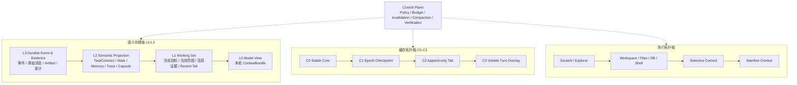
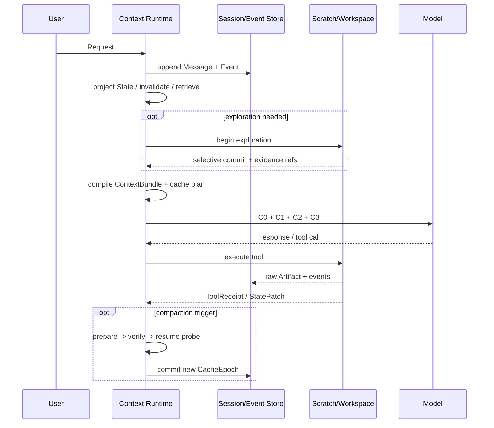

# Context Manager 新范式：Cache-aware Agent 的注意力操作系统

> 模型这一轮应该看见什么？

这是 Context Builder 每次调用模型前要回答的问题。

但一个真正面向长任务的 Context Manager，还必须同时回答另外三个问题：

```text
真实发生过什么，完整证据在哪里？
哪些内容应该留在当前工作记忆，哪些应该外置？
怎样压缩和重组上下文，同时尽量复用 KV / Prompt Cache？
跨越多个 context window 后，怎样证明目标、约束和任务状态没有丢？
```

因此，Context Manager 不能再被理解成一个 `messages[]` 管理器，也不能只在窗口快满时调用一次“请总结以上对话”。

更准确的定义是：

> **Context Manager 是 Agent 的上下文运行时。它把持久事实、当前状态、外部工作现场、探索分支和缓存拓扑，编译成下一次行动所需的最小充分上下文。**

本文在原有 L0–L3 分层基础上做一次完整重构。新的设计不再只有一条“存储层级”，而是三条互相正交的轴和一个控制面：

```text
语义存储轴：L0-L3
  管理信息是什么、放在哪里、谁是事实源。

缓存拓扑轴：C0-C3
  管理哪些 token 前缀稳定、哪些内容会导致 KV cache 分叉或失效。

执行拓扑轴：Mainline / Scratch / Workspace / Commit
  管理探索过程、工具中间结果和主任务上下文之间的隔离。

控制面：Policy / Budget / Validity / Compaction / Verification
  管理权限、预算、失效、压缩、恢复和审计。
```

一句话概括：

```text
Context Runtime =
  Durable Truth
  + Semantic Projection
  + Working Set
  + Context Compilation
  + Cache Planning
  + Scratch Isolation
  + Transactional Compaction
  + Resume Verification
```

---

## 一、为什么现在必须重新设计 Context Manager

截至 2026 年，主流 Agent 平台正在出现几个非常明确的收敛方向。

第一，**持久 session 与模型 context window 开始被明确分离**。Anthropic 的 Managed Agents 把 session event log 放在 harness 外部，模型可以按位置读取、回看和转换事件，而不是把 session 等同于当前 context window。[^anthropic-managed-agents]

第二，**compaction 已经从普通摘要升级为模型协议中的一等对象**。OpenAI Responses API 支持服务端和独立 `/compact`；Claude 支持 compaction block，并允许在 compaction block 后建立新的 prompt cache。[^openai-compaction][^claude-compaction]

第三，**Prefix Cache 开始提供显式控制和可观测性**。OpenAI 的新缓存接口支持 cache key、显式 breakpoint、cache read/write token；Claude 要求稳定前缀，并提供首个分歧点诊断。[^openai-prompt-cache][^claude-cache-diagnostics]

第四，**工具中间结果正在被移出模型上下文**。Programmatic tool calling、代码执行环境、文件系统和 SQLite 等机制，让大量筛选、聚合和探索留在执行环境中，只把少量结论交给模型。[^claude-programmatic-tools][^openai-computer-environment]

第五，**长任务的连续性不再只依赖对话摘要**。工程实践开始依赖任务清单、进度文件、Git、测试结果和持久 artifact，让新的 context window 能从外部工作现场恢复。[^anthropic-long-running-harness]

这些变化说明，原来的 L0–L3 方向仍然成立，但只解决了“信息放在哪里”。要处理 KV cache、大文件、探索噪声和跨窗口恢复，还必须新增缓存拓扑、执行隔离和可验证压缩协议。

---

## 二、先区分四种经常被混在一起的资源

Context 设计最常见的错误，是把“上下文窗口”“KV cache”“Agent 记忆”和“外部文件”当成同一件事。

它们分别解决不同问题。

| 资源 | 本质 | 主要目标 | 不能解决什么 |
| --- | --- | --- | --- |
| Context Window | 一次推理可被模型注意到的 token 范围 | 容纳当前任务需要的信息 | 不保证长上下文中的信息都能被准确使用 |
| Decode KV Cache | 单次生成过程中各层历史 token 的 K/V 张量 | 避免每生成一个 token 都重算前文 | 不提供跨请求记忆与任务恢复 |
| Prefix / Prompt Cache | 跨请求复用相同 token 前缀的 KV blocks | 降低 prefill 延迟与输入成本 | 不缩短逻辑上下文，也不减少注意力噪声 |
| Application Context Store | Event、Artifact、State、Memory、Workspace | 持久化、审计、检索、恢复、分支 | 不会自动变成模型可用上下文 |

这里有三个必须固定下来的结论。

### 1. Cache 命中不等于窗口变短

即使一个 300K-token 前缀全部命中 prompt cache，这 300K token 仍然属于模型输入，仍然占用 context window，也仍然参与注意力。Claude 文档明确说明，cached prompt prefixes 仍计入窗口。[^claude-context-window]

所以：

```text
Prompt Cache 优化重复计算。
Compaction 优化窗口占用。
Retrieval / Artifact 优化信息规模。
Context Builder 优化注意力分配。
```

它们不能互相替代。

### 2. 标准 KV 复用主要依赖公共前缀

OpenAI、Claude、vLLM 和 SGLang 的主流实现都围绕相同或完全一致的 prompt prefix 进行复用。vLLM 按包含前缀信息的 KV block hash 匹配，SGLang 的 RadixAttention 用 radix tree 管理共享前缀。[^vllm-prefix-cache][^sglang-radix]

可以把常规复用近似理解为：

```text
ReusableKV(request_a, request_b)
  ≈ KV(LongestCommonTokenPrefix(request_a, request_b))
```

### 3. 修改中间历史会让后续 KV 失效

在因果 Transformer 中，第 `i` 个位置的隐藏状态依赖 `1..i` 的前缀：

```text
H_i = f(x_1, x_2, ..., x_i)
K_i, V_i = project(H_i)
```

如果删除或修改第 `p` 个 token，那么 `p` 之后各位置的隐藏状态、位置和 K/V 都可能变化。标准 prefix cache 因此只能复用分歧点之前的部分。

这意味着：

> **不要把“事后删除大量工具结果”当成主要策略。更好的策略，是让大量中间结果从一开始就不要进入主线模型上下文。**

---

## 三、新架构：三轴一控制面的 Context Runtime

新的 Context Manager 可以画成下面这张图：


```mermaid
flowchart TB
  subgraph Semantic[语义存储轴 L0-L3]
    L3[L3 Durable Event & Evidence\n事件 / 原始消息 / Artifact / 审计]
    L2[L2 Semantic Projection\nTaskContract / State / Memory / Trace / Capsule]
    L1[L1 Working Set\n当前目标 / 当前阶段 / 活跃证据 / Recent Tail]
    L0[L0 Model View\n本轮 ContextBundle]
    L3 --> L2 --> L1 --> L0
  end

  subgraph Cache[缓存拓扑轴 C0-C3]
    C0[C0 Stable Core]
    C1[C1 Epoch Checkpoint]
    C2[C2 Append-only Tail]
    C3[C3 Volatile Turn Overlay]
    C0 --> C1 --> C2 --> C3
  end

  subgraph Execution[执行拓扑轴]
    MAIN[Mainline Context]
    SCRATCH[Scratch / Explorer]
    WORK[Workspace / Files / DB / Shell]
    COMMIT[Selective Commit]
    SCRATCH --> WORK --> COMMIT --> MAIN
  end

  CTRL[Control Plane\nPolicy / Budget / Invalidation / Compaction / Verification]
  CTRL -.-> Semantic
  CTRL -.-> Cache
  CTRL -.-> Execution
```

这三条轴不能混成一条层级。

L0–L3 回答：

```text
信息是什么？
事实源在哪里？
怎样从历史重建当前状态？
```

C0–C3 回答：

```text
哪些 segment 应该长期完全不变？
哪些 segment 只在一个阶段内稳定？
哪些内容应该 append-only？
哪些内容每轮都会变化？
```

执行拓扑回答：

```text
探索过程是否进入主线？
工具输出先在哪里加工？
什么结果值得提交给主 Agent？
```

控制面则约束所有流动：

```text
内容是否可信？
是否过期？
是否有权限进入模型？
是否值得占用 token？
是否需要 compact？
compact 后能否恢复？
```

---

## 四、语义存储轴：L0–L3 应该怎样重新定义

### L3：Durable Event & Evidence Layer

L3 是事实账本和完整证据仓库。

它保存：

```text
Append-only Event Log
Raw Messages
Tool Call / Tool Result
完整命令输出
完整文件、diff、截图、数据集
审批和权限事件
模型请求和响应元数据
ContextBundle build record
Compaction source range
验证结果和运行指标
```

L3 的核心不是“每轮都给模型看”，而是保证：

```text
可恢复
可审计
可回放
可重建
可验证 summary
可定位污染和失效
```

原始工具输出可以很大，但它应该作为 Artifact 存在，而不是作为一条永久驻留在消息历史中的文本。

### L2：Semantic Projection Layer

L2 是从 L3 投影出来的语义状态。

它保存：

```text
TaskContract
StateSnapshot
ContinuationCapsule
Memory
Decision Ledger
Accountable Trace
Artifact Summary / Index
Search Ledger
Policy Projection
Aggregated Stats
```

L2 可以有损，但必须有 provenance：

```text
sourceEventIds
sourceMessageIds
sourceArtifactSpans
contentHash
projectorVersion
summaryPromptVersion
```

L2 不是事实源。如果 L2 与 Git、测试结果、文件 hash 或原始 event 冲突，L3 和运行时事实优先。

### L1：Working Set Layer

L1 是当前任务正在使用的热工作集。

它不等于“最近 N 轮”。应该保留的是仍会影响下一步行动的内容：

```text
当前 TaskContract 版本
当前 phase / step
未完成 acceptance criteria
硬约束与用户纠正
当前 workspace checkpoint
活跃文件和 symbol refs
最近关键决策
最新验证结果
阻塞项和开放问题
未完成 tool pair
活跃 artifact refs
```

一条旧信息只要仍然决定下一步，就应该留在 L1。

一条新信息如果只是噪声、重复输出或探索死路，也不应该因为“最近”就自动进入 L1。

### L0：Model Request Layer

L0 是一次模型调用的临时视图。

它由 Context Compiler 生成，典型内容包括：

```text
稳定系统与工具协议
当前 cache epoch checkpoint
最小任务状态
必要 recent tail
本轮检索出的少量 evidence spans
当前用户请求
输出和工具调用约束
```

L0 可以被丢弃，因为它应该能够从 L1–L3 重建。

> **L0 是编译产物，不是数据库。**

### 四层关系

| 层级 | 主要问题 | 典型对象 | 是否事实源 | 生命周期 |
| --- | --- | --- | --- | --- |
| L0 | 本轮模型看什么 | `ContextBundle`、provider payload | 否 | 单次调用 |
| L1 | 当前任务正在用什么 | active state、recent tail、active refs | 否 | 当前阶段 |
| L2 | 历史怎样变成可继续工作的语义 | contract、snapshot、capsule、memory、trace | 否 | 跨阶段 / 跨窗口 |
| L3 | 实际发生过什么 | event、raw message、artifact、audit | 是 | 持久、append-only |

---

## 五、缓存拓扑轴：C0–C3 与 Cache Epoch

L0–L3 解决语义位置，但不会自动带来高 KV cache 命中率。

为了控制前缀稳定性，每一个进入模型的 segment 还应该标注一个 cache class。

### C0：Stable Core

C0 在一个应用版本或较长 session 周期内保持完全稳定：

```text
system policy
核心安全规则
稳定工具 schema
稳定输出协议
稳定 few-shot examples
稳定项目级规则
```

C0 中不要出现：

```text
当前时间
request_id
随机 UUID
动态 token 数
实时目录列表
每轮变化的工具顺序
当前 plan
临时检索内容
```

### C1：Epoch Checkpoint

C1 在一个任务阶段内稳定，只在发生实质状态切换时更新：

```text
TaskContract version
ContinuationCapsule
当前 phase
workspace manifest
artifact manifest
已确认决策
未完成 acceptance criteria
```

C1 变化意味着进入新的 **Cache Epoch**。

### C2：Append-only Active Tail

C2 是当前 epoch 中不断追加的短历史：

```text
最近 coherent turns
紧凑 tool receipts
最近决策和观察
验证结果
用户的增量纠正
```

一个 epoch 内，C2 应尽量遵守：

```text
只追加
不改旧 segment
不从中间删除
不重排
```

### C3：Volatile Turn Overlay

C3 每轮都会变化，放在 prompt 尾部：

```text
本轮检索出的 snippets
当前用户请求
实时环境信息
临时 evidence
当前 tool result preview
```

它的变化不应该破坏 C0/C1/C2 已经形成的公共前缀。

### 推荐的 prompt 布局

```text
┌──────────────────────────────────────────────┐
│ C0 Stable Core                              │
│ system / policy / stable tools / protocols  │
│                   ← cache breakpoint A      │
├──────────────────────────────────────────────┤
│ C1 Epoch Checkpoint                         │
│ task contract / capsule / workspace state   │
│                   ← cache breakpoint B      │
├──────────────────────────────────────────────┤
│ C2 Append-only Active Tail                  │
│ recent turns / tool receipts / validations  │
├──────────────────────────────────────────────┤
│ C3 Volatile Turn Overlay                    │
│ retrieved spans / current request           │
└──────────────────────────────────────────────┘
```

OpenAI 目前允许在可复用内容末尾显式设置 cache breakpoint；Claude 也建议在 system prompt 与 compaction block 后分别建立缓存边界。[^openai-prompt-cache][^claude-compaction]

### Cache Epoch 的正确理解

不要把 compaction 理解成“尽量修改旧历史，同时让旧 KV 全部继续有效”。这在标准 prefix cache 下通常做不到。

更合理的模型是：

```text
Epoch N
  C0 Stable Core
  + C1 Checkpoint N
  + C2 Tail N
  + C3 Turn Overlay

        ↓ transactional compaction

Epoch N+1
  C0 Stable Core              // 继续复用
  + C1 Checkpoint N+1         // 新写一次
  + New C2 Tail               // 后续持续复用
  + C3 Turn Overlay
```

所以 compaction 的缓存目标不是“零失效”，而是：

> **只让必要的一段发生一次性失效，并尽快建立新的稳定前缀，让新 epoch 在后续多轮中摊销。**

### Canonical Rendering

缓存匹配的是供应商最终渲染的内容，不是你内部对象的逻辑相等。

Context Compiler 必须保证：

```text
工具顺序稳定
JSON key 顺序稳定
空白和序列化稳定
prompt 模板有版本
相同输入生成相同 segment 顺序
图片、文件和工具定义不发生隐式变化
动态字段移到 C3
```

建议为每个 segment 计算两类 hash：

```ts
type SegmentFingerprint = {
  semanticHash: string; // canonical internal object
  renderedHash: string; // provider adapter 最终序列化后的内容
  tokenCount: number;
};
```

`semanticHash` 用于应用层失效和重建，`renderedHash` 用于定位 prompt cache 的首个分歧点。

---

## 六、执行拓扑轴：Mainline、Scratch、Workspace 与 Commit

长任务里最浪费 context 的，往往不是最终证据，而是找到证据之前的大量探索。

典型流程是：

```text
ls
find
rg 一个关键词
关键词不对
换目录
再 grep
读了三个错误文件
终于找到目标 symbol
```

如果每一步都进入主线 message history，之后再删除，就会同时损害窗口和 KV cache。

新的原则是：

> **探索不是主线对话的一部分。探索是一笔可提交或可放弃的事务。**

### Mainline

Mainline 只保存会影响后续任务的已提交事实：

```text
选择了哪些文件
为什么选择
关键 source spans
确认排除了什么
任务状态怎样变化
下一步是什么
```

### Scratch / Explorer

Scratch 用于：

```text
目录扫描
关键词尝试
候选排序
数据清洗
多次 API 查询
临时脚本
中间聚合
失败的探索路线
```

Scratch 可以是：

```text
独立短 context 的 explorer agent
programmatic tool runtime
shell / Python / SQL 进程
独立 branch
本地 scratchpad 文件
```

它拥有自己的 token budget、event scope 和 cache tail，不直接污染 Mainline。

### Workspace

Workspace 承担持久工作现场：

```text
文件系统
Git repository
SQLite / DuckDB
日志索引
临时结果文件
测试报告
生成的 artifact
```

OpenAI 的 computer environment 和 Anthropic 的 programmatic tool calling 都体现了这个方向：让数据在执行环境中被查询、过滤和转换，只把必要结果送进模型上下文。[^openai-computer-environment][^claude-programmatic-tools]

### Selective Commit

Scratch 完成后，只向 Mainline 提交一个结构化结果：

```ts
type ExplorationCommit = {
  explorationId: string;
  goal: string;

  selected: Array<{
    ref: string;
    reason: string;
    evidenceSpans: string[];
    contentHash?: string;
  }>;

  highValueNegativeFindings: Array<{
    finding: string;
    searchScope: string;
    evidenceRefs: string[];
  }>;

  statePatch?: Record<string, unknown>;
  openQuestions: string[];
  nextActions: string[];
};
```

失败的 grep 命令通常不需要进入 Mainline。

但以下负面结果值得保留：

```text
已经确认某个 symbol 不存在
某个目录已经完整排除
某个 API 版本不支持目标能力
某条路线已被实验明确否定
```

这些信息能避免 Agent 反复探索同一个死路。

---

## 七、重新设计 Context Ontology

原有 `Session / Event / Message / State / Stats / Memory / Artifact / Trace / Policy / ContextBundle` 仍然有价值。

但为了让 KV cache、探索隔离和自定义 compaction 成为一等能力，建议新增或显式拆出以下对象：

```text
TaskContract
ArtifactSpan
ToolReceipt
ExplorationRun
ExplorationCommit
CacheEpoch
ContextSegment
ContinuationCapsule
CompactionTransaction
ResumeProbe
```

### 1. TaskContract：目标不能藏在 summary 里

任务目标、交付物和验收标准应该是版本化的权威对象，而不是从历史消息中反复猜测。

```ts
type TaskContract = {
  contractId: string;
  version: number;
  sessionId: string;

  originalRequestRefs: string[];
  goal: string;
  deliverables: string[];

  acceptanceCriteria: Array<{
    id: string;
    description: string;
    status: "pending" | "pass" | "fail" | "blocked";
    evidenceRefs: string[];
  }>;

  hardConstraints: string[];
  softPreferences: string[];
  nonGoals: string[];

  createdAt: string;
  supersedesVersion?: number;
};
```

用户改变目标时，不要悄悄改写旧 contract。创建新版本，并记录 supersedes 关系。

这样既能审计，也能让 cache epoch 的变化有明确边界。

### 2. Event：事实先写入账本

```ts
type AgentEvent = {
  eventId: string;
  sessionId: string;
  branchId: string;
  seq: number;
  timestamp: string;

  type:
    | "UserInputReceived"
    | "ContractUpdated"
    | "ContextBuilt"
    | "ModelResponseReceived"
    | "ToolCallRequested"
    | "ToolCallFinished"
    | "ArtifactCreated"
    | "FileWritten"
    | "ValidationFinished"
    | "ExplorationStarted"
    | "ExplorationCommitted"
    | "CompactionPrepared"
    | "CompactionVerified"
    | "CacheEpochCommitted";

  actor: "user" | "agent" | "model" | "tool" | "system" | "subagent";
  payload: Record<string, unknown>;
  causality: {
    parentEventId?: string;
    toolCallId?: string;
    artifactId?: string;
    transactionId?: string;
  };
};
```

### 3. Artifact 与 ArtifactSpan：完整对象外置，模型只读范围

```ts
type Artifact = {
  artifactId: string;
  kind:
    | "file"
    | "diff"
    | "command_log"
    | "tool_output"
    | "dataset"
    | "screenshot"
    | "url_snapshot";

  uri: string;
  contentHash: string;
  byteSize: number;
  lineCount?: number;
  mimeType: string;
  encoding?: string;
  sourceEventId: string;

  sensitivity: "public" | "internal" | "secret";
  createdAt: string;
};

type ArtifactSpan = {
  spanId: string;
  artifactId: string;
  contentHash: string;

  startLine?: number;
  endLine?: number;
  byteOffset?: number;
  byteLength?: number;
  symbol?: string;
  timestampRange?: [string, string];

  summary?: string;
  reasonSelected?: string;
};
```

`contentHash` 是关键。文件变化后，旧 span 必须失效或重新验证。

### 4. ToolReceipt：不要让 raw output 成为永久 message

```ts
type ToolReceipt = {
  toolCallId: string;
  toolName: string;
  status: "success" | "error" | "partial";

  argsHash: string;
  summary: string;
  importantSpans: string[];
  artifactRefs: string[];

  sideEffects: Array<{
    kind: "file_write" | "process" | "network" | "db_write";
    ref: string;
  }>;

  truncated: boolean;
  continuationCursor?: string;
  sourceEventIds: string[];
};
```

L3 保存 raw output，L1/L0 通常只保留 ToolReceipt。

### 5. StateSnapshot：运行时事实的确定性投影

```ts
type StateSnapshot = {
  stateId: string;
  sessionId: string;
  branchId: string;
  version: number;
  sourceEventId: string;

  contractRef: { contractId: string; version: number };
  phase: "discover" | "plan" | "execute" | "verify" | "done" | "blocked";
  currentStep: string;

  completedSteps: string[];
  blockers: string[];
  openQuestions: string[];
  nextActions: string[];

  workspace: {
    cwd?: string;
    repoHead?: string;
    branch?: string;
    dirtyFiles: string[];
    runningProcesses: string[];
  };

  activeArtifacts: string[];
  lastValidationRefs: string[];
};
```

Git HEAD、dirty files、进程状态、测试状态等字段应该由确定性 projector 生成，而不是让 LLM 从聊天记录里猜。

### 6. ContextSegment：Context Compiler 的最小调度单元

```ts
type ContextSegment = {
  segmentId: string;
  kind:
    | "policy"
    | "tool_schema"
    | "task_contract"
    | "state"
    | "capsule"
    | "message"
    | "tool_receipt"
    | "artifact_span"
    | "memory"
    | "current_request";

  cacheClass: "C0" | "C1" | "C2" | "C3" | "NEVER_SEND";
  priority: "P0" | "P1" | "P2" | "P3";
  trust: "operator" | "user" | "runtime" | "tool" | "retrieved" | "untrusted";

  sourceRefs: string[];
  invalidationKeys: string[];
  semanticHash: string;
  renderedHash?: string;

  tokenEstimate: number;
  droppable: boolean;
  compressible: boolean;
};
```

### 7. CacheEpoch：缓存稳定性的会话边界

```ts
type CacheEpoch = {
  epochId: string;
  sessionId: string;
  branchId: string;
  sequence: number;

  stableCoreHash: string;
  checkpointHash: string;
  taskContractVersion: number;
  stateVersion: number;

  startedAt: string;
  endedAt?: string;
  endReason?: "compaction" | "goal_changed" | "phase_changed" | "branch_merge";
};
```

### 8. ContinuationCapsule：跨窗口恢复的结构化载体

Continuation Capsule 不是普通 summary。它是一个经过验证、可独立启动新 context 的恢复包。

详细结构会在后文的自定义 compaction 场景中给出。

---

## 八、Context Compiler：不是拼 messages，而是编译 segment

Context Builder 应该升级为 Context Compiler。

它的输入不是一整个历史数组，而是一组带来源、优先级、信任等级、失效条件和 cache class 的 segment candidates。

### 编译流水线

```text
1. Resolve
   读取 active session、contract、state、policy、branch、workspace。

2. Invalidate
   根据 file hash、policy version、contract version、TTL 清除过期投影。

3. Retrieve
   检索 memory、artifact spans、recent decisions 和必要历史。

4. Normalize
   把不同来源转换成统一 ContextSegment。

5. Rank
   按必要性、相关性、信任、freshness、风险和 token 成本排序。

6. Pack
   先放不可丢 P0，再放 P1；P2/P3 按边际价值填充。

7. Cache Plan
   按 C0-C3 排序，选择 breakpoint，计算 epoch 和 segment hashes。

8. Render
   通过 provider adapter 生成最终 tools/system/messages/items。

9. Record
   保存 ContextBundle、source refs、淘汰原因、rendered hash 和 cache stats。
```

### 优先级

| 优先级 | 内容 | 处理规则 |
| --- | --- | --- |
| P0 | Policy、当前请求、TaskContract 核心、pending tool pair | 不可丢 |
| P1 | 当前 state、验收项、workspace checkpoint、最新验证、关键 evidence | 可压缩，不可语义丢失 |
| P2 | 决策摘要、活跃 memory、相关 artifact spans | 按价值和预算选择 |
| P3 | 旧闲聊、重复解释、低价值工具输出、探索过程 | 默认不进入或最先淘汰 |

### 价值密度

可以给候选 segment 一个近似评分：

```text
ContextValue(segment) =
  Relevance
  × Necessity
  × Trust
  × Freshness
  × FutureUtility
  / TokenCost
```

这不是要让一个公式代替工程判断，而是提醒系统：

```text
更多 token 不等于更多有效 context。
高相关、高可信、可验证的短证据，通常比一大段原始历史更有价值。
```

### 可解释输出

```ts
type ContextBundle = {
  bundleId: string;
  sessionId: string;
  branchId: string;
  epochId: string;

  segments: ContextSegment[];
  providerPayloadRef: string;

  budget: {
    maxInputTokens: number;
    reservedOutputTokens: number;
    usedTokens: number;
  };

  cachePlan: {
    breakpoints: string[];
    stablePrefixTokens: number;
    epochCheckpointTokens: number;
    tailTokens: number;
    volatileTokens: number;
  };

  excluded: Array<{
    sourceRef: string;
    reason: "irrelevant" | "expired" | "budget" | "untrusted" | "scratch_only";
  }>;
};
```

同一个 state、同一个 retrieval result、同一个 provider adapter 版本，应当产生确定性的 ContextBundle。

---

## 九、场景一：超级大文件或海量 Bash 日志应该怎样读取

这是 Context Manager 最容易被“长上下文窗口”误导的场景。

错误做法是：

```text
文件很大，但模型窗口也很大，所以先全部塞进去。
日志很多，先返回完整 stdout，后面再 compact。
```

这会同时造成：

```text
窗口占用
注意力噪声
prefill 成本
工具结果历史膨胀
未来 compaction 的缓存失效
敏感信息暴露
```

正确范式是：

> **大对象先成为可寻址 Artifact，再通过渐进披露协议读取。**

### 1. 第一级：只读元数据

模型先获得：

```yaml
artifact_id: log_20260710_01
kind: command_log
byte_size: 483298004
line_count: 3920187
mime_type: text/plain
encoding: utf-8
content_hash: sha256:...
created_at: 2026-07-10T05:20:00Z
```

这一步让 Agent 决定下一种访问方式，而不是盲目读取全文。

### 2. 第二级：建立结构地图

对代码仓库：

```text
repo tree
file sizes
language distribution
symbol index
imports / references
Git status / diff
测试目录和构建入口
```

对日志：

```text
时间范围
severity 分布
process / thread 分布
correlation_id / trace_id
错误模板及计数
首次与最后一次出现
stack trace 边界
异常峰值时间段
```

对结构化数据：

```text
schema
columns
row count
null ratio
partition keys
sample rows
统计摘要
```

### 3. 第三级：先搜索，再读 span

工具协议不应该只有：

```text
read_file(path)
```

至少应该支持：

```text
artifact.stat(id)
artifact.map(id)
artifact.search(id, query, filters, limit)
artifact.read_lines(id, start, end)
artifact.read_bytes(id, offset, length)
artifact.expand_span(spanId, before, after)
artifact.read_symbol(id, symbol)
artifact.diff(oldHash, newHash)

log.profile(id, filters)
log.group_templates(id, filters)
log.window(id, timestamp, beforeMs, afterMs)
log.trace(id, traceId)
log.sample(id, strategy, limit)
```

返回结果必须包含来源位置：

```yaml
artifact_id: log_20260710_01
content_hash: sha256:...
spans:
  - span_id: span_123
    start_line: 18420
    end_line: 18471
    reason: "first database timeout followed by retry exhaustion"
truncated: true
next_cursor: cursor_456
```

### 4. 第四级：在执行环境中聚合，不让中间数据进入模型

大量日志处理应该在 shell、Python、SQL、DuckDB 或 programmatic tool runtime 中完成：

```python
rows = parse_log(artifact)
errors = rows.filter(severity="ERROR")
groups = group_by_template(errors)
result = top_anomalies(groups, limit=20)
return compact_finding_set(result)
```

模型只接收：

```text
20 个错误模板的频率
最早与最晚出现时间
代表性 span
异常前后窗口
与目标问题相关的 3 个假设
```

Anthropic 对 10MB 日志的例子和 OpenAI 对 shell output cap 的设计，都指向相同原则：先在执行环境中压缩数据，再让模型推理。[^claude-advanced-tools][^openai-computer-environment]

### 5. 第五级：确实需要全局理解时，使用层级摘要树

如果任务需要理解整份规范、合同、代码库或日志周期，不能只做局部 RAG。

可以建立：

```text
Artifact Root
  ├── Section / Time Partition
  │     ├── Chunk summary
  │     ├── entities / symbols
  │     ├── claims / anomalies
  │     └── source spans
  └── Root synthesis
```

但摘要最好是 query-conditioned：

```text
面向“内存泄漏”的摘要
面向“鉴权失败”的摘要
面向“API 兼容性”的摘要
```

不要假设一份通用摘要能覆盖所有未来问题。

### 6. 什么时候使用显式 context cache

Gemini 等平台允许把大文件或多模态对象显式缓存，适合“同一大对象被大量短查询重复引用”的场景。[^gemini-context-cache]

但选择前要区分两类需求：

| 需求 | 推荐策略 |
| --- | --- |
| 每个问题只需要大文件中的少量局部证据 | Artifact index + retrieval + span read |
| 每个问题都需要对整个对象进行全局推理，且对象稳定、重复使用频繁 | provider explicit cache 可作为优化 |
| 对象超过窗口或包含大量无关信息 | 外部处理 + 层级摘要，不应整块缓存进模型 |
| 日志持续追加 | 分区 Artifact + 增量索引 + 最新窗口，不要反复重建整块前缀 |

显式 cache 是成本和延迟优化，不是信息架构。

---

## 十、场景二：找文件的探索阶段不应该进入主线 KV cache

文件定位通常是一个高分支、低复用的过程：

```text
先找目录
再找文件名
再搜关键词
再看 symbol
再排除生成目录
最后定位到两个候选文件
```

这部分有价值，但其价值主要在“产生最终定位”，而不是让主 Agent 永久记住每次失败的搜索输出。

### 1. 使用 Exploration Transaction

```text
BEGIN EXPLORATION
  -> DISCOVER
  -> NARROW
  -> VERIFY
  -> COMMIT or ABORT
END
```

#### ExplorationRun

```ts
type ExplorationRun = {
  explorationId: string;
  sessionId: string;
  parentBranchId: string;
  scratchBranchId: string;

  goal: string;
  workspaceHash: string;
  status: "running" | "committed" | "aborted" | "expired";

  queries: Array<{
    tool: string;
    queryHash: string;
    resultArtifactRef: string;
    candidateCount: number;
  }>;

  selectedCandidates: string[];
  rejectedCandidates: string[];
  expiresAt?: string;
};
```

Search Ledger 存在 L3/L2，用于审计和避免重复搜索，但默认不进入 Mainline L1/L0。

### 2. Explorer 使用独立短上下文

```text
Mainline Epoch:
  C0 Stable Core
  + C1 Main Task Checkpoint
  + C2 Main Tail

Explorer Epoch:
  C0 Stable Core
  + C1 Search Goal
  + Scratch Tail
```

两者可以共享稳定 C0，但分叉后的历史互不污染。

### 3. 工具只返回 handle 和摘要

例如目录扫描不要一次返回十万路径：

```yaml
query: "find candidate auth handlers"
result_handle: search_abc
candidate_count: 1824
facets:
  by_directory:
    src/auth: 84
    src/gateway: 32
    vendor: 1601
  by_extension:
    ts: 107
    json: 11
next_actions:
  - "exclude vendor and generated"
  - "search symbols validateToken|refreshToken"
```

模型通过 handle 继续缩小范围。

### 4. 只提交高价值结论

```yaml
exploration_commit:
  goal: "定位 refresh token 的处理位置"
  selected_files:
    - path: src/gateway/token-refresh.ts
      content_hash: sha256:...
      reason: "定义 rotateRefreshToken，并被 auth middleware 调用"
      evidence_spans:
        - artifact://repo/src/gateway/token-refresh.ts#L31-L118
    - path: src/auth/middleware.ts
      content_hash: sha256:...
      reason: "调用 rotateRefreshToken 并写入 cookie"
      evidence_spans:
        - artifact://repo/src/auth/middleware.ts#L82-L141
  excluded_scopes:
    - vendor/**
    - generated/**
  important_negative_findings:
    - "未发现独立 OAuth callback handler"
  open_questions:
    - "移动端 token 是否由另一个 gateway 管理"
```

### 5. 不要“先污染，再删除”

探索隔离的意义不只是节省 token。

它还避免：

```text
主线 prefix cache 被大量不同搜索结果切断
错误候选在后续被误当成事实
临时敏感数据进入模型
失败路线被重复总结
subagent 长报告重新污染主线
```

这比后续 Context Editing 更根本。

---

## 十一、场景三：压缩或删除工具结果时，怎样尽量保持 KV cache

先给结论：

> **删除中间历史会从删除点开始破坏标准 prefix cache。无法保证旧 KV 大部分仍然可用。**

Claude 的 Context Editing 文档也明确指出，清理旧 tool results 会使清理点后的缓存前缀失效，因此建议一次至少清理足够多的 token，使重写缓存值得发生。[^claude-context-editing]

所以，正确策略不是追求“不失效”，而是降低失效频率和失效范围。

### 1. 原始大输出首次就不要进入主线

工具执行后先写 Artifact，再生成 ToolReceipt：

```yaml
tool_call_id: call_123
status: success
summary: "发现 4 个失败测试，均与 serializer 空格处理有关"
artifact_refs:
  - artifact://test-run/456
important_spans:
  - artifact://test-run/456#L180-L244
side_effects: []
truncated: true
```

主线从一开始就只有几百 token，而不是几十万 token。

### 2. 一个 epoch 内保持 append-only

不要每隔几轮就修改旧消息。

```text
Epoch 内：追加 receipt、决策和验证结果。
达到阈值：一次性 compact，建立新 epoch。
```

### 3. 把 C0 与 C1 分别设置 breakpoint

至少保住：

```text
C0：system / policy / stable tools
C1：current task checkpoint / compaction capsule
```

当 C1 更新时，C0 继续复用；只需要为新的 C1 写一次缓存。

### 4. 批量清理，不做高频小清理

可以使用一个简单的摊销条件：

```text
CompactionCost =
  SummaryGenerationCost
  + NewCheckpointCacheWriteCost
  + VerificationCost

ExpectedSaving =
  ExpectedFutureTurns
  × TokensRemovedPerTurn
  × UncachedInputUnitCost

当 ExpectedSaving > CompactionCost，且恢复风险可接受时再 compact。
```

还应考虑延迟、窗口风险和注意力质量，而不只是价格。

### 5. Tool pair 必须是原子单元

```text
assistant tool_call
user/tool tool_result
```

未完成 pair 不能跨 compaction 被拆开。

已经完成、且 side effects 已写入 Event/State/Artifact 的 pair，才能被替换为 ToolReceipt。

### 6. 保持工具 schema 稳定

工具定义通常位于 prompt 前部。频繁增删、重排工具，会让很早的位置发生分歧。

工具很多时，可以使用：

```text
稳定的 tool-search 元工具
deferred tool loading
按需加载 schema
programmatic tool runtime
```

而不是每轮把不同的数百个 tool schemas 放进 C0。

### 7. 记录首个缓存分歧点

```ts
type CacheStats = {
  stablePrefixTokens: number;
  checkpointTokens: number;
  activeTailTokens: number;
  volatileTokens: number;

  cacheReadTokens: number;
  cacheWriteTokens: number;
  uncachedTokens: number;

  firstDivergenceSegment?: string;
  cacheHitRatio: number;
  epochAmortizedTurns: number;
};
```

没有这些指标，Context Manager 只能靠猜测优化 cache。

---

## 十二、场景四：不用官方 compaction，怎样保证目标和任务不丢

供应商原生 compaction 可以携带模型训练过的状态，OpenAI 的 compaction item 甚至是不可读的加密对象。自定义实现无法复刻内部表示。[^openai-compaction]

但自定义 Context Manager 仍然可以可靠地保存工程上真正需要的连续性：

```text
任务目标
交付物
验收标准
硬约束
当前阶段
真实 workspace 状态
已验证事实
关键决策
活跃证据
阻塞项
开放问题
下一步动作
```

关键是：

> **不要让一段自然语言 summary 同时承担状态数据库、任务契约和恢复协议。**

### 1. 使用 Continuation Capsule

```ts
type ContinuationCapsule = {
  schemaVersion: string;
  capsuleId: string;
  sessionId: string;
  branchId: string;
  cacheEpoch: number;

  task: {
    contractId: string;
    contractVersion: number;
    goal: string;
    deliverables: string[];
    hardConstraints: string[];
    nonGoals: string[];
    acceptanceCriteria: Array<{
      id: string;
      description: string;
      status: "pending" | "pass" | "fail" | "blocked";
      evidenceRefs: string[];
    }>;
  };

  execution: {
    phase: string;
    currentStep: string;
    completedSteps: string[];
    blockers: string[];
    openQuestions: string[];
    nextActions: string[];
  };

  workspace: {
    cwd?: string;
    repoHead?: string;
    branch?: string;
    dirtyFiles: Array<{
      path: string;
      contentHash?: string;
      diffRef?: string;
      changeSummary: string;
    }>;
    runningProcesses: string[];
    environmentRefs: string[];
  };

  knowledge: {
    verifiedFacts: Array<{
      fact: string;
      confidence: number;
      sourceRefs: string[];
      invalidationCondition?: string;
    }>;
    decisions: Array<{
      decision: string;
      rationaleSummary: string;
      evidenceRefs: string[];
      rejectedAlternatives?: string[];
    }>;
  };

  artifacts: Array<{
    artifactId: string;
    kind: string;
    contentHash?: string;
    summary: string;
    importantSpans: string[];
  }>;

  toolState: {
    pendingToolPairs: string[];
    importantFailures: string[];
    retryPolicies: string[];
  };

  provenance: {
    sourceEventRange: [string, string];
    sourceMessageIds: string[];
    sourceArtifactRefs: string[];
    projectorVersion: string;
    compactorModel: string;
    compactionPromptVersion: string;
    capsuleHash: string;
  };
};
```

### 2. Compaction 必须是事务，不是直接覆盖

```text
PREPARE
  冻结安全切点，保存 source range。

PROJECT
  用确定性 projector 读取 Git、文件、测试、process、event。

SUMMARIZE
  LLM 只负责非结构化发现、决策理由和必要叙事。

ASSEMBLE
  合并 TaskContract、StateSnapshot、Artifact Manifest 与 narrative。

VERIFY
  运行确定性 invariant checks 和语义 verifier。

RESUME PROBE
  用干净 context 测试 Capsule 是否足以恢复。

COMMIT
  创建新 CacheEpoch，旧 epoch 保留为可回滚版本。
```

如果任何一步失败，不提交新 epoch。

#### 安全切点

只能在以下位置 compact：

```text
完整 user/assistant turn 之后
完整 tool_call/tool_result pair 之后
文件写入和 side effect 已经落账之后
验证结果已记录之后
当前状态可以被确定性重建的位置
```

### 3. 权威来源必须有优先级

```text
Runtime / Git / File Hash / Tests / Event Log
  > User-authored TaskContract
  > Deterministic State Projection
  > LLM-generated Narrative Summary
```

例如 summary 写着“测试已经通过”，但最新测试 Event 是 fail，必须以测试 Event 为准。

### 4. Compaction Verifier

至少检查：

```text
goal 是否存在且与当前 TaskContract 一致
deliverables 是否完整
acceptance criteria 是否全部保留
hard constraints 和 non-goals 是否完整
current step 和 next actions 是否存在
所有 FileWritten 是否进入 workspace 或 artifact manifest
pending tool pair 是否完整
最新 validation 是否被引用
关键事实是否有 sourceRefs
artifact refs 是否可读取且 hash 匹配
branch / repo HEAD 是否正确
```

示例：

```ts
type CompactionVerification = {
  goalPreserved: boolean;
  constraintsPreserved: boolean;
  acceptanceCriteriaCoverage: number;
  workspaceStateConsistent: boolean;
  pendingToolPairsPreserved: boolean;
  sourceCoverage: number;
  artifactRefsValid: boolean;
  semanticRisk: "low" | "medium" | "high";
  errors: string[];
};
```

### 5. Fresh-context Resume Probe

用一个全新的模型请求，只提供：

```text
C0 Stable Core
Continuation Capsule
Workspace Manifest
必要的最新 tail
```

要求模型结构化返回：

```yaml
understood_goal: ...
required_deliverables: ...
hard_constraints: ...
current_phase: ...
current_step: ...
known_workspace_state: ...
next_action: ...
required_evidence_before_completion: ...
```

系统再把这些字段与 TaskContract 和 StateSnapshot 比较。

只有 probe 通过，才正式切换到新 epoch。

### 6. 把连续性固化到 workspace

对 coding agent，建议在项目中持久化：

```text
.agent/task-contract.json
.agent/progress.json
.agent/decisions.jsonl
.agent/artifacts.json
.agent/last-validation.json
.agent/context-epoch.json
Git history
test reports
```

其中：

```text
TaskContract 定义必须完成什么。
Acceptance Tests 定义怎样才算完成。
Progress State 定义目前做到哪里。
Git / Workspace 定义环境实际上是什么。
Narrative Summary 解释为什么走到这里。
```

Anthropic 的长任务实践也发现，仅有 compaction 不够；进度文件、feature list、Git 和验证流程能帮助新的 context window 恢复。[^anthropic-long-running-harness]

一句话：

> **Compact narrative，不要 compact authoritative state。**

---

## 十三、Compaction 的触发条件不应该只有 token 阈值

窗口水位当然重要，但不是唯一信号。

建议综合以下条件：

```text
Window pressure
  输入 token 接近安全水位。

Attention pressure
  原始工具结果、低价值历史占比过高。

Phase boundary
  discover -> execute、execute -> verify 等阶段切换。

State stability
  当前已有可验证 checkpoint，适合切 epoch。

Cache economics
  新 checkpoint 的未来复用轮数足以摊销重写成本。

Branch operation
  branch merge、subagent handoff、长探索完成。

Risk signal
  模型开始重复、遗忘约束、错误引用旧状态。
```

可以定义：

```ts
type CompactionPolicy = {
  maxInputTokenRatio: number;
  maxLowValueTokenRatio: number;
  minTokensToRemove: number;
  minExpectedFutureTurns: number;
  allowedPhases: string[];
  requireCleanToolBoundary: boolean;
  requireWorkspaceCheckpoint: boolean;
  requireResumeProbe: boolean;
};
```

不要等到窗口只剩最后几千 token 才 compact。那时 summary、verification 和恢复本身也需要空间。

---

## 十四、工具结果的生命周期应该怎样治理

工具结果不是一种单一数据类型。建议在进入 Context Manager 时先分类。

| 类型 | 示例 | 处理方式 |
| --- | --- | --- |
| Streaming Noise | progress bar、重复 stdout、心跳 | 只记 metrics，默认丢弃正文 |
| Durable Evidence | 测试报告、文件内容、API response | 完整写 Artifact，生成 spans |
| State-changing Result | 文件写入、DB 更新、进程启动 | 写 Event + State Patch + Artifact |
| Pending Causal Result | 未完成 tool pair | 原样保留到 pair 完整 |
| Derived Finding | 聚合、筛选、统计结论 | 写 Finding/ToolReceipt，带 source refs |
| Sensitive Result | secret、PII、内部凭证 | 先 redact / policy gate，再决定模型可见内容 |

工具 wrapper 可以直接支持：

```ts
exec({
  command,
  capture: "artifact",
  preview: "head_tail",
  maxPreviewTokens: 500,
  redactPolicy: "default",
  return: "receipt"
});
```

OpenAI shell tool 对输出设置 cap，并保留开头和结尾，就是一种运行时层面的 bounded receipt。[^openai-computer-environment]

---

## 十五、Memory、Retrieval、Subagent 都必须走 Commit Gate

任何外部来源都不能直接进入主线 L0：

```text
Memory
Retrieval
Web results
Subagent report
MCP result
Workspace note
```

统一路径应该是：

```text
External Source
  -> Scope / Permission Check
  -> Trust & Freshness Evaluation
  -> Artifact / Evidence Span
  -> Optional State Patch
  -> ContextSegment
  -> Context Compiler
```

### Memory

Memory 必须包含：

```text
scope
source refs
confidence
TTL 或 invalidation condition
sensitivity
usage record
```

不要把一次任务中的猜测直接提升为跨项目长期记忆。

### Retrieval

检索命中只代表“相似”，不代表“正确”。

进入模型前要记录：

```text
query
retrieval score
source authority
content hash
freshness
permission scope
selected span
```

### Subagent

Subagent 不应该返回一篇无法验证的长报告。

推荐输出：

```yaml
subagent_commit:
  goal: ...
  findings:
    - claim: ...
      evidence_refs: [...]
      confidence: 0.9
  artifacts: [...]
  changes: [...]
  risks: [...]
  unresolved: [...]
  recommended_next_actions: [...]
```

分支是探索隔离，commit 是事实提升。

---

## 十六、失效与刷新：Context 不是只会增长

成熟 Context Runtime 必须显式管理 invalidation。

典型规则：

```text
文件 hash 变化
  -> 旧 ArtifactSpan 和文件摘要失效。

测试重新运行
  -> 旧 validation 降级为历史证据，最新结果成为 active。

用户更新目标
  -> 新 TaskContract version，新 CacheEpoch。

Policy 变化
  -> C0 或 C1 失效，重新渲染权限和工具边界。

Workspace branch 切换
  -> 非当前 branch 的 state 不得进入 Mainline。

Memory TTL 到期
  -> 不允许直接召回，需重新验证。

Search Ledger 的 workspaceHash 变化
  -> 旧负面搜索结论可能失效。
```

每个投影对象都应该声明 invalidation keys：

```ts
invalidationKeys: [
  "file:src/auth.ts@sha256:...",
  "task-contract:v7",
  "policy:workspace-write:v3",
  "repo-head:abc123",
]
```

---

## 十七、完整生命周期

一次请求通过 Context Runtime 的路径可以写成：

```text
User Request
  -> append raw Message + Event to L3
  -> update / version TaskContract if needed
  -> deterministic State Projection to L2
  -> invalidate stale projections
  -> maybe start Scratch Exploration
  -> commit selected findings to Mainline
  -> activate L1 Working Set
  -> compile C0-C3 ContextBundle
  -> call model
  -> append model output and tool events to L3
  -> run tools in Workspace
  -> write raw output to ArtifactStore
  -> produce ToolReceipt / State Patch
  -> validate side effects
  -> maybe prepare transactional compaction
  -> verify and commit new CacheEpoch
  -> next loop
```


```mermaid
sequenceDiagram
  participant U as User
  participant CM as Context Runtime
  participant S as Session/Event Store
  participant X as Scratch/Workspace
  participant M as Model

  U->>CM: Request
  CM->>S: append Message + Event
  CM->>CM: project State / invalidate / retrieve
  opt exploration needed
    CM->>X: begin exploration
    X-->>CM: selective commit + evidence refs
  end
  CM->>CM: compile ContextBundle + cache plan
  CM->>M: C0 + C1 + C2 + C3
  M-->>CM: response / tool call
  CM->>X: execute tool
  X-->>S: raw Artifact + events
  X-->>CM: ToolReceipt / StatePatch
  opt compaction trigger
    CM->>CM: prepare -> verify -> resume probe
    CM->>S: commit new CacheEpoch
  end
```

---

## 十八、可观测性：Context Manager 必须能回答“为什么”

至少要监控四组指标。

### 1. Window 与 Attention

```text
input tokens
reserved output tokens
P0/P1/P2/P3 token 占比
raw tool token 占比
retrieved but unused ratio
context age distribution
```

### 2. Cache

```text
cache read tokens
cache write tokens
uncached input tokens
stable prefix length
first divergence segment
cache hit ratio
epoch lifetime
epoch amortized turns
```

### 3. Artifact 与探索

```text
raw bytes processed
model-visible preview tokens
reduction ratio
exploration tool calls
committed findings
aborted explorations
negative findings reused
```

### 4. Compaction 与恢复

```text
tokens before / after
source coverage
acceptance criteria coverage
resume probe pass rate
goal drift rate
constraint loss rate
workspace mismatch count
post-compaction regression rate
```

`/context` 调试命令最好能展示：

```text
当前 L1 Working Set
本轮 L0 segment 列表
每个 segment 的来源和淘汰理由
C0-C3 token 分布
当前 CacheEpoch
首个 cache divergence
活跃 artifact refs
最近一次 compaction verification
```

---

## 十九、关键工程不变量

下面这些规则应该直接进入单元测试、replay verifier 和生产监控。

```text
Invariant 1:
  L3 raw event log is append-only.

Invariant 2:
  L0 ContextBundle 可丢弃，但必须能从 L1-L3 重建。

Invariant 3:
  TaskContract 是目标与验收标准的权威来源，不能由 summary 覆盖。

Invariant 4:
  所有 StateSnapshot、Memory、Trace、Capsule 必须有 source refs。

Invariant 5:
  Every tool_result must have a preceding tool_call.

Invariant 6:
  Pending tool pair cannot be removed or split by compaction.

Invariant 7:
  大型工具输出、文件、日志和 diff 首先进入 ArtifactStore。

Invariant 8:
  模型可见 ArtifactSpan 必须带 content hash 和精确位置。

Invariant 9:
  一个 CacheEpoch 内的 C2 只允许 append，不允许中间改写或重排。

Invariant 10:
  C0 不得包含 request-level 动态字段。

Invariant 11:
  Provider payload 使用 canonical rendering；相同输入必须生成相同顺序和序列化。

Invariant 12:
  Compaction 必须创建新 CacheEpoch，而不是静默修改旧 epoch。

Invariant 13:
  Compaction 必须是 prepare / verify / commit 事务，失败可回滚。

Invariant 14:
  Every FileWritten event must appear in workspace state or artifact manifest.

Invariant 15:
  Compaction 后必须通过 fresh-context resume probe。

Invariant 16:
  Cached tokens 不能被计作 context-window savings。

Invariant 17:
  Scratch / Explorer 输出默认不能直接进入 Mainline。

Invariant 18:
  ExplorationCommit 必须包含选择理由和 evidence refs。

Invariant 19:
  Branch 不能修改 ancestor branch 的 state、event 或 artifact。

Invariant 20:
  Memory write requires scope、source、confidence、TTL/invalidation 和 sensitivity。

Invariant 21:
  ContextBundle 中每个 segment 都必须可解释：来源、优先级、cache class、是否可丢。

Invariant 22:
  最新 runtime evidence 与 summary 冲突时，runtime evidence 获胜。
```

---

## 二十、常见反模式

### 反模式一：把大窗口当成 Context Manager

```text
窗口有 1M token，所以全部放进去。
```

问题是成本、延迟、context rot、证据混淆和未来 compaction 都会恶化。

### 反模式二：命中 cache 就认为没有上下文成本

缓存只降低重复 prefill，不能消除窗口和注意力占用。

### 反模式三：探索结果先全部进主线，之后再删除

这样既污染 Mainline，也会让删除点后的 prefix cache 失效。

### 反模式四：工具输出就是 message

工具结果应该先被分类、Artifact 化和生成 receipt。

### 反模式五：频繁做小规模 context editing

每次中间清理都会制造新的 prefix 分歧。应当批量清理并切换 epoch。

### 反模式六：一段 summary 承担所有状态

自然语言 summary 无法稳定承担任务契约、workspace state、证据索引和 pending tool pair。

### 反模式七：compact 后立即相信模型能继续

没有 verifier 和 resume probe，就无法知道目标、约束或文件状态是否已经丢失。

### 反模式八：Memory、Retrieval、Subagent 直接写进 prompt

它们必须先通过 scope、trust、freshness、policy 和 commit gate。

### 反模式九：为了 cache 命中拒绝清理无用 token

保留无用 token 可能省 prefill，却持续消耗窗口、注意力和每轮输入成本。

正确目标是全局最优，而不是单独最大化 cache hit ratio。

---

## 二十一、MVP 落地顺序

不要一开始就做复杂向量记忆和多 Agent 编排。

### Phase 1：事实、任务和 Artifact

```text
Session
Append-only Event Log
TaskContract
StateSnapshot
Artifact / ArtifactSpan
ToolReceipt
ContextBundle build record
```

先保证：

```text
大输出不进入主线
目标和验收标准显式化
每次模型调用可重建和可解释
```

### Phase 2：Cache-aware Context Compiler

```text
ContextSegment
C0-C3 分类
canonical rendering
segment hashes
cache breakpoints
cache read/write metrics
first divergence diagnostics
```

### Phase 3：Scratch Exploration

```text
ExplorationRun
Search Ledger
独立 scratch branch
programmatic filtering
ExplorationCommit
```

### Phase 4：Transactional Compaction

```text
ContinuationCapsule
CompactionTransaction
deterministic projector
verifier
fresh-context resume probe
CacheEpoch rotation
```

### Phase 5：Memory、Subagent 与 Eval

```text
memory governance
branch merge protocol
subagent commit contract
context regression suite
long-horizon replay eval
```

### 最小接口

```ts
interface ContextRuntime {
  appendEvent(event: AgentEvent): Promise<void>;
  putArtifact(input: PutArtifactInput): Promise<Artifact>;
  projectState(sessionId: string, branchId: string): Promise<StateSnapshot>;

  beginExploration(input: BeginExplorationInput): Promise<ExplorationRun>;
  commitExploration(input: ExplorationCommit): Promise<void>;
  abortExploration(explorationId: string): Promise<void>;

  buildContext(input: BuildContextInput): Promise<ContextBundle>;

  prepareCompaction(input: PrepareCompactionInput): Promise<CompactionTransaction>;
  verifyCompaction(transactionId: string): Promise<CompactionVerification>;
  commitCompaction(transactionId: string): Promise<CacheEpoch>;

  resume(sessionId: string, branchId?: string): Promise<ResumeResult>;
}
```

---

## 二十二、最终范式

现在可以把整套设计收束成一句更完整的话：

> **Context Manager 是一个 Cache-aware Context Runtime：它把 L3 的持久事件和完整证据投影为 L2 的任务契约、状态和恢复胶囊，激活为 L1 的当前工作集，再按 C0–C3 的缓存拓扑编译成 L0 模型视图；探索和大数据处理留在 Scratch/Workspace，只通过结构化 Commit 进入主线；compaction 则以事务方式创建新的 CacheEpoch，并通过 verifier 与 fresh-context resume probe 证明任务连续性。**

四个最重要的设计结论是：

```text
第一，大文件和日志不是 prompt，而是可寻址、可检索、可分片的 Artifact。

第二，探索过程不是主线历史，而是可提交或放弃的 Scratch Transaction。

第三，删除旧工具结果必然可能破坏后续 prefix cache；正确做法是前置外置、epoch 内 append-only、批量切换新 checkpoint。

第四，自定义 compact 不应只生成 summary，而应生成 TaskContract + StateSnapshot + ContinuationCapsule，并经过确定性验证和干净上下文恢复测试。
```

最后再压成一句话：

> **不要把模型窗口当工作现场，不要把 prompt cache 当记忆，不要把 summary 当事实源。真正可靠的 Agent，把事实留在外部，把状态做成投影，把探索隔离在 scratch，把模型输入当作一次可重建、可缓存、可验证的编译产物。**

---

## 参考资料

[^openai-prompt-cache]: OpenAI, [Prompt caching](https://developers.openai.com/api/docs/guides/prompt-caching). Exact prefix matching、`prompt_cache_key`、显式 cache breakpoint、cache read/write observability。

[^openai-compaction]: OpenAI, [Compaction](https://developers.openai.com/api/docs/guides/compaction). Responses API 的 server-side compaction 与 standalone compact endpoint。

[^openai-computer-environment]: OpenAI, [From model to agent: Equipping the Responses API with a computer environment](https://openai.com/index/equip-responses-api-computer-environment/). 文件系统、SQLite、bounded shell output、persistent workspace 与 native compaction。

[^claude-compaction]: Anthropic, [Compaction](https://platform.claude.com/docs/en/build-with-claude/compaction). Compaction block、prompt caching breakpoint 与长任务上下文管理。

[^claude-context-editing]: Anthropic, [Context editing](https://platform.claude.com/docs/en/build-with-claude/context-editing). Tool result clearing 与 prompt cache invalidation 的关系。

[^claude-cache-diagnostics]: Anthropic, [Cache diagnostics](https://platform.claude.com/docs/en/build-with-claude/cache-diagnostics). Byte-for-byte stable prefix 与首个分歧点诊断。

[^claude-context-window]: Anthropic, [Context windows](https://platform.claude.com/docs/en/build-with-claude/context-windows). Cached tokens 仍占用 context window，以及长上下文的治理建议。

[^claude-programmatic-tools]: Anthropic, [Programmatic tool calling](https://platform.claude.com/docs/en/agents-and-tools/tool-use/programmatic-tool-calling). 在代码执行环境中过滤工具结果，减少中间结果进入模型上下文。

[^claude-advanced-tools]: Anthropic, [Introducing advanced tool use](https://www.anthropic.com/engineering/advanced-tool-use). 10MB 日志导致 context pollution 的案例与 programmatic filtering。

[^anthropic-managed-agents]: Anthropic, [Scaling Managed Agents: Decoupling the brain from the hands](https://www.anthropic.com/engineering/managed-agents). 持久 session event log 与模型 context window 分离。

[^anthropic-long-running-harness]: Anthropic, [Effective harnesses for long-running agents](https://www.anthropic.com/engineering/effective-harnesses-for-long-running-agents). Progress file、feature list、Git、增量执行与跨窗口恢复。

[^gemini-context-cache]: Google, [Gemini Context caching](https://ai.google.dev/gemini-api/docs/generate-content/caching). Implicit/explicit caching、TTL 与大文件重复查询。

[^vllm-prefix-cache]: vLLM, [Automatic Prefix Caching](https://docs.vllm.ai/en/stable/design/prefix_caching/). 基于 KV block hash 的公共前缀复用。

[^sglang-radix]: Zheng et al., [SGLang: Efficient Execution of Structured Language Model Programs](https://arxiv.org/abs/2312.07104). RadixAttention、radix tree、LRU KV cache 与多调用前缀复用。

---

GitHub 地址: [01-context-manager-attention-os.md](https://github.com/LienJack/learn-agent/blob/main/src/content/blog/zh/AI/agent设计范式/01-context-manager-attention-os.md)

博客地址: [blog](https://blog.lienjack.com/blog/AI/agent%E8%AE%BE%E8%AE%A1%E8%8C%83%E5%BC%8F/01-context-manager-attention-os)
