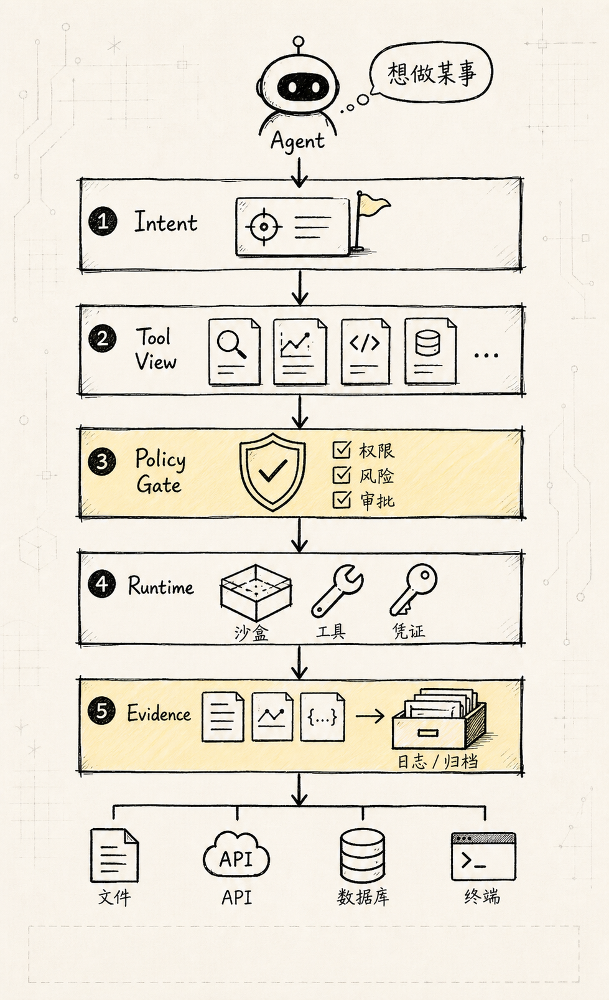
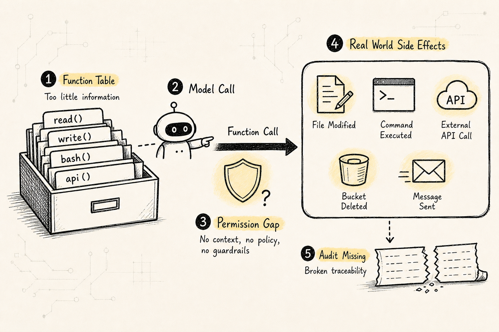
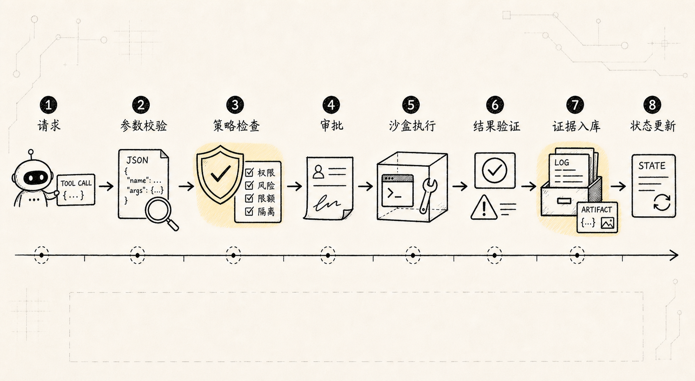
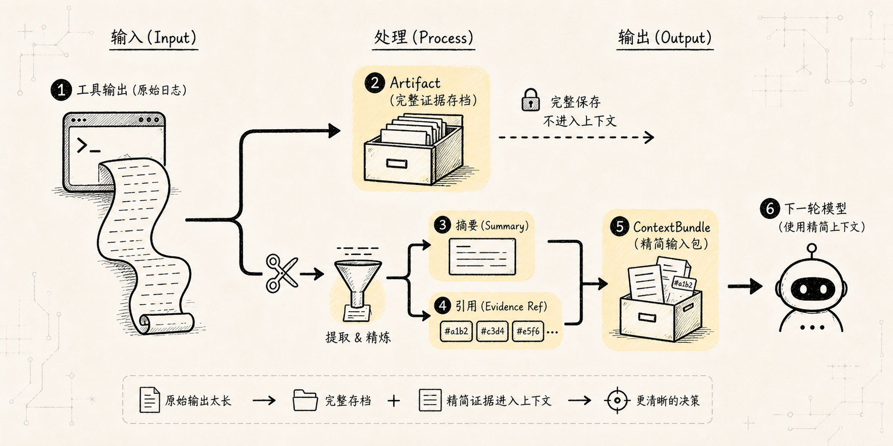
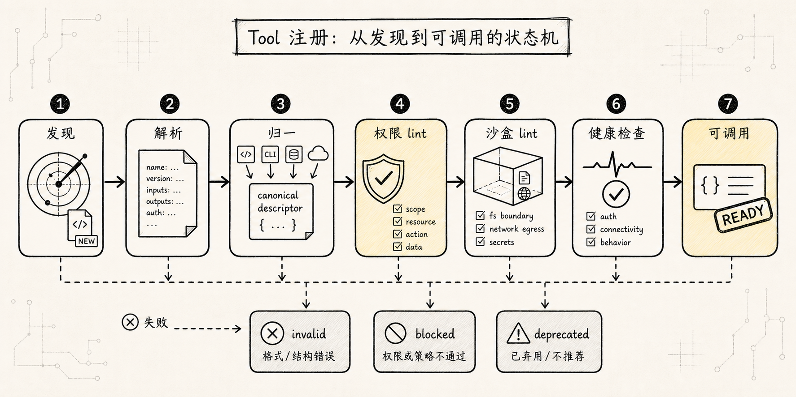
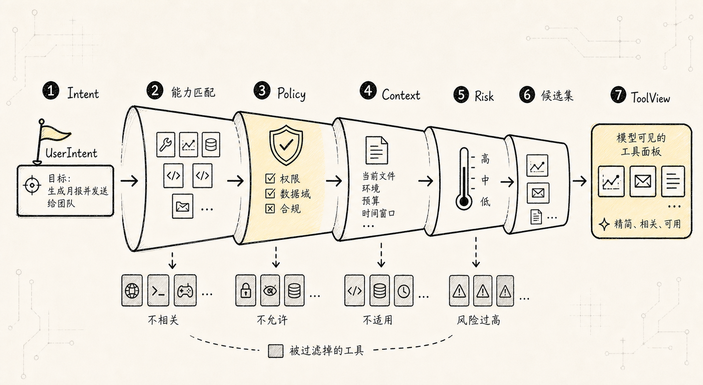
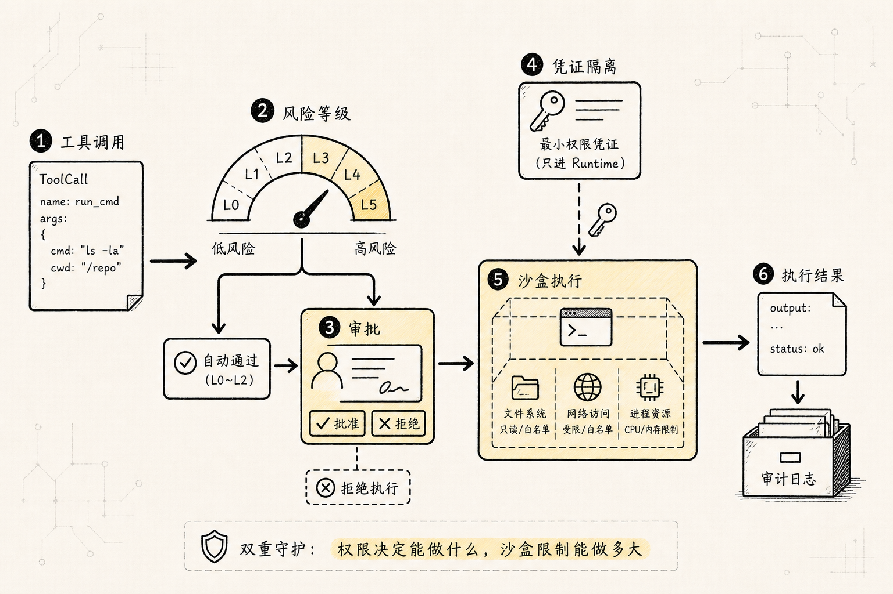
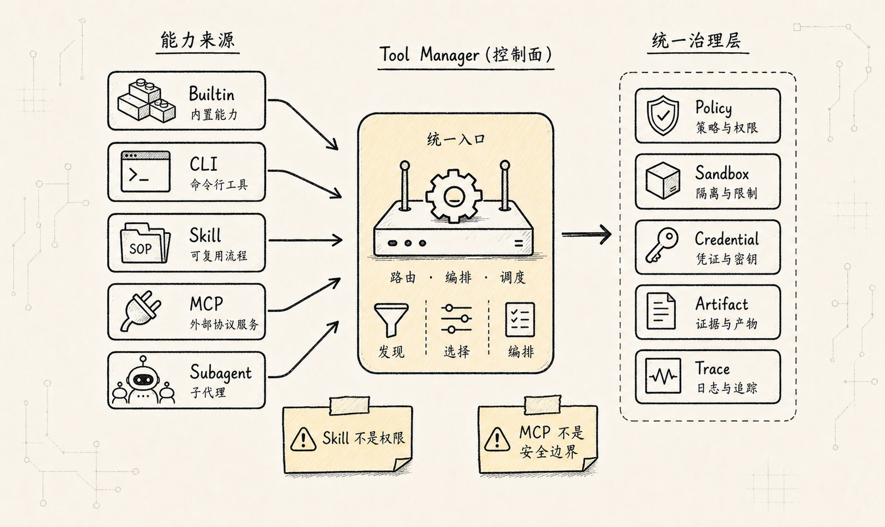
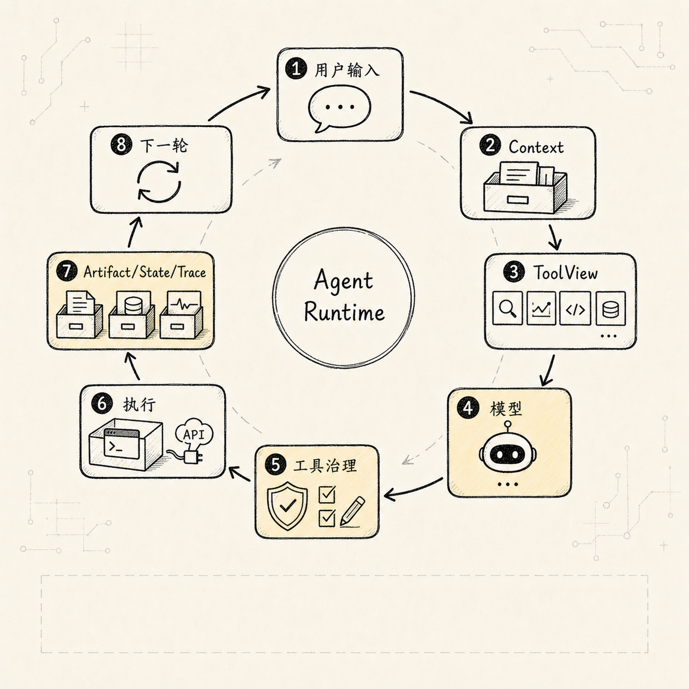
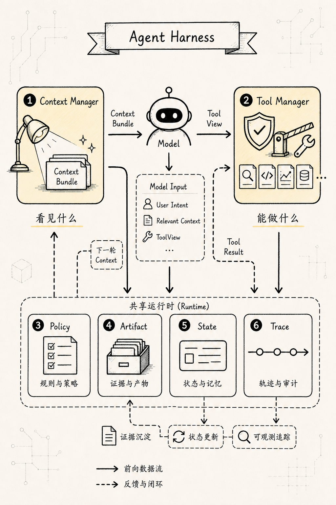

# Tool Manager 新范式：Agent 的行动操作系统

如果第一章的 [Context Manager](/blog/AI/agent设计范式/01-context-manager-attention-os) 回答的是：

> Agent 这一轮应该知道什么？

第二章的 [长期记忆与自我优化](/blog/AI/agent设计范式/02-agent-long-term-memory-self-upgrade) 回答的是：

> Agent 怎样把经历沉淀成记忆、技能和可评估的升级？

那么第三章回答的是另一个同样底层的问题：

> Agent 想要行动时，系统怎样把这个意图变成可控、可审计、可恢复的真实动作？

核心观点先放前面：

> **Agent Tool Manager 不是一个 function registry，而是一个围绕能力、意图、权限、环境、凭证、执行、副作用和审计的行动治理层。**

换句话说，Tool Manager 管的不是：

```text
有哪些函数可以调用？
```

而是：

```text
Agent 在当前意图、权限、环境、预算和风险下，
可以使用哪些能力？
为什么使用？
以什么身份使用？
在哪个沙盒里使用？
会影响哪些资源？
需要谁批准？
结果如何验证？
产生了哪些证据？
之后是否应该更新状态、记忆或上下文？
```

更稳定的定义是：

```text
ToolCall_t = f(
  Intent,
  Capability,
  Policy,
  Principal,
  Credentials,
  Environment,
  State,
  Sandbox,
  Budget,
  Approval,
  Evidence
)
```

所以 Tool Manager 不是“工具列表”，而是 Agent 的 **Action Operating System**。



我们仍然沿用这个专栏里的例子：一个 CLI Agent 正在修复测试失败。它需要读文件、搜索代码、执行测试、修改代码、再次验证。只要这些动作开始接触真实文件、真实命令、真实网络和真实账号，Tool Manager 就不能只是 `name + schema + handler`。

这里先立住一个边界：

```text
Agent 不直接拥有工具。
Agent 只在某一轮、某个意图、某个权限范围内，获得一组临时能力视图。
```

模型可以提出行动。

Planner 可以整理意图。

Tool Manager 才负责把“想行动”翻译成“允许以什么方式行动”。

这三件事如果混在一起，系统很快会退化成：

```text
模型想做什么，就找个工具去做。
```

而新范式要表达的是：

```text
模型只能在被编译出来的能力租约里提出调用。
真实执行必须经过 runtime 的确定性边界。
```

## 一、从第一性原理定义 Tool

很多 Agent demo 会把 tool 理解成：

```text
name + description + JSON schema + function handler
```

这能跑 demo，但支撑不了复杂任务。

真正复杂起来以后，tool 会变成一组有副作用、有权限、有运行环境、有审计要求的能力。

更稳的定义是：

```text
Tool = Capability Contract + Invocation Protocol + Execution Boundary + Evidence Producer
```

也就是：

```text
Tool 是一种被 Agent 调用的外部能力契约。
它描述：
  能做什么
  什么时候该用
  输入是什么
  输出是什么
  会读写什么
  是否有副作用
  需要什么权限
  在哪里执行
  如何验证结果
  如何审计和回放
```

这里要沿用上一章最重要的原则：

> **发给模型的上下文只是临时编译视图，不能成为事实源。**

同理，发给模型的 tool schema 也只是一次模型调用前的“能力视图”，不是系统里的完整 tool truth。

系统内部应该保留 canonical registry、权限、凭证、运行记录、artifact、trace，再按当前任务动态编译给模型。

一句话：

> **Tool Schema 是编译产物，不是 Tool 本身。**

## 二、先看旧模型为什么不够

最朴素的工具系统通常长这样：

```ts
const tools = {
  read_file,
  write_file,
  bash,
  search_web,
  call_api,
};
```

然后每一轮把这些工具都塞给模型：

```ts
const response = await model.call({
  messages,
  tools,
});

if (response.toolCall) {
  const result = await tools[response.toolCall.name](response.toolCall.args);
  messages.push(result);
}
```

这段代码很容易理解。

它的问题也在这里：它把工具调用当成了一次普通函数调用。



在“修复测试失败”的任务里，工具调用可能包含：

```text
读取文件
搜索代码
运行测试
修改文件
生成 diff
访问网络
读取环境变量
执行 shell
调用 MCP server
委托 subagent
提交 PR
创建 issue
发送消息
部署服务
删除资源
```

这些动作的风险完全不同。

`read_file` 和 `rm -rf` 都可能通过 shell 出现。

`github.search_issue` 和 `github.create_issue` 都可能来自同一个 GitHub client。

`skill` 里的一段脚本可能读写本地文件，也可能访问网络。

如果系统只把它们看成函数，就很难回答这些问题：

```text
为什么要调用这个工具？
为什么不是另一个工具？
这个调用是否超出用户意图？
参数是否被校验过？
它会读哪些资源？
它会写哪些资源？
它会不会把用户数据发到外部？
它使用哪个身份和 scope？
是否需要用户批准？
在哪个沙盒执行？
完整结果保存在哪里？
这次调用如何影响 state、memory 和 context？
```

所以 Tool Manager 的第一条边界是：

```text
不要把 tool 设计成函数 map。
要把 tool 设计成行动进入真实世界之前的治理协议。
```

## 三、新范式：Tool Manager 是行动控制面

错误范式是：

```text
模型看到所有工具。
模型决定调用哪个工具。
runtime 负责执行函数。
结果变成下一条 message。
```

这种设计早期快，但后期会遇到一堆问题：

```text
权限靠 prompt，无法强制。
工具太粗，intent 不清。
副作用不可见。
凭证散落在环境变量里。
工具结果直接污染上下文。
无法审计为什么调用。
无法知道调用前后状态差异。
无法做 dry-run、approval、rollback。
无法区分 read、write、external_write、destructive。
无法适配 CLI、Skill、MCP、API、subagent 多种来源。
```

更稳的分层是这样：

```text
事实源层
  Tool Registry
  Tool Versions
  Permission Grants
  Credential Bindings
  Runtime Config
  Tool Events
  Tool Artifacts

        ↓ resolve / filter / redact / compile

模型可见层
  Tool Names
  Tool Descriptions
  JSON Schemas
  Intent Hints
  Policy Hints
  Risk Hints
  Required Approval Hints
  Output Projection Rules
  Short Output Preview

        ↓ model proposes call

执行控制层
  Arg Validation
  Policy Check
  Approval
  Sandbox
  Credential Broker
  Runtime Adapter
  Verifier

        ↓ result projection

状态语义层
  State Patch
  Evidence
  Trace
  Memory Candidate
  Context Update
```

这几层里，只有“模型可见层”会被发给模型。

其他部分都属于 Harness 的运行时控制面。

所以：

> **Tool Manager 的本质，是把模型提出的“想做某事”，变成经过验证、授权、隔离、可审计的真实行动。**

这和 Context Manager 的分层非常相似：

```text
Tool Registry / Events / Artifacts 是事实源。
Tool Candidate / Tool View 是语义投影。
Tool Schema / Provider Payload 是一次性编译产物。
```

一句话：

> **发给模型的工具列表只是临时视图，不是系统能力边界本身。**

更准确地说，ToolView 像一份短期能力租约（capability lease）：

```text
这个模型调用，在这个任务阶段，
可以看到哪些工具，
为什么能看到，
调用时必须满足哪些约束，
结果最多怎样回到上下文。
```

它不是永久授权，也不是完整权限。

下一轮状态、权限、预算、风险或用户意图变化后，ToolView 应该重新解析和编译。

## 四、Tool Manager 的十二条长期稳定原则

这部分可以直接压成十二条工程原则。

### 原则 1：Tool 是能力契约，不是函数

函数只说明怎么执行。

Tool 还必须说明：

```text
用途
边界
权限
风险
副作用
输入输出
可重试性
幂等性
资源访问
执行环境
结果验证方式
```

没有这些字段，所谓 tool 只是 function calling wrapper。

### 原则 2：Intent 和 Tool Implementation 必须分离

用户说：

```text
帮我修一下这个 bug。
```

不等于系统应该立刻调用：

```text
bash("npm test")
edit_file(...)
git commit
```

中间应该有显式 intent 分层：

```text
UserIntent
  用户想达成什么

TaskIntent
  当前任务是什么

ActionIntent
  下一步动作类别是什么

ToolIntent
  为什么需要某个工具

ToolCall
  实际调用哪个工具、参数是什么
```

这样系统才能回答：

```text
为什么要调用这个工具？
为什么不用另一个工具？
这个工具调用是否超出用户意图？
是否应该先 read，再 write？
是否需要审批？
```

### 原则 3：Tool Call 是因果事件，不是普通文本

工具调用可能读写文件、访问网络、花钱、发消息、部署服务、删除资源、暴露隐私。

所以它必须进入 event log 和 trace，而不是只作为一条 assistant message 的附属字段。

更稳的链路是：

```text
ToolCallRequested
  -> ToolArgsValidated
    -> ToolPolicyChecked
      -> ApprovalRequested?
        -> ApprovalGranted?
          -> ToolCallStarted
            -> ToolCallFinished
              -> ToolResultValidated
                -> ArtifactPersisted
                  -> StateUpdated
                    -> TraceUpdated
```

这条链路以后可以用于审计、回放、恢复、复盘和 eval。



### 原则 4：权限、沙盒、hook、validator 是确定性边界

不要只在 system prompt 里写：

```text
不要执行危险命令。
不要泄露 secret。
不要删除文件。
```

这不够。

应该有：

```text
Policy Engine
Permission Grant
Sandbox Runtime
Credential Broker
PreToolUse Hook
PostToolUse Hook
Verifier
Audit Log
```

Prompt 可以表达期望。

Runtime 必须负责强制。

### 原则 5：工具结果是证据，不是上下文垃圾桶

大型输出不应该直接塞进 prompt：

```text
完整日志
完整网页
完整文件
完整 SQL 查询结果
完整测试输出
完整 diff
完整截图 OCR
```

正确模式是：

```text
完整输出 -> Artifact Store
关键事实 -> Tool Result Preview
可引用片段 -> Evidence Ref
当前需要的信息 -> ContextBundle
```

Context Manager 管模型下一轮该看什么。

Tool Manager 管工具结果如何变成证据。

Artifact Manager 管完整输出在哪里保存。

三者不能混成一个 `messages[]`。



### 原则 6：Tool Registry 是事实源，Tool View 是编译产物

内部应该有稳定的 canonical tool model：

```text
Canonical Tool Descriptor
  ↓ adapter
OpenAI tool schema
Anthropic tool schema
MCP tool schema
CLI command schema
Skill activation schema
Internal function call
```

不要把核心结构绑定到某个模型厂商的 function calling 格式。

更稳的是：

```text
Canonical Internal Model
  ↓ adapter
Provider-specific Payload
```

### 原则 7：Read、Write、External Side Effect、Destructive 必须拆开

不要设计这种万能工具：

```text
github_api(method, path, body)
database_query(sql)
shell(command)
browser(action, selector)
```

更稳的是：

```text
github.search_issues       read
github.create_issue        external_write
github.close_issue         destructive-ish

db.select                  read
db.update                  write
db.drop_table              destructive

file.read                  read
file.write                 workspace_write
file.delete                destructive
```

风险不同，审批不同，审计不同，工具描述也应该不同。

### 原则 8：凭证不是上下文，必须由 Credential Broker 管

模型不应该看到：

```text
API token
OAuth refresh token
SSH key
数据库密码
cookie
session secret
```

模型只应该看到：

```text
这个工具可以代表哪个 principal 做什么。
当前有哪些 scope。
是否需要重新授权。
```

凭证进入 runtime。

凭证引用进入 tool call。

凭证明文不进入 prompt、message、tool result、artifact preview。

### 原则 9：Tool Metadata 要做 eval

工具名、描述、参数说明，会直接影响模型什么时候选择它、怎么填参。

所以每个 tool 应该配：

```text
golden prompts
negative prompts
expected tool choice
expected args
precision / recall
argument validity
unsafe call rate
approval trigger rate
```

Tool description 不是文案，是模型选择工具的控制面。

### 原则 10：CLI、Skill、MCP 是不同层，不要混成一类

它们不是同一种东西：

```text
CLI    是执行形态 / runtime adapter
Skill  是程序性知识包 / workflow package
MCP    是工具和上下文能力的互操作协议
```

它们都可以进入 Tool Manager，但进入的位置不同：

```text
CLI 进入 Execution Adapter。
Skill 进入 Intent / Procedure / Context Activation。
MCP 进入 Capability Discovery / Protocol Adapter。
```

### 原则 11：Subagent / Handoff 也是一种 tool-like capability

当 Agent 把任务交给另一个 Agent 时，本质上也是一次受控调用：

```text
input schema
output schema
allowed context
allowed tools
budget
timeout
permission
summary result
trace
```

好的 subagent 调用应该是：

```text
主 Agent 给目标、约束、证据引用。
Subagent 在隔离 context 中工作。
Subagent 只返回 summary、result、artifacts 和 risk。
主 Agent 不继承完整中间噪声。
```

### 原则 12：Tool Manager 必须可回放、可解释、可撤销

系统应该能回答：

```text
Agent 为什么调用这个工具？
调用前模型看到了哪些工具？
哪些工具被 policy 过滤掉了？
这个参数是谁生成的？
是否经过用户批准？
用了哪个身份和 scope？
在哪个 sandbox 执行？
读写了哪些资源？
完整输出在哪里？
结果是否被 verifier 接受？
这次调用如何影响 state / memory / artifact？
```

如果回答不了这些问题，Agent 的行动就还没有真正工程化。

## 五、稳定的 Tool Ontology

一个成熟的 Tool Manager 至少应该区分这些对象：

```text
ToolSource        工具来源：builtin / cli / skill / mcp / http / subagent
ToolDescriptor    工具能力契约
ToolRegistration  工具注册状态
ToolVersion       工具版本
ToolIntent        工具使用意图
ToolCandidate     候选工具
ToolView          编译给模型看的工具视图
ToolCall          一次工具调用
ToolResult        工具结果
ToolArtifact      完整输出和证据
ToolPolicy        权限、风险、预算、安全规则
PermissionGrant   授权记录
CredentialBinding 凭证绑定
SandboxPolicy     执行隔离策略
ToolTrace         可审计链路
ToolEval          工具选择和执行质量评估
```

这些对象职责不同，不能都混在一个：

```ts
const tools = [];
```

里。

## 六、ToolDescriptor：能力契约

`ToolDescriptor` 是 Tool Manager 里最核心的对象。

它不是给模型看的最终 schema，而是系统内部的 canonical descriptor。

最小字段可以先这样设计：

```ts
type ToolDescriptor = {
  toolId: string;
  canonicalName: string;
  displayName: string;
  version: string;

  source: {
    type: "builtin" | "cli" | "skill" | "mcp" | "http" | "subagent";
    sourceId: string;
    packageName?: string;
    serverId?: string;
    command?: string;
    uri?: string;
  };

  lifecycle: {
    status: "discovered" | "verified" | "enabled" | "disabled" | "deprecated" | "blocked";
    registeredAt: string;
    updatedAt: string;
    owner?: string;
  };

  description: {
    summary: string;
    useWhen: string[];
    doNotUseWhen: string[];
    examples?: Array<{
      userRequest: string;
      expectedArgs: unknown;
    }>;
  };

  intent: {
    actionTypes: ActionType[];
    domains: string[];
    requiredUserIntent?: string[];
    negativeIntentHints?: string[];
  };

  schemas: {
    inputSchema: JSONSchema;
    outputSchema?: JSONSchema;
    errorSchema?: JSONSchema;
  };

  effects: {
    reads: ResourcePattern[];
    writes: ResourcePattern[];
    deletes?: ResourcePattern[];
    externalCalls: boolean;
    sendsUserData: boolean;
    mutatesState: boolean;
    idempotent: boolean;
    reversible: boolean;
    dryRunSupported: boolean;
  };

  risk: {
    level: "low" | "medium" | "high" | "critical";
    destructive: boolean;
    openWorld: boolean;
    financialCost?: "none" | "low" | "metered" | "unknown";
    privacyRisk?: "none" | "low" | "medium" | "high";
  };

  permissions: {
    approvalPolicy: "never" | "on_request" | "on_risk" | "always";
    requiredScopes: string[];
    allowedPrincipals?: string[];
    blockedPrincipals?: string[];
    tenantBoundary?: "user" | "org" | "workspace" | "project";
  };

  sandbox: {
    mode:
      | "none"
      | "read_only"
      | "workspace_write"
      | "network_restricted"
      | "container"
      | "vm"
      | "remote_api";
    filesystem?: {
      readRoots: string[];
      writeRoots: string[];
      blockedPaths: string[];
    };
    network?: {
      allowDomains: string[];
      denyDomains: string[];
      egressPolicy: "none" | "allowlist" | "open";
    };
    limits?: {
      timeoutMs: number;
      maxMemoryMb?: number;
      maxOutputBytes?: number;
      maxCostUsd?: number;
    };
  };

  credentials: {
    strategy: "none" | "system" | "user_oauth" | "service_account" | "delegated";
    requiredSecrets?: string[];
    tokenAudience?: string;
    scopeCheckRequired: boolean;
  };

  contextPolicy: {
    exposeToModel: boolean;
    exposeOutputToModel: "none" | "preview" | "structured" | "full";
    maxOutputPreviewTokens: number;
    redactionPolicy?: string;
  };

  execution: {
    adapter: string;
    timeoutMs: number;
    retryPolicy: {
      maxRetries: number;
      retryOn: string[];
      backoffMs?: number;
    };
  };

  hooks: {
    preCall?: string[];
    postCall?: string[];
    verifier?: string[];
    onError?: string[];
  };

  observability: {
    logArgs: boolean;
    logResultPreview: boolean;
    auditLevel: "none" | "basic" | "full";
  };

  provenance: {
    manifestHash?: string;
    signature?: string;
    sourceRefs?: string[];
    trustLevel: "first_party" | "workspace" | "third_party" | "untrusted";
  };
};
```

这里最重要的是：

```text
effects
risk
permissions
sandbox
credentials
contextPolicy
```

没有这些字段，Tool Manager 就会退化成工具函数注册器。

## 七、ActionType：统一行动分类

`ActionType` 会直接影响权限和审批。

推荐先用一组稳定枚举：

```ts
type ActionType =
  | "read"
  | "search"
  | "inspect"
  | "compute"
  | "transform"
  | "generate"
  | "write"
  | "patch"
  | "execute"
  | "deploy"
  | "external_send"
  | "purchase"
  | "delete"
  | "admin"
  | "auth"
  | "memory_read"
  | "memory_write"
  | "subagent_delegate";
```

大概可以这样分层：

```text
read / search / inspect
  通常低风险，可自动执行。

compute / transform / generate
  低到中风险，取决于是否读写文件和是否访问网络。

write / patch
  需要 workspace 权限，关键 diff 需要可见。

external_send
  会把信息发到外部系统，默认需要用户确认。

delete / admin / purchase / deploy
  高风险，默认强审批。

auth
  永远不能让模型直接处理 secret。
```

这一步的价值，是让系统在 tool name 之外拥有一个稳定的风险语言。

## 八、ToolIntent：为什么要用工具

`ToolIntent` 保存的是工具调用的公开理由。

它不是隐藏思维链，而是可审计的行动摘要。

```ts
type ToolIntent = {
  intentId: string;
  sessionId: string;
  runId: string;

  userGoal: string;
  currentTask: string;

  actionType: ActionType;
  target?: {
    kind: "file" | "repo" | "url" | "api" | "database" | "calendar" | "email" | "memory" | "agent";
    ref: string;
  };

  expectedEffect: {
    read?: string[];
    write?: string[];
    externalSideEffect?: boolean;
    userVisibleSideEffect?: boolean;
  };

  constraints: {
    mustNot?: string[];
    requireConfirmation?: boolean;
    maxCostUsd?: number;
    deadlineMs?: number;
  };

  rationaleSummary: string;
  evidenceRefs: string[];
  confidence: number;

  createdAt: string;
};
```

例如：

```yaml
userGoal: "修复测试失败，并验证"
currentTask: "确认 serializer.test.ts 的失败原因"
actionType: "execute"
target:
  kind: "repo"
  ref: "workspace"
expectedEffect:
  read:
    - "workspace.files"
  write:
    - "coverage or temp outputs"
rationaleSummary: "运行相关测试，确认当前失败是否可复现，并收集错误输出"
```

有了 `ToolIntent`，Tool Manager 才能把“模型想执行测试”变成“当前权限下允许执行哪个测试命令、在哪个工作区执行、输出如何保存”。

## 九、ToolCall 和 ToolResult 不能只是一段字符串

一次真实工具调用至少应该长这样：

```ts
type ToolCall = {
  toolCallId: string;
  sessionId: string;
  runId: string;
  parentEventId?: string;

  intentId?: string;
  toolId: string;
  toolVersion: string;

  proposedBy: "model" | "planner" | "user" | "system" | "subagent";
  args: unknown;
  resolvedArgs?: unknown;

  prediction: {
    expectedReads: ResourceRef[];
    expectedWrites: ResourceRef[];
    expectedExternalCalls: string[];
    expectedCostUsd?: number;
  };

  authorization: {
    status: "not_required" | "pending" | "granted" | "denied" | "expired";
    grantId?: string;
    approvalPrompt?: string;
    approvedBy?: string;
    approvedAt?: string;
  };

  runtime: {
    adapter: string;
    sandboxId?: string;
    credentialBindingId?: string;
    timeoutMs: number;
    idempotencyKey?: string;
  };

  status:
    | "draft"
    | "validated"
    | "blocked"
    | "approved"
    | "running"
    | "success"
    | "failed"
    | "cancelled";

  createdAt: string;
  startedAt?: string;
  finishedAt?: string;
};
```

对应的 `ToolResult` 也不应该只是一段 `content`：

```ts
type ToolResult = {
  toolCallId: string;
  status: "success" | "error" | "partial" | "cancelled";

  structuredOutput?: unknown;
  outputPreview?: string;

  artifacts: Array<{
    artifactId: string;
    kind: "tool_output" | "file" | "diff" | "screenshot" | "log" | "dataset";
    uri: string;
    contentHash?: string;
    summary?: string;
  }>;

  effectsObserved: {
    reads: ResourceRef[];
    writes: ResourceRef[];
    deletes?: ResourceRef[];
    externalCalls: string[];
    costUsd?: number;
  };

  verifier?: {
    status: "passed" | "failed" | "skipped";
    checks: Array<{
      name: string;
      result: "pass" | "fail" | "warn";
      message?: string;
    }>;
  };

  error?: {
    code: string;
    message: string;
    retryable: boolean;
    safeToShowUser: boolean;
  };

  usage?: {
    latencyMs: number;
    outputBytes?: number;
    tokensAddedToContext?: number;
  };

  provenance: {
    eventId: string;
    artifactRefs: string[];
  };
};
```

这里的核心不是字段多。

核心是 `ToolResult` 同时表达三件事：

```text
工具执行结果是什么？
真实世界发生了哪些副作用？
哪些证据应该进入 artifact、state、trace 和下一轮 context？
```

## 十、工具注册不是 registerTool(fn)

注册不是简单地：

```ts
registerTool("bash", bashHandler);
```

更稳的流程是：

```text
Discover
  -> Parse Manifest
    -> Validate Schema
      -> Normalize to Canonical Descriptor
        -> Permission Lint
          -> Sandbox Lint
            -> Security Review
              -> Dry Run / Health Check
                -> Golden Prompt Eval
                  -> Enable
```

推荐注册状态机：

```text
discovered
  -> parsed
    -> normalized
      -> verified
        -> enabled
          -> granted
            -> callable
```

失败状态也要显式：

```text
invalid_schema
permission_lint_failed
sandbox_lint_failed
security_review_required
health_check_failed
blocked
deprecated
```

尤其是 MCP server、第三方 Skill、本地 CLI command，都不应该“发现即调用”。

发现只是看见。

验证之后才是启用。

授权之后才是可调用。



## 十一、Intent 到 Tool 的解析

不要把所有工具都暴露给模型。

模型每次看到的应该是当前任务相关、当前权限允许、当前环境可执行、当前预算能承受、风险可接受的一小组工具。

推荐解析链路：

```text
Intent
  -> Capability Match
    -> Policy Filter
      -> Context Filter
        -> Risk Ranking
          -> Tool Candidate Set
            -> Tool View
```

伪代码：

```ts
async function resolveTools(intent: ActionIntent, state: AgentState) {
  const capabilities = await registry.findByActionType(intent.actionType);

  const policyAllowed = capabilities.filter((tool) =>
    policy.canExpose(tool, {
      user: state.user,
      workspace: state.workspace,
      task: state.currentTask,
    })
  );

  const relevant = ranker.rank(policyAllowed, {
    intent,
    state,
    recentFailures: state.toolFailures,
    availableCredentials: state.credentials,
  });

  return relevant.slice(0, state.toolBudget.maxToolsVisible);
}
```

这里有一个非常重要的边界：

```text
模型不是在全量工具库里自由选择。
模型是在 Tool Manager 编译出的 ToolView 里提出行动。
```



## 十二、权限模型：Approval 不是弹窗，而是合约

权限可以先分成六级：

```text
L0: pure_read
  只读，无外部副作用。
  例：read_file、list_dir、inspect_state。

L1: local_compute
  本地计算，不写工作区。
  例：parse_json、run_formatter_check、calculate。

L2: workspace_write
  修改当前 workspace。
  例：write_file、apply_patch。

L3: external_read
  读取外部服务或用户数据。
  例：read_github_issue、fetch_calendar。

L4: external_write
  对外部系统产生可见副作用。
  例：send_email、create_issue、post_message。

L5: destructive_or_admin
  删除、部署、购买、权限变更、数据迁移。
  例：delete_bucket、deploy_prod、rotate_secret、charge_card。
```

默认策略：

```text
L0 可自动执行。
L1 可自动执行，但受沙盒限制。
L2 需要 workspace_write 权限，关键 diff 要确认。
L3 需要 scope，敏感数据要脱敏。
L4 默认需要用户确认。
L5 默认强确认、dry-run 和二次验证。
```

一次 approval 不应该只是一个“是否允许”的弹窗。

它应该是一份合约：

```ts
type ApprovalRequest = {
  approvalId: string;
  toolCallId: string;

  summary: string;
  rationaleSummary: string;

  tool: {
    name: string;
    version: string;
  };

  argsPreview: unknown;

  effectsPreview: {
    reads: ResourceRef[];
    writes: ResourceRef[];
    externalCalls: string[];
    userVisibleSideEffect: boolean;
  };

  credentialPreview: {
    principal: string;
    scopes: string[];
  };

  risk: {
    level: "low" | "medium" | "high" | "critical";
    reasons: string[];
  };

  options: {
    allowOnce: boolean;
    allowForSession: boolean;
    alwaysAllowThisTool?: boolean;
    deny: boolean;
  };

  expiresAt: string;
};
```

几个不变量要直接写死：

```text
approval 展示的参数必须和实际执行参数一致。
approval 过期后不能继续执行。
scope 变化后 approval 失效。
风险等级变化后 approval 失效。
```

否则 approval 就只是一个心理安慰。



## 十三、沙盒模型：限制执行，不是限制语言

沙盒不是只有“能不能执行命令”。

它至少包括：

```text
filesystem
network
environment variables
credentials
process
resource limits
output limits
time limits
egress policy
audit log
```

推荐字段：

```ts
type SandboxPolicy = {
  sandboxId: string;
  mode:
    | "read_only"
    | "workspace_write"
    | "network_restricted"
    | "container"
    | "vm"
    | "remote_api";

  filesystem: {
    cwd: string;
    readRoots: string[];
    writeRoots: string[];
    blockedPaths: string[];
    tempDir: string;
    persistOutputs: boolean;
  };

  network: {
    egress: "none" | "allowlist" | "open";
    allowDomains: string[];
    denyPrivateNetworks: boolean;
  };

  environment: {
    inheritedEnv: string[];
    injectedEnv: string[];
    secretEnvAllowed: boolean;
  };

  process: {
    timeoutMs: number;
    maxMemoryMb: number;
    maxStdoutBytes: number;
    maxStderrBytes: number;
  };

  audit: {
    recordCommand: boolean;
    recordFileAccess: boolean;
    recordNetworkAccess: boolean;
  };
};
```

对本地 CLI 和本地 MCP server 尤其要谨慎。

因为它们不只是“工具调用”，而是本地代码执行或本地能力代理。

一句话：

> **Prompt 负责表达边界，Sandbox 负责执行边界。**

## 十四、CLI、Skill、MCP、Subagent 的位置

这几类东西经常被混在一起。

更稳的拆法是：

| 形态 | 本质 | 在 Tool Manager 中的位置 | 适合做什么 | 关键风险 |
| --- | --- | --- | --- | --- |
| Builtin Tool | runtime 内置函数 | native adapter | 读写状态、基础文件操作、内部检索 | 权限绕过 |
| CLI Tool | 本地命令执行形态 | execution adapter | 编译、测试、lint、git、脚本 | shell 注入、文件越权、网络越权 |
| Skill | 程序性知识包 / workflow package | intent + context activation + optional scripts | 教 Agent 如何完成一类任务 | 把说明当权限 |
| MCP | 工具、资源、提示词互操作协议 | capability discovery + protocol adapter | 接入外部系统、工具服务、数据源 | 盲信 server、scope 混乱 |
| Subagent / Handoff | 委托给专门 Agent | tool-like delegation adapter | 隔离研究、代码审查、长任务 | 上下文泄露、权限继承过宽 |



### CLI：不要把 shell 暴露成一个万能工具

错误做法：

```ts
tool("bash", { command: "string" });
```

这相当于把整个电脑交给模型，再希望 prompt 能约束它。

更稳的是：

```text
CLI command
  -> manifest
    -> args schema
      -> sandbox
        -> parser
          -> structured result
            -> artifact
```

对于 coding agent，可以保留通用 shell，但必须配：

```text
命令审计
工作区限制
网络限制
敏感路径阻断
输出截断
危险命令 denylist
用户 approval
```

### Skill：Skill 不是工具权限，而是程序性知识

Skill 更像一个可动态加载的 SOP：

```text
my-skill/
  SKILL.md
  scripts/
  references/
  assets/
```

它可以告诉 Agent：

```text
什么时候使用这个 workflow。
应该按什么步骤做。
有哪些参考资料。
有哪些脚本可以辅助。
```

但它不能授予 Agent 权限。

关键原则：

> **Skill 可以教 Agent 怎么做事，但不能授权 Agent 做事。**

Skill 自带的 script 也必须注册成 tool，走同一套 policy、sandbox、artifact 和 trace。

### MCP：MCP 是协议适配层，不是安全边界

MCP 适合做能力发现和协议互操作。

但不要这样设计：

```text
MCP server 暴露什么，Agent 就能直接调什么。
```

更稳的接法是：

```text
MCP Server
  -> MCP Client Adapter
    -> Tool Discovery
      -> Canonical ToolDescriptor
        -> Local Policy Filter
          -> Local Permission / Credential Binding
            -> ToolView for Model
              -> MCP Invocation
                -> ToolResult / Artifact / Trace
```

MCP 负责互操作。

Tool Manager 负责治理。

Policy Engine 负责授权。

Credential Broker 负责身份。

Sandbox 或 Gateway 负责隔离。

Trace 负责审计。

### Subagent：把 Agent 当成受控委托能力

Subagent 调用应该有自己的 descriptor：

```ts
type SubagentToolDescriptor = ToolDescriptor & {
  subagent: {
    agentId: string;
    inputSchema: JSONSchema;
    outputSchema: JSONSchema;
    allowedTools: string[];
    contextPolicy: {
      inheritParentContext: "none" | "summary" | "selected_refs";
      returnTranscript: boolean;
      returnSummary: boolean;
    };
    budget: {
      maxTurns: number;
      maxTokens: number;
      timeoutMs: number;
    };
  };
};
```

Subagent 可以像 tool 一样被调用，但它不应该被简化成普通 tool。

普通 tool 的边界通常是一次输入、一次执行、一次输出。

Subagent 的边界更像一次受控委托：

```text
目标是什么？
允许看哪些证据？
允许用哪些工具？
预算是多少？
失败或不确定时如何返回？
完整 transcript 是否允许回传？
```

主 Agent 不应该把完整上下文无脑交给 subagent，也不应该把 subagent 的完整 transcript 无脑拿回来。

更稳的是传目标、约束和证据引用，回收结果、风险和 artifact。

## 十五、Agent Loop 中 Tool Manager 的位置

把 Tool Manager 放进完整 Agent Loop，大概是：

```text
User Input
  -> State Manager projects current state
  -> Planner extracts ActionIntent
  -> Tool Manager resolves / compiles ToolView
  -> Context Manager builds ContextBundle with ToolView
  -> Model proposes message or tool_call
  -> Tool Manager validates / authorizes / executes
  -> Artifact Manager stores full result
  -> State Manager projects state patch
  -> Trace Manager records accountable action
  -> Context Manager compiles next turn
```



简化伪代码：

```ts
async function agentTurn(input: UserInput) {
  await events.append({ type: "UserPromptSubmitted", payload: input });

  const state = await stateManager.project(input.sessionId);

  const intent = await planner.extractIntent(input, state);

  const toolCandidates = await toolManager.resolve(intent, state);

  const toolView = await toolManager.compileView({
    candidates: toolCandidates,
    model: state.modelConfig,
    policy: state.policy,
    budget: state.toolBudget,
  });

  const context = await contextManager.compile({
    input,
    state,
    tools: toolView,
  });

  const modelOutput = await model.call(context);

  if (modelOutput.toolCall) {
    const validated = await toolManager.validateArgs(modelOutput.toolCall);
    const auth = await toolManager.authorize(validated);

    if (auth.status === "requires_approval") {
      return approvalUI.render(auth.request);
    }

    const prepared = await toolManager.prepareRuntime(auth.call);
    const result = await toolManager.execute(prepared);
    const verification = await toolManager.verify(result);

    const artifacts = await artifactManager.persist(result.artifacts);
    const statePatch = await stateManager.projectToolResult({
      result,
      verification,
      artifacts,
    });
    await stateManager.apply(statePatch);
    await traceManager.recordToolCall({
      result,
      verification,
      artifacts,
      statePatch,
    });

    return agentTurn({
      type: "tool_result",
      result: result.outputPreview,
      evidenceRefs: artifacts.map((artifact) => artifact.artifactId),
    });
  }

  return modelOutput.message;
}
```

注意这里的顺序：

```text
参数校验在 policy check 之前。
policy check 在执行之前。
approval 在高风险执行之前。
sandbox 和 credential binding 在真实调用之前。
artifact、state、trace 在结果返回之后。
完整结果进入 artifact，下一轮 context 只拿 preview、structured output 和 evidence refs。
```

这就是 Tool Manager 和普通函数调用的区别。

## 十六、本地 CLI Agent 的 MVP

如果先做本地 CLI Agent，不要一开始做太复杂。

可以先做这些：

```text
1. Canonical ToolDescriptor
2. Tool Registry + Version
3. ToolCall / ToolResult / ToolArtifact
4. Policy Engine
5. Permission Grant
6. Sandbox Runner for CLI
7. Credential Broker
8. Tool Event Log
9. ToolView Compiler
10. MCP Adapter
11. Skill Loader
12. Golden Prompt Eval
```

先不要急着做：

```text
复杂 marketplace
自动安装第三方 tool
复杂多租户 billing
通用浏览器 automation
跨 agent tool trading
自动权限学习
```

MVP 必须有：

```text
注册工具。
按 intent 检索工具。
按 policy 过滤工具。
编译给模型 ToolView。
校验参数。
审批高风险调用。
沙盒执行 CLI。
调用 MCP 工具。
加载 Skill 指令。
保存 artifact。
记录 event / trace。
支持 /tools 查看当前工具。
支持 /tool-call 查看调用详情。
```

本地文件结构可以先长这样：

```text
~/.agent/
  tools/
    registry.jsonl
    descriptors/
      file.read.yaml
      file.write.yaml
      npm.test.yaml
    grants.jsonl
    evals.jsonl

  tool-runs/
    run_abc.jsonl
    run_def.jsonl

  artifacts/
    tool_output_123.txt
    command_456.log
    diff_789.patch

  sandboxes/
    sbx_001/
    sbx_002/

  credentials/
    bindings.jsonl

  skills/
    spreadsheet/
      SKILL.md
      scripts/
      references/

  mcp/
    servers.json
    discovered_tools.jsonl
```

一次 CLI tool run 的 JSONL 可以是：

```jsonl
{"type":"ToolCallRequested","toolCallId":"tc_1","toolId":"npm.test","args":{"testName":"auth"}}
{"type":"ToolArgsValidated","toolCallId":"tc_1","status":"passed"}
{"type":"ToolPolicyChecked","toolCallId":"tc_1","decision":"allow","reason":"workspace command without network"}
{"type":"ToolSandboxPrepared","toolCallId":"tc_1","sandboxId":"sbx_1"}
{"type":"ToolCallStarted","toolCallId":"tc_1","command":"npm test auth"}
{"type":"ToolCallFinished","toolCallId":"tc_1","status":"failed","artifactId":"art_log_1"}
{"type":"ToolResultValidated","toolCallId":"tc_1","status":"passed","summary":"3 tests failed in auth middleware"}
```

这已经足够支撑审计、恢复和问题定位。

## 十七、ToolManager 接口

第一版接口可以先这样设计：

```ts
interface ToolManager {
  discover(source: ToolSource): Promise<ToolDescriptor[]>;

  register(
    descriptor: ToolDescriptor,
    options?: RegisterOptions
  ): Promise<ToolRegistration>;

  enable(
    toolId: string,
    scope: EnablementScope
  ): Promise<void>;

  resolve(
    intent: ToolIntent,
    state: AgentState
  ): Promise<ToolCandidate[]>;

  compileView(input: {
    candidates: ToolCandidate[];
    model: ModelConfig;
    policy: PolicyContext;
    budget: ToolBudget;
  }): Promise<ToolView[]>;

  validateArgs(
    draft: ToolCallDraft
  ): Promise<ValidatedToolCall>;

  authorize(
    call: ValidatedToolCall
  ): Promise<AuthorizationDecision>;

  prepareRuntime(
    call: AuthorizedToolCall
  ): Promise<PreparedToolCall>;

  execute(
    call: PreparedToolCall
  ): Promise<ToolResult>;

  verify(
    result: ToolResult
  ): Promise<VerificationResult>;

  observe(
    event: ToolEvent
  ): Promise<void>;

  explain(
    toolCallId: string
  ): Promise<ToolTrace>;

  revoke(
    grantId: string
  ): Promise<void>;
}
```

避免只做：

```ts
registerTool(name, schema, handler)
callTool(name, args)
```

前者是在建 Agent runtime。

后者只是在包 function calling。

## 十八、工程不变量：直接写成测试

这些规则比字段更重要：

```text
Invariant 1:
  Every tool_call must reference a registered tool version.

Invariant 2:
  Every tool_result must reference exactly one tool_call.

Invariant 3:
  Tool args must be schema-validated before policy check.

Invariant 4:
  Policy check must happen before execution.

Invariant 5:
  Any external_write / destructive action must have explicit authorization unless policy says otherwise.

Invariant 6:
  Approval preview args must match executed args, or approval becomes invalid.

Invariant 7:
  Credentials must never be exposed to model context.

Invariant 8:
  Tool output above threshold must be stored as artifact, not injected fully into context.

Invariant 9:
  Every artifact must reference source tool_call_id and event_id.

Invariant 10:
  Sandbox policy must be resolved before local CLI execution.

Invariant 11:
  MCP-discovered tools must be normalized and policy-filtered before model exposure.

Invariant 12:
  Skill scripts must be registered as tools before execution.

Invariant 13:
  Read/write/destructive effects must be declared in descriptor.

Invariant 14:
  Destructive tools must support dry-run or require stronger confirmation.

Invariant 15:
  ToolView must be explainable: every exposed tool has a reason and policy decision.

Invariant 16:
  Tool selection quality must be regression-tested with golden prompts.
```

这些不变量能把 Agent 的行动可靠性从“模型应该懂”，拉回到“系统必须保证”。

## 十九、常见反模式

### 反模式一：Tool Registry = 函数 map

```ts
tools[name] = handler;
```

问题：

```text
没有权限。
没有风险。
没有来源。
没有版本。
没有副作用。
没有沙盒。
没有审计。
```

### 反模式二：一个万能 shell

```text
bash(command)
```

问题：

```text
意图不清。
参数不可验证。
权限不可细分。
危险命令难阻止。
输出难结构化。
审计粒度太粗。
```

### 反模式三：把 tool description 当 policy

```text
description: "Do not use this for destructive actions."
```

问题：

```text
模型可能忽略。
无法测试。
无法强制。
无法审计。
```

Policy 必须进入 runtime。

### 反模式四：把 OAuth token 塞给模型

```text
tool_args = { token: "..." }
```

问题：

```text
泄露风险巨大。
transcript 污染。
tool result 污染。
无法做 scope enforcement。
```

正确做法是 Credential Broker。

### 反模式五：read/write 混在一个工具

```text
database(sql)
github(method, path, body)
filesystem(action, path, content)
```

问题：

```text
权限不可分。
审批不可分。
风险不可分。
tool selection 变差。
```

### 反模式六：MCP server 暴露什么就让 Agent 调什么

问题：

```text
server metadata 未必可信。
scope 未必符合当前用户。
本地执行可能危险。
token audience 可能错误。
用户未必 consent。
```

MCP 是协议，不是你的安全边界。

### 反模式七：Skill 里的脚本直接执行

问题：

```text
绕过 registry。
绕过 permission。
绕过 sandbox。
绕过 audit。
```

Skill 里的 script 应该注册成 tool。

## 二十、和 Context Manager 的关系

这篇不是替代上一章，而是补上另一半运行时边界。

可以这样看：

| 模块 | 回答的问题 |
| --- | --- |
| Context Manager | Agent 这一轮应该知道什么？ |
| Tool Manager | Agent 这一轮可以做什么？ |
| Policy Engine | 这个动作是否被允许？ |
| Credential Broker | 这个动作以谁的身份执行？ |
| Sandbox Runtime | 这个动作在哪里执行、受什么限制？ |
| Artifact Manager | 完整结果和证据保存在哪里？ |
| State Manager | 这个动作之后，当前现场如何变化？ |
| Trace Manager | 这个动作为什么发生、结果如何验证？ |

Context Manager 管注意力。

Tool Manager 管行动。

两者之间的接口是：

```text
ToolView 进入 ContextBundle。
ToolResult 进入 Artifact / Evidence / State。
State 再影响下一轮 ContextBundle。
```



所以成熟 Agent Harness 的主线可以这样记：

```text
Context 决定模型看见什么。
Tool 决定模型能做什么。
Policy 决定什么可以发生。
Artifact 决定证据如何保留。
State 决定任务如何继续。
Trace 决定系统如何解释和恢复。
```

## 二十一、最终范式：十句话

可以把 Agent Tool Manager 的最终范式总结成十句话：

```text
1. Tool 是能力契约，不是函数。

2. Tool Manager 是 Agent 的行动控制面，不是工具注册表。

3. Tool Schema 是模型调用前的临时视图，不是系统事实源。

4. Intent、Capability、Policy、Runtime 必须分离建模。

5. Tool Call 是因果事件，必须可审计、可回放、可解释。

6. 权限、沙盒、凭证、hook、validator 是确定性边界，不能只靠 prompt。

7. 工具结果是证据入口，大输出应进入 Artifact Store，context 只放摘要、片段和引用。

8. CLI 是执行适配器，Skill 是程序性知识包，MCP 是互操作协议，Subagent 是委托型能力。

9. Read、Write、External Side Effect、Destructive Action 必须分级治理。

10. 一个成熟 Tool Manager 应该同时管理注册、选择、授权、执行、验证、追踪、评估和撤销。
```

最后收成一句话：

**Tool Manager 不是 function calling 的封装层，而是 Agent 的能力、权限和行动边界的操作系统。**

只要 Agent 仍然需要在有限权限、有限预算和真实世界副作用下行动，Tool Manager 就必须解决同样的问题：Agent 能做什么、为什么做、以谁的身份做、在哪里做、做之前谁批准、做之后如何证明。

这条边界立住以后，Agent 才不只是会调用工具，而是开始拥有可治理的行动能力。

---

GitHub 地址: [03-tool-manager-action-os.md](https://github.com/LienJack/learn-agent/blob/main/src/content/blog/zh/AI/agent设计范式/03-tool-manager-action-os.md)
