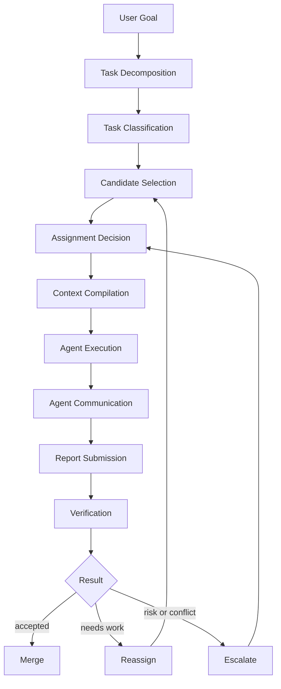
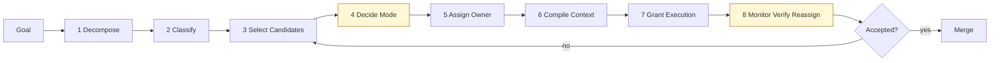
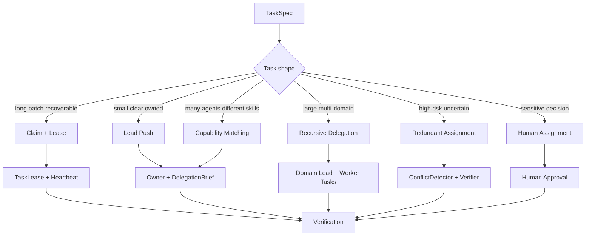
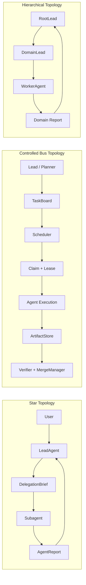
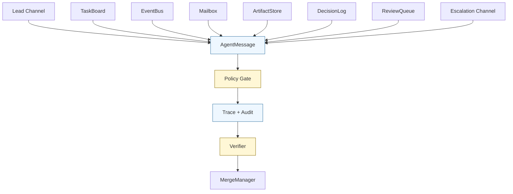
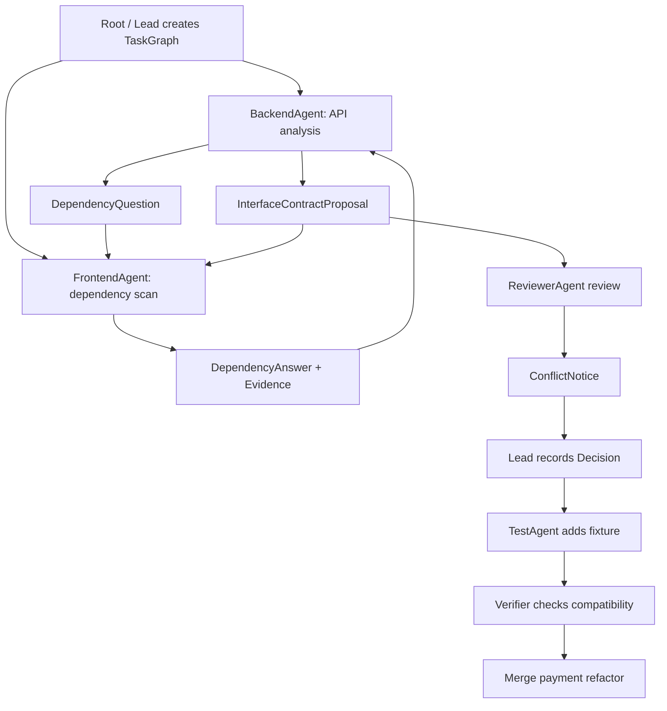

# Agent Team 任务分配与通信协议

前面几篇把 Agent 的几个底层操作系统拆开了：

- [Context Manager](/blog/AI/agent设计范式/01-context-manager-attention-os) 负责治理模型应该看见什么。
- [长期记忆与自我优化](/blog/AI/agent设计范式/02-agent-long-term-memory-self-upgrade) 负责把经历沉淀成记忆、技能和可评估的升级。
- [Tool Manager](/blog/AI/agent设计范式/03-tool-manager-action-os) 负责把行动意图变成可控、可审计、可恢复的真实动作。

但一个 Agent 系统进入复杂任务后，还会遇到另一个问题：

> 多个 agent 在一起工作时，任务怎么分？谁能和谁通信？通信结果怎样进入主线状态？

如果 Agent Team 只定义了拓扑，比如星型、总线型、层级型，却没有定义任务分配和通信协议，它仍然只是一个组织结构草图。

真正的 Agent Team 必须回答这些问题：

```text
任务怎么分？
谁来分？
按什么规则分？
主 agent 和 subagent 怎么通信？
subagent 和 subagent 能不能通信？
通信内容怎么约束？
通信结果如何进入状态？
冲突怎么处理？
```

核心观点先放前面：

> **任务分配决定谁做什么，通信协议决定谁能和谁说什么，验证机制决定什么结果能进入主线。**

这篇文章要讲的就是 Agent Team 的 **Assignment + Communication Layer**。

## 0. Agent Team 的最小运行闭环

Agent Team 不是“多个 agent 在一起干活”这么简单。它至少要解决两个问题：

```text
Assignment：任务如何被分配给合适的 agent？
Communication：agent 之间如何以可控、可追踪、可验证的方式交换信息？
```

没有任务分配机制，multi-agent 很容易变成：

```text
Lead 想到谁就派给谁
agent 不知道自己是否有权做
多个 agent 重复劳动
任务失败后没人接
高风险任务没人复核
```

没有通信协议，multi-agent 又会变成：

```text
agent 群聊
上下文污染
消息爆炸
责任不清
结论无法追溯
subagent 互相传错信息
```

一个稳定的 Agent Team 至少应该形成下面这条闭环：

```text
Goal
  ↓
Task Decomposition
  ↓
Task Classification
  ↓
Candidate Selection
  ↓
Assignment Decision
  ↓
Context Compilation
  ↓
Agent Execution
  ↓
Agent Communication
  ↓
Report Submission
  ↓
Verification
  ↓
Merge / Reassign / Escalate
```



这里的关键不是“多几个模型实例”，而是把复杂任务变成可分配、可执行、可验证、可回放的协作运行时。

## 1. 任务分配的核心对象

任务分配不能只靠 prompt 里写一句：

```text
请 ResearchAgent 帮我查一下。
```

这不是工程系统，只是一次口头委派。

真正的分配至少应该包含这些对象：

```text
TaskSpec
AssignmentDecision
TaskLease
DelegationBrief
AgentReport
VerificationResult
```

其中最核心的是：

```text
TaskSpec：任务合同
AssignmentDecision：为什么分给这个 agent
TaskLease：任务占用权和超时机制
DelegationBrief：发给 agent 的上下文包
AgentReport：agent 返回的结构化结果
```

### 1.1 TaskSpec：任务合同

`TaskSpec` 是任务分配的最小合同。没有 `TaskSpec` 的委派只是 prompt；有 `TaskSpec` 的委派才是 runtime。

```ts
type TaskSpec = {
	task_id: string;
	team_session_id: string;

	title: string;
	goal: string;
	non_goals: string[];

	task_type:
		| "research"
		| "planning"
		| "implementation"
		| "review"
		| "verification"
		| "debugging"
		| "summarization"
		| "decision"
		| "handoff";

	status:
		| "draft"
		| "ready"
		| "candidate_selected"
		| "assigned"
		| "claimed"
		| "running"
		| "blocked"
		| "report_submitted"
		| "verifying"
		| "accepted"
		| "rejected"
		| "reassigned"
		| "merged"
		| "cancelled";

	priority: "low" | "medium" | "high" | "critical";
	risk_level: "low" | "medium" | "high";

	dependencies: string[];
	required_capabilities: string[];
	required_tools: string[];

	scope: {
		allowed_paths?: string[];
		forbidden_paths?: string[];
		allowed_domains?: string[];
		data_classification?: "public" | "internal" | "confidential" | "restricted";
		write_scope?: "none" | "patch_only" | "workspace_write" | "production_write";
	};

	assignment: {
		mode:
			| "lead_push"
			| "capability_matching"
			| "claim_with_lease"
			| "recursive_delegation"
			| "redundant_assignment"
			| "human_assignment";
		owner_agent_id?: string;
		candidate_agent_ids?: string[];
		reviewer_agent_id?: string;
		verifier_agent_id?: string;
		lease_id?: string;
		parent_task_id?: string;
		domain_scope?: string;
	};

	input_refs: Array<{
		kind: "message" | "artifact" | "file" | "memory" | "url" | "task" | "decision";
		ref: string;
		reason: string;
	}>;

	output_contract: {
		format:
			| "agent_report"
			| "patch"
			| "plan"
			| "research_brief"
			| "review"
			| "test_result"
			| "decision_record";
		must_include_evidence: boolean;
		must_include_confidence: boolean;
		schema_ref?: string;
	};

	success_criteria: string[];

	budget: {
		max_tokens?: number;
		max_tool_calls?: number;
		max_runtime_ms?: number;
		max_cost_usd?: number;
	};

	communication_policy: {
		can_message_lead: boolean;
		can_message_subagents: boolean;
		allowed_message_types: string[];
		broadcast_allowed: boolean;
		max_messages?: number;
	};

	created_by_agent_id: string;
	created_at: string;
	updated_at: string;
};
```

`TaskSpec` 让一个任务从“自然语言请求”变成有目标、有边界、有输出、有验收标准的运行时对象。

### 1.2 AssignmentDecision：分配决策

每次任务分配都应该留下决策记录。

```ts
type AssignmentDecision = {
	decision_id: string;
	team_session_id: string;
	task_id: string;

	topology_type: "star" | "controlled_bus" | "hierarchical";

	allocation_mode:
		| "lead_push"
		| "capability_matching"
		| "claim_with_lease"
		| "recursive_delegation"
		| "redundant_assignment"
		| "human_assignment";

	selected_agents: Array<{
		agent_id: string;
		role: "primary" | "backup" | "reviewer" | "verifier" | "domain_lead";
		lease_id?: string;
	}>;

	rejected_agents: Array<{
		agent_id: string;
		reason: string;
	}>;

	rationale: string;
	risk_flags: string[];
	required_approvals: Array<"lead" | "verifier" | "human">;

	created_by: "lead_agent" | "scheduler" | "domain_lead" | "human";
	created_at: string;
};
```

它回答的是：

```text
为什么是这个 agent？
为什么不是其他 agent？
这个任务是否需要 reviewer？
这个任务是否需要 verifier？
这个任务是否需要 human approval？
```

如果系统不能回答这些问题，任务分配就只是 Lead 的临场判断，很难审计和优化。

### 1.3 TaskLease：任务租约

在受控总线型架构里，任务不应该永久分配给某个 agent，而应该使用 lease。

```ts
type TaskLease = {
	lease_id: string;
	task_id: string;
	agent_id: string;

	status: "active" | "expired" | "released" | "completed" | "revoked";

	granted_at: string;
	expires_at: string;
	heartbeat_at?: string;

	retry_count: number;
	progress_summary?: string;
};
```

任务分配不是一次性赋值，而是一个可撤销、可超时、可重试的占用权。

lease 可以处理这些情况：

```text
agent 卡住
agent 超时
工具失败
任务风险升级
更合适的 agent 出现
用户修改目标
```

## 2. 任务分配流程

一个稳定的任务分配流程可以分成八步：

```text
1. Decompose
   把用户目标拆成 TaskGraph / TaskSpec

2. Classify
   判断任务类型、风险等级、读写性质、所需能力

3. Select Candidates
   根据 capability、tool access、context scope、load 选择候选 agent

4. Decide Allocation Mode
   决定使用 lead_push、capability_matching、claim_with_lease、
   recursive_delegation 还是 redundant_assignment

5. Assign Owner
   确定 primary owner、reviewer、verifier

6. Compile Context
   为被选 agent 编译最小充分上下文

7. Grant Execution
   发送 DelegationBrief 或授权 TaskLease

8. Monitor / Verify / Reassign
   通过 heartbeat、report、verifier 和 lease 处理完成或失败
```



伪代码如下：

```ts
async function assignTask(task: TaskSpec, team: TeamSession) {
	const classifiedTask = classifyTask(task);

	const candidates = selectCandidates({
		required_capabilities: classifiedTask.required_capabilities,
		required_tools: classifiedTask.required_tools,
		scope: classifiedTask.scope,
		risk_level: classifiedTask.risk_level,
		team_agents: team.member_agents,
	});

	const eligibleCandidates = candidates.filter(agent =>
		agent.has_required_tools &&
		agent.has_scope_permission &&
		agent.current_load < agent.max_parallel_tasks
	);

	const allocationMode = chooseAllocationMode({
		topology: team.topology.type,
		task_type: classifiedTask.task_type,
		risk_level: classifiedTask.risk_level,
		write_scope: classifiedTask.scope.write_scope,
	});

	const decision = makeAssignmentDecision({
		task: classifiedTask,
		candidates: eligibleCandidates,
		allocationMode,
	});

	const contextBundle = await ContextGateway.compileForAgent({
		task_id: task.task_id,
		agent_id: decision.selected_agents[0].agent_id,
	});

	const leaseOrDelegation = await grantExecution({
		task,
		decision,
		contextBundle,
	});

	return {
		decision,
		contextBundle,
		leaseOrDelegation,
	};
}
```

## 3. 五种主流分配策略

三种拓扑解决的是组织结构，分配策略解决的是任务怎么落到具体 agent 身上。



### 3.1 Lead Push：主 agent 直接分配

```text
LeadAgent → TaskSpec → Subagent
```

适合：

```text
星型架构
小团队
短任务
职责非常明确
需要主 agent 强控制
```

例子：

```text
ResearchAgent，你负责查支付模块最近失败测试的原因。
只读 logs 和 tests，不要修改代码。
返回失败模式、证据和下一步建议。
```

优点是简单、可控、延迟低、容易 debug。缺点是依赖 Lead 判断，Lead 容易成为瓶颈，也不适合大量任务。

### 3.2 Capability Matching：能力匹配

```text
TaskSpec → CandidateSelector → Best Agent
```

系统根据以下维度选择 agent：

```text
required_capabilities
required_tools
context_scope
risk_level
current_load
historical_success_rate
cost
latency
permission boundary
```

评分函数可以长这样：

```text
score(agent, task) =
  0.30 * capability_match
+ 0.20 * tool_permission_fit
+ 0.15 * context_scope_fit
+ 0.10 * availability
+ 0.10 * historical_success_rate
+ 0.05 * cost_efficiency
+ 0.05 * latency_fit
- 0.15 * risk_penalty
```

它适合受控总线型、agent 能力异质、任务类型多、工具权限差异大的系统。

### 3.3 Claim + Lease：认领 + 租约

```text
TaskBoard publishes task
  ↓
eligible agents see task
  ↓
agent claims task
  ↓
scheduler grants lease
  ↓
agent heartbeats
  ↓
report submitted / lease expires
```

适合：

```text
受控总线型
长任务
批量任务
可并发任务
需要失败恢复
```

任务生命周期：

```text
ready
  ↓
announced
  ↓
claimed
  ↓
lease_granted
  ↓
running
  ↓
heartbeat
  ↓
report_submitted
  ↓
verifying
  ↓
accepted / rejected / reassigned
```

关键规则：

```text
claim 不等于拥有任务
只有 lease_granted 才能执行
lease 超时自动释放
重复失败后升级给 lead / human
```

### 3.4 Recursive Delegation：递归委派

```text
Root Lead
  ↓
Domain Lead
  ↓
Worker Agent
```

适合层级型、大型任务、多领域任务和 agent 数量较多的场景。

例子：

```text
RootLead:
  "BackendLead，你负责支付模块重构。"

BackendLead:
  "APIAgent，你负责 adapter 接口。
   DBAgent，你负责 schema 兼容性分析。
   TestAgent，你负责 payment test suite。"
```

核心规则：

```text
Root Lead 不直接管理所有 worker
Domain Lead 拥有领域内任务拆解权
Worker 只执行具体任务
跨领域依赖必须通过 Domain Lead 或受控总线同步
```

### 3.5 Redundant Assignment：冗余分配

```text
Same Task
  ├── Agent A
  ├── Agent B
  └── Agent C
       ↓
ConflictDetector
       ↓
Judge / Verifier
```

它适合高风险决策、安全审查、架构评审、关键代码 review 和不确定性很高的问题。

不要默认使用冗余分配，因为它成本高、延迟高、合并复杂，还可能产生互相矛盾的结论。

推荐只在这些条件下打开：

```text
risk_level = high
production_write = true
security_sensitive = true
confidence_below_threshold = true
```

## 4. 三种拓扑下的任务分配方式



### 4.1 星型：Lead 分配，Subagent 执行

```text
User
  ↓
LeadAgent
  ↓
TaskSpec
  ↓
DelegationBrief
  ↓
Subagent
  ↓
AgentReport
  ↓
LeadAgent
```

星型架构中，任务分配方式通常是：

```text
Lead Push
Capability Matching
Redundant Assignment for high-risk review
```

典型流程：

```text
1. Lead 解析用户目标
2. Lead 判断是否需要 subagent
3. Lead 创建 TaskSpec
4. Lead 选择合适 subagent
5. Lead 编译 DelegationBrief
6. Subagent 执行任务
7. Subagent 返回 AgentReport
8. Verifier 检查报告
9. Lead 合并结果
```

星型里，subagent 默认不直接通信。如果 ResearchAgent 需要问 CodingAgent，一个更稳的流程是：

```text
ResearchAgent → LeadAgent → CodingAgent
```

而不是：

```text
ResearchAgent → CodingAgent
```

这样 Lead 能保留全局所有权和上下文控制。

### 4.2 受控总线型：TaskBoard 分配，Agent 认领

```text
Lead / Planner
  ↓
TaskBoard
  ↓
Scheduler
  ↓
Agent Claim + Lease
  ↓
Execution
  ↓
ArtifactStore + AgentReport
  ↓
Verifier + MergeManager
```

受控总线型中，任务分配方式通常是：

```text
Capability Matching
Claim + Lease
Redundant Assignment for high-risk tasks
Human Assignment for sensitive tasks
```

典型流程：

```text
1. Planner / Lead 创建 TaskGraph
2. TaskGraphManager 找到 ready tasks
3. TaskBoard 发布任务
4. CandidateSelector 标记 eligible agents
5. Agent 可 claim 任务
6. Scheduler 授权 lease
7. ContextGateway 编译上下文
8. Agent 执行并 heartbeat
9. Agent 产出 artifact 和 report
10. Verifier 检查
11. MergeManager 合并
12. 失败则释放 lease 并重新分配
```

关键是：

```text
TaskBoard 管任务状态
EventBus 管状态变化
Mailbox 管定向通信
ArtifactStore 管产物
Verifier 管可信度
MergeManager 管进入主线
```

### 4.3 层级型：Root Lead 分域，Domain Lead 再分配

```text
RootLead
  ↓
DomainLead
  ↓
WorkerAgent
```

层级型中，任务分配方式通常是：

```text
Recursive Delegation
Capability Matching within domain
Lead Push within domain
Redundant Assignment for domain-level review
```

典型流程：

```text
1. Root Lead 拆出领域级任务
2. Root Lead 分配给 Domain Lead
3. Domain Lead 在领域内继续拆任务
4. Domain Lead 选择 worker agent
5. Worker 执行具体任务
6. Worker 返回 AgentReport
7. Domain Lead 汇总领域报告
8. Root Lead 合并领域报告
9. Verifier 检查整体一致性
```

层级型的关键不是让 Root Lead 看到更多，而是让 Root Lead 看到更少但更准确的信息：

```text
Root Lead 看领域摘要
Domain Lead 看领域上下文
Worker 看具体任务上下文
```

## 5. 主 Agent 与 Subagent 的通信协议

主 agent 和 subagent 的通信应该是契约式通信，不是自然闲聊。

它有六类核心消息：

```text
TaskAssigned
ClarificationRequested
ProgressReported
BlockerRaised
ReportSubmitted
RevisionRequested
```

### 5.1 TaskAssigned：任务委派

主 agent 发送给 subagent 的不是一句话，而是 `DelegationBrief`。

```ts
type DelegationBrief = {
	delegation_id: string;
	task_id: string;

	from_agent_id: string;
	to_agent_id: string;

	objective: string;
	why_this_matters: string;
	non_goals: string[];
	context_summary: string;

	input_refs: Array<{
		kind: "file" | "artifact" | "message" | "memory" | "url" | "task";
		ref: string;
		reason: string;
	}>;

	constraints: string[];
	allowed_tools: string[];
	forbidden_tools: string[];

	scope: {
		allowed_paths?: string[];
		forbidden_paths?: string[];
		allowed_domains?: string[];
		write_scope?: "none" | "patch_only" | "workspace_write";
	};

	success_criteria: string[];

	output_contract: {
		format: "agent_report" | "patch" | "review" | "research_brief" | "test_result";
		must_include_evidence: boolean;
		must_include_confidence: boolean;
	};

	communication_policy: {
		can_ask_clarifying_questions: boolean;
		can_contact_other_subagents: boolean;
		must_report_progress: boolean;
		progress_interval?: "on_blocker" | "periodic" | "on_completion";
	};

	budget: {
		max_tokens?: number;
		max_tool_calls?: number;
		max_runtime_ms?: number;
	};
};
```

一个好的委派可以长这样：

```yaml
task_id: task_auth_log_triage

objective: >
  分析 auth-refresh-failure.log 中 401 的最可能原因。

why_this_matters: >
  Lead 正在判断是否需要修改 token refresh 逻辑。

non_goals:
  - 不要修改代码
  - 不要重构 auth 模块
  - 不要访问生产环境

context_summary: >
  用户报告 token refresh 后偶发 401。
  当前怀疑 refresh token rotation 或 session cache 存在竞态。

input_refs:
  - kind: file
    ref: logs/auth-refresh-failure.log
    reason: "包含失败请求日志"
  - kind: file
    ref: src/auth/refresh.ts
    reason: "refresh token 逻辑"

allowed_tools:
  - read_file
  - grep
  - run_tests_readonly

forbidden_tools:
  - write_file
  - deploy
  - database_write

success_criteria:
  - 找到至少 1 个可验证假设
  - 每个结论必须有 evidence ref
  - 标明置信度
  - 给出下一步验证建议

output_contract:
  format: agent_report
  must_include_evidence: true
  must_include_confidence: true

communication_policy:
  can_ask_clarifying_questions: true
  can_contact_other_subagents: false
  must_report_progress: true
  progress_interval: on_blocker
```

### 5.2 ClarificationRequested：澄清问题

subagent 只有在阻塞执行时才应该提问。

错误方式：

```text
我还需要更多上下文，你能多说一点吗？
```

正确方式：

```yaml
type: ClarificationRequested
task_id: task_auth_log_triage
from_agent_id: log_triage_agent
to_agent_id: lead_agent
blocking: true
question: >
  我需要确认 auth-refresh-failure.log 是否来自同一版本的 src/auth/refresh.ts。
  如果版本不一致，日志和代码无法对应。
options:
  - "确认同一版本"
  - "提供对应 commit hash"
  - "允许我只做基于日志的初步分析"
needed_by: "before root-cause conclusion"
```

原则：

```text
问题必须具体
问题必须说明为什么阻塞
问题最好给出选项
问题不能要求主 agent 倾倒整个上下文
```

### 5.3 ProgressReported：进度汇报

进度汇报应该是 delta，不是流水账。

```yaml
type: ProgressReported
task_id: task_auth_log_triage
from_agent_id: log_triage_agent
to_agent_id: lead_agent
progress_summary: >
  已定位 401 集中发生在 refresh 成功后的下一次 API 调用。
current_hypothesis:
  - "session cache 未及时更新 access token"
evidence_refs:
  - "logs/auth-refresh-failure.log#L120-L188"
next_step: >
  检查 refresh.ts 中 cache 写入顺序。
```

不应该这样：

```text
我现在打开了文件 A，然后看了第 1 行到第 200 行，然后又打开了文件 B……
```

### 5.4 BlockerRaised：阻塞上报

```yaml
type: BlockerRaised
task_id: task_payment_adapter
from_agent_id: backend_agent
to_agent_id: lead_agent
blocker: >
  当前任务需要修改 src/payments/schema.ts，但我的 write_scope 只允许 src/payments/adapter.ts。
needs: "lead"
suggested_resolution:
  - "新建一个 schema_migration_task"
  - "改为只提交 patch proposal"
risk: "medium"
```

原则：

```text
blocker 必须说明需要谁处理
blocker 必须给解决选项
blocker 不能绕过权限自己解决
```

### 5.5 ReportSubmitted：结果提交

subagent 返回主 agent 的内容必须是 structured report。

```ts
type AgentReport = {
	report_id: string;
	task_id: string;
	agent_id: string;

	summary: string;

	findings: Array<{
		claim: string;
		confidence: number;
		evidence_refs: string[];
		risk?: "low" | "medium" | "high";
	}>;

	actions_taken: Array<{
		action: string;
		artifact_refs?: string[];
		tool_call_ids?: string[];
	}>;

	artifacts_created: Array<{
		artifact_id: string;
		kind: "file" | "diff" | "log" | "research_note" | "test_result";
		summary: string;
	}>;

	open_questions: string[];

	blockers: Array<{
		blocker: string;
		needs: "user" | "manager" | "tool" | "another_agent";
	}>;

	verification: {
		checks_run: string[];
		checks_passed: string[];
		checks_failed: string[];
		not_verified: string[];
	};

	recommendations: string[];
	next_steps: string[];
};
```

核心原则：

> **subagent 不把探索过程倒回主线，只把结论、证据、风险、产物和下一步带回主线。**

### 5.6 RevisionRequested：返工请求

主 agent 或 verifier 可以要求 subagent 返工，但返工请求也必须结构化。

```yaml
type: RevisionRequested
task_id: task_auth_log_triage
from_agent_id: lead_agent
to_agent_id: log_triage_agent
reason: >
  你的 finding 2 缺少 evidence ref，不能进入最终报告。
required_changes:
  - "为 finding 2 增加日志行引用"
  - "标明该结论是否只是推测"
  - "补充一个验证建议"
deadline_policy: "same_lease"
```

## 6. Subagent 与 Subagent 的通信协议

subagent 之间是否允许通信，取决于拓扑。

默认原则：

> **subagent 默认不直接通信；只有当拓扑、任务依赖和 communication_policy 明确允许时，才允许 subagent-to-subagent 通信。**

直接通信的风险在于：

```text
增加上下文污染
绕过 Lead 的全局控制
造成错误信息横向传播
产生隐性任务转移
导致责任边界模糊
```

但在受控总线型和层级型里，subagent-to-subagent 通信又是必要的。关键是结构化、定向、可追踪、可限制。

### 6.1 三种拓扑下的通信规则

| 拓扑 | subagent 能否直接通信 | 推荐方式 |
| --- | ---: | --- |
| 星型 | 默认不能 | 通过 Lead 转发 |
| 受控总线型 | 可以，但必须受控 | 通过 Mailbox / TaskBoard / Artifact refs |
| 层级型 | 同领域可有限通信，跨领域需上报 | 通过 Domain Lead 或 Cross-domain Mailbox |

### 6.2 星型下的 subagent 通信

星型里最稳的通信路径是：

```text
Subagent A
  ↓
LeadAgent
  ↓
Subagent B
```

例如 ResearchAgent 发现需要 TestAgent 跑一个测试，ResearchAgent 不应该直接指挥 TestAgent，而应该向 Lead 提出请求。Lead 决定是否创建新的 `TaskSpec` 给 TestAgent。

```yaml
type: SubtaskRequest
from_agent_id: research_agent
to_agent_id: lead_agent
related_task_id: task_research_auth
requested_task:
  title: "Run auth refresh regression tests"
  reason: "Research finding 1 需要测试验证"
  suggested_agent: test_agent
  required_tools:
    - run_tests
  expected_output: "test_result"
```

核心原则：

> **星型中，subagent 可以建议新任务，但不能直接给其他 subagent 派任务。**

### 6.3 受控总线型下的 subagent 通信

受控总线型允许 subagent 直接通信，但必须走受控通道。

```text
Subagent A → Mailbox → Subagent B
Subagent A → TaskBoard → Creates dependency
Subagent A → ArtifactStore → Shares artifact ref
Subagent A → EventBus → Emits structured event
```

允许的通信类型主要有七种：

```text
DependencyQuestion
ArtifactHandoff
ReviewRequest
ReviewResult
BlockerSupportRequest
InterfaceContractProposal
ConflictNotice
```

**DependencyQuestion：依赖问题**

```yaml
type: DependencyQuestion
from_agent_id: frontend_agent
to_agent_id: backend_agent
task_id: task_checkout_ui
related_task_id: task_payment_api
blocking: true
question: >
  checkout UI 需要确认 createPaymentIntent 返回字段是否包含 client_secret。
context_refs:
  - artifact://frontend_checkout_plan
expected_answer_format:
  fields:
    - "return_schema"
    - "stability"
    - "evidence_refs"
```

只能问和任务依赖有关的问题，并且必须说明是否 blocking。

**ArtifactHandoff：产物交接**

```yaml
type: ArtifactHandoff
from_agent_id: backend_agent
to_agent_id: frontend_agent
task_id: task_payment_adapter
artifact_id: artifact_payment_api_schema
summary: >
  payment adapter 的返回 schema 已确定，frontend 可以基于此更新 checkout flow。
important_fields:
  - "client_secret"
  - "payment_status"
  - "retry_after"
evidence_refs:
  - "src/payments/adapter.ts#L40-L88"
```

交接 artifact ref，不交接完整上下文。

**ReviewRequest：请求审查**

```yaml
type: ReviewRequest
from_agent_id: implementer_agent
to_agent_id: reviewer_agent
task_id: task_payment_adapter
artifact_id: patch://payment-adapter-v1
checklist_ref: checklist://backend-api-review
focus:
  - "public API compatibility"
  - "error handling"
  - "idempotency"
blocking: true
```

review request 必须有 artifact_id，也必须有 checklist 或 review focus。

**ReviewResult：审查结果**

```yaml
type: ReviewResult
from_agent_id: reviewer_agent
to_agent_id: implementer_agent
task_id: task_payment_adapter
artifact_id: patch://payment-adapter-v1
status: "changes_requested"
blocking_issues:
  - issue: "adapter 在 timeout 时没有保持 idempotency key"
    evidence_refs:
      - "src/payments/adapter.ts#L72-L91"
    suggested_fix: "在 retry branch 中复用原始 idempotency key"
non_blocking_comments:
  - "命名可以更清晰，但不阻塞 merge"
```

**BlockerSupportRequest：请求协助解除阻塞**

```yaml
type: BlockerSupportRequest
from_agent_id: test_agent
to_agent_id: backend_agent
task_id: task_payment_tests
blocking: true
blocker: >
  payment test suite 缺少 mock response schema。
needed_artifact:
  - "mock schema for PaymentIntent success"
  - "mock schema for PaymentIntent failure"
```

请求协助不等于转移任务所有权。原 task owner 仍然负责自己的 task。

**InterfaceContractProposal：接口契约提案**

```yaml
type: InterfaceContractProposal
from_agent_id: backend_agent
to_agent_id: frontend_agent
task_id: task_payment_refactor
contract:
  endpoint: "POST /api/payments/intent"
  request_schema_ref: artifact://payment_intent_request_schema
  response_schema_ref: artifact://payment_intent_response_schema
compatibility: "backward_compatible"
requires_ack: true
```

前后端 agent、API agent、DB agent 之间，不能靠自然语言猜接口，必须通过 contract artifact 对齐。

**ConflictNotice：冲突通知**

```yaml
type: ConflictNotice
from_agent_id: reviewer_agent
to_agent_id: lead_agent
task_id: task_payment_refactor
conflict:
  description: >
    frontend_agent 假设 payment_status 包含 "requires_action"，
    但 backend_agent 的 response schema 没有该状态。
  involved_artifacts:
    - artifact://frontend_checkout_plan
    - artifact://payment_intent_response_schema
risk: "high"
suggested_resolution:
  - "让 backend_agent 更新 schema"
  - "让 frontend_agent 移除该状态处理"
  - "由 lead 决定兼容策略"
```

冲突必须显式上报，不能靠 agent 私下协商后直接改主状态。高风险冲突必须进入 `DecisionLog`。

### 6.4 层级型下的 subagent 通信

层级型通信遵循：

```text
同层同域：可以有限通信
跨域通信：通过 Domain Lead
跨层通信：遵守层级汇报
```

推荐路径：

```text
Worker → DomainLead → RootLead
Worker → DomainLead → OtherDomainLead → OtherWorker
```

不推荐：

```text
FrontendWorker → DatabaseWorker
```

除非系统明确允许 cross-domain mailbox。

层级型最重要的是防止 worker 绕开 domain owner。

错误方式：

```text
UIAgent 直接要求 DBAgent 改 schema
```

正确方式：

```text
UIAgent → FrontendLead
FrontendLead → RootLead / BackendLead
BackendLead → DBAgent
```

这样可以避免跨领域任务失控、权限边界被绕过、领域决策无人负责，以及全局状态被局部 agent 改坏。

## 7. 通信通道设计

Agent Team 不应该只有一个 `messages[]`。至少应该区分这些通道：

```text
Lead Channel
TaskBoard
EventBus
Mailbox
ArtifactStore
DecisionLog
ReviewQueue
Escalation Channel
```



### 7.1 Lead Channel

用于：

```text
用户 ↔ Lead
Lead ↔ Subagent
DomainLead ↔ Worker
```

承载：

```text
TaskAssigned
ClarificationRequested
BlockerRaised
ReportSubmitted
RevisionRequested
```

它强控制、强所有权，适合星型和层级型。

### 7.2 TaskBoard

TaskBoard 用于记录任务状态，不用于长篇聊天。

```yaml
task_id: task_payment_adapter
status: running
owner_agent_id: backend_agent
dependencies:
  - task_payment_schema_review
lease_id: lease_123
updated_at: "..."
```

TaskBoard 里放的是状态，不是对话。

### 7.3 EventBus

EventBus 用于记录状态变化事件。

```jsonl
{"type":"TaskCreated","task_id":"task_1","created_by":"lead"}
{"type":"TaskClaimed","task_id":"task_1","agent_id":"backend_agent"}
{"type":"LeaseGranted","task_id":"task_1","lease_id":"lease_1"}
{"type":"ArtifactProduced","task_id":"task_1","artifact_id":"patch_1"}
{"type":"VerificationCompleted","task_id":"task_1","status":"pass"}
```

EventBus 是审计和回放的基础。

### 7.4 Mailbox

Mailbox 用于 agent-to-agent 的定向通信。

```ts
type MailboxMessage = {
	message_id: string;
	thread_id: string;

	from_agent_id: string;
	to_agent_id: string;

	task_id: string;
	related_task_ids: string[];

	kind:
		| "dependency_question"
		| "artifact_handoff"
		| "review_request"
		| "review_result"
		| "blocker_support_request"
		| "interface_contract_proposal"
		| "conflict_notice";

	priority: "low" | "medium" | "high" | "critical";
	blocking: boolean;
	content_summary: string;

	payload: Record<string, unknown>;

	context_refs: string[];
	artifact_refs: string[];

	expected_response?: {
		required: boolean;
		format: string;
		deadline_ms?: number;
	};

	visibility: {
		visible_to_lead: boolean;
		visible_to_task_owner: boolean;
		visible_to_verifier: boolean;
	};

	created_at: string;
};
```

Mailbox 是定向消息，不是群聊。

### 7.5 ArtifactStore

ArtifactStore 用于共享产物，而不是共享完整上下文。

```text
artifact://research_report_auth_refresh
artifact://patch_payment_adapter_v1
artifact://test_log_payment_suite
artifact://api_contract_checkout_payment
```

agent 通信时应该传：

```text
artifact ref
summary
evidence refs
why relevant
```

而不是传：

```text
完整日志
完整文件全文
完整探索过程
```

### 7.6 DecisionLog

所有重要决策都要进入 `DecisionLog`。

```yaml
decision_id: decision_payment_status_schema
made_by: lead_agent
related_tasks:
  - task_backend_payment_schema
  - task_frontend_checkout_flow
decision: >
  payment_status 保留 requires_action 状态，以兼容 3DS flow。
rationale: >
  frontend 已依赖该状态，删除会破坏现有 checkout flow。
evidence_refs:
  - artifact://frontend_checkout_plan
  - artifact://backend_schema_review
status: accepted
```

聊天里的决定不算决定。只有进入 `DecisionLog` 的决定才算系统状态。

## 8. 通信消息的统一结构

所有 agent 通信都可以抽象成一个统一消息对象。

```ts
type AgentMessage = {
	message_id: string;
	team_session_id: string;
	thread_id: string;

	from_agent_id: string;
	to_agent_id?: string;

	channel:
		| "lead_channel"
		| "taskboard"
		| "eventbus"
		| "mailbox"
		| "review_queue"
		| "escalation";

	kind:
		| "task_assigned"
		| "clarification_requested"
		| "progress_reported"
		| "blocker_raised"
		| "report_submitted"
		| "revision_requested"
		| "dependency_question"
		| "artifact_handoff"
		| "review_requested"
		| "review_result"
		| "interface_contract_proposal"
		| "conflict_notice"
		| "decision_proposed"
		| "handoff_requested"
		| "handoff_accepted";

	task_id?: string;
	related_task_ids?: string[];

	priority: "low" | "medium" | "high" | "critical";
	blocking: boolean;

	content_summary: string;
	payload: Record<string, unknown>;

	context_refs: string[];
	artifact_refs: string[];
	evidence_refs: string[];

	expected_response?: {
		required: boolean;
		format: string;
		deadline_ms?: number;
	};

	policy: {
		max_visibility: "lead_only" | "task_participants" | "team" | "verifier" | "human";
		can_create_task: boolean;
		can_modify_task_state: boolean;
		can_transfer_ownership: boolean;
	};

	status: "sent" | "delivered" | "acknowledged" | "resolved" | "expired";
	created_at: string;
};
```

消息不是上下文 dump，而是带 `task_id`、`artifact_refs`、`evidence_refs` 和 `expected_response` 的结构化协作单元。

## 9. 通信时的核心原则

### 原则 1：Contract over Chat

Agent 通信首先是合同，不是聊天。

错误：

```text
你看看这个问题吧。
```

正确：

```text
这是 task_id，这是目标，这是输入，这是你能用的工具，这是输出格式，这是验收标准。
```

### 原则 2：Default No Direct Subagent Communication

subagent 默认不直接通信。只有满足下面条件才允许：

```text
topology 允许
communication_policy 允许
消息类型在 allowlist 内
任务之间存在依赖
消息带 task_id
消息带 artifact/context refs
消息会被 trace
```

### 原则 3：Least Context, Maximum Reference

通信时传最小上下文，尽量传引用。

推荐：

```text
summary + artifact_ref + evidence_ref
```

不推荐：

```text
完整日志 + 完整文件 + 完整对话历史
```

### 原则 4：所有事实必须带 Evidence

凡是 factual claim，都应该带：

```text
evidence_refs
confidence
risk
```

没有 evidence 的内容只能是 hypothesis、opinion 或 suggestion，不能直接进入主线结论。

### 原则 5：状态变更不能靠自然语言

错误：

```text
我觉得这个任务完成了。
```

正确：

```json
{"type":"TaskCompleted","task_id":"task_1","report_id":"rep_1"}
```

任务状态必须通过结构化事件改变。

### 原则 6：Owner Decides, Non-owner Advises

非 owner 可以建议，但不能直接改任务所有权、合并状态或最终决策。

```text
task owner 负责完成任务
lead owner 负责最终输出
verifier owner 负责验收
human owner 负责高风险批准
```

### 原则 7：Broadcast Is Exceptional

默认使用定向消息。广播只用于：

```text
mission update
global constraint change
critical blocker
major decision
security warning
```

广播必须短、结构化、可追踪。

### 原则 8：Progress Report by Delta

进度汇报只报告变化：

```text
新发现
新阻塞
新产物
新风险
下一步
```

不要重复任务背景，不要重复已知信息。

### 原则 9：No Hidden State Transfer

subagent 不能通过私聊偷偷转移任务所有权。

错误：

```text
BackendAgent 私下让 TestAgent 帮自己完成测试任务。
```

正确：

```text
BackendAgent 创建 SubtaskRequest
Lead / Scheduler 创建新的 TaskSpec
TestAgent 获得正式 lease
```

### 原则 10：No Raw Chain-of-Thought Transfer

agent 之间不应该传递隐藏推理过程。

可以传：

```text
reasoning summary
evidence
hypotheses
decision rationale
open questions
```

不传：

```text
完整内部思维链
无结构探索过程
模型私有 scratchpad
```

### 原则 11：Communication Must Be Budgeted

通信也有成本。每个 task 可以限制：

```text
max_messages
max_clarification_rounds
max_review_rounds
max_broadcasts
max_wait_time
```

否则 agent team 很容易陷入互相提问、互相 review、互相补充、永远不收敛的状态。

### 原则 12：Conflicts Must Become First-class Objects

冲突不能藏在对话里。应该显式创建：

```text
ConflictNotice
DecisionRequest
ResolutionDecision
```

冲突对象至少包含：

```text
冲突描述
涉及任务
涉及 artifact
风险等级
候选解决方案
决策 owner
最终裁决
```

### 原则 13：Communication Should Not Replace Verification

agent B 说 agent A 的结论对，不等于验证通过。

验证必须依赖：

```text
test
schema check
evidence check
policy check
diff review
human approval
```

## 10. 通信压缩：四层信息回流

为了避免上下文污染，agent 之间的信息回流要分层。

```text
L0 Raw Trace
  原始工具输出、完整日志、完整文件片段
  默认只留在 private trace / artifact

L1 Evidence Slice
  关键证据片段、日志行、代码行、截图区域
  可以作为 evidence ref 被引用

L2 Finding Summary
  结构化发现：claim + confidence + evidence_refs

L3 Decision Summary
  可进入主线的决策、结论、风险和下一步
```

主 agent / root lead 默认只接收：

```text
L2 Finding Summary
L3 Decision Summary
artifact refs
```

Verifier 可以按需拉取：

```text
L1 Evidence Slice
L0 Raw Trace
```

主线不应该吃掉所有探索过程。主线只吸收经过压缩、带证据、可验证的信息。

## 11. 任务分配与通信的状态机

任务状态机应该写进 runtime。

```text
draft
  ↓
ready
  ↓
candidate_selected
  ↓
assigned / announced
  ↓
claimed
  ↓
lease_granted
  ↓
running
  ├── progress_reported
  ├── clarification_requested
  ├── blocker_raised
  ├── dependency_question
  └── artifact_produced
  ↓
report_submitted
  ↓
verifying
  ├── accepted
  ├── revision_requested
  ├── rejected
  └── reassigned
  ↓
merged
```

关键不变量：

```text
任务没有 owner，不允许 running
任务没有 output_contract，不允许 assigned
任务没有 evidence，不允许 accepted
任务 verifier fail，不允许 merged
任务 lease 过期，必须 reassigned 或 cancelled
```

## 12. 拓扑和分配矩阵

### 12.1 通信矩阵

| 通信关系 | 星型 | 受控总线型 | 层级型 |
| --- | --- | --- | --- |
| User ↔ Lead | 允许 | 允许 | 允许 |
| Lead ↔ Subagent | 允许 | 允许 | 允许 |
| Subagent ↔ Lead | 允许 | 允许 | 允许 |
| Subagent ↔ Subagent | 默认禁止 | 允许，但走 Mailbox / TaskBoard | 同域有限允许，跨域走 Domain Lead |
| Worker ↔ Domain Lead | 不适用 | 可选 | 允许 |
| Domain Lead ↔ Root Lead | 不适用 | 可选 | 允许 |
| Broadcast to all agents | 不建议 | 仅重大事件 | 仅 Root / Domain Lead 可发 |
| Artifact sharing | 经 Lead | 经 ArtifactStore | 经 DomainLead / ArtifactStore |
| Task ownership transfer | Lead 决定 | Scheduler / Lead 决定 | 上级 Lead 决定 |
| Conflict resolution | Lead | MergeManager / Lead / Verifier | DomainLead / RootLead |
| Final merge | Lead | MergeManager + Verifier | RootLead + Verifier |

### 12.2 分配矩阵

| 分配策略 | 星型 | 受控总线型 | 层级型 |
| --- | ---: | ---: | ---: |
| Lead Push | 最常用 | 可用 | 常用 |
| Capability Matching | 可用 | 最常用 | 领域内常用 |
| Claim + Lease | 不常用 | 最常用 | 可用于领域内部 |
| Recursive Delegation | 不适用 | 可选 | 最常用 |
| Redundant Assignment | 高风险审查时用 | 高风险任务时用 | 领域 review 时用 |
| Human Assignment | 高风险时用 | 高风险时用 | 高风险时用 |

## 13. 一个完整例子：支付模块重构

假设用户目标是：

```text
重构支付模块，保持 checkout UI 和历史订单兼容。
```



### Step 1：Root / Lead 创建任务图

```yaml
root_goal: "重构支付模块，保持 checkout UI 和历史订单兼容"

tasks:
  - task_id: task_payment_api_analysis
    type: research
    owner: backend_agent
    output: research_brief

  - task_id: task_checkout_dependency_scan
    type: research
    owner: frontend_agent
    output: research_brief

  - task_id: task_payment_adapter_impl
    type: implementation
    owner: backend_agent
    dependencies:
      - task_payment_api_analysis
    output: patch

  - task_id: task_payment_contract_review
    type: review
    owner: reviewer_agent
    dependencies:
      - task_payment_adapter_impl
      - task_checkout_dependency_scan
    output: review

  - task_id: task_payment_test_verification
    type: verification
    owner: test_agent
    dependencies:
      - task_payment_adapter_impl
    output: test_result
```

### Step 2：BackendAgent 给 FrontendAgent 发依赖问题

```yaml
type: DependencyQuestion
from_agent_id: backend_agent
to_agent_id: frontend_agent
task_id: task_payment_adapter_impl
related_task_id: task_checkout_dependency_scan
blocking: true
question: >
  checkout UI 是否依赖 payment_status = "requires_action"？
context_refs:
  - artifact://payment_response_schema_v0
expected_response:
  required: true
  format: "schema_dependency_summary"
```

### Step 3：FrontendAgent 回答

```yaml
type: DependencyAnswer
from_agent_id: frontend_agent
to_agent_id: backend_agent
task_id: task_checkout_dependency_scan
related_task_id: task_payment_adapter_impl
answer: >
  是。checkout UI 在 3DS flow 中依赖 requires_action。
evidence_refs:
  - "src/checkout/payment-status.ts#L44-L68"
artifact_refs:
  - artifact://checkout_payment_dependency_scan
confidence: 0.91
```

### Step 4：BackendAgent 提交接口契约

```yaml
type: InterfaceContractProposal
from_agent_id: backend_agent
to_agent_id: frontend_agent
task_id: task_payment_adapter_impl
contract:
  response_schema_ref: artifact://payment_intent_response_schema_v1
compatibility: "backward_compatible"
requires_ack: true
```

### Step 5：ReviewerAgent 发冲突通知

```yaml
type: ConflictNotice
from_agent_id: reviewer_agent
to_agent_id: lead_agent
task_id: task_payment_contract_review
conflict:
  description: >
    backend schema 保留 requires_action，但 test fixture 未覆盖该状态。
  involved_artifacts:
    - artifact://payment_intent_response_schema_v1
    - artifact://payment_test_fixture_v1
risk: "medium"
suggested_resolution:
  - "让 TestAgent 增加 requires_action fixture"
  - "让 BackendAgent 标注该状态为 legacy-only"
```

### Step 6：Lead 写入决策

```yaml
type: DecisionRecorded
decision_id: decision_requires_action_compat
made_by: lead_agent
decision: >
  保留 requires_action 作为兼容状态，并要求 TestAgent 增加 fixture。
evidence_refs:
  - "src/checkout/payment-status.ts#L44-L68"
  - artifact://payment_intent_response_schema_v1
affected_tasks:
  - task_payment_adapter_impl
  - task_payment_test_verification
```

这就是一个稳定的 Agent Team 协作闭环：

```text
任务分配
依赖沟通
接口对齐
冲突上报
决策落盘
验证合并
```

## 14. 总结

Agent Team 的关键不只是定义多个 agent，也不只是选择星型、总线型或层级型拓扑，而是要进一步定义任务如何分配、agent 如何通信、通信如何落状态、结果如何被验证。

在任务分配上，系统应该从用户目标生成 `TaskGraph` 和 `TaskSpec`，再根据任务类型、风险等级、所需能力、工具权限、上下文范围和当前负载选择 agent。简单场景可以由 Lead 直接分配，生产级系统应该支持 `capability_matching`、`claim_with_lease`、`recursive_delegation` 和 `redundant_assignment`。

在通信上，主 agent 和 subagent 之间应该使用契约式通信：Lead 发送 `DelegationBrief`，subagent 只在阻塞时请求澄清，执行中通过 `ProgressReported` 或 `BlockerRaised` 汇报状态，最终通过 `AgentReport` 返回结论、证据、风险和产物。

subagent 与 subagent 默认不直接通信。只有在受控总线型或层级型中，才允许通过 `Mailbox`、`TaskBoard`、`ArtifactStore` 和结构化消息进行定向通信。允许的消息应该限制在依赖问题、产物交接、审查请求、审查结果、阻塞协助、接口契约提案和冲突通知等类型。

所有通信都必须遵守几个原则：契约优先于闲聊，最小上下文优先于上下文倾倒，引用优先于复制，事实必须带证据，状态变更必须事件化，非 owner 只能建议不能决策，广播必须例外化，冲突必须显式对象化，通信不能替代验证。

这样，Agent Team 才不是一个 LLM 群聊系统，而是一套真正可工程化的协作运行时：任务可分配，通信可追踪，权限可控制，产物可验证，失败可重试，决策可回放。

---

GitHub 地址: [04-agent-team-assignment-communication.md](https://github.com/LienJack/learn-agent/blob/main/src/content/blog/zh/AI/agent设计范式/04-agent-team-assignment-communication.md)
