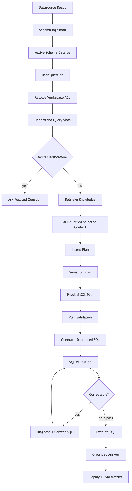
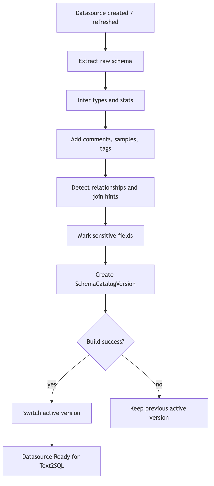
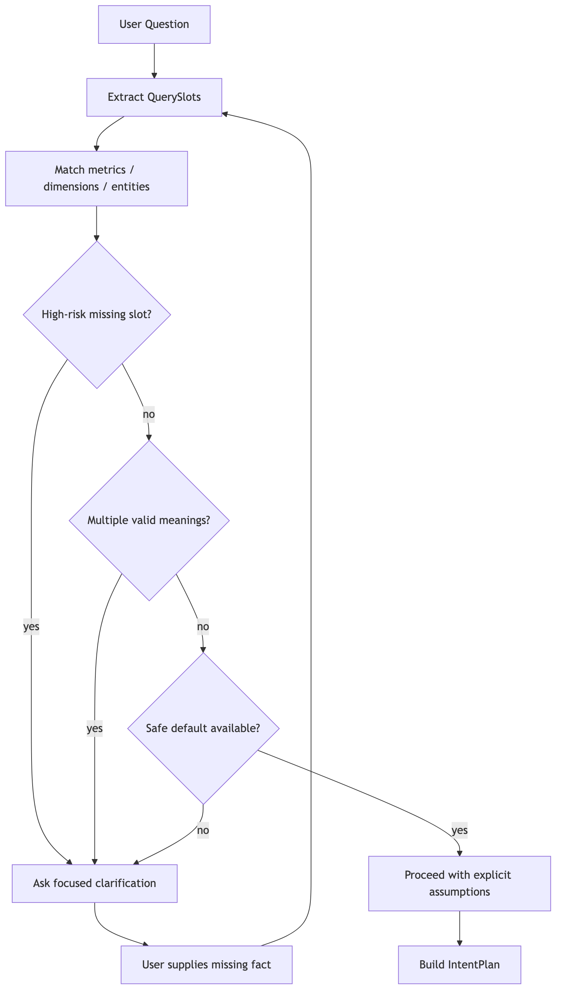
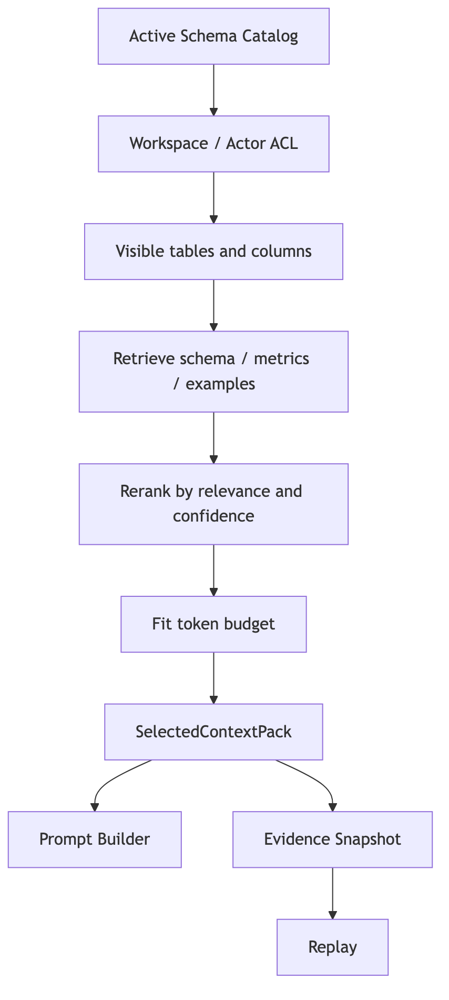
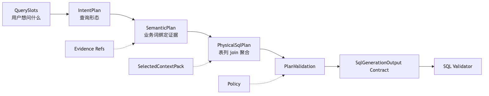
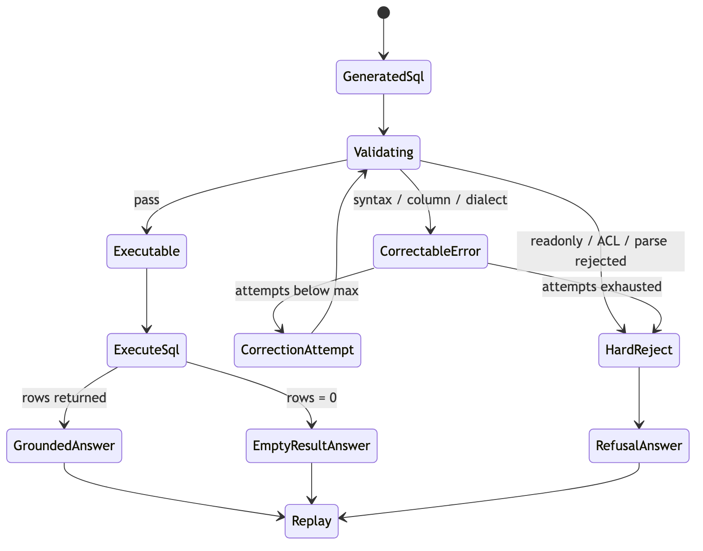
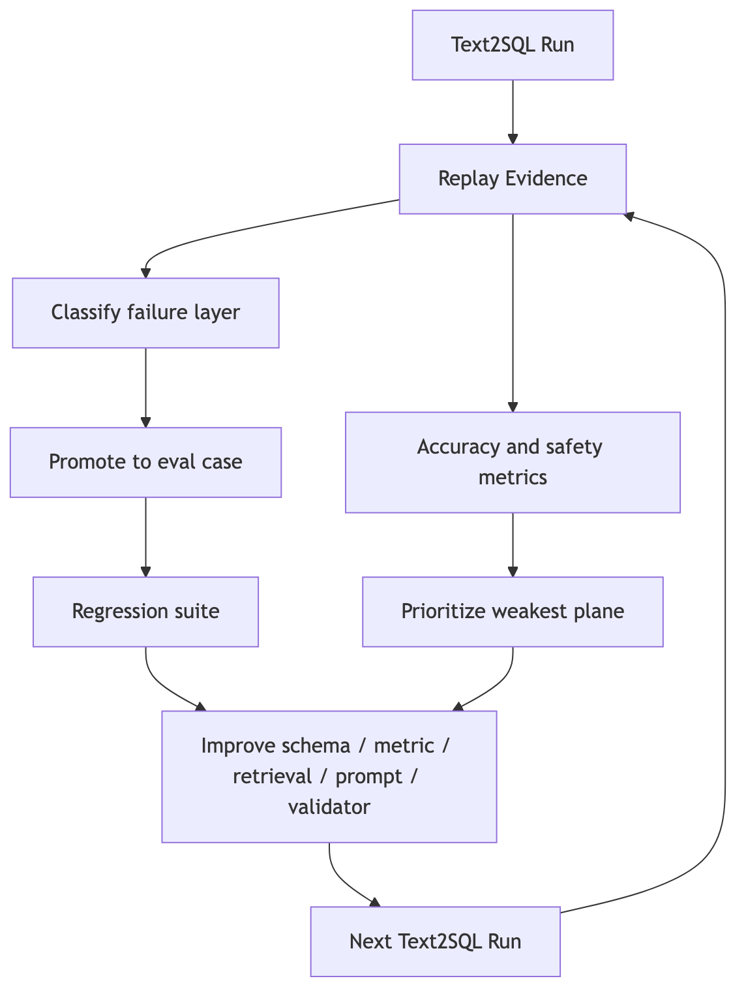
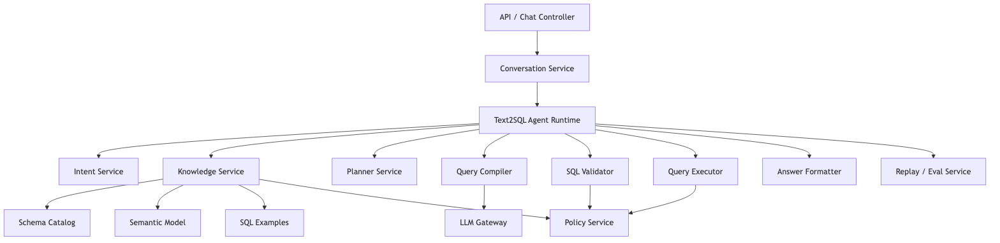

# Text2SQL 新范式：可验证问数操作系统

很多 Text2SQL demo 看起来都很顺：

```text
用户问题 -> prompt -> LLM -> SQL -> execute -> answer
```

这条链路能跑通演示，却很难撑住真实业务问数。

真实业务里，用户问一句“最近 30 天各渠道的退款率怎么样”，系统要同时解决很多事：

```text
退款率的业务口径是什么？
最近 30 天按哪个时区算？
渠道字段在哪张表？
订单表和退款表怎么 join？
当前用户能看哪些表和列？
应该生成哪种 SQL 方言？
执行失败能不能安全修复？
回答有没有忠于查询结果？
这次错误能不能变成下一轮评测样例？
```

所以，Text2SQL 的重心要从“让模型现场想出 SQL”，转向一套 Query Operating System：先把数据事实、业务语义、权限边界和历史证据整理成可检索资产，再把用户问题编译成可验证计划、SQL、结果和回放记录。

可以先记住这条主线：

```text
数据源准备
-> schema catalog
-> 用户问题理解
-> RAG 检索候选事实
-> ACL 裁剪和上下文装箱
-> 查询计划
-> 结构化 SQL 生成
-> SQL 验证和有界纠错
-> 安全执行
-> 基于结果回答
-> replay / eval 持续优化
```


下面按这条线讲清楚。

---

## 一、完整流程：一次问题怎样变成可信回答

一次成熟的 Text2SQL 运行，大概会经过这些阶段：

```text
Datasource Ready
-> Schema Ingestion
-> Active Schema Catalog
-> User Question
-> Resolve Workspace ACL
-> Extract Query Slots
-> Retrieve Knowledge
-> Build SelectedContextPack
-> Build Intent / Semantic / Physical Plan
-> Generate Structured SQL
-> Validate SQL
-> Correct SQL if Safe
-> Execute SQL
-> Format Grounded Answer
-> Persist Replay and Metrics
```



每一步都要有清楚的输入和输出。

| 阶段 | 输入 | 输出 | 解决的问题 |
| --- | --- | --- | --- |
| 数据准备 | datasource、文件、数据库连接 | active schema catalog | 系统到底知道哪些表、列、关系和样例 |
| 问题理解 | 用户自然语言 | QuerySlots | 用户要查指标、明细、趋势、对比还是排行 |
| RAG 检索 | QuerySlots、schema、业务词、历史样例 | RetrievalCandidates | 从大量数据资产里找相关候选 |
| 上下文装箱 | candidates、ACL、budget | SelectedContextPack | 本轮模型可以看到哪些可信材料 |
| 查询计划 | slots、context、policy | IntentPlan / SemanticPlan / PhysicalSqlPlan | SQL 生成前先把意图、口径、表列和 join 固定下来 |
| SQL 生成 | plan、context、output schema | SqlGenerationOutput | 生成结构化 SQL 草案 |
| 验证纠错 | SQL、schema、ACL、dialect | ValidationReport / CorrectionAttempt | 提前发现语法、表列、权限、方言和 limit 问题 |
| 执行回答 | final SQL、rows、columns | GroundedAnswer | 只基于执行结果回答 |
| 回放评测 | 全链路证据 | Replay / EvalCase | 找到失败层，推动下一轮优化 |

这条流程里，LLM 只负责其中几段：理解、计划辅助、SQL 草案、必要时纠错、回答润色。事实源、权限边界、验证、执行和回放，都应该由系统控制。

---

## 二、先把数据源变成可问资产

Text2SQL 的准确率，第一步发生在用户提问之前。

如果系统只拿到一个数据库连接字符串，然后临时查几张表塞进 prompt，后面很容易出现表名幻觉、字段误选、指标口径混乱。更好的起点，是先把数据源沉淀成版本化的 schema catalog。

### 2.1 Schema Ingestion

数据源创建、文件上传、schema 刷新时，触发一次 ingestion：

```text
关系型数据库：
  information_schema
  table comments
  column comments
  primary keys / foreign keys
  indexes
  approximate row count

CSV / Excel：
  headers
  inferred types
  sample values
  null ratio
  date format
  numeric distribution
  sheet metadata
```

文件型数据源尤其要重视类型推断。时间列、金额列、枚举列如果都被当成 TEXT，模型后面很难写对过滤、排序、聚合和日期函数。

### 2.2 Catalog Versioning

Schema catalog 要版本化：

```text
building -> active
building -> failed
active -> archived
```

查询只读取 active 版本。这样 ingestion 失败时，线上查询仍然使用上一版完整 schema，不会读到半成品上下文。

### 2.3 Schema Enrichment

只保存表名、列名还不够。RAG 要能搜得准，catalog 里最好补齐这些信息：

```text
displayName / 中文名
字段描述
示例值
空值率
枚举候选
时间字段识别
金额字段识别
主外键
join hint
敏感字段标签
业务标签
指标定义
历史成功 SQL 样例
```

这些信息会变成后续 RAG 的检索对象。



---

## 三、问题理解：先抽槽位，再决定是否澄清

用户问题先投影成 `QuerySlots`，不要直接丢给 SQL 生成器。

```ts
interface QuerySlots {
  queryType: "lookup" | "detail" | "aggregate" | "trend" | "compare" | "ranking" | "unknown";
  metrics: string[];
  dimensions: string[];
  filters: Array<{
    field?: string;
    operator?: string;
    value?: string;
  }>;
  timeRange?: {
    start?: string;
    end?: string;
    grain?: "day" | "week" | "month" | "quarter" | "year";
  };
  entities: string[];
  sort?: {
    field?: string;
    direction?: "asc" | "desc";
  };
  limit?: number;
  ambiguities: Array<{
    type: "metric" | "dimension" | "time" | "table" | "filter" | "entity";
    message: string;
    candidates?: string[];
  }>;
  confidence: number;
}
```

举个例子：

```text
用户：最近 30 天各渠道退款率怎么样？

QuerySlots:
  queryType: compare / trend
  metric: 退款率
  dimension: 渠道
  timeRange: 最近 30 天
  grain: day 或 total，取决于产品默认策略
  ambiguities:
    - 退款率可能有订单口径、金额口径
```

澄清不应该按问题长短决定。更好的规则是：

| 情况 | 处理 |
| --- | --- |
| 找不到相关表、指标或业务词 | 追问 |
| 一个业务词命中多个指标口径 | 追问 |
| 缺少时间范围且问题依赖周期 | 使用产品默认值并说明，或追问 |
| 候选唯一且证据高置信 | 继续 |
| 轻微歧义但有安全默认 | 继续，并在回答里列出假设 |



---

## 四、RAG 搜索：从“找相似文本”升级成“找可执行证据”

Text2SQL 里的 RAG，有一个很容易踩的坑：把向量库当成全部方案。

向量检索能解决自然语言和字段命名不一致的问题，但它只是一条召回通道。Text2SQL 还需要找齐可执行 SQL 所需的事实：

```text
相关表
相关列
列类型
字段含义
业务指标
默认过滤
表关系
join path
历史成功 SQL 样例
当前用户权限
schema 版本
```

### 4.1 RAG 索引里应该放什么

建议把知识源拆成几类 chunk，每类都带上 metadata。

| chunk 类型 | 内容 | 关键 metadata |
| --- | --- | --- |
| TableCard | 表名、中文名、描述、业务标签、行数 | datasourceId、catalogVersionId、tableName、ACL scope |
| ColumnCard | 列名、类型、描述、示例值、枚举、统计 | tableName、columnName、semanticTags、sensitivity |
| RelationshipCard | join 关系、主外键、人工 join hint | fromTable、toTable、confidence、source |
| MetricCard | 指标名、同义词、公式、默认过滤、粒度 | metricId、requiredTables、requiredColumns、status |
| GlossaryCard | 业务词、别名、解释、关联字段或指标 | termId、synonyms、owner |
| SqlExampleCard | 历史问题、成功 SQL、使用表列、结果类型 | runId、schemaVersion、status、qualityScore |
| FailureCard | 失败类型、错误 SQL、修复方式 | errorCode、fixedBy、evalCaseId |

一个 `ColumnCard` 可以长这样：

```json
{
  "sourceType": "column",
  "datasourceId": "shop_prod",
  "catalogVersionId": "v42",
  "table": "orders",
  "column": "channel",
  "dataType": "varchar",
  "text": "orders.channel 渠道。示例值：app、web、mini_program。用于按渠道统计订单、销售额、退款率。",
  "semanticTags": ["channel", "dimension"],
  "acl": {
    "tableVisible": true,
    "columnVisible": true
  }
}
```

### 4.2 检索顺序：先权限，再召回，再排序

推荐流程不是一条简单流水线，而是一组安全和质量闸门：

| 顺序 | 阶段 | 中文含义 | 详细解析 |
| ---: | --- | --- | --- |
| 1 | `QuerySlots` | 查询槽位解析 | 先把用户自然语言问题投影成结构化槽位，例如指标、维度、过滤条件、时间范围、排序意图、明细或聚合意图。后续检索不再只依赖原句，而是围绕这些槽位找证据。 |
| 2 | `query expansion` | 查询扩展 | 基于槽位扩展同义词、业务别名、缩写、中英文表达和历史常用说法。例如“退款率”可能扩展出“refund_rate”“售后退款占比”“退款订单数除以订单数”等候选表达，用来提升召回覆盖率。 |
| 3 | `metadata prefilter` | 元数据预过滤 | 在真正召回前，先用 `workspaceId`、`datasourceId`、`catalogVersionId`、数据域、表类型、时间分区等元数据缩小搜索范围。这一步既降低噪声，也可以提前排除明显不属于当前用户和当前数据空间的资产。 |
| 4 | `multi-lane retrieval` | 多路召回 | 同时从多种通道找候选材料，例如 schema 字段、业务指标定义、join path、历史 SQL 样例、语义 chunk、血缘关系和 dashboard 配置。不同通道解决不同问题：字段名靠 schema，业务口径靠指标定义，复杂连接靠 join path。 |
| 5 | `candidate normalization` | 候选归一化 | 把不同通道返回的结果整理成统一结构，包括候选 ID、来源类型、文本内容、相关分数、表列元数据、权限元数据和版本信息。只有格式统一，后续过滤、融合、排序和装箱才不会各做各的。 |
| 6 | `ACL filtering` | 访问控制过滤 | 根据用户身份、角色、组织、项目、表权限、列权限和行级策略过滤候选。这里的目标不是等 SQL 执行时再拦截，而是避免未授权 schema、字段说明和业务口径进入模型上下文。 |
| 7 | `dedupe` | 候选去重 | 去掉重复表、重复字段说明、同一指标的多份旧版本、多个通道召回的相同样例。去重可以节省 token，也能避免某类候选因为重复出现而在后续排序中被错误放大。 |
| 8 | `fusion` | 结果融合 | 将多路召回结果合并，并综合各通道分数。常见做法包括 RRF、加权融合和规则加权，让关键词强匹配、语义强匹配、历史样例强匹配都能被公平纳入候选池。 |
| 9 | `rerank` | 重排序 | 用更精细的排序模型或规则重新评估候选价值。召回阶段重在“找得全”，重排序阶段重在“排得准”，通常会综合问题匹配度、字段覆盖度、业务权威性、版本新鲜度和 SQL 可生成性。 |
| 10 | `diversity control` | 多样性控制 | 防止最终上下文只来自同一张表、同一种证据或同一批历史样例。Text2SQL 需要覆盖指标定义、相关字段、连接关系、过滤条件和样例 SQL，因此上下文要有结构性多样性。 |
| 11 | `token budget packing` | Token 预算装箱 | 在上下文长度限制内选择最有价值的材料，并决定保留顺序、裁剪方式和摘要粒度。这里追求的是信息密度，而不是把排序最高的候选从上到下直接塞满。 |
| 12 | `SelectedContextPack` | 最终上下文包 | 输出本轮 SQL 生成真正可以使用的可信材料包，通常包含选中的 schema、指标定义、join path、样例 SQL、权限状态、来源 ID 和排序依据。后续计划生成和 SQL 生成都应该只依赖这个上下文包。 |



其中最关键的是两层权限：

```text
检索前：用 datasourceId、workspaceId、catalogVersionId 做 metadata prefilter。
检索后：再按 table ACL、column ACL、row policy metadata 做精确过滤。
```

不要让未授权 schema 进入 selected context。执行阶段拒绝 SQL 只能防止数据泄露，无法防止 schema 泄露。

### 4.3 多路召回：不要只靠一种检索

Text2SQL 的候选召回建议至少有四路：

| 召回通道 | 适合解决 | 例子 |
| --- | --- | --- |
| Lexical / BM25 | 表名、列名、中文名、业务词直接命中 | “渠道”命中 `orders.channel` |
| Dense Embedding | 用户口语和 schema 描述不一致 | “从哪里来的订单”命中 `channel` / `source` |
| Graph Retrieval | 多表 join、邻接表扩展 | `orders` -> `refunds` -> `order_items` |
| SQL Example Retrieval | 复用相似问法和 SQL 结构 | “各渠道退款率”命中历史退款率 SQL |

真实查询经常需要组合：

```text
用户问“各渠道退款率”

Lexical:
  渠道 -> orders.channel
  退款 -> refunds / refund_amount

Dense:
  退款率 -> refund rate metric

Graph:
  orders.id -> refunds.order_id

SQL Example:
  “按渠道看退款金额占比” -> 可复用 group by channel 的 SQL 结构
```

### 4.4 Fusion：把多路结果合成候选池

多路召回的分数尺度不同，不能直接相加。可以先用 RRF 做稳定融合：

```text
score(candidate) =
  w_lexical * rrf_rank_lexical
+ w_dense   * rrf_rank_dense
+ w_graph   * rrf_rank_graph
+ w_example * rrf_rank_example
+ boosts
- penalties
```

常见加分项：

```text
表和列同时命中
命中 active MetricDefinition
命中人工维护的 join hint
命中高质量历史 SQL
候选覆盖 QuerySlots 里的指标、维度、过滤条件
```

常见扣分项：

```text
schema 版本过旧
metric 已 deprecated
example 执行失败过
候选只命中低价值 sample value
候选表过大且缺少过滤条件
候选之间缺 join path
```

### 4.5 Rerank：排序要看“能否生成 SQL”

普通 RAG 的 rerank 常看语义相关性。Text2SQL 的 rerank 还要看可执行性：

```text
这个候选能不能补齐指标？
能不能补齐维度？
表之间有没有 join path？
字段类型是否支持当前操作？
当前用户是否可见？
是否会挤爆 context budget？
是否和其他候选重复？
```

可以用一个轻量 reranker 给候选打标签：

```ts
type RetrievalCandidateScore = {
  candidateId: string;
  relevance: number;
  executableUsefulness: number;
  evidenceQuality: number;
  aclSafe: boolean;
  stale: boolean;
  reason: string;
};
```

最后进入 prompt 的应该是整理后的 `SelectedContextPack`，避免直接塞一堆原始 chunk：

```ts
interface SelectedContextPack {
  datasourceId: string;
  catalogVersionId: string;
  dialect: "sqlite" | "mysql" | "postgresql";
  selectedTables: Array<{
    name: string;
    description?: string;
    columns: Array<{
      name: string;
      type: string;
      description?: string;
      sampleValues?: string[];
    }>;
  }>;
  relationships: Array<{
    from: string;
    to: string;
    joinHint: string;
    confidence: number;
  }>;
  metrics: Array<{
    name: string;
    formula: string;
    requiredTables: string[];
    requiredColumns: string[];
  }>;
  examples: Array<{
    question: string;
    sql: string;
    tables: string[];
    columns: string[];
    score: number;
  }>;
  evidence: Array<{
    sourceType: "schema" | "relationship" | "metric" | "sql_example" | "glossary";
    sourceId: string;
    reason: string;
    score: number;
  }>;
}
```

### 4.6 Context Budget：少而准，比多而杂更重要

建议按优先级装箱：

| 优先级 | 内容 | 处理 |
| --- | --- | --- |
| P0 | 当前问题、SQL 方言、安全规则、输出 schema | 必留 |
| P0 | ACL 过滤后的候选表列 | 必留 |
| P1 | 命中的指标、业务词、join path | 优先保留 |
| P1 | Physical plan 需要的表列 | 优先保留 |
| P2 | 高质量历史 SQL 样例 | 控制数量 |
| P2 | sample values、枚举值 | 按需保留 |
| P3 | 低分候选、重复描述 | 丢弃 |

一个实用规则：SQL example 不要超过 2-3 个。样例太多时，模型容易模仿错数据源、错表名或旧口径。

### 4.7 SQL Example 的过滤规则

历史 SQL 很有价值，也最容易污染上下文。

进入 few-shot 之前至少过滤掉：

```text
执行失败的 run
ACL 拒绝的 run
使用 deprecated schema 的 run
引用当前用户无权表列的 run
人工标记低质量的 run
结果为空但原因不明的 run
来自临时试错会话的 run
```

可以保留的样例：

```text
执行成功
通过 ACL
schema version 仍兼容
指标口径明确
SQL 可解释
人工或 eval 验证质量高
```

### 4.8 RAG 怎么优化

优化 RAG 不能只看“召回相似文本是否变多”。Text2SQL 要按失败层定位：

| 现象 | 可能原因 | 优化动作 |
| --- | --- | --- |
| SQL 选错表 | table recall 低、表描述弱 | 补表中文名、业务标签、BM25 同义词、table-card |
| SQL 选错列 | column recall 低、字段解释弱 | 补列描述、示例值、semanticTags、列级 rerank |
| 指标公式错 | metric 缺失或排序低 | 建 MetricDefinition，给指标更高权重 |
| join 错 | graph retrieval 弱 | 补 SchemaRelationship、join hint、join eval case |
| prompt 太长 | 候选太多、去重差 | dedupe、diversity cap、context budget、example 限量 |
| 相似样例误导 | example 过旧或质量差 | 给 SQL example 加 status、schemaVersion、qualityScore |
| 权限风险 | 过滤只在执行阶段做 | 检索前 metadata filter + 检索后 ACL filter |
| 空结果多 | 时间/过滤槽位默认不清 | QuerySlots 默认策略、澄清策略、answer explanation |

评测也要分层：

```text
table recall@k
column recall@k
metric hit rate
join path hit rate
selected context precision
ACL leakage rate
SQL execution success rate
correction success rate
answer faithfulness
```

只要能把每次失败归到这些指标上，RAG 优化就会从“调 prompt”变成“修资产、修召回、修排序、修验证”。

---

## 五、从上下文到 SQL：计划先行

拿到 `SelectedContextPack` 后，不要直接让模型写 SQL。先生成计划。

```text
QuerySlots
-> IntentPlan
-> SemanticPlan
-> PhysicalSqlPlan
-> SqlGenerationOutput
```



### 5.1 IntentPlan：确定查询形态

```ts
interface IntentPlan {
  queryType: "detail" | "aggregate" | "trend" | "compare" | "ranking";
  metrics: string[];
  dimensions: string[];
  filters: string[];
  timeRange?: string;
  sort?: string;
  limit?: number;
}
```

### 5.2 SemanticPlan：把业务词绑定证据

```yaml
resolvedMetrics:
  - userTerm: "退款率"
    metricName: "refund_rate"
    formula: "SUM(refunds.amount) / SUM(orders.amount)"
    evidenceRefs:
      - metric:refund_rate
      - column:refunds.amount
      - column:orders.amount

resolvedDimensions:
  - userTerm: "渠道"
    table: "orders"
    column: "channel"
    evidenceRefs:
      - column:orders.channel
```

这里的重点是 evidence。没有 evidence 的语义解析，很容易变成模型现场猜。

### 5.3 PhysicalSqlPlan：约束 SQL 的形状

```ts
interface PhysicalSqlPlan {
  dialect: string;
  tables: string[];
  columns: string[];
  joins: Array<{
    type: "inner" | "left";
    leftTable: string;
    rightTable: string;
    on: string;
  }>;
  aggregations: string[];
  filters: string[];
  groupBy: string[];
  orderBy: string[];
  limit: number;
}
```

生成 SQL 前先校验 plan：

```text
表是否存在？
列是否存在？
join 是否有依据？
metric formula 是否有字段支持？
是否引用未授权对象？
limit 是否符合策略？
dialect 是否匹配？
```

Plan 合法，再进入 SQL 生成。

---

## 六、SQL 生成、验证和有界纠错

SQL 生成不要依赖 Markdown code block。让模型输出结构化 JSON：

```ts
interface SqlGenerationOutput {
  sql: string;
  explanation: string;
  referencedTables: string[];
  referencedColumns: Record<string, string[]>;
  assumptions: string[];
  confidence: number;
  cannotAnswerReason?: string;
}
```

模型必须遵守这些约束：

```text
只能使用 selected context 中的表、列、指标和关系。
上下文不足时返回 cannotAnswerReason。
SQL 必须只读。
SQL 必须符合目标 dialect。
明细查询必须包含 LIMIT。
referencedTables / referencedColumns 要和 SQL parser 结果一致。
```

SQL 出来后进入 validator：

```text
SQL text
-> normalize
-> dialect parse
-> readonly check
-> single statement check
-> referenced object extraction
-> schema existence check
-> ACL check
-> limit policy
-> dry-run / explain
-> executable SQL
```

错误要分类。安全错误直接拒绝，可修复错误进入有界纠错：

| 错误类型 | 处理 |
| --- | --- |
| SQL_SYNTAX_ERROR | 纠错 |
| UNKNOWN_TABLE / UNKNOWN_COLUMN | 回到 selected context 纠错 |
| AMBIGUOUS_COLUMN | 补表别名 |
| GROUP_BY_ERROR | 修聚合 |
| DIALECT_ERROR | 按方言修复 |
| LIMIT_POLICY_VIOLATION | 注入或裁剪 limit |
| READONLY_VIOLATION | 拒绝 |
| ACL_FORBIDDEN | 拒绝 |
| EMPTY_RESULT | 进入回答解释 |

纠错最多 1-2 次，输入必须包含原问题、selected context、原 SQL、验证错误和方言规则。纠错 prompt 还要明确限制：

```text
只在 selected context 内修复。
不能新增未授权表列。
不能绕过 readonly 和 limit 策略。
不能把 ACL 错误当成可修复错误。
```



---

## 七、回答也要基于证据

很多系统前面做对了，最后一步回答又开始自由发挥。

Answer Formatter 的输入应该收窄到：

```text
question
finalSql
columns
rows
assumptions
metric definitions used
execution status
```

回答规则：

```text
不能补充 rows/columns 里没有的数据。
不能把 assumptions 写成事实。
不能隐藏权限拒绝、执行失败或空结果。
趋势、对比、排名要说明口径和排序依据。
空结果要解释当前条件下没有匹配数据，并建议用户调整时间或过滤条件。
```

空结果尤其要单独处理。`rows.length === 0` 代表 SQL 成功执行但没有匹配数据，它应该进入回答解释，不能自动触发重写 SQL。

---

## 八、Replay：让错误变成下一轮能力

Text2SQL 很难靠一次 prompt 写准。它要靠 replay 把失败变成资产。

每次运行都应该保存：

```text
runId
question
actor / workspace / datasource
schema catalog version
query slots
retrieval queries
retrieval candidates
selected context
intent / semantic / physical plan
generated SQL
validation results
correction attempts
final SQL
execution result
answer
latency / token / cost
final status
```



Replay 的关键价值是定位失败层：

```text
意图理解错？
RAG 没召回正确表？
RAG 召回了但 rerank 排低？
SelectedContextPack 漏了 join path？
MetricDefinition 口径错？
SQL 生成没遵守 plan？
Validator 漏掉了未知列？
纠错引入了新错误？
Answer Formatter 超出结果集？
```

每类失败都能转成不同资产：

| 失败层 | 沉淀资产 |
| --- | --- |
| 问题理解错 | QuerySlots 训练样例、澄清规则 |
| 表列召回失败 | schema chunk、同义词、BM25 权重 |
| 指标口径错 | MetricDefinition、业务词典 |
| join 错 | SchemaRelationship、join hint |
| SQL 生成错 | few-shot example、output contract、plan validation |
| 纠错失败 | correction eval case、error taxonomy |
| 回答幻觉 | answer faithfulness test |

---

## 九、落地顺序：先做能闭环的 MVP

别一开始就做完整混合检索和自动优化。第一版先把边界立住。

### P0：Schema Catalog + ACL Context Pack

目标：降低表名、列名幻觉，防止未授权 schema 进入 prompt。

交付：

```text
SchemaCatalogVersion / SchemaTable / SchemaColumn / SchemaRelationship
数据源创建后自动 schema ingestion
文件型数据源 type inference
ContextPackBuilder
workspace / table / column ACL 裁剪
Prompt Builder 注入 selected context
SQL validator 检查表列存在性
trace 记录 contextPackSummary 和 evidence
```

验收：

| 指标 | 目标 |
| --- | --- |
| 未授权表进入 prompt | 0 |
| 表名幻觉率 | 明显下降 |
| 列名幻觉率 | 明显下降 |
| SQL 执行成功率 | 提升 |
| runId 可查看 context summary | 是 |

### P1：QuerySlots + Plan Validation + SQL Correction

目标：让系统知道自己缺什么，也知道哪些 SQL 错误可以修。

交付：

```text
QuerySlots
schema-aware clarification
IntentPlan / SemanticPlan / PhysicalSqlPlan
PlanValidation
SQL parser / dialect parser
dry-run / explain
execution error taxonomy
diagnose-sql / correct-sql，最多 2 次
```

### P2：Lexical Retrieval + SQL Examples

目标：解决 schema 变大后的上下文选择问题。

交付：

```text
TableCard / ColumnCard / MetricCard / SqlExampleCard
lexical retrieval
metadata prefilter
ACL filter
simple rerank
selected context replay
```

### P3：Hybrid Retrieval + Semantic Model

目标：解决口语表达、复杂指标、多表 join。

交付：

```text
dense embedding
lexical + dense + graph 多路召回
RRF fusion
rerank
MetricDefinition / GlossaryTerm / SemanticJoinPath
retrieval metrics
```

### P4：Eval Replay + 自动优化

目标：把运行日志变成回归测试和知识资产。

交付：

```text
Text2SqlReplay
EvalCase / EvalDataset
runId replay API
promote failed run to eval case
table / column / metric / join hit rate
answer faithfulness check
```

---

## 十、架构边界建议

最后，模块边界可以这样分：

```text
API / Chat Controller
-> Text2SQL Agent Runtime
   -> Intent Service
   -> Knowledge / Retrieval Service
   -> Policy Service
   -> Query Compiler
   -> Planner Service
   -> SQL Generator
   -> SQL Validator
   -> Query Executor
   -> Answer Formatter
   -> Replay / Eval Service
```



其中最容易长成泥球的是 ChatService、PromptBuilder 和 RetrievalService。一个简单判断方法：

```text
ChatService 只管会话和编排。
Knowledge Service 管 schema、指标、样例和检索。
Policy Service 管可见性和执行授权。
Query Compiler 管 selected context。
Planner 管意图、语义和物理计划。
Validator 管 SQL 是否安全可执行。
Replay 管证据链和评测样例。
```

做到这里，Text2SQL 就会从“自然语言转 SQL 功能”，升级成一套能解释、能验证、能修复、能持续变准的问数操作系统。
