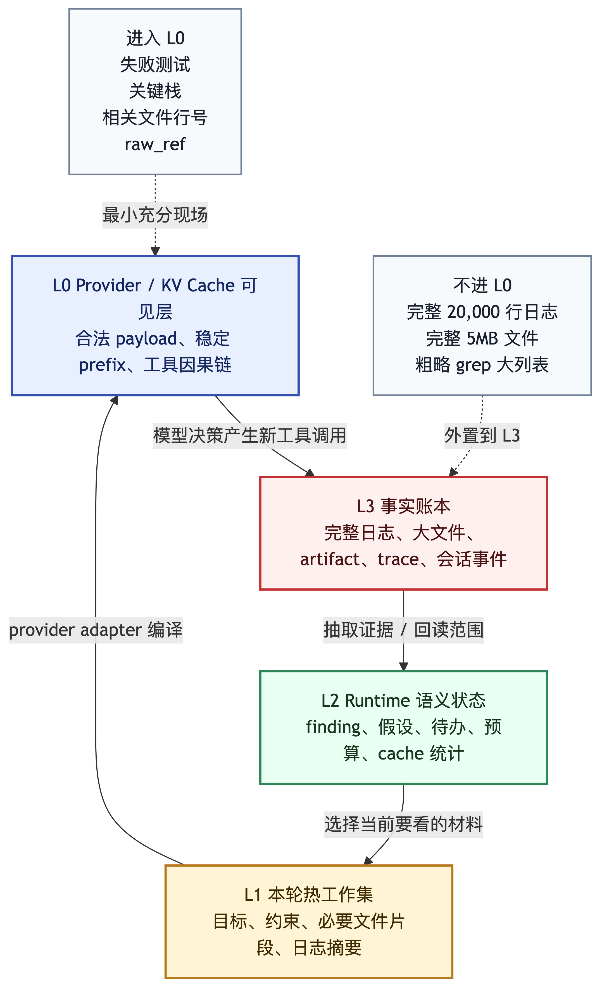
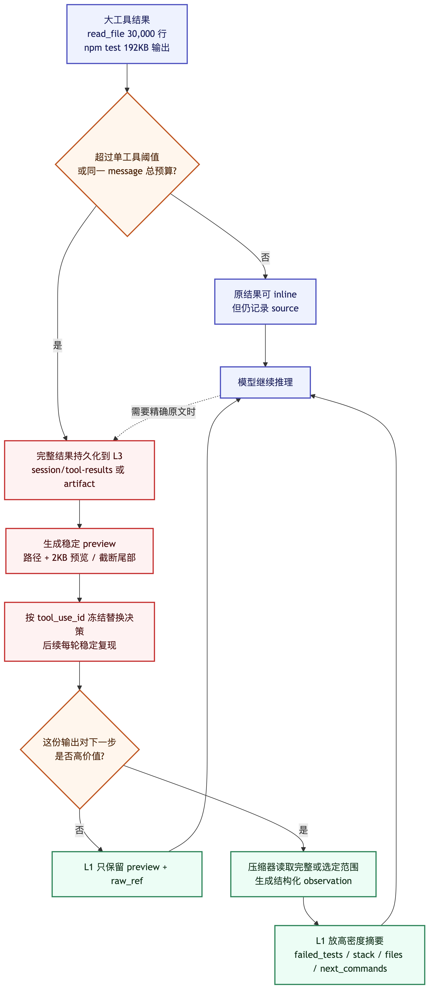
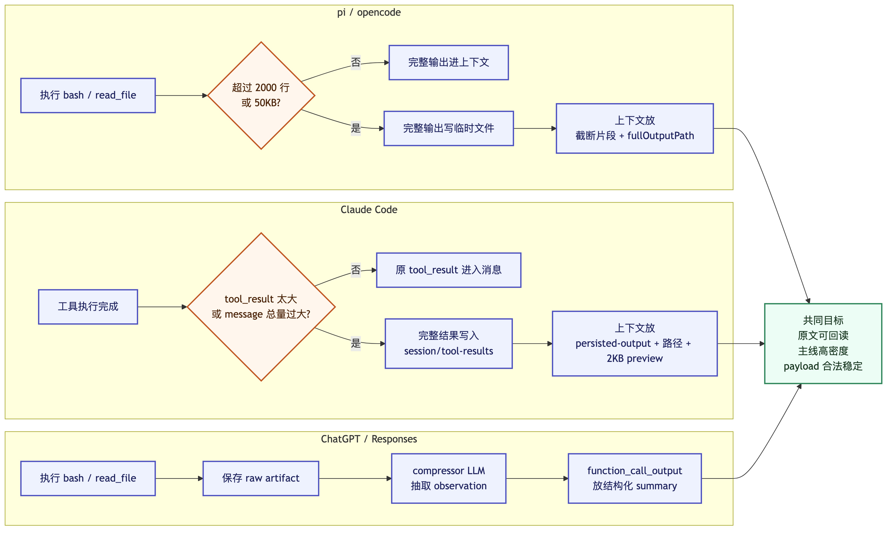
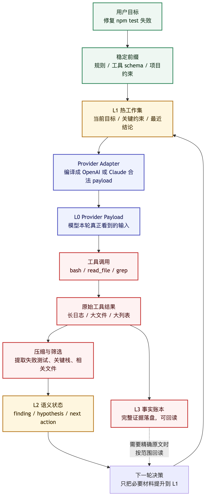

# Context 工程实战：让 LLM 更会干活，也更省钱

很多人第一次写 Agent，Context 基本就是一段聊天记录：

```text
system prompt
user message
assistant message
tool result
assistant message
...
```

这能跑 demo。跑到真实项目里，麻烦很快就来了。

拿 Coding Agent 修测试失败来说，它一会儿读文件，一会儿跑命令，一会儿又要回头确认刚才的判断：

```text
读项目规则
查看相关文件
运行测试
分析失败日志
再次读取代码
修改文件
重新验证
向用户汇报
```

这里每一步都会制造新材料。一个测试日志可能几十万字节，一个文件可能三万行，`grep` 结果过两轮就没用了，但用户一开始说的限制又不能丢。更现实一点：每轮请求都要花 token，前缀一抖，provider 侧的 prompt cache 还可能重新算。

真正要问的不是：

```text
怎样把所有历史都塞给模型？
```

而是：

```text
这一轮为了让 LLM 做对事，最少需要看见什么？
哪些东西应该稳定复用，哪些东西应该外置，哪些东西应该压缩？
```

我更愿意把 Context 看成 Agent 的“工作现场编译器”。它把规则、工具、用户目标、历史证据、运行时状态和成本预算，编译成一次合法、够用、别太贵的模型输入。

这篇草稿只沿着一条线写：

```text
Transformer 推理为什么需要 KV Cache
-> Prompt Caching 为什么依赖稳定 prefix
-> Agent 为什么不能只维护 messages[]
-> Context Manager 为什么要做记忆分层和对话分层
-> 大文件和长 bash 日志应该怎样进入上下文
```

贯穿全文的例子固定为：

```text
用户：帮我修复 npm test 失败。

Agent:
  1. 读取项目规则和测试脚本
  2. 运行 bash
  3. 得到很长的失败日志
  4. 压缩日志并保留原始证据引用
  5. 继续读取相关代码
  6. 修改后再次验证
```

## 一、先从 LLM 推理流程说起

先把模型推理的账算清楚。否则很容易把 Context 问题误解成“窗口够大就行”。

自回归 LLM 生成文本，通常可以粗略分成两段：

```text
Prefill:
  模型读完整个输入 prompt。
  为 prompt 里的历史 token 计算每层 attention 的 Key / Value。

Decode:
  模型一个 token 一个 token 往后生成。
  新 token 的 Query 去读取历史 token 的 Key / Value。
```

不用先钻数学。粗略看，它像这样：

```text
模型先把你给它的上下文读一遍，建立一张可查询的注意力索引。
后面每生成一个新 token，都会回头看这张索引。
```

如果输入 prompt 有 80,000 个 token，每次生成下一个 token 都重新计算前面 80,000 个 token 的 Key / Value，成本会高得离谱。于是就有了 KV Cache。

KV Cache 解决的问题很具体：

```text
已经处理过的 token prefix
  -> 对应的 Key / Value 中间结果可以复用
  -> 后续只需要继续处理新增 token
```

这里真正要盯住的是 **token prefix**。

KV Cache 不是长期记忆，不是向量数据库，也不是“模型记住了上一次对话”。它更像：

```text
同一个模型
同一段完全一致的 token 前缀
同一套位置关系
在 prefill 后得到的一组 attention 中间结果
```

这条规则对 Agent 很要命：

> KV Cache 复用依赖前缀稳定，不依赖语义相似。

两段上下文意思差不多，不代表缓存能复用。中间插一个时间戳、随机 id、一段动态日志，或者工具定义顺序变了，后面的 token 位置和结构就跟着变。缓存不认“意思差不多”，它认前缀是否稳定。

Context Manager 一开始就要处理这些琐碎但要命的问题：

```text
哪些内容应该稳定放在前面？
哪些内容每轮都会变，只能放在后面？
哪些工具结果会污染稳定 prefix？
哪些大对象应该只放引用，不放全文？
```

## 二、Prompt Caching 是 provider 侧的 KV Cache 复用策略

OpenAI 和 Claude 都有 prompt caching，但暴露出来的控制方式不完全一样。

OpenAI 这边，公开语义比较直接：

```text
把静态、重复内容放在 prompt 开头。
把动态、用户本轮相关内容放在后面。
通过 usage.prompt_tokens_details.cached_tokens 观察命中。
需要时用 prompt_cache_key 帮助把共享前缀路由到更可能命中的缓存位置。
```

放在前面的，最好是几轮下来不怎么变的东西：

```text
系统规则
开发者规则
工具 schema
项目固定约束
已经确认的阶段摘要
```

下面这些就别往稳定前缀里塞了：

```text
当前时间
随机 trace id
刚刚跑出来的长 bash 日志
本轮 grep 的大量命中
还没有整理过的文件全文
```

Claude 也看稳定前缀，只是请求结构不同。Messages API 里，缓存顺序大致按这个方向走：

```text
tools
-> system
-> messages
```

工具定义越稳定，顺序和内容越不要乱动；system 规则也一样。messages 最容易带入动态材料，通常放在更靠后的位置。

Claude 的工具调用形状也不同：

```text
assistant message:
  content:
    - type: tool_use
      id: toolu_xxx
      name: bash
      input: {...}

user message:
  content:
    - type: tool_result
      tool_use_id: toolu_xxx
      content: "..."
```

OpenAI Responses 里则是另一种形状：

```text
response.output:
  - type: function_call
    call_id: call_xxx
    name: bash_exec
    arguments: "{...}"

next input:
  - type: function_call_output
    call_id: call_xxx
    output: "..."
```

这两套 wire shape 不能混着写。

应用内部当然可以有统一的 `ToolCall`、`ToolResult`、`Artifact`、`State` 模型，但到了 provider adapter 层，必须编译成各自合法的请求结构。

这里先划第一条线：

> 内部 L0-L3 架构是 Agent 自己的运行时模型，不是 OpenAI 或 Claude 的官方 JSON。

### 2.1 Claude Code 的特殊层：`cache_edits` 不是普通 `cache_control`

在 Claude Code 相关实现里，还能看到一个更特殊的机制：`cache_edits`。

它容易和 Claude Prompt Caching 里的 `cache_control` 混在一起，但两者不是一回事。

```text
cache_control:
  公开 Prompt Caching 语义。
  作用是标记哪段稳定 prefix 适合写入或读取 prompt cache。

cache_edits:
  更像 Claude Code 方向的缓存感知微压缩机制。
  作用是把旧 tool_result 从服务端缓存视图里删除或跳过。
  目标是在清理旧工具结果时，尽量不破坏已有 prompt cache prefix。
```

为什么会需要这东西？因为 Coding Agent 的旧工具结果太多了：

```text
旧 grep 输出
旧 read_file 全文
旧 bash test log
旧 web fetch 内容
```

这些内容刚出现时是证据，几轮之后往往只剩噪声。如果客户端直接把历史里的旧 `tool_result` 改掉，前缀字节就变了，Prompt Cache 可能从修改点之后失效。

`cache_edits` 的思路更像：

```text
本地 messages 尽量保持原样。
给可清理的旧 tool_result 标上 cache_reference。
在请求里附带 cache_edits 删除意图。
让服务端缓存视图清理这些旧工具结果。
```

它不是 summarizer，也不是普通开发者可以跨 OpenAI / Claude / 本地模型直接复刻的通用 Context API。

对我们自己实现 Agent 更稳的启发是：

```text
完整工具结果落 L3。
L1 只放摘要、preview 和 artifact_ref。
阶段结论进入稳定前缀。
探索 transcript 不默认进入长期上下文。
必须替换旧工具结果时，按 tool_call_id / tool_use_id 稳定复现。
```

第七节会再展开 `cache_edits`、cache marker、cached microcompact 和 full compact 的关系。这里先记一个判断就够了：Prompt Caching 要稳定 prefix；`cache_edits` 是在清理旧工具结果时，尽量别把这个 prefix 打碎。

## 三、别只管 messages，要管工作现场

如果 Agent 只有普通聊天，上下文管理相对简单。旧对话、当前问题、系统规则，大致拼一下就能跑。

但 Coding Agent 不是聊天机器人。它在一个有副作用、有文件、有命令、有错误、有验证的环境里工作。

它要管理的对象至少包括：

```text
给 LLM 的规则
用户目标
项目约束
工具定义
工具调用参数
工具结果
当前任务状态
历史决策
失败和排除过的假设
大文件原文
bash 原始 stdout / stderr
压缩摘要
artifact 引用
token 预算
cache 命中指标
```

这些对象的性质完全不同。

有些是控制层规则，比如 system / developer prompt。

有些是事实证据，比如测试失败栈、文件片段、git diff。

有些是推测，比如“可能是 mock 写错了”。

有些是运行时状态，比如“当前已经定位到 user.service.test.ts”。

有些是大对象，比如 20,000 行 bash 日志或 5MB 文件。

如果全部塞进 `messages[]`，Agent 就很难回答这些问题：

```text
哪些内容真的要给模型看？
哪些只是为了审计和回放？
哪些已经被阶段结论吸收，可以外置？
哪些工具结果太大，会破坏后续 cache？
哪些内容需要保留原文，不能只总结？
```

Context Manager 如果只会拼 `messages[]`，很快就不够用了。它至少要做两件事：

```text
1. 让 LLM 看见当前决策最需要的信息。
2. 让不该进入模型输入的东西，仍然可追溯、可回读、可审计。
```

## 四、四层记忆模型：L0 到 L3

我现在更倾向把 Agent 的上下文记忆拆成四层。



```text
L0: Provider / KV Cache 可见层
L1: 本轮发送给 LLM 的热工作集
L2: Runtime 语义状态
L3: 硬盘 / 数据库 / 对象存储里的事实账本
```

这不是按“重要程度”排座次。分层时看的是四个更工程化的问题：它会不会进入模型输入，需不需要稳定缓存，能不能有损压缩，原始证据要不要长期保留。

### L0：provider / KV cache 可见层

L0 是模型这一轮真正看到的 provider payload。

这里包括：

```text
稳定 system / developer 规则
稳定 tool schema
provider 要求的 tool call / tool result 因果链
当前用户请求
当前必要证据
当前输出要求
```

L0 最怕两件事：协议不合法，前缀乱抖。

```text
协议合法。
前缀尽量稳定。
动态内容尽量靠后。
不要把内部 bookkeeping 字段伪装成 provider 字段。
```

OpenAI 的 L0 可能是 Responses API 的 `input` items。Claude 的 L0 可能是 `tools`、`system`、`messages[]` 和 content blocks。

两边都可以表达“工具调用”和“工具结果”，但形状不同。

### L1：本轮要发送给 LLM 的热工作集

L1 是 Context Manager 准备给模型看的工作材料。

它不一定等于 provider payload，因为它还没有被 adapter 编译成 OpenAI 或 Claude 的格式。

L1 里通常放：

```text
当前任务目标
用户不可丢约束
最近几轮对话
已经确认的阶段结论
必要文件片段
必要错误日志摘要
下一步要做的决策
```

比如修测试失败时，L1 不应该放完整 20,000 行日志，而应该放：

```json
{
  "kind": "bash_observation_summary",
  "command": "npm test",
  "exit_code": 1,
  "failed_tests": ["UserService getUserById returns user when found"],
  "relevant_stack": ["src/user.service.ts:42", "src/user.service.test.ts:18"],
  "raw_log_ref": "artifact://bash/npm-test-001"
}
```

这足够让模型继续判断下一步要读哪个文件，同时不会把所有噪声都压进上下文。

### L2：runtime 语义状态

L2 是 Agent host 自己维护的运行时状态。

它面向系统，不一定每轮都发给模型。

L2 里通常放：

```text
任务状态
阶段性 finding
压缩摘要
待办列表
已访问文件索引
错误定位
排除过的假设
cache 统计
预算状态
```

比如：

```json
{
  "task_state": "debugging_test_failure",
  "current_hypothesis": "Prisma mock shape does not match service usage",
  "confirmed_files": [
    "packages/api/src/user.service.ts",
    "packages/api/src/user.service.test.ts"
  ],
  "next_action": "read focused file spans"
}
```

L2 的价值在于把一堆工具事件整理成“现在做到哪了”。它不是 provider payload，也不是长期记忆，更像 Agent 桌面上摊开的工作笔记。

### L3：硬盘 / 数据库 / 对象存储里的事实账本

L3 放完整证据。

这里保存：

```text
完整 bash stdout / stderr
完整大文件内容
原始工具调用参数
原始工具结果
artifact
trace
生成产物
会话事件账本
```

L3 的要求是：

```text
尽量完整。
可追溯。
可回读。
可审计。
不要求每轮进入模型。
```

如果 bash 输出有 10MB，不应该直接进入 L0 或 L1。它应该先进入 L3：

```text
.agent-artifacts/runs/2026-06-29/npm-test-001.stdout.log
.agent-artifacts/runs/2026-06-29/npm-test-001.stderr.log
.agent-artifacts/runs/2026-06-29/npm-test-001.meta.json
```

然后 L1 只保留：

```text
测试失败摘要
关键栈
失败文件
省略原因
raw_log_ref
必要时可回读的范围
```

原始证据还在，只是不用每轮都背到模型面前。

## 五、三层对话模型：发送、运行时、探索

除了记忆分层，还需要对话分层。

因为真实 Agent 的“对话”不是一种东西。

至少可以拆成三层：

```text
第一层：真正发给 LLM 的 provider payload
第二层：runtime conversation state
第三层：临时探索 transcript
```

### 第一层：provider payload

这一层是真正发给 OpenAI 或 Claude 的内容。

它必须满足两个要求：

```text
1. provider 协议合法。
2. 尽量保持稳定 prefix。
```

OpenAI Responses 可以手动把历史 `response.output` 追加到下一轮 `input`，也可以用 `previous_response_id` 让服务端帮助接续状态。

如果手动管理历史，工具结果要保留 `function_call_output.call_id`，对应前面的 `function_call.call_id`。

Claude Messages 则要保留 `tool_use.id` 和后续 `tool_result.tool_use_id` 的对应关系。

这一层不能为了“省 token”随便打断工具因果链。

### 第二层：runtime conversation state

这一层是 Agent 自己维护的会话状态。

它可以比 provider payload 更丰富：

```text
主线对话
阶段摘要
用户偏好
当前任务状态
工具调用索引
artifact 引用
压缩记录
```

它也可以比 provider payload 更稳定，因为不是所有运行时状态都要暴露给模型。

例如：

```text
用户目标：修复 npm test
当前阶段：已定位失败测试
关键证据：失败来自 prisma.user.findUnique
原始日志：artifact://bash/npm-test-001
下一步：读取 service 和 test 的相关片段
```

这些内容可以在 L2 保存，并按需提升到 L1。

### 第三层：临时探索 transcript

这一层专门放探索过程中的高噪声材料：

```text
粗略 grep 的大列表
大文件扫读结果
重复 bash 日志
无关 passing test 输出
临时网页正文
探索失败的命令输出
```

这些内容通常不应该默认进入长期主历史，也不应该进入稳定 cache prefix。

更好的做法是：

```text
探索 transcript 先进入 L3。
Context Manager 从中提取 finding。
finding 进入 L2。
必要片段进入 L1。
provider adapter 把 L1 编译成 L0。
```

粗糙一点说：探索材料先沉淀，阶段结论再进入主线。

## 六、案例：大文件和长 bash 日志怎么办

假设 Agent 做了两件很常见的事：



```text
read_file:
  读到一个 30,000 行文件。

bash:
  执行 npm test。
  stdout: 180,000 bytes
  stderr: 12,000 bytes
  exit_code: 1
```

表面上看，一个是文件，一个是命令日志；从 Context 角度看，它们是同一类麻烦：

```text
原始证据很大。
模型本轮只需要少量高价值线索。
后续又必须能回读完整证据。
```

bash 只是多一个特点：它会持续流出 stdout/stderr，不是一次性返回一个字符串。除此之外，大文件、长日志、粗略 grep 结果，都应该按“大工具结果”治理。

最差的做法是：

```text
把完整输出作为 tool result 塞回下一轮。
```

这会带来三个问题：

```text
1. L0 立刻变大，每轮成本上升。
2. 大量原文挤占模型注意力。
3. 动态工具结果进入 messages，后续 prefix 更容易抖动。
```

真实 Agent 通常会先挡住这种大输出，只是挡法不一样。粗略看有三种：

```text
pi / opencode:
  机械截断 + fullOutputPath

Claude Code:
  tool result 持久化 + persisted-output preview

ChatGPT / OpenAI Responses 方案:
  raw artifact + compressor LLM 语义压缩
```

这三种东西不在同一个层级。`pi` 先做工程保护，别让大输出撑爆上下文；Claude Code 管的是 tool result 生命周期，把大结果落盘，再给模型一个 preview 引用；ChatGPT 这类方案可以再往上走一步，让压缩器读完原文后生成结构化 observation。

### 6.1 `pi` / opencode：机械截断 + 文件引用

`pi` 的思路很直接：

```text
工具输出太大
-> 保留一段截断后的输出给模型看
-> 完整输出写到临时文件
-> 在上下文里告诉模型 fullOutputPath
```

它默认有两个截断阈值：

```text
最多 2000 行。
最多 50KB，也就是 50 * 1024 = 51200 bytes。
两个条件谁先触发，就截断。
```

bash 输出用的是 tail 截断，也就是保留输出尾部。这个选择很合理，因为测试失败、异常栈、命令退出信息通常出现在最后。

流程可以理解成：

```text
<= 2000 行 且 <= 50KB:
  完整输出进上下文。

> 2000 行 或 > 50KB:
  完整输出写入 /tmp/pi-bash-xxxx.log。
  上下文只放尾部截断文本 + fullOutputPath。
```

这套做法便宜、确定、不需要额外模型调用，也不会引入压缩器误判。代价也清楚：模型看到的仍然是一段原始日志，只是变短了。如果关键信息在被截掉的部分，模型要自己意识到去读 `fullOutputPath`。长期历史里留下的也是“截断文本”，不是结构化 finding。

所以它适合当第一道保险丝：先别把上下文撑爆。再往后，仍然要靠摘要、引用和阶段结论把主线整理干净。

### 6.2 Claude Code：先文件化，再 preview

Claude Code 的机制比简单的“保留 2000 行 / 50KB”更复杂一点。它处理的是 tool result 生命周期：大结果先落盘，模型上下文里只放稳定的引用和 preview。

普通 tool result 的核心思路是：

```text
工具执行完成
  -> 生成 tool_result
  -> 如果 tool_result 太大
  -> 完整结果写到 session/tool-results/<tool_use_id>.txt 或 .json
  -> 模型上下文里只放 persisted-output + 文件路径 + preview
```

相关阈值可以概括成：

```text
DEFAULT_MAX_RESULT_SIZE_CHARS = 50_000
MAX_TOOL_RESULT_TOKENS = 100_000
MAX_TOOL_RESULT_BYTES = 400_000
MAX_TOOL_RESULTS_PER_MESSAGE_CHARS = 200_000
```

preview 不是随便截一大段，它只是一个很小的引用消息，大约 2000 bytes。

模型看到的内容更像：

```text
<persisted-output>
Output too large (...). Full output saved to: ...

Preview (first 2.0KB):
...
</persisted-output>
```

它和 `pi` 的差别不只是阈值大小：

```text
pi:
  更偏 bash 输出 rolling buffer + tail 截断。
  模型看到尾部截断文本和 fullOutputPath。

Claude Code:
  更偏 tool result 级别的持久化。
  模型看到 persisted-output、文件路径和小 preview。
  后续还可能叠加会话级 compaction / microcompact / snip 等上下文清理机制。
```

Claude Code 这条路更像 L3 / L1 分层：

```text
L3:
  完整 tool result 落盘。

L1:
  只保留 preview + filepath。

L0:
  按 Claude Messages 的 tool_result 形状发给模型。
```

不过这里还没有到“语义压缩”。Claude Code 主要解决的是持久化和可回读 preview，不是自动把原始输出整理成测试失败摘要。

而 Bash 大输出还有一层工程细节：Claude Code 不是先把全部 stdout/stderr 收到 JS 字符串里，再决定要不要截断。更准确的流程是：

```text
启动 bash 子进程
  -> stdout/stderr 指向同一个 output file
  -> UI 轮询文件尾部显示进度
  -> 命令结束后只读取一段 inline 输出
  -> 如果输出文件太大，复制/硬链接到 session/tool-results
  -> provider payload 里只放 persisted-output + 路径 + preview
```

这里有几层阈值：

```text
BASH_MAX_OUTPUT_LENGTH:
  默认 30,000。
  上限 150,000。
  决定最终 inline 读多少输出。

persisted-output preview:
  大约 2KB。
  只给模型一个开头预览和完整文件路径。

Bash tool-results:
  完整输出最多保留到约 64MB。
  超过后会先截到这个上限再持久化。
```

这和大文件是一套账：

```text
L3:
  完整文件内容 / bash log 落到文件。

L1:
  当前轮只放 preview、文件路径、必要摘要。

L0:
  再被 adapter 编译成 Claude Messages 的合法 tool_result。
```

所以 Claude Code 并不是“Bash 输出太大就给模型塞尾部”。它先把输出文件化，再把可回读引用放进模型上下文。

### 6.3 per-message 预算：并行工具结果不能合起来爆掉

单个输出可能很大，并行工具结果合起来也可能很大。

比如 Agent 同一轮里同时做了：

```text
read_file A: 70KB
read_file B: 80KB
bash test: 120KB
grep result: 60KB
```

每个结果单看都不一定超过工具自己的阈值，但它们在同一个 user message 里合起来，已经是几百 KB。

Claude Code 这类系统会在真正发请求前做一次总预算治理：

```text
getMessagesAfterCompactBoundary
  -> applyToolResultBudget
  -> snip
  -> microcompact
  -> contextCollapse
  -> autocompact
```

`applyToolResultBudget` 做的事并不复杂：

```text
检查单个 user message 里的 tool_result 总量。
如果合计超过预算，比如 200,000 字符。
挑最大的 fresh tool_result 持久化到磁盘。
把它替换成 preview 引用。
直到这个 message 回到预算内。
```

这里最值得抄的并非“200,000”这个数字，真正有用的是按 `tool_use_id` 冻结替换决策：

```text
某个 tool_use_id 第一次被决定替换:
  后续每轮都复用同一个 replacement 字符串。

某个 tool_use_id 第一次没有被替换:
  后续不会突然改成 replacement。
```

为什么要这么麻烦？因为 prompt cache / KV cache 怕历史前缀抖动。

如果同一个旧工具结果在第 3 轮还是完整文本，第 4 轮突然变成 preview，第 5 轮又变成另一种 preview，那么 provider 看到的历史字节一直变，缓存命中就会变差。

冻结决策说白了就是：大输出可以替换，但替换结果必须稳定复现。

### 6.4 ChatGPT / Responses：语义压缩 + artifact

ChatGPT 这类方案可以再加一层。它不只截断日志，也不只给 preview，而是单独启动一次压缩链路：

```text
bash 输出太大
-> 完整 raw 输出保存到外部存储
-> 调用 compressor LLM
-> compressor 抽取失败测试、文件、行号、原因、建议
-> 主模型只看到结构化 summary
```

如果是 OpenAI Responses，工具调用和工具结果仍然要保持合法因果：

```text
response.output:
  function_call(call_id="call_read_001")

next input:
  function_call_output(call_id="call_read_001", output="压缩后的 observation")
```

但 `output` 不必是完整大文件或完整日志。

可以是：

```json
{
  "kind": "file_or_bash_observation_summary",
  "source": "npm test",
  "raw_artifact_ref": "artifact://bash/npm-test-001",
  "observed_error": {
    "file": "packages/api/src/user.service.test.ts",
    "line": 18,
    "message": "Cannot read properties of undefined"
  },
  "evidence": [
    "service calls prisma.user.findUnique",
    "test mock only provides prisma.findUnique"
  ],
  "likely_cause": "Prisma mock shape does not match service usage",
  "selected_spans": [
    {"path": "packages/api/src/user.service.ts", "lines": "35-50"},
    {"path": "packages/api/src/user.service.test.ts", "lines": "1-30"}
  ],
  "omitted": {
    "reason": "passing test logs and repeated stack frames",
    "raw_output_bytes": 192000
  },
  "next_commands": [
    "sed -n '35,60p' packages/api/src/user.service.ts",
    "sed -n '1,40p' packages/api/src/user.service.test.ts"
  ]
}
```

字段名不重要，边界重要：

```text
observed_error:
  观察到的事实。

evidence:
  支撑判断的原文证据或定位。

likely_cause:
  压缩器的推断，不能伪装成事实。

raw_artifact_ref:
  完整原始输出的可回读位置。

omitted:
  说明哪些内容没进主上下文，以及为什么可以省略。
```

这样做的好处很直接。模型下一轮看到的不再是半截日志，而是：

```text
失败测试是什么
错误类型是什么
关键文件和行号在哪里
哪些证据支持这个判断
哪些只是可能原因
下一步应该读什么
完整原文在哪里
```

坏处也不能藏：多一次模型调用，多一点延迟和成本，压缩器还可能误判。尤其是 summary 如果不区分 `observed_error`、`evidence`、`likely_cause`，很容易把猜测写得像事实。

所以语义压缩不是天然更正确。它只是信息密度更高，前提是 schema 和证据引用设计得够硬。

对 Bash 测试日志来说，压缩后的 observation 可以更具体一点：

```json
{
  "summary_kind": "compressed_bash_output",
  "command": "npm test",
  "exit_code": 1,
  "duration_ms": 18422,
  "failed_tests": [
    {
      "file": "packages/api/src/user.service.test.ts",
      "test_name": "UserService getUserById returns user when found",
      "error": "TypeError: Cannot read properties of undefined"
    }
  ],
  "relevant_stack": [
    "src/user.service.ts:42",
    "src/user.service.test.ts:18"
  ],
  "relevant_files": [
    "packages/api/src/user.service.ts",
    "packages/api/src/user.service.test.ts"
  ],
  "omitted": {
    "stdout_bytes": 180000,
    "stderr_bytes": 12000,
    "reason": "passing test logs, repeated stack frames, build progress"
  },
  "raw_log_ref": "artifact://bash/npm-test-001",
  "next_commands": [
    "sed -n '35,70p' packages/api/src/user.service.ts",
    "sed -n '1,80p' packages/api/src/user.service.test.ts"
  ]
}
```

这比“测试失败了，请看完整日志”有用得多。模型能直接拿到：

```text
失败在哪里
为什么失败
下一步应该读什么
原始证据在哪里
哪些内容被省略了
```

如果模型后续需要精确原文，可以再调用工具读取 `raw_log_ref` 的某个范围。

这才算可回读压缩：本轮决策需要的部分提升到 L1，完整证据留在 L3。

### 6.5 三种方案放在一张图里



从 Context 工程角度看，这三种方案不冲突。成熟一点的 Agent 往往会叠起来用：

```text
第一层保险:
  机械阈值，避免任何工具结果撑爆上下文。

第二层证据治理:
  大 tool result 一律持久化到 L3，L1 只放 preview 和引用。

第三层语义压缩:
  对高价值长输出生成结构化 finding，让长期主线更干净。
```

这不是说永远不给模型看原文。原文要能回读，主线要保持高密度，provider payload 还要合法、稳定。

## 七、`cache_edits` 给我们的启发

Claude Code 相关讨论里经常会提到 `cache_edits` 或缓存感知的工具结果清理。

这里最容易出现一个误解：

```text
既然 tool_result 太多，那客户端直接把旧消息删掉不就好了？
```

但真正麻烦的地方在于：直接改历史文本会破坏 prompt cache 前缀。

如果前 20 轮消息本来已经稳定命中缓存，客户端突然把第 8 轮的旧 `tool_result` 改成 `[Old tool result content cleared]`，那么从第 8 轮往后的前缀字节都变了。

Claude Code 方向的缓存感知清理，大致有三层。

### 7.1 cache marker：告诉 provider 哪段前缀值得缓存

Claude Messages 的 Prompt Caching 需要在内容块上放 `cache_control` 标记。

它像一个锚点：

```text
从 tools / system / messages 的开头
到这个 cache_control 所在位置
这一段前缀是缓存候选。
```

Claude Code 的取舍是：每次请求只放一个主要 marker。

正常主会话里，marker 通常落在最后一条消息附近，意思是：

```text
这条主线会继续往后走。
请把当前稳定前缀作为后续可复用的缓存。
```

而 fork / side query 会不一样。

比如 Agent 临时开一个旁路问题：

```text
请基于当前上下文，帮我总结一下失败原因。
```

这个旁路问题需要复用主会话的大前缀，但它自己的尾巴不一定应该写进主线缓存。

`skipCacheWrite` 处理的就是这个场景：

```text
marker 放到倒数第二条。
前面的共享前缀尽量命中缓存。
这次临时追加的问题不要成为新的缓存尾巴。
```

这也解释了为什么 fork agent 想命中缓存，不能只保证 messages 文本一样，还要尽量保持 model、tools、system、thinking config 等 cache-key 相关参数一致。

### 7.2 cached microcompact：不直接改历史，而是让缓存视图删旧结果

普通压缩会直接改本地历史。

比如把旧工具结果替换成：

```text
[Old tool result content cleared]
```

这能省 token，但代价是历史前缀变了。

cached microcompact 更谨慎：

```text
本地 messages[] 尽量保持不变。
给旧 tool_result 加 cache_reference。
再插入 cache_edits。
让服务端缓存视图删除旧 tool_result。
```

概念上长这样：

```json
{
  "type": "tool_result",
  "tool_use_id": "toolu_123",
  "content": "...large output...",
  "cache_reference": "toolu_123"
}
```

再配一个删除意图：

```json
{
  "type": "cache_edits",
  "edits": [
    { "type": "delete", "cache_reference": "toolu_123" }
  ]
}
```

这里要再压一遍边界：这不是 OpenAI / Anthropic 普通开发者都能跨 provider 使用的通用 Context API。把它当成 Claude / Claude Code 方向的服务端上下文编辑或缓存感知清理能力更稳。

普通开发者仿照时，不要把内部 L0-L3 字段伪装成 provider wire 字段。更稳的做法还是：

```text
工具结果外置。
阶段结论入主线。
大对象只放引用。
替换结果按 tool_call_id / tool_use_id 稳定复现。
自然任务边界做 summary / compact。
```

### 7.3 为什么还要 pin cache_edits

如果第一次请求在 message[20] 插入了删除 `toolu_123` 的 `cache_edits`，后续请求最好还在同一个位置重复插入。

否则请求结构又变了。

Claude Code 这类实现会把新生成的 edits 和已经发送过的 edits 分开管理：

```text
pendingCacheEdits:
  新生成、等待下次请求带上的删除意图。

pinnedEdits:
  已经发过，并且以后要插回原位置的删除意图。
```

流程大概是：

```text
1. 消费新的 pendingCacheEdits。
2. 读取之前 pin 住的 pinnedEdits。
3. 把旧 edits 重新插回原位置。
4. 把新 edits 插到最后一个合适的 user message。
5. 记录这个位置，后续继续稳定复现。
```

缓存友好不靠“删得多”。它靠的是删什么、在哪里删，都能稳定复现。

### 7.4 它和 full compact 的关系

`cache_edits` / cached microcompact 适合处理中期问题：

```text
工具结果已经很多。
但主线还没长到必须总结。
我们希望尽量保住已有缓存前缀。
```

到了上下文真的接近窗口上限，还是要走 full compact / autocompact。

full compact 会用 summary prompt 总结旧会话，然后形成：

```text
compact_boundary
summary messages
必要附件
最近保留消息
```

这时系统牺牲的是完整旧 KV / prompt cache 连续性，换来的是任务语义连续性。

Claude Code 并不是永远保持旧 KV cache。它是按阶段取舍：

```text
短期:
  稳定 prefix + cache marker，提高 prompt cache 命中。

中期:
  tool result preview、per-message budget、cached microcompact，减少旧工具结果负担。

长期:
  full compact，把旧历史总结成可继续工作的阶段状态。
```

这类机制在 Coding Agent 里很有用，因为工具探索会留下大量材料：

```text
旧 grep 列表
旧 test log
旧 read file 输出
旧 web fetch 内容
重复 bash 输出
```

这些内容一开始有用，过几轮后往往已经被阶段结论吸收。继续完整带着跑，只会增加 token、降低注意力质量，还拖累缓存成本。哪怕没有 `cache_edits` 这种内部能力，只要做好外置、摘要和稳定替换，也能拿到大部分收益。

## 八、把整条链路串起来

回到开头的例子。

用户让 Agent 修复测试失败。

比较稳的 Context 流程会长这样：



```text
1. 稳定规则、工具 schema、项目约束放在前面，形成可复用 prefix。
2. 用户当前目标进入 L1。
3. Agent 调用 bash，原始 stdout/stderr 保存到 L3。
4. 压缩器提取失败测试、关键栈、相关文件和 next commands。
5. 结构化 observation 进入 L2，必要摘要进入 L1。
6. provider adapter 编译成 OpenAI 或 Claude 合法 tool result。
7. 模型基于摘要继续决定要读哪些代码片段。
8. 读到的大文件仍然先外置，只把关键 span 和引用放回主线。
9. 每完成一个阶段，就生成 finding，替代旧探索材料进入长期上下文。
10. 最终回答基于阶段结论、验证结果和可回读证据。
```

如果要压成一行，它大概是：

```text
Context Engineering
  = stable prefix
  + current working set
  + runtime state
  + external evidence ledger
  + provider-specific compilation
  + budget / cache observation
```

它比不断追加 `messages[]` 麻烦，但能避开长任务里最常见的几类坑：

```text
上下文越来越长。
工具结果越来越脏。
缓存命中越来越差。
模型越来越容易被旧材料干扰。
出了问题又找不到原始证据。
```

## 九、最后收一下

写到这里，其实就几条朴素规则。

Context 不等于“所有历史”，它是下一步行动需要的最小充分现场。KV Cache 也不是记忆，它只认稳定 token prefix。两段话语义相似，不代表 provider 能复用缓存。

Tool Result 也别当普通文本随便裁。OpenAI 要保留 `function_call_output.call_id`，Claude 要保留 `tool_result.tool_use_id`，工具因果链断了，后面再省 token 也没意义。

大文件、长日志、粗略 grep 结果，不要默认进 L0。先落到 L3，主线只带摘要、关键片段和可回读引用。探索阶段可以乱一点，主线阶段要稳定、可解释、可验证。

我判断一个压缩方案好不好，会看它有没有留下这些东西：

```text
发生了什么
关键证据在哪里
省略了什么
为什么可以省略
如果需要原文，怎样回读
下一步应该做什么
```

只留一句：

```text
测试失败了，可能是 mock 问题。
```

这不叫压缩，叫丢信息。

如果压缩成：

```text
失败测试、关键栈、相关文件、原始日志引用、下一步命令
```

这才像能继续工作的上下文。

Agent 的 Context 管理，不是把模型当成无限记事本。它更像把工作现场整理成四样东西：稳定前缀、可回读证据、阶段结论、当前最小充分输入。模型看到的少一点，但看到的东西更能干活。

## 参考资料

- [OpenAI Conversation state](https://developers.openai.com/api/docs/guides/conversation-state)
- [OpenAI Function calling](https://developers.openai.com/api/docs/guides/function-calling)
- [OpenAI Prompt caching](https://developers.openai.com/api/docs/guides/prompt-caching)
- [Claude tool use](https://docs.anthropic.com/en/docs/agents-and-tools/tool-use/implement-tool-use)
- [Claude Prompt caching](https://platform.claude.com/docs/en/build-with-claude/prompt-caching)
