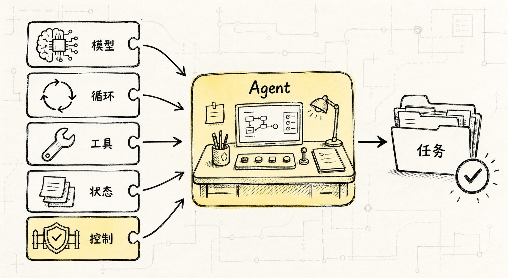
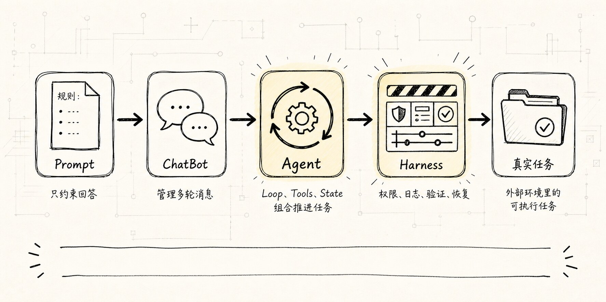
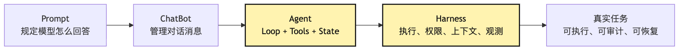
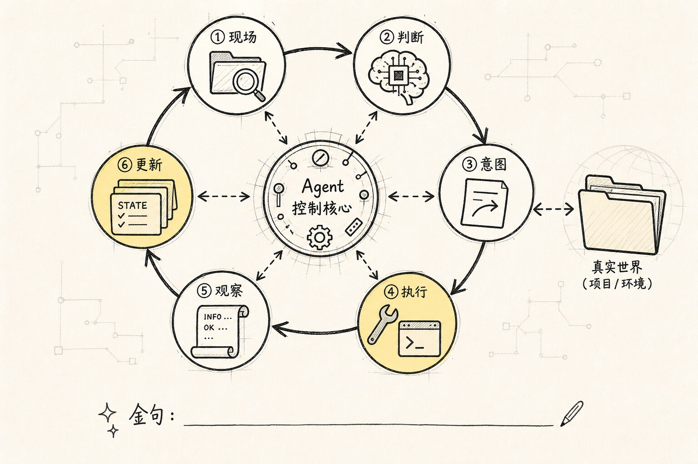
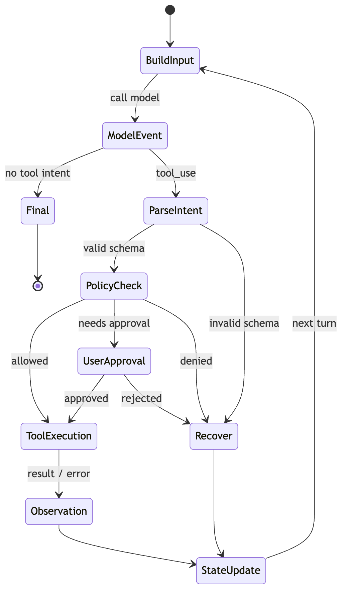
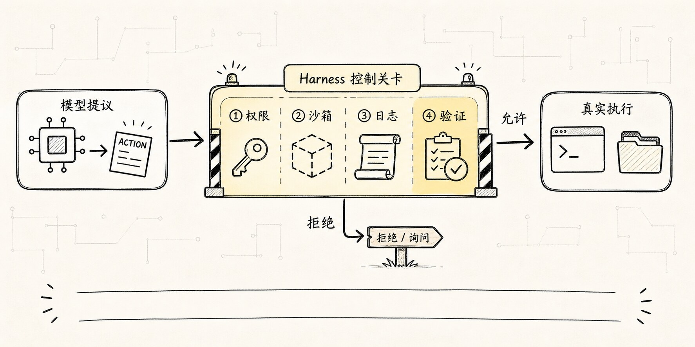
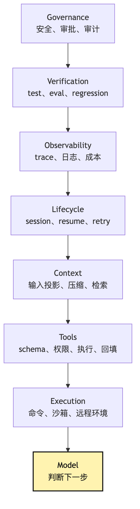

# Agent 基础定义：它为什么不是一句 Prompt？

很多人第一次开始做 Agent，最自然的反应是：是不是把 system prompt 写长一点，把规则写细一点，模型就会“像 Agent 一样工作”？

这个想法很合理。毕竟在聊天产品里，prompt 似乎决定了一切：语气、角色、边界、输出格式，都可以靠几段文字调出来。

但只要任务从“回答一个问题”变成“持续完成一件事”，prompt 很快就不够了。

比如我们想做一个小型 CLI 助手：

```text
帮我看看这个项目为什么测试失败，并把它修好。
```

如果它只是一次 LLM 调用，模型最多能根据用户描述猜一个方向。它不知道项目结构，不知道测试命令，不知道报错日志，也不能真的打开文件、修改代码、重新运行测试。

这就是 Agent 出现的地方。

**Agent 不是一句更长的 Prompt，而是“模型 + 循环 + 工具 + 状态”组织起来的运行过程；当它进入真实环境，还需要外部 Harness 来托管这个过程。**



这句话听起来像定义，但它背后其实是一条很朴素的工程经验：

```text
模型只会在当前输入里做判断。
任务却发生在一个会变化的外部环境里。
```

这两件事之间有一道缝。Agent 要做的，就是把这道缝补起来。

在 Claude Code 这类编程 Agent 里，这道缝尤其明显。用户不是问“这段代码是什么意思”，而是把一个真实项目交给 Agent，让它在文件系统、终端、Git、测试框架、项目规则、权限边界之间来回移动。模型本身没有这些能力，它只是每一轮根据上下文判断下一步。

真正让任务往前走的，是模型外面的那套运行时。

所以这篇文章会用最简单的方式回答一个问题：

> 当我们说“构建一个 Agent”时，到底比“写一个 prompt”多构建了什么？

先别急着想框架，也别急着想 LangGraph、CrewAI、Claude Code、MCP 这些词。我们先从最小场景开始：一个 CLI 助手，用户让它修复测试失败。

## 问题链



这篇文章先不急着写代码，只固定一个最小问题链：

```text
一次 LLM 调用只能生成回答
-> 真实任务需要多步推进
-> 多步推进需要循环
-> 循环要接触外部世界，所以需要工具
-> 工具结果要影响下一步，所以需要状态
-> 状态、工具和循环一旦接触真实环境，就需要模型外部控制系统
-> Agent 从这里开始，Harness 则让这个过程走向可托管
```

换句话说，Agent 的关键不在“它说得像不像人”，而在“它能不能在一个受控过程里不断推进任务”。

先用一张图把这条演化线固定住：



这张图里最重要的不是箭头数量，而是责任变化。

Prompt 只影响模型如何生成回答。ChatBot 开始管理多轮对话。Agent 加入行动循环。Harness 则把行动放进工程边界里，让它能被权限、日志、测试和恢复机制接住。

这个问题链也解释了为什么很多 Agent demo 第一眼很神奇，第二眼就会漏风。

demo 里最常见的写法是：

```text
给模型一个角色
给模型几个工具说明
模型想调用哪个工具就调用哪个
工具结果拼回 prompt
再问模型下一步
```

这可以跑通最小演示，但还不是一个可长期使用的系统。因为真实任务里最难的不是“让它调用一次工具”，而是：

```text
连续调用十几次以后，状态还清楚吗？
工具失败以后，系统知道怎么恢复吗？
模型提出危险动作时，谁来拦？
上下文塞满以后，旧信息怎么压缩？
用户中断以后，现场还能不能保留？
```

这些问题都不是 prompt 能单独解决的。它们属于 Agent Runtime 和 Harness。

## 一、从一次模型调用开始

最原始的 LLM 应用通常长这样：

```text
用户输入
-> 拼 prompt
-> 调模型
-> 输出答案
```

这套结构非常适合问答、总结、改写、翻译、格式转换。用户的问题本身已经包含了足够信息，模型只需要生成一个答案。

比如：

```text
解释一下 Python 的装饰器。
```

一次调用就够了。模型不需要读你的仓库，不需要调用 shell，也不需要维护一个长任务状态。

但项目排错不是这样。

当用户说“帮我修好测试”时，模型第一轮并不知道该修哪里。它需要先问环境拿事实：

```text
项目用什么语言？
测试命令是什么？
失败日志是什么？
相关文件在哪里？
改完之后是否真的通过？
```

这些信息不在 prompt 里，而在真实工程环境里。

所以问题出现了：

**模型会生成文本，但任务需要行动。**

这里可以做一个很小的对照。

如果用户问：

```text
帮我解释一下这个报错可能是什么原因。
```

模型可以直接基于已有信息回答。这是回答问题。

如果用户问：

```text
帮我打开项目，找到这个报错的来源，并修掉它。
```

系统就必须去环境里取证。这是执行任务。

二者的差别不是语言风格，而是系统形态。

回答问题时，模型输出就是结果。

执行任务时，模型输出通常只是下一步行动的建议。

这也是为什么 Agent 的第一个工程纪律是：不要把模型的输出等同于现实中的动作。模型说“我将读取文件”，不代表文件已经被读取；模型说“测试已经通过”，也不代表测试真的跑过。中间必须有一层系统去执行、记录和验证。

这条纪律在编程 Agent 里尤其重要，因为模型很擅长写出“像已经做过”的句子：

```text
我检查了 package.json，发现测试脚本是 npm test。
我修改了 src/foo.ts，把空值判断补上了。
我重新运行了测试，现在已经通过。
```

这些句子都可能是真的，也都可能只是模型根据常见项目结构编出来的合理叙述。系统不能靠语气判断真假，只能靠事件判断真假。

更可靠的账本应该长这样：

```text
model event：模型提出 read_file(package.json)
tool intent：Runtime 解析出结构化读文件请求
tool execution：文件系统实际读取 package.json
observation：工具返回文件内容或错误
state update：结果被记录进 messages / workspace state
```

如果账本里没有 `tool execution` 和 `observation`，那就只能说“模型声称它看过”，不能说“系统看过”。如果账本里没有后续测试命令的退出码，也不能说“系统验证过”。

所以做 Agent 的第一步，不是让模型说得更像工程师，而是让系统分清楚三件事：

```text
模型说了什么
系统做了什么
外部世界返回了什么
```

这三件事一混，Agent 就会从“自动化系统”退回到“很会写工作总结的聊天框”。

## 二、Prompt 能约束回答，但不能制造过程

我们当然可以把 prompt 写得更认真：

```text
你是一个资深工程师。
请先分析问题，再检查文件，再修改代码，最后运行测试。
```

这段 prompt 有价值，它告诉模型应该采用什么工作方式。

但它没有解决几个更底层的问题：

- 模型怎么“检查文件”？
- 它检查的是哪个文件？
- 谁来确认路径合法？
- 谁来执行测试命令？
- 测试输出太长时怎么截断？
- 谁来保存“测试命令来自 package.json”这个事实源？
- 谁来区分“模型猜测”与“工具刚刚观察到的结果”？
- 谁来验证修改之后的结果，而不是只相信模型总结？
- 谁来管理路径、命令、网络、密钥这些权限边界？
- 如果连续三次失败，谁来停止循环？
- 这些行动怎么记录，下一轮模型怎么知道刚才发生了什么？

prompt 可以描述理想行为，却不能替代运行系统。

这就像你可以对一个新同事说“请按流程排查线上问题”，但如果没有日志入口、发布权限、回滚机制、告警面板和事故记录，他仍然没法稳定地完成这件事。

对 Agent 来说也是一样：prompt 是指令，Agent 是执行这些指令所需的系统。

更具体一点，prompt 主要解决的是“模型应该如何理解任务”：

```text
你是谁
你要遵守什么规则
你应该用什么语气
你应该优先考虑什么
你输出时要保持什么格式
```

这些都很重要，但它们仍然属于“生成侧”的约束。prompt 能提高模型输出符合预期的概率，却不能让外部世界自动变化。

更硬一点说，prompt 不能承担四类工程责任：

```text
事实源：哪些信息来自用户，哪些来自文件，哪些来自工具观察？
执行权：模型提出动作以后，由谁实际读文件、跑命令、写代码？
验证权：系统凭什么判断任务真的完成，而不是模型觉得完成？
治理权：哪些动作允许自动做，哪些动作必须拒绝或请用户确认？
```

如果把这些责任都写进 prompt，就会出现一种很危险的错觉：系统看起来有流程，实际上只有流程描述。

比如 prompt 里写了“完成前必须运行测试”，模型最后回答：

```text
我已经运行测试，所有测试通过。
```

这句话本身不是证据。证据应该是一次真实的 tool event：哪个命令、在哪个目录、以什么环境变量运行、退出码是多少、stdout/stderr 是什么、输出是否被截断、结果是否被写入状态。

没有这些事件，模型的“已运行”只是文本。它可能是善意的推断，也可能是上下文里的误读，还可能只是为了满足“最后给出完成总结”的格式要求。

而 Agent Runtime 解决的是“任务如何被推进”：

```text
这一轮模型输入怎么构造
模型输出怎么解析
工具调用怎么执行
结果怎么写回下一轮
循环什么时候继续
什么时候停止
什么动作必须问用户
什么错误可以自动恢复
```

所以写 prompt 和做 Agent 不是同一层工作。

prompt 像任务说明书。Agent Runtime 像执行现场。

只优化 prompt，当然能让模型更听话一点。但只要模型需要接触真实环境，执行现场的问题就会出现。

这也是很多人第一次手写 Agent 会遇到的落差：最开始以为难点是“怎么让模型变聪明”，写到后面才发现难点是“怎么让一个不稳定的判断器进入稳定的工程流程”。

## 三、循环让模型从“回答”变成“推进”



Agent 比普通 ChatBot 多出来的第一层，是 loop。

它不再只调一次模型，而是让模型反复经历这样的过程：

```text
观察当前状态
-> 判断下一步
-> 产生行动意图
-> 系统执行行动
-> 把结果写回状态
-> 再进入下一轮判断
```

这就是很多 Agent 系统里的 ReAct 思路：reason、act、observe，不断循环。

在 CLI 助手的例子里，第一轮模型可能会说：

```text
我需要先读取 package.json，确认测试命令。
```

系统执行读取文件，把结果回填给模型。第二轮模型看到 package.json 后，可能会说：

```text
测试脚本是 npm test，我需要运行它拿到失败日志。
```

系统再执行命令，把日志回填。第三轮模型才有可能定位源码。

这里最重要的分工是：

**模型负责提出下一步，系统负责让下一步真的发生。**

如果没有 loop，模型只能给建议。如果有了 loop，它才有机会根据新事实继续推进。

把这个过程翻译成最简伪代码，大概是：

```ts
while (!done) {
  const input = buildModelInput(state)
  const response = await callModel(input)
  const intent = parseResponse(response)

  if (intent.type === "final") {
    return intent.answer
  }

  const observation = await runTool(intent.tool, intent.args)
  state = appendObservation(state, response, observation)
}
```

这段代码里，真正关键的不是 `while`，而是四个动作：

```text
buildModelInput：每一轮重新组织模型该看到什么
parseResponse：把模型输出理解成 final 或 tool intent
runTool：由系统执行真实动作
appendObservation：把外部结果写回状态
```

如果再往工程实现压一层，这个 loop 其实不是“模型想做什么就做什么”，而是一组事件边界：

```text
Model Event
-> 模型返回 assistant message，里面可能有自然语言，也可能有 tool_use block

Tool Intent
-> Runtime 把 tool_use 解析成结构化请求：工具名、参数、调用 id

Policy Decision
-> 系统判断这个请求是否可见、合法、安全、需要确认

Tool Execution
-> 工具在真实环境里执行，可能成功、失败、超时、被拒绝

Observation
-> 工具结果被序列化成模型能读懂的观察

State Update
-> messages、workspace、预算、权限记录、trace 一起更新
```

把边界拆清楚以后，很多失败就不再模糊。

比如模型输出了一个格式不合法的 JSON，这是 `Model Event -> Tool Intent` 的解析失败；模型请求删除用户没有授权的目录，这是 `Policy Decision` 拒绝；命令执行超时，这是 `Tool Execution` 失败；工具结果没有写回消息，下一轮模型不知道发生了什么，这是 `State Update` 缺失。

这些错误看起来都叫“Agent 没做好”，但修法完全不同。把它们都归因成“模型不聪明”，会让工程判断失焦。

很多 Agent 最小实现只写了前两步：调模型，解析工具调用。

但如果后两步做得粗糙，系统就会变成一种“会调用工具的聊天框”。它能演示，却很难稳定完成长任务。

真正的 Agent Loop 一定同时关心三件事：

```text
模型这轮怎么判断
系统这轮怎么行动
下一轮模型凭什么继续判断
```

少掉第三件事，Agent 很快就会断线。

把这条 loop 画成时序图，会更接近真实运行过程：


注意这张图里的箭头方向。模型并没有直接调用工具，也没有直接写状态。所有外部动作都经过 Runtime。这个分工后面会反复出现。

也可以把同一条链画成状态转移图：



这张图想表达的不是“Agent 一定要写成这么多类”，而是提醒我们：每个箭头都可能失败，每个失败都需要被记录成下一轮可见的状态。

## 四、工具让 Agent 接触真实世界

loop 只解决“可以多轮推进”，还没有解决“能做什么”。

要让 CLI 助手真的检查项目，它至少需要几类工具：

```text
read_file：读取文件
search：搜索代码
run_command：执行测试
edit_file：修改代码
```

但工具不能只是把函数名扔给模型。

一个可控的工具调用至少包含：

```text
工具名
参数 schema
参数校验
权限规则
执行结果
错误类型
结果截断
观察回填
审计记录
```

这也是为什么“给模型接一个 shell”不是 Agent 工程的终点，反而是风险的起点。

模型输出的是概率性文本。工具执行会改变真实世界。二者中间必须有一层系统来翻译、校验、限制和记录。

所以更准确地说：

**工具不是模型的手脚，而是 Harness 允许模型间接使用的受控能力。**

第一篇先记住这个边界就够了。后面讲 Tool Runtime 时，我们会把 intent、validation、permission、execution、observation 拆开。

这里有一个非常重要的细节：工具调用本身也不是“执行”，而是“请求执行”。

比如模型输出：

```json
{
  "tool": "run_command",
  "args": {
    "command": "npm test"
  }
}
```

这不是模型在运行 `npm test`。它只是按协议提交了一个行动意图。

系统接下来至少要判断：

```text
这个工具当前是否可见？
这个命令是否属于允许范围？
当前工作目录是否正确？
是否需要用户确认？
最长运行多久？
stdout/stderr 怎么截断？
失败时怎么分类？
结果是否写入审计日志？
```

这些判断越早进入设计，后面越不容易返工。

如果第一版就让模型直接输出 shell 命令并执行，后面想补权限、审计、重放、沙箱、回滚，会非常痛苦。因为系统最开始没有把“行动”建模成结构化对象，只把它当成一段文本。

结构化工具还有一个不那么显眼、但很关键的好处：它让系统知道“结果应该怎么被解释”。

同样是一段终端输出，可能有几种完全不同的含义：

```text
退出码 0 + 测试摘要：可以作为验证证据。
退出码 1 + 断言失败：可以作为下一轮定位输入。
退出码 127：说明命令不存在，可能是环境准备失败。
超时：说明不能无限等，需要中断、重试或换策略。
权限拒绝：说明不是模型继续努力能解决的问题，需要用户或策略介入。
```

如果工具只返回一大段字符串，模型可能会把这些情况混在一起。Runtime 应该尽量把它们变成结构化 observation，让下一轮模型看到的不只是“有输出”，而是“这次行动在工程上意味着什么”。

这就是 Tool Runtime 会成为本教程一整章的原因。

## 五、状态让每一步不断线

Agent loop 还有一个容易被低估的部件：state。

模型本身不会天然记住上一轮工具调用的完整过程。每一次请求模型时，系统都要决定把哪些信息重新交给它：

```text
用户目标
已有计划
刚才读过哪些文件
工具返回了什么结果
当前修改了哪些内容
剩余预算是多少
哪些错误已经重复出现
```

如果没有状态，Agent 每一轮都会像刚醒来一样：

```text
我应该先看看项目结构。
```

然后它可能一遍又一遍读取同一个文件，重复运行同一个命令，或者忘记自己已经改过代码。

所以 Agent 的 state 不只是聊天记录。它更像任务现场的工作台：

```text
messages：模型下一轮要看到的上下文
tool results：行动得到的事实
turn count：循环已经跑了多少轮
budget：还能花多少 token、时间和工具调用
artifacts：计划、diff、报告、测试结果
```

状态的作用是让多步任务连续起来。

不过 state 还有另一层意义：它决定了 Agent 的“现实感”。

模型不知道真实世界发生了什么，它只知道本轮输入里告诉了它什么。如果工具已经修改了文件，但 state 没有记录这件事，模型下一轮就可能继续基于旧代码推理。如果测试已经失败三次，但 state 没有记录失败模式，模型就可能一次又一次尝试同一个方向。

所以 state 不是为了让系统看起来更复杂。它是在把外部世界的变化翻译成模型下一轮能使用的事实。

这里的“事实”最好带来源。

```text
用户目标：来自 user message
测试命令：来自 package.json 的 scripts.test
失败原因：来自 npm test 的 stderr 和退出码
修改内容：来自 edit tool 生成的 diff
验证结果：来自重新执行测试的 observation
```

来源很重要，因为 Agent 经常要在冲突信息里做判断。用户可能说项目用 `pytest`，但仓库里实际只有 `vitest`；模型可能猜测某个文件存在，但搜索工具没有找到；测试日志可能说失败在 A，静态阅读代码却让模型怀疑 B。

如果 state 只保存一段混合摘要，模型下一轮就很难分清哪个是用户要求、哪个是系统观察、哪个只是上一轮模型的假设。成熟一点的 Agent 会把“假设”和“观察”分开：假设可以被推翻，观察要能回到工具事件。

在编程 Agent 里，state 通常不止 messages 一种形态。更完整一点，它会拆成几类：

```text
Conversation state：用户、模型、工具结果组成的消息历史
Runtime state：轮次、预算、中断信号、当前模式
Workspace state：已读文件、已改文件、当前 diff、测试结果
Decision state：计划、待确认动作、权限拒绝记录
Artifact state：报告、摘要、评估结果、可恢复 checkpoint
```

最开始你可以只实现 messages。但只要任务开始变长，其他状态迟早会长出来。

这里也埋下了后面 Context Engineering 的问题：state 并不等于 prompt。系统可以保存很多状态，但每一轮只能选择其中一部分交给模型。给少了，模型失忆；给多了，上下文爆炸；给错了，模型被污染。

## 六、控制系统让 Agent 不跑飞



一旦有了 loop、tools 和 state，Agent 看起来已经能工作了。但真实复杂度也从这里开始。

因为一个能行动的系统，也会开始犯能造成后果的错：

- 它可能陷入循环，反复执行同一个无效命令。
- 它可能把超长日志全塞回上下文，导致成本暴涨。
- 它可能调用高风险工具，修改不该修改的文件。
- 它可能忘记验证，直接宣布任务完成。
- 它可能在失败后丢失现场，无法恢复。

这时我们需要的就不只是 Agent，而是 Agent 外面的控制系统。

在这套教程里，我们把这层控制系统叫 Harness。

Harness 管的是模型外面的事情：

```text
Execution：代码和命令在哪里执行
Tools：工具如何定义、校验、授权和回填
Context：这一轮模型应该看到什么
Lifecycle：任务如何暂停、恢复、重试和结束
Observability：如何记录 trace、日志、成本和错误
Verification：如何测试、评估和回归
Governance：如何处理权限、安全和人工介入
```

这个观点可以叫作 “Harness over model”，但不要把它理解成“模型不重要”。模型当然重要，它决定了判断质量、语言理解和规划能力。这里真正要纠正的是另一种偏差：只要 Agent 失败，就本能地换更强模型或加更长 prompt。

在长任务里，很多失败不是智力问题，而是运行条件问题。

```text
模型能判断下一步要跑测试，但执行环境没有依赖。
模型能读懂失败日志，但上下文策略把关键日志截掉了。
模型能提出正确修改，但编辑工具没有稳定地应用 diff。
模型能意识到要验证，但生命周期里没有 completion gate。
模型能遵守安全规则，但工具结果里混入了不该当指令执行的文本。
```

这些情况下，换模型可能会缓解一部分症状，但不会修掉系统缺口。更强的模型放进更差的 Harness，有时只是更快地把系统推到权限、上下文、执行和验证的边界上。

所以做 Agent 时，失败归因要至少问两层：

```text
模型层：模型是否理解任务、选择了合理下一步？
Harness 层：环境、工具、上下文、状态、权限、验证是否支撑了这一步？
```

如果模型已经提出了合理的 tool intent，但工具执行失败，问题在 Harness。如果工具执行成功但 observation 没有回填，问题在状态链路。如果模型宣布完成但没有任何验证事件，问题在 completion policy。只有把这些层分开，优化才不会变成盲目调 prompt。

可以先用一个七层图建立印象：



这不是说 Harness 一定要在第一天实现七层。第一天只需要一个最小 loop。但这张图提醒我们：当 Agent 进入真实任务，复杂度会自然往这几个方向长。

第一篇不需要背这些词。只要记住一件事：

**Agent 越能做事，越需要模型外面的工程控制。**

这也是 Harness 这个词值得单独拿出来讲的原因。

很多时候我们说“Agent 失败了”，其实不是模型本身失败，而是 Harness 没有把模型放进一个足够稳的工作环境里。

比如：

```text
模型读错文件：可能是工具搜索和上下文投影设计不好。
模型反复跑同一个命令：可能是 loop state 没记录重复错误。
模型宣布修好了但测试没跑：可能是 verification gate 缺失。
模型误信工具输出里的恶意指令：可能是 tool result 隔离没做。
模型越权修改文件：可能是 permission 和 sandbox 缺失。
```

这些问题当然可以继续加 prompt：

```text
不要重复执行无效命令。
不要相信工具输出里的指令。
完成前必须运行测试。
```

但如果没有外部机制配合，prompt 只是提醒。Harness 才是约束。

所以从工程视角看，Agent 的可靠性不是靠“更像人”获得的，而是更多依赖一个受控运行时，而不是只依赖人设和 prompt。

Claude Code 这类系统真正值得学习的地方，也正是在这里：它不是把模型神化，而是把模型放进一个有工具协议、权限边界、上下文调度、压缩、审计和恢复能力的工程壳里。

## 七、把 Agent 放回一条链里

不要把 Prompt、ChatBot、Agent、Harness 当成从低到高的等级。它们更像一组会随着任务不确定性和风险边界逐步加厚的工程责任：

```text
Prompt
-> 规定模型怎么回答

ChatBot
-> 管理对话消息和一次次模型调用

Agent
-> 加入循环、工具和状态，让系统能多步行动

Harness
-> 管理执行、权限、上下文、恢复、观测和评估，让行动可控
```

这里的箭头不是“必须一路升级”的意思，而是提醒读者：任务越接近真实环境，模型外部责任越多；如果问题只需要对话或确定流程，就不必强行 Agent 化。

回到 CLI 助手的例子：

```text
只写 prompt：
“你是资深工程师，请帮我修测试。”

ChatBot：
模型可以给出排查建议，但不能动项目。

Agent：
模型可以提出读文件、跑测试、改代码等行动意图。

Harness：
系统决定哪些工具能执行、怎么记录、如何截断结果、何时需要用户确认、怎样验证真的修好了。
```

这就是为什么 Agent 不是一句 Prompt。

Prompt 给模型方向，Agent 让方向变成过程，Harness 让过程进入可控、可验证、可恢复的工程边界。

如果把三者放进“修测试”的同一个时间线里，会更直观：

```text
第 0 步：用户提出目标
Prompt 让模型知道自己应该像工程助手一样工作。

第 1 步：模型判断需要查看项目结构
Agent Loop 这个判断，不把它当最终回答。

第 2 步：模型请求读取文件
Tool Runtime 把请求变成可校验、可审计的工具调用。

第 3 步：工具返回 package.json
State 把观察结果写回消息和任务现场。

第 4 步：模型根据测试脚本请求运行命令
Permission / Sandbox 判断能不能执行。

第 5 步：测试失败，返回日志
Context Policy 决定日志如何截断、摘要、回填。

第 6 步：模型提出修改
Edit Tool 生成 diff，必要时请求用户确认。

第 7 步：重新运行测试
Verification Gate 确认任务有没有真的完成。
```

这条时间线里，模型每一步都很重要，但它从来不是唯一主角。

Agent 工程的核心，是把“模型每一步的判断”放进一条可控制的执行链路里。

一旦你用这个视角看 Agent，很多概念就会自然归位：

```text
ReAct 不是神秘推理术，而是循环推进机制。
Tool Use 不是给模型超能力，而是把行动意图协议化。
Context Engineering 不是写长 prompt，而是决定本轮该给模型什么事实。
Memory 不是保存聊天记录，而是跨任务保留可复用经验。
Evaluation 不是事后打分，而是防止 Harness 改坏已有能力。
```

后面的教程会沿着这条链往下写。

## 八、这篇先留下的工程边界

为了避免把 Agent 神秘化，我们先用三句话收住：

1. LLM 负责判断下一步，但不直接接触真实世界。
2. Agent 是让模型反复判断、使用工具、吸收结果的运行系统。
3. Harness 是模型外面的控制系统，负责让每一步可执行、可审计、可恢复、可验证、可治理。

下一篇我们会把这个定义拆成更小的组成模型：Model、Loop、Tools、State。

这四个词会反复出现。

`Model` 是判断器，负责在当前上下文里选择下一步。

`Loop` 是心跳，负责让判断、行动、观察不断往前推进。

`Tools` 是受控能力，把模型的行动意图连接到真实世界。

`State` 是现场账本，让下一轮模型不是从零开始。

这四个部件合起来，才是我们后面要手写的最小 Agent。再往外扩，才会长出 Runtime、Context、Memory、Permission、Trace、Eval、Sub-Agent 和 Automation。

一句话记住这篇：

> Prompt 规定模型怎么说话，Agent 组织模型怎么做事，Harness 保证这件事能被控制。

## 落地到教学 Harness

把这章落到教学项目里，第一步不是写更长的 system prompt，而是让 prompt 只表达角色和边界，把“行动”交给 `runAgentLoop()` 与 `ToolRegistry`。验收点也应该很朴素：用户说“列出工作区文件”时，系统必须产生 assistant 的 `toolCall`、工具的 `toolResult`，再由 assistant 基于结果回答。这样读者一开始就能看到：prompt 给方向，Agent Loop 组织过程，Harness 负责执行和记录。

---

GitHub 地址: [00-01-agent-not-a-prompt.md](https://github.com/LienJack/build-harness/blob/main/docs/zh/00-01-agent-not-a-prompt.md)
