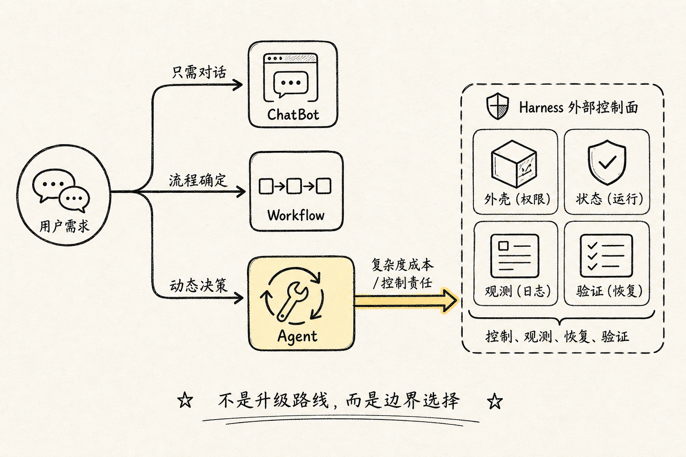
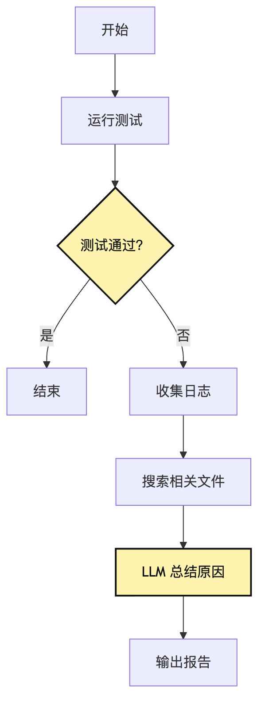
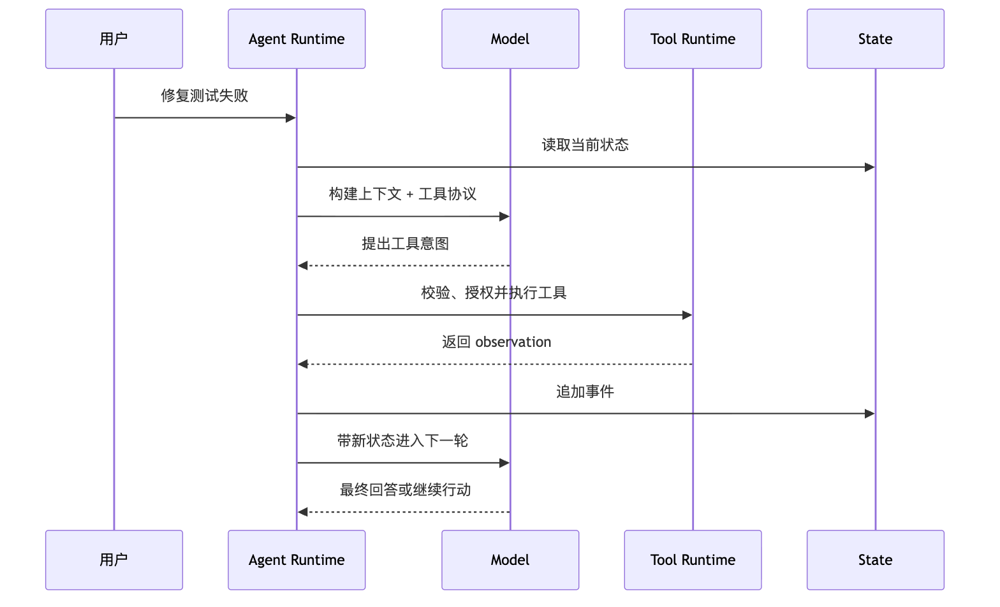
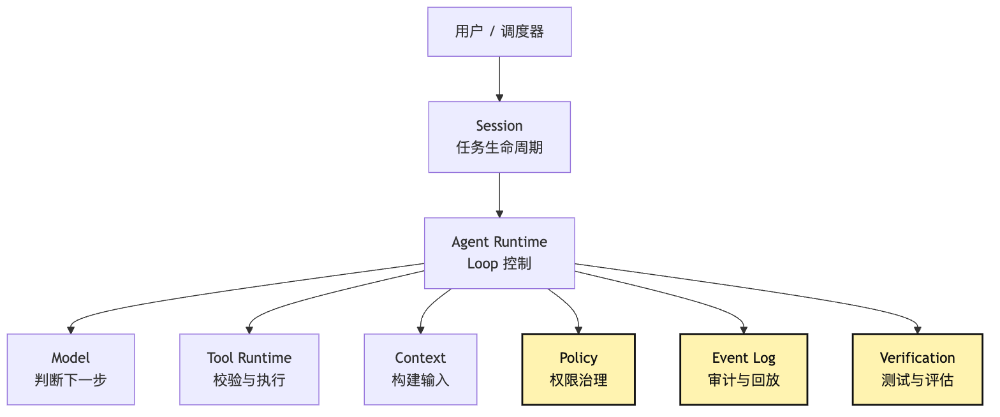
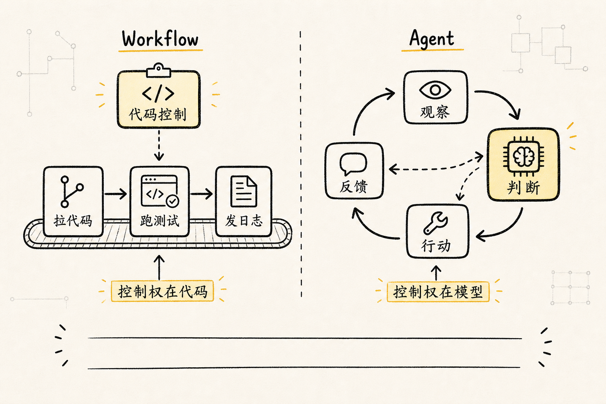
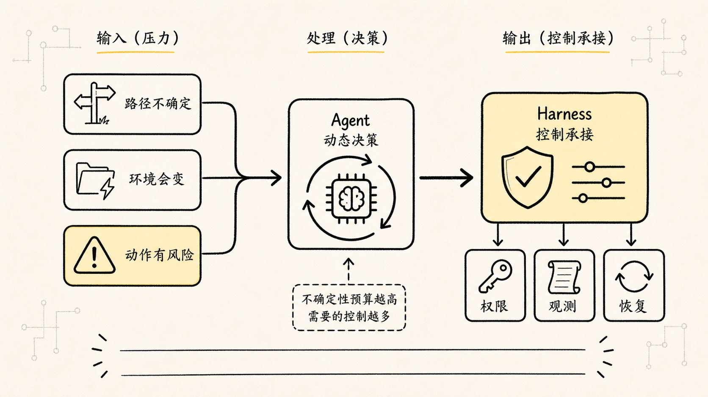

# 系统边界：ChatBot、Workflow、Agent、Harness 的区别

很多人第一次做 Agent 系统时，会自然地把它理解成一条升级路线：

```text
ChatBot 太简单
-> Workflow 更工程化
-> Agent 更智能
-> Harness 更高级
```

这条线很顺，但它会把工程判断带偏。

因为 `Agent` 不是更高级的默认选项。

在真实项目里，很多问题用 ChatBot 就够了；很多自动化用 Workflow 反而更稳；只有当任务路径没法提前写死，需要系统在运行中根据新证据判断下一步时，Agent 才值得引入。至于 Harness，它也不是“再包一层酷炫架构”，而是 Agent 进入真实环境以后，为了稳定托管、权限控制、状态管理、日志追踪、恢复、验证和治理，被迫长出来的模型外部控制系统。

我们继续沿用前两篇的例子：

```text
帮我看看这个项目为什么测试失败，并把它修好。
```

这句话看起来像一个 Agent 任务，但它可以被拆成四种完全不同的系统形态。

如果用户只是问：

```text
Jest 报 Cannot find module 通常是什么原因？
```

这可能只是 ChatBot 问答。

如果团队已经确定排查步骤：

```text
拉代码 -> 安装依赖 -> 运行测试 -> 收集日志 -> 发到 Slack
```

这更像 Workflow。

如果系统不知道失败原因在哪，需要自己决定先读哪个文件、跑哪个命令、改哪里、再如何验证，这才进入 Agent 的范围。

如果这个 Agent 要给团队每天自动跑，要能恢复中断、限制权限、记录审计、统计成功率、回放失败会话，那它就开始需要 Harness。

所以这一篇要回答的不是“哪个概念更高级”，而是：

> 什么时候该用 ChatBot，什么时候该用 Workflow，什么时候才需要 Agent，什么时候必须建设 Harness？

先给出一句总纲：

**ChatBot 解决对话问题，Workflow 解决确定流程问题，Agent 解决动态决策问题，Harness 解决稳定托管问题。**

这四者不是同一条直线上的豪华版，而是面对不同不确定性和不同风险边界的工程选择。具体产品里它们也可以组合出现：一个系统可以同时有 ChatBot 入口、Workflow 管线、Agent loop，以及逐步变厚的 Harness。

## 问题链



这篇文章的问题链是：

```text
用户只是需要理解和表达
-> 用 ChatBot 管理对话就够了
-> 任务步骤已经确定，只需要自动执行
-> 用 Workflow 更可靠、更便宜、更好测试
-> 任务路径不确定，需要运行中判断下一步
-> 才引入 Agent，让模型参与动态决策
-> Agent 一旦接触真实环境，就会产生工具、权限、状态、副作用和验证问题
-> 模型提出的动作不能直接等于系统执行
-> 需要 Harness 承接模型外部的工程控制
```

这里最重要的判断是：

```text
Agent 不是更高级的默认选项。
Agent 是为了不确定任务付出的复杂度成本。
```

如果没有不确定性，Agent 往往是在给系统引入不必要的波动。如果只有对话需求，却做成 Agent，系统会变得难测、难控、难解释。如果流程完全确定，却让 Agent 每一步重新判断，等于把原本可以写死的可靠性，换成了模型输出的不稳定性。

先用一张图固定这四个边界：


这张图里最重要的不是四个名词，而是中间那个判断问题：`不确定性在哪？`

如果不确定性只在“用户想怎么问、模型怎么回答”，ChatBot 就够。如果不确定性已经被人提前消化成流程图，Workflow 更合适。如果不确定性必须在运行时根据新证据判断，Agent 才有价值。如果 Agent 已经不是一次性脚本，而是要稳定运行、可恢复、可审计、可验证，Harness 就不可避免。

注意，Harness 不是和 ChatBot、Workflow、Agent 完全同类的“第四种更高级形态”。更准确地说，ChatBot、Workflow、Agent 是任务处理形态；Harness 是当 Agent 的动态过程进入真实环境后，为它提供执行边界和控制面的工程系统。

## 一、ChatBot：当问题主要发生在对话里

先从 ChatBot 说起。

ChatBot 是最容易被低估的一层。很多开发者一听到 ChatBot，就觉得它只是“会聊天”，不够工程化。但如果用户的真实需求就是理解、解释、总结、改写、问答，那么 ChatBot 是最轻、最稳、最便宜的系统形态。

比如用户问：

```text
这个错误 Cannot find module 是什么意思？
```

或者：

```text
帮我解释一下 package.json 里的 scripts 字段。
```

这类任务的核心不是“执行动作”，而是“把已有信息解释清楚”。系统需要做的事情通常是：

```text
接收用户输入
-> 组织消息历史
-> 调用模型
-> 返回自然语言答案
```

如果加入一些产品能力，也只是多了会话管理、引用来源、格式化输出、用户偏好。它仍然没有进入“自主执行任务”的范围。

一个最小 ChatBot 可以写成这样：

```ts
type ChatMessage = {
  role: "system" | "user" | "assistant";
  content: string;
};

async function chat(messages: ChatMessage[]) {
  return model.generate({
    messages,
    temperature: 0.3,
  });
}
```

这段代码里没有 loop，没有 tool runtime，没有状态机，也没有权限系统。这不是缺陷，而是边界清晰。

ChatBot 的工程重点在这些地方：

- 消息历史如何裁剪
- system prompt 如何保持稳定
- 回复格式如何约束
- 多轮对话如何保留上下文
- 用户输入如何做安全过滤
- 模型失败时如何降级

如果这些已经能解决问题，就不要急着把它升级成 Agent。

因为一旦引入 Agent，系统就会多出很多原本不存在的成本：模型可能选择错误工具，工具可能执行失败，状态可能污染下一轮判断，权限需要被显式治理，结果需要被验证，每一步都要考虑重试和回放。

回到我们的 CLI 助手。

如果用户只是问：

```text
这个测试报错通常怎么排查？
```

ChatBot 可以给出排查思路。它甚至可以根据用户粘贴的日志做解释。但它不应该假装自己已经检查了项目，也不应该说“我已经修好了”。

因为它没有读文件、没有改代码、没有运行测试。

ChatBot 的诚实边界是：

```text
我可以基于你给我的信息推理。
但我没有主动观察外部环境。
```

很多“看起来像 Agent 但不可靠”的系统，就是在 ChatBot 阶段越界了。它们没有工具，没有运行状态，却用语言表现得像已经完成了行动。用户以为系统在做事，系统其实只是在生成描述。

所以 ChatBot 的第一条工程纪律是：

**不要把生成的行动描述，当成已经发生的行动。**

如果系统只能聊天，就把它做好成聊天系统。如果它要行动，就必须进入下一层边界。

## 二、Workflow：当步骤已经确定，别让模型重新发明流程

Workflow 解决的不是“模型会不会思考”，而是“人已经知道流程，系统能不能稳定执行”。

比如团队每天要做一次 CI 失败汇总：

```text
拉取最新代码
-> 安装依赖
-> 运行测试
-> 收集失败日志
-> 生成报告
-> 发到 Slack
```

这条链路不需要模型每一步都重新判断。它需要的是步骤顺序稳定、失败后能重试、超时能中断、每一步有日志、结果可追踪、同样输入得到尽量同样的输出。

这就是 Workflow 的地盘。

在我们的 CLI Agent 教程里，假设我们先不做“自动修复测试”，只做一个固定排查流程：

```text
1. 运行 npm test
2. 如果失败，保存日志
3. 搜索失败测试名
4. 打印相关文件路径
5. 让模型根据日志总结可能原因
```

这可以是一个 Workflow。模型只参与最后的总结，不参与流程决策。

伪代码大概是：

```ts
async function diagnoseTestFailureWorkflow(repo: Repo) {
  await repo.install();

  const testResult = await repo.run("npm test");

  if (testResult.ok) {
    return { status: "passed" };
  }

  const symbols = extractFailedSymbols(testResult.output);
  const files = await repo.search(symbols);

  const summary = await model.generate({
    messages: [
      system("你是测试失败分析助手。"),
      user(renderFailureContext(testResult.output, files)),
    ],
  });

  return {
    status: "failed",
    log: testResult.output,
    relatedFiles: files,
    summary,
  };
}
```

这不是 Agent。

因为下一步做什么不是模型决定的。流程作者已经把路径写进程序里了，模型只是某个节点上的能力。

这时如果强行做成 Agent，反而会出现问题。

比如让模型每一轮决定：

```text
下一步要不要运行测试？
要不要搜索文件？
要不要生成报告？
要不要通知 Slack？
```

这些决策本来就不需要动态判断。它们被写进 Workflow 更清楚、更便宜、更可测。

Workflow 的优势恰恰来自“少给模型自由度”。这句话听起来不够兴奋，但很工程：确定流程里的自由度通常不是能力，而是风险。如果一件事每次都应该这么做，那就把它写成流程，不要让模型每次临场发挥。

Workflow 的典型落地形态包括：

- CI/CD pipeline
- 定时任务
- 数据处理流水线
- 审批流程
- 告警分发
- 固定报告生成
- 多系统同步

这些系统可以调用 LLM，但不等于它们就是 Agent。一个“带 LLM 节点的 Workflow”仍然是 Workflow。

关键判断是：

```text
谁决定下一步？
```

如果下一步由流程图决定，这是 Workflow。如果下一步由模型根据当前现场动态决定，才开始接近 Agent。

用图看会更直观：



这张图里，`LLM 总结原因` 只是一个节点。它没有接管流程。真正控制系统推进的是 Workflow 本身。

这就是 Workflow 和 Agent 的第一条分界线：

```text
LLM 出现在流程里，不等于流程变成 Agent。
只有当 LLM 决定流程下一步，系统才进入 Agent 边界。
```

Workflow 如果缺失，会怎样？

很多团队会把固定自动化也交给 Agent 做。结果是：明明步骤确定，却每次路径不同；明明应该快速失败，却被模型绕来绕去；明明可以用单元测试验证，却只能靠人工观察；明明权限固定，却被包装成开放行动空间。

这类系统短期 demo 很像“智能”，长期维护像“不可控脚本”。

所以 Workflow 的第一条工程纪律是：

**只要流程可以确定，就优先把它写成流程，而不是交给 Agent 判断。**

## 三、Agent：当任务路径必须在运行中决定

现在进入 Agent。

Agent 出现的原因不是“我们想让系统更像人”，而是“有些任务没办法提前写死流程”。

还是那个任务：

```text
帮我看看这个项目为什么测试失败，并把它修好。
```

这件事的路径很难提前固定。

测试失败可能来自很多地方：依赖版本不一致、环境变量缺失、测试快照过期、类型定义错误、业务逻辑回归、mock 配置不对、构建脚本变更、文件路径大小写问题。

你可以写一个大 Workflow，把所有情况都分支覆盖。但很快会发现它膨胀成一棵难以维护的决策树。每新增一种错误，就要新增一个分支。每个分支还要知道下一步该读哪个文件、运行哪个命令、如何判断结果。

这时 Agent 的价值才出现：

```text
让模型在每一轮根据当前现场，选择下一步行动。
```

Agent 的最小运行方式是：

```text
看当前状态
-> 判断下一步
-> 提出工具意图
-> 系统受控执行
-> 结果写回状态
-> 继续判断
```

这里的关键变化是：

```text
控制权的一部分从固定流程，转移给了模型。
```

注意，只是一部分。

模型不应该直接拥有真实世界的控制权。它只是提出行动意图，也就是 tool intent / action proposal。外层 runtime 决定这个意图是否能执行、怎么执行、执行后怎么记录。

一个最小 Agent loop 可以写成这样：

```ts
async function runAgent(task: string, state: AgentState) {
  while (!state.done) {
    const modelOutput = await model.generate({
      messages: buildContext(task, state),
      tools: toolRegistry.schemas(),
    });

    if (modelOutput.type === "final") {
      state.done = true;
      return modelOutput.content;
    }

    const intent = parseToolIntent(modelOutput);
    const observation = await toolRuntime.handle(intent, state);

    state.events.push({
      type: "tool_observation",
      intent,
      observation,
    });
  }
}
```

这段伪代码比 Workflow 少了很多固定步骤。它没有写死第一步一定运行测试、第二步一定搜索文件、第三步一定读文件、第四步一定编辑。它只写死了运行边界：

```text
模型可以判断下一步
但下一步必须通过工具协议表达成 intent
intent 必须由系统受控执行
执行结果必须写回 state
循环必须能停止
```

这就是 Agent 的工程核心。

Agent 不是“模型随便做事”。

Agent 是“模型在受控 loop 里选择下一步”。

把这个过程画成时序图：



这张图里最重要的是两条边界。

第一条边界在 `Model -> Agent Runtime` 之间。模型输出的是意图，不是已经发生的动作。

第二条边界在 `Agent Runtime -> Tool Runtime` 之间。Runtime 必须校验、执行、记录工具意图，而不是把模型文本直接交给系统。

如果没有这两条边界，Agent 会退化成非常危险的东西：

```text
模型输出 shell
-> 程序直接执行
-> 失败和副作用无法治理
```

这不是 Agent 的成熟形态，而是 demo 阶段最常见的危险捷径。

Agent 带来的收益很明确：可以面对开放问题，可以根据新证据调整路径，可以把搜索、读取、修改、验证串成动态过程，可以在未知项目里逐步建立现场。

但 Agent 带来的成本也同样明确：输出不稳定、路径不固定、测试难度上升、状态管理变复杂、权限治理变必要、错误恢复更困难、评估不再只是断言一个函数返回值。

所以 Agent 的第一条工程纪律是：

**只有当任务路径必须运行时决定，才让模型参与下一步决策。**

这也是本文最想强调的点：

```text
Agent 不是默认升级。
Agent 是不确定性预算。
```

你引入 Agent，就是承认这个任务里有一部分路径无法提前写死。但你同时也必须为这部分自由度支付工程成本。如果不愿意支付这些成本，Agent 就会从“会动态处理问题”变成“每次行为都不稳定”。

## 四、Harness：当 Agent 需要被稳定托管

前面说 Agent 是动态决策。但一个能动态决策的系统，只是刚刚进入真实世界。

真实世界不会因为你有 Agent loop 就变得温柔。它会继续追问：

```text
这个工具意图有没有权限？
这一步到底在哪里执行？
这次任务中断后能不能恢复？
模型为什么选择了这一步？
改了哪些文件？
测试有没有真的跑过？
失败会话能不能回放？
不同模型输出能不能对比？
用户确认记录在哪里？
上线后成功率怎么观测？
```

这些问题都不属于模型本身，也不属于单个工具。它们属于 Agent 外部的工程控制系统。

这就是 Harness 出现的地方。

Harness 不是另一个 Agent。

Harness 也不是一个更大的 prompt。

Harness 是模型外面的控制面。它负责把 Agent 托管在一个可控环境里。

在我们的 CLI Agent 里，最开始可能只有一个 `runAgent()`。但一旦你想让它给团队使用，就会慢慢长出这些东西：

- session id
- event log
- tool registry
- permission policy
- sandbox
- context builder
- checkpoint
- retry policy
- cancellation
- telemetry
- eval runner
- audit trail

这些不是“架构洁癖”。它们是 Agent 进入真实工程环境后的生存条件。

可以先用 ETCLOVG 这七层轻轻记住 Harness 的责任范围：

```text
Execution：命令在哪里跑？有没有沙箱、超时、工作目录、资源限制？
Tools：工具如何描述、发现、调用、返回 observation？
Context：模型这一轮应该看见什么？
Lifecycle：任务如何开始、中断、恢复、结束？
Observability：每一步是否有事件日志、trace、可回放证据？
Verification：系统如何知道任务真的完成？
Governance：权限、审批、审计、安全边界由谁控制？
```

本篇不展开这七层，下一篇会专门讲。但这里要先记住一点：这些都不是模型内部能力。它们是模型外面的工程责任。

一个 Harness 可以简化成下面的分层：



这张图里，Model 只是其中一个节点。真正让系统可用的是外面那圈控制能力，尤其是 `Policy`、`Event Log`、`Verification`。

没有权限治理，Agent 可能做出高风险动作。没有事件日志，失败后无法解释和回放。没有验证机制，系统只能相信模型说“我修好了”。

这就是 Harness 和 Agent 的边界：

```text
Agent 负责在任务中动态选择下一步。
Harness 负责让这个动态过程可执行、可审计、可恢复、可验证、可治理。
```

再说得更硬一点：

```text
Agent 判断任务下一步。
Harness 判断这一步能不能落地、在哪里落地、如何记录、如何验证。
```

如果只是你本地写一个玩具 CLI，可能暂时不需要完整 Harness。但只要出现下面任意一种情况，就应该开始建设 Harness：

- 任务会运行很多轮
- 工具会产生真实副作用
- 用户需要确认高风险动作
- 会话中断后要恢复
- 结果要被测试或评估
- 多个用户共享同一系统
- Agent 要定时运行
- 团队要分析失败原因
- 需要比较不同 prompt、模型、工具策略

Harness 并不是“把 Agent 包得更重”。它的目标恰恰是把不确定性关进可治理的边界里。

Agent 带来自由度。

Harness 给自由度加护栏、仪表盘和黑匣子，但不把自由度本身变成确定性。

但这也不意味着“有了 Harness，Agent 就可靠了”。更准确的说法是：Harness 降低了把 Agent 接入真实工程流程的复杂度，但可靠性仍然依赖任务设计、工具边界、上下文策略、权限控制、失败恢复和评测体系。

如果没有 Harness，Agent 的失败通常不是“模型不够聪明”，而是没有记录关键中间状态，没有保存工具输出，没有区分只读和写入工具，没有把验证结果纳入循环，没有处理上下文过长，没有失败恢复点，没有权限审批，没有评估基线。

这些问题都不是换一个更强模型就能彻底解决的，因为它们发生在模型外面。

所以 Harness 的第一条工程纪律是：

**不要指望模型替你承担运行系统该承担的责任。**

模型负责判断。Harness 负责托管判断发生的环境。

## 五、四者对照：不是能力等级，而是控制边界



到这里，我们可以把四个概念放在一张对照表里。

但这张表不是为了背定义。它是为了做工程选型。

| 系统 / 控制形态 | 核心问题 | 谁决定下一步 | 是否接触外部环境 | 主要风险 | 适合场景 |
| --- | --- | --- | --- | --- | --- |
| ChatBot | 如何回答和解释 | 用户与模型对话 | 通常不主动接触 | 幻觉、上下文误解 | 问答、总结、解释、改写 |
| Workflow | 如何稳定执行确定流程 | 预定义流程 | 可以接触，但路径固定 | 流程分支遗漏、外部系统失败 | CI、审批、报告、同步 |
| Agent | 如何在不确定任务中推进 | 模型动态判断 | 经由工具受控接触 | 路径不稳定、权限和状态复杂 | 排障、代码修改、研究、开放任务 |
| Harness | 如何稳定托管 Agent | Agent 判断任务下一步；Harness 控制执行边界 | 受控接触 | 审计、恢复、评估、治理缺失 | 团队级 Agent、自动化、长期任务 |

这张表的核心不是“有没有 LLM”，而是“决策自由度和工程控制需求有多高”。

ChatBot 的自由度在对话里。

Workflow 的自由度被流程收束。

Agent 把一部分下一步选择交给模型。

Harness 则把 Agent 的自由度放进更大的控制系统。

所以判断系统形态时，不要问：

```text
它看起来智能吗？
```

要问：

```text
下一步是谁决定的？
外部动作谁执行？
状态谁记录？
风险谁兜底？
失败谁解释？
完成谁验证？
```

这几个问题比概念标签更可靠。

一个系统可能有 Agent，但 Harness 很弱。这类系统通常 demo 很漂亮，长期运行很痛苦。

一个系统也可能有强 Workflow 和强 Harness，但几乎没有 Agent。比如高度规范化的 CI 平台，它不需要模型决定下一步，却需要极强的调度、日志、权限和恢复。

所以四者不是等级，而是边界。

边界选错，后面所有技术选择都会变形。

### 模式不是身份，控制权才是身份

这里还要拆掉一个更隐蔽的误会：一个系统用了很多“Agentic Design Patterns”，不代表它就是 Agent。

比如 Prompt Chaining 很像 Agent。它会把一个大任务拆成多步：

```text
用户输入
-> 第一步抽取结构化信息
-> 第二步补充上下文
-> 第三步生成回答
-> 第四步检查格式
```

这里有多次模型调用，也有中间状态，看起来已经很“智能”。但如果每一步都是程序提前写好的，模型只是每个节点里的执行器，那它仍然更接近 Workflow。它的关键控制权不在模型手里，而在流程图手里。

Routing 也一样。系统可以先让模型判断用户问题属于哪一类：

```text
bug 排查 -> 进入排障流程
文档总结 -> 进入摘要流程
代码解释 -> 进入解释流程
闲聊问题 -> 进入 ChatBot
```

这当然比单一路径更灵活。但只要候选路径已经提前定义好，模型只负责分类，它仍然是 Workflow 的一种动态分支。真正进入 Agent 边界，是模型在运行过程中不断根据新观察选择下一步，而且下一步集合不是一个固定小菜单，而是要结合当前目标、工具结果、状态和预算实时决定。

Parallelization 也不是 Agent。并行调用多个模型、多个工具、多个分析器，只说明系统在执行结构上是 fan-out / fan-in。关键仍然要看：

```text
谁决定并行哪些任务？
谁决定结果如何汇聚？
谁决定失败后下一步？
谁保存状态和证据？
```

如果这些都由程序流程决定，它就是一个复杂 Workflow。如果模型根据观察结果继续改写任务、选择工具、更新计划，它才开始进入 Agent。

所以更专业的边界判断不是：

```text
有没有 LLM？
有没有多步？
有没有工具？
有没有并行？
```

而是：

```text
下一步控制权在哪里？
外部副作用由谁约束？
状态事实由谁保存？
完成证据由谁判断？
```

这也是为什么很多系统看起来像 Agent，但读代码会发现它其实是 Workflow；也有些系统看起来只是 CLI 工具，但因为模型掌握了运行时下一步选择权，它已经需要 Agent Runtime 的控制机制。

### 不确定性预算：什么时候值得让模型决定下一步



把 Workflow 和 Agent 分清以后，还可以得到一个更实用的设计原则：

**Agent 是一种不确定性预算。**

也就是说，你不是因为“Agent 更高级”才用它，而是因为任务里确实有一部分不确定性无法提前写成流程。

在“修复失败测试”这个场景里，如果失败类型总是固定的，比如只检查 `moduleNameMapper` 是否缺少路径别名，那 Workflow 足够。它可以稳定执行：

```text
运行测试
匹配 Cannot find module
读取 tsconfig
读取 test config
生成修复建议
```

但如果失败可能来自依赖版本、异步竞态、数据库状态、mock 配置、时间边界、平台差异、测试顺序污染、缓存问题、类型编译输出不一致，这时固定流程就会快速膨胀。你可以不断补分支，但分支会越来越像一张写不完的排障手册。

这就是 Agent 值得出现的地方。它不是为了替代所有流程，而是为了处理流程无法提前穷举的判断：

```text
下一步应该读哪个文件？
这段日志里哪个信号重要？
应该先验证假设，还是先改代码？
刚才的修复失败后，应该回滚还是换方向？
这次失败是模型判断错了，还是工具结果不完整？
```

但不确定性不是免费的。把下一步交给模型，就要支付几类成本：

```text
状态成本：必须记录它为什么这么做。
权限成本：必须限制它能做什么。
验证成本：不能相信它说完成了。
观测成本：失败后要知道失败在哪里。
评估成本：改 prompt、工具或模型后要知道有没有退化。
```

所以好的 Agent 设计不是“给模型更多自由”。好的 Agent 设计是只把必要的不确定性留给模型，把能确定下来的部分收回到 Workflow、Tool Runtime、Policy 和 Verification 里。

一句话说：

```text
Workflow 把不确定性提前消化成流程。
Agent 把一部分不确定性留到运行时处理。
Harness 把运行时不确定性关进可治理的边界。
```

## 六、用同一个 CLI 场景做边界判断

为了让边界更扎实，我们把同一个“修复测试失败”场景压成四种工程形态。

用户粘贴日志：

```text
FAIL src/user.test.ts
Cannot find module '@/lib/db'
```

如果系统只回答“这通常说明路径别名没有被测试运行器识别，可以检查 `tsconfig paths`、`jest moduleNameMapper` 或 `vitest alias`”，它就是 ChatBot。它的输入是用户给出的文本，输出是解释和建议，副作用为零。它很有用，但不能说“我已经修好了”。

如果系统按固定流程运行：

```text
npm test
-> 保存失败日志
-> 解析失败文件名
-> grep moduleNameMapper
-> 把日志和搜索结果交给模型总结
```

它就是 Workflow。它真的接触了项目，但下一步由流程决定。失败原因正好在流程覆盖范围内时，它非常稳；失败原因超出流程时，它会停在有限报告里。这不是缺陷，而是 Workflow 的边界。

如果系统第一轮运行测试，第二轮搜索配置，第三轮读取 `vitest.config.ts`，第四轮修改 alias，第五轮重新运行测试；如果失败又继续根据新日志调整，那它就是 Agent。这里每一步不是预先写死的，模型根据当前证据决定下一步。但也正因为如此，它必须有工具协议、权限、状态和验证，否则可能误改文件，或者把一次失败解释成成功。

这里要再压一次边界：模型提出“读取配置”“修改 alias”“重新运行测试”，这些都只是行动意图。真正读文件、改文件、跑命令的是 Tool Runtime 和 Execution 层。没有这层分离，系统很容易把模型的描述误当成已发生的事实。

如果这个 Agent 要给团队每天自动检查多个仓库，就进入 Harness 边界。系统需要为每次运行创建 session，在 sandbox 里 checkout 仓库，限制可用工具，记录模型输出和工具意图，高风险写操作前走确认或策略，每次修改后运行验证命令，保存 diff、日志、最终状态，失败时可回放，还要统计成功率和失败类型。

这就是完整演化：

```text
ChatBot：解释日志，但不执行。
Workflow：按固定流程排查，但不动态决策。
Agent：根据证据选择下一步，但每一步必须通过 runtime 约束。
Harness：托管 Agent，把动态过程变得可控、可审计、可恢复、可验证。
```

所以工程上最有用的不是定义，而是决策树：

```text
1. 用户只是需要解释、总结、改写、问答吗？
   是 -> ChatBot

2. 执行步骤能不能提前写成稳定流程？
   是 -> Workflow

3. 下一步是否必须根据运行中观察到的新事实决定？
   是 -> Agent

4. 这个 Agent 是否会长期运行、产生副作用、服务多个用户、需要恢复和审计？
   是 -> Harness
```

这个决策树故意把 Workflow 放在 Agent 前面，因为很多系统不是 Agent 不够，而是 Workflow 没写好。

比如“自动生成日报”，如果数据来源固定、格式固定、发送渠道固定，它首先是 Workflow。LLM 可以负责把数据写成自然语言，但它不应该决定今天要不要查数据库、要不要发邮件、要不要跳过某个部门。

再比如“PR 检查”，如果规则明确：

```text
跑测试
跑 lint
检查 changelog
检查安全扫描
生成摘要
```

这也是 Workflow。只有当系统需要根据 diff 内容动态决定读哪些文件、询问哪些上下文、运行哪些专项测试、如何定位复杂回归时，Agent 才有价值。

过早 Agent 化有几个典型坏味道：

```text
prompt 里写了大量固定步骤，却仍让模型每轮决定。
工具只有一个万能 shell，没有结构化协议。
模型输出 tool call 后，系统直接执行。
没有明确停止条件。
没有把工具结果写成事件流。
没有区分建议和已执行动作。
没有验证步骤，却允许模型宣布完成。
系统失败后只能看最终回答，无法回放过程。
```

这些坏味道的共同点是：

```text
系统把工程控制让渡给了模型语言。
```

而模型语言最擅长的是表达和推理，不是承担运行时责任。所以我们在设计 Agent 系统时，第一反应不应该是“怎么让它更自主”，而应该是：

```text
哪些自由度真的必要？
哪些自由度应该被流程、协议、策略收回？
```

这就是 Harness 思维的起点。

## 七、承重链路：从一句需求到可托管执行

最后把本文的核心边界压成一条承重链路。用户输入一句：

```text
帮我修复这个项目里失败的测试。
```

系统可以有四种处理方式：

```text
ChatBot:
用户输入 -> 消息历史 -> Model -> 自然语言建议

Workflow:
用户输入 -> 固定流程 -> 命令/读取/LLM节点 -> 报告

Agent:
用户输入 -> Agent Runtime -> Model 决策 -> Tool Intent -> Tool Runtime -> Observation -> State -> 下一轮

Harness:
用户输入/调度 -> Session -> Agent Runtime -> Policy/Tools/Execution/Context/Event Log/Verification -> 可恢复结果
```

这四条链路的差别，决定了系统的能力，也决定了系统的成本。只需要第一条链路，却实现了第四条，系统会过度复杂；需要第四条链路，却只实现了第一条，系统会制造幻觉；需要第三条链路，却没有第四条的部分能力，系统会能跑但不稳。

这也是本教程后面会逐步推进的原因。我们不会一上来就做完整 Harness，而是先从最小 Agent loop 开始：

```text
Model -> Loop -> Tools -> State
```

然后逐步补上 Provider Runtime、Tool Runtime、Context Engineering、Memory、Permission、Session、Observability、Verification、Multi-Agent、Hosted Harness。每补一层，都不是为了架构好看，而是因为前一层在真实任务里暴露了新的失败形态。

今天这篇的作用，就是先把边界钉住。以后当我们讨论 Tool Runtime 时，要记得：工具不是 ChatBot 的装饰，而是 Agent 接触真实世界的协议边界。当我们讨论 Context Engineering 时，要记得：上下文不是越多越好，而是 Agent 每一轮判断所需的现场投影。当我们讨论 Harness 时，要记得：Harness 不是更聪明的 Agent，而是让 Agent 可控运行的外部系统。

## 小结：先选边界，再选技术

这篇文章可以压缩成四句话：

```text
ChatBot：对话问题，用模型生成回答。
Workflow：确定流程，用程序稳定执行。
Agent：不确定任务，让模型在 loop 中动态决策。
Harness：托管 Agent，用外部系统治理执行、状态、权限、观测和验证。
```

更短一点：

```text
能聊天，不等于能执行。
能执行，不等于要动态决策。
能动态决策，不等于能稳定托管。
能稳定托管，需要 Harness 承接模型外部责任。
```

所以当你面对一个新需求时，别急着说“我们做个 Agent”。先问：这里的不确定性到底在哪里？

如果不确定性在表达，用 ChatBot。如果不确定性已经被流程消化，用 Workflow。如果不确定性必须运行时处理，用 Agent。如果这个 Agent 要进入真实使用环境，用 Harness。

下一篇我们会正式问一个更深的问题：Harness 到底是什么？它为什么不是一个框架名，也不是一个更大的 Agent？它到底负责模型外面的哪些事？我们会把 Harness 拆成 Execution、Tools、Context、Lifecycle、Observability、Verification、Governance 这些层，画出后面整套教程的控制系统地图。

---

GitHub 地址: [00-03-chatbot-workflow-agent-harness.md](https://github.com/LienJack/build-harness/blob/main/docs/zh/00-03-chatbot-workflow-agent-harness.md)
