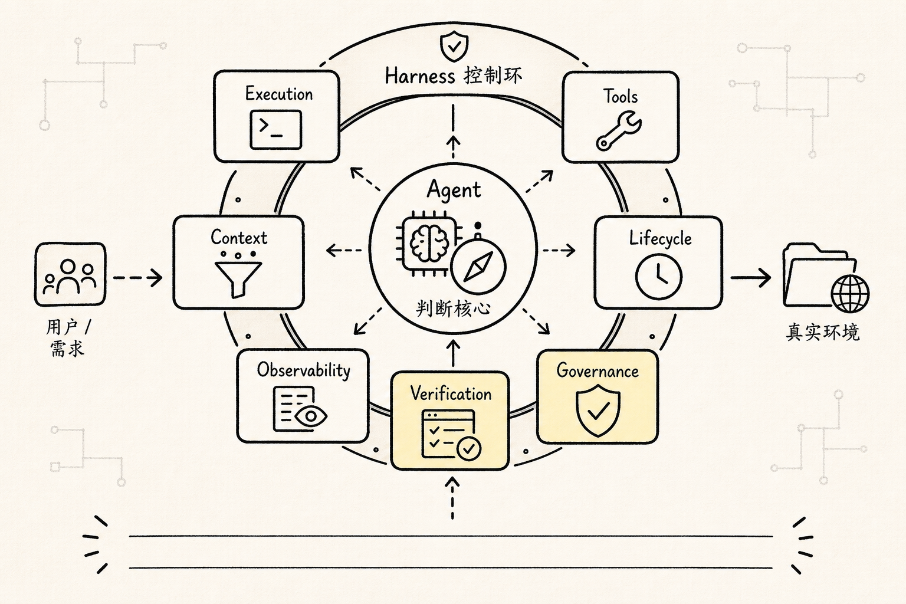
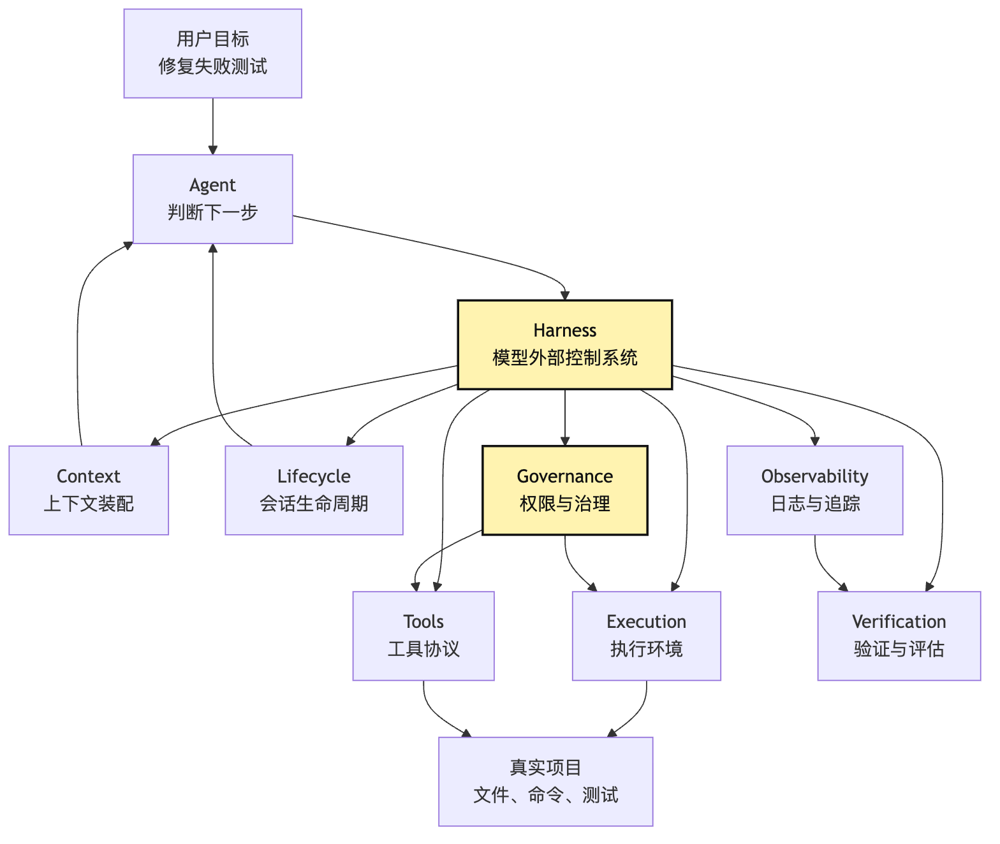
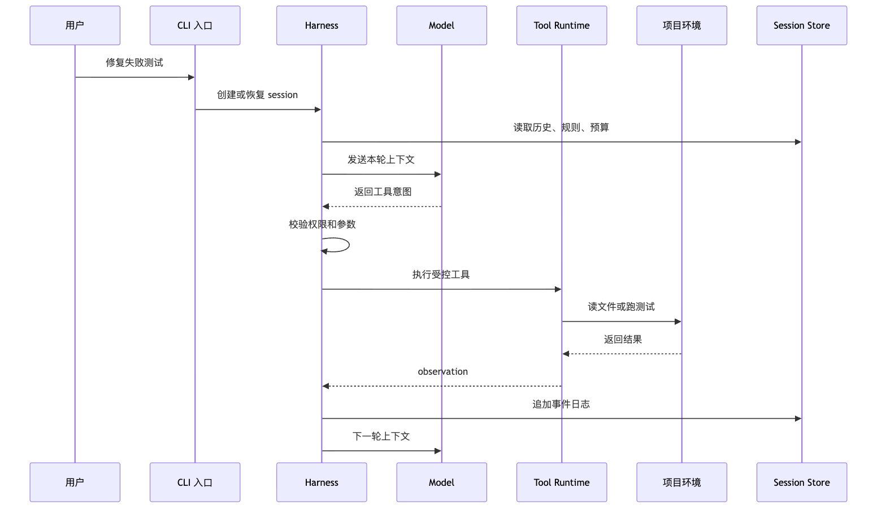
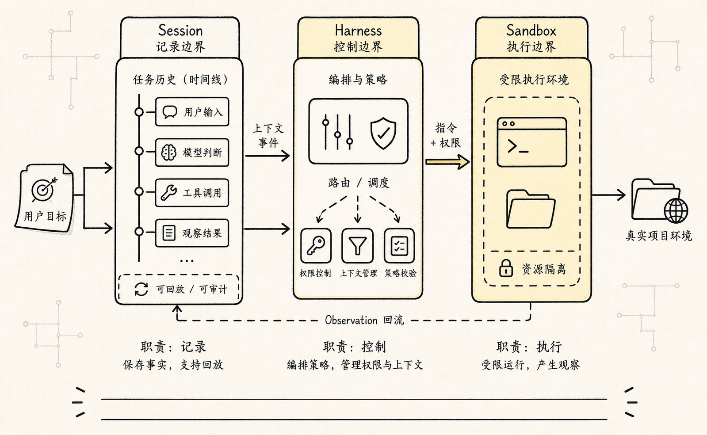
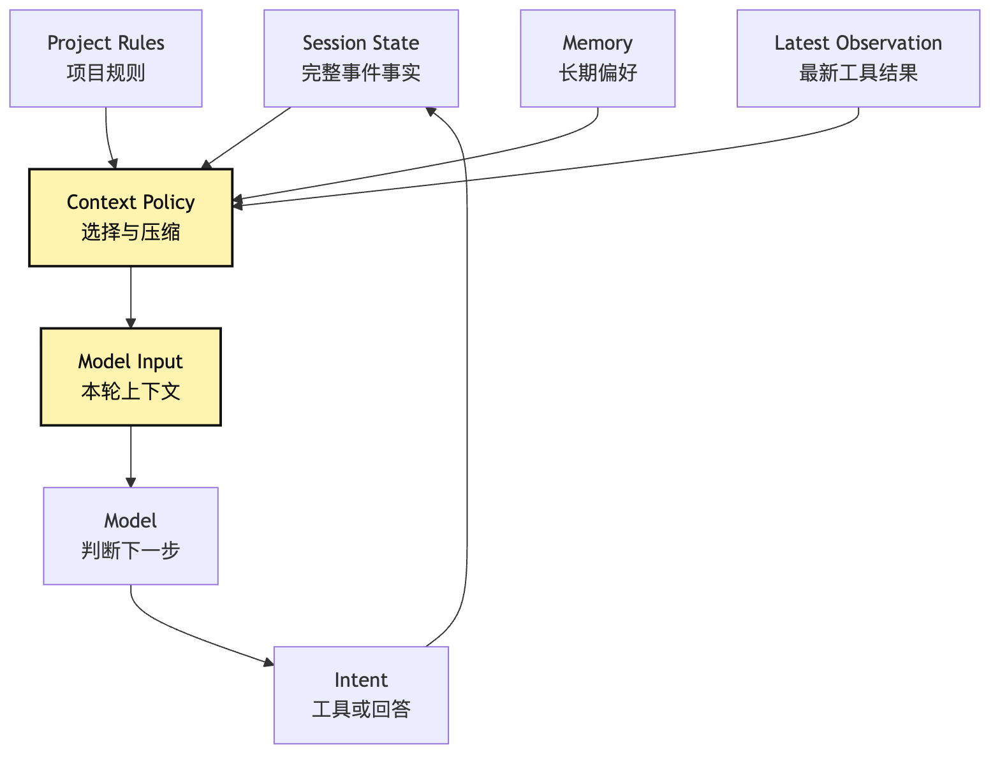
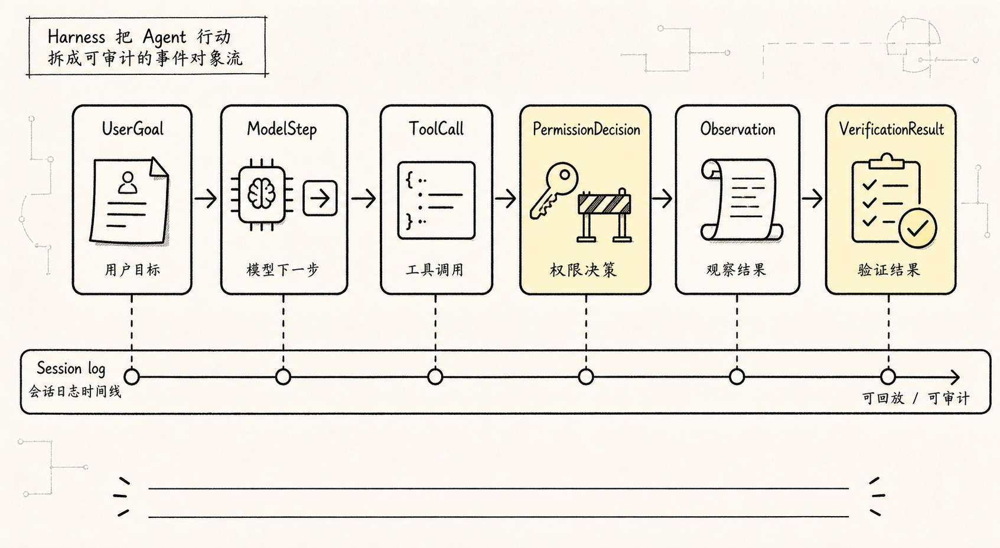
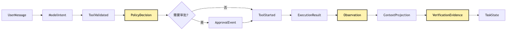

# Harness 基础定义：模型外部的控制系统

前面我们已经把 Agent 拆成了几个最小部件：

```text
Model：判断下一步
Loop：推动过程继续
Tools：接触真实世界
State：让任务不断线
```

到这里，很多人会自然冒出一个问题：

**既然 Agent 已经有模型、有循环、有工具、有状态，为什么还要再讲 Harness？**

更容易混淆的是另一种说法：

```text
Harness 是不是一个更外层、更聪明、更会管理 Agent 的 Agent？
```

这句话听起来像是对的。但它其实会把架构想歪。Harness 不是另一个 Agent。它也不是一个更大的 prompt，也不是某个框架名。它更像是模型外面的控制系统。我们继续沿用同一个小型 CLI Agent 示例：

```text
用户说：帮我看看这个项目为什么测试失败，并把它修好。
```

如果这个 CLI Agent 只是一个 demo，它可以很简单：

```text
把用户输入发给模型
模型说要读文件
程序读文件
结果塞回 prompt
模型说要改文件
程序改文件
模型说要跑测试
程序跑测试
```

这条链路跑通一次，看起来就已经像 Agent 了。但只要你把它交给别人真实使用，问题会马上冒出来。模型想执行 `rm -rf` 怎么办？模型想读取用户 home 目录下的私密文件怎么办？模型连续跑了十分钟，用户想中断，现场怎么保存？工具报错以后，下一轮模型到底应该看到完整日志，还是只看到摘要？同一个任务明天继续跑，session 从哪里恢复？一次修改看起来成功了，但没有测试验证，系统怎么知道它真的完成了？线上某个用户说 Agent 把文件改坏了，我们怎么还原发生过什么？这些问题都不属于模型本身。它们也不应该交给模型自己决定。因为模型每一轮只是在当前上下文里生成下一步判断。而权限、执行环境、会话生命周期、观测日志、验证标准、治理策略，是模型外面的工程责任。这些责任合起来，就是这篇要讲的 Harness。一句话先压住：

**Agent 负责在任务里判断下一步，Harness 负责让每一步在真实环境里可执行、可约束、可观察、可恢复、可验证、可治理。**

框架可以提供 Harness 的一部分能力，但 Harness 更像一组模型外部工程责任，而不是一个包名或产品名。

这篇文章不把 Harness 写成一个大而全的术语盒子。我们只回答一个核心问题：

> Harness 和 Agent 是什么关系？为什么它不是另一个 Agent？

## 问题链



先把这篇的问题链固定住：

```text
Agent 一旦能调用工具
-> 就必须区分“模型提议”和“系统执行”
-> 系统执行必须有权限、沙箱、预算和错误处理
-> 任务一旦变长
-> 就必须有 session、生命周期、中断和恢复
-> 产品一旦给别人用
-> 就必须有 trace、评估、回归和治理
-> 这些模型外部责任合起来
-> 就是 Harness
```

所以 Harness 的出现不是为了显得架构更高级。它是 Agent 进入真实工程环境以后，被现实逼出来的控制面。如果用七层地图来记，可以先记一个缩写：

```text
ETCLOVG

Execution
Tools
Context
Lifecycle
Observability
Verification
Governance
```

画成图就是：



这张图里最重要的不是七个名词本身。最重要的是中间那条责任边界：

```text
Agent 提出下一步
Harness 决定这一步能不能执行、怎么执行、如何记录、如何验证
```

模型仍然是推理核心。它负责理解用户目标、阅读上下文、提出下一步行动。但模型不直接拥有文件系统。模型不直接拥有 shell。模型不直接决定权限。模型也不直接改写长期记忆和审计记录。这些都属于 Harness。

## 一、为什么工具一出现，Harness 就会出现

最小聊天应用不需要 Harness。它只要管理 messages 就够了：

```text
用户输入
-> 模型回答
-> 展示结果
```

这种场景里，模型的输出只是文本。文本错了，用户可以忽略。文本不完整，用户可以追问。文本没有副作用。但 Agent 不一样。当它能调用工具时，模型输出不再只是“回答”。它开始变成“行动提议”。比如模型说：

```json
{
  "tool": "bash",
  "input": {
    "cmd": "npm test"
  }
}
```

这不是普通文本。这是一张进入真实环境的申请单。系统必须回答一串问题：

```text
这个工具存在吗？
参数是否合法吗？
当前 session 允许执行 shell 吗？
命令会不会修改文件？
是否需要用户确认？
应该在哪个工作目录运行？
超时时间是多少？
结果太长时怎么截断？
失败以后怎么回填给模型？
```

如果没有 Harness，这些问题很容易被糊成一句话：

```text
模型想做什么，我们就帮它做什么。
```

这就是很多 Agent demo 的危险之处。它们把模型的行动意图当成了系统命令。短任务里这可能没事。一旦接入真实代码库，这个假设就会变成事故入口。在我们的 CLI Agent 里，模型可以提议：

```text
读取 package.json
搜索失败测试名
打开相关源文件
修改实现
运行测试
```

这些动作看起来都合理。但每个动作的风险不同。读文件和写文件不同。运行 `npm test` 和运行任意 shell 不同。修改当前仓库和修改用户 home 目录不同。执行本地命令和访问外部网络不同。Harness 的第一层价值，就是把这些动作从“模型说了”变成“系统审过并执行了”。这个差别非常关键。在工程实现里，模型输出最好被看成 intent，也就是意图。Harness 接收 intent，再把它变成 action，也就是受控动作。最小伪代码大概是这样：

```ts
while (!session.done) {
  const modelInput = harness.context.build(session);
  const intent = await model.next(modelInput);

  const decision = await harness.policy.review(intent, session);

  if (decision.type === "deny") {
    session.appendObservation(decision.reason);
    continue;
  }

  if (decision.type === "ask_user") {
    session.pauseForApproval(decision.prompt);
    continue;
  }

  const observation = await harness.execution.run(decision.action);
  session.appendObservation(observation);
}
```

注意这里不是模型在调用工具。模型只是产出 `intent`。Harness 把 `intent` 放进 policy、execution、session、observation 这些系统边界里。这也是 Harness 不是另一个 Agent 的第一个原因：

**Harness 不负责替模型思考下一步，它负责把模型的下一步放进工程约束。**

## 二、Agent 和 Harness 的边界在哪里

为了不把概念混在一起，我们先画一条运行边界。同样是“修复失败测试”，一次完整轮次大概长这样：



这张图里，`Model -->> Harness` 的箭头非常重要。模型返回的是工具意图，不是工具结果。真正接触项目环境的是 `Tool Runtime` 和 `Execution`。真正保存事实过程的是 `Session Store`。真正决定是否允许执行的是 Harness 里的策略层。这条边界一旦混掉，系统就会出现三类常见问题。第一类问题，是把 Agent 写成“模型加裸执行器”。伪代码通常长这样：

```ts
while (true) {
  const output = await model(prompt);
  if (output.includes("bash")) {
    const result = await exec(output.command);
    prompt += result;
  }
}
```

这段代码看起来短，但它藏掉了所有关键问题。它没有权限。没有结构化工具协议。没有中断恢复。没有审计。没有验证。没有上下文策略。它只能说明“模型能驱动一次外部动作”，还不能说明“系统能托管一个真实任务”。第二类问题，是把 Harness 想成“监督 Agent 的另一个 Agent”。比如让一个外层模型判断内层模型能不能执行某个命令。这在某些场景可以作为策略的一部分，但它不是 Harness 的本质。因为 Harness 的关键能力不是“再推理一次”。它的关键能力是确定性工程控制。比如：

```text
路径必须在 workspace 内
写文件必须走 patch
shell 命令必须有超时
危险命令必须询问用户
每次工具调用必须落事件日志
测试验证必须和最终完成状态绑定
```

这些规则不应该完全交给另一个模型自由判断。它们应该是系统策略、类型约束、运行时检查和审计记录。第三类问题，是把 Harness 当成一个可有可无的“产品层”。这也不对。Harness 不只是 UI、部署、账号、计费。它从最小 CLI 阶段就存在。只要你区分了：

```text
模型提议
系统执行
执行结果写回状态
下一轮上下文重新装配
```

你就已经在写 Harness 了。只是早期 Harness 很薄。随着 Agent 面向真实任务，它会逐渐变厚。

### Harness 不是 wrapper，而是控制回路

如果只把 Harness 理解成“包在 Agent 外面的一层 wrapper”，还是会少看一层。

Wrapper 给人的感觉是薄薄一层适配代码：接收输入，调用 Agent，返回输出。但真实 Harness 更像一个控制回路。它在模型行动之前提供前馈约束，在模型行动之后收集反馈信号，然后用这些信号修正下一轮输入、工具可见性、权限策略、预算和验证要求。

放到一次 CLI Agent 运行里，这个控制回路大概是：

```text
前馈约束：
system instruction、可见工具、工作目录、预算、权限模式、项目规则

模型判断：
生成文本或 tool intent

执行反馈：
工具结果、错误类型、文件变更、成本、延迟、用户审批结果

状态更新：
session event、context projection、trace、verification evidence

下一轮约束：
减少可见工具、压缩上下文、要求先验证、暂停等待用户、结束任务
```

这说明 Harness 的价值不是“模型外面再套一层模型”。它的价值是把模型的动态判断放进一个有传感器、有约束、有反馈、有状态的工程系统里。

如果没有这层控制回路，系统看起来也能跑：

```text
model -> tool -> model -> tool -> final
```

但它不知道哪些工具选择正在变糟，不知道成本为什么上涨，不知道某次失败是权限拦截、工具错误、上下文污染还是模型判断错，也不知道下一轮应该改变什么。

所以 Harness 和 Agent 的边界可以再压缩成一句：

```text
Agent 产生行动意图，Harness 调节行动条件。
```

这个“调节”二字很重要。它意味着 Harness 不只负责执行，也负责约束、感知和反馈。

### Session、Harness、Sandbox：不要揉成一个对象



更成熟的 Agent 系统通常会把三件事拆开：

```text
Session：事实源，记录这次任务发生过什么。
Harness：控制循环，决定下一步如何运行。
Sandbox：执行手，真正接触文件、命令、网络和外部系统。
```

这三个东西如果揉成一个进程对象，早期写起来很快，后面会非常痛苦。

比如最小 demo 里，进程内变量里同时放：

```text
messages
cwd
tool results
current plan
permission state
temporary files
running process handles
final answer
```

这在一次性运行里能工作。但只要进程崩溃，所有事实都没了。只要 sandbox 被清理，session 也跟着消失。只要用户明天想继续，系统只能靠一段压缩摘要猜测昨天发生了什么。

拆开以后，责任会清楚很多。

Session 不等于 messages。messages 只是模型下一轮能看到的投影。Session 应该记录更完整的事件账本：

```text
UserMessage
ModelIntent
ToolValidated
PolicyReviewed
ApprovalRequested
ApprovalGranted
ToolStarted
ToolFinished
ObservationAppended
ContextCompacted
VerificationRun
TaskCompleted
TaskBlocked
```

Harness 可以围绕 session 恢复运行。即使控制进程崩了，也可以读取 session log，知道用户目标、已执行工具、权限决策、文件变更、验证结果和未完成事项。

Sandbox 则是可替换的执行手。它可以是本地工作目录、临时 git worktree、容器、远程 VM、浏览器环境或托管执行池。Sandbox 崩溃，不应该等于任务消失。它应该变成一次可记录的执行失败，然后由 Harness 决定重试、换环境、回滚或询问用户。

这个三分法能避免一个常见错误：把“Agent 正在运行的进程”当成系统事实源。进程是会死的。事实源应该是 session。执行手是可以替换的。控制循环可以重启。

## 三、Execution：模型不能直接站在操作系统上

ETCLOVG 的第一层是 Execution。它回答的问题很朴素：

```text
模型提议的动作，到底在哪里、用什么身份、以什么限制运行？
```

在我们的 CLI Agent 里，Execution 至少要知道：

```text
当前工作目录
可访问的文件范围
可用的环境变量
命令超时时间
最大输出长度
是否允许网络
是否允许写文件
是否允许启动后台进程
```

如果没有 Execution 层，工具调用就会直接贴着操作系统跑。这对一个只在自己电脑上玩的 demo 可能还能忍。但对一个要给别人用的 Agent 来说，它太危险。比如用户只希望 Agent 修复当前仓库。模型却提议读取：

```text
/Users/alice/.ssh/id_rsa
```

此时不能指望模型自己意识到“不应该读”。Harness 必须在 Execution 层拦下它。再比如模型提议运行：

```bash
npm test
```

这看起来安全，但测试脚本本身可能启动服务、写缓存、访问网络、跑很久。Execution 层至少要提供超时、输出截断、进程清理和工作目录隔离。否则一次普通测试就可能让 Agent 卡住。一个最小 Execution 接口可以长这样：

```ts
type ExecutionRequest = {
  kind: "read_file" | "write_file" | "shell";
  cwd: string;
  args: unknown;
  timeoutMs: number;
  allowedPaths: string[];
  sessionId: string;
};

type ExecutionResult = {
  ok: boolean;
  stdout?: string;
  stderr?: string;
  changedFiles?: string[];
  exitCode?: number;
  truncated?: boolean;
};
```

这里的重点不是类型名字。重点是系统把“执行”独立成了一个可治理对象。模型不能绕过它。工具不能私自绕过它。UI 也不应该直接绕过它。所有接触真实环境的动作，都要通过 Execution。这就是 Harness 对真实世界的第一道闸门。

## 四、Tools：工具不是函数，而是协议入口

第二层是 Tools。上一节的 Execution 更靠近操作系统。Tools 则更靠近模型。它回答的问题是：

```text
模型能看见哪些能力？
这些能力应该以什么结构提交？
系统如何把工具结果变成 observation？
```

很多人写最小 Agent 时，会把工具写成普通函数：

```ts
async function readFile(path: string) {
  return fs.readFile(path, "utf8");
}
```

函数本身没问题。但如果它要暴露给 Agent，就不能只是函数。它还需要一份协议说明：

```text
工具名是什么
输入 schema 是什么
它是只读还是写入
是否需要确认
是否能并发
错误如何表达
结果如何裁剪
结果是否进入上下文
```

否则模型和系统之间就只能靠自然语言猜。工具协议的价值，是把“我想读文件”变成结构化请求。工具运行时的价值，是把结构化请求变成受控执行。一条完整工具管线大概是这样：


这张图里最容易被忽略的是 `Observation`。工具结果不能只是一段 stdout。它要告诉系统：

```text
这次调用是否成功
输出是否被截断
哪些文件被读取
哪些文件被修改
是否产生可恢复错误
下一轮模型应该看到什么
UI 应该展示什么
审计日志应该保存什么
```

如果工具结果只是字符串，短期很省事。长期会让所有后续机制都变难。Context 不知道该保留什么。Lifecycle 不知道该怎么恢复。Observability 不知道该怎么查问题。Verification 不知道该验证什么。Governance 不知道是否越权。所以 Tools 层不是“能力越多越好”。它真正要解决的是能力入口的协议化。对小型 CLI Agent 来说，最开始只有四个工具也够：

```text
read_file
search
apply_patch
run_command
```

但这四个工具都应该走同一套协议。工具数量可以少。工具边界不能糊。

## 五、Context：模型每一轮看见什么，由 Harness 装配

第三层是 Context。它回答的问题是：

```text
模型这一轮到底应该看见什么？
```

这件事看起来像 prompt 拼接。但在 Agent 里，它远比 prompt 拼接复杂。因为长任务里的信息会不断增长：

```text
用户原始目标
项目规则
已读文件
搜索结果
测试日志
修改记录
权限拒绝
用户确认
模型自己的计划
上一轮工具结果
```

如果把所有东西无脑塞进 prompt，会遇到三个问题。第一，token 会爆。第二，旧信息和新信息会互相污染。第三，模型会被不相关细节带偏。所以 Context 层不是“保存所有状态”。它是从状态里投影出本轮模型需要看的工作台。可以把关系写成：

```text
State 是事实仓库。
Context 是本轮视野。
Memory 是跨会话经验。
Prompt 是最终输入格式。
```

这几个词经常被混在一起。Harness 必须把它们分开。在我们的 CLI Agent 里，Session Store 可能保存了完整测试日志。但下一轮模型未必需要完整日志。它可能只需要：

```text
测试命令：npm test
失败文件：src/parser.test.ts
错误摘要：expected 3 but received 2
最近修改：src/parser.ts 第 42 行附近
约束：只能修改当前 workspace
```

Context 层就是做这件事的。它不是替模型思考。它是在给模型准备一个干净、相关、受约束的判断现场。可以画成这样：



这张图里最关键的是 `Context Policy`。很多 Agent 失败，不是因为模型不会推理。而是因为 Harness 给它看的现场太乱。比如它把三十分钟前已经废弃的错误日志放在最新观察前面。或者把被用户否决过的方案继续放进高优先级上下文。或者把完整依赖安装日志塞进去，挤掉了真正相关的代码片段。这些都会让模型做出坏判断。所以 Context 层的工程目标不是“信息越多越好”。它的目标是：

```text
足够完整
足够新
足够相关
足够可解释
```

没有 Context 层，Agent 会在长任务里慢慢失明。有了 Context 层，模型每一轮才像回到一张整理好的工作台。

## 六、Lifecycle：长任务不是一条永远不断的 while true

第四层是 Lifecycle。它回答的问题是：

```text
一个 Agent 任务从开始到结束，中间会经历哪些状态？
```

最小 demo 里，很多人会写：

```ts
while (true) {
  const intent = await model.next(context);
  const result = await run(intent);
  context.push(result);
}
```

这段代码当然能跑。但真实任务不是一条永远不断的 `while true`。它会被用户打断。会等待用户确认。会因为工具失败进入恢复。会因为预算耗尽暂停。会因为测试通过而完成。会因为权限不足而阻塞。会因为网络、文件冲突、并发修改而需要重新判断。所以 Harness 要把任务生命周期显式建模。重点不是状态名多漂亮，而是承认任务会断。一个能给别人用的 Agent，不能假设用户会坐在屏幕前等它一次跑完。也不能假设每个工具都会成功。更不能假设模型每一轮都会朝正确方向走。Lifecycle 层要保存的是过程边界：

```text
任务什么时候开始
当前卡在哪一步
为什么暂停
用户批准了什么
已经执行了哪些动作
哪些动作可以重试
哪些动作不能重试
完成条件是什么
```

这里会自然引出 Session。Session 不是聊天历史的别名。Session 是长任务的事实源。它里面应该保存事件，而不只是保存 prompt：

```text
UserMessage
ModelIntent
PolicyDecision
ToolStarted
ToolFinished
FileChanged
ApprovalRequested
ApprovalGranted
VerificationPassed
TaskCompleted
```

有了这些事件，系统才能 replay。能 replay，才能调试。能调试，才能改进。能恢复，才能托管长任务。如果没有 Lifecycle，Agent 的每次运行都像一次豪赌。成功了很神奇。失败了很难复盘。

## 七、Observability：没有事实日志，就没有可改进的 Agent

第五层是 Observability。它回答的问题是：

```text
当 Agent 做错了，我们怎么知道它错在哪里？
```

对普通程序来说，日志、指标、trace 已经是常识。但很多 Agent demo 反而没有这些基础设施。它们只保存最后一段对话。用户说“它乱改文件了”，开发者只能看一个模糊 transcript。这不够。Agent 的失败可能发生在很多层：

```text
模型误解了用户目标
Context 塞进了过期信息
工具 schema 太松
权限策略放过了危险动作
shell 命令超时但没有标记
工具输出被截断后没有提示模型
测试失败但最终回答说完成了
用户拒绝过的动作被再次执行
```

如果没有 Observability，这些问题都会被压成一句：

```text
模型不稳定。
```

但这句话几乎没有工程价值。Harness 的观测层要把一次任务拆成可查看的事件链。至少要能回答：

```text
用户原始目标是什么
模型每一轮看到了什么
模型每一轮提议了什么
系统允许或拒绝了什么
工具实际执行了什么
工具返回了什么
哪些输出被截断
哪些文件发生变化
验证命令是什么
最终完成判断来自哪里
```

这就是 trace 的价值。它不是为了做漂亮 dashboard。它是为了让 Agent 失败以后可以定位责任层。比如测试没有修好，原因可能完全不同：

```text
模型没读到正确文件
搜索工具没找到测试名
Context 把关键日志裁掉了
apply_patch 修改了错误位置
run_command 运行了错误测试命令
Verification 没有把失败退出码当成失败
```

每一种原因，对应的修复方式都不同。没有观测，就只能盲目调 prompt。有了观测，才能知道该调 Context、Tool、Execution、Verification，还是模型指令。所以 Observability 是 Harness 的长期改进基础。它让 Agent 从“玄学调参”回到“工程诊断”。

## 八、Verification：完成不是模型说了算

第六层是 Verification。它回答的问题是：

```text
系统凭什么相信任务已经完成？
```

在聊天应用里，模型说“我已经解释完了”，通常就算完成。但在编程 Agent 里，这远远不够。用户让 CLI Agent 修复测试失败。模型最后回答：

```text
我已经修复了问题。
```

这句话不能作为完成证据。真正的完成证据应该来自外部验证：

```text
相关测试通过
没有引入新的失败
修改范围符合预期
关键文件确实被更新
用户要求的约束没有被违反
```

Verification 层就是把“模型自称完成”改成“系统验证完成”。最小实现可以很简单：

```ts
type VerificationPlan = {
  commands: string[];
  expectedFiles?: string[];
  successCriteria: string[];
};

async function verifyFix(plan: VerificationPlan) {
  for (const command of plan.commands) {
    const result = await execution.run({
      kind: "shell",
      args: { command },
      timeoutMs: 120_000,
    });

    if (!result.ok) {
      return { ok: false, reason: result.stderr ?? result.stdout };
    }
  }

  return { ok: true };
}
```

这里的验证不一定总是跑测试。不同任务有不同证据：

```text
文档任务：检查链接、标题、格式
重构任务：运行单测、类型检查、lint
数据任务：校验输出行数、schema、采样
部署任务：检查健康探针、日志、回滚点
研究任务：保留来源、时间、引用链
```

但原则一样：

```text
完成状态不能只来自模型语言。
完成状态要绑定外部证据。
```

如果缺少 Verification，Agent 很容易出现“看起来完成”的幻觉。它可能修了一个文件，但没有跑测试。可能跑了测试，但跑错命令。可能测试失败了，但总结时忽略失败。可能只修了第一个错误，却把整个任务标记完成。Harness 要把这些情况挡住。这也是为什么 Verification 经常和 Observability 连在一起。观测告诉我们发生了什么。验证告诉我们是否达标。两者合起来，Agent 才能从“能做事”走向“做完事”。

## 九、Governance：Agent 越强，越需要边界

第七层是 Governance。它回答的问题是：

```text
这个 Agent 在什么规则下为谁工作？
```

如果 Execution 是底层运行限制，Tools 是能力入口协议，那么 Governance 是更高层的治理策略。它关心的不只是某个命令能不能执行。它还关心：

```text
不同用户是否有不同权限
不同 workspace 是否有不同策略
哪些工具默认只读
哪些动作必须二次确认
哪些数据不能进入模型上下文
哪些日志需要脱敏
哪些 memory 可以长期保存
哪些外部服务可以调用
哪些任务必须有人类验收
```

在个人 CLI 里，Governance 可以很薄。比如只做三件事：

```text
只能访问当前仓库
写文件必须通过可审计 patch
危险 shell 命令必须询问用户
```

但当 Agent 进入团队环境，治理会快速变复杂。不同项目有不同规则。有些仓库不能上传代码片段。有些命令不能在 CI 外运行。有些文件包含密钥。有些用户只能读，不能写。有些任务必须留下审计记录。这些都不是模型靠自觉能稳定遵守的。Harness 必须把它们变成策略。一个简单策略判断可以像这样：

```ts
function reviewAction(action: Action, session: Session): PolicyDecision {
  if (!isInsideWorkspace(action.path, session.workspace)) {
    return { type: "deny", reason: "path outside workspace" };
  }

  if (action.kind === "shell" && isDestructive(action.command)) {
    return { type: "ask_user", prompt: "危险命令需要确认" };
  }

  if (action.kind === "write_file" && session.mode === "read_only") {
    return { type: "deny", reason: "session is read-only" };
  }

  return { type: "allow" };
}
```

这段代码很普通。但它说明了 Harness 的气质。Harness 不是靠“更聪明”解决问题。它靠“边界清楚”解决问题。这也是它和 Agent 的根本区别。Agent 的价值来自不确定任务里的判断能力。Harness 的价值来自确定边界里的控制能力。两者不是上下级智能体。两者是不同责任层。

## 十、把 ETCLOVG 落到一个小型 CLI Agent

现在我们回到最开始的例子。如果要写一个小型 Claude Code 风格的 CLI Agent，让它帮用户修复测试失败，最小 Harness 可以先长这样：

```text
src/
  agent/
    loop.ts
    model-client.ts
  harness/
    execution.ts
    tools.ts
    context.ts
    lifecycle.ts
    trace.ts
    verification.ts
    policy.ts
  session/
    event-log.ts
    store.ts
  cli/
    main.ts
```

这里不是推荐固定目录名。而是强调责任不要混在一起。
`agent/loop.ts` 负责推进模型轮次。
它不应该直接 `exec` shell。
`harness/execution.ts` 负责运行命令和文件动作。
它不应该决定模型下一步怎么想。
`harness/tools.ts` 负责工具协议和 observation。
它不应该偷偷绕开权限。
`harness/context.ts` 负责从 session 里投影本轮输入。
它不应该把完整历史无脑塞给模型。
`harness/lifecycle.ts` 负责暂停、恢复、完成和失败状态。
它不应该只靠 `while true` 表达整个世界。
`harness/trace.ts` 负责记录事件和调试信息。
它不应该只保存最后答案。
`harness/verification.ts` 负责用外部证据确认任务完成。
它不应该相信模型一句“已经修好了”。
`harness/policy.ts` 负责权限、范围和治理。
它不应该把高风险动作交给模型自觉。把这些责任合在一起，就得到一条完整承重链路：

```text
用户输入
-> Lifecycle 创建 session
-> Context 装配本轮输入
-> Model 返回下一步 intent
-> Tools 校验 intent 结构
-> Governance 判断是否允许
-> Execution 执行动作
-> Observability 记录事件
-> Context 生成下一轮输入
-> Verification 判断是否完成
```

这条链路就是 Harness 的骨架。它不抢模型的推理工作。它也不假装自己是另一个 Agent。它只做一件事：

```text
把模型的动态判断，托管在一套稳定的工程控制系统里。
```

如果你只写最小 demo，可以从很薄的 Harness 开始。但不要一开始就把边界写乱。哪怕只有本地文件工具，也要区分：

```text
tool intent
policy decision
execution result
session event
model context
verification evidence
```

这些对象一开始看起来有点啰嗦。但它们会在任务变长、工具变多、用户变多时救你。

## 十一、事件对象：Harness 的专业性藏在这些小对象里



如果只用七层分类理解 Harness，仍然容易停在抽象层。真正写代码时，Harness 的专业性往往体现在一组很小但很稳定的事件和对象上。

比如模型输出的东西，不应该直接叫“命令”。更好的名字是：

```text
Intent：模型提出的行动意图。
```

Intent 还没有被批准，也没有被执行。它只是模型基于当前上下文提出的下一步。把它叫 Intent，可以逼系统继续问：

```text
这个意图结构是否合法？
它对应哪个工具？
它的风险等级是什么？
它是否允许在当前 session 执行？
```

通过权限之后，它才会变成：

```text
ExecutionRequest：准备交给执行环境的动作请求。
```

执行结束后，得到的是：

```text
ExecutionResult：执行环境返回的事实结果。
```

但 ExecutionResult 也不应该原封不动塞给模型。它还要被整理成：

```text
Observation：模型下一轮可以理解的观察。
```

Observation 里应该包含的不只是 stdout，还应该包含：

```text
是否成功
退出码
是否截断
变更了哪些文件
错误类别
是否可重试
是否触发权限或安全事件
是否产生验证证据
```

这几个对象看起来像命名洁癖，但它们解决的是复盘和恢复问题。用户问“刚才为什么改了这个文件”，你不能只给他一段最终回答。你需要拿出：

```text
ModelIntent：模型为什么提出这个修改
PolicyDecision：系统为什么允许它执行
ExecutionResult：真实执行发生了什么
Observation：模型下一轮看到的结果是什么
VerificationEvidence：完成判断依据是什么
AuditRecord：谁批准了什么动作
```

如果这些对象不存在，Harness 就只能靠 transcript 猜。transcript 是给人看的叙述，不是给系统恢复和评估用的事实源。

一个更完整的事件流可以这样写：



这张图的重点不是节点多，而是事实从哪里来。模型说“我需要运行测试”，只是 `ModelIntent`。测试真正执行结束，才有 `ExecutionResult`。把失败日志、退出码和截断状态整理后，才有 `Observation`。最后能不能说任务完成，要看 `VerificationEvidence`。

这也是为什么 messages 不能等于 session。messages 是模型可见上下文；session event log 是系统事实源。前者可以被压缩、重排、投影。后者应该尽量保持可审计、可回放、可归因。

这层事件建模还会影响后面的 eval。很多 Agent 评估如果只看最终答案，会错过真正问题。一个 Agent 最终可能回答对了，但中间用了危险工具；也可能最终失败，但失败来自测试环境缺依赖，不是模型判断错。只有事件链足够清楚，评估才能归因到具体层：

```text
模型判断错了？
工具 schema 太模糊？
权限策略太宽？
上下文投影漏了关键文件？
沙箱环境不一致？
验证命令选错了？
```

没有事件对象，就没有专业的失败归因。没有失败归因，Harness 改进就只能靠感觉。

## 结尾：模型负责判断，Harness 负责托管判断

我们可以把整篇压缩成三句话。第一，Agent 不是模型自己在做事，而是模型在循环中提出下一步。第二，下一步一旦进入真实环境，就需要 Execution、Tools、Context、Lifecycle、Observability、Verification、Governance。第三，这些模型外部的控制责任合起来，就是 Harness。所以 Harness 不是另一个 Agent，也不是更长的 system prompt、监督模型、工具集合、框架名或产品 UI。它是 Agent 能安全进入真实世界的控制系统。下一篇继续往前走，我们会看一条自然演化路径：

```text
Chat Agent
-> Tool Agent
-> Runtime Agent
-> Managed Agent
```

到那时你会看到，Harness 不是一开始拍脑袋设计出来的大架构。它是每次 Agent 多接触一点真实世界，就被迫长出来的一层工程边界。

## 落地到教学 Harness

在教学项目里，Harness 不需要一开始很厚，但要把责任对象分开：Express API 负责请求编排，`runAgentLoop()` 负责状态转移，`ToolRegistry` 负责工具执行边界，`JsonlSessionStore` 负责事实记录，React UI 负责把消息和事件投影出来。只要这些对象不互相吞并，后面扩权限、trace、resume 时就不会重写核心。

---

GitHub 地址: [00-04-harness-control-system.md](https://github.com/LienJack/build-harness/blob/main/docs/zh/00-04-harness-control-system.md)
