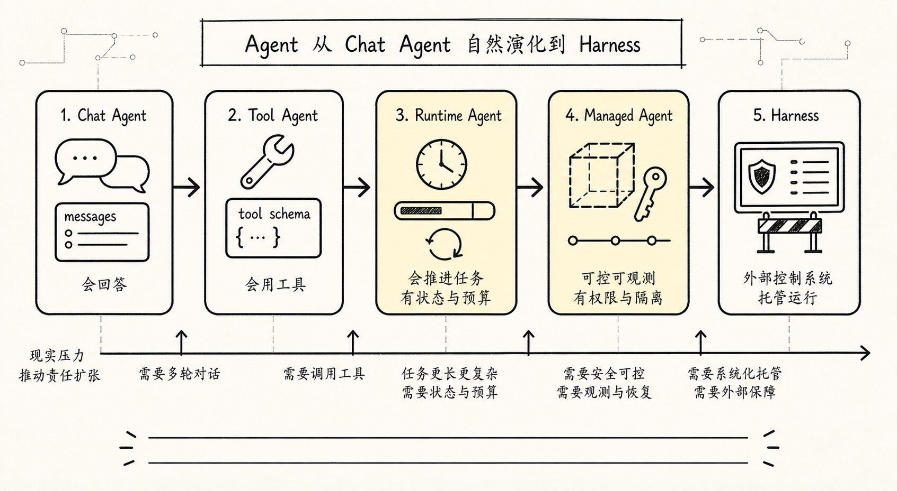
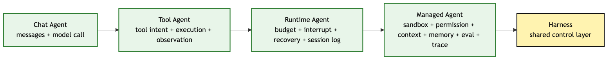
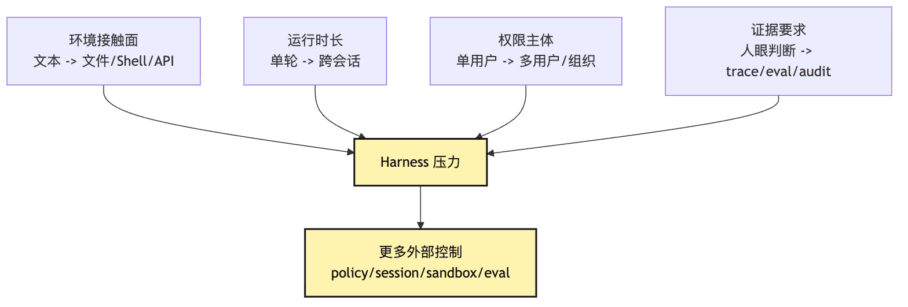
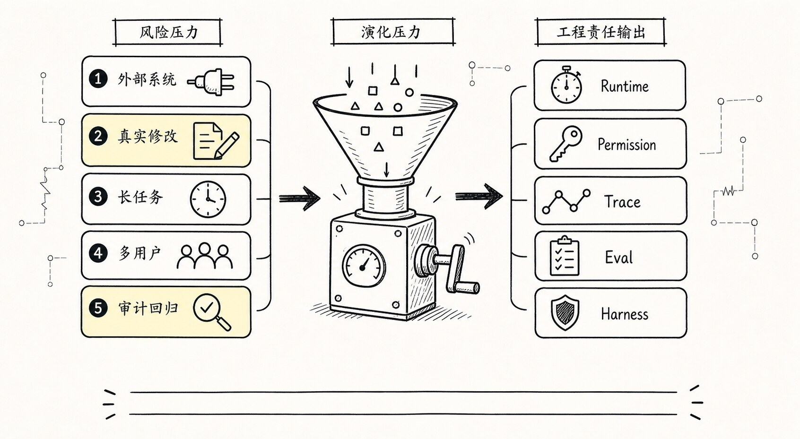
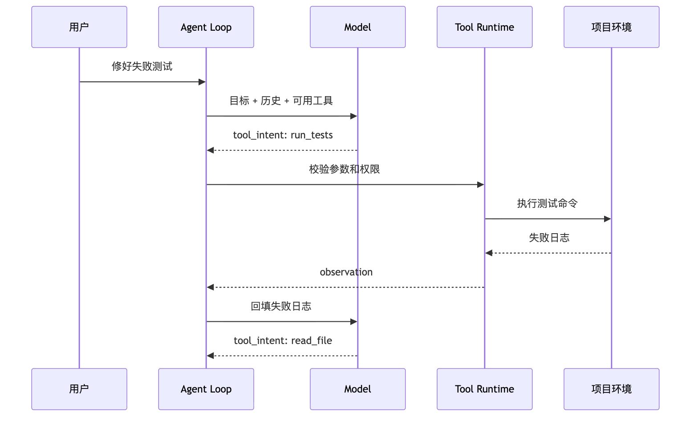
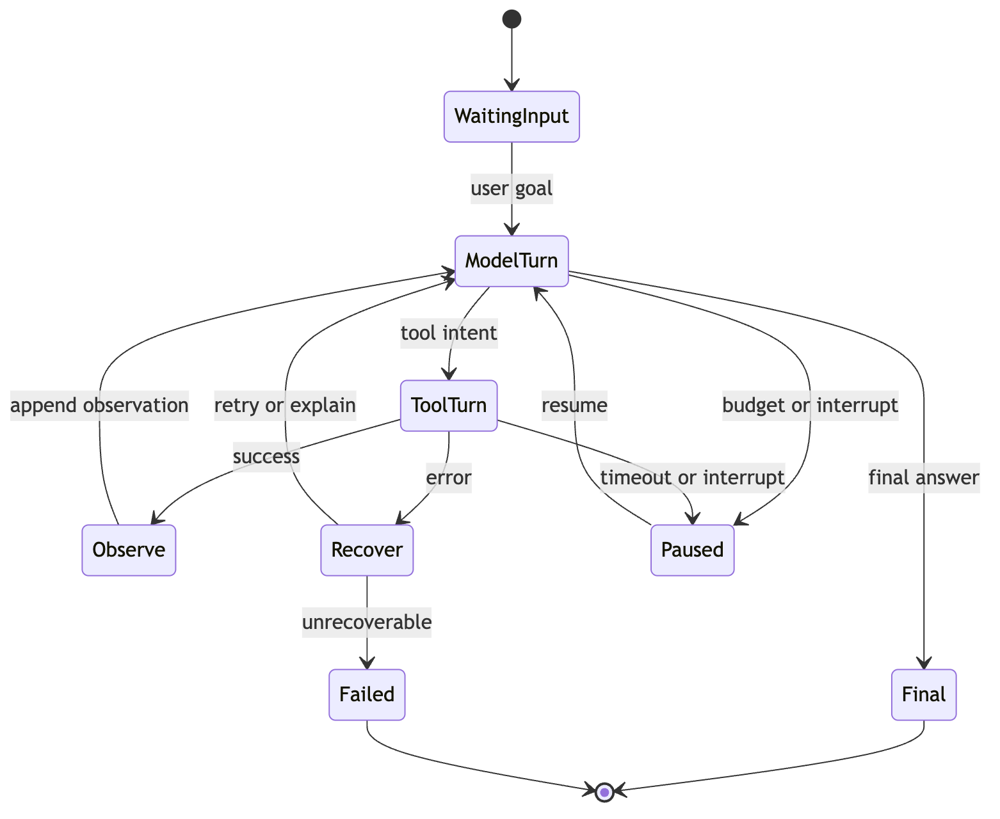
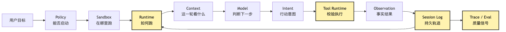
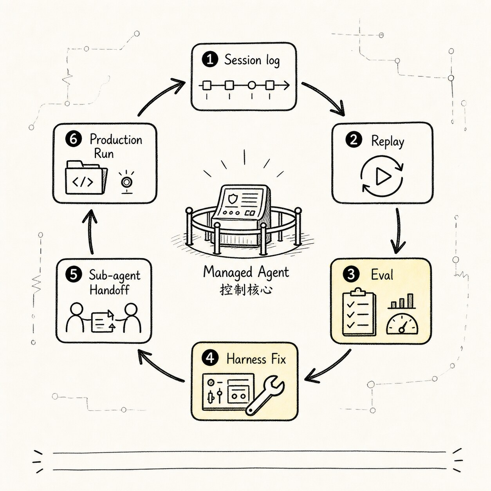

# Agent 演进路线：从聊天原型到托管运行

很多人第一次看 Agent 架构图，会有一种很自然的困惑：**为什么一个“会聊天的模型”，最后会变成一整套 Harness？**一开始我们明明只想做一个 CLI 助手。用户输入一句话，模型回答一句话。后来加了几个工具，再往后却突然冒出 Runtime、Session、Permission、Sandbox、Trace、Eval、Deployment。

这些东西不像是第一天画出来的大图，更像一个项目被真实任务一步步推着走：

```text
先让它能回答
-> 再让它能行动
-> 再让它能稳定行动
-> 再让它能被别人安全使用
-> 最后你发现，模型外面已经长出了一套 Harness 责任
```
这一章回答的问题是：

> Agent 是如何自然长成 Harness 的？

我们继续沿用前面几篇的同一个例子。我们要做一个小型 CLI Agent，用户在项目目录里输入：

```text
帮我看看这个项目为什么测试失败，并把它修好。
```
如果这个系统只能聊天，它会解释可能原因。如果它能调用工具，它会读文件、跑测试、改代码。如果它要跑很久，它就得管理预算、错误、中断和恢复。如果它要交给真实用户使用，它就得管理沙箱、权限、上下文策略、评估和部署。

所以这篇不再重新定义 Chat Agent、Tool Agent、Runtime Agent、Managed Agent。我们把它们当成一个项目的里程碑：

| 版本 | 新增能力 | 新暴露的问题 | 必须补的控制层 |
| --- | --- | --- | --- |
| v0 | 只接模型，能回答 | 容易把建议说成进展 | messages、provider contract |
| v1 | 加只读工具，能观察项目 | 工具结果要回填成事实 | tool intent、observation、tool visibility |
| v2 | 加写入和命令，开始有副作用 | 权限、超时、验证开始变硬 | permission、execution、verification |
| v3 | 加 session log、budget、interrupt | 长任务会断，会失败，会撑爆上下文 | lifecycle、event log、context policy |
| v4 | 加 sandbox、policy、eval、deployment | 多用户、多仓库、多环境要治理 | sandbox、audit、trace、eval、deployment |

## 问题链



先把这篇文章的问题链拉直：

```text
Chat Agent 只管理 messages 和模型调用
-> 用户开始要求它“做事”，于是需要 Tool Agent
-> 工具让系统接触真实环境，也带来失败、成本和长任务
-> 于是需要 Runtime Agent 管预算、中断、错误恢复和 session log
-> 一旦系统要给多人、多个项目、多个环境使用
-> 就需要 Managed Agent 管 sandbox、permission、context policy、memory、eval、trace 和部署调度
-> 这些控制层合在一起，就是 Harness 的雏形
```
画成一张总览图，大概是这样：


看这张图时，先看每个阶段新增的系统责任。Chat Agent 的责任还很窄：维护消息，调用模型，输出文本。Tool Agent 开始跨出语言世界：模型提出行动意图，系统执行工具，并把结果回填。Runtime Agent 开始承认一个事实：行动会失败，任务会很长，预算会耗尽，用户会中断，进程会崩溃。Managed Agent 则进一步承认另一个事实：真实用户不会只在你的笔记本上跑 demo，他们会把 Agent 放进不同仓库、不同权限、不同组织流程里。所以 Harness 不是凭空设计出来的“大架构”。它是每次把 Agent 放进更真实环境时，被迫长出来的控制层。

这里要先补一个判断：这四个阶段不是成熟度排行榜。

不是说 Chat Agent 低级，Managed Agent 高级。一个只帮作者改写博客标题的 Chat Agent，如果边界清楚、输出稳定、体验顺手，它就是好系统。一个号称 Managed Agent 的平台，如果拿到超级权限、没有审计、没有验证、没有恢复点，它反而很危险。

所以这条演化路径更准确地说是风险压力模型，而不是所有 Agent 都必须走完的升级路线。

判断一个 Agent 应该停在哪一层，不看名字，看它接触了什么现实风险：

```text
它是否接触外部系统？
它是否修改真实状态？
它是否运行很多轮？
它是否跨会话继续？
它是否服务多个用户？
它是否接触凭证和权限？
它是否需要审计和回归？
```

这些问题的答案越多是“是”，系统就越需要把责任从 prompt 和 model 挪到 Harness。

可以把演化压力画成四条轴：



这张图能解释一个很重要的现象：同一个产品里可以同时存在不同层次的 Agent。

比如一个小型 Claude Code 可以有 Chat Agent 路径：用户问“解释这个错误”。也可以有 Tool Agent 路径：用户要求读取文件并总结。还可以有 Runtime Agent 路径：用户要求修复测试并持续验证。最后，当它支持定时任务、远程沙箱、多用户权限和回归评估时，才进入 Managed Agent / Harness 边界。

所以不要把演化路径理解成“所有系统都必须升级到最后”。更准确的理解是：

```text
每条任务路径根据风险压力选择自己的控制层厚度。
```

## 一、v0 Chat Agent：先让系统能回答



故事要从最简单的形态开始。一个 Chat Agent 的结构通常非常朴素：

```text
用户输入
-> messages.append(user)
-> 调用模型
-> messages.append(assistant)
-> 输出回答
```
这已经比一次裸 LLM 调用前进了一步。因为它开始管理对话历史。用户可以连续追问：

```text
这个报错是什么意思？

那我应该先看哪个文件？

如果是依赖版本问题，要怎么排查？
```
Chat Agent 能把前面的上下文带进下一轮。它不再只是“问一句答一句”，而是有了一个最小的 session。但它的世界仍然完全在文本里。在我们的 CLI Agent 例子里，用户说：

```text
帮我看看这个项目为什么测试失败，并把它修好。
```
Chat Agent 可能会回答：

```text
你可以先运行测试命令，查看失败日志。
然后根据堆栈信息定位相关文件。
如果是断言失败，可以检查预期值和实际值。
```
这个回答未必错。问题是，它没有真的做任何事。它没有读取仓库。没有运行测试。没有看到真实报错。没有打开文件。也没有验证修复是否成功。这就是 Chat Agent 的边界：**它能管理对话，但不能接触真实环境。**如果任务只是解释概念、写草稿、总结文本，这个边界完全可以接受。但一旦用户把任务说成“帮我修好”，Chat Agent 就会开始露出问题。第一，它容易把建议伪装成进展。模型可能说“我会先检查测试日志”，但系统并没有检查。第二，它容易基于想象补全事实。用户没有提供项目结构，模型却可能猜测项目是 React、Node、Python 或 Rails。第三，它不能闭环验证。它可以说“改完后运行测试”，但它无法知道测试是否真的通过。所以 Chat Agent 的工程价值是：

```text
它建立了 messages 和 model call 的基本循环。
```
但它留下的核心问题是：

```text
模型会说下一步应该做什么，却不能让下一步真的发生。
```
这就引出了 Tool Agent。一个极简 Chat Agent 可以长这样：

```ts
type Message = {
  role: "user" | "assistant"
  content: string
}

async function chat(input: string) {
  messages.push({ role: "user", content: input })

  const answer = await model.complete({ messages })

  messages.push({ role: "assistant", content: answer })

  return answer
}
```
这段伪代码的重点不是语法，而是它的职责边界。它只管理 messages。它只调用模型。它只返回文本。它没有工具协议，没有执行层，没有权限，也没有恢复机制。如果我们在这个阶段就硬让模型“假装已经运行测试”，系统会变得非常危险。因为用户看到的是自信叙述，实际背后没有任何可验证动作。所以第一层演化不是“把 prompt 写得更强”。第一层演化是让模型输出从“回答文本”变成“行动意图”。

## 二、v1 Tool Agent：让模型的意图变成受控行动

Tool Agent 出现，是因为用户不满足于“告诉我怎么做”。用户真正想要的是：

```text
你帮我做。
```
在 CLI Agent 里，这句话意味着系统至少要能做几件事：

```text
读取文件
搜索代码
运行命令
编辑文件
把执行结果交还给模型
```
这时模型的输出不能再只是自然语言。它必须能表达结构化的行动意图。比如模型不应该只说：

```text
我需要看看 package.json。
```
它应该输出：

```json
{
  "tool": "read_file",
  "args": {
    "path": "package.json"
  }
}
```
这一步非常关键。因为从这一刻开始，Agent 的核心循环变成了：

```text
模型判断下一步
-> 输出 tool intent
-> Runtime 校验工具和参数
-> Tool Executor 执行动作
-> Observation 写回消息流
-> 模型基于结果继续判断
```
画成运行过程是这样：


这张图里最重要的边界，是 `Model -> Loop` 和 `Loop -> Tools` 之间的分工。模型只提出意图。Loop 和 Tool Runtime 决定这个意图能不能执行、怎么执行、执行结果如何写回。如果没有这条边界，Tool Agent 很容易退化成“模型吐 shell，系统照做”。那会带来一串问题。首先是参数不可控。模型可能输出半截命令、错误路径、拼错工具名，或者把自然语言混进参数里。所以每个工具都需要 schema。

```ts
type ToolCall = {
  name: string
  args: unknown
}

type Tool = {
  name: string
  description: string
  inputSchema: JsonSchema
  execute(args: unknown, ctx: ToolContext): Promise<ToolResult>
}
```
其次是权限不可控。同样是 shell 命令，`npm test` 和 `rm -rf .` 不是一个风险级别。同样是文件操作，读取源码和修改配置文件也不是一个风险级别。所以 Tool Agent 不能只关心“工具有没有被调用”。它还要关心：

```text
这个工具是否存在？
参数是否合法？
当前 session 是否允许用这个工具？
这个动作是否需要用户确认？
执行结果是否要截断？
失败应该如何表达给模型？
```
再次是状态不可控。工具执行完以后，结果不能只打印在终端里。它必须变成下一轮模型能看到的 observation。否则模型就不知道真实环境刚刚发生了什么。在“修复测试失败”的任务里，第一次工具调用可能是：

```text
run_tests -> 返回失败日志
```
下一轮模型看到失败日志后，才会判断：

```text
需要读取 src/auth/session.ts。
```
再下一轮读取文件后，它可能判断：

```text
需要修改 token 过期时间的边界判断。
```
这就是 Tool Agent 比 Chat Agent 多出来的东西：

```text
不仅有 messages，还有 tool schema、tool execution、observation feedback。
```

但 Tool Agent 还有一个经常被低估的控制点：工具可见性。

安全不是只在模型调用工具以后再判断能不能执行。更早的一道门是：

```text
模型这一轮应该看见哪些工具？
```

如果模型根本看不到某个工具，它就不会围绕这个工具规划任务。比如当前 session 是只读模式，就不应该把 `edit_file`、`write_file`、`run_destructive_command` 暴露给模型。用户只是问“解释失败日志”，也不需要让模型看见所有 MCP 工具、浏览器工具、部署工具和数据库工具。

工具列表不是能力展示柜，而是模型本轮的行动空间。

这件事同时影响三类问题。

第一是安全。危险工具如果总是可见，模型就可能把它纳入计划；即使执行时被拒绝，也会浪费轮次，并可能诱导用户批准本不该出现的动作。

第二是成本。工具 schema 会占上下文。工具越多，模型每轮要读的行动空间越大，token 成本和选择难度都会上升。

第三是质量。工具太多会让模型规划分支变宽。它可能在本该读文件时调用搜索，在本该运行测试时调用无关工具，在本该结束时继续探索。

所以 Tool Agent 的成熟标志不是“注册更多工具”，而是能动态裁剪工具：

```text
根据任务阶段裁剪。
根据权限模式裁剪。
根据工作目录裁剪。
根据用户确认状态裁剪。
根据上下文预算裁剪。
根据工具历史表现裁剪。
```

这也是 Tool Agent 会继续长向 Runtime Agent 的原因。工具一多，系统必须开始管理可见性、预算、失败模式和历史表现。否则工具系统会从“让 Agent 能行动”变成“让 Agent 更容易迷路”。

但 Tool Agent 也不是终点。工具一旦接入真实世界，新的问题马上出现。测试命令可能卡住。文件可能不存在。模型可能连续调用同一个工具。输出可能太长。token 预算可能烧完。用户可能中途按下 Ctrl-C。进程可能在修改了一半时崩溃。这些问题不是“再加一个工具”能解决的。它们属于 Runtime。所以 Tool Agent 会自然演化成 Runtime Agent。

## 三、v2/v3 Runtime Agent：让长任务能被控制、恢复和复盘

Tool Agent 解决了“能不能行动”。Runtime Agent 解决的是：**行动过程能不能稳定地持续下去。**在 demo 里，我们常常写一个很直接的循环：

```ts
while (true) {
  const event = await model.next(state)

  if (event.type === "final") break

  if (event.type === "tool_call") {
    const result = await tools.execute(event)
    state.messages.push(result)
  }
}
```
这段代码很容易理解。但它也很容易出事。如果模型一直不输出 final，怎么办？如果工具卡住，怎么办？如果某轮输出太长，把上下文撑爆，怎么办？如果测试运行了五分钟还没结束，怎么办？如果用户中断以后想继续，怎么办？如果系统崩溃以后要复盘它到底改了哪些文件，怎么办？这些都不是模型能靠“更聪明”自动解决的问题。它们需要 Runtime 负责。Runtime Agent 相比 Tool Agent，至少多出这些责任：

```text
turn limit：最多允许多少轮
token budget：上下文和生成预算
time budget：工具和任务超时
error policy：哪些错误可重试，哪些错误要停
interrupt：用户中断和取消控制
session log：事件持久化记录
replay：从日志恢复和复盘
compaction：上下文压缩
```
这时 Agent 的循环已经不再是一个简单 `while true`。它更像一个受控状态机：


看这张图时，先看 Agent 开始有了“生命周期”。Chat Agent 只有输入和输出。Tool Agent 有工具调用和工具结果。Runtime Agent 则有开始、暂停、恢复、失败、结束。一旦有生命周期，系统就必须回答很多工程问题。比如 budget。如果用户让 CLI Agent 修一个大型项目，模型可能会读很多文件、跑很多命令、尝试很多补丁。没有预算控制，它可能无限消耗 token 和时间。所以 Runtime 需要在每一轮之前检查：

```ts
function canContinue(session: SessionState) {
  if (session.turns >= session.maxTurns) return false
  if (session.tokensUsed >= session.tokenBudget) return false
  if (Date.now() > session.deadline) return false
  if (session.interrupted) return false
  return true
}
```
这里的重点不是“限制模型发挥”。而是让任务有一个可预测的运行边界。再比如 error recovery。工具失败并不一定意味着任务失败。`read_file` 失败，可能是路径错了。`run_tests` 失败，本来就是任务要解决的问题。`edit_file` 失败，可能是文件在并发修改。`bash` 超时，可能需要更小的命令。所以 Runtime 需要把错误分类。它不能把所有错误都丢给模型，也不能所有错误都悄悄重试。一个更稳的执行层会把结果表达成事件：

```ts
type RuntimeEvent =
  | { type: "model_started"; turn: number }
  | { type: "tool_requested"; call: ToolCall }
  | { type: "tool_succeeded"; result: ToolResult }
  | { type: "tool_failed"; error: ToolError; recoverable: boolean }
  | { type: "budget_exceeded"; kind: "turn" | "token" | "time" }
  | { type: "interrupted"; reason: string }
  | { type: "final"; content: string }
```
事件化的好处，是 session log 和 replay 终于有了基础。如果 Agent 修改代码以后失败了，用户不应该只看到一句：

```text
抱歉，我没能完成。
```
用户需要知道：

```text
它读了哪些文件？
它运行了哪些命令？
它改了哪些位置？
哪一步失败？
失败能不能恢复？
现在工作区处于什么状态？
```
这就是 Runtime Agent 的关键变化：**Agent 不只是生成下一步，它还要留下可复盘的运行轨迹。**在 Claude Code 这类系统里，这一点尤其重要。因为代码修改不是一次性文本生成。它发生在文件系统里，发生在 Git 工作区里，发生在测试命令和用户确认之间。如果没有 session log，Agent 一旦崩溃，现场就断了。如果没有 replay，开发者很难判断 bug 是模型判断错了、工具执行错了，还是 Runtime 回填错了。如果没有 interrupt，用户只能眼睁睁看着 Agent 继续跑。如果没有 compaction，长任务会被上下文窗口吞掉。所以 Runtime Agent 的出现，是 Tool Agent 进入长任务以后必然发生的。它解决了：

```text
能行动，但行动过程不可控
```
它留下的新问题是：

```text
这个 Runtime 如果要给不同用户、不同项目、不同权限环境使用，谁来管理外部边界？
```
这就引出 Managed Agent。

## 四、v4 Managed Agent：让 Agent 进入真实组织和真实环境

Runtime Agent 已经能跑长任务。但它通常还默认一个前提：

```text
Agent 在一个可信、本地、单用户、临时的环境里运行。
```
真实使用里，这个前提很快会消失。一个 CLI Agent 可能被放进公司代码库。可能接入 CI。可能通过 Web、IDE、Slack、Cron 触发。可能同时服务多个用户。可能需要连接内部文档、issue 系统、部署平台、密钥管理系统。可能要在沙箱里运行不可信命令。可能要把执行 trace 交给平台做评估。这时 Agent 的问题不再只是“这一轮怎么跑”。问题变成：

```text
谁允许它跑？
它在哪个环境里跑？
它能访问哪些文件和网络？
它能使用哪些密钥？
它能不能修改代码？
它的记忆从哪里来？
它的上下文策略是谁定义的？
它的效果如何评估？
它失败以后谁收到通知？
它能不能被批量部署和升级？
```
这些问题合起来，就是 Managed Agent 的范围。Managed Agent 不是“更聪明的 Agent”。它是被平台托管、治理、观测和部署的 Agent。如果说 Runtime Agent 管的是一次任务的生命周期，那么 Managed Agent 管的是 Agent 作为一个系统能力的生命周期。可以画成一张分层图：


这张图里最重要的是：Managed Agent 把 Agent 放进了一个可治理的外壳里。入口决定它从哪里被触发。Policy 决定它能做什么。Sandbox 决定它在哪里做。Runtime 决定它怎么持续做。Observability 和 Eval 决定它做得好不好。Deployment 决定它如何被发布、升级和回滚。这里最容易误解的是 sandbox。很多人会把 sandbox 理解成“安全功能”。它当然是安全功能，但不只是安全。Sandbox 还提供可重复的执行环境。如果 Agent 在用户本机随便跑，它看到的 node 版本、依赖缓存、环境变量、文件权限都可能不同。同一个任务，今天在你的电脑能过，明天在 CI 里失败。Managed Agent 需要把这些环境差异收束起来。这就是为什么 sandbox、container、workspace、permission、secret scope 会一起出现。再看 permission。Tool Agent 阶段我们已经有了工具权限。但 Managed Agent 的权限更大一层。它不仅问：

```text
这个工具能不能调用？
```
还要问：

```text
这个用户在这个项目里能不能触发这个 Agent？
这个 Agent 能不能访问这个仓库？
这个会话能不能写文件？
这个命令是否需要人工确认？
这个任务能不能使用网络？
这个 secret 能不能注入到沙箱？
```
如果没有这一层，Agent 很容易在组织环境里变成一个模糊的超级权限入口。看起来是模型在工作，实际是所有边界都被一层“智能”字样糊住了。这在工程上不可接受。再看 eval。单次 CLI demo 可以靠人眼判断效果。但 Managed Agent 需要持续迭代。模型换了，prompt 改了，工具策略改了，context policy 改了，sandbox 镜像升级了。每次变化都可能影响结果。没有 eval，系统就没有办法知道：

```text
它是不是比上个版本更好？
它是不是更容易误改文件？
它是不是成本更高？
它是不是在某类仓库上退化？
它是不是更频繁请求危险权限？
```
这就是 Managed Agent 必须接入 trace 和 evaluation 的原因。Trace 不是为了“看起来专业”。Trace 是为了把一次 Agent 运行拆成可检查的事件链。Eval 则把很多条事件链变成可比较的质量信号。当 Agent 从个人工具变成平台能力，这些东西就不再是可选项。

## 五、Harness 的位置：托管 Agent 的运行条件

走到这里，我们可以回头看 Harness。如果一开始就说：

```text
Harness 是模型外部的控制系统，负责 Execution、Tools、Context、Lifecycle、Observability、Verification、Governance。
```
这句话很准确，但也很抽象。现在沿着演化路径看，就更容易理解。Chat Agent 需要 messages。Tool Agent 需要工具协议和执行管线。Runtime Agent 需要预算、错误、中断、session log、replay。Managed Agent 需要 sandbox、permission、context policy、memory、eval、trace、deployment。这些东西不是模型本身的一部分。模型不会天然管理它们。它们也不应该塞进 prompt 里。因为 prompt 只能影响模型这一轮怎么判断。Harness 管的是模型之外的现实约束。可以把整条承重链路写成：

```text
用户目标
-> Managed Policy 判断是否允许启动
-> Sandbox 准备执行环境
-> Runtime 创建 session
-> Context Builder 组织模型输入
-> Model 输出下一步意图
-> Tool Runtime 校验并执行
-> Observation 写入 session log
-> Runtime 判断继续、暂停、恢复或结束
-> Trace / Eval 记录质量信号
```
再画成一张图：


这张图说明 Harness 的位置。它不是在模型旁边又放了一个“总指挥模型”。它是一组确定性的工程控制层。模型负责在给定上下文里判断下一步。Harness 负责让这个下一步：

```text
可执行
可约束
可记录
可恢复
可评估
可部署
```
这也是为什么 Agent 接触的环境越真实、权限越大，Harness 越重要。如果 Agent 只能聊天，Harness 很薄。如果 Agent 能读文件、改代码、跑命令，Harness 就必须接住工具风险。如果 Agent 能长时间自主运行，Harness 就必须接住生命周期风险。如果 Agent 能给多人、多项目、多入口使用，Harness 就必须接住治理风险。所以 Harness 不是架构洁癖。它是 Agent 离开玩具环境以后，系统为了活下来长出的骨架。

## 六、四个阶段的失败形态

理解演化路径，最好不要只看“新增能力”。还要看每一层缺失时会怎么失败。Chat Agent 的典型失败，是把“建议”说成“完成”。它会输出很有条理的排查步骤。但真实项目没有任何变化。用户如果没有工程经验，甚至可能误以为 Agent 已经检查过。所以 Chat Agent 的边界必须明确：

```text
它能回答，不代表它能执行。
```
Tool Agent 的典型失败，是工具失控。模型输出一个危险命令，系统没有权限判断。模型给出错误参数，工具用默认值执行。工具输出几万行日志，直接塞回上下文。工具失败以后，模型看不到结构化错误，只能继续猜。所以 Tool Agent 的边界必须明确：

```text
工具不是模型的手脚延伸，而是 Runtime 管理下的协议化能力。
```
Runtime Agent 的典型失败，是过程失控。循环跑太久。重试没有上限。用户中断不了。上下文越来越脏。session 崩溃后无法恢复。改了哪些文件说不清。所以 Runtime Agent 的边界必须明确：

```text
长任务不是一个 while true，而是一个可暂停、可恢复、可复盘的生命周期。
```
Managed Agent 的典型失败，是平台边界失控。Agent 拿到过大的权限。沙箱和真实环境混在一起。不同用户共享了不该共享的记忆。模型升级以后效果退化但没人发现。trace 缺失导致问题无法定位。部署和回滚没有策略。所以 Managed Agent 的边界必须明确：

```text
Agent 不是被放出去自由行动的进程，而是被治理、观测和评估的平台能力。
```
这四类失败形态也说明了一件事：每一层新增机制都不是装饰。它们都是为了解决上一层真实暴露出来的失败。

## 七、工程上怎么落地：不要一口气做成大平台

既然最后会长出 Harness，是不是一开始就应该照着 Managed Agent 平台来做？不一定。这篇文章强调的是“自然长出”，不是“一开始堆满”。对一个小型 CLI Agent 来说，更稳的落地方式是分阶段增加控制层。第一阶段，只做 Chat Agent。目标是把 provider contract、messages、streaming 输出跑通。这时不要急着加复杂工具。先确认：

```text
模型输入输出边界是否清楚？
消息历史是否可控？
错误是否能被用户看懂？
```
第二阶段，加 Tool Agent。先加只读工具。比如 `read_file`、`list_files`、`search`。等 observation 回填稳定以后，再加写入工具和 shell 工具。这时重点不是工具数量，而是工具协议。

```text
schema 是否严格？
权限是否分级？
工具结果是否结构化？
输出是否会被截断和摘要？
```
第三阶段，加 Runtime Agent。先给 loop 加 turn limit、timeout、interrupt。再把事件写入 session log。最后考虑 replay、compaction、恢复和更细的错误策略。这时重点是生命周期。

```text
任务为什么继续？
为什么停止？
失败在哪里？
用户能否中断？
崩溃后能否知道发生过什么？
```
第四阶段，再做 Managed Agent。当系统开始被别人使用，或者开始接入真实组织资源，才需要更完整的 managed layer。这时重点是治理和运营。

```text
沙箱怎么隔离？
权限怎么审批？
记忆怎么分域？
trace 怎么收集？
eval 怎么回归？
部署怎么灰度和回滚？
```
一个保守的实现路线可以写成：

```ts
interface AgentHarness {
  provider: ModelProvider
  tools: ToolRegistry
  runtime: RuntimeController
  sessionStore: SessionStore
  policy?: PolicyEngine
  sandbox?: SandboxManager
  telemetry?: TraceSink
  evals?: EvalRunner
}
```
注意这里很多字段是可选的。这不是因为它们不重要。而是因为它们应该随着任务真实性逐步引入。如果你的 Agent 只在本地帮自己整理文本，Managed layer 可以很薄。如果你的 Agent 要在公司代码库里自动开 PR，Managed layer 就不能省。关键判断标准不是“架构图漂不漂亮”。而是：

```text
这个 Agent 现在接触了哪些真实风险？
哪些风险已经不能靠人工盯着解决？
哪些风险必须被系统机制接住？
```
这就是从演化路径反推架构的好处。你不会为了概念完整而堆组件。也不会在风险已经出现后，还假装 prompt 能解决一切。

## 八、再看一层：可恢复、可评估、可委派



如果只看 Chat、Tool、Runtime、Managed 四个阶段，读者可能会以为演化只是“功能越来越多”。更深一层看，真正发生的是三个工程性质逐步出现：

```text
可恢复
可评估
可委派
```

### Session log：能恢复的事件账本

Runtime Agent 里最关键的对象之一，是 session log。

它不是调试输出，也不是终端 transcript。它是 Agent 的事件账本。至少应该记录：

```text
用户输入
模型意图
工具调用
工具结果
权限决策
预算事件
上下文压缩
验证结果
最终状态
```

没有 session log，所谓“可恢复”只是口号。因为系统崩溃以后，无法知道模型已经看过哪些事实、执行过哪些工具、改过哪些文件、哪些动作被用户拒绝、最后一个稳定状态在哪里。

session log 还有另一个价值：它让 eval 和 audit 有共同事实基础。

如果只保存 messages，很多关键事实会丢失。messages 是给模型看的上下文投影，可能被截断、压缩、重排。session log 则应该尽量保留事件因果：

```text
ModelIntent -> PolicyDecision -> ToolExecution -> Observation -> Verification
```

这条因果链越清楚，系统越能回答“这次失败到底发生在哪一层”。

### Sandbox 既是笼子，也是许可证

Managed Agent 里另一个容易被误解的对象，是 sandbox。

很多人把 sandbox 只理解成安全隔离。它当然是安全机制：限制文件范围、环境变量、网络、进程、凭证和副作用半径。但 sandbox 还有第二层价值：可重复性。

如果每次任务都在一个干净、可描述、可重建的环境里执行，验证结果才有意义。否则模型今天在你的本机通过，明天在另一个机器失败，系统很难判断是代码问题、依赖问题还是环境问题。

sandbox 还有第三层价值：活性。

没有 sandbox 的系统，为了安全，只能频繁问用户：

```text
可以读取这个文件吗？
可以运行这个命令吗？
可以写这个缓存目录吗？
可以访问这个端口吗？
```

问得太多，用户会疲劳，要么全部拒绝，要么机械同意。两种都不安全。

有了清楚边界的 sandbox，系统反而可以在边界内更自主：

```text
这个目录内的只读操作自动允许。
这个临时 worktree 内的测试命令自动允许。
这个网络策略外的访问必须拒绝。
写入真实仓库前必须生成 diff 并确认。
```

所以 sandbox 既是笼子，也是许可证。它把 Agent 关在一个可控区域里，同时允许它在这个区域内少打断用户、持续行动。

### Eval flywheel：用 trace 改 Harness

Managed Agent 的评估也不应该只理解成最终分数。

更有价值的是一个闭环：

```text
trace 捕获轨迹
-> 判断结果和路径
-> 归因到模型、工具、上下文、沙箱、权限或验证器
-> 生成回归用例
-> 修改 Harness
-> 再跑同一批任务
```

这叫 eval flywheel。

它的重点不是证明模型“聪明”或“不聪明”，而是让 Harness 改进有抓手。比如一次失败任务，最终答案是错的，但 trace 显示模型第一轮判断没问题，失败来自工具输出被截断后丢掉关键错误。那应该改的是 Tool Result Policy，不是模型 prompt。

另一次失败，工具结果完整，但模型重复读取同一个文件三次，说明 loop state 没有记录重复行为，或者上下文投影没有让模型看见已读事实。那应该改的是 Runtime Guardrail 或 Context Policy。

再一次失败，模型给出正确修改，但没有运行相关测试就宣布完成。那问题在 Verification Gate。

只有 trajectory 级别的评估，才能把失败拆成这些可修复的工程问题。否则系统只能得到一个模糊结论：

```text
这次 Agent 没做好。
```

这个结论几乎没法指导改进。

### Sub-agent handoff：委派时要传什么

最后是委派。

Managed Agent 往往会引入 sub-agent，但 sub-agent 不是“多叫几个模型角色扮演”。真正的 handoff 应该传递一组工程对象：

```text
任务意图
已知事实
约束条件
可用工具
权限边界
预算
风险
中间工件
未决问题
返回格式
```

子 Agent 可以隔离上下文，但不能隔离责任。它的工具权限应该继承或收窄自主 Agent 的权限边界。它的输出也不应该只是一段总结，而应该包含证据、操作、风险和下一步建议。

这也是为什么多 Agent 会把系统推向 Harness。只要任务开始委派，就必须回答：

```text
谁批准了委派？
子 Agent 能看到什么？
子 Agent 能调用哪些工具？
子 Agent 的结果如何进入主 session？
如果子 Agent 出错，责任如何回到主流程？
```

没有这些问题的答案，多 Agent 只是把一个 Agent 的不确定性复制成多个。

## 九、把四个阶段压成一条路线

最后把这条路再压缩一次。Chat Agent 解决的是：

```text
如何让模型持续对话。
```
Tool Agent 解决的是：

```text
如何让模型的下一步意图变成受控行动。
```
Runtime Agent 解决的是：

```text
如何让多步行动在预算、错误、中断和恢复下稳定运行。
```
Managed Agent 解决的是：

```text
如何让 Agent 在真实用户、真实项目、真实权限和真实评估体系里被托管。
```
Harness 则是这些控制责任的合体：

```text
模型负责判断下一步，Harness 负责让下一步在真实世界里更可控、可审计、可恢复、可验证地发生。
```
所以 Agent 不是一开始就被设计成复杂系统。它是在一次次遇到真实环境以后，从 Chat 长到 Tool，从 Tool 长到 Runtime，从 Runtime 长到 Managed。这也是后面继续写 ETCLOVG 七层 Harness 时最重要的背景。Execution、Tools、Context、Lifecycle、Observability、Verification、Governance 不是七个抽象分类。它们都是这条演化路径上，被真实任务逼出来的工程责任。

## 落地到教学 Harness

这章可以用教学项目的里程碑来读：先让 CLI/API 能回答，再让 `MockModel` 触发工具，再把工具结果写回 loop，再把 session 持久化，再用 UI 和事件线展示运行过程。每一步都只增加一种工程压力，不要一口气做 provider、权限、前端和持久化。这样演化路径就从概念变成可提交的阶段。

---

GitHub 地址: [00-05-agent-evolution-path.md](https://github.com/LienJack/build-harness/blob/main/docs/zh/00-05-agent-evolution-path.md)
