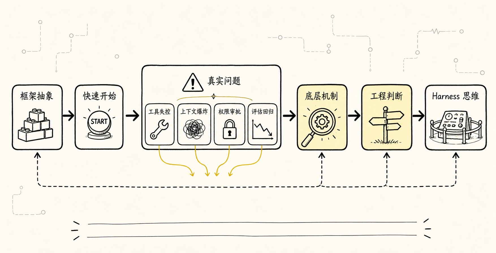
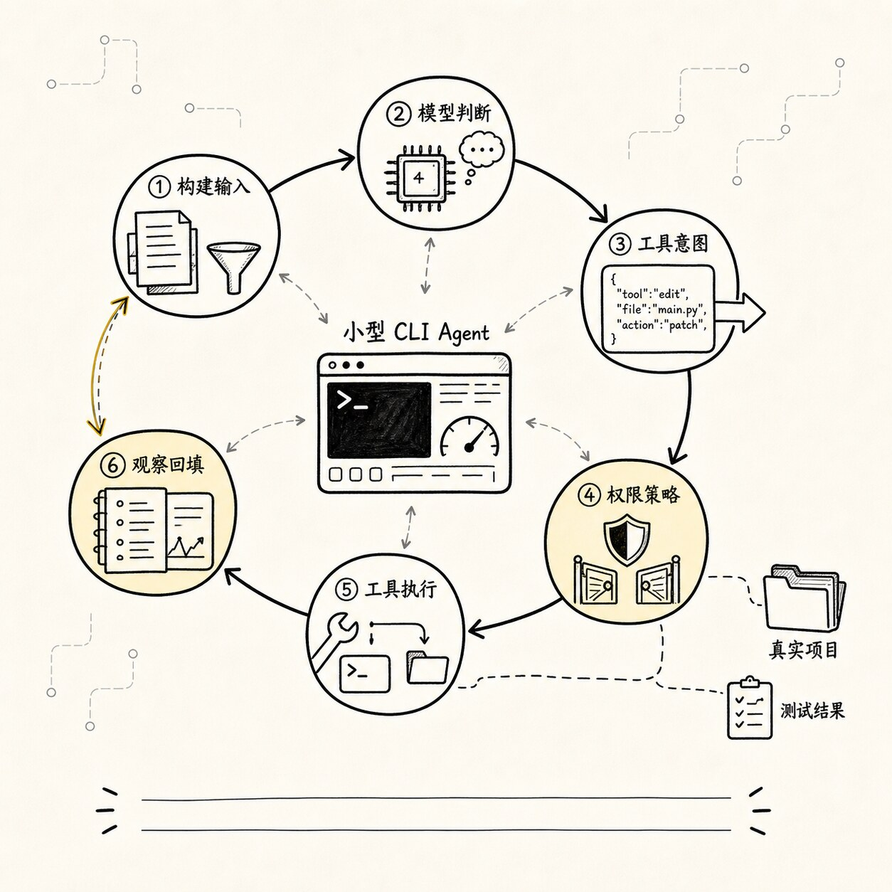
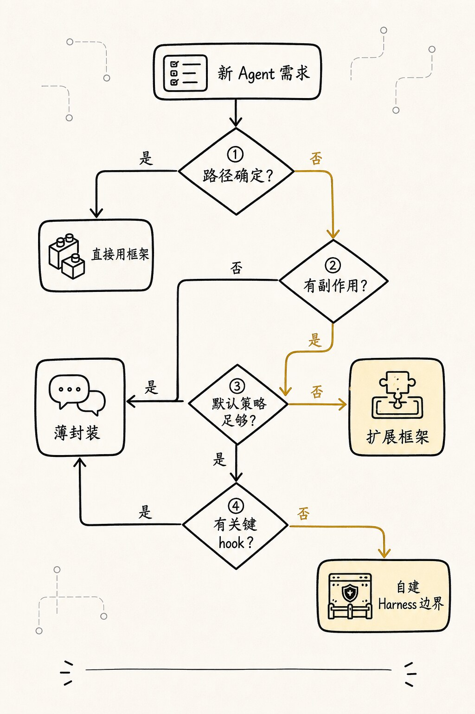

# 手写 Agent 的意义：理解框架抽象背后的最小机制

框架能让 demo 很快跑起来。

注册几个工具，写一句任务，trace 里开始出现 `read_file`、`run_command`、`edit_file`。第一次看到它自己跑测试、读日志、给出修改建议，确实很爽。

问题通常出现在第二天：

```text
它为什么重复读了三次 package.json？
为什么把旧日志又塞回了上下文？
为什么用户点了一路允许？
为什么 trace 里只有“测试通过”，却没有验证证据？
```

这时你缺的通常不是另一个框架教程，而是对最小机制的手感。

所以这一章不劝你“不要用框架”。成熟项目最终往往应该用框架、平台或已有 runtime 承接重复工程。问题在于：

```text
如果你没有手写过最小机制，
你就很难判断框架帮你省掉的是重复劳动，
还是替你隐藏了关键边界。
```

这就是手写 Agent 的真正意义。

它不是为了替代框架，也不是为了证明“从零造轮子更纯粹”。它是为了获得一种工程判断力：

```text
什么时候可以放心使用框架？
什么时候应该绕开框架的默认抽象？
什么时候应该在框架上扩展自己的 Harness 层？
什么时候问题根本不在框架，而在你没有建模底层机制？
```

我们继续使用同一个贯穿示例：

```text
帮我看看这个项目为什么测试失败，并把它修好。
```

这一次，我们不急着写完整代码，而是先回答一个更前置的问题：

> 为了看懂 Agent 框架，我们最少应该亲手实现哪些机制？

## 为什么要亲手摸一次承重点



这一章只固定一条线：

```text
直接用框架能快速开始
-> 但框架会把 loop、tool、state、context、permission 藏进抽象里
-> demo 顺利时，这些抽象很舒服
-> 一旦遇到工具失控、上下文爆炸、权限审批、评估回归
-> 你必须知道底层到底发生了什么
-> 手写最小 Agent 是为了看清这些抽象边界
-> 看清边界以后，才能判断什么时候用框架、绕开框架、扩展框架
```

手写不是目标，判断力才是目标。

先用一张图把关系画出来：


框架最擅长的是把常见路径变短。

手写最小系统最擅长的是把隐藏边界显影。

这两个目标不冲突。真正危险的是把它们混成一句话：

```text
框架已经封装好了，所以我不需要理解底层。
```

这句话在普通 CRUD 框架里有时还能成立。你不懂数据库连接池内部细节，也能用 ORM 写出业务功能。但 Agent 系统里，底层机制会频繁冒到业务面前。因为模型输出不是确定程序，工具执行会改变外部世界，上下文每轮都在变，权限和评估又直接影响产品风险。

所以 Agent 框架不是魔法盒，也不是 Harness 的全部。

它更像一套帮你组织不确定性的工程语法。

语法可以帮你写得更快，但不能替你决定哪些不确定性应该交给模型，哪些应该收回到代码、策略、测试和 Harness。框架可能提供 Harness 的一部分能力，但不会自动替你完成边界选择。

## 一、直接用框架到底解决了什么

我们先公平一点。

框架之所以有价值，是因为 Agent 系统里确实有大量重复劳动。

如果你从零开始做一个 CLI Agent，哪怕只是最小版本，也会马上遇到这些工作：

```text
包装模型 API
维护 messages
实现 loop
定义工具 schema
解析 tool call
执行工具
把结果回填给模型
处理流式输出
处理错误重试
记录状态
限制最大轮次
在某些动作前请求用户确认
```

这些事情很琐碎。

框架能帮你省掉很多样板。

比如你想写一个最小“修测试”Agent，使用框架时可能会像这样思考：

```text
创建一个 Agent
注册 read_file / grep / bash / edit 工具
给它一个任务
让框架负责循环和工具调用
拿到最终回答
```

这很自然。

框架把你从很多底层细节里解放出来，让你先关注“任务能不能跑通”。对团队早期探索来说，这很重要。因为你不一定一开始就知道任务边界在哪里，也不一定知道用户到底要什么。

如果你做的是一次内部 demo：

```text
输入一个 issue
让 Agent 读几个文件
生成一个修复建议
```

框架可能非常合适。

如果你做的是固定的研究流水线：

```text
搜索资料
摘要
交叉检查
生成报告
```

框架也能省掉不少编排工作。

如果你做的是多步骤业务自动化：

```text
读取 CRM
生成邮件
等待审批
发送
记录日志
```

框架里的 graph、node、edge、tool、checkpoint 这些抽象也很有用。

所以问题不是“框架有没有价值”。

问题是：

**当框架让你快速跑起来以后，你是否还能看见它替你做了哪些决定？**

这些决定包括：

```text
模型每轮看见哪些 messages？
工具 schema 如何暴露给模型？
工具结果原样回填还是摘要回填？
工具失败算不算一次观察？
同一个工具能不能连续调用？
上下文超长时如何压缩？
final answer 的判断由谁负责？
权限是在调用前拦，还是执行时拦？
trace 能不能还原每一步？
评估失败时能不能归因？
```

如果你看不见这些决定，框架就从工具变成了黑盒。

黑盒在顺风路径上很舒服。

但 Agent 系统的问题，往往都发生在逆风路径。

## 二、顺风 demo 和真实任务之间隔着四个坑

我们继续用“修复测试失败”的 CLI Agent。

顺风 demo 通常长这样：

```text
用户：帮我修测试
Agent：读取 package.json
Agent：运行 npm test
Agent：读取失败文件
Agent：修改代码
Agent：重新运行测试
Agent：测试通过，完成
```

这个过程看起来很像一个可靠系统。

但真实项目里，第一次失败往往不是“模型不会写代码”，而是下面这些更工程化的问题。

### 1. 工具失控：模型把“能调用”理解成“应该调用”

一旦给模型很多工具，它会开始把工具当成行动空间。

这本身没错。Agent 的价值就在于模型可以根据现场选择工具。

问题是，工具空间如果没有边界，模型很容易产生几类失控行为：

```text
重复读取同一个文件
搜索范围过大
运行过重命令
在没有证据时直接编辑文件
把 bash 当成万能工具
绕过专用工具执行危险 shell
```

比如它为了找测试命令，连续做了这些事：

```text
read_file(package.json)
grep("test")
bash("find . -name package.json")
bash("cat package.json")
read_file(package.json)
```

从最终结果看，它可能还是找到了测试命令。

但从系统角度看，这条轨迹已经有味道了。

它说明 Agent 没有稳定记录“我已经读过什么”，或者上下文没有把这个事实投影给模型，也可能是工具菜单太宽，让模型把简单任务变成了探索性行动。

如果你只看最终回答，会觉得没问题。

如果你看 trace，会发现 Harness 正在漏。

### 2. 上下文爆炸：工具结果比推理更快填满窗口

修测试会产生大量上下文：

```text
项目结构
package.json
测试失败日志
相关源码
测试文件
历史修改 diff
重新运行测试的输出
错误堆栈
```

如果框架默认把每个 tool result 原样塞回 messages，短任务还能撑住，长任务很快就乱。

模型下一轮看到的是一大堆混杂材料：

```text
旧错误日志
新错误日志
被截断的搜索结果
已经无关的文件片段
模型自己上一轮的长解释
工具返回的重复内容
```

这时模型不是“不聪明”，而是现场被污染了。

它可能忘记当前真正要修的是哪个失败，也可能根据旧日志继续修改已经修过的问题。

上下文爆炸不是 token 问题那么简单。

它本质上是“现场管理”问题：

```text
哪些事实是当前任务仍然需要的？
哪些观察已经过期？
哪些结果应该压缩成状态？
哪些原始证据必须保留在 session log？
哪些内容只在用户界面展示，不该进入模型输入？
```

如果你没手写过最小 context builder，很容易把所有问题都归结成：

```text
模型上下文不够大。
```

但在 Agent 里，上下文越大不一定越好。

一个混乱的大上下文，往往比一个清楚的小上下文更危险。

### 3. 权限审批：多问用户不等于更安全

很多人第一次加权限，会把它做成一个弹窗：

```text
Agent 想执行 npm test，是否允许？
Agent 想读取 src/foo.ts，是否允许？
Agent 想编辑 src/foo.ts，是否允许？
Agent 想执行 npm test，是否允许？
```

这比完全不审批安全一些，但很快会变成另一种问题。

用户会疲劳。

用户一疲劳，就会一路点允许。

这时审批系统表面上存在，实际上失效。

更糟的是，如果系统没有区分风险等级，读文件、跑测试、写文件、删除文件、访问网络全都用同一种确认体验，用户也无法判断哪个动作真正危险。

所以权限系统不是“多弹窗”。

它至少要回答：

```text
这个动作属于只读、写入、执行、网络、凭证、删除中的哪一类？
是否在当前工作目录边界内？
是否已经被项目规则允许或拒绝？
是否需要用户确认？
确认应该展示什么证据？
用户拒绝后，模型下一轮应该看到什么观察？
```

如果框架给你的权限抽象只有一个 `confirmToolCall()`，你就必须知道什么时候它够用，什么时候需要扩展成自己的 policy layer。

这就是手写最小权限门的意义。

你不是为了以后永远自己写审批 UI。

你是为了知道审批在运行链路里应该挂在哪里。

### 4. 评估回归：最终答案对了，不代表 Harness 没坏

Agent 的评估最容易被做薄。

很多团队会先写一个测试：

```text
输入一个失败项目
期望最终输出包含“测试通过”
```

这当然有用，但远远不够。

因为同样的最终结果，可能有完全不同的过程：

```text
路径 A：读日志 -> 定位文件 -> 小改动 -> 跑测试 -> 通过
路径 B：全仓库搜索 -> 读取大量无关文件 -> 猜改 -> 测试碰巧通过
路径 C：跳过测试 -> 直接声称完成
路径 D：运行危险命令 -> 修改了不该改的文件 -> 结果也通过
```

如果评估只看最终回答，A、B、C、D 可能看起来差不多。

但从 Harness 角度看，只有 A 是健康轨迹。

所以成熟评估要看 trajectory：

```text
用了哪些工具？
工具顺序是否合理？
是否读取了必要证据？
是否越权？
是否有重复无效行动？
是否验证了结果？
失败时能不能归因到模型、工具、上下文、权限或环境？
```

框架可能提供 trace。

但 trace 是否能回答这些问题，取决于它记录的事件粒度。

如果你没亲手设计过一次事件流，很容易误以为“有日志”就等于“可评估”。

实际上不是。

日志是原材料，评估需要可归因的事件对象。

## 三、手写最小 Agent，不是手写完整框架



说到这里，很容易走向另一个极端：

```text
既然框架隐藏了边界，那我是不是应该从零实现一个完整 Agent 框架？
```

不用。

至少在学习阶段，手写最小 Agent 的目标不是完整性，而是显影。

你要手写的是那些一旦被隐藏、就会影响判断的最小机制。

对于“修复测试失败”的 CLI Agent，第一版最小系统可以非常小：

```text
一个模型调用接口
一个 while loop
一个工具注册表
三个工具：read_file、grep、run_command
一个 messages 列表
一个 event log
一个最大轮次
一个简单权限门
一个 final 判断
```

它甚至可以先不支持真实编辑。

先让 Agent 做到：

```text
读取 package.json
运行测试命令
读取失败日志提到的文件
给出修复建议
```

下一步再加入 `edit_file`。

再下一步才加入 diff、审批、重新测试、上下文压缩。

手写最小系统的价值在于：每加一层，你都能亲眼看到前一层为什么不够。

比如没有 event log 时，你会发现调试只能靠打印最终 messages。

加了 event log 后，你会自然区分：

```text
模型说了什么
工具实际执行了什么
工具返回了什么
下一轮模型看见了什么
```

没有工具 schema 时，你会发现模型的自然语言很难可靠解析。

加了 schema 后，你会自然理解：

```text
tool call 不是工具执行，只是工具意图。
```

没有权限门时，你会发现模型一旦可以跑 shell，就必须把所有风险压到 prompt 里。

加了权限门后，你会自然理解：

```text
安全不是模型自律，而是运行时约束。
```

没有 context builder 时，你会发现 messages 很快变成垃圾堆。

加了 context builder 后，你会自然理解：

```text
上下文不是历史记录，而是本轮投影。
```

这就是“手写”的边界。

不是为了把所有东西都写到生产级，而是为了亲自触摸几个承重点。

## 四、手写时只摸五个承重点

00-06 只做路线图，不把后面几章提前写完。真正值得亲手写一次的，是下面五个承重点：

| 承重点 | 亲手写一次要看见什么 | 正式展开位置 |
| --- | --- | --- |
| Model output -> Intent | 模型只提出下一步，系统还要把它变成可处理对象。 | 00-10 |
| Loop -> State transition | 裸循环表达不了暂停、预算、重复失败和用户中断。 | 00-08 |
| Tools -> Protocol boundary | 工具不是随手暴露函数，而是模型进入真实世界的协议入口。 | 00-10 |
| Messages -> Context projection | `messages` 只是本轮投影，不是事实源、状态库和审计日志的混合体。 | 00-09 和 Context 章节 |
| Eval -> Trajectory attribution | 最小评估要能回答失败发生在哪一层，而不是只看最终答案。 | 00-19 和 Eval 章节 |

这五个点都值得摸一下，但这一篇不展开完整实现。展开太早，后面的 Provider、Loop、M0、Intent / Execution 章节都会像复读。

这里先留下每个承重点的检查问题。

### 1. Model output -> Intent

模型说“我要运行测试”，系统有没有把它记录成结构化 intent？

如果只是把模型文本直接交给工具执行，失败就很难归因。`npm test` 没跑，可能是模型没提出测试意图，可能是参数校验失败，可能是权限拒绝，也可能是命令超时。对象拆开，归因才有地方落。

### 2. Loop -> State transition

`while true` 只能表达“继续”，表达不了“为什么停”。

手写最小 loop 时，至少要让系统知道当前轮次、剩余预算、上一轮 observation、是否重复失败、是否已经有验证证据。00-08 会把这件事正式写成 `Think -> Act -> Observe -> Final`。

### 3. Tools -> Protocol boundary

框架通常让你很快注册工具，但你要追问：工具 schema 在哪里？可见性怎么裁剪？失败结果怎么变成 observation？危险动作在执行前还是执行后拦？

这一篇只保留这个检查点。工具协议的完整管线放到 00-10。

### 4. Messages -> Context projection

最容易偷懒的是把用户输入、模型回答、工具结果、错误、文件内容、测试日志、压缩摘要全塞进 messages。

这会让 messages 同时承担上下文、调试日志、事实源、状态存储、UI transcript 和评估输入。第一版可以简单，但心里要分清：session log 记录发生过什么，state 表示当前现场，context 是本轮给模型看的投影。

### 5. Eval -> Trajectory attribution

最小 eval 不需要先做复杂 benchmark。它只要能回答：

```text
这次失败，是模型判断错了？
工具输出被截断了？
上下文投影漏了关键文件？
权限策略太宽？
完成前没有验证？
```

这类问题会逼你把 trace 设计清楚。没有运行轨迹，改进就会退回“换模型、改 prompt、再试一次”。

## 五、看框架时，应该看它抽象了什么、暴露了什么

有了这些最小机制，再回头看框架，你会更冷静。

你不会只问：

```text
这个框架支不支持 tool calling？
这个框架支不支持 memory？
这个框架支不支持 multi-agent？
```

你会问更细的问题：

```text
它的 loop 是谁控制的？
我能不能介入每轮 model input？
tool intent 和 execution result 是否分开？
工具可见性和执行权限是否分开？
上下文压缩在什么时候发生？
checkpoint 存的是 messages，还是事件日志？
trace 能否支持 trajectory 级评估？
human approval 是一个回调，还是完整 policy layer？
sub-agent 是否继承权限和预算？
```

这些问题才决定框架能不能承接真实任务。

比如一个 graph 框架很适合表达确定流程：

```text
run tests -> if fail -> inspect -> patch -> verify
```

但如果每个节点内部又是一个自由 Agent，你仍然要管理工具权限、上下文回填和停止条件。

再比如一个 multi-agent 框架很容易创建多个角色：

```text
planner
coder
reviewer
tester
```

但如果没有 session log、artifact、权限继承、返回格式和失败归因，多 Agent 只是把不确定性分散到了更多地方。

再比如一个 memory 框架提供了长期记忆接口。

但你仍然要问：

```text
什么内容可以写入 memory？
谁批准写入？
记忆有没有来源和置信度？
记忆过期和冲突怎么处理？
敏感信息会不会被保存？
```

这些都不是“框架有没有某个功能”能回答的。

它们是 Harness 问题。

框架可以帮你提供挂钩，但不能替你做工程判断。

## 六、什么时候用框架、绕开框架、扩展框架



现在可以回到开头的问题。

既然我们不反对框架，也不神化手写，那么应该怎么取舍？

可以用一个简单决策表。


可以更直白一点。

### 适合直接用框架的场景

如果任务符合这些条件，直接用框架通常很合理：

```text
流程边界清楚
工具风险低
状态生命周期短
失败成本可接受
上下文规模不大
不需要复杂权限
评估只需看最终产物
```

比如内部知识问答、轻量研究摘要、固定流程报告生成、低风险数据整理。

这时手写底层机制可能只是拖慢速度。

### 适合扩展框架的场景

如果任务开始接触真实工程环境，但框架暴露了足够 hook，可以在框架上扩展：

```text
自定义 tool permission
自定义 context projection
自定义 trace event
自定义 checkpoint
自定义 evaluation
自定义 human approval
```

比如团队内部代码助手、受限仓库修复、小规模自动化开发任务。

这时框架负责常见编排，你负责 Harness 关键边界。

### 适合绕开局部抽象的场景

如果任务高风险、长周期、强审计，且框架默认抽象挡住了关键控制点，就应该绕开局部抽象。

注意是“局部绕开”，不是“全盘重写”。

比如：

```text
框架的 tool result 回填不可控，你可以自建 tool runtime。
框架的 memory 写入太宽，你可以禁用默认 memory。
框架的 checkpoint 只保存 messages，你可以自建 session event log。
框架的 approval 太薄，你可以在外层加 policy harness。
```

这时框架仍然可以用于模型适配、graph 编排、UI 或部署。

但核心安全边界和事实源要掌握在自己手里。

### 适合完全手写最小系统的场景

学习阶段、架构验证阶段、框架选型阶段，很适合手写最小系统。

因为你真正要产出的不是一个生产框架，而是一张判断地图：

```text
这个任务最需要控制哪几个点？
框架默认抽象是否覆盖这些点？
哪些地方必须有自己的协议？
哪些地方可以交给框架？
```

这也是本教程从第 7 篇开始要做的事。

我们会先写一个最小 CLI Agent，不是因为它比框架强，而是因为它足够小，小到每个承重点都能被看见。

## 七、一个最小手写路线图

为了避免“手写 Agent”听起来太大，我们把路线压成几个很小的递进。

### 第一步：Provider 只是模型适配层

先接一次真实模型调用。

目标不是做 Agent，而是把模型供应商细节关进 provider：

```text
input: messages
output: model event
```

先不要让 provider 执行工具。

provider 只负责把外部 API 适配成统一事件。

### 第二步：Loop 只处理 final 和 tool intent

再加一个最小 loop：

```text
构建输入
调用模型
如果 final，结束
如果 tool intent，交给 runtime
记录 observation
继续下一轮
```

第一版不追求聪明。

它只要证明“模型判断 -> 系统执行 -> 观察回填 -> 继续判断”能闭环。

### 第三步：Tool Runtime 只接三个工具

先只接：

```text
read_file
search_text
run_test
```

故意不要一开始给万能 shell。

这会逼你设计更语义化的工具协议。

### 第四步：State 先从 event log 折叠出来

每一步都写事件：

```text
UserMessage
ModelEvent
ToolIntent
PolicyDecision
ToolResult
Observation
VerificationEvidence
```

然后从事件折叠出当前状态。

第一版 reducer 可以很朴素，只记录已读文件、最近失败、最后验证结果。

但这个结构会让你后面自然走向 replay 和 eval。

### 第五步：Context Builder 不等于 messages

每轮调用模型前，显式构建输入：

```text
系统规则
用户目标
当前状态摘要
最近观察
可用工具
必要证据片段
```

不要默认把全量日志塞进去。

这一步会让你真正理解 Context Engineering。

### 第六步：Permission 先做三档

第一版只要：

```text
read：允许
run_test：询问
edit：禁止或询问
```

再加工作目录边界。

这已经足够让你看见权限系统应该挂在哪里。

### 第七步：Verification Gate 禁止模型空口宣布完成

最后加一条规则：

```text
没有验证证据，不能宣称“修复完成”。
```

对于“修测试”任务，验证证据可以是：

```text
测试命令退出码为 0
或用户明确接受了未验证结果
```

这条规则会让 Agent 从“会写总结”变成“尊重现实证据”。

## 八、手写之后，再用框架会更稳

真正手写过这些机制以后，你再用框架，心态会变。

你不会把框架当成自动驾驶。

你会把它当成一组可以组合的工程部件。

你会知道哪些地方可以放心交出去：

```text
模型 API 适配
节点编排
工具 schema 生成
流式输出
基础 checkpoint
可视化 trace
部署 worker
```

也会知道哪些地方必须自己盯住：

```text
工具风险分类
权限策略
上下文投影
原始事件日志
评估归因
最终验证门
长期记忆治理
```

这就是“理解框架抽象背后的最小机制”的意思。

你不是为了以后永远不用框架。

你是为了在用框架时，不把系统命运交给看不见的默认值。

Agent 工程里，默认值很重要。

但真实任务一旦变长、变贵、变危险，默认值就必须被显式审查。

手写最小系统，就是一次把默认值拆开看的过程。

## 九、这篇先留下的工程边界

这一章先留下几句话。

第一，框架解决的是常见路径的效率问题。

第二，手写解决的是隐藏边界的理解问题。

第三，真实 Agent 失败经常不是模型不会推理，而是工具、上下文、权限、状态、验证、评估这些外部机制没有建模清楚。

第四，手写最小 Agent 不是为了替代框架，而是为了知道：

```text
框架抽象到哪里为止？
我的 Harness 应该从哪里开始？
```

下一篇我们会正式进入代码侧的第一步：

```text
LLM Provider 接入：让 CLI 完成第一次模型调用
```

那一篇会故意只做一件小事：把真实模型接进 CLI。

我们不会一上来就做工具和 loop。

因为 Provider 的第一条边界就是：

```text
它只负责模型调用，不负责执行工具，不负责管理任务世界。
```

写代码时，只要守住这条线：手写 Agent 不是为了不用框架，而是为了看懂框架把哪些工程责任藏起来了。

## 本章代码落点

本章先不要求完整实现，只确定后续章节会逐步长出的文件：`protocol.ts`、`message.ts`、`model.ts`、`mockModel.ts`、`loop.ts`、`tools.ts`、`sessionStore.ts`。这些文件不追求完整，而是让读者亲眼看到框架平时隐藏的决定：消息怎么建模、tool intent 怎么回填、错误是不是 observation、session 从哪里恢复。

---

GitHub 地址: [00-06-handwrite-agent-meaning.md](https://github.com/LienJack/build-harness/blob/main/docs/zh/00-06-handwrite-agent-meaning.md)
