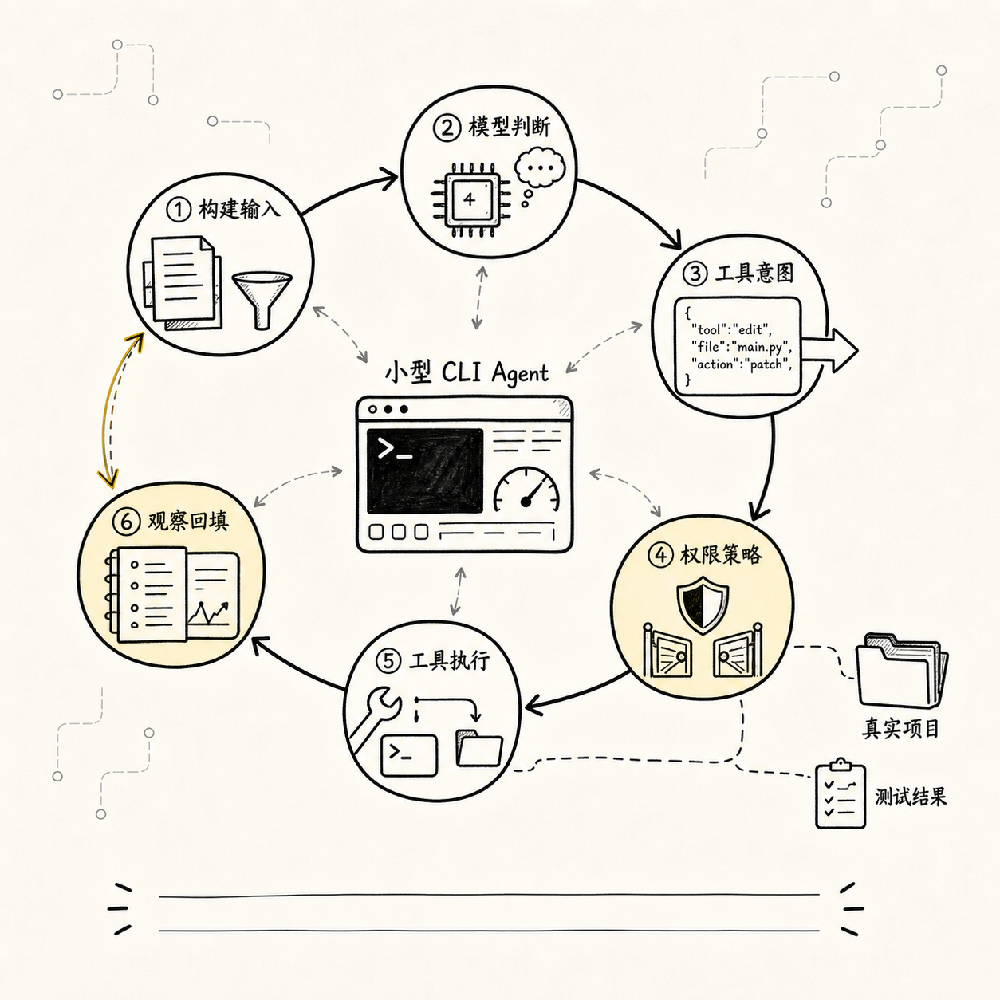
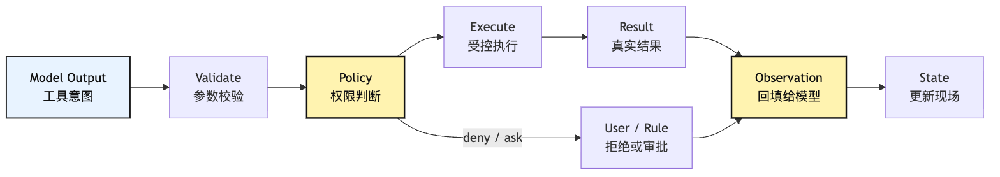
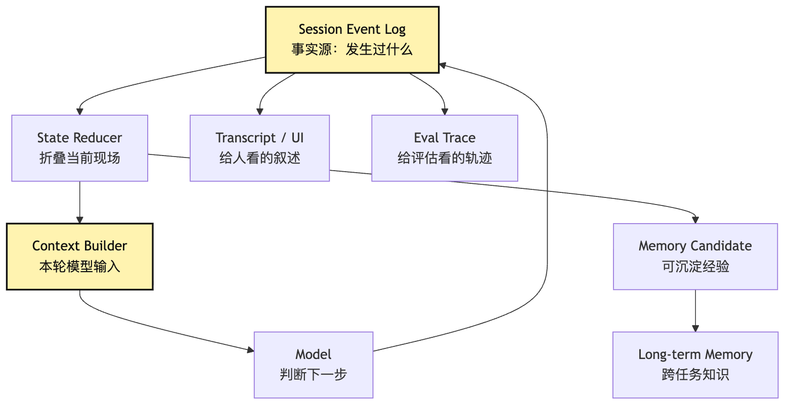
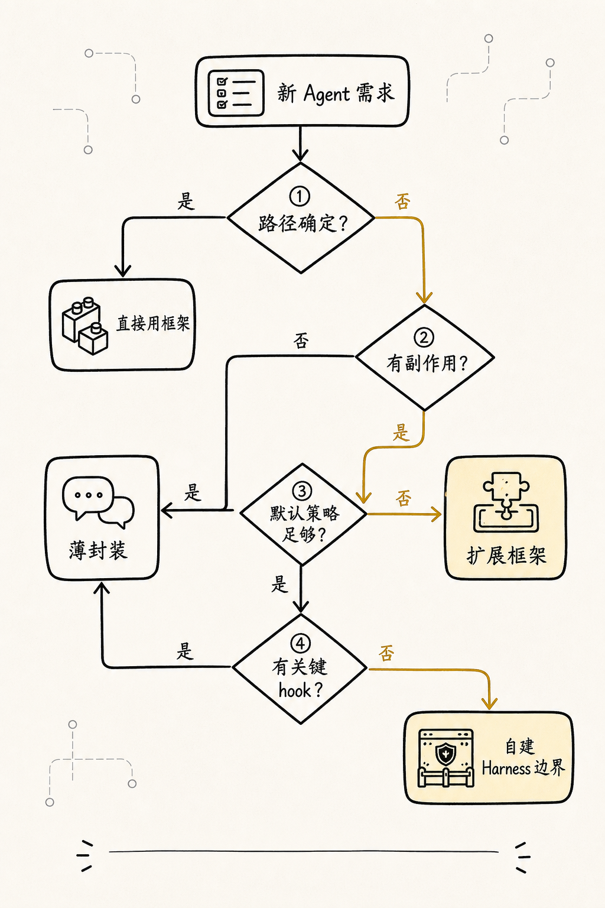
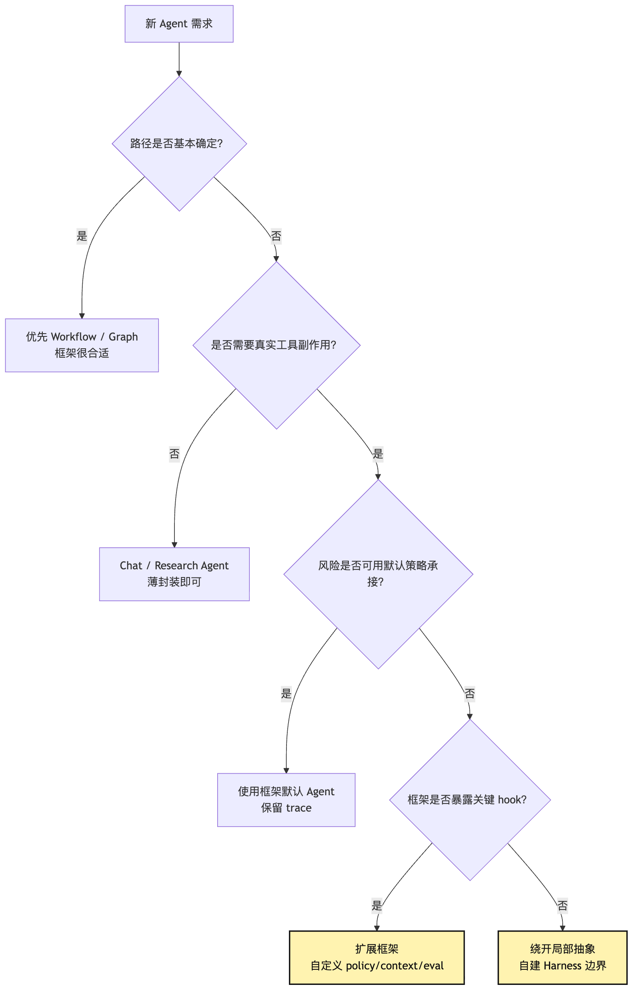

# 手写 Agent 的意义：理解框架抽象背后的最小机制

前面五篇，我们一直在做一件事：先把 Agent 从“神奇的模型能力”拉回到“可解释的运行系统”。

到现在，我们已经有了几条基本判断：

```text
Agent 不是一句更长的 Prompt。
Agent 至少由 Model、Loop、Tools、State 组成。
ChatBot、Workflow、Agent、Harness 不是能力等级，而是边界选择。
Harness 是模型外面的控制系统。
Agent 会沿着 Chat -> Tool -> Runtime -> Managed 的压力路径长出 Harness。
```

如果这几条都成立，下一步很自然的问题是：

**既然已经有 LangGraph、CrewAI、ADK、各种 Agent SDK，为什么还要手写一遍？**

这个问题非常现实。

如果目标只是快速做一个 demo，直接用框架当然更快。框架已经帮你准备了节点、边、工具绑定、记忆接口、状态图、多 Agent 编排、可视化 trace、部署入口。你不需要从一个 `while` 循环开始，不需要自己定义 `ToolIntent`，也不需要手写消息历史和工具结果回填。

所以这篇文章不是要劝你“不要用框架”。

恰恰相反，成熟项目最终往往应该用框架、平台或已有 runtime 去承接重复工程。问题在于：

```text
如果你没有手写过最小机制，
你就很难判断框架帮你省掉的是重复劳动，
还是替你隐藏了关键边界。
```

这就是手写 Agent 的真正意义。

它不是为了替代框架，也不是为了证明“从零造轮子更纯粹”。它是为了获得一种工程判断力：

```text
什么时候可以放心使用框架？
什么时候应该绕开框架的默认抽象？
什么时候应该在框架上扩展自己的 Harness 层？
什么时候问题根本不在框架，而在你没有建模底层机制？
```

我们继续使用同一个贯穿示例：

```text
帮我看看这个项目为什么测试失败，并把它修好。
```

这一次，我们不急着写完整代码，而是先回答一个更前置的问题：

> 为了看懂 Agent 框架，我们最少应该亲手实现哪些机制？

## 问题链


先把这篇的问题链固定住：

```text
直接用框架能快速开始
-> 但框架会把 loop、tool、state、context、permission 藏进抽象里
-> demo 顺利时，这些抽象很舒服
-> 一旦遇到工具失控、上下文爆炸、权限审批、评估回归
-> 你必须知道底层到底发生了什么
-> 手写最小 Agent 是为了看清这些抽象边界
-> 看清边界以后，才能判断什么时候用框架、绕开框架、扩展框架
```

这条链里最重要的是最后两句。

手写不是目标，判断力才是目标。

先用一张图把关系画出来：


框架最擅长的是把常见路径变短。

手写最小系统最擅长的是把隐藏边界显影。

这两个目标不冲突。真正危险的是把它们混成一句话：

```text
框架已经封装好了，所以我不需要理解底层。
```

这句话在普通 CRUD 框架里有时还能成立。你不懂数据库连接池内部细节，也能用 ORM 写出业务功能。但 Agent 系统里，底层机制会频繁冒到业务面前。因为模型输出不是确定程序，工具执行会改变外部世界，上下文每轮都在变，权限和评估又直接影响产品风险。

所以 Agent 框架不是魔法盒，也不是 Harness 的全部。

它更像一套帮你组织不确定性的工程语法。

语法可以帮你写得更快，但不能替你决定哪些不确定性应该交给模型，哪些应该收回到代码、策略、测试和 Harness。框架可能提供 Harness 的一部分能力，但不会自动替你完成边界选择。

## 一、直接用框架到底解决了什么

我们先公平一点。

框架之所以有价值，是因为 Agent 系统里确实有大量重复劳动。

如果你从零开始做一个 CLI Agent，哪怕只是最小版本，也会马上遇到这些工作：

```text
包装模型 API
维护 messages
实现 loop
定义工具 schema
解析 tool call
执行工具
把结果回填给模型
处理流式输出
处理错误重试
记录状态
限制最大轮次
在某些动作前请求用户确认
```

这些事情很琐碎。

框架能帮你省掉很多样板。

比如你想写一个最小“修测试”Agent，使用框架时可能会像这样思考：

```text
创建一个 Agent
注册 read_file / grep / bash / edit 工具
给它一个任务
让框架负责循环和工具调用
拿到最终回答
```

这很自然。

框架把你从很多底层细节里解放出来，让你先关注“任务能不能跑通”。对团队早期探索来说，这很重要。因为你不一定一开始就知道任务边界在哪里，也不一定知道用户到底要什么。

如果你做的是一次内部 demo：

```text
输入一个 issue
让 Agent 读几个文件
生成一个修复建议
```

框架可能非常合适。

如果你做的是固定的研究流水线：

```text
搜索资料
摘要
交叉检查
生成报告
```

框架也能省掉不少编排工作。

如果你做的是多步骤业务自动化：

```text
读取 CRM
生成邮件
等待审批
发送
记录日志
```

框架里的 graph、node、edge、tool、checkpoint 这些抽象也很有用。

所以问题不是“框架有没有价值”。

问题是：

**当框架让你快速跑起来以后，你是否还能看见它替你做了哪些决定？**

这些决定包括：

```text
模型每轮看见哪些 messages？
工具 schema 如何暴露给模型？
工具结果原样回填还是摘要回填？
工具失败算不算一次观察？
同一个工具能不能连续调用？
上下文超长时如何压缩？
final answer 的判断由谁负责？
权限是在调用前拦，还是执行时拦？
trace 能不能还原每一步？
评估失败时能不能归因？
```

如果你看不见这些决定，框架就从工具变成了黑盒。

黑盒在顺风路径上很舒服。

但 Agent 系统的问题，往往都发生在逆风路径。

## 二、顺风 demo 和真实任务之间隔着四个坑

我们继续用“修复测试失败”的 CLI Agent。

顺风 demo 通常长这样：

```text
用户：帮我修测试
Agent：读取 package.json
Agent：运行 npm test
Agent：读取失败文件
Agent：修改代码
Agent：重新运行测试
Agent：测试通过，完成
```

这个过程看起来很像一个可靠系统。

但真实项目里，第一次失败往往不是“模型不会写代码”，而是下面这些更工程化的问题。

### 1. 工具失控：模型把“能调用”理解成“应该调用”

一旦给模型很多工具，它会开始把工具当成行动空间。

这本身没错。Agent 的价值就在于模型可以根据现场选择工具。

问题是，工具空间如果没有边界，模型很容易产生几类失控行为：

```text
重复读取同一个文件
搜索范围过大
运行过重命令
在没有证据时直接编辑文件
把 bash 当成万能工具
绕过专用工具执行危险 shell
```

比如它为了找测试命令，连续做了这些事：

```text
read_file(package.json)
grep("test")
bash("find . -name package.json")
bash("cat package.json")
read_file(package.json)
```

从最终结果看，它可能还是找到了测试命令。

但从系统角度看，这条轨迹已经有味道了。

它说明 Agent 没有稳定记录“我已经读过什么”，或者上下文没有把这个事实投影给模型，也可能是工具菜单太宽，让模型把简单任务变成了探索性行动。

如果你只看最终回答，会觉得没问题。

如果你看 trace，会发现 Harness 正在漏。

### 2. 上下文爆炸：工具结果比推理更快填满窗口

修测试会产生大量上下文：

```text
项目结构
package.json
测试失败日志
相关源码
测试文件
历史修改 diff
重新运行测试的输出
错误堆栈
```

如果框架默认把每个 tool result 原样塞回 messages，短任务还能撑住，长任务很快就乱。

模型下一轮看到的是一大堆混杂材料：

```text
旧错误日志
新错误日志
被截断的搜索结果
已经无关的文件片段
模型自己上一轮的长解释
工具返回的重复内容
```

这时模型不是“不聪明”，而是现场被污染了。

它可能忘记当前真正要修的是哪个失败，也可能根据旧日志继续修改已经修过的问题。

上下文爆炸不是 token 问题那么简单。

它本质上是“现场管理”问题：

```text
哪些事实是当前任务仍然需要的？
哪些观察已经过期？
哪些结果应该压缩成状态？
哪些原始证据必须保留在 session log？
哪些内容只在用户界面展示，不该进入模型输入？
```

如果你没手写过最小 context builder，很容易把所有问题都归结成：

```text
模型上下文不够大。
```

但在 Agent 里，上下文越大不一定越好。

一个混乱的大上下文，往往比一个清楚的小上下文更危险。

### 3. 权限审批：多问用户不等于更安全

很多人第一次加权限，会把它做成一个弹窗：

```text
Agent 想执行 npm test，是否允许？
Agent 想读取 src/foo.ts，是否允许？
Agent 想编辑 src/foo.ts，是否允许？
Agent 想执行 npm test，是否允许？
```

这比完全不审批安全一些，但很快会变成另一种问题。

用户会疲劳。

用户一疲劳，就会一路点允许。

这时审批系统表面上存在，实际上失效。

更糟的是，如果系统没有区分风险等级，读文件、跑测试、写文件、删除文件、访问网络全都用同一种确认体验，用户也无法判断哪个动作真正危险。

所以权限系统不是“多弹窗”。

它至少要回答：

```text
这个动作属于只读、写入、执行、网络、凭证、删除中的哪一类？
是否在当前工作目录边界内？
是否已经被项目规则允许或拒绝？
是否需要用户确认？
确认应该展示什么证据？
用户拒绝后，模型下一轮应该看到什么观察？
```

如果框架给你的权限抽象只有一个 `confirmToolCall()`，你就必须知道什么时候它够用，什么时候需要扩展成自己的 policy layer。

这就是手写最小权限门的意义。

你不是为了以后永远自己写审批 UI。

你是为了知道审批在运行链路里应该挂在哪里。

### 4. 评估回归：最终答案对了，不代表 Harness 没坏

Agent 的评估最容易被做薄。

很多团队会先写一个测试：

```text
输入一个失败项目
期望最终输出包含“测试通过”
```

这当然有用，但远远不够。

因为同样的最终结果，可能有完全不同的过程：

```text
路径 A：读日志 -> 定位文件 -> 小改动 -> 跑测试 -> 通过
路径 B：全仓库搜索 -> 读取大量无关文件 -> 猜改 -> 测试碰巧通过
路径 C：跳过测试 -> 直接声称完成
路径 D：运行危险命令 -> 修改了不该改的文件 -> 结果也通过
```

如果评估只看最终回答，A、B、C、D 可能看起来差不多。

但从 Harness 角度看，只有 A 是健康轨迹。

所以成熟评估要看 trajectory：

```text
用了哪些工具？
工具顺序是否合理？
是否读取了必要证据？
是否越权？
是否有重复无效行动？
是否验证了结果？
失败时能不能归因到模型、工具、上下文、权限或环境？
```

框架可能提供 trace。

但 trace 是否能回答这些问题，取决于它记录的事件粒度。

如果你没亲手设计过一次事件流，很容易误以为“有日志”就等于“可评估”。

实际上不是。

日志是原材料，评估需要可归因的事件对象。

## 三、手写最小 Agent，不是手写完整框架



说到这里，很容易走向另一个极端：

```text
既然框架隐藏了边界，那我是不是应该从零实现一个完整 Agent 框架？
```

不用。

至少在学习阶段，手写最小 Agent 的目标不是完整性，而是显影。

你要手写的是那些一旦被隐藏、就会影响判断的最小机制。

对于“修复测试失败”的 CLI Agent，第一版最小系统可以非常小：

```text
一个模型调用接口
一个 while loop
一个工具注册表
三个工具：read_file、grep、run_command
一个 messages 列表
一个 event log
一个最大轮次
一个简单权限门
一个 final 判断
```

它甚至可以先不支持真实编辑。

先让 Agent 做到：

```text
读取 package.json
运行测试命令
读取失败日志提到的文件
给出修复建议
```

下一步再加入 `edit_file`。

再下一步才加入 diff、审批、重新测试、上下文压缩。

手写最小系统的价值在于：每加一层，你都能亲眼看到前一层为什么不够。

比如没有 event log 时，你会发现调试只能靠打印最终 messages。

加了 event log 后，你会自然区分：

```text
模型说了什么
工具实际执行了什么
工具返回了什么
下一轮模型看见了什么
```

没有工具 schema 时，你会发现模型的自然语言很难可靠解析。

加了 schema 后，你会自然理解：

```text
tool call 不是工具执行，只是工具意图。
```

没有权限门时，你会发现模型一旦可以跑 shell，就必须把所有风险压到 prompt 里。

加了权限门后，你会自然理解：

```text
安全不是模型自律，而是运行时约束。
```

没有 context builder 时，你会发现 messages 很快变成垃圾堆。

加了 context builder 后，你会自然理解：

```text
上下文不是历史记录，而是本轮投影。
```

这就是“手写”的边界。

不是为了把所有东西都写到生产级，而是为了亲自触摸几个承重点。

## 四、最小机制一：把模型输出当成意图，不当成动作

如果只能手写一个机制，我会先写这个：

```text
模型输出 tool intent，系统执行 tool action。
```

这是 Agent 工程的第一条分界线。

在最小 CLI Agent 里，模型可以输出：

```json
{
  "type": "tool_intent",
  "tool": "run_command",
  "args": {
    "cmd": "npm test"
  }
}
```

但这不代表 `npm test` 已经执行。

真正执行之前，系统至少要做：

```text
检查工具是否存在
校验 args 是否符合 schema
判断命令是否允许
决定工作目录和超时
执行命令
记录 stdout / stderr / exit code
把结果整理成 observation
```

这条链路可以画成：



这张图一旦进入你的脑子，你看框架就会完全不同。

你会开始问：

```text
框架里的 tool call 对象在哪里？
validation 是框架做，还是我做？
permission hook 在执行前还是执行后？
tool result 的原始值和给模型的 observation 是否分开？
失败结果会不会进入状态？
```

这些问题决定了系统能不能安全进入真实项目。

一个最小类型设计可以长这样：

```ts
type ToolIntent = {
  type: "tool_intent";
  id: string;
  tool: string;
  args: unknown;
};

type PolicyDecision =
  | { type: "allow"; reason: string }
  | { type: "ask"; prompt: string }
  | { type: "deny"; reason: string };

type Observation = {
  intentId: string;
  ok: boolean;
  summary: string;
  data?: unknown;
  truncated?: boolean;
};
```

注意这里没有把模型输出、权限决定、工具结果混在一个对象里。

这不是类型洁癖。

这是为了让失败能归因。

如果 `npm test` 没有执行，原因可能是：

```text
模型没有提出测试意图
模型提出了错误命令
参数校验失败
权限拒绝
命令超时
测试自身失败
结果被截断导致模型误判
```

这些失败对应完全不同的修复方向。

对象拆开，归因才有地方落。

## 五、最小机制二：Loop 不是 while true，而是状态机

很多教程会把 Agent Loop 写成：

```ts
while (true) {
  const response = await model(messages);
  if (response.final) break;
  const result = await runTool(response.tool);
  messages.push(result);
}
```

这段代码能表达核心直觉，但不能表达真实边界。

一个能修测试的 CLI Agent，loop 至少要知道：

```text
当前第几轮
是否已经中断
预算还剩多少
上一轮用了什么工具
是否重复失败
是否需要压缩上下文
是否已经有验证证据
```

否则它很容易在失败路径里打转。

比如测试一直失败，模型每轮都说：

```text
我再运行一次 npm test 看看。
```

没有 loop state，系统只能照做。

有了 loop state，系统可以发现：

```text
同一命令连续失败 3 次
中间没有代码变更
下一轮不应该继续跑同一命令
应该把这个观察反馈给模型
```

所以最小 loop 不应该只是循环结构，而应该是状态转移：


这张图里的每个节点都可以先写得很简单。

第一版 `CheckBudget` 可以只是最大轮次。

第一版 `Compact` 可以先不做，只记录“需要压缩但未实现”。

第一版 `Permission` 可以只区分 `read_file` 允许、`run_command` 询问、`edit_file` 禁止。

重点不是一次写完。

重点是从第一天开始承认这些状态存在。

当你用框架时也一样。

你不一定要自己管理所有状态，但你要知道框架的状态机在哪里，以及你能不能在关键节点挂钩。

如果框架只暴露“运行 Agent，拿结果”的接口，却不让你观察 loop 内部，那么它可能适合 demo，但不适合承担高风险工程任务。

## 六、最小机制三：Tools 不是函数列表，而是协议边界

在最小 Agent demo 里，工具通常写成这样：

```ts
const tools = {
  read_file: async ({ path }) => fs.readFile(path, "utf8"),
  run_command: async ({ cmd }) => exec(cmd),
};
```

这当然可以跑。

但它把工具最重要的部分省略了。

工具不只是函数。工具是模型行动进入真实世界之前的协议边界。

一个工具至少要说明：

```text
name：模型如何引用它
description：模型什么时候应该用它
schema：参数结构是什么
risk：只读、写入、执行、网络、删除
visibility：本轮模型能不能看到它
permission：调用前是否需要审批
execute：如何执行
serialize：如何把结果转成 observation
```

如果这些东西没有显式出现，它们不会消失，只会散落到 prompt、业务代码和框架默认值里。

比如 `run_command`。

如果它只是一个函数，模型可能把所有事情都交给它：

```text
cat package.json
grep -R "foo" .
python - <<EOF ...
sed -i ...
rm ...
curl ...
```

系统很难知道每次 shell 的语义。

但如果你同时提供专用工具：

```text
read_file
search_text
run_test
edit_file
```

再限制 `run_command` 的可见性和权限，那么模型会被引导进更可控的行动空间。

这就是工具设计的关键：

```text
工具菜单不是越强越好，而是越贴近任务语义越好。
```

在“修测试”的任务里，`run_test` 往往比万能 `bash` 更值得优先暴露。

因为 `run_test` 可以天然记录：

```text
测试命令
退出码
失败测试名
日志截断状态
运行耗时
是否产生验证证据
```

而 `bash("npm test")` 只是一段命令和一堆 stdout。

两者都能执行测试。

但前者更容易进入 Harness。

这就是框架抽象里经常被忽略的点：工具不是“能力越多越好”，工具是“语义边界越清楚越好”。

## 七、最小机制四：State、Context、Memory、Session 不要混成 messages

手写 Agent 时，最容易偷懒的地方是 messages。

一开始你会把所有东西都塞进去：

```text
用户输入
模型回答
工具调用
工具结果
错误
文件内容
测试日志
压缩摘要
计划
```

这很方便。

但很快你会发现，messages 同时承担了太多职责：

```text
它是给模型看的上下文
它是调试日志
它是事件事实源
它是状态存储
它是 UI transcript
它是评估输入
```

这会出问题。

因为这些东西的要求不一样。

```text
Session log 要尽量忠实记录发生过什么。
State 要表示当前任务现场。
Context 要选择本轮模型该看什么。
Memory 要跨任务保存可复用经验。
UI transcript 要方便人阅读。
Eval trace 要方便机器归因。
```

如果全都塞进 messages，你会面临一个无法同时满足的目标：

```text
既要完整，又要短。
既要给人看，又要给模型看。
既要保留原始证据，又要压缩摘要。
既要能恢复，又要能随时裁剪。
```

更稳的拆法是：



第一版可以不用这么完整。

但你至少应该在心里分清：

```text
messages 不是事实源。
messages 是本轮给模型看的投影。
```

举个例子。

工具执行 `npm test` 后返回 2000 行日志。

Session event log 可以记录原始输出文件路径、退出码、截断策略、摘要、耗时。

State 可以记录：

```text
当前测试失败
失败测试名是 should parse empty input
错误是 expected [] to equal null
相关文件可能是 parser.ts
```

Context builder 可以只给模型：

```text
测试命令失败，失败用例为 should parse empty input。
关键错误：expected [] to equal null。
完整日志已保存，当前只展示相关片段。
```

UI 可以展示更友好的折叠日志。

Eval trace 可以记录这次验证失败属于“测试执行成功但断言失败”。

同一个工具结果，在不同层有不同形态。

如果你手写过这一次，后面看任何框架的 memory / state / checkpoint / context API，都会知道该问什么。

你不会再被一个统一的 `messages` 参数骗过去。

## 八、最小机制五：评估不是最终答案，而是失败归因

手写 Agent 的最后一个必要机制，是最小评估。

这里的评估不是复杂 benchmark。

第一版只需要能回答：

```text
这个 Agent 为什么失败？
```

比如我们准备三个本地小项目：

```text
case-1：测试命令缺依赖，Agent 应该先报告环境问题。
case-2：一个明确断言失败，Agent 应该读源码并提出小修改。
case-3：测试日志很长，Agent 应该截断并保留关键错误。
```

然后记录每次运行轨迹。

你不只看最终回答，还看这些事实：

```text
是否运行了测试？
是否读取了 package.json？
是否读取了失败日志指向的文件？
是否在修改前取得足够证据？
是否在修改后重新验证？
是否重复执行无意义命令？
是否越权访问了不相关目录？
```

这类评估会逼你把 trace 设计清楚。

因为如果 trace 里没有 `ToolStarted`、`ToolFinished`、`PolicyDecision`、`Observation`、`VerificationEvidence`，你就没法回答这些问题。

所以最小 eval 不是额外工作。

它会反过来塑造你的 Harness。

可以把它理解成一个闭环：


这张图也解释了为什么“固定模型，只改 Harness”有时能显著提高 Agent 表现。

因为很多失败不是模型能力问题，而是系统把现场给错了、工具边界太宽、结果回填太乱、验证门太薄。

如果没有 trace 和归因，你会下意识地换模型。

如果有 trace 和归因，你可能会发现真正该改的是：

```text
run_command 输出截断策略
read_file 缓存投影
重复工具调用 guardrail
edit_file 前的 diff 审批
final answer 前的 verification gate
```

这就是手写最小 eval 的价值。

它让你不再把所有问题都甩给模型。

## 九、看框架时，应该看它抽象了什么、暴露了什么

有了这些最小机制，再回头看框架，你会更冷静。

你不会只问：

```text
这个框架支不支持 tool calling？
这个框架支不支持 memory？
这个框架支不支持 multi-agent？
```

你会问更细的问题：

```text
它的 loop 是谁控制的？
我能不能介入每轮 model input？
tool intent 和 execution result 是否分开？
工具可见性和执行权限是否分开？
上下文压缩在什么时候发生？
checkpoint 存的是 messages，还是事件日志？
trace 能否支持 trajectory 级评估？
human approval 是一个回调，还是完整 policy layer？
sub-agent 是否继承权限和预算？
```

这些问题才决定框架能不能承接真实任务。

比如一个 graph 框架很适合表达确定流程：

```text
run tests -> if fail -> inspect -> patch -> verify
```

但如果每个节点内部又是一个自由 Agent，你仍然要管理工具权限、上下文回填和停止条件。

再比如一个 multi-agent 框架很容易创建多个角色：

```text
planner
coder
reviewer
tester
```

但如果没有 session log、artifact、权限继承、返回格式和失败归因，多 Agent 只是把不确定性分散到了更多地方。

再比如一个 memory 框架提供了长期记忆接口。

但你仍然要问：

```text
什么内容可以写入 memory？
谁批准写入？
记忆有没有来源和置信度？
记忆过期和冲突怎么处理？
敏感信息会不会被保存？
```

这些都不是“框架有没有某个功能”能回答的。

它们是 Harness 问题。

框架可以帮你提供挂钩，但不能替你做工程判断。

## 十、什么时候用框架、绕开框架、扩展框架



现在可以回到开头的问题。

既然我们不反对框架，也不神化手写，那么应该怎么取舍？

可以用一个简单决策表。



可以更直白一点。

### 适合直接用框架的场景

如果任务符合这些条件，直接用框架通常很合理：

```text
流程边界清楚
工具风险低
状态生命周期短
失败成本可接受
上下文规模不大
不需要复杂权限
评估只需看最终产物
```

比如内部知识问答、轻量研究摘要、固定流程报告生成、低风险数据整理。

这时手写底层机制可能只是拖慢速度。

### 适合扩展框架的场景

如果任务开始接触真实工程环境，但框架暴露了足够 hook，可以在框架上扩展：

```text
自定义 tool permission
自定义 context projection
自定义 trace event
自定义 checkpoint
自定义 evaluation
自定义 human approval
```

比如团队内部代码助手、受限仓库修复、小规模自动化开发任务。

这时框架负责常见编排，你负责 Harness 关键边界。

### 适合绕开局部抽象的场景

如果任务高风险、长周期、强审计，且框架默认抽象挡住了关键控制点，就应该绕开局部抽象。

注意是“局部绕开”，不是“全盘重写”。

比如：

```text
框架的 tool result 回填不可控，你可以自建 tool runtime。
框架的 memory 写入太宽，你可以禁用默认 memory。
框架的 checkpoint 只保存 messages，你可以自建 session event log。
框架的 approval 太薄，你可以在外层加 policy harness。
```

这时框架仍然可以用于模型适配、graph 编排、UI 或部署。

但核心安全边界和事实源要掌握在自己手里。

### 适合完全手写最小系统的场景

学习阶段、架构验证阶段、框架选型阶段，很适合手写最小系统。

因为你真正要产出的不是一个生产框架，而是一张判断地图：

```text
这个任务最需要控制哪几个点？
框架默认抽象是否覆盖这些点？
哪些地方必须有自己的协议？
哪些地方可以交给框架？
```

这也是本教程从第 7 篇开始要做的事。

我们会先写一个最小 CLI Agent，不是因为它比框架强，而是因为它足够小，小到每个承重点都能被看见。

## 十一、一个最小手写路线图

为了避免“手写 Agent”听起来太大，我们把路线压成几个很小的递进。

### 第一步：Provider 只是模型适配层

先接一次真实模型调用。

目标不是做 Agent，而是把模型供应商细节关进 provider：

```text
input: messages
output: model event
```

先不要让 provider 执行工具。

provider 只负责把外部 API 适配成统一事件。

### 第二步：Loop 只处理 final 和 tool intent

再加一个最小 loop：

```text
构建输入
调用模型
如果 final，结束
如果 tool intent，交给 runtime
记录 observation
继续下一轮
```

第一版不追求聪明。

它只要证明“模型判断 -> 系统执行 -> 观察回填 -> 继续判断”能闭环。

### 第三步：Tool Runtime 只接三个工具

先只接：

```text
read_file
search_text
run_test
```

故意不要一开始给万能 shell。

这会逼你设计更语义化的工具协议。

### 第四步：State 先从 event log 折叠出来

每一步都写事件：

```text
UserMessage
ModelEvent
ToolIntent
PolicyDecision
ToolResult
Observation
VerificationEvidence
```

然后从事件折叠出当前状态。

第一版 reducer 可以很朴素，只记录已读文件、最近失败、最后验证结果。

但这个结构会让你后面自然走向 replay 和 eval。

### 第五步：Context Builder 不等于 messages

每轮调用模型前，显式构建输入：

```text
系统规则
用户目标
当前状态摘要
最近观察
可用工具
必要证据片段
```

不要默认把全量日志塞进去。

这一步会让你真正理解 Context Engineering。

### 第六步：Permission 先做三档

第一版只要：

```text
read：允许
run_test：询问
edit：禁止或询问
```

再加工作目录边界。

这已经足够让你看见权限系统应该挂在哪里。

### 第七步：Verification Gate 禁止模型空口宣布完成

最后加一条规则：

```text
没有验证证据，不能宣称“修复完成”。
```

对于“修测试”任务，验证证据可以是：

```text
测试命令退出码为 0
或用户明确接受了未验证结果
```

这条规则会让 Agent 从“会写总结”变成“尊重现实证据”。

## 十二、手写之后，再用框架会更稳

真正手写过这些机制以后，你再用框架，心态会变。

你不会把框架当成自动驾驶。

你会把它当成一组可以组合的工程部件。

你会知道哪些地方可以放心交出去：

```text
模型 API 适配
节点编排
工具 schema 生成
流式输出
基础 checkpoint
可视化 trace
部署 worker
```

也会知道哪些地方必须自己盯住：

```text
工具风险分类
权限策略
上下文投影
原始事件日志
评估归因
最终验证门
长期记忆治理
```

这就是“理解框架抽象背后的最小机制”的意思。

你不是为了以后永远不用框架。

你是为了在用框架时，不把系统命运交给看不见的默认值。

Agent 工程里，默认值很重要。

但真实任务一旦变长、变贵、变危险，默认值就必须被显式审查。

手写最小系统，就是一次把默认值拆开看的过程。

## 十三、这篇先留下的工程边界

最后把这篇压成几句话。

第一，框架解决的是常见路径的效率问题。

第二，手写解决的是隐藏边界的理解问题。

第三，真实 Agent 失败经常不是模型不会推理，而是工具、上下文、权限、状态、验证、评估这些外部机制没有建模清楚。

第四，手写最小 Agent 不是为了替代框架，而是为了知道：

```text
框架抽象到哪里为止？
我的 Harness 应该从哪里开始？
```

下一篇我们会正式进入代码侧的第一步：

```text
LLM Provider 接入：让 CLI 完成第一次模型调用
```

那一篇会故意只做一件小事：把真实模型接进 CLI。

我们不会一上来就做工具和 loop。

因为 Provider 的第一条边界就是：

```text
它只负责模型调用，不负责执行工具，不负责管理任务世界。
```

一句话记住这篇：

> 手写 Agent 不是为了不用框架，而是为了看懂框架把哪些工程责任藏起来了。

---

GitHub 地址: [00-06-handwrite-agent-meaning.md](https://github.com/LienJack/build-harness/blob/main/docs/zh/00-06-handwrite-agent-meaning.md)
