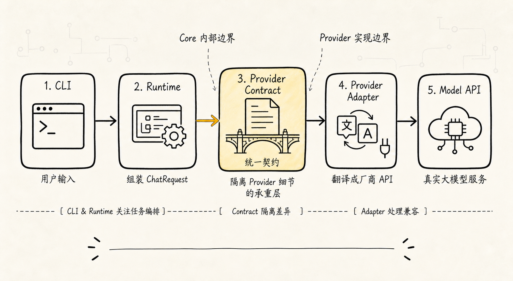
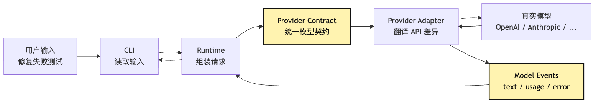
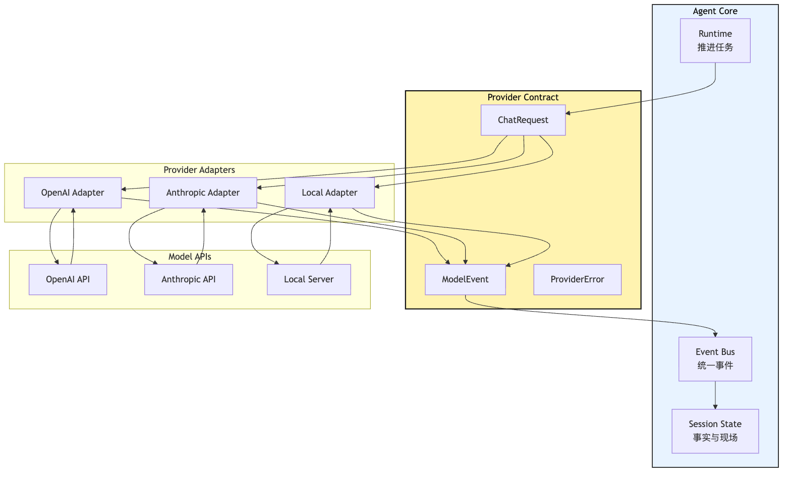
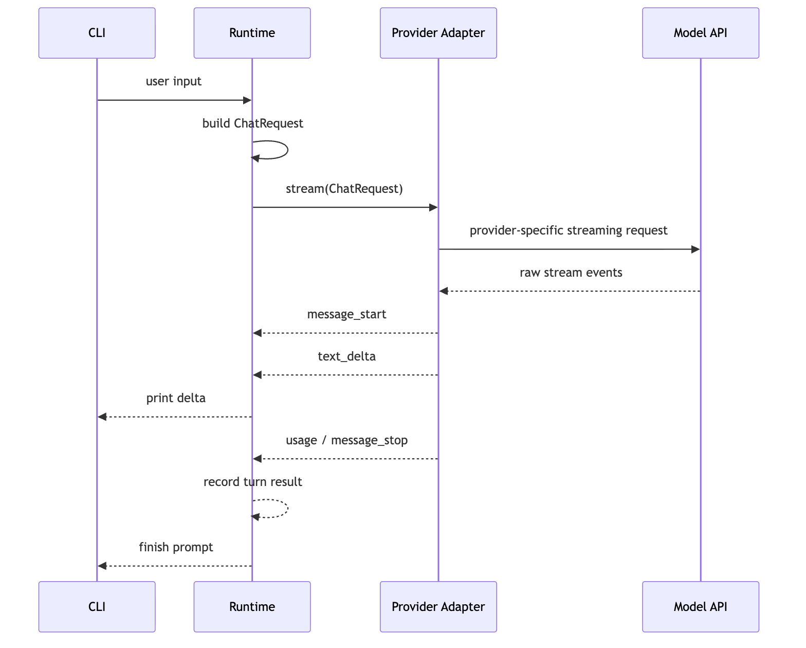
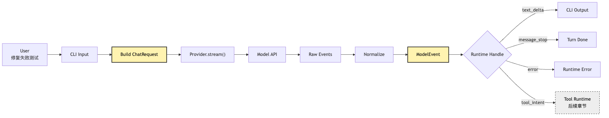

# LLM Provider 接入：让 CLI 完成第一次模型调用

前面几篇一直在讲 Agent 和 Harness 的边界。

现在我们终于要写第一段真正会动的代码了：让一个小型 CLI 调到真实大模型。

这一步看起来太简单了。

很多人第一反应是：

```text
npm install openai
写一个 client.responses.create()
把用户输入发过去
把 text 打印出来
```

如果只是做一个 demo，这当然最快。

用户在终端里输入：

```text
帮我看看这个项目为什么测试失败，并把它修好。
```

程序把这句话发给模型，模型输出一段分析。第一轮跑通以后，我们会很有成就感：CLI 有了，模型有了，终端开始吐字了。

但这里藏着整套 Agent Harness 的第一条架构分叉。

我们到底是在写一个“调用某家 API 的脚本”，还是在写一个“未来可以长出 Agent Loop、Tool Runtime、Context、Session、Permission、Eval 的系统”？

这两个东西在第一天长得几乎一样。

差别只在一条边界：

**provider 是模型能力适配层，不是 Agent core。**

如果这条边界没画出来，后面所有复杂度都会倒灌进 core：

```text
OpenAI 的 messages 格式
Anthropic 的 content block
某家 provider 的 streaming event
另一家 provider 的 tool call delta
HTTP 429、529、timeout、quota exceeded
SDK 抛出的专有异常类
模型名称、baseURL、header、api version
```

这些东西都会一点点钻进 Agent Loop。

到那时，core 不再是“推进任务的运行时”，而是变成一团 provider if-else。

所以这一篇要回答的问题不是：

> 如何调用某个具体模型 API？

而是：

> 如何把真实大模型接入最小 CLI，同时不让 provider 细节污染后续 Agent 架构？

我们继续沿用同一个例子：一个小型 CLI Agent，最终目标是帮用户修复测试失败。

但这一篇先不让它读文件，不让它执行命令，也不让它真的修代码。

第一版只做三件事：

```text
chat：把用户输入发给模型，拿到完整回答
stream：把模型输出按事件流打印到终端
error mapping：把 provider 私有错误映射成 runtime 能理解的错误
```

这已经足够重要。

因为 Agent 后面所有能力，都要从“这一轮模型调用到底发生了什么”开始。

## 问题链



这篇文章不比较具体供应商能力，也不追逐某个 API 的最新命名；实际代码里的接口字段需要以实现时的官方文档为准。这里先固定系统边界。

这篇文章的问题链是：

```text
直接调用某家 API 最快
-> 但不同 provider 的 messages、streaming、error、tool call 格式都不同
-> 如果把这些差异写进 core，Agent Loop 会被 provider 细节污染
-> 所以先定义统一 provider contract
-> provider adapter 负责把统一请求翻译成某家 API
-> 再把某家 API 的响应翻译回统一 model events
-> 第一版只交付 chat、stream、error mapping
-> tool intent 和 event contract 只预留扩展位置，不在 provider 里执行工具
```

画成图是这样：



这张图里最重要的不是“多包了一层 adapter”。

最重要的是两次翻译：

```text
统一请求 -> provider 私有 API
provider 私有响应 -> 统一 model events
```

只要这两次翻译稳定，后面的 Agent Loop 就不需要知道底层调用的是哪家模型。

它只需要知道：

```text
这轮模型开始了。
模型输出了一段文本。
模型结束了。
模型发生了可重试错误。
模型发生了认证错误。
模型将来可能提出一个 tool intent。
```

这就是 provider contract 的价值。

它不是为了炫耀抽象能力。

它是为了让后面的系统不用背着 API 细节跑步。

## 一、第一次模型调用，为什么不要直接写进 core？

先从最容易写出的版本开始。

假设我们想做一个 CLI。

最直接的伪代码是：

```ts
const input = await readLine("> ")

const response = await openai.responses.create({
  model: "some-model",
  input: [
    { role: "user", content: input }
  ]
})

console.log(response.output_text)
```

这段代码没问题。

它甚至应该作为第一个手感验证：API key 是否可用，网络是否通，模型是否能回答，终端输出是否正常。

但它不能成为 core 的形状。

为什么？

因为 core 以后要回答的问题不是“怎么调 OpenAI”，而是：

```text
这一轮用户目标是什么？
当前 session 里已经发生了什么？
本轮允许模型看到哪些上下文？
模型输出的每个事件如何进入事件日志？
如果 streaming 中断，状态怎么收尾？
如果 provider 报错，runtime 应该重试、降级、还是让用户处理配置？
如果模型提出工具调用，谁来校验、审批、执行、回填？
```

这些问题都和具体 provider 无关。

它们属于 Agent Runtime。

如果我们把 provider SDK 调用写在 core 里，core 很快会开始长这样：

```ts
if (provider === "openai") {
  // OpenAI message format
  // OpenAI stream event format
  // OpenAI error classes
} else if (provider === "anthropic") {
  // Anthropic content blocks
  // Anthropic stream events
  // Anthropic error types
} else if (provider === "local") {
  // local server schema
}
```

一开始只是三五行。

等到你加入 streaming、重试、usage 统计、function calling、reasoning blocks、response id、rate limit header、model fallback，core 就会变成一个“provider 细节博物馆”。

这不是抽象洁癖。

这是后续扩展会不会崩的问题。

小型 CLI Agent 最终要做的是修复测试失败。

它会经历这些阶段：

```text
第一次模型调用
-> 多轮 Agent Loop
-> 工具意图
-> 文件读取
-> 命令执行
-> 错误观察回填
-> 上下文压缩
-> session replay
-> permission
-> eval
```

如果第一步就让 provider 穿透 core，后面每一步都会被拖住。

所以第一版代码要有一个很朴素的纪律：

```text
core 只认识本项目自己的模型契约。
provider adapter 才认识某家 API。
```

## 二、Provider 不是 Model，也不是 Agent Core

很多命名会把人带偏。

我们常说“接入模型”，于是代码里可能出现一个 `Model` 类。

但在 Agent 系统里，最好先把三个概念拆开：

```text
Model：远端或本地的推理能力
Provider：访问某类模型能力的适配层
Agent Core：围绕模型事件推进任务的运行时
```

`Model` 是能力来源。

它可以是 OpenAI、Anthropic、Google、DeepSeek、Ollama、本地 vLLM，也可以是某个公司内部模型网关。

`Provider` 是访问这个能力的工程接口。

它知道 base URL、header、SDK、请求格式、stream event、错误格式、模型名称映射。

`Agent Core` 是任务推进系统。

它知道 messages、session、context、loop、tool intent、tool execution、permissions、events、budget。

这三者的边界不能混。

可以画成一个分层图：



这张图想表达一个非常硬的边界：

```text
Adapter 可以依赖 provider API。
Core 只能依赖 provider contract。
```

这意味着 core 不能直接判断：

```text
如果 Anthropic 返回 content_block_delta...
如果 OpenAI 返回 response.output_text.delta...
如果某 SDK 抛 RateLimitError...
```

core 应该判断的是：

```text
如果收到 text_delta，追加到 CLI 输出。
如果收到 message_stop，结束本轮。
如果收到 transient_error，按 runtime 策略重试。
如果收到 auth_error，提示用户检查配置。
如果收到 tool_intent，将来交给 Tool Runtime。
```

换句话说，provider contract 不是“多写一层接口”。

它是把后续所有 runtime 判断从 provider 细节里解耦出来。

## 三、最小 Provider Contract 应该长什么样？

第一版不要贪。

我们还没有 Agent Loop，还没有工具系统，还没有上下文压缩。

所以 provider contract 只需要承载一次模型调用的最小事实：

```text
输入：本轮 messages、模型参数、abort signal、trace metadata
输出：模型事件流
错误：统一错误类型
```

可以先写成这样的接口草图：

```ts
type Role = "system" | "user" | "assistant"

interface ChatMessage {
  role: Role
  content: string
}

interface ChatRequest {
  model: string
  messages: ChatMessage[]
  temperature?: number
  maxOutputTokens?: number
  abortSignal?: AbortSignal
  metadata?: {
    sessionId?: string
    turnId?: string
  }
}

type ModelEvent =
  | { type: "message_start"; provider: string; model: string }
  | { type: "text_delta"; text: string }
  | { type: "message_stop"; usage?: TokenUsage; stopReason?: string }
  | { type: "tool_intent"; name: string; argumentsText: string; id?: string }
  | { type: "error"; error: ProviderError }

interface TokenUsage {
  inputTokens?: number
  outputTokens?: number
  totalTokens?: number
}

interface ProviderError {
  kind:
    | "auth"
    | "permission"
    | "rate_limit"
    | "quota"
    | "invalid_request"
    | "context_length"
    | "timeout"
    | "network"
    | "overloaded"
    | "server"
    | "unknown"
  retryable: boolean
  message: string
  provider: string
  requestId?: string
  statusCode?: number
  cause?: unknown
}

interface LlmProvider {
  name: string
  chat(request: ChatRequest): Promise<ChatResult>
  stream(request: ChatRequest): AsyncIterable<ModelEvent>
}

interface ChatResult {
  text: string
  usage?: TokenUsage
  stopReason?: string
  raw?: unknown
}
```

这段接口不是最终答案。

它只是一个起点。

但它里面有几个重要选择。

第一，`messages` 是我们自己的消息格式。

不是 OpenAI 的 `input`，也不是 Anthropic 的 `messages + system`，也不是某家本地服务的 `prompt` 字符串。

Provider adapter 负责翻译。

第二，`stream()` 返回的是 `ModelEvent`。

CLI 不应该直接解析 SSE。

Runtime 也不应该直接拿 provider 的原始 stream chunk 做判断。

第三，`tool_intent` 被放进事件类型，但第一版不执行工具。

这是一个扩展位。

因为后面模型可能输出 function call / tool use / structured action，但 provider 的职责只到“把模型提出的意图翻译成统一事件”。

执行工具是 Tool Runtime 的事。

第四，错误不直接抛给上层。

或者说，adapter 可以内部捕获 SDK / HTTP / SSE 错误，再映射成 `ProviderError`。

Runtime 关心的不是某 SDK 类名，而是：

```text
这是认证错误吗？
这是权限错误吗？
这是限流吗？
这是上下文太长吗？
这是可重试的瞬态错误吗？
```

这才是 runtime 能做决策的信息。

## 四、Messages：为什么统一消息格式不能直接照搬某家 API？

第一次调用最容易踩的坑，是把某家 provider 的 messages 格式当成系统内部格式。

比如某些 API 使用：

```json
[
  { "role": "system", "content": "..." },
  { "role": "user", "content": "..." }
]
```

另一些 API 会把 system 指令放到单独字段。

还有一些 API 的 `content` 不是字符串，而是 content blocks：

```json
[
  { "type": "text", "text": "..." },
  { "type": "image", "source": "..." }
]
```

这只是最表层的差异。

一旦进入 Agent 场景，messages 还会承载更多东西：

```text
assistant 的自然语言回复
assistant 的 tool intent
tool result / observation
压缩摘要
系统事件摘要
用户中断说明
恢复后的 continuation message
```

如果内部消息格式跟某家 provider 绑定，后面会有两个问题。

第一，换 provider 会很痛。

不是换一个 adapter，而是整个 runtime 都要理解另一套消息结构。

第二，系统事实会被 provider 表达方式绑架。

比如某家 provider 的 tool call 被表示为 assistant message 中的某个 content block。

这并不意味着你的系统内部也必须把 tool intent 当成“assistant content 的一个 block”。

在 Harness 里，tool intent 更适合被当成一个事件：

```text
model emitted tool intent
runtime validated intent
permission approved or denied
tool executed
observation appended
```

这条链路以后要被 trace、replay、audit、eval 使用。

它不能只是一坨 provider raw JSON。

所以第一版内部 messages 应该保持朴素。

对于一个还没接工具的 CLI，够用的结构只有：

```ts
interface ChatMessage {
  role: "system" | "user" | "assistant"
  content: string
}
```

后面要扩展时，再引入自己的 content part：

```ts
type MessagePart =
  | { type: "text"; text: string }
  | { type: "tool_intent"; intentId: string; name: string; arguments: unknown }
  | { type: "tool_result"; intentId: string; content: string; isError?: boolean }
```

但这一步先不急。

第一篇实战文章只要守住一个原则：

```text
内部消息格式是 runtime 的事实表达。
provider 消息格式只是 adapter 的传输表达。
```

## 五、Streaming：终端要的是流式体验，Runtime 要的是事件流


CLI 第一次调用模型时，很快会遇到第二个问题：要不要 stream？

如果不 stream，代码最简单。

用户输入一句话，终端卡住几秒或几十秒，然后一次性打印完整答案。

对于短问答，这可以接受。

但对于我们的例子：

```text
帮我看看这个项目为什么测试失败，并把它修好。
```

即使这一篇还没有工具，模型也可能输出较长分析。

终端如果一直没有反馈，用户会怀疑程序卡住了。

所以 CLI 需要流式输出。

但这里又有一个容易写歪的地方：

```text
streaming 不是把 provider 的原始事件直接 print。
streaming 是 provider adapter 把原始事件翻译成 runtime event，再由 CLI 决定怎么显示。
```

不同 provider 的 streaming 差异很大。

有的流式事件是文本 delta。

有的会先发 message start，再发 content block start、content block delta、content block stop、message stop。

有的工具调用参数会以 JSON 字符串碎片形式流出来。

有的 stream 里会混入 ping。

有的错误会作为 stream event 出现，而不是普通 HTTP response。

如果 CLI 直接吃这些原始事件，系统会立刻失去抽象边界。

更好的链路是：



这张图里最重要的是 `Runtime-->>CLI: print delta`。

CLI 负责展示。

Provider 负责翻译。

Runtime 负责记录和决策。

这三个职责不要混。

流式输出不是 UI 小优化。

它会影响后面整套系统的事件设计。

因为一旦 Agent 可以调用工具，stream 里不只会有文字，还可能出现：

```text
模型开始生成
模型输出可见文本
模型提出工具意图
工具参数还在增量生成
模型停止
provider 返回 usage
provider 连接中断
```

如果第一版就把 stream 设计成统一 `ModelEvent`，后面加工具会顺很多。

如果第一版只是 `process.stdout.write(rawChunk)`，后面就要大改。

## 六、Error Mapping：错误不是字符串，是 Runtime 决策输入


第一次模型调用失败时，最常见的写法是：

```ts
try {
  await provider.chat(request)
} catch (error) {
  console.error(error)
}
```

这对调试有用，但对 Agent Runtime 不够。

因为 runtime 看到一段错误字符串时，没法做决策。

它不知道：

```text
这是 API key 配错，应该让用户修配置？
这是权限不足，应该停止？
这是 429，应该退避重试？
这是 quota 用完，重试也没用？
这是请求太长，应该触发压缩？
这是网络超时，应该重试？
这是 provider overloaded，应该稍后再试或切换 provider？
```

这些判断必须被结构化。

错误映射不是为了把错误“包装得好看”。

它是 Runtime Guardrails 的第一块砖。

可以先定义一个很小的错误分类：

```text
auth：认证失败，通常不可重试，提示用户检查 key
permission：账号或模型权限不足，通常不可重试
rate_limit：请求过快，可退避重试
quota：余额或额度耗尽，不应盲目重试
invalid_request：请求格式错误，是代码或上下文组装问题
context_length：上下文太长，后面应触发 compaction
timeout / network：网络瞬态问题，可重试
overloaded / server：provider 侧压力或服务错误，可重试或 fallback
unknown：保守处理，记录 raw cause
```

映射以后，runtime 可以写出更清楚的策略：

```ts
function decideProviderFailure(error: ProviderError): RuntimeDecision {
  if (error.kind === "auth" || error.kind === "permission") {
    return { action: "stop", userMessage: "请检查模型凭证或模型权限。" }
  }

  if (error.kind === "quota") {
    return { action: "stop", userMessage: "模型额度不足，重试不会解决。" }
  }

  if (error.kind === "context_length") {
    return { action: "compact_and_retry" }
  }

  if (error.retryable) {
    return { action: "retry_with_backoff" }
  }

  return { action: "stop", userMessage: "模型调用失败，需要查看日志。" }
}
```

注意这里还没有实现完整重试。

这一篇只要把错误映射打好。

下一章讲 Agent Loop 和 Runtime Guardrails 时，重试、退避、预算、中断才会真正进入系统。

但如果没有这一步，下一章只能拿字符串做判断。

那就太脆了。

把错误流画出来：


这张图里最重要的是：

```text
provider raw error 不直接决定 runtime 行为。
统一 ProviderError 才是 runtime 的决策输入。
```

对一个小型 CLI 来说，这可能显得啰嗦。

但等它开始帮你修测试失败时，这就是“它为什么没有在限流时疯狂重试烧钱”的原因。

## 七、Tool Intent：先留接口，不要让 Provider 执行工具

这篇文章的标题是第一次模型调用。

按理说还没到工具。

但 provider contract 里必须提前留一个洞：`tool_intent`。

原因很简单。

现代模型 API 往往已经支持 tool use / function calling / structured output。

不同 provider 对工具意图的表达方式不一样：

```text
有的叫 function_call
有的叫 tool_use
有的是 content block
有的是 response item
有的是 streaming delta 里逐步拼出来的 arguments
```

如果等到工具章节再重构 provider event，代价会更大。

但留接口不等于执行工具。

这一点非常关键：

```text
Provider 可以发现模型提出了 tool intent。
Provider 不可以执行工具。
```

为什么？

因为工具执行需要一整条 Harness 管线：

```text
intent
-> schema validation
-> permission
-> sandbox / working directory
-> execution
-> truncation
-> observation
-> event log
-> context reinjection
```

这些都不属于 provider。

Provider 只管模型能力适配。

它不该知道某个 `read_file` 工具是否允许读用户目录。

它不该知道 `bash` 是否要人工确认。

它也不该把工具结果直接塞回下一轮 messages。

所以第一版 contract 可以这样预留：

```ts
type ModelEvent =
  | { type: "text_delta"; text: string }
  | { type: "tool_intent"; id?: string; name: string; argumentsText: string }
  | { type: "message_stop"; stopReason?: string }
  | { type: "error"; error: ProviderError }
```

但 Runtime 第一版只处理 `text_delta` 和 `message_stop`。

如果收到 `tool_intent`，可以先记录并报一个明确的 unsupported：

```ts
if (event.type === "tool_intent") {
  throw new RuntimeError(
    "Tool intent was emitted, but Tool Runtime is not enabled in this milestone."
  )
}
```

这看起来像没做完。

其实是边界清楚。

本篇的目标是：

```text
模型能回答。
模型能流式输出。
模型错误能被 runtime 理解。
模型将来提出工具意图时，contract 有地方放。
```

但工具的执行权仍然留给下一层。

这条纪律后面会反复出现：

**模型提议，系统执行。**

Provider 是模型能力适配层，所以它最多把“模型提议”翻译出来。

它不是执行系统。

## 八、CLI 第一版应该怎么落地？

现在把前面的边界收束成一个最小文件结构。

不用急着做大框架。

第一版可以非常小：

```text
src/
  cli.ts
  runtime/
    run-chat-turn.ts
  providers/
    contract.ts
    openai-provider.ts
    anthropic-provider.ts
    errors.ts
  config/
    load-provider-config.ts
```

它的调用链可以这样：

```text
cli.ts
-> 读取用户输入
-> load provider config
-> create provider adapter
-> runChatTurn()
-> provider.stream()
-> Runtime 接收 ModelEvent
-> CLI 打印 text_delta
```

伪代码：

```ts
async function main() {
  const input = await readUserInput()
  const config = loadProviderConfig(process.env)
  const provider = createProvider(config)

  await runChatTurn({
    provider,
    messages: [
      {
        role: "system",
        content: "你是一个谨慎的 CLI 编程助手。先分析，不要假装已经执行命令。"
      },
      {
        role: "user",
        content: input
      }
    ],
    onTextDelta(delta) {
      process.stdout.write(delta)
    }
  })
}
```

`runChatTurn()` 则只认识 contract：

```ts
async function runChatTurn(args: {
  provider: LlmProvider
  messages: ChatMessage[]
  onTextDelta: (text: string) => void
}) {
  const request: ChatRequest = {
    model: "default",
    messages: args.messages,
    metadata: {
      turnId: crypto.randomUUID()
    }
  }

  for await (const event of args.provider.stream(request)) {
    switch (event.type) {
      case "message_start":
        break

      case "text_delta":
        args.onTextDelta(event.text)
        break

      case "message_stop":
        return

      case "tool_intent":
        throw new Error("Tool Runtime is not enabled yet.")

      case "error":
        throw mapProviderErrorToRuntimeError(event.error)
    }
  }
}
```

注意这段代码里没有任何 provider 私有字段。

没有 `content_block_delta`。

没有 `response.output_text.delta`。

没有某家 SDK 的错误类。

这些都被关在 adapter 里面。

这就是第一版最重要的工程成果。

不是“它能回答一句话”。

而是“它能回答一句话，同时后面还有地方长出 Agent”。

## 九、Provider Adapter 里真正要做什么？

Adapter 的职责可以压成四个动词：

```text
normalize request
call provider
normalize stream
normalize error
```

对外，它实现同一个接口：

```ts
class OpenAIProvider implements LlmProvider {
  name = "openai"

  async chat(request: ChatRequest): Promise<ChatResult> {
    // translate request
    // call OpenAI
    // translate result
  }

  async *stream(request: ChatRequest): AsyncIterable<ModelEvent> {
    // translate request
    // call OpenAI streaming API
    // yield unified ModelEvent
  }
}
```

对内，它可以知道 provider 的所有细节。

比如：

```text
系统消息应该放进哪个字段？
用户消息如何转 content block？
stream event 哪些是可见文本？
哪些事件只是 ping / keepalive？
usage 在哪个事件里出现？
tool call arguments 是否需要累积 partial JSON？
错误响应里 request id 在 header 还是 body？
某个 HTTP status 应该映射到哪个 ProviderError.kind？
```

Adapter 不是越薄越好。

它应该薄在“业务判断”上，厚在“协议翻译”上。

也就是说：

```text
它不决定任务怎么推进。
它不决定工具能不能执行。
它不决定错误是否应该重试几次。

但它必须认真消化 provider API 差异。
```

很多系统会犯相反的错误：

```text
adapter 只包一层 SDK
把 raw response 原样丢给 runtime
runtime 再到处判断 provider-specific 字段
```

这等于 adapter 没承担翻译责任。

它只是把 import 路径换了个地方。

一个合格的 provider adapter，应该让 runtime 看不到 provider 的口音。

## 十、配置和凭证：不要让 API Key 进入消息与日志

第一次模型调用还有一个很实际的问题：API key 放哪？

对小型 CLI 来说，最简单的是环境变量：

```text
OPENAI_API_KEY
ANTHROPIC_API_KEY
LLM_PROVIDER
LLM_MODEL
LLM_BASE_URL
```

这里要守住几条小纪律。

第一，凭证只进入 provider config，不进入 messages。

不要为了“让模型知道当前配置”把 key、base URL、组织 id、header 信息塞进 prompt。

模型不需要知道这些。

第二，错误日志不要打印完整请求头。

Provider 调试时很容易把 raw request / raw response 打出来。

如果里面包含 Authorization header，后面 session log、trace、bug report 都会污染。

第三，CLI 的用户可见错误要和内部日志分开。

用户需要知道：

```text
认证失败，请检查 OPENAI_API_KEY。
模型额度不足，请检查账单或切换 provider。
请求太长，后续版本会触发上下文压缩。
```

而内部日志需要知道：

```text
provider
statusCode
requestId
error kind
retryable
turnId
```

但不需要把敏感 header 打出来。

这听起来不像 provider contract 的内容。

其实它属于第一次模型调用必须建立的工程习惯。

因为 Agent 的日志会越来越多。

早期不约束，后面清理秘密泄漏会很痛。

## 十一、测试：不要靠真实 API 判断 core 是否正确

第一次接入真实模型以后，很多人会兴奋地不停手测：

```text
问一句 hello
问一句解释错误
问一句修测试失败
看输出是不是顺
```

手测当然需要。

但 core 的正确性不能依赖真实 API。

原因很简单：

```text
真实 API 慢
真实 API 花钱
真实 API 输出不稳定
真实 API 会限流
真实 API 可能因为网络失败
真实 API 的模型版本会变
```

所以 provider contract 一出来，就应该配一个 fake provider：

```ts
class FakeStreamingProvider implements LlmProvider {
  name = "fake"

  async chat(): Promise<ChatResult> {
    return { text: "fake answer" }
  }

  async *stream(): AsyncIterable<ModelEvent> {
    yield { type: "message_start", provider: "fake", model: "fake-model" }
    yield { type: "text_delta", text: "测试" }
    yield { type: "text_delta", text: "失败" }
    yield { type: "text_delta", text: "需要先收集日志。" }
    yield {
      type: "message_stop",
      stopReason: "end_turn",
      usage: { inputTokens: 10, outputTokens: 8 }
    }
  }
}
```

用它来测 runtime：

```text
runChatTurn 会打印所有 text_delta
message_stop 后会结束
tool_intent 会被明确拒绝
ProviderError 会被映射成 RuntimeError
AbortSignal 触发时会停止
```

再为真实 adapter 写少量集成测试或 fixture 测试：

```text
raw stream event -> ModelEvent
raw error body -> ProviderError
messages -> provider request
usage -> TokenUsage
```

这样一来，真实 provider 可以变，core 的行为仍然稳定。

这也是 Harness 思维的一个早期体现：

```text
把不可控的外部系统包在可测试的契约后面。
```

## 十二、这一步常见的失败形态

这一篇的代码量不大，但失败形态很多。

第一种失败是“把 SDK 当架构”。

代码到处 import 某家 SDK。

短期跑得很快。

后面一换 provider，所有文件都要改。

第二种失败是“把 streaming 当 stdout trick”。

收到什么 chunk 就打印什么 chunk。

等到要记录 usage、处理 stream error、区分 tool intent、做 trace 时，发现没有统一事件。

第三种失败是“错误只保留 message 字符串”。

用户看到一串英文堆栈。

runtime 也不知道该不该重试。

限流、额度、认证、上下文过长混在一起，后面 guardrails 没有数据可用。

第四种失败是“provider 偷偷执行工具”。

有些 provider SDK 或示例会把 tool use 写得很顺手，于是开发者很容易在 provider 层直接注册函数并执行。

这对普通聊天应用可能方便。

但对 Agent Harness 是危险的。

因为工具执行必须穿过权限、沙箱、审计和事件日志。

第五种失败是“把 raw response 当 session fact”。

raw response 可以保存到 debug log，但不应该成为 runtime 的主要事实源。

Agent 后面要做 replay 和 eval，需要稳定的系统事件：

```text
model_started
model_text_delta
model_stopped
provider_error
tool_intent_emitted
```

而不是每家 provider 自己的 JSON 树。

这些失败形态背后其实是一句话：

```text
第一次模型调用不是终点，而是所有后续 runtime 责任的入口。
```

## 十三、承重链路：从用户输入到模型事件

把整篇文章压缩成一条链，可以这样看：

```text
用户输入
-> CLI 读取
-> Runtime 创建 ChatRequest
-> Provider Contract 固定输入输出
-> Adapter 翻译成 provider API
-> 真实模型生成
-> Adapter 翻译为 ModelEvent
-> Runtime 处理事件
-> CLI 展示文本
-> Session 未来记录事件
```

画成图：



这张图里有一个未来节点：`Tool Runtime`。

它现在是灰色的。

这正是本篇的边界。

第 7 篇只让 CLI 完成第一次模型调用。

第 8 篇才会让它进入最小 Agent Loop。

等到第 10 篇讲 Intent / Execution 分离时，这个灰色节点会变成整套工具执行管线。

## 十四、这一篇到底交付了什么？

读完这一篇，代码层面应该交付四件事。

第一，一个可运行 CLI。

用户能在终端输入一句话，模型能流式输出回答。

第二，一个 provider contract。

core 只依赖 `LlmProvider`、`ChatRequest`、`ModelEvent`、`ProviderError`。

第三，至少一个真实 provider adapter。

它负责把内部请求翻译成某家 API，再把响应翻译回统一事件。

第四，一个 fake provider。

它让 runtime 测试不用依赖真实模型。

范围外的东西也要明确：

```text
不做 Agent Loop。
不执行工具。
不做上下文压缩。
不做自动重试策略。
不做 provider fallback。
不做 session replay。
```

这些不是不重要。

而是它们需要建立在 provider contract 之上。

如果第一篇实战就把所有东西塞进去，读者会看不到每一层为什么出现。

我们要的是一条清晰演化线：

```text
第一次模型调用
-> 最小 Agent Loop
-> Intent / Execution 分离
-> Tool Runtime
-> Context Engineering
-> Session / Replay
-> Permission / Eval / Harness
```

## 结尾：第一次调用要跑通，也要留下边界

第一次模型调用很容易被低估。

它看起来只是：

```text
用户输入
-> 调 API
-> 打印输出
```

但在 Agent Harness 里，它其实是在给后面的系统定形。

如果第一步只是把某家 SDK 写进 core，后面会很快长出 provider 细节泥潭。

如果第一步定义了 provider contract，后面就有了稳定承重面：

```text
模型供应商可以替换。
streaming 可以统一。
错误可以决策。
tool intent 可以延伸到 Tool Runtime。
core 可以专心推进任务。
```

所以这一篇的记忆点可以压成一句话：

**Provider 不是 Agent Core；Provider 只负责把模型能力翻译成统一事件，不拥有工具执行权和会话事实源。**

下一篇，我们会在这次模型调用外面加上最小 Agent Loop。

也就是从：

```text
问一次，答一次
```

走向：

```text
判断、行动、观察、再判断
```

那时，第一次模型调用会变成循环里的一个步骤，而不是整个系统。

---

GitHub 地址: [00-07-llm-provider-cli-first-call.md](https://github.com/LienJack/build-harness/blob/main/docs/zh/00-07-llm-provider-cli-first-call.md)
