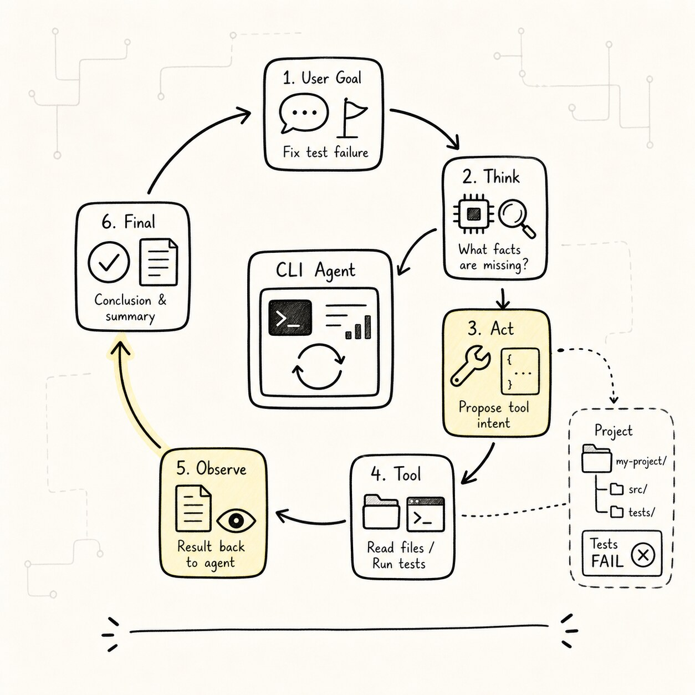
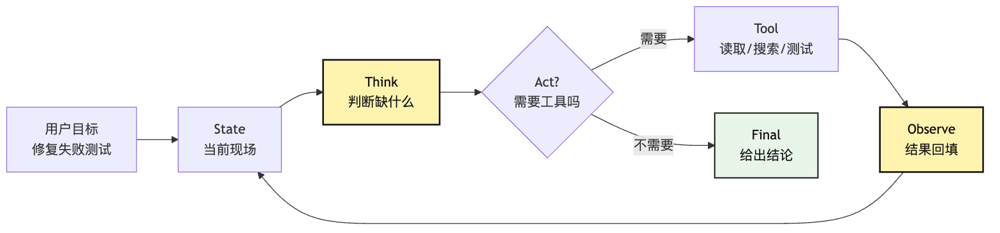
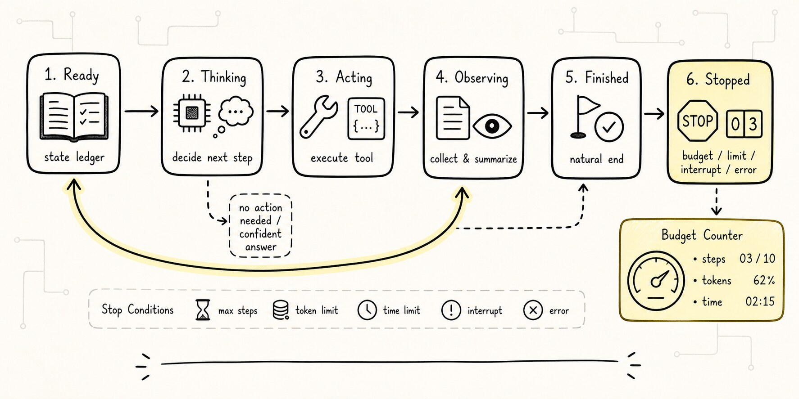
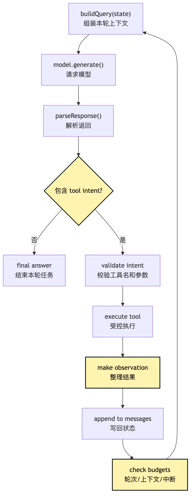
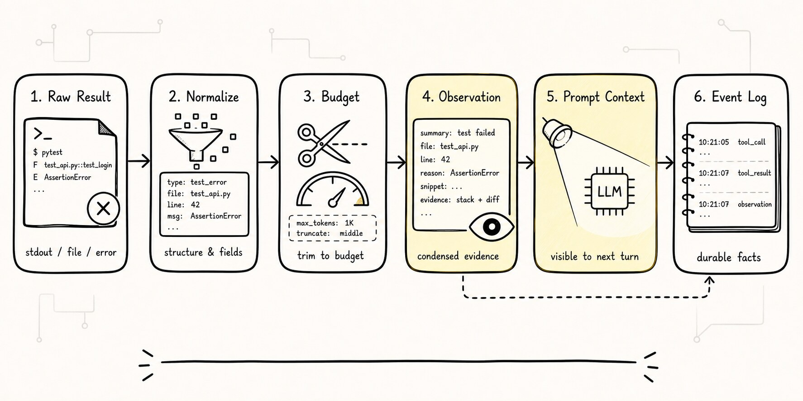
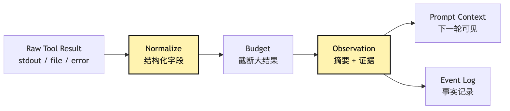
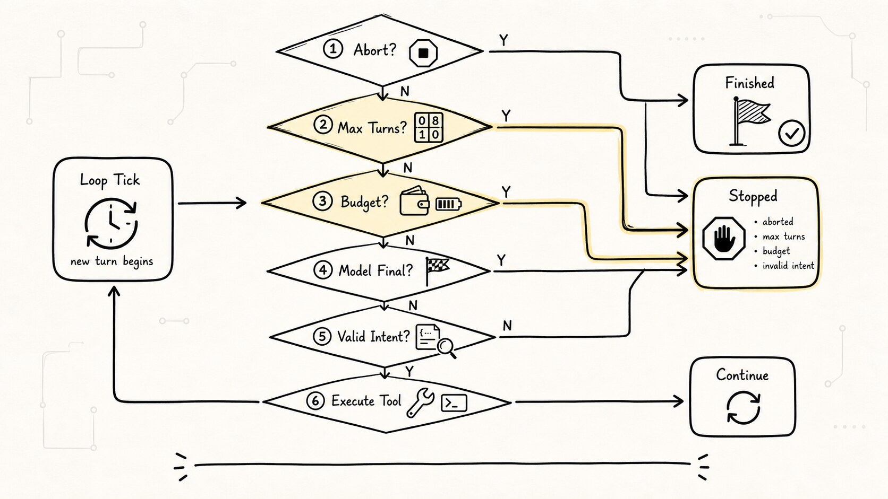
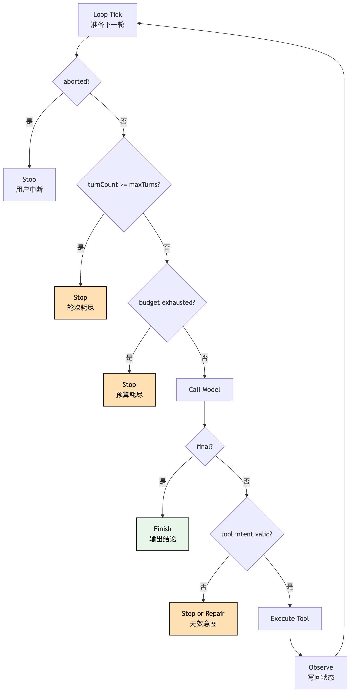

# 最小 Agent Loop：从单次回答到多步行动

前面几篇我们一直在拆一个问题：Agent 不是一句 Prompt，也不是更会聊天的模型，而是一个能在受控过程里持续推进任务的运行系统。

到这里，读者很容易产生一个朴素但关键的疑问：

**这个“持续推进”到底是怎么发生的？**

如果只看外表，答案像一句废话：

```text
写一个 while loop。
```

但真正做过 Agent 的人都知道，危险也藏在这里。

一个 `while true` 可以让模型反复调用工具，也可以让系统无限绕圈；可以让模型根据新观察继续判断，也可以让模型把旧错误越滚越大；可以让一个 ChatBot 开始行动，也可以让它在没有预算、没有停止条件、没有状态记录的情况下，把自己变成一个不可解释的黑盒。

所以这篇文章要讲的不是“怎么写一个循环语法”，而是：

> 为什么一个最小 Agent Loop 会让系统从单次回答变成多步行动？这个 loop 最少必须承担哪些工程责任？

我们继续沿用前面固定的例子：

```text
用户在项目目录里输入：
帮我看看这个项目为什么测试失败，并把它修好。
```

如果系统只调用一次 LLM，模型只能根据用户这句话生成一个猜测。它可能说“请检查依赖版本”“可能是测试环境问题”“建议运行 npm test”。这些建议不一定错，但它们没有接触真实项目，也不会根据观察继续推进。

Agent Loop 要补上的，就是这道断裂：

```text
模型判断下一步
-> 系统执行一个受控动作
-> 把真实观察写回状态
-> 模型基于新观察再判断
-> 直到能给出最终结论，或者触发停止条件
```

这就是最小 ReAct loop 的骨架。这里的 ReAct 先按工程机制理解：让判断、行动和观察形成闭环，而不是要求模型输出冗长的私有思考。

这一章先把范围收窄：

**暂时不接真实文件系统，也不做权限；只用 fake tool 验证 observation 是否真的影响下一轮判断，以及 loop 是否能在 final 或 stop condition 下停下来。**

## 从一次回答到多轮状态机



这一章的链路很短，但每一步都很重：

```text
单次回答无法根据真实观察继续推进
-> loop 让模型可以反复提出下一步
-> 工具把下一步变成可执行动作
-> observation 把执行结果回填给模型
-> state 记录轮次、消息、预算、错误和工具结果
-> 停止条件防止循环原地打转
-> 最小 Agent Loop 才能从“会建议”变成“能推进”
```

画成最小闭环是这样：



这张图里最重要的是 `Observe -> State -> Think` 这条回路。

很多 demo 只实现了 `Think -> Act`，也就是让模型输出一个工具调用。看起来已经像 Agent 了。但如果工具结果没有被整理成 observation，没有写回 state，没有成为下一轮模型输入，那它只是“模型喊了一声我要读文件，程序顺手读了一下”。任务并没有真正连续起来。

Agent Loop 的价值，不是“模型能调用工具”。

它的价值是：

```text
工具结果会改变下一轮判断。
```

只要这句话成立，系统就开始从 ChatBot 进入 Agent 的世界。

## 一、单次回答为什么到不了“修好测试”

先故意从最弱的系统开始。

我们写一个 CLI：

```text
$ mini-agent "帮我看看这个项目为什么测试失败，并把它修好。"
```

第一版只有一次模型调用：

```text
用户输入 -> provider.chat() -> 模型回答 -> 打印结果
```

这时模型可能回答：

```text
你可以先运行测试命令，查看失败日志；
然后定位失败断言；
再修改相关代码；
最后重新运行测试。
```

这个回答作为建议还可以。问题是用户要的不是建议，而是“帮我修好”。

在真实项目里，修复测试失败至少需要几类事实：

```text
项目用什么包管理器？
测试命令叫什么？
失败的是哪个测试？
错误日志是什么？
相关源码在哪？
修改后是否真的通过？
```

这些事实不在用户那一句话里，也不在模型参数里。它们在当前工作目录、文件系统、终端输出、测试框架和项目约定里。

单次回答的问题不是“不聪明”，而是它没有机会去拿这些事实。

它只能在缺事实的状态下给建议。

Agent Loop 做的第一件事，就是承认模型第一轮不知道答案。

这很重要。一个能行动的 Agent 不是每轮都装作知道，而是允许自己说：

```text
我需要先观察。
```

对于“修复测试失败”这个任务，第一轮合理的判断往往不是“答案是某某 bug”，而是：

```text
我需要知道项目结构和测试命令。
```

于是模型提出一个行动意图，比如：

```json
{
  "tool": "read_file",
  "input": {
    "path": "package.json"
  }
}
```

注意这里的主角已经变了。

单次 ChatBot 的主角是最终文本；Agent Loop 的主角是下一步行动。

模型不是一上来回答“怎么修”，而是先提出“我要看什么”。系统执行这个动作，拿到观察结果，再让模型继续判断。

这就是从回答到行动的第一步。

## 二、Loop 的状态机视角



很多人会把多步 Agent 想成“把历史都塞回模型”。

这句话只说对了一半。

历史确实要回填，但 Agent Loop 更准确地说是一台状态机。

它每一轮都要做同一组判断：

```text
当前 state 是什么？
本轮要给模型看什么？
模型返回的是 final 还是 tool intent？
tool intent 是否有效？
执行结果是什么？
结果如何变成 observation？
是否继续下一轮？
是否触发预算、中断或停止？
```

这不是聊天记录能自然解决的。

聊天记录只回答“刚才说过什么”。状态机要回答“现在系统处于什么执行阶段，下一步应该往哪里转移”。

最小 Agent Loop 可以先画成四种状态：


这张图把一个常见误解拆开了：

```text
Agent Loop 不是“模型一直说话”。
Agent Loop 是“系统在多个状态之间受控转移”。
```

为什么要强调状态机？

因为每种状态能做的事情不同。

在 `Thinking` 状态，系统调用模型，但不应该直接执行外部副作用。

在 `Acting` 状态，系统执行工具，但不应该让模型随意改写运行时事实。

在 `Observing` 状态，系统把工具结果整理成模型可读的 observation，但不应该把所有原始日志无脑塞进去。

在 `Finished` 状态，系统可以输出最终回答，但还应该记录这次完成依据。

在 `Stopped` 状态，系统要解释为什么停止，而不是假装任务完成。

一旦你用状态机看 Agent Loop，很多工程边界就自然出现了。

比如：

```text
工具调用失败，不等于 loop 崩溃。
权限被拒，不等于模型应该继续猜。
超过最大轮次，不等于任务成功。
模型说 final，不等于系统一定应该相信它完成了。
```

这些都是后面 Harness 会继续扩展的东西。但在最小 Agent Loop 里，已经要留下接口。

## 三、最小 ReAct：Think、Act、Observe、Final

现在回到 ReAct。

为了避免术语压过机制，我们先不用英文展开，只记四个动作：

```text
Think：模型基于当前现场判断下一步。
Act：模型提出一个结构化行动意图。
Observe：系统执行行动，并把结果写回模型可见现场。
Final：模型认为不需要继续行动，给出最终结论。
```

一个最小 ReAct loop 不是让模型输出长篇“思考过程”。这里的 `Think` 更像系统状态里的“判断阶段”。模型可以返回文本，也可以返回工具意图。重要的是外层 runtime 能识别这两类返回，并做不同处理。

可以把一次循环压成下面这条管线：



这张图比“while loop”多了几个关键动作：

1. `buildQuery(state)`：每轮都重新组织上下文。
2. `parseResponse()`：区分 final 和 tool intent。
3. `validate intent`：模型提议不能直接执行。
4. `make observation`：工具结果要变成下一轮可用事实。
5. `check budgets`：循环必须知道什么时候停。

如果把这些动作拿掉，只剩：

```text
while true:
  ask model
  run whatever it says
```

那不是 Agent Loop，而是一个风险很高的模型遥控器。

真正的最小 ReAct loop 要有一条纪律：

**模型提议下一步，系统受控执行下一步，状态记录下一步，停止条件约束下一步。**

这四个责任缺一不可。

## 四、用修复测试失败跑一遍

现在把这套 loop 放回小型 CLI Agent。

用户输入：

```text
帮我看看这个项目为什么测试失败，并把它修好。
```

第一轮，state 里可能只有：

```text
user_goal: 修复失败测试
messages: [用户原始请求]
turn_count: 0
tool_results: []
budget: max_turns=8
```

模型第一轮不应该立刻编答案。它更合理的输出是一个工具意图：

```json
{
  "tool": "read_file",
  "input": {
    "path": "package.json"
  },
  "reason": "需要确认测试命令和项目类型"
}
```

系统执行 `read_file`，拿到 `package.json`。但它不能只在终端打印一下就完事。它要把结果变成 observation：

```text
Observation:
- read_file(package.json) 成功
- scripts.test = "vitest run"
- 项目使用 pnpm
- 相关依赖包含 vitest、typescript
```

这条 observation 写回 messages 或 state 后，第二轮模型才知道下一步应该运行：

```json
{
  "tool": "run_command",
  "input": {
    "command": "pnpm test"
  },
  "reason": "需要复现失败日志"
}
```

系统执行测试，拿到失败日志：

```text
Observation:
- pnpm test 退出码 1
- 失败测试：sum.test.ts
- 错误：expected 4, received 3
- 相关文件可能是 src/sum.ts 或 tests/sum.test.ts
```

第三轮，模型基于 observation 判断要读源码：

```json
{
  "tool": "read_file",
  "input": {
    "path": "src/sum.ts"
  },
  "reason": "失败断言与 sum 实现相关"
}
```

第四轮，模型提出编辑意图。

第五轮，系统重新运行测试。

第六轮，模型看到测试通过，返回 final：

```text
已修复失败测试。问题出在 sum.ts 对负数分支处理错误；
已调整实现，并重新运行 pnpm test，全部通过。
```

这条路径里，模型每一轮都没有“突然变聪明”。它只是看到了更多事实。

Agent Loop 的作用，是把事实带回来。

更准确地说：

```text
第一轮不是为了回答，而是为了取证。
第二轮不是从零开始，而是基于取证继续。
第三轮不是自由发挥，而是被 observation 收束。
最后一轮不是讲故事，而是基于验证结果收尾。
```

这就是最小 Agent Loop 的心智模型。

## 五、State：让每一轮不是从零开始

如果只能从这篇记住一个实现对象，我希望是 `state`。

因为最小 Agent Loop 的核心不是 `while`，而是每轮如何更新 state。

一个最小 state 可以很简单：

```ts
type AgentState = {
  messages: Message[]
  turnCount: number
  maxTurns: number
  aborted: boolean
  lastObservation?: Observation
  toolResults: ToolResult[]
  finalAnswer?: string
}
```

这不是推荐最终代码结构，只是为了说明最小责任。

`messages` 保存模型下一轮需要看见的对话和工具结果。

`turnCount` 记录 loop 已经转了几轮。

`maxTurns` 是防无限循环的硬边界。

`aborted` 让外部可以安全中断。

`lastObservation` 保存上一轮真实世界返回的事实。

`toolResults` 给后续调试和审计留下记录。

`finalAnswer` 标识任务是否以最终回答结束。

注意这里没有把所有东西都塞进 messages。

这是一个重要边界：

```text
messages 是模型可见上下文。
state 是运行时事实。
session log 是更完整的事件事实源。
```

最小实现阶段，三者可以很接近。但从第一天就要知道它们不是同一个概念。

否则后面一定会遇到这种混乱：

```text
为了让模型知道，把所有工具日志塞进 messages。
为了恢复任务，又从 messages 反推发生过什么。
为了压缩上下文，把 messages 总结掉。
结果 session 事实源也被总结掉了。
```

这条路很危险。

最小 Agent Loop 可以暂时简单，但不要把边界想错。

可以用一张图记住 state 的位置：


这张图提前铺了一点后面的路。

当前第 8 篇只写最小 loop，但你已经能看到 Context、Session Replay、Tool Runtime 会从哪里长出来。

当工具结果越来越大，`Context Projection` 就需要治理。

当任务需要恢复，`Session Log` 就不能只是 messages。

当工具开始有副作用，`Intent` 就必须经过校验和权限。

但在最小版本里，先做到一件事：

**每一轮结束后，state 必须能解释下一轮为什么这样开始。**

## 六、Act：先用 fake tool 验证机制

第 8 篇的产物是最小 Agent Loop，所以很容易忍不住一上来就接真实文件工具、真实 Shell、真实编辑器。

但我建议第一版先用 fake tool 或 echo tool。

原因不是偷懒，而是分离风险。

最小 loop 要先验证的是这几件事：

```text
模型能不能输出结构化 tool intent？
系统能不能识别 final 和 tool intent？
tool intent 能不能被执行器接住？
工具结果能不能变成 observation？
observation 能不能进入下一轮模型输入？
loop 能不能在 final 或预算耗尽时停止？
```

这些机制和“真实读文件”不是一回事。

如果第一版就接真实文件系统，出问题时你很难判断：

```text
是模型没按 schema 输出？
是工具参数解析错了？
是路径权限错了？
是文件内容太长？
是 observation 没回填？
还是停止条件没生效？
```

fake tool 的价值，是让 loop 本身先可验证。

比如我们可以定义一个非常无聊的 `echo` 工具：

```text
tool: echo
input: { "text": "run tests" }
output: "echo: run tests"
```

或者定义一个固定返回的 `fake_test` 工具：

```text
第一次调用：返回测试失败，错误在 sum.test.ts
第二次调用：返回测试通过
```

这样我们不用真的改文件，也能验证 loop 是否会这样走：

```text
用户目标
-> 模型请求 fake_test
-> 系统返回失败 observation
-> 模型请求 echo/read/edit 之类的模拟动作
-> 系统返回动作完成 observation
-> 模型再次请求 fake_test
-> 系统返回通过 observation
-> 模型 final
```

这一步不是为了骗自己“Agent 已经能修项目了”。

它是在验证最小控制流：

```text
Act 是否真的会带来 Observe？
Observe 是否真的会影响下一轮 Think？
Final 是否真的能让 loop 停下来？
```

等这条机制稳定，再把 fake tool 换成真实 Tool Runtime，问题就清楚很多。

最小 Agent 的第一原则不是“能力越多越好”，而是“每增加一个能力，都知道它挂在哪条状态转移上”。

## 七、Observation：把工具结果整理成事实



很多 Agent Demo 的第二个常见问题，是把工具输出直接塞回 prompt。

比如运行测试以后，系统拿到一大段 stdout：

```text
...几百行日志...
FAIL tests/sum.test.ts
expected 4, received 3
...更多堆栈...
```

最粗糙的做法是：

```text
把原始 stdout 全部追加到 messages。
```

短期看能跑。长期看会出三个问题。

第一，日志太长，上下文迅速膨胀。

第二，模型可能被无关输出分散注意力。

第三，系统以后很难判断这次工具结果到底意味着什么。

所以最小 loop 里最好就引入 `Observation` 这个概念。

Observation 不是原始日志的复制，而是“工具执行结果的模型可读摘要 + 必要证据”。

可以这样设计：

```ts
type Observation = {
  toolName: string
  ok: boolean
  summary: string
  evidence?: string
  errorType?: string
  retryable?: boolean
}
```

对于测试失败，它可以是：

```text
toolName: run_command
ok: false
summary: pnpm test 失败，失败用例是 tests/sum.test.ts
evidence: expected 4, received 3
errorType: test_failure
retryable: true
```

这比一坨日志更有用。

因为下一轮模型真正需要的是：

```text
测试确实失败了。
失败在哪里。
关键错误是什么。
这个失败是否值得继续排查。
```

当然，最小版本也不要过度设计。Observation 可以先很朴素。但要保留一个意识：

**Observe 不是把工具输出丢给模型，而是把真实世界整理成下一轮判断所需的事实。**

可以把工具结果到 observation 的过程画成这样：



这张图里有两条出路：

```text
Observation 进入 Prompt Context，让模型继续判断。
Observation 进入 Event Log，让系统以后能复盘。
```

最小实现可以先不做完整 Event Log，但不要把 observation 只当成 prompt 文本。它以后会变成 trace、eval、replay 的基础。

## 八、停止条件：Loop 必须知道什么时候不该继续



Agent Loop 最容易被低估的部分是停止条件。

很多人第一次写 loop 时，只写：

```text
如果模型没有工具调用，就结束。
```

这确实是一个停止条件，但远远不够。

最小 Agent Loop 至少要有五类停止：

```text
1. 模型返回 final：任务自然结束。
2. 超过最大轮次：防止无限循环。
3. 超过预算：token、时间、费用或工具调用次数耗尽。
4. 外部中断：用户取消或进程收到 abort。
5. 致命错误：工具不可用、权限拒绝、schema 连续无效。
```

把它画成决策路径会更清楚：



这张图提醒我们：停止不只有成功结束。

一个专业的 Agent Loop 要能区分：

```text
完成：模型给出 final，并且必要证据足够。
取消：用户或系统要求停止。
失败：工具、权限、预算或模型输出让任务无法继续。
降级：达到上限后输出目前已知事实和下一步建议。
```

对于“修复测试失败”这个例子，如果跑到第 8 轮还没有通过测试，系统不应该继续赌。

它应该停下来，说清楚：

```text
我已完成：
- 读取 package.json，确认测试命令是 pnpm test
- 复现失败，失败用例是 tests/sum.test.ts
- 阅读 src/sum.ts 并尝试一次修改
- 重新运行测试仍失败

我停止的原因：
- 已达到 maxTurns=8

当前最可能的下一步：
- 需要检查 tests/sum.test.ts 的测试意图
- 或扩大搜索范围到 src/math/*
```

这不是完美结果，但它是可控结果。

不可控的 Agent 会继续绕圈，直到 token 耗尽或用户失去信任。

可控的 Agent 会承认边界，把现场交还给用户。

## 九、最小伪代码：看责任，不看语法

现在可以写一段伪代码。但这段伪代码不是教程重点，只是把责任串起来。

```ts
async function runAgent(userGoal: string, tools: ToolRegistry) {
  let state = initialState(userGoal)

  while (!state.aborted) {
    if (state.turnCount >= state.maxTurns) {
      return stopWithReason(state, "max_turns_exceeded")
    }

    const query = buildQueryFromState(state)
    const response = await model.generate(query)
    const decision = parseModelDecision(response)

    if (decision.type === "final") {
      return finish(state, decision.answer)
    }

    const validation = validateToolIntent(decision.toolIntent, tools)
    if (!validation.ok) {
      state = appendObservation(state, validation.asObservation())
      state.turnCount += 1
      continue
    }

    const result = await executeTool(validation.intent)
    const observation = makeObservation(result)

    state = appendObservation(state, observation)
    state = updateBudgets(state)
    state.turnCount += 1
  }

  return stopWithReason(state, "aborted")
}
```

这段代码里有几个故意留下的分界线。

`buildQueryFromState` 说明模型输入来自 state 的投影，不是随手拼字符串。

`parseModelDecision` 说明模型输出要被解释成系统对象，不是直接拿文本执行。

`validateToolIntent` 说明模型提议必须先过协议边界。

`executeTool` 说明执行由系统负责，不由模型负责。

`makeObservation` 说明工具结果要整理后再回填。

`updateBudgets` 说明每轮都要更新成本和边界。

`stopWithReason` 说明停止本身也是结果，不是异常逃逸。

最小 Agent Loop 的伪代码如果能把这些责任分清，哪怕工具只有一个 echo，也已经比很多“看起来很酷”的 demo 更稳。

## 十、为什么不要把 Loop 写成工具教程

这一篇故意没有把重点放在“如何实现 read_file、run_command、edit_file”。

因为那是 Tool Runtime 的主题。

第 8 篇只要回答：

```text
工具为什么会被调用？
调用结果如何进入下一轮？
loop 如何决定继续还是停止？
```

如果现在就把文章写成代码教程，很容易把读者带到细枝末节：

```text
怎么读文件？
怎么兼容 Windows 路径？
怎么捕获子进程 stdout？
怎么写 diff？
```

这些都重要，但它们会遮住 Agent Loop 的核心。

Loop 的核心是状态转移：

```text
Think 产生 Intent 或 Final。
Intent 进入 Tool Runtime。
Tool Runtime 产生 Result。
Result 被整理成 Observation。
Observation 改变 State。
State 生成下一轮 Context。
```

只要这条链路清楚，后面工具再复杂，也知道该往哪里挂。

反过来，如果 loop 边界不清，工具越多越乱。

你会看到这种代码味道：

```text
模型输出里如果包含 "npm test" 就跑命令。
如果包含 "read file" 就读文件。
如果工具失败就把错误字符串塞回 prompt。
如果模型没说 DONE 就继续。
```

这不是最小 Agent Loop，而是靠字符串暗号拼出来的流程。

能演示，不耐用。

## 十一、Loop 的三个常见坏味道

为了让最小 loop 更容易落地，这里列三个早期就该警惕的坏味道。

### 1. 只有 Act，没有 Observe

系统能执行工具，但下一轮模型看不到结构化结果。

表现是模型反复请求同一个文件、反复运行同一个命令、反复问已经知道的事实。

根因通常是：

```text
工具结果只打印到 UI，没有进入 messages。
工具结果进入了 messages，但没有清晰标明来自哪个工具。
工具结果太长，被截断到丢失关键事实。
```

修法不是“让模型更聪明”，而是把 observation 回填做好。

### 2. 只有 Continue，没有 Stop

系统只要看到工具调用就继续，没有最大轮次、预算、中断和失败退出。

表现是 Agent 在失败测试上不断尝试相同修改，或者工具参数一直无效还继续请求模型修正。

根因通常是 loop 没把停止条件当成一等对象。

最小版本也要有：

```text
maxTurns
maxToolCalls
timeout
abort signal
invalidIntentLimit
```

不一定一开始都复杂实现，但要在 state 里有位置。

### 3. 只有 Messages，没有 State

系统把所有事实都塞进 messages，运行时没有独立状态。

表现是调试困难：你不知道第几轮用了哪个工具、哪个工具失败、预算为什么耗尽、final 是否基于验证。

根因是把“给模型看的上下文”和“系统自己的事实源”混在一起。

最小版本可以先把 state 存内存里，但要把字段分清楚。

```text
messages 给模型看。
state 给 runtime 判断。
event log 给以后复盘。
```

这三者越早分开，后面越轻松。

## 十二、从最小 Loop 到后续章节

第 8 篇是一个分水岭。

前面几篇更多是在建立心智：Agent 不是 Prompt，Agent 有 Model、Loop、Tools、State，Agent 和 ChatBot、Workflow、Harness 有边界。

从这篇开始，我们真的进入“手写 Agent”的路线。

但注意，最小 Agent Loop 不是终点。

它只是把系统从一次回答推进到多步行动。下一步很快会暴露新的问题。

### 1. Provider 不能接管 Core

最小 loop 里我们调用 `model.generate()`，看起来很简单。

但接入真实大模型以后，不同 provider 的 message schema、tool calling 格式、streaming 事件、错误类型都不同。

如果让 provider 直接控制 loop，core 会被 provider 细节污染。

所以后面需要 M0 Core Kernel：provider 只提供模型事件和 tool intent，系统仍然掌握状态、工具执行和停止条件。

### 2. Intent 和 Execution 必须分离

这篇已经多次强调：模型提出 tool intent，不等于工具已经执行。

后面会把这条纪律写厚：

```text
intent -> validate -> permission -> execute -> observe
```

这是 Tool Runtime、Permission、Audit、Replay 的基础。

### 3. Context 会开始膨胀

只要 loop 跑起来，messages 就会变长。

读文件、跑测试、搜索代码，都会不断制造工具结果。

最小版本可以先简单追加，但很快就需要 Context Policy：

```text
哪些 observation 进模型？
哪些只进事件日志？
大日志如何截断？
旧历史如何压缩？
当前任务现场如何保持不断线？
```

### 4. Verification 会变成完成标准

模型返回 final 不一定代表任务真的完成。

对于“修复测试失败”这个任务，最可靠的完成证据是：

```text
重新运行目标测试通过。
```

所以后面需要 Verification：系统不只听模型说“修好了”，还要记录验证证据。

### 5. Harness 会接住更长的生命周期

最小 loop 可以在一个进程里跑完。

但真实任务会被中断、恢复、委派、审计、回放、评估。

这些都不是模型自己能处理的。

Agent Loop 是心跳。

Harness 是让这颗心跳在真实环境里长期稳定运行的外部控制系统。

## 十三、这篇的工程边界

最后把最小 Agent Loop 的边界压成几句话。

第一，Loop 不是为了让模型多说几轮，而是为了让观察结果改变下一轮判断。

第二，最小 ReAct loop 至少包含 `Think / Act / Observe / Final`，其中 `Observe` 和停止条件最容易被低估。

第三，工具调用不是执行本身。模型只提出 intent，系统负责验证、执行、记录和回填。

第四，state 不是聊天记录。messages 是模型可见上下文，state 是运行时现场，event log 是更完整的事实源。

第五，一个能停下来的 Agent，比一个只会继续的 Agent 更可信。

写代码时，只要守住这条线：Agent Loop 的本质，是让模型在受控状态机里反复用真实观察修正下一步，而不是让模型无限续写回答。

下一篇会继续沿着这条线往下走：当真实大模型被接进系统时，core 应该如何保持控制权？也就是说，我们要把模型接进 loop，而不是让模型接管 loop。

## 本章代码落点

这一章的代码落点就是 `runAgentLoop()`：输入 `systemPrompt`、`messages`、`tools`、`model` 和 `toolRegistry`，输出本次新增的 `newMessages` 与 `events`。loop 不应该知道 HTTP、React 或 session 文件。它只负责在 maxTurns 内完成“assistant -> toolResult -> assistant”的状态转换，并在每个关键点 emit event。

---

GitHub 地址: [00-08-minimal-agent-loop.md](https://github.com/LienJack/build-harness/blob/main/docs/zh/00-08-minimal-agent-loop.md)
