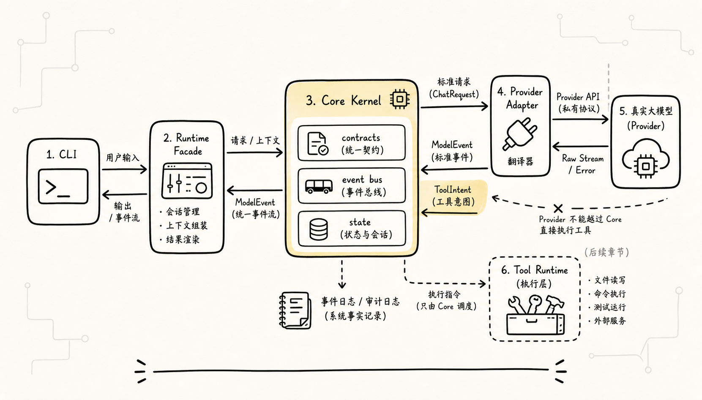
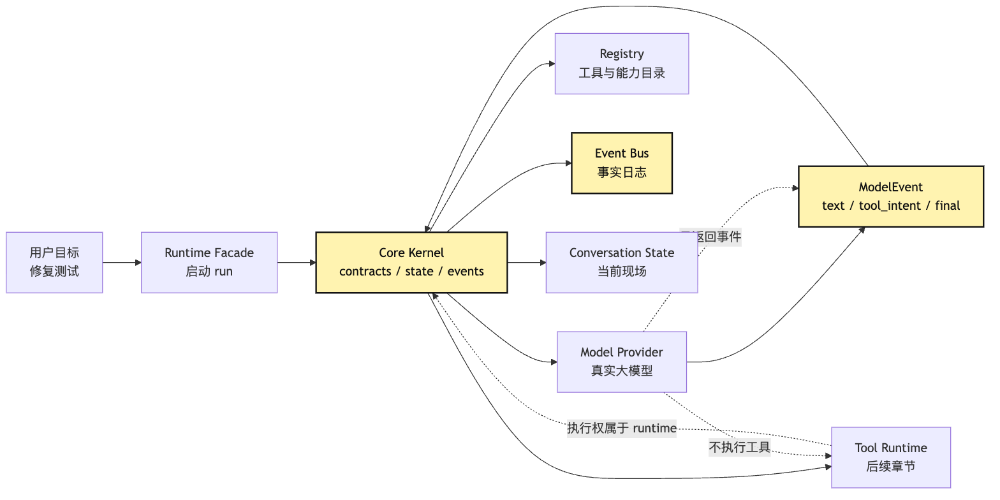
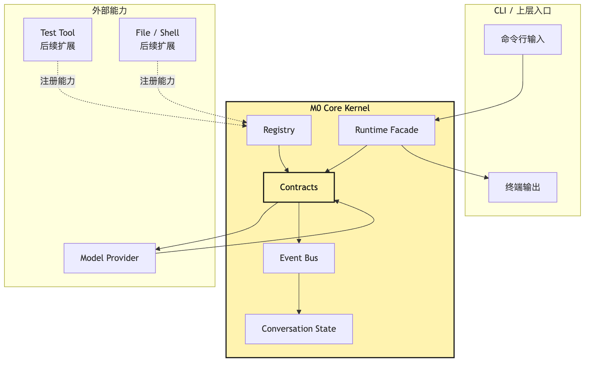
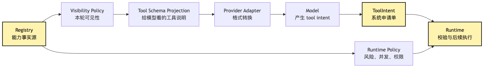
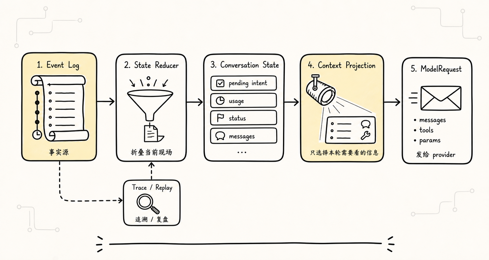
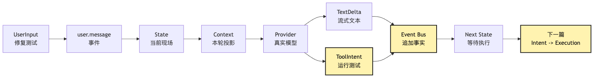

# M0 Core Kernel：把真实大模型接进系统，而不是接管系统

前面几篇已经把 Agent 和 Harness 的心智铺开了。

我们知道 Agent 不是一句 prompt，而是 `Model + Loop + Tools + State` 组成的运行系统。我们也知道 Harness 不是另一个更聪明的 Agent，而是模型外部的控制系统。再往前走，读者通常会遇到第一个真正的工程分叉：

```text
现在要把真实大模型接进来了。
到底应该先写一个 provider 调用，还是先写 core contracts？
```

很多项目会选择前者。

先把 OpenAI、Anthropic、Gemini 或任意一个 provider 的 API 调通。能流式输出。能解析工具调用。能在终端里打印回答。再顺手把工具执行也接进去。

这样很快能做出一个看起来能跑的 demo：

```text
用户输入：帮我修复测试失败
-> provider 请求大模型
-> 模型返回 tool call
-> 程序执行 shell
-> 把结果拼回下一轮
```

这条路短期很爽。

但它有一个隐蔽的问题：系统中心很容易从 `runtime` 滑向 `provider`。

一开始只是 provider 返回一段文本。后来 provider 返回 tool call。再后来 provider 的响应格式决定了工具对象长什么样。再后来错误处理、streaming、messages、tool results、上下文结构都跟 provider 绑在一起。最后你会发现，整个 Agent core 不是围绕自己的 contracts 运转，而是围绕某一家模型 API 的返回格式运转。

这就是 M0 Core Kernel 要解决的问题。

M0 是本文里的最小里程碑名称，不是行业通用成熟度分级。它不是为了把架构做大。恰好相反，M0 要把系统缩到一个最小但稳定的内核：

```text
真实模型可以接进来。
但真实模型不能接管系统边界。
Provider 是能力入口，Core Kernel 才保存系统边界。
```

我们继续沿用整套教程的同一个例子：

```text
帮我看看这个项目为什么测试失败，并把它修好。
```

第 7 篇里，我们会先让 CLI 完成第一次模型调用。第 8 篇里，我们会把单次回答推进成最小 Agent Loop。到了第 9 篇，问题变成：

> 当真实大模型开始返回文本、流式事件和 tool intent 时，core 要怎么接住它，而不是被它牵着走？

这篇不急着写完整 Tool Runtime，也不急着做权限系统。那些是后面的章节。

这篇只做 M0 Core Kernel 的边界设计：

```text
contracts
registry
event bus
conversation state
runtime facade
```

这五个词听起来像架构目录，但它们不是装饰。它们分别接住一个真实问题：

```text
contracts：provider 和 runtime 说同一种内部语言
registry：能力先登记，不能临时乱接
event bus：发生过什么必须变成事实流
conversation state：模型看到的是状态投影，不是全部事实
runtime facade：外部 CLI 调 runtime，而不是直接调 provider
```

一句话先压住：

**M0 Core Kernel 的职责，是把真实模型输出翻译成系统内部事件，并让 runtime 继续拥有执行、状态和日志的控制权。**

## 问题链



这篇文章的问题链是：

```text
mock provider 能验证 loop，但不能暴露真实模型接入的复杂度
-> 真实 provider 会带来 streaming、tool call、错误、usage 和格式差异
-> 如果 core 直接依赖 provider 响应格式，系统边界会被模型 API 穿透
-> 所以必须先定义稳定 contracts，把 provider 输出归一成 ModelEvent 和 ToolIntent
-> ToolIntent 只是行动提议，执行、状态更新和事件日志仍由 runtime 控制
-> runtime 通过 registry 管能力，通过 event bus 记录事实，通过 state reducer 得到当前现场
-> CLI 和未来上层产品只调用 runtime facade，不直接碰 provider 和工具细节
```

画成第一张总览图：



这张图里最重要的不是模块数量，而是两条边界。

第一，provider 只能返回 `ModelEvent`。它可以告诉系统“模型生成了一段文本”“模型提出了一个 tool intent”“模型认为可以 final”。但它不应该直接改 state，也不应该直接执行工具。

第二，runtime 拥有事实日志。模型输出、工具意图、工具结果、状态变化、错误、usage，都应该进入 event bus。后面的 state 和 context 都从这些事件折叠或投影出来。

如果这两条边界守住，真实模型接入就只是替换 provider adapter，而不是重写 core。

## 一、为什么 M0 不是“先把 API 调通”

从代码冲动上看，最先写 provider 是很自然的。

你可能会先写：

```ts
async function callModel(prompt: string) {
  const response = await client.messages.create({
    model: "some-model",
    messages: [{ role: "user", content: prompt }],
  });

  return response.text;
}
```

然后 CLI 就能回答问题了。

下一步加 streaming：

```ts
for await (const chunk of stream) {
  process.stdout.write(chunk.text);
}
```

再下一步加 tool call：

```ts
if (chunk.tool_call) {
  await runTool(chunk.tool_call.name, chunk.tool_call.args);
}
```

到这里，demo 已经有 Agent 味道了。

但危险也从这里开始。

因为这段代码把三类职责揉在了一起：

```text
provider protocol：怎么请求某个模型 API
agent semantics：模型输出到底表示什么
runtime authority：谁有权执行工具、更新状态、记录事实
```

在小 demo 里，三者混在一起没什么。因为你只有一个 provider，一个工具，一个任务，一种输出格式。

一旦进入真实工程，它会立刻变成负债。

比如接入第二个 provider 时，你会发现：

```text
有的 provider 把 tool call 放在 message content block 里
有的 provider 把 tool call 放在 function_call 字段里
有的 provider streaming 时先给 id，再分片给 args
有的 provider 错误分成 rate limit、overloaded、bad request、context length
有的 provider usage 最后才给
有的 provider 支持并行 tool call，有的默认顺序不同
```

如果 core 直接吃 provider 原始结构，那么这些差异会渗进整个系统：

```text
loop 要识别每家 provider 的工具格式
tool runtime 要知道 provider 的 tool id 规则
state 里保存 provider 私有字段
event log 里混着供应商响应对象
context builder 要按供应商历史格式拼 messages
测试要 mock 每家 provider 的返回形状
```

这时候，provider 就不是一个适配层了。

它变成了系统中心。

M0 要阻止的正是这件事。

我们不是不接真实模型。相反，M0 必须接真实模型。没有真实模型，后面的 streaming、tool intent、错误映射、usage、上下文压力都只是纸上谈兵。

但接法要反过来：

```text
不是让 core 适配 provider。
而是让 provider 适配 core。
```

也就是说，core 先定义自己的内部语言。provider adapter 负责把外部 API 翻译成内部语言。

这就是 contracts 的意义。

## 二、Core Kernel 到底“核”在哪里

`Kernel` 这个词容易让人想到操作系统内核。这里可以借一点这个类比，但不要过度神化。

在我们的教程里，Core Kernel 不是完整 OS，也不是复杂框架。它只是 Agent Harness 里最小的一组稳定责任：

```text
1. 定义系统内部事件和对象
2. 接收 provider 输出，并归一成内部事件
3. 接收用户输入，并写入事件流
4. 根据事件流折叠出 conversation state
5. 从 registry 读取可用能力
6. 暴露一个 runtime facade 给 CLI 和上层调用
```

它不负责什么？

```text
不负责把所有工具都实现完
不负责复杂权限审批
不负责长期记忆
不负责多 agent 协作
不负责远程沙箱
不负责生产级 eval
```

这些都很重要，但不属于 M0。

M0 的目标不是“一步到位”，而是给后面所有层提供一个不晃的底座。

可以把 M0 看成一个很小的控制面：



这张图里，`Contracts` 是最中间的硬边界。Provider 不直接把自己的响应塞进 State。CLI 不直接调用 provider。工具不绕过事件日志写 messages。

这也是 M0 和简单 demo 的差别。

简单 demo 的中心通常是一个 `while`：

```text
while true:
  call model
  if tool call: run tool
  else: print answer
```

M0 的中心是一组 contracts：

```text
UserInputEvent
ModelEvent
ToolIntent
Observation
StateDelta
RuntimeEvent
```

不是因为接口名字好看，而是因为后面的权限、回放、压缩、评估都要挂在这些对象上。

如果 M0 没有这些对象，后面每加一层都会补一次临时结构。补到最后，系统表面能跑，内部没有事实源。

## 三、Contracts：模型输出必须先变成系统对象

我们先从最重要的 contracts 开始。

真实模型会返回很多东西：

```text
文本 token
thinking 或 reasoning 片段
tool call id
tool name
tool args
stop reason
usage
error
provider request id
stream done signal
```

这些东西不能原样铺进 runtime。

Core 需要的是更稳定的一层：

```ts
type ModelEvent =
  | ModelTextDelta
  | ModelToolIntent
  | ModelUsage
  | ModelFinal
  | ModelError;

type ModelTextDelta = {
  type: "model.text.delta";
  runId: string;
  text: string;
};

type ModelToolIntent = {
  type: "model.tool.intent";
  runId: string;
  intentId: string;
  toolName: string;
  input: unknown;
  providerRef?: {
    provider: string;
    rawId?: string;
  };
};

type ModelFinal = {
  type: "model.final";
  runId: string;
  reason: "stop" | "tool_intent" | "length" | "error";
};
```

这段伪代码的重点不在字段是否完整，而在方向：

```text
provider 原始响应
-> provider adapter
-> core ModelEvent
```

一旦进入 core，runtime 只认 `ModelEvent`。

这带来几个好处。

第一，loop 不关心 provider 细节。

如果某家 provider 把工具调用叫 `tool_use`，另一家叫 `function_call`，这只影响 adapter。Loop 仍然看到 `model.tool.intent`。

第二，工具执行不被 provider 绑定。

`intentId` 是 core 的工具意图 ID。`providerRef.rawId` 可以保留原始 id 方便回填，但执行层不能依赖它作为系统事实源。

第三，事件日志可以稳定。

今天换模型，明天升级 SDK，后天 streaming 格式改变，只要 adapter 仍然产出相同 `ModelEvent`，历史事件就不会全部失效。

第四，测试可以变简单。

M0 的 core 测试不需要 mock 某家真实 API 的完整响应。它可以直接喂 `ModelEvent`：

```ts
const events: ModelEvent[] = [
  { type: "model.text.delta", runId, text: "我需要先运行测试。" },
  {
    type: "model.tool.intent",
    runId,
    intentId: "intent_1",
    toolName: "run_tests",
    input: { command: "npm test" },
  },
  { type: "model.final", runId, reason: "tool_intent" },
];
```

这就是 contract 的价值：它让核心语义从 provider SDK 里抽出来。

这里要特别强调一个边界：

**ToolIntent 不是 ToolExecution。**

模型提出：

```json
{
  "toolName": "run_tests",
  "input": {
    "command": "npm test"
  }
}
```

这只表示模型认为下一步应该运行测试。

它不表示测试已经运行。

它也不表示这个命令一定允许执行。

它更不表示工具结果可以由 provider 自己决定怎么写回。

ToolIntent 只是系统内的一张申请单。

第 10 篇会专门讲 `Intent / Execution` 分离。这一篇先把地基埋下：M0 的 contracts 必须让两者从类型上分开。

如果这一步没分开，后面再补权限就会很别扭。因为系统里已经到处都是“模型说要执行”和“系统已经执行”的混合对象。

## 四、Provider：它是翻译层，不是系统中心

真实 provider 的职责应该非常窄：

```text
接收 core 的 ModelRequest
调用外部模型 API
把外部响应翻译成 ModelEvent stream
把 provider 错误映射成 core 错误
把 usage、latency、request id 作为事件或 metadata 返回
```

它不应该做这些事：

```text
不决定哪些工具真正执行
不直接修改 conversation state
不直接追加 session event log
不决定权限
不决定任务是否完成
不把 provider 私有 messages 格式暴露给上层
```

可以把 provider 的接口压成这样：

```ts
type ModelProvider = {
  name: string;
  capabilities: ProviderCapabilities;

  stream(request: ModelRequest): AsyncIterable<ModelEvent>;
};

type ModelRequest = {
  runId: string;
  messages: ModelMessage[];
  tools: ModelToolSchema[];
  signal?: AbortSignal;
  metadata?: Record<string, string>;
};
```

这段接口里有一个关键点：

```text
Provider 输入和输出都是 core 类型。
```

`ModelMessage` 不是某家 SDK 的 `MessageParam`。`ModelToolSchema` 也不是某家 provider 原始 tool 定义。它们是 core 定义的中间形态。

Adapter 可以在内部转换：

```text
core ModelRequest
-> provider-specific request
-> provider-specific stream
-> core ModelEvent
```

但转换不能泄漏到 core 之外。

这个设计有一点像网关。网关当然要懂外部协议，但网关后面的系统不应该到处散落外部协议。

用时序图看更清楚：


这张图最重要的是 `Provider Adapter -> Runtime Facade` 的返回。

它返回的是 `ModelEvent stream`，不是“已经处理完工具的结果”。

如果模型返回文本，runtime 可以把 text delta 渲染给 CLI，同时写入事件流。

如果模型返回 tool intent，runtime 应该把 intent 写入事件流，然后交给后续 Tool Runtime 决定如何处理。

如果模型返回错误，runtime 应该把错误变成可归因事件，而不是让异常直接炸穿整个 loop。

这就是“把真实大模型接进系统，而不是接管系统”的第一层落地。

Provider 是强大的，但它只是一个外部能力适配器。

## 五、Registry：能力必须先登记，不能边跑边猜

真实模型要产生 tool intent，前提是它知道有哪些工具可以用。

很多最小 Agent demo 会把工具写成一个 map：

```ts
const tools = {
  read_file,
  run_command,
  edit_file,
};
```

然后把工具描述拼进 prompt。

这在 M0 里还不够。

Core 需要一个 registry，不是为了显得正式，而是为了让“能力”在系统里有稳定身份。

一个工具至少要有这些信息：

```ts
type ToolDefinition = {
  name: string;
  description: string;
  inputSchema: JsonSchema;
  risk: "read" | "write" | "execute" | "network";
  isReadOnly: boolean;
  isConcurrencySafe: boolean;
  visibility: ToolVisibilityPolicy;
};
```

M0 不一定要实现完整权限，但它必须让这些字段有位置。

因为后面的 Tool Runtime、Permission、Context Policy 都会问：

```text
这个工具叫什么？
它的输入结构是什么？
它能不能展示给模型？
它属于观察类动作还是修改类动作？
它能不能并发？
它产生的结果应该怎么回填？
它是否需要用户确认？
```

如果 M0 没有 registry，后面这些问题就会散落在各处。

Provider 也需要从 registry 读取工具 schema，但注意方向：

```text
registry 定义工具能力
context builder 选择本轮可见工具
provider adapter 把可见工具 schema 转成 provider 格式
model 只基于可见工具提出 intent
```

而不是：

```text
provider 想支持什么工具
core 就跟着变成什么样
```

可以用一张图固定：



这张图里有一个容易忽视的点：

```text
模型看到的工具 schema，只是 registry 的投影。
```

Registry 里可以有很多工具。当前轮不一定全部给模型看。M0 可能只注册一个 `run_tests` 或 `echo` 工具，后面才逐步加入 `read_file`、`grep`、`edit_file`、`bash`。

工具可见性本身就是控制系统的一部分。

如果不该执行的工具，最好一开始就不要进入模型菜单。

这不是“不信任模型”，而是正常的工程边界。模型无法调用它根本看不到的能力，系统也就少了一类无意义拒绝和提示注入风险。

## 六、Event Bus：事实必须先发生在日志里

接入真实模型以后，系统会开始产生很多中间状态：

```text
用户输入了什么
runtime 开始了一次 run
provider 开始请求
模型输出了一段文本
模型提出了工具意图
provider 返回 usage
工具意图被接受或拒绝
工具开始执行
工具结束执行
conversation state 发生变化
run 完成或中断
```

这些东西如果只是散落在内存变量里，系统短期也能跑。

但它无法回放，无法审计，无法评估，无法恢复，也很难 debug。

所以 M0 要建立一个极小的 event bus。

这里的 event bus 不一定是复杂消息队列。M0 里可以只是一个同步 append-only log：

```ts
type RuntimeEvent =
  | UserMessageEvent
  | RunStartedEvent
  | ModelEvent
  | ToolIntentRegisteredEvent
  | StateUpdatedEvent
  | RunFinishedEvent;

type EventBus = {
  append(event: RuntimeEvent): void;
  subscribe(handler: (event: RuntimeEvent) => void): () => void;
  snapshot(): RuntimeEvent[];
};
```

重点不是技术实现，而是事实路线：

```text
所有重要事实先进入事件流。
State 从事件流折叠出来。
UI 从事件流渲染出来。
Trace 和 eval 也从事件流读取。
```

这条路线和“直接改 state”很不一样。

直接改 state 的代码通常长这样：

```ts
state.messages.push(modelMessage);
state.lastToolCall = toolCall;
state.status = "running_tool";
```

短期很方便，但问题是：

```text
谁改的？
为什么改？
改之前是什么？
这次修改来自模型、工具还是用户？
如果要重放，顺序是什么？
如果出错，能不能定位哪一步错？
```

事件流的代码则更啰嗦一点：

```ts
eventBus.append({
  type: "model.tool.intent",
  runId,
  intentId,
  toolName: "run_tests",
  input: { command: "npm test" },
});

state = reduceConversationState(eventBus.snapshot());
```

这种写法在 M0 看起来多了一步，但后面会救命。

因为 Agent 的失败很少只发生在最终答案。

它可能发生在任何中间环节：

```text
provider 把工具参数流式拼错了
adapter 把 stop reason 映射错了
registry 给了模型不该看的工具
runtime 把 tool intent 当成已执行
state reducer 漏掉了 observation
context builder 把旧错误日志当成当前事实
```

没有事件流，系统只能从最终 transcript 里猜。

有事件流，才能归因到具体层。

## 七、Conversation State：状态是事实的投影，不是事实本身



M0 的另一个关键边界是 `conversation state`。

很多最小实现会把 messages 当成全部状态：

```ts
const messages = [
  { role: "user", content: "帮我修测试" },
  { role: "assistant", content: "我需要运行测试" },
  { role: "tool", content: "测试失败日志..." },
];
```

这当然是状态的一部分。

但它不是全部状态。

一个真实 CLI Agent 至少还要知道：

```text
当前 runId
当前轮次
当前预算
可见工具
已提出但尚未执行的 tool intent
最新 usage
当前任务状态
是否被中断
哪些事件已经投影给模型
哪些工具结果被截断
哪些信息只留在 runtime 不给模型
```

所以 M0 的 state 更像是从事件流折叠出来的运行现场：

```ts
type ConversationState = {
  conversationId: string;
  status: "idle" | "running" | "waiting_for_tool" | "completed" | "failed";
  turn: number;
  messages: ModelMessage[];
  pendingToolIntents: ToolIntent[];
  visibleTools: ModelToolSchema[];
  usage: UsageSummary;
  lastError?: RuntimeError;
};

function reduceConversationState(events: RuntimeEvent[]): ConversationState {
  return events.reduce(applyEvent, initialState());
}
```

这里最重要的是：

```text
State 可以重建。
Event log 才是事实源。
```

State 是为了让 runtime 快速决策。

Context 是为了让模型本轮看见必要信息。

Event log 是为了记录真实发生过什么。

三者不能混成一个“大 messages 数组”。

可以画成这样：


这张图对后续章节非常重要。

因为后面讲 Context Engineering 时，我们会反复回到这条链：

```text
Event Log 是发生过什么。
State 是当前任务现场。
Context 是本轮模型应该看见什么。
```

如果 M0 就把这三者分开，后面的压缩、检索、记忆、回放都会有位置。

如果 M0 把它们混在 messages 里，后面每个功能都会变成“在 prompt 里想办法”。

这也是很多 Agent demo 长不大的原因。

## 八、Runtime Facade：CLI 只启动 run，不接管内部细节


有了 contracts、registry、event bus、state，最后还需要一个对外入口。

这个入口就是 runtime facade。

Facade 的目标不是把内部隐藏成黑盒，而是让上层调用者不用直接操作 provider、event bus、state reducer、registry。

最小接口可以很朴素：

```ts
type AgentRuntime = {
  send(input: UserInput): AsyncIterable<RuntimeOutput>;
  getState(): ConversationState;
  getEvents(): RuntimeEvent[];
};

type RuntimeOutput =
  | { type: "text.delta"; text: string }
  | { type: "tool.intent"; intent: ToolIntent }
  | { type: "status"; status: ConversationState["status"] }
  | { type: "error"; error: RuntimeError };
```

CLI 只需要：

```ts
for await (const output of runtime.send({ text: userText })) {
  render(output);
}
```

它不应该：

```text
直接调用 provider.stream()
直接拼 provider messages
直接执行 tool intent
直接改 conversation state
直接写 event log 的内部字段
```

这不是洁癖。

这是为了让同一个 core 以后可以服务更多入口：

```text
CLI
测试脚本
本地 TUI
远程 API
自动化任务
多 agent 调度器
```

如果 CLI 从第一天就直接调 provider，那么以后每加一个入口都要复制一套 provider 调用、事件处理、状态更新逻辑。

有 runtime facade，入口只负责用户交互。Core 负责运行语义。

这也是 M0 的“核”为什么要先做。

它让后面的产品形态都接在同一条运行链上。

## 九、把“修测试”跑进 M0

现在把这些概念放回我们的固定例子。

用户在 CLI 输入：

```text
帮我看看这个项目为什么测试失败，并把它修好。
```

M0 还没有完整文件工具，也没有真正 edit tool。它可能只注册一个测试工具或 echo 工具，用来验证闭环。

但真实模型已经接进来了。

一条 M0 运行可以这样发生：

```text
1. CLI 调 runtime.send(user input)
2. runtime append UserMessageEvent
3. state reducer 生成当前 ConversationState
4. context projection 构建 ModelRequest
5. provider adapter 调真实模型
6. 模型流式返回 text delta
7. runtime append model.text.delta，并渲染给 CLI
8. 模型返回 tool intent：run_tests
9. runtime append model.tool.intent
10. state 进入 waiting_for_tool
11. runtime 输出 tool.intent 给上层或后续 Tool Runtime
```

到这里，M0 的目标已经达成。

注意，它还没有真的执行测试。

这不是缺陷。

这是刻意边界。

M0 要证明的不是“Agent 已经能修好测试”，而是：

```text
真实模型已经能接入 core。
模型输出已经被归一成系统事件。
tool intent 没有穿透 runtime 直接执行。
conversation state 能从事件流得到。
CLI 通过 facade 看到流式输出和 tool intent。
```

这就是下一篇可以继续写 `Intent / Execution` 分离的前提。

如果 M0 直接把 `run_tests` 执行掉，短期看起来更完整，但第 10 篇就没有清晰切入点。更糟糕的是，系统会从第一天就把“模型提出意图”和“系统执行动作”混在同一层。

M0 应该宁可慢一步，也要把边界立稳。

可以用一张承重链路图收住：



这张图里最后一个节点很重要：M0 的结束状态不是“工具已执行”，而是“系统稳定地接住了 tool intent”。

这就是第 9 篇和第 10 篇之间的边界。

## 十、M0 最小目录可以长什么样

为了避免文章只停在概念，我们把 M0 落成一个最小目录想象。

不必一开始就照搬大型项目。可以先保持非常小：

```text
src/
  contracts/
    events.ts
    model.ts
    tools.ts
    state.ts
  providers/
    provider.ts
    openai.ts
    anthropic.ts
    mock.ts
  registry/
    tool-registry.ts
    provider-registry.ts
  runtime/
    event-bus.ts
    state-reducer.ts
    context-projection.ts
    agent-runtime.ts
  cli/
    main.ts
```

这里有几个取舍。

第一，`contracts` 单独放。

因为它是所有层共同依赖的内部语言。Provider、runtime、registry、CLI 都可以引用 contracts。但 contracts 不应该反向依赖 provider SDK、文件系统、终端 UI。

第二，`providers` 只做 adapter。

`openai.ts` 或 `anthropic.ts` 可以很复杂，可以处理 streaming、重试、错误映射、tool call 分片。但它们的输出必须是 core `ModelEvent`。

第三，`runtime` 是控制流中心。

它负责启动 run、append event、reduce state、build context、调用 provider、把 provider events 写回 event bus。

第四，`registry` 是能力目录。

哪怕 M0 只有一个测试工具，也要走 registry。这样后面加本地工具、MCP、Skill、子 Agent，不需要推翻工具暴露链路。

第五，`cli` 保持薄。

CLI 不应该知道 provider 私有格式，也不应该自己维护 messages。它只是接用户输入，调用 runtime，渲染 runtime output。

M0 的最小核心伪代码可以这样写：

```ts
async function* send(input: UserInput): AsyncIterable<RuntimeOutput> {
  const runId = ids.run();

  eventBus.append({
    type: "user.message",
    runId,
    text: input.text,
  });

  eventBus.append({
    type: "run.started",
    runId,
  });

  const state = reduceConversationState(eventBus.snapshot());
  const request = buildModelRequest(state, registry.visibleTools(state));

  for await (const event of provider.stream(request)) {
    eventBus.append(event);

    if (event.type === "model.text.delta") {
      yield { type: "text.delta", text: event.text };
    }

    if (event.type === "model.tool.intent") {
      yield {
        type: "tool.intent",
        intent: toToolIntent(event),
      };
    }
  }

  eventBus.append({
    type: "run.finished",
    runId,
  });
}
```

这段代码仍然很粗糙，但它把方向写清楚了：

```text
用户输入变事件。
状态从事件来。
请求从状态投影来。
provider 返回事件。
事件进入 event bus。
runtime output 给 CLI 渲染。
```

这里没有让 provider 执行工具。

也没有让 CLI 改 state。

这就是 M0 的最小纪律。

## 十一、M0 应该测什么

M0 的测试重点不是“模型聪不聪明”。真实模型的输出有概率性，不能作为 core 单元测试的主要依据。

M0 应该测的是 contracts 和控制权。

比如：

```text
provider adapter 能把 raw streaming chunks 映射成 ModelEvent
runtime 会把 user input 写成 UserMessageEvent
model text delta 会进入 event bus 并输出给 CLI
model tool intent 会进入 pendingToolIntents，而不是被直接执行
state reducer 可以从事件流重建当前状态
runtime facade 不暴露 provider 私有响应对象
registry 只把 visible tools 投影给 provider request
provider error 会变成 RuntimeEvent，而不是未捕获异常
```

可以写成测试用例：

```ts
it("records tool intent without executing it", async () => {
  const provider = new FakeProvider([
    {
      type: "model.tool.intent",
      runId: "run_1",
      intentId: "intent_1",
      toolName: "run_tests",
      input: { command: "npm test" },
    },
  ]);

  const runtime = createRuntime({ provider, tools: [runTestsTool] });
  const outputs = await collect(runtime.send({ text: "修复测试" }));

  expect(outputs).toContainEqual({
    type: "tool.intent",
    intent: expect.objectContaining({ toolName: "run_tests" }),
  });

  expect(runTestsTool.execute).not.toHaveBeenCalled();
  expect(runtime.getState().pendingToolIntents).toHaveLength(1);
});
```

这条测试看起来有点反直觉。

我们不是要让工具执行吗？

要，但不是在 M0 里偷偷执行。

M0 的测试应该保证第 10 篇的边界存在：

```text
模型可以提议。
系统尚未执行。
执行必须走下一层 runtime discipline。
```

如果这个测试失败，说明 M0 已经被 provider 或 demo 快感穿透了。

再写一个状态测试：

```ts
it("rebuilds conversation state from events", () => {
  const events: RuntimeEvent[] = [
    { type: "user.message", runId: "r1", text: "修复测试" },
    { type: "run.started", runId: "r1" },
    { type: "model.text.delta", runId: "r1", text: "我先运行测试。" },
    {
      type: "model.tool.intent",
      runId: "r1",
      intentId: "i1",
      toolName: "run_tests",
      input: { command: "npm test" },
    },
  ];

  const state = reduceConversationState(events);

  expect(state.status).toBe("waiting_for_tool");
  expect(state.pendingToolIntents[0].toolName).toBe("run_tests");
});
```

这条测试证明的是：

```text
状态不是随手改出来的。
状态可以从事实流重建。
```

后面做 replay、debug、eval、resume 时，这个性质会越来越重要。

## 十二、几个常见失败形态

为了把边界写厚一点，我们专门看几个反例。

### 1. Provider 直接返回 final answer 和 side effects

坏味道是：

```text
provider 返回了答案。
同时内部已经执行了工具。
runtime 只看到最终文本。
```

这样最省事，但系统完全失去控制权。

runtime 不知道模型为什么执行了工具，不知道工具参数是什么，不知道是否需要权限，不知道结果是否截断，也不知道失败发生在哪。

这类系统很难做审计。

### 2. Tool call ID 直接成为系统事实源

有些 provider 会给 tool call 一个 id。

这个 id 可以保存，但不能成为 core 唯一事实源。

Core 应该生成自己的 `intentId`，provider id 只是 `providerRef`。

否则换 provider、重放历史、合并多 provider 输出时，系统身份会乱。

### 3. Messages 同时承担日志、状态和上下文

最常见的 demo 写法是一个 `messages` 数组走天下。

用户消息、模型消息、工具结果、系统状态、错误、调试信息全塞进去。

短任务里这很方便。

长任务里会变成三重问题：

```text
日志不可审计
状态不可重建
上下文不可裁剪
```

M0 至少要把 event log、state、context projection 分出来。

### 4. Registry 缺失，工具描述散落在 prompt 里

如果工具说明只是 prompt 里的文本，系统很难知道当前到底有哪些能力。

模型可能看到旧工具描述。

runtime 可能执行一个 registry 里不存在的工具。

权限层也没有稳定对象可判断。

所以工具描述可以被投影成 prompt，但源头必须是 registry。

### 5. CLI 绕过 runtime

CLI 为了快速开发，直接调 provider。

这会让第一版跑得很快，但以后每个入口都要重新实现一遍运行语义。

更糟的是，测试会测 CLI 行为，而不是 core 行为。

M0 应该让 CLI 薄到可以替换。今天是终端，明天是 TUI，后天是 HTTP API，核心 run 语义都不变。

## 十三、M0 和前后章节的关系

把 M0 放回整套教程，它的位置很清楚。

前几篇回答的是心智问题：

```text
Agent 不是 prompt。
Agent 有 Model、Loop、Tools、State。
Harness 是模型外部控制系统。
Agent 会自然长成 Harness。
```

第 7 篇开始进入实战：

```text
先让 CLI 能调真实模型。
```

第 8 篇让它动起来：

```text
从单次回答变成最小 loop。
```

第 9 篇，也就是这一篇，要把“真实模型接入”变成“可继续演化的 core”：

```text
provider 输出被归一成系统事件。
tool intent 被接住但不执行。
state 从 event log 来。
runtime facade 成为唯一入口。
```

第 10 篇就可以自然接上：

```text
既然 M0 已经能接住 ToolIntent，
下一步就要把 Intent 和 Execution 分开。
```

这条路径不能反。

如果先写一个万能工具执行器，再回头补 contracts，就会发现很多对象已经混在一起。

如果先让 provider 接管 tool call，再回头补 runtime，就会发现执行权已经被 provider 响应格式定义了。

所以 M0 看起来像慢一步，其实是在给后面加速。

它让每一层都知道自己接什么、交什么、不碰什么。

## 十四、小结：真实模型是能力，不是中心

这篇可以压缩成几句话。

第一，真实大模型必须接入，因为 mock provider 无法暴露 streaming、tool intent、错误映射、usage 和 provider 差异。

第二，真实大模型不能接管系统，因为执行、状态、事件日志、能力 registry 都应该属于 runtime。

第三，provider 的职责是把外部模型响应翻译成 core `ModelEvent`，而不是直接执行工具或修改 state。

第四，M0 Core Kernel 的承重点是 `contracts / registry / event bus / conversation state / runtime facade`。

第五，M0 的完成状态不是“工具已经执行”，而是“系统稳定接住了模型事件和 tool intent，并保持执行权在 runtime 里”。

一句话记住这篇：

> Provider 把模型能力带进系统，Core Kernel 把系统边界留在自己手里。

下一篇我们就顺着这个边界继续往下走：

```text
模型提议，系统执行。
Intent / Execution 必须分离。
```

只有把这条线画清楚，后面的 Tool Runtime、Permission、Sandbox、Audit、Replay 才不是补丁，而是自然长出来的工程层。

---

GitHub 地址: [00-09-m0-core-kernel.md](https://github.com/LienJack/build-harness/blob/main/docs/zh/00-09-m0-core-kernel.md)
