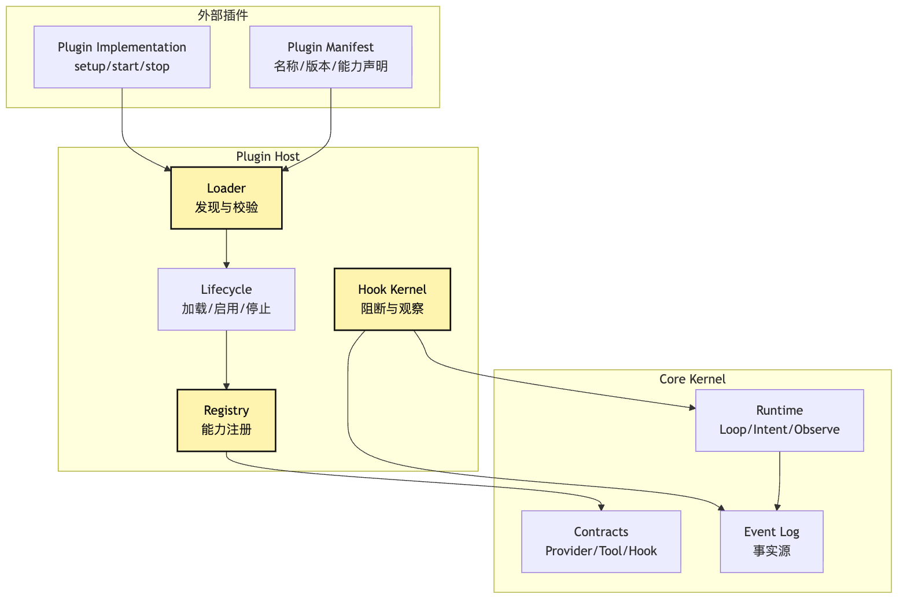
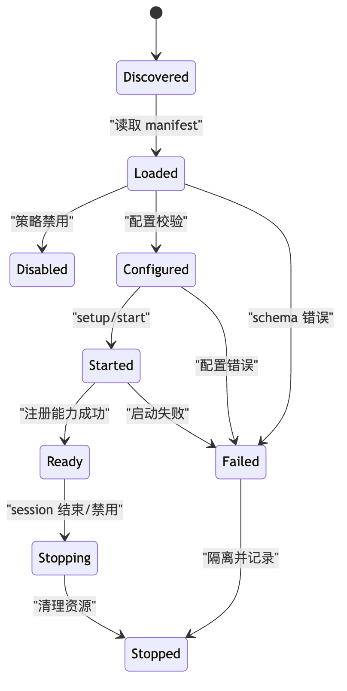
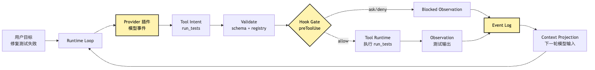

# Plugin Host：core 为什么要学会被扩展？

第 10 篇里，我们把一条很重要的边界钉住了：

```text
模型只提出 Intent。
系统负责 Validate、Approve、Execute、Observe。
```

这条边界让一个小型 CLI Agent 不至于变成“模型说什么，系统就干什么”。

但当你真的继续写下去，很快会遇到另一个问题。

最开始，我们的 core 里可以直接写死所有东西：

```text
一个 provider adapter
几个本地工具
一个权限判断函数
一个事件日志
一个 loop
```

这在 M0 很合理。

因为 M0 的目标不是做一个完整平台，而是先证明：

```text
真实模型可以被接入系统，但不会接管系统。
```

可是到了 M1，情况变了。

你会想接第二个 provider。

你会想把文件工具、搜索工具、终端工具拆成独立 bundle。

你会想让项目自己注册某些 hook。

你会想让团队把内部系统、代码规范、审查流程、部署入口接进来。

你会想让不同工作区启用不同能力。

然后 core 开始膨胀。

一开始只是多几个 `if`。

很快就变成：

```text
如果 provider 是 openai，走这里。
如果 provider 是 anthropic，走那里。
如果工具来自本地 bundle，使用本地权限策略。
如果工具来自 MCP，先检查 server scope。
如果 hook 是 preToolUse，要能阻断。
如果 hook 是 postToolUse，只能观察。
如果插件禁用，就不要暴露它的工具。
如果插件启动失败，不要拖垮整个 agent。
```

到这一步，你会发现：

```text
core 不再只是 core。
core 变成了所有具体能力的垃圾桶。
```

这篇文章要回答的核心问题就是：

> 为什么一个 Agent Harness 的 core 必须学会被扩展？以及，为什么“可扩展”不是放开边界，而是把外部能力带进同一套 Harness 纪律？

这里先压住一个边界：

```text
core 学会被扩展，不等于 core 放手。
Plugin Host 不是让外部能力自由进入系统。
Plugin Host 是让外部能力排队进入同一套 Harness 纪律。
```

我们继续沿用整个系列的贯穿例子：

```text
用户在项目根目录输入：
帮我看看这个项目为什么测试失败，并把它修好。
```

这一次，Agent 已经具备 M0 的 core kernel。

它能调用模型。

它能接收 tool intent。

它知道 intent 和 execution 必须分开。

但现在我们要让它长出新能力：

```text
一个 provider 插件，提供不同模型供应商。
一个 local-tools 插件，提供 read/search/shell/edit。
一个 test-runner 插件，提供 npm test / pytest 的检测策略。
一个 policy 插件，提供项目级权限 hook。
```

问题是：

这些能力都来自 core 外部。

core 如何接收它们，同时不被它们污染？

这就是 Plugin Host 出现的原因。

## 问题链

先把这篇文章的问题链固定住：

```text
M0 core 可以直接内置 provider、tool、hook
-> 能力一多，core 会被具体模型、具体工具、具体策略污染
-> 污染后的 core 很难测试、很难替换、很难治理
-> 需要让外部能力以插件形式进入系统
-> 插件不能直接改 core，只能声明能力和生命周期
-> Plugin Host 负责加载、校验、注册、启动、停止插件
-> Registry 把外部能力转成内部统一 contract
-> Hook Kernel 把扩展点变成受控阻断点
-> 扩展不是绕过 Harness，而是进入同一套 Harness 纪律
```

这条链最重要的不是“插件让系统更灵活”。

灵活只是表面收益。

真正的收益是：

```text
core 不再需要知道所有具体能力。
core 只需要知道外部能力必须怎样进入系统。
```

画成图，大概是这样：


这张图里最关键的边界，是 `Core 污染` 和 `Plugin Host` 之间的边界。

没有 Plugin Host 时，core 会直接认识每一种 provider、每一种工具、每一种 hook。

有 Plugin Host 后，core 只认识几类稳定 contract：

```text
PluginManifest
ProviderContribution
ToolContribution
HookContribution
LifecycleContribution
```

插件可以很多。

contract 必须少。

插件可以来自不同来源。

进入系统后的能力形状必须统一。

这就是这一篇要讲的主线。

## 一、M0 core 为什么一开始应该内置能力

先不要急着把“内置”批判掉。

在 M0 阶段，把 provider、tool、hook 直接写进 core 是合理的。

因为那时我们还没有足够事实证明哪些边界稳定。

如果你一上来就设计一套完整插件系统，很容易把系统写成空洞架构：

```text
有 plugin interface，但没有真实插件。
有 lifecycle，但没有真实状态。
有 hook bus，但没有真实阻断点。
有 registry，但没有真实能力需要登记。
```

这种提前抽象的问题是：

它看起来很工程化，但没有被真实任务压过。

所以 M0 的策略应该是：

```text
先把核心路径跑通。
再观察哪些地方开始膨胀。
最后把膨胀点提炼成扩展边界。
```

例如在“小型 CLI Agent 修复测试失败”这个例子里，M0 可能只有三个工具：

```text
read_file
search_text
run_command
```

provider 也只有一个。

hook 可能只是一个很简单的权限函数：

```text
run_command 是否需要用户确认？
edit_file 是否允许修改当前工作区？
```

这时如果你硬要做插件系统，反而会增加认知负担。

读者还没理解 intent/execution 分离，就被迫理解插件加载、依赖顺序、启停状态、hook 顺序、命名冲突。

所以 M0 的简化不是错误。

它是故意把变量收窄。

但 M0 不是终点。

M0 之后，真正的问题会自己冒出来。

这也是这篇文章的态度：

```text
不是为了可扩展而可扩展。
是当具体能力开始污染 core 时，才把膨胀点提炼成 Plugin Host。
```

## 二、能力增多以后，core 会怎样被污染

让我们继续往前走一步。

用户说：

```text
帮我看看这个项目为什么测试失败，并把它修好。
```

Agent 现在要更聪明一点。

它不只会跑一个固定命令。

它要能判断这是 Node 项目还是 Python 项目。

它要能读 package manager。

它要能在不同模型之间切换。

它要能让项目提供自己的安全策略。

它要能在命令执行前后记录 trace。

如果没有插件边界，代码很可能慢慢长成这样：

```ts
async function runAgent(input: string, cwd: string) {
  const provider = config.provider === "anthropic"
    ? new AnthropicProvider(config.anthropic)
    : config.provider === "openai"
      ? new OpenAIProvider(config.openai)
      : new LocalProvider(config.local);

  const tools = [
    createReadTool(cwd),
    createSearchTool(cwd),
    createShellTool(cwd),
  ];

  if (isNodeProject(cwd)) {
    tools.push(createNpmTestTool(cwd));
  }

  if (isPythonProject(cwd)) {
    tools.push(createPytestTool(cwd));
  }

  if (config.enableGithub) {
    tools.push(createGithubTool(config.githubToken));
  }

  const preHooks = [];
  if (config.askBeforeShell) preHooks.push(confirmShellHook);
  if (config.projectPolicy) preHooks.push(projectPolicyHook);
  if (config.enterprisePolicy) preHooks.push(enterprisePolicyHook);

  // ...
}
```

这段代码的问题不在于它不能运行。

它很可能运行得很好。

问题在于它把四类变化混在了一起：

```text
模型供应商变化
工具能力变化
项目策略变化
运行时生命周期变化
```

当四类变化都进入 `runAgent()`，core 就不再是稳定控制系统。

它变成了一堆具体能力的组装脚本。

然后连测试也会变得很痛苦。

你想测 core 的 loop，却必须处理 provider 配置。

你想测 tool intent，却被 GitHub token 影响。

你想测权限 hook，却要初始化一堆无关工具。

你想换一个 test runner，却要改 core 文件。

这就是 core 污染。

污染不是代码变长。

污染是责任边界变脏。

Plugin Host 要解决的不是“代码怎么拆目录”。

它要解决的是：

```text
具体能力如何进入系统，
但不把具体能力的变化传染给 core。
```

## 三、Plugin Host 不是插件市场，而是受控入口

很多人一听到 Plugin Host，会先想到“插件市场”。

比如用户可以安装很多插件，系统能力无限扩展。

这个想法不算错，但对 Agent Harness 来说，它不是第一重点。

Agent Harness 里的 Plugin Host 首先不是 marketplace。

它首先是一个受控入口。

它回答的问题是：

```text
外部能力如果想进入 core，必须经过哪些步骤？
```

最小答案应该是：

```text
发现插件
读取声明
校验 contract
建立实例
注册能力
启动生命周期
接入 hook gate
发生错误时隔离
停止时清理资源
```

注意这里没有一句是：

```text
让插件直接拿到 core 对象随便改。
```

这很关键。

真正的 Plugin Host 不应该把 core 暴露成一个可随意操作的大对象：

```ts
plugin.activate(core);
```

如果 `core` 里面什么都能碰，插件边界就形同虚设。

插件可能直接改状态。

插件可能偷偷替换工具。

插件可能绕过权限。

插件可能把 secret 写进日志。

插件可能在 hook 里执行外部动作，却不经过 event log。

所以更稳的做法是：

```text
插件只提交贡献。
host 负责把贡献注册进系统。
```

也就是：

```ts
type PluginContribution = {
  providers?: ProviderContribution[];
  tools?: ToolContribution[];
  hooks?: HookContribution[];
  commands?: CommandContribution[];
};

type Plugin = {
  manifest: PluginManifest;
  setup(ctx: PluginSetupContext): Promise<PluginContribution>;
};
```

这里的 `PluginSetupContext` 也必须是受限的。

它可以提供 logger。

它可以提供配置读取。

它可以提供工作区信息。

它可以提供注册辅助函数。

但它不应该提供“随便执行工具”的入口。

更不应该提供“直接修改 session state”的入口。

Plugin Host 的第一条原则是：

```text
插件能声明能力，但不能越过 host 自行接管能力。
```

换句话说，插件贡献的是候选能力，不是执行权。

一个工具被插件贡献出来，只代表它进入了系统的能力目录。

它后面还要经历：

```text
registry 归一化
visibility / context projection
permission / hook gate
tool runtime execution
observation / event log
```

所以这里要记住三句话：

```text
registered 不等于 visible。
visible 不等于 executable。
executable 也不等于可以绕过 audit。
```

这是 Plugin Host 和 Harness 主线之间最重要的连接。

## 四、Plugin Host 的五个核心部件

为了让这个机制不飘，我们先把 Plugin Host 拆成五个部件：

```text
Manifest
Loader
Registry
Lifecycle
Hook Kernel
```

这五个部件的关系可以画成一张分层图：



这张图里，`外部插件` 没有直接连到 `Core Kernel`。

它必须先经过 `Plugin Host`。

这就是责任边界。

`Manifest` 让插件先自我说明。

`Loader` 负责把说明读出来，并判断它有没有资格进入系统。

`Lifecycle` 负责处理插件从“被发现”到“运行中”再到“停止”的过程。

`Registry` 负责把插件贡献的 provider、tool、hook 变成 core 能理解的统一对象。

`Hook Kernel` 负责把某些扩展点变成受控阻断点。

这五个部件合在一起，才是 Plugin Host。

如果只有 manifest，没有 lifecycle，插件状态就不可管理。

如果只有 registry，没有 hook kernel，插件只能扩展能力，不能安全介入流程。

如果只有 hook，没有 registry，hook 会变成散落在各处的回调。

如果 loader 直接把插件塞进 core，host 就只是一个目录扫描器。

所以 Plugin Host 的难点不是“加载一个文件”。

它的难点是：

```text
让外部能力进入系统以后，仍然服从 core 的 contract、event、permission 和 lifecycle。
```

## 五、Manifest：插件必须先说清楚自己是谁

插件进入系统之前，第一件事不是运行代码。

第一件事是读取 manifest。

manifest 是插件对 host 的最低承诺。

它至少应该回答：

```text
插件叫什么？
版本是多少？
它想贡献哪些能力？
它需要哪些配置？
它需要哪些权限？
它是否默认启用？
它依赖哪些 host capability？
它是否允许在当前 workspace 使用？
```

一个最小的 manifest 可以长这样：

```ts
type PluginManifest = {
  id: string;
  name: string;
  version: string;
  description?: string;
  contributes?: {
    providers?: string[];
    tools?: string[];
    hooks?: HookPoint[];
  };
  requires?: {
    hostVersion?: string;
    capabilities?: string[];
  };
  permissions?: PluginPermission[];
  defaultEnabled?: boolean;
};
```

注意 `permissions`。

很多插件系统会把权限问题推迟到工具调用时才处理。

但 Agent Harness 不能只在最后一刻才看权限。

因为插件在 setup 阶段就可能读取配置、打开连接、发现工具、订阅事件。

所以 manifest 里需要有一层静态声明：

```text
这个插件大概会接触什么能力。
```

例如：

```text
local-tools 插件需要 filesystem 和 shell。
github 插件需要 network 和 repo metadata。
provider 插件需要 model api key。
policy 插件需要读取项目策略文件。
```

manifest 不等于最终授权。

它更像入场申请。

真正执行某个具体 tool intent 时，仍然要走第 10 篇里的 validate、approve、execute。

但没有 manifest，host 连“这个插件准备把什么东西带进系统”都不知道。

这会让插件变成黑盒。

Plugin Host 的第二条原则是：

```text
插件必须先声明，再运行；能力必须先登记，再暴露。
```

这里还要加一个工程边界：

```text
manifest 是静态声明。
setup 是受限初始化。
tool execution 仍然属于 Tool Runtime。
```

不要因为插件在 setup 里能运行代码，就让它拥有执行工具或修改 session 的权力。

## 六、Loader：加载插件不是 require 一下

如果只做内部 demo，loader 可以很简单：

```ts
const plugin = await import(pluginPath);
```

但这不是 Plugin Host 的全部。

真正的 loader 至少要处理几件事：

```text
查找插件来源
读取 manifest
校验 schema
检查版本兼容
检查启用策略
检查权限声明
隔离加载错误
记录加载事件
```

这里的“来源”也不应该只有一个。

未来可能有：

```text
内置插件
项目插件
用户插件
企业托管插件
命令行临时启用插件
测试环境 fake 插件
```

不同来源的信任级别不同。

内置插件可以默认启用。

项目插件可能需要用户确认。

用户插件可能跨项目启用。

企业插件可能覆盖本地设置。

测试 fake 插件只应该在测试 runtime 里出现。

如果 loader 不记录来源，后面的 registry、permission、audit 都会失去上下文。

例如同样是一个 `run_tests` 工具：

```text
来自内置 local-tools bundle
来自项目插件
来自企业插件
来自第三方插件
```

它们在 UI 上可能看起来都是“运行测试”。

但系统治理上不能等价。

loader 应该把来源带进插件记录：

```ts
type LoadedPlugin = {
  id: string;
  source: "builtin" | "project" | "user" | "managed" | "test";
  manifest: PluginManifest;
  module: PluginModule;
  state: "loaded" | "disabled" | "failed";
};
```

这样，后面每个能力进入 registry 时，都可以知道它来自哪里。

这不是多余元数据。

这是审计和权限的基础。

这里也有一个需要尽早决定的问题：

```text
项目插件是否默认可信？
```

如果项目插件来自当前 workspace，它可能和代码仓库一样不完全可信。

M1 可以先只支持 builtin 和 test fake 插件。

如果要支持 project / user 插件，就需要再设计 allowlist、签名、sandbox 或显式确认策略。

这一点建议作者后续确认。

## 七、Registry：外部能力必须变成内部对象

Plugin Host 真正接住扩展能力的地方，是 registry。

插件不能把工具函数直接塞给模型。

插件不能把 provider SDK 直接暴露给 loop。

插件不能把 hook 函数直接挂到任意位置。

它必须把能力交给 registry。

registry 再把它们归一化成 core 的 contract。

例如 provider contribution：

```ts
type ProviderContribution = {
  id: string;
  displayName: string;
  createProvider(config: ProviderConfig): ProviderAdapter;
};
```

tool contribution：

```ts
type ToolContribution = {
  name: string;
  description: string;
  inputSchema: JsonSchema;
  risk: "read" | "write" | "execute" | "network";
  createHandler(ctx: ToolRuntimeContext): ToolHandler;
};
```

hook contribution：

```ts
type HookContribution = {
  point: HookPoint;
  id: string;
  order?: number;
  blocking: boolean;
  run(input: HookInput): Promise<HookDecision>;
};
```

这三个 contribution 的共同点是：

```text
它们都不是直接执行结果。
它们都是可注册、可校验、可审计的能力描述。
```

registry 要做的事包括：

```text
检查名字冲突
记录插件来源
保存能力 schema
标记风险级别
处理启用/禁用
暴露查询接口
为 runtime 生成可用能力视图
```

这让 core 的其他部分不需要知道能力来自哪个插件。

runtime 只问：

```text
当前 session 可用哪些 provider？
当前模型可以看见哪些 tools？
当前 hook point 有哪些 hook？
```

它不问：

```text
这个工具是哪个文件 import 出来的？
这个 provider 用了哪个 npm package？
这个 hook 是用户写的还是项目写的？
```

当然，audit 需要知道来源。

permission 也可能需要知道来源。

但这些信息通过 registry 元数据传递，而不是让 core 到处写插件分支。

这就是 registry 的价值：

```text
它把“外部能力很多”变成“内部能力形状稳定”。
```

还要注意一个容易混淆的点：

```text
Registry 记录系统有哪些能力。
Capability Discovery / Context Policy 决定这一轮模型看见哪些能力。
Tool Runtime 决定某个 intent 能否变成 execution。
```

这三层不能合并。

如果 registry 一注册工具，就直接暴露给模型，系统会很快失控。

更稳的链路应该是：

```text
Plugin Contribution
-> Registry
-> Capability / Context Projection
-> Visible Tool Schema
-> Model Tool Intent
-> Tool Runtime
```

## 八、Lifecycle：插件是活的，不是静态配置

很多教程讲插件，会停在 registry。

仿佛插件就是一些能力声明。

但在 Agent Harness 里，插件往往是活的。

provider 插件可能要初始化 SDK。

MCP 类插件可能要启动子进程或连接远程 server。

测试插件可能要扫描项目结构。

policy 插件可能要读取配置并监听变化。

telemetry 插件可能要打开输出通道。

所以 Plugin Host 必须有 lifecycle。

最小状态机可以是：

```text
discovered
-> loaded
-> configured
-> started
-> ready
-> stopping
-> stopped
-> failed
```

画成图：



这张图的重点不是状态名字。

重点是插件不应该只有“有”和“没有”两种状态。

一个插件可能被发现，但被策略禁用。

一个插件可能加载成功，但配置缺失。

一个插件可能启动失败，但不应该拖垮整个 core。

一个插件可能 ready，但某个 tool handler 执行失败。

这些状态必须可见。

否则当用户说“为什么这个 Agent 看不到 run_tests 工具”时，你只能猜。

有 lifecycle 后，系统可以明确回答：

```text
test-runner 插件已发现。
manifest 合法。
配置阶段失败。
原因是没有找到 package manager。
所以没有注册 run_tests 工具。
```

这就是 Harness 需要 lifecycle 的原因。

它不是为了写复杂架构。

它是为了让失败可解释。

这里还有一个实现细节：

```text
注册能力最好是可回滚的。
```

如果插件启动到一半失败，host 不应该留下半注册 provider、半注册 tool、半注册 hook。

否则 runtime 查询到的能力列表会变成脏状态。

所以 lifecycle 和 registry 应该一起设计：

```text
启动失败 -> 撤销本次 contribution
禁用插件 -> 隐藏或撤销插件能力
停止插件 -> 清理资源并记录事件
```

## 九、Hook Kernel：hook 不是普通事件监听

Plugin Host 最容易被写坏的地方，是 hook。

很多系统的 hook 只是事件监听：

```text
beforeRun
afterRun
onError
```

监听器收到事件以后做点额外事情。

比如记录日志、发送 telemetry、打印提示。

这类 hook 很有用，但它还不是 Agent Harness 里最关键的 hook。

Agent Harness 更需要的是 hook gate。

也就是可以阻断、改写、要求确认或拒绝某些动作的受控点。

例如：

```text
模型提出 run_command: npm test
-> preToolUse hook 检查这是读性质测试命令
-> allow
-> tool runtime 执行
```

再比如：

```text
模型提出 run_command: rm -rf node_modules
-> preToolUse hook 判断是破坏性 shell
-> ask 或 deny
-> 如果用户拒绝，execution 不发生
```

这和普通 event listener 完全不同。

普通 listener 是“发生以后告诉你”。

hook gate 是“发生以前必须过我”。

用图看更清楚：


这张图里最重要的责任边界，是 `Hook Kernel` 位于 `Runtime` 和 `Tool Runtime` 之间。

它不是 tool handler 的内部回调。

它也不是 event log 之后的观察者。

它站在 intent 变成 execution 之前。

这意味着 hook 的返回值必须是 runtime 能理解的决策对象，而不是随便打印一行日志。

例如：

```ts
type HookDecision =
  | { type: "allow"; reason?: string }
  | { type: "deny"; reason: string }
  | { type: "ask"; question: string; risk: RiskLevel }
  | { type: "amend"; intent: ToolIntent; reason: string };
```

`amend` 要非常谨慎。

因为改写 intent 等于改变模型提出的动作。

如果允许 hook 随便改写，就必须把原始 intent、改写后的 intent、改写理由全部写进 event log。

否则后续 replay 和审计会失真。

M1 阶段甚至可以先不做 `amend`。

先把下面三种走稳：

```text
allow
ask
deny
```

等 trace、replay、diff event、policy reason 都更成熟以后，再考虑开放 amend。

所以 Hook Kernel 的原则是：

```text
能阻断的 hook 必须结构化返回。
能改写的 hook 必须留下差异。
只能观察的 hook 不能伪装成 gate。
```

还要注意，Hook Kernel 不是 Permission Runtime 的替代品。

更准确的关系是：

```text
Hook Kernel 提供扩展点。
Policy / Permission 提供治理判断。
Runtime 根据 HookDecision 决定是否继续执行。
```

## 十、Plugin Host 如何接住“小型 CLI Agent 修测试”的场景

现在把这些概念放回贯穿例子。

用户输入：

```text
帮我看看这个项目为什么测试失败，并把它修好。
```

如果没有 Plugin Host，core 可能自己做所有判断：

```text
识别项目类型
决定测试命令
决定能不能跑 shell
执行命令
记录日志
把结果喂回模型
```

有 Plugin Host 后，这条链路会变成：

```text
core 负责 loop 和 intent/execution 纪律
provider 插件提供模型 adapter
local-tools 插件提供 read/search/shell/edit
test-runner 插件提供 project-aware run_tests 工具
policy 插件提供 preToolUse hook
trace 插件提供 postToolUse observer hook
```

但这些插件都不能绕开 core。

模型看到的仍然是 registry 投影出来的工具。

工具执行仍然经过 intent、validate、approve、execute、observe。

hook 阻断仍然写入 event log。

provider 仍然只返回 model event 和 tool intent。

完整链路可以画成这样：



这张图里，插件贡献了能力。

但主线仍然是 Harness 主线。

`Provider 插件` 没有直接执行工具。

`test-runner 插件` 没有直接把输出塞进 prompt。

`policy 插件` 没有直接修改 session state。

所有东西都通过 core 的 contract 回到统一管线。

这就是“扩展进入纪律”的意思。

可以再压缩成一句：

```text
插件扩展的是系统能力，不扩展模型的直接权力。
```

## 十一、扩展点要少，但要承重

写 Plugin Host 时，很容易犯一个错误：

```text
哪里有人想插入逻辑，就给哪里加 hook。
```

这会让系统很快变成 hook 丛林。

每一步都有 before/after。

每个对象都有 onChange。

每个错误都有 onError。

最后没人知道一个动作会触发哪些插件。

Agent Harness 里的扩展点应该少一些，但每个都要承重。

例如 M1 阶段可以先保留几类：

```text
provider 注册点
tool 注册点
preToolUse gate
postToolUse observer
contextProject hook
sessionStart/sessionEnd lifecycle
```

这里面最关键的是 `preToolUse`。

因为它站在 intent 和 execution 之间。

它能阻断外部世界变化。

`postToolUse` 也重要，但它只能观察已经发生的事实。

`contextProject` 很强，但也很危险，因为它会影响模型看到什么。

所以 context hook 必须比 ordinary observer 更严格。

它不能随便塞一堆文本进 prompt。

它必须返回结构化 context contribution：

```ts
type ContextContribution = {
  id: string;
  sourcePluginId: string;
  priority: number;
  tokensEstimate: number;
  content: ContextBlock;
};
```

否则插件会把 context policy 打穿。

当每个插件都觉得“我这段信息很重要”，模型上下文会迅速膨胀。

这就是为什么 Hook Kernel 必须和 Context Policy 保持距离：

```text
Hook 可以提出 context contribution。
Context Policy 决定这一轮到底放不放进去。
```

插件不是 prompt 的自由投喂者。

它只是候选上下文的提供者。

所以扩展点设计要坚持一条小原则：

```text
插件可以提出候选。
Harness 决定是否采纳。
```

这和 tool intent 的纪律是同构的。

模型提出 intent，不等于执行。

插件提出 contribution，不等于进入上下文或执行世界。

## 十二、命名空间：能力不能只靠人类记得不冲突

Plugin Host 还有一个很工程但很重要的问题：

命名冲突。

两个插件都可能贡献 `run_tests`。

两个 provider 都可能叫 `default`。

两个 hook 都可能叫 `policy`。

如果 registry 只用裸名字，就会出现混乱。

最简单的规则是：

```text
外部来源使用插件命名空间。
内部投影可以提供短别名。
```

例如：

```text
local-tools.read_file
local-tools.search_text
local-tools.run_command
test-runner.run_tests
github.open_issue
```

模型未必一定要看到完整名字。

UI 也可以显示友好名称。

但 registry、audit、permission 必须保存完整身份。

否则 event log 里只写：

```text
tool: run_tests
```

以后你不知道它到底来自哪个插件。

更好的事件记录是：

```json
{
  "tool": "test-runner.run_tests",
  "displayName": "Run Tests",
  "sourcePlugin": "test-runner",
  "sourceKind": "project",
  "intentId": "intent_123"
}
```

这不是洁癖。

这是 replay、audit 和 debug 的基本条件。

当 Agent 出错时，你要能追问：

```text
到底是模型选错了工具？
还是 registry 暴露了错误工具？
还是插件实现的工具行为不符合 schema？
还是 hook 错误允许了危险动作？
```

没有命名空间，这些问题都会糊在一起。

所以 registry 至少要保存：

```text
完整能力 id
人类显示名
来源插件
来源类型
插件版本
能力版本
风险等级
生命周期状态
```

这些信息不一定都要进 prompt。

但它们应该进入 event log 和 audit。

## 十三、错误隔离：插件失败不能等于系统失败

Plugin Host 让系统可扩展，也引入了新风险。

外部能力越多，失败来源越多。

插件可能 manifest 写错。

插件可能启动失败。

插件可能注册了非法 schema。

插件可能 tool handler 抛异常。

插件可能 hook 超时。

插件可能 provider adapter 返回了不合法事件。

如果这些错误直接冒泡到 core，Agent 会变得非常脆。

所以 Plugin Host 必须做错误隔离。

最小规则是：

```text
加载失败：插件进入 failed，不注册能力。
启动失败：插件进入 failed，已注册能力撤销。
单个工具失败：返回 tool observation error，不杀死 loop。
hook 超时：按 hook 类型决定 fail closed 或 fail open。
provider 错误：映射成 runtime error，不泄漏 provider raw error。
```

其中 hook 超时最值得单独讲。

如果是普通 observer hook，例如 telemetry 写入失败，通常不应该阻断用户任务。

这可以 fail open：

```text
记录 hook error，主流程继续。
```

但如果是 preToolUse policy hook，情况不同。

它是安全门。

安全门超时不能默认放行。

更合理的是 fail closed：

```text
阻断执行，生成 observation，告诉模型和用户：权限检查没有完成。
```

这条规则体现了 Hook Kernel 的关键判断：

```text
不是所有 hook 的失败策略都一样。
阻断型 hook 的失败本身就是一个阻断事实。
观察型 hook 的失败可以是旁路事实。
```

错误隔离的目标也不是“吞掉错误”。

而是把错误变成系统能解释、能记录、能恢复的状态。

插件失败以后，用户应该能看到：

```text
哪个插件失败？
失败发生在 load / configure / start / hook / tool handler 哪个阶段？
是否影响当前 visible tool set？
是否阻断当前 tool intent？
是否还能继续任务？
```

这才是 Harness 里的 Plugin Host。

不是保证插件永远不坏。

而是插件坏了以后，不让 core 失明。

## 十四、Plugin Host 和 MCP、Skill 的关系

这一篇虽然讲 Plugin Host，但读到这里你可能会想到两个相近概念：

```text
MCP
Skill
```

它们确实都和扩展有关。

但边界不同。

MCP 主要解决：

```text
外部系统如何以协议形式暴露 tools、resources、prompts。
```

Skill 主要解决：

```text
一类任务的方法论、流程约束、脚本和背景材料如何按需加载。
```

Plugin Host 主要解决：

```text
core 如何接收外部能力，并把它们纳入统一 contract、registry、lifecycle、hook gate。
```

所以它们不是互相替代。

更像三层不同入口：

```text
Plugin Host 是宿主机制。
MCP 可以作为插件贡献外部工具和资源。
Skill 可以作为插件或能力包贡献任务方法论。
```

Claude Code 的工程样板给我们的启发也在这里：

能力扩展不是一条路径。

有的扩展是工具协议。

有的扩展是任务经验。

有的扩展是 provider adapter。

有的扩展是 hook 和 policy。

但真正成熟的 Harness 会把它们收束到同一套运行纪律里：

```text
发现
声明
校验
注册
投影
执行
观察
审计
```

如果一个 MCP tool 进入系统以后能绕过权限，那它不是扩展，它是旁路。

如果一个 Skill 进入系统以后能无限污染上下文，那它不是能力包，它是 prompt 泄洪口。

如果一个 plugin 能直接改 core state，那它不是插件，它是未受控代码注入。

这就是边界。

这里也可以提前埋下第 17 篇的判断：

```text
Plugin Host 解决能力如何进入系统。
Capability Discovery 解决本轮模型应该看见哪些能力。
Tool Runtime 解决能力如何被受控执行。
```

三者相连，但不能互相替代。

## 十五、最小实现可以长什么样

现在把 M1 落到代码层。

我们不需要一开始就做完整插件生态。

M1 的目标可以非常克制：

```text
支持内置插件和测试 fake 插件。
支持 provider/tool/hook 三类 contribution。
支持 manifest 校验。
支持 registry 查询。
支持 preToolUse hook gate。
支持 lifecycle 状态和事件记录。
```

一个最小目录可以这样组织：

```text
src/
  core/
    contracts.ts
    runtime.ts
    events.ts
    registry.ts
  plugins/
    host.ts
    manifest.ts
    lifecycle.ts
    hook-kernel.ts
    builtin/
      provider-openai.ts
      local-tools.ts
      test-runner.ts
```

最小 host 伪代码：

```ts
export class PluginHost {
  constructor(
    private registry: CapabilityRegistry,
    private hooks: HookKernel,
    private events: EventSink,
  ) {}

  async load(pluginModule: PluginModule, source: PluginSource) {
    const manifest = parseAndValidateManifest(pluginModule.manifest);

    this.events.append({
      type: "plugin.loaded",
      pluginId: manifest.id,
      source,
    });

    const ctx = createSetupContext({ manifest, source });
    const contribution = await pluginModule.setup(ctx);

    for (const provider of contribution.providers ?? []) {
      this.registry.registerProvider(manifest.id, source, provider);
    }

    for (const tool of contribution.tools ?? []) {
      this.registry.registerTool(manifest.id, source, tool);
    }

    for (const hook of contribution.hooks ?? []) {
      this.hooks.register(manifest.id, source, hook);
    }

    this.events.append({
      type: "plugin.ready",
      pluginId: manifest.id,
    });
  }
}
```

这段代码故意没有让插件拿到 `runtime`。

也没有让插件直接改 `state`。

插件能做的事，是把 contribution 交给 host。

host 再决定如何注册。

真实实现里，这里还要加错误处理和回滚。

比如：

```text
setup 失败 -> plugin.failed，不注册 contribution
注册中途失败 -> 撤销已注册 contribution
插件禁用 -> 从 visible/query 结果中移除
```

再看 hook kernel 的最小形状：

```ts
export class HookKernel {
  private hooks = new Map<HookPoint, RegisteredHook[]>();

  async runPreToolUse(intent: ToolIntent): Promise<HookDecision> {
    const hooks = this.hooks.get("preToolUse") ?? [];

    for (const hook of sortByOrder(hooks)) {
      const decision = await withTimeout(
        hook.run({ intent }),
        hook.timeoutMs ?? 1000,
      );

      if (decision.type === "deny" || decision.type === "ask") {
        return decision;
      }

      if (decision.type === "amend") {
        return decision;
      }
    }

    return { type: "allow" };
  }
}
```

真实系统会更复杂。

但最小版本已经体现了关键边界：

```text
hook 不是随便触发。
hook 有点位。
hook 有顺序。
hook 有超时。
hook 返回结构化决策。
runtime 根据决策继续或停止。
```

这就足够把 M1 的骨架立住。

## 十六、M1 应该测什么

Plugin Host 最需要测试的不是“能不能加载插件”。

那只是入口。

真正应该测的是边界。

第一类测试：manifest 校验。

```text
缺少 id 应该失败。
非法 version 应该失败。
声明未知 hook point 应该失败。
声明危险权限但策略不允许时应该 disabled。
```

第二类测试：registry 隔离。

```text
两个插件注册同名工具时，完整 id 不冲突。
禁用插件后，它贡献的工具不可见。
插件启动失败时，不留下半注册能力。
runtime 查询到的是统一 ToolDescriptor。
```

第三类测试：hook gate。

```text
preToolUse allow 时，Tool Runtime 继续执行。
preToolUse deny 时，execution 不发生。
preToolUse ask 时，session 暂停等待确认。
preToolUse 超时时，policy hook fail closed。
postToolUse 超时时，observer hook fail open。
```

第四类测试：事件日志。

```text
plugin.loaded 被记录。
plugin.ready 被记录。
plugin.failed 被记录。
hook decision 被记录。
blocked execution 被记录。
tool observation 保留 sourcePlugin。
```

第五类测试：贯穿路径。

```text
fake provider 提出 run_tests intent。
fake test-runner 插件提供 run_tests。
fake policy hook allow npm test。
tool runtime 执行 fake command。
observation 回到下一轮模型输入。
```

这类测试会证明：

```text
插件进入系统以后，仍然走同一条 Harness 管线。
```

如果测试只证明“插件函数被调用了”，那还不够。

我们要证明的是：

```text
插件没有绕过 core。
```

## 十七、几个常见坏味道

写到这里，可以总结几个 Plugin Host 的坏味道。

第一个坏味道：

```text
plugin.activate(core)
```

如果插件拿到完整 core，它几乎一定会越界。

更稳的是让插件返回 contribution。

第二个坏味道：

```text
hook 只是 EventEmitter
```

事件监听有用，但不能替代 gate。

第 10 篇讲过，execution 之前必须有 approve。

Hook Kernel 就是 approve 前后的扩展点承载层。

第三个坏味道：

```text
工具注册以后直接给模型看
```

工具要先经过 registry、policy、context projection 或 capability discovery。

不是所有注册工具都应该在每一轮暴露给模型。

第四个坏味道：

```text
插件失败直接抛到主 loop
```

插件失败应该变成可解释状态和 observation。

除非它破坏了 core invariants，否则不应该让整个 session 崩掉。

第五个坏味道：

```text
hook 可以偷偷改 prompt
```

context contribution 必须受 Context Policy 管理。

插件不能把自己想说的话直接塞进模型上下文。

第六个坏味道：

```text
事件日志只记录工具名，不记录插件来源
```

这会让 debug 和 replay 失去事实依据。

工具名、人类显示名、完整能力 id、插件来源，都应该进入事件。

第七个坏味道：

```text
插件贡献能力时顺手执行初始化动作。
```

比如在 setup 阶段就跑 shell、读敏感文件、写 session state。

这会把插件加载变成隐藏执行。

M1 阶段应该尽量让 setup 保持受限，真正有副作用的动作仍然进入 Tool Runtime 或 Lifecycle event。

第八个坏味道：

```text
把 Plugin Host 当成 MCP / Skill 的替代品。
```

Plugin Host 是宿主机制。

MCP 是外部能力协议。

Skill 是任务经验包。

它们可以相互连接，但不能互相吞掉。

## 十八、这一篇到底交付了什么

到这里，第 11 篇完成的是 M1 的第一半：

```text
core 不再直接内置所有能力。
core 学会通过 Plugin Host 接收外部能力。
```

但要注意，这不是把 core 变弱。

恰恰相反。

Plugin Host 让 core 更强。

因为 core 不再被具体 provider、具体工具、具体 hook 细节拖走。

它把控制权收束到几条稳定纪律：

```text
插件必须声明。
声明必须校验。
能力必须登记。
登记必须带来源。
hook 必须结构化决策。
执行必须经过 runtime。
事实必须进入 event log。
上下文必须由 policy 投影。
```

这就是“core 学会被扩展”的真正含义。

不是 core 放手。

而是 core 学会用更小、更稳定的 contract 管住更多外部能力。

如果用一句话记住这篇：

> Plugin Host 不是把边界打开，而是让外部能力排队进入同一套 Harness 纪律。

下一篇会继续沿着 provider 往下走。

当 provider 也变成插件贡献的一类能力以后，一个新问题会出现：

```text
provider 为什么只能返回 tool intent，而不能自己执行工具？
```

这会把我们带到 Provider Runtime。

也就是模型供应商、流式事件、tool call、error mapping 和 system runtime 之间更细的边界。

## 落地到教学 Harness

最小 Plugin Host 不必先做插件市场，只要把可替换点留出来：provider 实现 `TeachingModel`，工具通过 `registry.register()` 加入，权限策略通过 `beforeToolCall` hook 接入，UI 只读取工具 definitions。这样 core 稳定，扩展发生在边界上，而不是到处 if/else。

---

GitHub 地址: [00-11-plugin-host-core-extension.md](https://github.com/LienJack/build-harness/blob/main/docs/zh/00-11-plugin-host-core-extension.md)
