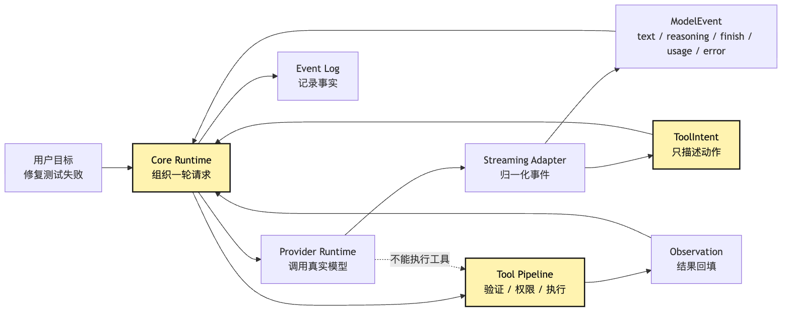

# Provider Runtime：把模型输出归一成 ToolIntent

从这一篇开始，前面的边界变成默认前提：

```text
模型只提出 intent，执行权在 runtime。
```

现在往前走一步，问题变得更代码化：

```text
我们不再只调一个 provider。
我们要接真实模型、真实 streaming、真实 function calling、真实工具增量参数。
```

这时，很多人会自然地写出一个“很顺手”的实现。

比如我们在小型 CLI Agent 里接入某个 AI SDK。

用户输入：

```text
帮我看看这个项目为什么测试失败，并把它修好。
```

模型在 streaming 里返回一个工具调用：

```json
{
  "toolName": "bash",
  "input": {
    "command": "npm test"
  }
}
```

SDK 看起来已经把工具调用这件事包装好了。

有些 SDK 甚至允许我们在工具定义里直接写 `execute` 函数。

于是代码会变得非常诱人：

```ts
const result = await streamText({
  model,
  messages,
  tools: {
    bash: tool({
      description: "Run a shell command",
      inputSchema: z.object({
        command: z.string(),
      }),
      execute: async ({ command }) => runShell(command),
    }),
  },
});
```

这段代码跑起来很爽。

模型提出 `bash`。

SDK 调用 `execute`。

命令执行。

结果回给模型。

终端里开始出现一个“会修测试”的 Agent。

但这也是第 12 篇要专门拆开的陷阱：SDK 的 `execute` 入口很方便，也很容易在 provider runtime 里长出第二套 loop。

**provider runtime 一旦负责执行工具，它就不再是 provider runtime，而是在系统内部长出了半个 Agent。**

最后，整个 Harness 会变成两套循环：

```text
core 里有一套 loop。
provider runtime 里又偷偷有一套 loop。
```

这篇文章要回答的核心问题是：

> provider 接真实模型后，为什么只能把 streaming、errors、tool-call delta 规范化成 model events 和 tool intent，而不能自己执行工具？

这里的“只能返回 tool intent”，不是说 Provider Runtime 只会返回一种事件。

它当然还会返回文本、reasoning delta、finish、usage 和 provider error。

这句话真正想强调的是：

```text
Provider Runtime 可以返回模型事件。
但工具相关输出只能停在 ToolIntent。
不能越过 Core，直接变成 ToolExecution。
```

先给结论：

```text
Provider Runtime 是模型协议适配层。
Tool Runtime 才是执行层。
Core Kernel 才是状态、权限、事件和回放的事实源。
```

因此，Provider Runtime 的接口里不应该出现 `executeTool`、`approveTool`、`runLoop`、`writeObservation`。它只负责把 provider 私有格式翻译成内部事件。

## SDK execute 入口为什么会长出隐藏 loop

这篇文章的新增对象是 provider 翻译层：

```text
真实 provider 会返回文本、reasoning、tool-call delta、finish、usage 和 error
-> AI SDK / provider SDK 往往提供便捷的工具执行入口
-> 如果 provider runtime 直接执行工具，它会变成隐藏的 Agent loop
-> 隐藏 loop 会绕过 core 的 state、permission、audit、retry 和 replay
-> 所以 provider runtime 必须只做协议归一化
-> 模型输出被翻译成 ModelEvent 和 ToolIntent
-> ToolIntent 进入 core 的事件日志和 tool pipeline
-> Tool Runtime 再负责 validate、permission、execute、observe
-> provider 可以被替换，执行语义不能被替换
```

画成总览图，是这样：



看这张图时，先看这条断边：

```text
Provider Runtime -X-> Tool Execution
```

provider runtime 可以看见模型输出。

它也必须理解模型输出里的工具调用格式。

但它不能把工具调用直接变成外部动作。

它只能把工具调用翻译成系统内部的 `ToolIntent`。

真正执行，要回到 core 里的 tool pipeline。

这样做的代价是多写一层 adapter。

但收益很大：

```text
模型供应商可以换。
AI SDK 可以换。
streaming 格式可以换。
工具执行、权限审计、状态回放仍然不换。
```

这就是 Provider Runtime 的位置。

## 一、provider 最容易膨胀成“半个 Agent”

先从一个最常见的开发路径开始。

我们已经有一个 CLI Agent。

它能读取用户输入。

它能调用模型。

它有一个最小 loop。

现在我们要让它拥有工具调用能力。

于是我们给模型传 tools：

```ts
const tools = {
  readFile: {
    description: "Read a file from the workspace",
    inputSchema: z.object({
      path: z.string(),
    }),
  },
  bash: {
    description: "Run a shell command",
    inputSchema: z.object({
      command: z.string(),
    }),
  },
};
```

模型看到工具定义后，会在合适的时候返回工具调用。

对于“修复测试失败”这个任务，第一轮很可能是：

```json
{
  "toolName": "bash",
  "input": {
    "command": "npm test"
  }
}
```

到这里都很正常。

模型只是提出了下一步。

真正的分叉发生在下一行代码。

我们到底是在 provider runtime 里直接执行：

```ts
if (part.type === "tool-call") {
  const result = await tools[part.toolName].execute(part.input);
  providerMessages.push(toToolResult(part, result));
}
```

还是把它交给 core：

```ts
if (part.type === "tool-call") {
  emit({
    type: "tool_intent",
    intent: normalizeToolIntent(part),
  });
}
```

这两段代码差别看起来很小。

第一段更方便。

第二段更啰嗦。

但它们代表两种完全不同的系统。

第一段让 provider runtime 变成执行者。

第二段让 provider runtime 保持适配层。

如果我们选择第一段，provider runtime 很快会继续膨胀。

它需要知道 tool registry。

它需要知道哪个工具只读。

它需要知道 `bash` 的风险等级。

它需要知道用户是否允许自动执行。

它需要知道 command timeout。

它需要截断 stdout。

它需要把 tool result 转回 provider 私有消息格式。

它需要处理工具失败。

它需要决定是否继续下一轮模型调用。

到这里，它已经不只是 provider runtime 了。

它已经在 provider adapter 里写出了一个隐藏 ReAct loop。

### 隐藏 loop 的危险

隐藏 loop 最麻烦的地方不是“代码重复”。

而是权力位置变了。

原本的系统设计是：

```text
Core Runtime 决定一轮任务怎么推进。
Provider Runtime 只负责和模型通信。
Tool Runtime 只负责受控执行。
Event Log 记录发生过什么。
```

一旦 provider runtime 自己执行工具，链路就变成：

```text
Provider Runtime 收到模型事件
-> 直接执行工具
-> 直接把结果塞回 provider messages
-> 继续调用模型
-> 最后只把最终答案交给 core
```

core 看到的只是一个“模型调用结束了”。

它看不到中间发生了什么。

比如用户问：

```text
刚刚你为什么改了 src/parser.ts？
```

core 可能答不上来。

因为真正的执行发生在 provider runtime 内部。

再比如测试失败后 provider runtime 自动又跑了一次 `npm install`。

core 也许只记录了“provider request succeeded”。

但没有记录：

```text
模型提出了 npm install
系统是否校验过命令
权限是否询问过用户
执行时 cwd 是哪里
stdout 是否被截断
exit code 是多少
耗时多少
是否改变了 lockfile
```

这对一个 demo 不致命。

对一个 Harness 是致命的。

因为 Harness 的价值就在于它能回答：

```text
发生过什么？
为什么允许？
失败在哪里？
能不能恢复？
能不能重放？
能不能评估？
```

provider runtime 只要绕开 core，这些问题就没有统一事实源。

## 二、三层对象：provider call、内部 intent、真实 execution

要守住边界，先要把三个词拆开。

很多框架文档会把它们统称为 tool calling。

但在 Harness 里，它们最好是三个对象：

```text
Tool Call：provider 或 SDK 返回的原始工具调用片段。
Tool Intent：core 内部可处理的行动提议。
Tool Execution：runtime 真正执行工具造成的外部动作。
```

这三者处在不同层。


图里最重要的是层与层之间的翻译。

`Tool Call` 是 provider 的语言。

它可能长这样：

```json
{
  "id": "call_abc",
  "type": "function",
  "function": {
    "name": "read_file",
    "arguments": "{\"path\":\"package.json\"}"
  }
}
```

也可能长这样：

```json
{
  "type": "tool_use",
  "id": "toolu_123",
  "name": "read_file",
  "input": {
    "path": "package.json"
  }
}
```

也可能在 streaming 里先来一小段：

```json
{
  "type": "tool-call-delta",
  "toolCallId": "call_abc",
  "toolName": "bash",
  "argsTextDelta": "{\"command\":\"npm"
}
```

然后再来一段：

```json
{
  "type": "tool-call-delta",
  "toolCallId": "call_abc",
  "argsTextDelta": " test\"}"
}
```

这些都是 provider 事件。

它们还不是系统内部的行动对象。

Provider Runtime 要做的是把这些东西收束成稳定的 `ToolIntent`：

```ts
type ToolIntent = {
  id: string;
  providerCallId?: string;
  toolName: string;
  input: unknown;
  rawInputText?: string;
  source: {
    provider: string;
    model: string;
    requestId?: string;
    streamIndex?: number;
  };
  status: "proposed";
};
```

这个对象有几个关键点。

第一，它叫 `Intent`，不叫 `Execution`。

它只表示模型提出了一个行动请求。

第二，它保留 `providerCallId`，但不把 provider 原始格式变成 core 的主数据结构。

core 可以追溯来源，但不依赖来源格式。

第三，它允许保存 `rawInputText`。

这对 streaming 很重要。

有些 provider 会把工具参数以字符串增量发出来。

在 JSON 还没闭合前，runtime 不能急着执行。

第四，它只进入 `proposed` 状态。

后面的 `validated`、`approved`、`executed`、`observed`，都不应该由 provider runtime 设置。

### 为什么名字很重要

很多架构 bug，都是从命名含糊开始的。

如果我们把 provider 返回的东西叫 `ToolInvocation`，很容易误导自己：

```text
既然是 invocation，那是不是已经调用了？
```

如果叫 `ToolCall`，也容易混在 provider 私有格式里。

而 `ToolIntent` 刻意保留了一个距离：

```text
这只是模型的行动意图。
```

对于我们的小型 CLI Agent，这个距离很实际。

当模型提出：

```json
{
  "toolName": "bash",
  "input": {
    "command": "rm -rf node_modules && npm install"
  }
}
```

系统不应该因为 JSON 合法就执行。

它应该先把这件事记录成：

```text
模型提出了一个高风险 bash intent。
```

然后交给后面的校验、权限和审批。

## 三、AI SDK Bridge：可以借桥，但不能把控制权交给桥

这一篇标题里有 Provider Runtime，也有 AI SDK Bridge。

为什么要专门说 Bridge？

因为现代 SDK 已经做了很多好事。

它们通常能提供：

```text
统一的 provider 接入
generateText / streamText 这类高层 API
streaming part
tool call 和 tool-call delta
finish reason
usage
error part
telemetry
甚至多步工具调用
```

这些能力对我们非常有用。

它们能减少大量 provider adapter 的重复劳动。

但这里有一条边界要清楚：

```text
AI SDK 可以作为 provider bridge。
不能成为 Harness 的执行核心。
```

换句话说，我们可以借它做协议归一化。

但不能把工具执行权交出去。

AI SDK Bridge 可以是 Provider Runtime 的一种实现方式。

但它不是新的 Core。

也不是新的 Tool Runtime。

更不是新的 Harness 控制面。

### 两种接入方式

第一种是“SDK 托管工具执行”。

伪代码像这样：

```ts
await streamText({
  model,
  messages,
  tools: {
    readFile: tool({
      inputSchema: readFileSchema,
      execute: async (input) => fileSystem.read(input.path),
    }),
    bash: tool({
      inputSchema: bashSchema,
      execute: async (input) => shell.run(input.command),
    }),
  },
  stopWhen: isStepCount(5),
});
```

这对普通应用很方便。

比如一个天气问答机器人，模型调用 `getWeather`，SDK 执行函数，返回天气。

但对这套教程里的 Harness，这个接法太宽。

因为 `execute` 被挂在 SDK tool 上以后，工具执行生命周期就被 SDK 包住了。

我们当然可以在 `execute` 里再手动打日志、做权限、做审计。

但这会把 Harness 的核心控制点塞回 provider bridge。

最后每个 provider bridge 都要复制一遍 tool runtime。

第二种是“SDK 只输出 tool intent”。

伪代码像这样：

```ts
const result = streamText({
  model,
  messages,
  tools: describeToolsForModel(toolRegistry),
});

for await (const part of result.fullStream) {
  switch (part.type) {
    case "text":
      yield modelTextDelta(part);
      break;

    case "tool-call-delta":
      toolCallAssembler.push(part);
      break;

    case "tool-call":
      yield toolIntentEvent(normalizeToolCall(part));
      break;

    case "finish":
      yield modelFinish(part);
      break;

    case "error":
      yield providerError(part);
      break;
  }
}
```

这里 SDK 仍然帮我们做了 provider 抽象。

但它没有执行工具。

它只是让我们更容易拿到标准化的 stream parts。

然后由我们的 Provider Runtime 把这些 parts 进一步翻译成本教程自己的 `ModelEvent` 和 `ToolIntent`。

SDK 可以提供 stream parts。

但事件所有权要回到 Core。

这就是 Bridge 的正确位置：

```text
Bridge 是翻译器，不是代理人。
```

### 为什么不直接相信 SDK 的多步工具执行？

不是因为 SDK 不好。

恰恰相反，很多 SDK 的工具执行设计很成熟。

对于应用开发者来说，把工具函数交给 SDK，能快速完成从 tool call 到 tool result 的循环。

问题在于，我们这里构建的是一个 Harness。

Harness 的任务不是“最快得到一个能回答的结果”。

它的任务是把长任务拆成可控制、可观察、可恢复的事实链。

对于“修复测试失败”这种任务，一次工具执行不是普通函数调用。

它可能会：

```text
读取用户项目里的敏感文件
执行本地 shell
修改工作区
安装依赖
消耗很长时间
产生大量输出
触发权限确认
改变后续上下文
影响测试和回放
```

这类动作不应该藏在 provider SDK 的一次 generation step 里。

它必须穿过 Harness 的公共执行管线。

这样我们才能在后面加入：

```text
permission policy
hook gate
sandbox
audit ledger
result budget
observation truncation
retry classifier
session replay
eval trace
```

这些不是锦上添花。

它们就是 Agent 能不能被托管的核心。

## 四、Streaming Runtime：事件可以流动，执行不能抢跑

provider runtime 最复杂的地方通常不是普通文本。

普通文本很好处理：

```text
模型吐出 token delta
CLI 打印 token delta
event log 记录 text_delta
```

真正麻烦的是 streaming tool call。

很多 provider 或 SDK 会把工具调用拆成多个流式片段。

比如模型想运行：

```bash
npm test -- --runInBand
```

stream 里可能不是一次给完整 JSON。

而是这样：

```text
tool-call-start: id=call_1 name=bash
tool-call-delta: {"command":"npm
tool-call-delta:  test
tool-call-delta:  -- --runInBand"}
tool-call-end
```

这时 provider runtime 要做三件事。

第一，保存增量。

第二，等参数完整。

第三，产出 `ToolIntentProposed`。

它不能在看到第一个 delta 时就执行。

因为参数还没完整。

也不能在 JSON 刚好能 parse 时就执行。

因为模型可能还有后续 delta。

更不能边 streaming 边把半截参数交给 shell。

这听起来像常识。

但很多“边流边执行”的优化冲动，都会在这里冒出来。

我们要抗住这个冲动。


这张时序图里最重要的是 provider runtime 中间的两次自我克制。

它可以缓存 partial args。

它可以解析 complete input。

但它只把结果发给 core。

执行必须发生在 Tool Runtime。

### 为什么 streaming delta 要进入事件模型？

这里有一个细节。

我们是否要把每个 tool-call delta 都写进 event log？

答案取决于系统阶段。

M2 阶段可以先不把所有 delta 作为长期事实保存。

但 provider runtime 至少要能把它们变成内部临时状态，并在完整 intent 出现时记录足够来源信息。

比如：

```ts
type ToolIntentProposedEvent = {
  type: "tool_intent.proposed";
  intent: ToolIntent;
  assembledFrom?: {
    eventCount: number;
    firstOffset: number;
    lastOffset: number;
    hadRepair?: boolean;
  };
};
```

这样后面排查问题时，我们能知道：

```text
这个 intent 是一次完整 tool-call 事件来的。
还是由多个 delta 拼出来的。
拼接过程中有没有 JSON 修复。
有没有 provider 中断。
```

这对失败归因很重要。

比如模型返回了半截 JSON，然后连接断了。

这不是工具执行失败。

也不是权限拒绝。

这是 provider stream incomplete。

如果没有标准事件分类，后面 eval 看到的只会是“任务失败”。

但真正的修复方向完全不同。

所以 `tool_intent.delta` 是否进入长期 event log，可以留到后续阶段再决定。

M2 更重要的是：

```text
完整 intent 必须可追溯。
delta 拼接过程不能变成黑盒。
半截参数不能触发 execution。
```

## 五、错误映射：provider error 不是 tool error

provider runtime 另一个容易膨胀的位置，是错误处理。

当我们接真实 provider 后，会遇到很多错误：

```text
认证失败
余额不足
rate limit
overloaded
timeout
context length exceeded
bad request
model unavailable
stream interrupted
tool call JSON malformed
unsupported tool schema
```

这些错误里，有些属于 provider。

有些属于请求构造。

有些属于模型输出。

有些属于 tool intent 解析。

但它们都不是 tool execution error。

比如 `rate_limit`。

这说明模型调用被限制了。

它不代表 `bash` 工具失败。

再比如 `tool_call_json_malformed`。

这说明模型或 provider 返回了不可解析的工具参数。

它不代表 `readFile` 执行失败。

如果 provider runtime 自己执行工具，很容易把这些错误混在一起：

```text
模型没返回完整工具参数
-> 工具执行失败
-> Agent 继续让模型修复
```

但正确的分类应该是：

```text
provider stream incomplete
-> runtime 决定重试模型调用、请求模型重新发出 intent，或结束本轮
```

所以 Provider Runtime 需要一套 error taxonomy。

简化成 M2 阶段，可以先这样设计：

```ts
type ProviderErrorKind =
  | "auth"
  | "rate_limit"
  | "quota"
  | "timeout"
  | "overloaded"
  | "bad_request"
  | "context_length"
  | "stream_interrupted"
  | "unsupported_feature"
  | "malformed_tool_call"
  | "unknown";
```

然后映射成统一事件：

```ts
type ProviderErrorEvent = {
  type: "provider.error";
  kind: ProviderErrorKind;
  retryable: boolean;
  provider: string;
  model: string;
  requestId?: string;
  message: string;
  raw?: unknown;
};
```

这里的关键不是枚举写得多完整。

关键是错误归属不能乱。


看这张图时，先看左边那个分叉。

同样叫“失败”，但失败的层不同，系统应该采取的动作完全不同。

provider error 可能要重试或 fallback。

intent parse error 可能要让模型重发工具意图。

tool error 应该作为 observation 回给模型。

permission deny 应该作为治理事件记录。

validation error 应该阻止执行。

如果这些都在 provider runtime 里揉成一个 catch block，后面就没有可靠 Harness 可言。

错误分类不是为了好看。

它是为了让后续决策有明确依据：

```text
retry
fallback
compact
ask user
fail run
```

### fallback 也不能偷偷执行工具

M2 Provider Runtime 还会遇到 fallback。

比如主 provider rate limit 了，就切到备用 provider。

或者当前模型不支持某种工具 schema，就降级到另一个模型。

这也容易引出一个错误设计：

```text
既然 fallback 在 provider runtime 附近，
那工具执行也顺便在这里闭环吧。
```

不能。

fallback 只影响模型调用路径。

不影响工具执行所有权。

无论模型来自 provider A 还是 provider B，产出的都应该是同一种 `ModelEvent` 和 `ToolIntent`。

然后走同一条 tool pipeline。

更准确地说：

```text
Provider Runtime 要保证不同 provider 的输出能汇入统一事件。
Provider Resolver / Runtime Policy 决定这一轮该选哪个 provider。
Tool Runtime 仍然独立负责执行。
```

这样后续产品化 CLI 才能根据 profile、capability、成本、延迟和 fallback 策略选择模型，而不让 provider 私有格式穿透到 Core。

这也是 provider runtime 的价值：

```text
把 provider 差异挡在外面。
而不是把 provider 差异带进执行系统。
```

## 六、Core 需要看到完整承重链路

现在把整条链路串起来。

我们的 CLI Agent 接到用户请求：

```text
帮我看看这个项目为什么测试失败，并把它修好。
```

M2 以后，一轮运行应该长这样：

```text
CLI 接收用户目标
-> Core Runtime 创建 run
-> Context Projection 组装本轮模型输入
-> Provider Runtime 调真实模型
-> Provider Runtime 归一化 streaming events
-> 模型提出 ToolIntent: bash npm test
-> Core 记录 tool_intent.proposed
-> Tool Runtime 校验 command
-> Permission Runtime 判断是否允许
-> Bash Executor 在受控 cwd 执行
-> Observation 记录 exit code、stdout、stderr、truncation
-> Core 把 Observation 投影进下一轮 messages
-> Provider Runtime 再次调用模型
```

这条链路有点长。

但长得有意义。

它每一段都回答一个审计问题。

```text
谁提出？模型。
谁翻译？Provider Runtime。
谁记录？Core Event Log。
谁批准？Permission Runtime。
谁执行？Tool Runtime。
谁观察？Observation Builder。
谁回填？Core Context Projection。
```

画成图：


这张图可以先只抓闭环的位置。

闭环发生在 Core。

不是 provider。

模型调用只是闭环中的一个步骤。

工具执行也是闭环中的一个步骤。

状态投影、事件日志、权限和观察把它们连起来。

如果 provider runtime 自己循环调用模型和工具，Core 就只剩一个外壳。

那就不是 Harness。

那只是一个套着 core 名字的 provider agent。

### Core 为什么必须先记录 intent？

有人会问：

```text
为什么不等工具执行完以后再记一条 tool_result？
中间那条 tool_intent.proposed 有必要吗？
```

有必要。

因为 intent 是模型行为的证据。

execution 是系统行为的证据。

observation 是外部世界返回的证据。

三者不能合并。

比如模型提出：

```text
运行 npm test
```

系统实际执行：

```text
pnpm test
```

这可能是合理的。

因为项目 package manager 是 pnpm，runtime 做了命令规范化。

但这必须能被看见。

再比如模型提出：

```text
git reset --hard
```

系统拒绝。

这不是工具失败。

这是权限拒绝。

如果只记录最终结果：

```text
没有执行。
```

我们就失去了模型曾经提出危险动作的证据。

后面的 trace analysis、policy tuning、eval dataset 都依赖这些中间事实。

## 七、Provider Runtime 只暴露 stream()

讲到这里，可以落到代码边界。

M2 不是要写一个庞大的 provider framework。

它只需要把 Provider Runtime 的职责收窄到几个接口。

先定义输入：

```ts
type ModelRequest = {
  runId: string;
  turnId: string;
  model: string;
  messages: ModelMessage[];
  tools: ModelToolDescription[];
  options: {
    temperature?: number;
    maxOutputTokens?: number;
    abortSignal?: AbortSignal;
  };
};
```

这里的 `tools` 只是模型可见的工具描述。

它不包含执行函数。

它应该像这样：

```ts
type ModelToolDescription = {
  name: string;
  description: string;
  inputSchema: JsonSchema;
};
```

不要这样：

```ts
type WrongModelToolDescription = {
  name: string;
  description: string;
  inputSchema: JsonSchema;
  execute: (input: unknown) => Promise<unknown>;
};
```

这条边界很小，但非常关键。

传给 provider 的工具描述，只告诉模型“有哪些动作可以提议”。

不把“动作怎么执行”交给 provider。

再定义输出：

```ts
type ModelEvent =
  | ModelStarted
  | ModelTextDelta
  | ModelReasoningDelta
  | ToolIntentDelta
  | ToolIntentProposed
  | ModelFinished
  | ProviderError;
```

其中 `ToolIntentProposed` 是核心：

```ts
type ToolIntentProposed = {
  type: "tool_intent.proposed";
  id: string;
  turnId: string;
  intent: {
    toolName: string;
    input: unknown;
    providerCallId?: string;
  };
  provider: {
    name: string;
    model: string;
    requestId?: string;
  };
};
```

Provider Runtime 的主接口可以长这样：

```ts
interface ProviderRuntime {
  stream(request: ModelRequest): AsyncIterable<ModelEvent>;
}
```

注意，这个接口没有：

```text
executeTool()
runLoop()
continueUntilDone()
approveTool()
appendToolResult()
```

不是因为这些不重要。

而是因为它们属于其他层。

provider runtime 不应该知道用户是否允许 `bash`。

它不应该知道工具结果如何截断。

它不应该决定任务是否结束。

它只需要诚实地把模型事件翻译出来。

### Tool result 怎么回到 provider？

这里会出现一个实际问题。

如果 provider runtime 不执行工具，那工具结果最后怎么回到模型？

答案是：

```text
Core 把 Observation 投影成下一轮 ModelMessage。
Provider Runtime 只负责发送这些 messages。
```

也就是说，provider runtime 可以负责把内部 `ModelMessage` 翻译成 provider 需要的消息格式。

比如某些 provider 需要：

```json
{
  "role": "tool",
  "tool_call_id": "call_abc",
  "content": "test failed..."
}
```

另一些 provider 需要 content block：

```json
{
  "type": "tool_result",
  "tool_use_id": "toolu_123",
  "content": "test failed..."
}
```

这个翻译是 provider runtime 的职责。

但请注意，它翻译的是已经由 Core 认定的 `Observation`。

它不是自己执行工具得到 result。

所以消息投影可以这样分层：

```ts
const messages = contextProjection.buildModelMessages({
  sessionEvents,
  currentState,
  providerCapabilities,
});

for await (const event of providerRuntime.stream({
  messages,
  tools: describeToolsForModel(toolRegistry),
})) {
  await core.handleModelEvent(event);
}
```

工具结果回到模型的路仍然存在。

只是所有权回到了 Core。

## 八、从 provider 私有格式到内部事件

接下来具体看 Provider Runtime 的 adapter。

它通常包含四个小组件：

```text
Request Builder：把内部 ModelRequest 翻译成 provider 请求
Stream Normalizer：把 provider chunks 翻译成 ModelEvent
Tool Call Assembler：拼接 tool-call delta
Error Mapper：把 SDK / HTTP 错误翻译成 ProviderError
```

画成分层图：


这张图可以先只抓 Provider Runtime 的中间位置。

它两边都要懂一点。

左边，它要懂 Core 的内部事件。

右边，它要懂 provider 或 AI SDK 的流式片段。

但它不拥有任何外部动作。

### Request Builder

Request Builder 负责把系统内部请求翻译成 provider 请求。

它要处理：

```text
messages 格式
system / developer / user / assistant / tool 消息投影
tool schema 表达
model options
provider-specific headers 或 options
capability flags
```

但它不应该决定：

```text
这一轮能不能使用 bash
哪个文件可以读取
工具结果是否可信
上下文应该塞多少历史
```

这些在进入 Provider Runtime 之前就应该由 Core、Context Policy 和 Tool Visibility 决定。

Request Builder 只是把已经决定好的输入翻译成某家 provider 能听懂的格式。

### Stream Normalizer

Stream Normalizer 负责把 provider stream 翻译成内部事件。

例如：

```text
text delta -> model.text_delta
reasoning delta -> model.reasoning_delta
finish reason -> model.finished
usage -> model.usage
tool-call delta -> tool_intent.delta 或 assembler input
tool-call complete -> tool_intent.proposed
error part -> provider.error
```

这个组件很容易被写成一个大 switch。

早期可以接受。

但要注意输出必须是稳定内部事件。

不要把 provider 原始 chunk 一路泄漏到 Core。

可以保存 raw 作为 debug 附件。

但 Core 的业务判断应该只依赖内部事件。

这里还有一个后续需要作者确认的边界：

```text
如果 provider 返回 reasoning summary，可以作为可展示事件处理。
但不要把不可展示的模型内部推理当成 Core 的事实源。
```

### Tool Call Assembler

Tool Call Assembler 是 Provider Runtime 里最像“状态”的部分。

它需要按 provider call id 收集 delta。

例如：

```ts
class ToolCallAssembler {
  private calls = new Map<string, PartialToolCall>();

  push(delta: ProviderToolCallDelta): ToolIntentDelta | ToolIntentProposed {
    const current = this.merge(delta);

    if (!current.isComplete) {
      return {
        type: "tool_intent.delta",
        providerCallId: current.id,
        toolName: current.toolName,
        rawInputText: current.rawArgs,
      };
    }

    return {
      type: "tool_intent.proposed",
      id: createIntentId(),
      intent: {
        toolName: current.toolName,
        input: parseJson(current.rawArgs),
        providerCallId: current.id,
      },
      provider: current.provider,
    };
  }
}
```

这里的状态是临时解析状态。

不是 session state。

不是 conversation state。

不是 tool execution state。

所以它可以存在于 Provider Runtime 内部。

但只服务一个目的：

```text
把 provider delta 拼成完整 intent。
```

### Error Mapper

Error Mapper 负责把不同 provider 的错误统一化。

比如：

```text
HTTP 401 -> auth / retryable false
HTTP 429 -> rate_limit / retryable true
HTTP 529 -> overloaded / retryable true
context window exceeded -> context_length / retryable false until compacted
SDK abort -> aborted / retryable depends on caller
malformed tool args -> malformed_tool_call / retryable maybe
```

这让 Core 可以做统一决策：

```text
retry
fallback
compact context
ask user for config
end run
record failure
```

如果 provider runtime 把这些错误都 throw 出去，Core 会被迫识别每家 SDK 的异常类型。

那就又回到了第 7 篇说的 provider 污染。

实现时还可以继续把 `malformed_tool_call` 拆细：

```text
provider_stream_incomplete
intent_parse_failed
malformed_tool_call
```

它们都和工具执行失败不同。

## 九、为什么 provider 不能拥有 state

Provider Runtime 不执行工具，还不够。

它还不能拥有长期 state。

这里的 state 指的是：

```text
session event log
conversation state
tool result history
permission decisions
budget usage
retry history
context compaction decision
```

这些都属于 Core 或更上层 Runtime。

Provider Runtime 可以拥有一些临时状态：

```text
当前 stream 的 tool-call delta buffer
当前 request 的 provider request id
当前 response 的 usage accumulator
```

但这些状态应该随着一次 provider request 结束而结束。

不要把它做成：

```ts
class ProviderRuntime {
  private messages: Message[] = [];
  private toolResults: ToolResult[] = [];
  private permissions: PermissionDecision[] = [];
  private turnCount = 0;
}
```

这又是在 provider 里长 Agent。

正确的形状更像：

```ts
class AiSdkProviderRuntime implements ProviderRuntime {
  async *stream(request: ModelRequest): AsyncIterable<ModelEvent> {
    const providerRequest = this.buildRequest(request);
    const stream = this.aiSdk.stream(providerRequest);

    for await (const part of stream) {
      yield* this.normalize(part);
    }
  }
}
```

Provider Runtime 是无会话的，或者至少是 request-scoped。

它不应该知道“这已经是第几轮修测试”。

它只知道“这一轮模型请求的输入是什么，输出是什么”。

### session state 为什么不能放 provider？

因为 session state 是跨 provider 的。

今天我们用 provider A。

下一轮因为 rate limit fallback 到 provider B。

如果 session state 放在 provider A adapter 里，系统就很难切换。

更现实的是：

```text
第 1 轮用模型 A 读失败日志
第 2 轮用模型 B 判断修复方向
第 3 轮用模型 A 生成 patch
```

无论 provider 怎么切，session 都应该连续。

连续性的事实源只能是 Core 的 event log 和 state reducer。

不能是 provider runtime 的内部 messages 数组。

## 十、Replay：重放事件，不重跑外部世界

Provider Runtime 只能返回 intent，还有一个很重要的原因：replay。

长任务系统一定会需要 replay。

不是为了炫技。

而是因为我们需要调试：

```text
为什么这次修测试失败？
模型是否选错工具？
权限是否过严？
provider 是否中断？
工具输出是否截断太多？
context 是否漏了关键信息？
```

如果 provider runtime 自己执行工具，replay 时会很尴尬。

我们拿到一段 session：

```text
provider call
内部执行了 bash
内部执行了 readFile
内部执行了 edit
最终返回 answer
```

但 event log 里没有每个 intent、permission、execution、observation。

我们没法重建现场。

更危险的是，某些 replay 可能会重新触发工具。

比如旧 session 里有：

```text
模型提出：删除临时文件
provider runtime 执行：rm -rf tmp/cache
```

如果 replay 只是重新跑 provider loop，就可能再次执行删除。

这显然不行。

正确的 replay 语义应该是：

```text
重放事件，不重跑外部世界。
```

旧的 `ToolIntent` 可以重放。

旧的 `PermissionDecision` 可以重放。

旧的 `ToolExecutionStarted` 可以重放。

旧的 `Observation` 可以重放。

但 replay 不应该因为看到旧 intent 就再次执行工具。

这要求 intent、execution、observation 一开始就是分开的事件。

provider runtime 只返回 intent，正是为了让这条事件链可拆、可审计、可重放。

## 十一、一个完整的修测试回合

现在用贯穿例子走一遍。

用户在 CLI 输入：

```text
帮我看看这个项目为什么测试失败，并把它修好。
```

Core 创建 run：

```json
{
  "type": "run.started",
  "runId": "run_001",
  "goal": "修复测试失败"
}
```

Context Projection 构造模型输入。

Provider Runtime 调用模型。

模型先输出一段文本：

```text
我会先运行测试，查看当前失败信息。
```

Provider Runtime 发出：

```json
{
  "type": "model.text_delta",
  "text": "我会先运行测试，查看当前失败信息。"
}
```

随后模型提出工具调用。

provider 原始 stream 可能是：

```json
{
  "type": "tool-call",
  "id": "call_1",
  "toolName": "bash",
  "input": {
    "command": "npm test"
  }
}
```

Provider Runtime 不执行。

它只发出：

```json
{
  "type": "tool_intent.proposed",
  "intent": {
    "toolName": "bash",
    "input": {
      "command": "npm test"
    },
    "providerCallId": "call_1"
  }
}
```

Core 把它写入 event log。

Tool Runtime 做 schema validation。

Permission Runtime 判断：

```text
npm test 是读/执行类命令。
工作目录在项目内。
不修改文件。
可以自动放行。
```

然后 Bash Executor 执行。

Observation Builder 收集：

```json
{
  "exitCode": 1,
  "stdout": "...",
  "stderr": "Expected 4, received 5",
  "truncated": false
}
```

Core 再写入：

```json
{
  "type": "tool.observed",
  "toolName": "bash",
  "exitCode": 1
}
```

下一轮模型输入里，Provider Runtime 会看到一条已经投影好的 tool result message。

它只是把这条 message 翻译成 provider 格式。

它不会关心这条结果是怎么执行出来的。

模型接着提出：

```text
读取 tests/sum.test.ts 和 src/sum.ts。
```

Provider Runtime 继续产出两个 `ToolIntent`。

Core 决定是否允许并行读取。

Tool Runtime 执行两个 read。

Observation 进入日志。

模型基于文件内容提出 edit intent。

这时 Permission Runtime 可能要求用户确认。

所有这些，都不需要 provider runtime 知道。

它只承担一件事：

```text
把模型输出忠实地翻译成系统事件。
```

## 十二、常见坏味道

写 Provider Runtime 时，有几个坏味道一出现，就要停下来。

### 坏味道一：provider adapter 里出现 `execute`

如果 provider adapter 里开始出现：

```ts
await tool.execute(input)
```

基本就说明边界坏了。

除非这个 execute 只是执行 provider SDK 内部的网络请求，否则不要在 provider runtime 里调用工具。

工具执行应该在 Tool Runtime。

### 坏味道二：provider adapter 持有 `messages`

如果 provider runtime 有自己的长期 `messages` 数组，并且每次工具调用后自己 push tool result，要警惕。

这说明会话状态开始被 provider 吸收。

Provider Runtime 可以接受 `messages` 作为输入。

不能成为 messages 的事实源。

### 坏味道三：provider adapter 决定是否继续 loop

如果 provider runtime 里出现：

```ts
while (step < maxSteps) {
  callModel();
  executeTools();
}
```

那它已经不是 provider runtime。

它是 Agent Runtime。

loop 控制应该在 Core。

provider runtime 只处理一次模型请求或一次由 Core 明确发起的 stream。

### 坏味道四：把 provider raw chunk 存成核心事件

保留 raw chunk 做 debug 可以。

但如果 event log 里的主事件就是 provider 原始对象，后面会很痛苦。

因为换 provider 时，旧 session 和新 session 事件形状不同。

eval 和 replay 都会被供应商格式绑住。

### 坏味道五：工具结果截断发生在 provider runtime

工具结果截断看起来像“为了适配模型输入”。

但它其实属于 Observation Policy 和 Context Projection。

provider runtime 可以根据 provider 能力做最终格式转换。

但“保留多少 stdout”“如何摘要错误日志”“是否需要二次读取”，不应该由 provider adapter 决定。

### 坏味道六：fallback 后丢失 provider 选择证据

如果 fallback 发生了，系统应该能解释：

```text
为什么从 provider A 切到了 provider B？
是否因为 rate limit？
是否因为 context length？
是否因为 required capability 不满足？
fallback 后使用的是哪个 model？
这次切换是否进入 trace？
```

如果这些都藏在 provider adapter 内部，后续 trace 和 eval 会看不见模型路径变化。

fallback 可以改变模型调用路径。

但不应该改变事件语义。

### 坏味道七：provider capability 直接污染 profile / CLI

provider capability 很有用。

比如某个模型是否支持 tool call、JSON schema、reasoning summary、vision input、parallel tool calls。

但这些能力应该先被 Provider Runtime 归一化成内部 capability。

profile、CLI、resolver 不应该直接依赖某家 provider 的私有字段。

## 十三、最小测试应该怎么写

M2 这一层的测试，不应该只测“模型能回答”。

它要测边界。

第一类测试：provider tool call 被归一化成 intent。

```ts
it("normalizes provider tool calls into tool intent events", async () => {
  const provider = fakeProvider([
    providerToolCall({
      id: "call_1",
      name: "bash",
      input: { command: "npm test" },
    }),
  ]);

  const events = await collect(providerRuntime.stream(request));

  expect(events).toContainEqual({
    type: "tool_intent.proposed",
    intent: {
      toolName: "bash",
      input: { command: "npm test" },
      providerCallId: "call_1",
    },
  });
});
```

第二类测试：provider runtime 不执行工具。

```ts
it("does not execute tools inside provider runtime", async () => {
  const toolExecutor = vi.fn();

  await collect(providerRuntime.stream({
    ...request,
    tools: describeToolsForModel(registry),
  }));

  expect(toolExecutor).not.toHaveBeenCalled();
});
```

这类测试很重要。

它不是测功能。

它是测架构纪律。

第三类测试：tool-call delta 必须等完整后才产出 proposed intent。

```ts
it("assembles streamed tool call deltas before proposing intent", async () => {
  const events = await collect(providerRuntime.stream(deltaRequest));

  expect(events.map((event) => event.type)).toEqual([
    "model.started",
    "tool_intent.delta",
    "tool_intent.delta",
    "tool_intent.proposed",
    "model.finished",
  ]);
});
```

第四类测试：provider error 和 tool error 不能混。

```ts
it("maps provider errors without creating tool observations", async () => {
  const events = await collect(providerRuntime.stream(rateLimitedRequest));

  expect(events).toContainEqual(
    expect.objectContaining({
      type: "provider.error",
      kind: "rate_limit",
      retryable: true,
    })
  );

  expect(events.some((event) => event.type === "tool.observed")).toBe(false);
});
```

第五类测试：provider runtime 不持有 session state。

```ts
it("keeps provider runtime request-scoped", async () => {
  const first = await collect(providerRuntime.stream(firstRequest));
  const second = await collect(providerRuntime.stream(secondRequest));

  expect(first).not.toDependOn(second);
  expect(providerRuntime).not.toExposeSessionMessages();
});
```

第六类测试：tool result 是由 Core 投影后再交给 provider。

```ts
it("sends projected observations as model messages without executing tools", async () => {
  const messages = contextProjection.buildModelMessages({
    sessionEvents: [
      toolObservedEvent({
        providerCallId: "call_1",
        content: "npm test failed with exit code 1",
      }),
    ],
  });

  const providerRequest = requestBuilder.build({
    ...request,
    messages,
  });

  expect(providerRequest).toContainProviderToolResultMessage();
  expect(toolExecutor).not.toHaveBeenCalled();
});
```

这些测试会逼着代码保持清醒。

只要有人想把 tool execution 塞进 provider runtime，测试就会开始变别扭。

这正是好测试的价值。

## 十四、这一篇到底交付了什么

这一篇不是在交付完整 Tool Runtime。

也不是在交付完整 Permission Runtime。

它交付的是 M2 Provider Runtime 的边界：

```text
Provider Runtime 可以：
- 调用真实模型
- 适配 AI SDK 或 provider SDK
- 发送模型可见的 tool schema
- 归一化 text / reasoning / finish / usage
- 拼接 tool-call delta
- 产出 ToolIntent
- 映射 provider error
- 让 fallback 后的输出仍然汇入统一 ModelEvent

Provider Runtime 不可以：
- 执行工具
- 持有 session state
- 决定 loop 是否继续
- 做权限审批
- 截断工具结果
- 写入最终 observation
- 把 provider raw object 当成 core event
- 让 provider 私有格式穿透到 Core
```

它解决的问题是：

```text
真实 provider 可以接进系统。
但 provider 不能接管系统。
```

它引入的新复杂度是：

```text
我们需要标准 ModelEvent、ToolIntent、ProviderError 和 stream assembler。
```

它自然引出下一篇：

```text
既然 provider 只返回 tool intent，
那 Tool Runtime 怎么把 intent 变成 observation？
```

下一篇就会进入第三章的硬骨头：

```text
Tool Runtime：从 ToolIntent 到 Observation。
```

到那时，我们会把 `validate -> permission -> execute -> observe` 真正展开。

这一篇留下的边界很简单：

**provider 是模型的翻译官，不是工具的执行官。**

## 本章代码落点

真实模型接入时，provider runtime 只做格式适配：把 provider 的 tool-call 表达转换成内部 `ToolCallContent`，把内部 `ToolResultMessage` 转回 provider 需要的 tool message。它不读取文件，不运行命令，也不决定是否允许工具。这样换 provider 时不会影响 loop、tools 和 session。

---

GitHub 地址: [00-12-provider-runtime-tool-intent.md](https://github.com/LienJack/build-harness/blob/main/docs/zh/00-12-provider-runtime-tool-intent.md)
