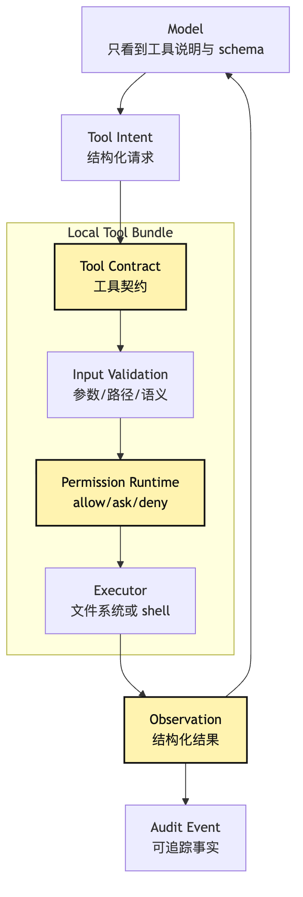
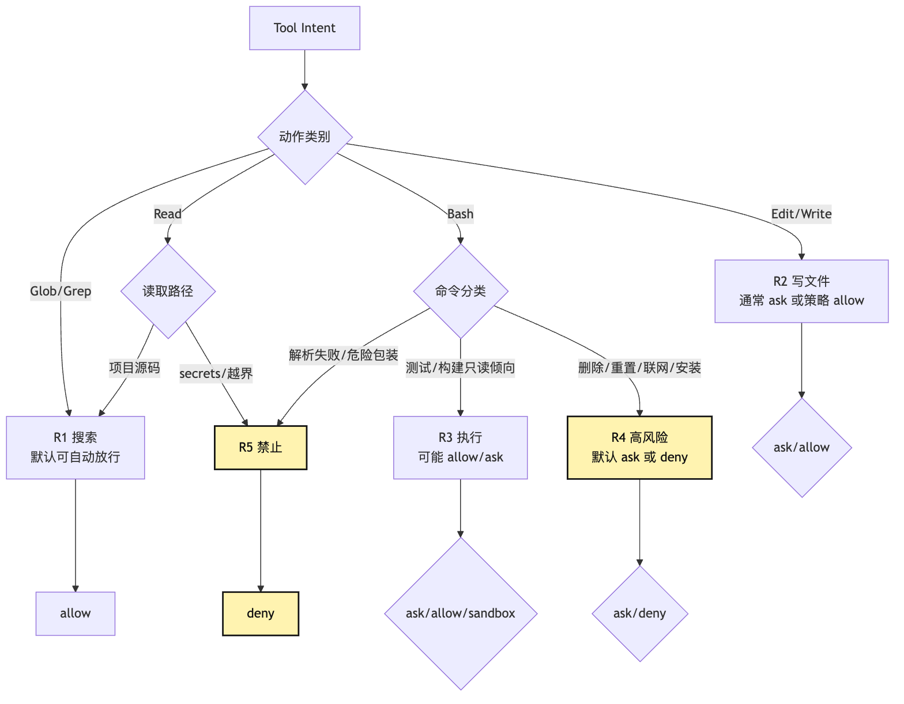
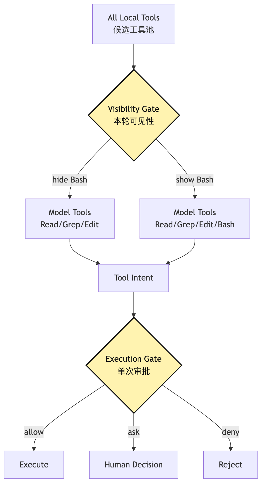
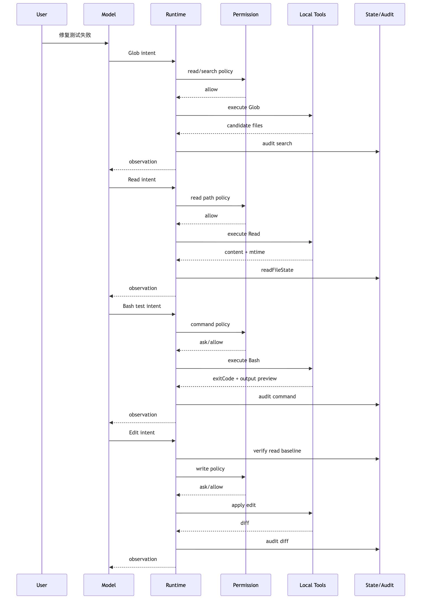

# Local Tool Bundle：文件、搜索、终端与权限运行时

到了这一步，很多人会忍不住把 Agent 的本地能力写成一组很直观的函数。

```text
read(path)
write(path, content)
edit(path, old, new)
search(pattern)
bash(command)
```

这看起来非常合理。

我们的小型 CLI Agent 要修复测试失败。

它当然要读文件。

它当然要搜索代码。

它当然要改文件。

它当然要运行测试。

如果没有这些能力，它只是一个会说话的代码顾问。

一旦有了这些能力，它才开始像一个真正能工作的开发助手。

但危险也正是在这里出现。

文件、搜索、终端，是本地 Agent 最早需要的能力。

也是最容易破坏真实文件、泄漏隐私信息、误执行命令、污染上下文的入口。

一个没有边界的 `read`，可能把 `.env`、SSH key、私有配置读进模型上下文。

一个没有基线的 `write`，可能覆盖用户刚刚手动修改的文件。

一个过宽的 `search`，可能把仓库里所有日志、构建产物和依赖目录塞进上下文。

一个裸露的 `bash`，可能从 `npm test` 滑到 `curl | bash`，再滑到 `git reset --hard`。

所以这一篇要回答的核心问题不是：

> 一个 Agent 要有哪些本地工具？

而是：

> 为什么 Local Tool Bundle 不是一组便利函数，而是一组带风险分级、工作目录边界、权限策略、输出预算、审计事件的受控能力？

我们继续沿用整个系列同一个例子。

用户在项目根目录对 CLI Agent 说：

```text
帮我看看这个项目为什么测试失败，并把它修好。
```

如果 Agent 真要把这件事做完，大概率会经历这样的动作链：

```text
搜索测试失败相关文件
-> 读取 package.json、测试文件、源代码
-> 运行测试拿到失败日志
-> 编辑一个源文件
-> 再运行测试
-> 查看 git diff 和 git status
-> 给用户总结修改
```

这条链路看起来像普通开发流程。

但放进 Agent Harness 里，它不能只是普通开发流程。

它必须变成一条可治理的运行时管线。

因为每一步都可能让模型接触真实项目。

每一步也都可能改变真实项目。

## 问题链

先把本篇的问题链固定住：

```text
本地 Agent 最先需要 read / write / edit / search / bash
-> 这些工具同时也是破坏文件和泄漏信息的入口
-> 不能把它们实现成一组裸函数
-> 每个工具都要声明动作语义、风险等级、工作目录边界和输出预算
-> 模型只提交结构化 intent
-> Tool Runtime 做 schema、语义、路径、权限、预算、审计
-> 不同工具走不同风险策略：读、搜、写、执行不能混在一起
-> observation 回到模型时必须是事实摘要，而不是无限日志
-> Local Tool Bundle 才能成为 Harness 的受控手脚
```

画成一张总图，本篇讨论的是第 10 篇那条工具执行管线里的本地能力层：


这里最容易被低估的是中间的 `Local Tool Bundle`。

它不是一个工具列表。

它是本地能力进入 Agent 循环的协议层。

协议层必须知道：

```text
这个动作读什么？
这个动作写什么？
它是否会启动子进程？
它是否可能联网？
它是否在当前工作目录内？
它输出多大？
它能不能并发？
它失败后如何变成 observation？
它是否需要人工确认？
它执行前后应该写入哪些审计事件？
```

如果这些问题没有在工具层回答，后面的 Permission、Audit、Replay、Evaluation 都会变成空话。

## 一、为什么不能把本地工具做成一组裸函数

我们先看一个最容易写出来的版本。

```ts
const tools = {
  read: async ({ path }) => fs.readFile(path, "utf8"),
  write: async ({ path, content }) => fs.writeFile(path, content),
  search: async ({ query }) => exec(`rg ${query}`),
  bash: async ({ command }) => exec(command),
}
```

这个版本的优点很明显。

少。

快。

能跑。

对 demo 来说，它已经足够让模型读文件、搜代码、跑测试。

但只要把任务换成真实仓库，它的问题也会很快出现。

### 1. 裸函数没有动作语义

`write(path, content)` 到底是创建新文件，还是覆盖已有文件？

`bash(command)` 到底是运行测试，还是删除目录？

`search(query)` 到底是在项目源码里搜，还是在整个 home 目录里搜？

这些问题不是实现细节。

它们决定工具能不能被自动放行。

决定能不能并发。

决定要不要展示 diff。

决定审计日志里要记什么。

裸函数只告诉系统“怎么做”。

没有告诉系统“这是什么动作”。

Agent Harness 需要的不是一堆函数，而是一组带语义的动作对象。

### 2. 裸函数没有工作目录边界

用户让 Agent 修复当前项目里的测试失败。

这意味着它的默认世界应该是当前 workspace。

可如果 `read` 接收任意路径，模型可能读到：

```text
/Users/me/.ssh/id_rsa
/Users/me/.env
/Users/me/Library/Application Support/...
/private/tmp/...
```

有时这不是模型恶意。

它可能只是看到错误日志里出现了一个绝对路径，然后顺手去读。

但对系统来说，结果一样危险。

所以 Local Tool Bundle 必须有 `cwd`、`workspaceRoots`、`allowedRoots`、`deniedPaths` 这些边界概念。

路径不是字符串。

路径是权限对象。

### 3. 裸函数没有输出预算

模型问：

```text
读一下 package-lock.json
```

如果工具直接返回完整内容，几十万行依赖锁文件就进了上下文。

模型问：

```text
搜索 error
```

如果工具把所有匹配都返回，日志、构建产物、依赖目录里的噪音会淹没真正线索。

模型运行：

```text
npm test
```

如果输出太长，失败点可能被截断在错误的位置。

工具输出不是越全越好。

输出必须受预算控制，而且必须告诉模型：

```text
你看到的是完整输出，还是 preview？
总共有多少行？
是否被截断？
下一步应该如何继续读取？
```

否则模型会把不完整观察当成完整事实。

这类 silent truncation 在 Agent 系统里非常致命。

### 4. 裸函数没有审计事件

如果用户问：

```text
你刚刚改了哪些文件？
```

裸函数只能靠模型记忆回答。

如果用户问：

```text
为什么你执行了这个命令？
```

裸函数没有记录模型原始 intent、权限决策、实际命令、退出码、输出摘要。

如果明天要做 session replay，裸函数也不知道哪些动作可以重放，哪些动作只能回放当时的 observation。

这就是为什么本地工具必须写事件。

不是为了日志好看。

而是为了让 Agent 的行动可以被解释、恢复、评估和追责。

## 二、Local Tool Bundle 应该长什么样

Local Tool Bundle 至少包含三类基础能力：

```text
文件工具：Read / Edit / Write
搜索工具：Glob / Grep
终端工具：Bash
```

有些系统会再加：

```text
List / Tree
Patch
Delete
Move
Open
TaskOutput
```

这里的 `Patch` 不应该被理解成一条绕过文件工具的捷径。

它更适合被看成 `Edit` 的批处理形态：仍然属于写工具，仍然要基于已观察过的文件状态，仍然要生成 diff，仍然要进入 permission、audit 和 replay。

但对我们这个小型 CLI Agent 来说，先把 `Read / Edit / Write / Glob / Grep / Bash` 做清楚就够了。

关键不是数量。

关键是每个工具都必须有统一的 contract。

一个本地工具定义应该至少回答：

```ts
type LocalToolDefinition = {
  name: string
  description: string
  inputSchema: JsonSchema
  outputSchema?: JsonSchema
  category: "file" | "search" | "terminal"
  risk: "read" | "search" | "write" | "execute"
  isReadOnly: boolean
  isConcurrencySafe: boolean
  requiresWorkspace: boolean
  validateInput(input: unknown, context: ToolContext): Promise<ValidationResult>
  checkPermission(input: unknown, context: ToolContext): Promise<PermissionDecision>
  call(input: unknown, context: ToolContext): Promise<ToolObservation>
}
```

这个定义看起来比裸函数重很多。

但每一项都是后面会用到的承重点。

`name` 和 `description` 用来暴露给模型。

`inputSchema` 用来把模型输出收束成结构化 intent。

`category` 和 `risk` 用来进入权限和调度。

`isReadOnly` 决定能不能自动放行、能不能并发。

`requiresWorkspace` 决定是否必须在项目根目录内执行。

`validateInput` 做路径、参数和语义校验。

`checkPermission` 做策略判断和人工确认。

`call` 才是真正接触文件系统或终端的地方。

换句话说：

```text
函数只是最后一步。
工具定义才是完整能力。
```

Local Tool Bundle 不是为了让模型拥有一个万能 shell。

它恰恰是为了把高语义动作从 Bash 里拆出来，让权限、审计和恢复都有抓手。

可以把这层画成一张分层图：



这张图里，模型没有直接碰到文件系统。

模型碰到的是工具契约。

文件系统只被 `Executor` 碰到。

而 `Executor` 前面有 schema、校验、权限、预算。

这就是第 10 篇的纪律在本地工具上的落地：

```text
模型提议。
系统执行。
工具运行时负责中间所有边界。
```

## 三、风险不是一个开关，而是按动作语义分层

本地工具最容易犯的错，是把权限做成一个总开关：

```text
allow tools
deny tools
```

这太粗了。

因为同样是工具，风险完全不同。

`Glob("**/*.ts")` 和 `Write("src/auth.ts")` 不在一个等级。

`Read("src/sum.ts")` 和 `Read(".env")` 也不在一个等级。

`Bash("npm test")` 和 `Bash("rm -rf dist")` 更不在一个等级。

Local Tool Bundle 至少要把风险切成几层：

```text
R0: 纯元信息动作，例如查看工具列表、读取会话状态
R1: 项目内只读动作，例如 Glob、Grep、Read 普通源码
R2: 项目内写动作，例如 Edit、Write
R3: 本地执行动作，例如 Bash 运行测试、构建、脚本
R4: 高风险执行动作，例如删除、重置、安装、联网、提权、写配置
R5: 禁止动作，例如读取 secrets、越界路径、危险 shell 包装器
```

真实系统可以更细。

但最少要有“读、搜、写、执行、危险执行、禁止”这几类。

这不是为了把权限做复杂。

而是为了让 Agent 不必在每一步都打断用户。

如果所有工具都要确认，Agent 会变得很烦。

如果所有工具都自动放行，Agent 会变得很危险。

风险分级的目的，是让常见低风险动作顺滑，让高风险动作清晰地停下来。



注意这里有两个容易混淆的点。

第一，风险等级不是工具名决定的。

`Read` 通常低风险，但读 `.env` 高风险。

`Bash` 通常高风险，但 `git status` 可能近似只读。

`Grep` 通常低风险，但如果搜索范围越界，仍然应该拒绝。

第二，风险等级不是最终决策。

风险等级只是输入。

最终决策还要结合：

```text
当前 permission mode
用户规则
项目规则
命令行参数
workspace 边界
是否启用 sandbox
是否处于自动模式
是否已有会话级临时授权
```

所以 Permission Runtime 不应该只是：

```ts
if (tool.risk === "write") ask()
```

它应该是：

```text
静态工具风险
-> 运行时输入风险
-> 路径和命令语义
-> 当前策略
-> 用户确认或拒绝
-> 审计事件
```

这也是为什么 Local Tool Bundle 必须和 Permission Runtime 一起设计。

只做工具，不做权限，工具会裸奔。

只做权限，不理解工具语义，权限会失明。

## 四、文件工具：Read / Edit / Write 不是 cat / sed / echo

我们先看文件工具。

对一个修测试失败的 Agent 来说，文件工具是最基础的手。

它要读 `package.json`。

它要读失败测试。

它要读源代码。

它要修改一两行逻辑。

它可能要新建一个测试文件。

最容易的实现是让模型自己拼 shell：

```bash
cat src/sum.ts
sed -i 's/old/new/g' src/sum.ts
cat <<'EOF' > src/sum.ts
...
EOF
```

但这样会绕开文件工具最重要的治理链路。

在 Agent Harness 里，文件工具应该被拆成三种语义：

```text
Read：建立观察基线
Edit：基于已读基线做局部替换
Write：创建新文件或完整重写
```

这三个名字看起来普通。

但它们背后是三套完全不同的风险模型。

### 1. Read 的关键不是读到内容，而是建立基线

`Read` 表面上像 `cat`。

但它在 Agent 里至少要做这些事：

```text
规范化路径
检查 workspace 边界
检查 read deny 规则
识别文件类型
控制文件大小和 token 上限
支持 offset / limit
给模型返回带行号内容
记录 readFileState
写入 audit event
```

这里最关键的是 `readFileState`。

它记录：

```text
读过哪个文件
读到的内容
读取时的 mtime
读取范围
是否完整读取
```

为什么这很重要？

因为后面的 `Edit` 和 `Write` 必须基于某个已经观察过的文件版本。

如果模型没读过 `src/sum.ts`，却直接说：

```json
{
  "tool": "Edit",
  "input": {
    "file_path": "src/sum.ts",
    "old_string": "return a - b",
    "new_string": "return a + b"
  }
}
```

系统不应该相信它。

它可能是猜的。

它可能记错了。

它可能把另一个文件的内容当成了这个文件。

一个靠谱的文件工具应该要求：

```text
先 Read，建立基线。
再 Edit，基于基线修改。
```

### 2. Edit 的关键不是能修改，而是能精确修改

`Edit` 不应该接收“把第 42 行改掉”。

行号太脆。

文件可能被格式化。

用户可能刚刚插入一行。

前一次编辑可能改变后续行号。

更稳的方式是：

```json
{
  "file_path": "src/sum.ts",
  "old_string": "export function sum(a: number, b: number) {\n  return a - b\n}\n",
  "new_string": "export function sum(a: number, b: number) {\n  return a + b\n}\n"
}
```

也就是 `old_string -> new_string`。

这强迫模型表达：

```text
我具体要替换哪一段当前文件内容。
```

执行前，工具应该检查：

```text
目标文件是否在 workspace 内
文件是否已经 Read
文件在 Read 后是否被别人修改
old_string 是否存在
old_string 是否唯一
new_string 是否真的不同
写入是否需要权限确认
```

如果 `old_string` 出现多次，默认应该拒绝。

除非模型显式声明 `replace_all`。

否则系统随便替换第一个匹配，就是随机改代码。

### 3. Write 的关键不是方便，而是高风险

`Write` 很容易被滥用。

模型读了一个文件以后，觉得局部修改麻烦，于是重新生成整份文件，再整体覆盖。

这看起来省事。

但风险很高：

```text
可能丢掉注释
可能丢掉空白风格
可能改坏 import 顺序
可能覆盖用户中途修改
可能制造巨大 diff
```

所以 `Write` 的定位应该很窄：

```text
创建新文件
完整重写确实比局部修改更清晰
用户明确要求生成完整文件
```

如果目标文件已存在，仍然要先 `Read`。

仍然要检查 readFileState。

仍然要生成 diff。

仍然要进入写权限判断。

`Write` 不是快速通道。

它是高风险文件工具。

### 4. 文件工具的完整链路

把文件工具放进“修复测试失败”的任务里，一条健康链路应该是：


这条链路里的每一步都在回答一个具体风险。

路径检查防越界。

读取预算防上下文爆炸。

readFileState 防盲写和脏写。

唯一字符串防误改。

diff summary 让用户和模型知道实际变更。

审计事件让之后可以回看。

如果文件工具只做 `fs.readFile` 和 `fs.writeFile`，这些能力全没了。

## 五、搜索工具：Glob / Grep 不是“更快的 Read”

搜索工具看起来比写文件安全。

毕竟它不改文件。

但搜索工具也不能随便放开。

因为搜索决定 Agent “看见什么”。

它会塑造模型下一轮的判断。

一个坏搜索结果会把模型带偏。

一个过大的搜索结果会把上下文淹没。

一个越界搜索会把不该进模型的内容带进来。

所以搜索工具的风险不是破坏文件，而是：

```text
泄漏
噪音
上下文污染
搜索范围失控
```

### 1. Glob 解决“可能在哪些文件里”

修复测试失败时，模型常常会先问：

```text
有哪些测试文件？
有哪些 sum 相关文件？
有没有 vitest / jest 配置？
```

这时 `Glob` 比 `bash ls` 或 `find` 更适合。

因为它的语义窄：

```json
{
  "pattern": "**/*sum*.ts"
}
```

系统可以明确知道：

```text
这是按文件名和路径模式找候选文件。
它不读取文件内容。
它应该限制在 workspace 内。
它应该默认忽略 node_modules、dist、.git、coverage。
它应该限制返回数量。
```

`Glob` 的 observation 应该是候选列表，不是完整内容。

候选列表也要有预算。

如果命中太多，应该提示模型缩小模式。

而不是把几千个路径全塞回去。

### 2. Grep 解决“哪些文件包含线索”

`Grep` 读取文件内容，但它不是普通 `Read`。

它的输出应该是匹配片段。

比如：

```json
{
  "pattern": "sum\\(",
  "path": "src"
}
```

返回：

```text
src/sum.ts:12:export function sum(...)
tests/sum.test.ts:3:import { sum } from "../src/sum"
tests/sum.test.ts:8:expect(sum(1, 2)).toBe(3)
```

这比直接读整个仓库安全得多。

但 `Grep` 也要控制：

```text
搜索根目录
包含/排除模式
最大匹配数
每个匹配上下文行数
二进制文件跳过
隐藏目录策略
secrets 路径拒绝
```

否则模型很容易用一个宽泛关键词扫出一大堆无关内容。

### 3. 搜索工具的权限重点是范围和预算

搜索一般可以被视为只读。

但只读不等于无风险。

`Grep("OPENAI_API_KEY", "/Users/me")` 是只读。

但它显然不应该被自动放行。

所以搜索权限要看两件事：

```text
搜哪里？
搜什么？
```

搜项目源码通常低风险。

搜 `.env`、密钥文件、全盘路径、高敏目录，应该拒绝或请求确认。

搜普通业务关键词通常低风险。

搜明显的 secret pattern，比如 `AKIA`、`PRIVATE KEY`、`password=`，也应该触发敏感策略。

这就是搜索工具和文件工具的差异：

```text
文件工具的风险重点是单个路径和写入。
搜索工具的风险重点是范围扩散和结果泄漏。
```

### 4. 搜索应该引导 Read，而不是替代 Read

搜索结果只能说明“这里可能相关”。

它不能替代读取文件。

如果 `Grep` 返回：

```text
src/sum.ts:12:return a - b
```

模型不能直接基于这一行调用 `Edit`。

因为它没有完整上下文。

也没有建立 readFileState。

健康链路应该是：

```text
Grep 找到候选
-> Read 读取具体文件
-> Edit 基于已读基线修改
```

这条纪律会显著降低误改概率。


搜索工具不是为了让模型更快地“猜”。

搜索工具是为了让模型更少地读错东西。

## 六、终端工具：Bash 是最有用也最危险的本地能力

如果只能给代码 Agent 一个本地工具，很多人会选 Bash。

因为 Bash 太强了。

它可以：

```text
运行测试
构建项目
查看 git 状态
启动 dev server
调用包管理器
运行脚本
读取文件
搜索文本
修改文件
联网下载
删除目录
提交代码
发布包
```

这也是 Bash 最大的问题。

它太强了。

`Read` 的风险可以围绕路径治理。

`Edit` 的风险可以围绕文件基线治理。

`Grep` 的风险可以围绕搜索范围治理。

但 `Bash` 的输入是一段 shell 字符串。

字符串里可以有管道、重定向、变量、子命令、逻辑运算、脚本解释器、环境变量、下载执行。

所以 Bash 不应该被当成“万能工具”。

它应该被当成一套小型执行运行时。

### 1. Bash 输入不只是 command

一个健康的 Bash tool input 不应该只有：

```json
{
  "command": "npm test"
}
```

它还应该有：

```json
{
  "command": "npm test -- --runInBand",
  "description": "Run the test suite",
  "timeoutMs": 120000,
  "runInBackground": false,
  "cwd": "."
}
```

`description` 给权限弹窗、日志、UI、审计使用。

`timeoutMs` 防止命令无限挂住。

`runInBackground` 让 dev server、watcher、长构建不堵住主循环。

`cwd` 明确命令在哪个工作目录执行。

这些字段不是装饰。

它们让 shell 命令从一段字符串变成一个可治理执行单元。

### 2. Bash 权限不能只看第一个词

很多危险命令不是第一个词暴露出来的。

比如：

```bash
cat package.json | sh
```

第一个词是 `cat`。

但后面执行了 `sh`。

再比如：

```bash
ls && git reset --hard
```

前半段是无害的 `ls`。

后半段会重置工作区。

再比如：

```bash
rg deprecated src > report.txt
```

看起来是搜索。

但有输出重定向，会写文件。

所以 Bash 权限至少要做：

```text
尽量解析 shell 字符串
拆分复合命令
识别管道和重定向
识别脚本解释器
识别危险子命令
识别只读命令和只读参数
解析失败时 fail-safe
```

这里的解析只能是风险启发式，不是“完整理解 shell”。

复杂 shell 本身就是风险信号。

这里有一条底线：

```text
shell 字符串越看不懂，越不能自动信任。
```

如果 parser 看不懂，不应该假装安全。

应该进入更保守的 ask 或 deny。

### 3. Bash 的只读判断只能是近似

我们可以把一些命令近似看成只读：

```text
ls
pwd
git status
git diff
rg
cat
head
tail
wc
```

但这必须结合参数和组合结构。

`rg "foo" src` 通常是读。

`rg "foo" src --files-with-matches | xargs rm` 就不是。

`git diff` 通常是读。

`git checkout -- file` 就会写。

`python -c "print(1)"` 看起来无害。

但 `python script.py` 可能做任何事。

所以 Bash 的只读判断永远只能提供一部分信号。

它不能替代权限。

更不能替代 sandbox。

### 4. Sandbox 不是权限替代品

对终端工具来说，权限和 sandbox 是两层不同护栏。

权限回答：

```text
这条命令要不要执行？
```

Sandbox 回答：

```text
这条命令执行以后，最多能碰到什么？
```

这两者不能互相替代。

如果命令是明显危险的：

```bash
rm -rf /
```

不应该因为 sandbox 开了就自动放行。

如果命令看起来正常：

```bash
npm test
```

也不应该因为权限允许就完全不做隔离。

因为测试脚本可能执行任意代码。

它可能写临时文件。

可能读取环境变量。

可能启动网络请求。

可能触发项目里的 postinstall 或自定义脚本。

所以终端工具的健康心智是：

```text
先判断是否应该执行。
再尽量用运行时边界限制它能影响什么。
```


### 5. Bash 输出必须变成 observation，而不是全文日志

测试输出很容易很长。

构建输出也很容易很长。

如果 Bash 把 stdout 和 stderr 原样塞进模型上下文，Agent 很快会被日志淹没。

所以 Bash observation 应该包含：

```text
command
cwd
exitCode
duration
stdoutPreview
stderrPreview
truncated
fullOutputPath
summaryHint
```

如果输出没有截断，告诉模型没有截断。

如果输出被截断，告诉模型：

```text
这里只是 preview。
完整输出保存在哪里。
建议下一步如何读取关键部分。
```

模型最怕的是不知道自己不知道。

如果它看到一段被静默裁剪的错误日志，它可能会围绕错误片段做出错误推理。

输出预算不是为了省 token。

它是为了让 observation 的真实性可见。

## 七、文件、搜索、终端三类工具的风险差异

现在把三类工具并排看。

它们都叫本地工具。

但风险形态完全不同。

| 工具类别 | 典型动作 | 主要风险 | 核心控制点 |
| --- | --- | --- | --- |
| 文件读取 | Read | 越界读取、secrets 泄漏、上下文爆炸 | 路径边界、deny 规则、大小预算、分页 |
| 文件修改 | Edit / Write | 覆盖用户修改、误改位置、巨大 diff | readFileState、唯一匹配、写权限、diff |
| 搜索 | Glob / Grep | 范围扩散、结果噪音、敏感匹配泄漏 | workspace root、ignore 规则、结果上限、敏感词策略 |
| 终端 | Bash | 任意执行、联网、删除、长进程、输出爆炸 | shell 解析、权限确认、sandbox、timeout、后台任务、输出持久化 |

这张表的重点是：

```text
不要用同一种权限逻辑治理所有工具。
```

文件读取不是文件修改。

文件修改不是终端执行。

搜索不是读完整文件。

终端不是“更通用的文件工具”。

如果全部塞进 Bash，系统会丢掉这些语义。

如果全部按工具名放行，系统也会丢掉这些差异。

Local Tool Bundle 要做的，就是把这些差异编码进工具协议。

## 八、工作目录边界：路径不是字符串，而是权限对象

本地工具运行时必须有一个明确的 workspace 概念。

至少包含：

```ts
type WorkspaceScope = {
  cwd: string
  roots: string[]
  allowedPaths: string[]
  deniedPaths: string[]
  ignoreGlobs: string[]
}
```

路径进入工具前，不能直接用。

要先做：

```text
展开 ~ 和相对路径
规范化路径
解析 symlink 策略
检查是否在 allowed root 内
检查是否命中 denied path
检查是否是特殊文件或设备文件
检查是否是 secrets 或配置敏感路径
```

很多安全事故都藏在路径处理里。

比如：

```text
../../.ssh/id_rsa
src/../.env
symlink 指向 workspace 外
绝对路径指向用户 home
网络路径触发凭据泄漏
```

一个普通 `fs.readFile` 不会替你回答这些问题。

Local Tool Runtime 必须回答。

对我们的 CLI Agent 来说，默认策略可以很简单：

```text
只允许当前项目根目录内的读写搜索。
默认忽略 .git、node_modules、dist、coverage。
读取明显 secrets 路径时 deny。
写入配置、锁文件、隐藏目录时 ask。
访问 workspace 外路径时 deny，除非用户显式授权。
```

这不完美。

但比“路径字符串交给 fs”强很多。

## 九、权限不是弹窗，而是一条决策记录

很多人把权限系统理解成弹窗。

模型要执行危险动作，于是弹个窗问用户：

```text
Allow Bash("npm install")?
```

弹窗只是权限系统的一个 UI 结果。

真正的 Permission Runtime 应该产出一个决策对象。

```ts
type PermissionDecision =
  | {
      type: "allow"
      reason: string
      source: "policy" | "session" | "user" | "default"
    }
  | {
      type: "ask"
      reason: string
      prompt: string
      suggestedRule?: string
    }
  | {
      type: "deny"
      reason: string
    }
```

这个对象应该写入审计事件。

因为之后你需要知道：

```text
这次动作为什么被允许？
是默认只读放行？
是项目策略允许？
是用户临时同意？
是用户保存了规则？
还是系统误判？
```

权限系统的产物不是“过”或“不过”。

而是一个可解释的决策。

### 1. 工具可见性和执行审批是两道门

权限还有一个重要分层：

```text
模型能不能看到这个工具？
模型提出这个工具 intent 时，这次 intent 能不能执行？
```

这两道门不一样。

如果当前模式禁止 Bash，最好模型根本看不到 Bash。

因为模型看到了 Bash，就会围绕 Bash 规划。

等它计划完再拒绝，会浪费回合，也容易让模型陷入绕路。

如果模型看到了 `Read`，也不代表每个路径都能读。

单次执行仍然要检查路径和策略。

所以权限运行时至少有两层：

```text
Tool Visibility Gate：本轮暴露哪些工具
Tool Execution Gate：本次 intent 是否允许执行
```



这就是“权限不是最后的弹窗”的含义。

工具暴露本身就是权限。

单次审批只是第二层。

### 2. deny 要比 allow 更有重量

权限规则里最危险的情况，是多个来源互相覆盖。

比如：

```text
用户全局允许 Bash(npm test)
项目策略拒绝 Bash(npm publish)
会话临时允许 Bash(npm *)
```

如果 allow 可以随便覆盖 deny，安全边界就会被宽规则冲掉。

所以一个保守原则是：

```text
更具体的 deny 优先于 allow。
策略级 deny 优先于用户临时 allow。
解析失败时不要走 allow。
```

这不是为了和用户作对。

而是为了避免一个宽泛授权打开过大的能力面。

尤其是 Bash。

类似这样的规则非常危险：

```text
Bash(*)
Bash(sh:*)
Bash(bash:*)
Bash(curl:*)
```

它们看起来只是省事。

实际等于把权限系统开了洞。

## 十、输出预算：Observation 要对模型诚实

本地工具的输出有两类读者。

一类是模型。

它需要足够事实继续推理。

一类是用户。

用户需要知道 Agent 做了什么、结果如何、风险在哪里。

这两类输出不一定一样。

例如 `Read` 读了一个文件。

模型可能需要看到具体代码行。

用户界面只需要显示“读取了 src/sum.ts”。

例如 `Bash` 跑了测试。

模型需要看到失败栈的关键片段。

用户可能需要看到命令、退出码、是否通过。

所以 observation 不应该只是原始输出。

它应该是结构化事实：

```ts
type ToolObservation = {
  tool: string
  status: "ok" | "error" | "denied"
  summary: string
  data?: unknown
  preview?: string
  truncated?: boolean
  fullOutputRef?: string
  auditId: string
}
```

每个字段都有用。

`summary` 给模型快速理解。

`data` 给结构化信息。

`preview` 给有限文本。

`truncated` 告诉模型是否看到完整内容。

`fullOutputRef` 给后续读取路径。

`auditId` 把 observation 和审计链路连起来。

如果工具失败，也要变成 observation。

不要让异常直接炸掉主循环。

例如：

```text
Edit failed: old_string was found 3 times.
```

这不是系统崩溃。

这是模型下一轮可以修正的事实。

它可以重新 Read，提供更长的 old_string。

这就是 Tool Runtime 的价值：失败也要可消费。

## 十一、审计事件：记录“提议、决策、实际发生”的差异

审计事件不是日志洁癖。

它解决的是 Agent 系统最基本的事实问题：

```text
模型提议了什么？
系统决定了什么？
实际执行了什么？
结果是什么？
这些东西之间是否一致？
```

一个本地工具调用至少可以写三类事件：

```text
tool_intent.created
permission.decided
tool_execution.completed
```

也可以更细：

```text
tool.validation.failed
tool.permission.requested
tool.permission.denied
tool.execution.started
tool.execution.progress
tool.execution.completed
tool.output.truncated
file.diff.created
```

对修测试失败的任务来说，一段审计链可能是：

```json
{
  "event": "tool_intent.created",
  "tool": "Edit",
  "input": {
    "file_path": "src/sum.ts",
    "old_string_hash": "sha256:...",
    "new_string_hash": "sha256:..."
  }
}
```

```json
{
  "event": "permission.decided",
  "tool": "Edit",
  "decision": "ask",
  "reason": "write source file in workspace"
}
```

```json
{
  "event": "tool_execution.completed",
  "tool": "Edit",
  "status": "ok",
  "diff_stat": {
    "files": 1,
    "insertions": 1,
    "deletions": 1
  }
}
```

注意这里不一定要把完整 `old_string` 和 `new_string` 写进所有日志。

审计也要考虑敏感信息。

可以记录 hash、路径、diff stat、摘要。

需要完整内容时，应该有受控存储和访问策略。

审计不是把所有东西都 dump 出去。

审计是让关键事实可追踪。

## 十二、同一个修测试任务里，Local Tool Bundle 怎么工作

现在把所有机制串起来。

用户说：

```text
帮我看看这个项目为什么测试失败，并把它修好。
```

一个健康的 Local Tool Bundle 会让 Agent 走出这样的链路。

### 1. 先搜索，不要盲读

模型提出：

```json
{
  "tool": "Glob",
  "input": {
    "pattern": "**/*test*.ts"
  }
}
```

Tool Runtime 做：

```text
schema 校验
workspace root 限制
ignore node_modules/dist/coverage
结果数量预算
只读自动放行
写 audit
```

返回：

```text
找到 tests/sum.test.ts、src/sum.ts 相关路径。
```

### 2. 再读关键文件，建立基线

模型提出：

```json
{
  "tool": "Read",
  "input": {
    "file_path": "tests/sum.test.ts"
  }
}
```

Runtime 检查路径、大小、权限。

读取后写入 `readFileState`。

模型再读 `src/sum.ts`。

至此，它不是凭 grep 片段猜，而是有了目标文件的完整上下文。

### 3. 运行测试，拿真实失败

模型提出：

```json
{
  "tool": "Bash",
  "input": {
    "command": "npm test -- --runInBand",
    "description": "Run the test suite"
  }
}
```

Runtime 做：

```text
解析命令
识别 npm test 为项目脚本执行
根据策略 ask 或 allow
设置 timeout
可能进入 sandbox
捕获 stdout/stderr
输出太长则持久化并返回 preview
```

模型看到：

```text
测试失败：expected 3, received -1。
```

### 4. 编辑文件，必须基于已读版本

模型提出：

```json
{
  "tool": "Edit",
  "input": {
    "file_path": "src/sum.ts",
    "old_string": "return a - b",
    "new_string": "return a + b"
  }
}
```

Runtime 不会直接写。

它会检查：

```text
src/sum.ts 是否在 workspace 内
是否已经 Read
Read 后文件是否改变
old_string 是否唯一
写权限是否需要确认
```

通过后才写入。

写入后返回 diff summary。

### 5. 再验证，不要只相信修改成功

模型再次运行测试。

如果通过，再查看 git diff。

最后给用户总结：

```text
失败原因是 sum 函数把加法写成了减法。
我修改了 src/sum.ts 的返回表达式。
测试已通过。
```

这条链路的重点不是工具调用次数。

重点是每一步都留下了事实。



这就是 Local Tool Bundle 作为受控能力层的样子。

## 十三、最小实现：先把 contract 写稳

这一篇不是代码实现章节。

但我们可以把最小落点写出来。

先定义统一 intent：

```ts
type ToolIntent = {
  id: string
  tool: string
  input: unknown
  createdAt: string
  modelMessageId: string
}
```

再定义运行上下文：

```ts
type ToolContext = {
  cwd: string
  workspaceRoots: string[]
  permissionMode: "default" | "acceptEdits" | "plan" | "bypass"
  readFileState: Map<string, ReadFileSnapshot>
  outputBudget: {
    maxChars: number
    maxLines: number
  }
  audit: AuditWriter
}
```

再定义执行管线：

```ts
async function runLocalTool(intent: ToolIntent, context: ToolContext) {
  const tool = registry.get(intent.tool)

  if (!tool) {
    return observationError(intent, "Unknown tool")
  }

  const validation = await tool.validateInput(intent.input, context)

  if (!validation.ok) {
    await context.audit.write("tool.validation.failed", {
      intentId: intent.id,
      reason: validation.reason,
    })

    return observationError(intent, validation.reason)
  }

  const decision = await tool.checkPermission(validation.input, context)

  await context.audit.write("permission.decided", {
    intentId: intent.id,
    tool: tool.name,
    decision: decision.type,
    reason: decision.reason,
  })

  if (decision.type === "deny") {
    return observationDenied(intent, decision.reason)
  }

  if (decision.type === "ask") {
    return observationNeedsApproval(intent, decision)
  }

  try {
    await context.audit.write("tool.execution.started", {
      intentId: intent.id,
      tool: tool.name,
    })

    const observation = await tool.call(validation.input, context)

    await context.audit.write("tool.execution.completed", {
      intentId: intent.id,
      tool: tool.name,
      status: observation.status,
      truncated: observation.truncated ?? false,
    })

    return observation
  } catch (error) {
    await context.audit.write("tool.execution.failed", {
      intentId: intent.id,
      tool: tool.name,
      message: String(error),
    })

    return observationError(intent, String(error))
  }
}
```

这个函数没有做什么神奇的事。

它只是把第 10 篇的纪律固化下来：

```text
intent
-> validate
-> permission
-> execute
-> observe
-> audit
```

Local Tool Bundle 的所有工具都走这条管线。

不同工具的差异放在 `validateInput`、`checkPermission`、`call` 里。

统一性和差异性就这样分开了。

## 十四、常见坏味道

写本地工具时，有几种坏味道非常常见。

### 1. 让 Bash 替代所有工具

最典型的是：

```text
读文件用 cat
搜索用 rg
编辑用 sed
写文件用 echo >
```

这会让文件基线、diff、读写权限、输出预算全都绕开。

Bash 应该保留给测试、构建、项目脚本、git 状态、服务启动。

窄动作优先用专用工具。

### 2. Edit 不要求先 Read

如果模型没读文件就能编辑，系统就在鼓励它猜。

猜对时看起来很聪明。

猜错时会直接损坏文件。

### 3. 搜索结果没有上限

搜索工具如果返回太多结果，模型会被噪音淹没。

更糟的是，输出预算一截断，模型可能不知道还有大量结果没看到。

搜索 observation 必须有：

```text
matchedCount
returnedCount
truncated
nextSuggestion
```

### 4. Bash 解析失败仍然自动放行

shell 字符串解析失败时，不应该乐观。

应该保守。

看不懂就 ask 或 deny。

### 5. 权限弹窗不记录 reason

用户点了 allow。

但系统没有记录为什么 ask、用户同意了什么范围、是否保存规则。

后面审计时就只剩“用户点过”。

这不够。

权限决策必须结构化。

### 6. 工具失败直接中断 Agent

工具失败应该优先变成 observation。

比如：

```text
文件不存在
old_string 不唯一
命令超时
输出太长
权限拒绝
```

这些都可以被模型下一轮处理。

只有运行时自身不一致、数据损坏、无法恢复的错误，才应该中断。

## 十五、这一篇和后续章节的关系

Local Tool Bundle 是 Tool Runtime 的第一组真实能力。

它往前承接：

```text
第 10 篇：模型提议，系统执行。
```

它把这条纪律落在本地文件、搜索、终端上。

它往后支撑：

```text
Permission / Safety
Context Engineering
Audit / Replay
Evaluation
MCP / Skill / Plugin
Multi-Agent Delegation
```

为什么？

因为后面所有高级能力，最终都会遇到同一个问题：

```text
某个模型或子 Agent 想接触真实世界。
系统怎么治理这次接触？
```

本地工具是最早、最小、最具体的答案。

如果本地工具都没有边界，接 MCP 只会把风险扩到远端。

如果 Bash 都没有审计，多 Agent 只会让责任更难追。

如果 Read/Edit 没有基线，长期任务恢复后会更容易覆盖用户修改。

所以这篇看起来是在讲文件、搜索、终端。

本质上是在讲 Agent Harness 的“手”应该如何被系统托住。

## 十六、一句话记忆

可以把这一篇压成一句话：

> Local Tool Bundle 不是 read/write/search/bash 的函数集合，而是 Agent 接触本机环境时的受控能力层：每个动作都要经过 schema、路径边界、风险分级、权限决策、输出预算和审计事件，最后以 observation 的形式回到模型。

再压缩一点：

```text
Read 建基线。
Search 缩范围。
Edit 小心改。
Write 少用。
Bash 要审批、隔离、限时、截断、审计。
```

做到这一步，我们的小型 CLI Agent 才真正从“会提出工具意图”走向“能安全使用本地能力”。

下一步，系统就可以继续把这些本地工具接入更完整的 Permission、Hook、Context 和 Replay 机制。

---

GitHub 地址: [00-14-local-tool-bundle-permission-runtime.md](https://github.com/LienJack/build-harness/blob/main/docs/zh/00-14-local-tool-bundle-permission-runtime.md)
