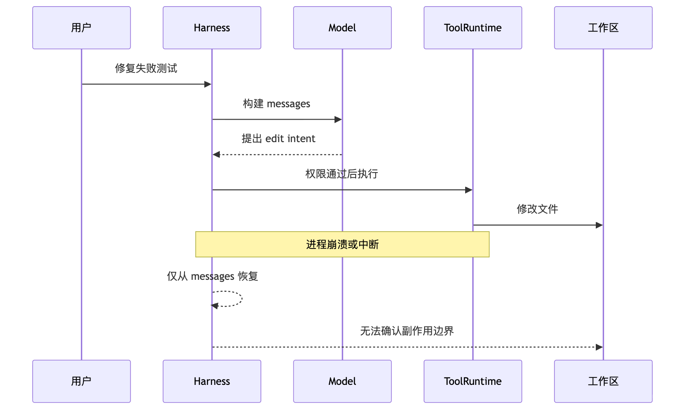
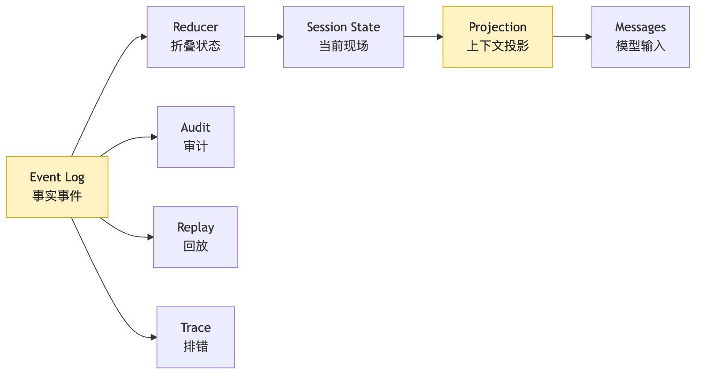
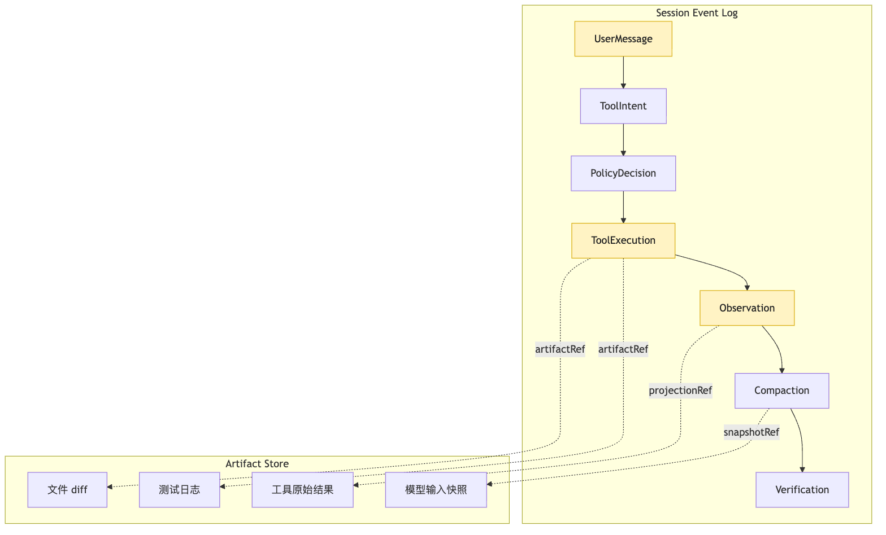
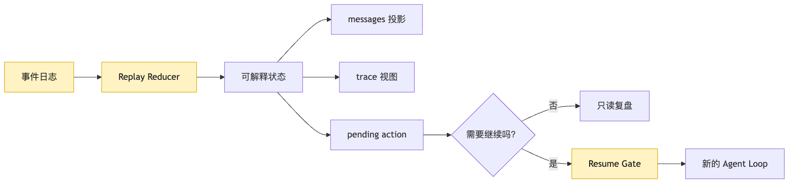
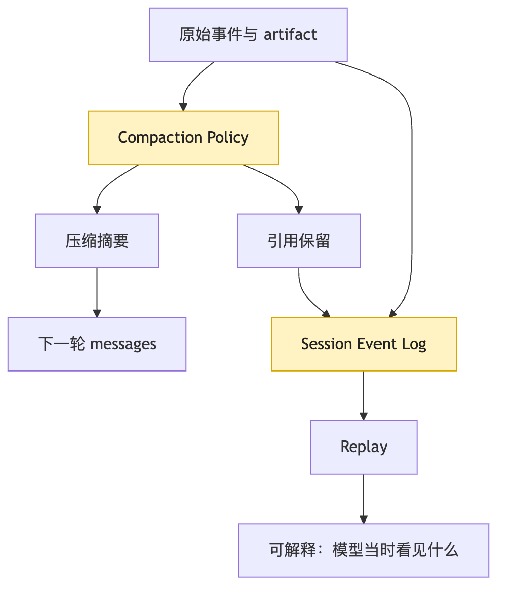

# Session Replay：为什么事件日志是长任务的事实源？

很多人第一次给 Agent 加持久化时，会很自然地保存 `messages`。

这看起来非常合理。

因为模型每一轮看到的是 messages。

用户输入在 messages 里。

模型回答在 messages 里。

工具结果也会被塞回 messages。

于是我们很容易写出一个最小版本：

```ts
await fs.writeFile(
  "session.json",
  JSON.stringify({ messages }, null, 2)
);
```

然后心里会松一口气。

有了 session 文件。

有了历史记录。

进程崩了也能继续。

但真正跑长任务以后，你会发现这份自信很快会碎掉。

我们仍然沿用前面文章里的同一个例子：

```text
用户说：这个项目测试失败了，帮我找原因并修好。
```

CLI Agent 开始工作。

它读取项目结构。

它运行测试。

它看到失败日志。

它搜索相关代码。

它修改文件。

它再次运行测试。

这时发生了一个很普通的事故：

进程崩了。

或者用户按下了中断。

或者终端断开。

或者工具命令超时。

或者上下文快满，系统做了一次压缩。

现在你想恢复任务。

问题来了：

系统应该从哪里恢复？

如果只保存 messages，表面上看有历史。

但它不一定能回答这些问题：

```text
模型上一轮到底提出了什么 intent？
这个 intent 是否通过了权限审批？
工具是否真的开始执行？
工具执行到一半失败，还是执行完成但回填失败？
文件是否已经被修改？
测试命令是否已经跑过？
用户拒绝过哪个动作？
上下文压缩时丢掉了哪些原始事实？
最后一个稳定 checkpoint 在哪里？
下一步继续会不会重复改写真实世界？
```

这就是第 16 篇要解决的问题。

长任务不能只靠内存里的 messages。

也不能只靠“把聊天记录保存下来”。

Agent 一旦进入真实工程环境，它的事实源就必须换一种形态。

这篇的核心句是：

```text
Session log 是事实源，messages 只是投影。
Replay 不是重跑真实世界，而是用事件恢复可解释状态。
Resume 不是勇敢地继续，而是保守地确认能不能继续。
```

这句话看起来有点重。

我们慢慢拆。

先把本篇会反复出现的三个存储对象分开：

| 对象 | 保存什么 | 不保存什么 |
| --- | --- | --- |
| Session Store | session 元数据、状态快照、resume gate 结果 | 完整大日志 |
| Event Log | 关键事实事件：intent、permission、execution、observation、verification | 随意聊天转录 |
| Artifact Store | 完整 stdout、stderr、diff、模型输入快照、长文档证据 | 是否继续任务的决策 |

Replay 的目标不是让任务自动继续。

它先把“能否安全继续”这件事变成可判断状态。

## 问题链

先把本篇的问题链固定住：

```text
长任务不能只保存内存 messages
-> messages 是模型输入投影，不是事实源
-> 一旦崩溃、中断、压缩或工具半执行，只靠 messages 无法判断副作用边界
-> 需要 append-only event log 记录 intent、permission、execution、observation 和 verification
-> Replay 用事件恢复 state，而不是重新执行真实世界
-> Resume 需要通过 gate 确认是否可以继续
-> Artifact Store 保存长日志、diff、模型输入快照和大块证据
-> 这条事实链会继续支撑 trace、eval 和 durable execution
```

## 一、长任务最怕的不是失败，而是失败后说不清发生了什么

先从一个最小 Agent Loop 看起。

前面我们已经把单次模型调用扩展成了 ReAct loop：

```text
Think
-> Act
-> Observe
-> Think
-> ...
-> Final
```

如果只是 demo，系统大概可以这样写：

```ts
let messages = [userMessage];

while (true) {
  const response = await provider.chat({ messages });

  if (response.type === "final") {
    messages.push(response.message);
    break;
  }

  const result = await toolRuntime.execute(response.toolCall);

  messages.push(response.message);
  messages.push(toToolMessage(result));
}
```

这段代码可以跑。

也足够解释 Agent Loop 的基本形状。

但它有一个致命假设：

```text
整个任务会在一个进程里顺利跑完。
```

真实任务从来不会这么配合。

比如我们的 CLI Agent 正在修测试。

它第一轮运行：

```text
pnpm test auth
```

测试失败。

模型看到日志，判断应该读取：

```text
src/auth/session.ts
```

然后它提出一个 edit intent。

系统通过权限检查。

工具开始修改文件。

就在这时，进程崩了。

现在恢复时，如果你只看 messages，可能会看到：

```text
assistant: 我将修改 src/auth/session.ts
tool: 修改成功
```

也可能只看到：

```text
assistant: 我将修改 src/auth/session.ts
```

还有可能压缩后只剩一句：

```text
之前检查了 auth 测试，并准备修复 session 逻辑。
```

三种情况对应的恢复策略完全不同。

第一种，要确认文件确实已经修改。

第二种，要确认工具有没有开始执行。

第三种，连 intent 的结构都可能丢了。

如果系统说不清发生过什么，它就只能靠猜。

而 Agent 恢复任务时最危险的事情，就是靠猜。



这张图里最重要的不是“进程会崩”。

崩溃本身很普通。

真正的问题是崩溃切断了两类东西。

第一类是内存状态。

比如 `turnCount`、预算、当前 pending intent、正在执行的工具。

第二类是解释链。

也就是系统如何知道：

```text
模型说了什么
系统允许了什么
工具做了什么
真实世界变成什么样
下一轮模型应该看到什么
```

`messages` 可以保存一部分解释链。

但它不是为恢复设计的。

它是为下一轮模型输入设计的。

这两个目标不一样。

下一轮模型输入追求的是“当前够用”。

恢复事实源追求的是“当时发生过什么”。

前者可以压缩。

后者必须尽量可追溯。

前者可以重排。

后者必须保留因果顺序。

前者可以只给摘要。

后者必须能解释摘要来自哪些事件。

所以从这一篇开始，我们要把一个概念立起来：

```text
Session 不等于 messages。
Session 是一次长任务的事件账本。
```

## 二、messages 是投影，不是事实源

要理解 Session Replay，先要把三个词分开。

```text
Event Log
State
Messages
```

它们经常被混在一起。

但在长任务 Agent 里，混在一起就会出事故。

`Event Log` 是事实源。

它记录发生过的事件。

比如：

```text
用户提交了目标
模型提出了工具意图
系统做了权限决策
工具开始执行
工具返回观察结果
上下文发生压缩
预算触发暂停
验证命令通过
任务被标记完成
```

`State` 是从事件里折叠出来的当前状态。

比如：

```text
当前轮次是多少
预算用了多少
任务处于 running / paused / failed / completed 哪个状态
有哪些 pending intent
最后一次工具结果是什么
哪些文件被修改过
哪些验证命令已经通过
```

`Messages` 是从状态和事件里投影出来，给模型看的上下文。

比如：

```text
用户目标
最近几轮对话
关键工具结果摘要
当前任务进度
下一步约束
必要的代码片段
```

这三者的关系应该是：

```text
Event Log -> State -> Messages
```

而不是：

```text
Messages -> State -> Event Log
```

如果把 messages 当事实源，系统就会被模型输入格式绑架。

模型输入为了节省 token 会被截断。

为了减少噪音会被摘要。

为了提高效果会被重组。

为了防污染会过滤某些工具输出。

为了安全会隐藏内部策略。

这些操作对模型调用是合理的。

但它们对恢复和审计不是事实。

一个工具原始输出可能有 3000 行。

messages 里只保留 10 行关键摘要。

模型下一轮也许只需要这 10 行。

但如果测试后来失败，开发者可能需要知道：

```text
原始命令是什么
退出码是多少
完整 stderr 被截断了吗
截断阈值是多少
摘要是怎么生成的
模型看到的是摘要还是原文
```

这些信息不应该依赖 messages 保存。

它们应该在事件日志里。



这张图里有一条非常关键的责任边界。

`Messages` 在最右侧。

它不是中心。

它只是很多投影之一。

同一份 Event Log 可以投影成 messages。

也可以投影成 trace 面板。

也可以投影成审计报告。

也可以投影成 eval 样例。

也可以投影成 resume checkpoint。

如果只有 messages，其他视图都会退化成“从聊天记录里猜”。

成熟 Harness 要避免这种退化。

所以我们可以给 Session Store 一个更准确的定义：

```text
Session Store 保存事件。
Context Builder 生成 messages。
Replay Runner 用事件重建状态。
```

这三个角色不能互相替代。

Session Store 不应该关心模型喜欢什么措辞。

Context Builder 不应该伪造事实。

Replay Runner 不应该重新执行真实副作用。

这是整篇文章最重要的工程纪律。

## 三、事件日志到底应该记录什么？

说“记录事件”很容易。

真正写代码时，难点是事件粒度。

记录太粗，恢复时没法解释。

记录太细，日志膨胀、读写复杂、隐私和成本都变重。

我们先用 CLI Agent 修测试的路径来看一条最小事件链。

```text
UserMessage
SessionStarted
ModelRequested
ModelResponded
ToolIntentCreated
PolicyDecided
ToolStarted
ToolFinished
ObservationProjected
ContextCompacted
VerificationStarted
VerificationFinished
SessionPaused
SessionResumed
SessionCompleted
```

这些名字不是标准答案。

但它们体现了一个原则：

```text
凡是会影响恢复、审计、预算、权限、上下文和验证的边界，都应该落事件。
```

比如模型调用。

你不一定要把完整 prompt 永久保存。

因为里面可能有隐私、密钥、过多代码。

但至少要保存：

```text
model name
request id
input token estimate
output token count
context snapshot id
visible tool list hash
start time
end time
status
error taxonomy
```

这样恢复或排错时，系统知道当时模型是在什么上下文和工具可见性下做判断。

再比如工具调用。

工具事件不应该只保存一段字符串。

它至少要能回答：

```text
工具名是什么
参数是什么
参数校验是否通过
权限决策是什么
执行环境是什么
是否产生副作用
输出是否被截断
返回给模型的 observation 是什么
原始结果存在哪里
```

所以最小事件对象可以长这样：

```ts
type SessionEvent =
  | UserMessageEvent
  | ModelRequestEvent
  | ModelResponseEvent
  | ToolIntentEvent
  | PolicyDecisionEvent
  | ToolExecutionEvent
  | ObservationEvent
  | ContextCompactionEvent
  | VerificationEvent
  | LifecycleEvent;

type BaseEvent = {
  id: string;
  sessionId: string;
  seq: number;
  ts: string;
  type: string;
  causationId?: string;
  correlationId?: string;
};

type ToolExecutionEvent = BaseEvent & {
  type: "tool.finished";
  toolCallId: string;
  toolName: string;
  status: "ok" | "error" | "timeout" | "cancelled";
  exitCode?: number;
  artifactRefs: string[];
  observationRef: string;
  sideEffect: "none" | "workspace" | "network" | "external";
};
```

这里有几个字段很关键。

`seq` 是顺序。

它让 replay 可以按发生顺序重建状态。

`causationId` 是原因。

它说明这个事件由哪个事件触发。

比如 `tool.started` 由 `tool.intent.created` 触发。

`correlationId` 是同一组动作的关联。

比如一次模型 intent、权限决策、工具执行、观察结果，都属于同一个 tool call。

`artifactRefs` 是外部产物引用。

因为事件日志不一定直接塞完整大文件、大日志或 diff。

它可以保存稳定引用：

```text
artifact://session/abc/test-output-003.txt
artifact://session/abc/patch-004.diff
artifact://session/abc/model-input-007.json
```

这会把事件日志和 artifact store 连接起来。

事件日志记录“发生过什么”。

artifact store 保存“当时的证据材料”。

两者合起来，才是长任务的事实基础。



图里有一个容易忽略的点：

`Observation` 也是事件。

工具原始结果和模型看到的 observation 不是同一个东西。

工具原始结果可能很长、很脏、包含不该进入上下文的信息。

Observation 是 Harness 清洗、截断、摘要、标注风险之后，投影给模型的版本。

如果不记录这一步，replay 时就无法回答：

```text
模型当时到底看见了什么？
```

而这句话，是几乎所有 Agent 失败分析的起点。

## 四、Replay 不是把世界重新跑一遍

现在进入最容易误解的部分。

很多人听到 Replay，会想到：

```text
把当时的每一步重新执行一次。
```

对普通纯函数程序，这也许可以。

但对 Agent 来说，这通常是危险的。

因为 Agent 的很多步骤有副作用。

读文件可能还好。

写文件就不是。

执行命令也不是。

调用外部 API 更不是。

如果 replay 真的重新执行：

```text
edit_file
run_shell
send_email
create_ticket
deploy_service
```

那它就不是 replay。

它是在重新改变世界。

这会造成一堆问题。

文件可能被重复修改。

测试可能在不同依赖状态下运行。

外部接口可能产生重复请求。

用户拒绝过的动作可能被再次触发。

旧的危险命令可能又跑一遍。

所以在 Agent Harness 里，Replay 的默认含义应该更保守：

```text
按事件顺序重建可解释状态。
不重新执行已经发生过的真实副作用。
```

换句话说，Replay 的输入是 event log。

Replay 的输出是 state、trace、messages projection、诊断视图。

不是新的工具副作用。

```ts
function replay(events: SessionEvent[]): ReplayedSession {
  let state = initialSessionState();

  for (const event of events.sort(bySeq)) {
    state = reduceSessionEvent(state, event);
  }

  return {
    state,
    messages: projectMessages(state),
    trace: projectTrace(state),
    pendingActions: derivePendingActions(state),
  };
}
```

这段伪代码里没有 `executeTool`。

这是重点。

Replay 不是运行工具。

Replay 是把历史事件折叠回状态。

如果某个工具当时执行过，replay 读取的是它当时留下的 `tool.finished` 事件和 artifact。

如果某个模型当时返回过 intent，replay 读取的是当时的 `model.responded` 事件。

如果某次 context compaction 发生过，replay 读取的是压缩事件、摘要、被替换内容的引用。

它不应该悄悄再请求一次模型。

也不应该悄悄再跑一次 shell。

这就是 Session Replay 和 Agent Loop 的区别。



图里最重要的是 `Resume Gate`。

Replay 和 Resume 中间必须有一道门。

Replay 只是重建状态。

Resume 才是继续行动。

如果把两者混在一起，系统恢复时就会自动往前跑。

这很危险。

因为恢复不是“继续上一次 while loop”。

恢复是一个新的决策时刻。

系统必须先确认：

```text
工作区是否仍然匹配上次记录？
pending intent 是否仍然有效？
用户权限是否仍然有效？
预算是否还有剩余？
外部世界是否可能已经变化？
上下文压缩后的状态是否足够继续？
```

只有这些条件被检查过，新的 Agent Loop 才能开始。

这就是为什么我们说：

```text
Replay 是重建解释。
Resume 是保守继续。
```

## 五、Resume 要保守：继续之前先找最后一个稳定点

一个常见的错误是把 Resume 写成：

```ts
const { messages } = await loadSession(sessionId);
runAgentLoop({ messages });
```

这看起来很自然。

但它跳过了最关键的问题：

```text
上一次停在什么边界？
```

长任务里，不是每个位置都适合继续。

适合继续的位置，应该是稳定点。

稳定点通常满足几个条件：

```text
没有正在执行一半的工具
没有未落盘的事件
没有未确认的权限决策
工作区副作用已经被记录
模型下一轮需要看的 observation 已经生成
session state 可以从事件完整重建
```

比如下面这条链：

```text
ToolIntentCreated
-> PolicyApproved
-> ToolStarted
-> ToolFinished
-> ObservationProjected
```

如果系统停在 `ToolIntentCreated` 后面，工具还没执行。

恢复时可以重新做权限检查。

如果系统停在 `PolicyApproved` 后面，工具还没开始。

恢复时要检查审批是否仍然有效，尤其是用户授权是否有时效。

如果系统停在 `ToolStarted` 后面，最麻烦。

工具可能已经改了文件，但事件还没写完。

恢复时不能直接重跑。

必须先检查工作区和 artifact。

如果系统停在 `ToolFinished` 后面，但还没生成 observation。

恢复时可以从工具结果 artifact 重新生成 observation。

如果系统停在 `ObservationProjected` 后面。

这通常是一个比较好的继续点。

因为真实世界副作用已经发生，模型下一轮该看的观察也已经记录。


这张状态图不是要求你一开始就实现一套复杂 workflow engine。

它只是提醒一件事：

恢复必须知道自己停在哪个事件边界。

如果不知道边界，就不能假装继续是安全的。

在我们的 CLI Agent 里，一个保守的 resume 流程可以是：

```ts
async function resumeSession(sessionId: string) {
  const events = await sessionStore.readEvents(sessionId);
  const replayed = replay(events);

  const gate = await evaluateResumeGate({
    state: replayed.state,
    workspace: await inspectWorkspace(),
    policy: await loadCurrentPolicy(),
    artifacts: await artifactStore.checkRefs(replayed.state.artifactRefs),
  });

  if (!gate.ok) {
    return pauseForUser(gate.reason, gate.recoveryOptions);
  }

  return runAgentLoop({
    sessionId,
    initialState: replayed.state,
    initialMessages: replayed.messages,
  });
}
```

这里的 `evaluateResumeGate` 是关键。

它不是模型判断。

它是 Harness 判断。

因为 resume 的风险不只是“下一步怎么做”。

而是“继续行动会不会重复副作用、越权、基于过期事实行动”。

这些属于 Harness 的生命周期责任。

模型可以帮助解释。

但不能单独决定。

## 六、上下文压缩会让 messages 更不适合作为事实源

前面 Context 管理里讲过，长任务会不断制造 token 压力。

读文件、跑测试、搜索、修改、验证，每一步都在增加上下文。

所以成熟 Agent 必须压缩。

它可能做：

```text
截断长工具结果
把旧文件内容替换成摘要
把多轮历史压成任务进度
把重复搜索结果折叠成引用
把完整日志放到 artifact，只给模型关键片段
```

这些都对模型调用有帮助。

但也让 messages 更不适合作为事实源。

因为压缩会带来三个问题。

第一，压缩是有损的。

模型下一轮不需要的细节，可能被移走。

但排错时可能恰好需要那些细节。

第二，压缩是解释性的。

摘要不是原始事实。

它是系统或模型对事实的再表达。

第三，压缩会改变事件形态。

一段 `tool_result` 可能被替换成：

```text
测试仍失败，关键错误是 TypeError: user.id should be string。
```

这对继续修复够用。

但对审计不够。

所以压缩本身也要成为事件。

```text
ContextCompactionStarted
ContextCompactionFinished
CompactionInputRefs
CompactionOutputSummary
CompactionPolicy
ReplacedMessageRange
```

这样 replay 时才能知道：

```text
哪些原始内容被压缩了
压缩结果是什么
模型之后看到的是摘要还是原文
摘要对应哪些 artifact
```



这张图里最重要的是双写边界。

压缩摘要进入 messages。

压缩事件和引用进入 event log。

如果只保留摘要，系统会变得“看起来连续，实际上失真”。

如果只保留原文，不做摘要，系统会被 token 压垮。

正确做法不是二选一。

而是：

```text
给模型看可用投影。
给系统留事实链路。
```

这也是 Session Replay 和 Context Engineering 的接口。

Context 负责让模型这一轮看见合适信息。

Session 负责让系统知道这些信息来自哪里。

## 七、Artifact 让上下文保持诚实

事件日志不应该无限膨胀。

如果每次工具输出、文件快照、模型输入、命令日志都原样塞进 JSONL，系统很快会变得又慢又脆。

所以 Session Store 通常需要配一个 Artifact Store。

简单说：

```text
事件日志保存索引、因果、状态边界。
artifact 保存大块证据材料。
```

在 CLI Agent 修测试的例子里，artifact 可以包括：

```text
测试命令完整 stdout / stderr
文件读取快照
搜索结果原文
patch diff
模型输入快照
压缩前消息片段
压缩后摘要
验证报告
```

事件日志里保存引用：

```json
{
  "type": "tool.finished",
  "toolName": "run_tests",
  "status": "error",
  "exitCode": 1,
  "artifactRefs": [
    "artifact://session/s1/tool-003-stdout.txt",
    "artifact://session/s1/tool-003-stderr.txt"
  ],
  "observationRef": "artifact://session/s1/observation-003.md"
}
```

这样做的好处不是“更优雅”。

而是让上下文保持诚实。

当模型看到一段摘要：

```text
测试失败，关键错误是 user.id 类型不匹配。
```

系统可以追溯到：

```text
这段摘要来自哪次命令
命令在哪个工作目录执行
退出码是多少
完整日志在哪里
摘要是否被截断
后来是否有新的测试覆盖了这条事实
```

没有 artifact，摘要很容易变成漂浮在上下文里的“听说”。

有 artifact，摘要是可追溯的投影。

这就是 Context 诚实性的核心。

模型不一定需要每轮看完整证据。

但系统必须知道证据在哪里。

## 八、失败、中断、审批、预算都应该是事件

很多 session log 的第一版只记录成功路径。

这会让恢复变得危险。

因为长任务里真正重要的，往往是“不顺利”的部分。

工具失败要记录。

用户中断要记录。

权限拒绝要记录。

预算耗尽要记录。

上下文压缩失败要记录。

模型返回不合法结构要记录。

验证失败要记录。

如果这些不落事件，系统恢复时就会把它们当作没发生过。

比如用户拒绝过一个命令：

```text
rm -rf dist && pnpm build
```

如果拒绝事件没有保存，恢复后模型可能再次提出类似命令。

系统也可能不知道这是重复打扰。

正确的事件链应该包含：

```text
ToolIntentCreated
PolicyDecisionRequested
UserApprovalRequested
UserApprovalDenied
IntentRejected
ObservationProjected
```

这样下一轮模型才能看到：

```text
用户拒绝了清理 dist 的命令，请寻找非破坏性方案。
```

同时审计层也能看到：

```text
系统没有执行被拒绝动作。
```

再比如预算耗尽。

如果只是循环停了，用户看到的是“Agent 没动静”。

如果预算事件写清楚，系统可以解释：

```text
已完成读取、搜索、一次修复和两次验证。
当前 token 预算达到上限。
建议继续前先压缩上下文，或让用户确认追加预算。
```

所以失败事件不是噪音。

它们是长任务生命周期的一部分。

Agent 的可靠性，不是让失败消失。

而是让失败有边界、有解释、有恢复路线。

## 九、不可重放的副作用要显式标记

Replay 不重新执行真实世界。

但 Resume 之后，系统可能会继续做新动作。

这就要求事件日志能区分副作用类型。

比如工具可以粗略分成几类：

```text
pure：纯计算，无外部副作用
read：读取环境，不修改
workspace-write：修改当前工作区
external-write：写外部系统
network：访问网络
process：启动进程
```

不同副作用类型的恢复策略不一样。

纯计算可以重算。

只读操作可以在必要时重新读取，但要承认世界可能变化。

工作区写入必须检查 diff、文件 hash、Git 状态。

外部写入通常不能自动重试。

网络请求要看是否幂等。

进程执行要看命令是否仍在运行，是否已经产生输出。

这不是过度设计。

这是工具进入真实世界后的基本会计。

如果系统不知道某个工具是否有副作用，就不能安全恢复。

工具协议里可以加一个字段：

```ts
type ToolRisk = {
  sideEffect:
    | "none"
    | "read"
    | "workspace-write"
    | "external-write";
  idempotency: "safe" | "conditional" | "unsafe";
  resumePolicy:
    | "replay-from-event"
    | "rerun-after-check"
    | "require-user-confirmation"
    | "never-rerun";
};
```

这三个字段会直接影响 Session Replay。

如果 `resumePolicy` 是 `replay-from-event`，恢复时只读取已有事件。

如果是 `rerun-after-check`，恢复时必须先验证环境。

如果是 `require-user-confirmation`，恢复时要问用户。

如果是 `never-rerun`，系统只能展示历史，不能自动重复。

在我们的 CLI Agent 里，`read_file` 通常可以重新读取。

`grep` 可以重新运行，但结果可能变化。

`edit_file` 不能盲目重复。

`bash` 要看命令。

`git diff` 比较安全。

`pnpm test` 可以重跑，但要记录它是新的验证，不是历史 replay。

这条边界非常重要：

```text
重放历史事件，不等于重复历史动作。
```

## 十、最小 Session Store 可以很朴素

讲到这里，Session Replay 听起来像一个很重的系统。

但第一版不需要上数据库、不需要分布式 workflow engine，也不需要复杂 UI。

一个小型 CLI Agent 的最小实现可以很朴素：

```text
.agent/
  sessions/
    s_2026_05_28_001/
      events.jsonl
      artifacts/
        tool-001-stdout.txt
        tool-001-stderr.txt
        patch-002.diff
        observation-002.md
      snapshots/
        state-010.json
```

`events.jsonl` 追加写。

每一行一个事件。

事件有递增 `seq`。

大块内容放 artifacts。

每隔一段事件写一个 state snapshot。

恢复时可以：

```text
读取最近 snapshot
读取 snapshot 之后的事件
重新 reduce
检查 artifact 引用
生成 messages 投影
进入 resume gate
```

伪代码如下：

```ts
async function appendEvent(event: SessionEvent) {
  const line = JSON.stringify(event) + "\n";
  await fs.appendFile(sessionEventsPath(event.sessionId), line);
}

async function loadForReplay(sessionId: string) {
  const snapshot = await loadLatestSnapshot(sessionId);
  const events = await readEventsAfter(sessionId, snapshot?.seq ?? 0);
  const state = replayFrom(snapshot?.state ?? initialState(), events);

  return {
    state,
    events,
    messages: projectMessages(state),
  };
}
```

这里有几个实现细节值得注意。

第一，追加写比覆盖写安全。

覆盖写 session 文件时，进程崩溃可能留下半截 JSON。

JSONL 追加写更容易恢复。

第二，事件要有顺序号。

只靠时间戳不够。

同一毫秒可能有多个事件。

第三，snapshot 是优化，不是事实源。

如果 snapshot 和 event log 冲突，应相信 event log。

第四，artifact 要校验存在性和 hash。

否则 replay 时可能引用了已经丢失或被改写的证据。

第五，投影要可重建。

messages 不应该是唯一保存版本。

它可以缓存，但必须能从事件和状态重新生成。

这就是最小版本的 Session Store。

它不华丽。

但足够让 Agent 从“一次性进程”走向“可恢复长任务”。

## 十一、Session Replay 和 Durable Execution 的关系

Roadmap 里把这一块放在 Harness Architecture 与 Durable Execution 附近。

原因很简单：

长任务一旦需要跨进程、跨时间、跨 worker 继续，就不能把执行过程只放在内存里。

Durable Execution 关心的是：

```text
每一步能否可靠记录
失败后能否知道做到哪一步
可重试的步骤能否重试
不可重试的步骤能否跳过或人工处理
恢复后能否继续推进
```

Agent Harness 的特殊之处在于，它的步骤里夹着模型判断。

模型判断不是普通函数。

工具执行也不是普通函数。

上下文投影还会改变模型看到的世界。

所以 Agent 的 durable loop 至少要拆成：

```text
checkpoint context
-> call model
-> persist model event
-> validate intent
-> persist policy decision
-> execute tool
-> persist tool result
-> project observation
-> persist observation
-> decide next lifecycle state
```

每个箭头都是潜在崩溃点。

每个崩溃点都要能回答：

```text
之前那一步是否已经完成？
完成证据在哪里？
能不能重试？
重试会不会重复副作用？
恢复需要人确认吗？
```

这就是为什么 Session Replay 是 Durable Agent Loop 的地基。

没有事件日志，durable execution 只剩“希望下次能继续”。

有了事件日志，系统才有资格谈重试、恢复、审计和远程 worker。

## 十二、Replay 还会成为 Eval 和 Trace 的事实基础

Session Replay 的直接用途是恢复。

但它的长期价值不止恢复。

它还会成为 Trace Analysis 和 Eval 的事实基础。

因为 Agent 失败时，最难的问题不是“这次失败了吗”。

而是：

```text
失败发生在哪一层？
```

模型判断错了？

工具 schema 太松？

权限策略放过了危险动作？

Context 把关键日志裁掉了？

压缩摘要误导了模型？

工具执行失败但 observation 写成了成功？

验证命令跑错了目录？

用户中断后系统错误地继续？

这些问题都需要事件链回答。

如果只有最终答案，eval 只能判断“好/不好”。

如果有 session event log，eval 可以把失败归因到具体层：

```text
provider
context
tool validation
permission
execution
observation
verification
lifecycle
```

这会改变改进方式。

以前失败了，你可能会想：

```text
是不是 prompt 不够好？
```

有了事件日志，你可能发现：

```text
模型其实提出了正确 intent。
权限层错误拒绝了。
```

或者：

```text
工具执行成功了。
但 observation 截断掉了关键错误。
```

或者：

```text
模型已经要求跑测试。
但 verification 层没有把失败退出码传回去。
```

这时修 prompt 不是正确答案。

你应该修 Harness。

所以 Session Replay 不是一个边缘功能。

它会慢慢变成整个 Agent 系统的事实底座。

恢复靠它。

排错靠它。

审计靠它。

评估靠它。

多 Agent handoff 也会靠它。

因为子 Agent 交回来的结果，如果不能落回主 session 的事件链，就只是一个文本摘要。

文本摘要能帮助人读。

但不能成为系统事实源。

## 十三、常见误解：保存聊天记录就够了

最后集中清掉几个误解。

第一个误解：

```text
保存 messages 就是保存 session。
```

不是。

messages 是模型输入投影。

session 是事件事实链。

二者可以互相引用，但不能互相替代。

第二个误解：

```text
Replay 就是重新跑一遍工具。
```

不是。

Replay 默认是只读重建状态。

重新跑工具是 Resume 之后的新动作，必须经过 gate、权限和副作用检查。

第三个误解：

```text
只要有 Git，就不用 session log。
```

不够。

Git 能告诉你文件差异。

但它不能告诉你模型为什么要改、权限如何通过、工具输出是什么、用户拒绝过什么、上下文压缩过什么、验证命令如何产生。

Git 是工作区事实的一部分。

不是 Agent 运行事实的全部。

第四个误解：

```text
日志越完整越好。
```

也不对。

事件日志要完整记录因果和边界。

但大块内容应该进 artifact。

敏感内容要做脱敏、引用或访问控制。

事实源不是“什么都塞进去”。

事实源是“关键事实可追溯”。

第五个误解：

```text
恢复时让模型读完整历史，它会自己判断。
```

这很危险。

模型可以参与解释。

但恢复 gate 必须由 Harness 控制。

因为恢复涉及副作用、权限、预算和状态一致性。

这些不是语言判断问题。

而是系统控制问题。

## 十四、把这一篇压成一条承重链路

如果把整篇文章压成一条链路，就是：

```text
真实任务产生事件
-> 事件追加到 Session Log
-> 大块证据进入 Artifact Store
-> Reducer 从事件折叠 State
-> Projection 从 State 生成 Messages
-> Replay 用事件重建解释
-> Resume Gate 判断能否继续
-> 新的 Agent Loop 只从安全边界继续
```

这条链路把前面几篇串起来了。

Intent / Execution 分离告诉我们：

```text
模型提议，系统执行。
```

Context Policy 告诉我们：

```text
模型每一轮只应该看到合适的信息。
```

Lifecycle 告诉我们：

```text
长任务会暂停、失败、中断和恢复。
```

Session Replay 把这三件事合成一条工程纪律：

```text
所有会影响恢复和解释的边界，都要变成事件。
```

有了这条纪律，Agent 才能从本地一次性进程，往托管长任务走。

下一篇继续往外扩。

当 session 可以恢复以后，问题会变成：

```text
Agent 的能力从哪里来？
Skills、MCP、插件和动态工具暴露，如何进入同一条受控 pipeline？
```

也就是 Capability Discovery。

能力可以动态发现。

但控制边界不能动态失踪。

## 落地到教学 Harness

参考项目用 JSONL session store 做了一个很好的最小形态：append-only entry、`id`、`parentId`、`leafId`、message entry、compaction entry。实现时要让 API 先 append user message，再 build context，再运行 loop，最后 append newMessages。这样崩溃时至少能知道任务停在事实链的哪一段。

---

GitHub 地址: [00-16-session-replay-event-log.md](https://github.com/LienJack/build-harness/blob/main/docs/zh/00-16-session-replay-event-log.md)
