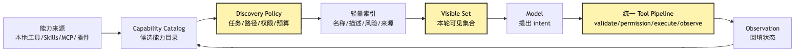
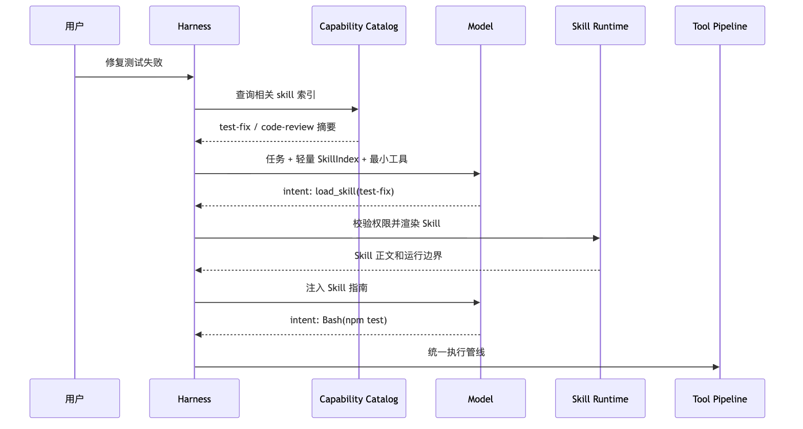
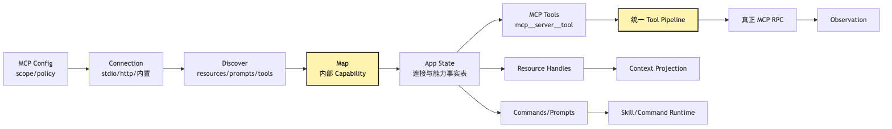
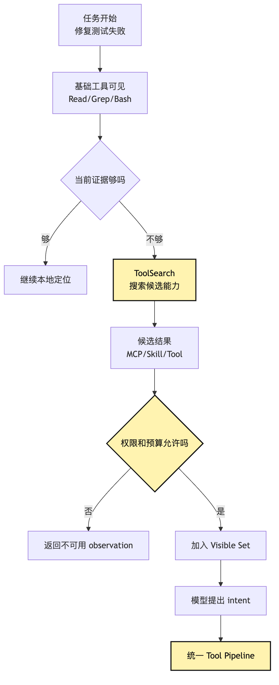
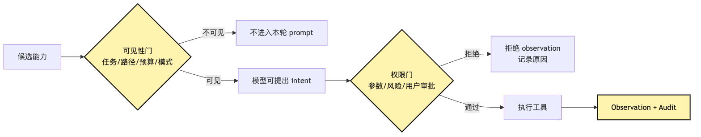
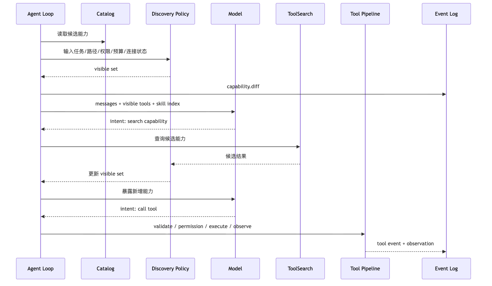

# Capability Discovery：Skills、MCP 与动态工具暴露

到了第 17 篇，我们的小型 CLI Agent 已经不再是最初那个只能聊天的程序。

它有了 provider runtime。

它有了 tool runtime。

它有了本地工具 bundle。

它有了 context policy。

它也有了 session replay。

如果沿着前面的实现继续加功能，一个很自然的冲动会出现：

```text
既然工具系统已经做出来了，那就把所有工具都注册进去吧。
```

读文件。

改文件。

搜索代码。

跑命令。

查 GitHub。

查 Slack。

查数据库。

读设计稿。

调用浏览器。

加载团队规范。

执行 review skill。

执行写作 skill。

执行部署 skill。

每一个能力单独看都很合理。

但全部塞进模型视野以后，系统会立刻变得不合理。

模型这一轮并不需要知道所有工具。

它只需要知道和当前任务相关、当前权限允许、当前上下文预算装得下、当前运行状态能执行的一小组能力。

这就是 Capability Discovery 出现的位置。

它要解决的问题不是“怎么让 Agent 拥有更多能力”。

而是：

> 当 Agent 的候选能力越来越多时，系统如何先发现能力，再按任务动态暴露最小可用集合，并且让所有外部能力最终仍然回到统一 tool pipeline？

我们继续沿用整个系列的贯穿例子：

```text
用户在项目根目录输入：
帮我看看这个项目为什么测试失败，并把它修好。
```

在早期章节里，这个任务可能只需要本地工具：

```text
Read
Grep
Bash
Edit
```

但到了真实项目里，它很可能还需要更多能力：

```text
GitHub MCP：读取最近 PR 讨论。
Issue MCP：查看测试失败是否已有记录。
CI MCP：拉取远端构建日志。
code-review skill：按照团队风格审查最终 diff。
frontend skill：当修改前端组件时加载组件规范。
test-runner skill：根据项目类型选择测试命令。
```

这些能力都应该存在。

但它们不应该一开始全部暴露给模型。

因为能力越多，失控点越多。

这篇文章就要把这条边界写清楚。

## 问题链

先把本篇的问题链固定住：

```text
Tool Runtime 让模型可以提出结构化工具调用
-> Plugin Host 让外部能力可以进入系统
-> 能力来源变多：本地工具、Skills、MCP、插件、通道能力
-> 如果全部暴露给模型，上下文、选择和安全会同时失控
-> 需要先建立 Capability Catalog，记录候选能力
-> 再用 Discovery 根据任务、路径、权限、预算和运行状态筛选
-> ToolSearch / Deferred Loading 让模型先看轻量索引，命中后再加载详情
-> Skills 作为经验包按需加载，不把全文常驻上下文
-> MCP 作为外部能力桥，先发现 resources/prompts/tools，再映射成内部能力
-> 最终所有可执行动作仍然进入统一 tool pipeline
```

这条链里最重要的词不是 `Skill`。

也不是 `MCP`。

而是 `Visibility`。

可见性。

能力可以存在于系统里。

但存在不等于可见。

可见不等于可执行。

可执行也不等于可以绕过审计。

画成一张总图，大概是这样：



这张图里最重要的不是节点数量。

而是两条边界。

第一条边界在 `Capability Catalog` 和 `Visible Set` 之间。

系统里可以有很多候选能力。

模型这一轮只能看到经过筛选的可见集合。

这里也顺手把第 11 篇的 Plugin Host 和本篇的 Catalog 接起来：

```text
Plugin Host 负责外部能力进入系统。
Registry 记录已经注册的内部能力事实。
Capability Catalog 是 Registry 的扩展视图，统一记录 tool / skill / resource / prompt / channel。
Discovery Policy 从 Catalog 里选择本轮 Visible Set。
Context Policy 再把 Visible Set 和其他上下文材料装配成 Model Input。
Tool Runtime 只处理某个具体 ToolIntent 是否可执行。
```

第二条边界在 `Model` 和 `Tool Pipeline` 之间。

模型看到某个能力以后，仍然只能提出 intent。

真正执行仍然由 tool pipeline 接管。

如果你把这两条边界拆掉，就会得到一个很危险的系统：

```text
外部 MCP server 一连上，所有工具都进 prompt。
项目 Skill 一扫描到，全文都塞进 system prompt。
模型看到一百个工具，开始猜哪个名字最像。
执行时才发现权限不允许。
错误结果又回填上下文，下一轮继续混乱。
```

这不是 Agent 变强。

这是 Harness 失明。

Capability Discovery 的目标，是让 Harness 在“能力很多”时仍然保持清醒。

## 一、工具越多，为什么越不智能

很多人第一次做工具型 Agent 时，会有一个错觉：

```text
我给模型越多工具，它就越像全能助手。
```

这个错觉很合理。

因为人类使用软件时，菜单越丰富，似乎能力越强。

但模型不是人类用户。

模型不是在一个可视界面里慢慢浏览菜单。

模型是在有限上下文里读取一段工具描述，然后根据当前任务生成下一步结构化调用。

工具一多，会同时制造三种压力。

第一种压力是上下文压力。

每个工具都要有名称、描述、参数 schema、使用限制和权限提示。

如果有几十个工具，它们会吃掉大量 token。

更麻烦的是，这些 token 常常还不是任务本身的信息。

它们只是“可能用得上”的菜单。

第二种压力是选择压力。

模型看到的工具越多，越容易被相似描述干扰。

比如它可能同时看到：

```text
grep_code
search_files
github_search
mcp__repo__search
mcp__docs__search
skill__code_review
```

这些名字都带着 `search`。

但它们的语义完全不同。

有的搜本地文件。

有的搜远端仓库。

有的搜文档。

有的只是加载审查方法。

模型一旦选错，就会造成后续推理偏航。

第三种压力是安全压力。

如果模型能看到高风险能力，它就可能围绕这些能力规划。

就算执行时被拒绝，系统也已经让模型把计划建立在一个不可执行前提上。

这会造成一种很隐蔽的失败：

```text
模型不是不知道该做什么。
模型是基于错误的可用能力集合做了计划。
```

所以工具可见性本身就是控制系统的一部分。

它不是 UI 优化。

不是 prompt 压缩技巧。

它是权限、上下文和规划质量的共同入口。

在我们的 CLI Agent 里，如果用户只是说“修复本地测试失败”，第一轮通常不应该暴露 Slack、Figma、数据库写入、部署工具。

更合理的是先暴露：

```text
Read
Grep
Glob
Bash(test-only)
Maybe SkillIndex
Maybe ToolSearch
```

等模型发现失败和某个 GitHub issue 或 CI 日志有关，再通过 discovery 追加对应 MCP 能力。

能力不是一次性倒给模型。

能力应该随着任务证据逐步显影。

## 二、Capability 不是 Tool，先把概念拆开

要实现动态暴露，第一步是不要把所有东西都叫 tool。

`Tool` 是可执行动作。

`Capability` 是系统知道自己可能具备的一种能力。

这两者不同。

比如一个 Skill：

```text
code-review skill
```

它本身不一定是外部动作。

它更像一份任务经验包：

```text
如何审查 diff
先看什么
输出格式是什么
哪些风险优先
允许预批准哪些工具
```

再比如一个 MCP resource：

```text
mcp://github/pull/123
```

它也不是动作。

它更像外部上下文对象。

但它可能通过 List / Read resource 工具进入上下文。

再比如一个 MCP prompt：

```text
triage_failed_ci
```

它不是普通函数。

它可能变成 slash command 或任务模板。

所以 Capability Catalog 里不能只记录“工具函数列表”。

它至少要能表达几类东西：

```text
Tool Capability：可以执行的动作。
Skill Capability：可以加载的方法论。
Resource Capability：可以引用的外部上下文。
Prompt Capability：可以触发的工作流模板。
Channel Capability：当前入口支持的输入输出能力。
```

如果都硬塞成 tool，系统会变得很别扭。

因为你会被迫让模型通过“提出工具 intent”来表达所有事情。

但加载 Skill、读取 resource、搜索能力目录、刷新 MCP server，并不都是同一种语义。

更稳的做法是：

```text
先把所有候选能力放进 Capability Catalog。
然后根据能力类型决定它如何投影到模型视野。
```

这可以画成一个分层图：


图里最关键的是 `Catalog` 和 `Projection` 的分离。

Catalog 记录系统事实。

Projection 决定模型本轮看见什么。

这和前面 Context Policy 的思路是一样的：

```text
不是所有事实都应该进入 prompt。
不是所有能力都应该进入 tool list。
```

Capability Discovery 本质上就是能力侧的 context engineering。

## 三、Skills：经验包不是常驻 prompt

先看 Skills。

在我们的 CLI Agent 里，一个 Skill 可以长这样：

```text
.agent/skills/test-fix/SKILL.md
.agent/skills/code-review/SKILL.md
.agent/skills/frontend-component/SKILL.md
.agent/skills/release-note/SKILL.md
```

每个 Skill 都包含一份 `SKILL.md`。

它有 frontmatter。

它有 description。

它有 allowed tools。

它可能有脚本。

它可能有模板。

它也可能有参考材料。

它解决的问题不是“系统缺一个函数”。

它解决的是：

```text
当任务属于某一类时，模型应该按什么经验流程组合已有工具。
```

以“修复测试失败”为例，工具层只告诉模型：

```text
你可以读文件。
你可以搜索。
你可以跑测试。
你可以编辑。
```

但 test-fix skill 会告诉模型：

```text
先复现失败。
不要先大范围改代码。
优先读失败测试和被测模块。
每次修改后只跑最小相关测试。
最后再跑完整测试。
如果失败输出太长，保留错误类型、文件、行号和断言差异。
```

这不是工具。

这是经验。

经验如果写进全局 system prompt，就会膨胀。

经验如果每次靠用户说，就不可复用。

经验如果写死在 core 里，就无法按项目演化。

所以 Skill 的核心机制是渐进加载：

```text
先暴露轻量索引。
命中后再加载正文。
必要时再读取脚本或参考材料。
```

这和能力发现非常契合。

第一轮模型不需要看到所有 Skill 全文。

它只需要看到一份轻量目录：

```text
test-fix：修复本地测试失败，先复现、定位、最小修改、回归验证。
code-review：审查 diff 中的 correctness、安全、测试缺口，输出 findings first。
frontend-component：修改前端组件时遵守设计系统、状态和可访问性约束。
```

模型判断当前任务需要 `test-fix`。

然后 Harness 再通过 Skill loading 把完整内容注入当前任务。

这条链路可以画成：



这张图里有一个容易忽略的点。

加载 Skill 本身也应该是一种受控动作。

它不能因为“只是文档”就绕过权限。

原因很简单。

Skill 可能声明 allowed tools。

Skill 可能包含动态命令。

Skill 可能把项目里的规范、模板、脚本加载进上下文。

Skill 也可能来自项目仓库，而项目仓库不一定完全可信。

所以 Skill Runtime 至少要做四件事：

```text
解析 frontmatter。
校验来源和策略。
只把轻量索引用于发现。
命中后再渲染正文，并记录事件。
```

一个最小 Skill capability 可以这样表示：

```ts
type SkillCapability = {
  kind: "skill";
  name: string;
  description: string;
  source: "managed" | "user" | "project" | "plugin" | "mcp";
  path?: string;
  match?: {
    paths?: string[];
    taskKeywords?: string[];
  };
  execution?: {
    mode: "inline" | "fork";
    allowedTools?: string[];
  };
  risk: "low" | "medium" | "high";
};
```

这段接口草图里，最重要的是 `description`、`source`、`match` 和 `execution`。

`description` 用来让模型在轻量索引里判断是否需要它。

`source` 用来决定信任边界。

`match` 用来实现路径相关或任务相关的动态可见性。

`execution` 用来决定它是 inline 注入当前会话，还是 fork 到子 Agent。

这就是 Skills 在 Capability Discovery 里的角色：

```text
Skill 不是更多工具。
Skill 是可发现、可加载、可治理的任务经验包。
```

## 四、MCP：外部能力桥，不是工具旁路

再看 MCP。

如果 Skills 解决的是“经验如何按需加载”，MCP 解决的就是：

```text
外部系统如何以统一协议接进 Agent Harness。
```

真实开发任务很少只在本地仓库里完成。

测试失败可能和远端 CI 有关。

失败原因可能在 GitHub PR 讨论里。

需求背景可能在文档系统里。

设计变更可能在 Figma 里。

线上错误可能在监控系统里。

如果每接一个系统都写一个内置工具，core 会再次被污染。

MCP 的价值，就是让这些外部系统通过统一协议暴露能力。

但这并不意味着 MCP server 一连上，模型就可以直接发 RPC。

这点非常关键。

在一个成熟 Harness 里，MCP 应该经过六个阶段：

```text
配置合并
-> 连接与认证
-> 能力发现
-> 内部映射
-> 状态同步
-> 统一执行
```

MCP server 暴露的也不只有 tools。

它可能暴露：

```text
tools：可执行动作。
resources：可读取上下文。
prompts：可复用工作流模板。
```

对于我们的 CLI Agent 来说，GitHub MCP 可能提供：

```text
tool: search_issues
tool: get_pull_request
resource: repo://build-harness/pr/42
prompt: summarize_failed_ci
```

这四个东西进入系统后，不应该都变成同一种裸函数。

更合理的映射是：

```text
MCP tool -> Internal Tool Capability -> Visible Tool -> Tool Pipeline
MCP resource -> Resource Handle -> Context read tool 或 Context source
MCP prompt -> Command / Skill-like workflow template
```

可以画成这样：



这张图里最关键的一步是 `Map`。

外部 MCP tool 必须被包装成 Harness 自己认识的内部 Tool。

它要有内部工具名。

它要有 schema。

它要有只读或写入语义。

它要有权限命名空间。

它要有错误映射。

它要有 observation 格式。

只有这样，MCP 才不是旁路 RPC。

如果模型提出 `mcp__github__get_pull_request` 的工具 intent，在 Harness 眼里它仍然是一条普通工具调用：

```text
validate input
-> check visibility
-> check permission
-> run hooks
-> execute
-> truncate result
-> write observation
-> append audit event
```

真正发 MCP RPC 的动作，要等到执行管线内部很靠后的位置才发生。

这和 Intent / Execution 分离是一致的。

模型提出的是：

```json
{
  "tool": "mcp__github__get_pull_request",
  "input": {
    "number": 42
  }
}
```

系统执行的是：

```text
内部 tool call -> MCP adapter -> server.callTool("get_pull_request")
```

两者之间有完整 Harness 纪律。

所以本篇对 MCP 的判断可以压成一句话：

```text
MCP 把外部世界接进来，但不能让外部世界绕过 Harness。
```

## 五、ToolSearch：让模型先搜索能力，而不是背下所有能力

能力多了以后，仅靠“预筛选一个可见集合”还不够。

因为有些能力很少用。

有些能力只在特定任务里才需要。

有些能力描述很长，直接放进 prompt 不划算。

这时可以引入 ToolSearch。

ToolSearch 的思想很朴素：

```text
模型不需要一开始看到所有工具详情。
它可以先看到一个搜索入口。
当它意识到需要额外能力时，再搜索能力目录。
```

这像人类开发时不会把所有命令手册背下来。

我们会先知道：

```text
如果要找 GitHub 能力，可以搜索工具目录。
如果要找项目规范，可以搜索 Skill 目录。
如果要找外部资源，可以搜索 MCP resource。
```

ToolSearch 不是让模型“自己随便找工具”。

它仍然受 Harness 控制。

搜索结果要经过权限过滤。

返回结果要被预算限制。

高风险能力不能因为搜索命中就自动可执行。

命中结果也不等于加载全文。

它只是把某些候选能力推进到下一步可见性判断。

所以 ToolSearch 可以是一个低风险 discovery tool。

但它返回的是候选能力，不是直接加入 visible set，更不是执行授权。

在我们的 CLI Agent 里，第一轮可以只暴露：

```text
Read
Grep
Bash(test commands)
SkillSearch
ToolSearch
```

模型先跑测试。

测试失败显示：

```text
CI-only snapshot mismatch, see PR #42
```

下一轮模型可以提出：

```text
我需要查询 GitHub PR 或 CI 日志相关能力。
```

于是调用 ToolSearch：

```json
{
  "query": "GitHub PR CI logs failed checks"
}
```

Harness 返回一小组候选：

```text
mcp__github__get_pull_request
mcp__github__list_check_runs
mcp__ci__get_job_log
skill__ci-failure-triage
```

再由 Discovery Policy 判断哪些可以进入当前 visible set。

这条流程可以画成决策路径：



这张图里最重要的是 `ToolSearch` 后面仍然有 `权限和预算`。

搜索能力不是授权。

找到能力不是执行能力。

这也是 ToolSearch 和普通搜索框的区别。

普通搜索框只关心召回。

Agent Harness 里的 ToolSearch 还要关心治理。

它应该返回的是“候选能力视图”，不是“可绕过系统的入口”。

## 六、Deferred Loading：能力描述也要延迟加载

ToolSearch 解决的是“怎么找到能力”。

Deferred Loading 解决的是“能力详情什么时候进入上下文”。

这在 Skills 里最明显。

一个 `code-review` Skill 的正文可能有几百行。

里面有检查清单。

有输出格式。

有示例。

有脚本说明。

如果每轮都把全文塞进去，prompt 很快会变成杂货间。

但如果只给模型看名字，它又判断不准。

所以最合理的结构是三层：

```text
目录层：name + one-line description。
摘要层：任务适配后的 short card。
全文层：真正执行时渲染完整 Skill。
```

MCP 也有类似问题。

一个 MCP server 可能暴露几十个 tool。

每个 tool 都有 schema。

每个 schema 又可能很长。

如果一开始全部发给模型，上下文会被工具菜单吃掉。

所以 MCP tool 也可以分层投影：

```text
server summary：GitHub MCP 可查询 PR、issue、check runs。
tool index：列出 get_pull_request / list_check_runs 等短描述。
full schema：只有进入 visible set 的工具才注入完整 schema。
```

这就是 Deferred Loading。

它不是偷懒。

它是在承认：

```text
能力说明本身也是上下文预算的一部分。
```

一个最小实现可以这样设计：

```ts
type CapabilityDescriptor = {
  id: string;
  kind: "tool" | "skill" | "resource" | "prompt";
  title: string;
  summary: string;
  source: string;
  risk: "low" | "medium" | "high";
  tokens: {
    index: number;
    full: number;
  };
  load: () => Promise<LoadedCapability>;
};

type LoadedCapability = {
  descriptor: CapabilityDescriptor;
  modelProjection: string;
  toolSchema?: unknown;
  runtimeBinding?: unknown;
};
```

注意这里的 `load()`。

Capability Catalog 不需要一开始把所有细节都加载出来。

它可以先保存 descriptor。

等 Discovery Policy 判断某个能力可能相关，再加载更完整的 projection。

这样系统可以把启动速度、上下文预算和能力规模分开管理。

如果没有 Deferred Loading，系统会出现几个坏味道。

第一个坏味道是 prompt 胀大。

你会发现模型每轮都背着一堆当前任务用不上的工具说明。

第二个坏味道是工具描述互相污染。

模型本来只需要修复一个测试，却在 prompt 里看到了部署、数据库、Slack、Figma 等能力，于是开始规划无关路径。

第三个坏味道是权限语义变模糊。

模型看到某个工具详情，但执行时又被拒绝。

它会把这件事理解成执行失败，而不是“这个能力本来就不应该进入当前计划”。

Deferred Loading 要避免的正是这种错配。

## 七、Discovery Policy：按任务暴露最小可用集合

有了 Catalog、Skill index、MCP mapping、ToolSearch 和 Deferred Loading，系统还缺一个核心东西：

```text
Discovery Policy
```

它负责回答：

```text
当前这一轮，哪些能力应该进入模型视野？
```

这个问题不能只靠模型自己判断。

因为模型判断之前，必须先看到某些能力。

而“先看到哪些能力”本身就是 Harness 的责任。

Discovery Policy 至少应该考虑七类信号。

第一，任务意图。

用户说“修复测试失败”，和“帮我写周报”需要的能力完全不同。

第二，当前工作目录和项目类型。

Node 项目可能需要 `npm test`。

Python 项目可能需要 `pytest`。

有 `.github/workflows` 的项目可能更容易用到 CI 相关能力。

第三，已触达路径。

如果模型正在修改 `packages/frontend`，前端 Skill 可以变得更相关。

如果模型读了数据库迁移文件，数据库审查 Skill 可能需要出现。

第四，权限模式。

只读模式下，不应该暴露写文件工具。

自动模式下，也不应该暴露高风险写入外部系统的工具。

第五，上下文预算。

当上下文已经接近上限，系统应该更保守地暴露工具详情。

第六，会话状态。

如果某个 MCP server 断线，它的工具不应该继续留在 visible set 里。

如果一个 Skill 已经加载过，压缩后可能只需要保留摘要和重新加载入口。

第七，失败历史。

如果模型连续三次调用同一个无效工具，Discovery Policy 应该降低它的优先级，或者引导模型换路径。

这些信号组合起来，可以形成一个评分模型。

不一定一开始就很复杂。

MVP 可以很朴素。

比如：

```ts
type DiscoveryInput = {
  userGoal: string;
  cwd: string;
  touchedPaths: string[];
  permissionMode: "read-only" | "ask" | "auto";
  contextBudgetRemaining: number;
  connectedServers: string[];
  recentFailures: string[];
};

function selectVisibleCapabilities(
  catalog: CapabilityDescriptor[],
  input: DiscoveryInput
) {
  return catalog
    .filter((cap) => sourceIsAvailable(cap, input))
    .filter((cap) => permissionAllowsVisibility(cap, input))
    .map((cap) => ({
      cap,
      score: relevanceScore(cap, input) - riskPenalty(cap, input),
    }))
    .filter((item) => item.score > 0)
    .sort((a, b) => b.score - a.score)
    .slice(0, visibleLimit(input))
    .map((item) => item.cap);
}
```

这段伪代码不要读成推荐算法。

它只是表达一个工程边界：

```text
可见能力集合应该由 Harness 计算。
不是把 catalog 原样交给模型。
```

在我们的 CLI Agent 里，第一版 Discovery Policy 可以非常克制：

```text
默认只暴露基础本地只读工具、测试命令和 ToolSearch。
当任务包含“修复测试”时，暴露 test-fix skill 索引。
当错误日志出现 PR、issue、CI 等证据时，允许搜索对应 MCP 能力。
当权限模式是 ask 时，写文件工具可见但执行前必须审批。
当权限模式是 read-only 时，Edit / Write 不可见。
```

这已经能解决很多问题。

不是所有智能都来自模型。

有些智能来自运行时把错误选项提前拿走。

## 八、可见性和权限是两道门

这里要特别强调一件事：

```text
Visibility 不是 Permission 的替代品。
Permission 也不是 Visibility 的替代品。
```

它们是两道门。

第一道门决定：

```text
模型这一轮能不能看到某个能力？
```

第二道门决定：

```text
模型这一次具体调用能不能执行？
```

如果只有第一道门，系统会出现越权执行。

模型看到了一个工具，系统就默认执行，这是危险的。

如果只有第二道门，系统会出现错误规划。

模型看到了高风险工具，围绕它计划，然后执行时被拒绝，任务推进会被打断。

所以两道门都要有。

可以画成这样：



这张图里最容易误解的是 `不可见`。

不可见不是“没有安装”。

不可见只是“本轮不该出现在模型视野里”。

比如当前是只读分析模式。

`Edit` 工具可能存在于系统里。

但它不应该进入 visible set。

用户切换到修复模式以后，它可以重新出现。

再比如 GitHub MCP 已经连接。

但本地测试失败还没有任何远端证据。

GitHub tool 可以先不暴露，只保留 ToolSearch 入口。

当模型看到错误里提到 PR 号，再通过搜索发现它。

这比一开始暴露所有 GitHub 工具更稳。

可见性门控制计划空间。

权限门控制执行空间。

一个成熟 Harness 必须同时控制这两个空间。

## 九、所有外部能力最终都要回到统一 tool pipeline

Capability Discovery 最容易做坏的地方，是为每种能力开旁路。

比如：

```text
Skill 有自己的执行路径。
MCP 有自己的执行路径。
本地工具有自己的执行路径。
插件工具有自己的执行路径。
通道命令有自己的执行路径。
```

短期看，这样实现最快。

长期看，系统会失控。

因为每条路径都要重新回答同一批问题：

```text
参数怎么校验？
权限怎么检查？
hook 怎么运行？
结果怎么截断？
错误怎么回填？
trace 怎么记录？
replay 怎么还原？
用户怎么审批？
```

如果每种能力都自己回答一遍，行为一定会分叉。

所以本教程的设计原则是：

```text
能力来源可以不同。
进入执行前必须统一。
```

也就是：

```text
Local Tool -> Internal Tool
MCP Tool -> Internal Tool
Plugin Tool -> Internal Tool
Skill Load -> Controlled Tool or Command
Resource Read -> Controlled Tool or Context Source
```

最终都要穿过同一条执行管线。

这条管线我们前面已经写过：

```text
intent
-> validate
-> visibility check
-> permission
-> hooks
-> execute
-> observe
-> audit
```

区别只是 adapter 不同。

本地文件工具的 adapter 调用文件系统。

MCP 工具的 adapter 调用 MCP server。

Skill 的 adapter 渲染 SKILL.md 并把结果注入会话。

Resource 的 adapter 读取外部上下文并交给 context projection。

但主路径不变。

这能带来三个收益。

第一，审计一致。

不管能力来自哪里，trace 里都能看到统一事件。

第二，权限一致。

不会出现内置工具要审批、MCP 工具却直接执行的漏洞。

第三，回放一致。

Session Replay 可以把所有外部能力调用都看成事件，而不是理解每种能力的私有历史格式。

这就是为什么第 16 篇讲事件日志以后，第 17 篇要讲 Capability Discovery。

能力动态变化以后，事件日志里不仅要记录“模型提出了什么、系统执行了什么”。

还要记录：

```text
当时系统发现了哪些能力。
哪些能力对模型可见。
为什么某个能力被加载。
为什么某个能力被拒绝。
```

否则 replay 的时候，你会看到一条工具意图，却不知道它为什么会在当时出现。

## 十、能力变化要能 diff

动态能力还有一个新问题：

```text
能力集合会变化。
```

MCP server 可能断开。

MCP server 可能新增 tool。

项目新增了 Skill。

用户切换了权限模式。

当前路径从 backend 移到了 frontend。

某个插件被禁用。

这些变化都会影响 visible set。

如果系统只在内存里悄悄更新，调试会非常痛苦。

模型这一轮为什么看到了 `mcp__github__list_check_runs`？

上一轮为什么没有？

为什么 `frontend-component` skill 突然被激活？

为什么 `Bash` 从可见变成不可见？

这些都应该有事件。

所以 Capability Discovery 需要记录 capability diff。

一个事件可以长这样：

```ts
type CapabilityDiffEvent = {
  type: "capability.diff";
  turnId: string;
  added: string[];
  removed: string[];
  changed: Array<{
    id: string;
    before: string;
    after: string;
    reason: string;
  }>;
  policyInputs: {
    permissionMode: string;
    touchedPaths: string[];
    connectedServers: string[];
    contextBudgetRemaining: number;
  };
};
```

这不是为了日志好看。

这是为了归因。

当 Agent 失败时，我们要能区分几类错误：

```text
模型选错工具。
工具执行失败。
工具根本不该可见。
需要的工具没有被发现。
Skill 描述太弱，模型没触发。
MCP server 断线，但旧工具残留。
权限模式变化后 visible set 没刷新。
```

这些错误看起来都像“Agent 不聪明”。

但它们的修法完全不同。

模型选错工具，可能要改工具描述。

工具不该可见，可能要改 Discovery Policy。

需要的工具没发现，可能要改 ToolSearch 索引。

MCP 断线残留，可能要改连接状态同步。

Skill 没触发，可能要改 description 或 paths 条件。

能力 diff 就是把这些问题从感觉变成证据。

## 十一、把这套机制落到我们的小型 CLI Agent

现在把本文机制压成一个最小实现。

我们不需要一开始做完整生态。

第 17 篇对应的 M6 能力，可以只做这些东西：

```text
CapabilityDescriptor
CapabilityCatalog
SkillLoader
MCPDiscoveryAdapter
ToolSearch
VisibleSetBuilder
CapabilityDiffEvent
```

目录可以这样组织：

```text
src/capabilities/
  descriptor.ts
  catalog.ts
  discovery-policy.ts
  visible-set.ts
  diff.ts

src/skills/
  loader.ts
  renderer.ts
  skill-tool.ts

src/mcp/
  config.ts
  connections.ts
  discover.ts
  map-tools.ts

src/tools/
  tool-search.ts
  pipeline.ts
```

启动时，Harness 先收集候选能力：

```text
注册本地基础工具。
扫描项目和用户 Skills。
读取 MCP 配置并连接 server。
发现 MCP tools/resources/prompts。
把所有结果写入 Capability Catalog。
```

每一轮 loop 开始前，Harness 构建 visible set：

```text
读取当前任务和 session state。
读取当前权限模式。
读取已触达路径。
读取 MCP 连接状态。
读取上下文预算。
调用 Discovery Policy 计算本轮可见能力。
把 visible set 投影成模型工具列表、SkillIndex、ResourceHandles。
记录 capability diff。
```

模型只能基于这个投影行动。

如果它要更多能力，可以调用 ToolSearch 或 SkillSearch。

搜索结果仍然回到 Discovery Policy。

最后，任何执行动作仍然进入 tool pipeline。

可以用一张 sequence 图压缩：



这张图里，模型有两次参与。

第一次，它基于现有 visible set 判断“我需要找更多能力”。

第二次，它基于更新后的 visible set 提出真正工具调用。

中间的搜索、筛选、暴露都由 Harness 管理。

这就是动态工具暴露的核心。

不是让模型在无限菜单里自由探索。

而是让模型通过受控入口请求扩展视野。

## 十二、一个完整修测试链路

把故事走一遍。

用户输入：

```text
帮我看看这个项目为什么测试失败，并把它修好。
```

第一轮，Discovery Policy 暴露：

```text
Read
Grep
Glob
Bash(test-only)
ToolSearch
SkillSearch
SkillIndex: test-fix
```

模型先加载 `test-fix`。

Harness 记录：

```text
capability.loaded: skill__test-fix
```

Skill 告诉模型先复现失败。

模型提出工具意图：

```text
Bash: npm test
```

Tool Pipeline 校验这是 test-only 命令。

权限通过。

执行后 observation 显示：

```text
Snapshot mismatch in packages/ui/Button.test.ts
Related PR: #128
```

第二轮，模型意识到需要 PR 上下文。

它调用 ToolSearch：

```json
{
  "query": "GitHub pull request 128 snapshot mismatch"
}
```

ToolSearch 返回候选：

```text
mcp__github__get_pull_request
mcp__github__list_pull_request_comments
skill__frontend-component
```

Discovery Policy 检查：

```text
GitHub MCP 已连接。
当前权限允许只读外部查询。
上下文预算足够加载两个 tool schema。
当前触达路径 packages/ui，frontend-component skill 相关。
```

于是本轮新增：

```text
mcp__github__get_pull_request
mcp__github__list_pull_request_comments
frontend-component skill index
```

事件日志记录 diff：

```text
added:
  - mcp__github__get_pull_request
  - mcp__github__list_pull_request_comments
  - skill__frontend-component
reason:
  - observation mentioned PR #128
  - touched path packages/ui
```

模型读取 PR。

PR 讨论显示组件 snapshot 因为 aria-label 变化失败。

模型读取相关组件和测试。

它加载 `frontend-component` Skill。

Skill 约束它：

```text
不要只更新 snapshot。
先确认可访问性语义是否正确。
如果 aria-label 变化是预期行为，再更新测试。
```

模型修改测试。

执行最小测试。

再执行完整测试。

最后输出结果。

整个过程中，能力集合不断变化。

但每次变化都有原因。

每次外部查询都走 tool pipeline。

每次 Skill 加载都记录事件。

这就是我们想要的行为。

## 十三、常见坏味道

写 Capability Discovery 时，有几种坏味道特别常见。

第一种坏味道：

```text
把全部工具一次性塞给模型。
```

这通常来自 demo 阶段。

工具只有三四个时没问题。

工具到三四十个时，模型会被菜单本身拖慢。

第二种坏味道：

```text
把 Skill 全文当成 system prompt 常驻。
```

这会让 Skill 失去按需加载的意义。

Skill 越多，主 prompt 越像一个没人维护的手册。

第三种坏味道：

```text
MCP tool 直接从模型输出跳到 server.callTool。
```

这相当于绕开本地权限、hook、审计和结果策略。

MCP 看起来是标准协议，但它仍然可能访问真实外部系统。

第四种坏味道：

```text
ToolSearch 返回结果不做权限过滤。
```

搜索结果本身也会影响模型计划。

不能让模型看到当前模式下不应该规划的能力。

第五种坏味道：

```text
能力变化没有事件。
```

这会让失败归因变得困难。

你只知道模型提出了错误的工具意图。

但不知道它为什么会看到那个工具。

第六种坏味道：

```text
用工具名称代替能力身份。
```

`search` 这个名字可能来自本地文件、GitHub、文档系统、数据库、浏览器。

权限和审计必须使用完整能力身份。

例如：

```text
local__grep
mcp__github__search_issues
mcp__docs__search_pages
skill__code-review
```

第七种坏味道：

```text
把 resources 当成普通工具结果随便塞回上下文。
```

外部 resource 可能很大。

也可能包含不可信内容。

它应该进入 Context Policy，而不是直接污染下一轮 prompt。

## 十四、最小测试怎么写

这套机制看起来偏架构，但它可以测试。

第一类测试：Skill 不全文预加载。

```text
给定 catalog 中有 test-fix 和 code-review。
当任务是修复测试失败。
模型输入只包含 SkillIndex 摘要。
不包含 SKILL.md 全文。
当模型请求 load_skill(test-fix)。
系统才注入 test-fix 正文。
```

第二类测试：只读模式隐藏写工具。

```text
permissionMode = read-only。
catalog 中存在 Edit / Write。
visible set 不包含 Edit / Write。
ToolSearch 也不返回写工具详情。
```

第三类测试：MCP 断线移除工具。

```text
GitHub MCP 初始连接。
visible set 包含 mcp__github__get_pull_request。
连接断开后刷新 catalog。
capability.diff 记录 removed。
下一轮 visible set 不再包含该工具。
```

第四类测试：搜索不是授权。

```text
ToolSearch 命中 mcp__slack__send_message。
当前权限禁止外部写操作。
搜索结果不把 send_message 加入 visible set。
如果模型仍尝试调用，permission gate 返回拒绝 observation。
```

第五类测试：能力变化可回放。

```text
运行一次修测试任务。
事件日志包含 capability.diff。
replay 时能还原每轮 visible set。
同一轮模型输入和工具可见集合保持一致。
```

这些测试的目标不是证明模型一定会选对工具。

它们证明的是：

```text
Harness 对能力暴露有可验证的控制。
```

这比“模型这次刚好没乱选”重要得多。

## 十五、Capability Discovery 引入的新复杂度

这一层解决了工具爆炸的问题。

但它也引入新复杂度。

第一，能力目录本身要维护。

工具、Skill、MCP、插件、通道能力都要有统一描述。

描述写得太虚，模型找不到。

描述写得太长，索引又会膨胀。

第二，可见性策略可能出错。

暴露太少，模型缺手缺脚。

暴露太多，模型选择混乱。

这需要通过 trace 和 eval 不断校准。

第三，动态变化会影响 replay。

如果 replay 不记录当时的 visible set，就无法复现模型为什么那样行动。

第四，Skills 和 MCP 都可能带来信任问题。

项目 Skill 可以改变模型行为。

MCP server 可以接触外部系统。

因此 Skill 加载也要经过来源和策略校验。

项目里的 Skill 不应该因为“在仓库里”就默认完全可信。

Capability Discovery 必须和 Permission Runtime、Hook Kernel、Session Replay 一起工作。

第五，ToolSearch 可能成为新入口。

如果搜索结果不受治理，它会变成绕过 visible set 的暗门。

所以 ToolSearch 必须被当成工具系统的一部分，而不是普通帮助函数。

这也是本篇反复强调的结论：

```text
动态暴露不是放松控制。
动态暴露是更精细的控制。
```

## 十六、它和前后章节的关系

第 11 篇讲 Plugin Host。

它回答：

```text
core 如何接收外部扩展，而不被扩展污染？
```

第 13 篇和第 14 篇讲 Tool Runtime 与 Local Tool Bundle。

它们回答：

```text
模型提出工具意图后，系统如何受控执行？
```

第 15 篇讲 Context Policy。

它回答：

```text
模型这一轮应该看见什么信息？
```

第 16 篇讲 Session Replay。

它回答：

```text
长任务里什么才是事实源，系统如何恢复？
```

本篇讲 Capability Discovery。

它回答：

```text
模型这一轮应该看见什么能力？
```

注意“信息”和“能力”的对称关系。

Context Policy 管的是内容。

Capability Discovery 管的是动作空间。

两者都在做同一件事：

```text
不要把所有东西塞给模型。
```

下一篇进入 Delegation Runtime 时，这个问题会继续升级。

当任务可以分给子 Agent，能力暴露就不只是“主模型这一轮看见什么”。

还包括：

```text
子 Agent 继承哪些能力？
子 Agent 是否能搜索新能力？
子 Agent 调用 MCP 是否需要主 Agent 批准？
子 Agent 返回结果时如何带回 capability diff？
```

所以 Capability Discovery 是 Delegation 的前置条件。

如果主 Agent 自己的能力暴露都不可控，多 Agent 只会把不可控放大。

## 十七、收束

把本篇压成一句话：

```text
Capability Discovery 不是给 Agent 加更多工具，而是在工具、Skill、MCP 和插件越来越多时，让 Harness 先发现能力，再按任务暴露最小可用集合，并确保所有外部能力最终回到统一 tool pipeline。
```

Skills 让经验可以按需加载。

MCP 让外部系统可以标准化接入。

ToolSearch 让模型可以请求扩展视野。

Deferred Loading 让能力详情不必常驻上下文。

Discovery Policy 让 visible set 变成 Harness 的计算结果。

Capability diff 让动态变化可以审计和 replay。

这些机制合在一起，解决的是同一个工程痛点：

```text
能力越多，越不能把能力全部交给模型自己消化。
```

模型负责判断下一步。

Harness 负责决定它这一轮能看到哪些可行动的下一步。

这就是动态工具暴露真正的含义。

## 落地到教学 Harness

教学项目可以先把 capability discovery 做成最小版：UI 展示 `toolRegistry.definitions()`，模型输入只包含当前 registry 暴露的工具 schema。下一步再把 registry 按任务类型、profile 或权限状态动态裁剪。这样读者能理解“能力发现”不是把所有工具塞给模型，而是维护一个当前可见能力集合。

---

GitHub 地址: [00-17-capability-discovery-skills-mcp.md](https://github.com/LienJack/build-harness/blob/main/docs/zh/00-17-capability-discovery-skills-mcp.md)
