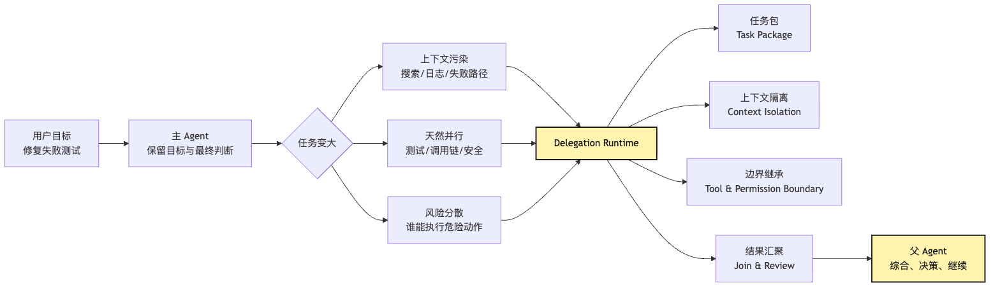
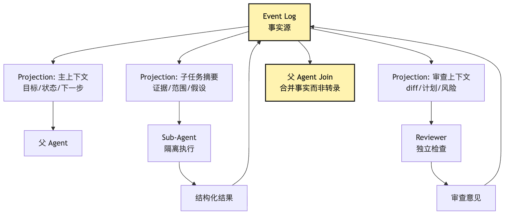

# Delegation Runtime：把任务分出去，但不丢掉控制权

到了这里，我们的小型 CLI Agent 已经不再是一个会聊天的模型壳。

它能接 provider。

它能把模型输出拆成 intent。

它有 tool runtime。

它有 permission。

它能记录 event log。

它知道 messages 不是事实源。

它也知道 session replay 不是重新跑真实世界，而是用事件恢复可解释状态。

这时用户给它一个稍微真实一点的任务：

```text
这个项目测试失败了，帮我找原因并修好。
顺便确认一下有没有影响旧 API。
如果改动涉及权限逻辑，也帮我做一次安全检查。
```

一个 Agent 当然可以从头做到尾。

它可以先跑测试。

它可以读失败日志。

它可以搜索调用链。

它可以修改代码。

它可以再跑测试。

它可以看旧 API。

它可以检查安全风险。

但你会很快看见三个问题。

第一个问题是上下文。

测试日志、调用链、旧 API、权限逻辑、安全检查、失败路径、排除路径，全都塞进主上下文以后，主 Agent 的注意力会变得越来越散。

它本来应该判断“最小修复是什么”。

结果上下文里堆满了“刚才搜过哪些文件”“哪个测试日志截断了”“某个无关模块为什么不是根因”。

第二个问题是并行。

查旧 API 兼容性、复现失败测试、看权限风险，这些任务不一定要串行。

如果每一步都由主 Agent 亲自完成，任务会慢。

慢还不是最糟糕的。

更糟糕的是，主 Agent 为了推进速度，会跳过一些本该独立验证的事情。

第三个问题是控制权。

如果你把任务交给几个 sub-agent，看起来很聪明：

```text
一个查测试。
一个查调用链。
一个查安全。
一个负责修改。
```

但如果只是“多叫几个模型”，系统会从一个可控 Agent 变成几个不可控副本。

谁能改文件？

谁能跑命令？

谁能联网查文档？

谁能请求用户批准？

谁能决定最终方案？

谁负责把结果合并到主线？

哪个子 Agent 失败以后要重试，哪个失败以后要放弃？

如果两个子 Agent 给出冲突结论，听谁的？

如果某个子 Agent 在后台执行危险命令，父 Agent 还知不知道？

这就是第 18 篇要解决的问题。

这篇文章讲的不是“多 Agent 很酷”。

也不是“怎样设计一群角色扮演专家”。

它要回答的是：

```text
当任务变大以后，怎样把局部工作分出去，
同时仍然让父 Agent 保留控制权、责任链和最终判断？
```

我们给这层机制一个名字：

```text
Delegation Runtime
```

它的核心句是：

```text
delegation 是一种工具调用。
sub-agent 是受控执行体。
父 Agent 分出去的是局部任务，不是最终控制权。
```

这里的“控制权”要具体一点：

```text
父 Agent 保留 final decision。
父 Agent 保留是否授予写权限、以及是否接受变更的权力。
父 Agent 保留 join authority。
子 Agent 只拥有被任务包授予的局部探索权。
```

这句话听起来有点硬。

我们慢慢拆。

## 问题链

先把本篇的问题链固定住：

```text
单 Agent 可以完成小任务
-> 任务变大后，主上下文会被探索噪音污染
-> 一些局部任务天然可以并行或独立验证
-> 直接多叫几个模型，会丢掉工具边界、权限边界、trace 边界和结果 contract
-> delegation 必须被建模成一种特殊 tool intent
-> 父 Agent 通过任务包规定目标、上下文、工具、权限、预算和输出格式
-> 子 Agent 是受控执行体，只返回结构化 observation 和证据
-> 父 Agent 负责 join / review，保留最终判断与合并控制权
```

## 一、任务变大以后，单 Agent 最先丢掉的是主线

先从我们一直沿用的例子开始。

用户在项目根目录输入：

```text
这个项目测试失败了，帮我找原因并修好。
```

最小 Agent Loop 会这样跑：

```text
Think
-> run tests
-> observe failure
-> read file
-> search callers
-> edit file
-> run tests again
-> final
```

这个流程在小任务里很好。

如果失败原因只在一个文件里，主 Agent 完全可以自己做完。

但真实项目里的测试失败经常不是这样。

比如失败日志指向：

```text
auth/session.test.ts
```

主 Agent 读完以后发现问题可能和三个方向有关：

```text
session refresh 逻辑
legacy login API 兼容性
cookie / token 的权限边界
```

这三个方向都需要查。

它们又不是同一种查法。

查 `session refresh` 更像实现定位。

查 `legacy login API` 更像兼容性审计。

查 `cookie / token` 更像安全检查。

如果主 Agent 亲自做，主上下文会变成这样：

```text
用户目标
测试失败日志
session.ts 代码
login.ts 代码
旧 API route
前端调用点
测试 mock
安全 checklist
一堆搜索结果
一堆无关文件
几次错误假设
几次工具截断
```

表面上它掌握的信息更多了。

实际上它的判断空间更脏了。

它每一轮调用模型，都要重新在这堆信息里找重点。

上下文越长，模型越容易做两件事：

第一，忘掉最初的用户目标。

第二，把局部发现误当成全局事实。

这就是复杂任务里很常见的现象：

```text
Agent 不是没做事。
它做了太多局部事，反而丢了主线。
```

多 Agent 的第一层价值，不是并行。

而是隔离噪声。

子 Agent 可以去某个方向深入搜索、试错、排除。

父 Agent 不需要继承它的全部中间过程。

父 Agent 只需要收到一个结构化结论：

```text
我查了什么。
我发现了什么。
证据在哪里。
排除了什么。
还有什么不确定。
建议下一步做什么。
```

这和真实团队很像。

你不会要求同事把下午所有 `rg` 命令和每个失败猜测都念给你。

你希望他说：

```text
我查完调用链了。
旧 API 只有两个入口。
其中一个仍然依赖旧 session shape。
证据在 routes/legacy-login.ts:42。
如果要改 session refresh，需要保留这个字段。
```

这才是有效委派。

它不是“把脑力复制出去”。

它是“把高噪声探索压缩成低噪声证据”。

画成问题链，大概是这样：



注意图里的方向。

任务从父 Agent 发出去。

结果回到父 Agent。

控制权没有从父 Agent 身上移走。

这就是本文的主线。

## 二、把 sub-agent 当成模型副本，是多 Agent 的第一个坑

很多系统第一次实现 sub-agent，会写得很直接。

伪代码大概是：

```ts
async function delegate(prompt: string) {
  return provider.chat({
    messages: [
      { role: "system", content: "You are a helpful sub-agent." },
      { role: "user", content: prompt },
    ],
  });
}
```

这段代码看起来已经能工作。

父 Agent 可以生成一段 prompt：

```text
请你检查 legacy login API 有没有受影响。
```

然后系统再调一次模型。

模型返回一段分析。

父 Agent 把分析放回上下文。

demo 很顺。

但这不是 Delegation Runtime。

这只是 nested LLM call。

它缺少几件关键东西。

第一，缺少任务对象。

这次委派叫什么？

要解决什么问题？

完成标准是什么？

结果格式是什么？

失败时怎么判断是可重试、可降级、还是必须回到主 Agent？

第二，缺少上下文策略。

子 Agent 是从空白开始，还是继承父上下文？

给它哪些文件摘要？

给它哪些 event log？

给它哪些用户约束？

哪些东西不能给？

第三，缺少工具边界。

它能不能读文件？

能不能跑测试？

能不能改文件？

能不能联网？

能不能继续再派 sub-agent？

第四，缺少权限继承。

父 Agent 已经获得的权限，子 Agent 是否自动继承？

如果父 Agent 在 plan 阶段只有只读权限，子 Agent 能不能写文件？

如果用户只批准了运行 `pnpm test auth`，子 Agent 能不能运行 `rm -rf dist`？

第五，缺少结果 contract。

子 Agent 返回自然语言长文，父 Agent 怎么可靠合并？

它有没有证据？

有没有置信度？

有没有修改建议？

有没有风险声明？

有没有“我没查到”的诚实结论？

第六，缺少 trace 归并。

子 Agent 读了哪些文件？

跑了哪些命令？

遇到哪些错误？

它的工具调用属于哪个父任务？

最终 trace 里能不能看到“这个结论来自哪个子任务”？

第七，缺少失败回收。

子 Agent 超时怎么办？

被用户取消怎么办？

结果格式不合格怎么办？

和另一个子 Agent 冲突怎么办？

执行到一半进程崩了怎么办？

这些问题没有回答，sub-agent 只是看起来像协作。

真正出事时，它会把系统带到更难调试的状态。

所以 Delegation Runtime 的第一条原则是：

```text
不要把 sub-agent 当成另一个模型调用。
要把它当成一种工具执行。
```

也就是说，`delegate` 这个动作本身仍然进入 Tool Runtime 的 validate、permission、audit 和 observation 流程。

区别只在于它的 executor 是一个受控 agent runtime。

这句话的含义很具体。

普通工具调用有 intent。

delegation 也要有 intent。

普通工具调用要 validate。

delegation 也要 validate。

普通工具调用要 permission。

delegation 也要 permission。

普通工具调用要 execute。

delegation 也要 execute。

普通工具调用要 observe。

delegation 也要 observe。

普通工具调用要进入 event log。

delegation 也要进入 event log。

区别只是：

```text
普通工具的执行体是函数、命令、MCP server。
delegation 的执行体是另一个受控 Agent runtime。
```

用一张管线图表示：


这张图故意长得像 Tool Invocation Pipeline。

因为这就是设计意图。

delegation 不是工具系统之外的捷径。

它是工具系统里一种特殊但必须受控的工具。

## 三、任务包：父 Agent 派出去的不是一句话

如果 delegation 是工具调用，那么它的输入不能只是一段自然语言。

它需要一个任务包。

任务包不是为了形式主义。

它是为了让父 Agent、子 Agent、权限系统、event log、reviewer 都知道同一件事：

```text
这次委派到底要完成什么，
在哪些边界内完成，
以什么格式回来，
由谁负责合并。
```

一个最小任务包可以长这样：

```ts
type DelegationIntent = {
  id: string;
  title: string;
  parentSessionId: string;
  parentTurnId: string;
  role: "explorer" | "worker" | "reviewer" | "tester" | "security";
  objective: string;
  scope: {
    files?: string[];
    directories?: string[];
    symbols?: string[];
    commands?: string[];
  };
  contextPolicy: {
    mode: "clean" | "summary" | "fork";
    includeEvents: string[];
    includeArtifacts: string[];
    excludeSecrets: boolean;
  };
  toolPolicy: {
    allowedTools: string[];
    disallowedTools: string[];
    permissionMode: "readonly" | "default" | "ask";
  };
  outputContract: {
    format: "finding-report" | "patch-proposal" | "test-report";
    requiredFields: string[];
  };
  budgets: {
    maxTurns: number;
    maxToolCalls: number;
    timeoutMs: number;
  };
};
```

这不是最终 API。

它只是把 delegation 必须回答的问题写出来。

还是修测试的例子。

父 Agent 想查旧 API 兼容性。

如果只写 prompt，可能是：

```text
查一下旧 API 有没有受影响。
```

这句话太松。

更好的任务包应该像这样：

```json
{
  "id": "check-legacy-login-compat",
  "title": "检查旧登录 API 兼容性",
  "role": "explorer",
  "objective": "确认 session refresh 修复是否会破坏 legacy login API",
  "scope": {
    "directories": ["src/routes", "src/auth", "tests/auth"],
    "symbols": ["legacyLogin", "createSession", "refreshSession"]
  },
  "contextPolicy": {
    "mode": "summary",
    "includeEvents": ["failed-test-observation", "candidate-root-cause"],
    "includeArtifacts": ["auth-test-log"],
    "excludeSecrets": true
  },
  "toolPolicy": {
    "allowedTools": ["read_file", "search_text"],
    "disallowedTools": ["edit_file", "run_command", "network_fetch"],
    "permissionMode": "readonly"
  },
  "outputContract": {
    "format": "finding-report",
    "requiredFields": [
      "checked_paths",
      "evidence",
      "compatibility_risk",
      "recommendation",
      "unknowns"
    ]
  },
  "budgets": {
    "maxTurns": 6,
    "maxToolCalls": 20,
    "timeoutMs": 180000
  }
}
```

这个任务包让几件事变清楚了。

它不是让子 Agent “随便看看”。

它只让子 Agent 做兼容性探索。

它不给写权限。

它不给运行命令权限。

它要求结果有证据。

它限制工具调用预算。

它保留了 unknowns。

unknowns 很重要。

很多子 Agent 输出会假装完整。

但父 Agent 真正需要知道：

```text
哪些路径查过了。
哪些路径没查。
哪些结论有证据。
哪些只是推测。
```

任务包的价值就在这里。

它把一句“你去看看”变成可验证的工作单元。

如果子 Agent 返回结果时没有 `checked_paths`，runtime 可以判定输出不合格。

如果子 Agent 试图调用 `edit_file`，permission 可以直接拒绝。

如果子 Agent 超过 `maxToolCalls`，runtime 可以停止它。

如果子 Agent 需要扩大范围，它必须把这个需求回传给父 Agent，而不是自己越界。

这就是控制权仍在父 Agent 手里的第一层证据：

```text
子 Agent 只能在任务包规定的边界里工作。
```

## 四、上下文隔离：不要把父 Agent 的脑子整包复制出去

delegation 的第二个关键问题是上下文。

很多人一想到 sub-agent，就会问：

```text
子 Agent 要不要看到父 Agent 的完整上下文？
```

这个问题没有固定答案。

因为上下文策略取决于任务。

大致有三种模式。

第一种是 clean context。

子 Agent 从干净上下文开始，只拿任务包和少量必要事实。

这种模式适合只读探索、独立审查、文档研究。

它的优点是噪声少。

它不会继承父 Agent 的错误假设。

它的缺点是可能重复调查。

第二种是 summary context。

父 Agent 把当前会话折叠成一份面向子任务的摘要。

子 Agent 不看完整转录，只看相关事实、已排除路径、关键文件、当前假设。

这种模式适合大多数工程委派。

它比 clean context 更省重复成本。

又比完整 fork 更克制。

第三种是 fork context。

子 Agent 继承父会话当前上下文前缀，再追加自己的任务指令。

这种模式适合并行验证多个方向。

比如父 Agent 已经完整理解了失败测试、相关文件和候选根因。

它想同时验证三个修复方向：

```text
方向 A：session refresh 条件错了。
方向 B：测试 mock 不符合真实行为。
方向 C：legacy login API 依赖旧字段。
```

这时 fork 可以减少重复解释。

但 fork 的风险也更大。

它会继承父 Agent 的偏见。

如果父 Agent 的候选根因一开始就错了，三个 fork 可能都会沿着错误前提探索。

所以 Delegation Runtime 不应该默认完整复制父上下文。

它应该显式选择上下文策略。

可以这样判断：

```text
子任务需要独立视角 -> clean
子任务需要当前主线事实 -> summary
子任务需要完整工作现场 -> fork
```

对于我们的 CLI Agent，默认更推荐 summary。

因为它刚好符合 Harness 的核心取舍：

```text
给足必要事实。
隔离中间噪声。
保留父 Agent 的最终综合权。
```

上下文隔离和第 16 篇的 session replay 关系非常紧。

如果事实源是 messages，父 Agent 很难给子 Agent 做干净投影。

因为 messages 里混着：

```text
用户消息
模型推理痕迹
工具结果
压缩摘要
临时猜测
已撤销判断
```

如果事实源是 event log，runtime 就可以投影出更合适的 delegated context：

```text
相关用户目标
相关工具观察
相关 artifact
已批准计划
当前候选根因
风险边界
```

也就是说：

```text
Session log 是 delegation 的上下文材料库。
Delegation Runtime 是 session log 的一种投影消费者。
```

可以画成这样：



这里有一个容易踩的坑。

子 Agent 的完整 transcript 不应该默认塞回父 Agent。

父 Agent 需要的是 observation。

不是所有中间聊天记录。

如果子 Agent 搜了 50 个文件，父 Agent 不需要看 50 个文件内容。

它需要看：

```text
checked_paths
evidence
excluded_paths
finding
confidence
next_step
```

完整 transcript 可以保存在 trace 里。

但主上下文应该只接收结构化结果和必要证据。

这就是上下文隔离真正的收益。

## 五、工具继承：子 Agent 不应该自动拥有父 Agent 的全部能力

delegation 最危险的地方，不是子 Agent 想错。

而是子 Agent 拥有不该拥有的能力。

如果父 Agent 处在一个比较宽的权限模式里，它可能已经能：

```text
读文件
搜索代码
运行测试
编辑文件
执行 shell
访问 MCP
```

现在它派一个子 Agent 做安全检查。

安全检查本来应该只读。

如果子 Agent 自动继承父 Agent 的所有工具，它就可能在审查过程中顺手改代码。

这会破坏两个边界。

第一，角色边界。

reviewer 不应该变成 worker。

第二，责任边界。

父 Agent 以为自己只是收集意见，结果子 Agent 已经改变了工作区。

所以 Delegation Runtime 需要把工具继承做成显式策略。

常见策略有三种：

```text
intersection：子 Agent 工具 = 父工具 ∩ 角色允许工具
subset：父 Agent 明确给一个工具子集
isolated：子 Agent 使用自己的固定工具集，不继承父工具
```

默认最稳的是 intersection。

因为它同时满足两件事：

```text
子 Agent 不能超过父 Agent 当前权限。
子 Agent 也不能超过角色定义权限。
```

比如父 Agent 当前可以读、搜、跑测试、编辑。

但 `security-reviewer` 角色只允许读和搜。

那么实际工具集是：

```text
read_file
search_text
```

如果父 Agent 当前处在 plan mode，只允许只读探索。

即使 `worker` 角色通常可以编辑，当前也不能编辑。

因为父 Agent 所在阶段不允许副作用。

这条规则非常重要：

```text
子 Agent 的权限上限不能高于父 Agent 当前控制面。
```

否则 delegation 就会变成绕过权限的后门。

父 Agent 在 plan 阶段不能写文件。

于是它派一个 worker 去写。

这当然不应该发生。

同理，如果父 Agent 的网络访问被禁用，子 Agent 也不能通过自己的 MCP server 偷偷联网。

如果父 Agent 只被批准运行 `pnpm test auth`，子 Agent 不能扩大成 `pnpm test -- --runInBand --updateSnapshot`。

工具继承还要处理 required capability。

假设父 Agent 想派一个 `test-runner`。

这个角色需要 `run_command`。

但当前 permission mode 是 readonly。

runtime 不应该默默降级，然后让 test-runner 假装完成。

它应该返回一个可解释的 delegation error：

```text
无法启动 test-runner：
该角色需要 run_command，
但当前父会话权限为 readonly。
可选动作：
1. 改派 explorer 做只读测试配置分析；
2. 向用户申请运行测试权限；
3. 等进入执行阶段后再派 test-runner。
```

这种错误不是坏事。

它是在保护系统的控制边界。

## 六、权限边界：高风险动作必须冒泡回父 Agent

delegation 的权限问题，不止是“给哪些工具”。

还有一个更细的问题：

```text
子 Agent 触发高风险动作时，谁来批准？
```

最保守的答案是：

```text
所有高风险动作都必须冒泡回父 Agent 或用户。
```

子 Agent 可以请求。

不能自己批准。

比如 `worker` 子 Agent 在修测试时发现需要修改数据库 schema。

它的任务包原本只是：

```text
修复 auth/session.ts 里的 session refresh bug。
```

修改 schema 明显越界。

此时子 Agent 不应该直接做。

它应该返回一个 permission escalation：

```json
{
  "type": "permission_escalation",
  "reason": "当前修复可能需要修改 session 表结构",
  "requested_action": "edit_file: prisma/schema.prisma",
  "risk": "可能影响数据库迁移和旧环境兼容",
  "options": [
    "保持当前范围，寻找不改 schema 的修复",
    "暂停并请求用户确认 schema 变更",
    "让父 Agent 重新规划"
  ]
}
```

父 Agent 收到以后，才决定：

```text
拒绝越界。
重新派任务。
进入 Plan。
询问用户。
```

这和普通工具 permission 一脉相承。

模型提出 intent。

系统检查 intent。

高风险动作进入 approve。

执行后生成 observation。

delegation 只是把“提出 intent 的执行者”换成了子 Agent。

权限系统不能因此失效。

用状态机看会更清楚：


这张图里，`NeedsApproval` 很关键。

它说明子 Agent 不是一个独立主权体。

它不能在自己的小世界里批准风险。

它的高风险动作要回到主控制面。

这就是“父 Agent 不丢掉控制权”的第二层证据。

## 七、结果 contract：子 Agent 回来的不是一段作文

委派最常见的失败形态之一，是子 Agent 写了一段看起来很认真、但没法使用的自然语言。

比如：

```text
我检查了相关代码，整体看起来问题不大。
legacy login API 应该不会受影响。
建议继续修复 session refresh。
```

这段话没有证据。

没有查过哪些路径。

没有说“不大”的依据。

没有区分事实和判断。

父 Agent 如果直接相信它，系统就变脆。

所以子 Agent 的输出必须有 contract。

不同角色的 contract 可以不同。

`explorer` 可以输出 finding report：

```ts
type FindingReport = {
  taskId: string;
  status: "completed" | "partial" | "blocked";
  checkedPaths: string[];
  findings: Array<{
    claim: string;
    evidence: Array<{
      file: string;
      line?: number;
      snippet?: string;
    }>;
    confidence: "low" | "medium" | "high";
  }>;
  excludedPaths: Array<{
    path: string;
    reason: string;
  }>;
  risks: string[];
  unknowns: string[];
  recommendation: string;
};
```

`tester` 可以输出 test report：

```ts
type TestReport = {
  taskId: string;
  command: string;
  exitCode: number;
  passed: boolean;
  failingTests: string[];
  relevantOutput: string;
  environmentNotes: string[];
};
```

`reviewer` 可以输出 review findings：

```ts
type ReviewReport = {
  taskId: string;
  verdict: "pass" | "needs_changes" | "blocked";
  findings: Array<{
    severity: "low" | "medium" | "high";
    title: string;
    file?: string;
    line?: number;
    body: string;
  }>;
  residualRisk: string[];
};
```

这些结构不是为了让文章显得工程化。

它们是 join 的前提。

父 Agent 合并结果时，不应该只问：

```text
子 Agent 说了什么？
```

而应该问：

```text
它的状态是什么？
它查了什么？
它的证据在哪里？
它的结论置信度如何？
它有没有 unknowns？
它有没有越界请求？
它的建议是否和其他结果冲突？
```

这就是结果 contract 的意义。

它让父 Agent 可以审阅，而不是盲信。

## 八、Join / Review：父 Agent 要合并证据，不是投票表决

多 Agent 很容易被误解成“几个 Agent 投票”。

比如三个子 Agent 回来：

```text
测试 Agent：修复有效。
兼容性 Agent：旧 API 没问题。
安全 Agent：没有明显风险。
```

于是父 Agent 总结：

```text
三方都同意，任务完成。
```

这很危险。

Agent 不是真正独立的专家委员会。

它们可能共享同一个错误假设。

它们可能都漏掉同一个文件。

它们也可能因为任务包写得不好，检查范围本来就不完整。

所以 join 不是投票。

join 是证据合并。

父 Agent 要做的是：

```text
把每个子结果映射回用户目标。
检查证据是否覆盖关键风险。
检查 unknowns 是否影响结论。
检查结果之间是否冲突。
决定是否继续执行、重派、请求用户、或收尾。
```

还是修测试的例子。

假设三个子任务返回：

```text
test-runner:
  auth tests passed
  full suite not run

legacy-api-explorer:
  checked src/routes/legacy-login.ts and tests/legacy-login.test.ts
  found one old field dependency
  recommends preserving session.legacyId

security-reviewer:
  checked token refresh and cookie flags
  unknown: did not inspect production proxy config
```

父 Agent 不能简单说完成。

它应该判断：

```text
局部 auth 测试通过。
旧 API 有一个兼容性约束，修复不能删除 legacyId。
安全审查没有发现直接风险，但生产代理配置未覆盖。
下一步应该：
1. 保留 legacyId；
2. 跑 legacy login 测试；
3. 在 final 里声明 proxy config 未检查，或继续派一个只读任务检查部署配置。
```

join 的结果可能是继续派任务。

也可能是收窄修改。

也可能是向用户提问。

也可能是判定当前证据足够。

这一步必须由父 Agent 做。

因为父 Agent 持有完整用户目标、当前计划、权限上下文和最终输出责任。

这也是 Delegation Runtime 和 handoff 的区别。

`delegation` 是：

```text
父 Agent 调用子 Agent 完成局部任务。
子 Agent 返回结果。
父 Agent 继续负责主线。
```

`handoff` 是：

```text
当前任务主语改变。
控制权交给另一个 Agent。
后续多轮由它负责。
```

本篇讲的是 delegation。

不是 handoff。

如果用户一开始只是让我们修测试，半路发现要设计一整套 SSO 方案，这可能是 handoff。

但检查旧 API、跑测试、安全审查，这些都更适合 delegation。

因为主线仍然是：

```text
修好当前项目的测试失败。
```

## 九、Trace 归并：子 Agent 的痕迹必须能回到父任务

第 16 篇讲过，长任务的事实源应该是 event log。

Delegation Runtime 也必须写入 event log。

否则多 Agent 一出现，trace 就会碎。

父 Agent 的 trace 里只看到：

```text
delegated to security-reviewer
security-reviewer says OK
```

这不够。

真正的 trace 至少要能回答：

```text
父 Agent 为什么派这个任务？
任务包是什么？
子 Agent 收到了哪些上下文投影？
它使用了哪些工具？
哪些工具被拒绝？
它返回了什么结构化结果？
父 Agent 如何 join？
最终决策引用了哪些子结果？
```

所以 event log 里可以有这样的事件：

```ts
type DelegationEvent =
  | { type: "delegation.proposed"; intent: DelegationIntent }
  | { type: "delegation.validated"; taskId: string }
  | { type: "delegation.started"; taskId: string; agentId: string }
  | { type: "delegation.tool_event"; taskId: string; eventId: string }
  | { type: "delegation.permission_escalated"; taskId: string; request: unknown }
  | { type: "delegation.completed"; taskId: string; result: unknown }
  | { type: "delegation.failed"; taskId: string; error: unknown }
  | { type: "delegation.joined"; taskId: string; decision: unknown };
```

注意 `delegation.tool_event`。

子 Agent 的工具事件不应该丢。

但也不应该全部污染父 Agent messages。

它们应该进入 trace，并通过 observation 投影进入父上下文。

这就是 trace 和 context 的分工：

```text
trace 保存完整可审计事实。
context 只投影当前决策需要的事实。
```

如果后面出了问题，比如用户问：

```text
你为什么说旧 API 没受影响？
```

系统应该能回到 trace 找到：

```text
legacy-api-explorer 查了哪些文件。
它的证据是什么。
它有没有 unknowns。
父 Agent join 时有没有忽略 unknowns。
```

如果答案是：

```text
子 Agent 没查到某个路径，因为任务包 scope 漏了。
```

那这是任务包设计问题。

如果答案是：

```text
子 Agent 查到了风险，但父 Agent join 时没有采纳。
```

那是 join/review 问题。

如果答案是：

```text
子 Agent 请求越权，permission 被错误批准。
```

那是权限治理问题。

没有 trace 归并，这些问题都会变成一句：

```text
模型判断错了。
```

这太粗糙。

Harness 的目标就是让失败可归因。

Delegation Runtime 也必须延续这条纪律。

## 十、失败回收：子 Agent 失败不是主任务失败

真实委派里，子 Agent 经常失败。

它可能超时。

它可能跑到预算上限。

它可能输出格式不合格。

它可能遇到权限拒绝。

它可能查不到证据。

它可能和另一个子 Agent 结论冲突。

它可能在后台执行到一半被取消。

这些失败不应该直接把主任务打崩。

Delegation Runtime 需要把失败分类。

最常见可以分五类。

第一类是 validation failure。

任务包不合法。

比如 role 不存在，scope 为空，output contract 缺字段。

这种失败应该在启动前拦住。

第二类是 capability failure。

角色需要的工具当前不可用。

比如 test-runner 需要 run_command，但当前是 readonly。

这种失败应该回到父 Agent，让它改派、申请权限或延后。

第三类是 runtime failure。

子 Agent 执行中超时、崩溃、模型错误。

这种失败可以重试，也可以降级为 partial result。

第四类是 contract failure。

子 Agent 返回了自然语言，但没有满足 output contract。

这种失败可以要求它修正输出，也可以把 transcript 交给父 Agent 做保守处理。

第五类是 semantic conflict。

多个子结果冲突。

比如 legacy-api-explorer 说旧 API 没问题，reviewer 说旧 API 有兼容风险。

这种失败不是技术错误。

它需要父 Agent 重新审查证据，必要时再派一个仲裁性任务。

失败回收的关键是：

```text
主任务状态不能只等于子任务状态的简单相加。
```

一个子任务失败，主任务可以继续。

一个子任务成功，主任务也不一定完成。

父 Agent 要根据失败类型选择动作。

可以用一个 decision path 表示：


这里最重要的是 `父 Agent Join`。

无论子任务成功还是失败，都要回到父 Agent 的主循环。

父 Agent 决定下一步。

不是子 Agent 自己决定主任务命运。

## 十一、最小实现：把 delegation 做成一个特殊工具

现在把前面机制压成一个最小实现。

我们不做完整多 Agent 平台。

也不做 team、mailbox、远程 agent、A2A。

只做一个最小 Delegation Runtime：

```text
父 Agent 可以调用 delegate_task。
delegate_task 接收结构化任务包。
runtime 校验任务包和权限。
runtime 创建隔离子上下文。
子 Agent 在受限工具集里执行。
结果按 contract 返回。
父 Agent review 后继续 loop。
所有事件进入 session log。
```

工具定义可以长这样：

```ts
const delegateTaskTool = defineTool({
  name: "delegate_task",
  description: "Run a bounded sub-agent task and return a structured result.",
  inputSchema: DelegationIntentSchema,
  async execute(intent, runtime) {
    const validated = validateDelegationIntent(intent, runtime.state);
    const permission = await checkDelegationPermission(validated, runtime.permission);

    if (!permission.allowed) {
      return delegationObservation({
        status: "rejected",
        reason: permission.reason,
        suggestedActions: permission.suggestedActions,
      });
    }

    const childContext = buildChildContext({
      parentLog: runtime.eventLog,
      policy: validated.contextPolicy,
      intent: validated,
    });

    const childTools = resolveChildTools({
      parentTools: runtime.tools,
      role: validated.role,
      toolPolicy: validated.toolPolicy,
      permissionMode: permission.childPermissionMode,
    });

    const childRun = await runtime.subAgentRunner.run({
      intent: validated,
      context: childContext,
      tools: childTools,
      outputContract: validated.outputContract,
      budgets: validated.budgets,
    });

    return normalizeDelegationResult(childRun, validated.outputContract);
  },
});
```

这段伪代码里有几个关键点。

`validateDelegationIntent` 在启动前拦截错误。

不要等子 Agent 跑起来才发现任务包缺 scope。

`checkDelegationPermission` 把 delegation 纳入权限系统。

它不是普通内部调用。

它可能启动新的模型、读取文件、执行工具，所以必须审批。

`buildChildContext` 从 event log 投影上下文。

它不直接复制 messages。

`resolveChildTools` 做工具继承和角色裁剪。

子 Agent 拿到的是受限工具集。

`subAgentRunner.run` 是受控执行体。

它要有 budgets、abort、trace、lifecycle。

`normalizeDelegationResult` 把结果变成 observation。

父 Agent 看到的是结构化结果，而不是未处理 transcript。

如果把这套结构接回 Agent Loop，流程大概是：

```ts
while (!state.done) {
  const modelEvent = await provider.next(projectContext(state));

  if (modelEvent.type === "delegate_intent") {
    const observation = await toolRuntime.execute({
      toolName: "delegate_task",
      input: modelEvent.intent,
    });

    state = appendObservation(state, observation);
    continue;
  }

  if (modelEvent.type === "tool_intent") {
    const observation = await toolRuntime.execute(modelEvent.intent);
    state = appendObservation(state, observation);
    continue;
  }

  if (modelEvent.type === "final") {
    state.done = true;
  }
}
```

看出来了吗？

`delegate_intent` 和 `tool_intent` 在 loop 里非常像。

这就是本篇一直强调的：

```text
delegation 是工具调用的一种。
```

## 十二、一次完整修测试链路：父 Agent 怎么派活又保持控制

最后用完整例子串起来。

用户输入：

```text
这个项目测试失败了，帮我找原因并修好。
顺便确认旧 API 和权限逻辑不要被破坏。
```

父 Agent 第一轮不急着派 worker。

它先运行最小测试：

```text
pnpm test auth
```

Observation 显示：

```text
auth/session.test.ts fails:
expected refresh token to keep legacy session id
received undefined
```

父 Agent 读 `src/auth/session.ts`，形成候选根因：

```text
最近 session refresh 重建了 session object，
但没有保留 legacyId。
```

这时它可以自己继续查。

但任务已经分成三个方向：

```text
确认 legacy API 是否依赖 legacyId。
确认最小修复应该保留哪些字段。
确认权限和 token 安全边界是否受影响。
```

父 Agent 提出三个 delegation intent。

第一个：

```text
legacy-api-explorer
只读搜索 src/routes 和 tests/auth
输出 checked_paths、evidence、compatibility_risk
```

第二个：

```text
patch-planner
只读分析 session refresh 的最小修复点
输出 patch proposal，不直接改文件
```

第三个：

```text
security-reviewer
只读检查 cookie flags、token reuse、permission boundary
输出 review findings 和 unknowns
```

runtime 校验三件事：

```text
当前阶段是否允许 delegation。
每个角色工具集是否在父权限内。
上下文投影是否排除了 secret。
```

三个子 Agent 运行。

父 Agent 不是失联等待。

它知道任务 id：

```text
task-legacy-api
task-patch-plan
task-security-review
```

它可以看到状态：

```text
running
completed
blocked
```

结果回来以后，父 Agent 做 join。

legacy-api-explorer 返回：

```text
legacy login 仍然读取 session.legacyId。
证据：src/routes/legacy-login.ts
建议：refreshSession 保留 legacyId。
```

patch-planner 返回：

```text
最小修改是在 rebuildSession 中 spread preservedFields。
不要重写 createSession。
```

security-reviewer 返回：

```text
未发现 token reuse 新风险。
unknown：未检查生产 proxy cookie rewrite。
```

父 Agent 合并以后做出执行决策：

```text
修改 refreshSession，保留 legacyId。
不改 schema。
不改 token 生成逻辑。
修改后运行 auth 和 legacy-login 测试。
final 中说明 proxy rewrite 不在本次检查范围。
```

接着父 Agent 自己提出 edit intent。

Tool Runtime 做 validate、permission、execute、observe。

测试通过后，父 Agent 可以再派一个 reviewer：

```text
review diff 是否只触及 session refresh，
是否符合 legacyId 保留目标。
```

reviewer 只读 diff。

返回 pass 或 findings。

父 Agent 最终输出：

```text
修复了什么。
为什么这么改。
哪些测试通过。
哪些风险检查过。
哪些范围未覆盖。
```

这条链路里，子 Agent 做了很多事。

但控制权始终在父 Agent。

父 Agent 决定派什么。

父 Agent 决定给多少上下文。

父 Agent 决定给哪些工具。

父 Agent 审阅结果。

父 Agent 合并证据。

父 Agent 执行最终修改。

父 Agent 对用户负责。

这就是 Delegation Runtime 的完整味道。

## 十三、常见坏味道：一旦出现这些，说明控制权正在外泄

写 Delegation Runtime 时，有几种坏味道很明显。

第一种是子 Agent 可以自由选择工具。

如果任务包说“检查安全风险”，子 Agent 自己决定要不要 edit、要不要 run shell、要不要联网，那就不是委派。

那是把权限交出去了。

第二种是子 Agent transcript 直接塞回主上下文。

这样看似透明，实际上污染主线。

完整 transcript 应该进 trace。

主上下文应该接收结构化 observation。

第三种是父 Agent 不做 join，直接转述子 Agent 结论。

这会让父 Agent 变成消息转发器。

真正的父 Agent 要审证据、处理冲突、决定下一步。

第四种是子 Agent 可以再无限派子 Agent。

递归 delegation 如果没有深度、预算和权限继承，很快会失控。

默认应该禁止子 Agent 再派生。

如果允许，也要有明确 depth limit 和 parent approval。

第五种是所有子 Agent 都是 worker。

如果 explorer、reviewer、tester、security 都能写文件，它们只是不同名字的全权限副本。

角色没有落到工具边界上，就没有意义。

第六种是失败被包装成成功。

子 Agent 查不到证据，就写“没有发现问题”。

这很危险。

没有发现，不等于不存在。

output contract 必须允许：

```text
partial
blocked
unknown
out_of_scope
```

第七种是没有 trace 归并。

出了问题以后只能看到“某个子 Agent 说过”。

这说明 delegation 没有真正进入 Harness。

它只是一个 UI 功能。

## 十四、边界：什么时候不要 delegation

Delegation Runtime 很有用。

但不是所有任务都该拆出去。

很小的任务不要拆。

比如一个测试失败，根因就在一个断言里。

派三个子 Agent 只会增加开销。

高度耦合的写任务不要自由并行。

比如多个 Agent 同时改同一个文件。

除非 runtime 有强冲突管理，否则最好由父 Agent 串行执行。

缺少结果 contract 的任务不要拆。

如果你说不清子 Agent 应该返回什么，就先不要派。

它大概率会返回一段不可验证的自然语言。

权限边界不清的任务不要拆。

如果你不知道子 Agent 能不能写、能不能跑、能不能联网，那就先把角色和工具边界定义清楚。

需要持续多轮接管用户意图的任务，也不一定是 delegation。

那可能是 handoff。

比如用户从“修测试”切换到“帮我设计公司统一 SSO 接入方案”。

这时最好承认任务主语变了。

不是继续让父 Agent 假装所有事都是当前修测试任务的子问题。

Delegation Runtime 的边界可以压成一句话：

```text
当任务仍属于当前目标，但局部探索、验证或审查可以隔离完成时，用 delegation。
当任务主语改变，需要另一个 Agent 持续负责时，才考虑 handoff。
```

## 十五、和前后章节的关系

第 16 篇讲 Session Replay。

它解决的是：

```text
长任务的事实源在哪里？
失败后怎么恢复？
messages 为什么只是投影？
```

Delegation Runtime 直接依赖它。

因为子任务、子上下文、子 trace、子结果都必须写回 event log。

没有 event log，delegation 很难恢复，也很难归因。

第 17 篇如果讲 Capability Discovery / Skills / MCP，它解决的是：

```text
系统有哪些能力？
哪些能力来自 skill？
哪些能力来自 MCP？
这些能力如何被发现、声明、约束？
```

Delegation Runtime 会消费这些 capability。

因为子 Agent 的角色和工具边界，最终要落到 capability registry 上。

一个 `security-reviewer` 能不能用某个 MCP security scanner，不应该靠 prompt 猜。

它应该来自能力声明、权限策略和任务包 scope。

第 18 篇自己解决的是：

```text
任务如何被分出去，
上下文如何隔离，
权限如何继承，
结果如何合并，
失败如何回收。
```

再往后，系统会继续长出更生产化的东西。

比如 trace analysis。

因为多 Agent 一出现，失败归因会更复杂。

你需要能回答：

```text
是父 Agent 拆错任务？
是子 Agent 查错证据？
是权限策略放得太宽？
是 join 忽略了 unknowns？
还是 output contract 太松？
```

也会继续长出 memory governance。

因为子 Agent 的发现不是都应该进入长期记忆。

某些只是本次任务的临时事实。

某些才是跨会话可复用的项目知识。

Delegation Runtime 不是终点。

它只是让一个 Agent 从“单线程做事”，升级成“能组织受控局部工作”的开始。

## 十六、最小记忆点

多 Agent 不是更多模型。

多 Agent 是更多协调问题。

Delegation Runtime 解决的不是“怎样让几个 Agent 一起聊”。

它解决的是：

```text
怎样把局部任务交给受控执行体，
同时让父 Agent 继续持有目标、权限、状态、证据合并和最终责任。
```

如果只能记住一句话，记这一句：

```text
delegation 是工具调用的一种；
父 Agent 分出去的是工作，不是控制权。
```

当你这样理解 delegation，很多设计会自然落位：

```text
任务包不是 prompt 装饰，而是执行 contract。
上下文隔离不是省 token，而是保护主线。
工具继承不是默认复制，而是权限交集。
结果 contract 不是格式洁癖，而是 join 的前提。
trace 归并不是日志炫技，而是失败归因的基础。
失败回收不是容错附加项，而是长任务 runtime 的基本职责。
```

到这一步，我们的小型 CLI Agent 已经能把任务分出去。

但它还没有真正进入生产环境。

因为任务一旦被分出去、拉长、恢复、审查，另一个问题会越来越明显：

```text
当系统失败时，我们怎样从事实日志里定位是哪个机制坏了？
```

这会把我们带到下一组文章：

```text
Trace Analysis。
```

也就是让 Harness 不只是能跑，还能解释自己为什么跑错。

## 落地到教学 Harness

如果要在教学项目里加 delegation，不要先做多 Agent 聊天。先把它做成一种受控 run：父级创建任务包，指定 scope、allowed tools、expected output；子级使用隔离 context 运行；父级只接收结构化结果和事件摘要。这样委派仍然是 Harness 管理的执行单元。

---

GitHub 地址: [00-18-delegation-runtime-control.md](https://github.com/LienJack/build-harness/blob/main/docs/zh/00-18-delegation-runtime-control.md)
