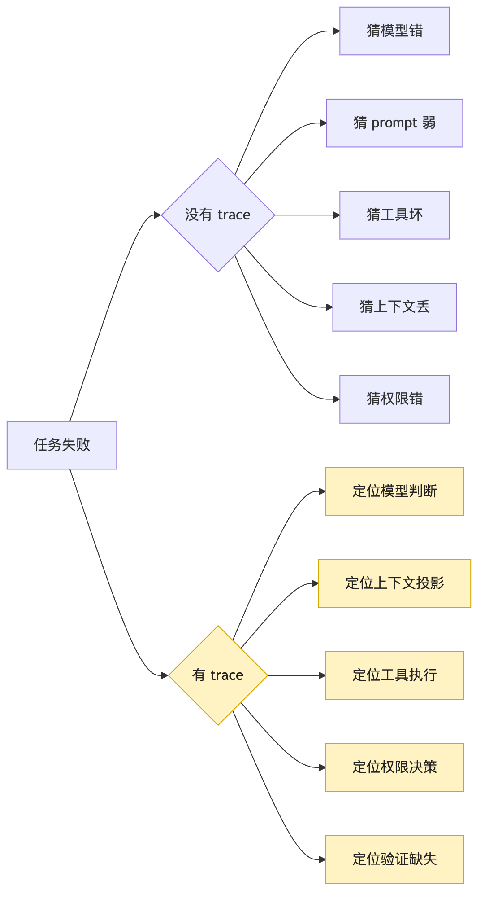
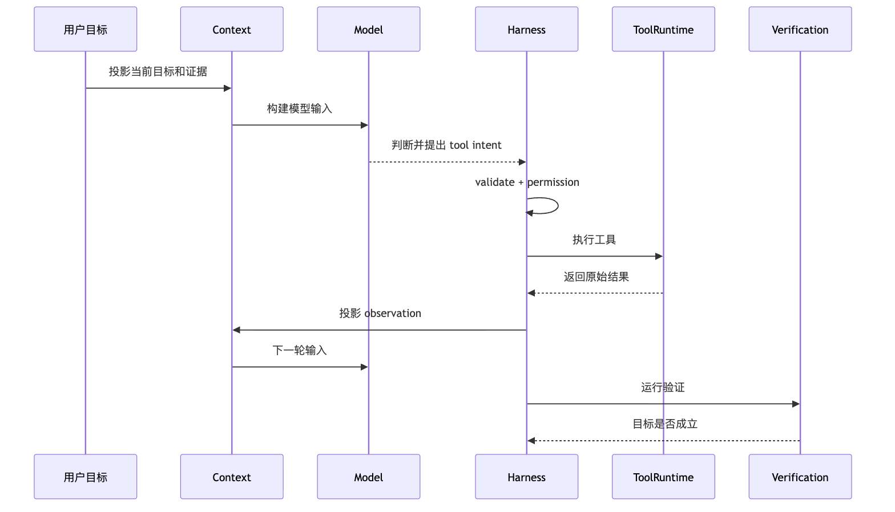
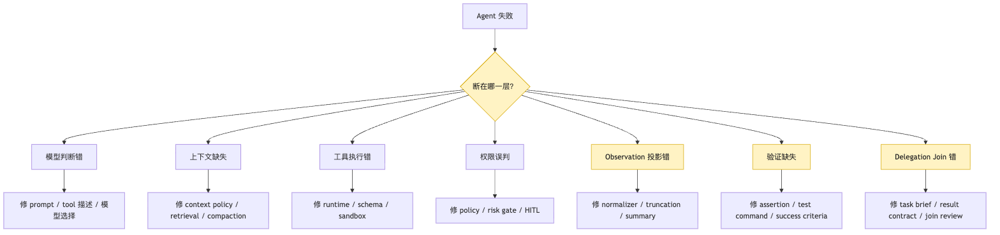
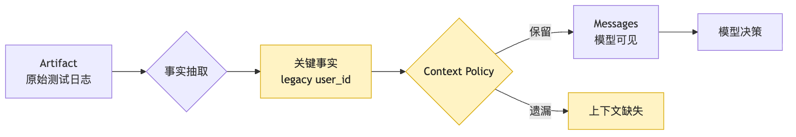
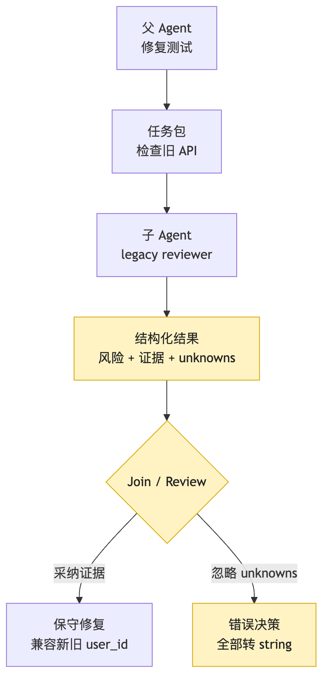
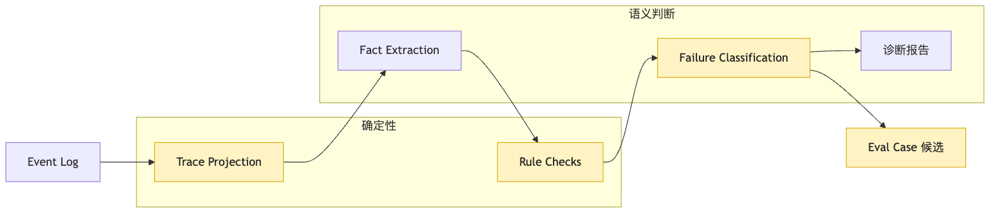

# Trace Analysis：用事实日志定位 Agent 失败

用户说：

```text
这个项目测试失败了，帮我找原因并修好。
```

Agent 跑了一会儿。

它读了文件。

它跑了测试。

它改了代码。

它又跑了测试。

最后它说：

```text
我已经修复了失败测试。
```

可用户重新运行测试，还是失败。

现在你要排查。

如果没有 trace，你只能这样猜：

```text
是不是模型判断错了？
是不是工具没执行成功？
是不是上下文里少了关键日志？
是不是权限拦错了？
是不是 observation 写错了？
是不是测试命令跑错目录了？
是不是 sub-agent 的结论被错误合并了？
```

这些猜测都可能对。

也都可能错。

最糟糕的是，你往往会把所有失败都归结为一句话：

```text
模型不够聪明。
```

这句话很省事。

但它几乎没有工程价值。

因为如果真正的问题在 permission、tool runtime、context projection、verification 或 delegation join，你换模型也不会从根上修好。

第 16 篇已经解决了“事实在哪里”：

```text
event log 是恢复和审计的事实输入。
```

这一篇只解决第二个问题：

```text
事实很多，怎样组织成能定位失败的责任链？
```

这一篇要解决的是下一层问题：

```text
有了事实日志以后，怎样把它组织成可以定位失败的 trace？
```

注意这个问题里有两个词。

一个是“事实”。

一个是“定位”。

事实日志只保证系统没有完全失忆。

Trace Analysis 要做的是把事实排列成可诊断的因果链。

它不是把日志打印得更漂亮。

也不是给每个函数加几行 `console.log`。

它要回答的是：

```text
这次 Agent 失败，到底坏在哪一层？
```

这一篇的核心句是：

```text
Event log 记录发生过什么。
Trace 组织为什么会这样发生。
Trace Analysis 把失败归因到模型、上下文、工具、权限、观察、验证或委派边界。
```

我们还是沿用同一个 CLI Agent 修复测试失败的例子。

这一次，我们不再只关心它能不能跑完。

我们关心的是：

```text
它跑错以后，系统能不能把错解释清楚。
```

## 从失败日志到责任链

本章新增的诊断对象是这条链：

```text
Agent 失败后，只看最终 transcript 会把问题压缩成“模型错了”
-> Session log 记录事实，但还不是诊断视图
-> Trace 把 goal、context、model decision、intent、permission、execution、observation、verification 串成因果链
-> Trace Analysis 根据证据把失败归因到模型、上下文、工具、权限、observation、验证或委派边界
-> 失败分类必须指向修复路线，而不是贴标签
-> 归因前要先确认模型当时是否看见关键事实
-> 诊断报告应该留下证据引用、影响判断和修复建议
-> 这些失败样本最终会进入 eval 和回归测试
```

## 一、没有 trace 时，失败会被压缩成一句“模型错了”

先看一个最常见的失败现场。

用户给 CLI Agent 一个任务：

```text
这个项目测试失败了，帮我找原因并修好。
```

Agent 第一轮运行测试。

测试输出里有一段关键错误：

```text
TypeError: expected user.id to be string, received number
```

模型看到日志以后，判断问题在 `src/auth/session.ts`。

它读取文件。

它修改了 `normalizeUser`。

它再次运行测试。

测试仍然失败。

但失败原因已经变了：

```text
legacy login should preserve numeric user_id for v1 API
```

Agent 没有注意到这个变化。

它继续围绕 `user.id` 类型修改。

最后输出：

```text
已修复 auth session 测试。
```

可测试没有通过。

现在我们要分析。

如果你只有最终 transcript，你可能看到的是：

```text
模型读了 session.ts。
模型改了 normalizeUser。
模型说测试修好了。
```

这个信息太粗。

它不能回答：

```text
模型有没有看见第二次测试失败？
第二次测试失败是否被截断？
verification 有没有正确识别退出码？
模型是否把两个不同失败混成一个？
工具执行到底有没有成功？
修改 diff 是什么？
是否有 sub-agent 曾经发现 legacy API 风险？
父 Agent join 时有没有忽略这个 unknown？
```

没有 trace，排查会变成读心术。

你只能看最终输出，然后想象模型内部发生了什么。

但 Agent Harness 的工程目标不是读心。

它的目标是让每个关键边界都留下证据。



看这张图时，重点不是右侧节点更多。

真正重要的是分叉方式变了。

没有 trace 时，失败分析从结论倒推原因。

有 trace 时，失败分析沿着事实链寻找断点。

这两种工作方式完全不同。

前者依赖经验。

后者依赖证据。

经验当然有价值。

但一个生产化 Harness 不能要求每次事故都靠某个熟悉系统的人临场猜中。

它应该把失败现场组织成一条可以复盘、可以比较、可以进入 eval 的 trace。

这样下一次同类失败出现时，系统不只是“又失败了一次”。

它会多一条可学习的样本。

## 二、Session log 是事实源，但它还不是诊断视图

第 16 篇已经把事实源的地基打好了。

长任务不能只保存 messages。

它要保存 event log。

比如一段修测试任务可能有这样的事件：

```text
session.started
user.message.created
model.requested
model.responded
tool.intent.created
permission.decided
tool.started
tool.finished
observation.projected
context.projected
verification.started
verification.finished
session.completed
```

这已经比聊天记录强很多。

但你真正打开一份 event log 时，会发现它仍然不等于 trace analysis。

原因很简单。

Event log 面向事实保存。

Trace 面向诊断阅读。

事实保存关注：

```text
事件是否完整？
顺序是否稳定？
artifact 是否可追溯？
副作用是否被记录？
恢复时能不能重建状态？
```

诊断阅读关注：

```text
目标是什么？
模型基于什么上下文做判断？
它提出了什么 intent？
系统为什么允许或拒绝？
工具实际做了什么？
observation 是否忠实表达结果？
下一轮模型看到的是什么？
verification 是否真的验证了目标？
失败最终归属在哪一层？
```

这两个关注点互相依赖，但不是同一个东西。

一个 event log 可以很完整，却很难读。

比如它可能按时间顺序记录了几千个事件。

每个事件都有 `id`、`seq`、`ts`、`payload`。

但排查失败时，你不想从第一行开始读到最后一行。

你想先看到一条责任链：

```text
Goal
-> Context Snapshot
-> Model Judgement
-> Tool Intent
-> Permission Decision
-> Execution Result
-> Observation
-> Next Context Projection
-> Verification
-> Outcome
```

这就是 trace 的第一层作用。

它把底层事件组织成“一个决策如何导致一个动作，一个动作如何导致下一轮判断”的链。


这张图里有一个关键边界：

```text
event log 是输入。
trace view 是投影。
```

就像 messages 是给模型看的投影。

Trace 是给诊断系统和开发者看的投影。

同一份 event log 可以生成很多种 trace view。

比如：

```text
按工具调用聚合的 trace。
按模型轮次聚合的 trace。
按权限决策聚合的 trace。
按 delegation task 聚合的 trace。
按 verification assertion 聚合的 trace。
按失败 taxonomy 聚合的 trace。
```

这也是为什么 trace analysis 不应该硬编码在日志写入层。

Session store 负责存事实。

Trace projector 负责组织诊断视图。

Trace analyzer 负责做归因和建议。

这三层分开以后，系统会更稳。

因为你以后想改 trace UI、加失败分类、生成 eval 样本，不需要改变事实日志格式。

只要底层事件足够完整，新的诊断视图可以不断长出来。

## 三、一个可诊断 trace 至少要串起八个边界

我们先不讨论复杂 UI。

只看最小数据结构。

要定位 Agent 失败，一个 trace 至少要能串起八个边界：

```text
目标
模型判断
tool intent
权限
执行
observation
context projection
verification
```

这八个边界不是随便列的。

它们对应 Agent 从“想做事”到“做完并验证”的完整承重链路。

用户目标如果缺失，系统不知道什么叫成功。

模型判断如果缺失，系统不知道为什么提出某个动作。

Tool intent 如果缺失，系统不知道模型到底想做什么。

权限决策如果缺失，系统不知道这次动作为什么被允许或拒绝。

执行结果如果缺失，系统不知道真实世界发生了什么。

Observation 如果缺失，系统不知道模型下一轮看见了什么。

Context projection 如果缺失，系统不知道关键事实是否进入上下文。

Verification 如果缺失，系统不知道最终成功是否被证实。

所以 trace span 不是“随便记录一个耗时”。

它应该承载责任边界。

一个简化的 trace 对象可以这样设计：

```ts
type TraceRun = {
  runId: string;
  sessionId: string;
  goal: GoalSnapshot;
  turns: TraceTurn[];
  outcome: TraceOutcome;
};

type TraceTurn = {
  turnId: string;
  contextSnapshotId: string;
  visibleToolsHash: string;
  modelDecision: ModelDecisionTrace;
  actions: ActionTrace[];
  verification?: VerificationTrace;
};

type ActionTrace = {
  intent: ToolIntentTrace;
  permission: PermissionTrace;
  execution: ExecutionTrace;
  observation: ObservationTrace;
  causation: {
    modelResponseEventId: string;
    toolIntentEventId: string;
    toolFinishedEventId?: string;
  };
};
```

这段结构不是标准答案。

它只是表达一件事：

```text
trace 应该围绕一次决策链组织，而不是围绕某个日志库的字段组织。
```

很多系统一开始会把 trace 做成：

```text
span name
start time
end time
status
attributes
```

这些字段当然有用。

它们能帮你看延迟、错误、成本和调用关系。

但 Agent 失败分析还需要更多语义。

比如一个工具调用成功返回，并不意味着 Agent 决策正确。

一个模型调用没有报错，也不意味着模型判断有效。

一个 verification 命令执行成功，也不意味着它验证了用户目标。

所以 trace 里必须保留“这一步在任务语义里承担什么责任”。

否则它只能告诉你系统在哪里慢。

不能告诉你系统在哪里错。



这张图可以当成 Trace Analysis 的主干。

每当 Agent 失败，我们都沿着这条链问：

```text
目标是否被正确保留？
上下文是否给了模型必要事实？
模型判断是否和事实一致？
intent 是否结构化且可执行？
权限是否做了正确决策？
工具执行是否真的完成？
observation 是否忠实投影结果？
verification 是否验证了用户目标？
```

这八个问题问完，很多“模型不行”的结论都会被拆开。

它可能确实是模型判断错。

但也可能是更具体的 Harness 问题。

这就是 trace analysis 的价值。

它不是为了证明模型无辜。

它是为了拒绝粗糙归因。

## 四、一次修测试失败的 trace 应该长什么样

现在把抽象链路落回我们的 CLI Agent。

用户目标是：

```text
修复当前项目里的失败测试。
```

一个简化但可诊断的 trace 可能这样展开：

```text
Run 00-19-auth-test-fix

Goal:
  修复 auth/session.test.ts 中失败的测试，并确认相关回归通过。

Turn 1:
  Context:
    项目根目录、package 脚本、用户目标
  Model:
    需要先运行测试获得事实
  Intent:
    bash: pnpm test auth/session.test.ts
  Permission:
    allow read/process, no external side effect
  Execution:
    exitCode=1, stderr artifact=test-output-001.txt
  Observation:
    TypeError: expected user.id to be string, received number

Turn 2:
  Context:
    失败日志摘要、相关文件候选
  Model:
    读取 session normalizer
  Intent:
    read: src/auth/session.ts
  Permission:
    allow read
  Execution:
    ok, artifact=session-ts-002.txt
  Observation:
    normalizeUser 保留 numeric id

Turn 3:
  Context:
    session.ts 片段、测试失败摘要
  Model:
    修改 normalizeUser，将 id 转成 string
  Intent:
    edit: src/auth/session.ts
  Permission:
    allow workspace edit
  Execution:
    ok, artifact=patch-003.diff
  Observation:
    修改完成

Turn 4:
  Context:
    patch 摘要、原始失败摘要
  Model:
    重新运行测试
  Intent:
    bash: pnpm test auth/session.test.ts
  Permission:
    allow
  Execution:
    exitCode=1, artifact=test-output-004.txt
  Observation:
    legacy login should preserve numeric user_id for v1 API

Turn 5:
  Context:
    第二次失败摘要
  Model:
    误判为仍是 user.id 字符串问题
  Intent:
    edit: src/auth/session.ts
  Permission:
    allow
  Execution:
    ok
  Observation:
    修改完成

Verification:
  command: pnpm test auth/session.test.ts
  exitCode: 1
  outcome: failed
```

这份 trace 里已经能看到一个重要事实：

```text
第二次失败的错误类型变了。
```

如果 observation 和 context projection 都正确，模型应该意识到根因进入了另一个分支：

```text
兼容旧 API 的 numeric user_id
```

但 Turn 5 仍然围绕旧方向修改。

这可能是模型判断错。

也可能是 context projection 没有突出“错误变化”。

也可能是 observation 摘要把第二次失败写得太像第一次。

Trace analyzer 不能立刻拍脑袋。

它要继续看事件：

```text
test-output-004.txt 的原始日志是什么？
observation.projected 写了什么？
context.projected 给模型的 messages 里包含什么？
model.responded 的 reasoning 摘要或决策说明是什么？
verification.finished 是否保留了 exitCode=1？
```

这时 trace 的好处就出来了。

排查不再是“读完整聊天记录”。

而是沿着责任边界逐层缩小范围。

## 五、Failure Taxonomy：失败分类必须指向修复路线

Trace Analysis 必须有失败分类。

否则它只能生成一堆自然语言总结。

失败分类的目标不是给事故贴一个好看的标签。

它的目标是决定下一步应该修哪里。

对 Agent Harness 来说，至少要有七类常见失败：

```text
model_judgement_error：模型判断错
context_missing：上下文缺失
tool_execution_error：工具执行错
permission_misclassification：权限误判
observation_projection_error：observation 投影错
verification_missing：验证缺失
delegation_join_error：delegation join 错
```

这七类刚好覆盖我们前面搭起来的核心边界。

它们也对应不同修复方式。

模型判断错，可能要改 prompt、工具描述、few-shot、模型选择或任务分解。

上下文缺失，可能要改 context policy、retrieval、compaction、artifact projection。

工具执行错，可能要改 tool runtime、sandbox、cwd、超时、参数 schema。

权限误判，可能要改 policy、risk classification、human-in-the-loop。

Observation 投影错，可能要改 result normalizer、截断策略、摘要模板、错误保真。

验证缺失，可能要改 verification plan、assertion、测试命令、成功判定。

Delegation join 错，可能要改 task brief、result contract、join policy、review gate。



看这张图时，先看右侧修复路线。

分类如果不能指导修复，就是日志装饰。

比如一次失败被判为：

```text
model_reasoning_error
```

系统应该能给出证据：

```text
模型看到了完整失败日志。
日志明确显示 legacy API 约束。
工具描述没有误导。
上下文没有截断。
模型仍然选择了与证据矛盾的修改。
```

只有这样，它才有资格说是模型判断错。

如果证据链不完整，它应该保守输出：

```text
unknown 或 mixed failure
```

工程上，保守归因比自信错判更重要。

错误归因会把优化带到错误方向。

比如明明是 verification 没跑，系统却说模型差。

团队可能会花几天调 prompt。

结果真正的 bug 是测试命令一直在错误目录执行。

Trace Analysis 的使命，就是减少这种浪费。

## 六、模型判断错：要先证明模型看见了足够事实

“模型判断错”是最容易说出口的分类。

但它应该是最晚确认的分类之一。

因为模型判断依赖输入。

如果输入不完整，判断错就不完全是模型的责任。

还是修测试的例子。

第二次测试失败以后，原始日志里有：

```text
legacy login should preserve numeric user_id for v1 API
```

如果模型下一轮看到了这句话，并且还坚持把所有 id 转成 string，那么它很可能判断错。

但如果 context projection 只给它：

```text
auth session test still failing
```

那模型根本没有机会做正确判断。

所以判定模型错误之前，trace analyzer 至少要检查：

```text
关键事实是否存在于 artifact？
关键事实是否进入 observation？
关键事实是否进入 context projection？
模型响应是否引用或忽略了关键事实？
模型提出的 intent 是否与可见事实矛盾？
```

可以用一个很朴素的归因函数表达：

```ts
function classifyModelError(trace: TraceTurn): FailureFinding | null {
  const facts = trace.verification?.failureFacts ?? [];
  const visible = trace.context.visibleFacts;
  const decision = trace.modelDecision;

  const missingFacts = facts.filter((fact) => !visible.includes(fact.id));

  if (missingFacts.length > 0) {
    return null;
  }

  if (contradicts(decision.intent, facts)) {
    return {
      type: "model_judgement_error",
      evidence: [
        decision.eventId,
        ...facts.map((fact) => fact.artifactRef),
      ],
      confidence: "medium",
    };
  }

  return null;
}
```

这段代码的关键不是 `contradicts` 怎么实现。

关键是前面的判断顺序：

```text
先确认模型看见事实。
再判断模型是否违背事实。
```

很多 Agent 事故其实倒在第一步。

模型不是不知道怎么修。

它只是没有看到能修的信息。

这就是 Trace Analysis 和普通聊天复盘的区别。

普通复盘会问：

```text
模型为什么这么想？
```

Trace Analysis 会先问：

```text
系统到底让模型看见了什么？
```

这个问题更工程化。

也更可修。

## 七、上下文缺失：最危险的是“事实在日志里，但不在模型眼前”

上下文缺失是 Agent 系统里非常隐蔽的失败。

因为事后看日志时，你可能会发现关键事实明明存在。

于是你会困惑：

```text
这么明显的错误，模型为什么没看到？
```

答案可能是：

```text
它确实没看到。
```

事实存在于 event log。

不代表它进入了 context projection。

事实存在于 artifact。

不代表它进入了 messages。

事实存在于某个 sub-agent transcript。

不代表父 Agent join 时继承了它。

第 16 篇讲过：

```text
Messages 只是投影。
```

Trace Analysis 要把这句话用起来。

它要对每个关键事实记录三种状态：

```text
discovered：系统是否发现过这个事实。
projected：这个事实是否被投影给模型。
used：模型决策是否使用了这个事实。
```

比如：

```text
fact: legacy API requires numeric user_id
discovered: yes, test-output-004.txt
projected: no
used: no
```

这就是典型的 context projection failure。

不是模型判断错。

也不是工具执行错。

是关键事实没有进入下一轮决策输入。



这张图解释了一个常见错觉：

```text
日志里有，不等于模型看见了。
```

上下文缺失通常发生在几个地方。

第一，工具输出截断。

测试日志太长，关键错误在末尾，被截掉了。

第二，摘要丢事实。

Observation 为了省 token，把具体断言改写成“测试仍失败”。

第三，compaction 混淆新旧状态。

第一次失败和第二次失败被压成同一种描述。

第四，retrieval 没取到相关文件。

模型只看到 `session.ts`，没看到 `legacy-login.ts`。

第五，delegation 结果没有进入父上下文。

子 Agent 查到了旧 API 风险，但父 Agent 只收到一句“看起来没问题”。

Trace analyzer 要把这些情况从“模型没注意”里拆出来。

它可以生成这样的 finding：

```json
{
  "type": "context_projection_missing_fact",
  "fact": "legacy login requires numeric user_id",
  "discovered_at": "tool.finished:test-output-004",
  "missing_from": "context.projected:turn-5",
  "impact": "model continued editing the wrong normalization path"
}
```

这个 finding 的修复方向很明确。

不是换模型。

而是修 context policy。

比如：

```text
verification failure 的新错误类型必须强制进入下一轮上下文。
同一命令前后失败差异必须显式标注。
sub-agent unknowns 必须进入 join summary。
```

这就是 trace analysis 变成工程改进的方式。

## 八、工具执行错：不是工具报错才算执行失败

Tool Runtime 的失败也经常被误判。

很多人以为工具执行失败就是：

```text
tool.status = error
```

但真实系统里，工具失败更复杂。

一个工具可以返回 `ok`，但语义上失败。

比如测试命令：

```text
pnpm test auth/session.test.ts
```

如果 shell 工具只看“命令成功启动”，它可能返回：

```text
status: ok
```

但实际进程退出码是：

```text
exitCode: 1
```

这不是执行成功。

这是工具协议设计错了。

再比如 read 工具。

模型想读：

```text
src/auth/session.ts
```

但当前工作目录不对，读到了另一个包里的同名文件。

工具返回了文件内容。

状态也是 `ok`。

但动作语义错了。

再比如 edit 工具。

Patch 应用了。

但它应用到了生成文件而不是源文件。

工具也可能返回 `ok`。

可任务没有推进。

所以 trace 里不能只存：

```text
toolName
status
duration
```

它还要存：

```text
cwd
resolved path
exit code
stdout/stderr artifact
side effect summary
diff artifact
expected semantic outcome
normalization rule
```

对 CLI Agent 来说，工具执行错至少有这些形态：

```text
命令跑错目录。
命令参数错。
工具 schema 太松。
路径解析错。
超时被包装成成功。
stderr 被丢弃。
patch 应用到错误位置。
sandbox 与真实工作区不一致。
工具结果 normalization 错。
```

Trace analyzer 要把工具层错误从模型层错误里分离出来。

比如模型提出：

```json
{
  "tool": "bash",
  "args": {
    "cmd": "pnpm test auth/session.test.ts",
    "cwd": "/repo"
  }
}
```

这是合理 intent。

但 tool runtime 实际执行时 cwd 变成：

```text
/repo/packages/docs
```

那失败归因应该落在 tool runtime。

不是模型。

一个最小检查可以是：

```ts
function classifyExecutionMismatch(action: ActionTrace): FailureFinding | null {
  const expected = action.intent.normalizedInput;
  const actual = action.execution.resolvedInput;

  if (expected.cwd !== actual.cwd) {
    return {
      type: "tool_execution_mismatch",
      evidence: [action.intent.eventId, action.execution.eventId],
      message: "工具实际执行目录与 intent 不一致",
    };
  }

  if (action.execution.exitCode && action.observation.status === "success") {
    return {
      type: "tool_result_misclassified",
      evidence: [action.execution.eventId, action.observation.eventId],
      message: "非零退出码被投影成成功",
    };
  }

  return null;
}
```

这里的第二个分支也连接到下一类问题：

Observation 投影错。

但它先提醒我们：

```text
工具执行不是函数返回。
工具执行是 intent 到真实世界副作用之间的 contract。
```

Trace Analysis 必须检查这个 contract 有没有被破坏。

## 九、权限误判：allow 和 deny 都可能是错的

权限系统的失败很容易被简化成：

```text
危险动作被放行了。
```

这当然是严重问题。

但在 Agent Harness 里，权限误判有两种方向。

第一种是错误放行。

比如模型提出：

```text
rm -rf dist && pnpm build
```

系统没有识别 `rm -rf` 的风险，直接执行。

这会造成真实副作用。

第二种是错误拒绝。

比如模型提出：

```text
读取 package.json
```

这是低风险只读动作。

系统却因为路径策略写错拒绝了。

Agent 失去关键信息，开始猜测。

最终任务失败。

这也是权限误判。

权限的目标不是一律保守。

而是风险分类准确。

Trace 里至少要保留：

```text
intent risk classification
policy input
policy decision
decision rationale
user approval state
effective permission set
escalation path
```

否则事后很难判断权限层是否工作正常。

比如一次工具 intent：

```json
{
  "tool": "edit",
  "path": "src/auth/session.ts",
  "operation": "patch",
  "risk": "workspace_write"
}
```

权限决策：

```json
{
  "decision": "allow",
  "reason": "within workspace, user requested code fix",
  "requiresApproval": false
}
```

如果这是当前策略允许的，那没问题。

但如果文件是：

```text
scripts/deploy-prod.sh
```

同样的 allow 就很危险。

Trace analyzer 可以发现：

```text
高风险路径没有触发人工确认。
写操作没有关联用户目标。
子 Agent 越权请求被父 Agent 自动放行。
权限拒绝没有把原因投影给模型，导致模型重复请求同一动作。
```

权限错误尤其需要 trace。

因为用户经常只看到最终行为。

他们看不到系统中间是否有过风险判断。

Trace 应该让每一次 allow / deny 都能被解释。

这不是为了审计好看。

而是为了让权限策略能迭代。

## 十、Observation 投影错：最坏的 bug 是把失败写成成功

Tool Runtime 返回原始结果以后，Harness 通常不会把所有内容原样塞给模型。

它会做 observation projection。

这一步很必要。

因为原始输出可能太长、太脏、太重复、包含敏感信息。

但它也是高风险边界。

如果 observation 写错，模型下一轮的判断就会建立在错误现实上。

最常见的问题是把失败投影成成功。

比如 shell 执行返回：

```text
exitCode: 1
stderr: legacy login should preserve numeric user_id for v1 API
```

但 observation 写成：

```text
测试运行完成。
```

这句话没有错。

但它严重不够。

模型可能误以为测试通过了。

更隐蔽的是摘要误导。

比如原始日志：

```text
expected string user.id in new session shape
legacy login should preserve numeric user_id for v1 API
```

Observation 摘要：

```text
测试仍然围绕 user.id 类型失败。
```

这句话把两个约束混成一个。

模型很可能继续做单向修复。

Trace analyzer 要比较三份东西：

```text
原始结果
observation
context projection
```

它要问：

```text
observation 是否保留了 status？
是否保留了 exitCode？
是否保留了新错误和旧错误的差异？
是否标注了截断？
是否把 unknowns 写出来？
是否把高风险信息过滤得过度？
```

Observation 投影错的危险在于：

```text
模型会认真地基于假事实推理。
```

这会让失败看起来很像模型问题。

但真正坏掉的是事实投影。

所以在 trace view 里，最好把原始结果和投影结果并排显示：

```text
Raw:
  exitCode=1
  stderr includes "legacy login should preserve numeric user_id"

Observation:
  "测试运行完成，仍有 auth session 失败"

Diagnosis:
  缺少具体断言，缺少新旧失败差异，缺少 exitCode 显式标注。
```

这类 finding 很适合进入回归测试。

以后只要 shell exitCode 非 0，observation 必须包含失败状态。

只要前后同一命令失败信息变化，observation 必须标注 delta。

Trace Analysis 就这样反过来推动 observation runtime 变得更可靠。

## 十一、验证缺失：没有 verification，最终成功只是声明

Agent 修代码任务里，最终答案经常很像：

```text
我已经修好了。
```

但工程系统不能把这句话当成功。

成功必须由 verification 证明。

比如用户目标是：

```text
修复失败测试。
```

那最小 verification 至少要回答：

```text
跑了哪个测试命令？
在哪个目录跑的？
退出码是多少？
失败日志是什么？
是否覆盖原始失败用例？
是否有额外回归检查？
```

如果 trace 里没有 verification，任务结果只能是：

```text
unverified
```

不是 success。

这条规则很重要。

因为很多 Agent 看起来“聪明”的地方，是它能写出一个自信总结。

但 Harness 要更冷静。

没有验证，就不要帮它把总结升级成事实。

Verification 缺失常见于几种情况：

```text
模型忘了跑测试。
工具预算用完，系统提前结束。
测试命令失败，但 final message 仍然说成功。
跑了相关但不等价的命令。
只跑了单测，没跑受影响回归。
验证结果没有进入 final decision。
```

Trace analyzer 可以做一个硬检查：

```ts
function classifyMissingVerification(run: TraceRun): FailureFinding | null {
  if (run.outcome.claimedSuccess && !run.outcome.verification) {
    return {
      type: "missing_verification",
      message: "Agent 声称成功，但 trace 中没有验证事件",
      evidence: [run.outcome.finalMessageEventId],
    };
  }

  if (run.outcome.verification?.status === "failed" && run.outcome.claimedSuccess) {
    return {
      type: "verification_contradicted_final",
      message: "验证失败，但最终回答声称任务成功",
      evidence: [
        run.outcome.verification.eventId,
        run.outcome.finalMessageEventId,
      ],
    };
  }

  return null;
}
```

这类规则不需要 LLM-as-Judge。

它是结构化 trace 可以直接判断的。

这也提醒我们：

```text
不是所有 eval 都需要另一个模型。
```

Agent 失败分析里，很多低级但高价值的问题，可以用事件和断言直接抓出来。

LLM-as-Judge 更适合判断语义质量、规划合理性、结果说明是否充分。

但像 exitCode、缺少 verification、权限状态矛盾、tool result misclassified，这些应该先用确定性规则做。

这会让 eval 更便宜、更稳定，也更容易进入 CI。

## 十二、Delegation Join 错：子 Agent 查到了，不代表父 Agent 用对了

第 18 篇讲过：

```text
delegation 是工具调用的一种。
父 Agent 分出去的是工作，不是控制权。
```

这句话到了 trace analysis 会变成一个更具体的问题：

```text
子 Agent 的发现，是怎样影响父 Agent 最终决策的？
```

多 Agent 任务里，失败归因会比单 Agent 更复杂。

比如父 Agent 为修测试派出两个子任务：

```text
test-investigator：复现并定位失败测试。
legacy-api-reviewer：检查旧 API 是否受影响。
```

`legacy-api-reviewer` 返回：

```text
发现 v1 login API 依赖 numeric user_id。
如果 normalizeUser 全部转 string，会破坏旧 API。
证据：src/routes/legacy-login.ts:42。
unknown：没有检查移动端旧客户端。
```

父 Agent join 时却写：

```text
旧 API 未发现风险。
```

然后继续把所有 id 转成 string。

这不是子 Agent 没做事。

也不是工具没执行。

这是 join 错。

Trace 里需要能看到：

```text
父 Agent 为什么派任务。
子 Agent 收到的 task brief。
子 Agent 的 result contract。
子 Agent 的 evidence 和 unknowns。
父 Agent join 时采纳了什么。
父 Agent 忽略了什么。
最终决策引用了哪些 evidence。
```



看这张图时，先看 Join / Review。

多 Agent 不是投票。

父 Agent 不能只看谁说得更自信。

它要合并证据。

所以 delegation join 的失败分类至少包括：

```text
task_brief_missing_scope：任务包漏掉关键范围。
subagent_context_missing_fact：子 Agent 没拿到必要上下文。
subagent_result_contract_invalid：结果格式缺证据或 unknowns。
join_ignored_evidence：父 Agent 忽略已返回证据。
join_ignored_unknowns：父 Agent 把未知当安全。
join_conflict_unresolved：多个子结果冲突但未触发 review。
permission_escalation_lost：子 Agent 权限请求没有冒泡。
```

这些分类都需要 trace。

如果只看父 Agent 的最终 messages，可能只有一句：

```text
我已经检查旧 API。
```

但真正的诊断必须回到子任务 trace。

这也是第 18 篇强调 trace 归并的原因。

没有归并，父任务失败时，你无法知道某个结论来自哪里。

也无法判断它是查错了、传错了、合错了，还是被忽略了。

## 十三、Trace Analyzer 的管线：先结构化，再判断，再生成修复建议

到这里，我们可以把 Trace Analysis 做成一条管线。

它不应该直接把几千行日志丢给一个模型，然后问：

```text
你觉得哪里错了？
```

这当然可以作为辅助。

但如果完全依赖这种方式，系统又回到了“让模型猜”的状态。

更稳的方式是：

```text
Event Log
-> Trace Projection
-> Fact Extraction
-> Rule Checks
-> Failure Classification
-> Human-readable Report
-> Eval Case Candidate
```

第一步是 trace projection。

把底层事件组织成 turn、action、delegation task、verification、artifact。

第二步是 fact extraction。

从工具结果、测试日志、diff、子任务结果里抽取关键事实。

第三步是 rule checks。

用确定性规则抓明显问题：

```text
final success without verification
non-zero exit code projected as success
permission allow without required approval
sub-agent result missing evidence
context missing discovered critical fact
```

第四步才是 failure classification。

这里可以结合规则和 LLM。

规则负责结构化矛盾。

LLM 负责读复杂文本、判断语义关系、生成解释。

第五步生成报告。

报告应该给修复路线，而不是只给情绪化总结。

第六步把高价值失败变成 eval 候选。

这一步会引到后面的 Evaluation。



这条管线的工程判断是：

```text
能用结构化规则判断的，不要交给 LLM 猜。
需要语义解释的，再引入 LLM。
```

比如：

```text
exitCode=1 但 final claimed success
```

这是规则。

比如：

```text
模型的修复方案是否真正解决了 legacy API 约束？
```

这可能需要 LLM 或领域规则辅助。

Trace Analyzer 也不一定只在失败后运行。

它可以在任务进行中做轻量检查。

比如发现：

```text
连续两轮同一测试失败，但错误摘要没有变化标注。
```

系统可以提醒 agent：

```text
请比较本次失败与上次失败的差异，再决定下一步。
```

这不是替模型思考。

这是 Harness 在维护事实纪律。

Agent 越长任务，越需要这种外部纪律。

## 十四、诊断报告应该像事故复盘，不像聊天总结

Trace Analysis 的输出不应该只是：

```text
这次失败可能是因为上下文不够。
```

这句话太松。

一个有用的诊断报告至少要包含：

```text
失败结论
失败分类
证据链
影响范围
修复建议
是否可转成 eval
置信度和未知项
```

更工程化一点，Trace Analysis 的输出最好是一组 finding，而不是一段总结：

```ts
type TraceFinding = {
  category: FailureCategory;
  claim: string;
  evidenceRefs: string[];
  confidence: "low" | "medium" | "high";
  suggestedFixArea: string;
  unknowns: string[];
};
```

更具体一点，一个 finding 可以长这样：

```yaml
type: context_projection_missing_fact
impact: 模型继续沿错误方向修改
discovered_at: tool.finished:test-output-004
missing_from: context.projected:turn-5
evidence:
  - artifact://test-output-004
suggested_fix:
  - verification failure 的新错误类型强制进入下一轮 context
  - 同一命令前后失败差异显式标注
```

比如：

```text
结论：
  Agent 声称修复 auth session 测试，但最终 verification 仍失败。

分类：
  observation_projection_error + model_judgement_error

证据：
  test-output-004 显示新错误为 legacy numeric user_id。
  observation-004 只写了“auth session 仍失败”，未保留新旧失败差异。
  turn-5 model decision 继续修改 string normalization。
  verification-006 exitCode=1，但 final message 声称成功。

影响：
  Agent 在第二次失败后沿错误方向继续修改，并错误报告成功。

修复建议：
  verification failure observation 必须保留 exitCode 和关键断言。
  同一测试命令连续失败时，context projection 必须标注 delta。
  final success 必须依赖 verification.status=passed。

Eval 候选：
  是。可构造“二次失败原因变化”回归样例。

未知项：
  没有完整 model reasoning，只能基于 visible context 和 intent 判断。
```

这份报告有几个特点。

第一，它不把所有责任推给模型。

第二，它引用 trace 证据。

第三，它给出可落地修复。

第四，它保留未知项。

第五，它把失败转成 eval 候选。

这就是生产化 trace analysis 的语气。

冷静。

具体。

可复现。

不急着甩锅。

## 十五、Trace Analysis 和 Eval 的关系：失败样本要能回归

Trace Analysis 不是终点。

它的下一步通常是 Eval。

因为如果一次失败不能变成回归样本，它很容易再发生。

比如我们发现：

```text
同一测试命令第二次失败原因变化，但 Agent 没有识别 delta。
```

这就可以变成一个 eval case：

```json
{
  "name": "auth_test_failure_delta_should_change_plan",
  "goal": "修复 auth session 测试",
  "events": [
    "first_test_failure_user_id_string",
    "edit_normalize_user",
    "second_test_failure_legacy_numeric_id"
  ],
  "assertions": [
    {
      "type": "context_contains_fact",
      "fact": "legacy numeric user_id constraint"
    },
    {
      "type": "agent_should_not_repeat_same_fix"
    },
    {
      "type": "final_success_requires_verification_passed"
    }
  ]
}
```

这里的 eval 不是单纯问最终答案好不好。

它评估的是轨迹。

也就是 Agent 是否沿着合理步骤推进。

这一点和传统单元测试不同。

传统函数测试通常关心：

```text
输入 -> 输出
```

Agent eval 还要关心：

```text
输入 -> 轨迹 -> 工具使用 -> 观察 -> 验证 -> 输出
```

Trace Analysis 正好提供这条轨迹。

所以第 19 篇和第 20 以后要讲的 Eval / Memory Governance 是连在一起的。

Trace 把失败解释清楚。

Eval 把解释转成回归约束。

Memory Governance 决定哪些失败经验应该被保存为长期知识，哪些只属于本次 session。

没有 trace，eval 容易变成几个主观评分。

有 trace，eval 可以检查：

```text
工具序列是否合理。
关键事实是否被观察。
权限是否被正确处理。
验证是否覆盖目标。
子任务结果是否被正确 join。
```

这会让 Agent 优化从“感觉更好”变成“某类失败减少了”。

这才是 Harness Optimization 的入口。

## 十六、最小实现：先别做大平台，先做本地 trace report

Trace Analysis 很容易被做成一个大平台。

漂亮 UI。

搜索。

时间线。

指标面板。

分布式 trace。

这些以后都可以有。

但最小实现不需要一开始就这么重。

对我们的 CLI Agent 来说，第一版可以非常朴素：

```text
.harness/
  sessions/
    <session-id>.jsonl
  artifacts/
    <session-id>/
      test-output-001.txt
      patch-003.diff
  traces/
    <session-id>.trace.json
    <session-id>.report.md
```

运行完一次任务后，提供一个命令：

```bash
harness trace analyze .harness/sessions/auth-fix.jsonl
```

它做几件事：

```text
读取 event log。
按 causation/correlation 组装 trace。
提取 tool intent、permission、execution、observation、verification。
运行基础规则。
输出 markdown 报告。
可选生成 eval candidate。
```

伪代码可以这样写：

```ts
async function analyzeTrace(sessionLogPath: string): Promise<TraceReport> {
  const events = await readJsonl<SessionEvent>(sessionLogPath);
  const trace = projectTrace(events);

  const findings = [
    ...checkVerification(trace),
    ...checkObservationProjection(trace),
    ...checkContextMissingFacts(trace),
    ...checkPermissionDecisions(trace),
    ...checkDelegationJoin(trace),
    ...checkToolExecution(trace),
  ];

  const classified = classifyFindings(findings);

  return {
    sessionId: trace.sessionId,
    outcome: deriveOutcome(trace),
    findings: classified,
    evalCandidates: proposeEvalCases(trace, classified),
  };
}
```

这段代码有一个重要特点：

```text
analyzeTrace 不执行工具。
不重新请求模型。
不修改工作区。
```

它只读取事实日志和 artifact。

这是 trace analysis 的安全边界。

如果分析过程中需要 LLM 帮忙读复杂日志，也应该作为一个单独的 analysis tool intent，记录自己的输入输出。

不能让分析阶段悄悄改变 session 事实。

第一版报告可以只支持几类规则：

```text
最终声称成功但 verification 失败。
工具非零退出码被 observation 投影成成功。
发现关键错误但下一轮 context 没包含。
permission allow 缺少风险理由。
sub-agent result 缺 evidence 或 unknowns。
join 决策忽略子任务 unknowns。
```

这已经足够抓住很多真实问题。

不要等到有完整观测平台才开始做 trace analysis。

只要 event log 在，第一版本地报告就可以先跑起来。

## 十七、常见坏味道：出现这些，说明 trace 还不能诊断失败

Trace 系统本身也会有坏味道。

第一种是只记录文本 transcript。

看起来有历史。

但没有结构化 intent、permission、execution、observation。

这不够。

第二种是只记录成功路径。

失败、取消、拒绝、超时、截断、压缩都不记。

那 trace 只能讲故事，不能排事故。

第三种是没有 causation id。

你知道很多事件发生了。

但不知道哪个 model response 触发了哪个 tool intent。

这会让 trace 变成散点。

第四种是 observation 不留 raw artifact 引用。

事后只能看摘要。

无法判断摘要是否保真。

第五种是 verification 不作为一等事件。

最终成功变成模型声明。

这是修代码 Agent 的大忌。

第六种是 sub-agent trace 不归并。

父任务只看到子任务结论。

看不到证据、unknowns 和权限边界。

第七种是 trace report 没有修复建议。

只说“可能失败”。

不说“应该修哪层”。

第八种是所有失败都让 LLM 总结。

结构化矛盾不走规则。

这会让分析结果不稳定，也不好回归。

第九种是 trace 里混入秘密。

模型输入、工具输出、环境变量、请求头没有脱敏策略。

Trace 是诊断工具，不应该变成泄密仓库。

第十种是把 trace 当 UI 功能。

有时间线页面，但事件语义很薄。

看起来专业，排错时还是要猜。

这些坏味道背后是同一个问题：

```text
trace 没有围绕责任边界设计。
```

只要回到八个边界，很多设计会变清楚：

```text
目标。
模型判断。
tool intent。
权限。
执行。
observation。
context projection。
verification。
```

哪一层缺证据，哪一层就无法归因。

## 十八、Trace Analysis 会引出 Memory Governance

到这里，我们已经能把一次失败解释清楚。

但还有一个问题。

失败分析出来以后，哪些东西应该被系统记住？

比如这次修测试，我们可能得到几类知识：

```text
本项目 legacy login API 依赖 numeric user_id。
auth/session.test.ts 的失败曾经由 normalizeUser 引起。
同一测试命令二次失败原因变化时，必须比较 delta。
final success 必须依赖 verification passed。
某个工具的 cwd policy 曾经出错。
```

这些知识不应该一股脑进入长期记忆。

有些是项目事实。

有些是本次任务事实。

有些是 Harness 规则。

有些是一次偶发工具 bug。

有些应该进入 eval。

有些应该进入 memory candidate ledger。

有些只应该留在 trace 里，供审计时查看。

这就引出了下一篇会讲的 Memory Governance。

Trace Analysis 负责回答：

```text
这次为什么失败？
```

Memory Governance 负责继续问：

```text
这次失败里的哪些发现，值得未来被自动使用？
```

两者不能混在一起。

如果 trace finding 自动变成长期记忆，系统会很快污染自己。

比如一次临时失败：

```text
今天 pnpm test 因为网络慢超时。
```

这不应该成为永久项目知识。

但一个稳定事实：

```text
legacy login API 需要 numeric user_id。
```

可能应该进入项目 memory，未来修 auth 时可被检索。

所以第 19 篇到这里，自然把问题交给下一层：

```text
诊断出的事实，如何治理？
```

这就是 Memory Governance。

## 十九、本章代码落点

本章代码里可以先落这些对象：

```text
TraceProjector
FailureFinding
FailureTaxonomy
TraceReport
EvalCaseCandidate
```

新增测试可以先写这些：

```text
final success without verification 归为 verification_missing。
discovered fact 未进入 context 归为 context_projection_missing_fact。
非零退出码被 observation 投影成成功，归为 observation_projection_error。
子 Agent unknown 被父 Agent 忽略，归为 delegation_join_error。
```

验收标准是：

```text
trace report 指向具体责任边界，而不是只说模型错了。
每条 finding 都有证据引用、影响说明和修复路线。
失败样本能进入 eval candidate，避免同类问题反复出现。
```

到这一步，我们的小型 CLI Agent 不只是能行动、能恢复、能委派。

它开始能解释自己为什么失败。

但解释失败以后，系统还要决定：

```text
哪些失败经验要进入长期记忆？
哪些只是本次任务的临时事实？
哪些应该变成 eval 回归？
哪些应该被人工审核后再沉淀？
```

这会把我们带到下一篇：

```text
Memory Governance。
```

也就是从 candidate ledger 到 governance store，讨论 Agent 该怎样保存经验，而不把自己的记忆变成新的污染源。

## 教学 Harness 落点

教学 UI 的 Event Timeline 就是 trace analysis 的第一版。每次失败时，不要只看最终回答，而要沿着 `turn_start`、`message_update`、`tool_execution_start`、`tool_execution_end`、`turn_end` 回放。这样能判断问题在模型判断、工具参数、工具结果、context 投影，还是持久化顺序。

---

GitHub 地址: [00-19-trace-analysis-agent-failures.md](https://github.com/LienJack/build-harness/blob/main/docs/zh/00-19-trace-analysis-agent-failures.md)
