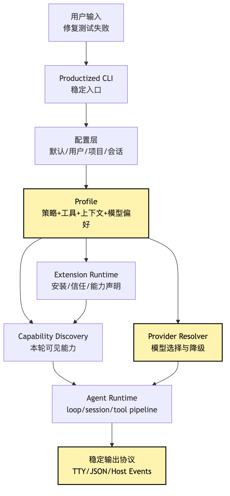
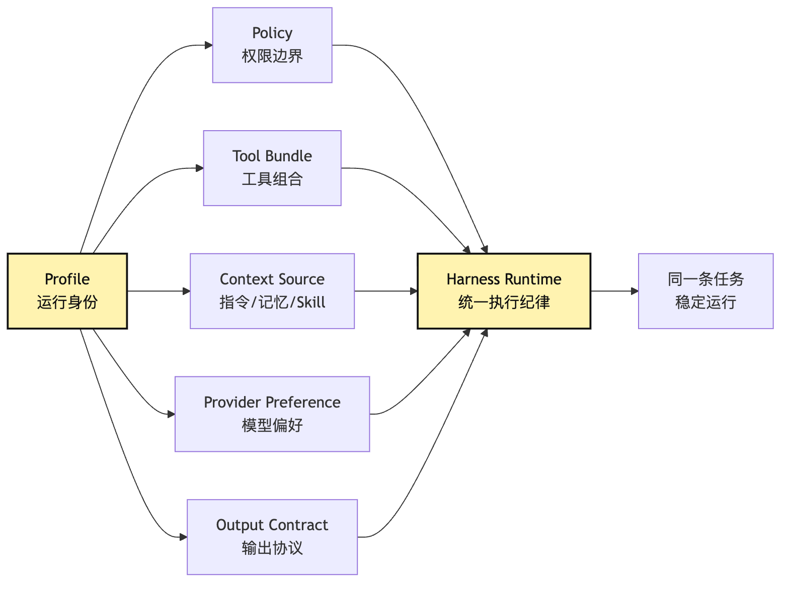
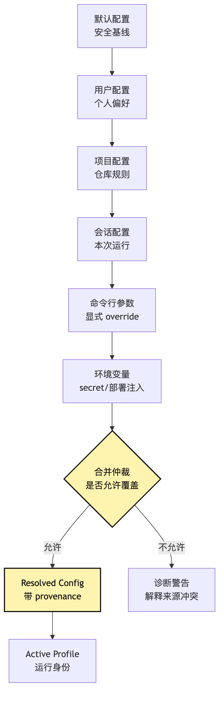
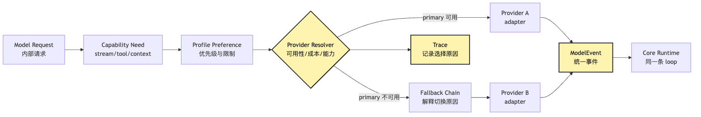
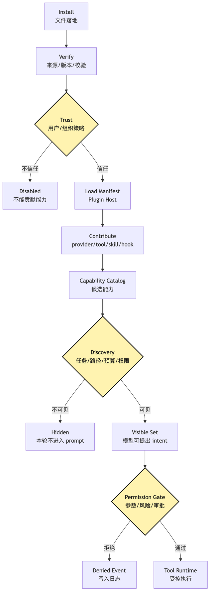
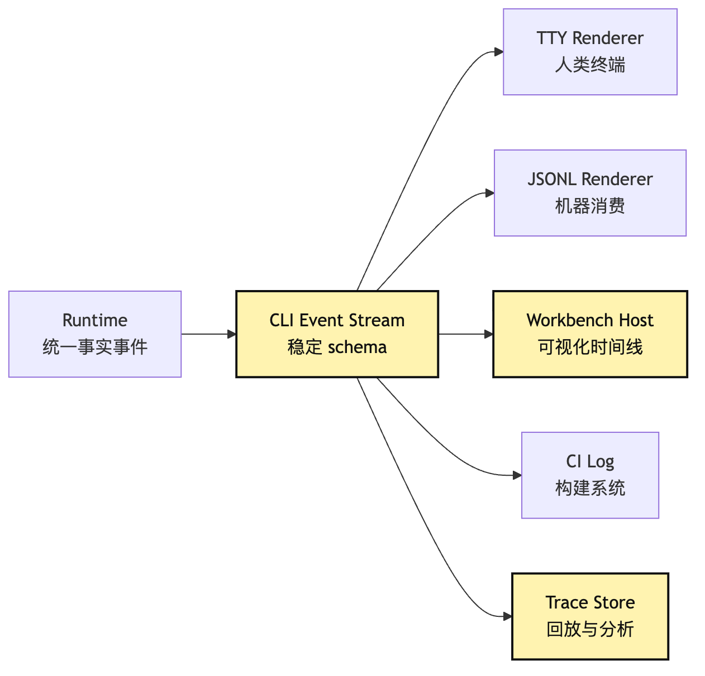
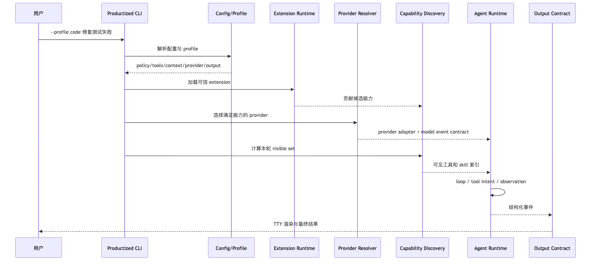

# Productized CLI：从 demo 入口到稳定运行身份

到这里，CLI 已经能完成任务。

现在问题变了：它怎么给别人稳定使用？

你在本机输入：

```text
帮我看看这个项目为什么测试失败，并把它修好。
```

Agent 可以跑测试、读文件、搜索错误、修改代码、再跑测试。这已经不像一次性 demo。

但一旦你想把它给别人用，问题会突然换一类。

别人不会只问：

```text
这个 Agent 能不能跑一次？
```

他们会问：

```text
我在不同项目里怎么用？
```

他们会问：

```text
公司项目和个人项目的权限能不能不一样？
```

他们会问：

```text
我默认用哪个模型？
```

他们会问：

```text
我能不能装一个团队 extension？
```

他们会问：

```text
为什么换了 provider 以后，工具行为、输出格式、错误提示都变了？
```

这就是第 22 篇要回答的问题。

> 一个 demo CLI 如何把“运行方式”变成可解释、可复用、可诊断的运行身份？

我们继续沿用整个系列的贯穿例子：

```text
用户在项目根目录输入：
帮我看看这个项目为什么测试失败，并把它修好。
```

在 demo 阶段，这句话只需要触发一个 loop。

在产品化阶段，同一句话背后要回答更多隐形问题。

当前使用的是哪个 profile？

这个 profile 允许修改文件吗？

这个项目有没有自己的指令？

项目有没有注册 test-fix skill？

用户有没有安装 GitHub MCP extension？

当前 provider 是否支持 tool calling？

备用 provider 是否能接同一种 tool intent？

输出是给人看的 TTY，还是给 IDE / Workbench / CI host 解析的事件流？

如果这些问题没有被系统显式回答，产品化 CLI 就会退回成一堆命令行参数和环境变量的偶然组合。

它可能今天能用。

但很难被别人稳定使用。

这里最重要的词是 `profile`。

在 Agent Harness 里，profile 应该表示一组可治理的运行意图：

```text
policy + tool bundle + context source + provider preference + output contract
```

也就是说，profile 回答的不是“界面长什么样”。

它回答的是：

```text
这个 CLI 现在以什么身份、什么权限、什么能力、什么上下文和什么模型偏好运行？
```

这正是 demo CLI 和产品化 CLI 的分界线。

## 从命令参数到运行身份

本章新增的产品入口链路是：

```text
demo CLI 只需要把一次用户输入送进 agent loop
-> 能力逐渐增多后，启动参数、环境变量、provider 配置、extension、项目指令开始散落
-> 散落配置会导致同一个命令在不同机器、不同项目、不同 provider 下行为不一致
-> 需要显式 Profile，把 policy、tool bundle、context source、provider preference 组合起来
-> Profile 不能绕过 Plugin Host、Provider Runtime、Capability Discovery 和 Tool Runtime
-> 配置层必须可合并、可解释、可审计，而不是谁后写谁覆盖
-> multi-provider 必须通过 provider resolver 和统一 model event contract 工作
-> extension 安装必须进入 manifest、trust、capability catalog 和 discovery policy
-> 产品化 CLI 还要有 doctor/status、稳定事件输出和 host/workbench 协议
-> 最终用户看到的是一个稳定 CLI，内部仍然是同一套 Harness 控制系统
```

这条链里最容易被低估的是“稳定”。

很多 demo 的失败不是因为模型不聪明。

而是因为环境不稳定。

同一条命令，在 A 项目里默认可写，在 B 项目里默认只读。

同一条命令，在主 provider 可用时能修测试，在 fallback provider 下 tool call 格式变了。

同一个 extension，昨天装了以后 tools 自动可见，今天因为路径变化不触发 skill。

同一个输出，在终端里看起来漂亮，但 IDE host 无法解析进度和工具事件。

这些都是产品化 CLI 要解决的问题。

不是模型问题。

是 Harness 入口层问题。

画成总图，大概是这样：



看这张图时，重点不是模块多，而是 CLI 不再直接启动 loop。

它先解析配置。

再确定 profile。

再解析 provider 偏好。

再加载 extension。

再计算能力可见集合。

最后才把任务交给 Agent Runtime。

也就是说：

```text
产品化 CLI 的入口，不是 model.call()。
产品化 CLI 的入口，是一场运行身份解析。
```

## 一、demo CLI 为什么越写越难给别人用

我们先从最朴素的 demo 开始。

最早的 CLI 可能只有这些参数：

```bash
agent "帮我看看这个项目为什么测试失败，并把它修好"
```

内部代码也很直观：

```ts
const provider = new OpenAIProvider({ apiKey: process.env.OPENAI_API_KEY });
const tools = createLocalTools(process.cwd());
const agent = new Agent({ provider, tools });

await agent.run(process.argv.slice(2).join(" "));
```

这段代码的问题不在第一天。

第一天它很清楚。

它的目标是证明：

```text
模型可以接上工具。
工具结果可以回到模型。
loop 可以继续推进。
```

但第二天，你会加一个 `--model`。

第三天，你会加一个 `--dangerously-auto-approve`。

第四天，你会加一个 `--project-rules`。

第五天，你会加一个 `--provider anthropic`。

第六天，你会加一个 `--load-skill code-review`。

第七天，你会加一个 `--json`。

第八天，你会加一个 `--mcp-config`。

第九天，你会加一个 `--profile code`。

然后 CLI 入口会开始变成这样：

```bash
agent \
  --provider openai \
  --model gpt-x \
  --fallback-provider anthropic \
  --allow-tool read,grep,bash,edit \
  --deny-command "rm -rf" \
  --project-rules .agent/rules.md \
  --skill test-fix \
  --mcp-config .agent/mcp.json \
  --json \
  "帮我看看这个项目为什么测试失败，并把它修好"
```

这当然也能跑。

但它不再是产品。

它是一份临时运行脚本。

用户需要知道太多内部细节。

用户需要知道 provider 名称。

用户需要知道哪些工具应该打开。

用户需要知道哪些 skill 该加载。

用户需要知道项目规则文件放在哪里。

用户需要知道输出给谁消费。

这会带来一个非常实际的问题：

```text
同一个任务，需要用户在 CLI 参数层重新设计一遍 runtime。
```

这和 Harness 的目标是冲突的。

Harness 本来就是要把运行边界工程化。

如果最终入口又把所有边界交回用户手里，那只是把复杂度换了一个位置。

所以产品化 CLI 的第一步，不是继续加参数。

而是把参数背后的运行意图收敛成 profile。

## 二、Profile：CLI 的运行身份

很多产品里的 profile 只是偏好配置。

比如主题颜色。

比如语言。

比如默认字号。

这些当然也可以叫 profile。

但在 Agent CLI 里，如果 profile 只表示这些东西，就太浪费了。

因为 Agent CLI 真正有风险、真正有差异、真正需要被稳定复用的，不是界面偏好。

而是运行身份。

例如同一个用户，可能需要三种 profile：

```text
chat：只读问答，不改文件，不执行命令。
code：允许读写当前工作区，执行低风险测试命令，高风险命令需要确认。
review：只读 diff 和文件，禁止写入，输出 findings first。
```

这三种 profile 使用的可能是同一个二进制。

甚至使用同一个 provider。

但它们不是同一个 Agent。

因为它们的运行身份不同。

`chat` profile 的任务是回答。

`code` profile 的任务是修复。

`review` profile 的任务是审查。

它们看到的工具集合不同。

它们加载的项目指令不同。

它们的权限策略不同。

它们的输出格式也可能不同。

因此 profile 至少应该包含五类内容：

```text
policy：允许什么、禁止什么、什么需要确认。
tool bundle：默认启用哪些本地工具、MCP 工具、extension 工具。
context source：加载哪些用户规则、项目规则、skill、记忆和检索源。
provider preference：优先使用哪些 provider、模型、能力要求和 fallback 策略。
output contract：面向 TTY、JSON、IDE host 还是 CI 的稳定输出协议。
```

如果把 profile 写成类型，大概是这样：

```ts
type AgentProfile = {
  id: string;
  description: string;
  policy: PolicyRef;
  toolBundles: ToolBundleRef[];
  contextSources: ContextSourceRef[];
  providerPreference: ProviderPreference;
  outputContract: OutputContractRef;
  extensionAllowlist: ExtensionRef[];
};
```

这段类型最重要的不是字段名。

而是它没有直接塞 provider SDK 对象。

也没有直接塞工具执行函数。

profile 描述的是“运行意图”。

真正加载 provider，要交给 Provider Runtime。

真正加载 tool，要交给 Plugin Host 和 Tool Runtime。

真正决定可见能力，要交给 Capability Discovery。

profile 不接管它们。

profile 只是把这几层的选择组合成一个可复用身份。

画成图，是这样：



这张图想表达的是：

```text
profile 不是一层新的 runtime。
profile 是对现有 runtime 的组合声明。
```

换句话说，profile 选择运行身份。

它不执行身份。

如果 profile 直接执行工具，它就变成 tool runtime。

如果 profile 直接调用模型，它就变成 provider runtime。

如果 profile 直接决定每轮工具可见性，它就吞掉 capability discovery。

这些都不是我们要的。

我们要的是：

```text
Profile 负责选择身份。
Runtime 负责执行身份。
Trace 负责证明身份如何生效。
```

回到“修复测试失败”的例子。

当用户运行：

```bash
harness --profile code "帮我看看这个项目为什么测试失败，并把它修好"
```

系统不应该把 `code` 当成一个字符串开关。

它应该解析出：

```text
当前允许读写工作区。
当前可以运行 test 相关命令。
当前 destructive shell 需要确认。
当前优先加载 test-fix skill 和 local-tool bundle。
当前 provider 优先选择支持 tool calling 和 streaming 的模型。
当前输出以 TTY event stream 展示，但内部保留结构化事件。
```

这就是 profile 的价值。

它让“我要一个代码 Agent”从用户口头习惯，变成 Harness 可执行、可审计、可复用的运行身份。

## 三、配置层：产品化 CLI 的第一层事实源

profile 解决的是组合。

但 profile 自己从哪里来？

这就进入配置层。

demo CLI 通常只读环境变量。

比如：

```text
OPENAI_API_KEY
ANTHROPIC_API_KEY
AGENT_MODEL
```

产品化 CLI 不能只靠环境变量。

因为环境变量太扁平。

它适合放 secret。

也适合做临时 override。

但它不适合表达复杂策略。

例如：

```text
当前项目默认使用 code profile。
这个项目禁止自动运行部署命令。
这个团队允许 GitHub MCP 只读访问。
当前 session 临时切换成 review profile。
CI 模式必须输出 JSONL，不允许交互审批。
```

这些不是一个个孤立变量。

它们有来源。

有优先级。

有合并规则。

有冲突解释。

一套产品化 CLI 至少应该区分这些配置层：

```text
内置默认层：系统自带的安全默认值。
用户层：用户全局偏好、provider 凭证引用、常用 profile。
项目层：仓库里的指令、允许的 extension、项目工具策略。
会话层：本次运行临时模式、输出目标、权限开关。
命令行层：用户显式传入的一次性 override。
环境层：secret 和部署环境注入。
```

关键不是层数越多越好。

关键是每个最终配置值都能回答：

```text
它来自哪里？
为什么是这个值？
谁覆盖了谁？
这个覆盖是否被允许？
```

所以配置合并不应该只是：

```ts
const config = {
  ...defaults,
  ...userConfig,
  ...projectConfig,
  ...envConfig,
  ...cliFlags,
};
```

这段代码看起来简洁。

但它没有解释能力。

当用户问：

```text
为什么这个项目不能自动 edit？
```

系统只能说：

```text
最后结果就是这样。
```

这不够。

产品化 CLI 需要配置 provenance。

也就是每个值的来源记录。

可以抽象成这样：

```ts
type ConfigValue<T> = {
  value: T;
  source: "default" | "user" | "project" | "session" | "flag" | "env";
  path: string;
  reason?: string;
};

type ResolvedConfig = {
  activeProfile: ConfigValue<string>;
  permissionMode: ConfigValue<PermissionMode>;
  providerPreference: ConfigValue<ProviderPreference>;
  enabledExtensions: ConfigValue<string[]>;
  outputMode: ConfigValue<OutputMode>;
};
```

这让 `harness doctor` 可以解释问题。

例如：

```text
activeProfile = code
  source: project
  path: .harness/config.yaml

permissionMode = ask
  source: user
  path: ~/.harness/config.yaml
  reason: project cannot escalate permission mode above user default
```

这里有一个很重要的治理点：

```text
不是所有高优先级层都能覆盖低优先级层。
```

比如项目配置不应该把用户的只读模式强行升成自动修改模式。

命令行参数也不一定应该绕过组织策略。

环境变量不应该因为名字碰巧存在，就启用高风险工具。

如果存在组织或托管侧 governance policy，它应该作为上限参与仲裁。

用户、项目、flag 可以收紧边界，也可以在允许范围内选择运行方式，但不能越过 governance policy 扩权。

所以配置层不仅要“合并”。

还要“仲裁”。

画成决策路径，是这样：



看这张图时，先看 `合并仲裁`。

它说明配置层不是简单优先级栈。

它是产品化 CLI 的第一层事实源。

如果配置层没有 provenance，后面的 profile、provider、extension 都很难诊断。

你不知道为什么加载了某个 extension。

你不知道为什么模型换成了备用 provider。

你不知道为什么某个工具本轮不可见。

最后用户会把所有行为归因给“模型不稳定”。

但真正不稳定的是入口配置。

## 四、Multi-provider：保持控制语义不变

第 12 篇已经讲过：

```text
provider 只能返回 model event 和 tool intent。
provider 不能执行工具。
provider 不能拥有 session state。
provider 不能决定 loop 是否继续。
```

到了产品化 CLI，这条纪律还要再往外扩一层。

不仅 runtime 内部不能被 provider 污染。

用户体验也不能被 provider 污染。

也就是说，用户不应该因为切换 provider，就被迫重新学习整个 CLI。

比如以下体验都很糟：

```text
provider A 下工具叫 read_file，provider B 下工具叫 file_read。
provider A 下输出 token event，provider B 下输出 raw chunk。
provider A 下 rate limit 提示能解释，provider B 下直接抛 SDK error。
provider A 支持 tool streaming，provider B 不支持，于是 CLI 进度展示消失。
provider A 下 review profile 可用，provider B 下 profile 配置字段失效。
```

这些都是 provider 细节穿透。

multi-provider 的目标不是“能接很多模型”。

真正目标是：

```text
在多个 provider 之间切换时，Harness 的控制语义不变。
```

这需要一个 Provider Resolver。

Provider Resolver 不是 adapter。

adapter 负责把某家 provider 的请求和响应翻译成内部 contract。

resolver 负责根据 profile、任务、能力需求、成本、可用性、fallback 策略，选择本轮调用哪个 provider。

可以把它想成：

```text
Profile 说：我需要一个适合 code task 的 provider。
Runtime 说：这一轮需要 streaming、tool calling、较大上下文。
Config 说：用户优先使用 provider A，rate limit 时 fallback 到 provider B。
Resolver 说：本轮选择 provider A；如果失败，按可解释规则切换。
```

类型上可以这样表达：

```ts
type ProviderPreference = {
  primary: ProviderSelector;
  fallbacks: ProviderSelector[];
  requiredCapabilities: ProviderCapability[];
  costCeiling?: CostPolicy;
  latencyPreference?: "low" | "balanced" | "quality";
};

type ProviderCapability =
  | "streaming"
  | "tool-intent"
  | "structured-output"
  | "large-context"
  | "vision";

type ProviderResolution = {
  selectedProvider: string;
  selectedModel: string;
  reason: string;
  missingCapabilities: ProviderCapability[];
  fallbackChain: string[];
};
```

这里有一个很关键的边界：

```text
ProviderCapability 是内部能力语义。
不是 provider SDK 的私有字段。
```

不要让 profile 写成：

```yaml
openai:
  response_format: json_schema
anthropic:
  tool_choice: auto
```

这会让 profile 直接依赖 provider 细节。

更好的方式是：

```yaml
profile: code
provider:
  require:
    - streaming
    - tool-intent
    - structured-output
  prefer:
    quality: high
    latency: balanced
```

具体 provider 怎么表达 structured output，由 provider adapter 处理。

CLI 层只表达运行需求。

这和第 12 篇的原则是一致的：

```text
provider 私有格式停在 provider runtime。
profile 和 CLI 只看内部 capability。
```

multi-provider 的另一个重点是 fallback。

fallback 不是简单 catch 后换模型。

如果主 provider 因为 rate limit 失败，切到备用 provider，看似合理。

但这会引出一串问题。

备用 provider 是否支持当前 tools schema？

备用 provider 是否支持相同的 streaming event？

备用 provider 是否能接受当前上下文长度？

备用 provider 的安全策略是否一致？

fallback 后 event log 怎么记录？

用户输出里是否要显示发生过切换？

如果这些问题没有统一答案，fallback 会制造新的不稳定。

画成流程，是这样：



看这张图时，先看两个 provider 最后都汇入 `ModelEvent`。

不是汇入 provider raw chunk。

不是汇入 SDK 私有对象。

也不是汇入一组 if/else 分支。

只要 provider 细节穿透到 Core，multi-provider 就会把系统撕裂。

只要 provider 细节穿透到 CLI 用户体验，multi-provider 就会把用户训练成配置工程师。

产品化 CLI 要做的是反过来：

```text
内部统一 contract。
外部统一体验。
中间用 provider adapter 和 resolver 承担差异。
```

## 五、Extension：从安装到可执行的四道门

第 11 篇讲 Plugin Host 时，我们把一个边界说清楚了：

```text
扩展不是放开 core。
扩展是让外部能力进入同一套 Harness 纪律。
```

到了产品化 CLI，这条边界会变得更具体。

因为用户会真的安装 extension。

比如：

```bash
harness extension install github
harness extension install playwright
harness extension install team-code-style
```

这看起来像普通插件系统。

但 Agent CLI 的 extension 比普通 CLI 插件更敏感。

因为 extension 可能会带来：

```text
新工具。
新 MCP server。
新 Skill。
新 Hook。
新 project instruction。
新 provider adapter。
新权限预设。
新输出渲染器。
```

其中任何一类能力都可能影响模型行为。

所以 extension 的生命周期不能只有 install / uninstall。

至少要拆成这些阶段：

```text
discover：发现可安装 extension。
install：下载安装到本地或项目范围。
verify：校验来源、版本、签名或 checksum。
trust：用户或组织策略决定是否信任。
load：Plugin Host 解析 manifest。
contribute：声明 provider/tool/hook/skill/context/output 能力。
catalog：进入 Capability Catalog。
visible：经过 Discovery Policy 后本轮可见。
execute：通过 Tool Runtime 和权限门后执行。
audit：事件进入 session log 和 trace。
```

这里最重要的三句话是：

```text
安装不是启用。
启用不是可见。
可见不是可执行。
```

安装只是文件存在。

启用表示系统允许它贡献能力。

可见表示本轮模型可以看见其中某些能力。

可执行表示某个具体 intent 通过了权限、参数、风险和用户审批。

如果把这些阶段混在一起，extension 会变成安全洞。

比如项目里带了一个 extension。

用户 clone 项目后，CLI 自动加载。

extension 声明一个 `deploy_production` 工具。

模型在修测试时看到了它。

工具参数又没有权限确认。

这时 extension 系统就不是扩展能力。

它是在给模型开旁路。

产品化 CLI 要避免这种事情。

extension manifest 应该只是声明。

不是执行。

例如：

```ts
type ExtensionManifest = {
  id: string;
  version: string;
  source: "builtin" | "user" | "project" | "organization";
  contributes: {
    providers?: ProviderContribution[];
    tools?: ToolContribution[];
    skills?: SkillContribution[];
    hooks?: HookContribution[];
    contextSources?: ContextSourceContribution[];
    outputRenderers?: OutputRendererContribution[];
  };
  trust: TrustRequirement;
  permissions: PermissionDeclaration[];
};
```

这份 manifest 进入 Plugin Host。

Plugin Host 负责校验形状。

Capability Catalog 负责记录候选能力。

Discovery Policy 负责决定本轮可见能力。

Tool Runtime 负责执行。

Audit 负责记录。

extension 自己不应该越过这些层。

画成生命周期，是这样：



这张图把第 11 篇和第 17 篇接起来。

Plugin Host 解决 extension 如何进入系统。

Capability Discovery 解决 extension 能力何时进入模型视野。

Tool Runtime 解决 extension 工具如何执行。

Profile 则决定哪类 extension 默认允许参与当前运行身份。

例如 `code` profile 可能允许：

```text
local-tools
test-runner
project-skills
github-readonly
```

但不允许：

```text
deploy-production
database-write
cloud-admin
```

`review` profile 可能允许 GitHub 只读。

但不允许 Edit。

`research` profile 可能允许 Web 和 citation tools。

但不允许修改工作区。

这就是 profile 和 extension 的关系：

```text
extension 提供候选能力。
profile 定义运行身份的默认边界。
discovery 决定本轮可见集合。
permission 决定具体调用能否落地。
```

四层缺一不可。

因此 `extensionAllowlist` 只是 trust / enable 的前置条件。

它不等于本轮 visible set，也不等于具体 tool intent 的 permission allow。

## 六、项目指令：不是把仓库规则全塞进 system prompt

产品化 CLI 还会遇到一个非常现实的需求：

```text
每个项目都有自己的规则。
```

比如：

```text
这个仓库使用 pnpm。
测试命令是 pnpm test。
不要修改 generated 文件。
React 组件必须用项目里的 design system。
API 错误格式必须是 { code, message }。
提交前必须跑 typecheck。
```

demo CLI 最容易做的事情，是启动时读一个项目规则文件，然后直接拼进 system prompt。

这在早期可以接受。

但产品化以后会出问题。

第一，项目规则可能很长。

全塞进 system prompt 会挤掉任务上下文。

第二，项目规则里有些只在特定路径相关。

前端组件规则不应该影响后端迁移文件。

第三，项目规则可能和 profile 冲突。

项目说“可以自动修复”，但用户当前是 `review` profile。

第四，项目规则可能不可信。

仓库文件本身可能包含提示注入。

所以项目指令应该被当成 context source。

而不是无条件 system prompt。

Context source 需要有来源、范围、可信度和激活条件。

例如：

```ts
type ContextSource = {
  id: string;
  source: "builtin" | "user" | "project" | "extension";
  trust: "trusted" | "workspace" | "untrusted";
  appliesTo?: PathPattern[];
  profileScope?: string[];
  loader: ContextLoader;
  projection: "summary" | "full" | "handle";
};
```

这里的 `projection` 很关键。

有些项目指令可以摘要后常驻。

有些应该只给一个 handle，让模型需要时再读取。

有些必须等路径命中后才进入上下文。

这和 Skill 的渐进式披露是同一个思想。

不要把所有经验常驻。

让它在正确时刻出现。

在“修复测试失败”的例子里，CLI 启动时可以先加载一个轻量项目指令摘要：

```text
项目使用 pnpm。
测试命令优先 pnpm test。
修改前先读取相关测试。
不要编辑 dist/ 和 generated/。
```

当 Agent 读到 `packages/frontend` 里的组件文件时，再激活前端规则。

当 Agent 读到数据库迁移时，再激活数据库规则。

当 Agent 准备编辑文件时，再把禁止路径策略交给 permission gate。

这比“把项目规则全文塞进 prompt”稳很多。

因为模型看到的是和当前任务相关的规则。

Harness 保存的是规则来源和适用范围。

权限系统执行的是规则里的硬边界。

项目指令因此不再是一段大 prompt。

它变成了 profile 和 context policy 共同管理的运行输入。

## 七、运行检查：`doctor` 是产品化 CLI 的自我诊断入口

当 CLI 进入产品化阶段，很多问题不能等到用户任务失败时才暴露。

比如：

```text
provider 凭证缺失。
默认 profile 不存在。
extension 安装了但未信任。
MCP server 配置路径错误。
项目规则文件解析失败。
权限模式和 profile 冲突。
当前 provider 不支持 tool-intent。
JSON 输出模式下存在交互审批。
```

这些问题如果在 Agent loop 里才爆出来，体验会很差。

用户会以为模型又犯傻。

但其实是启动环境不满足。

所以产品化 CLI 需要 `doctor` 或 `status`。

它们不是装饰命令。

它们是运行前检查。

`doctor` 应该检查的是 Harness 能否按当前 profile 正常运行。

比如：

```bash
harness doctor --profile code
```

输出不应该只是：

```text
OK
```

而应该按层报告：

```text
Config: OK
Profile: code resolved from project
Provider: primary available, fallback configured
Extensions: github-readonly trusted, playwright disabled
Capabilities: Read/Grep/Bash/Edit visible under ask mode
Context: project instructions loaded, frontend skill conditional
Output: tty interactive, json events disabled
Warnings:
  - CI MCP is configured but not reachable
```

这让用户在运行前就知道系统状态。

更重要的是，它让 host 也能知道系统状态。

因为第 22 篇不只是 CLI 自己运行。

它还要为 M7/M11 的 CLI Host + Workbench 铺路。

Workbench 不可能靠读取人类友好的终端文字理解 Agent 状态。

它需要稳定协议。

所以 `doctor` 最好同时支持结构化输出：

```bash
harness doctor --profile code --json
```

返回的不是一堆日志。

而是一份稳定 schema。

这份 schema 可以被 IDE、Workbench、CI、远程 host 消费。

例如：

```ts
type DoctorReport = {
  ok: boolean;
  profile: {
    id: string;
    source: string;
    warnings: Diagnostic[];
  };
  providers: ProviderDiagnostic[];
  extensions: ExtensionDiagnostic[];
  capabilities: CapabilityDiagnostic[];
  output: OutputDiagnostic;
};
```

这背后有一个产品化原则：

```text
人类界面可以漂亮。
机器界面必须稳定。
```

如果 CLI 只有 TTY 文本，Workbench 就只能靠字符串解析。

那会非常脆。

如果 CLI 有稳定事件协议，Workbench 才能把 Agent 运行过程变成可视化工作台。

## 八、Event Stream：事实输出和渲染分开

一个 demo CLI 的输出通常是这样的：

```text
Assistant: 我来检查测试。
Running: npm test
...
失败原因是...
```

这对人类足够。

但产品化 CLI 有多个消费者。

人类在终端里看。

IDE 在侧边栏里看。

Workbench 在任务时间线里看。

CI 在日志系统里看。

远程 host 在 web UI 里看。

如果 CLI 只输出自由文本，这些消费者就只能猜。

所以产品化 CLI 应该把输出分成两层：

```text
Event Stream：稳定结构化事件，作为事实输出。
Renderer：把事件渲染成 TTY、JSONL、Workbench UI、CI log。
```

这和 Session Replay 的思想一致。

事实源是事件。

界面只是投影。

一个最小事件协议可以包含：

```ts
type CliEvent =
  | { type: "session.started"; sessionId: string; profile: string }
  | { type: "provider.selected"; provider: string; model: string; reason: string }
  | { type: "assistant.delta"; text: string }
  | { type: "tool.intent"; tool: string; intentId: string }
  | { type: "tool.approval.requested"; intentId: string; risk: string }
  | { type: "tool.started"; intentId: string }
  | { type: "tool.finished"; intentId: string; exitCode?: number }
  | { type: "capability.visible_set.changed"; added: string[]; removed: string[] }
  | { type: "diagnostic.warning"; message: string }
  | { type: "session.finished"; outcome: "completed" | "failed" | "needs-user" };
```

这里不要急着设计得很全。

重点是先把事实和渲染分开。

终端 UI 可以把 `tool.started` 渲染成 spinner。

Workbench 可以把它渲染成时间线节点。

CI 可以把它渲染成分组日志。

JSONL 可以把它原样一行一条输出。

但事件本身保持稳定。

画成图，是这样：



看这张图时，先看 `Runtime` 为什么不直接输出漂亮文本。

Runtime 输出事实事件。

Renderer 负责美化。

这样做还有一个好处：

```text
multi-provider 不会影响输出协议。
extension 不会私自打印破坏 JSON。
profile 可以选择输出 contract。
host 可以稳定解析 Agent 状态。
```

如果 extension 需要输出进度，也应该提交结构化事件。

而不是直接 `console.log`。

否则它会破坏机器输出。

这就是产品化 CLI 和 demo CLI 的差别。

demo CLI 追求“看起来能跑”。

产品化 CLI 追求“谁消费都能理解”。

## 九、同一条任务在产品化 CLI 里怎么走

现在把所有层接回“修复测试失败”的贯穿例子。

用户输入：

```bash
harness --profile code "帮我看看这个项目为什么测试失败，并把它修好"
```

产品化 CLI 的第一步不是调用模型。

它先解析配置。

它发现项目配置里默认 profile 也是 `code`。

命令行显式指定 `code`，没有冲突。

用户全局策略要求高风险命令必须确认。

项目规则禁止修改 `generated/`。

extension 配置里启用了 `test-runner` 和 `github-readonly`。

provider preference 要求支持 streaming 和 tool-intent。

输出目标是交互式 TTY，同时内部保留 JSON event stream。

第二步，Provider Resolver 选择 provider。

它发现主 provider 可用。

主 provider 支持 tool-intent、streaming 和当前上下文长度。

它记录 `provider.selected` 事件。

第三步，Extension Runtime 加载已信任 extension。

`test-runner` 贡献一个 project-aware test command skill。

`github-readonly` 贡献只读 MCP 工具。

它们进入 Capability Catalog。

但还没有全部对模型可见。

第四步，Capability Discovery 计算本轮 visible set。

修复测试失败任务默认暴露：

```text
Read
Grep
Bash(test commands with approval)
Edit(with workspace policy)
SkillSearch
ToolSearch
```

GitHub MCP 先不进入 visible set。

因为当前还没有证据表明需要远端 PR 或 CI。

第五步，Agent Runtime 开始 loop。

模型提出运行测试的 tool intent。

Tool Runtime 校验命令。

Permission Gate 判断 `pnpm test` 属于低风险测试命令。

执行后 observation 写回。

第六步，模型根据失败日志搜索相关代码。

读取文件。

发现是前端组件测试失败。

路径命中前端 project instruction。

Capability Discovery 把 frontend component skill 加入可见集合。

第七步，模型提出编辑 intent。

权限检查确认目标不在 `generated/`。

编辑执行。

事件进入 session log。

第八步，模型再次运行测试。

测试通过。

Renderer 输出人类可读总结。

Event stream 输出 `session.finished`。

整个过程可以画成时序图：



这条链路先抓一个点：

```text
profile 解析发生在 loop 之前。
extension 贡献发生在 discovery 之前。
provider 选择发生在 model request 之前。
输出协议从 runtime 事件开始，而不是最后拼字符串。
```

一旦顺序反了，系统就会变脆。

比如先启动 loop，再临时发现 extension。

模型第一轮看不见正确能力。

比如先调用 provider，再发现它不支持 tool-intent。

系统就只能在半路失败。

比如先输出自由文本，再想给 Workbench 解析。

那就只能靠脆弱的日志解析。

产品化 CLI 的稳定性，来自这些前置解析。

## 十、最小落地：不要一次做成完整平台

讲到这里，很容易把 Productized CLI 想成一个巨大系统。

但我们仍然要保持这个系列的原则：

```text
每一篇只推进一个最小可验证增量。
```

第 22 篇的最小落地不需要做插件市场。

不需要做账号系统。

不需要做云端同步。

不需要做完整 Workbench。

它只需要把 demo CLI 升级成一个有稳定入口协议的本地产品。

最小文件边界可以是：

```text
src/cli/
  main.ts
  args.ts
  output.ts
  doctor.ts

src/config/
  defaults.ts
  loader.ts
  merge.ts
  provenance.ts

src/profile/
  profile.ts
  resolver.ts
  builtin-profiles.ts

src/provider/
  resolver.ts
  capabilities.ts

src/extensions/
  manifest.ts
  loader.ts
  trust.ts

src/events/
  cli-events.ts
  renderers/
    tty.ts
    jsonl.ts
```

第一步，做内置 profiles。

例如：

```ts
const builtinProfiles: AgentProfile[] = [
  {
    id: "chat",
    description: "只读问答，不执行外部动作",
    policy: "readonly",
    toolBundles: ["read-only"],
    contextSources: ["user", "project-summary"],
    providerPreference: {
      primary: { family: "general" },
      fallbacks: [],
      requiredCapabilities: ["streaming"],
    },
    outputContract: "tty-interactive",
    extensionAllowlist: [],
  },
  {
    id: "code",
    description: "修复代码、运行测试、受控修改工作区",
    policy: "workspace-edit-ask",
    toolBundles: ["local-code-tools"],
    contextSources: ["user", "project", "conditional-skills"],
    providerPreference: {
      primary: { family: "code" },
      fallbacks: [{ family: "general" }],
      requiredCapabilities: ["streaming", "tool-intent"],
    },
    outputContract: "tty-events",
    extensionAllowlist: ["test-runner", "github-readonly"],
  },
];
```

第二步，做配置解析和 provenance。

例如：

```ts
const resolved = resolveConfig({
  defaults: loadDefaultConfig(),
  user: await loadUserConfig(),
  project: await loadProjectConfig(cwd),
  session: sessionOverrides,
  flags: parsedFlags,
  env: process.env,
});

const profile = resolveProfile(resolved.activeProfile.value, {
  builtinProfiles,
  userProfiles: resolved.userProfiles.value,
  projectProfiles: resolved.projectProfiles.value,
});
```

第三步，做 provider resolver。

例如：

```ts
const providerResolution = await resolveProvider({
  preference: profile.providerPreference,
  availableProviders: providerRegistry.list(),
  required: profile.providerPreference.requiredCapabilities,
  diagnostics: true,
});
```

第四步，做 extension manifest loader。

先只支持本地目录。

先只支持读取 manifest。

先只支持 trust 状态。

不急着做远程安装。

例如：

```ts
const extensions = await loadEnabledExtensions({
  config: resolved.enabledExtensions.value,
  trustStore,
  cwd,
});

for (const extension of extensions) {
  pluginHost.register(extension.manifest.contributes);
}
```

第五步，做 CLI event stream。

所有关键步骤都发事件。

例如：

```ts
events.emit({
  type: "profile.resolved",
  profile: profile.id,
  source: resolved.activeProfile.source,
});

events.emit({
  type: "provider.selected",
  provider: providerResolution.selectedProvider,
  model: providerResolution.selectedModel,
  reason: providerResolution.reason,
});
```

第六步，做 `doctor`。

它复用同一套 resolver。

只是不启动 agent loop。

这点很重要。

`doctor` 不应该有另一套配置逻辑。

如果 doctor 和 run 使用两套解析器，就会出现最糟糕的情况：

```text
doctor 说没问题。
run 还是失败。
```

所以最小实现的承重链路应该是：

```text
args -> config resolver -> profile resolver -> extension loader -> provider resolver -> capability bootstrap -> event output -> agent runtime
```

而 doctor 只是在同一条链路上提前停止。

## 十一、产品化 CLI 的坏味道

这类系统最容易写坏的地方，不在模型调用。

而在入口层慢慢长出旁路。

### 坏味道一：profile 只是一个 model alias

如果 `code` profile 只是：

```yaml
model: some-code-model
```

那它没有表达权限。

没有表达工具集合。

没有表达上下文来源。

没有表达输出协议。

这不是 Agent profile。

这只是模型别名。

模型别名当然有用。

但不要把它叫 profile。

否则后续所有生产化能力都会往 model config 里塞。

最后 provider 配置会变成新的垃圾桶。

### 坏味道二：项目配置可以提升用户权限

项目配置应该能收紧边界。

但不应该静默放宽用户边界。

如果用户全局是只读模式，项目配置不能自动启用写入。

如果组织策略禁用某类 extension，项目不能重新打开。

否则用户 clone 一个仓库，就可能被仓库配置改变 Agent 行为。

这在 Agent CLI 里非常危险。

### 坏味道三：extension 安装后自动进入 prompt

安装只是文件存在。

启用才是允许贡献。

可见还要经过 discovery。

可执行还要经过 permission。

如果安装后直接把 extension 的所有工具塞给模型，Capability Discovery 就被绕过了。

这会重新制造第 17 篇说的工具过载问题。

### 坏味道四：provider fallback 偷偷改变输出语义

fallback 可以发生。

但必须被记录。

也必须保证输出事件语义不变。

如果 fallback 后 `tool.intent` 不再出现，或者 tool call 变成 provider raw chunk，host 就会失去解析能力。

fallback 不应该让用户体验变成另一套产品。

### 坏味道五：JSON 模式里混入漂亮日志

这是 CLI 产品里特别常见的问题。

开发时为了方便，在某个 extension 或 adapter 里写了：

```ts
console.log("starting provider...");
```

TTY 下没问题。

JSONL 下就灾难了。

机器消费者会读到非法行。

所以产品化 CLI 要有统一 event bus。

所有输出都从 renderer 走。

### 坏味道六：doctor 和 run 不共用解析链路

如果 `doctor` 只是手写一组检查，它很快会过期。

真正可靠的 doctor 应该调用同一套 config/profile/provider/extension resolver。

然后把结果渲染成诊断报告。

否则 doctor 只是安慰剂。

## 十二、这一篇应该怎么测试

第 22 篇对应的测试重点不是模型效果。

而是入口层的确定性。

第一类测试：profile 解析。

```text
给定默认/user/project/flag 多层配置。
当用户选择 code profile。
系统应解析出正确 policy、tool bundle、context source、provider preference 和 output contract。
```

第二类测试：配置 provenance。

```text
当项目配置试图把 permission 从 read-only 提升到 auto-edit。
系统应拒绝提升，并在 diagnostics 里说明来源。
```

第三类测试：provider resolver。

```text
当主 provider 缺少 tool-intent capability。
系统应选择满足要求的 fallback。
如果没有 fallback，应在 doctor 阶段报错，不进入 loop。
```

第四类测试：extension trust。

```text
安装但未信任的 extension 不应贡献能力。
已信任 extension 可以进入 catalog。
但其工具仍需经过 discovery 和 permission。
```

第五类测试：JSONL 输出纯净。

```text
在 --json 模式下，stdout 每一行都是合法 CliEvent JSON。
人类友好日志只能进入 stderr 或 TTY renderer，不能混入 JSONL。
```

第六类测试：doctor 和 run 一致。

```text
doctor 使用的 resolved profile、provider resolution、extension diagnostics。
必须与 run 启动前使用的结果一致。
```

第七类测试：同一任务跨 provider 语义稳定。

```text
fake provider A 和 fake provider B 返回不同 raw 格式。
Provider Runtime 应归一化成相同 ModelEvent 和 ToolIntent。
CLI 输出事件应保持同一 schema。
```

这些测试看起来不如“模型修好了测试”刺激。

但它们更接近产品化 CLI 的真实风险。

因为用户不是每天都遇到复杂推理失败。

用户每天都会遇到配置、provider、extension、输出协议和环境差异。

这些地方稳住，Agent 才像产品。

## 十三、本章代码落点

本章代码里可以先落这些对象：

```text
AgentProfile
ConfigResolver
ProfileResolver
ProviderResolver
ExtensionLoader
CliEventStream
DoctorCommand
```

新增测试可以先写这些：

```text
doctor 和 run 共用 resolver，不维护第二套配置逻辑。
项目配置不能提升用户权限。
provider fallback 不改变 tool intent 语义。
TTY 和 JSONL 来自同一事件流。
extension 安装、启用、可见、可执行四个状态不能混淆。
```

验收标准是：

```text
同一条命令能解释最终使用了哪个 profile、provider、工具集合和输出协议。
配置冲突能给 provenance，而不是谁后写谁覆盖。
host/workbench 可以消费稳定事件，而不是解析漂亮终端文本。
```

## 教学 Harness 落点

教学项目走向产品化时，先补 profile 和稳定输出，而不是先做复杂平台。profile 决定 provider、默认工具、权限模式、输出 renderer；CLI 或 API 输出要区分人类可读日志和机器可读 JSONL。这样同一套 Harness 能用于本地交互、CI smoke test 和文档教学。

---

GitHub 地址: [00-22-productized-cli-profile-extension.md](https://github.com/LienJack/build-harness/blob/main/docs/zh/00-22-productized-cli-profile-extension.md)
