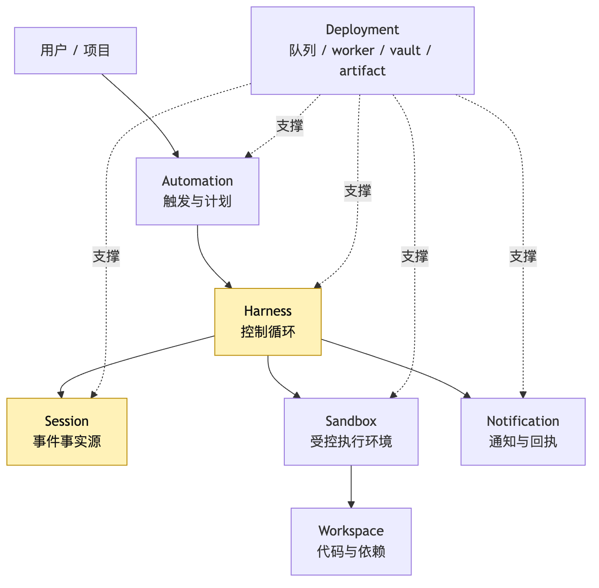
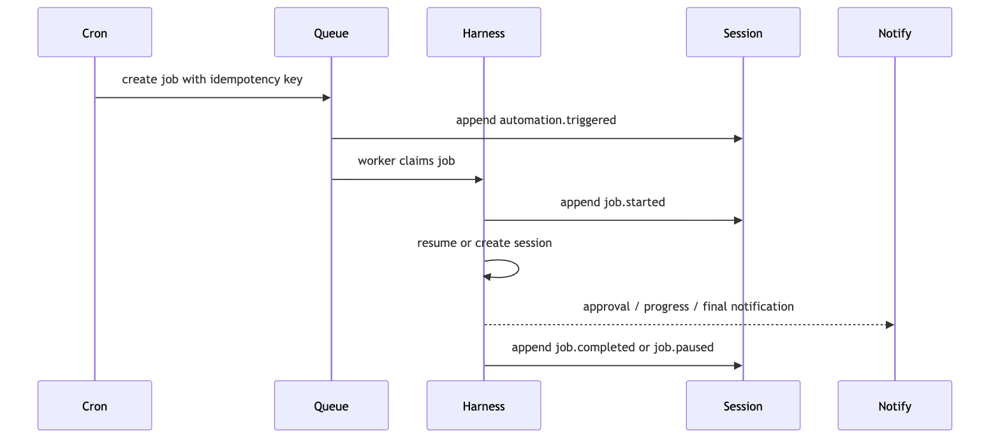
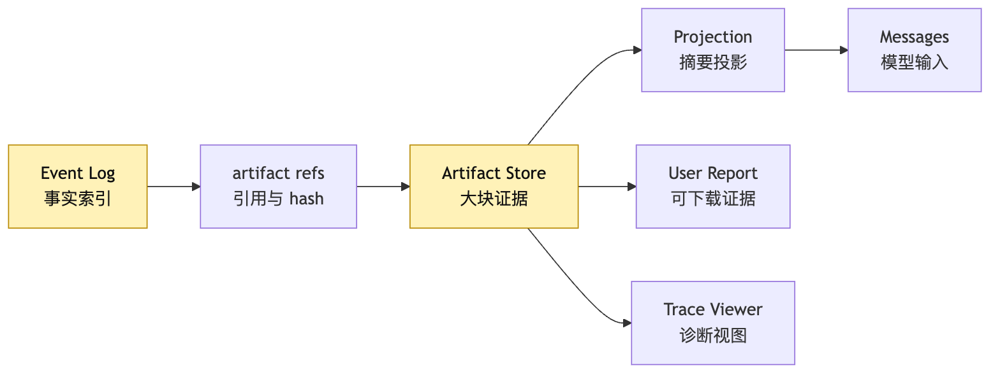
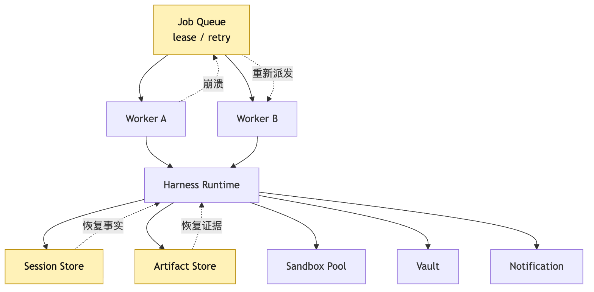
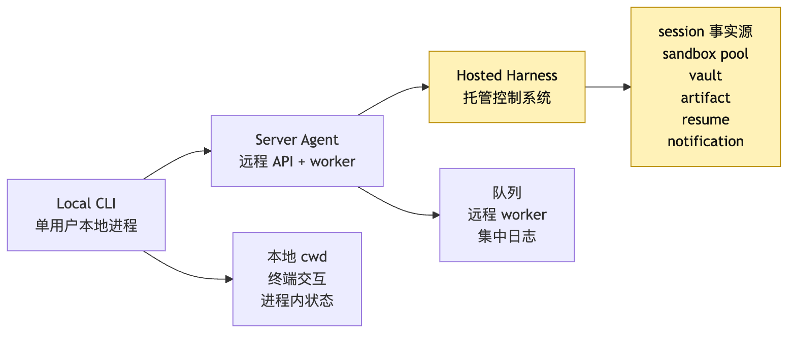

# Hosted Harness：Sandbox、Cron、Durable Execution 与远程部署

如果你已经跟着前面的章节写到这里，手里应该有一个越来越像样的 CLI Agent。

它能接 provider。

它能把模型输出拆成 tool intent。

它能通过 Tool Runtime 执行文件、搜索、终端工具。

它能把 observation 写回 session。

它能用 event log 做 replay。

它甚至能把局部任务委派给 sub-agent。

这时很容易产生一个诱惑：

既然本地 CLI 已经能跑了，那把它放到服务器上不就成 Hosted Harness 了吗？

比如开一个 worker。

把 CLI 命令包进 HTTP API。

再加一个 cron。

每天凌晨跑一次：

```text
node cli-agent.js --task "检查这个仓库的测试失败并修复"
```

看起来很直接。

也很危险。

因为本地 CLI 能证明的是机制。

它证明模型、loop、tools、state、permission、session 这些部件能在一台机器上协同工作。

但 Hosted Harness 要证明的是另一件事：

**当 Agent 不在你眼前运行、不依赖当前终端、不依赖当前工作目录、不依赖当前进程内存时，它还能不能可恢复、可审计、可治理地完成长任务。**

这篇文章就是“产品化与托管”阶段的收束。

我们不再给本地 Agent 加一个新工具。

也不再只是讨论某个 runtime 细节。

我们要把前面所有承重层合起来：

```text
Session / Harness / Sandbox
Automation / Cron
Durable Execution
Workspace Setup
Secret Boundary
Artifact Store
Resume / Retry
Notification
Deployment Topology
```

它们共同回答一个问题：

> Hosted Harness 为什么不是“把 CLI 放到服务器上”？

答案先压成一句：

**Hosted Harness 不是一个远程 Agent 进程，而是一套能跨时间、跨 worker、跨 sandbox 托管 Agent 任务生命周期的控制系统。**

这篇不是要一次实现完整平台。

它只画出托管边界：哪些事实必须在 worker 外部持久化，哪些动作必须经过 policy，哪些恢复点必须有证据。

## 一、为什么本地 CLI 只能证明机制，不能证明托管

还是沿用前面的例子。

用户在本地输入：

```text
这个仓库 CI 失败了，帮我定位原因并修一下。
```

本地 CLI Agent 的执行链大概是：

```text
读取项目规则
-> 跑测试
-> 观察失败日志
-> 搜索相关代码
-> 修改文件
-> 再跑测试
-> 总结结果
```

这条链路在本地跑通，已经很有价值。

它让我们确认很多抽象不是纸上谈兵。

比如 provider contract 是否干净。

tool intent 是否能被 validate。

permission gate 是否拦住高风险命令。

event log 是否记录事实。

context policy 是否能把长日志压成下一轮模型能看的 observation。

但是本地 CLI 有一个隐藏前提：

用户通常坐在终端前。

当前进程还活着。

当前工作目录还在。

当前环境变量还在。

当前 shell 的网络、文件系统、依赖缓存都还在。

即使任务失败，用户也能看到终端输出，大概知道发生了什么。

一旦这个任务变成远程托管任务，前提全部变掉。

比如用户设置了一个 automation：

```text
每天早上 8 点检查 main 分支的测试。
如果失败，尝试修复并发出报告。
```

这时 Agent 不是在用户的终端里立即运行。

它可能在未来某个时间被 scheduler 唤醒。

它可能被放进一个远程 worker。

它可能需要从 GitHub 拉最新代码。

它可能需要创建临时 workspace。

它可能需要拿到某些只在服务端 vault 里的 secret。

它可能运行 40 分钟。

它可能中途 worker 被抢占。

它可能跑到一半等待用户批准。

它可能生成 patch、测试日志、trace、报告。

它可能需要在任务结束后通过 thread、邮件、Slack 或 PR comment 通知用户。

这就不是“CLI 在服务器上跑了一次”。

这是一套托管执行系统。

它需要回答的问题比本地 CLI 多很多：

```text
任务什么时候被触发？
触发是不是幂等？
这次任务属于哪个 user / project / profile？
workspace 如何准备？
sandbox 如何选择？
secret 如何注入，又如何避免泄漏？
event log 存在哪里？
artifact 存在哪里？
worker 崩溃后从哪里继续？
重复执行会不会重复副作用？
用户不在线时如何请求批准？
执行结束如何通知？
失败以后如何归因？
```

如果这些问题没有明确答案，本地 CLI 放到服务器上只会变成一个更难调试的 CLI。

它会在成功时看起来很自动化。

在失败时留下一堆无法重放的日志碎片。

所以 Hosted Harness 的第一条原则是：

**不要把“执行地点变成远程”误认为“系统已经托管化”。**

托管化的核心不是远程。

而是任务生命周期被显式建模。

## 二、Hosted Harness 的五层边界

前面第 4 篇已经把三个对象拆开：

```text
Session：事实源
Harness：控制循环
Sandbox：执行手
```

到了 Hosted Harness，这个三分法还要再向外扩两层：

```text
Automation：何时、因为什么触发任务
Deployment：这些组件部署在哪里、如何扩缩容、如何隔离租户
```

也就是说，Hosted Harness 至少有五层边界：

```text
Automation
Harness
Session
Sandbox
Deployment
```

它们不是同一个东西。

也不应该被揉成一个“远程 agent service”。



这张图里最重要的不是节点多。

而是箭头的方向。

Automation 不直接操作仓库。

它只产生一次可记录的触发。

Harness 不把事实藏在 worker 内存里。

它把事件写入 Session。

Sandbox 不拥有任务事实。

它只是执行动作的环境。

Deployment 也不是业务逻辑本身。

它是让队列、worker、vault、artifact store、sandbox pool 能持续运转的基础设施层。

如果把这些层揉在一起，常见写法会像这样：

```ts
cron.schedule("0 8 * * *", async () => {
  const repo = await git.clone(project.repoUrl);
  process.env.GITHUB_TOKEN = project.githubToken;

  const result = await runCliAgent({
    cwd: repo.path,
    prompt: "检查测试并修复",
  });

  await sendEmail(project.ownerEmail, result.summary);
});
```

这段代码不是完全不能跑。

它甚至可能在 demo 里很顺。

但它把所有关键问题都埋掉了。

cron 触发没有事件。

repo workspace 没有版本身份。

secret 直接进了进程环境。

agent 运行过程没有 durable checkpoint。

tool 副作用没有独立记录。

artifact 只是临时文件。

worker 崩溃以后不知道做到哪一步。

邮件发出以后也不知道是不是基于已验证结果。

Hosted Harness 要避免的就是这种“把所有层写成一个异步函数”的冲动。

更稳的分层应该像这样：

```text
Automation 创建 JobIntent
-> Queue 持久化 Job
-> Worker 领取 Job
-> Harness 创建或恢复 Session
-> Workspace Setup 准备代码环境
-> Sandbox Pool 分配执行环境
-> Durable Loop 推进每一步
-> Artifact Store 保存证据
-> Notification 发出结果或请求用户输入
```

每一步都应该有事件。

每一步都应该能恢复。

每一步都应该能被审计。

## 三、Cron 不是定时执行命令，而是创建可恢复任务

很多系统第一次加 automation，会把 cron 当成一个“定时 Bash”。

这在普通脚本里可以接受。

但对 Agent 来说，cron 不能只代表一条命令。

它应该代表一次任务意图。

因为 Agent 任务可能很长。

可能会暂停。

可能需要 approval。

可能会重试。

可能会在下一次 cron 到来时仍未完成。

所以 Hosted Harness 里的 cron 至少要处理四个问题：

```text
schedule：什么时候触发
identity：代表谁触发
idempotency：同一窗口是否已经触发过
handoff：触发后谁继续负责
```

比如“每天早上 8 点检查测试”不能直接变成：

```text
run npm test
```

它应该先变成一个结构化对象：

```ts
type AutomationTrigger = {
  automationId: string;
  scheduleWindow: {
    start: string;
    end: string;
  };
  userId: string;
  projectId: string;
  profileId: string;
  goal: string;
  idempotencyKey: string;
  notificationPolicy: {
    onSuccess: "summary";
    onFailure: "summary-and-artifacts";
    onApprovalRequired: "immediate";
  };
};
```

这个对象的价值不是类型好看。

它让系统能回答：

```text
这次任务是哪个 automation 触发的？
是不是同一个时间窗口重复触发？
使用哪个用户授权？
使用哪个项目配置？
结果应该发到哪里？
如果需要人工审批，是否要立即通知？
```

cron 触发以后，第一件事不是启动模型。

而是写事件：

```text
automation.triggered
job.created
job.enqueued
```

然后才进入 worker。



这张图里，cron 没有直接调用模型。

它也没有直接跑命令。

它只是把“未来某个时间应该继续做一件事”转成可恢复 job。

这就是 Hosted Harness 里的 automation 和普通 cron 脚本的区别。

普通 cron 假设任务短、确定、同步。

Agent automation 必须假设任务长、不确定、会暂停。

所以 cron 的输出不应该是 stdout。

而应该是一个可追踪的 job lifecycle。

如果这层没做好，最常见的问题是重复执行。

比如某天早上 8 点 scheduler 触发了任务。

worker 刚开始 clone repo，进程被重启。

scheduler 重试，又创建了一个新 job。

两个 job 同时修同一个分支。

一个把测试修好。

另一个基于旧 workspace 又提交了冲突 patch。

最后用户收到两份互相矛盾的通知。

这不是模型推理失败。

这是 automation 没有 idempotency。

Hosted Harness 要把这种失败挡在模型之外。

## 四、远程 Sandbox：既是笼子，也是许可证

本地 CLI 最容易偷懒的地方是执行环境。

它直接站在用户的工作目录上。

读文件、写文件、跑测试，都在同一个主机里发生。

Hosted Harness 不能这么做。

因为远程托管环境面对的不是一个用户的一次命令。

它面对的是多用户、多项目、多任务、多 worker 的组合。

每个任务都可能运行模型生成的代码。

每个任务都可能接触私有仓库。

每个任务都可能安装依赖、执行测试、访问网络。

所以 sandbox 不只是安全装置。

它还有一个更积极的作用：

**把 Agent 可以自由行动的区域定义出来。**

没有 sandbox，系统只能对每个动作都问用户：

```text
能不能写这个文件？
能不能安装这个依赖？
能不能跑这个测试？
能不能访问这个域名？
能不能生成 patch？
```

审批一多，用户会疲劳。

用户疲劳以后，要么放弃 Agent。

要么条件反射地全部批准。

两者都让系统失去价值。

有 sandbox 以后，权限可以从“每个操作都问一次”变成“给本次任务配置一个有边界的工作区”。

这也是为什么 sandbox 同时是笼子和许可证。

它限制 Agent 不能越界。

也允许 Agent 在边界内持续推进。

在我们的托管修测试任务里，sandbox 至少要回答：

```text
文件系统：只能看到哪个 repo / worktree？
网络：能访问 package registry、GitHub API、内部服务吗？
进程：测试命令最多跑多久？
资源：CPU、内存、磁盘、并发上限是多少？
快照：失败后能不能保留现场？
重置：下一次任务是否从干净环境开始？
持久化：哪些内容能跨步骤保留？
```

不同 sandbox 后端有不同取舍。

本地权限沙箱启动快，适合缩小主机视图。

容器容易打包依赖，适合项目级隔离。

microVM 隔离更强，成本和冷启动更高。

浏览器或桌面 sandbox 适合 computer-use 类任务。

Hosted Harness 不应该把这些选择写死在 Agent loop 里。

它应该抽象成 execution backend。

```ts
type SandboxSpec = {
  image: string;
  workspaceRef: string;
  filesystemPolicy: "repo-only" | "worktree" | "ephemeral";
  networkPolicy: {
    allowDomains: string[];
    denyAllOther: boolean;
  };
  resourceLimits: {
    cpu: number;
    memoryMb: number;
    timeoutSeconds: number;
  };
  persistence: {
    keepArtifacts: boolean;
    keepWorkspaceSnapshot: boolean;
  };
};
```

注意这里没有出现 prompt。

也没有出现“模型觉得可以”。

sandbox spec 是 Harness 的执行合约。

模型可以提出要跑测试。

但它不能决定自己是否能访问用户 home 目录。

它也不能决定自己是否能把 secret 打印到 stdout。

这些边界必须由 Hosted Harness 的执行层持有。


这张图里最关键的边界是 `Policy -> Sandbox Spec`。

很多人以为 sandbox 是 tool execution 的内部实现。

但在 Hosted Harness 里，sandbox 是 policy 的物理化。

策略说“只能在 repo 工作区内运行测试”。

sandbox 就要把这个策略变成文件系统、网络、资源和进程限制。

否则策略只是纸面承诺。

## 五、Workspace Setup：远程任务不是凭空拥有项目现场

本地 CLI 有一个天然现场：

当前目录就是项目。

远程 worker 没有这个现场。

它每次开始任务时，必须先回答：

```text
从哪里拿代码？
拿哪个 commit？
用哪个分支？
是否创建临时 worktree？
依赖怎么安装？
项目规则在哪里？
缓存能不能复用？
失败现场如何保存？
```

这就是 workspace setup。

它不是简单的 `git clone`。

它是 Hosted Harness 把“用户的项目”投影成“本次任务可操作工作区”的过程。

对修测试任务来说，一个 setup plan 可能是：

```text
读取 project config
-> 拉取 repo
-> checkout main@sha
-> 创建 task branch
-> 安装依赖
-> 读取 AGENTS.md / project rules
-> 建立 artifact 目录
-> 写 workspace.ready 事件
```

这里最重要的是 `main@sha`。

远程长任务一定要知道自己基于哪个代码事实开始。

如果只说“main 分支”，那任务跑到一半 main 更新了怎么办？

如果 Agent 生成 patch 时没有 base commit，后续 review 和 replay 都会含糊。

所以 workspace setup 应该写入事件：

```json
{
  "type": "workspace.ready",
  "workspaceId": "ws_123",
  "repo": "example/app",
  "baseRef": "main",
  "baseSha": "abc123",
  "taskBranch": "agent/fix-tests-2026-05-28",
  "sandboxId": "sbx_456",
  "rules": ["AGENTS.md", ".harness/project.md"],
  "artifactRoot": "artifact://session/s23/"
}
```

这样后面每个工具事件都能挂到同一个 workspace identity 上。

测试日志属于哪个 commit？

patch 基于哪个 base？

依赖安装发生在哪个 sandbox？

artifact 是否还在？

这些问题都能从事件里回答。

Workspace setup 还有一个容易被低估的点：

它是 context policy 的输入。

模型下一轮看到的不是“某个 worker 的磁盘里有什么”。

而是 Harness 根据 workspace 事实投影出来的上下文：

```text
当前仓库
当前 base commit
当前 task branch
项目规则摘要
已安装依赖状态
最近测试结果
可用工具边界
```

如果 setup 没有结构化，context 就只能从 shell 输出里猜。

这会让远程任务非常脆。

## 六、Secret Boundary：密钥不属于 sandbox，也不属于模型上下文

远程托管任务不可避免会碰到 secret。

比如拉私有仓库需要 token。

安装私有包需要 registry credential。

调用云服务需要 API key。

给用户发通知需要 webhook。

但是 Hosted Harness 里最危险的错误之一，就是把 secret 当成普通环境变量塞进 sandbox：

```ts
env: {
  GITHUB_TOKEN: user.githubToken,
  NPM_TOKEN: project.npmToken,
  SLACK_WEBHOOK_URL: user.webhookUrl,
}
```

这看起来最简单。

也最容易泄漏。

因为 Agent 可能运行：

```bash
env
```

测试脚本可能打印环境。

依赖安装日志可能包含 token。

模型可能把 stdout 摘要进 observation。

observation 又可能进入 messages。

最后 secret 可能出现在 trace、artifact、通知、甚至 PR comment 里。

所以 Hosted Harness 要把 secret boundary 做成硬边界。

基本原则是：

```text
secret 存在 vault。
模型看不到 secret 原文。
sandbox 默认拿不到 secret 原文。
工具通过 capability 使用 secret。
日志和 artifact 做脱敏。
需要注入时有最小作用域和最短生命周期。
```

比如 GitHub 操作不一定要把 token 给 shell。

可以提供一个受控工具：

```text
create_pull_request
post_pr_comment
fetch_ci_status
```

这些工具在 Harness 侧使用 vault credential。

模型只提出 intent。

Tool Runtime 校验 intent。

工具执行时短暂取 secret。

结果返回结构化 observation。

secret 不进入 sandbox stdout。

secret 不进入 messages。

secret 不进入用户可见报告。

当然，有些任务确实需要在 sandbox 内安装私有包。

这时也应该使用临时凭证。

并限制域名、命令、有效期和输出脱敏。


这张图里最重要的是两条虚线：

Vault 不进入模型。

Vault 不直接暴露给 sandbox。

如果这两条线守不住，Hosted Harness 的其他治理都会变弱。

因为远程托管意味着系统代表用户行动。

代表用户行动就必须有身份和凭据。

而身份和凭据一旦泄漏，Agent 的问题就不只是“改错代码”。

它可能变成跨系统的权限事故。

## 七、Durable Execution：长任务不能押注 worker 一直活着

本地 CLI 的最小 loop 可以写成：

```ts
while (!done) {
  const response = await model.call(messages);
  const intent = parseIntent(response);
  const result = await toolRuntime.execute(intent);
  messages.push(toObservation(result));
}
```

第 16 篇已经讲过，这种写法不能支撑长任务恢复。

到了 Hosted Harness，它的问题会更明显。

因为 worker 不是可靠事实源。

worker 会崩。

会被抢占。

会滚动发布。

会因为超时被杀。

会因为任务等待人工批准而释放。

所以 durable execution 的核心不是“多 try/catch 几次”。

而是把每一步变成可确认、可恢复、可重试或可跳过的状态转换。

这里的 `durable execution` 指的是恢复语义，不绑定某个具体 workflow 框架。

你可以用队列、数据库、workflow engine 或很朴素的状态机实现；关键是不要重新执行未知副作用，只从有证据的边界继续。

这和第 16 篇的 Session Replay 是同一条纪律在远程环境里的升级：

```text
Replay 是本地长任务恢复的事实机制。
Durable execution 是远程 worker / queue / sandbox 环境下的恢复机制。
二者共享同一条纪律：不重新执行未知副作用，只从有证据的边界继续。
```

Agent loop 的特殊之处在于：

模型调用和工具执行都不是普通函数。

模型调用可能返回不同结果。

工具执行可能有副作用。

context projection 会改变模型看到的世界。

permission gate 可能暂停任务。

所以 Hosted Harness 的 durable loop 至少要像这样：

```text
load session
-> acquire job lease
-> prepare workspace checkpoint
-> build context projection
-> persist model.requested
-> call model
-> persist model.responded
-> parse and validate intent
-> persist intent.validated
-> review policy
-> persist policy.decided
-> maybe pause for approval
-> execute in sandbox
-> persist tool.started
-> persist tool.finished
-> save artifacts
-> project observation
-> persist observation.appended
-> decide lifecycle state
-> release or renew job lease
```

这条链路看起来繁琐。

但它的每一步都在回答一个恢复问题：

```text
如果现在 worker 死了，下一次从哪里继续？
```


这张图里最重要的是 `WaitingApproval` 和 `Paused`。

本地 CLI 常常把它们当成阻塞。

远程 Hosted Harness 必须把它们当成正常生命周期。

用户不在线，不代表任务失败。

worker 需要释放，不代表任务失败。

预算耗尽，不代表任务失败。

这些都只是 session 的一个 durable state。

下一次 resume 时，Harness 读取 event log。

重建 state。

检查 artifact。

重新准备 workspace 或恢复 snapshot。

再决定下一步。

### Retry 不是重新跑一遍

Durable execution 里最容易犯的错，是把 retry 理解成“从头再来”。

对 Agent 来说，这通常是错的。

如果模型请求已经发出，但响应还没持久化，重试模型调用可能得到不同 intent。

如果工具已经执行，但 `tool.finished` 没写成功，重试工具可能重复副作用。

如果通知已经发出，但 notification event 没写成功，重试可能重复打扰用户。

所以 retry 要按步骤分类：

```text
pure read：可以重试
model call：可重试但要记录 request identity
tool write：必须检查副作用证据
external notification：必须有 dedupe key
approval request：必须幂等
workspace setup：可以重建，但要保留 base identity
```

一个简单的 durable step 可以这样表达：

```ts
type DurableStep = {
  id: string;
  kind:
    | "model_call"
    | "tool_execution"
    | "workspace_setup"
    | "approval_request"
    | "notification";
  idempotencyKey: string;
  retryPolicy: "safe" | "check-before-retry" | "never-auto-retry";
  beforeEvent: string;
  afterEvent: string;
  artifactRefs?: string[];
};
```

重点不是类型名字。

重点是 Harness 不再把长任务看成一个连续函数调用。

它把长任务看成一串可恢复步骤。

每个步骤都有身份。

每个步骤都有证据。

每个步骤都有重试语义。

这就是 durable execution 和普通后台任务队列的差别。

普通队列通常只关心 job 成功或失败。

Hosted Harness 必须关心 job 内部每一轮 Agent loop 的因果边界。

## 八、Artifact Store：远程任务的证据不能只留在日志里

本地 CLI 的输出通常在终端里。

远程任务不能这么奢侈。

用户不一定在线。

worker 结束后本地磁盘可能被清理。

sandbox 可能销毁。

日志系统可能只保存滚动文本。

而 Agent 任务的关键证据很多都很大：

```text
测试 stdout / stderr
完整 patch
模型输入快照
模型输出原文
workspace diff
依赖安装日志
截图
trace
评估报告
最终 summary
```

这些东西不能全部塞进 event log。

也不能全部塞进 messages。

它们应该进入 artifact store。

event log 记录引用和 hash。

artifact store 保存证据材料。

observation 只给模型看必要摘要。



这张图延续第 16 篇的原则：

messages 不是事实源。

event log 才是事实源。

artifact 是事实证据。

projection 是给不同消费者看的视图。

Hosted Harness 里 artifact store 还有一个额外价值：

它让 notification 更诚实。

比如远程 automation 修测试失败了。

通知里不应该只写：

```text
修复失败。
```

它应该能附上：

```text
失败测试摘要
关键日志片段
完整日志 artifact
生成 patch artifact
最后稳定 checkpoint
需要用户批准的下一步
```

这能让用户不打开 worker 机器，也能理解任务状态。

它也能让下一次 resume 不靠“邮件里的文字摘要”继续。

## 九、Notification：通知不是 final answer，而是生命周期事件

本地 CLI 的结束方式很简单。

Agent 最后说一句：

```text
我已经修好了，测试通过。
```

远程 Hosted Harness 的结束方式更复杂。

因为用户不一定盯着屏幕。

任务可能成功。

可能失败。

可能暂停。

可能等待批准。

可能需要用户选择下一步。

可能生成 PR。

可能只是每天的健康检查报告。

所以 notification 不应该只是“把 final answer 发出去”。

它应该是 lifecycle 的一个消费者。

也就是说，通知系统读取 session event。

根据 notification policy 决定发什么。

再把发出的通知也写回 event log。

```text
task.completed -> send summary
task.failed -> send failure report with artifacts
approval.requested -> send immediate approval link
job.paused -> send resume reason if policy requires
verification.failed -> send diagnostics
```

为什么通知也要写事件？

因为通知本身是副作用。

它可能重复发送。

可能发送失败。

可能被用户点击。

可能成为后续 resume 的入口。

如果它不进入 event log，系统就无法回答：

```text
用户有没有被告知？
告知的是哪个版本的事实？
用户批准的是哪一个 action？
这次批准是否还适用于当前 workspace？
```

远程任务里，通知经常和 HITL 绑在一起。

比如 Agent 想运行一个高风险命令：

```text
rm -rf node_modules && npm install
```

本地 CLI 可以直接在终端问：

```text
是否允许？
```

Hosted Harness 不能假设终端存在。

它要生成 approval request：

```json
{
  "type": "approval.requested",
  "sessionId": "s23",
  "actionId": "act_019",
  "risk": "medium",
  "reason": "需要清理依赖后重新安装以复现 CI",
  "expiresAt": "2026-05-28T10:00:00Z",
  "notificationRef": "notification://thread/abc"
}
```

用户批准以后，系统不能直接继续执行旧 action。

它还要检查：

```text
approval 是否过期？
workspace 是否仍是同一个 base？
action 是否仍然适用？
权限策略是否变化？
session 是否已被其他 worker 推进？
```

这就是 hosted HITL 比本地 prompt 更复杂的地方。

用户点击的不是一个按钮。

用户授权的是一个带上下文身份的 action。

## 十、Remote Worker：worker 是可替换执行者，不是任务事实源

现在把这些层串起来看。

Hosted Harness 里通常会有 job queue 和 worker。

但 worker 的地位很容易被误解。

很多人会把 worker 当成“Agent 正在运行的地方”。

这句话只对了一半。

worker 是当前尝试推进 session 的执行者。

但它不是 session 本身。

它也不是事实源。

它更像一个租来的手。

领取 job。

准备 workspace。

拿到 sandbox。

推进几步。

续租 lease。

如果不能继续，就释放。

真正重要的事实都写到外部：

```text
Session Store
Artifact Store
Workspace Snapshot
Queue Lease
Notification Log
Trace Store
```



这张图里，Worker A 崩溃不是灾难。

灾难是 Worker A 崩溃时，事实只在它内存里。

只要 session 和 artifact 在外部，Worker B 就能接手。

接手不是简单重跑。

而是 replay event log。

检查 artifact。

恢复 workspace。

找到最后稳定点。

再通过 resume gate 继续。

这也是 Hosted Harness 和“后台跑一个 agent 进程”的分水岭。

后台进程强调进程存活。

Hosted Harness 强调事实可恢复。

进程可以死。

session 不能丢。

artifact 不能丢。

permission decision 不能丢。

notification dedupe 不能丢。

## 十一、Deployment Topology：Local CLI、Server、Hosted Harness 的区别

到这里，我们可以把部署形态放到一张图里。

同样是 Agent，不同 topology 承担的责任完全不同。



Local CLI 的优势是反馈快。

它适合学习机制、调试工具、验证最小 loop。

它也适合用户主动发起、短时间盯着看的任务。

Server Agent 往前走了一步。

它把执行搬到远程。

它可能有 API、队列、worker、集中日志。

但如果它仍然把 session 放在 worker 内存里，把 sandbox 当成临时目录，把通知当成最后一条消息，那么它还不是 Hosted Harness。

Hosted Harness 的标志是：

```text
任务触发可记录
session 可恢复
sandbox 可替换
workspace 可重建
secret 有边界
artifact 可追溯
worker 可失败
approval 可跨时间
notification 可去重
trace 可归因
deployment 可治理
```

这不是功能清单。

这是托管长任务的最低纪律。

### 不要急着一步到位

看到这些层，很容易觉得 Hosted Harness 必须一开始就很重。

不是。

最小可行的 Hosted Harness 可以非常窄。

比如只支持一个 GitHub repo。

只支持一个 cron。

只支持一个 Docker sandbox。

只支持一种通知方式。

只支持修测试这一类任务。

但它仍然应该守住关键分层：

```text
job queue 不等于 session
worker 不等于事实源
sandbox 不等于 workspace identity
messages 不等于 event log
secret 不等于普通 env
final answer 不等于 notification lifecycle
```

这些边界一开始就要清楚。

能力可以少。

边界不要乱。

## 十二、一次托管修测试任务如何跑完

现在把整篇落回同一个例子。

用户配置了一个 automation：

```text
每天早上 8 点检查 main 分支。
如果测试失败，尝试修复。
如果需要高风险操作，通知我批准。
如果修复成功，生成 patch 报告。
```

一次完整 Hosted Harness 运行可以这样展开。

### 1. Cron 创建任务

Scheduler 到点触发。

它不直接跑 Agent。

它创建 `AutomationTrigger`。

用 automation id、日期窗口、project id 生成 idempotency key。

Queue 检查这个 key 是否已经存在。

如果存在，就不重复创建。

如果不存在，写入：

```text
automation.triggered
job.created
job.enqueued
```

### 2. Worker 领取 job

某个 worker 领取 job lease。

它不是拥有任务。

它只是获得一段时间的推进权。

它读取 project config。

读取 user profile。

读取 automation policy。

然后创建或恢复 session。

### 3. Workspace setup 准备现场

Harness 拉取仓库。

checkout 到 `main@baseSha`。

创建 task branch。

安装依赖。

读取项目规则。

创建 artifact root。

写入 `workspace.ready`。

如果安装依赖失败，失败日志进入 artifact。

session 进入可恢复失败状态。

通知策略决定是否立刻报告。

### 4. Sandbox 执行受控工具

模型提出：

```text
运行测试。
```

Provider 返回 tool intent。

Harness validate schema。

Permission policy 发现这是允许的测试命令。

Sandbox 用受控资源运行：

```text
npm test
```

stdout、stderr 进入 artifact。

Tool Runtime 生成 observation：

```text
测试失败，失败用例是 session refresh。
关键错误：expected token to persist, got undefined。
完整日志见 artifact://...
```

### 5. Model 根据 observation 推进

Context policy 不把完整日志塞给模型。

它给模型当前目标、base commit、失败摘要、相关文件片段、可用工具和权限边界。

模型提出搜索相关代码。

搜索工具只读。

结果进入 event log 和 observation。

模型提出修改某个文件。

Edit intent 被 validate。

Patch 写入 workspace。

diff 进入 artifact。

### 6. Durable loop 记录每个边界

每一步都不是内存里的“已经做了”。

而是事件里的事实。

比如：

```text
model.requested
model.responded
intent.validated
policy.allowed
tool.started
tool.finished
artifact.saved
observation.appended
verification.started
verification.finished
```

如果 worker 在 `tool.finished` 之后、`observation.appended` 之前崩溃，下一次 resume 会发现工具结果 artifact 已经存在。

它不会盲目重跑命令。

它会从 artifact 重新投影 observation。

### 7. 需要审批时暂停

假设 Agent 想删除 `node_modules` 并重新安装。

策略认为这不是高危破坏性操作，但会消耗较多资源。

automation policy 要求人工批准。

Harness 写入：

```text
approval.requested
notification.sent
job.paused
```

worker 释放 lease。

用户稍后点击批准。

系统写入：

```text
approval.granted
job.resumed
```

新的 worker 接手。

它 replay session。

确认 workspace base 没变。

确认 approval 还有效。

然后继续。

### 8. 任务结束不是一句话

修复完成后，Harness 运行验证。

测试通过。

它保存最终 diff、测试日志、summary。

如果配置允许，可以创建 PR 或生成 patch artifact。

最后通知用户：

```text
测试失败已修复。
base: main@abc123
修改文件: src/session.ts
验证: npm test 通过
artifact: patch / test log / trace
```

同时写入：

```text
task.completed
notification.sent
```

这样用户看到的是结果。

系统保留的是可追溯事实。

下一次 trace analysis 能知道整条链路哪里耗时。

下一次 evaluation 能复用这个 session。

下一次 regression 能检查同类任务是否仍然稳定。

## 十三、Hosted Harness 的最小接口草图

为了把概念再落一点，我们可以画一个很小的接口边界。

它不追求完整。

只表达 Hosted Harness 不该把哪些责任混在一起。

```ts
type HostedHarness = {
  schedule(trigger: AutomationTrigger): Promise<JobRef>;
  claim(jobId: string): Promise<JobLease>;
  run(lease: JobLease): Promise<RunResult>;
  resume(sessionId: string): Promise<RunResult>;
};

type HostedRuntime = {
  sessionStore: SessionStore;
  artifactStore: ArtifactStore;
  workspaceManager: WorkspaceManager;
  sandboxPool: SandboxPool;
  vault: SecretVault;
  notifier: NotificationService;
  provider: ModelProvider;
  tools: ToolRuntime;
};
```

`HostedHarness` 负责生命周期。

`HostedRuntime` 提供外部依赖。

`SessionStore` 是事实源。

`ArtifactStore` 是证据库。

`WorkspaceManager` 准备项目现场。

`SandboxPool` 提供受控执行环境。

`Vault` 管 secret。

`Notifier` 管跨时间的人机回路。

`Provider` 和 `ToolRuntime` 仍然是前面章节里的边界。

一个简化版 `run` 可以长这样：

```ts
async function runHostedJob(job: JobLease, runtime: HostedRuntime) {
  const session = await runtime.sessionStore.loadOrCreate(job.sessionId);
  const replayed = replay(session.events);

  const workspace = await runtime.workspaceManager.ensure({
    projectId: job.projectId,
    baseRef: job.baseRef,
    checkpoint: replayed.state.workspaceCheckpoint,
  });

  const sandbox = await runtime.sandboxPool.allocate({
    workspaceRef: workspace.ref,
    policy: replayed.state.sandboxPolicy,
  });

  return runDurableAgentLoop({
    session,
    replayed,
    workspace,
    sandbox,
    runtime,
    lease: job,
  });
}
```

这段伪代码最重要的不是函数名。

而是顺序。

先 load session。

再 replay。

再 ensure workspace。

再 allocate sandbox。

最后进入 durable loop。

不要反过来。

如果先开 sandbox、先 clone repo、先调模型，再想起保存 session，失败恢复就会很难。

Hosted Harness 的气质是：

**先建立事实边界，再推进行动。**

## 十四、常见坏味道：看到这些，说明还不是 Hosted Harness

第一种坏味道，是 cron 直接调用 Agent。

如果 schedule 触发没有 job identity、idempotency key 和 event log，它就只是定时脚本。

第二种坏味道，是 worker 内存保存任务事实。

worker 可以缓存。

但不能成为唯一事实源。

第三种坏味道，是 sandbox 目录就是 session。

sandbox 可以销毁。

session 不能跟着销毁。

第四种坏味道，是 secret 直接进 prompt 或普通 env。

只要模型、stdout、artifact、notification 任何一条链路能看到 secret 原文，边界就破了。

第五种坏味道，是 retry 直接从头跑。

这会重复副作用。

也会让模型在同一个历史点产生不同分支。

第六种坏味道，是 notification 不进 event log。

用户批准了什么、什么时候批准、基于哪个 action 批准，都必须可审计。

第七种坏味道，是 artifact 只存在 worker 磁盘。

远程任务结束后，证据必须还能被 trace、eval、用户报告和 resume 使用。

第八种坏味道，是 Hosted Harness 没有明确租户边界。

多用户、多项目、多 secret、多 workspace 一旦混在一起，错误会非常贵。

第九种坏味道，是把 deployment 当成最后一步。

生产化不是写完 Agent 再部署。

而是在设计 Agent Harness 时就承认它会跨时间、跨进程、跨环境运行。

## 十五、这一篇如何收束前面的路线

回头看这套文章的演化，Hosted Harness 不是突然出现的。

它是前面所有问题的合流。

第 4 篇说：

```text
Harness 是模型外部的控制系统。
```

这一篇把控制系统放到远程部署环境里。

第 10 篇说：

```text
模型提议，系统执行。
```

这一篇要求系统执行必须发生在受控 sandbox 中。

第 13、14 篇说：

```text
Tool Runtime 把 intent 变成 observation。
Local Tool Bundle 要受权限运行时约束。
```

这一篇要求 tool execution 具备远程 workspace、artifact 和 secret boundary。

第 16 篇说：

```text
Session event log 是长任务事实源。
```

这一篇要求 worker、cron、notification、resume 都围绕 session 运转。

第 18 篇说：

```text
Delegation 分出去的是工作，不是控制权。
```

这一篇把同样原则放到远程 worker 上：

worker 分担执行，不拥有事实和控制权。

前几篇已经补上 trace analysis、memory governance、scoped retrieval、productized CLI。

但 Hosted Harness 可以作为一个阶段性收束：

```text
Agent 不再只是能在本地完成一次任务。
它开始具备被托管、被调度、被恢复、被审计、被治理的形态。
```

这也是从“写一个 Agent”到“运营一套 Agent Harness”的转折。

## 结尾：Hosted 的核心不是云端，而是可托管的生命周期

我们可以把整篇压缩成三句话。

第一，本地 CLI 证明机制，Hosted Harness 托管生命周期。

第二，Hosted Harness 不是把 CLI 放到服务器上，而是把 automation、session、harness、sandbox、workspace、secret、artifact、notification、deployment 分层。

第三，远程长任务的可靠性不来自 worker 一直活着，而来自事实、证据、权限和恢复点都在 worker 外部被持久化。

远程化不是 Hosted Harness。

只有任务触发、事实源、执行环境、证据、审批、通知和恢复都在 worker 外部可持久化，才进入 Hosted Harness。

所以 Hosted Harness 的记忆点可以写成：

**进程可以死，sandbox 可以换，worker 可以重派；只要 session、artifact、permission 和 workspace identity 还在，Agent 任务就没有真正丢。**

到了这里，整套路线上半段已经从“模型如何行动”走到了“系统如何托管行动”。

下一阶段再看任意 Agent 框架时，就不只看它有没有漂亮的 API。

而是能问出更工程化的问题：

```text
它的 session 事实源在哪里？
它的 sandbox 边界在哪里？
它的 cron 是否幂等？
它的 artifact 是否可追溯？
它的 retry 是否理解副作用？
它的 notification 是否进入 lifecycle？
它的 deployment 是否真的让长任务可恢复？
```

能回答这些问题，才算真的开始理解 Agent Harness。

## 落地到教学 Harness

托管版可以从 `/api/runs` 与 SSE 的语义继续长出来：run 有 `runId`，事件可以流式消费，session 可以恢复，副作用要有 checkpoint。真正的 hosted Harness 不是“把本地 loop 放到服务器跑”，而是让 run、workspace、event log、artifact 和 retry 都有持久身份。

---

GitHub 地址: [00-23-hosted-harness-durable-execution.md](https://github.com/LienJack/build-harness/blob/main/docs/zh/00-23-hosted-harness-durable-execution.md)
