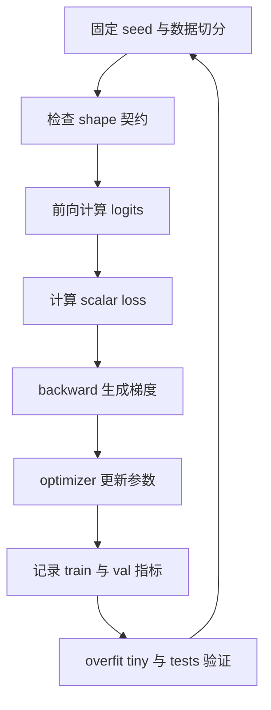

# mermaid-01 Mermaid render prompt

- Article: `lessons/01_pytorch_training_intuition.md`
- Source: `lessons/assets/01_pytorch_training_intuition/mermaid-01.mmd`
- Target: `lessons/assets/01_pytorch_training_intuition/mermaid-01.png`

## Prompt

展示本章最小训练系统如何从数据、前向、反向到验证实验形成可复现闭环。

## Mermaid Source

