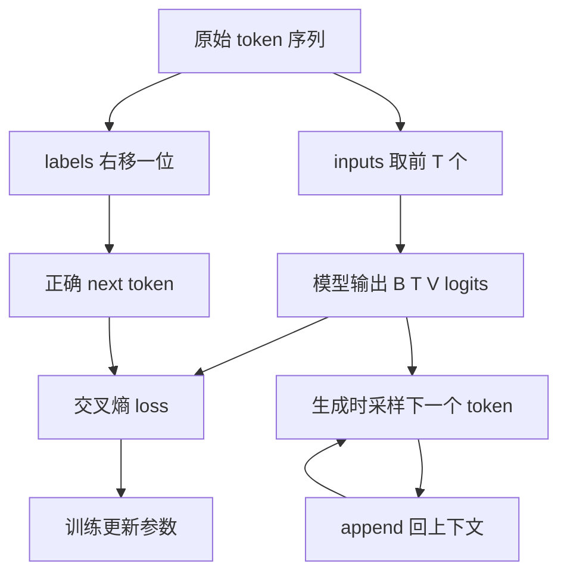

# mermaid-01 Mermaid render prompt

- Article: `lessons/02_language_modeling.md`
- Source: `lessons/assets/02_language_modeling/mermaid-01.mmd`
- Target: `lessons/assets/02_language_modeling/mermaid-01.png`

## Prompt

说明语言模型如何把整句续写拆成右移监督、交叉熵训练和自回归生成。

## Mermaid Source

